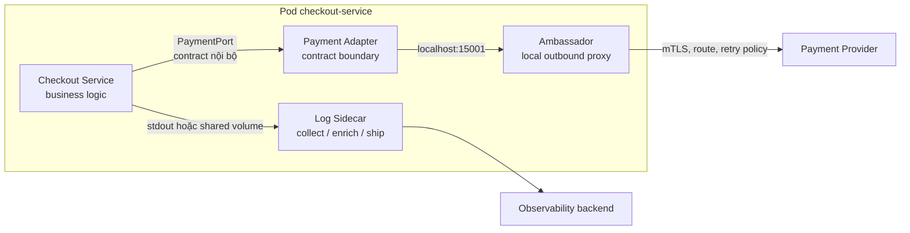
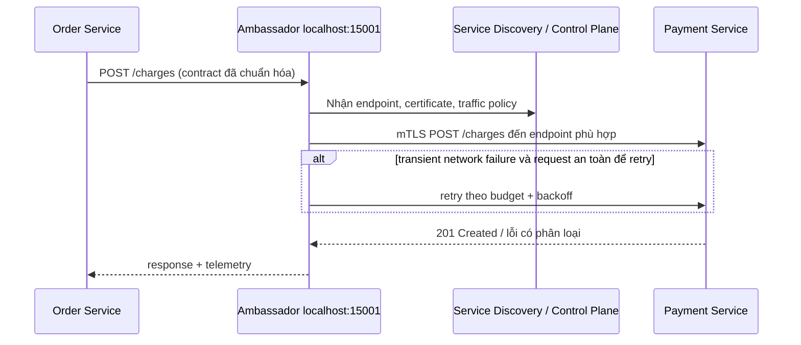
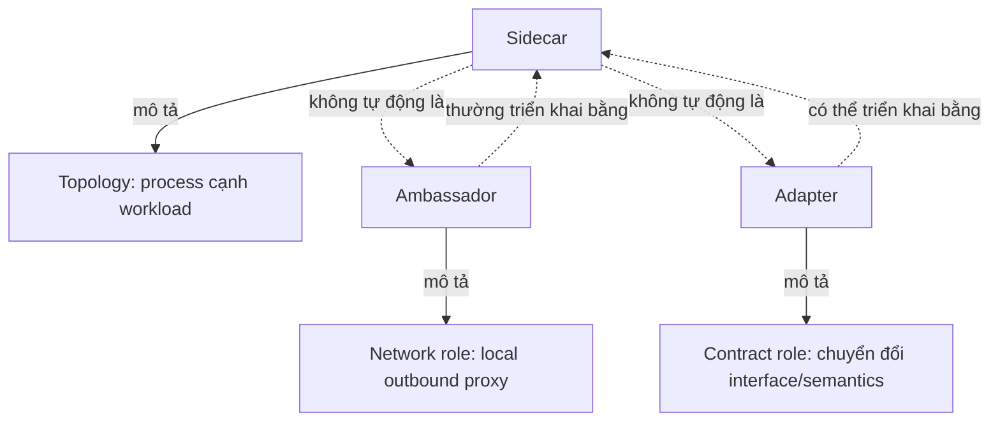
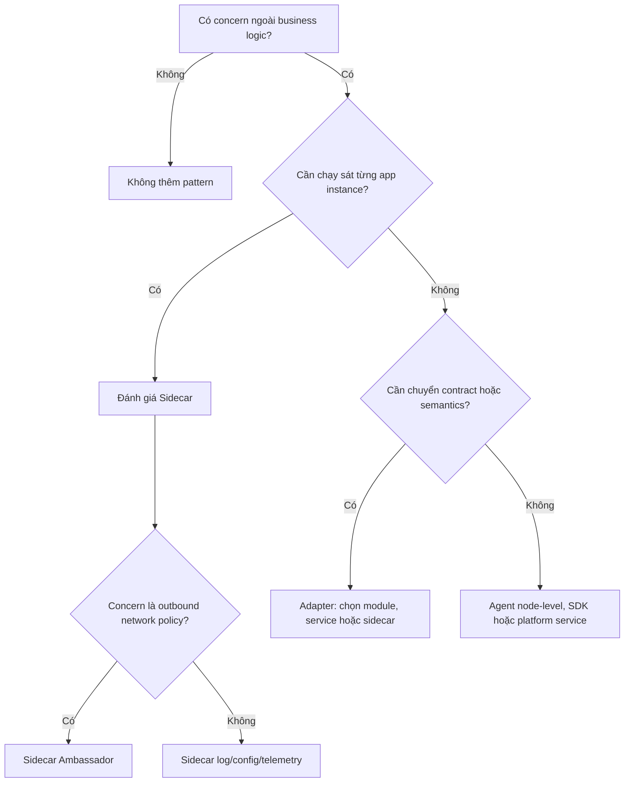

# Structural Patterns trong Microservice — Sidecar, Ambassador và Adapter

## Mục lục

- [1. Mục tiêu và phạm vi](#1-mục-tiêu-và-phạm-vi)
  - [1.1. Structural Pattern giải quyết vấn đề gì?](#11-structural-pattern-giải-quyết-vấn-đề-gì)
  - [1.2. Ba ranh giới cần phân biệt](#12-ba-ranh-giới-cần-phân-biệt)
- [2. Bức tranh tổng quan](#2-bức-tranh-tổng-quan)
  - [2.1. Vị trí của ba pattern](#21-vị-trí-của-ba-pattern)
  - [2.2. Từ vấn đề đến lựa chọn](#22-từ-vấn-đề-đến-lựa-chọn)
- [3. Sidecar Pattern](#3-sidecar-pattern)
  - [3.1. Định nghĩa và cơ chế](#31-định-nghĩa-và-cơ-chế)
  - [3.2. Các use case phù hợp](#32-các-use-case-phù-hợp)
  - [3.3. Ví dụ: log shipping cho Order Service](#33-ví-dụ-log-shipping-cho-order-service)
  - [3.4. Khi nên và không nên dùng](#34-khi-nên-và-không-nên-dùng)
  - [3.5. Trade-off và vận hành](#35-trade-off-và-vận-hành)
- [4. Ambassador Pattern](#4-ambassador-pattern)
  - [4.1. Định nghĩa và luồng outbound](#41-định-nghĩa-và-luồng-outbound)
  - [4.2. Trách nhiệm nên đặt ở Ambassador](#42-trách-nhiệm-nên-đặt-ở-ambassador)
  - [4.3. Ví dụ: Payment client qua local proxy](#43-ví-dụ-payment-client-qua-local-proxy)
  - [4.4. Khi nên và không nên dùng](#44-khi-nên-và-không-nên-dùng)
  - [4.5. Trade-off và vận hành](#45-trade-off-và-vận-hành)
- [5. Adapter Pattern](#5-adapter-pattern)
  - [5.1. Định nghĩa: chuyển đổi contract](#51-định-nghĩa-chuyển-đổi-contract)
  - [5.2. Các hình thức triển khai](#52-các-hình-thức-triển-khai)
  - [5.3. Ví dụ: chống ăn mòn contract Payment](#53-ví-dụ-chống-ăn-mòn-contract-payment)
  - [5.4. Khi nên và không nên dùng](#54-khi-nên-và-không-nên-dùng)
  - [5.5. Trade-off và vận hành](#55-trade-off-và-vận-hành)
- [6. Quan hệ và khác biệt](#6-quan-hệ-và-khác-biệt)
  - [6.1. Topology, proxy và contract](#61-topology-proxy-và-contract)
  - [6.2. Bảng so sánh](#62-bảng-so-sánh)
  - [6.3. Các cách kết hợp đúng](#63-các-cách-kết-hợp-đúng)
- [7. Khung ra quyết định](#7-khung-ra-quyết-định)
  - [7.1. Decision tree](#71-decision-tree)
  - [7.2. Ma trận chọn lựa](#72-ma-trận-chọn-lựa)
  - [7.3. Đánh giá trước khi chuẩn hóa](#73-đánh-giá-trước-khi-chuẩn-hóa)
- [8. Lỗi thường gặp và cách tránh](#8-lỗi-thường-gặp-và-cách-tránh)
  - [8.1. Lỗi thiết kế](#81-lỗi-thiết-kế)
  - [8.2. Lỗi Kubernetes và mạng](#82-lỗi-kubernetes-và-mạng)
  - [8.3. Lỗi độ tin cậy, bảo mật và quan sát](#83-lỗi-độ-tin-cậy-bảo-mật-và-quan-sát)
- [9. Checklist triển khai](#9-checklist-triển-khai)
  - [Phạm vi và thiết kế](#phạm-vi-và-thiết-kế)
  - [Kubernetes và vận hành](#kubernetes-và-vận-hành)
  - [Chất lượng, bảo mật và quan sát](#chất-lượng-bảo-mật-và-quan-sát)
- [10. Tổng kết](#10-tổng-kết)
- [11. Liên kết liên quan](#11-liên-kết-liên-quan)

---

## 1. Mục tiêu và phạm vi

**Structural Patterns** là các mẫu tổ chức thành phần quanh một microservice để thêm hoặc cô lập trách nhiệm kỹ thuật mà không làm loãng business logic. Tài liệu này tập trung vào ba pattern thường xuất hiện cùng nhau nhưng trả lời ba câu hỏi khác nhau:

- **Sidecar**: *đặt thành phần hỗ trợ ở đâu và cùng đơn vị triển khai nào?*
- **Ambassador**: *ai đại diện service xử lý lời gọi ra ngoài?*
- **Adapter**: *ai bảo vệ hoặc chuyển đổi contract giữa hai mô hình không tương thích?*

Chúng không thay thế ranh giới domain, API Gateway hay Service Mesh. Hãy xác định [Bounded Context](02-single-responsibility-bounded-context.md) trước; Structural Patterns chỉ là cách tổ chức các concern đã được chọn.

### 1.1. Structural Pattern giải quyết vấn đề gì?

Một service bán hàng nên biết cách tạo đơn, nhưng không nhất thiết phải biết cách renew chứng chỉ, định dạng log cho từng nền tảng, retry TCP hay ánh xạ hàng trăm field của nhà cung cấp thanh toán. Nếu từng service tự nhúng các concern này, code bị lặp, policy không đồng nhất và việc nâng cấp rất đắt.

Structural Patterns tạo một **điểm đặt trách nhiệm** rõ ràng:

| Vấn đề | Hậu quả nếu nhúng vào mọi app | Pattern có thể hỗ trợ |
|---|---|---|
| Thu thập log, cấp chứng chỉ, đồng bộ config | Lặp thư viện/agent theo ngôn ngữ; release hàng loạt | Sidecar |
| mTLS, retry, service discovery khi gọi downstream | Mỗi client cấu hình một kiểu; khó đổi hạ tầng | Ambassador |
| API vendor dùng schema/protocol khác domain nội bộ | Vendor model lan vào domain; lock-in | Adapter |

> Structural Pattern không phải lý do để bỏ qua thiết kế application. Những quyết định business như idempotency của `POST /payments`, timeout theo SLA hay compensating transaction vẫn phải do domain/service sở hữu; xem [Resilience Patterns](10-resilience-patterns.md) và [Data Management](09-data-management.md).

### 1.2. Ba ranh giới cần phân biệt

| Ranh giới | Câu hỏi | Ví dụ |
|---|---|---|
| **Deployment boundary** | Thành phần nào cùng được schedule/scale với app? | Container log agent trong cùng Pod |
| **Network boundary** | Request đi qua proxy nào trước khi đến downstream? | `localhost:15001` chuyển tiếp đến Payment API |
| **Contract boundary** | Tên, kiểu dữ liệu, protocol và semantics nào được chuyển đổi? | `OrderPayment` nội bộ thành payload của Stripe |

Sidecar chủ yếu nói về deployment boundary; Ambassador nói về network boundary; Adapter nói về contract boundary. Một component có thể thuộc nhiều nhóm, nhưng đừng đánh đồng tên gọi với trách nhiệm.

## 2. Bức tranh tổng quan

### 2.1. Vị trí của ba pattern



Trong sơ đồ này, Log Sidecar là Sidecar thuần túy. Ambassador được triển khai *dưới dạng* sidecar. Payment Adapter có thể nằm trong code Checkout Service, trong một process riêng, hoặc trong sidecar; việc nó là Adapter đến từ nhiệm vụ chuyển đổi contract, không phải vị trí chạy.

### 2.2. Từ vấn đề đến lựa chọn

| Dấu hiệu | Câu hỏi chẩn đoán | Hướng ưu tiên |
|---|---|---|
| Cần agent cục bộ đọc file/socket/localhost của app | Agent có cần sống sát từng instance không? | Sidecar |
| Nhiều app cần cùng policy cho **outbound** call | App có thể gọi một endpoint cục bộ thay vì downstream trực tiếp không? | Ambassador |
| Downstream đổi schema, protocol hoặc semantics | Domain model có đang lộ chi tiết vendor/legacy không? | Adapter |
| Chỉ cần route traffic từ Internet vào cluster | Đây là ingress/API edge hay outbound client proxy? | Xem [API Gateway](07-api-gateway.md), không mặc định dùng Ambassador |
| Chỉ có một process và concern rất nhẹ | Một thư viện/SDK có đơn giản, quan sát được, ít duplicate hơn không? | Có thể không cần pattern |

## 3. Sidecar Pattern

### 3.1. Định nghĩa và cơ chế

**Sidecar Pattern** đặt một process hoặc container phụ cạnh application chính trong cùng một đơn vị triển khai gần nhất. Trong Kubernetes, đơn vị này thường là **Pod**: các container chia sẻ network namespace (gọi nhau bằng `localhost`), có thể chia sẻ volume, và được schedule/terminate cùng Pod.

```text
┌──────────────── Kubernetes Pod ────────────────┐
│ IP: 10.42.1.18                                  │
│                                                  │
│  ┌─────────────────┐   shared volume             │
│  │ Catalog Service │──── /var/log/catalog ──┐    │
│  │ :8080           │                         │    │
│  └─────────────────┘                         ▼    │
│                                      ┌───────────┐ │
│ localhost:4317 ◀────────────────────│ OTel Agent│ │
│                                      │ / Log ship│ │
│                                      └───────────┘ │
└──────────────────────────────────────────────────┘
          │                              │
          └──────── application traffic ─┴──► backend
```

Điểm quan trọng:

1. Sidecar **không phải** một loại container đặc biệt; đó là vai trò kiến trúc của container phụ.
2. Cùng Pod không có nghĩa là được nâng cấp hoàn toàn độc lập: thay đổi image/Pod template thường tạo Pod mới, kéo theo app và sidecar cùng được thay thế trong rollout.
3. Sidecar phù hợp với concern cần tính **cục bộ theo instance**: truy cập localhost, shared file/socket, hoặc identity gắn với workload.
4. Sidecar không phải cách duy nhất để thu thập telemetry. Agent cấp node, DaemonSet hoặc OpenTelemetry Collector tập trung có thể rẻ hơn khi không cần cục bộ theo Pod.

### 3.2. Các use case phù hợp

| Use case | Sidecar làm gì | Tại sao cần ở cạnh app? | Ví dụ |
|---|---|---|---|
| Log shipping | Đọc log file, thêm metadata Pod, gửi về backend | Cần đọc volume/log cục bộ | Fluent Bit/Fluentd |
| Telemetry collector | Nhận OTLP qua localhost, batch/filter/export traces | Giảm cấu hình endpoint trong app | OpenTelemetry Collector |
| Secret/config agent | Lấy secret, render file, renew token/cert | App đọc file cục bộ, secret không bake vào image | Vault Agent |
| Service mesh data plane | Intercept/forward traffic, mTLS, metrics | Mọi request của Pod đi qua proxy cục bộ | Envoy, Linkerd proxy |
| File/content sync | Đồng bộ cấu hình hoặc artifact vào shared volume | App cần file luôn sẵn bên cạnh | config sync agent |

**Use case thực tế — log của Catalog Service:** application ghi JSON vào `stdout` hoặc một file chia sẻ; sidecar thêm `service.name`, `pod`, `namespace`, lọc PII và gửi về Loki/Elasticsearch. Application không phải biết URL hay credential của backend logging. Phần định dạng structured log và trace context vẫn cần tuân theo [Observability & Evolvability](11-observability-evolvability.md).

### 3.3. Ví dụ: log shipping cho Order Service

Manifest minh họa dưới đây dùng shared volume để cho thấy rõ giao tiếp. Với Kubernetes production, hãy cân nhắc log `stdout` + node-level collector trước để tránh nhân bản agent trên từng Pod.

```yaml
apiVersion: apps/v1
kind: Deployment
metadata:
  name: order-service
spec:
  replicas: 3
  selector:
    matchLabels:
      app: order-service
  template:
    metadata:
      labels:
        app: order-service
    spec:
      containers:
        - name: order-service
          image: registry.example.com/order-service:1.4.0
          env:
            - name: LOG_PATH
              value: /var/log/app/orders.json
          volumeMounts:
            - name: app-logs
              mountPath: /var/log/app
          resources:
            requests: { cpu: "250m", memory: "256Mi" }
            limits: { cpu: "500m", memory: "512Mi" }
        - name: log-sidecar
          image: cr.fluentbit.io/fluent/fluent-bit:3.0
          args: ["-i", "tail", "-p", "path=/var/log/app/orders.json", "-o", "stdout"]
          volumeMounts:
            - name: app-logs
              mountPath: /var/log/app
              readOnly: true
          resources:
            requests: { cpu: "50m", memory: "64Mi" }
            limits: { cpu: "100m", memory: "128Mi" }
      volumes:
        - name: app-logs
          emptyDir: {}
```

**Chuỗi khởi động và dừng cần được thiết kế:** app không nên nhận traffic trước khi dependency cục bộ bắt buộc sẵn sàng; sidecar cần flush buffer khi Pod nhận `SIGTERM`; `terminationGracePeriodSeconds` phải đủ cho cả hai. Dùng `readinessProbe` ở app và `preStop`/drain phù hợp, theo cơ chế Pod và probes trong [Orchestration](13-orchestration.md).

### 3.4. Khi nên và không nên dùng

| Nên dùng Sidecar khi | Không nên dùng Sidecar khi |
|---|---|
| Chức năng phải gần từng instance để dùng localhost, shared volume hoặc workload identity | Agent chỉ làm việc cấp node/cluster; DaemonSet hoặc Collector tập trung làm được |
| Muốn tách code hỗ trợ khỏi polyglot business services | Chỉ có một hàm nhỏ, SDK chuẩn và chi phí process mới lớn hơn lợi ích |
| Cùng policy/tool cần được tái sử dụng cho nhiều service | Số Pod rất lớn, tổng CPU/RAM/connection của sidecar không chấp nhận được |
| Cần kiểm soát traffic ở data plane cục bộ | Team chưa có năng lực debug multi-container, resource và lifecycle |

### 3.5. Trade-off và vận hành

| Lợi ích | Chi phí/rủi ro | Biện pháp giảm thiểu |
|---|---|---|
| Tách cross-cutting concern khỏi business code | Mỗi replica thêm CPU, RAM, image pull và attack surface | Set requests/limits; đo tổng chi phí theo replica |
| Dùng được cho mọi ngôn ngữ | Pod và startup/debug phức tạp hơn | Runbook có lệnh xem log từng container; standardize manifest |
| Policy/config triển khai nhất quán | Sidecar lỗi có thể làm app không ready hoặc mất telemetry | Xác định sidecar bắt buộc hay best-effort; alert riêng |
| Giao tiếp localhost/volume đơn giản | Shared volume có rủi ro quyền ghi, đầy disk và race | Read-only mount, quota/rotation, ownership rõ ràng |

## 4. Ambassador Pattern

### 4.1. Định nghĩa và luồng outbound

**Ambassador Pattern** là một local proxy đại diện cho application khi application gọi **dịch vụ bên ngoài**. App gửi request đến một endpoint ổn định trên `localhost`; Ambassador chọn endpoint thật, áp dụng network policy và chuyển tiếp request. Vì Ambassador thường nằm cùng Pod/process host với client, nó hay là một **trường hợp chuyên biệt của Sidecar**.



Ambassador **không đồng nghĩa** với mọi reverse proxy. API Gateway/Ingress xử lý traffic **vào** hệ thống hoặc từ client bên ngoài; Ambassador là client-side/local proxy chủ yếu quản lý traffic **đi ra**. Một mesh sidecar có thể proxy cả inbound lẫn outbound, nhưng khi đóng vai đại diện outbound, nó thực hiện intent của Ambassador.

### 4.2. Trách nhiệm nên đặt ở Ambassador

Các trách nhiệm hạ tầng, áp dụng nhất quán cho nhiều caller, thường hợp lý ở Ambassador:

- mTLS, certificate rotation và xác thực workload-to-workload.
- Service discovery, load balancing, connection pooling và traffic shifting.
- Propagate trace context, metrics về network, access log và policy mạng.
- Timeout/connection timeout ở tầng transport; retry với giới hạn rõ ràng cho lỗi transient và operation idempotent.
- Routing theo version, locality hoặc canary policy.

Không nên chuyển toàn bộ resilience vào proxy. Ambassador không biết đầy đủ semantics nghiệp vụ: `POST /charges` có thể gây charge kép nếu retry sai. Service vẫn phải đặt deadline end-to-end, idempotency key, fallback hợp lý và phân loại lỗi; xem [Resilience Patterns](10-resilience-patterns.md).

### 4.3. Ví dụ: Payment client qua local proxy

Checkout Service cũ chỉ gọi `http://localhost:15001`. Ambassador Envoy xử lý TLS và endpoint Payment Service. Một **Payment Adapter** trong Checkout Service bảo đảm payload vẫn là domain contract, không phải Envoy hay vendor API.

```yaml
# Trích cấu hình Ambassador minh họa, không phải manifest hoàn chỉnh
static_resources:
  clusters:
    - name: payment-service
      type: STRICT_DNS
      connect_timeout: 500ms
      load_assignment:
        cluster_name: payment-service
        endpoints:
          - lb_endpoints:
              - endpoint:
                  address:
                    socket_address:
                      address: payment-service.default.svc.cluster.local
                      port_value: 8443
      transport_socket:
        name: envoy.transport_sockets.tls
      circuit_breakers:
        thresholds:
          - priority: DEFAULT
            max_connections: 100
            max_pending_requests: 50
```

**Use case:** trong đợt flash sale, Payment Service có nhiều replicas và certificate quay vòng. Checkout không phải cập nhật endpoint/certificate mỗi lần; Ambassador nhận config mới từ control plane, cân bằng tải và ghi latency theo upstream. Nếu deadline còn 300 ms thì proxy không được tự retry thêm 3 lần làm vượt SLA; retry budget phải được đo và cấu hình thống nhất.

### 4.4. Khi nên và không nên dùng

| Nên dùng Ambassador khi | Không nên dùng Ambassador khi |
|---|---|
| Nhiều service cần chung mTLS, discovery, telemetry, routing hoặc policy outbound | Hệ thống nhỏ, vài service; DNS + client library đã đáp ứng và team không vận hành proxy |
| Muốn di chuyển cross-cutting network policy khỏi code polyglot/legacy | Proxy chỉ che giấu một API contract sai; cần Adapter hoặc sửa contract trước |
| Cần canary/traffic split ở service-to-service layer | Call yêu cầu nghiệp vụ phức tạp như charge/refund; proxy không thể thay domain orchestration |
| Có platform/control plane và SLO cho data plane | Không có inventory endpoint, dashboard, alert hay quy trình debug proxy |

### 4.5. Trade-off và vận hành

| Lợi ích | Chi phí/rủi ro | Biện pháp giảm thiểu |
|---|---|---|
| Chuẩn hóa policy mạng, giảm SDK duplication | Thêm hop, CPU/memory và tail latency | Benchmark P95/P99; resource limit; connection reuse |
| Legacy app dùng mTLS/routing mà ít đổi code | Proxy/config trở thành điểm lỗi mới | Readiness/drain, config validation, canary proxy config |
| Telemetry L7 nhất quán | Debug cần tương quan app log, proxy log và trace | Propagate `traceparent`; dashboard tách downstream/proxy/app |
| Traffic shift/zero-trust tập trung | Retry/timeout ở nhiều tầng gây retry storm | Ownership matrix; một retry policy/budget; deadline propagation |

## 5. Adapter Pattern

### 5.1. Định nghĩa: chuyển đổi contract

**Adapter Pattern** chuyển đổi một interface, protocol, schema hoặc semantic contract thành contract mà caller mong đợi. Nó bảo vệ mô hình nội bộ khỏi cách biểu diễn của legacy system, vendor hay một service khác. Khác Sidecar, Adapter là **pattern về interface/contract**, không bắt buộc là container cạnh app.

```text
Domain của Checkout                  Hệ thống ngoài
┌──────────────────────┐             ┌──────────────────────────┐
│ PaymentPort          │             │ Legacy Bank SOAP         │
│ authorize(command)   │  Adapter    │ submitTransaction(xml)   │
│ → PaymentResult      │────────────►│ status: A / D / R        │
└──────────────────────┘             └──────────────────────────┘
       Không để XML, mã A/D/R, tên field vendor
       lan vào Order Aggregate hoặc API nội bộ.
```

Adapter có thể thực hiện:

- **Protocol adaptation**: REST ↔ gRPC, SOAP ↔ REST, message schema cũ ↔ mới.
- **Data/schema mapping**: đổi tên field, đơn vị tiền tệ, cấu trúc lồng nhau, enum.
- **Semantic adaptation**: biến trạng thái vendor thành state domain; xử lý pagination, error mapping, idempotency key.
- **Anti-Corruption Layer (ACL)**: một Adapter giàu logic bảo vệ Bounded Context khỏi mô hình bên ngoài.

Chuyển đổi semantic thường quan trọng hơn đổi JSON sang XML. Nếu `approved` của vendor có nghĩa là “đã ủy quyền nhưng chưa capture”, Adapter phải trả về trạng thái domain chính xác thay vì đơn giản map thành `PAID`.

### 5.2. Các hình thức triển khai

| Hình thức | Khi phù hợp | Ưu điểm | Hạn chế |
|---|---|---|---|
| In-process module/library | Một service sở hữu integration và mapping nhỏ | Ít hop, transaction/context rõ | Cần release app để nâng cấp mapping |
| Dedicated integration service | Nhiều service chia sẻ một vendor contract, cần scale/isolate riêng | Centralize vendor client, credential, rate limit | Có thêm network hop; dễ thành shared bottleneck |
| Sidecar Adapter | App legacy cần protocol local hoặc exporter cục bộ | Không sửa app nhiều; gần instance | Nhân bản mỗi Pod; không phù hợp logic domain lớn |
| API Gateway adapter | Chuyển client-facing API ở edge | Che giấu backend composition khỏi client | Không đặt domain mapping của service nội bộ vào gateway |

Tên triển khai không quyết định pattern. `JMX exporter` cạnh legacy app vừa là Sidecar (cùng Pod), vừa là Adapter (JMX thành Prometheus metrics). Một dedicated service chuyển request HTTP ra vendor SOAP là Adapter, nhưng không là Sidecar.

### 5.3. Ví dụ: chống ăn mòn contract Payment

Checkout domain định nghĩa interface ổn định. Adapter duy nhất biết Stripe/Bank provider có field nào và status nào.

```typescript
// Contract của Checkout domain: không lộ vendor SDK hoặc status vendor.
type AuthorizePayment = {
  orderId: string;
  amountMinor: number;
  currency: "VND" | "USD";
  idempotencyKey: string;
};

type PaymentResult =
  | { status: "AUTHORIZED"; authorizationId: string }
  | { status: "DECLINED"; reason: "INSUFFICIENT_FUNDS" | "RISK_REJECTED" }
  | { status: "RETRYABLE_FAILURE"; retryAfterMs?: number };

interface PaymentPort {
  authorize(command: AuthorizePayment): Promise<PaymentResult>;
}

// Adapter: đây là nơi mapping mã/vendor payload và transport error.
class BankSoapPaymentAdapter implements PaymentPort {
  async authorize(command: AuthorizePayment): Promise<PaymentResult> {
    const response = await bankSoapClient.submitTransaction({
      merchantReference: command.orderId,
      amount: command.amountMinor,
      currencyCode: command.currency,
      requestId: command.idempotencyKey,
    });

    if (response.code === "A") {
      return { status: "AUTHORIZED", authorizationId: response.authRef };
    }
    if (response.code === "D") {
      return { status: "DECLINED", reason: "INSUFFICIENT_FUNDS" };
    }
    return { status: "RETRYABLE_FAILURE", retryAfterMs: 1_000 };
  }
}
```

**Use case:** Bank SOAP thay field `authRef` bằng `authorizationReference`. Chỉ adapter và contract test với Bank cần đổi; checkout flow, Order aggregate và API consumer nội bộ vẫn dùng `PaymentResult`. Nếu cần thay vendor, triển khai `NewProviderPaymentAdapter` song song, route theo feature flag/canary, sau đó bỏ adapter cũ. Đây là một ví dụ thực tế của evolvability; xem [Observability & Evolvability](11-observability-evolvability.md).

### 5.4. Khi nên và không nên dùng

| Nên dùng Adapter khi | Không nên dùng Adapter khi |
|---|---|
| Hai contract không tương thích về protocol, schema **hoặc semantics** | Chỉ muốn đổi tên endpoint nội bộ mà không có boundary thật |
| Tích hợp vendor/legacy có mô hình khác domain | Adapter bị biến thành nơi chứa toàn bộ workflow/business rule của nhiều domain |
| Muốn migration/replacement provider giảm blast radius | Consumer và provider cùng team, cùng contract, sửa trực tiếp đơn giản hơn |
| Cần cô lập credential/error model đặc thù của external system | Dùng Adapter để che lỗi contract lặp lại thay vì version/đàm phán contract |

### 5.5. Trade-off và vận hành

| Lợi ích | Chi phí/rủi ro | Biện pháp giảm thiểu |
|---|---|---|
| Domain model sạch, giảm vendor lock-in | Mapping có thể mất data hoặc làm sai semantics | Contract test, golden payload, mapping table và review domain |
| Thay provider ít ảnh hưởng caller | Adapter thành bottleneck/điểm lỗi nếu centralize quá mức | Scale độc lập, cache/rate limit phù hợp, ownership rõ |
| Chuẩn hóa lỗi và observability integration | Thêm lớp làm debugging khó nếu error bị nuốt | Preserve cause/safe error code, log mapping version, trace attributes |
| Hỗ trợ migration từng bước | Dual-write/dual-read khi chuyển đổi có rủi ro consistency | Không dual-write payment; dùng idempotency, reconciliation và rollout có kiểm soát |

## 6. Quan hệ và khác biệt

### 6.1. Topology, proxy và contract



Kết luận ngắn:

- **Mọi Ambassador chạy cạnh app có thể là Sidecar**, nhưng Sidecar log shipper không phải Ambassador.
- **Adapter có thể là Sidecar**, nhưng Adapter cũng có thể là thư viện hoặc service độc lập.
- **Ambassador và Adapter có thể nối tiếp nhau**: Adapter quyết định payload/semantic hợp lệ, Ambassador đưa request đó qua mạng an toàn/chịu lỗi.
- Không có quan hệ kế thừa cứng trong runtime; đây là các “intent” để phân chia ownership và kiểm soát trade-off.

### 6.2. Bảng so sánh

| Tiêu chí | Sidecar | Ambassador | Adapter |
|---|---|---|---|
| Câu hỏi chính | Đặt concern phụ ở đâu? | Ai đại diện outbound call? | Ai chuyển contract? |
| Bản chất | Deployment/topology pattern | Client-side proxy pattern | Interface/contract pattern |
| Vị trí điển hình | Cùng Pod/host với app | Localhost, thường cùng Pod | In-process, sidecar, gateway hoặc service riêng |
| Hướng traffic | Có thể không có traffic; inbound/outbound tùy vai trò | Chủ yếu outbound | Bất kỳ hướng nào có contract boundary |
| Nhiệm vụ mẫu | Log, secrets, telemetry, mesh proxy | mTLS, discovery, routing, connection policy | SOAP-REST, schema/error/state mapping |
| Biết business semantics? | Thường không | Hạn chế; không nên biết sâu | Có, ở mức cần để bảo vệ contract |
| Đơn vị scale | Thường scale cùng app | Thường scale cùng client app | Tùy hình thức triển khai |
| Ví dụ | Vault Agent, OTel Collector | Envoy client proxy | Payment ACL, JMX-to-Prometheus exporter |

### 6.3. Các cách kết hợp đúng

| Tình huống | Kết hợp | Lý do |
|---|---|---|
| Legacy app phát JMX metrics | JMX exporter = Sidecar + Adapter | Cạnh app để đọc JMX; chuyển format thành Prometheus |
| Mesh trong Kubernetes | Envoy = Sidecar + Ambassador (cho egress) | Cùng Pod; outbound mTLS/routing qua local proxy |
| Checkout gọi bank SOAP | In-process Payment Adapter + Ambassador Sidecar | Adapter bảo vệ domain; Ambassador xử lý network/TLS/discovery |
| Nhiều team gọi một CRM vendor | Dedicated CRM Adapter service, có thể dùng Ambassador cho egress | Một vendor boundary dùng chung; egress policy vẫn tách riêng |

## 7. Khung ra quyết định

### 7.1. Decision tree



### 7.2. Ma trận chọn lựa

Chấm mỗi tiêu chí theo **thấp/trung bình/cao** trước khi đầu tư. Không có pattern nào “cao” ở mọi cột.

| Tiêu chí | Sidecar | Ambassador | Adapter |
|---|---:|---:|---:|
| Cần locality với workload | Cao | Cao | Thấp đến cao |
| Cần chuẩn hóa egress networking | Trung bình | Cao | Thấp |
| Cần bảo vệ domain khỏi external model | Thấp | Thấp | Cao |
| Thêm resource mỗi replica | Cao | Cao | Tùy triển khai |
| Có thể tái sử dụng xuyên ngôn ngữ | Cao | Cao | Trung bình |
| Rủi ro semantic lỗi | Thấp | Trung bình | Cao |
| Cần platform vận hành trưởng thành | Trung bình | Cao | Trung bình |

### 7.3. Đánh giá trước khi chuẩn hóa

Trước khi inject sidecar vào toàn cluster hoặc bắt mọi call qua proxy, trả lời được các câu hỏi sau:

1. **Ownership:** Team platform hay team service sở hữu image, config, CVE, dashboard và on-call của component?
2. **Failure mode:** Component down, slow, hết buffer hoặc config lỗi thì app bị block, degrade hay vẫn phục vụ?
3. **SLO/resource:** CPU, memory, connection, egress, P99 tăng bao nhiêu khi nhân với số replica tối đa?
4. **Security:** credential, mTLS identity, shared volume và network policy theo least privilege chưa? Xem [Security](15-security.md) và [Configuration & Secrets Management](16-configuration-secrets-management.md).
5. **Observability:** Có phân biệt latency/lỗi của app, adapter và proxy trên cùng trace không?
6. **Exit strategy:** Khi không còn vendor/mesh/agent, có thể tắt hoặc bỏ component mà không đổi domain contract không?

## 8. Lỗi thường gặp và cách tránh

### 8.1. Lỗi thiết kế

| Lỗi | Hậu quả | Cách tránh |
|---|---|---|
| Gọi mọi container phụ là Sidecar rồi bỏ qua intent | Không rõ ai sở hữu network policy hay mapping contract | Ghi rõ component là Sidecar/Ambassador/Adapter theo trách nhiệm |
| Đưa business orchestration vào Envoy/proxy | Policy khó test, rollback; proxy thành “business monolith” | Giữ proxy ở transport; workflow/Saga ở application domain |
| Adapter chỉ đổi field mà không map semantics | `AUTHORIZED` bị hiểu thành `PAID`, gây fulfillment sai | Tạo ubiquitous language và bảng map state/error với domain expert |
| Central adapter cho mọi integration | Service trung tâm quá tải, ownership mơ hồ | Chỉ centralize external boundary thật sự chung; tách theo Bounded Context |
| Chọn sidecar để “không sửa code” vĩnh viễn | Technical debt và local protocol kỳ lạ tồn tại lâu | Đặt mốc đánh giá/migration cho legacy integration |

### 8.2. Lỗi Kubernetes và mạng

| Lỗi | Hậu quả | Cách tránh |
|---|---|---|
| Quên requests/limits cho sidecar | Scheduler sai, OOM/throttling khi scale | Tính resource của **tổng Pod**, set request/limit cho từng container |
| App khởi động trước proxy/secret bắt buộc | Connection refused, restart loop, nhận traffic sớm | Startup/readiness probe, init container khi phù hợp, graceful retry ngắn |
| Không drain proxy khi Pod terminate | Mất request đang xử lý | PreStop, termination grace period, remove endpoint trước khi shutdown |
| Redirect traffic nhưng không loại trừ health probe/control plane | Probe hoặc control traffic bị loop/blocked | Thiết kế port exclusion và test startup/liveness/readiness thực tế |
| Sidecar shared volume ghi quyền quá rộng | Leak/sửa log hoặc secret giữa containers | Read-only mount, UID/GID, `securityContext`, không dùng volume chung cho secret không cần thiết |

### 8.3. Lỗi độ tin cậy, bảo mật và quan sát

| Lỗi | Hậu quả | Cách tránh |
|---|---|---|
| Retry ở app, Ambassador và gateway cùng lúc | Retry storm, charge/command lặp | Một policy ownership; deadline propagation, jitter, retry budget, idempotency |
| Tắt TLS giữa app và proxy rồi coi đó là end-to-end secure | Localhost/Pod boundary không thay thế mọi threat model | Xác định rõ trust boundary; mTLS proxy-to-proxy, workload identity, NetworkPolicy |
| Proxy/Adapter che lỗi thành HTTP 500 chung chung | Caller không biết retry hay decline; khó debug | Chuẩn hóa error taxonomy; giữ safe cause, status và trace ID |
| Không gắn trace/log với container và mapping version | Không biết lỗi do app hay config proxy/adapter | Dùng OpenTelemetry, structured log, `component.version`, `upstream.cluster` |
| Dùng `latest` cho image phụ | Rollout không tái lập, CVE/bug bất ngờ | Pin image digest/version; quét image và rollout canary |

## 9. Checklist triển khai

### Phạm vi và thiết kế

- [ ] Concern đã được phân loại: deployment (Sidecar), outbound proxy (Ambassador), hay contract (Adapter).
- [ ] Có lý do cụ thể để không dùng SDK, node-level agent hoặc service độc lập đơn giản hơn.
- [ ] Bounded Context và owner của external contract đã rõ.
- [ ] Adapter có mapping cho success, business rejection, retryable failure, timeout và unknown state.
- [ ] Operation có side effect đã có idempotency key; proxy không retry mù quáng.

### Kubernetes và vận hành

- [ ] Mỗi container có image version/digest, `securityContext`, CPU/memory requests và limits.
- [ ] Readiness/startup/liveness và trình tự shutdown đã được test với component cục bộ.
- [ ] Sidecar bắt buộc/best-effort được quyết định rõ; failure mode được document.
- [ ] Shared volume chỉ mount khi cần, quyền ghi tối thiểu và có giới hạn dung lượng/retention.
- [ ] Ambassador có deadline, connection timeout, circuit/retry budget và egress allowlist theo policy.
- [ ] Config proxy/adapter được validate, rollout canary và có rollback được kiểm thử.

### Chất lượng, bảo mật và quan sát

- [ ] Contract test/golden test bao phủ mapping Adapter và test tương thích với provider/consumer.
- [ ] Dashboard tách P50/P95/P99, error rate của app, adapter và upstream/proxy.
- [ ] Log structured không chứa secret/PII; trace context đi qua Adapter và Ambassador.
- [ ] Alert có owner cho sidecar crash, config rejection, buffer drop, upstream TLS/5xx và resource saturation.
- [ ] Runbook có các bước xem log từng container, kiểm tra endpoint local và rollback config/image.

## 10. Tổng kết

Structural Patterns hữu ích khi được chọn theo **vấn đề**, không theo tên công cụ:

- Dùng **Sidecar** để đặt concern phụ sát workload khi locality thực sự cần thiết.
- Dùng **Ambassador** để chuẩn hóa network concern của outbound call, nhưng không đưa semantic nghiệp vụ vào proxy.
- Dùng **Adapter** để giữ domain contract sạch trước legacy/vendor/protocol khác biệt; nó có thể nằm trong code, service hoặc sidecar.

Mô hình tốt thường ghép chúng có chủ đích: Adapter quyết định ý nghĩa dữ liệu, Ambassador vận chuyển an toàn, Sidecar quyết định cách component hỗ trợ sống cạnh app. Đo chi phí resource, kiểm thử failure mode và giữ owner rõ ràng trước khi nhân rộng toàn nền tảng.

## 11. Liên kết liên quan

- [02 — Single Responsibility & Bounded Context](02-single-responsibility-bounded-context.md)
- [06 — Inter-Service Communication](06-inter-service-communication.md)
- [07 — API Gateway](07-api-gateway.md)
- [09 — Data Management](09-data-management.md)
- [10 — Resilience Patterns](10-resilience-patterns.md)
- [11 — Observability & Evolvability](11-observability-evolvability.md)
- [12 — Containerization](12-containerization.md)
- [13 — Orchestration](13-orchestration.md)
- [15 — Security](15-security.md)
- [16 — Configuration & Secrets Management](16-configuration-secrets-management.md)
- [17 — Design Patterns tổng hợp](17-design-patterns.md)
