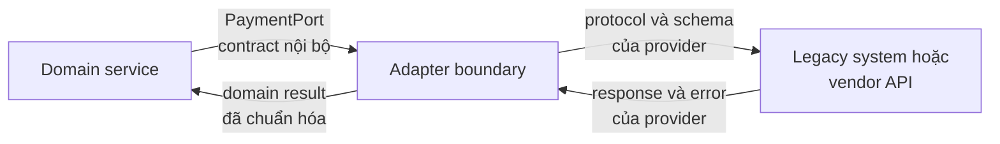
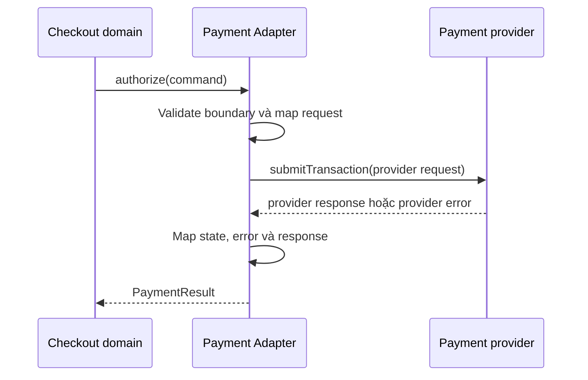
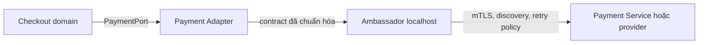

# Adapter Pattern trong Microservice

## Mục lục

- [1. Tổng quan](#1-tổng-quan)
  - [1.1. Adapter là gì?](#11-adapter-là-gì)
  - [1.2. Vấn đề Adapter giải quyết](#12-vấn-đề-adapter-giải-quyết)
- [2. Contract translation và adapter boundary](#2-contract-translation-và-adapter-boundary)
  - [2.1. Ranh giới contract](#21-ranh-giới-contract)
  - [2.2. Các lớp chuyển đổi](#22-các-lớp-chuyển-đổi)
  - [2.3. Anti-corruption Layer và compatibility](#23-anti-corruption-layer-và-compatibility)
- [3. Cơ chế hoạt động](#3-cơ-chế-hoạt-động)
  - [3.1. Luồng request và response](#31-luồng-request-và-response)
  - [3.2. Ownership tại boundary](#32-ownership-tại-boundary)
- [4. Các hình thức triển khai](#4-các-hình-thức-triển-khai)
  - [4.1. Module hoặc library trong process](#41-module-hoặc-library-trong-process)
  - [4.2. Integration service độc lập](#42-integration-service-độc-lập)
  - [4.3. Adapter dạng Sidecar hoặc API Gateway](#43-adapter-dạng-sidecar-hoặc-api-gateway)
- [5. Ví dụ Payment contract](#5-ví-dụ-payment-contract)
  - [5.1. Contract nội bộ](#51-contract-nội-bộ)
  - [5.2. Mapping sang provider](#52-mapping-sang-provider)
  - [5.3. Thay provider mà không lan vendor model](#53-thay-provider-mà-không-lan-vendor-model)
- [6. Phân biệt Adapter, Ambassador và Facade](#6-phân-biệt-adapter-ambassador-và-facade)
  - [6.1. Khác nhau ở câu hỏi thiết kế](#61-khác-nhau-ở-câu-hỏi-thiết-kế)
  - [6.2. Kết hợp trong cùng một luồng](#62-kết-hợp-trong-cùng-một-luồng)
- [7. Trade offs và tiêu chí lựa chọn](#7-trade-offs-và-tiêu-chí-lựa-chọn)
  - [7.1. Khi nên dùng](#71-khi-nên-dùng)
  - [7.2. Khi không nên dùng](#72-khi-không-nên-dùng)
- [8. Lỗi thường gặp](#8-lỗi-thường-gặp)
- [9. Vận hành và kiểm thử](#9-vận-hành-và-kiểm-thử)
  - [9.1. Contract test và golden payload](#91-contract-test-và-golden-payload)
  - [9.2. Error, timeout, retry và side effect](#92-error-timeout-retry-và-side-effect)
  - [9.3. Observability, rollout và decommission](#93-observability-rollout-và-decommission)
  - [9.4. Checklist](#94-checklist)
- [10. Liên kết liên quan](#10-liên-kết-liên-quan)

---

## 1. Tổng quan

### 1.1. Adapter là gì?

**Adapter Pattern** chuyển đổi một interface, protocol, schema hoặc semantic contract thành contract mà caller mong đợi. Adapter đặt một ranh giới rõ ràng giữa domain nội bộ và hệ thống có mô hình khác biệt như legacy system, vendor API hoặc một service bên ngoài.

Adapter không được xác định bởi việc nó chạy ở đâu. Nó có thể là một module trong application, một integration service độc lập hoặc một container cạnh application. Nó được gọi là Adapter vì trách nhiệm chính là **contract translation** — chuyển đổi contract — chứ không phải vì topology triển khai.

```text
Domain của Checkout                  Hệ thống bên ngoài
┌──────────────────────┐             ┌──────────────────────────┐
│ PaymentPort          │             │ Legacy Bank SOAP         │
│ authorize(command)   │  Adapter    │ submitTransaction(xml)   │
│ → PaymentResult      │────────────►│ status: A / D / R        │
└──────────────────────┘             └──────────────────────────┘
       Không để XML, mã A/D/R, tên field vendor
       lan vào Order Aggregate hoặc API nội bộ.
```

### 1.2. Vấn đề Adapter giải quyết

Nếu domain gọi trực tiếp SDK hoặc API của provider, model bên ngoài sẽ lan vào nhiều nơi. Một thay đổi nhỏ ở provider khi đó có thể buộc domain, application flow và consumer nội bộ cùng thay đổi.

Adapter gom phần khác biệt vào một boundary có thể kiểm thử. Caller chỉ phụ thuộc vào capability và kiểu dữ liệu của domain. Adapter duy nhất biết cách gọi provider, đọc response và chuyển lỗi về contract nội bộ.

| Khác biệt bên ngoài | Adapter xử lý | Caller nhận được |
|---|---|---|
| SOAP, REST, gRPC hoặc message schema khác nhau | Protocol adaptation | Interface/protocol nội bộ ổn định |
| Tên field, kiểu dữ liệu, đơn vị tiền tệ khác nhau | Schema và data mapping | Domain type thống nhất |
| Enum hoặc trạng thái có ý nghĩa khác nhau | Semantic mapping | Ubiquitous language của domain |
| Error model và pagination riêng của provider | Error/pagination translation | Error contract mà caller hiểu |

> Chuyển đổi semantic thường quan trọng hơn đổi JSON sang XML. Nếu `approved` của provider có nghĩa là “đã ủy quyền nhưng chưa capture”, Adapter phải trả về trạng thái domain chính xác thay vì map thẳng thành `PAID`.

## 2. Contract translation và adapter boundary

### 2.1. Ranh giới contract

Adapter boundary nên nằm ở phía sở hữu integration. Service hoặc Bounded Context sử dụng capability sẽ định nghĩa contract mà domain cần. Adapter ở phía đó sẽ dịch contract nội bộ sang request của external system và dịch response quay trở lại.



Một boundary tốt có hai đặc điểm:

- Caller không phải import SDK, enum, exception hoặc request object chỉ tồn tại trong external system.
- Provider có thể thay đổi protocol hoặc field mà không làm thay đổi domain contract, miễn là capability và semantics vẫn còn tương thích.

Adapter không phải nơi để giấu mọi logic của application. Quy tắc quyết định đơn hàng, workflow nhiều bước và compensating transaction vẫn thuộc application/domain layer. Adapter chỉ chứa logic cần thiết để giao tiếp và diễn giải external contract.

### 2.2. Các lớp chuyển đổi

Contract translation có thể diễn ra ở nhiều lớp. Hãy xử lý lớp nào thực sự khác biệt, thay vì sao chép toàn bộ model của provider vào domain.

| Lớp translation | Ví dụ | Câu hỏi cần trả lời |
|---|---|---|
| Interface | `authorize(command)` thành `submitTransaction(request)` | Caller cần capability nào? |
| Protocol | REST thành SOAP, HTTP thành gRPC | Request/response được vận chuyển theo giao thức nào? |
| Schema và field | `amountMinor` thành field amount của provider | Tên field, kiểu và cấu trúc nào cần đổi? |
| Value và enum | Mã `A / D / R` thành `AUTHORIZED / DECLINED / RETRYABLE_FAILURE` | Giá trị nào tương đương, giá trị nào không tương đương? |
| Semantics | “Authorized” khác “Captured” | External state có cùng ý nghĩa và cùng thời điểm không? |
| Error | HTTP/SDK exception thành error taxonomy nội bộ | Caller có biết lỗi nào là business rejection hay transient failure không? |

Adapter cũng là nơi phù hợp để giữ các chi tiết như pagination của provider, idempotency key theo format riêng hoặc quy đổi đơn vị. Những chi tiết này chỉ nên xuất hiện ở boundary, không lan vào `Order Aggregate` hay API nội bộ.

### 2.3. Anti-corruption Layer và compatibility

**Anti-corruption Layer (ACL)** là một lớp bảo vệ Bounded Context khỏi model và quy tắc của context bên ngoài. Trong nhiều integration, ACL chính là một Adapter có thêm mapping semantic, error và dữ liệu cần thiết.

```text
Hệ thống mới                         Hệ thống cũ
┌──────────────┐     ┌─────────────┐     ┌───────────────┐
│ Order Service│     │     ACL     │     │ Legacy ERP    │
│ (domain JSON)│────►│ Adapter     │────►│ XML / SOAP    │
│              │◄────│ JSON ↔ XML  │◄────│ model cũ      │
└──────────────┘     └─────────────┘     └───────────────┘
```

ACL bảo đảm Order Service không phải biết Legacy ERP dùng XML. Khi ERP đổi format, thay đổi tập trung ở ACL và các contract test liên quan. Domain vẫn dùng vocabulary của mình.

Compatibility ở đây không chỉ là “parse được payload”. Cần bảo đảm cả hai phía hiểu đúng:

- **Input/output compatibility:** Adapter nhận được contract nội bộ và trả về kiểu mà caller đã cam kết.
- **Schema compatibility:** Field bắt buộc, kiểu dữ liệu, enum và version của provider vẫn được xử lý đúng.
- **Semantic compatibility:** Trạng thái, amount, thời điểm và error code không bị diễn giải sai.
- **Operational compatibility:** Timeout, retry, idempotency và giới hạn rate của provider không phá vỡ flow nội bộ.

Khi provider đổi `authRef` thành `authorizationReference`, chỉ Adapter và contract test với provider cần thay đổi. `PaymentResult`, checkout flow và consumer nội bộ tiếp tục dùng contract cũ nếu semantics không đổi. Nếu semantics thay đổi, phải cập nhật contract domain một cách có chủ ý, không che thay đổi bằng một field mapping đơn giản.

## 3. Cơ chế hoạt động

### 3.1. Luồng request và response

Một Adapter thường có hai chiều dịch: request từ domain sang external contract, rồi response/error từ external contract về domain.



Các bước validation có thể gồm kiểm tra kiểu dữ liệu, currency được hỗ trợ hoặc field bắt buộc trước khi gọi provider. Adapter không nên tự quyết định policy nghiệp vụ như có cho phép order chuyển sang fulfillment hay không. Nó chỉ trả về kết quả đủ rõ để domain đưa ra quyết định.

### 3.2. Ownership tại boundary

Ranh giới cần có owner cụ thể. Team sở hữu Bounded Context hoặc integration nên chịu trách nhiệm cho contract nội bộ, mapping, credential/config liên quan, contract test và runbook. Platform có thể cung cấp transport hoặc proxy, nhưng không mặc nhiên sở hữu semantic của payment.

| Thành phần | Nên thuộc ownership nào? |
|---|---|
| `PaymentPort`, `PaymentResult` | Team sở hữu Checkout/Payment domain |
| SDK client và request mapping | Team sở hữu Adapter |
| mTLS, service discovery, connection policy | Platform hoặc Ambassador nếu có |
| Workflow charge, refund, compensation | Application/domain team |
| Provider contract test và reconciliation | Team sở hữu integration, phối hợp provider |

Phân chia này tránh việc đẩy business semantics vào một proxy hạ tầng hoặc biến một integration service dùng chung thành nơi chứa workflow của nhiều domain.

## 4. Các hình thức triển khai

Tên hình thức triển khai không quyết định pattern. Hãy chọn vị trí dựa trên ownership, số caller, yêu cầu scale và mức độ cần cô lập integration.

### 4.1. Module hoặc library trong process

Đây là lựa chọn mặc định khi một service sở hữu integration và mapping không quá lớn. `PaymentAdapter` gọi SDK hoặc HTTP client ngay trong application process.

| Ưu điểm | Hạn chế |
|---|---|
| Ít network hop và ít failure mode mới | Phải release application khi thay đổi mapping |
| Có transaction và context của caller | SDK/provider dependency nằm trong process |
| Dễ unit test với interface nội bộ | Không tự nhiên chia sẻ một client cho nhiều service |

Ví dụ, `BankSoapPaymentAdapter implements PaymentPort` phù hợp khi chỉ Checkout cần gọi Bank. Adapter vẫn cần che giấu SOAP client và trả về domain result, dù không có process riêng.

### 4.2. Integration service độc lập

Dùng một service riêng khi nhiều service cần cùng một vendor contract, hoặc integration cần scale, credential, rate limit và lifecycle độc lập. Service này nhận contract đã chuẩn hóa rồi làm nhiệm vụ gọi provider.

```text
Order Service ──┐
Refund Service ──┼──► Payment Integration Service ──► Bank / Vendor
Billing Service ─┘             Adapter boundary
```

Ưu điểm là có thể centralize vendor client và cô lập dependency. Chi phí là thêm network hop, thêm một điểm lỗi và nguy cơ trở thành shared bottleneck. Chỉ dùng service dùng chung khi external boundary thực sự chung và ownership vẫn rõ; không gom mọi integration vào một “central adapter” duy nhất.

### 4.3. Adapter dạng Sidecar hoặc API Gateway

**Sidecar Adapter** phù hợp khi application legacy cần một protocol local hoặc exporter cục bộ mà khó sửa application. Container Adapter sống cạnh workload, chuyển đổi interface rồi giao tiếp với hệ thống ngoài. Đổi lại, Adapter được nhân bản theo từng Pod và không phù hợp để chứa logic domain lớn.

Ví dụ, `JMX exporter` cạnh một legacy app vừa là **Sidecar** vì chạy cùng Pod, vừa là **Adapter** vì chuyển JMX thành Prometheus metrics. Một dedicated service chuyển HTTP request thành vendor SOAP là Adapter nhưng không phải Sidecar.

**API Gateway adapter** có thể chuyển đổi client-facing contract ở edge. Gateway có thể che giấu backend composition hoặc format mà client không cần biết. Không nên đặt mapping domain của một service nội bộ vào Gateway chỉ vì Gateway đã có sẵn; khi đó boundary của service sẽ bị mờ và ownership khó xác định. Xem thêm [API Gateway](../07-api-gateway.md).

## 5. Ví dụ Payment contract

### 5.1. Contract nội bộ

Checkout domain cần một contract ổn định. Contract này mô tả intent `authorize` và kết quả mà Checkout có thể hiểu, không mô tả SDK của Bank hay Stripe.

```typescript
// Contract của Checkout domain: không lộ vendor SDK hoặc status vendor.
type AuthorizePayment = {
  orderId: string;
  amountMinor: number;
  currency: "VND" | "USD";
  idempotencyKey: string;
};

type PaymentResult =
  | { status: "AUTHORIZED"; authorizationId: string }
  | { status: "DECLINED"; reason: "INSUFFICIENT_FUNDS" | "RISK_REJECTED" }
  | { status: "RETRYABLE_FAILURE"; retryAfterMs?: number };

interface PaymentPort {
  authorize(command: AuthorizePayment): Promise<PaymentResult>;
}
```

`PaymentPort` là adapter boundary ở phía domain. `amountMinor`, `currency` và `idempotencyKey` là những phần của contract nội bộ. Caller không cần biết provider dùng SOAP XML, REST JSON hay một SDK cụ thể.

### 5.2. Mapping sang provider

Adapter chuyển request nội bộ sang request của Bank và chuyển mã response về `PaymentResult`.

```typescript
// Adapter: đây là nơi mapping mã/provider payload và transport error.
class BankSoapPaymentAdapter implements PaymentPort {
  async authorize(command: AuthorizePayment): Promise<PaymentResult> {
    const response = await bankSoapClient.submitTransaction({
      merchantReference: command.orderId,
      amount: command.amountMinor,
      currencyCode: command.currency,
      requestId: command.idempotencyKey,
    });

    if (response.code === "A") {
      return { status: "AUTHORIZED", authorizationId: response.authRef };
    }
    if (response.code === "D") {
      return { status: "DECLINED", reason: "INSUFFICIENT_FUNDS" };
    }
    return { status: "RETRYABLE_FAILURE", retryAfterMs: 1_000 };
  }
}
```

Đoạn code là mapping minh họa theo contract provider đã biết. Trong production, bảng mapping phải bao phủ success, business rejection, retryable failure, timeout và trạng thái chưa xác định. Không được coi mọi mã chưa biết là retryable nếu retry có thể lặp một side effect.

Use case này bảo vệ `Order Aggregate` khỏi XML, `authRef`, mã `A/D/R` và exception của Bank. Checkout chỉ xử lý `AUTHORIZED`, `DECLINED` hoặc lỗi có thể retry theo policy của domain.

### 5.3. Thay provider mà không lan vendor model

Nếu Bank thay field `authRef` bằng `authorizationReference`, chỉ Adapter và contract test với Bank cần đổi. `PaymentPort`, checkout flow và consumer nội bộ tiếp tục giữ nguyên khi semantics vẫn tương thích.

Nếu cần thay provider, có thể triển khai `NewProviderPaymentAdapter` song song. Route theo feature flag hoặc canary, quan sát kết quả rồi mới bỏ Adapter cũ. Với `charge` hoặc `refund`, không gửi cùng một request production tới cả hai provider chỉ để so sánh response. Hai hệ thống có thể tạo hai giao dịch hoặc hai lần hoàn tiền.

Cách kiểm chứng an toàn hơn là dùng sandbox, dry-run nếu provider hỗ trợ, contract test và một cohort nhỏ. Request cần idempotency key, còn giao dịch ở trạng thái không xác định cần có quy trình reconciliation.

## 6. Phân biệt Adapter, Ambassador và Facade

### 6.1. Khác nhau ở câu hỏi thiết kế

Ba thuật ngữ có thể xuất hiện trên cùng một topology nhưng mô tả các intent khác nhau.

| Tiêu chí | Adapter | Ambassador | Facade |
|---|---|---|---|
| Câu hỏi chính | Contract nào cần được chuyển đổi? | Ai đại diện application cho outbound call? | Làm sao đưa ra một interface đơn giản cho subsystem? |
| Bản chất | Interface, protocol, schema và semantic boundary | Local outbound proxy và network boundary | Simplified interface hoặc entry point |
| Vị trí thường gặp | In-process, service riêng, sidecar hoặc edge | `localhost`, thường cùng Pod với client | Application module, API edge hoặc routing layer |
| Biết business semantics? | Có, ở mức cần để map đúng domain | Hạn chế; chủ yếu xử lý transport/policy | Có thể điều phối lời gọi, nhưng không nhất thiết dịch external model |
| Ví dụ | Bank SOAP `A/D/R` thành `PaymentResult` | mTLS, discovery, retry và connection pooling | Một API Gateway gom hoặc ẩn nhiều backend endpoint |

**Ambassador** không phải là Adapter chỉ vì cả hai đều có thể là proxy. Ambassador xử lý network concern của outbound call. Adapter xử lý ý nghĩa và hình dạng của contract. **Facade** cung cấp mặt tiền đơn giản hơn cho một subsystem; nó có thể delegate hoặc compose các lời gọi mà không có một contract không tương thích cần dịch.

Ngược lại, một Facade có thể chứa Adapter bên trong nếu subsystem phía sau dùng contract khác. Khi đó, gọi toàn bộ Facade là Adapter sẽ làm mất thông tin về hai trách nhiệm.

### 6.2. Kết hợp trong cùng một luồng

Checkout có thể dùng Adapter trong process và Ambassador dưới dạng sidecar:



Trong luồng này:

- Adapter quyết định `PaymentResult`, mapping status và error semantics.
- Ambassador chuyển request qua mạng, áp dụng mTLS, routing hoặc connection policy.
- Nếu cần một entry point client-facing cho nhiều backend, API Gateway có thể đóng vai Facade ở edge.

Không nên đưa mapping `AUTHORIZED`/`DECLINED` vào Ambassador. Cũng không nên dùng API Gateway Facade để thay thế Adapter mà domain cần khi gọi một vendor contract khác biệt.

## 7. Trade offs và tiêu chí lựa chọn

### 7.1. Khi nên dùng

Dùng Adapter khi:

- Protocol, schema hoặc semantics giữa hai phía không tương thích.
- Domain cần tích hợp vendor hoặc legacy system có model riêng.
- Muốn thay provider hoặc migration từng bước mà giảm blast radius.
- Cần cô lập credential, error model và kiểu dữ liệu đặc thù của external system.
- Có thể định nghĩa một domain contract mà caller và implementation cùng hiểu.

Adapter không cần thiết nếu consumer và provider cùng team, cùng sở hữu một contract ổn định và thay đổi trực tiếp đơn giản hơn. Khi đó, thêm lớp mapping chỉ tạo indirection mà không bảo vệ boundary thực sự.

### 7.2. Khi không nên dùng

Không dùng hoặc cần cân nhắc lại khi:

- Adapter chỉ đổi tên endpoint nội bộ nhưng không có ranh giới contract thật.
- Adapter bị biến thành nơi chứa workflow và business rule của nhiều domain.
- Một shared adapter trung tâm gom mọi vendor, khiến ownership và scale không rõ.
- Dùng Adapter để che một contract lặp lại bị thiết kế sai, thay vì version hoặc đàm phán lại contract.
- Mapping semantics không thể làm rõ với domain expert và không có cách kiểm thử.

### 7.3. Chi phí và biện pháp giảm thiểu

| Lợi ích | Chi phí hoặc rủi ro | Biện pháp giảm thiểu |
|---|---|---|
| Domain model sạch và giảm vendor lock-in | Mapping có thể làm mất dữ liệu hoặc sai semantics | Mapping table, domain review, contract test và golden payload |
| Thay provider ít ảnh hưởng caller | Adapter có thể thành bottleneck nếu centralize quá mức | Tách theo Bounded Context, scale độc lập và ownership rõ |
| Chuẩn hóa lỗi và observability | Thêm lớp làm debug khó nếu nuốt lỗi | Giữ safe error code, nguyên nhân gốc phù hợp và trace ID |
| Hỗ trợ migration từng bước | Hai Adapter cùng tồn tại làm tăng surface kiểm thử | Feature flag có owner, rollout nhỏ và tiêu chí decommission |
| In-process tránh network hop | SDK và mapping gắn với lifecycle của application | Tách interface, test boundary và pin dependency |
| Dedicated service cô lập provider | Thêm hop, latency và điểm lỗi mới | SLO riêng, timeout rõ và dashboard theo upstream |

## 8. Lỗi thường gặp

| Lỗi | Hậu quả | Cách tránh |
|---|---|---|
| Chỉ đổi tên field mà không map semantics | `AUTHORIZED` bị hiểu thành `PAID`, dẫn tới fulfillment sai | Định nghĩa ubiquitous language và bảng map state/error với domain expert |
| Để SDK type hoặc exception lọt qua Adapter | Caller vẫn phụ thuộc vendor qua “cửa sau” | Chuẩn hóa domain type và error contract ở boundary |
| Đưa business orchestration vào Adapter | Adapter trở thành business monolith, khó test và rollback | Giữ Adapter ở translation/integration; workflow ở application/domain |
| Central adapter cho mọi integration | Service trung tâm quá tải, ownership mơ hồ | Chỉ dùng service chung cho external boundary thật sự chung |
| Dùng Adapter để che contract sai lặp lại | Mapping chồng lớp và technical debt tăng | Version hoặc đàm phán lại contract khi thay đổi thực sự breaking |
| Map mọi response lạ thành retryable | Retry lặp side effect hoặc che trạng thái giao dịch chưa biết | Phân biệt business rejection, transient error, timeout và unknown state |
| Gọi hai provider cho cùng một payment write | Duplicate charge hoặc refund | Không shadow side effect; dùng sandbox, idempotency và reconciliation |
| Không có ngày dọn dẹp Adapter cũ | SDK, flag và mapping cũ tồn tại vĩnh viễn | Ghi tiêu chí decommission ngay khi bắt đầu migration |

## 9. Vận hành và kiểm thử

### 9.1. Contract test và golden payload

Adapter cần được kiểm tra ở cả hai phía của boundary:

- **Unit test:** kiểm tra từng mapping field, enum, amount, currency và error.
- **Contract test:** xác nhận `PaymentPort` luôn trả về output và error mà caller cam kết.
- **Provider integration test:** gửi payload đại diện tới provider hoặc test double phù hợp.
- **Golden payload:** lưu request/response đại diện để phát hiện thay đổi không chủ ý ở schema.
- **Compatibility test:** kiểm tra version provider mới không làm hỏng mapping của version đang được dùng.

Test phải bao phủ cả happy path và trường hợp provider trả về decline, timeout, duplicate request, lỗi transport hoặc trạng thái chưa xác định. Nếu implementation mới được triển khai song song, cả Adapter cũ và mới phải cùng đáp ứng contract chung.

### 9.2. Error, timeout, retry và side effect

Adapter nên trả về error taxonomy mà caller hiểu, thay vì chuyển mọi lỗi thành HTTP 500 hoặc một exception chung. Tối thiểu cần phân biệt:

| Loại kết quả | Ý nghĩa cho caller |
|---|---|
| Success | Có thể tiếp tục flow theo domain rule |
| Business rejection | Không retry mù quáng; hiển thị hoặc xử lý theo nghiệp vụ |
| Retryable failure | Chỉ retry khi operation an toàn và còn deadline |
| Timeout | Trạng thái có thể chưa biết; cần idempotency và reconciliation |
| Unknown provider state | Không tự suy diễn thành success hoặc retryable |

Adapter có thể map lỗi transport, nhưng không nên tự quyết định toàn bộ resilience. Service vẫn sở hữu deadline end-to-end, idempotency key và hành vi business khi provider không rõ trạng thái. Nếu có Ambassador, retry ở proxy cũng phải phối hợp với retry ở application; nhiều tầng retry có thể tạo retry storm hoặc charge lặp.

Đặc biệt với `charge` và `refund`, tắt feature flag chỉ route request tiếp theo sang implementation khác. Nó không hoàn tác side effect đã xảy ra ở provider. Rollback traffic phải đi kèm kiểm tra transaction status, request đang xử lý và quy trình reconcile.

### 9.3. Observability, rollout và decommission

Dashboard và log cần phân biệt được lỗi do domain, Adapter hay provider. Nên ghi nhận:

- success/error rate theo operation và provider;
- latency, timeout và lỗi kết nối tới dependency;
- tỷ lệ retry, duplicate request và trạng thái chưa xác định;
- `implementation`, `release`, `cohort` và mapping version khi rollout Adapter mới;
- với Payment, transaction ID, provider status và amount mismatch mà không ghi secret hoặc PII không cần thiết.

Trace context nên đi xuyên qua Adapter. Structured log có thể thêm `component.version` và upstream identifier để phân biệt lỗi mapping với lỗi provider. Khi thay provider, rollout theo internal account hoặc cohort nhỏ, kiểm tra metrics và kết quả nghiệp vụ trước khi mở rộng.

Sau khi Adapter mới ổn định ở `100%` traffic trong khoảng thời gian đã thống nhất:

1. Xác nhận không còn caller, job hoặc script hợp lệ đi qua Adapter cũ.
2. Xóa feature flag, route và config không còn dùng.
3. Xóa SDK, credential, dashboard và alert chỉ phục vụ provider cũ.
4. Cập nhật ownership, runbook và sơ đồ dependency.
5. Giữ lại abstraction nếu nó là domain port có giá trị lâu dài; nếu chỉ phục vụ migration, xóa nó cùng Adapter cũ.

### 9.4. Checklist

- [ ] Adapter boundary có contract nội bộ rõ và không lộ SDK type.
- [ ] Mapping bao phủ protocol, schema, enum, state, error và semantics.
- [ ] `AUTHORIZED`, `DECLINED`, timeout, retryable failure và unknown state được phân biệt.
- [ ] Contract test, provider integration test và golden payload đã có.
- [ ] Operation có side effect dùng idempotency key; không shadow hai lần charge/refund.
- [ ] Timeout, retry và deadline được phân công rõ giữa application, Adapter và Ambassador.
- [ ] Log/trace có correlation hoặc transaction ID nhưng không chứa secret/PII không cần thiết.
- [ ] Rollout có cohort, baseline, kill switch và quy trình reconcile.
- [ ] Có owner, SLO, dashboard, alert và runbook cho Adapter.
- [ ] Tiêu chí decommission cho Adapter, SDK, flag và credential cũ đã được ghi nhận.

## 10. Liên kết liên quan

- [02 — Single Responsibility và Bounded Context](../02-single-responsibility-bounded-context.md) — Anti-corruption Layer và ranh giới domain.
- [04 — Autonomy và Independence](../04-autonomy-independence.md) — Backward compatibility giữa các consumer và service.
- [06 — Inter-Service Communication](../06-inter-service-communication.md) — REST, gRPC, message và contract giao tiếp.
- [07 — API Gateway](../07-api-gateway.md) — Facade và client-facing boundary ở edge.
- [10 — Resilience Patterns](../10-resilience-patterns.md) — Timeout, retry, Circuit Breaker và xử lý failure.
- [11 — Observability và Evolvability](../11-observability-evolvability.md) — Logs, Metrics, Traces và compatibility.
- [15 — Security](../15-security.md) — Credential, identity và trust boundary.
- [16 — Configuration và Secrets Management](../16-configuration-secrets-management.md) — Quản lý config/secret của integration.
- [17 — Structural Patterns](../17-structural-patterns.md#5-adapter-pattern) — Phần tổng hợp Sidecar, Ambassador và Adapter.
- [17 — Decomposition Patterns](../17-decomposition-patterns.md) — Migration và Anti-corruption Layer trong quá trình tách service.
- [29 — Deployment Compatibility và Rollback](../29-deployment-compatibility-and-rollback.md) — Compatibility, rollout và rollback của nhiều version.
