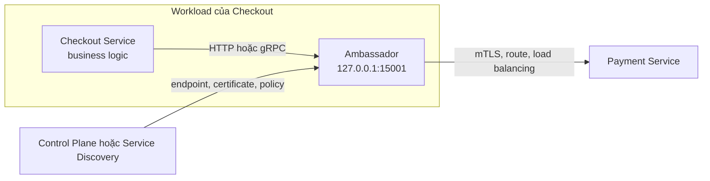
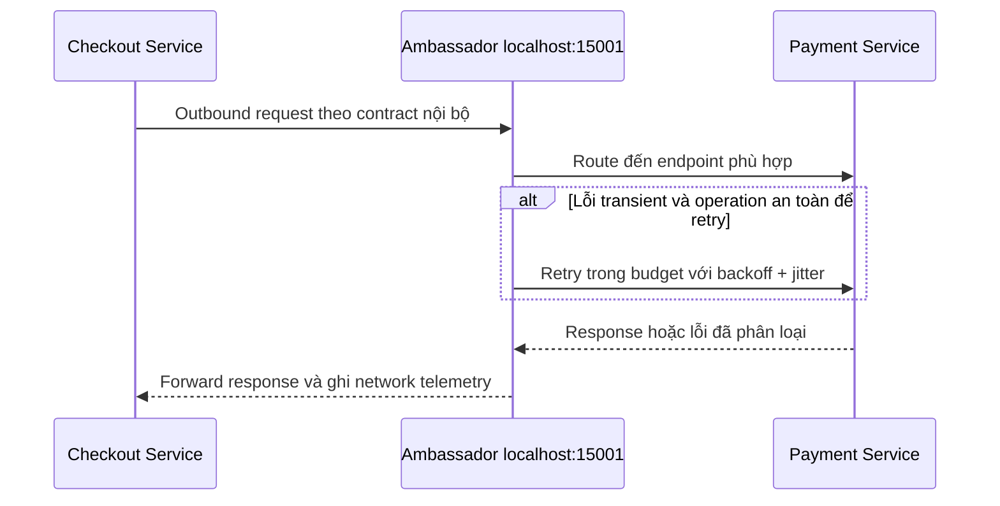
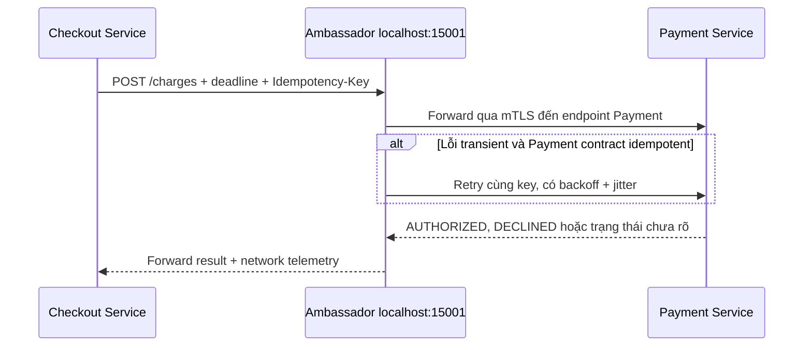

# Ambassador Pattern — Local Proxy cho Outbound Call

## Mục lục

- [Tổng quan](#tổng-quan)
- [Vấn đề và mô hình outbound](#vấn-đề-và-mô-hình-outbound)
  - [Luồng request outbound](#luồng-request-outbound)
  - [Vị trí trong topology](#vị-trí-trong-topology)
- [Trách nhiệm của Ambassador](#trách-nhiệm-của-ambassador)
  - [Endpoint cục bộ và routing](#endpoint-cục-bộ-và-routing)
  - [Service discovery và load balancing](#service-discovery-và-load-balancing)
  - [Timeout và retry](#timeout-và-retry)
  - [TLS và service identity](#tls-và-service-identity)
  - [Observability tại outbound boundary](#observability-tại-outbound-boundary)
- [Ví dụ Payment client qua local proxy](#ví-dụ-payment-client-qua-local-proxy)
  - [Topology của Checkout](#topology-của-checkout)
  - [Luồng charge](#luồng-charge)
  - [Phân chia trách nhiệm](#phân-chia-trách-nhiệm)
- [Phân biệt Ambassador Sidecar và API Gateway](#phân-biệt-ambassador-sidecar-và-api-gateway)
- [Trade-off](#trade-off)
- [Khi nào nên và không nên dùng](#khi-nào-nên-và-không-nên-dùng)
  - [Nên dùng khi](#nên-dùng-khi)
  - [Không nên dùng khi](#không-nên-dùng-khi)
- [Lỗi thường gặp](#lỗi-thường-gặp)
- [Vận hành](#vận-hành)
  - [Cấu hình và rollout](#cấu-hình-và-rollout)
  - [Metrics logs và traces](#metrics-logs-và-traces)
  - [Debug và xử lý sự cố](#debug-và-xử-lý-sự-cố)
- [Checklist](#checklist)
- [Liên kết liên quan](#liên-kết-liên-quan)

---

## Tổng quan

**Ambassador Pattern** là một **local proxy** đại diện cho application khi application gọi một dịch vụ bên ngoài process hoặc Bounded Context của nó. Application gửi request đến một endpoint ổn định trên `localhost`. Ambassador nhận request, áp dụng policy ở network boundary rồi chuyển tiếp đến endpoint thật.

Ví dụ, `Checkout Service` chỉ cần gọi `http://127.0.0.1:15001`. Nó không phải tự quản lý địa chỉ từng replica của `Payment Service`, certificate của upstream hay cách cân bằng tải. Ambassador xử lý phần đó theo cấu hình và policy được giao.

Ambassador thường được triển khai như một process hoặc container cạnh application, thường trong cùng Pod hoặc trên cùng host. Vì vậy, nó thường là một trường hợp chuyên biệt của [Sidecar Pattern](../17-structural-patterns.md#3-sidecar-pattern). Tuy nhiên, hai tên gọi nhấn mạnh hai ý khác nhau:

- **Sidecar** mô tả vị trí triển khai của component hỗ trợ.
- **Ambassador** mô tả vai trò network: đại diện cho outbound call của application.

> **Ranh giới:** Ambassador nên xử lý transport và network policy. Nó không nên quyết định giá, trạng thái đơn hàng, điều kiện hoàn tiền hoặc workflow nghiệp vụ. Application vẫn sở hữu semantics của operation và cách xử lý kết quả.

## Vấn đề và mô hình outbound

Khi mỗi service tự cài một bộ client networking, các policy outbound dễ bị lặp và không đồng nhất. Service này có thể dùng một timeout, retry mọi `5xx` và bỏ qua certificate rotation. Service khác lại dùng giá trị khác. Sự khác biệt càng lớn trong hệ thống polyglot (dùng nhiều ngôn ngữ và runtime).

Một local proxy tạo ra một boundary chung cho các concern có thể chuẩn hóa:

- service discovery và chọn endpoint;
- load balancing, connection pooling và routing;
- TLS hoặc mTLS (mutual TLS — TLS hai chiều);
- timeout ở tầng transport và retry có giới hạn;
- access log, network metrics và trace context.

Application vẫn gọi theo contract của downstream. Proxy không biến một API contract sai thành contract đúng. Nếu schema hoặc semantics của downstream không phù hợp với domain, cần thêm [Adapter Pattern](../17-structural-patterns.md#5-adapter-pattern), thường ở application boundary.

### Luồng request outbound

Request path và configuration path là hai luồng khác nhau. Control Plane hoặc cơ chế Service Discovery có thể phân phối endpoint, certificate và traffic policy cho Ambassador. Request thực tế vẫn đi từ application qua local proxy đến downstream.



Một request điển hình có thể diễn ra như sau:



`Control Plane` trong sơ đồ không nhất thiết nằm trên đường đi của từng request. Tùy implementation, nó có thể push cấu hình xuống proxy hoặc cung cấp dữ liệu để proxy cập nhật route. Điểm cần giữ là request không nên phụ thuộc vào việc application biết IP hoặc certificate của từng instance.

### Vị trí trong topology

```text
┌──────────────────── Workload ────────────────────┐
│                                                   │
│  ┌──────────────────┐     ┌───────────────────┐   │
│  │ Checkout Service │────▶│ Ambassador        │   │
│  │ business code    │     │ localhost:15001   │   │
│  └──────────────────┘     └─────────┬─────────┘   │
│                                     │             │
└─────────────────────────────────────┼─────────────┘
                                      │ outbound
                                      ▼
                            ┌───────────────────┐
                            │ Payment Service   │
                            │ nhiều replicas    │
                            └───────────────────┘
```

Cùng Pod hoặc cùng host làm giảm khoảng cách giữa application và proxy, nhưng không làm mất mọi rủi ro. Proxy vẫn có resource limit, lifecycle, config và failure mode riêng. Khi dùng Kubernetes, cần tính CPU và memory của proxy vào tổng resource của Pod, đồng thời thiết kế readiness và graceful shutdown cho cả hai container.

## Trách nhiệm của Ambassador

Ambassador phù hợp với các trách nhiệm lặp lại ở outbound network boundary. Bảng dưới đây cũng chỉ rõ phần nào không nên đẩy sang proxy:

| Trách nhiệm | Ambassador xử lý | Application vẫn sở hữu |
|---|---|---|
| **Routing và discovery** | Chọn upstream, route theo version hoặc locality và cập nhật endpoint theo policy | Contract của operation và ý nghĩa của response |
| **Load balancing và connection** | Phân phối request, giữ connection pool và áp giới hạn kết nối nếu implementation hỗ trợ | Giới hạn concurrency theo business flow và hành vi khi downstream không sẵn sàng |
| **Timeout và retry** | Connection timeout, request/response timeout, retry lỗi transient theo policy | Overall deadline, idempotency, fallback và quyết định retry mutation |
| **TLS và identity** | Thiết lập TLS/mTLS đến upstream, kiểm tra trust và dùng certificate theo cấu hình | Authentication của end user, Authorization theo resource và secret không cần gửi qua proxy |
| **Observability** | Network metrics, access log, retry/timeout signal và propagate trace context | Business metrics, business event và giải thích kết quả nghiệp vụ |

Không phải mọi implementation đều có cùng capability. Cần kiểm tra proxy cụ thể hỗ trợ protocol, routing, certificate và resilience policy nào trước khi chuẩn hóa.

### Endpoint cục bộ và routing

Application nên phụ thuộc vào một endpoint cục bộ ổn định thay vì topology của downstream. Ví dụ, client của `Checkout Service` có thể được cấu hình trỏ đến `127.0.0.1:15001`, còn Ambassador route tên logical `payment-service` đến endpoint thực.

Routing có thể dựa trên service, version, locality hoặc traffic split. Việc thay đổi route nên được version hóa và review như code, vì một config sai có thể ảnh hưởng nhiều outbound request dù application binary không đổi.

Ambassador không nên chứa business routing như “nếu giỏ hàng trên một triệu đồng thì gọi provider A”. Đó là quyết định domain hoặc application. Proxy chỉ nên route theo thông tin network và policy đã được xác định ở boundary phù hợp.

### Service discovery và load balancing

Service Discovery cung cấp hoặc giúp cập nhật danh sách endpoint. Ambassador dùng dữ liệu đó để tránh buộc application biết địa chỉ của từng replica. Load balancing sau đó phân phối request giữa các endpoint có thể nhận traffic.

Một số tín hiệu cần được thống nhất trước khi bật routing:

- endpoint nào được coi là ready;
- protocol và port nào được proxy hỗ trợ;
- instance lỗi được loại khỏi route theo cách nào;
- route version hoặc canary có cần traffic split không;
- khi discovery tạm thời không cập nhật được thì proxy và application sẽ xử lý ra sao.

Ambassador không thay thế health check của nền tảng. Service Discovery, Load Balancer hoặc Kubernetes vẫn cần cơ chế xác định instance có sẵn sàng nhận traffic hay không. Proxy chỉ áp dụng thông tin mà nó nhận được và cần được kiểm tra bằng endpoint/config thực tế.

### Timeout và retry

Ambassador có thể đặt timeout ở tầng transport để một kết nối hoặc response không giữ tài nguyên vô hạn. Các lớp thường cần phân biệt là:

- **Connection timeout:** giới hạn thời gian thiết lập kết nối.
- **Response hoặc read timeout:** giới hạn thời gian chờ response sau khi gửi request.
- **Overall deadline:** giới hạn toàn bộ call, gồm backoff và các lần retry.

Retry chỉ phù hợp với **transient failure** (lỗi tạm thời) như connection reset hoặc một số response `502`, `503`, `504`. Policy cần có `max attempts`, backoff, jitter, giới hạn traffic và cách tôn trọng `Retry-After` nếu upstream gửi header này.

Proxy không biết đầy đủ semantics của request. `POST /charges` có thể tạo side effect tài chính. Vì vậy, không được retry mù chỉ vì request nhận `timeout` hoặc `5xx`. Retry chỉ nên được bật khi operation là idempotent hoặc contract có `Idempotency Key` được giữ nguyên qua mọi attempt.

```text
Overall deadline của request: 3s
  ├─ connection timeout: tối đa 500ms
  ├─ attempt đầu: theo phần budget còn lại
  └─ retry: chỉ khi lỗi được phép, có backoff + jitter và không vượt deadline
```

Nếu application, Ambassador và một API Gateway cùng retry, số request tới downstream có thể tăng theo nhiều tầng. Cần chỉ định rõ tầng nào sở hữu retry policy. Application vẫn phải truyền deadline end-to-end, xử lý trạng thái pending và cung cấp fallback khi proxy không thể hoàn tất call.

### TLS và service identity

**TLS** mã hóa và bảo vệ tính toàn vẹn của traffic. **mTLS** thêm việc client và server cùng xác thực certificate của nhau. Ở outbound boundary, Ambassador có thể thiết lập mTLS tới downstream để application không phải tự tích hợp thư viện TLS theo từng ngôn ngữ.

Một policy TLS/mTLS cần làm rõ:

| Câu hỏi | Điều cần xác định |
|---|---|
| Ai cấp certificate? | Control Plane, CA nội bộ hoặc trust system nào |
| Identity đại diện cho ai? | Workload, service account, namespace hoặc boundary tương ứng |
| Certificate được rotate thế nào? | Cách nhận certificate mới, thời hạn và alert khi rotation lỗi |
| Traffic nào bắt buộc mTLS? | Proxy-to-proxy, proxy-to-upstream hoặc cả app-to-proxy tùy trust boundary |
| Ai kiểm tra quyền gọi? | Network policy ở proxy/platform và Authorization ở service đích |

`localhost` hoặc cùng Pod không tự động đồng nghĩa với end-to-end secure. Nếu app-to-proxy dùng plaintext, team cần ghi rõ trust boundary và kiểm tra threat model. mTLS của workload cũng không thay cho Authentication của end user hoặc Authorization trên resource.

### Observability tại outbound boundary

Ambassador nằm trên đường đi của request nên có thể cung cấp góc nhìn nhất quán cho network hop. Tối thiểu nên theo dõi:

| Tín hiệu | Câu hỏi cần trả lời |
|---|---|
| Request rate theo upstream | Caller đang gửi traffic đến dependency nào và tăng ở đâu? |
| Latency P50, P95, P99 | Thời gian nằm ở proxy/network hay downstream? |
| Status, timeout và retry count | Lỗi xảy ra ở transport, upstream hay policy? |
| Connection pool và active connections | Proxy có bị bão hòa hoặc giữ quá nhiều connection không? |
| mTLS handshake và policy deny | Request bị từ chối vì certificate, identity hay route nào? |
| Config/image version | Lỗi có bắt đầu sau một proxy config hoặc image mới không? |

Proxy nên propagate **Trace Context** như `traceparent` để span của outbound call nối với trace của application. `trace_id`, upstream cluster, route và attempt number hữu ích cho điều tra. Application vẫn phải ghi business outcome như payment authorized, declined hoặc pending; network telemetry không thể thay thế metric nghiệp vụ.

Access log và trace có thể chứa header hoặc metadata nhạy cảm. Không ghi access token, password, số thẻ đầy đủ, CVV, payload payment hoặc PII nếu không có policy redaction rõ ràng. Xem thêm [Distributed Tracing Pattern](../17-observability-patterns/distributed-tracing.md) và [Observability & Evolvability](../11-observability-evolvability.md).

## Ví dụ Payment client qua local proxy

### Topology của Checkout

Giả sử `Checkout Service` gọi `Payment Service` trong một hệ thống E-Commerce. Checkout muốn giữ một client contract ổn định, còn platform team muốn đưa mTLS, endpoint discovery và network telemetry ra khỏi business code.

```text
┌──────────────────── Pod của Checkout ────────────────────┐
│                                                          │
│  ┌──────────────────────┐     ┌──────────────────────┐  │
│  │ Checkout Service      │     │ Ambassador           │  │
│  │ gọi Payment client    │────▶│ 127.0.0.1:15001      │──┼── mTLS ──▶ Payment Service
│  └──────────────────────┘     └──────────────────────┘  │
│                                                          │
└──────────────────────────────────────────────────────────┘
```

Application chỉ cần biết local endpoint. Ambassador biết route `payment-service`, endpoint thật và policy TLS. Nếu payload của Payment Service không trùng domain contract, một `Payment Adapter` có thể nằm trong Checkout trước local proxy:

```text
Checkout domain
    │ PaymentPort / contract nội bộ
    ▼
Payment Adapter (nếu cần mapping schema hoặc semantics)
    │ request theo contract Payment Service
    ▼
Ambassador localhost
    │ transport, mTLS, discovery, timeout policy
    ▼
Payment Service
```

Adapter và Ambassador có thể nối tiếp nhau nhưng không phải cùng một pattern. Adapter chuyển đổi contract. Ambassador vận chuyển request qua outbound network boundary.

### Luồng charge

Request minh họa dưới đây giữ cùng `Idempotency-Key` và trace context. Header cụ thể phụ thuộc contract của hệ thống và thư viện đang dùng.

```text
POST http://127.0.0.1:15001/charges
Idempotency-Key: pay_order-123
traceparent: 00-{trace-id}-{span-id}-01

{
  "order_id": "order-123",
  "amount_minor": 1250000,
  "currency": "VND"
}
```

Luồng xử lý:

1. Checkout tạo operation identity `pay_order-123` cho một lần charge.
2. Checkout gửi request đến local Ambassador, không gửi trực tiếp đến một Pod Payment cụ thể.
3. Ambassador route request đến endpoint Payment phù hợp và thiết lập TLS/mTLS theo policy.
4. Nếu lỗi là transient và contract cho phép retry, Ambassador retry trong `overall deadline`, với backoff và jitter. Key của cùng operation không được đổi.
5. Payment Service trả kết quả. Ambassador forward response và ghi latency, status, upstream cùng trace context.
6. Nếu timeout xảy ra sau khi request có thể đã tới Payment Service, Checkout không được suy luận rằng charge chắc chắn chưa xảy ra. Application phải xử lý trạng thái chưa xác định theo contract, chẳng hạn tra status hoặc giữ `PENDING_PAYMENT` để reconciliation.



Ambassador không nên tự biến `DECLINED` thành retryable error, cũng không nên đổi `PENDING_PAYMENT` thành `FAILED` chỉ để trả response đơn giản hơn. Phân loại đó phụ thuộc semantics của Payment Service và workflow Checkout.

### Phân chia trách nhiệm

| Thành phần | Trách nhiệm trong ví dụ |
|---|---|
| **Checkout Service** | Sở hữu checkout flow, overall deadline, fallback hoặc trạng thái pending và quyết định nghiệp vụ sau khi Payment trả kết quả |
| **Payment Adapter** | Nếu cần, map domain command sang schema/status của Payment Service; không để vendor model lan vào domain |
| **Ambassador** | Local endpoint, route/discovery, load balancing, TLS/mTLS, connection/transport timeout, retry policy đã được phê duyệt và network telemetry |
| **Payment Service** | Xác thực request, thực hiện business rule thanh toán và trả kết quả theo Payment contract |

Nếu `Payment Service` tiếp tục gọi một Bank API, nó là một caller mới. Boundary đó cần timeout, retry, idempotency và có thể có Ambassador riêng; proxy của Checkout không thể thay thế policy của Payment Service.

## Phân biệt Ambassador Sidecar và API Gateway

Ba tên gọi thường xuất hiện cùng nhau nhưng trả lời ba câu hỏi khác nhau:

| Tiêu chí | Ambassador | Sidecar | API Gateway |
|---|---|---|---|
| **Câu hỏi chính** | Ai đại diện cho outbound call của application? | Component hỗ trợ được đặt cạnh workload thế nào? | Client bên ngoài vào hệ thống bằng public boundary nào? |
| **Bản chất** | Client-side/local proxy role | Deployment hoặc topology pattern | Edge routing và policy pattern |
| **Traffic điển hình** | Outbound từ một workload đến downstream | Không cố định; có thể hỗ trợ inbound, outbound hoặc không có request path | North-South: client, mobile, web hoặc partner vào hệ thống |
| **Vị trí** | `localhost`, thường cùng Pod/host với caller | Cùng Pod/host với application | Edge, trước các service hoặc BFF |
| **Use case** | mTLS, discovery, load balancing, retry/timeout và telemetry cho egress | Log shipping, secret agent, telemetry collector hoặc proxy | Authentication user, Rate Limiting, public routing, CORS và API aggregation |
| **Đơn vị scale** | Thường scale cùng application gọi ra ngoài | Thường scale cùng workload | Nhiều Gateway instance sau Load Balancer hoặc Ingress |
| **Business logic** | Không nên chứa business rule | Thường không chứa business rule | Không nên trở thành nơi chứa workflow domain |

```text
Client ── North-South ──▶ API Gateway ──▶ Service A
                                             │
                       Service A ── East-West/outbound ──▶ Ambassador cục bộ ──▶ Service B
```

Một Ambassador chạy trong cùng Pod với application thường đồng thời là một Sidecar. Nhưng một Log Sidecar không phải Ambassador vì nó không đại diện cho outbound call. Ngược lại, một local outbound proxy có thể được triển khai theo hình thức khác nếu topology không phải Sidecar.

API Gateway cũng không phải Ambassador chỉ vì cả hai đều có thể forward HTTP. Gateway bảo vệ public edge và client-facing contract. Ambassador đại diện cho caller ở outbound boundary. Không nên bắt service-to-service call vòng qua API Gateway chỉ để dùng lại policy edge.

`Adapter` lại là boundary về contract. Nó đổi schema, protocol hoặc semantics; Ambassador không nên đảm nhận nhiệm vụ đó. Trong ví dụ Payment, Adapter có thể chuẩn hóa payload trước khi Ambassador xử lý transport.

## Trade-off

| Lợi ích | Chi phí hoặc rủi ro | Cách giảm thiểu |
|---|---|---|
| Policy outbound nhất quán giữa nhiều ngôn ngữ và service | Thêm một network hop, CPU/memory và tail latency | Benchmark P95/P99, dùng connection reuse và đặt resource limit |
| Legacy application có thể dùng mTLS hoặc routing mà ít sửa code | Proxy và config trở thành thành phần lỗi mới | Validate config, rollout canary và có readiness/drain rõ ràng |
| Discovery, traffic shift và certificate policy tách khỏi business code | Control Plane hoặc config sai có thể ảnh hưởng nhiều outbound call | Version hóa config, kiểm tra route thực tế và chuẩn bị rollback |
| Network telemetry đồng nhất | Debug phải tương quan application log, proxy log và trace | Propagate `traceparent`, gắn `component.version` và tách dashboard theo app/proxy/upstream |
| Có thể fail fast hoặc bảo vệ upstream bằng policy chung | Retry/timeout ở nhiều tầng có thể tạo Retry Storm | Chỉ định một retry owner, truyền deadline và đặt retry budget |
| Application ít phụ thuộc topology downstream | Proxy không thể hiểu semantics của charge, refund hoặc workflow | Giữ Adapter và domain orchestration ở đúng boundary |

Ambassador không miễn phí chỉ vì application code ngắn hơn. Chi phí được chuyển sang proxy image, config, certificate, resource, observability và năng lực on-call. Cần đo overhead trước khi áp dụng cho mọi workload.

## Khi nào nên và không nên dùng

### Nên dùng khi

- Nhiều service hoặc nhiều team cần chung policy **outbound** như mTLS, Service Discovery, load balancing, routing hoặc telemetry.
- Hệ thống polyglot khiến việc duy trì cùng một bộ networking SDK trong mọi application trở nên khó nhất quán.
- Legacy application khó thay đổi nhưng vẫn cần egress policy, certificate hoặc traffic routing ở một local boundary.
- Cần canary hoặc traffic split giữa các phiên bản của downstream ở service-to-service layer.
- Team có platform/control plane, inventory endpoint, dashboard, alert và runbook để sở hữu data plane.
- Có một failure mode đã quan sát được mà local proxy giải quyết tốt hơn DNS hoặc client library đơn giản.

Không có một ngưỡng cố định về số lượng service để bắt buộc dùng Ambassador. Quyết định nên dựa trên pain point, chi phí resource và khả năng vận hành thực tế.

### Không nên dùng khi

- Hệ thống nhỏ, traffic thấp và DNS cùng client library đã đáp ứng discovery, TLS và timeout với ít cấu hình hơn.
- Team chưa có owner cho proxy image, certificate, config, dashboard và on-call. Thêm proxy khi đó chỉ tạo một lớp khó debug.
- Vấn đề thật sự là schema hoặc semantic của API không tương thích. Hãy dùng Adapter hoặc version contract thay vì giấu lỗi trong proxy.
- Call chứa workflow nghiệp vụ như charge, refund, compensation hoặc quyết định trạng thái đơn hàng. Proxy không thể thay application orchestration.
- Nhu cầu chỉ là traffic **đi vào** từ client bên ngoài. API Gateway hoặc Ingress phù hợp hơn với edge boundary.
- Chưa có cách đo latency, retry, resource và failure mode của proxy. Không nên chuẩn hóa một data plane mà không có SLO và telemetry.

## Lỗi thường gặp

| Lỗi | Hậu quả | Cách tránh |
|---|---|---|
| **Retry ở application, Ambassador và Gateway cùng lúc** | Một request tạo nhiều request phụ, gây Retry Storm | Chọn retry owner, truyền deadline và giới hạn retry budget |
| **Retry mutation không có idempotency** | `POST /charges` hoặc tạo order có thể lặp side effect | Chỉ retry khi operation idempotent hoặc dùng cùng `Idempotency-Key` |
| **Chỉ đặt per-try timeout** | Backoff và nhiều attempt làm vượt SLA của request gốc | Dùng overall deadline và tính phần budget còn lại trước mỗi attempt |
| **Coi timeout là thất bại chắc chắn** | Gửi lại payment có thể tạo duplicate khi response bị mất | Tra status, giữ trạng thái pending hoặc reconciliation theo contract |
| **Đồng nhất localhost với end-to-end security** | App-to-proxy hoặc proxy-to-upstream có thể nằm ngoài trust boundary dự kiến | Ghi rõ trust boundary, policy mTLS và NetworkPolicy; kiểm tra traffic thực tế |
| **Proxy route hoặc discovery không khớp** | Request đi nhầm version, không có endpoint hoặc nhận lỗi do protocol/port | Validate config, kiểm tra listener/route/endpoint và rollout từng bước |
| **Quên resource, readiness hoặc drain** | Proxy bị OOM/throttle, app nhận traffic quá sớm hoặc mất request khi Pod dừng | Set requests/limits, readiness probe, preStop và termination grace phù hợp |
| **Không propagate trace context hoặc log quá nhiều payload** | Trace bị đứt hoặc telemetry làm lộ token, payment data và PII | Kiểm tra `traceparent`, structured log và redaction ở app/proxy/pipeline |
| **Đưa business rule vào proxy** | Policy khó test, rollback và trở thành một business monolith | Giữ semantics ở domain service hoặc Adapter |
| **Dùng image/config không tái lập** | Rollout bất ngờ, khó xác định lỗi đến từ version nào | Pin image version/digest, version hóa config và ghi `component.version` |

## Vận hành

### Cấu hình và rollout

Một Ambassador production cần được vận hành như một thành phần độc lập, dù nó thường scale cùng application:

1. **Lập inventory outbound:** ghi caller, downstream, protocol, port, volume, timeout, retry và operation có side effect.
2. **Xác định ownership:** chỉ rõ ai sở hữu image, config, certificate, policy, dashboard, SLO và on-call.
3. **Đo baseline:** lưu latency P50/P95/P99, error rate, connection, CPU và memory trước khi thêm hoặc thay đổi proxy.
4. **Tách policy:** đặt connection timeout, response timeout, overall deadline, retry condition và traffic budget theo dependency/operation; không copy một con số cho mọi call.
5. **Validate và version hóa:** kiểm tra route, endpoint, protocol, certificate trust và policy trước khi phân phối config.
6. **Rollout từng phần:** canary một nhóm workload hoặc một route ít rủi ro; theo dõi upstream error, tail latency và resource trước khi mở rộng.
7. **Drain khi shutdown:** remove workload khỏi traffic, drain connection, dùng `preStop` hoặc cơ chế tương đương và cấp đủ `terminationGracePeriodSeconds` cho request đang xử lý.
8. **Chuẩn bị rollback:** rollback được cả proxy image và config. Với Payment, rollback route không tự hoàn tác side effect đã xảy ra; cần đối soát theo operation ID.

Không nên bật đồng thời mTLS, retry, traffic split và nhiều policy mới trên toàn hệ thống khi chưa có cách cô lập nguyên nhân. Rollout nhỏ làm giảm blast radius của một cấu hình sai.

### Metrics logs và traces

Dashboard nên tách ba lớp: application, Ambassador và upstream. Một bộ tín hiệu cơ bản gồm:

| Lớp | Tín hiệu |
|---|---|
| **Application** | Request rate, business outcome, overall deadline exceeded và trạng thái `AUTHORIZED`, `DECLINED`, `PENDING` nếu có |
| **Ambassador** | Request/response rate, latency P50/P95/P99, retry count, timeout phase, active connections và circuit state nếu được dùng |
| **Upstream** | Status/error theo cluster, endpoint, version hoặc locality; connection reset và `5xx` |
| **Security và config** | mTLS handshake failure, certificate rotation, authorization deny, config rejection và route version |
| **Resource** | CPU, memory, connection pool, pending requests và network saturation của proxy |
| **Trace** | `trace_id`, `traceparent`, route, upstream cluster, attempt và span duration |

Structured log của proxy nên đủ để ghép với application log nhưng không chứa secret. Dùng `trace_id` hoặc `Request ID` để tìm cùng request, đồng thời giữ `component.version` và upstream identity để phân biệt lỗi application với lỗi proxy/config.

Không coi network metric là business metric. Ví dụ, một request `200` từ proxy chỉ cho biết transport hoàn tất; nó không tự nói Payment đã authorize hay chỉ trả một trạng thái nghiệp vụ cần xử lý tiếp.

### Debug và xử lý sự cố

Khi một outbound call lỗi hoặc chậm, điều tra theo thứ tự sau:

1. Lấy `Request ID`, `Trace ID` hoặc operation ID từ application log.
2. Xác định caller, upstream, route, version và thời điểm lỗi bắt đầu.
3. So sánh application latency với Ambassador latency để biết thời gian nằm trước proxy, trong proxy hay sau upstream.
4. Kiểm tra endpoint discovery, listener/route, protocol, port, connection pool và số attempt thực tế.
5. Kiểm tra mTLS handshake, certificate expiry/rotation và authorization policy.
6. Đối chiếu status, timeout phase, retry reason và `Retry-After` với metrics của upstream.
7. Kiểm tra CPU, memory, pending request và config/image change gần thời điểm sự cố.
8. Nếu lỗi bắt đầu sau policy change, giảm traffic hoặc rollback config trước khi thay nhiều biến cùng lúc.
9. Với Payment hoặc mutation khác, kiểm tra operation ID và trạng thái downstream trước khi gửi lại request.

Một proxy khỏe không chứng minh upstream khỏe. Một Control Plane khỏe cũng không chứng minh mọi proxy đã nhận đúng route. Cần kiểm tra data plane và request path thực tế trong cùng một trace.

## Checklist

- [ ] Đã ghi rõ outbound call nào đi qua Ambassador và endpoint local nào được sử dụng.
- [ ] Đã xác định owner cho proxy image, config, certificate, policy, dashboard và on-call.
- [ ] Ambassador chỉ xử lý network concern; Adapter và domain service giữ contract/semantics.
- [ ] Service Discovery, endpoint readiness, protocol, port và route version đã được kiểm thử.
- [ ] Có connection timeout, response timeout và overall deadline; deadline được truyền qua các hop.
- [ ] Retry chỉ áp dụng cho lỗi transient, có max attempts, backoff, jitter, budget và tôn trọng `Retry-After`.
- [ ] Mutation có Idempotency Key hoặc cơ chế status/reconciliation trước khi cho phép retry.
- [ ] TLS/mTLS, workload identity, certificate rotation và trust boundary đã được document.
- [ ] Metrics tách application, Ambassador và upstream; có P50/P95/P99, retry, timeout và saturation.
- [ ] Trace context, `Request ID` và operation ID được propagate; log đã mask secret, token, payment data và PII.
- [ ] Proxy có resource requests/limits, readiness, graceful drain và shutdown procedure.
- [ ] Config/image được version hóa, validate, rollout canary và rollback được.
- [ ] Runbook có bước kiểm tra route, discovery, mTLS, resource, trace và side effect trước khi replay request.

## Liên kết liên quan

- [17 — Structural Patterns](../17-structural-patterns.md#4-ambassador-pattern) — phần nguồn về Sidecar, Ambassador và Adapter.
- [Service Mesh Pattern](../17-communication-patterns/service-mesh.md) — sidecar proxy, mTLS, traffic management và outbound East-West traffic.
- [API Gateway Pattern](../17-communication-patterns/api-gateway.md) — public edge, North-South traffic và khác biệt với local proxy.
- [Retry with Backoff và Jitter](../17-reliability-patterns/retry-with-backoff.md) — transient failure, idempotency, retry budget và Payment provider.
- [Timeout Pattern](../17-reliability-patterns/timeout.md) — connection/response timeout, deadline propagation và cancellation.
- [Distributed Tracing Pattern](../17-observability-patterns/distributed-tracing.md) — `traceparent`, span và context propagation.
- [08 — Service Discovery](../08-service-discovery.md) — endpoint discovery, health check và load balancing.
- [15 — Security](../15-security.md) — TLS, mTLS, workload identity và Authorization.
- [16 — Configuration & Secrets Management](../16-configuration-secrets-management.md) — quản lý certificate, config và secret.
