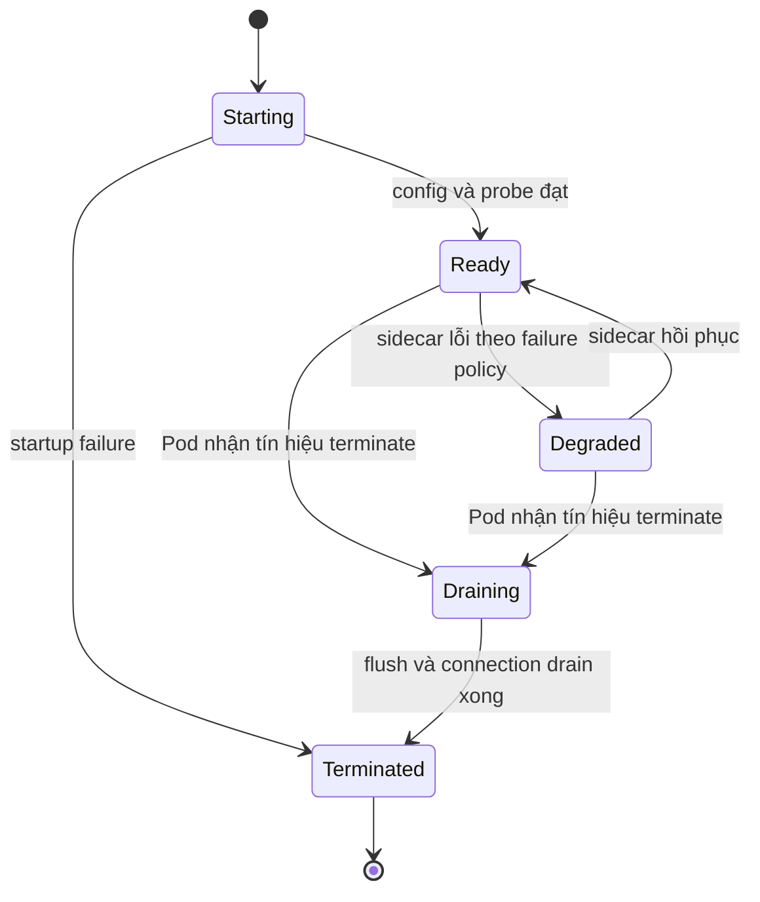
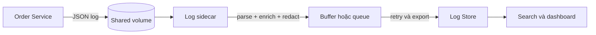
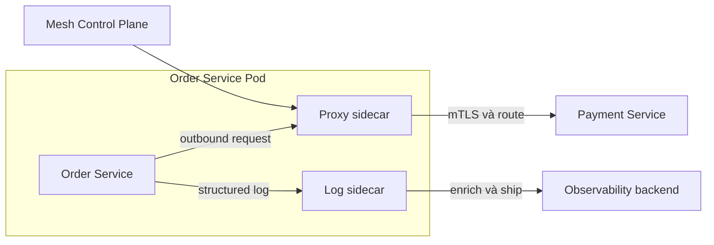

# Sidecar Pattern — Thành phần hỗ trợ cạnh Microservice

## Mục lục

- [Tổng quan](#tổng-quan)
  - [Sidecar là gì?](#sidecar-là-gì)
  - [Phạm vi của tài liệu](#phạm-vi-của-tài-liệu)
- [Topology của Sidecar](#topology-của-sidecar)
  - [Sidecar trong Kubernetes Pod](#sidecar-trong-kubernetes-pod)
  - [Giao tiếp local proxy và local agent](#giao-tiếp-local-proxy-và-local-agent)
  - [Phân biệt locality với triển khai tập trung](#phân-biệt-locality-với-triển-khai-tập-trung)
- [Lifecycle và đơn vị triển khai](#lifecycle-và-đơn-vị-triển-khai)
  - [Khởi động và readiness](#khởi-động-và-readiness)
  - [Hoạt động bình thường](#hoạt-động-bình-thường)
  - [Dừng, drain và flush](#dừng-drain-và-flush)
  - [Rollout và scaling](#rollout-và-scaling)
- [Vai trò và use case](#vai-trò-và-use-case)
  - [Local proxy](#local-proxy)
  - [Local agent](#local-agent)
  - [Những concern phù hợp](#những-concern-phù-hợp)
- [Use case: log shipping cho Order Service](#use-case-log-shipping-cho-order-service)
  - [Luồng dữ liệu](#luồng-dữ-liệu)
  - [Manifest minh họa](#manifest-minh-họa)
  - [Structured log và metadata](#structured-log-và-metadata)
  - [Failure mode của pipeline](#failure-mode-của-pipeline)
- [Security và observability](#security-và-observability)
  - [Security boundary](#security-boundary)
  - [Tín hiệu observability](#tín-hiệu-observability)
  - [Resource và isolation](#resource-và-isolation)
- [Trade-off](#trade-off)
- [Khi nên và không nên dùng](#khi-nên-và-không-nên-dùng)
  - [Nên dùng khi](#nên-dùng-khi)
  - [Không nên dùng khi](#không-nên-dùng-khi)
- [Lỗi thường gặp](#lỗi-thường-gặp)
- [Vận hành Sidecar](#vận-hành-sidecar)
  - [Ownership và rollout](#ownership-và-rollout)
  - [Chẩn đoán theo triệu chứng](#chẩn-đoán-theo-triệu-chứng)
  - [Health check, alert và rollback](#health-check-alert-và-rollback)
  - [Checklist triển khai](#checklist-triển-khai)
- [Phân biệt Sidecar, Ambassador và Service Mesh](#phân-biệt-sidecar-ambassador-và-service-mesh)
  - [Sidecar và Ambassador](#sidecar-và-ambassador)
  - [Sidecar và Service Mesh](#sidecar-và-service-mesh)
  - [Kết hợp có chủ đích](#kết-hợp-có-chủ-đích)
- [Tổng kết](#tổng-kết)
- [Liên kết liên quan](#liên-kết-liên-quan)

---

## Tổng quan

### Sidecar là gì?

**Sidecar Pattern** đặt một process hoặc container phụ cạnh application chính trong cùng một đơn vị triển khai gần nhất. Trong Kubernetes, đơn vị này thường là **Pod**. Sidecar thêm hoặc cô lập một technical concern mà không đưa logic đó vào business code của service.

Sidecar không phải là một loại container đặc biệt. Đây là một vai trò kiến trúc. Container phụ có thể là log shipper, telemetry collector, secret agent hoặc proxy mạng tùy theo concern cần xử lý.

Trong một Pod, các container thường chia sẻ network namespace nên có thể gọi nhau qua `localhost`. Chúng cũng có thể chia sẻ volume. Pod được schedule cùng nhau và thay thế trong cùng một rollout, vì vậy sidecar tạo locality nhưng không tự tạo ra một đơn vị release hoàn toàn độc lập.

```text
┌──────────────────────────── Kubernetes Pod ────────────────────────────┐
│                                                                        │
│  ┌──────────────────────┐       localhost       ┌───────────────────┐  │
│  │ Order Service        │ ─────────────────────▶│ Local proxy       │  │
│  │ business logic :8080 │       outbound        │ hoặc agent        │  │
│  └──────────┬───────────┘                       └───────────────────┘  │
│             │                                                          │
│             │ ghi log JSON                                             │
│             ▼                                                          │
│       /var/log/app  ◀──────────── shared volume ───────────────┐       │
│                                                                │       │
│                                     ┌──────────────────────────┴────┐  │
│                                     │ Log sidecar: đọc, enrich, ship│  │
│                                     └───────────────────────────────┘  │
└────────────────────────────────────────────────────────────────────────┘
```

### Phạm vi của tài liệu

Tài liệu này tập trung vào Sidecar như một **deployment và topology pattern**:

- topology trong Pod và các kiểu giao tiếp cục bộ;
- lifecycle, readiness, shutdown, resource và rollout;
- local proxy, local agent và log shipping cho `Order Service`;
- security, observability, trade-off và vận hành;
- ranh giới giữa Sidecar, Ambassador và Service Mesh.

Sidecar không thay thế việc xác định [Bounded Context](../02-single-responsibility-bounded-context.md). Nó cũng không tự quyết định business rule, idempotency, timeout theo SLA hay compensating transaction. Sidecar chỉ là cách đặt một concern đã được chọn cạnh workload.

## Topology của Sidecar

### Sidecar trong Kubernetes Pod

Topology của Sidecar có ba đặc điểm cần giữ rõ:

| Đặc điểm | Ý nghĩa vận hành |
|---|---|
| **Cùng network namespace** | Application và sidecar có thể giao tiếp qua `localhost`; một proxy có thể nhận traffic cục bộ trước khi gửi đi. |
| **Có thể dùng shared volume** | Agent đọc file hoặc socket do application tạo mà không cần đưa parser vào business process. |
| **Cùng đơn vị schedule** | Scheduler nhìn tổng resource của Pod; Pod restart hoặc rollout thường tác động đến app và sidecar cùng lúc. |

Cùng Pod không có nghĩa mọi container được tin tưởng như nhau. Sidecar có thể đọc file, nhận traffic hoặc giữ credential tùy cấu hình. Chỉ chia sẻ những network port, volume và identity thật sự cần thiết.

Một Sidecar có thể không nằm trên đường request. Ví dụ, log agent chỉ đọc file hoặc `stdout` rồi gửi dữ liệu đến backend. Ngược lại, proxy sidecar nhận và forward network traffic. Vì vậy, không nên suy ra vai trò của container chỉ từ việc nó nằm trong Pod.

### Giao tiếp local proxy và local agent

Hai hình thức giao tiếp phổ biến cần được phân biệt:

| Hình thức | Cách hoạt động | Ví dụ |
|---|---|---|
| **Local proxy** | Application gửi request đến endpoint cục bộ; proxy áp dụng policy transport rồi forward đến upstream. | Envoy xử lý mTLS, service discovery, routing hoặc connection pooling. |
| **Local agent** | Agent đọc file, socket hoặc nhận telemetry cục bộ; sau đó parse, enrich, buffer và gửi đến backend. | Fluent Bit đọc log file; OpenTelemetry Collector nhận OTLP qua `localhost`. |

Application và sidecar nên có contract cục bộ rõ ràng. Contract đó có thể là port, protocol, đường dẫn file, format log, quyền đọc hoặc cách báo hiệu readiness. Nếu sidecar là dependency bắt buộc, application không nên nhận traffic trước khi endpoint cục bộ sẵn sàng.

Một container có thể đảm nhiệm nhiều nhiệm vụ, nhưng tách local proxy và local agent về mặt ownership vẫn hữu ích. Proxy không nên chứa business workflow. Agent không nên âm thầm thay đổi semantics của dữ liệu nghiệp vụ khi chỉ có nhiệm vụ vận chuyển hoặc quan sát.

### Phân biệt locality với triển khai tập trung

Locality là lý do chính để chọn Sidecar. Nếu concern chỉ cần hoạt động ở cấp node hoặc cluster, một agent tập trung hơn có thể tránh việc nhân bản process trên từng Pod.

| Nhu cầu | Sidecar có lợi thế khi | Cách khác cần cân nhắc |
|---|---|---|
| Đọc file hoặc socket riêng của từng application | File/socket nằm trong shared volume hoặc namespace của Pod | Node-level collector nếu application đã ghi ra `stdout` |
| Nhận telemetry qua `localhost` | Muốn endpoint riêng cho từng instance | OpenTelemetry Collector tập trung nếu không cần locality |
| Chính sách mạng theo workload | Proxy cần identity và lifecycle gần workload | Service Mesh hoặc proxy tập trung tùy phạm vi policy |
| Đồng bộ secret/config cho một instance | Application cần file cục bộ và renew theo workload | Cơ chế platform hoặc agent cấp node nếu cùng một policy cho cả node |

Trong Kubernetes, **DaemonSet** thường phù hợp cho việc thu gom log chung từ các container trên node. Chọn Sidecar khi service ghi file riêng, cần parser đặc thù, cần giao tiếp qua `localhost` hoặc cần identity gắn với từng workload. Không nên chọn Sidecar chỉ vì nó là cách quen thuộc.

## Lifecycle và đơn vị triển khai

Lifecycle của sidecar phải được thiết kế cùng lifecycle của application. Một lỗi phổ biến là chỉ kiểm tra lúc Pod đang chạy ổn định mà bỏ qua giai đoạn khởi động, drain và thay thế Pod.



### Khởi động và readiness

- Không mặc định giả định application và sidecar khởi động theo đúng thứ tự mong muốn. Dùng `initContainer`, startup probe hoặc cơ chế retry ngắn phù hợp khi application cần một dependency cục bộ trước khi phục vụ.
- Nếu proxy, secret agent hoặc local socket là dependency bắt buộc, readiness của workload phải phản ánh điều kiện đó. Pod không nên nhận traffic khi request sẽ gặp `connection refused` ở local endpoint.
- Nếu log sidecar chỉ phục vụ telemetry best-effort, backend log tạm thời không sẵn sàng không nhất thiết phải làm Order Service mất readiness. Failure policy này phải được ghi rõ thay vì để hành vi phụ thuộc vào implementation.
- Startup probe, readiness probe và liveness probe có ý nghĩa khác nhau. Readiness quyết định có nhận traffic hay không; liveness không nên biến một backend telemetry tạm thời chậm thành restart loop của application.

### Hoạt động bình thường

Ở trạng thái ổn định, application và sidecar chạy như một đơn vị nhưng vẫn cần dashboard và log riêng cho từng container. Theo dõi ít nhất:

- application có đang nhận traffic và xử lý đúng không;
- sidecar có ready, restart hoặc bị OOM/throttle không;
- local proxy có thêm retry, timeout hoặc latency không;
- agent có buffer tăng, drop log hoặc lỗi gửi backend không;
- shared volume có đầy hoặc permission bị thay đổi không.

Một Pod khỏe ở góc nhìn application chưa chứng minh sidecar đang làm đúng nhiệm vụ. Ngược lại, sidecar có thể mất backend tạm thời trong khi application vẫn phục vụ được. Dashboard cần thể hiện rõ failure policy đã chọn.

### Dừng, drain và flush

Khi Pod nhận `SIGTERM`, sidecar và application cần có thời gian dừng có trật tự:

1. Ngừng nhận traffic mới hoặc loại endpoint khỏi routing theo cơ chế orchestration.
2. Drain request đang xử lý nếu sidecar là proxy.
3. Application hoàn tất hoặc hủy request theo deadline.
4. Agent flush buffer trong giới hạn cho phép nếu backend còn nhận dữ liệu.
5. Kết thúc trước `terminationGracePeriodSeconds`; dữ liệu còn lại cần tuân theo chính sách drop hoặc retry đã định nghĩa.

`preStop` và `terminationGracePeriodSeconds` chỉ có giá trị khi thời gian đó đủ cho cả application và sidecar. Không nên giả định mọi log đã được gửi chỉ vì process nhận `SIGTERM`; buffer hữu hạn vẫn có thể mất dữ liệu khi Pod bị terminate.

### Rollout và scaling

Sidecar thường scale cùng application. Khi số replica tăng, CPU, memory, connection và số agent cũng tăng theo. Capacity planning phải tính **tổng resource của Pod**, không chỉ container business.

Image sidecar có thể được build và kiểm thử riêng, nhưng thay đổi image hoặc config trong Pod template thường tạo Pod mới. Application vì vậy cũng bị thay thế trong rollout. Nếu cần nâng cấp sidecar thường xuyên hơn application, hãy đánh giá chi phí restart và quy trình canary trước khi chuẩn hóa.

Rollback cũng cần coi app và sidecar là một cặp tương thích. Một version proxy mới có thể làm thay đổi protocol, route hoặc telemetry dù image application không đổi. Giữ image/config version rõ ràng và có khả năng đưa toàn bộ Pod template về bản đã biết là tốt.

## Vai trò và use case

### Local proxy

**Local proxy** là process nhận traffic của application rồi chuyển tiếp đến downstream hoặc upstream theo policy. Nó thường xử lý concern ở tầng transport/network:

- mTLS, certificate rotation và workload identity;
- service discovery, load balancing và connection pooling;
- routing theo version, locality hoặc traffic policy;
- timeout, retry có giới hạn và telemetry ở network hop.

Proxy không nên quyết định việc một order có được thanh toán, hoàn tiền hay giữ tồn kho. Nó không có đủ business semantics để retry mọi mutation an toàn. Application vẫn sở hữu deadline end-to-end, idempotency và cách xử lý kết quả nghiệp vụ.

### Local agent

**Local agent** làm việc với dữ liệu hoặc capability cục bộ thay vì đứng trên mọi network request. Các use case phù hợp gồm:

| Use case | Nhiệm vụ của agent |
|---|---|
| **Log shipping** | Đọc log file, parse, thêm metadata Pod và gửi đến Log Store. |
| **Telemetry collection** | Nhận OTLP qua `localhost`, batch/filter/export traces hoặc metrics. |
| **Secret/config management** | Render file, renew token hoặc certificate để application đọc cục bộ. |
| **File/content sync** | Đồng bộ configuration hoặc artifact vào shared volume. |
| **Exporter** | Đọc endpoint hoặc format đặc thù của legacy app rồi chuyển thành telemetry chuẩn. |

Agent nên có output, retry, buffer và failure policy rõ ràng. Nó không nên làm application phụ thuộc ngầm vào một backend quan sát nếu concern đó được phép degrade.

### Những concern phù hợp

Sidecar thường phù hợp khi concern cần ít nhất một trong các đặc tính sau:

- cần truy cập `localhost`, shared file/socket hoặc workload identity;
- cần một implementation dùng được cho nhiều ngôn ngữ và không muốn nhúng cùng thư viện vào business code;
- cần tách code hỗ trợ có lifecycle, CVE và policy riêng khỏi application;
- cần kiểm soát traffic ở data plane gần từng instance;
- cần parser hoặc exporter riêng cho một workload mà agent cấp node không thể xử lý.

Tên công cụ không quyết định pattern. Envoy có thể là Sidecar khi chạy cùng Pod. Fluent Bit có thể là Sidecar khi đọc volume của một Pod. Cùng công cụ đó chạy dưới dạng DaemonSet hoặc service tập trung thì không còn là Sidecar của một application cụ thể.

## Use case: log shipping cho Order Service

### Luồng dữ liệu

Giả sử `Order Service` ghi structured log vào file dùng chung với log sidecar. Sidecar tail file, thêm metadata triển khai, lọc dữ liệu nhạy cảm rồi gửi đến backend logging. Application không cần biết endpoint hoặc credential của Log Store.



Trong Kubernetes, hãy cân nhắc `stdout` và node-level collector trước. Sidecar dùng shared volume phù hợp khi service bắt buộc ghi file, cần parser riêng hoặc cần xử lý log theo từng Pod. Buffer hoặc queue không phải cam kết mất log bằng không; khi queue đầy vẫn cần chính sách drop, backpressure và alert.

### Manifest minh họa

Manifest dưới đây minh họa topology, shared volume và việc cấp resource riêng cho log sidecar. Output `stdout` của Fluent Bit là một sink minh họa; khi triển khai thật, thay bằng output plugin và backend logging đã được cấu hình cùng retry, buffer, TLS và credential phù hợp.

```yaml
apiVersion: apps/v1
kind: Deployment
metadata:
  name: order-service
spec:
  replicas: 3
  selector:
    matchLabels:
      app: order-service
  template:
    metadata:
      labels:
        app: order-service
    spec:
      terminationGracePeriodSeconds: 30
      containers:
        - name: order-service
          image: registry.example.com/order-service:1.4.0
          env:
            - name: LOG_PATH
              value: /var/log/app/orders.json
          volumeMounts:
            - name: app-logs
              mountPath: /var/log/app
          resources:
            requests: { cpu: "250m", memory: "256Mi" }
            limits: { cpu: "500m", memory: "512Mi" }
        - name: log-sidecar
          image: cr.fluentbit.io/fluent/fluent-bit:3.0
          args: ["-i", "tail", "-p", "path=/var/log/app/orders.json", "-o", "stdout"]
          volumeMounts:
            - name: app-logs
              mountPath: /var/log/app
              readOnly: true
          resources:
            requests: { cpu: "50m", memory: "64Mi" }
            limits: { cpu: "100m", memory: "128Mi" }
      volumes:
        - name: app-logs
          emptyDir: {}
```

`emptyDir` trong ví dụ có vòng đời gắn với Pod. Nó không phải nơi lưu trữ log lâu dài. Nếu Pod bị thay thế trước khi sidecar gửi log, phần dữ liệu còn lại trong volume có thể mất. Vì vậy, cần ưu tiên shipping sớm, theo dõi buffer và cấu hình rotation/dung lượng cho file log.

### Structured log và metadata

Log sidecar chỉ parse và gửi dữ liệu tốt khi application phát log có cấu trúc. Một entry minh họa cho `Order Service`:

```json
{
  "timestamp": "2025-03-15T10:30:45.123Z",
  "level": "INFO",
  "service": "order-service",
  "environment": "production",
  "version": "1.4.0",
  "pod": "order-service-7d9f8c6b5f-k2m4n",
  "correlation_id": "req-789",
  "trace_id": "4bf92f3577b34da6a3ce929d0e0e4736",
  "order_id": "ORD-456",
  "message": "order created"
}
```

`correlation_id` giúp nối các log entry của cùng một request; `trace_id` giúp mở Distributed Tracing để xem quan hệ và thời lượng giữa các span. Sidecar có thể thêm `pod`, `namespace` hoặc `node`, nhưng application vẫn chịu trách nhiệm cho các field nghiệp vụ và trace context của nó.

Không đưa access token, password, số thẻ, CVV hoặc payload nhạy cảm vào log chỉ vì sidecar có thể gửi chúng đi. Whitelist field ở application, redaction ở pipeline và RBAC ở Log Store cần được dùng cùng nhau. Xem thêm [Log Aggregation Pattern](../17-observability-patterns/log-aggregation.md) và [Correlation ID Pattern](../17-observability-patterns/correlation-id.md).

### Failure mode của pipeline

| Failure mode | Ảnh hưởng | Cách xử lý cần định nghĩa |
|---|---|---|
| File log không tồn tại hoặc path sai | Sidecar chạy nhưng không có event để gửi | Kiểm tra mount, path, permission và log khởi động của cả hai container. |
| Log backend chậm hoặc không sẵn sàng | Buffer tăng, log gửi trễ hoặc bị drop khi queue đầy | Cấu hình retry/buffer hữu hạn; alert queue, drop và backend ingestion. |
| Sidecar crash hoặc bị OOM | Mất telemetry; application bị ảnh hưởng nhiều hay ít tùy failure policy | Alert riêng cho sidecar; quyết định rõ best-effort hay bắt buộc. |
| Shared volume đầy | Application không ghi được log hoặc node/Pod bị ảnh hưởng | Ưu tiên `stdout`; nếu dùng file thì rotation, quota và theo dõi dung lượng. |
| Pod terminate quá sớm | Buffer chưa flush, request hoặc log đang xử lý bị mất | Drain, `preStop` và `terminationGracePeriodSeconds` phù hợp. |

Log Aggregation có thể tập trung log nhưng không tự đảm bảo pipeline luôn sẵn sàng. Chính collector, buffer và backend cũng cần metrics, alert và runbook.

## Security và observability

### Security boundary

`localhost` và shared volume làm giao tiếp đơn giản hơn, nhưng không tự biến mọi dữ liệu thành an toàn. Sidecar cùng Pod có thể nhìn thấy network namespace hoặc volume được mount. Hãy xem đây là một trust boundary cần cấu hình, không phải một vùng miễn kiểm soát.

Các biện pháp tối thiểu:

- Chỉ mount volume cần thiết; log sidecar nên dùng `readOnly: true` khi không cần ghi.
- Xác định UID/GID, `securityContext` và quyền file để agent không thể sửa dữ liệu của application hoặc đọc secret không liên quan.
- Không bake credential vào image. Secret agent chỉ nên render dữ liệu vào path mà application cần và phải có kế hoạch renew/rotate.
- Nếu local proxy xử lý traffic nhạy cảm, xác định rõ đoạn nào được mã hóa. TLS giữa proxy và downstream không tự chứng minh rằng mọi đoạn app-to-proxy đều là end-to-end secure.
- Pin version hoặc image digest, quét image và có owner xử lý CVE của sidecar. Image phụ cũng là một phần của attack surface.
- Không expose admin hoặc debug endpoint của sidecar ra ngoài phạm vi cần thiết.

Workload identity, mTLS và NetworkPolicy cần được thiết kế theo trust boundary thật. Xem [Security](../15-security.md) và [Configuration & Secrets Management](../16-configuration-secrets-management.md) để đặt Sidecar vào chính sách rộng hơn.

### Tín hiệu observability

Telemetry cần phân biệt thời gian và lỗi của application với thời gian và lỗi của sidecar. Một dashboard thực dụng có thể theo dõi:

| Nhóm tín hiệu | Câu hỏi cần trả lời |
|---|---|
| **Readiness và restart** | Sidecar có ready, crash hoặc restart liên tục không? |
| **Resource** | CPU, memory, throttling, OOM và connection của sidecar có bão hòa không? |
| **Pipeline** | Buffer/queue có tăng, export có lỗi hoặc log có bị drop không? |
| **Proxy traffic** | Request rate, P95/P99 latency, timeout, retry, 4xx/5xx hoặc mTLS error phát sinh ở hop nào? |
| **Structured logs** | Log có `service`, `pod`, `container`, `version`, `correlation_id` và `trace_id` cần thiết không? |
| **Configuration** | Sidecar có reject config hoặc đang chạy config version nào? |

Log và metric của sidecar nên có `component` hoặc `container` để không trộn với business metric của `Order Service`. `order_id` và `correlation_id` hữu ích trong log, nhưng không nên biến mọi giá trị high-cardinality thành metric label hoặc log stream label.

### Resource và isolation

Kubernetes lập lịch theo Pod, nhưng mỗi container vẫn cần `requests` và `limits` phù hợp. Khi đặt resource, cần tính:

- CPU và memory của application **cộng** sidecar;
- buffer trong memory hoặc disk khi backend chậm;
- connection pool và số upstream mà proxy có thể mở;
- chi phí nhân lên theo số replica và peak scale;
- behavior khi sidecar chạm limit: throttle, OOM, drop hay fail readiness.

Resource quá thấp làm sidecar trở thành nguồn latency hoặc mất telemetry. Resource quá cao làm capacity planning lãng phí khi số Pod tăng. Hãy benchmark P95/P99 và đo resource của cả Pod trước khi chuẩn hóa một preset.

## Trade-off

| Lợi ích | Chi phí hoặc rủi ro | Biện pháp giảm thiểu |
|---|---|---|
| Tách technical concern khỏi business code và hỗ trợ nhiều ngôn ngữ | Mỗi replica thêm CPU, memory, image pull và attack surface | Set requests/limits; đo tổng chi phí theo scale tối đa. |
| Giao tiếp `localhost` hoặc shared volume đơn giản | Permission, race, file đầy hoặc dữ liệu bị đọc sai có thể ảnh hưởng app | Read-only mount, UID/GID rõ, rotation/quota và contract file cụ thể. |
| Policy hỗ trợ được chuẩn hóa giữa các service | Pod, startup, debug và rollout phức tạp hơn | Manifest chuẩn, runbook từng container và canary config/image. |
| Proxy có thể thêm mTLS, routing và telemetry mà app ít thay đổi | Thêm network hop, tail latency và một điểm lỗi mới | Benchmark P95/P99; giới hạn retry/timeout; theo dõi proxy riêng. |
| Agent cục bộ có thể xử lý parser hoặc identity theo workload | Sidecar lỗi có thể làm app không ready hoặc mất telemetry | Chọn best-effort/bắt buộc rõ ràng; alert và failure policy riêng. |
| Image sidecar có thể dùng lại trong hệ thống polyglot | Nâng cấp sidecar trong cùng Pod thường kéo theo app rollout | Pin version, test tương thích và chuẩn bị rollback cả Pod template. |

Sidecar không làm mất chi phí vận hành. Nó chuyển chi phí từ code lặp trong từng application sang image, resource, lifecycle, policy và năng lực debug của platform/team service.

## Khi nên và không nên dùng

### Nên dùng khi

- Concern cần ở sát từng instance để dùng `localhost`, shared volume/socket hoặc workload identity.
- Nhiều service dùng các ngôn ngữ khác nhau nhưng cần cùng một agent hoặc policy hỗ trợ.
- Muốn tách log, telemetry, secret/config hoặc network proxy khỏi business process.
- Cần kiểm soát traffic ở data plane cục bộ hoặc cần exporter/parser riêng cho một workload.
- Team có thể sở hữu image, config, resource, security update, dashboard và on-call cho component.

### Không nên dùng khi

- Concern chỉ làm việc cấp node/cluster. DaemonSet hoặc Collector tập trung có thể tiết kiệm resource hơn.
- Một thư viện hoặc SDK chuẩn giải quyết được chức năng nhỏ với ít coupling và dễ quan sát hơn.
- Số Pod lớn đến mức chi phí CPU, memory, connection và image của sidecar không chấp nhận được.
- Team chưa có cách debug multi-container, chưa rõ failure policy hoặc không có owner vận hành.
- Sidecar phải hiểu business workflow, giá, trạng thái order hoặc điều kiện payment. Đó là dấu hiệu logic đã đặt sai boundary.
- Sidecar chỉ được thêm để tránh sửa code nhưng không có kế hoạch loại bỏ integration legacy hoặc local protocol về sau.

Nói ngắn gọn: chọn Sidecar khi locality tạo ra giá trị đo được. Nếu locality không cần thiết, một agent cấp node, service platform hoặc thư viện đơn giản hơn thường dễ vận hành hơn.

## Lỗi thường gặp

| Lỗi | Hậu quả | Cách tránh |
|---|---|---|
| Gọi mọi container phụ là Sidecar mà không ghi rõ intent | Không rõ component chịu trách nhiệm về network, file, contract hay policy nào | Ghi rõ vai trò, owner, input/output và failure mode. |
| Quên tính resource của sidecar | Pod bị throttle, OOM hoặc scheduler đánh giá sai capacity | Đặt `requests`/`limits` cho từng container và tính tổng Pod. |
| Application nhận traffic trước local proxy/agent bắt buộc | `connection refused`, restart loop hoặc request đi ngoài policy | Dùng startup/readiness, init container khi phù hợp và retry ngắn có giới hạn. |
| Không drain proxy hoặc flush agent khi terminate | Mất request đang xử lý hoặc mất log trong buffer | Dùng `preStop`, drain và termination grace đủ dài; kiểm thử thật. |
| Ghi file nhưng không rotation hoặc quota | Volume đầy, application không ghi log được | Ưu tiên `stdout`; nếu phải ghi file thì rotation, quota và alert dung lượng. |
| Mount shared volume với quyền ghi quá rộng | Container phụ có thể sửa hoặc đọc dữ liệu không cần thiết | Read-only mount, UID/GID và `securityContext` theo least privilege. |
| Retry ở nhiều tầng cho cùng một mutation | Retry storm hoặc side effect lặp | Chỉ retry lỗi transient và operation có idempotency; phân định ownership retry. |
| Dùng `latest` cho sidecar image | Rollout không tái lập, bug hoặc CVE xuất hiện bất ngờ | Pin version/digest, scan image và rollout canary. |
| Không gắn correlation/trace context vào log sidecar | Không nối được log app với log proxy/agent khi điều tra | Propagate context và ghi `component`, `version`, `pod` rõ ràng. |
| Coi Sidecar là deployment độc lập hoàn toàn | Nâng cấp sidecar kéo theo app restart nhưng không có kế hoạch | Nhớ rằng Pod template là đơn vị rollout; kiểm thử và rollback cả cặp. |
| Để health probe hoặc control traffic đi nhầm qua proxy | Probe fail, loop hoặc Pod bị đánh dấu không ready | Xác định port/route exclusion và kiểm tra đường đi thực tế. |

## Vận hành Sidecar

### Ownership và rollout

Trước khi đưa Sidecar vào production, cần ghi rõ:

1. Team nào sở hữu image, config, CVE, dashboard và on-call?
2. Sidecar là **bắt buộc** hay **best-effort** đối với application?
3. Nếu sidecar chậm, crash, hết buffer hoặc reject config, app sẽ block, degrade hay vẫn phục vụ?
4. Ai review thay đổi policy, resource và credential?
5. Rollback sẽ đưa cả app và sidecar về version/config nào?

Một rollout an toàn nên bắt đầu với một workload hoặc một nhóm Pod nhỏ. So sánh application metrics với sidecar metrics trước khi mở rộng. Không thay đổi đồng thời image, routing, retry và log pipeline nếu chưa có cách cô lập nguyên nhân.

### Chẩn đoán theo triệu chứng

Bắt đầu bằng việc tách lỗi ở application, sidecar và hạ tầng. Với một Pod cụ thể, các lệnh Kubernetes cơ bản có thể là:

```bash
kubectl get pod <pod-name> -o wide
kubectl describe pod <pod-name>
kubectl logs <pod-name> -c order-service --since=15m
kubectl logs <pod-name> -c log-sidecar --since=15m
kubectl get events --sort-by=.lastTimestamp
```

Sau đó đối chiếu theo triệu chứng:

| Triệu chứng | Kiểm tra trước | Hướng xử lý |
|---|---|---|
| Pod không ready | Container status, readiness event, local port/socket và config sidecar | Sửa readiness/startup hoặc config; không chỉ restart lặp lại. |
| Request chậm | App latency so với proxy latency, retry count, upstream timeout và connection pool | Xác định hop tạo tail latency; điều chỉnh timeout/retry theo deadline. |
| Không thấy log Order Service | Path/mount, file permission, log sidecar input, buffer/drop và backend ingestion | Sửa contract file hoặc pipeline; kiểm tra volume có đầy không. |
| Sidecar restart/OOM | Memory usage, queue size, limit và lỗi startup/config | Tìm leak hoặc burst; điều chỉnh config/resource sau khi đo. |
| Mất log khi deploy | Shutdown log, buffer, drain và thời gian termination | Thêm flush/drain, tăng grace period nếu cần và kiểm thử termination. |
| Policy mạng không có hiệu lực | Traffic có thực sự qua local proxy không, port exclusion và route config | Kiểm tra bypass, listener và config version; không giả định sidecar tự intercept mọi traffic. |

### Health check, alert và rollback

Health check và alert nên bao phủ cả ba lớp:

- **Application:** readiness, liveness, request rate, lỗi nghiệp vụ và latency.
- **Sidecar:** ready, restart, config rejection, CPU/memory, connection và version.
- **Pipeline/upstream:** buffer, drop, export error, timeout, upstream `5xx`, mTLS error và certificate issue khi có proxy.

Khi rollback, dừng rollout hoặc đưa config route về bản trước, rồi xác nhận Pod mới thực sự chạy image/config mong muốn. Nếu sidecar đã gửi request hoặc tạo side effect qua proxy, rollback network không tự hoàn tác side effect; phần đó vẫn cần application xử lý theo contract nghiệp vụ.

### Checklist triển khai

- [ ] Sidecar có intent, owner và input/output contract rõ ràng.
- [ ] Đã quyết định sidecar bắt buộc hay best-effort.
- [ ] CPU/memory requests và limits tính cho từng container và tổng Pod.
- [ ] Image có version hoặc digest, được scan và có quy trình cập nhật CVE.
- [ ] Port, shared volume, UID/GID và `securityContext` dùng least privilege.
- [ ] Startup/readiness/liveness phản ánh đúng dependency cục bộ.
- [ ] Có drain proxy, flush agent, `preStop` hoặc termination grace phù hợp.
- [ ] Log file có rotation/quota, hoặc application ưu tiên ghi `stdout`.
- [ ] Buffer, retry, drop policy và alert của pipeline đã được kiểm thử.
- [ ] Dashboard tách application với sidecar; log có `correlation_id`/`trace_id` khi cần.
- [ ] Đã test sidecar crash, backend chậm, volume đầy, config sai và Pod terminate.
- [ ] Đã canary image/config và có rollback cho cả Pod template.

## Phân biệt Sidecar, Ambassador và Service Mesh

### Sidecar và Ambassador

**Ambassador Pattern** mô tả vai trò của một **local outbound proxy** đại diện application khi gọi dịch vụ bên ngoài. **Sidecar Pattern** mô tả vị trí và đơn vị triển khai của một component cạnh application.

| Tiêu chí | Sidecar | Ambassador |
|---|---|---|
| Câu hỏi chính | Concern phụ nên đặt ở đâu và sống cùng đơn vị nào? | Ai đại diện application xử lý outbound call? |
| Bản chất | Deployment/topology pattern | Client-side proxy/role pattern |
| Traffic | Có thể không có traffic; có thể xử lý inbound hoặc outbound tùy vai trò | Chủ yếu là traffic outbound từ caller đến downstream |
| Ví dụ | Log shipper, secret agent, telemetry collector | Local proxy áp dụng mTLS, discovery, routing hoặc connection policy |
| Quan hệ | Sidecar log shipper không phải Ambassador | Ambassador thường được triển khai bằng một Sidecar, nhưng không bắt buộc về mặt khái niệm |

Vì vậy, một Envoy chạy cạnh `Order Service` và đại diện cho các call đến `Payment Service` vừa là Sidecar về topology, vừa có thể là Ambassador về network role. Một Fluent Bit chạy cạnh `Order Service` chỉ là Sidecar; nó không đại diện cho outbound business call.

API Gateway lại nằm ở edge và chủ yếu xử lý traffic North-South từ client bên ngoài. Không nên đưa service-to-service call vòng qua API Gateway chỉ vì đã có một proxy ở edge. Xem [API Gateway Pattern](../17-communication-patterns/api-gateway.md) để phân biệt boundary này.

### Sidecar và Service Mesh

**Service Mesh** là một lớp hạ tầng quản lý giao tiếp giữa nhiều service. Nó thường có **Data Plane** gồm các proxy cạnh workload và **Control Plane** phân phối routing, identity, mTLS, policy hoặc telemetry. Sidecar chỉ là cách triển khai một component cạnh một workload; bản thân nó không tạo ra Control Plane hay một mesh.

| Tiêu chí | Sidecar đơn lẻ | Service Mesh |
|---|---|---|
| Phạm vi | Một workload hoặc một nhóm Pod cụ thể | Nhiều workload và traffic service-to-service |
| Thành phần | Một process/container phụ cạnh app | Data Plane proxy cộng Control Plane và policy |
| Policy | Do manifest/config của workload quyết định | Được quản lý và phân phối ở phạm vi mesh |
| Use case | Log, secret, telemetry, exporter hoặc proxy cục bộ | mTLS, service discovery, routing, traffic shifting và telemetry nhất quán |
| Vận hành | Theo từng Pod hoặc service owner | Thêm platform/control-plane, rollout và debug ở cấp hệ thống |

Service Mesh thường dùng sidecar proxy, nhưng không phải mọi Sidecar đều là Service Mesh. Một log sidecar không cung cấp service discovery. Một proxy sidecar không tự có control plane nếu chưa được kết nối với implementation mesh. Hãy kiểm tra traffic thực tế: request bypass proxy sẽ không nhận policy, mTLS hoặc telemetry mà team tưởng là đang áp dụng.

### Kết hợp có chủ đích

Các pattern có thể kết hợp khi mỗi lớp giữ đúng trách nhiệm:



Trong sơ đồ này:

- `Log sidecar` là Sidecar thuần túy, xử lý concern quan sát.
- `Proxy sidecar` là Sidecar về topology và có thể đóng vai Ambassador cho outbound call.
- Khi proxy nhận config từ Control Plane và tham gia Data Plane chung, nó là một thành phần của Service Mesh.
- Không có component nào trong ba lớp nên tự quyết định business workflow của `Order Service`.

## Tổng kết

Sidecar là cách đặt một process hoặc container hỗ trợ sát application để tận dụng locality, shared volume, `localhost` hoặc workload identity. Nó hữu ích cho log shipping, telemetry, secret/config agent và proxy mạng, đặc biệt trong môi trường polyglot.

Giá trị của Sidecar đi cùng chi phí resource, attack surface, lifecycle, rollout và debug. Hãy tính tổng resource theo Pod, quyết định failure policy, thiết kế readiness/drain/flush và theo dõi sidecar như một production component riêng.

Nhớ ba ranh giới:

- **Sidecar** trả lời câu hỏi về topology và deployment.
- **Ambassador** trả lời câu hỏi về local proxy đại diện outbound call.
- **Service Mesh** là lớp hạ tầng lớn hơn, thường dùng nhiều sidecar proxy cùng một Control Plane.

Chọn Sidecar khi locality giải quyết một vấn đề cụ thể. Nếu agent cấp node, Collector tập trung hoặc thư viện đơn giản hơn đáp ứng được yêu cầu, đừng nhân bản một process cho mọi Pod chỉ để “đủ pattern”.

## Liên kết liên quan

- [Structural Patterns tổng hợp](../17-structural-patterns.md#3-sidecar-pattern) — định nghĩa Sidecar, Ambassador, Adapter và quan hệ giữa các pattern.
- [Service Mesh Pattern](../17-communication-patterns/service-mesh.md) — Data Plane, Control Plane, sidecar proxy, mTLS và observability.
- [API Gateway Pattern](../17-communication-patterns/api-gateway.md) — edge traffic và ranh giới North-South.
- [Log Aggregation Pattern](../17-observability-patterns/log-aggregation.md) — collector, structured logging, buffer và retention.
- [Correlation ID Pattern](../17-observability-patterns/correlation-id.md) — propagation của `correlation_id` qua HTTP, message và log.
- [12 — Containerization](../12-containerization.md) — container lifecycle, image và resource.
- [13 — Orchestration](../13-orchestration.md) — Kubernetes Pod, probes, shutdown và Service Mesh.
- [11 — Observability & Evolvability](../11-observability-evolvability.md) — Logs, Metrics, Traces và OpenTelemetry.
- [15 — Security](../15-security.md) — mTLS, workload identity, least privilege và NetworkPolicy.
- [16 — Configuration & Secrets Management](../16-configuration-secrets-management.md) — config, secret và rotation.
- [06 — Inter-Service Communication](../06-inter-service-communication.md) — HTTP, gRPC và các boundary giao tiếp.
