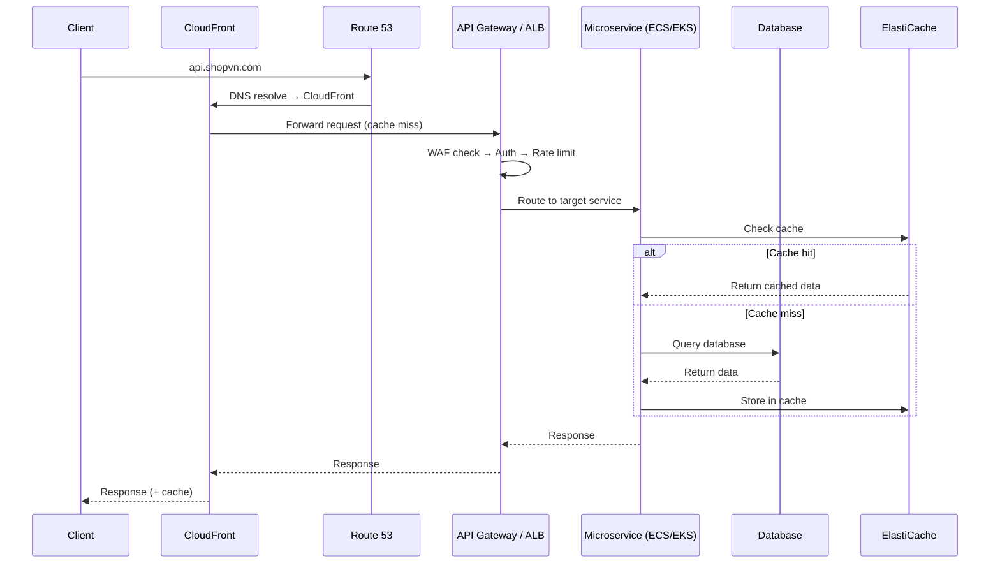
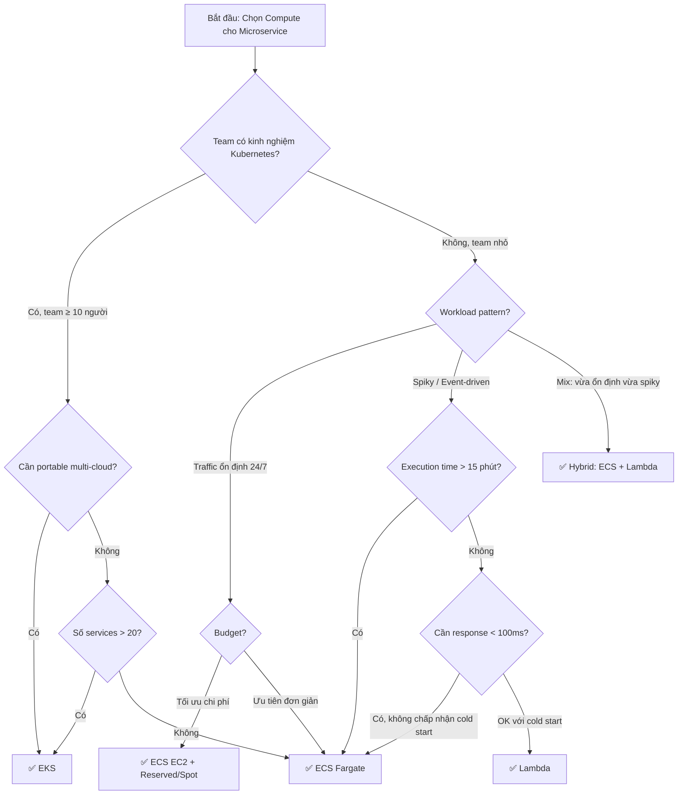

# Triển khai & Kiến trúc Microservice tổng quan trên AWS

## 📋 Mục lục

- [1. Giới thiệu](#1-giới-thiệu)
- [2. Kiến trúc Reference — Microservice trên AWS](#2-kiến-trúc-reference--microservice-trên-aws)
  - [2.1. Kiến trúc tổng quan](#21-kiến-trúc-tổng-quan)
  - [2.2. Các tầng (Layers) trong kiến trúc](#22-các-tầng-layers-trong-kiến-trúc)
  - [2.3. Traffic Flow — Luồng request từ client đến service](#23-traffic-flow--luồng-request-từ-client-đến-service)
- [3. Compute Options — ECS vs EKS vs Lambda](#3-compute-options--ecs-vs-eks-vs-lambda)
  - [3.1. ECS Fargate](#31-ecs-fargate)
  - [3.2. ECS trên EC2](#32-ecs-trên-ec2)
  - [3.3. EKS (Elastic Kubernetes Service)](#33-eks-elastic-kubernetes-service)
  - [3.4. AWS Lambda](#34-aws-lambda)
  - [3.5. So sánh tổng hợp](#35-so-sánh-tổng-hợp)
  - [3.6. Khi nào chọn gì? — Decision Tree](#36-khi-nào-chọn-gì--decision-tree)
  - [3.7. Hybrid Approach — Kết hợp nhiều compute](#37-hybrid-approach--kết-hợp-nhiều-compute)
- [4. Networking Foundation](#4-networking-foundation)
  - [4.1. VPC Design cho Microservice](#41-vpc-design-cho-microservice)
  - [4.2. Subnet Strategy](#42-subnet-strategy)
  - [4.3. Load Balancer — ALB vs NLB](#43-load-balancer--alb-vs-nlb)
  - [4.4. Service-to-Service Networking](#44-service-to-service-networking)
- [5. Container Registry — ECR](#5-container-registry--ecr)
  - [5.1. ECR Setup & Best Practices](#51-ecr-setup--best-practices)
  - [5.2. Image Lifecycle Policy](#52-image-lifecycle-policy)
  - [5.3. Image Scanning](#53-image-scanning)
- [6. Infrastructure as Code (IaC)](#6-infrastructure-as-code-iac)
  - [6.1. Tại sao IaC quan trọng với Microservice?](#61-tại-sao-iac-quan-trọng-với-microservice)
  - [6.2. AWS CDK](#62-aws-cdk)
  - [6.3. Terraform](#63-terraform)
  - [6.4. CDK vs Terraform — So sánh chi tiết](#64-cdk-vs-terraform--so-sánh-chi-tiết)
  - [6.5. Tổ chức IaC code cho Microservice](#65-tổ-chức-iac-code-cho-microservice)
- [7. Multi-Account Strategy](#7-multi-account-strategy)
  - [7.1. Tại sao cần nhiều AWS Account?](#71-tại-sao-cần-nhiều-aws-account)
  - [7.2. Account Structure](#72-account-structure)
  - [7.3. AWS Organizations & Control Tower](#73-aws-organizations--control-tower)
  - [7.4. Cross-Account Access](#74-cross-account-access)
- [8. Ví dụ thực tế — E-Commerce trên AWS](#8-ví-dụ-thực-tế--e-commerce-trên-aws)
- [9. Checklist triển khai](#9-checklist-triển-khai)
- [10. Anti-patterns](#10-anti-patterns)
- [11. Tổng kết](#11-tổng-kết)
- [12. Liên kết liên quan](#12-liên-kết-liên-quan)

---

## 1. Giới thiệu

Trong các doc trước, chúng ta đã hiểu cách **thiết kế Microservice** (doc [01](01-microservice-overview.md)–[17](17-design-patterns.md)) ở mức lý thuyết — decompose service, communication patterns, data management, resilience, CI/CD. Từ doc 18 trở đi, chúng ta sẽ **áp dụng tất cả kiến thức đó vào thực tế trên AWS**.

Doc này trả lời câu hỏi đầu tiên: **Microservice chạy ở đâu trên AWS? Kiến trúc tổng thể trông như thế nào? Dùng công cụ gì để quản lý hạ tầng?**

> 💡 Giả định: Bạn đã hiểu Microservice, Docker (doc [12](12-containerization.md)), Kubernetes (doc [13](13-orchestration.md)). Doc này tập trung vào **cách AWS hiện thực hóa** các khái niệm đó.

---

## 2. Kiến trúc Reference — Microservice trên AWS

### 2.1. Kiến trúc tổng quan

```
┌─────────────────────────────────────────────────────────────────────────────┐
│                              AWS CLOUD                                      │
│                                                                             │
│  ┌──────────────┐                                                           │
│  │  CloudFront  │ ◄── CDN, cache static content, DDoS protection            │
│  │  (CDN)       │                                                           │
│  └──────┬───────┘                                                           │
│         │                                                                   │
│  ┌──────▼───────┐                                                           │
│  │  Route 53    │ ◄── DNS routing, health check, failover                   │
│  │  (DNS)       │                                                           │
│  └──────┬───────┘                                                           │
│         │                                                                   │
│  ┌──────▼───────┐     ┌─────────────┐                                       │
│  │  API Gateway │ ──▶ │   WAF       │ ◄── Web Application Firewall          │
│  │  / ALB       │     └─────────────┘                                       │
│  └──────┬───────┘                                                           │
│         │                                                                   │
│  ┌──────▼──────────────────────────────────────────────────────┐            │
│  │                     VPC (10.0.0.0/16)                       │            │
│  │                                                             │            │
│  │  ┌─── Public Subnets ─────────────────────────────────┐     │            │
│  │  │  ┌──────────┐  ┌──────────┐                        │     │            │
│  │  │  │   NAT    │  │   ALB    │ ◄── Internal LB        │     │            │
│  │  │  │ Gateway  │  │(Internal)│                        │     │            │
│  │  │  └──────────┘  └────┬─────┘                        │     │            │
│  │  └─────────────────────┼──────────────────────────────┘     │            │
│  │                        │                                    │            │
│  │  ┌─── Private Subnets ─▼──────────────────────────────┐     │            │
│  │  │                                                    │     │            │
│  │  │  ┌─────────┐ ┌─────────┐ ┌─────────┐ ┌─────────┐   │     │            │
│  │  │  │ User    │ │ Product │ │  Order  │ │ Payment │   │     │            │
│  │  │  │ Service │ │ Service │ │ Service │ │ Service │   │     │            │
│  │  │  └────┬────┘ └────┬────┘ └────┬────┘ └────┬────┘   │     │            │
│  │  │       │           │           │           │        │     │            │
│  │  └───────┼───────────┼───────────┼───────────┼────────┘     │            │
│  │          │           │           │           │              │            │
│  │  ┌───── Data Subnets ▼───────────▼───────────▼──────────┐   │            │
│  │  │  ┌────────┐ ┌────────────┐ ┌───────┐ ┌───────────┐   │   │            │
│  │  │  │  RDS   │ │ DynamoDB   │ │ElastiC│ │    SQS    │   │   │            │
│  │  │  │(Aurora)│ │(Endpoint)  │ │ ache  │ │(Endpoint) │   │   │            │
│  │  │  └────────┘ └────────────┘ └───────┘ └───────────┘   │   │            │
│  │  └──────────────────────────────────────────────────────┘   │            │
│  │                                                             │            │
│  └─────────────────────────────────────────────────────────────┘            │
│                                                                             │
└─────────────────────────────────────────────────────────────────────────────┘
```

### 2.2. Các tầng (Layers) trong kiến trúc

| Tầng | AWS Services | Vai trò |
|------|-------------|---------|
| **Edge Layer** | CloudFront, Route 53, WAF, Shield | CDN, DNS, DDoS protection, caching static assets |
| **Ingress Layer** | API Gateway / ALB | Routing, rate limiting, authentication, SSL termination |
| **Compute Layer** | ECS Fargate / EKS / Lambda | Chạy các microservice containers |
| **Data Layer** | RDS, DynamoDB, ElastiCache, S3 | Lưu trữ dữ liệu, caching |
| **Messaging Layer** | SQS, SNS, EventBridge, MSK | Async communication giữa services |
| **Observability Layer** | CloudWatch, X-Ray, CloudTrail | Logs, metrics, traces, audit |
| **Security Layer** | IAM, Cognito, Secrets Manager, KMS | AuthN/AuthZ, secrets, encryption |

### 2.3. Traffic Flow — Luồng request từ client đến service



**Luồng đi qua từng layer:**

1. **Client** → gọi `api.shopvn.com`
2. **Route 53** → resolve DNS, health check, có thể failover
3. **CloudFront** → cache response cho GET requests, giảm tải backend
4. **API Gateway / ALB** → WAF filter → authenticate (JWT verify) → rate limit → route tới đúng service
5. **Service** → xử lý business logic, check cache trước → query DB nếu cần
6. **Response** → trả ngược qua các layer, CloudFront cache lại

---

## 3. Compute Options — ECS vs EKS vs Lambda

### 3.1. ECS Fargate

**ECS Fargate** = Container-as-a-Service — bạn chỉ cần lo container, AWS lo server.

```
┌─────────────────────────────────────────────────┐
│              ECS CLUSTER                        │
│                                                 │
│  ┌─────────── ECS Service ─────────────────┐    │
│  │                                         │    │
│  │  ┌──────────┐  ┌──────────┐  ┌────────┐ │    │
│  │  │  Task 1  │  │  Task 2  │  │ Task 3 │ │    │
│  │  │(Fargate) │  │(Fargate) │  │(Farg.) │ │    │
│  │  │          │  │          │  │        │ │    │
│  │  │ ┌──────┐ │  │ ┌──────┐ │  │┌──────┐│ │    │
│  │  │ │ App  │ │  │ │ App  │ │  ││ App  ││ │    │
│  │  │ │Contai│ │  │ │Contai│ │  ││Conta ││ │    │
│  │  │ │ ner  │ │  │ │ ner  │ │  ││iner  ││ │    │
│  │  │ └──────┘ │  │ └──────┘ │  │└──────┘│ │    │
│  │  └──────────┘  └──────────┘  └────────┘ │    │
│  │                                         │    │
│  │  ALB ──▶ Target Group ──▶ Tasks         │    │
│  └─────────────────────────────────────────┘    │
│                                                 │
│  ┌─────────── ECS Service (khác) ──────────┐    │
│  │  ...                                    │    │
│  └─────────────────────────────────────────┘    │
│                                                 │
└─────────────────────────────────────────────────┘
```

**Các khái niệm ECS:**

| Khái niệm | Mô tả | Tương đương K8s |
|-----------|--------|-----------------|
| **Cluster** | Nhóm logic chứa services | Cluster |
| **Task Definition** | "Blueprint" mô tả container: image, CPU, RAM, ports, env vars | Pod spec |
| **Task** | Một instance đang chạy của Task Definition | Pod |
| **Service** | Quản lý desired count, auto-restart, rolling update | Deployment + Service |
| **Target Group** | Gắn tasks vào ALB để nhận traffic | Service (type: LoadBalancer) |

**Ưu điểm:**

- **Zero server management** — không cần quản lý EC2, patching, AMI
- **Pay per task** — chỉ trả tiền cho CPU/RAM task thực sự dùng
- **Đơn giản** — ít concepts hơn K8s rất nhiều, team nhỏ dễ tiếp cận
- **Tích hợp AWS native** — IAM roles per task, CloudWatch logs tự động, Service Connect
- **Security** — mỗi task chạy isolated, không share kernel với task khác

**Nhược điểm:**

- **Giá cao hơn EC2** — Fargate pricing ~20-30% đắt hơn chạy trên EC2 tự quản
- **Giới hạn customization** — không thể tùy chỉnh host OS, kernel parameters
- **Không có DaemonSet** — không thể chạy 1 container trên mỗi host (vì không có "host")
- **Vendor lock-in** — ECS là AWS proprietary, không portable sang cloud khác
- **Startup chậm hơn EC2** — cold start ~30-60s cho Fargate task mới

### 3.2. ECS trên EC2

Giống ECS Fargate nhưng tasks chạy trên **EC2 instances do bạn quản lý**.

```
┌───────────────────────────────────────────────────┐
│              ECS CLUSTER (EC2 Launch Type)        │
│                                                   │
│  ┌────────── EC2 Instance 1 ───────────────┐      │
│  │  ECS Agent                              │      │
│  │  ┌──────────┐  ┌──────────┐             │      │
│  │  │  Task A  │  │  Task B  │             │      │
│  │  └──────────┘  └──────────┘             │      │
│  └─────────────────────────────────────────┘      │
│                                                   │
│  ┌────────── EC2 Instance 2 ───────────────┐      │
│  │  ECS Agent                              │      │
│  │  ┌──────────┐  ┌──────────┐             │      │
│  │  │  Task C  │  │  Task D  │             │      │
│  │  └──────────┘  └──────────┘             │      │
│  └─────────────────────────────────────────┘      │
└───────────────────────────────────────────────────┘
```

**Khi nào chọn ECS EC2 thay vì Fargate?**

| Tiêu chí | Chọn ECS EC2 |
|----------|-------------|
| **Chi phí** | Workload ổn định 24/7 → Reserved Instance/Savings Plans rẻ hơn Fargate 40-60% |
| **GPU** | Cần GPU cho ML inference (Fargate không hỗ trợ GPU — *đã hỗ trợ limited từ 2024*) |
| **DaemonSet** | Cần chạy logging agent, monitoring agent trên mỗi host |
| **Customization** | Cần tune kernel, mount EBS volumes, cài phần mềm đặc biệt |
| **Spot Instances** | Muốn dùng Spot Instance cho batch processing, giảm 60-90% chi phí |

### 3.3. EKS (Elastic Kubernetes Service)

**EKS** = AWS managed Kubernetes — AWS quản lý Control Plane, bạn quản lý worker nodes (hoặc dùng Fargate).

```
┌──────────────────────────────────────────────────────────┐
│                    EKS CLUSTER                           │
│                                                          │
│  ┌──── Control Plane (AWS Managed) ────┐                 │
│  │  API Server, etcd, Controller,      │                 │
│  │  Scheduler — Multi-AZ, auto-update  │                 │
│  └──────────────┬──────────────────────┘                 │
│                 │                                        │
│  ┌──── Data Plane (Bạn quản lý) ────────────────────┐    │
│  │                                                  │    │
│  │  ┌─ Managed Node Group ──────────────────┐       │    │
│  │  │  EC2 Instance    EC2 Instance         │       │    │
│  │  │  ┌─────┐┌─────┐ ┌─────┐┌─────┐        │       │    │
│  │  │  │Pod A││Pod B│ │Pod C││Pod D│        │       │    │
│  │  │  └─────┘└─────┘ └─────┘└─────┘        │       │    │
│  │  └───────────────────────────────────────┘       │    │
│  │                                                  │    │
│  │  ┌─ Fargate Profile ────────────────────┐        │    │
│  │  │  Fargate Pod E    Fargate Pod F      │        │    │
│  │  └──────────────────────────────────────┘        │    │
│  └──────────────────────────────────────────────────┘    │
│                                                          │
│  Add-ons: ALB Controller, EBS CSI, CoreDNS, kube-proxy   │
└──────────────────────────────────────────────────────────┘
```

**Ưu điểm:**

- **Kubernetes ecosystem** — Helm, Istio/Linkerd, ArgoCD, KEDA, Prometheus... toàn bộ CNCF ecosystem
- **Portable** — có thể migrate sang GKE, AKS, on-premise K8s
- **Powerful** — CRDs, Operators, DaemonSets, StatefulSets, Jobs, CronJobs
- **Fine-grained control** — Network Policies, Pod Security, Resource Quotas, RBAC
- **Multi-tenancy** — nhiều team dùng chung cluster qua namespaces

**Nhược điểm:**

- **Phức tạp** — learning curve cao, cần team có kinh nghiệm K8s
- **Chi phí Control Plane** — $0.10/giờ = ~$73/tháng chỉ cho control plane (chưa kể worker nodes)
- **Operational overhead** — upgrade cluster, manage add-ons, node group rotation
- **Over-engineering** — dùng K8s cho 3-5 services là quá phức tạp

### 3.4. AWS Lambda

**Lambda** = Function-as-a-Service — chạy code mà không cần quản lý bất kỳ server/container nào.

```
┌──────────────────────────────────────────────────────┐
│                   API Gateway                        │
│                                                      │
│   /users/*  ──▶  ┌─────────────────────┐             │
│                  │  User Lambda        │             │
│                  │  (Node.js)          │             │
│                  └─────────────────────┘             │
│                                                      │
│   /orders/* ──▶  ┌─────────────────────┐             │
│                  │  Order Lambda       │             │
│                  │  (Python)           │             │
│                  └─────────────────────┘             │
│                                                      │
│   /payments/*──▶ ┌─────────────────────┐             │
│                  │  Payment Lambda     │             │
│                  │  (Java)             │             │
│                  └─────────────────────┘             │
│                                                      │
│   SQS Queue ──▶  ┌─────────────────────┐             │
│                  │  Notification Lambda│             │
│                  │  (Python)           │             │
│                  └─────────────────────┘             │
└──────────────────────────────────────────────────────┘
```

**Ưu điểm:**

- **Zero ops** — hoàn toàn không quản lý server, container, cluster
- **Scale tự động** — từ 0 lên hàng nghìn concurrent executions
- **Pay per invocation** — không có traffic = không tốn tiền
- **Event-driven native** — trigger từ SQS, SNS, EventBridge, S3, DynamoDB Streams...
- **Polyglot** — mỗi function chọn runtime riêng (Node.js, Python, Java, Go, Rust...)

**Nhược điểm:**

- **Cold start** — lần đầu invoke mất 100ms-5s (Java/C# nặng nhất), ảnh hưởng P95 latency
- **Execution limit** — max 15 phút, max 10GB RAM
- **Stateless bắt buộc** — không giữ state giữa các lần invoke
- **Debugging khó** — khó reproduce locally, distributed debugging phức tạp
- **Vendor lock-in cao nhất** — code phụ thuộc Lambda handler format, event structure
- **Giá đắt khi traffic cao ổn định** — nếu chạy 24/7 full load, Lambda đắt hơn ECS/EKS nhiều lần

### 3.5. So sánh tổng hợp

| Tiêu chí | ECS Fargate | ECS EC2 | EKS | Lambda |
|----------|-------------|---------|-----|--------|
| **Quản lý server** | Không | Có (EC2) | Có (Node Groups) | Không |
| **Quản lý container** | Có (Task Def) | Có (Task Def) | Có (K8s manifests) | Không |
| **Độ phức tạp vận hành** | Thấp | Trung bình | Cao | Rất thấp |
| **Learning curve** | Thấp | Thấp-TB | Cao | Thấp |
| **Startup time** | 30-60s | 5-15s (task) | 5-15s (pod) | 100ms-5s (cold) |
| **Max execution time** | Unlimited | Unlimited | Unlimited | 15 phút |
| **Scaling** | Task-level | Task+EC2 level | Pod+Node level | Request-level |
| **Scale to zero** | Không (min 1 task) | Không | Không (trừ Karpenter) | Có ✅ |
| **Portable** | Không (AWS only) | Không | Có (K8s anywhere) | Không |
| **Chi phí cố định** | $0 (cluster free) | $0 + EC2 cost | $73/tháng (CP) | $0 |
| **Chi phí biến đổi** | Cao | Thấp-TB | TB (spot friendly) | Rất thấp→Rất cao |
| **GPU support** | Limited | Có | Có | Không |
| **Team size phù hợp** | 2-15 | 5-20 | 10+ | 1-10 |
| **Số services phù hợp** | 3-50 | 5-100 | 10-500+ | 1-50 (functions) |

### 3.6. Khi nào chọn gì? — Decision Tree



### 3.7. Hybrid Approach — Kết hợp nhiều compute

Trong thực tế, **không bắt buộc chọn 1 compute** cho tất cả services. Một kiến trúc phổ biến:

```
┌───────────────────────────────────────────────────────┐
│                  HYBRID ARCHITECTURE                  │
│                                                       │
│  ┌─── ECS Fargate (Core Services) ───────────────┐    │
│  │  User Service     ← traffic ổn định, stateful │    │
│  │  Product Service  ← cần low latency           │    │
│  │  Order Service    ← long-running processes    │    │
│  │  Payment Service  ← PCI compliance, isolated  │    │
│  └───────────────────────────────────────────────┘    │
│                                                       │
│  ┌─── Lambda (Event-driven / Lightweight) ───────┐    │
│  │  Notification     ← event-driven, spiky       │    │
│  │  Image Resize     ← trigger từ S3 upload      │    │
│  │  Recommendation   ← batch ML inference        │    │
│  │  Webhook Handler  ← infrequent, scale to 0    │    │
│  └───────────────────────────────────────────────┘    │
│                                                       │
│  ┌─── ECS EC2 + Spot (Batch / Workers) ─────────┐     │
│  │  Search Indexer   ← CPU intensive            │     │
│  │  Report Generator ← schedule-based, tolerant │     │
│  └──────────────────────────────────────────────┘     │
│                                                       │
└───────────────────────────────────────────────────────┘
```

**Nguyên tắc phân chia:**

| Đặc điểm workload | Compute phù hợp |
|-------------------|-----------------|
| Traffic ổn định, cần low latency, long-running | ECS Fargate |
| Event-driven, spiky, short execution, scale-to-zero | Lambda |
| CPU/GPU intensive, batch, cost-sensitive | ECS EC2 + Spot |
| Cần K8s ecosystem, multi-cloud, team lớn | EKS |

---

## 4. Networking Foundation

### 4.1. VPC Design cho Microservice

**VPC** (Virtual Private Cloud) là nền tảng network cho mọi thứ trên AWS. Thiết kế VPC tốt rất quan trọng vì **rất khó thay đổi sau này**.

```
┌───────────────────────────────────────────────────────────────┐
│                     VPC: 10.0.0.0/16                          │
│                     (65,536 IPs)                              │
│                                                               │
│  ┌───── AZ-a ──────────────┐  ┌───── AZ-b ──────────────┐     │
│  │                         │  │                         │     │
│  │ Public:  10.0.1.0/24    │  │ Public:  10.0.2.0/24    │     │
│  │ ┌─────────────────────┐ │  │ ┌─────────────────────┐ │     │
│  │ │ NAT GW, ALB, Bastion│ │  │ │ NAT GW, ALB         │ │     │
│  │ └─────────────────────┘ │  │ └─────────────────────┘ │     │
│  │                         │  │                         │     │
│  │ Private: 10.0.11.0/24   │  │ Private: 10.0.12.0/24   │     │
│  │ ┌─────────────────────┐ │  │ ┌─────────────────────┐ │     │
│  │ │ ECS Tasks / EKS Pods│ │  │ │ ECS Tasks / EKS Pods│ │     │
│  │ └─────────────────────┘ │  │ └─────────────────────┘ │     │
│  │                         │  │                         │     │
│  │ Data:    10.0.21.0/24   │  │ Data:    10.0.22.0/24   │     │
│  │ ┌─────────────────────┐ │  │ ┌─────────────────────┐ │     │
│  │ │ RDS, ElastiCache    │ │  │ │ RDS (Standby)       │ │     │
│  │ └─────────────────────┘ │  │ └─────────────────────┘ │     │
│  │                         │  │                         │     │
│  └─────────────────────────┘  └─────────────────────────┘     │
│                                                               │
└───────────────────────────────────────────────────────────────┘
```

### 4.2. Subnet Strategy

**3 tầng subnet — tối thiểu 2 AZ:**

| Tầng | CIDR (AZ-a) | CIDR (AZ-b) | Chứa gì | Internet Access |
|------|------------|------------|---------|-----------------|
| **Public** | 10.0.1.0/24 | 10.0.2.0/24 | NAT Gateway, ALB, Bastion Host | Có (Internet Gateway) |
| **Private** | 10.0.11.0/24 | 10.0.12.0/24 | ECS Tasks, EKS Pods, Lambda | Chỉ outbound (qua NAT) |
| **Data** | 10.0.21.0/24 | 10.0.22.0/24 | RDS, ElastiCache, OpenSearch | Không |

**Tại sao tách 3 tầng?**

- **Defense in depth** — kẻ tấn công phải vượt qua nhiều lớp
- **Least privilege networking** — DB subnet không có route ra Internet → không thể bị exfiltrate data
- **Compliance** — PCI-DSS yêu cầu network segmentation cho payment data
- **Blast radius** — nếu 1 service bị compromise, không thể nhảy thẳng vào DB

### 4.3. Load Balancer — ALB vs NLB

| Tiêu chí | ALB (Application LB) | NLB (Network LB) |
|----------|----------------------|-------------------|
| **Layer** | Layer 7 (HTTP/HTTPS) | Layer 4 (TCP/UDP/TLS) |
| **Routing** | Path-based, host-based, header-based | Port-based |
| **Protocol** | HTTP, HTTPS, gRPC, WebSocket | TCP, UDP, TLS |
| **Performance** | Hàng triệu req/s, latency ~ms | Hàng triệu req/s, latency ~μs |
| **Use case** | REST APIs, web apps, microservice routing | gRPC, IoT, gaming, extreme performance |
| **Health check** | HTTP status code | TCP connection / HTTP |
| **Sticky sessions** | Có (cookie-based) | Có (source IP) |
| **Chi phí** | ~$22/tháng + LCU | ~$22/tháng + NLCU |

**Recommend cho Microservice:**

- **ALB** cho hầu hết API services — path-based routing rất tiện: `/users/*` → User Service, `/orders/*` → Order Service
- **NLB** khi dùng gRPC (HTTP/2) hoặc cần extreme low latency
- **Kết hợp** — ALB cho external traffic, NLB cho internal gRPC giữa services

### 4.4. Service-to-Service Networking

Khi Service A cần gọi Service B **trong cùng VPC**, có 3 cách:

| Cách | Mô tả | Ưu điểm | Nhược điểm |
|------|-------|---------|-----------|
| **Internal ALB** | Mỗi service expose qua Internal ALB | Đơn giản, có health check, path routing | Thêm cost cho mỗi ALB (~$22/tháng) |
| **Service Connect (ECS)** | ECS native service discovery + load balancing | Không cần ALB, tích hợp sẵn ECS, có retry/timeout | Chỉ ECS, limited features |
| **Cloud Map** | AWS service discovery — DNS-based hoặc API-based | Flexible, dùng được với ECS/EKS/Lambda | Phải tự handle load balancing client-side |
| **App Mesh** | Service mesh — sidecar proxy (Envoy) | mTLS, observability, traffic control, circuit breaker | Legacy; AWS công bố End of Support ngày 30/09/2026 |
| **VPC Lattice** | Application networking service | Cross-VPC, cross-account, auth tích hợp, serverless | Cần thiết kế policy/auth rõ để tránh tăng độ phức tạp vận hành |

**Recommend:**

- **Bắt đầu:** Service Connect (ECS) hoặc Internal ALB — đơn giản, đủ dùng
- **Scale lên:** VPC Lattice khi cần cross-VPC, cross-account
- **EKS:** Kubernetes Service + Ingress Controller, hoặc Istio nếu cần service mesh

---

## 5. Container Registry — ECR

### 5.1. ECR Setup & Best Practices

**ECR** (Elastic Container Registry) là managed Docker registry trên AWS.

```
┌───────────────────────────────────────────────────┐
│                    ECR                            │
│                                                   │
│  ┌──── Repository: user-service ───────────┐      │
│  │  :latest                                │      │
│  │  :v1.2.3                                │      │
│  │  :abc123f (git commit SHA)              │      │
│  └─────────────────────────────────────────┘      │
│                                                   │
│  ┌──── Repository: order-service ──────────┐      │
│  │  :latest                                │      │
│  │  :v2.0.1                                │      │
│  └─────────────────────────────────────────┘      │
│                                                   │
│  ┌──── Repository: payment-service ────────┐      │
│  │  ...                                    │      │
│  └─────────────────────────────────────────┘      │
└───────────────────────────────────────────────────┘
```

**Best practices:**

- **1 repository per service** — `{account}.dkr.ecr.{region}.amazonaws.com/{service-name}`
- **Immutable tags** — bật immutable tag để tránh overwrite image đã deploy
- **Tag strategy** — dùng git commit SHA (`abc123f`) cho traceability, semver (`v1.2.3`) cho release

### 5.2. Image Lifecycle Policy

Tránh tích lũy hàng nghìn images cũ tốn storage:

```json
{
  "rules": [
    {
      "rulePriority": 1,
      "description": "Giữ 20 images gần nhất có tag",
      "selection": {
        "tagStatus": "tagged",
        "countType": "imageCountMoreThan",
        "countNumber": 20
      },
      "action": { "type": "expire" }
    },
    {
      "rulePriority": 2,
      "description": "Xóa images untagged sau 3 ngày",
      "selection": {
        "tagStatus": "untagged",
        "countType": "sinceImagePushed",
        "countUnit": "days",
        "countNumber": 3
      },
      "action": { "type": "expire" }
    }
  ]
}
```

### 5.3. Image Scanning

- **Basic scanning** (free) — scan khi push, phát hiện OS vulnerabilities (CVE database)
- **Enhanced scanning** (Inspector) — continuous scanning, application dependencies (npm, pip, maven), richer findings
- **Recommend:** Bật enhanced scanning cho production images, block deployment nếu có CRITICAL/HIGH vulnerabilities

---

## 6. Infrastructure as Code (IaC)

### 6.1. Tại sao IaC quan trọng với Microservice?

Với Monolith, bạn có thể setup infra thủ công qua Console. Với Microservice — **mỗi service cần riêng**: ALB target group, ECS service, task definition, security group, IAM role, CloudWatch log group... Nhân với 10-20 services = **hàng trăm resources**. Quản lý thủ công → không thể tái tạo, không audit được, drift liên tục.

**IaC giải quyết:**

| Vấn đề | IaC Solution |
|--------|-------------|
| "Ai đã thay đổi Security Group?" | Git history, PR review |
| "Tạo lại staging giống production" | `terraform apply` / `cdk deploy` |
| "Service mới cần setup giống service cũ" | Template/module, copy & customize |
| "Rollback infra về trạng thái cũ" | `git revert` → re-deploy |

### 6.2. AWS CDK

**CDK** (Cloud Development Kit) — viết infrastructure bằng ngôn ngữ lập trình (TypeScript, Python, Java, Go).

```typescript
// CDK Example: Tạo ECS Fargate Service
import * as cdk from 'aws-cdk-lib';
import * as ecs from 'aws-cdk-lib/aws-ecs';
import * as patterns from 'aws-cdk-lib/aws-ecs-patterns';

const service = new patterns.ApplicationLoadBalancedFargateService(this, 'UserService', {
  cluster,
  taskImageOptions: {
    image: ecs.ContainerImage.fromEcrRepository(repo, 'v1.0.0'),
    containerPort: 8080,
    environment: {
      DB_HOST: dbInstance.dbInstanceEndpointAddress,
    },
    secrets: {
      DB_PASSWORD: ecs.Secret.fromSecretsManager(dbSecret),
    },
  },
  desiredCount: 2,
  cpu: 512,
  memoryLimitMiB: 1024,
  publicLoadBalancer: false,  // Internal ALB
});

// Auto Scaling
const scaling = service.service.autoScaleTaskCount({ maxCapacity: 10 });
scaling.scaleOnCpuUtilization('CpuScaling', {
  targetUtilizationPercent: 70,
});
```

**Ưu điểm CDK:**
- Viết bằng ngôn ngữ quen thuộc (TypeScript, Python...)
- IDE support: autocomplete, type checking, refactor
- High-level constructs (L2/L3) — 1 class tạo cả ALB + ECS + Security Group + IAM
- Unit test được (jest, pytest)

**Nhược điểm CDK:**
- AWS only
- Phụ thuộc CloudFormation underneath → chậm, stack limit 500 resources
- State management phức tạp khi rename/refactor
- Breaking changes giữa CDK versions

### 6.3. Terraform

**Terraform** (by HashiCorp) — khai báo infrastructure bằng HCL (HashiCorp Configuration Language).

```hcl
# Terraform Example: Tạo ECS Fargate Service
resource "aws_ecs_service" "user_service" {
  name            = "user-service"
  cluster         = aws_ecs_cluster.main.id
  task_definition = aws_ecs_task_definition.user.arn
  desired_count   = 2
  launch_type     = "FARGATE"

  network_configuration {
    subnets          = var.private_subnet_ids
    security_groups  = [aws_security_group.user_service.id]
    assign_public_ip = false
  }

  load_balancer {
    target_group_arn = aws_lb_target_group.user.arn
    container_name   = "user-service"
    container_port   = 8080
  }
}

resource "aws_appautoscaling_target" "user_service" {
  max_capacity       = 10
  min_capacity       = 2
  resource_id        = "service/${aws_ecs_cluster.main.name}/${aws_ecs_service.user_service.name}"
  scalable_dimension = "ecs:service:DesiredCount"
  service_namespace  = "ecs"
}
```

**Ưu điểm Terraform:**
- **Multi-cloud** — AWS, GCP, Azure, Kubernetes, Datadog, PagerDuty...
- **State management rõ ràng** — `terraform.tfstate` chứa trạng thái thực tế
- **`terraform plan`** — xem trước thay đổi trước khi apply
- **Module ecosystem** — Terraform Registry có hàng nghìn modules sẵn
- **Mature** — community lớn, documentation tốt, nhiều best practices

**Nhược điểm Terraform:**
- HCL learning curve (không phải ngôn ngữ lập trình thông thường)
- State file quản lý phức tạp (remote backend, locking, sensitive data)
- Không có IDE support tốt bằng TypeScript/CDK
- License thay đổi (BSL) → OpenTofu fork

### 6.4. CDK vs Terraform — So sánh chi tiết

| Tiêu chí | AWS CDK | Terraform |
|----------|---------|-----------|
| **Ngôn ngữ** | TypeScript, Python, Java, Go, C# | HCL (hoặc CDKTF) |
| **Multi-cloud** | ❌ AWS only | ✅ Multi-cloud |
| **Underlying** | CloudFormation | Terraform Core |
| **State** | CloudFormation stack | terraform.tfstate |
| **Preview changes** | `cdk diff` | `terraform plan` |
| **High-level abstractions** | ✅ L2/L3 constructs rất mạnh | ⚠️ Modules (phải viết hoặc tìm) |
| **Learning curve** | Thấp (nếu biết TypeScript) | Trung bình (HCL mới) |
| **Destroy resources** | `cdk destroy` | `terraform destroy` |
| **Community** | Đang growing | Rất lớn, mature |
| **CI/CD integration** | CodePipeline, GitHub Actions | Terraform Cloud, Atlantis, Spacelift |
| **Phù hợp khi** | All-in AWS, team dev-oriented | Multi-cloud, infra team, existing Terraform |

### 6.5. Tổ chức IaC code cho Microservice

**Cách 1 — Monorepo (recommended cho team nhỏ-vừa):**

```
infra/
├── modules/
│   ├── ecs-service/          # Reusable module cho mỗi service
│   │   ├── main.tf
│   │   ├── variables.tf
│   │   └── outputs.tf
│   ├── rds/
│   ├── vpc/
│   └── monitoring/
├── environments/
│   ├── dev/
│   │   ├── main.tf           # Gọi modules với dev parameters
│   │   └── terraform.tfvars
│   ├── staging/
│   └── prod/
└── services/
    ├── user-service/
    │   └── main.tf           # Gọi module ecs-service với config riêng
    ├── order-service/
    └── payment-service/
```

**Cách 2 — Per-service repo (cho team lớn, service ownership rõ ràng):**

```
# Repo: user-service
user-service/
├── src/                      # Application code
├── Dockerfile
├── infra/                    # IaC riêng cho service này
│   ├── main.tf
│   ├── variables.tf
│   └── terraform.tfvars
└── .github/workflows/        # CI/CD deploy cả code + infra

# Repo: shared-infra          # VPC, RDS, shared resources
shared-infra/
├── vpc/
├── rds/
└── monitoring/
```

---

## 7. Multi-Account Strategy

### 7.1. Tại sao cần nhiều AWS Account?

Một AWS Account cho tất cả (dev, staging, prod) → **nguy hiểm**:

- Dev vô tình xóa production database
- IAM permissions quá phức tạp — ai được access gì?
- Billing lẫn lộn — không biết production tốn bao nhiêu
- Service Quotas chia sẻ — dev dùng hết Lambda concurrency → production bị throttle
- Blast radius lớn — 1 security breach ảnh hưởng tất cả

### 7.2. Account Structure

```
┌──────────────────────────────────────────────────────────────┐
│                  AWS Organizations                           │
│                  (Management Account)                        │
│                                                              │
│  ┌───── Security OU ──────────────────────┐                  │
│  │  ┌──────────────┐  ┌────────────────┐  │                  │
│  │  │   Security   │  │    Logging     │  │                  │
│  │  │   Account    │  │    Account     │  │                  │
│  │  │  (GuardDuty, │  │  (CloudTrail,  │  │                  │
│  │  │   Config)    │  │   centralized  │  │                  │
│  │  └──────────────┘  │   logs)        │  │                  │
│  │                    └────────────────┘  │                  │
│  └────────────────────────────────────────┘                  │
│                                                              │
│  ┌───── Infrastructure OU ────────────────┐                  │
│  │  ┌──────────────┐  ┌────────────────┐  │                  │
│  │  │   Shared     │  │   Networking   │  │                  │
│  │  │   Services   │  │   Account      │  │                  │
│  │  │  (ECR, CI/CD │  │  (Transit GW,  │  │                  │
│  │  │   tooling)   │  │   VPC Peering) │  │                  │
│  │  └──────────────┘  └────────────────┘  │                  │
│  └────────────────────────────────────────┘                  │
│                                                              │
│  ┌───── Workload OU ──────────────────────┐                  │
│  │  ┌─────────┐  ┌──────────┐  ┌────────┐ │                  │
│  │  │   Dev   │  │ Staging  │  │  Prod  │ │                  │
│  │  │ Account │  │ Account  │  │Account │ │                  │
│  │  └─────────┘  └──────────┘  └────────┘ │                  │
│  └────────────────────────────────────────┘                  │
│                                                              │
└──────────────────────────────────────────────────────────────┘
```

### 7.3. AWS Organizations & Control Tower

| Công cụ | Vai trò |
|---------|---------|
| **AWS Organizations** | Quản lý multi-account, consolidated billing, SCPs (Service Control Policies) |
| **Control Tower** | Automated account setup, guardrails, landing zone — "best practices as code" |
| **SCPs** | Chặn hành động nguy hiểm ở level Organization: cấm xóa CloudTrail, cấm dùng region ngoài ap-southeast-1... |
| **SSO (IAM Identity Center)** | Single sign-on cho tất cả accounts — dev dùng 1 credential access dev/staging |

### 7.4. Cross-Account Access

**ECR Cross-Account** — production account pull image từ shared ECR:

```
┌─────────────────┐         ┌─────────────────┐
│  Shared Account │         │   Prod Account  │
│                 │         │                 │
│  ┌───────────┐  │  pull   │  ┌───────────┐  │
│  │    ECR    │──┼────────▶│  │ ECS Task  │  │
│  │ (images)  │  │         │  └───────────┘  │
│  └───────────┘  │         │                 │
│                 │         │                 │
│  ┌───────────┐  │ assume  │  ┌───────────┐  │
│  │  CI/CD    │──┼────────▶│  │ Deploy    │  │
│  │ Pipeline  │  │  role   │  │  Role     │  │
│  └───────────┘  │         │  └───────────┘  │
└─────────────────┘         └─────────────────┘
```

**Cách hoạt động:**

1. CI/CD pipeline ở Shared Account build image → push lên ECR (Shared)
2. ECR repository policy cho phép Prod Account pull
3. CI/CD assume cross-account role vào Prod Account → update ECS service
4. ECS task ở Prod Account pull image từ ECR (Shared) qua ECR repository policy

**Minimum accounts cho startup:**

| Scenario | Số accounts | Cấu trúc |
|----------|------------|---------|
| **MVP / Startup** | 2 | Prod + Non-Prod (dev/staging chung) |
| **Đang phát triển** | 4 | Prod + Staging + Dev + Shared (CI/CD, ECR) |
| **Enterprise** | 6-8+ | Thêm Security, Logging, Networking, Sandbox |

---

## 8. Ví dụ thực tế — E-Commerce trên AWS

> 🔗 Tham khảo đề bài chi tiết tại [25 — Case Study: E-Commerce](25-case-study-ecommerce.md)

Áp dụng cho hệ thống **ShopVN** (200K DAU, 50K đơn/ngày):

### Compute Choice

| Service | Compute | Lý do |
|---------|---------|-------|
| User Service | ECS Fargate | Traffic ổn định, cần low latency cho login |
| Product Service | ECS Fargate | Read-heavy, cần cache, response nhanh |
| Order Service | ECS Fargate | Long-running saga, cần reliable |
| Payment Service | ECS Fargate | PCI compliance, isolated networking |
| Inventory Service | ECS Fargate | Write-heavy, cần consistency |
| Search Service | ECS Fargate | CPU intensive indexing, ổn định |
| Notification Service | Lambda | Event-driven, spiky (flash sale), scale-to-zero ban đêm |
| Image Processing | Lambda | Trigger từ S3 upload, stateless, short execution |
| Recommendation | Lambda + Step Functions | Batch processing, ML inference |
| Report/Analytics | ECS EC2 (Spot) | CPU intensive, tolerant interruption, giảm 70% cost |

### Infrastructure

```
Account: Production
├── VPC: 10.0.0.0/16, 2 AZ (ap-southeast-1a, 1b)
├── ECS Cluster: shopvn-prod
│   ├── 7 Fargate Services (User, Product, Order, Payment, Inventory, Search, Cart)
│   └── 1 EC2 Service + Spot (Report)
├── ALB: External (api.shopvn.com) + Internal (service-to-service)
├── Lambda: 3 functions (Notification, Image, Recommendation)
├── RDS Aurora PostgreSQL: Multi-AZ (Order, User, Inventory)
├── DynamoDB: Cart, Session
├── ElastiCache Redis: Product cache, session store
├── SQS: Order events, Notification queue
├── S3: Product images, static assets
└── CloudFront: CDN cho static + API caching
```

### Chi phí ước tính (monthly)

| Resource | Spec | Chi phí ước tính |
|----------|------|-----------------|
| ECS Fargate (7 services × 2 tasks) | 0.5 vCPU, 1GB each | ~$200 |
| ECS EC2 Spot (Report) | 2× c5.xlarge Spot | ~$50 |
| ALB (External + Internal) | 2 ALBs | ~$44 |
| RDS Aurora Multi-AZ | db.r5.large | ~$400 |
| DynamoDB | On-demand, ~5M req/ngày | ~$50 |
| ElastiCache Redis | cache.r5.large, 2 nodes | ~$300 |
| Lambda | ~10M invocations/tháng | ~$20 |
| NAT Gateway | 2 AZ, ~500GB data | ~$100 |
| CloudFront | ~2TB transfer | ~$170 |
| S3 | ~500GB storage | ~$12 |
| ECR | ~50GB images | ~$5 |
| CloudWatch | Logs, metrics, alarms | ~$50 |
| **Tổng cộng** | | **~$1,400/tháng** |

> ⚠️ Con số ước tính, chi phí thực tế phụ thuộc vào traffic pattern, data transfer, reserved pricing.

---

## 9. Checklist triển khai

### Networking
- [ ] VPC với CIDR đủ lớn (/16)
- [ ] Tối thiểu 2 AZ
- [ ] 3 tầng subnet: public, private, data
- [ ] NAT Gateway cho private subnet
- [ ] VPC Flow Logs bật
- [ ] Security Groups theo least privilege

### Compute
- [ ] Chọn compute phù hợp từng service (ECS/EKS/Lambda)
- [ ] Task/Pod sizing (CPU, RAM) dựa trên load testing
- [ ] Auto Scaling policy configured
- [ ] Health check endpoints

### Container Registry
- [ ] ECR repositories per service
- [ ] Immutable tags enabled
- [ ] Lifecycle policy configured
- [ ] Image scanning enabled

### IaC
- [ ] Toàn bộ infra trong code (Terraform/CDK)
- [ ] Remote state (S3 + DynamoDB lock)
- [ ] Modules cho reusable components
- [ ] PR review cho mọi infra change

### Multi-Account
- [ ] Tách production khỏi non-production
- [ ] SCPs cho guardrails
- [ ] Cross-account roles cho CI/CD
- [ ] Consolidated billing

---

## 10. Anti-patterns

| Anti-pattern | Vấn đề | Nên làm |
|-------------|--------|---------|
| **Console Cowboy** | Tạo/sửa resources bằng tay trên Console | Dùng IaC, cấm manual changes ở prod (SCPs) |
| **One Account Fits All** | Dev, staging, prod chung 1 account | Multi-account strategy |
| **Over-sizing** | Mỗi service dùng 4 vCPU, 8GB RAM "cho chắc" | Right-sizing dựa trên metrics, bắt đầu nhỏ |
| **EKS cho 3 services** | Dùng K8s khi chỉ có 3 services, team 3 người | ECS Fargate đơn giản hơn nhiều |
| **Lambda cho mọi thứ** | Dùng Lambda cho long-running, stateful workloads | Lambda cho event-driven, ngắn; ECS cho phần còn lại |
| **Public Subnets Everywhere** | Đặt ECS tasks trong public subnet | Private subnet + NAT Gateway |
| **No Tagging** | Resources không tag → không biết ai tạo, thuộc service nào | Tagging strategy: Environment, Service, Team, CostCenter |
| **Ignoring NAT Gateway Cost** | NAT Gateway tốn $0.045/GB data + $0.045/giờ | Dùng VPC Endpoints cho S3, DynamoDB, ECR, CloudWatch |

---

## 11. Tổng kết

```
┌──────────────────────────────────────────────────────────┐
│              DECISION SUMMARY                            │
│                                                          │
│  Compute:                                                │
│  • Team nhỏ, đơn giản      → ECS Fargate                 │
│  • Team lớn, cần K8s       → EKS                         │
│  • Event-driven, spiky     → Lambda                      │
│  • Cost-sensitive batch    → ECS EC2 + Spot              │
│  • Thực tế                 → Hybrid (mix các loại)       │
│                                                          │
│  Networking:                                             │
│  • VPC 3 tầng, multi-AZ                                  │
│  • ALB cho HTTP, NLB cho gRPC                            │
│  • Service Connect hoặc Internal ALB giữa services       │
│                                                          │
│  IaC:                                                    │
│  • AWS only               → CDK (TypeScript)             │
│  • Multi-cloud/team infra → Terraform                    │
│                                                          │
│  Accounts:                                               │
│  • Minimum: Prod + Non-Prod                              │
│  • Recommended: Prod + Staging + Dev + Shared            │
│                                                          │
└──────────────────────────────────────────────────────────┘
```

**Key takeaways:**

1. **Bắt đầu đơn giản** — ECS Fargate + ALB là đủ cho hầu hết startup/team nhỏ
2. **Hybrid là thực tế** — không cần chọn 1 compute cho tất cả, mix theo đặc tính workload
3. **IaC từ ngày đầu** — đừng tạo resource bằng Console rồi "sau chuyển sang Terraform"
4. **Multi-account sớm** — tách prod khỏi non-prod ngay từ đầu, sau rất khó migrate
5. **Right-size, đo lường** — bắt đầu nhỏ, monitor, scale theo metrics thực tế

---

## 12. Liên kết liên quan

- [12 — Containerization](12-containerization.md) — Docker fundamentals
- [13 — Orchestration](13-orchestration.md) — Kubernetes concepts
- [14 — CI/CD & Deployment](14-cicd-deployment.md) — Pipeline & deployment strategies
- [19 — Communication & Service Discovery trên AWS](19-aws-communication-discovery.md) — API Gateway, Service Connect, VPC Lattice, SQS/SNS
- [21 — Resilience & Auto Scaling trên AWS](21-aws-resilience.md) — Auto Scaling, Multi-AZ, Circuit Breaker
- [24 — CI/CD & Deployment Strategies trên AWS](24-aws-cicd-deployment.md) — AWS-specific CI/CD
- [25 — Case Study: E-Commerce](25-case-study-ecommerce.md) — Áp dụng tổng hợp
