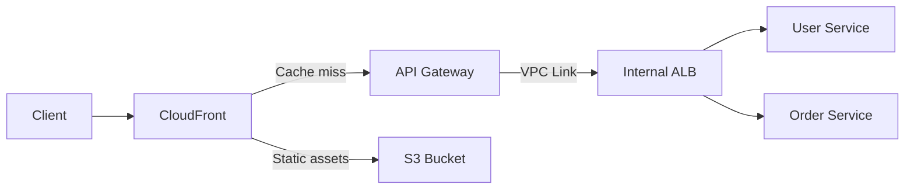
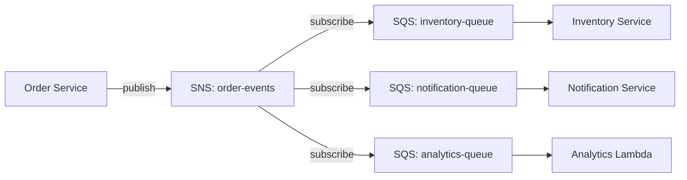
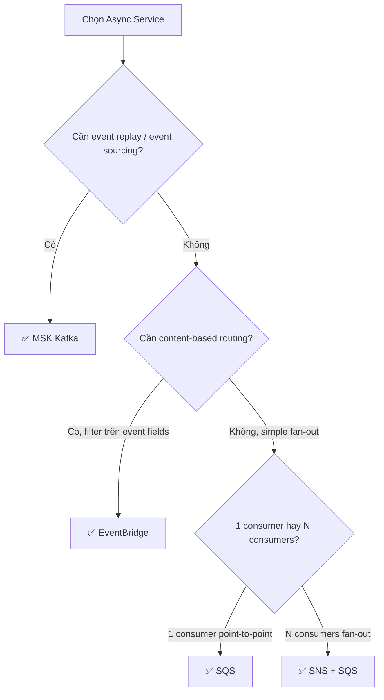
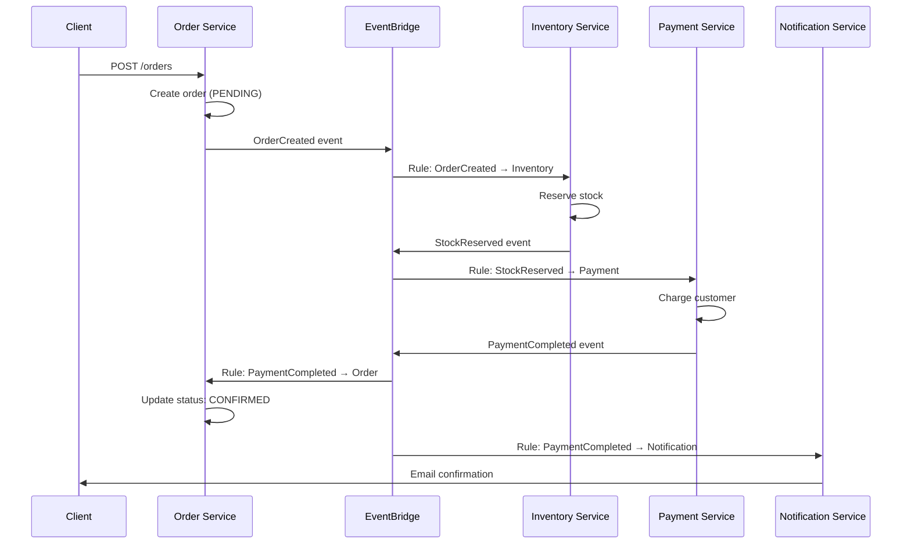

# Communication & Service Discovery trên AWS

## 📋 Mục lục

- [1. Giới thiệu](#1-giới-thiệu)
- [2. Ingress — Client-to-Service Communication](#2-ingress--client-to-service-communication)
  - [2.1. Amazon API Gateway](#21-amazon-api-gateway)
  - [2.2. ALB (Application Load Balancer) làm API Gateway](#22-alb-application-load-balancer-làm-api-gateway)
  - [2.3. API Gateway vs ALB — Chọn cái nào?](#23-api-gateway-vs-alb--chọn-cái-nào)
  - [2.4. CloudFront + API Gateway/ALB — Edge Layer](#24-cloudfront--api-gatewayalb--edge-layer)
  - [2.5. BFF Pattern trên AWS](#25-bff-pattern-trên-aws)
- [3. Synchronous — Service-to-Service Communication](#3-synchronous--service-to-service-communication)
  - [3.1. Internal ALB](#31-internal-alb)
  - [3.2. ECS Service Connect](#32-ecs-service-connect)
  - [3.3. AWS Cloud Map](#33-aws-cloud-map)
  - [3.4. VPC Lattice](#34-vpc-lattice)
  - [3.5. App Mesh (Envoy Sidecar)](#35-app-mesh-envoy-sidecar)
  - [3.6. So sánh các phương pháp Sync](#36-so-sánh-các-phương-pháp-sync)
- [4. Asynchronous Communication trên AWS](#4-asynchronous-communication-trên-aws)
  - [4.1. Amazon SQS — Message Queue](#41-amazon-sqs--message-queue)
  - [4.2. Amazon SNS — Pub/Sub](#42-amazon-sns--pubsub)
  - [4.3. SQS + SNS — Fanout Pattern](#43-sqs--sns--fanout-pattern)
  - [4.4. Amazon EventBridge — Event Bus](#44-amazon-eventbridge--event-bus)
  - [4.5. Amazon MSK (Managed Kafka)](#45-amazon-msk-managed-kafka)
  - [4.6. SQS vs SNS vs EventBridge vs MSK — Chọn cái nào?](#46-sqs-vs-sns-vs-eventbridge-vs-msk--chọn-cái-nào)
- [5. Patterns thực tế trên AWS](#5-patterns-thực-tế-trên-aws)
  - [5.1. Choreography với EventBridge](#51-choreography-với-eventbridge)
  - [5.2. Orchestration với Step Functions](#52-orchestration-với-step-functions)
  - [5.3. Outbox Pattern trên AWS](#53-outbox-pattern-trên-aws)
  - [5.4. Dead Letter Queue (DLQ)](#54-dead-letter-queue-dlq)
  - [5.5. FIFO vs Standard Queue](#55-fifo-vs-standard-queue)
- [6. Ví dụ thực tế — E-Commerce Communication Map](#6-ví-dụ-thực-tế--e-commerce-communication-map)
- [7. Anti-patterns](#7-anti-patterns)
- [8. Checklist triển khai](#8-checklist-triển-khai)
- [9. Tổng kết](#9-tổng-kết)
- [10. Liên kết liên quan](#10-liên-kết-liên-quan)

---

## 1. Giới thiệu

Trong [doc 18](18-aws-deployment-architecture.md), chúng ta đã thiết lập **nền tảng**: VPC, compute (ECS/EKS/Lambda), networking. Câu hỏi tiếp theo: **Các service giao tiếp với nhau thế nào trên AWS?**

Doc này áp dụng kiến thức từ doc [06 — Inter-Service Communication](06-inter-service-communication.md), [07 — API Gateway](07-api-gateway.md), [08 — Service Discovery](08-service-discovery.md) vào thực tế AWS — mapping từng pattern lý thuyết sang AWS service cụ thể.

```
┌────────────────────────────────────────────────────────────────┐
│              COMMUNICATION LANDSCAPE trên AWS                  │
│                                                                │
│  ┌─────────── Client → Service (Ingress) ────────────────┐     │
│  │  API Gateway (REST/WebSocket)                         │     │
│  │  ALB (HTTP routing)                                   │     │
│  │  CloudFront (CDN + Edge)                              │     │
│  └───────────────────────────────────────────────────────┘     │
│                                                                │
│  ┌─────────── Service → Service (Sync) ──────────────────┐     │
│  │  Internal ALB          ← đơn giản, HTTP routing       │     │
│  │  ECS Service Connect   ← ECS native, zero-config      │     │
│  │  Cloud Map             ← DNS-based discovery          │     │
│  │  VPC Lattice           ← cross-VPC, cross-account     │     │
│  │  App Mesh              ← service mesh (Envoy)         │     │
│  └───────────────────────────────────────────────────────┘     │
│                                                                │
│  ┌─────────── Service → Service (Async) ─────────────────┐     │
│  │  SQS                   ← point-to-point queue         │     │
│  │  SNS                   ← pub/sub fan-out              │     │
│  │  EventBridge           ← event bus, routing rules     │     │
│  │  MSK (Kafka)           ← event streaming, replay      │     │
│  │  Step Functions        ← orchestration workflows      │     │
│  └───────────────────────────────────────────────────────┘     │
│                                                                │
└────────────────────────────────────────────────────────────────┘
```

---

## 2. Ingress — Client-to-Service Communication

### 2.1. Amazon API Gateway

**API Gateway** (APIGW) — managed service cho REST, HTTP, và WebSocket APIs.

```
┌───────────────────────────────────────────────────────────────┐
│                    API Gateway                                │
│                                                               │
│  ┌─── REST API ──────────────────────────────────────────┐    │
│  │                                                       │    │
│  │  /users/{id}   GET  ──▶ Lambda (User)                 │    │
│  │  /users        POST ──▶ Lambda (User)                 │    │
│  │  /orders       POST ──▶ ECS (Order Service) via VPC   │    │
│  │  /products     GET  ──▶ ECS (Product) via ALB         │    │
│  │                                                       │    │
│  │  Features:                                            │    │
│  │  • Cognito Authorizer (JWT verify)                    │    │
│  │  • Usage Plans + API Keys (rate limiting per client)  │    │
│  │  • Request validation (JSON Schema)                   │    │
│  │  • Response caching (per-stage TTL)                   │    │
│  │  • WAF integration                                    │    │
│  │  • Custom domain (api.shopvn.com)                     │    │
│  └───────────────────────────────────────────────────────┘    │
│                                                               │
│  ┌─── HTTP API (v2) ─────────────────────────────────────┐    │
│  │  Nhẹ hơn REST API, rẻ hơn ~70%                        │    │
│  │  Đủ dùng cho hầu hết use cases                        │    │
│  │  JWT authorizer built-in, CORS auto                   │    │
│  │  Nhưng: không có caching, validation, usage plans     │    │
│  └───────────────────────────────────────────────────────┘    │
│                                                               │
│  ┌─── WebSocket API ─────────────────────────────────────┐    │
│  │  Real-time: chat, notifications, live updates         │    │
│  │  $connect → Lambda → DynamoDB (connection store)      │    │
│  │  $disconnect → cleanup                                │    │
│  │  Custom routes → Lambda handlers                      │    │
│  └───────────────────────────────────────────────────────┘    │
│                                                               │
└───────────────────────────────────────────────────────────────┘
```

**3 loại API Gateway:**

| Loại | Giá | Use case | Giới hạn |
|------|-----|----------|----------|
| **REST API** | $3.50/triệu requests | Full-featured: caching, validation, usage plans, WAF | 10,000 req/s (regional) |
| **HTTP API** | $1.00/triệu requests | Simple proxy, JWT auth, CORS — đủ dùng hầu hết | 10,000 req/s |
| **WebSocket API** | $1.00/triệu messages | Real-time bidirectional | 500 connections/s |

**Integration types — APIGW connect tới backend thế nào?**

| Type | Mô tả | Khi nào dùng |
|------|-------|-------------|
| **Lambda** | Invoke Lambda function | Serverless backend |
| **HTTP/HTTP_PROXY** | Forward tới HTTP endpoint (ALB, ECS, external) | Container services |
| **VPC Link** | Connect tới private resources trong VPC | ECS/EKS private subnets |
| **AWS Service** | Gọi thẳng AWS service (SQS, Step Functions, DynamoDB) | Bỏ qua Lambda, giảm latency + cost |
| **Mock** | Trả response cố định | Testing, stub APIs |

> 💡 **Pro tip**: APIGW → SQS integration (không qua Lambda) rất mạnh cho write-heavy APIs. Client POST → APIGW → SQS → consumer xử lý async. Giảm latency, tăng throughput, không cần Lambda trung gian.

### 2.2. ALB (Application Load Balancer) làm API Gateway

ALB không phải "API Gateway" theo đúng nghĩa, nhưng có thể đóng vai trò tương tự cho nhiều use cases:

```
┌──────────────────────────────────────────────────────────┐
│                    ALB as API Router                     │
│                                                          │
│  Listener Rules (đánh giá theo thứ tự priority):         │
│                                                          │
│  Rule 1: Host = api.shopvn.com                           │
│          Path = /users/*     → Target Group: User        │
│  Rule 2: Path = /orders/*    → Target Group: Order       │
│  Rule 3: Path = /products/*  → Target Group: Product     │
│  Rule 4: Path = /payments/*  → Target Group: Payment     │
│  Default: → 404 fixed response                           │
│                                                          │
│  Features:                                               │
│  • Path-based routing                                    │
│  • Host-based routing (multi-domain)                     │
│  • Header/Query-based routing                            │
│  • Weighted target groups (canary)                       │
│  • Sticky sessions                                       │
│  • Health check per target group                         │
│  • gRPC support (HTTP/2)                                 │
│  • Authentication (Cognito / OIDC built-in)              │
│                                                          │
└──────────────────────────────────────────────────────────┘
```

### 2.3. API Gateway vs ALB — Chọn cái nào?

| Tiêu chí | API Gateway (HTTP API) | ALB |
|----------|----------------------|-----|
| **Giá** | $1.00/triệu requests | ~$22/tháng + $0.008/LCU-hour |
| **Request limit** | 10,000 req/s (soft) | Hàng triệu req/s |
| **Payload limit** | 10MB | Không giới hạn |
| **Timeout** | 30s (REST) / 30s (HTTP) | 4000s |
| **WebSocket** | Có (WebSocket API) | Có |
| **gRPC** | Không | Có |
| **Rate limiting** | Có (Usage Plans, throttling) | Không native (cần WAF) |
| **Request validation** | Có (JSON Schema) | Không |
| **Caching** | Có (REST API) | Không |
| **Auth built-in** | Cognito, Lambda authorizer | Cognito, OIDC |
| **Lambda integration** | Native | Có |
| **Custom domain** | Có | Có (Route 53) |

**Decision:**

```
┌─ Dùng API Gateway khi:
│  • Backend là Lambda (natural fit)
│  • Cần rate limiting per client (API keys, usage plans)
│  • Cần request validation, caching
│  • Cần WebSocket
│  • Traffic < 10K req/s
│
├─ Dùng ALB khi:
│  • Backend là ECS/EKS containers
│  • Cần gRPC
│  • Traffic cao, không muốn per-request pricing
│  • Cần long-running connections (timeout > 30s)
│  • Đơn giản — chỉ cần routing
│
└─ Kết hợp cả hai:
   • CloudFront → API Gateway (public APIs, rate limiting)
   • API Gateway → VPC Link → ALB → ECS (private routing)
   • Hoặc: CloudFront → ALB trực tiếp (simple, high throughput)
```

### 2.4. CloudFront + API Gateway/ALB — Edge Layer



**Tại sao đặt CloudFront trước?**

- **Caching** — cache GET responses ở edge, giảm 60-80% traffic tới backend
- **DDoS protection** — AWS Shield Standard miễn phí, Shield Advanced cho L7
- **Global acceleration** — user ở HCM connect tới edge gần nhất, giảm latency
- **SSL termination** — free SSL certificate qua ACM
- **WAF** — attach WAF ở CloudFront level, filter trước khi vào backend

### 2.5. BFF Pattern trên AWS

> 🔗 Xem lý thuyết BFF tại [doc 07 — API Gateway](07-api-gateway.md#4-bff-pattern--backend-for-frontend)

```
┌─────────────────────────────────────────────────────────────┐
│                    BFF trên AWS                             │
│                                                             │
│  ┌─────────┐     ┌──────────────────────────────────────┐   │
│  │  Web    │────▶│ API Gateway (Web BFF)                │   │
│  │  App    │     │ • Full product detail                │   │
│  └─────────┘     │ • Pagination                         │   │
│                  │ → Lambda/ECS aggregation             │   │
│                  └──────────────────────────────────────┘   │
│                                                             │
│  ┌─────────┐     ┌──────────────────────────────────────┐   │
│  │ Mobile  │────▶│ API Gateway (Mobile BFF)             │   │
│  │  App    │     │ • Compact responses                  │   │
│  └─────────┘     │ • Optimized images                   │   │
│                  │ • Offline-friendly payload           │   │
│                  │ → Lambda/ECS aggregation             │   │
│                  └──────────────────────────────────────┘   │
│                                                             │
│  Cả 2 BFF gọi chung các backend services:                   │
│  ┌──────────┐ ┌──────────┐ ┌──────────┐                     │
│  │  User    │ │ Product  │ │  Order   │                     │
│  │ Service  │ │ Service  │ │ Service  │                     │
│  └──────────┘ └──────────┘ └──────────┘                     │
└─────────────────────────────────────────────────────────────┘
```

**Triển khai BFF trên AWS:**

| Option | Mô tả | Phù hợp khi |
|--------|-------|-------------|
| **Separate API Gateway stages** | 1 API Gateway, 2 stages (web/mobile) | Simple, ít khác biệt |
| **Separate API Gateways** | 2 API Gateways riêng biệt | Khác biệt lớn, team riêng |
| **AppSync (GraphQL)** | Thay cả 2 BFF bằng GraphQL — client tự query fields cần | Mobile tự chọn payload, flexible |

---

## 3. Synchronous — Service-to-Service Communication

### 3.1. Internal ALB

Cách **đơn giản nhất** — mỗi service hoặc nhóm services expose qua 1 Internal ALB (không public).

```
┌──────────────────────────────────────────────────────────┐
│                  VPC (Private Subnets)                   │
│                                                          │
│  Order Service ──HTTP──▶ ┌─────────────┐ ──▶ User Svc    │
│                          │ Internal ALB│                 │
│  Payment Service ─────▶  │ (user-alb)  │ ──▶ User Svc    │
│                          └─────────────┘                 │
│                                                          │
│  URL: http://user-alb.internal.shopvn.com/users/123      │
│  DNS: Route 53 Private Hosted Zone                       │
│                                                          │
└──────────────────────────────────────────────────────────┘
```

**Ưu điểm:** Đơn giản, có health check, load balancing, path routing. Dùng Route 53 Private Hosted Zone cho DNS đẹp.

**Nhược điểm:** Mỗi ALB ~$22/tháng. Nếu tạo ALB riêng cho từng service (10 services = 10 ALBs = $220/tháng) thì tốn kém không cần thiết. Thực tế, **1 ALB serve được nhiều services** nhờ path/host-based routing rules (tối đa 100 rules per ALB).

**Recommend:** Dùng **1 shared Internal ALB** cho tất cả services, routing bằng path hoặc host-based rules. Chỉ tách ALB riêng khi cần isolate (VD: Payment service — PCI compliance).

### 3.2. ECS Service Connect

**Service Connect** — built-in service discovery + load balancing cho ECS, không cần ALB.

```
┌─────────────────────────────────────────────────────────────┐
│               ECS Cluster + Service Connect                 │
│                                                             │
│  ┌─── Order Service Task ──────────────────────────┐        │
│  │  ┌──────────┐  ┌──────────────────────────────┐ │        │
│  │  │  Order   │  │  Service Connect Proxy       │ │        │
│  │  │   App    │──│  (Envoy sidecar, AWS-managed)│ │        │
│  │  │          │  │  • DNS: user-service:8080    │ │        │
│  │  │ call:    │  │  • Load balancing            │ │        │
│  │  │ http://  │  │  • Retry (configurable)      │ │        │
│  │  │ user-svc │  │  • Timeout                   │ │        │
│  │  │ :8080/   │  │  • Health check              │ │        │
│  │  └──────────┘  └──────────────────────────────┘ │        │
│  └─────────────────────────────────────────────────┘        │
│                                                             │
│  ┌─── User Service Task ───────────────────────────┐        │
│  │  ┌──────────┐  ┌──────────────────────────────┐ │        │
│  │  │  User    │  │  Service Connect Proxy       │ │        │
│  │  │   App    │──│  (Envoy sidecar)             │ │        │
│  │  └──────────┘  └──────────────────────────────┘ │        │
│  └─────────────────────────────────────────────────┘        │
│                                                             │
│  Cloud Map Namespace: shopvn.local                          │
│  Service A gọi B: http://user-service:8080/users/123        │
│  → Proxy tự resolve, load balance, retry                    │
└─────────────────────────────────────────────────────────────┘
```

**Cách hoạt động:**

1. Khi ECS service bật Service Connect → AWS inject Envoy sidecar vào mỗi task
2. Service register vào **Cloud Map** namespace (VD: `shopvn.local`)
3. App code gọi `http://user-service:8080` → Envoy proxy intercept → resolve qua Cloud Map → load balance tới healthy tasks
4. Tự động retry, timeout, health check — không cần ALB

**Ưu điểm:**
- **Không tốn tiền ALB** — tiết kiệm đáng kể khi nhiều services
- **Zero-config discovery** — services tự register/discover
- **Retry + timeout built-in** — configurable trong ECS service definition
- **Observability** — Envoy proxy emit metrics tự động (request count, latency, error rate)

**Nhược điểm:**
- **ECS only** — không dùng được với Lambda, EKS, external services
- **Sidecar overhead** — thêm ~256MB RAM, ~0.25 vCPU per task
- **Limited features** — so với Istio (không có mTLS, traffic shifting, circuit breaker advanced)

### 3.3. AWS Cloud Map

**Cloud Map** — managed service registry (DNS-based hoặc API-based discovery).

```
┌────────────────────────────────────────────────────────┐
│                   AWS Cloud Map                        │
│                                                        │
│  Namespace: shopvn.local (Private DNS)                 │
│  ├── user-service                                      │
│  │   ├── instance-1: 10.0.11.45:8080 (healthy)         │
│  │   ├── instance-2: 10.0.12.67:8080 (healthy)         │
│  │   └── instance-3: 10.0.11.89:8080 (unhealthy)       │
│  ├── order-service                                     │
│  │   ├── instance-1: 10.0.11.22:8080                   │
│  │   └── instance-2: 10.0.12.33:8080                   │
│  └── payment-service                                   │
│      └── instance-1: 10.0.11.77:8443                   │
│                                                        │
│  Discovery methods:                                    │
│  • DNS: dig user-service.shopvn.local → 10.0.11.45     │
│  • API: aws servicediscovery discover-instances        │
└────────────────────────────────────────────────────────┘
```

**Cloud Map vs Service Connect:**
- Service Connect **dùng** Cloud Map underneath (auto register)
- Cloud Map có thể dùng **standalone** — cho EKS, Lambda, external services
- Cloud Map chỉ làm **discovery** (tìm IP/port), không làm load balancing/retry
- Service Connect = Cloud Map + Envoy proxy (discovery + LB + retry)

### 3.4. VPC Lattice

**VPC Lattice** (GA 2023) — thế hệ mới cho application networking, thay thế dần ALB + Service Connect cho cross-VPC, cross-account.

```
┌───────────────────────────────────────────────────────────────┐
│                     VPC Lattice                               │
│                                                               │
│  ┌── Service Network ───────────────────────────────────┐     │
│  │  (Shared across VPCs and accounts)                   │     │
│  │                                                      │     │
│  │  ┌─── VPC A (Team User) ──────────┐                  │     │
│  │  │  Lattice Target: User Service  │                  │     │
│  │  │  URL: user-svc.lattice.local   │                  │     │
│  │  └────────────────────────────────┘                  │     │
│  │                                                      │     │
│  │  ┌─── VPC B (Team Order) ─────────┐                  │     │
│  │  │  Lattice Target: Order Service │                  │     │
│  │  │  → Gọi user-svc.lattice.local  │                  │     │
│  │  │    Cross-VPC, zero peering!    │                  │     │
│  │  └────────────────────────────────┘                  │     │
│  │                                                      │     │
│  │  ┌─── Account B (Team Payment) ───┐                  │     │
│  │  │  Lattice Target: Payment Svc   │                  │     │
│  │  │  Cross-account, IAM auth!      │                  │     │
│  │  └────────────────────────────────┘                  │     │
│  │                                                      │     │
│  │  Features:                                           │     │
│  │  • Weighted routing (canary)                         │     │
│  │  • IAM-based auth (service-to-service)               │     │
│  │  • Built-in monitoring (access logs, metrics)        │     │
│  │  • No VPC Peering/Transit GW needed                  │     │
│  └──────────────────────────────────────────────────────┘     │
│                                                               │
└───────────────────────────────────────────────────────────────┘
```

**Khi nào dùng VPC Lattice?**

- Hệ thống **multi-VPC** (mỗi team 1 VPC) — VPC Lattice kết nối mà không cần VPC Peering
- **Multi-account** — cross-account service calls với IAM authentication
- Muốn **thay thế** Transit Gateway + ALB phức tạp bằng 1 service đơn giản
- **Không nên** dùng nếu tất cả services trong 1 VPC — overkill, Service Connect đủ dùng

### 3.5. App Mesh (Envoy Sidecar)

**App Mesh** = AWS managed service mesh — deploy Envoy sidecar proxy vào mỗi service.

> ⚠️ **Lưu ý**: AWS đang dần chuyển hướng sang **VPC Lattice** thay cho App Mesh. App Mesh vẫn supported nhưng ít được đầu tư features mới. Cân nhắc VPC Lattice cho greenfield projects.

```
┌──────────────────────────────────────────────────────────────┐
│                    App Mesh                                  │
│                                                              │
│  ┌─── Virtual Service: user-service ───────────────────┐     │
│  │                                                     │     │
│  │  Virtual Router:                                    │     │
│  │  ├── Route: 90% → Virtual Node v1 (user-svc-v1)     │     │
│  │  └── Route: 10% → Virtual Node v2 (user-svc-v2)     │     │
│  │                       ↑ Canary deployment!          │     │
│  │                                                     │     │
│  │  Virtual Node v1:                                   │     │
│  │  ┌──────────┐  ┌───────┐                            │     │
│  │  │ User App │──│ Envoy │  ← mTLS, circuit breaker   │     │
│  │  │ (v1)     │  │ Proxy │    retry, timeout, tracing │     │
│  │  └──────────┘  └───────┘                            │     │
│  └─────────────────────────────────────────────────────┘     │
│                                                              │
│  Features:                                                   │
│  • mTLS (mutual TLS) — service-to-service encryption         │
│  • Traffic shifting — canary, blue/green                     │ 
│  • Circuit breaker                                           │
│  • Retry policies                                            │
│  • Timeout policies                                          │
│  • Access logging                                            │
│  • Distributed tracing (X-Ray integration)                   │
└──────────────────────────────────────────────────────────────┘
```

### 3.6. So sánh các phương pháp Sync

| Tiêu chí | Internal ALB | Service Connect | Cloud Map | VPC Lattice | App Mesh |
|----------|-------------|----------------|-----------|-------------|----------|
| **Complexity** | Rất thấp | Thấp | Thấp | Trung bình | Cao |
| **Chi phí** | ~$22/ALB/tháng | Free (sidecar CPU/RAM) | Free tier generous | Per-request pricing | Free (sidecar CPU/RAM) |
| **Load Balancing** | ✅ ALB native | ✅ Envoy | ❌ Client-side | ✅ Built-in | ✅ Envoy |
| **Health Check** | ✅ | ✅ | ✅ (Route 53 HC) | ✅ | ✅ |
| **Retry/Timeout** | ❌ | ✅ | ❌ | ✅ | ✅ |
| **mTLS** | ❌ | ❌ | ❌ | ✅ (IAM) | ✅ |
| **Traffic Shifting** | ✅ (weighted TG) | ❌ | ❌ | ✅ | ✅ |
| **Cross-VPC** | VPC Peering | ❌ | ❌ | ✅ Native | ✅ |
| **Cross-Account** | Complex | ❌ | ❌ | ✅ Native | ❌ |
| **ECS** | ✅ | ✅ | ✅ | ✅ | ✅ |
| **EKS** | ✅ | ❌ | ✅ | ✅ | ✅ |
| **Lambda** | ✅ | ❌ | ✅ | ✅ | ❌ |

**Recommend theo giai đoạn:**

```
Startup (1 VPC, team nhỏ):
  → Service Connect (ECS) hoặc 1 Shared Internal ALB

Scale (multi-VPC hoặc multi-team):
  → VPC Lattice

Enterprise (cần mTLS, traffic management phức tạp):
  → EKS + Istio (thay vì App Mesh)
```

---

## 4. Asynchronous Communication trên AWS

### 4.1. Amazon SQS — Message Queue

> 🔗 Lý thuyết Message Queue tại [doc 06 — Section 3.2](06-inter-service-communication.md#32-message-queue--point-to-point)

**SQS** = managed message queue — **point-to-point** (1 message → 1 consumer).

```
┌───────────────────────────────────────────────────────────┐
│                    SQS Queue                              │
│                                                           │
│  Producer                   Queue                Consumer │
│  (Order Svc)                ┌──────┐            (Worker)  │
│       │    SendMessage      │ msg1 │   ReceiveMessage     │
│       ├───────────────────▶ │ msg2 │ ──────────────────▶  │
│       │                     │ msg3 │                      │
│       │                     │ ...  │   DeleteMessage      │
│       │                     └──────┘ ◀──────────────────  │
│                                                           │
│  Visibility Timeout: 30s (default)                        │
│  → Consumer nhận msg → msg "ẩn" khỏi queue 30s            │
│  → Nếu consumer xử lý xong → delete msg                   │
│  → Nếu consumer crash → msg xuất hiện lại → retry         │
│                                                           │
│  Dead Letter Queue (DLQ):                                 │
│  → Msg fail sau N lần → chuyển sang DLQ để debug          │
│                                                           │
└───────────────────────────────────────────────────────────┘
```

**SQS Standard vs FIFO:**

| Tiêu chí | Standard | FIFO |
|----------|---------|------|
| **Throughput** | Unlimited (hàng triệu msg/s) | 3,000 msg/s (batch) / 300 msg/s (no batch) |
| **Ordering** | Best-effort (không đảm bảo) | Strict FIFO (trong cùng Message Group) |
| **Delivery** | At-least-once (có thể duplicate) | Exactly-once (deduplication 5 phút) |
| **Giá** | $0.40/triệu requests | $0.50/triệu requests |
| **Use case** | Notification, image processing, general async | Payment processing, order sequencing |

**Khi nào dùng SQS?**

- **Decoupling** — Order Service gửi event "order.created" → Notification Service xử lý async
- **Buffer spiky traffic** — Flash sale tạo 10x orders → SQS buffer → workers xử lý từ từ
- **Retry with backoff** — msg fail → requeue → retry automatically
- **Worker pattern** — nhiều consumers cùng poll 1 queue, tự load balance

### 4.2. Amazon SNS — Pub/Sub

> 🔗 Lý thuyết Pub/Sub tại [doc 06 — Section 3.3](06-inter-service-communication.md#33-pubsub--publishsubscribe)

**SNS** = managed pub/sub — **1 message → N subscribers** (fan-out).

```
┌───────────────────────────────────────────────────────────────┐
│                    SNS Topic: order-events                    │
│                                                               │
│  Publisher                Topic              Subscribers      │
│  (Order Svc)               ┌─────┐                            │
│       │     Publish        │     │  ──▶ SQS (Inventory Svc)   │
│       ├──────────────────▶ │ SNS │  ──▶ SQS (Notification)    │
│       │  "order.created"   │Topic│  ──▶ Lambda (Analytics)    │
│       │                    │     │  ──▶ Email (admin alert)   │
│       │                    │     │  ──▶ HTTP endpoint         │
│                            └─────┘                            │
│                                                               │
│  1 publish → fan-out tới TẤT CẢ subscribers                   │
│  Subscribers nhận message gần như real-time (< 100ms)         │
│                                                               │
└───────────────────────────────────────────────────────────────┘
```

**SNS Subscription types:**

| Type | Mô tả | Use case |
|------|-------|----------|
| **SQS** | Push to SQS queue | Reliable processing, buffering |
| **Lambda** | Invoke Lambda | Serverless processing |
| **HTTP/HTTPS** | POST to endpoint | Webhook, external services |
| **Email** | Send email | Alerting |
| **SMS** | Send SMS | Critical alerts |
| **Firehose** | Stream to Firehose → S3/Redshift | Analytics, archival |

### 4.3. SQS + SNS — Fanout Pattern

**Pattern phổ biến nhất** trên AWS — kết hợp SNS (fan-out) + SQS (reliable processing):



**Tại sao không SNS → Lambda trực tiếp?**

- SNS → Lambda: nếu Lambda fail → message **mất** (SNS retry 3 lần rồi bỏ)
- SNS → SQS → Lambda: nếu Lambda fail → message **ở lại SQS** → retry → DLQ nếu hết retry
- SQS làm **buffer** — throttle Lambda concurrency, tránh overwhelm downstream

**Đây là best practice #1** cho event-driven trên AWS: luôn đặt **SQS giữa SNS và consumer**.

### 4.4. Amazon EventBridge — Event Bus

**EventBridge** = serverless event bus — routing events theo **rules** (content-based filtering).

```
┌────────────────────────────────────────────────────────────────────┐
│                    EventBridge Event Bus                           │
│                                                                    │
│  Event Sources              Event Bus            Targets           │
│  ┌──────────┐               ┌──────┐                               │
│  │ Order    │──publish────▶ │      │                               │
│  │ Service  │               │      │  Rule 1: source=order,        │
│  └──────────┘               │      │          detail-type=created  │
│  ┌──────────┐               │ Event│  → Target: SQS (Inventory)    │
│  │ User     │──publish────▶ │  Bus │                               │
│  │ Service  │               │      │  Rule 2: source=order,        │
│  └──────────┘               │      │          detail-type=paid     │
│  ┌──────────┐               │      │  → Target: Step Functions     │
│  │ Payment  │──publish────▶ │      │                               │
│  │ Service  │               │      │  Rule 3: source=user,         │
│  └──────────┘               │      │          detail-type=signup   │
│                             │      │  → Target: Lambda (Welcome)   │
│  ┌──────────┐               │      │                               │
│  │ AWS Svcs │──auto────────▶│      │  Rule 4: source=aws.ecs,      │
│  │(ECS,S3..)│               │      │          = TASK_STOPPED       │
│  └──────────┘               └──────┘  → Target: SNS (Alert)        │
│                                                                    │
│  Event format (CloudEvents-like):                                  │
│  {                                                                 │
│    "source": "com.shopvn.order",                                   │
│    "detail-type": "OrderCreated",                                  │
│    "detail": {                                                     │
│      "orderId": "ORD-123",                                         │
│      "userId": "USR-456",                                          │
│      "totalAmount": 500000                                         │
│    }                                                               │
│  }                                                                 │
└────────────────────────────────────────────────────────────────────┘
```

**EventBridge vs SNS:**

| Tiêu chí | EventBridge | SNS |
|----------|-------------|-----|
| **Routing** | Content-based rules (filter trên event fields) | Topic-based + filter policies |
| **Schema** | Schema Registry, discovery, validation | Không |
| **Event replay** | ✅ Archive & Replay (lên đến vài năm) | ❌ |
| **AWS integration** | 100+ AWS sources tự động | Phải publish thủ công |
| **3rd party** | Salesforce, Zendesk, Datadog... | Không |
| **Throughput** | Soft limit (default ~10K/s, tăng được) | ~30M msg/s |
| **Giá** | $1.00/triệu events | $0.50/triệu requests |
| **Ordering** | Không đảm bảo | Không đảm bảo (FIFO topic có) |

**Khi nào EventBridge thay SNS?**

- **Dùng EventBridge** khi: cần content-based routing, schema management, event replay, tích hợp AWS services/3rd party, hệ thống event-driven phức tạp
- **Dùng SNS** khi: cần throughput rất cao (>10K events/s), simple fan-out không cần filter, đã có SNS setup

### 4.5. Amazon MSK (Managed Kafka)

> 🔗 Lý thuyết Event Streaming tại [doc 06 — Section 3.4](06-inter-service-communication.md#34-event-streaming--event-log)

**MSK** = managed Apache Kafka trên AWS — **event streaming** (persistent log, replay, ordering).

```
┌───────────────────────────────────────────────────────────┐
│                    MSK Cluster                            │
│                                                           │
│  ┌─── Topic: order-events ─────────────────────────┐      │
│  │  Partition 0: [msg1][msg2][msg3][msg4]...       │      │
│  │  Partition 1: [msg5][msg6][msg7]...             │      │
│  │  Partition 2: [msg8][msg9]...                   │      │
│  │                                                 │      │
│  │  Retention: 7 days (configurable)               │      │
│  │  → Consumers có thể replay từ bất kỳ offset     │      │
│  └─────────────────────────────────────────────────┘      │
│                                                           │
│  Producer: Order Service → topic: order-events            │
│  Consumer Group 1: Inventory Service (offset: 1042)       │
│  Consumer Group 2: Analytics Service (offset: 987)        │
│  Consumer Group 3: Search Indexer (offset: 1042)          │
│                                                           │
│  → Mỗi consumer group đọc ĐỘC LẬP, tiến độ riêng          │
│  → Messages KHÔNG bị xóa khi đọc (log-based)              │
│                                                           │
└───────────────────────────────────────────────────────────┘
```

**Khi nào dùng MSK thay SQS/SNS/EventBridge?**

| Tiêu chí | SQS/SNS/EventBridge | MSK (Kafka) |
|----------|--------------------|----|
| **Message replay** | ❌ (EventBridge có archive) | ✅ Native (retention period) |
| **Ordering** | SQS FIFO / EventBridge không | ✅ Per-partition ordering |
| **Throughput** | Rất cao (managed scaling) | Rất cao (nhưng phải size cluster) |
| **Consumer model** | Push (SNS/EB) / Pull (SQS) | Pull (consumer groups) |
| **Ops overhead** | Zero (serverless) | Trung bình (managed nhưng cần size, monitor) |
| **Chi phí** | Pay per use | Cluster-based (chạy 24/7) — $200-500+/tháng minimum |
| **Use case** | Event-driven, async processing | Event sourcing, stream processing, CDC, audit log |

**Recommend:** Bắt đầu với SQS+SNS hoặc EventBridge. Chỉ dùng MSK khi thực sự cần: event replay, event sourcing, stream processing (Kafka Streams/Flink), hoặc team đã có Kafka experience.

### 4.6. SQS vs SNS vs EventBridge vs MSK — Chọn cái nào?



**Tóm tắt nhanh:**

| Nhu cầu | Chọn |
|---------|------|
| Decouple 2 services, buffer, retry | **SQS** |
| 1 event → nhiều consumers | **SNS → SQS** (fan-out) |
| Routing theo nội dung event, schema management | **EventBridge** |
| Event sourcing, replay, stream processing | **MSK (Kafka)** |
| Orchestrate multi-step workflow | **Step Functions** |

---

## 5. Patterns thực tế trên AWS

### 5.1. Choreography với EventBridge

> 🔗 Lý thuyết Choreography tại [doc 06 — Section 5.3](06-inter-service-communication.md#53-choreography-vs-orchestration--phân-biệt-rõ-ràng)



**Ưu điểm:** Loose coupling, mỗi service independent, dễ thêm service mới (chỉ thêm rule).

**Nhược điểm:** Khó trace flow end-to-end, khó handle compensation (rollback), business logic phân tán.

### 5.2. Orchestration với Step Functions

> 🔗 Lý thuyết Orchestration tại [doc 06 — Section 5.3](06-inter-service-communication.md#53-choreography-vs-orchestration--phân-biệt-rõ-ràng)

**Step Functions** = managed workflow orchestration — define flow bằng state machine.

```
┌───────────────────────────────────────────────────────────────┐
│              Step Functions: Order Workflow                   │
│                                                               │
│  ┌──────────┐                                                 │
│  │  Start   │                                                 │
│  └─────┬────┘                                                 │
│        ▼                                                      │
│  ┌──────────────┐                                             │
│  │ Reserve Stock│──▶ Invoke: Inventory Lambda/ECS             │
│  └──────┬───────┘                                             │
│         │                                                     │
│    ┌────▼────┐                                                │
│    │ Success?│                                                │
│    └┬───────┬┘                                                │
│     │Yes    │No                                               │
│     ▼       ▼                                                 │
│  ┌──────┐ ┌─────────────┐                                     │
│  │Charge│ │ Order Failed│──▶ Notify customer                  │
│  │ Pay  │ └─────────────┘                                     │
│  └──┬───┘                                                     │
│     │                                                         │
│  ┌──▼──────┐                                                  │
│  │ Success?│                                                  │
│  └┬───────┬┘                                                  │
│   │Yes    │No                                                 │
│   ▼       ▼                                                   │
│ ┌───────┐ ┌─────────────────┐                                 │
│ │Confirm│ │Release Stock    │ ← Compensation!                 │
│ │ Order │ │(undo reserve)   │                                 │
│ └──┬────┘ └────────┬────────┘                                 │
│    ▼               ▼                                          │
│ ┌──────┐    ┌───────────┐                                     │
│ │Notify│    │Notify Fail│                                     │
│ └──────┘    └───────────┘                                     │
│                                                               │
│  Features:                                                    │
│  • Visual workflow editor                                     │
│  • Built-in retry, catch, timeout per step                    │
│  • Parallel execution                                         │
│  • Wait states (human approval)                               │
│  • Express mode: high throughput, lower cost                  │
│  • Standard mode: exactly-once, audit trail                   │
└──────────────────────────────────────────────────────────────┘
```

**Step Functions: Standard vs Express:**

| Tiêu chí | Standard | Express |
|----------|---------|---------|
| **Duration** | Tối đa 1 năm | Tối đa 5 phút |
| **Execution** | Exactly-once | At-least-once |
| **Giá** | $25/triệu state transitions | $1/triệu requests + duration |
| **History** | Full execution history | CloudWatch Logs |
| **Use case** | Order workflow, approval, long-running | Data processing, high-volume, ETL |

**Choreography vs Orchestration — Khi nào chọn gì trên AWS?**

| Tiêu chí | Choreography (EventBridge) | Orchestration (Step Functions) |
|----------|--------------------------|-------------------------------|
| **Coupling** | Rất loose | Service → Step Functions coupling |
| **Visibility** | Phải tự trace qua logs | Visual execution history |
| **Error handling** | Mỗi service tự handle | Centralized: catch, retry, compensate |
| **Complexity** | Đơn giản nếu ít steps | Tốt cho multi-step, branching |
| **Scalability** | Rất cao | Quota-limited (nhưng đủ dùng) |
| **Recommend** | Broadcast events (notifications, analytics) | Business workflows (order, payment, approval) |

### 5.3. Outbox Pattern trên AWS

> 🔗 Lý thuyết Outbox Pattern tại [doc 06 — Section 6.3](06-inter-service-communication.md#63-outbox-pattern)

Vấn đề: Service cần **write DB** và **publish event** — cả 2 phải thành công hoặc cả 2 fail. Nhưng DB + SQS/EventBridge là 2 hệ thống khác nhau → không thể dùng transaction.

```
┌────────────────────────────────────────────────────────────────┐
│           Outbox Pattern trên AWS                              │
│                                                                │
│  ┌─── Order Service ──────────────────────────────────┐        │
│  │                                                    │        │
│  │  1. BEGIN TRANSACTION                              │        │
│  │     INSERT INTO orders (...)                       │        │
│  │     INSERT INTO outbox (event_type, payload, ...)  │        │
│  │  2. COMMIT                                         │        │
│  │                                                    │        │
│  └────────────────────────────────────────────────────┘        │
│                                                                │
│  ┌─── CDC (Change Data Capture) ──────────────────────┐        │
│  │                                                    │        │
│  │  Option A: DynamoDB Streams                        │        │
│  │  outbox table (DynamoDB) → Stream → Lambda         │        │
│  │  → Lambda publish to EventBridge/SQS               │        │
│  │                                                    │        │
│  │  Option B: RDS + Polling                           │        │
│  │  Scheduled Lambda poll outbox table every 5s       │        │
│  │  → Read unpublished events → publish → mark done   │        │
│  │                                                    │        │
│  │  Option C: MSK Connect (Debezium)                  │        │
│  │  RDS binlog → Debezium connector → Kafka topic     │        │
│  │  (Production-grade CDC)                            │        │
│  │                                                    │        │
│  └────────────────────────────────────────────────────┘        │
│                                                                │
│  → Event đảm bảo được publish nếu DB write thành công          │
│  → Consumer phải handle idempotency (at-least-once)            │
│                                                                │
└────────────────────────────────────────────────────────────────┘
```

### 5.4. Dead Letter Queue (DLQ)

> 🔗 Lý thuyết DLQ tại [doc 06 — Section 6.4](06-inter-service-communication.md#64-dead-letter-queue)

```
┌───────────────────────────────────────────────────────────┐
│                    DLQ Flow trên AWS                      │
│                                                           │
│  SQS Queue (main)                                         │
│  ┌──────────┐     ┌──────────┐                            │
│  │ message  │────▶│ Consumer │──▶ Processing FAIL         │
│  └──────────┘     └──────────┘         │                  │
│       ▲                                │                  │
│       │          retry (visibility     │                  │
│       └──────── timeout expires) ◀─────┘                  │
│                                                           │
│  After maxReceiveCount (e.g., 3 retries):                 │
│  ┌──────────┐                                             │
│  │ message  │────▶ DLQ (Dead Letter Queue)                │
│  └──────────┘     ┌──────────────────────────┐            │
│                   │ Messages that failed     │            │
│                   │ after 3 attempts         │            │
│                   │                          │            │
│                   │ → CloudWatch Alarm       │            │
│                   │   (DLQ depth > 0)        │            │
│                   │ → Manual investigation   │            │
│                   │ → Redrive to source queue│            │
│                   └──────────────────────────┘            │
│                                                           │
│  SQS Redrive:                                             │
│  Sau khi fix bug → "Start DLQ Redrive"                    │
│  → Messages tự động chuyển từ DLQ về main queue           │
│  → Reprocess tự động                                      │
│                                                           │
└───────────────────────────────────────────────────────────┘
```

**Best practices DLQ:**

- **Luôn attach DLQ** cho mọi SQS queue và Lambda function
- **CloudWatch Alarm** khi DLQ có messages (`ApproximateNumberOfMessagesVisible > 0`)
- **Retention DLQ** đặt dài hơn main queue (VD: 14 ngày) để có thời gian debug
- **Redrive feature** — SQS hỗ trợ redrive DLQ messages về source queue sau khi fix bug

### 5.5. FIFO vs Standard Queue

**Khi nào cần FIFO?**

| Scenario | Standard | FIFO |
|----------|---------|------|
| Gửi email notification | ✅ (thứ tự không quan trọng) | ❌ Overkill |
| Image resize sau upload | ✅ | ❌ |
| Order status updates | ❌ (sai thứ tự = bug) | ✅ Cần ordering |
| Payment processing | ❌ (duplicate charge!) | ✅ Cần exactly-once |
| Inventory updates | ❌ (race condition) | ✅ Per-SKU ordering |

**FIFO Message Group ID** — ordering **per group**, không phải toàn bộ queue:

```
Queue FIFO: order-updates.fifo

Message Group: "order-123"  → [created] → [paid] → [shipped]    (ordered)
Message Group: "order-456"  → [created] → [cancelled]           (ordered)
Message Group: "order-789"  → [created] → [paid]                (ordered)

→ 3 groups xử lý SONG SONG, nhưng mỗi group thứ tự đúng
→ Throughput = 300 msg/s × N groups (scale bằng cách tăng groups)
```

---

## 6. Ví dụ thực tế — E-Commerce Communication Map

> 🔗 Đề bài chi tiết tại [25 — Case Study: E-Commerce](25-case-study-ecommerce.md)

### Tổng quan giao tiếp giữa các services

```
┌──────────────────────────────────────────────────────────────────────┐
│                E-COMMERCE COMMUNICATION MAP                          │
│                                                                      │
│  ┌─────────────────────────────────────────────────────────────┐     │
│  │ INGRESS: CloudFront → API Gateway (HTTP API) → VPC Link     │     │
│  └──────────────────────────┬──────────────────────────────────┘     │
│                             │                                        │
│  ┌──── SYNC (Service Connect) ──────────────────────────────────┐    │
│  │                                                              │    │
│  │  Order ──sync──▶ User (validate user)                        │    │
│  │  Order ──sync──▶ Product (get price, validate)               │    │
│  │  Order ──sync──▶ Inventory (check stock)                     │    │
│  │  Cart  ──sync──▶ Product (get product details)               │    │
│  │  Cart  ──sync──▶ Promotion (apply voucher)                   │    │
│  │                                                              │    │
│  └──────────────────────────────────────────────────────────────┘    │
│                                                                      │
│  ┌──── ASYNC (EventBridge + SQS) ───────────────────────────────┐    │
│  │                                                              │    │
│  │  Order ──event──▶ EventBridge ──rule──▶ SQS → Inventory      │    │
│  │         "OrderCreated"                  (reserve stock)      │    │
│  │                             ──rule──▶ SQS → Notification     │    │
│  │                                        (confirmation email)  │    │
│  │                                                              │    │
│  │  Payment ──event──▶ EventBridge ──rule──▶ SQS → Order        │    │
│  │           "PaymentCompleted"             (confirm order)     │    │
│  │                               ──rule──▶ SQS → Shipping       │    │
│  │                                         (create shipment)    │    │
│  │                                                              │    │
│  │  Inventory ──event──▶ EventBridge ──rule──▶ SNS → Ops Team   │    │
│  │             "LowStock"                     (alert)           │    │
│  │                                                              │    │
│  └──────────────────────────────────────────────────────────────┘    │
│                                                                      │
│  ┌──── ORCHESTRATION (Step Functions) ──────────────────────────┐    │
│  │                                                              │    │
│  │  Order Saga:                                                 │    │
│  │  Create Order → Reserve Stock → Charge Payment → Confirm     │    │
│  │       ↓ (fail)      ↓ (fail)       ↓ (fail)                  │    │
│  │  [Cancel Order] [Release Stock] [Refund Payment]             │    │
│  │                                                              │    │
│  └──────────────────────────────────────────────────────────────┘    │
│                                                                      │
└──────────────────────────────────────────────────────────────────────┘
```

### Bảng tổng hợp — Service nào giao tiếp thế nào?

| Từ → Đến | Phương thức | AWS Service | Lý do |
|----------|------------|-------------|-------|
| Client → API | Sync REST | API Gateway (HTTP API) | Rate limiting, auth, custom domain |
| Order → User | Sync HTTP | Service Connect | Validate user trước khi tạo order, cần response |
| Order → Inventory | Sync HTTP | Service Connect | Check stock trước khi confirm, cần response |
| Order → Payment | Orchestration | Step Functions | Saga pattern: cần compensation nếu fail |
| Order → Notification | Async event | EventBridge → SQS | Fire-and-forget, không cần chờ email gửi xong |
| Payment → Order | Async event | EventBridge → SQS | Decouple, payment result xử lý async |
| Product → Search | Async event | EventBridge → SQS | Reindex khi product update, eventually consistent |
| Inventory → Ops | Async alert | EventBridge → SNS → Email | Low stock alert, fan-out tới nhiều channels |
| Upload → Image Resize | Async trigger | S3 Event → Lambda | Event-driven, stateless processing |

---

## 7. Anti-patterns

| Anti-pattern | Vấn đề | Nên làm |
|-------------|--------|---------|
| **Sync everywhere** | Service A sync call B, B sync call C → latency cộng dồn, cascading failure | Async cho mọi thứ không cần response ngay (notifications, analytics, indexing) |
| **SNS direct to Lambda** | Message mất nếu Lambda fail (SNS chỉ retry 3 lần) | SNS → SQS → Lambda (SQS buffer + DLQ) |
| **No DLQ** | Failed messages biến mất, không debug được | Luôn attach DLQ, CloudWatch Alarm khi DLQ > 0 |
| **Kafka cho mọi thứ** | Over-engineering, chi phí cao, ops overhead cho use case đơn giản | SQS+SNS hoặc EventBridge cho hầu hết cases |
| **Hardcode service URLs** | Deploy lại khi IP thay đổi | Service Connect / Cloud Map / VPC Lattice |
| **Shared SQS queue** | Nhiều message types trong 1 queue → consumer xử lý phức tạp | 1 queue per consumer, routing bằng SNS/EventBridge |
| **No idempotency** | At-least-once delivery → duplicate processing | Idempotency key (orderId + eventType) trong consumer |
| **Fat events** | Event chứa toàn bộ data (100KB+) → queue chậm | Event chứa ID, consumer query service nếu cần detail |

---

## 8. Checklist triển khai

### Ingress
- [ ] Chọn API Gateway (HTTP API) hoặc ALB cho external traffic
- [ ] CloudFront trước API Gateway/ALB (caching, DDoS)
- [ ] WAF rules configured
- [ ] Custom domain + SSL (ACM)
- [ ] Rate limiting / throttling

### Service-to-Service Sync
- [ ] Service Connect (ECS) hoặc Internal ALB
- [ ] Health check cho mọi service
- [ ] Timeout configured (đừng dùng default infinite)
- [ ] Circuit breaker cho external dependencies

### Async
- [ ] DLQ cho mọi SQS queue và Lambda
- [ ] CloudWatch Alarm trên DLQ depth
- [ ] Idempotency trong consumers
- [ ] FIFO queue cho flows cần ordering (payment, inventory)
- [ ] Visibility timeout > processing time
- [ ] Message retention phù hợp (default 4 ngày, max 14 ngày)

### Event-Driven
- [ ] Event schema documented (EventBridge Schema Registry)
- [ ] Content-based filtering (EventBridge rules) thay vì consumer filter
- [ ] Event versioning strategy (additive changes only)

---

## 9. Tổng kết

```
┌───────────────────────────────────────────────────────────────┐
│                    CHEAT SHEET                                │
│                                                               │
│  CLIENT → SERVICE:                                            │
│  • REST API    → API Gateway (HTTP API) — rẻ, đủ features     │
│  • High volume → ALB — không per-request pricing              │
│  • Cả hai     → CloudFront → API GW → VPC Link → ALB          │
│                                                               │
│  SERVICE → SERVICE (Sync):                                    │
│  • ECS đơn giản  → Service Connect (free, zero-config)        │
│  • Cross-VPC     → VPC Lattice                                │
│  • EKS           → K8s Service + Ingress                      │
│                                                               │
│  SERVICE → SERVICE (Async):                                   │
│  • 1:1 decouple  → SQS                                        │
│  • 1:N fan-out   → SNS → SQS                                  │
│  • Smart routing → EventBridge → SQS                          │
│  • Streaming     → MSK (Kafka) — chỉ khi thực sự cần          │
│                                                               │
│  WORKFLOW:                                                    │
│  • Simple events → Choreography (EventBridge)                 │
│  • Saga / multi-step → Orchestration (Step Functions)         │
│                                                               │
│  GOLDEN RULE:                                                 │
│  "Sync chỉ khi cần response ngay. Còn lại → Async."           │
│                                                               │
└───────────────────────────────────────────────────────────────┘
```

---

## 10. Liên kết liên quan

- [06 — Inter-Service Communication](06-inter-service-communication.md) — Lý thuyết REST, gRPC, Async, Event-Driven
- [07 — API Gateway](07-api-gateway.md) — API Gateway pattern, BFF
- [08 — Service Discovery](08-service-discovery.md) — Client-side vs Server-side discovery
- [18 — Triển khai & Kiến trúc tổng quan](18-aws-deployment-architecture.md) — VPC, Compute, Networking foundation
- [20 — Data Management trên AWS](20-aws-data-management.md) — Database per Service, Saga, CQRS
- [25 — Case Study: E-Commerce](25-case-study-ecommerce.md) — Áp dụng tổng hợp
