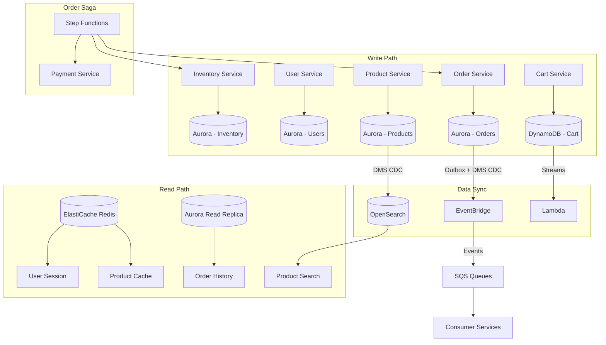

# Data Management trên AWS

## 📋 Mục lục

- [1. Giới thiệu](#1-giới-thiệu)
- [2. Database per Service trên AWS](#2-database-per-service-trên-aws)
  - [2.1. Tổng quan Database Services trên AWS](#21-tổng-quan-database-services-trên-aws)
  - [2.2. Amazon RDS & Aurora](#22-amazon-rds--aurora)
  - [2.3. Amazon DynamoDB](#23-amazon-dynamodb)
  - [2.4. Amazon ElastiCache (Redis / Memcached)](#24-amazon-elasticache-redis--memcached)
  - [2.5. Amazon OpenSearch (Elasticsearch)](#25-amazon-opensearch-elasticsearch)
  - [2.6. Polyglot Persistence trên AWS — Chọn DB cho từng service](#26-polyglot-persistence-trên-aws--chọn-db-cho-từng-service)
- [3. Saga Pattern với AWS Step Functions](#3-saga-pattern-với-aws-step-functions)
  - [3.1. Tại sao Step Functions phù hợp cho Saga?](#31-tại-sao-step-functions-phù-hợp-cho-saga)
  - [3.2. Orchestration Saga — Order Workflow chi tiết](#32-orchestration-saga--order-workflow-chi-tiết)
  - [3.3. Compensation (Rollback) trong Step Functions](#33-compensation-rollback-trong-step-functions)
  - [3.4. Choreography Saga với EventBridge](#34-choreography-saga-với-eventbridge)
  - [3.5. Orchestration vs Choreography trên AWS — Khi nào chọn gì?](#35-orchestration-vs-choreography-trên-aws--khi-nào-chọn-gì)
- [4. CQRS trên AWS](#4-cqrs-trên-aws)
  - [4.1. CQRS với DynamoDB + OpenSearch](#41-cqrs-với-dynamodb--opensearch)
  - [4.2. CQRS với Aurora + ElastiCache](#42-cqrs-với-aurora--elasticache)
  - [4.3. Sync data giữa Write DB và Read DB](#43-sync-data-giữa-write-db-và-read-db)
- [5. Event Sourcing trên AWS](#5-event-sourcing-trên-aws)
  - [5.1. Event Store trên AWS — Chọn gì?](#51-event-store-trên-aws--chọn-gì)
  - [5.2. Event Sourcing với DynamoDB](#52-event-sourcing-với-dynamodb)
  - [5.3. Event Sourcing kết hợp CQRS trên AWS](#53-event-sourcing-kết-hợp-cqrs-trên-aws)
  - [5.4. Snapshot Strategy trên DynamoDB](#54-snapshot-strategy-trên-dynamodb)
- [6. Data Consistency & Cross-Service Data](#6-data-consistency--cross-service-data)
  - [6.1. Outbox Pattern trên AWS](#61-outbox-pattern-trên-aws)
  - [6.2. Change Data Capture (CDC) trên AWS](#62-change-data-capture-cdc-trên-aws)
  - [6.3. Event-Carried State Transfer với EventBridge](#63-event-carried-state-transfer-với-eventbridge)
  - [6.4. API Composition với AppSync](#64-api-composition-với-appsync)
- [7. Data Migration & Schema Evolution](#7-data-migration--schema-evolution)
  - [7.1. Schema Migration cho RDS](#71-schema-migration-cho-rds)
  - [7.2. DynamoDB Schema Evolution](#72-dynamodb-schema-evolution)
  - [7.3. Blue-Green Database Migration](#73-blue-green-database-migration)
- [8. Ví dụ thực tế — E-Commerce Data Architecture trên AWS](#8-ví-dụ-thực-tế--e-commerce-data-architecture-trên-aws)
- [9. Anti-patterns](#9-anti-patterns)
- [10. Checklist triển khai](#10-checklist-triển-khai)
- [11. Tổng kết](#11-tổng-kết)
- [12. Liên kết liên quan](#12-liên-kết-liên-quan)

---

## 1. Giới thiệu

Trong [doc 09 — Data Management](09-data-management.md), chúng ta đã hiểu các pattern quản lý data trong Microservice: Database per Service, Saga, CQRS, Event Sourcing, Outbox Pattern. Doc này **áp dụng tất cả kiến thức đó vào thực tế trên AWS** — mapping từng pattern lý thuyết sang AWS service cụ thể.

Doc này trả lời câu hỏi: **Dùng database nào trên AWS cho từng service? Saga pattern triển khai với Step Functions ra sao? CQRS + Event Sourcing hiện thực hóa thế nào với DynamoDB Streams, EventBridge? Đảm bảo data consistency xuyên service bằng cách nào?**

> 💡 Giả định: Bạn đã đọc [doc 09](09-data-management.md) và hiểu lý thuyết. Doc này tập trung vào **cách AWS hiện thực hóa** các khái niệm đó.

> 📌 Lưu ý: Các con số về pricing trong tài liệu là **giá tham khảo theo thời điểm viết** và có thể thay đổi theo region/thời gian. Luôn kiểm tra trang AWS Pricing chính thức trước khi ra quyết định.

```
┌────────────────────────────────────────────────────────────────────┐
│            DATA MANAGEMENT LANDSCAPE trên AWS                      │
│                                                                    │
│  ┌─────── Database per Service ────────────────────────────────┐   │
│  │  RDS Aurora (PostgreSQL/MySQL)  ← relational, ACID          │   │
│  │  DynamoDB                       ← key-value, serverless     │   │
│  │  ElastiCache (Redis)            ← cache, session            │   │
│  │  OpenSearch                     ← search, analytics         │   │
│  │  Neptune                        ← graph                     │   │
│  │  DocumentDB                     ← MongoDB-compatible        │   │
│  └─────────────────────────────────────────────────────────────┘   │
│                                                                    │
│  ┌─────── Data Consistency Patterns ───────────────────────────┐   │
│  │  Step Functions                 ← Saga (orchestration)      │   │
│  │  EventBridge                    ← Saga (choreography)       │   │
│  │  DynamoDB Streams               ← CDC, Event Sourcing       │   │
│  │  MSK (Kafka) / Kinesis          ← event streaming           │   │
│  │  DMS (Database Migration)       ← CDC from RDS              │   │
│  └─────────────────────────────────────────────────────────────┘   │
│                                                                    │
│  ┌─────── Cross-Service Data ──────────────────────────────────┐   │
│  │  AppSync (GraphQL)              ← API Composition           │   │
│  │  EventBridge                    ← Event-Carried State       │   │
│  │  DMS + Kinesis                  ← CDC pipeline              │   │
│  └─────────────────────────────────────────────────────────────┘   │
│                                                                    │
└────────────────────────────────────────────────────────────────────┘
```

---

## 2. Database per Service trên AWS

### 2.1. Tổng quan Database Services trên AWS

> 🔗 Lý thuyết Database per Service tại [doc 09 — Section 2](09-data-management.md#2-database-per-service)

AWS cung cấp **purpose-built databases** — mỗi loại tối ưu cho 1 use case. Đây chính là nền tảng cho **Polyglot Persistence** trong Microservice.

```
┌────────────────────────────────────────────────────────────────────┐
│                AWS PURPOSE-BUILT DATABASES                          │
│                                                                     │
│  ┌─── Relational ───────────┐   ┌─── Key-Value ───────────────┐     │
│  │  Amazon RDS              │   │  Amazon DynamoDB            │     │
│  │  • PostgreSQL, MySQL     │   │  • Serverless, auto-scale   │     │
│  │  • MariaDB, Oracle, SQL  │   │  • Single-digit ms latency  │     │
│  │                          │   │  • Key-value + document     │     │
│  │  Amazon Aurora           │   │                             │     │
│  │  • MySQL/PostgreSQL      │   │  Amazon ElastiCache         │     │
│  │  • 5x faster MySQL       │   │  • Redis / Memcached        │     │
│  │  • Auto-scaling storage  │   │  • In-memory cache          │     │
│  │  • Multi-AZ, read replica│   │  • Sub-ms latency           │     │
│  └──────────────────────────┘   └─────────────────────────────┘     │
│                                                                     │
│  ┌─── Document ─────────────┐   ┌─── Search ───────────────────┐    │
│  │  Amazon DocumentDB       │   │  Amazon OpenSearch           │    │
│  │  • MongoDB-compatible    │   │  • Full-text search          │    │
│  │  • Managed, scalable     │   │  • Log analytics             │    │
│  └──────────────────────────┘   │  • Dashboards (Kibana)       │    │
│                                 └──────────────────────────────┘    │
│  ┌─── Graph ────────────────┐   ┌─── Time-Series ──────────────┐    │
│  │  Amazon Neptune          │   │  Amazon Timestream           │    │
│  │  • Property graph +      │   │  • IoT, DevOps metrics       │    │
│  │    RDF models            │   │  • Auto-tiering storage      │    │
│  └──────────────────────────┘   └──────────────────────────────┘    │
│                                                                     │
│  ┌─── Ledger ───────────────┐   ┌─── Data Warehouse ───────────┐    │
│  │  Amazon QLDB             │   │  Amazon Redshift             │    │
│  │  • Immutable, verifiable │   │  • OLAP, columnar            │    │
│  │  • Audit trail           │   │  • Petabyte-scale analytics  │    │
│  └──────────────────────────┘   └──────────────────────────────┘    │
│                                                                     │
└─────────────────────────────────────────────────────────────────────┘
```

### 2.2. Amazon RDS & Aurora

**Amazon RDS** (Relational Database Service) — managed relational database. **Aurora** — engine của AWS tương thích MySQL/PostgreSQL, tối ưu cho cloud.

```
┌──────────────────────────────────────────────────────────────────┐
│                   AURORA POSTGRESQL                              │
│                                                                  │
│  ┌─── Writer Instance ─────┐    ┌─── Reader Instance(s) ─────┐   │
│  │  db.r6g.large           │    │  db.r6g.large × 1-15       │   │
│  │  • Write + Read         │    │  • Read-only               │   │
│  │  • Single writer        │    │  • Auto-scaling replicas   │   │
│  └────────┬────────────────┘    └──────────┬─────────────────┘   │
│           │                                │                     │
│           ▼                                ▼                     │
│  ┌──────────────────────────────────────────────────────────┐    │
│  │                 Aurora Storage (shared)                  │    │
│  │  • 6 copies across 3 AZs                                 │    │
│  │  • Auto-grows: 10GB → 128TB                              │    │
│  │  • Continuous backup to S3                               │    │
│  │  • Point-in-time restore (35 ngày)                       │    │
│  └──────────────────────────────────────────────────────────┘    │
│                                                                  │
│  ┌─── Features quan trọng ─────────────────────────────────────┐ │
│  │  • Multi-AZ: failover tự động < 30s                         │ │
│  │  • Read Replicas: tối đa 15, auto-scaling theo CPU          │ │
│  │  • Aurora Serverless v2: auto-scale compute (0.5 → 128 ACU) │ │
│  │  • Global Database: < 1s replication cross-region           │ │
│  │  • IAM Authentication: không cần password, dùng IAM role    │ │
│  │  • Encryption at rest (KMS) + in transit (SSL/TLS)          │ │
│  └─────────────────────────────────────────────────────────────┘ │
│                                                                  │
└──────────────────────────────────────────────────────────────────┘
```

**RDS vs Aurora — Chọn gì?**

| Tiêu chí | RDS (PostgreSQL/MySQL) | Aurora |
|----------|----------------------|--------|
| **Giá** | Rẻ hơn ~20% | Đắt hơn nhưng performance/GB tốt hơn |
| **Performance** | Chuẩn | 5x MySQL, 3x PostgreSQL (theo AWS) |
| **Storage** | Manual provisioning, max 64TB | Auto-grow, max 128TB, 6 copies/3 AZs |
| **Failover** | 60-120s | < 30s |
| **Read Replicas** | Max 5 (MySQL), 5 (PostgreSQL) | Max 15, auto-scaling |
| **Serverless** | Không | Aurora Serverless v2 |
| **Recommend** | Dev/test, budget-constrained | Production, critical workloads |

```
Decision:
─────────
  Budget nhỏ, non-production     → RDS (PostgreSQL/MySQL)
  Production, cần HA              → Aurora
  Traffic biến động (spiky)       → Aurora Serverless v2
  Multi-region DR                 → Aurora Global Database
```

**Aurora Serverless v2 — Khi nào dùng?**

```
Aurora Serverless v2:
─────────────────────
  • Auto-scale compute: 0.5 ACU → 128 ACU (1 ACU ≈ 2GB RAM)
  • Scale up trong vài giây, scale down khi idle
  • Trả tiền theo ACU-hours thực tế sử dụng

  ✅ Phù hợp:
     • Dev/staging environments (scale-to-near-zero ban đêm)
     • Workload spiky (flash sale: 10x traffic trong 1 giờ)
     • Microservice mới — chưa biết traffic pattern

  ❌ Không phù hợp:
     • Workload ổn định 24/7 → Provisioned rẻ hơn
     • Cần predictable pricing
```

### 2.3. Amazon DynamoDB

**DynamoDB** — fully managed NoSQL (key-value + document), serverless, single-digit millisecond performance.

```
┌───────────────────────────────────────────────────────────────────┐
│                      DYNAMODB                                     │
│                                                                   │
│  ┌─── Table Design ─────────────────────────────────────────────┐ │
│  │                                                              │ │
│  │  Table: orders                                               │ │
│  │  ┌────────────────┬───────────────────┬────────────────────┐ │ │
│  │  │ PK (userId)    │ SK (orderId)      │ Attributes         │ │ │
│  │  │────────────────│───────────────────│────────────────────│ │ │
│  │  │ USER#123       │ ORDER#2024-001    │ status, total, ... │ │ │
│  │  │ USER#123       │ ORDER#2024-002    │ status, total, ... │ │ │
│  │  │ USER#456       │ ORDER#2024-003    │ status, total, ... │ │ │
│  │  └────────────────┴───────────────────┴────────────────────┘ │ │
│  │                                                              │ │
│  │  GSI: status-index (PK: status, SK: createdAt)               │ │
│  │  → Query: "Tất cả orders đang PENDING"                       │ │
│  │                                                              │ │
│  │  GSI: date-index (PK: date, SK: orderId)                     │ │
│  │  → Query: "Tất cả orders hôm nay"                            │ │
│  │                                                              │ │
│  └──────────────────────────────────────────────────────────────┘ │
│                                                                   │
│  ┌─── Capacity Modes ──────────────────────────────────────────┐  │
│  │                                                             │  │
│  │  On-Demand Mode:                                            │  │
│  │  • Pay per request ($1.25/triệu WRU, $0.25/triệu RRU)       │  │
│  │  • Auto-scale instantly                                     │  │
│  │  • Phù hợp: traffic không dự đoán được, service mới         │  │
│  │                                                             │  │
│  │  Provisioned Mode:                                          │  │
│  │  • Set RCU/WCU (Read/Write Capacity Units)                  │  │
│  │  • Auto-scaling với target tracking                         │  │
│  │  • Reserved Capacity: giảm 53-76% cost                      │  │
│  │  • Phù hợp: traffic ổn định, predictable                    │  │
│  │                                                             │  │
│  └─────────────────────────────────────────────────────────────┘  │
│                                                                   │
│  ┌─── Key Features ────────────────────────────────────────────┐  │
│  │  • DynamoDB Streams    → CDC, trigger Lambda, Event Sourcing│  │
│  │  • TTL                 → Auto-delete expired items (session)│  │
│  │  • Global Tables       → Multi-region, active-active        │  │
│  │  • DAX (Accelerator)   → In-memory cache, microsecond read  │  │
│  │  • Transactions        → ACID across multiple items/tables  │  │
│  │  • Point-in-time Recovery → Restore to any second (35 ngày) │  │
│  │  • Encryption at rest  → AWS owned / customer managed KMS   │  │
│  └─────────────────────────────────────────────────────────────┘  │
│                                                                   │
└───────────────────────────────────────────────────────────────────┘
```

**DynamoDB Single-Table Design — Phong cách Microservice:**

```
Trong Microservice, mỗi service thường có 1 DynamoDB table
với single-table design (nhiều entity types trong 1 table):

Table: cart-service
┌──────────────┬─────────────────────┬────────────────────────────┐
│ PK           │ SK                  │ Attributes                 │
│──────────────│─────────────────────│────────────────────────────│
│ CART#u123    │ METADATA            │ userId, createdAt, total   │
│ CART#u123    │ ITEM#p456           │ productId, qty, price      │
│ CART#u123    │ ITEM#p789           │ productId, qty, price      │
│ CART#u456    │ METADATA            │ userId, createdAt, total   │
│ CART#u456    │ ITEM#p123           │ productId, qty, price      │
└──────────────┴─────────────────────┴────────────────────────────┘

→ GetItem (PK=CART#u123, SK=METADATA) → cart info
→ Query  (PK=CART#u123, SK begins_with "ITEM#") → all items in cart
→ 1 table, 1 query → cực nhanh, không cần JOIN
```

**RDS/Aurora vs DynamoDB — Khi nào chọn gì?**

| Tiêu chí | RDS/Aurora | DynamoDB |
|----------|-----------|----------|
| **Data model** | Relational, cần JOIN, complex queries | Key-value, document, access patterns biết trước |
| **Consistency** | Strong (ACID) | Eventual (default), Strong (optional, 2x cost) |
| **Query flexibility** | SQL — bất kỳ query nào | Chỉ query theo PK/SK/GSI — phải thiết kế trước |
| **Scaling** | Vertical (instance size) + Read Replicas | Horizontal, automatic, "infinite" |
| **Ops overhead** | Patching, sizing, monitoring | Near-zero (serverless) |
| **Giá** | Instance-based (chạy 24/7) | Pay-per-request hoặc provisioned |
| **Transaction** | Full ACID, multi-table | ACID (tối đa 100 items, 4MB) |
| **Use case** | Order, Payment, User — dữ liệu quan hệ phức tạp | Cart, Session, IoT, Catalog — access pattern đơn giản |

```
Decision:
─────────
  Cần JOIN, complex queries, ACID     → Aurora PostgreSQL
  Cần flexible queries, ad-hoc SQL    → Aurora PostgreSQL
  Key-value access, serverless        → DynamoDB
  Session, cache, cart, leaderboard   → DynamoDB (hoặc ElastiCache)
  Cả hai?                            → Polyglot! (Aurora cho Order, DynamoDB cho Cart)
```

### 2.4. Amazon ElastiCache (Redis / Memcached)

```
┌────────────────────────────────────────────────────────────────────┐
│                    ELASTICACHE                                     │
│                                                                    │
│  ┌─── Redis (recommended) ──────────────────────────────────────┐  │
│  │                                                              │  │
│  │  Use cases trong Microservice:                               │  │
│  │                                                              │  │
│  │  1. CACHING — Giảm tải DB                                    │  │
│  │     Service → check Redis → miss? → query Aurora → cache     │  │
│  │     TTL: product=5min, user=1h, config=24h                   │  │
│  │                                                              │  │
│  │  2. SESSION STORE                                            │  │
│  │     User login → session lưu Redis (TTL 24h)                 │  │
│  │     → Mọi service instance đều đọc được session              │  │
│  │                                                              │  │
│  │  3. RATE LIMITING                                            │  │
│  │     INCR user:{id}:requests → check > limit? → reject        │  │
│  │     EXPIRE key TTL=60s (sliding window)                      │  │
│  │                                                              │  │
│  │  4. DISTRIBUTED LOCK                                         │  │
│  │     SET lock:order:123 NX EX 30                              │  │
│  │     → Chỉ 1 instance xử lý order 123 tại 1 thời điểm         │  │
│  │                                                              │  │
│  │  5. REAL-TIME LEADERBOARD                                    │  │
│  │     ZADD leaderboard score userId                            │  │
│  │     ZREVRANGE leaderboard 0 9 → top 10                       │  │
│  │                                                              │  │
│  │  Deployment:                                                 │  │
│  │  • Cluster mode: shard data, scale writes                    │  │
│  │  • Multi-AZ: auto-failover < 30s                             │  │
│  │  • Encryption: at rest (KMS) + in transit (TLS)              │  │
│  │  • Auth: Redis AUTH token hoặc IAM                           │  │
│  │                                                              │  │
│  └──────────────────────────────────────────────────────────────┘  │
│                                                                    │
│  ⚠️ Redis KHÔNG phải primary database                              │
│  → Data quan trọng (order, payment) luôn lưu RDS/DynamoDB          │
│  → Redis chỉ là cache / secondary store                            │
│  → Redis chết? Service chậm hơn nhưng KHÔNG mất data               │
│                                                                    │
└────────────────────────────────────────────────────────────────────┘
```

### 2.5. Amazon OpenSearch (Elasticsearch)

```
┌────────────────────────────────────────────────────────────────────┐
│                    OPENSEARCH SERVICE                              │
│                                                                    │
│  Vai trò trong Microservice: READ-ONLY secondary store             │
│                                                                    │
│  ┌─── Architecture ─────────────────────────────────────────────┐  │
│  │                                                              │  │
│  │  Primary DB (Aurora) ──CDC/Event──▶ OpenSearch (read)        │  │
│  │                                                              │  │
│  │  Write path:                                                 │  │
│  │    Admin → Product Service → Aurora PostgreSQL               │  │
│  │                                 │                            │  │
│  │                          DMS / Lambda (CDC)                  │  │
│  │                                 │                            │  │
│  │                                 ▼                            │  │
│  │  Read path:                   OpenSearch                     │  │
│  │    User search → Product Service → OpenSearch                │  │
│  │    "iPhone giá dưới 20 triệu"                                │  │
│  │    → Full-text search + faceted filter + sort                │  │
│  │                                                              │  │
│  └──────────────────────────────────────────────────────────────┘  │
│                                                                    │
│  Use cases:                                                        │
│  • Product search (full-text, fuzzy, autocomplete)                 │
│  • Log analytics (ELK stack: OpenSearch + Logstash + Kibana)       │
│  • Application monitoring (APM)                                    │
│                                                                    │
│  ⚠️ Nhắc lại: OpenSearch KHÔNG PHẢI primary database               │
│  → Không có ACID transaction                                       │
│  → Near real-time (1s delay write → searchable)                    │
│  → Luôn kết hợp với primary DB (Aurora/DynamoDB)                   │
│                                                                    │
└────────────────────────────────────────────────────────────────────┘
```

### 2.6. Polyglot Persistence trên AWS — Chọn DB cho từng service

> 🔗 Lý thuyết Polyglot Persistence tại [doc 09 — Section 2.3](09-data-management.md#23-polyglot-persistence)

```
E-Commerce — Database cho từng service:
────────────────────────────────────────

┌───────────────────┬────────────────────┬────────────────────────────────┐
│ Service           │ Database           │ Lý do                          │
│───────────────────│────────────────────│────────────────────────────────│
│ User Service      │ Aurora PostgreSQL  │ Relational, ACID cho auth      │
│ Order Service     │ Aurora PostgreSQL  │ ACID transaction, JOIN         │
│ Payment Service   │ Aurora PostgreSQL  │ Financial data, ACID bắt buộc  │
│ Inventory Service │ Aurora PostgreSQL  │ Stock count, consistency       │
│ Product Service   │ Aurora + OpenSearch│ Aurora (write), OS (search)    │
│ Cart Service      │ DynamoDB           │ Key-value, TTL, serverless     │
│ Session Service   │ ElastiCache Redis  │ In-memory, TTL, fast           │
│ Notification Log  │ DynamoDB           │ Append-only, TTL, serverless   │
│ Recommendation    │ Neptune            │ Graph: "người mua X cũng mua Y"│
│ Analytics         │ Redshift           │ OLAP, aggregate từ nhiều src   │
└───────────────────┴────────────────────┴────────────────────────────────┘

→ 5 loại database khác nhau
→ Mỗi service chọn DB phù hợp nhất với use case
→ Đây chính là Polyglot Persistence trên AWS
```

**Chi phí ước tính các database:**

| Database | Spec | Chi phí ước tính/tháng |
|----------|------|----------------------|
| Aurora PostgreSQL (Multi-AZ) | db.r6g.large | ~$400 |
| Aurora Serverless v2 | 0.5-4 ACU (dev) | ~$50-150 |
| DynamoDB (On-Demand) | ~5M requests/ngày | ~$50 |
| ElastiCache Redis | cache.r6g.large, 2 nodes | ~$300 |
| OpenSearch | t3.medium.search, 2 nodes | ~$150 |
| Neptune | db.r5.large | ~$350 |
| Redshift Serverless | 8 RPU, ~100 queries/ngày | ~$50 |

---

## 3. Saga Pattern với AWS Step Functions

> 🔗 Lý thuyết Saga Pattern tại [doc 09 — Section 6](09-data-management.md#6-saga-pattern)

### 3.1. Tại sao Step Functions phù hợp cho Saga?

```
Saga cần gì?                        Step Functions có gì?
──────────────                       ────────────────────
Workflow multi-step              →   State machine (nhiều bước)
Gọi nhiều service theo thứ tự    →   Task states (invoke Lambda/ECS/API)
Xử lý lỗi từng bước              →   Catch + Retry per state
Compensation (rollback)          →   Fallback states, error handling
Parallel steps                   →   Parallel state
Timeout per step                 →   TimeoutSeconds per state
Audit trail                      →   Full execution history (Standard mode)
Visual monitoring                →   Step Functions Console — visual diagram
```

**Step Functions = managed Saga Execution Coordinator (SEC)**

Thay vì tự build orchestrator, Step Functions đã là SEC sẵn:
- **Durable execution** — state machine chạy bền vững, không mất progress khi crash
- **Built-in retry** — retry 3 lần mỗi step, configurable
- **Visual debugging** — xem từng step pass/fail trên console
- **Exactly-once** (Standard mode) — không duplicate execution

**Ngôn ngữ lập trình — Step Functions không phụ thuộc ngôn ngữ:**

Step Functions chỉ là **orchestrator** (điều phối) — nó gọi Lambda/ECS/API, còn business logic bên trong viết ngôn ngữ gì cũng được:

```
Step Functions (ASL — JSON/YAML)
    │
    ├── Step 1: ValidateOrder   → Lambda (Java 21)
    ├── Step 2: ReserveStock    → Lambda (Java 21)
    ├── Step 3: ProcessPayment  → Lambda (Java 21)
    ├── Step 4: ConfirmOrder    → Lambda (Java 21)
    └── Compensate: ReleaseStock → Lambda (Java 21)

Ngôn ngữ hỗ trợ:
  • Java (8, 11, 17, 21)    ← phổ biến trong enterprise
  • Python, Node.js          ← phổ biến trong startup/serverless
  • .NET (C#), Go, Rust      ← đều hỗ trợ
  • Hoặc bất kỳ ngôn ngữ nào chạy trong ECS container
```

> 💡 **Thực tế**: Step Functions + Java rất phổ biến trong enterprise — team đã quen Java ecosystem (Spring Boot, Maven) chỉ cần viết Lambda handler bằng Java, Step Functions lo phần orchestration.

**Tài liệu tham khảo & ví dụ thực tế:**

| Tài liệu | Mô tả | Link |
|----------|-------|------|
| **AWS Sample — Saga Pattern** | E-commerce: Order → Payment → Inventory với compensation (Go) | [GitHub](https://github.com/aws-samples/aws-step-functions-long-lived-transactions) |
| **AWS Docs — Saga Pattern Sample** | Official sample project có sẵn trong Step Functions Console | [AWS Docs](https://docs.aws.amazon.com/step-functions/latest/dg/sample-saga-pattern.html) |
| **AWS Prescriptive Guidance** | Hướng dẫn chi tiết implement Saga với Step Functions | [AWS Guidance](https://docs.aws.amazon.com/prescriptive-guidance/latest/patterns/implement-the-saga-pattern-with-aws-step-functions.html) |
| **Serverless Land Patterns** | 100+ templates (CDK/SAM/Terraform) cho Step Functions | [serverlessland.com](https://serverlessland.com/patterns?services=sfn) |
| **AWS Use Cases** | Microservice Orchestration, ETL, Security automation | [aws.amazon.com](https://aws.amazon.com/step-functions/use-cases/) |

**Step Functions vs Self-hosted Orchestrator — So sánh thực tế:**

Trong thực tế, đặc biệt với team Java enterprise, nhiều team chọn **self-hosted orchestrator** thay vì Step Functions. Đây là so sánh:

| Tiêu chí | Step Functions | Self-hosted (Spring Boot / Temporal) |
|----------|---------------|--------------------------------------|
| **Vendor lock-in** | ❌ AWS only, không portable | ✅ Chạy anywhere (AWS, GCP, on-prem) |
| **Control** | Hạn chế — phải theo ASL rules | ✅ Full control, viết logic thoải mái |
| **Debugging** | Console visual, khó debug local | ✅ IDE breakpoint, local test bình thường |
| **Cost khi scale** | $25/triệu state transitions — đắt | ✅ Chỉ tốn instance cost |
| **Latency** | ~100-200ms overhead mỗi state transition | ✅ In-process, gần như 0 overhead |
| **Java cold start** | Lambda Java cold start ~3-5s 😬 | ✅ Spring Boot luôn warm |
| **Ops overhead** | ✅ AWS quản lý, zero ops | ❌ Phải tự quản lý HA, monitoring |
| **Durability** | ✅ Built-in, state persist tự động | ❌ Phải tự implement (DB + retry) |
| **Visual monitoring** | ✅ Console visual rất trực quan | ❌ Phải tự build dashboard |

**Các lựa chọn Saga Orchestrator phổ biến trong thực tế:**

```
┌──────────────────────────────────────────────────────────────────────┐
│         SAGA ORCHESTRATOR — CHỌN GÌ THEO CONTEXT?                    │
│                                                                      │
│  1. AWS Step Functions                                               │
│     ─────────────────                                                │
│     • Team serverless-first (Lambda + Python/Node.js)                │
│     • Workflow đơn giản (3-5 steps)                                  │
│     • Muốn zero ops, visual monitoring                               │
│     • Không quan tâm vendor lock-in                                  │
│     • Ví dụ: startup dùng full AWS serverless stack                  │
│                                                                      │
│  2. Self-built (Spring Boot + DB)                                    │
│     ──────────────────────────────                                   │
│     • Team Java enterprise, đã quen Spring ecosystem                 │
│     • Saga logic đơn giản, không cần framework riêng                 │
│     • Order Service tự quản lý saga state trong DB                   │
│     • Dùng @Transactional, @Scheduled cho retry                      │
│     • Ví dụ: order service tự track trạng thái saga trong bảng       │
│       orders (status: PENDING → STOCK_RESERVED → PAID → CONFIRMED)   │
│                                                                      │
│  3. Temporal.io ⭐ (recommended cho orchestrator chuyên dụng)        │
│     ─────────────                                                    │
│     • Open-source, chạy trên K8s/ECS                                 │
│     • Java/Go SDK, durable execution built-in                        │
│     • Uber, Netflix, Stripe, Snap dùng production                    │
│     • KHÔNG vendor lock-in, portable across clouds                   │
│     • Phù hợp: complex workflows, long-running, cần reliability      │
│                                                                      │
│  4. Axon Framework (Java-specific)                                   │
│     ──────────────────────────────                                   │
│     • Saga + Event Sourcing + CQRS built-in                          │
│     • Rất phổ biến trong Java/Spring ecosystem                       │
│     • Axon Server (open-source) hoặc Axon Cloud (managed)            │
│     • Phù hợp: team Java muốn full DDD + Event Sourcing              │
│                                                                      │
│  5. Camunda (BPMN-based)                                             │
│     ────────────────────                                             │
│     • BPMN workflow engine, visual designer                          │
│     • Java SDK, REST API                                             │
│     • Phù hợp: enterprise cần BPMN compliance, business process      │
│                                                                      │
└──────────────────────────────────────────────────────────────────────┘
```

```
Decision — Chọn Saga Orchestrator:
───────────────────────────────────
  Team serverless (Lambda, Python/Node.js)         → Step Functions
  Team Java, saga đơn giản (3-5 steps)              → Self-built (Spring Boot + DB)
  Team Java, saga phức tạp, cần reliability         → Temporal.io
  Team Java, muốn full DDD/Event Sourcing           → Axon Framework
  Enterprise, cần BPMN, business process            → Camunda
  Multi-cloud, không muốn vendor lock-in            → Temporal.io hoặc Camunda
```

> 💡 **Thực tế quan trọng**: Đa số team Java enterprise **KHÔNG** dùng Step Functions. Họ thường chọn self-built orchestrator (Spring Boot + saga state trong DB) cho case đơn giản, hoặc Temporal/Axon cho case phức tạp. Step Functions phổ biến hơn trong ecosystem serverless (Lambda + Python/Node.js).

### 3.2. Orchestration Saga — Order Workflow chi tiết

```
┌─────────────────────────────────────────────────────────────────────┐
│          STEP FUNCTIONS: ORDER SAGA WORKFLOW                        │
│                                                                     │
│  ┌──────────────┐                                                   │
│  │  Start       │ Input: { orderId, userId, items, totalAmount }    │
│  └──────┬───────┘                                                   │
│         ▼                                                           │
│  ┌──────────────────┐                                               │
│  │ 1. Validate Order│ → Lambda: validate items, check user          │
│  └──────┬───────────┘                                               │
│         │ success                                                   │
│         ▼                                                           │
│  ┌──────────────────┐                                               │
│  │ 2. Reserve Stock │ → Lambda/ECS: Inventory Service               │
│  │    Retry: 3x     │   POST /inventory/reserve                     │
│  │    Timeout: 10s  │                                               │
│  └──────┬───────────┘                                               │
│         │ success                     │ fail                        │
│         ▼                             ▼                             │
│  ┌──────────────────┐          ┌──────────────────┐                 │
│  │ 3. Process       │          │ Order Failed     │                 │
│  │    Payment       │          │ → Notify user    │                 │
│  │    Retry: 3x     │          └──────────────────┘                 │
│  │    Timeout: 30s  │                                               │
│  └──────┬───────────┘                                               │
│         │ success                     │ fail                        │
│         ▼                             ▼                             │
│  ┌──────────────────┐          ┌──────────────────┐                 │
│  │ 4. Confirm Order │          │ COMPENSATE:      │                 │
│  │    Update status │          │ Release Stock    │                 │
│  │    → CONFIRMED   │          │ → Inventory API  │                 │
│  └──────┬───────────┘          └────────┬─────────┘                 │
│         │                               │                           │
│         ▼                               ▼                           │
│  ┌──────────────┐               ┌──────────────────┐                │
│  │ 5. Parallel  │               │ Order Failed     │                │
│  │  ┌─────────┐ │               │ → Notify user    │                │
│  │  │Send     │ │               └──────────────────┘                │
│  │  │Email    │ │                                                   │
│  │  ├─────────┤ │                                                   │
│  │  │Update   │ │                                                   │
│  │  │Analytics│ │                                                   │
│  │  ├─────────┤ │                                                   │
│  │  │Create   │ │                                                   │
│  │  │Shipment │ │                                                   │
│  │  └─────────┘ │                                                   │
│  └──────┬───────┘                                                   │
│         ▼                                                           │
│  ┌──────────────┐                                                   │
│  │    End       │                                                   │
│  └──────────────┘                                                   │
│                                                                     │
└─────────────────────────────────────────────────────────────────────┘
```

**Step Functions ASL (Amazon States Language)** — trích đoạn:

```json
{
  "Comment": "Order Saga",
  "StartAt": "ValidateOrder",
  "States": {
    "ValidateOrder": {
      "Type": "Task",
      "Resource": "arn:aws:lambda:...:validate-order",
      "Next": "ReserveStock",
      "Catch": [{
        "ErrorEquals": ["ValidationError"],
        "Next": "OrderFailed"
      }]
    },
    "ReserveStock": {
      "Type": "Task",
      "Resource": "arn:aws:lambda:...:reserve-stock",
      "TimeoutSeconds": 10,
      "Retry": [{
        "ErrorEquals": ["States.TaskFailed"],
        "MaxAttempts": 3,
        "IntervalSeconds": 2,
        "BackoffRate": 2.0
      }],
      "Next": "ProcessPayment",
      "Catch": [{
        "ErrorEquals": ["States.ALL"],
        "Next": "OrderFailed"
      }]
    },
    "ProcessPayment": {
      "Type": "Task",
      "Resource": "arn:aws:lambda:...:process-payment",
      "TimeoutSeconds": 30,
      "Retry": [{
        "ErrorEquals": ["States.TaskFailed"],
        "MaxAttempts": 3,
        "IntervalSeconds": 5,
        "BackoffRate": 2.0
      }],
      "Next": "ConfirmOrder",
      "Catch": [{
        "ErrorEquals": ["States.ALL"],
        "Next": "ReleaseStock"
      }]
    },
    "ReleaseStock": {
      "Type": "Task",
      "Resource": "arn:aws:lambda:...:release-stock",
      "Comment": "Compensation: undo ReserveStock",
      "Next": "OrderFailed"
    },
    "ConfirmOrder": {
      "Type": "Task",
      "Resource": "arn:aws:lambda:...:confirm-order",
      "Next": "NotifyAndShip"
    },
    "NotifyAndShip": {
      "Type": "Parallel",
      "Branches": [
        {
          "StartAt": "SendEmail",
          "States": {
            "SendEmail": { "Type": "Task", "Resource": "arn:aws:lambda:...:send-email", "End": true }
          }
        },
        {
          "StartAt": "CreateShipment",
          "States": {
            "CreateShipment": { "Type": "Task", "Resource": "arn:aws:lambda:...:create-shipment", "End": true }
          }
        }
      ],
      "Next": "OrderCompleted"
    },
    "OrderCompleted": { "Type": "Succeed" },
    "OrderFailed": { "Type": "Fail", "Error": "OrderSagaFailed" }
  }
}
```

### 3.3. Compensation (Rollback) trong Step Functions

```
Compensation = "undo" các bước đã thành công khi bước sau FAIL
────────────────────────────────────────────────────────────────

Ví dụ: Payment fail → phải undo Reserve Stock

  Happy path:
  ┌──────────┐   ┌──────────────┐   ┌──────────────┐   ┌──────────┐
  │ Validate │──▶│ Reserve Stock│──▶│ Process Pay  │──▶│ Confirm  │
  │   ✅     │   │   ✅         │   │   ✅         │   │   ✅     │
  └──────────┘   └──────────────┘   └──────────────┘   └──────────┘

  Compensation path (Payment fails):
  ┌──────────┐   ┌──────────────┐   ┌──────────────┐
  │ Validate │──▶│ Reserve Stock│──▶│ Process Pay  │
  │   ✅     │   │   ✅         │   │   ❌ FAIL    │
  └──────────┘   └──────┬───────┘   └──────────────┘
                        │
                        ▼ Catch → Compensation
                 ┌──────────────┐   ┌──────────────┐
                 │ Release Stock│──▶│ Order Failed │
                 │ (compensate) │   │ Notify user  │
                 │   ✅         │   │              │
                 └──────────────┘   └──────────────┘


  Nhiều bước compensation (3 bước đã thành công):
  ┌──────────┐  ┌──────────┐  ┌──────────┐  ┌──────────┐
  │ Reserve  │─▶│ Charge   │─▶│ Create   │─▶│ Assign   │
  │ Stock ✅ │  │ Pay ✅   │  │ Shipment │  │ Driver   │
  └──────────┘  └──────────┘  │ ✅       │  │ ❌ FAIL  │
                              └──────────┘  └──────────┘
                                                 │
                              Compensate ngược:  ▼
                              ┌──────────┐  ┌──────────┐  ┌──────────┐
                              │ Cancel   │◀─│ Refund   │◀─│ Release  │
                              │ Shipment │  │ Payment  │  │ Stock    │
                              └──────────┘  └──────────┘  └──────────┘

  → Compensation chạy NGƯỢC THỨ TỰ — undo từ bước gần nhất
  → Mỗi bước compensation phải IDEMPOTENT (gọi lại vẫn OK)
```

### 3.4. Choreography Saga với EventBridge

> 🔗 Xem thêm EventBridge tại [doc 19 — Section 4.4](19-aws-communication-discovery.md#44-amazon-eventbridge--event-bus)

```
Choreography: Mỗi service tự publish event, service khác react
─────────────────────────────────────────────────────────────────

  Order Service                    EventBridge                    Inventory
  ┌──────────┐     OrderCreated    ┌──────────┐    Rule match     ┌──────────┐
  │ Create   │────────────────────▶│          │──────────────────▶│ Reserve  │
  │ Order    │                     │  Event   │                   │ Stock    │
  └──────────┘                     │   Bus    │                   └────┬─────┘
                                   │          │                        │
                    StockReserved  │          │◀───────────────────────┘
                                   │          │
  Payment                          │          │    Rule match    Payment
  ┌──────────┐                     │          │──────────────────▶┌──────────┐
  │ Charge   │◀────────────────────│          │                   │ Process  │
  │ Customer │                     │          │                   │ Payment  │
  └────┬─────┘                     │          │                   └──────────┘
       │            PaymentDone    │          │
       └──────────────────────────▶│          │
                                   │          │    Rule match
  Order Service                    │          │──────────────────▶ Notification
  ┌──────────┐                     │          │                   ┌──────────┐
  │ Confirm  │◀────────────────────│          │                   │ Send     │
  │ Order    │                     └──────────┘                   │ Email    │
  └──────────┘                                                    └──────────┘

  Compensation trong Choreography:
  → Mỗi service tự handle failure
  → Payment fail → publish PaymentFailed event
  → Inventory listen PaymentFailed → release stock
  → Order listen PaymentFailed → cancel order
  
  ⚠️ Khó trace, khó debug — phải dùng X-Ray correlation ID
```

### 3.5. Orchestration vs Choreography trên AWS — Khi nào chọn gì?

| Tiêu chí | Step Functions (Orchestration) | EventBridge (Choreography) |
|----------|-------------------------------|---------------------------|
| **Visibility** | Visual workflow, execution history | Phải trace qua CloudWatch + X-Ray |
| **Error handling** | Centralized: Catch, Retry, Compensate | Mỗi service tự handle |
| **Coupling** | Services → Step Functions | Loose — chỉ biết event, không biết nhau |
| **Complexity** | Tốt cho multi-step, branching, parallel | Tốt cho fan-out, broadcast |
| **Cost** | $25/triệu state transitions (Standard) | $1/triệu events |
| **Scalability** | 500 executions/s (Standard) | Rất cao (partition-based) |
| **Long-running** | Tối đa 1 năm (Standard) | Không giới hạn |

```
Decision:
─────────
  Order workflow (step-by-step, compensation)   → Step Functions
  Event broadcast (notification, analytics)     → EventBridge
  Approval flow (human-in-the-loop)             → Step Functions (Wait state)
  Loose coupling, nhiều consumer                → EventBridge
  Complex branching, parallel, error handling   → Step Functions
  Simple fan-out (1 event → nhiều consumer)     → EventBridge (hoặc SNS)
```

---

## 4. CQRS trên AWS

> 🔗 Lý thuyết CQRS tại [doc 09 — Section 7](09-data-management.md#7-cqrs--command-query-responsibility-segregation)

### 4.1. CQRS với DynamoDB + OpenSearch

```
┌──────────────────────────────────────────────────────────────────────┐
│          CQRS: DynamoDB (Write) + OpenSearch (Read)                  │
│                                                                      │
│  COMMAND SIDE (Write):                                               │
│  ─────────────────────                                               │
│  Admin ──▶ Product Service ──▶ DynamoDB (products table)             │
│            POST /products         │                                  │
│            PUT /products/{id}     │                                  │
│                                   │                                  │
│                            DynamoDB Streams                          │
│                                   │                                  │
│                                   ▼                                  │
│                            Lambda (sync worker)                      │
│                                   │                                  │
│                            Transform + Denormalize                   │
│                                   │                                  │
│                                   ▼                                  │
│  QUERY SIDE (Read):         OpenSearch                               │
│  ──────────────────                                                  │
│  User ──▶ Product Service ──▶ OpenSearch                             │
│           GET /products?q=iphone&category=phone                      │
│           → Full-text search, faceted filtering, autocomplete        │
│                                                                      │
│  ┌─── DynamoDB (Write Model) ──┐  ┌─── OpenSearch (Read Model) ──┐   │
│  │ PK: PROD#123                │  │ {                            │   │
│  │ SK: METADATA                │  │   "id": "PROD#123",          │   │
│  │ name: "iPhone 15"           │  │   "name": "iPhone 15",       │   │
│  │ price: 999                  │  │   "price": 999,              │   │
│  │ categoryId: "CAT#phone"     │  │   "category": "Smartphone",  │   │
│  │ brandId: "BRAND#apple"      │  │   "brand": "Apple",          │   │
│  │ stock: 50                   │  │   "stock": 50,               │   │
│  │                             │  │   "avgRating": 4.7,          │   │
│  │ → Normalized                │  │   "totalReviews": 1234,      │   │
│  │ → Optimized for write       │  │   "searchKeywords": [...]    │   │
│  └─────────────────────────────┘  │   → Denormalized             │   │
│                                   │   → Optimized for search     │   │
│                                   └──────────────────────────────┘   │
│                                                                      │
└──────────────────────────────────────────────────────────────────────┘
```

### 4.2. CQRS với Aurora + ElastiCache

```
┌───────────────────────────────────────────────────────────────────────┐
│          CQRS: Aurora (Write) + ElastiCache Redis (Read)              │
│                                                                       │
│  COMMAND SIDE:                                                        │
│  ─────────────                                                        │
│  Client ──▶ Order Service ──▶ Aurora PostgreSQL                       │
│             POST /orders          │                                   │
│                                   │                                   │
│                            Publish Event (EventBridge)                │
│                                   │                                   │
│                                   ▼                                   │
│                            Lambda (cache updater)                     │
│                                   │                                   │
│                            Update / Invalidate cache                  │
│                                   │                                   │
│                                   ▼                                   │
│  QUERY SIDE:                 ElastiCache Redis                        │
│  ───────────                                                          │
│  Client ──▶ Order Service ──▶ Redis (cache hit?)                      │
│             GET /orders/{id}     │                                    │
│                                  ├── Hit  → return cached data        │
│                                  └── Miss → query Aurora → cache it   │
│                                                                       │
│  Cache Strategies:                                                    │
│  • Cache-Aside: app tự check cache → miss → query DB → write cache    │
│  • Write-Through: write DB + write cache cùng lúc                     │
│  • Write-Behind: write cache → async write DB (risky)                 │
│  • Event-driven invalidation: DB change → event → invalidate cache    │
│                                                                       │
│  Phù hợp khi:                                                         │
│  • Read/Write ratio > 10:1                                            │
│  • Query patterns đơn giản (get by ID, get by user)                   │
│  • Không cần full-text search                                         │
│  • Cần sub-millisecond read latency                                   │
│                                                                       │
└───────────────────────────────────────────────────────────────────────┘
```

### 4.3. Sync data giữa Write DB và Read DB

```
Các cách sync data trong CQRS trên AWS:
────────────────────────────────────────

1. DynamoDB Streams → Lambda → OpenSearch/Redis
   ──────────────────────────────────────────────
   DynamoDB ──Stream──▶ Lambda ──▶ OpenSearch / Redis
   
   ✅ Near real-time (< 1s delay)
   ✅ At-least-once delivery
   ✅ Serverless, auto-scale
   ❌ Lambda timeout 15min (cho batch lớn)
   ❌ Stream retention 24h (default)

2. EventBridge → SQS → Lambda → Read DB
   ──────────────────────────────────────
   Service ──Event──▶ EventBridge ──Rule──▶ SQS ──▶ Lambda ──▶ Read DB
   
   ✅ Decouple hoàn toàn
   ✅ DLQ cho failed events
   ✅ Event filtering (chỉ sync events quan trọng)
   ❌ Thêm latency (~1-3s)

3. DMS (Database Migration Service) — CDC from RDS
   ─────────────────────────────────────────────────
   Aurora ──CDC (binlog)──▶ DMS ──▶ Kinesis/Kafka ──▶ Lambda ──▶ OpenSearch
   
   ✅ Capture mọi DB change (INSERT, UPDATE, DELETE)
   ✅ Không cần thay đổi application code
   ✅ Production-grade CDC
   ❌ Phức tạp hơn, thêm infra

4. Kinesis Data Streams → Lambda → Read DB
   ────────────────────────────────────────
   Service ──▶ Kinesis ──▶ Lambda ──▶ OpenSearch
   
   ✅ High throughput (1MB/s per shard)
   ✅ Replay capability (retention 7 ngày, extended 365 ngày)
   ✅ Multiple consumers (enhanced fan-out)
   ❌ Shard management, cost per shard-hour

Recommend:
──────────
  DynamoDB → OpenSearch   → Dùng DynamoDB Streams + Lambda
  Aurora → OpenSearch     → Dùng DMS (CDC) hoặc Event-driven
  Any DB → Redis cache    → Event-driven invalidation (EventBridge)
  High throughput         → Kinesis Data Streams
```

---

## 5. Event Sourcing trên AWS

> 🔗 Lý thuyết Event Sourcing tại [doc 09 — Section 8](09-data-management.md#8-event-sourcing)

### 5.1. Event Store trên AWS — Chọn gì?

| Option | Ưu điểm | Nhược điểm | Phù hợp |
|--------|---------|------------|---------|
| **DynamoDB** | Serverless, auto-scale, Streams built-in | Không có built-in event replay query | Hầu hết use cases |
| **MSK (Kafka)** | Append-only log, replay, consumer groups | Operational overhead, not serverless | High throughput, complex event processing |
| **Kinesis** | Managed streaming, replay | Shard management, 7-day default retention | Real-time event processing |
| **QLDB** | Immutable ledger, cryptographic verification | Limited query, higher cost | Audit trail, financial compliance |
| **Aurora** | Familiar SQL, strong consistency | Không phải append-only by default | Team đã quen SQL |

```
Recommend:
──────────
  Đa số trường hợp                → DynamoDB (simple, serverless, Streams)
  Cần event replay + multi-consumer → MSK (Kafka)
  Cần audit + cryptographic proof  → QLDB
  Team quen SQL, ít events          → Aurora (custom event table)
```

### 5.2. Event Sourcing với DynamoDB

```
┌────────────────────────────────────────────────────────────────────────┐
│          EVENT SOURCING với DynamoDB                                   │
│                                                                        │
│  Event Store Table: order-events                                       │
│  ┌───────────────┬──────────────────┬────────────────────────────────┐ │
│  │ PK            │ SK               │ Attributes                     │ │
│  │ (aggregateId) │ (version)        │                                │ │
│  │───────────────│──────────────────│────────────────────────────────│ │
│  │ ORDER#001     │ v#000001         │ type: OrderCreated             │ │
│  │               │                  │ data: {userId, items, total}   │ │
│  │               │                  │ timestamp: 2024-01-15T10:00    │ │
│  │               │                  │ metadata: {correlationId}      │ │
│  │───────────────│──────────────────│────────────────────────────────│ │
│  │ ORDER#001     │ v#000002         │ type: StockReserved            │ │
│  │               │                  │ data: {items, warehouseId}     │ │
│  │               │                  │ timestamp: 2024-01-15T10:01    │ │
│  │───────────────│──────────────────│────────────────────────────────│ │
│  │ ORDER#001     │ v#000003         │ type: PaymentProcessed         │ │
│  │               │                  │ data: {amount, txnId}          │ │
│  │               │                  │ timestamp: 2024-01-15T10:02    │ │
│  │───────────────│──────────────────│────────────────────────────────│ │
│  │ ORDER#001     │ v#000004         │ type: OrderConfirmed           │ │
│  │               │                  │ data: {confirmedAt}            │ │
│  │               │                  │ timestamp: 2024-01-15T10:03    │ │
│  └───────────────┴──────────────────┴────────────────────────────────┘ │
│                                                                        │
│  Rebuild current state:                                                │
│  ─────────────────────                                                 │
│  Query: PK = "ORDER#001", SK begins_with "v#"                          │
│  → Trả về tất cả events theo thứ tự version                            │
│  → Replay: OrderCreated → StockReserved → PaymentProcessed             │
│          → OrderConfirmed                                              │
│  → Current state: { status: CONFIRMED, total: 999, ... }               │
│                                                                        │
│  Optimistic Locking (tránh concurrent write):                          │
│  ─────────────────────────────────────────────                         │
│  ConditionExpression: "attribute_not_exists(SK)"                       │
│  → Nếu version đã tồn tại → ConditionalCheckFailed → retry             │
│  → Đảm bảo không có 2 events cùng version cho 1 aggregate              │
│                                                                        │ 
└────────────────────────────────────────────────────────────────────────┘
```

### 5.3. Event Sourcing kết hợp CQRS trên AWS

```
┌────────────────────────────────────────────────────────────────────────┐
│         EVENT SOURCING + CQRS trên AWS                                 │
│                                                                        │
│  ┌─── Command Side ─────────────────────────────────────────────────┐  │
│  │                                                                  │  │
│  │  Client ──▶ Order Service ──▶ DynamoDB (Event Store)             │  │
│  │             POST /orders         │                               │  │
│  │                                  │ Append event:                 │  │
│  │                                  │ { type: OrderCreated, ... }   │  │
│  │                                  │                               │  │
│  └──────────────────────────────────┼───────────────────────────────┘  │
│                                     │                                  │
│                              DynamoDB Streams                          │
│                                     │                                  │
│                                     ▼                                  │
│                              Lambda (Projector)                        │
│                                     │                                  │
│                         ┌───────────┼───────────┐                      │
│                         ▼           ▼           ▼                      │
│  ┌─── Query Side ──────────────────────────────────────────────────┐   │
│  │                                                                 │   │
│  │  Aurora PostgreSQL      ElastiCache Redis     OpenSearch        │   │
│  │  (order history,        (recent orders,       (order search,    │   │
│  │   reporting)             dashboard)            full-text)       │   │
│  │                                                                 │   │
│  │  Client ──▶ Order Service ──▶ Read from appropriate store       │   │
│  │             GET /orders?...                                     │   │
│  │                                                                 │   │
│  └─────────────────────────────────────────────────────────────────┘   │
│                                                                        │
│  Flow:                                                                 │
│  1. Command → validate → append event to DynamoDB (Event Store)        │
│  2. DynamoDB Streams trigger Lambda (Projector)                        │
│  3. Projector builds/updates read models (Aurora, Redis, OpenSearch)   │
│  4. Query → read from optimized store                                  │
│                                                                        │
│  Rebuild read model:                                                   │
│  → Scan toàn bộ Event Store → replay events → rebuild projections      │
│  → Có thể tạo read model MỚI mà không thay đổi write side              │
│                                                                        │
└────────────────────────────────────────────────────────────────────────┘
```

### 5.4. Snapshot Strategy trên DynamoDB

```
Vấn đề: Order có 1000 events → replay tất cả mỗi lần read = CHẬM
─────────────────────────────────────────────────────────────────────

Giải pháp: Snapshot — lưu state tại 1 thời điểm, replay từ snapshot

Event Store Table:
┌───────────────┬──────────────────┬───────────────────────────────┐
│ PK            │ SK               │ Attributes                    │
│───────────────│──────────────────│───────────────────────────────│
│ ORDER#001     │ v#000001         │ type: OrderCreated, ...       │
│ ORDER#001     │ v#000002         │ type: ItemAdded, ...          │
│ ...           │ ...              │ ... (998 events) ...          │
│ ORDER#001     │ v#001000         │ type: ItemUpdated, ...        │
│───────────────│──────────────────│───────────────────────────────│
│ ORDER#001     │ SNAPSHOT#v1000   │ state: { full current state } │
│               │                  │ version: 1000                 │
│───────────────│──────────────────│───────────────────────────────│
│ ORDER#001     │ v#001001         │ type: NoteAdded, ...          │
│ ORDER#001     │ v#001002         │ type: StatusChanged, ...      │
└───────────────┴──────────────────┴───────────────────────────────┘

Rebuild với Snapshot:
  1. Get latest snapshot: Query PK=ORDER#001, SK begins_with "SNAPSHOT#"
     → SNAPSHOT#v1000 → state tại version 1000
  2. Get events sau snapshot: Query PK=ORDER#001, SK > "v#001000"
     → v#001001, v#001002 (chỉ 2 events)
  3. Replay 2 events trên snapshot state → current state
  → Thay vì replay 1002 events → chỉ load 1 snapshot + 2 events

Khi nào tạo Snapshot?
  • Mỗi N events (VD: mỗi 100 events)
  • Hoặc khi aggregate accessed nhiều (lazy snapshot)
  • Background job tạo snapshots cho aggregates cũ
```

---

## 6. Data Consistency & Cross-Service Data

### 6.1. Outbox Pattern trên AWS

> 🔗 Lý thuyết Outbox Pattern tại [doc 09 — Section 10](09-data-management.md#10-transactional-outbox-pattern)
> 🔗 Outbox trên AWS tại [doc 19 — Section 5.3](19-aws-communication-discovery.md#53-outbox-pattern-trên-aws)

```
┌───────────────────────────────────────────────────────────────────────┐
│       OUTBOX PATTERN — 3 Options trên AWS                             │
│                                                                       │
│  Option A: DynamoDB + Streams (Serverless, recommended)               │
│  ───────────────────────────────────────────────────────              │
│                                                                       │
│  Order Service:                                                       │
│    TransactWriteItems:                                                │
│      PUT orders    { orderId, status, ... }                           │
│      PUT outbox    { eventId, type: "OrderCreated", payload, ... }    │
│    → Cả 2 items ghi trong 1 DynamoDB Transaction → atomic             │
│                                                                       │
│  DynamoDB Streams → Lambda (event relayer):                           │
│    Filter: NEW_IMAGE, tableName contains "outbox"                     │
│    → Lambda đọc event → publish to EventBridge / SQS                  │
│    → Delete outbox item (hoặc TTL tự xóa)                             │
│                                                                       │
│                                                                       │
│  Option B: Aurora + Polling (Simple, familiar)                        │
│  ─────────────────────────────────────────────                        │
│                                                                       │
│  Order Service:                                                       │
│    BEGIN TRANSACTION                                                  │
│      INSERT INTO orders (...)                                         │
│      INSERT INTO outbox (event_type, payload, published = false)      │
│    COMMIT                                                             │
│                                                                       │
│  Scheduled Lambda (mỗi 5s):                                           │
│    SELECT * FROM outbox WHERE published = false LIMIT 100             │
│    → Publish to EventBridge / SQS                                     │
│    → UPDATE outbox SET published = true WHERE id IN (...)             │
│                                                                       │
│  ⚠️ Polling delay (5s), cần cleanup job xóa outbox records cũ         │
│                                                                       │
│                                                                       │
│  Option C: Aurora + DMS CDC (Production-grade)                        │
│  ─────────────────────────────────────────────                        │
│                                                                       │
│  Aurora ──binlog──▶ DMS ──▶ Kinesis/MSK ──▶ Consumer                  │
│                                                                       │
│  • DMS capture mọi change từ outbox table (INSERT)                    │
│  • Stream vào Kinesis → Lambda consume → publish EventBridge          │
│  • Không cần polling, near real-time                                  │
│  • Production-grade: Debezium on MSK Connect cũng hoạt động tương tự  │
│                                                                       │
│                                                                       │
│  So sánh:                                                             │
│  ┌──────────────┬──────────────┬──────────────┬──────────────────┐    │
│  │              │ DynamoDB +   │ Aurora +     │ Aurora +         │    │
│  │              │ Streams      │ Polling      │ DMS CDC          │    │
│  │──────────────│──────────────│──────────────│──────────────────│    │
│  │ Complexity   │ Thấp         │ Thấp         │ Trung bình       │    │
│  │ Latency      │ < 1s         │ 5-10s        │ < 1s             │    │
│  │ Serverless   │ ✅           │ Partial      │ ❌ (DMS instance)│    │
│  │ Cost         │ Thấp         │ Thấp         │ Trung bình       │    │
│  │ Reliability  │ Cao          │ Trung bình   │ Cao              │    │
│  │ Recommend    │ DynamoDB src │ Aurora, đơn  │ Aurora, near     │    │
│  │              │              │ giản         │ real-time        │    │
│  └──────────────┴──────────────┴──────────────┴──────────────────┘    │
│                                                                       │
└───────────────────────────────────────────────────────────────────────┘
```

### 6.2. Change Data Capture (CDC) trên AWS

> 🔗 Lý thuyết CDC tại [doc 09 — Section 9.2](09-data-management.md#92-change-data-capture-cdc)

```
CDC trên AWS — Capture mọi database change và stream sang hệ thống khác
────────────────────────────────────────────────────────────────────────

1. DynamoDB Streams (native CDC cho DynamoDB)
   ──────────────────────────────────────────
   DynamoDB Table ──Stream──▶ Lambda / Kinesis
   
   • Trigger: INSERT, MODIFY, REMOVE
   • View type: NEW_IMAGE, OLD_IMAGE, NEW_AND_OLD_IMAGES, KEYS_ONLY
   • Retention: 24 giờ
   • Ordering: per item (guaranteed)
   • Use case: sync to OpenSearch, update cache, trigger workflow

2. DMS (Database Migration Service) — CDC for RDS
   ─────────────────────────────────────────────────
   Aurora/RDS ──binlog──▶ DMS ──▶ Kinesis / S3 / OpenSearch
   
   • Capture INSERT, UPDATE, DELETE từ transaction log
   • Không ảnh hưởng source DB performance (đọc binlog)
   • Full load + ongoing replication
   • Target: Kinesis, Kafka, S3, OpenSearch, Redshift, DynamoDB
   • Use case: migrate data, CQRS sync, cross-service data replication

3. MSK Connect + Debezium (Production-grade CDC)
   ──────────────────────────────────────────────
   Aurora/RDS ──binlog──▶ Debezium Connector ──▶ MSK (Kafka) ──▶ Consumers
   
   • Debezium = open-source CDC platform
   • MSK Connect = managed Kafka Connect
   • Schema registry, exactly-once semantics
   • Multiple consumers (each at own pace)
   • Use case: complex event processing, multiple downstream systems
```

### 6.3. Event-Carried State Transfer với EventBridge

> 🔗 Lý thuyết tại [doc 09 — Section 9.3](09-data-management.md#93-event-carried-state-transfer)

```
Event-Carried State Transfer:
──────────────────────────────
Service publish event kèm DATA đầy đủ → consumer KHÔNG cần gọi lại service

Ví dụ — User Service publish UserUpdated:

EventBridge Event:
{
  "source": "user-service",
  "detail-type": "UserUpdated",
  "detail": {
    "userId": "USER#123",
    "name": "Nguyễn Văn Hiệp",        ← data đầy đủ
    "email": "hiep@example.com",       ← consumer không cần
    "phone": "+84123456789",           ← gọi API User Service
    "tier": "GOLD",                    ← để lấy thông tin này
    "updatedAt": "2024-01-15T10:00:00Z"
  }
}

EventBridge Rules:
  Rule 1: detail-type = "UserUpdated" → SQS → Order Service
    → Order Service cập nhật local copy: user name, tier
  Rule 2: detail-type = "UserUpdated" → SQS → Notification Service
    → Notification Service cập nhật email, phone
  Rule 3: detail-type = "UserUpdated" → SQS → Recommendation Service
    → Recommendation Service cập nhật user preferences

Ưu điểm:
  ✅ Consumer không cần gọi lại User Service → giảm coupling + latency
  ✅ User Service chết → consumer vẫn có data cũ (cached locally)

Nhược điểm:
  ❌ Event payload lớn hơn
  ❌ Consumer data có thể stale (eventual consistency)
  ❌ Phải handle event ordering (nếu quan trọng → dùng FIFO)
```

### 6.4. API Composition với AppSync

> 🔗 Lý thuyết API Composition tại [doc 09 — Section 9.4](09-data-management.md#94-api-composition)

```
┌────────────────────────────────────────────────────────────────────────┐
│          API COMPOSITION với AWS AppSync (GraphQL)                     │
│                                                                        │
│  Vấn đề: Client cần data từ nhiều service                              │
│  "Trang chi tiết đơn hàng" cần: order + user + product + shipment      │
│                                                                        │
│  ┌─── AppSync (GraphQL) ────────────────────────────────────────────┐  │
│  │                                                                  │  │
│  │  type Order {                                                    │  │
│  │    id: ID!                                                       │  │
│  │    status: String!                                               │  │
│  │    user: User!          ← resolver → User Service                │  │
│  │    items: [OrderItem!]  ← resolver → Order DB (DynamoDB)         │  │
│  │    shipment: Shipment   ← resolver → Shipment Service            │  │
│  │  }                                                               │  │
│  │                                                                  │  │
│  │  Resolvers:                                                      │  │
│  │  • Order.user    → HTTP resolver → User Service API              │  │
│  │  • Order.items   → DynamoDB resolver → orders table (direct)     │  │
│  │  • Order.shipment→ Lambda resolver → aggregate from Shipment svc │  │
│  │                                                                  │  │
│  │  Client query:                                                   │  │
│  │  query {                                                         │  │
│  │    order(id: "ORDER#001") {                                      │  │
│  │      status                                                      │  │
│  │      user { name email }                                         │  │
│  │      items { productName quantity price }                        │  │
│  │      shipment { trackingNumber estimatedDelivery }               │  │
│  │    }                                                             │  │
│  │  }                                                               │  │
│  │  → 1 request từ client → AppSync gọi 3 services → aggregate      │  │
│  │                                                                  │  │
│  └──────────────────────────────────────────────────────────────────┘  │
│                                                                        │
│  AppSync Features:                                                     │
│  • Real-time subscriptions (WebSocket)                                 │
│  • Caching (server-side, per-resolver TTL)                             │
│  • Pipeline resolvers (chain multiple data sources)                    │
│  • Built-in auth (Cognito, IAM, API Key, OIDC)                         │
│  • Conflict detection (for offline-first mobile apps)                  │
│                                                                        │
│  Khi nào dùng AppSync vs API Gateway:                                  │
│  • Cần aggregate data từ nhiều source → AppSync                        │
│  • Client cần chọn fields (mobile vs web) → AppSync (GraphQL)          │
│  • Simple REST proxy → API Gateway                                     │
│  • Rate limiting, usage plans → API Gateway                            │
│                                                                        │
└────────────────────────────────────────────────────────────────────────┘
```

---

## 7. Data Migration & Schema Evolution

### 7.1. Schema Migration cho RDS

```
Schema Migration trong Microservice:
─────────────────────────────────────
Mỗi service tự quản lý schema migration của DB mình.
Không có "DBA team" central migration cho tất cả.

Công cụ phổ biến:
  • Flyway  — SQL-based, version numbered (V1__create_orders.sql)
  • Liquibase — XML/YAML/SQL, more features, rollback support

Workflow trong CI/CD:
┌──────────┐    ┌──────────────────┐    ┌──────────┐    ┌──────────┐
│ Developer│───▶│ Push migration   │───▶│ CI/CD    │───▶│ Apply to │
│ writes   │    │ file to git      │    │ Pipeline │    │ DB       │
│ V3__xxx  │    │                  │    │ (Flyway) │    │ (Aurora) │
└──────────┘    └──────────────────┘    └──────────┘    └──────────┘

Best practices:
  ✅ Forward-only migrations (không sửa migration đã chạy)
  ✅ Backward-compatible changes (thêm column nullable, không xóa column đang dùng)
  ✅ Expand-Contract pattern:
     Phase 1: Thêm column mới (nullable) ← deploy migration
     Phase 2: App write to both old + new columns ← deploy code
     Phase 3: Migrate existing data ← run backfill
     Phase 4: App read from new column only ← deploy code
     Phase 5: Drop old column ← deploy migration
  ✅ Run migration TRƯỚC deploy code (migration phải backward-compatible)
  ❌ KHÔNG rename column trực tiếp → sẽ break running instances
  ❌ KHÔNG drop column đang dùng → phải qua expand-contract
```

### 7.2. DynamoDB Schema Evolution

```
DynamoDB — Schema-less nhưng vẫn cần quản lý:
──────────────────────────────────────────────

DynamoDB không có "ALTER TABLE" — schema implicit trong application code.
→ Schema evolution = thay đổi cách app đọc/ghi data.

Strategies:
──────────

1. Version attribute:
   Mỗi item có "schemaVersion" attribute
   
   v1: { PK, SK, name, price }
   v2: { PK, SK, name, price, category, tags }  ← thêm fields
   
   App code:
   if (item.schemaVersion === 1) {
     // handle v1 format
   } else {
     // handle v2 format
   }

2. Lazy migration:
   Khi đọc item v1 → transform sang v2 → ghi lại
   → Data dần dần migrate sang format mới
   → Không cần batch migration (which can be expensive on DynamoDB)

3. GSI changes:
   Thêm GSI mới → DynamoDB tự backfill existing items
   Xóa GSI cũ → sau khi app không còn query GSI đó
   ⚠️ Giới hạn 20 GSI per table, chỉ thêm 1 GSI tại 1 thời điểm
```

### 7.3. Blue-Green Database Migration

```
Blue-Green cho database — Khi cần thay đổi lớn (tách DB, đổi engine):
──────────────────────────────────────────────────────────────────────

  Phase 1: Setup
  ┌─────────────┐           ┌─────────────┐
  │  Blue (old) │           │  Green (new)│
  │  Aurora     │──DMS CDC─▶│  Aurora (v2)│
  │  PostgreSQL │  realtime │  PostgreSQL │
  └──────┬──────┘   sync    └─────────────┘
         │                        ↑
    ┌────▼────┐                   │ DMS replication
    │ Service │                   │ (ongoing)
    │ (live)  │                   │
    └─────────┘                   │

  Phase 2: Cutover
  ┌─────────────┐           ┌─────────────┐
  │  Blue (old) │           │  Green (new)│
  │  Aurora     │           │  Aurora (v2)│
  │  PostgreSQL │           │  PostgreSQL │
  └─────────────┘           └──────┬──────┘
                                   │
                              ┌────▼────┐
                              │ Service │
                              │ (live)  │
                              └─────────┘

  Bước thực hiện:
  1. Tạo Green DB (Aurora clone hoặc DMS full load + CDC)
  2. DMS ongoing replication Blue → Green (real-time sync)
  3. Test application against Green DB
  4. Cutover: switch connection string → Green
  5. Monitor 24-48h → nếu OK → decommission Blue
  6. Nếu có vấn đề → rollback: switch back to Blue
```

---

## 8. Ví dụ thực tế — E-Commerce Data Architecture trên AWS

> 🔗 Tham khảo đề bài chi tiết tại [25 — Case Study: E-Commerce](25-case-study-ecommerce.md)

Áp dụng cho hệ thống **ShopVN** (200K DAU, 50K đơn/ngày):

```
┌────────────────────────────────────────────────────────────────────────────┐
│              SHOPVN — DATA ARCHITECTURE                                    │
│                                                                            │
│  ┌──── Write Path ────────────────────────────────────────────────────┐    │
│  │                                                                    │    │
│  │  Order Service ──▶ Aurora PostgreSQL (orders, order_items)         │    │
│  │    └── Outbox table ──▶ DMS CDC ──▶ EventBridge                    │    │
│  │                                                                    │    │
│  │  User Service ──▶ Aurora PostgreSQL (users, addresses)             │    │
│  │    └── User events ──▶ EventBridge ──▶ Consumer services           │    │
│  │                                                                    │    │
│  │  Payment Service ──▶ Aurora PostgreSQL (payments, refunds)         │    │
│  │    └── Separate Aurora cluster (PCI isolation)                     │    │
│  │                                                                    │    │
│  │  Inventory Service ──▶ Aurora PostgreSQL (stock, reservations)     │    │
│  │    └── Optimistic locking (version column)                         │    │
│  │                                                                    │    │
│  │  Product Service ──▶ Aurora PostgreSQL (products, categories)      │    │
│  │    └── DMS CDC ──▶ OpenSearch (search index)                       │    │
│  │                                                                    │    │
│  │  Cart Service ──▶ DynamoDB (cart items, TTL 30 ngày)               │    │
│  │    └── DynamoDB Streams ──▶ Lambda ──▶ Analytics                   │    │
│  │                                                                    │    │
│  │  Notification Service ──▶ DynamoDB (notification log, TTL 90 ngày) │    │
│  │                                                                    │    │
│  └────────────────────────────────────────────────────────────────────┘    │
│                                                                            │
│  ┌──── Read Path ─────────────────────────────────────────────────────┐    │
│  │                                                                    │    │
│  │  Product search ──▶ OpenSearch (full-text, faceted filter)         │    │
│  │  Product detail ──▶ ElastiCache Redis (cache, TTL 5 min)           │    │
│  │  User session ──▶ ElastiCache Redis (session store, TTL 24h)       │    │
│  │  Order history ──▶ Aurora Read Replica                             │    │
│  │  Dashboard / Reporting ──▶ Redshift (aggregated data)              │    │
│  │                                                                    │    │
│  └────────────────────────────────────────────────────────────────────┘    │
│                                                                            │
│  ┌──── Saga (Order Workflow) ─────────────────────────────────────────┐    │
│  │                                                                    │    │
│  │  Step Functions (Standard mode):                                   │    │
│  │  CreateOrder → ReserveStock → ProcessPayment → ConfirmOrder        │    │
│  │                    ↓ fail         ↓ fail                           │    │
│  │               OrderFailed    ReleaseStock → OrderFailed            │    │
│  │                                                                    │    │
│  └────────────────────────────────────────────────────────────────────┘    │
│                                                                            │
│  ┌──── Event Streaming ───────────────────────────────────────────────┐    │
│  │                                                                    │    │
│  │  EventBridge (central event bus):                                  │    │
│  │  • OrderCreated → Inventory (reserve) + Notification (email)       │    │
│  │  • PaymentCompleted → Order (confirm) + Shipping (create)          │    │
│  │  • UserUpdated → Order (update cache) + Notification (update)      │    │
│  │  • LowStock → SNS → Ops team alert                                 │    │
│  │                                                                    │    │
│  │  SQS (decouple consumer):                                          │    │
│  │  • EventBridge → SQS → Consumer (với DLQ + retry)                  │    │
│  │                                                                    │    │
│  └────────────────────────────────────────────────────────────────────┘    │
│                                                                            │
└────────────────────────────────────────────────────────────────────────────┘
```



---

## 9. Anti-patterns

| Anti-pattern | Vấn đề | Nên làm |
|-------------|--------|---------|
| **Shared Database** | 3 services cùng đọc/ghi 1 DB → tight coupling | Database per Service, giao tiếp qua API/events |
| **Distributed Transaction (2PC)** | 2PC giữa Aurora + DynamoDB → blocking, single point of failure | Saga Pattern (Step Functions / EventBridge) |
| **Direct DB Access** | Order Service đọc thẳng User DB | Order Service gọi User Service API hoặc cache local copy |
| **One Database Type** | Ép tất cả service dùng Aurora | Polyglot: Aurora cho ACID, DynamoDB cho key-value, OpenSearch cho search |
| **Cache Without Strategy** | Cache không có TTL, không invalidate | Event-driven invalidation, TTL phù hợp, cache-aside pattern |
| **No Outbox** | Write DB + publish event không atomic → data inconsistency | Outbox Pattern (DynamoDB Transaction + Streams) |
| **Over-engineering Event Sourcing** | Dùng Event Sourcing cho CRUD đơn giản | Event Sourcing chỉ khi cần audit trail, temporal queries, undo |
| **DynamoDB Without Access Patterns** | Thiết kế DynamoDB table như SQL (normalize) | Single-table design, thiết kế GSI dựa trên access patterns |
| **Ignoring Eventual Consistency** | Assume strong consistency xuyên service | Design cho eventual consistency, UI hiển thị "đang xử lý" |
| **No DLQ** | Event processing fail → mất event → data inconsistent | DLQ cho mọi SQS queue, CloudWatch alarm khi DLQ có messages |

---

## 10. Checklist triển khai

### Database Selection
- [ ] Mỗi service có database riêng (hoặc separate schema tối thiểu)
- [ ] Chọn DB type phù hợp use case (Aurora cho ACID, DynamoDB cho key-value)
- [ ] DynamoDB access patterns thiết kế trước khi code
- [ ] Aurora Multi-AZ cho production
- [ ] Encryption at rest (KMS) và in transit (TLS) cho mọi database

### Data Consistency
- [ ] Outbox Pattern cho dual-write scenarios
- [ ] Saga Pattern (Step Functions) cho distributed transactions
- [ ] DLQ cho mọi async event processing
- [ ] Idempotency key cho mọi consumer (at-least-once delivery)
- [ ] Correlation ID xuyên suốt event chain (tracing)

### CQRS (nếu áp dụng)
- [ ] Write DB và Read DB tách biệt
- [ ] Sync mechanism: DynamoDB Streams / DMS CDC / EventBridge
- [ ] Read model rebuild procedure (từ event store / write DB)
- [ ] Monitor sync lag (delay giữa write và read)

### Caching
- [ ] ElastiCache Redis cho read-heavy services
- [ ] TTL phù hợp cho từng loại data
- [ ] Cache invalidation strategy (event-driven hoặc TTL)
- [ ] Cache stampede protection (lock hoặc early expiry)

### Backup & Recovery
- [ ] Aurora: automated backup + point-in-time restore
- [ ] DynamoDB: point-in-time recovery enabled
- [ ] ElastiCache: snapshot backup (cho persistent data)
- [ ] Cross-region backup cho disaster recovery
- [ ] Test restore procedure định kỳ (quarterly)

### Schema Management
- [ ] Migration tool (Flyway/Liquibase) cho RDS
- [ ] Backward-compatible migrations (expand-contract)
- [ ] DynamoDB schema versioning strategy
- [ ] Migration chạy trong CI/CD pipeline

---

## 11. Tổng kết

```
┌───────────────────────────────────────────────────────────────────┐
│              DATA MANAGEMENT DECISION SUMMARY                     │
│                                                                   │
│  Database Selection:                                              │
│  • ACID, relational, complex queries  → Aurora PostgreSQL         │
│  • Key-value, serverless, auto-scale  → DynamoDB                  │
│  • Cache, session, rate limiting      → ElastiCache Redis         │
│  • Full-text search, analytics        → OpenSearch                │
│  • Graph relationships                → Neptune                   │
│  • Data warehouse, OLAP               → Redshift                  │
│                                                                   │
│  Data Consistency:                                                │
│  • Distributed transaction    → Saga (Step Functions)             │
│  • Dual-write atomicity       → Outbox Pattern                    │
│  • Cross-service data sync    → CDC (DynamoDB Streams / DMS)      │
│  • Event broadcasting         → EventBridge                       │
│                                                                   │
│  CQRS:                                                            │
│  • Write: Aurora/DynamoDB → Read: OpenSearch/Redis                │
│  • Sync: DynamoDB Streams / DMS CDC / EventBridge                 │
│  • Khi nào: read/write ratio > 10:1, complex query patterns       │
│                                                                   │
│  Event Sourcing:                                                  │
│  • Event Store: DynamoDB (recommended) hoặc MSK (Kafka)           │
│  • CQRS projections: Lambda + Aurora/Redis/OpenSearch             │
│  • Khi nào: audit trail, temporal queries, undo, compliance       │
│                                                                   │
└───────────────────────────────────────────────────────────────────┘
```

**Key takeaways:**

1. **Database per Service là bắt buộc** — mỗi service sở hữu data riêng, không shared DB
2. **Polyglot Persistence** — chọn DB phù hợp use case, không ép tất cả dùng 1 loại
3. **Step Functions = managed Saga** — không cần tự build orchestrator
4. **DynamoDB Streams là CDC miễn phí** — dùng cho CQRS sync, Event Sourcing
5. **Outbox Pattern giải quyết dual-write** — DynamoDB Transaction + Streams là cách đơn giản nhất
6. **Eventual consistency là bình thường** — design UI và UX cho phù hợp

---

## 12. Liên kết liên quan

- [09 — Data Management](09-data-management.md) — Lý thuyết Database per Service, Saga, CQRS, Event Sourcing
- [18 — Triển khai & Kiến trúc tổng quan](18-aws-deployment-architecture.md) — Kiến trúc reference trên AWS
- [19 — Communication & Service Discovery trên AWS](19-aws-communication-discovery.md) — EventBridge, SQS, Step Functions
- [21 — Resilience & Auto Scaling trên AWS](21-aws-resilience.md) — Auto Scaling, Multi-AZ, disaster recovery
- [22 — Observability trên AWS](22-aws-observability.md) — Monitoring data layer
- [25 — Case Study: E-Commerce](25-case-study-ecommerce.md) — Áp dụng tổng hợp
