# Security & Zero Trust trên AWS

## 📋 Mục lục

- [1. Giới thiệu](#1-giới-thiệu)
- [2. IAM — Service-to-Service Identity](#2-iam--service-to-service-identity)
  - [2.1. IAM Roles cho ECS Tasks / EKS Pods / Lambda](#21-iam-roles-cho-ecs-tasks--eks-pods--lambda)
  - [2.2. Least Privilege — Cách viết IAM Policy đúng](#22-least-privilege--cách-viết-iam-policy-đúng)
  - [2.3. Cross-Account Access](#23-cross-account-access)
- [3. Authentication & Authorization với Amazon Cognito](#3-authentication--authorization-với-amazon-cognito)
  - [3.1. Cognito User Pools — Authentication](#31-cognito-user-pools--authentication)
  - [3.2. Cognito Identity Pools — Federated Identity](#32-cognito-identity-pools--federated-identity)
  - [3.3. JWT & Token Management](#33-jwt--token-management)
  - [3.4. Cognito + API Gateway Integration](#34-cognito--api-gateway-integration)
  - [3.5. So sánh Cognito vs Keycloak vs Auth0 trên AWS](#35-so-sánh-cognito-vs-keycloak-vs-auth0-trên-aws)
- [4. mTLS & Service Mesh Security với App Mesh](#4-mtls--service-mesh-security-với-app-mesh)
  - [4.1. App Mesh — mTLS tự động](#41-app-mesh--mtls-tự-động)
  - [4.2. Cấu hình mTLS với App Mesh](#42-cấu-hình-mtls-với-app-mesh)
  - [4.3. Authorization Policies trong App Mesh](#43-authorization-policies-trong-app-mesh)
  - [4.4. ECS Service Connect vs App Mesh](#44-ecs-service-connect-vs-app-mesh)
- [5. Secrets Management trên AWS](#5-secrets-management-trên-aws)
  - [5.1. AWS Secrets Manager](#51-aws-secrets-manager)
  - [5.2. AWS Systems Manager Parameter Store](#52-aws-systems-manager-parameter-store)
  - [5.3. Tích hợp Secrets vào ECS / EKS / Lambda](#53-tích-hợp-secrets-vào-ecs--eks--lambda)
  - [5.4. KMS — Encryption at Rest & in Transit](#54-kms--encryption-at-rest--in-transit)
- [6. Network Security — VPC & Isolation](#6-network-security--vpc--isolation)
  - [6.1. VPC Design cho Microservice](#61-vpc-design-cho-microservice)
  - [6.2. Security Groups — Stateful Firewall](#62-security-groups--stateful-firewall)
  - [6.3. NACLs — Network Access Control Lists](#63-nacls--network-access-control-lists)
  - [6.4. VPC Endpoints — PrivateLink](#64-vpc-endpoints--privatelink)
  - [6.5. AWS WAF & Shield](#65-aws-waf--shield)
- [7. Zero Trust Architecture trên AWS](#7-zero-trust-architecture-trên-aws)
  - [7.1. Zero Trust Principles áp dụng cho AWS](#71-zero-trust-principles-áp-dụng-cho-aws)
  - [7.2. Triển khai Zero Trust — Từng Layer](#72-triển-khai-zero-trust--từng-layer)
  - [7.3. AWS Verified Access](#73-aws-verified-access)
- [8. Audit & Compliance](#8-audit--compliance)
  - [8.1. AWS CloudTrail — API Activity Logging](#81-aws-cloudtrail--api-activity-logging)
  - [8.2. AWS Config — Configuration Compliance](#82-aws-config--configuration-compliance)
  - [8.3. AWS Security Hub](#83-aws-security-hub)
  - [8.4. Amazon GuardDuty — Threat Detection](#84-amazon-guardduty--threat-detection)
- [9. Ví dụ thực tế — E-Commerce Security Architecture](#9-ví-dụ-thực-tế--e-commerce-security-architecture)
- [10. Anti-patterns](#10-anti-patterns)
- [11. Checklist triển khai](#11-checklist-triển-khai)
- [12. Tổng kết](#12-tổng-kết)
- [13. Liên kết liên quan](#13-liên-kết-liên-quan)

---

## 1. Giới thiệu

Trong [doc 15 — Security](15-security.md), chúng ta đã hiểu lý thuyết về Authentication, Authorization, mTLS, JWT, Zero Trust, Secrets Management, và Network Security trong kiến trúc Microservice. Doc này **áp dụng tất cả kiến thức đó vào thực tế trên AWS** — mapping từng khái niệm bảo mật sang AWS service cụ thể, từ cấu hình chi tiết đến best practices.

Doc này trả lời câu hỏi: **IAM Roles cho service-to-service auth cấu hình thế nào? Cognito dùng ra sao cho AuthN/AuthZ? mTLS với App Mesh triển khai bằng cách nào? Secrets Manager vs Parameter Store chọn khi nào? VPC/Security Groups thiết kế thế nào cho Microservice? Zero Trust áp dụng trên AWS ra sao?**

> 💡 Giả định: Bạn đã đọc [doc 15](15-security.md) và hiểu lý thuyết. Doc này tập trung vào **cách AWS hiện thực hóa** các khái niệm đó.

```
MAPPING: LÝ THUYẾT SECURITY → AWS SERVICES
─────────────────────────────────────────────

  Lý thuyết (doc 15)              AWS Service
  ─────────────────               ───────────
  Authentication (AuthN)     →    Amazon Cognito User Pools
  Authorization (AuthZ)      →    IAM Policies, Cognito Groups
  OAuth 2.0 / OIDC           →    Cognito + API Gateway Authorizer
  JWT Validation             →    API Gateway, Lambda Authorizer
  mTLS                       →    App Mesh + ACM Private CA
  Service Identity (SPIFFE)  →    IAM Roles (Task Role, IRSA)
  Secrets Management         →    Secrets Manager, Parameter Store
  Network Security           →    VPC, Security Groups, NACLs
  WAF                        →    AWS WAF
  Zero Trust                 →    Verified Access, IAM + VPC + mTLS
  Audit & Compliance         →    CloudTrail, Config, Security Hub
  Threat Detection           →    GuardDuty, Detective

  ┌──────────────────────────────────────────────────────────────┐
  │                    AWS SECURITY LAYERS                       │
  │                                                              │
  │   ┌─── Edge ──────────────────────────────────────────────┐  │
  │   │  CloudFront + WAF + Shield                            │  │
  │   └───────────────────────┬───────────────────────────────┘  │
  │   ┌─── API ───────────────▼───────────────────────────────┐  │
  │   │  API Gateway + Cognito Authorizer                     │  │
  │   └───────────────────────┬───────────────────────────────┘  │
  │   ┌─── Network ───────────▼───────────────────────────────┐  │
  │   │  VPC + Security Groups + NACLs + PrivateLink          │  │
  │   └───────────────────────┬───────────────────────────────┘  │
  │   ┌─── Service ───────────▼───────────────────────────────┐  │
  │   │  IAM Roles + App Mesh mTLS + Service Connect          │  │
  │   └───────────────────────┬───────────────────────────────┘  │
  │   ┌─── Data ──────────────▼───────────────────────────────┐  │
  │   │  KMS + Secrets Manager + RDS Encryption               │  │
  │   └───────────────────────────────────────────────────────┘  │
  │                                                              │
  │   ┌─── Audit (cross-cutting) ─────────────────────────────┐  │
  │   │  CloudTrail + Config + Security Hub + GuardDuty       │  │
  │   └───────────────────────────────────────────────────────┘  │
  └──────────────────────────────────────────────────────────────┘
```

> 📖 Tham khảo thêm: [doc 16 — Configuration & Secrets Management](16-configuration-secrets-management.md) cho lý thuyết config/secrets, [doc 19 — Communication trên AWS](19-aws-communication-discovery.md) cho App Mesh basics.

---

## 2. IAM — Service-to-Service Identity

Trong [doc 15](15-security.md), ta đã nói về **Service Identity** (SPIFFE) — mỗi service cần có danh tính riêng. Trên AWS, **IAM Roles** đóng vai trò này — mỗi service (ECS Task, EKS Pod, Lambda Function) có một IAM Role riêng, xác định chính xác service đó được phép làm gì.

### 2.1. IAM Roles cho ECS Tasks / EKS Pods / Lambda

```
IAM ROLES CHO TỪNG COMPUTE PLATFORM
─────────────────────────────────────

  ┌─── ECS ──────────────────────────────────────────────┐
  │                                                      │
  │  Task Definition                                     │
  │  ├── Task Role            ← Service dùng AWS APIs    │
  │  │   (sts:AssumeRole)        (S3, DynamoDB, SQS...)  │
  │  │                                                   │
  │  └── Task Execution Role  ← ECS Agent dùng           │
  │      (ecs:...)              (pull image, get secrets)│
  │                                                      │
  │  → 2 roles RIÊNG BIỆT, không nhầm lẫn!               │
  └──────────────────────────────────────────────────────┘

  ┌─── EKS ──────────────────────────────────────────────┐
  │                                                      │
  │  IRSA (IAM Roles for Service Accounts)               │
  │  ┌──────────┐    OIDC     ┌──────────┐               │
  │  │ K8s      │◄═══════════▶│ IAM Role │               │
  │  │ Service  │  Federation │          │               │
  │  │ Account  │             │ Policies │               │
  │  └────┬─────┘             └──────────┘               │
  │       │                                              │
  │  ┌────▼─────┐                                        │
  │  │   Pod    │ ← Chỉ Pod dùng SA này mới có quyền     │
  │  └──────────┘                                        │
  │                                                      │
  │  → Pod-level granularity (không phải Node-level)     │
  └──────────────────────────────────────────────────────┘

  ┌─── Lambda ───────────────────────────────────────────┐
  │                                                      │
  │  Lambda Function                                     │
  │  └── Execution Role       ← Function dùng AWS APIs   │
  │      (lambda:...)            + business logic        │
  │                                                      │
  │  → Mỗi function có 1 role riêng                      │
  └──────────────────────────────────────────────────────┘
```

**ECS — Task Role vs Task Execution Role:**

| Thuộc tính | Task Role | Task Execution Role |
|-----------|-----------|-------------------|
| **Ai dùng?** | Application code trong container | ECS Agent (infrastructure) |
| **Dùng để làm gì?** | Gọi AWS APIs (S3, DynamoDB, SQS...) | Pull image từ ECR, lấy secrets |
| **Scope** | Khác nhau theo từng service | Có thể share giữa nhiều services |
| **Ví dụ permission** | `s3:GetObject`, `dynamodb:Query` | `ecr:GetAuthorizationToken`, `secretsmanager:GetSecretValue` |

```json
// Task Role — Order Service chỉ được đọc/ghi DynamoDB table "orders"
{
  "Version": "2012-10-17",
  "Statement": [
    {
      "Effect": "Allow",
      "Action": [
        "dynamodb:GetItem",
        "dynamodb:PutItem",
        "dynamodb:Query",
        "dynamodb:UpdateItem"
      ],
      "Resource": "arn:aws:dynamodb:ap-southeast-1:123456789:table/orders"
    },
    {
      "Effect": "Allow",
      "Action": "sqs:SendMessage",
      "Resource": "arn:aws:sqs:ap-southeast-1:123456789:order-events"
    }
  ]
}
```

```json
// Task Execution Role — Chung cho nhiều services
{
  "Version": "2012-10-17",
  "Statement": [
    {
      "Effect": "Allow",
      "Action": [
        "ecr:GetAuthorizationToken",
        "ecr:BatchCheckLayerAvailability",
        "ecr:GetDownloadUrlForLayer",
        "ecr:BatchGetImage"
      ],
      "Resource": "*"
    },
    {
      "Effect": "Allow",
      "Action": [
        "logs:CreateLogStream",
        "logs:PutLogEvents"
      ],
      "Resource": "arn:aws:logs:ap-southeast-1:123456789:log-group:/ecs/*"
    },
    {
      "Effect": "Allow",
      "Action": "secretsmanager:GetSecretValue",
      "Resource": "arn:aws:secretsmanager:ap-southeast-1:123456789:secret:prod/*"
    }
  ]
}
```

**EKS — IRSA (IAM Roles for Service Accounts):**

IRSA là cơ chế cho phép **từng Pod** trong EKS cluster có IAM Role riêng, thay vì dùng chung Node Role (anti-pattern).

```yaml
# 1. Tạo Kubernetes ServiceAccount liên kết với IAM Role
apiVersion: v1
kind: ServiceAccount
metadata:
  name: order-service-sa
  namespace: production
  annotations:
    # Liên kết SA này với IAM Role
    eks.amazonaws.com/role-arn: arn:aws:iam::123456789:role/order-service-role

---
# 2. Pod spec reference ServiceAccount
apiVersion: apps/v1
kind: Deployment
metadata:
  name: order-service
  namespace: production
spec:
  template:
    spec:
      serviceAccountName: order-service-sa  # ← Pod dùng SA này
      containers:
      - name: order-service
        image: 123456789.dkr.ecr.ap-southeast-1.amazonaws.com/order-service:latest
        # AWS SDK tự động dùng IRSA credentials — KHÔNG cần config gì thêm
```

> ⚠️ **Anti-pattern**: Dùng EC2 Instance Role (Node Role) cho tất cả Pods — mọi Pod đều có cùng quyền. IRSA cho phép **Pod-level isolation**, đúng tinh thần Least Privilege.

### 2.2. Least Privilege — Cách viết IAM Policy đúng

**Nguyên tắc Least Privilege** (quyền tối thiểu): Mỗi service chỉ được cấp **đúng quyền cần thiết**, không hơn.

```
LEAST PRIVILEGE EVOLUTION
──────────────────────────

  ❌ Level 0: "Cho hết quyền"
  ┌─────────────────────────────┐
  │  "Action": "*"              │  ← NGUY HIỂM!
  │  "Resource": "*"            │  Mọi service làm được mọi thứ
  └─────────────────────────────┘

  🟡 Level 1: "Giới hạn Action"
  ┌─────────────────────────────┐
  │  "Action": "s3:GetObject"   │  ← Tốt hơn, nhưng...
  │  "Resource": "*"            │  Đọc được MỌI S3 bucket
  └─────────────────────────────┘

  ✅ Level 2: "Giới hạn Action + Resource"
  ┌─────────────────────────────────────────┐
  │  "Action": "s3:GetObject"               │  ← Đúng!
  │  "Resource": "arn:aws:s3:::my-bucket/*" │  Chỉ đọc 1 bucket cụ thể
  └─────────────────────────────────────────┘

  ✅✅ Level 3: "+ Conditions"
  ┌─────────────────────────────────────────┐
  │  "Action": "s3:GetObject"               │
  │  "Resource": "arn:aws:s3:::my-bucket/*" │
  │  "Condition": {                         │  ← Tuyệt!
  │    "StringEquals": {                    │  Chỉ từ VPC cụ thể
  │      "aws:SourceVpc": "vpc-abc123"      │
  │    }                                    │
  │  }                                      │
  └─────────────────────────────────────────┘
```

**IAM Access Analyzer — Tự động phát hiện quyền thừa:**

```
IAM ACCESS ANALYZER WORKFLOW
─────────────────────────────

  ┌──────────┐     ┌────────────────────┐     ┌──────────────┐
  │CloudTrail│────▶│ IAM Access Analyzer│────▶│ Recommended  │
  │ Logs     │     │                    │     │ Policy       │
  │ (90 ngày)│     │ Phân tích API calls│     │ (tối thiểu   │
  └──────────┘     │ thực tế của service│     │  cần thiết)  │
                   └────────────────────┘     └──────────────┘

  Workflow:
  1. Deploy service với quyền rộng (giai đoạn dev)
  2. Chạy 30-90 ngày → CloudTrail ghi lại mọi API call
  3. IAM Access Analyzer phân tích → đề xuất policy tối thiểu
  4. Apply policy mới → service chỉ còn quyền thực sự dùng
```

**Permission Boundaries — Giới hạn quyền tối đa:**

```json
// Permission Boundary — Giới hạn tối đa cho mọi service role
{
  "Version": "2012-10-17",
  "Statement": [
    {
      "Effect": "Allow",
      "Action": [
        "s3:*",
        "dynamodb:*",
        "sqs:*",
        "sns:*",
        "secretsmanager:GetSecretValue"
      ],
      "Resource": "*"
    },
    {
      "Effect": "Deny",
      "Action": [
        "iam:*",
        "organizations:*",
        "account:*"
      ],
      "Resource": "*"
    }
  ]
}
```

> 💡 **Permission Boundary** = "trần nhà" — dù Role có policy rộng đến mấy, cũng không vượt qua boundary. Kết hợp Identity Policy ∩ Permission Boundary = quyền thực tế.

### 2.3. Cross-Account Access

Trong kiến trúc multi-account (xem [doc 18](18-aws-deployment-architecture.md)), services ở account khác nhau cần giao tiếp. AWS dùng **AssumeRole** pattern.

```
CROSS-ACCOUNT ACCESS — AssumeRole
───────────────────────────────────

  Account A (Workload)              Account B (Shared Services)
  ┌─────────────────────┐          ┌─────────────────────────┐
  │                     │          │                         │
  │  Order Service      │          │  Shared S3 Bucket       │
  │  (Task Role A)      │          │                         │
  │       │             │          │  ┌───────────────────┐  │
  │       │ 1. AssumeRole          │  │ Cross-Account     │  │
  │       │────────────────────────│─▶│ Role B            │  │
  │       │             │          │  │                   │  │
  │       │ 2. Temporary│          │  │ Trust: Account A  │  │
  │       │◄── Creds ───│──────────│──│ Policy: s3:Get*   │  │
  │       │             │          │  └───────────────────┘  │
  │       │             │          │                         │
  │       │ 3. Access S3│          │  ┌──────────┐           │
  │       │─────────────│──────────│─▶│ S3 Bucket│           │
  │       │             │          │  └──────────┘           │
  │                     │          │                         │
  └─────────────────────┘          └─────────────────────────┘
```

```json
// Role B — Trust Policy (cho phép Account A assume)
{
  "Version": "2012-10-17",
  "Statement": [
    {
      "Effect": "Allow",
      "Principal": {
        "AWS": "arn:aws:iam::111111111111:role/order-service-task-role"
      },
      "Action": "sts:AssumeRole",
      "Condition": {
        "StringEquals": {
          "sts:ExternalId": "order-service-cross-account"
        }
      }
    }
  ]
}
```

---

## 3. Authentication & Authorization với Amazon Cognito

Trong [doc 15](15-security.md), ta đã nói về **Centralized Authentication** với Identity Provider. Trên AWS, **Amazon Cognito** là managed IdP — cung cấp user management, OAuth 2.0, OIDC, và tích hợp sẵn với API Gateway.

### 3.1. Cognito User Pools — Authentication

**Cognito User Pool** là user directory — quản lý sign-up, sign-in, MFA, password policies.

```
COGNITO USER POOL — AUTHENTICATION FLOW
─────────────────────────────────────────

  ┌──────────┐                ┌─────────────────────┐
  │  Client  │── Sign Up ────▶│  Cognito User Pool  │
  │  (SPA/   │                │                     │
  │  Mobile) │◄── Confirm ────│  • Email/Phone      │
  │          │   (MFA code)   │    verification     │
  │          │                │  • Password policy  │
  │          │── Sign In ────▶│    (min 8 chars,    │
  │          │   (user/pass)  │     uppercase, etc) │
  │          │                │  • MFA (TOTP/SMS)   │
  │          │◄── Tokens ─────│                     │
  │          │   • ID Token   │  Social Login:      │
  │          │   • Access Tok │  • Google           │
  │          │   • Refresh Tok│  • Facebook         │
  └──────────┘                │  • Apple            │
                              │  • SAML/OIDC (SSO)  │
                              └─────────────────────┘
```

**Cấu hình Cognito User Pool (Terraform):**

```hcl
resource "aws_cognito_user_pool" "main" {
  name = "ecommerce-user-pool"

  # Password policy
  password_policy {
    minimum_length    = 8
    require_lowercase = true
    require_numbers   = true
    require_symbols   = true
    require_uppercase = true
  }

  # MFA
  mfa_configuration = "OPTIONAL"  # OFF, OPTIONAL, ON
  software_token_mfa_configuration {
    enabled = true
  }

  # Email verification
  auto_verified_attributes = ["email"]
  verification_message_template {
    default_email_option = "CONFIRM_WITH_CODE"
  }

  # Schema — custom attributes
  schema {
    name                = "tenant_id"
    attribute_data_type = "String"
    mutable             = true
    required            = false
  }

  # Account recovery
  account_recovery_setting {
    recovery_mechanism {
      name     = "verified_email"
      priority = 1
    }
  }
}

# App Client
resource "aws_cognito_user_pool_client" "web" {
  name         = "web-client"
  user_pool_id = aws_cognito_user_pool.main.id

  # OAuth 2.0 flows
  allowed_oauth_flows = ["code"]  # Authorization Code Grant
  allowed_oauth_scopes = ["openid", "email", "profile"]
  allowed_oauth_flows_user_pool_client = true

  # Callback URLs
  callback_urls = ["https://app.example.com/callback"]
  logout_urls   = ["https://app.example.com/logout"]

  # Token expiration
  access_token_validity  = 1   # 1 hour
  id_token_validity      = 1   # 1 hour
  refresh_token_validity = 30  # 30 days

  # Không generate client secret cho SPA (public client)
  generate_secret = false
}
```

### 3.2. Cognito Identity Pools — Federated Identity

**Cognito Identity Pool** khác với User Pool — nó cấp **AWS credentials tạm thời** cho authenticated/unauthenticated users, cho phép truy cập trực tiếp AWS services.

```
USER POOL vs IDENTITY POOL — KHÁC NHAU!
─────────────────────────────────────────

  User Pool                          Identity Pool
  ─────────                          ─────────────
  = User Directory                   = Credential Broker
  = "Bạn là ai?" (AuthN)             = "Bạn được làm gì trên AWS?"
  = Trả về JWT tokens                = Trả về AWS credentials
                                        (AccessKeyId, SecretKey, SessionToken)

  ┌──────────┐  sign in  ┌───────────────┐  JWT    ┌───────────────┐
  │  Client  │──────────▶│  User Pool    │────────▶│ Identity Pool │
  │          │◄── JWT ───│  (AuthN)      │         │               │
  │          │           └───────────────┘         │ Map JWT →     │
  │          │                                     │ IAM Role      │
  │          │◄── AWS Credentials ─────────────────│               │
  │          │   (temporary, scoped)               └───────────────┘
  │          │
  │          │── Direct access ──▶ S3, DynamoDB, etc.
  └──────────┘   (dùng AWS creds)
```

**Use case**: Mobile app cần upload ảnh trực tiếp lên S3 — thay vì đi qua backend API, client dùng Identity Pool credentials để upload trực tiếp, giảm latency.

### 3.3. JWT & Token Management

Cognito trả về 3 loại token sau khi authenticate thành công:

| Token | Mục đích | Chứa gì | Dùng ở đâu |
|-------|---------|---------|-----------|
| **ID Token** | Xác minh danh tính user | User attributes (name, email, custom claims) | Frontend, API Gateway |
| **Access Token** | Authorize API calls | Scopes, groups, client_id | API Gateway, Backend services |
| **Refresh Token** | Lấy token mới khi hết hạn | Opaque (không decode được) | Client → Cognito |

```
TOKEN LIFECYCLE
────────────────

  ┌──────────┐                     ┌─────────────────┐
  │  Client  │── 1. Sign In ──────▶│  Cognito        │
  │          │◄── ID + Access ─────│                 │
  │          │    + Refresh Token  │                 │
  │          │                     └─────────────────┘
  │          │
  │          │── 2. API Call ─────▶┌─────────────────┐
  │          │   (Access Token     │  API Gateway    │
  │          │    in header)       │  → Validate JWT │
  │          │◄── Response ────────│  → Forward      │
  │          │                     └─────────────────┘
  │          │
  │          │   ... 1 hour later (Access Token expired) ...
  │          │
  │          │── 3. Refresh ──────▶┌─────────────────┐
  │          │   (Refresh Token)   │  Cognito        │
  │          │◄── New ID + Access ─│  → Validate     │
  │          │    Tokens           │    Refresh Token│
  └──────────┘                     └─────────────────┘
```

### 3.4. Cognito + API Gateway Integration

Có 2 cách tích hợp Cognito với API Gateway:

```
OPTION 1: COGNITO AUTHORIZER (Đơn giản, zero code)
────────────────────────────────────────────────────

  Client ──── Access Token ────▶ API Gateway
                                    │
                              ┌─────▼──────┐
                              │  Cognito   │
                              │ Authorizer │
                              │            │
                              │ • Validate │
                              │   JWT sig  │
                              │ • Check    │
                              │   expiry   │
                              │ • Verify   │
                              │   scopes   │
                              └─────┬──────┘
                                    │ ✅ Valid
                                    ▼
                              Backend Service
                              (nhận user claims
                               từ request context)


OPTION 2: LAMBDA AUTHORIZER (Custom logic)
───────────────────────────────────────────

  Client ──── Token ────▶ API Gateway
                              │
                        ┌─────▼──────────┐
                        │ Lambda         │
                        │ Authorizer     │
                        │                │
                        │ • Custom logic │
                        │ • Check DB     │
                        │ • Multi-tenant │
                        │ • Rate limit   │
                        │   per user     │
                        └─────┬──────────┘
                              │ IAM Policy
                              ▼  (allow/deny)
                        Backend Service
```

| Tiêu chí | Cognito Authorizer | Lambda Authorizer |
|----------|-------------------|-------------------|
| **Setup** | Zero code, config-only | Cần viết Lambda function |
| **Logic** | JWT validation chuẩn | Custom business logic |
| **Performance** | Nhanh (built-in cache) | Cần cấu hình cache riêng |
| **Use case** | Standard AuthN/AuthZ | Multi-tenant, custom claims, external IdP |
| **Cost** | Free (chỉ pay API GW) | + Lambda invocation cost |
| **Caching** | Tự động | TTL configurable (300s default) |

**Lambda Authorizer — Ví dụ multi-tenant:**

```python
# Lambda Authorizer cho multi-tenant SaaS
import jwt
import json

def handler(event, context):
    token = event['authorizationToken'].replace('Bearer ', '')
    
    try:
        # Decode và validate JWT
        decoded = jwt.decode(
            token, 
            algorithms=['RS256'],
            options={"verify_signature": True}  # Verify với Cognito public key
        )
        
        tenant_id = decoded.get('custom:tenant_id')
        user_role = decoded.get('cognito:groups', [])
        
        # Generate IAM Policy dựa trên tenant
        return {
            'principalId': decoded['sub'],
            'policyDocument': {
                'Version': '2012-10-17',
                'Statement': [{
                    'Action': 'execute-api:Invoke',
                    'Effect': 'Allow',
                    'Resource': event['methodArn']
                }]
            },
            'context': {
                'tenant_id': tenant_id,
                'user_role': ','.join(user_role),
                'user_email': decoded.get('email', '')
            }
        }
    except Exception as e:
        raise Exception('Unauthorized')
```

### 3.5. So sánh Cognito vs Keycloak vs Auth0 trên AWS

| Tiêu chí | Amazon Cognito | Keycloak (self-hosted) | Auth0 (SaaS) |
|----------|---------------|----------------------|-------------|
| **Loại** | Managed (AWS) | Self-hosted (trên ECS/EKS) | SaaS |
| **Cost** | $0.0055/MAU (50K free) | Infra cost only (~$100-300/mo) | $23/1000 MAU |
| **Setup** | Nhanh, Terraform/CDK | Cần deploy + maintain | Nhanh, dashboard UI |
| **Customization** | Hạn chế (Lambda triggers) | Rất cao (Java SPI) | Cao (Actions/Rules) |
| **Social Login** | Google, FB, Apple, SAML | Mọi provider | Mọi provider + 50+ social |
| **Multi-tenancy** | Khó (1 User Pool per tenant) | Realms | Organizations |
| **Hosted UI** | Cơ bản, khó customize | Theming system | Đẹp, dễ customize |
| **AWS Integration** | Native (API GW, ALB, IAM) | Manual | Marketplace integration |
| **Vendor lock-in** | Cao | Không | Trung bình |
| **Phù hợp** | AWS-native, đơn giản | Full control, complex AuthZ | Startup, MVP nhanh |

> 💡 **Recommendation**: Cognito nếu đã all-in AWS và yêu cầu đơn giản. Keycloak nếu cần full control và tránh vendor lock-in. Auth0 nếu cần ship nhanh và budget cho phép.

---

## 4. mTLS & Service Mesh Security với App Mesh

Trong [doc 15](15-security.md), ta đã hiểu mTLS cho phép 2 services **xác thực lẫn nhau** và **mã hóa traffic**. Trên AWS, **App Mesh** kết hợp với **ACM Private CA** triển khai mTLS tự động cho mọi service-to-service communication.

### 4.1. App Mesh — mTLS tự động

```
APP MESH mTLS ARCHITECTURE
────────────────────────────

  ┌─ ECS Task / EKS Pod ──────────────┐
  │                                   │
  │  ┌──────────────┐  ┌───────────┐  │      mTLS
  │  │  Application │──│  Envoy    │  │◄═══════════▶ Other Services
  │  │  (HTTP)      │  │  Proxy    │  │  encrypted
  │  │              │  │           │  │  + mutual auth
  │  │  Không biết  │  │  • TLS    │  │
  │  │  về mTLS     │  │ termination  │
  │  │              │  │  • Cert   │  │
  │  └──────────────┘  │    from   │  │
  │                    │    ACM PCA│  │
  │                    └───────────┘  │
  └───────────────────────────────────┘
                  │
                  │ Certificate
                  │ provisioning
                  ▼
  ┌───────────────────────────────────┐
  │  ACM Private CA                   │
  │  (AWS Certificate Manager         │
  │   Private Certificate Authority)  │
  │                                   │
  │  • Issue certificates cho services│
  │  • Auto-rotate                    │
  │  • Managed PKI                    │
  └───────────────────────────────────┘
```

> 📖 So sánh với [doc 15](15-security.md): Istio dùng **built-in CA** (istiod) cấp cert. App Mesh dùng **ACM Private CA** — managed, nhưng tốn phí ($400/mo per CA).

### 4.2. Cấu hình mTLS với App Mesh

```json
// Virtual Node — Bật mTLS cho Order Service
{
  "meshName": "ecommerce-mesh",
  "spec": {
    "listeners": [
      {
        "portMapping": {
          "port": 8080,
          "protocol": "http"
        },
        "tls": {
          "mode": "STRICT",
          "certificate": {
            "acm": {
              "certificateArn": "arn:aws:acm:ap-southeast-1:123456789:certificate/abc-123"
            }
          },
          "validation": {
            "trust": {
              "acm": {
                "certificateAuthorityArns": [
                  "arn:aws:acm-pca:ap-southeast-1:123456789:certificate-authority/xyz-789"
                ]
              }
            }
          }
        }
      }
    ],
    "serviceDiscovery": {
      "dns": {
        "hostname": "order-service.production.local"
      }
    }
  },
  "virtualNodeName": "order-service-vn"
}
```

**TLS Mode options:**

| Mode | Mô tả | Use case |
|------|--------|----------|
| **DISABLED** | Không TLS | Dev/test (không recommend cho prod) |
| **PERMISSIVE** | Chấp nhận cả TLS và plaintext | Migration period (chuyển dần sang TLS) |
| **STRICT** | Bắt buộc TLS | Production — mọi traffic phải encrypted |

### 4.3. Authorization Policies trong App Mesh

App Mesh kiểm soát service nào được gọi service nào thông qua **Virtual Node backends**:

```json
// Order Service chỉ được gọi Payment Service và Inventory Service
{
  "virtualNodeName": "order-service-vn",
  "spec": {
    "backends": [
      {
        "virtualService": {
          "virtualServiceName": "payment-service.production.local"
        }
      },
      {
        "virtualService": {
          "virtualServiceName": "inventory-service.production.local"
        }
      }
    ]
    // ← Notification Service KHÔNG có trong backends
    //   → Order Service KHÔNG THỂ gọi Notification Service
  }
}
```

### 4.4. ECS Service Connect vs App Mesh

| Tiêu chí | ECS Service Connect | App Mesh |
|----------|-------------------|----------|
| **Complexity** | Đơn giản | Phức tạp |
| **mTLS** | TLS tự động (không mutual) | Full mTLS với ACM PCA |
| **Observability** | CloudWatch metrics tự động | X-Ray + CloudWatch + custom |
| **Authorization** | Không có fine-grained | Backend-level control |
| **Cross-cluster** | Chỉ trong ECS cluster | Cross ECS + EKS |
| **Cost** | Free (chỉ infra) | Free (+ ACM PCA nếu dùng mTLS) |
| **Phù hợp** | Services đơn giản, team nhỏ | Production lớn, cần mTLS + observability |

> 💡 **Recommendation**: Bắt đầu với **ECS Service Connect** cho đơn giản. Chuyển sang **App Mesh** khi cần mTLS, fine-grained authorization, hoặc cross-platform (ECS + EKS).

---

## 5. Secrets Management trên AWS

Trong [doc 16 — Configuration & Secrets Management](16-configuration-secrets-management.md), ta đã hiểu tại sao secrets (database passwords, API keys, certificates) **không được hardcode** trong source code. Trên AWS, có 2 service chính: **Secrets Manager** và **Systems Manager Parameter Store**.

### 5.1. AWS Secrets Manager

```
SECRETS MANAGER — AUTOMATIC ROTATION
──────────────────────────────────────

  ┌──────────────┐     ┌────────────────────┐     ┌──────────┐
  │ Application  │────▶│  Secrets Manager   │     │   RDS    │
  │              │     │                    │     │          │
  │ GetSecret    │     │  Secret:           │     │          │
  │ Value()      │     │  "prod/db/orders"  │     │          │
  │              │     │  {                 │     │          │
  │ ◄── Creds ───│     │   "username":      │     │          │
  │              │     │     "admin",       │     │          │
  │              │     │   "password":      │     │          │
  └──────────────┘     │     "xKj9!mP..."   │     │          │
                       │  }                 │     │          │
                       │                    │     │          │
                       │  Auto Rotation:    │     │          │
                       │  ┌───────────────┐ │     │          │
                       │  │Lambda (rotate)│─│────▶│ ALTER    │
                       │  │Every 30 days  │ │     │ USER pwd │
                       │  └───────────────┘ │     │          │
                       └────────────────────┘     └──────────┘

  → Application luôn lấy password MỚI NHẤT
  → Password tự động rotate → giảm rủi ro leak
```

**Tạo secret + auto rotation (Terraform):**

```hcl
resource "aws_secretsmanager_secret" "db_password" {
  name = "prod/db/orders"
  
  # KMS key cho encryption
  kms_key_id = aws_kms_key.secrets.arn
}

resource "aws_secretsmanager_secret_version" "db_password" {
  secret_id     = aws_secretsmanager_secret.db_password.id
  secret_string = jsonencode({
    username = "admin"
    password = random_password.db.result
    engine   = "mysql"
    host     = aws_rds_cluster.orders.endpoint
    port     = 3306
    dbname   = "orders"
  })
}

# Auto rotation mỗi 30 ngày
resource "aws_secretsmanager_secret_rotation" "db_password" {
  secret_id           = aws_secretsmanager_secret.db_password.id
  rotation_lambda_arn = aws_lambda_function.rotate_secret.arn
  
  rotation_rules {
    automatically_after_days = 30
  }
}
```

### 5.2. AWS Systems Manager Parameter Store

**Parameter Store** đơn giản và rẻ hơn Secrets Manager, phù hợp cho config values và secrets ít cần rotation.

| Tiêu chí | Secrets Manager | Parameter Store (Standard) | Parameter Store (Advanced) |
|----------|----------------|--------------------------|--------------------------|
| **Cost** | $0.40/secret/month + $0.05/10K API calls | **Free** (up to 10K params) | $0.05/param/month |
| **Auto Rotation** | ✅ Built-in (Lambda) | ❌ Phải tự implement | ❌ |
| **Max Size** | 64 KB | 4 KB | 8 KB |
| **Encryption** | ✅ Bắt buộc (KMS) | ✅ Optional (SecureString) | ✅ Optional |
| **Cross-account** | ✅ Resource policy | ❌ | ✅ |
| **Versioning** | ✅ | ✅ | ✅ |
| **RDS Integration** | ✅ Native rotation | ❌ | ❌ |
| **Best for** | DB passwords, API keys (cần rotate) | Feature flags, config values | Config + secrets (cost-sensitive) |

```
CHỌN GÌ? DECISION TREE
─────────────────────────

  Cần auto-rotate?
  ├── Có → Secrets Manager
  └── Không
      ├── Là database password?
      │   └── Có → Secrets Manager (native RDS rotation)
      ├── Cần cross-account share?
      │   └── Có → Secrets Manager
      └── Config value / feature flag?
          └── Parameter Store (Free tier)
```

### 5.3. Tích hợp Secrets vào ECS / EKS / Lambda

**ECS — Inject secrets vào container:**

```json
// ECS Task Definition — secrets từ Secrets Manager + Parameter Store
{
  "containerDefinitions": [
    {
      "name": "order-service",
      "image": "123456789.dkr.ecr.ap-southeast-1.amazonaws.com/order-service:latest",
      "secrets": [
        {
          "name": "DB_PASSWORD",
          "valueFrom": "arn:aws:secretsmanager:ap-southeast-1:123456789:secret:prod/db/orders:password::"
        },
        {
          "name": "DB_HOST",
          "valueFrom": "arn:aws:ssm:ap-southeast-1:123456789:parameter/prod/db/host"
        },
        {
          "name": "REDIS_URL",
          "valueFrom": "arn:aws:ssm:ap-southeast-1:123456789:parameter/prod/redis/url"
        }
      ],
      "environment": [
        {
          "name": "APP_ENV",
          "value": "production"
        }
      ]
    }
  ]
}
```

> ⚠️ `secrets` vs `environment`: Dùng `secrets` cho sensitive values (inject lúc runtime từ Secrets Manager / Parameter Store). Dùng `environment` cho non-sensitive config. **Không bao giờ** đặt password trong `environment` — nó visible trong Task Definition!

**EKS — External Secrets Operator:**

```yaml
# ExternalSecret — Sync từ AWS Secrets Manager vào K8s Secret
apiVersion: external-secrets.io/v1beta1
kind: ExternalSecret
metadata:
  name: order-service-secrets
  namespace: production
spec:
  refreshInterval: 1h  # Poll mỗi 1 giờ
  secretStoreRef:
    name: aws-secrets-manager
    kind: ClusterSecretStore
  target:
    name: order-service-secrets  # K8s Secret name
    creationPolicy: Owner
  data:
  - secretKey: DB_PASSWORD
    remoteRef:
      key: prod/db/orders
      property: password
  - secretKey: DB_HOST
    remoteRef:
      key: prod/db/orders
      property: host

---
# Pod mount secret
apiVersion: apps/v1
kind: Deployment
metadata:
  name: order-service
spec:
  template:
    spec:
      containers:
      - name: order-service
        envFrom:
        - secretRef:
            name: order-service-secrets
```

**Lambda — Environment variables với KMS:**

```hcl
resource "aws_lambda_function" "order_processor" {
  function_name = "order-processor"
  runtime       = "nodejs18.x"
  handler       = "index.handler"
  role          = aws_iam_role.lambda_role.arn

  environment {
    variables = {
      # Non-sensitive
      TABLE_NAME = "orders"
      REGION     = "ap-southeast-1"
    }
  }

  # Encrypt environment variables với CMK
  kms_key_arn = aws_kms_key.lambda_env.arn
}

# Lambda code lấy secret lúc runtime (không qua env var)
# const secret = await secretsManager.getSecretValue({ SecretId: 'prod/db/orders' });
```

### 5.4. KMS — Encryption at Rest & in Transit

**AWS KMS (Key Management Service)** quản lý encryption keys cho mọi thứ trên AWS.

```
KMS ENCRYPTION MODEL
──────────────────────

  ┌──────────────────────────────────────────────┐
  │  Envelope Encryption                         │
  │                                              │
  │  ┌──────────────┐     ┌────────────────────┐ │
  │  │ CMK (Master) │     │ Data Key           │ │
  │  │              │────▶│ (generated per     │ │
  │  │ Stored in    │     │  object/request)   │ │
  │  │ KMS (never   │     │                    │ │
  │  │ leaves KMS)  │     │ Encrypts actual    │ │
  │  └──────────────┘     │ data (S3, EBS,     │ │
  │                       │ DynamoDB, etc.)    │ │
  │                       └────────────────────┘ │
  │                                              │
  │  → CMK KHÔNG BAO GIỜ rời khỏi KMS            │
  │  → Data Key = unique per encryption operation│
  │  → Nếu 1 Data Key bị lộ, chỉ ảnh hưởng       │
  │    1 object, không phải toàn bộ              │
  └──────────────────────────────────────────────┘
```

| Loại Key | Mô tả | Cost | Rotation |
|----------|--------|------|----------|
| **AWS Managed** (`aws/s3`, `aws/rds`) | AWS tạo & quản lý | Free | Auto (yearly) |
| **Customer Managed (CMK)** | Bạn tạo & control policy | $1/mo/key | Configurable |
| **Customer Managed + Imported** | Bạn import key material | $1/mo/key | Manual |
| **CloudHSM** | Dedicated hardware | $$$ ($1.50/hr) | Manual |

> 💡 **Best practice**: Dùng **CMK** cho production data. Key Policy kiểm soát ai được dùng key → thêm 1 layer protection ngoài IAM.

---

## 6. Network Security — VPC & Isolation

### 6.1. VPC Design cho Microservice

```
VPC DESIGN CHO MICROSERVICE — MULTI-AZ
────────────────────────────────────────

  VPC: 10.0.0.0/16
  ┌─────────────────────────────────────────────────────────────┐
  │                                                             │
  │  AZ-a                              AZ-b                     │
  │  ┌────────────────────────┐       ┌────────────────────────┐│
  │  │ Public Subnet          │       │ Public Subnet          ││
  │  │ 10.0.1.0/24            │       │ 10.0.2.0/24            ││
  │  │ ┌─────────┐ ┌─────────┐│       │ ┌─────────┐ ┌─────────┐││
  │  │ │  ALB    │ │ NAT GW  ││       │ │  ALB    │ │ NAT GW  │││
  │  │ └────┬────┘ └────┬────┘│       │ └────┬────┘ └────┬────┘││
  │  └──────┼───────────┼─────┘       └──────┼───────────┼─────┘│
  │         │           │                    │           │      │
  │  ┌──────┼───────────┼─────┐       ┌──────┼───────────┼─────┐│
  │  │ Private Subnet   │     │       │ Private Subnet   │     ││
  │  │ 10.0.3.0/24      │     │       │ 10.0.4.0/24      │     ││
  │  │ ┌──────┐ ┌──────┐│     │       │ ┌──────┐ ┌──────┐│     ││
  │  │ │Order │ │User  ││     │       │ │Order │ │User  ││     ││
  │  │ │Svc   │ │Svc   ││     │       │ │Svc   │ │Svc   ││     ││
  │  │ └──────┘ └──────┘│     │       │ └──────┘ └──────┘│     ││
  │  └────────────────────────┘       └────────────────────────┘│
  │                                                             │
  │  ┌────────────────────────┐       ┌────────────────────────┐│
  │  │ Isolated Subnet        │       │ Isolated Subnet        ││
  │  │ 10.0.5.0/24            │       │ 10.0.6.0/24            ││
  │  │ ┌──────┐ ┌───────────┐ │       │ ┌──────┐ ┌───────────┐ ││
  │  │ │ RDS  │ │ElastiCache│ │       │ │ RDS  │ │ElastiCache│ ││
  │  │ │(primary)│          │ │       │ │(replica)│          │ ││
  │  │ └──────┘ └───────────┘ │       │ └──────┘ └───────────┘ ││
  │  │ ← NO internet access   │       │ ← NO internet access   ││
  │  └────────────────────────┘       └────────────────────────┘│
  │                                                             │
  └─────────────────────────────────────────────────────────────┘

  Subnet Types:
  • Public   = có Internet Gateway → ALB, NAT Gateway
  • Private  = có NAT Gateway → ECS Tasks, EKS Pods (outbound only)
  • Isolated = KHÔNG có internet → RDS, ElastiCache (chỉ internal)
```

### 6.2. Security Groups — Stateful Firewall

**Security Groups** hoạt động ở **instance/ENI level** — là tường lửa stateful cho từng resource.

```
SECURITY GROUPS CHO MICROSERVICE — CHAIN PATTERN
──────────────────────────────────────────────────

  ┌── SG: alb-sg ─────────┐
  │ Inbound:              │
  │  443 from 0.0.0.0/0   │    ← Internet HTTPS only
  │ Outbound:             │
  │  8080 to svc-sg       │    ← Chỉ tới services
  └──────────┬────────────┘
             │
  ┌──────────▼────────────┐
  │ SG: svc-sg            │
  │ Inbound:              │
  │  8080 from alb-sg     │    ← Chỉ từ ALB
  │  8080 from svc-sg     │    ← Service-to-service
  │ Outbound:             │
  │  3306 to db-sg        │    ← Tới database
  │  6379 to cache-sg     │    ← Tới cache
  │  443 to 0.0.0.0/0     │    ← External APIs (HTTPS)
  └──────────┬────────────┘
             │
  ┌──────────▼────────────┐
  │ SG: db-sg             │
  │ Inbound:              │
  │  3306 from svc-sg     │    ← CHỈ từ services
  │ Outbound:             │
  │  (none needed -       │    ← Stateful: response tự động
  │   stateful)           │
  └───────────────────────┘
```

> ⚠️ **Key insight**: Security Groups reference **nhau** (không dùng IP) — khi service scale up/down, rules vẫn đúng. Rule `8080 from sg-abc123` = "cho phép mọi ENI thuộc SG sg-abc123".

**Terraform example:**

```hcl
# ALB Security Group
resource "aws_security_group" "alb" {
  name_prefix = "alb-"
  vpc_id      = aws_vpc.main.id

  ingress {
    from_port   = 443
    to_port     = 443
    protocol    = "tcp"
    cidr_blocks = ["0.0.0.0/0"]  # Internet
  }

  egress {
    from_port       = 8080
    to_port         = 8080
    protocol        = "tcp"
    security_groups = [aws_security_group.services.id]
  }
}

# Services Security Group
resource "aws_security_group" "services" {
  name_prefix = "svc-"
  vpc_id      = aws_vpc.main.id

  # Từ ALB
  ingress {
    from_port       = 8080
    to_port         = 8080
    protocol        = "tcp"
    security_groups = [aws_security_group.alb.id]
  }

  # Service-to-service
  ingress {
    from_port = 8080
    to_port   = 8080
    protocol  = "tcp"
    self      = true  # Cho phép SG tự gọi chính mình
  }
}

# Database Security Group
resource "aws_security_group" "database" {
  name_prefix = "db-"
  vpc_id      = aws_vpc.main.id

  ingress {
    from_port       = 3306
    to_port         = 3306
    protocol        = "tcp"
    security_groups = [aws_security_group.services.id]  # CHỈ từ services
  }
  # Không cần egress — stateful
}
```

### 6.3. NACLs — Network Access Control Lists

| Tiêu chí | Security Groups | NACLs |
|----------|----------------|-------|
| **Level** | ENI (instance/task) | Subnet |
| **Stateful?** | ✅ Stateful | ❌ Stateless |
| **Rules** | Allow only | Allow + Deny |
| **Evaluation** | Tất cả rules cùng lúc | Theo thứ tự (rule number) |
| **Default** | Deny all inbound | Allow all |
| **Use case** | Primary firewall | Thêm layer deny (block IP ranges) |

> 💡 **Best practice**: Dùng **Security Groups** làm primary firewall. Dùng **NACLs** chỉ khi cần **deny** specific IP ranges hoặc comply với security policy yêu cầu defense-in-depth.

### 6.4. VPC Endpoints — PrivateLink

**VPC Endpoints** cho phép services truy cập AWS services (S3, DynamoDB, Secrets Manager...) **không qua Internet** — traffic đi qua AWS private network.

```
KHÔNG CÓ VPC ENDPOINT vs CÓ VPC ENDPOINT
──────────────────────────────────────────

  ❌ Không có VPC Endpoint:

  ECS Task ──▶ NAT Gateway ──▶ Internet ──▶ S3
                  │
                  │ 💰 NAT Gateway cost: $0.045/GB
                  │ 🔒 Traffic qua public internet
                  │ 🐌 Thêm latency

  ✅ Có VPC Endpoint:

  ECS Task ──▶ VPC Endpoint ──▶ S3 (AWS backbone)
                  │
                  │ 💰 Gateway Endpoint: FREE (S3, DynamoDB)
                  │ 🔒 Traffic KHÔNG rời AWS network
                  │ ⚡ Latency thấp hơn
```

| Loại | Services | Cost | Protocol |
|------|----------|------|----------|
| **Gateway Endpoint** | S3, DynamoDB | **Free** | Route table entry |
| **Interface Endpoint** | 100+ services (Secrets Manager, SQS, ECR, KMS...) | $0.01/hr/AZ + $0.01/GB | Private IP (ENI) |

> 💡 **Cost tip**: Gateway Endpoints cho S3 và DynamoDB là **miễn phí** và giảm NAT Gateway cost → luôn luôn tạo!

### 6.5. AWS WAF & Shield

**AWS WAF** bảo vệ API Gateway / ALB / CloudFront khỏi web attacks. **AWS Shield** bảo vệ khỏi DDoS.

```
WAF + SHIELD ARCHITECTURE
──────────────────────────

  Internet
     │
  ┌──▼────────────────────────────────┐
  │  AWS Shield (Standard — Free)     │ ← Layer 3/4 DDoS protection
  │  ┌───────────────────────────┐    │
  │  │  CloudFront / ALB         │    │
  │  │  ┌──────────────────────┐ │    │
  │  │  │  AWS WAF             │ │    │ ← Layer 7 protection
  │  │  │  • SQL injection     │ │    │
  │  │  │  • XSS               │ │    │
  │  │  │  • Rate-based rules  │ │    │
  │  │  │  • IP blacklist      │ │    │
  │  │  │  • Geo blocking      │ │    │
  │  │  │  • Bot control       │ │    │
  │  │  └──────────────────────┘ │    │
  │  └───────────────────────────┘    │
  └───────────────────────────────────┘
     │
     ▼
  API Gateway / Services
```

**WAF Rule Groups phổ biến:**

```hcl
resource "aws_wafv2_web_acl" "api" {
  name  = "api-protection"
  scope = "REGIONAL"  # REGIONAL cho ALB/API GW, CLOUDFRONT cho CF

  default_action {
    allow {}
  }

  # AWS Managed Rules — SQL Injection
  rule {
    name     = "aws-managed-sql-injection"
    priority = 1
    override_action { none {} }
    statement {
      managed_rule_group_statement {
        name        = "AWSManagedRulesSQLiRuleSet"
        vendor_name = "AWS"
      }
    }
    visibility_config {
      sampled_requests_enabled   = true
      cloudwatch_metrics_enabled = true
      metric_name                = "SQLInjectionRule"
    }
  }

  # Rate-based rule — Max 2000 requests / 5 minutes per IP
  rule {
    name     = "rate-limit"
    priority = 2
    action { block {} }
    statement {
      rate_based_statement {
        limit              = 2000
        aggregate_key_type = "IP"
      }
    }
    visibility_config {
      sampled_requests_enabled   = true
      cloudwatch_metrics_enabled = true
      metric_name                = "RateLimitRule"
    }
  }

  visibility_config {
    sampled_requests_enabled   = true
    cloudwatch_metrics_enabled = true
    metric_name                = "APIWebACL"
  }
}
```

| Feature | Shield Standard | Shield Advanced |
|---------|----------------|-----------------|
| **Cost** | **Free** | $3,000/month |
| **DDoS Protection** | Layer 3/4 | Layer 3/4/7 |
| **Response Team** | ❌ | ✅ AWS DRT (24/7) |
| **Cost Protection** | ❌ | ✅ (AWS credits nếu bị DDoS) |
| **WAF included** | ❌ | ✅ WAF free |
| **Phù hợp** | Hầu hết workloads | Finance, healthcare, gaming |

---

## 7. Zero Trust Architecture trên AWS

### 7.1. Zero Trust Principles áp dụng cho AWS

Trong [doc 15](15-security.md), ta đã hiểu **Zero Trust = "Never trust, always verify"**. Trên AWS, Zero Trust áp dụng qua nhiều layers:

```
ZERO TRUST TRÊN AWS — DEFENSE IN DEPTH
────────────────────────────────────────

  Principle                    AWS Implementation
  ─────────                    ──────────────────
  "Never trust network"    →   VPC isolation, SGs, PrivateLink
  "Verify every request"  →   IAM, Cognito, API GW Authorizer
  "Verify every service"  →   IAM Roles (Task/Pod level), mTLS
  "Encrypt everything"    →   KMS, TLS everywhere, ACM
  "Least privilege"        →   IAM policies, Permission Boundaries
  "Assume breach"          →   GuardDuty, CloudTrail, Security Hub
  "Continuous monitoring"  →   Config Rules, Detective, Macie

  ┌──────────────────────────────────────────────────────────┐
  │                    ZERO TRUST LAYERS                     │
  │                                                          │
  │  ┌─ Layer 1: Identity ─────────────────────────────────┐ │
  │  │ • IAM Role per service (not shared)                 │ │
  │  │ • Cognito for user AuthN                            │ │
  │  │ • MFA everywhere                                    │ │
  │  └─────────────────────────────────────────────────────┘ │
  │  ┌─ Layer 2: Network ──────────────────────────────────┐ │
  │  │ • VPC + Private Subnets                             │ │
  │  │ • Security Groups (allow-list, not deny-list)       │ │
  │  │ • VPC Endpoints (no public internet)                │ │
  │  └─────────────────────────────────────────────────────┘ │
  │  ┌─ Layer 3: Application ──────────────────────────────┐ │
  │  │ • mTLS between services (App Mesh)                  │ │
  │  │ • JWT validation per request                        │ │
  │  │ • Input validation + WAF                            │ │
  │  └─────────────────────────────────────────────────────┘ │
  │  ┌─ Layer 4: Data ─────────────────────────────────────┐ │
  │  │ • KMS encryption at rest                            │ │
  │  │ • TLS in transit                                    │ │
  │  │ • Column-level encryption (sensitive fields)        │ │
  │  └─────────────────────────────────────────────────────┘ │
  │  ┌─ Layer 5: Monitoring ───────────────────────────────┐ │
  │  │ • CloudTrail (WHO did WHAT)                         │ │
  │  │ • GuardDuty (threat detection)                      │ │
  │  │ • Security Hub (aggregated findings)                │ │
  │  └─────────────────────────────────────────────────────┘ │
  └──────────────────────────────────────────────────────────┘
```

### 7.2. Triển khai Zero Trust — Từng Layer

**Step-by-step migration sang Zero Trust:**

```mermaid
graph TB
    subgraph "Phase 1 — Foundation (Week 1-2)"
        A[IAM Role per service] --> B[VPC + Private Subnets]
        B --> C[Security Groups chain]
    end
    
    subgraph "Phase 2 — Identity (Week 3-4)"
        D[Cognito User Pool] --> E[API GW Authorizer]
        E --> F[JWT validation in services]
    end
    
    subgraph "Phase 3 — Encryption (Week 5-6)"
        G[KMS for data at rest] --> H[ACM for TLS in transit]
        H --> I[Secrets Manager]
    end
    
    subgraph "Phase 4 — Service Security (Week 7-8)"
        J[App Mesh / Service Connect] --> K[mTLS between services]
        K --> L[Service-level AuthZ]
    end
    
    subgraph "Phase 5 — Monitoring (Week 9-10)"
        M[CloudTrail everywhere] --> N[GuardDuty enabled]
        N --> O[Security Hub + Config Rules]
    end
    
    C --> D
    F --> G
    I --> J
    L --> M
```



### 7.3. AWS Verified Access

**AWS Verified Access** là dịch vụ Zero Trust network access — cho phép truy cập ứng dụng **không cần VPN**, dựa trên identity và device trust.

```
TRADITIONAL VPN vs VERIFIED ACCESS
────────────────────────────────────

  ❌ VPN (old way):
  ┌──────────┐    VPN Tunnel   ┌──────────────┐
  │ Employee │═══════════════▶ │ VPC          │
  │ Laptop   │                 │              │
  │          │  Full network   │ ALL services │ ← Truy cập TẤT CẢ
  │          │  access         │ accessible   │   trong VPC
  └──────────┘                 └──────────────┘

  ✅ Verified Access (Zero Trust):
  ┌──────────┐                 ┌──────────────────────┐
  │ Employee │────▶ Verified   │                      │
  │ Laptop   │     Access      │  ┌── App A ✅        │
  │          │     Endpoint    │  │   (allowed)       │
  │ Identity:│     ┌────────┐  │  │                   │
  │ Cognito  │────▶│ Policy │──│──┤                   │
  │ + Device │     │ Engine │  │  ├── App B ❌        │
  │   trust  │     └────────┘  │  │   (denied)        │
  └──────────┘                 │  └── App C ❌        │
                               └──────────────────────┘
                               
  → Chỉ truy cập ĐÚng app được phép
  → Verify: identity + device posture + context
  → Không cần VPN client
```

**Use case**: DevOps cần truy cập internal dashboard — thay vì VPN, dùng Verified Access với Cognito + device trust check.

---

## 8. Audit & Compliance

### 8.1. AWS CloudTrail — API Activity Logging

**CloudTrail** ghi lại **MỌI API call** trên AWS — ai làm gì, lúc nào, từ đâu.

```
CLOUDTRAIL — "BIG BROTHER" CỦA AWS
─────────────────────────────────────

  Mọi API Call trên AWS
     │
     ▼
  ┌──────────────────────────────────────┐
  │  CloudTrail                          │
  │                                      │
  │  Event log:                          │
  │  {                                   │
  │    "eventTime": "2024-01-15T10:30Z", │
  │    "userIdentity": {                 │
  │      "arn": "arn:aws:iam::123:role/  │
  │              order-service-role"     │
  │    },                                │
  │    "eventName": "GetSecretValue",    │
  │    "sourceIPAddress": "10.0.3.45",   │
  │    "resources": [{                   │
  │      "ARN": "arn:aws:secretsmanager: │
  │              :secret:prod/db/orders" │
  │    }]                                │
  │  }                                   │
  └──────────────────────────────────────┘
     │
     ├──▶ S3 (long-term storage)
     ├──▶ CloudWatch Logs (real-time query)
     └──▶ EventBridge (real-time alerts)
```

| Event Type | Mô tả | Cost | Ví dụ |
|-----------|--------|------|-------|
| **Management Events** | Control plane operations | Free (1 copy) | CreateBucket, RunInstances, PutRolePolicy |
| **Data Events** | Data plane operations | $0.10/100K events | S3 GetObject, Lambda Invoke, DynamoDB GetItem |
| **Insights Events** | Anomaly detection | $0.35/100K events | Unusual API call volume |

> 💡 **Best practice**: Tạo **Organization Trail** ghi management events cho TẤT CẢ accounts. Bật data events chỉ cho sensitive resources (S3 buckets chứa PII, KMS key usage).

### 8.2. AWS Config — Configuration Compliance

**AWS Config** theo dõi **cấu hình** của AWS resources và kiểm tra compliance rules.

```
AWS CONFIG — CONTINUOUS COMPLIANCE
────────────────────────────────────

  AWS Resources        Config Rules              Remediation
  ┌──────────┐         ┌──────────────────┐       ┌─────────────┐
  │ S3 Bucket│────────▶│ s3-bucket-public │─ ❌ ─▶│ Auto-fix:   │
  │ (public) │ detect  │ -read-prohibited │       │ Block public│
  └──────────┘         └──────────────────┘       │ access      │
                                                  └─────────────┘
  ┌──────────┐         ┌──────────────────┐
  │ RDS      │────────▶│ rds-storage-     │─ ✅ ─▶ Compliant
  │(encrypted)│detect  │ encrypted        │
  └──────────┘         └──────────────────┘

  ┌──────────┐         ┌──────────────────┐       ┌─────────────┐
  │ SG (open │────────▶│ restricted-ssh   │─ ❌ ─▶│ Auto-fix:   │
  │ SSH 22)  │ detect  │                  │       │ Remove rule │
  └──────────┘         └──────────────────┘       └─────────────┘
```

**Config Rules quan trọng cho Microservice:**

| Rule | Kiểm tra gì | Severity |
|------|-------------|----------|
| `ecs-task-definition-nonroot-user` | Container chạy non-root | High |
| `ecs-containers-readonly-access` | Read-only root filesystem | Medium |
| `rds-storage-encrypted` | RDS encryption at rest | Critical |
| `secretsmanager-rotation-enabled-check` | Secret rotation bật | High |
| `vpc-sg-open-only-to-authorized-ports` | SG không mở quá rộng | High |
| `cloudtrail-enabled` | CloudTrail đang bật | Critical |
| `kms-cmk-not-scheduled-for-deletion` | CMK không bị xóa | Critical |

### 8.3. AWS Security Hub

**Security Hub** tổng hợp security findings từ **nhiều nguồn** vào một dashboard duy nhất.

```
SECURITY HUB — SINGLE PANE OF GLASS
──────────────────────────────────────

  ┌──────────────┐
  │  GuardDuty   │──────┐
  │  (threats)   │      │
  └──────────────┘      │
  ┌──────────────┐      │     ┌──────────────────────┐
  │  Inspector   │──────┼────▶│   Security Hub       │
  │  (vulns)     │      │     │                      │
  └──────────────┘      │     │  • Aggregate findings│
  ┌──────────────┐      │     │  • Prioritize        │
  │  Config      │──────┤     │  • CIS Benchmarks    │
  │  (compliance)│      │     │  • AWS Best Practices│
  └──────────────┘      │     │  • Security Score    │
  ┌──────────────┐      │     │                      │
  │  Macie       │──────┤     │  → EventBridge       │
  │  (PII in S3) │      │     │  → Auto-remediation  │
  └──────────────┘      │     └──────────────────────┘
  ┌──────────────┐      │
  │  3rd Party   │──────┘
  │  (Prowler,   │
  │   Checkov)   │
  └──────────────┘
```

### 8.4. Amazon GuardDuty — Threat Detection

**GuardDuty** dùng machine learning phát hiện threats tự động — không cần config rules.

**GuardDuty findings categories:**

| Category | Ví dụ | Severity |
|----------|-------|----------|
| **Recon** | Port scan, DNS probing | Low-Medium |
| **UnauthorizedAccess** | API call từ known malicious IP | High |
| **CryptoCurrency** | EC2 đang mining Bitcoin | High |
| **Trojan** | Instance communicating với C&C server | Critical |
| **Exfiltration** | Unusual S3 data transfer | High |
| **PrivilegeEscalation** | IAM user tạo admin policy cho mình | Critical |

```
GUARDDUTY → EVENTBRIDGE → AUTO-RESPONSE
──────────────────────────────────────────

  GuardDuty             EventBridge           Lambda
  ┌──────────┐         ┌──────────────┐      ┌──────────────┐
  │ Finding: │────────▶│ Rule:        │─────▶│ Auto-isolate │
  │ Crypto-  │         │ severity =   │      │ instance:    │
  │ mining   │         │ HIGH         │      │ • Remove SGs │
  │ on EC2   │         │              │      │ • Add isolate│
  └──────────┘         └──────────────┘      │   SG (deny   │
                                             │  all traffic)│
                            │                │ • SNS alert  │
                            ▼                └──────────────┘
                       ┌──────────┐
                       │ SNS →    │
                       │ PagerDuty│
                       └──────────┘
```

---

## 9. Ví dụ thực tế — E-Commerce Security Architecture

```
E-COMMERCE SECURITY ARCHITECTURE — FULL STACK
────────────────────────────────────────────────

  ┌─ Internet ──────────────────────────────────────────────────────┐
  │  Users / Mobile Apps / Third-party APIs                         │
  └────────────────────────────┬────────────────────────────────────┘
                               │
  ┌────────────────────────────▼────────────────────────────────────┐
  │  Layer 1: EDGE SECURITY                                         │
  │  ┌──────────────────────────────────────────────────────────┐   │
  │  │  CloudFront + AWS WAF + Shield Standard                  │   │
  │  │  • DDoS protection (Layer 3/4)                           │   │
  │  │  • SQL Injection / XSS rules                             │   │
  │  │  • Rate limiting: 2000 req/5min per IP                   │   │
  │  │  • Geo blocking (nếu cần)                                │   │
  │  └──────────────────────────────────────────────────────────┘   │
  └────────────────────────────┬────────────────────────────────────┘
                               │
  ┌────────────────────────────▼────────────────────────────────────┐
  │  Layer 2: AUTHENTICATION                                        │
  │  ┌──────────────────────────────────────────────────────────┐   │
  │  │  API Gateway + Cognito Authorizer                        │   │
  │  │  • Cognito User Pool (MFA enabled)                       │   │
  │  │  • JWT validation (Access Token)                         │   │
  │  │  • OAuth 2.0 scopes: orders:read, orders:write           │   │
  │  └──────────────────────────────────────────────────────────┘   │
  └────────────────────────────┬────────────────────────────────────┘
                               │
  ┌──────────── VPC: 10.0.0.0/16 ───────────────────────────────────┐
  │                            │                                    │
  │  Layer 3: NETWORK ISOLATION│                                    │
  │  ┌── Private Subnet ───────▼────────────────────────────────┐   │
  │  │                                                          │   │
  │  │  ┌──────────┐  mTLS   ┌──────────┐  mTLS  ┌──────────┐   │   │
  │  │  │ Order    │◄═══════▶│ Payment  │◄══════▶│ Inventory│   │   │
  │  │  │ Service  │         │ Service  │        │ Service  │   │   │
  │  │  │          │         │          │        │          │   │   │
  │  │  │ IAM Role:│         │ IAM Role:│        │ IAM Role:│   │   │
  │  │  │ orders-  │         │ payment- │        │ inv-role │   │   │
  │  │  │ role     │         │ role     │        │          │   │   │
  │  │  └────┬─────┘         └────┬─────┘        └────┬─────┘   │   │
  │  │       │ SG: svc-sg         │ SG: svc-sg        │         │   │
  │  └───────┼────────────────────┼───────────────────┼─────────┘   │
  │          │                    │                   │             │
  │  ┌── Isolated Subnet ─────────┼───────────────────┼───────┐     │
  │  │       │                    │                   │       │     │
  │  │  ┌────▼─────┐        ┌─────▼────┐         ┌────▼─────┐ │     │
  │  │  │ RDS      │        │ RDS      │         │ DynamoDB │ │     │
  │  │  │ (orders) │        │ (payment)│         │ (inv)    │ │     │
  │  │  │ 🔐 KMS   │        │ 🔐 KMS   │         │ 🔐 KMS   │ │     │
  │  │  │ encrypted│        │ encrypted│         │ encrypted│ │     │
  │  │  └──────────┘        └──────────┘         └──────────┘ │     │
  │  │  SG: db-sg (chỉ accept từ svc-sg)                      │     │
  │  └────────────────────────────────────────────────────────┘     │
  │                                                                 │
  │  VPC Endpoints: S3 (Gateway), Secrets Manager, KMS, ECR, SQS    │
  └─────────────────────────────────────────────────────────────────┘

  Layer 5: SECRETS & ENCRYPTION
  ┌─────────────────────────────────────────────────────────────┐
  │  Secrets Manager: DB passwords (auto-rotate 30 days)        │
  │  Parameter Store: Feature flags, config values              │
  │  KMS CMK: Encrypt RDS, S3, SQS, DynamoDB                    │
  │  ACM: TLS certificates cho ALB + App Mesh mTLS              │
  └─────────────────────────────────────────────────────────────┘

  Layer 6: AUDIT & MONITORING
  ┌─────────────────────────────────────────────────────────────┐
  │  CloudTrail: Organization trail (all accounts, all regions) │
  │  GuardDuty: Threat detection (auto-isolate on HIGH severity)│
  │  Security Hub: CIS Benchmarks score + centralized findings  │
  │  Config: 15+ compliance rules (encryption, SG, rotation)    │
  └─────────────────────────────────────────────────────────────┘
```

---

## 10. Anti-patterns

| # | Anti-pattern | Vấn đề | Giải pháp |
|---|-------------|--------|-----------|
| 1 | **Shared IAM Role cho mọi service** | Mọi service có cùng quyền → blast radius lớn | IAM Role per service (Task Role / IRSA) |
| 2 | **Hardcode secrets trong code / env vars** | Secrets trong Git history, Task Definition visible | Secrets Manager / Parameter Store |
| 3 | **Security Groups mở 0.0.0.0/0** | Mọi IP đều truy cập được services | SG chain: ALB → Services → DB, reference SG ID |
| 4 | **Không encryption at rest** | Data breach = đọc được plaintext | KMS CMK cho tất cả storage (RDS, S3, DynamoDB) |
| 5 | **Không bật CloudTrail** | Không biết ai làm gì → không thể forensics | Organization Trail, bật cho tất cả regions |
| 6 | **IAM User + Access Key cho service** | Long-lived credentials, dễ leak | IAM Roles only (no users cho services) |
| 7 | **Dùng Node Role cho EKS Pods** | Mọi Pod có cùng quyền = shared role | IRSA — Pod-level IAM |
| 8 | **Không rotate secrets** | Password leak → access vĩnh viễn | Auto-rotation 30-90 ngày |
| 9 | **Services trong Public Subnet** | Exposed trực tiếp ra internet | Private Subnet + ALB/API GW |
| 10 | **Không dùng VPC Endpoints** | Traffic qua internet, tốn NAT cost | Gateway Endpoints (S3, DynamoDB) + Interface Endpoints |

---

## 11. Checklist triển khai

### Identity & Access

- [ ] Mỗi service có IAM Role riêng (Task Role / IRSA / Lambda Role)
- [ ] IAM Policies follow Least Privilege (specific Action + Resource)
- [ ] Permission Boundaries cho tất cả service roles
- [ ] Không dùng IAM Users / Access Keys cho services
- [ ] Cross-account access dùng AssumeRole + ExternalId
- [ ] IAM Access Analyzer enabled — review unused permissions

### Authentication

- [ ] Cognito User Pool (hoặc IdP khác) cho user authentication
- [ ] MFA enabled (ít nhất OPTIONAL)
- [ ] API Gateway + Authorizer (Cognito / Lambda)
- [ ] Token expiration hợp lý (Access: 1hr, Refresh: 30 days)

### Service-to-Service Security

- [ ] App Mesh / Service Connect cho service mesh
- [ ] mTLS enabled (STRICT mode) cho production
- [ ] ACM Private CA cho certificate management

### Secrets & Encryption

- [ ] Secrets Manager cho DB passwords (auto-rotate)
- [ ] Parameter Store cho config values
- [ ] KMS CMK cho encryption at rest (RDS, S3, DynamoDB, SQS)
- [ ] TLS everywhere (ACM certificates cho ALB, CloudFront)
- [ ] Không hardcode secrets — kiểm tra với git-secrets

### Network

- [ ] VPC với Public / Private / Isolated subnets
- [ ] Security Groups chain (ALB → Services → DB)
- [ ] VPC Endpoints cho S3, DynamoDB (Gateway), Secrets Manager, ECR, KMS (Interface)
- [ ] WAF trên API Gateway / ALB / CloudFront
- [ ] Shield Standard enabled (default)

### Audit & Compliance

- [ ] CloudTrail Organization Trail (all accounts, all regions)
- [ ] GuardDuty enabled + auto-response (EventBridge + Lambda)
- [ ] Security Hub + CIS Benchmark enabled
- [ ] AWS Config + compliance rules
- [ ] S3 access logging cho audit trail bucket

---

## 12. Tổng kết

```
┌───────────────────────────────────────────────────────────────────┐
│             SECURITY DECISION GUIDE trên AWS                      │
│                                                                   │
│  Identity:                                                        │
│  • IAM Role per service (Task Role / IRSA / Lambda Role)          │
│  • Least Privilege + Permission Boundaries                        │
│  • IAM Access Analyzer để tối ưu policies                         │
│                                                                   │
│  Authentication:                                                  │
│  • Cognito User Pool (simple) hoặc Keycloak (full control)        │
│  • API Gateway + Cognito Authorizer (zero-code)                   │
│  • Lambda Authorizer cho custom logic (multi-tenant)              │
│                                                                   │
│  Service-to-Service:                                              │
│  • App Mesh + ACM PCA cho mTLS (production lớn)                   │
│  • ECS Service Connect cho đơn giản                               │
│                                                                   │
│  Secrets:                                                         │
│  • Secrets Manager cho DB passwords (auto-rotate)                 │
│  • Parameter Store (Free) cho config values                       │
│  • KMS CMK cho encryption — KHÔNG dùng AWS managed keys           │
│                                                                   │
│  Network:                                                         │
│  • Private Subnets cho services, Isolated cho databases           │
│  • Security Groups chain — reference SG ID, không IP              │
│  • VPC Endpoints — S3/DynamoDB (free), others ($0.01/hr)          │
│  • WAF + Shield Standard cho edge protection                      │
│                                                                   │
│  Audit:                                                           │
│  • CloudTrail = must have (ai làm gì, lúc nào)                    │
│  • GuardDuty = must have (threat detection tự động)               │
│  • Security Hub = nice to have (centralized view)                 │
│  • Config Rules = nice to have (continuous compliance)            │
│                                                                   │
└───────────────────────────────────────────────────────────────────┘
```

**Key takeaways:**

1. **IAM Role per service là nền tảng** — mỗi service có danh tính riêng, quyền riêng, blast radius nhỏ
2. **Cognito + API Gateway = AuthN zero-code** — đủ cho 80% use cases, Lambda Authorizer cho 20% còn lại
3. **Secrets KHÔNG BAO GIỜ hardcode** — Secrets Manager (auto-rotate) cho passwords, Parameter Store (free) cho config
4. **Network isolation = defense in depth** — Private Subnets + SG chains + VPC Endpoints
5. **Encrypt everything** — KMS CMK cho at-rest, ACM cho in-transit, App Mesh cho mTLS
6. **Audit from day 1** — CloudTrail + GuardDuty bật ngay từ đầu, không đợi incident mới bật

---

## 13. Liên kết liên quan

- [15 — Security](15-security.md) — Lý thuyết Authentication, Authorization, mTLS, JWT, Zero Trust
- [16 — Configuration & Secrets Management](16-configuration-secrets-management.md) — Lý thuyết Config Server, Vault, Secrets Management
- [18 — Triển khai & Kiến trúc tổng quan](18-aws-deployment-architecture.md) — Multi-account strategy, ECS vs EKS vs Lambda
- [19 — Communication & Service Discovery trên AWS](19-aws-communication-discovery.md) — App Mesh, Service Connect, API Gateway
- [21 — Resilience & Auto Scaling trên AWS](21-aws-resilience.md) — Health Check, Auto Scaling
- [22 — Observability trên AWS](22-aws-observability.md) — CloudWatch, X-Ray, audit logging
- [24 — CI/CD & Deployment trên AWS](24-aws-cicd-deployment.md) — Pipeline security, deployment strategies
- [25 — Case Study: E-Commerce](25-case-study-ecommerce.md) — Áp dụng tổng hợp
