# 🛒 Case Study: Thiết kế kiến trúc Microservice cho E-Commerce Platform

## 📋 Mục lục

- [Đề bài](#-đề-bài)
  - [Bối cảnh](#bối-cảnh)
  - [Quy mô hệ thống](#quy-mô-hệ-thống)
  - [Các module hiện tại trong Monolith](#các-module-hiện-tại-trong-monolith)
- [Yêu cầu chức năng (Functional Requirements)](#-yêu-cầu-chức-năng-functional-requirements)
- [Yêu cầu phi chức năng (Non-Functional Requirements)](#-yêu-cầu-phi-chức-năng-non-functional-requirements)
- [Phần 1 — Phân tích Domain & Bounded Context](#phần-1--phân-tích-domain--bounded-context)
  - [1.1. Xác định Domain và Subdomain](#11-xác-định-domain-và-subdomain)
  - [1.2. Xác định Bounded Context](#12-xác-định-bounded-context)
  - [1.3. Ubiquitous Language](#13-ubiquitous-language)
  - [1.4. Context Mapping](#14-context-mapping)
  - [1.5. Event Storming — Checkout Flow](#15-event-storming--checkout-flow)
  - [1.6. Ownership Matrix theo Team](#16-ownership-matrix-theo-team)
  - [1.7. Domain Invariants (Bất biến nghiệp vụ)](#17-domain-invariants-bất-biến-nghiệp-vụ)
- [Phần 2 — Decompose Services](#phần-2--decompose-services)
  - [2.1. Nguyên tắc Decomposition](#21-nguyên-tắc-decomposition)
  - [2.2. Danh sách Services chi tiết](#22-danh-sách-services-chi-tiết)
  - [2.3. Service Dependency Graph](#23-service-dependency-graph)
  - [2.4. Strangler Fig Migration Plan](#24-strangler-fig-migration-plan)
  - [2.5. Service API Contracts quan trọng](#25-service-api-contracts-quan-trọng)
  - [2.6. Team Topology và Release Ownership](#26-team-topology-và-release-ownership)
- [Phần 3 — Inter-Service Communication](#phần-3--inter-service-communication)
  - [3.1. Quy tắc chọn Sync vs Async](#31-quy-tắc-chọn-sync-vs-async)
  - [3.2. Communication Matrix](#32-communication-matrix)
  - [3.3. Event Taxonomy & Catalog](#33-event-taxonomy--catalog)
  - [3.4. API Gateway Design](#34-api-gateway-design)
  - [3.5. Service Discovery](#35-service-discovery)
  - [3.6. Sequence Diagram — Complete Checkout Flow](#36-sequence-diagram--complete-checkout-flow)
  - [3.7. Sequence Diagram — Flash Sale Flow](#37-sequence-diagram--flash-sale-flow)
  - [3.8. Idempotency & Exactly-Once Semantics](#38-idempotency--exactly-once-semantics-thực-tế)
  - [3.9. Message Broker Design (Kafka/SQS)](#39-message-broker-design-kafkasqs)
- [Phần 4 — Data Management & Patterns](#phần-4--data-management--patterns)
  - [4.1. Database per Service — Polyglot Persistence](#41-database-per-service--polyglot-persistence)
  - [4.2. Saga Pattern cho Order Flow](#42-saga-pattern-cho-order-flow)
  - [4.3. CQRS — Áp dụng ở đâu?](#43-cqrs--áp-dụng-ở-đâu)
  - [4.4. Event Sourcing — Decision](#44-event-sourcing--decision)
  - [4.5. Transactional Outbox Pattern](#45-transactional-outbox-pattern)
  - [4.6. Data Consistency Rules](#46-data-consistency-rules)
  - [4.7. Schema chi tiết cho Order & Inventory](#47-schema-chi-tiết-cho-order--inventory-thực-chiến)
  - [4.8. Concurrency Control & Reconciliation Jobs](#48-concurrency-control--reconciliation-jobs)
- [Phần 5 — Resilience & Reliability](#phần-5--resilience--reliability)
  - [5.1. Mục tiêu Resilience](#51-mục-tiêu-resilience)
  - [5.2. Circuit Breaker — Áp dụng ở đâu?](#52-circuit-breaker--áp-dụng-ở-đâu)
  - [5.3. Retry Policy](#53-retry-policy)
  - [5.4. Bulkhead Pattern](#54-bulkhead-pattern)
  - [5.5. Rate Limiting](#55-rate-limiting)
  - [5.6. Timeout Configuration](#56-timeout-configuration)
  - [5.7. Fallback Strategies](#57-fallback-strategies)
  - [5.8. Chaos Engineering Plan](#58-chaos-engineering-plan)
  - [5.9. Defense in Depth — Thứ tự áp dụng](#59-defense-in-depth--thứ-tự-áp-dụng)
  - [5.10. Capacity Planning cho Flash Sale](#510-capacity-planning-cho-flash-sale)
  - [5.11. Runbook SEV-1: Checkout Down](#511-runbook-sev-1-checkout-down)
- [Phần 6 — Observability](#phần-6--observability)
  - [6.1. Mục tiêu Observability cho ShopVN](#61-mục-tiêu-observability-cho-shopvn)
  - [6.2. Kiến trúc Telemetry tổng thể](#62-kiến-trúc-telemetry-tổng-thể)
  - [6.3. Logging Strategy](#63-logging-strategy)
  - [6.4. Metrics Framework (RED + USE)](#64-metrics-framework-red--use)
  - [6.5. SLI/SLO và Error Budget](#65-slislo-và-error-budget)
  - [6.6. Distributed Tracing](#66-distributed-tracing)
  - [6.7. Alerting Rules theo mức độ](#67-alerting-rules-theo-mức-độ)
  - [6.8. Dashboard Design](#68-dashboard-design)
  - [6.9. Runbook mẫu: Payment error tăng đột biến](#69-runbook-mẫu-payment-error-tăng-đột-biến)
  - [6.10. Log Retention, Sampling, và Cost Control](#610-log-retention-sampling-và-cost-control)
- [Phần 7 — Security Architecture](#phần-7--security-architecture)
  - [7.1. Security Principles](#71-security-principles)
  - [7.2. AuthN/AuthZ cho người dùng cuối](#72-authnauthz-cho-người-dùng-cuối)
  - [7.3. Service-to-Service Security](#73-service-to-service-security)
  - [7.4. API Security Controls](#74-api-security-controls)
  - [7.5. Data Protection](#75-data-protection)
  - [7.6. Secrets Management](#76-secrets-management)
  - [7.7. Threat Modeling (STRIDE) cho Checkout](#77-threat-modeling-stride-cho-checkout)
  - [7.8. Security Testing Pipeline](#78-security-testing-pipeline)
  - [7.9. Incident Response](#79-incident-response)
  - [7.10. Compliance Checklist (PCI-DSS, OWASP ASVS)](#710-compliance-checklist-pci-dss-owasp-asvs)
- [Phần 8 — Infrastructure & Deployment](#phần-8--infrastructure--deployment)
  - [8.1. Mục tiêu nền tảng hạ tầng](#81-mục-tiêu-nền-tảng-hạ-tầng)
  - [8.2. Topology môi trường](#82-topology-môi-trường)
  - [8.3. Compute Strategy theo loại workload](#83-compute-strategy-theo-loại-workload)
  - [8.4. Network & Edge Architecture](#84-network--edge-architecture)
  - [8.5. Container Standards](#85-container-standards)
  - [8.6. Autoscaling Policy](#86-autoscaling-policy)
  - [8.7. CI/CD Pipeline chi tiết](#87-cicd-pipeline-chi-tiết)
  - [8.8. Deployment Strategy theo service](#88-deployment-strategy-theo-service)
  - [8.9. Backup, DR, và BCP](#89-backup-dr-và-bcp)
  - [8.10. IaC Structure & Environment Promotion](#810-iac-structure--environment-promotion)
- [Phần 9 — So sánh các Solution Infrastructure](#phần-9--so-sánh-các-solution-infrastructure)
  - [9.1. 3 phương án cho ShopVN](#91-3-phương-án-cho-shopvn)
  - [9.2. So sánh định tính](#92-so-sánh-định-tính)
  - [9.3. Ước lượng chi phí tương đối (tham chiếu)](#93-ước-lượng-chi-phí-tương-đối-tham-chiếu)
  - [9.4. Decision đề xuất cho ShopVN](#94-decision-đề-xuất-cho-shopvn)
  - [9.5. Migration Path 3 giai đoạn](#95-migration-path-3-giai-đoạn)
  - [9.6. Weighted Decision Matrix](#96-weighted-decision-matrix)
- [Phần 10 — Tổng kết Architecture Decision Records](#phần-10--tổng-kết-architecture-decision-records)
  - [10.1. Danh sách ADR chính](#101-danh-sách-adr-chính)
  - [10.2. ADR template đề xuất](#102-adr-template-đề-xuất)
  - [10.3. Trade-off tổng thể](#103-trade-off-tổng-thể)
  - [10.4. KPI đánh giá thành công sau migration](#104-kpi-đánh-giá-thành-công-sau-migration)
  - [10.5. Kết luận case study](#105-kết-luận-case-study)
  - [10.6. Backlog thực thi 90 ngày đầu](#106-backlog-thực-thi-90-ngày-đầu)

---

## 📝 Đề bài

### Bối cảnh

Công ty **ShopVN** đang vận hành một **Monolith E-Commerce** được xây dựng từ 5 năm trước. Hệ thống hiện tại gặp các vấn đề:

- **Scale khó**: Toàn bộ hệ thống phải scale cùng nhau dù chỉ có module thanh toán bị quá tải
- **Deploy rủi ro**: Mỗi lần deploy mất 2-3 giờ downtime, 1 bug nhỏ ảnh hưởng toàn hệ thống
- **Team bottleneck**: 30 developers làm chung 1 codebase, conflict liên tục
- **Tech stack cứng nhắc**: Toàn bộ viết bằng Java, không thể dùng Python cho ML recommendation

### Quy mô hệ thống

| Metric | Giá trị |
|--------|---------|
| Số user đăng ký | 2 triệu |
| DAU (Daily Active Users) | 200,000 |
| Số đơn hàng/ngày | 50,000 |
| Peak concurrent users | 20,000 (flash sale) |
| Số sản phẩm (SKU) | 500,000 |
| Số merchants/sellers | 5,000 |
| Uptime yêu cầu | 99.9% |
| Response time P95 | < 300ms |
| Vùng phục vụ | Việt Nam (single region) |

### Các module hiện tại trong Monolith

```
┌─────────────────────────────────────────────────────────┐
│                    MONOLITH SHOPVN                      │
│                                                         │
│  ┌──────────┐ ┌──────────┐ ┌──────────┐ ┌────────────┐  │
│  │   User   │ │ Product  │ │  Order   │ │  Payment   │  │
│  │  Module  │ │  Module  │ │  Module  │ │   Module   │  │
│  └──────────┘ └──────────┘ └──────────┘ └────────────┘  │
│  ┌──────────┐ ┌──────────┐ ┌──────────┐ ┌────────────┐  │
│  │Inventory │ │ Shopping │ │Promotion │ │Notification│  │
│  │  Module  │ │   Cart   │ │  Module  │ │   Module   │  │
│  └──────────┘ └──────────┘ └──────────┘ └────────────┘  │
│  ┌──────────┐ ┌──────────┐ ┌──────────┐                 │
│  │ Shipping │ │  Review  │ │  Search  │                 │
│  │  Module  │ │  Module  │ │  Module  │                 │
│  └──────────┘ └──────────┘ └──────────┘                 │
│                                                         │
│              ┌──────────────────────┐                   │
│              │   Single Database    │                   │
│              │    (PostgreSQL)      │                   │
│              └──────────────────────┘                   │
└─────────────────────────────────────────────────────────┘
```

---

## 🎯 Yêu cầu chức năng (Functional Requirements)

| # | Chức năng | Mô tả |
|---|-----------|-------|
| F1 | **User Management** | Đăng ký, đăng nhập, profile, address book, OAuth (Google/Facebook) |
| F2 | **Product Catalog** | CRUD sản phẩm, categories, attributes, hình ảnh, seller quản lý sản phẩm |
| F3 | **Search & Discovery** | Full-text search, filter, faceted search, auto-suggest, ranking |
| F4 | **Shopping Cart** | Thêm/xóa/sửa giỏ hàng, persistent cart, merge cart (guest → login) |
| F5 | **Order Management** | Tạo đơn, theo dõi trạng thái, hủy đơn, order history |
| F6 | **Payment** | Thanh toán COD, ví điện tử (MoMo, ZaloPay), banking, refund |
| F7 | **Inventory** | Quản lý tồn kho, reserved stock khi đặt hàng, low-stock alert |
| F8 | **Promotion** | Voucher, flash sale, combo deal, tự động áp dụng khuyến mãi |
| F9 | **Notification** | Email, SMS, push notification, in-app notification |
| F10 | **Shipping** | Tính phí ship, tracking, tích hợp đối tác vận chuyển (GHN, GHTK) |
| F11 | **Review & Rating** | Đánh giá sản phẩm, rating, hình ảnh review |
| F12 | **Recommendation** | Gợi ý sản phẩm dựa trên hành vi, "Mua cùng", "Xem gần đây" |

---

## ⚡ Yêu cầu phi chức năng (Non-Functional Requirements)

| # | Yêu cầu | Chi tiết |
|---|---------|----------|
| NF1 | **Availability** | 99.9% uptime (~8.76h downtime/năm) |
| NF2 | **Scalability** | Handle 10x traffic trong flash sale (200K concurrent) |
| NF3 | **Performance** | API response P95 < 300ms, search < 200ms |
| NF4 | **Data Consistency** | Eventual consistency chấp nhận được cho catalog/search, Strong consistency cho payment/inventory |
| NF5 | **Security** | PCI-DSS compliance cho payment, OWASP Top 10 |
| NF6 | **Deployability** | Zero-downtime deployment, rollback < 5 phút |
| NF7 | **Observability** | Distributed tracing, centralized logging, real-time alerting |
| NF8 | **Cost** | Startup budget — tối ưu chi phí, scale dần |

---

## Phần 1 — Phân tích Domain & Bounded Context

> 🔗 Áp dụng kiến thức từ [02 — Single Responsibility & Bounded Context](02-single-responsibility-bounded-context.md) và [05 — Decomposition Strategies](05-decomposition-strategies.md)

### 1.1. Xác định Domain và Subdomain

**E-Commerce** là domain chính của ShopVN. Theo phương pháp Domain-Driven Design (DDD), ta phân tích domain thành các **Subdomain** với 3 loại:

- **Core Domain** — Tạo lợi thế cạnh tranh trực tiếp, cần đầu tư nhiều nhất
- **Supporting Domain** — Hỗ trợ Core Domain, tùy chỉnh theo đặc thù business
- **Generic Domain** — Không tạo khác biệt, có thể dùng SaaS hoặc thư viện có sẵn

| Subdomain | Loại | Lý do phân loại | Hướng đầu tư |
|-----------|------|-----------------|--------------|
| **Order Management** | 🔴 Core | Quy trình đặt hàng là trải nghiệm cốt lõi, cần tối ưu cho thị trường VN (COD chiếm ~60%) | Team senior, tự phát triển 100% |
| **Payment** | 🔴 Core | Tích hợp MoMo, ZaloPay, VNPay — hệ sinh thái thanh toán đặc thù VN | Team senior, ACL wrapper cho providers |
| **Inventory** | 🔴 Core | Quản lý 500K SKU, flash sale cần xử lý race condition, tránh oversell | Team senior, Redis + DB locking |
| **Product Catalog** | 🟡 Supporting | Quản lý sản phẩm, category — cần tùy chỉnh cho 5K merchants VN | Team mid-senior |
| **Search & Discovery** | 🟡 Supporting | Tìm kiếm tiếng Việt có dấu, gợi ý thông minh — đặc thù ngôn ngữ | Elasticsearch + custom analyzer |
| **Promotion** | 🟡 Supporting | Voucher, flash sale, combo — chiến lược marketing đặc thù | Rule engine tự phát triển |
| **Review & Rating** | 🟡 Supporting | Nội dung UGC tạo niềm tin cho buyer VN | Moderation pipeline |
| **Recommendation** | 🟡 Supporting | Gợi ý sản phẩm dựa trên hành vi — tăng conversion rate | ML model + feature store |
| **Shopping Cart** | 🟡 Supporting | Session-based, merge khi login — cần hiệu năng cao | Redis-backed |
| **Shipping/Fulfillment** | 🟡 Supporting | Tích hợp GHN, GHTK, Viettel Post — đối tác vận chuyển VN | Adapter pattern cho từng carrier |
| **Notification** | ⚪ Generic | Email, SMS, push — không tạo khác biệt cạnh tranh | SES, Firebase FCM, eSMS |
| **User & Auth** | ⚪ Generic | Đăng nhập, OAuth, quản lý profile — bài toán đã có lời giải | Cognito / Keycloak + custom profile |

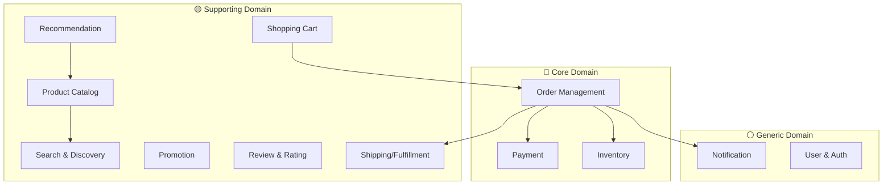

### 1.2. Xác định Bounded Context

Mỗi **Bounded Context (BC)** đại diện cho một ranh giới ngữ nghĩa rõ ràng. Từ 12 functional requirements, ta xác định 12 BC:

| # | Bounded Context | Functional Req | Aggregate chính | Ranh giới dữ liệu |
|---|----------------|----------------|-----------------|-------------------|
| 1 | **Identity & Access** | User Management | `User`, `Role`, `Session` | Credentials, OAuth tokens, profile |
| 2 | **Catalog** | Product Catalog | `Product`, `Category`, `Attribute` | Product info, media, category tree |
| 3 | **Discovery** | Search & Discovery | `SearchIndex`, `Suggestion` | Search index (derived), ranking |
| 4 | **Cart** | Shopping Cart | `Cart`, `CartItem` | Cart state, item snapshots |
| 5 | **Order** | Order Management | `Order`, `OrderItem`, `Return` | Order lifecycle, history |
| 6 | **Payment** | Payment | `Payment`, `Transaction`, `Refund` | Payment records, transactions |
| 7 | **Inventory** | Inventory | `Stock`, `Reservation` | Stock levels, reservations |
| 8 | **Promotion** | Promotion | `Voucher`, `Campaign`, `FlashSale` | Promotion rules, usage tracking |
| 9 | **Fulfillment** | Shipping | `Shipment`, `Tracking`, `Carrier` | Shipping records, tracking events |
| 10 | **Engagement** | Notification | `Notification`, `Template` | Notification logs, preferences |
| 11 | **Trust & UGC** | Review & Rating | `Review`, `Rating`, `Report` | Reviews, moderation queue |
| 12 | **Personalization** | Recommendation | `Signal`, `Model` | Behavioral data, ML features |

**Nguyên tắc mapping:**
- **1 BC = 1 Service** (khởi đầu). Khi service quá lớn, có thể tách tiếp
- Mỗi BC sở hữu **database riêng** — không chia sẻ schema
- Giao tiếp giữa BC qua **API** hoặc **Domain Event**

### 1.3. Ubiquitous Language

| Thuật ngữ | Bounded Context | Định nghĩa chính xác |
|-----------|----------------|----------------------|
| `User` | Identity & Access | Người dùng đã đăng ký, có credentials |
| `Buyer` | Order | Người đặt hàng (user logged in hoặc guest) |
| `Merchant` | Catalog | Nhà bán hàng đã xác minh |
| `Product` | Catalog | Đơn vị sản phẩm gồm mô tả, hình ảnh, thuộc tính, giá gốc |
| `SKU` | Catalog / Inventory | Stock Keeping Unit — biến thể cụ thể (size, color) |
| `CartItem` | Cart | Snapshot của SKU tại thời điểm thêm vào giỏ + quantity |
| `Order` | Order | Đơn hàng đã xác nhận, gồm items, tổng tiền, trạng thái |
| `Payment` | Payment | Giao dịch thanh toán cho một Order |
| `Stock` | Inventory | Số lượng tồn kho khả dụng (available) của một SKU |
| `Reservation` | Inventory | Giữ chỗ tạm cho stock khi checkout — TTL 15 phút |
| `Voucher` | Promotion | Mã giảm giá có điều kiện (min order, thời hạn) |
| `FlashSale` | Promotion | Bán giá sốc trong khung giờ cố định, giới hạn số lượng |
| `Shipment` | Fulfillment | Đơn vận chuyển gửi tới carrier, có tracking number |
| `Review` | Trust & UGC | Đánh giá text + hình ảnh của buyer, cần moderation |

> ⚠️ **Lưu ý:** `Product` trong **Catalog BC** là source of truth. Trong **Cart BC** và **Order BC**, ta chỉ lưu **snapshot** — tránh bị ảnh hưởng khi merchant cập nhật giá.

### 1.4. Context Mapping

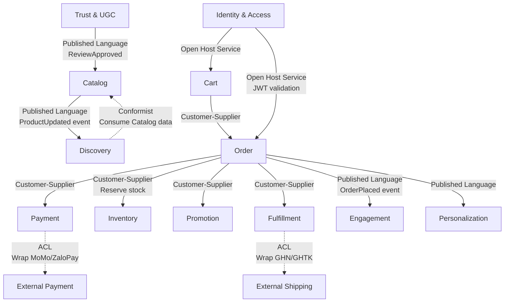

**Chi tiết Context Mapping Patterns:**

| Upstream (U) | Downstream (D) | Pattern | Mô tả |
|-------------|----------------|---------|-------|
| Catalog | Discovery | **Conformist** | Discovery chấp nhận hoàn toàn model của Catalog, re-index khi nhận event |
| Order | Inventory | **Customer-Supplier** | Order yêu cầu reserve stock, Inventory cung cấp API theo nhu cầu |
| Order | Payment | **Customer-Supplier** | Order khởi tạo payment request, Payment callback kết quả |
| Payment | MoMo/ZaloPay | **Anti-Corruption Layer** | Wrap API bên ngoài bằng Adapter, model nội bộ thống nhất |
| Fulfillment | GHN/GHTK | **Anti-Corruption Layer** | Chuẩn hóa thành `Shipment` + `TrackingEvent` nội bộ |
| Identity & Access | Tất cả BC | **Open Host Service** | JWT validation endpoint chuẩn cho mọi service |
| Trust & UGC | Catalog | **Published Language** | ReviewApproved → Catalog cập nhật average rating |

### 1.5. Event Storming — Checkout Flow

```
┌──────────────────────────────────────────────────────────────────────────────┐
│                     EVENT STORMING — CHECKOUT FLOW                           │
│                                                                              │
│  🟦 Command    🟧 Domain Event    🟨 Aggregate    🟪 Policy/Rule             │
├──────────────────────────────────────────────────────────────────────────────┤
│                                                                              │
│  🟦 PlaceOrder ──▶ 🟨 Cart ──▶ 🟧 CartCheckedOut                             │
│        │                              │                                      │
│        ▼                              ▼                                      │
│  🟦 CreateOrder ──▶ 🟨 Order ──▶ 🟧 OrderCreated                             │
│                              │                                               │
│                              ├──▶ 🟦 ReserveStock ──▶ 🟨 Inventory           │
│                              │         ├──▶ 🟧 StockReserved ✓               │
│                              │         └──▶ 🟧 StockReservationFailed ✗      │
│                              │                                               │
│                              ├──▶ 🟦 ApplyVoucher ──▶ 🟨 Promotion           │
│                              │         ├──▶ 🟧 VoucherApplied ✓              │
│                              │         └──▶ 🟧 VoucherRejected ✗             │
│                              │                                               │
│                              └──▶ 🟦 InitiatePayment ──▶ 🟨 Payment          │
│                                        ├──▶ 🟧 PaymentCompleted ✓            │
│                                        └──▶ 🟧 PaymentFailed ✗               │
│                                                   │                          │
│                                                   ▼                          │
│                                  🟪 Release stock + Restore voucher          │
│                                                                              │
│  (PaymentCompleted) ──▶ 🟧 OrderConfirmed ──▶ 🟦 CreateShipment              │
│                                                    │                         │
│                              🟪 Notify buyer "Đơn hàng đã xác nhận"          │
│                              🟪 Notify merchant "Có đơn hàng mới"            │
└──────────────────────────────────────────────────────────────────────────────┘
```

**Key takeaways:**

1. **Saga Pattern cần thiết** — Flow span qua 5 BC, cần Orchestration Saga cho compensating actions
2. **Stock Reservation có TTL** — Payment không hoàn thành trong 15 phút → reservation tự động release
3. **Price snapshot tại checkout** — Giá "đóng băng" khi buyer đặt hàng
4. **COD flow khác biệt** — `PaymentCompleted` chỉ xảy ra khi shipper thu tiền thành công

### 1.6. Ownership Matrix theo Team

| Team | Services sở hữu | On-call | KPI chính |
|------|------------------|---------|-----------|
| Team Core Commerce | Order, Inventory, Promotion | 24/7 | Checkout success, oversell rate |
| Team Payment | Payment, Refund | 24/7 | Payment success, callback latency |
| Team Discovery | Catalog, Search, Recommendation | Giờ hành chính + trực sự kiện | Search latency, CTR |
| Team Experience | Gateway, Cart, User | 24/7 | API error rate, login success |
| Team Engagement | Notification, Review | Giờ hành chính | Delivery success, moderation SLA |
| Platform/SRE | CI/CD, Observability, Security baseline | 24/7 | MTTR, SLO compliance |

**Quy tắc ownership:**

- Service chỉ có **một owner chính**.
- Shared library phải có versioning và backward compatibility.
- Incident SEV-1 bắt buộc có Incident Commander từ team owning service lỗi.

### 1.7. Domain Invariants (Bất biến nghiệp vụ)

| Invariant | Mô tả | Enforced tại |
|----------|-------|--------------|
| Không oversell | `available_stock >= 0` mọi thời điểm commit | Inventory Service |
| Mỗi order có đúng 1 trạng thái tại 1 thời điểm | State machine không cho transition sai | Order Service |
| Mỗi payment callback xử lý tối đa 1 lần | Idempotency theo `payment_provider_txn_id` | Payment Service |
| Voucher usage không vượt quota | `used_count <= quota` | Promotion Service |
| Review chỉ được tạo sau khi giao hàng thành công | Chỉ mở API review sau `shipment.delivered` | Review Service |
| Snapshot giá order bất biến | Không thay đổi `unit_price_snapshot` sau confirm | Order DB |

---

## Phần 2 — Decompose Services

> 🔗 Áp dụng kiến thức từ [05 — Decomposition Strategies](05-decomposition-strategies.md) và [03 — Loose Coupling & High Cohesion](03-loose-coupling-high-cohesion.md)

### 2.1. Nguyên tắc Decomposition

| Nguyên tắc | Mô tả | Ví dụ ShopVN |
|------------|-------|-------------|
| **1:1 BC → Service** | Mỗi BC map thành 1 microservice | Order BC → Order Service |
| **Single Responsibility** | Mỗi service chỉ có một lý do để thay đổi | Payment Service chỉ thay đổi khi logic thanh toán đổi |
| **Own Your Data** | Service sở hữu database riêng | Order có `order_db`, Inventory có `inventory_db` |
| **High Cohesion** | Chức năng liên quan chặt nằm cùng service | Product CRUD + Category + Attribute → Catalog Service |
| **Loose Coupling** | Thay đổi A không yêu cầu đổi B | Payment thêm VNPay không ảnh hưởng Order |
| **Team Ownership** | 1 team sở hữu 1-2 services (2-pizza team) | Team 4-6 người/service |

### 2.2. Danh sách Services chi tiết

| # | Service | Trách nhiệm chính | API chính | Data Owned | Tech Stack |
|---|---------|-------------------|-----------|------------|------------|
| 0 | **API Gateway** | Auth verify, routing, rate limiting, SSL termination | `/*` (proxy) | Rate limit counters | Kong / AWS ALB |
| 1 | **Auth Service** | Đăng ký, đăng nhập, OAuth, JWT issue/refresh | `POST /auth/login`<br/>`POST /auth/refresh` | Credentials, sessions, OAuth tokens | Node.js, PostgreSQL, Redis |
| 2 | **User Service** | Profile, address book, merchant registration | `GET/PUT /users/{id}`<br/>`POST /merchants/register` | Profiles, addresses, merchant info | Node.js, PostgreSQL |
| 3 | **Catalog Service** | Product CRUD, category tree, media upload | `GET/POST /products`<br/>`GET /categories` | Products, categories, attributes | Java/Spring, PostgreSQL, S3 |
| 4 | **Search Service** | Full-text search, faceted search, autosuggest | `GET /search?q=`<br/>`GET /suggest?q=` | Search index (derived) | Python/FastAPI, OpenSearch |
| 5 | **Cart Service** | Add/remove items, merge guest→user cart | `GET/POST /carts/{userId}/items` | Cart state (Redis) | Node.js, Redis, DynamoDB |
| 6 | **Order Service** | Order creation, lifecycle, Saga orchestrator | `POST /orders`<br/>`GET /orders/{id}` | Orders, order_items, saga_state | Java/Spring, PostgreSQL |
| 7 | **Payment Service** | Payment initiation, callback, refund | `POST /payments/initiate`<br/>`POST /payments/callback` | Payments, transactions | Java/Spring, PostgreSQL |
| 8 | **Inventory Service** | Stock management, reservation (hold/commit/release) | `POST /inventory/reserve`<br/>`POST /inventory/commit` | Stocks, reservations | Go, PostgreSQL, Redis |
| 9 | **Promotion Service** | Voucher CRUD, flash sale, rule engine | `POST /promotions/validate`<br/>`GET /flash-sales/active` | Vouchers, campaigns | Java/Spring, PostgreSQL, Redis |
| 10 | **Shipping Service** | Shipping fee calc, carrier selection, tracking | `POST /shipping/calculate`<br/>`POST /shipments` | Shipments, tracking_events | Node.js, PostgreSQL |
| 11 | **Notification Service** | Multi-channel notification (push, SMS, email) | `POST /notifications/send` | Notifications, templates | Node.js, MongoDB, SQS |
| 12 | **Review Service** | Submit review, moderation, rating aggregation | `POST /reviews`<br/>`GET /products/{id}/reviews` | Reviews, ratings | Node.js, MongoDB |
| 13 | **Recommendation Service** | Gợi ý sản phẩm dựa trên hành vi, "Mua cùng" | `GET /recommendations/{userId}` | Behavioral data, ML features | Python, Redis, PostgreSQL |

### 2.3. Service Dependency Graph

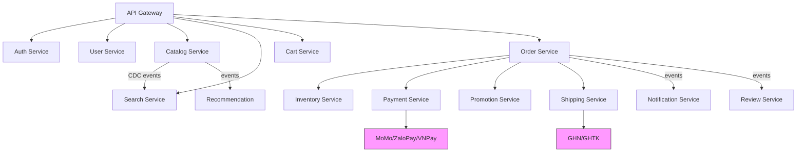

**Quy tắc dependency:**
- **User/Catalog** là upstream (ít dependency)
- **Order** là orchestrator (có nhiều downstream nhất)
- **Notification** chỉ subscribe events (không ai phụ thuộc vào nó)
- **Không có circular dependency** — nếu A → B thì B không → A (qua event nếu cần)

### 2.4. Strangler Fig Migration Plan

Migrate từ Monolith sang Microservices theo từng phase, **không big-bang rewrite**:

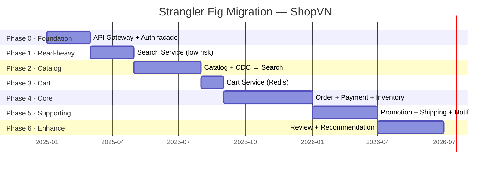

| Phase | Services | Duration | Risk Level | Rollback Strategy |
|-------|----------|----------|------------|-------------------|
| **Phase 0** | API Gateway, Auth facade | 2 tháng | 🟢 Low | Bypass gateway, direct to monolith |
| **Phase 1** | Search Service | 2 tháng | 🟢 Low | Fallback to monolith search module |
| **Phase 2** | Catalog + CDC | 3 tháng | 🟡 Medium | Feature flag toggle old/new catalog |
| **Phase 3** | Cart Service | 1 tháng | 🟢 Low | Fallback to session-based cart |
| **Phase 4** | Order + Payment + Inventory | 4 tháng | 🔴 High | Parallel run + shadow traffic |
| **Phase 5** | Promotion, Shipping, Notification | 3 tháng | 🟡 Medium | Feature flag per module |
| **Phase 6** | Review, Recommendation | 3 tháng | 🟢 Low | Disable features, no business impact |

**Tổng thời gian: ~18 tháng** — Monolith vẫn chạy song song trong suốt quá trình migrate.

### 2.5. Service API Contracts quan trọng

**`POST /orders` (Order Service):**

```json
{
  "userId": "USR-9821",
  "items": [
    { "skuId": "SKU-RED-42", "qty": 1 },
    { "skuId": "SKU-BLACK-38", "qty": 2 }
  ],
  "voucherCode": "SALE50",
  "shippingAddressId": "ADDR-102",
  "paymentMethod": "vnpay"
}
```

**Response:**

```json
{
  "orderId": "ORD-20260227-8891",
  "status": "PAYMENT_PENDING",
  "paymentUrl": "https://sandbox.vnpay.vn/....",
  "expiresAt": "2026-02-27T10:30:00Z"
}
```

| Quy tắc contract | Mục tiêu |
|------------------|----------|
| Version theo URL (`/v1`) + schema registry cho event | Tránh breaking change |
| Field mới phải optional ở version cũ | Backward compatible |
| Error code chuẩn hóa liên service | Dễ xử lý phía client |
| Có `x-request-id` và `idempotency-key` | Truy vết + chống double submit |

### 2.6. Team Topology và Release Ownership

| Loại thay đổi | Team quyết định | Team review bắt buộc |
|--------------|------------------|----------------------|
| Checkout logic | Core Commerce | Payment + Platform |
| Payment provider integration | Payment | Security + Core Commerce |
| Search ranking | Discovery | Product + Data |
| Gateway policy/rate limit | Experience | Security + SRE |
| CI/CD template chuẩn | Platform | Tất cả service owners |

**Release cadence đề xuất:**

- Core services (`Order`, `Payment`, `Inventory`): 2-3 lần/tuần.
- Supporting services: 1-2 lần/tuần.
- Hạ tầng shared: theo change window cố định để giảm blast radius.

---

## Phần 3 — Inter-Service Communication

> 🔗 Áp dụng kiến thức từ [06 — Inter-Service Communication](06-inter-service-communication.md), [07 — API Gateway](07-api-gateway.md), [08 — Service Discovery](08-service-discovery.md)

### 3.1. Quy tắc chọn Sync vs Async

```
┌───────────────────────────────────────────────────────────────┐
│                DECISION FRAMEWORK                             │
│                                                               │
│   User đang chờ response?  ──── YES ──▶ SYNC (REST/gRPC)      │
│         │                                                     │
│         NO                                                    │
│         │                                                     │
│   Cần kết quả ngay?  ──── YES ──▶ SYNC với timeout            │
│         │                                                     │
│         NO                                                    │
│         │                                                     │
│   Là side effect / fan-out?  ──── YES ──▶ ASYNC (Event)       │
│         │                                                     │
│         NO                                                    │
│         │                                                     │
│   Cần eventual consistency OK?  ──── YES ──▶ ASYNC (Event)    │
│         │                                                     │
│         NO ──▶ SYNC với strong consistency                    │
└───────────────────────────────────────────────────────────────┘
```

### 3.2. Communication Matrix

| Flow | Bước | Sync/Async | Protocol | Lý do |
|------|------|------------|----------|-------|
| **Browse Products** | Gateway → Catalog/Search | Sync | REST | User-facing, P95 < 200ms |
| **Add to Cart** | Gateway → Cart | Sync | REST | Confirm ngay cho user |
| **Cart price check** | Cart → Catalog | Sync | gRPC | Cần giá hiện tại, internal call |
| **Checkout** | Order → Inventory reserve | Sync | gRPC | Cần quyết định ngay (còn hàng?) |
| **Create Payment** | Order → Payment | Sync | gRPC | Cần payment_url trả cho user |
| **Payment captured** | Payment → Order | **Async** | Event | Decouple, webhook-based, reliable |
| **Create shipment** | Order → Shipping | **Async** | Event | Có thể delay, không block user |
| **Notification** | Order/Payment → Notification | **Async** | Event | Fan-out, không critical path |
| **Search index update** | Catalog → Search | **Async** | Event+CDC | Eventual consistency OK |
| **Rating update** | Review → Catalog | **Async** | Event | Aggregate tính toán async |
| **Recommendation** | Order → Recommendation | **Async** | Event | ML pipeline, batch process |
| **Flash sale stock check** | Cart → Inventory | Sync | gRPC | Cần real-time stock, atomic |

### 3.3. Event Taxonomy & Catalog

**Phân loại event:**
- **Domain Event** — Sự kiện nội bộ BC: `OrderPlaced`, `StockReserved`
- **Integration Event** — Public, versioned schema: `order.placed.v1`
- **Command** — Yêu cầu hành động: `ReserveStockCommand`

**Naming convention:** Past tense, aggregate + action, versioned

| Event | Producer | Consumers | Key Payload | Ordering Key |
|-------|----------|-----------|-------------|-------------|
| `order.created.v1` | Order | Inventory, Promotion | orderId, userId, items[] | orderId |
| `order.confirmed.v1` | Order | Shipping, Notification, Recommendation | orderId, items, address | orderId |
| `order.cancelled.v1` | Order | Inventory, Promotion, Notification | orderId, reason | orderId |
| `payment.initiated.v1` | Payment | Order | paymentId, orderId, amount | orderId |
| `payment.captured.v1` | Payment | Order, Notification | paymentId, orderId, amount | orderId |
| `payment.failed.v1` | Payment | Order, Notification | paymentId, orderId, reason | orderId |
| `payment.refunded.v1` | Payment | Order, Notification | paymentId, orderId, refundAmount | orderId |
| `stock.reserved.v1` | Inventory | Order | reservationId, orderId, expiresAt | orderId |
| `stock.released.v1` | Inventory | Order | reservationId, orderId | orderId |
| `stock.low.v1` | Inventory | Notification, Catalog | skuId, currentStock, threshold | skuId |
| `product.created.v1` | Catalog | Search, Recommendation | productId, name, category, price | productId |
| `product.updated.v1` | Catalog | Search, Cart | productId, changedFields | productId |
| `product.price_changed.v1` | Catalog | Search, Cart, Promotion | productId, oldPrice, newPrice | productId |
| `review.approved.v1` | Review | Catalog (rating update) | reviewId, productId, rating | productId |
| `shipment.created.v1` | Shipping | Order, Notification | shipmentId, orderId, tracking | orderId |
| `shipment.delivered.v1` | Shipping | Order, Notification, Review | shipmentId, orderId | orderId |
| `voucher.applied.v1` | Promotion | Order | voucherId, orderId, discount | orderId |
| `user.registered.v1` | Auth | User, Notification | userId, email | userId |
| `flash_sale.started.v1` | Promotion | Search, Catalog, Notification | campaignId, products[], startTime | campaignId |
| `flash_sale.ended.v1` | Promotion | Search, Catalog | campaignId | campaignId |

### 3.4. API Gateway Design

```
┌─────────────────────────────────────────────────────────────────┐
│                      API GATEWAY                                │
│                                                                 │
│  Internet ──▶ CloudFront (CDN) ──▶ ALB ──▶ API Gateway          │
│                                                                 │
│  Responsibilities:                                              │
│  ┌──────────────────────────────────────────────────────────┐   │
│  │  1. Authentication  │ Validate JWT, reject invalid token │   │
│  │  2. Rate Limiting   │ Per IP, per user, per API key      │   │
│  │  3. Routing         │ /api/orders/* → Order Service      │   │
│  │  4. SSL Termination │ HTTPS → HTTP (internal)            │   │
│  │  5. Request Logging │ Access log + correlation ID        │   │
│  │  6. CORS            │ Allowed origins configuration      │   │
│  └──────────────────────────────────────────────────────────┘   │
│                                                                 │
│  Routing Table:                                                 │
│  ┌──────────────────────────┬─────────────────────┐             │
│  │ Path Pattern             │ Target Service      │             │
│  ├──────────────────────────┼─────────────────────┤             │
│  │ /api/v1/auth/*           │ Auth Service        │             │
│  │ /api/v1/users/*          │ User Service        │             │
│  │ /api/v1/products/*       │ Catalog Service     │             │
│  │ /api/v1/search/*         │ Search Service      │             │
│  │ /api/v1/cart/*           │ Cart Service        │             │
│  │ /api/v1/orders/*         │ Order Service       │             │
│  │ /api/v1/payments/*       │ Payment Service     │             │
│  │ /api/v1/reviews/*        │ Review Service      │             │
│  │ /api/v1/recommendations/*│ Recommendation      │             │
│  └──────────────────────────┴─────────────────────┘             │
└─────────────────────────────────────────────────────────────────┘
```

### 3.5. Service Discovery

**DNS-based (ECS Service Connect / Cloud Map):**

- Mỗi service đăng ký DNS name trong namespace `shopvn.local`
- Ví dụ: `order-service.shopvn.local:3003`
- Health check tự động deregister instance unhealthy
- Không cần client-side discovery library — platform managed

### 3.6. Sequence Diagram — Complete Checkout Flow

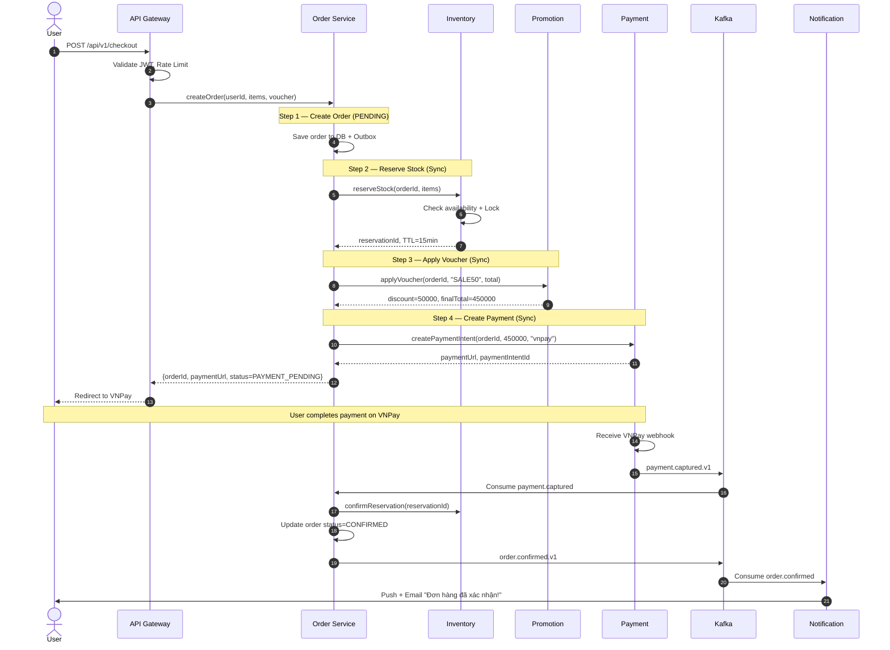

### 3.7. Sequence Diagram — Flash Sale Flow

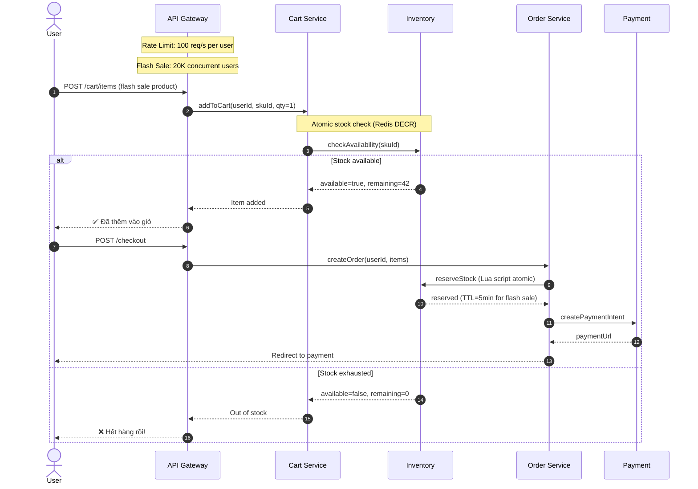

### 3.8. Idempotency & Exactly-Once Semantics (thực tế)

| Use case | Idempotency key | TTL | Nơi lưu |
|----------|------------------|-----|---------|
| Checkout submit | `userId + cartChecksum` | 30 phút | Redis |
| Payment initiate | `orderId + paymentMethod` | 24 giờ | Payment DB |
| Payment callback | `providerTxnId` | 7 ngày | Payment DB unique index |
| Shipment create | `orderId` | 7 ngày | Shipping DB |

**Quy tắc vận hành:**

- HTTP `POST` critical bắt buộc header `Idempotency-Key`.
- Consumer event ghi bảng `processed_events(event_id)` trước side-effect.
- Nếu duplicate event: ACK bỏ qua, không chạy logic lần hai.

### 3.9. Message Broker Design (Kafka/SQS)

| Thành phần | Thiết kế đề xuất |
|------------|------------------|
| Topic naming | `{domain}.{event}.v{n}` (ví dụ: `order.confirmed.v1`) |
| Partition key | `orderId` cho order/payment/inventory flow |
| Retention | 7 ngày với domain event, 14 ngày cho audit topics |
| DLQ | Mỗi consumer group có DLQ riêng |
| Retry | 3 lần với exponential backoff trước khi đưa DLQ |
| Schema | Avro/JSON Schema + compatibility check CI |

**Ví dụ thiết kế topic:**

| Topic | Partitions | Throughput mục tiêu |
|-------|------------|---------------------|
| `order.created.v1` | 48 | 8K msg/s peak |
| `payment.captured.v1` | 24 | 3K msg/s peak |
| `stock.reserved.v1` | 48 | 10K msg/s peak flash sale |
| `notification.requested.v1` | 32 | 15K msg/s burst |

---

## Phần 4 — Data Management & Patterns

> 🔗 Áp dụng kiến thức từ [09 — Data Management](09-data-management.md)

### 4.1. Database per Service — Polyglot Persistence

Mỗi service **sở hữu database riêng**, không service nào truy cập trực tiếp DB của service khác.

| # | Service | Primary DB | Secondary Store | Lý do chọn | Data Volume ước tính |
|---|---------|-----------|----------------|-------------|---------------------|
| 1 | **User** | PostgreSQL | Redis (cache) | ACID cho account. Redis giảm latency | ~2M records, ~50GB |
| 2 | **Catalog** | PostgreSQL | OpenSearch (CDC sync) | Product master cần ACID. OpenSearch cho search | ~500K SKUs, ~100GB |
| 3 | **Search** | OpenSearch | Redis (query cache) | Read-only derived data, optimized cho full-text | ~20GB index |
| 4 | **Cart** | Redis (primary) | DynamoDB (backup) | Key-value + TTL. Sub-ms latency | ~200K active carts, ~2GB |
| 5 | **Order** | PostgreSQL | Read Replica | ACID bắt buộc cho state machine. Replica cho reporting | ~18M orders/năm, ~200GB |
| 6 | **Payment** | PostgreSQL | — | ACID + audit trail (PCI-DSS). Không cache để tránh stale state | ~150GB/năm |
| 7 | **Inventory** | PostgreSQL | Redis (stock cache) | Strong consistency cho stock count (tránh oversell) | ~500K SKU records, ~10GB |
| 8 | **Promotion** | PostgreSQL | Redis (rule cache + counter) | ACID cho voucher codes. Redis compiled rules + usage counter | ~5GB |
| 9 | **Notification** | MongoDB | — | Flexible schema cho đa dạng template (email, SMS, push) | ~100GB/năm |
| 10 | **Review** | MongoDB | — | Flexible content: text + images + ratings | ~50GB/năm |
| 11 | **Recommendation** | Redis (feature store) | PostgreSQL (metadata) | Real-time feature serving + model metadata | ~5GB Redis |

```
┌────────────────────────────────────────────────────────────────┐
│                  DATA ARCHITECTURE OVERVIEW                    │
│                                                                │
│  ┌──────────┐  ┌──────────┐  ┌──────────┐  ┌──────────┐        │
│  │  User    │  │ Catalog  │  │  Order   │  │ Payment  │        │
│  │PostgreSQL│  │PostgreSQL│  │PostgreSQL│  │PostgreSQL│        │
│  │ + Redis  │  │+ OpenSrch│  │+ Replica │  │(PCI-DSS) │        │
│  └──────────┘  └──────────┘  └──────────┘  └──────────┘        │
│                                                                │
│  ┌──────────┐  ┌──────────┐  ┌──────────┐  ┌──────────┐        │
│  │  Cart    │  │Inventory │  │Promotion │  │  Search  │        │
│  │  Redis   │  │PostgreSQL│  │PostgreSQL│  │OpenSearch│        │
│  │+DynamoDB │  │ + Redis  │  │ + Redis  │  │ + Redis  │        │
│  └──────────┘  └──────────┘  └──────────┘  └──────────┘        │
│                                                                │
│  ┌──────────┐  ┌──────────┐  ┌─────────────────────────┐       │
│  │ Notif    │  │  Review  │  │    Event Bus (Kafka)    │       │
│  │ MongoDB  │  │ MongoDB  │  │  Topics: orders.*       │       │
│  └──────────┘  └──────────┘  │  payments.* catalog.*   │       │
│                              └─────────────────────────┘       │
│  ┌─────────────────────────────────────────────────────┐       │
│  │         Object Storage (S3): images, media          │       │
│  └─────────────────────────────────────────────────────┘       │
└────────────────────────────────────────────────────────────────┘
```

### 4.2. Saga Pattern cho Order Flow

**Chọn Orchestration Saga** (Order Service là orchestrator):

| Tiêu chí | Orchestration ✅ | Choreography |
|----------|-----------------|-------------|
| Flow control | Centralized, dễ quản lý | Distributed, khó theo dõi |
| Debug/Monitor | Dễ — xem state machine | Khó — phải correlate events |
| Onboarding | Team dễ hiểu flow | Phải đọc event chain |

**Saga State Machine:**

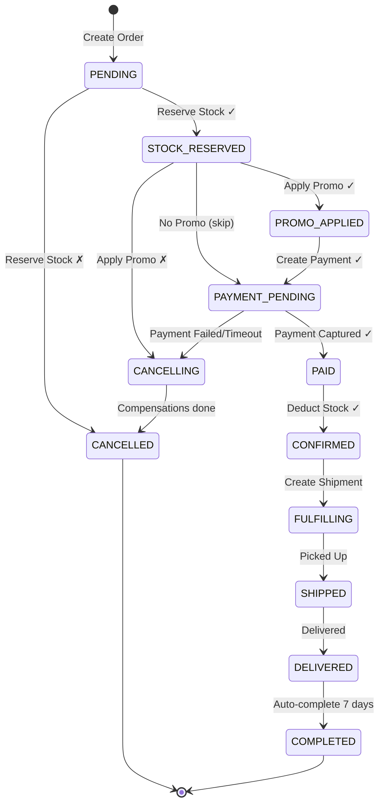

**Chi tiết từng bước:**

| Step | Action | Compensating Action | Timeout |
|------|--------|--------------------:|---------|
| 1. Create Order | Save order (PENDING) | — | — |
| 2. Reserve Stock | `POST /inventory/reserve` | Release reservation | 5s |
| 3. Apply Promotion | `POST /promotions/apply` | Reverse voucher usage | 3s |
| 4. Create Payment | `POST /payments/initiate` | Cancel payment intent | 10s |
| 5. Wait Payment | Webhook: payment.captured | Release stock + reverse promo | **15 min** |
| 6. Confirm Order | Deduct stock, update status | Refund + restore (manual review) | 5s |
| 7. Create Shipment | Async event | Retry via DLQ | 30s |

**Failure Sequence — Payment Failed:**

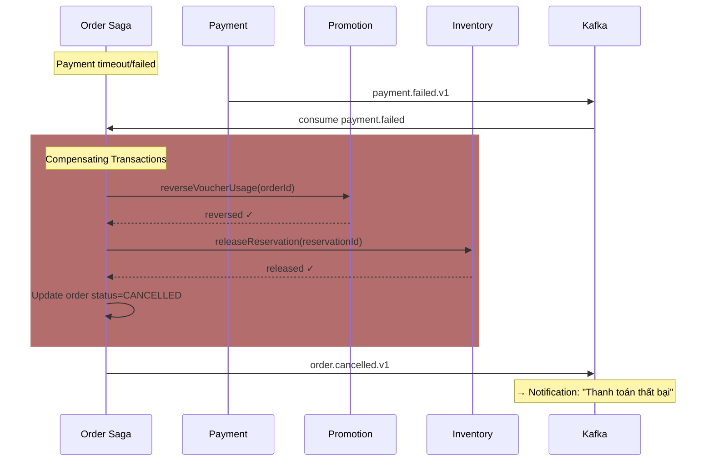

### 4.3. CQRS — Áp dụng ở đâu?

| Service | Cần CQRS? | Write Model | Read Model | Sync Mechanism |
|---------|-----------|-------------|------------|----------------|
| **Catalog** | ✅ Có | PostgreSQL (normalized) | OpenSearch (denormalized) | CDC (Debezium) → Kafka |
| **Search** | ✅ Full CQRS | — (derived) | OpenSearch | Kafka consumer |
| **Order** | ✅ Có | PostgreSQL | Read Replica + materialized views | PostgreSQL replication |
| **Inventory** | ⚠️ Từng phần | PostgreSQL (SoT) | Redis cache (stock level) | Write-through cache |
| **User** | ❌ Không | PostgreSQL + Redis cache | — | Đơn giản, không cần tách |
| **Cart** | ❌ Không | Redis | — | Đã là key-value, đủ nhanh |
| **Payment** | ❌ Không | PostgreSQL | — | Security concern, ít duplicate data |

**CQRS Flow cho Catalog/Search:**

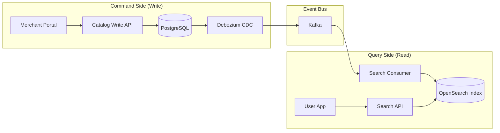

### 4.4. Event Sourcing — Decision

**Khuyến nghị: KHÔNG dùng full Event Sourcing ở giai đoạn đầu**

| Tiêu chí | Event Sourcing | Traditional + Outbox ✅ |
|----------|---------------|----------------------|
| Complexity | Cao (event replay, snapshot, schema evolution) | Trung bình |
| Team learning curve | 3-6 tháng | 2-4 tuần |
| Audit trail | Tuyệt vời — mọi thay đổi đều là event | Đủ tốt — audit table + Outbox events |
| Debugging | Khác biệt (replay events) | Quen thuộc (query DB state) |
| Phù hợp ShopVN | Phase 3+ nếu cần | ✅ Phase 1-2 |

### 4.5. Transactional Outbox Pattern

Giải quyết **Dual Write** problem (ghi DB + publish event phải atomic):

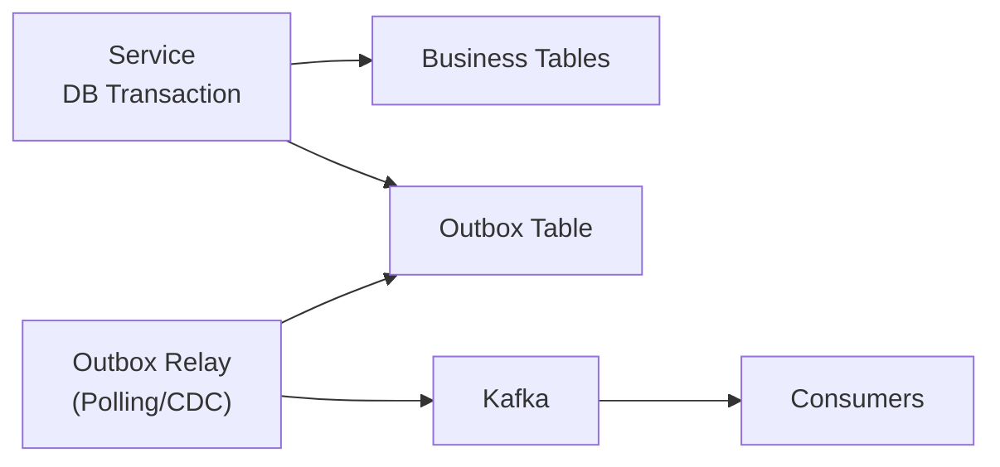

**Outbox table schema:**

```sql
CREATE TABLE outbox_events (
    id            UUID PRIMARY KEY DEFAULT gen_random_uuid(),
    aggregate_type VARCHAR(100) NOT NULL,  -- 'Order', 'Payment'
    aggregate_id   VARCHAR(100) NOT NULL,  -- 'ORD-001'
    event_type     VARCHAR(100) NOT NULL,  -- 'order.created.v1'
    payload        JSONB NOT NULL,
    created_at     TIMESTAMP DEFAULT NOW(),
    published_at   TIMESTAMP NULL          -- NULL = chưa publish
);
```

### 4.6. Data Consistency Rules

| Data | Consistency Level | Pattern | Lý do |
|------|------------------|---------|-------|
| Payment capture | **Strong** | Sync + DB transaction | Không được mất tiền |
| Inventory deduct | **Strong** | Atomic operation + locking | Tránh oversell |
| Order state | **Strong** | Saga orchestrator | Business-critical lifecycle |
| Search index | **Eventual** | CDC + async reindex | Delay 1-5s chấp nhận |
| Recommendation | **Eventual** | Batch ML pipeline | Delay phút-giờ OK |
| Notification | **Eventual** | Async event + DLQ | Retry nếu fail |
| Review rating aggregate | **Eventual** | Event → recalculate avg | Delay vài giây OK |

### 4.7. Schema chi tiết cho Order & Inventory (thực chiến)

**Order tables:**

```sql
CREATE TABLE orders (
  order_id            VARCHAR(40) PRIMARY KEY,
  user_id             VARCHAR(40) NOT NULL,
  status              VARCHAR(30) NOT NULL,
  subtotal_amount     BIGINT NOT NULL,
  discount_amount     BIGINT NOT NULL DEFAULT 0,
  shipping_fee        BIGINT NOT NULL DEFAULT 0,
  total_amount        BIGINT NOT NULL,
  payment_method      VARCHAR(20) NOT NULL,
  created_at          TIMESTAMP NOT NULL DEFAULT NOW(),
  updated_at          TIMESTAMP NOT NULL DEFAULT NOW()
);

CREATE TABLE order_items (
  order_id            VARCHAR(40) NOT NULL,
  line_no             INT NOT NULL,
  product_id          VARCHAR(40) NOT NULL,
  sku_id              VARCHAR(40) NOT NULL,
  qty                 INT NOT NULL,
  unit_price_snapshot BIGINT NOT NULL,
  item_discount       BIGINT NOT NULL DEFAULT 0,
  PRIMARY KEY (order_id, line_no)
);
```

**Inventory tables:**

```sql
CREATE TABLE stocks (
  sku_id              VARCHAR(40) PRIMARY KEY,
  available_qty       INT NOT NULL,
  reserved_qty        INT NOT NULL DEFAULT 0,
  version             BIGINT NOT NULL DEFAULT 0,
  updated_at          TIMESTAMP NOT NULL DEFAULT NOW()
);

CREATE TABLE stock_reservations (
  reservation_id      VARCHAR(40) PRIMARY KEY,
  order_id            VARCHAR(40) NOT NULL,
  sku_id              VARCHAR(40) NOT NULL,
  qty                 INT NOT NULL,
  expires_at          TIMESTAMP NOT NULL,
  status              VARCHAR(20) NOT NULL,
  created_at          TIMESTAMP NOT NULL DEFAULT NOW()
);
```

### 4.8. Concurrency Control & Reconciliation Jobs

| Bài toán | Cách xử lý |
|----------|------------|
| Race condition reserve stock | Atomic SQL update hoặc Redis Lua script |
| Lost update | Optimistic locking (`version`) |
| Payment callback đến muộn | Kiểm tra order status + idempotency |
| Event mất/consumer down | Replay từ offset + reconciliation jobs |

**Reconciliation jobs hàng giờ:**

1. So khớp `orders(CONFIRMED)` với `payments(CAPTURED)` để phát hiện lệch.
2. So khớp `stocks.reserved_qty` với tổng reservations active.
3. Quét reservation quá hạn để release.
4. Đối soát callback provider với transactions nội bộ.

---

## Phần 5 — Resilience & Reliability

> 🔗 Áp dụng kiến thức từ [10 — Resilience Patterns](10-resilience-patterns.md)

### 5.1. Mục tiêu Resilience

- **99.9% uptime** (~8.76h downtime/năm)
- Flash sale: **200K concurrent** (10x normal)
- **Graceful degradation** > hard failure
- **No cascading failures** — 1 service chết không kéo theo hệ thống

### 5.2. Circuit Breaker — Áp dụng ở đâu?

| Caller → Callee | Failure Threshold | Open Duration | Fallback |
|----------------|-------------------|---------------|----------|
| Order → Payment | 5 lỗi / 30s | 30s | Mark order "payment pending", retry later |
| Payment → Bank API | 3 lỗi / 10s | 60s | Return "bank unavailable", queue for retry |
| Search → OpenSearch | 5 lỗi / 30s | 20s | Return cached popular products |
| Shipping → GHN/GHTK | 3 lỗi / 20s | 45s | Queue shipment creation, retry |
| Gateway → Any Service | 10 lỗi / 60s | 30s | Return 503 with retry-after header |

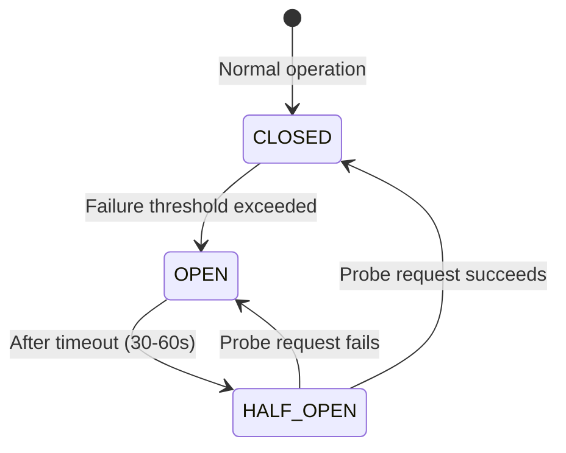

### 5.3. Retry Policy

| Service Call | Max Retries | Base Delay | Max Delay | Điều kiện |
|-------------|-------------|------------|-----------|-----------|
| Order → Inventory | 1 | 100ms | 500ms | Chỉ retry network error, KHÔNG retry "out of stock" |
| Payment → VNPay | 2 | 500ms | 5s | Retry timeout/5xx. KHÔNG retry 4xx |
| Outbox relay | 5 | 1s | 30s | Exponential backoff + jitter |
| Kafka consumer | 3 | 1s | 10s | Retry, sau đó → DLQ |
| Search → OpenSearch | 1 | 50ms | 200ms | Chỉ retry connection error |

> ⚠️ **Idempotency là tiên quyết** — Mọi operation được retry phải có idempotency key.

### 5.4. Bulkhead Pattern

```
┌──────────────────────────────────────────────────────────────┐
│               ORDER SERVICE — BULKHEAD ISOLATION             │
│                                                              │
│  ┌─────────────────┐  ┌─────────────────┐  ┌──────────────┐  │
│  │ Payment Pool    │  │ Inventory Pool  │  │ Other Pool   │  │
│  │ Max: 20 threads │  │ Max: 30 threads │  │ Max: 50      │  │
│  │ Queue: 10       │  │ Queue: 20       │  │ Queue: 30    │  │
│  │                 │  │                 │  │              │  │
│  │ Bank API chậm   │  │ DB lock wait    │  │ Promo, Ship  │  │
│  │ → chỉ 20 thread │  │ → không ảnh     │  │ → hoạt động  │  │
│  │   bị block      │  │   hưởng Payment │  │   bình thường│  │
│  └─────────────────┘  └─────────────────┘  └──────────────┘  │
│                                                              │
│  ✅ Payment chậm → chỉ Payment pool bị ảnh hưởng             │
│  ✅ Inventory, Promotion, Shipping vẫn hoạt động bình thường │
└──────────────────────────────────────────────────────────────┘
```

### 5.5. Rate Limiting

| Endpoint | Rate Limit | Algorithm | Action khi exceed |
|----------|-----------|-----------|-------------------|
| `POST /auth/login` | 5 req/min per IP | Sliding window | 429 + block 15min |
| `GET /search` | 100 req/min per IP | Token bucket | 429 + retry-after |
| `POST /checkout` | 10 req/min per user | Fixed window | 429 + "Vui lòng thử lại" |
| `POST /reviews` | 5 req/hour per user | Sliding window | 429 |
| Flash sale endpoints | 200 req/s global | Leaky bucket | 503 + queue position |

### 5.6. Timeout Configuration

| Service Call | Connect Timeout | Read Timeout | Total Timeout |
|-------------|----------------|-------------|---------------|
| Gateway → Any | 1s | 5s | 10s |
| Order → Inventory | 500ms | 2s | 3s |
| Payment → Bank API | 2s | 10s | 15s |
| Search → OpenSearch | 500ms | 1s | 2s |
| Shipping → GHN API | 2s | 5s | 10s |
| Kafka producer | — | — | 5s (ack timeout) |

### 5.7. Fallback Strategies

| Service Down | Fallback Behavior | User Experience |
|-------------|-------------------|----------------|
| Search | Show popular products + cached results | "Kết quả phổ biến" |
| Recommendation | Show top sellers / recently viewed | Vẫn có gợi ý, ít personalized |
| Promotion (timeout) | Checkout without voucher | "Voucher tạm thời không khả dụng" |
| Notification | Retry via DLQ (async) | User không biết, nhận muộn |
| Review | Disable submit, show cached ratings | "Tạm thời không thể đánh giá" |
| Shipping (fee calc) | Use cached fee hoặc flat rate | "Phí ship ước tính" |

### 5.8. Chaos Engineering Plan

| # | Experiment | Target | Expected Behavior | Success Criteria |
|---|-----------|--------|-------------------|-----------------|
| 1 | Kill Payment pod | Payment Service | Circuit breaker opens, orders marked "pending" | No cascading failure, other services OK |
| 2 | Inject 2s latency | Inventory Service | Timeout → fast fail checkout | P95 checkout < 5s, no hang |
| 3 | Stop Kafka consumer | Order consumer | Messages queue up, DLQ for failures | No data loss, resume OK |
| 4 | Network partition | Order ↔ Payment | Saga compensating transaction triggers | Stock released, order cancelled |
| 5 | Flash sale 10x load | All services | Auto-scaling triggers, rate limiting | SLO met for core flows |

**Tools:** Chaos Monkey (K8s), tc (traffic control), k6/Locust (load test)

### 5.9. Defense in Depth — Thứ tự áp dụng

```
Request ──▶ Rate Limit ──▶ Timeout ──▶ Retry ──▶ Circuit Breaker ──▶ Bulkhead ──▶ Fallback
   │            │             │           │            │                │            │
   │         Quá nhiều     Quá lâu    Thử lại     Quá nhiều lỗi   Isolate pool  Trả kết quả
   │         request?      chờ?       lần nữa?    → ngắt mạch    → không lan    thay thế
   │            │             │           │            │           tràn           │
   ▼            ▼             ▼           ▼            ▼                │         ▼
  429          504        Retry/Fail    Open CB    Thread pool      Fallback    Graceful
                                                   isolated       response    degradation
```

### 5.10. Capacity Planning cho Flash Sale

| Hạng mục | Baseline | Peak Flash Sale (10x) | Ghi chú |
|----------|----------|------------------------|---------|
| Gateway RPS | 2,000 | 20,000 | Có cache và CDN |
| Checkout RPS | 120 | 1,200 | Phụ thuộc campaign |
| Inventory reserve QPS | 200 | 3,000 | Burst cao trong 5 phút đầu |
| Payment initiate QPS | 80 | 1,000 | Thường thấp hơn reserve do drop-off |
| Kafka ingress | 5 MB/s | 45 MB/s | Cần headroom >= 30% |

**Headroom policy:**

- Bình thường: giữ 40% headroom.
- Trước flash sale: pre-scale lên 2-3x.
- Nếu queue lag tăng > ngưỡng 5 phút: bật degraded mode.

### 5.11. Runbook SEV-1: Checkout Down

1. Xác nhận phạm vi: gateway lỗi, order lỗi, hay payment provider lỗi.
2. Kích hoạt war-room và chỉ định Incident Commander.
3. Bật cờ degraded mode:
   - Tạm tắt recommendation, review write.
   - Giữ lại core checkout path.
4. Nếu lỗi external payment: chuyển sang COD/alt provider.
5. Thực hiện rollback phiên bản gần nhất nếu lỗi do deploy.
6. Cập nhật status page mỗi 15 phút.
7. Sau khi ổn định: postmortem + action items có owner/date.

---

## Phần 6 — Observability

> 🔗 Áp dụng kiến thức từ [11 — Observability & Evolvability](11-observability-evolvability.md)

### 6.1. Mục tiêu Observability cho ShopVN

Observability trả lời 3 câu hỏi quan trọng:

- **Hệ thống có đang khỏe không?** (Metrics)
- **Lỗi đang xảy ra ở đâu?** (Logs + Traces)
- **Tại sao lại lỗi?** (Correlation giữa Logs, Metrics, Traces)

| Mục tiêu | Ngưỡng |
|----------|--------|
| API availability | >= 99.9% |
| P95 latency (core APIs) | < 300ms |
| MTTR (Mean Time To Recovery) | < 30 phút |
| MTTD (Mean Time To Detect) | < 5 phút |
| Trace sampling (prod) | 10-20% bình thường, 100% khi incident |

### 6.2. Kiến trúc Telemetry tổng thể

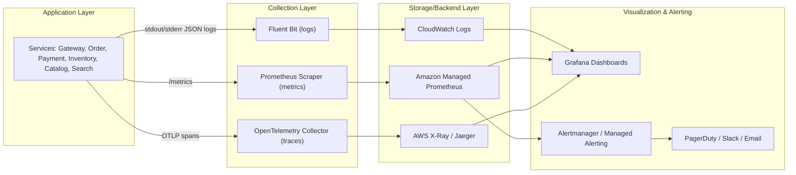

**Luồng đúng theo tín hiệu:**

- **Logs**: Service -> Fluent Bit -> CloudWatch Logs -> Grafana (query datasource).
- **Metrics**: Prometheus scrape `/metrics` -> AMP/Prometheus -> Grafana + Alertmanager.
- **Traces**: Service instrumentation (OTLP) -> OpenTelemetry Collector -> X-Ray/Jaeger -> Grafana.

### 6.3. Logging Strategy

**Nguyên tắc:**

- Log theo định dạng **JSON** để dễ query.
- Mọi log phải có `trace_id`, `span_id`, `request_id`, `user_id` (nếu có).
- Tuyệt đối không log `password`, `card_number`, `cvv`, access token full.
- Phân mức log rõ ràng: `DEBUG`, `INFO`, `WARN`, `ERROR`.

**Schema log chuẩn:**

| Field | Bắt buộc | Ví dụ | Ý nghĩa |
|-------|----------|-------|---------|
| `timestamp` | ✅ | `2026-02-27T10:12:45.123Z` | Thời điểm phát sinh |
| `service` | ✅ | `order-service` | Tên service |
| `env` | ✅ | `prod` | Môi trường |
| `level` | ✅ | `ERROR` | Mức log |
| `trace_id` | ✅ | `4bf92f...` | Correlate trace |
| `span_id` | ✅ | `00f067...` | Span hiện tại |
| `request_id` | ✅ | `req-7f39...` | ID request từ gateway |
| `user_id` | ⚠️ | `USR-9821` | Người dùng (nếu authenticated) |
| `message` | ✅ | `payment callback timeout` | Nội dung chính |
| `error_code` | ⚠️ | `PAYMENT_TIMEOUT` | Mã lỗi chuẩn hóa |

**Ví dụ log thực tế (checkout timeout):**

```json
{
  "timestamp": "2026-02-27T10:12:45.123Z",
  "service": "order-service",
  "env": "prod",
  "level": "ERROR",
  "trace_id": "4bf92f3577b34da6a3ce929d0e0e4736",
  "span_id": "00f067aa0ba902b7",
  "request_id": "req-4c1d-93ae",
  "user_id": "USR-9821",
  "order_id": "ORD-20260227-8891",
  "error_code": "PAYMENT_TIMEOUT",
  "message": "Payment service timeout after 10s"
}
```

### 6.4. Metrics Framework (RED + USE)

ShopVN áp dụng kết hợp:

- **RED** (Rate, Errors, Duration) cho HTTP/gRPC endpoints.
- **USE** (Utilization, Saturation, Errors) cho hạ tầng (CPU, memory, queue, connection pool).

| Service | Golden Metrics chính | Ngưỡng cảnh báo |
|---------|----------------------|-----------------|
| API Gateway | RPS, 4xx/5xx rate, P95 latency | 5xx > 1% trong 5 phút |
| Order | checkout success rate, saga timeout | success < 97% trong 10 phút |
| Payment | callback delay, failed charge rate | failed charge > 2% |
| Inventory | lock wait time, reserve success | reserve fail > 3% |
| Search | P95 query latency, zero-result ratio | P95 > 250ms |
| Kafka | consumer lag, DLQ size | lag > 10,000 messages |
| Database | CPU, connections, slow query count | CPU > 80% trong 10 phút |

### 6.5. SLI/SLO và Error Budget

| User Journey | SLI | SLO | Error Budget (tháng) |
|-------------|-----|-----|----------------------|
| Login | Successful login ratio | 99.95% | 0.05% |
| Search product | P95 latency | < 200ms | 5% request có thể > 200ms |
| Checkout | Success ratio | 99.5% | 0.5% |
| Payment capture | Success ratio | 99.9% | 0.1% |
| Order tracking | Availability | 99.9% | 43.8 phút/tháng |

**Quy tắc vận hành Error Budget:**

- Nếu burn rate > 2x trong 1 giờ: dừng release tính năng mới.
- Ưu tiên fix reliability bug trước feature.
- Chỉ mở lại release khi burn rate trở lại ngưỡng an toàn.

### 6.6. Distributed Tracing

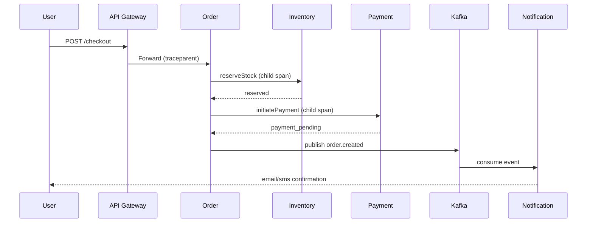

**Trace tags bắt buộc:**

| Tag | Ví dụ |
|-----|-------|
| `order.id` | `ORD-20260227-8891` |
| `payment.provider` | `momo` |
| `inventory.reservation_id` | `RSV-7781` |
| `user.tier` | `gold` |
| `http.status_code` | `200` |

### 6.7. Alerting Rules theo mức độ

| Severity | Điều kiện | Kênh | SLA phản hồi |
|----------|-----------|------|--------------|
| `SEV-1` | Checkout down toàn hệ thống > 5 phút | PagerDuty + Phone | 5 phút |
| `SEV-2` | Payment fail rate > 5% | PagerDuty + Slack | 15 phút |
| `SEV-3` | Search latency tăng cao | Slack | 30 phút |
| `SEV-4` | Storage > 80% | Email + ticket | 4 giờ |

**Alert anti-noise:**

- Dùng **multi-window, multi-burn-rate** cho SLO alert.
- Alert chỉ bắn khi vi phạm liên tục (không bắn spike ngắn).
- Gom alert theo service owner để tránh duplicate.

### 6.8. Dashboard Design

| Dashboard | Đối tượng | Nội dung |
|-----------|-----------|----------|
| Executive Health | CTO/Product | GMV theo giờ, conversion rate, total errors |
| Platform SRE | SRE/DevOps | SLI/SLO, infra saturation, incident timeline |
| Checkout Deep Dive | Team Order/Payment | step timing, failure point, provider success |
| Search Quality | Team Discovery | latency, click-through rate, zero-result rate |

### 6.9. Runbook mẫu: Payment error tăng đột biến

1. Xác nhận scope qua dashboard (`payment failed rate`, `provider breakdown`).
2. Mở trace của các request fail gần nhất.
3. Kiểm tra xem lỗi nội bộ hay lỗi từ provider bên ngoài.
4. Nếu provider lỗi:
   - Mở circuit breaker.
   - Chuyển traffic sang provider dự phòng (nếu có).
   - Hiển thị thông báo thanh toán thay thế.
5. Tạo incident note + timeline.
6. Postmortem trong 24 giờ.

### 6.10. Log Retention, Sampling, và Cost Control

| Loại telemetry | Retention | Sampling | Ghi chú chi phí |
|----------------|-----------|----------|-----------------|
| Access logs | 30 ngày hot, 180 ngày cold | 100% | Bắt buộc audit |
| Application logs | 14 ngày hot, 90 ngày cold | 100% ERROR, 20% INFO | Giảm chi phí lưu trữ |
| Traces | 7 ngày | 10-20% bình thường, 100% khi incident | Tail-based sampling |
| Metrics | 15 tháng | N/A | Dùng downsampling cho long-term |

**Nguyên tắc tối ưu chi phí observability:**

- Gắn nhãn service/team để chargeback.
- Cắt log debug ở production sau 24 giờ kể từ release.
- Archive logs sang object storage lifecycle policy.

---

## Phần 7 — Security Architecture

> 🔗 Áp dụng kiến thức từ [15 — Security](15-security.md)

### 7.1. Security Principles

- **Zero Trust**: không tin tưởng mặc định bất kỳ request nội bộ nào.
- **Least Privilege**: mỗi service chỉ có quyền tối thiểu cần thiết.
- **Defense in Depth**: nhiều lớp bảo vệ từ edge đến data.
- **Secure by Default**: bật TLS, bật auth, tắt truy cập public không cần thiết.

### 7.2. AuthN/AuthZ cho người dùng cuối

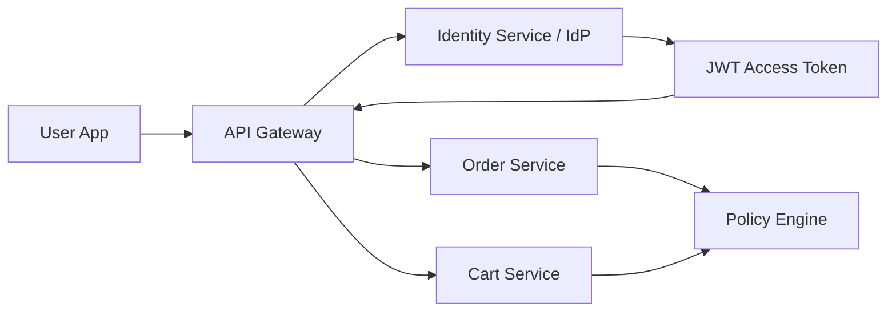

**Luồng chuẩn:**

1. User login qua `Identity Service` (OAuth2/OIDC).
2. Nhận `access_token` (JWT, TTL ngắn 15 phút) + `refresh_token`.
3. Gateway xác thực chữ ký token.
4. Gateway forward claims cần thiết (`sub`, `role`, `scope`, `tenant_id`).
5. Service kiểm tra quyền theo policy (RBAC/ABAC).

### 7.3. Service-to-Service Security

| Control | Áp dụng | Mục đích |
|--------|---------|----------|
| mTLS | Internal traffic | Xác thực 2 chiều giữa services |
| SPIFFE/SPIRE hoặc service identity | Runtime identity | Gán identity ngắn hạn cho workload |
| IAM Role per service | Truy cập AWS resource | Không dùng static credential |
| Network Policy | K8s/ECS SG | Chặn east-west traffic không hợp lệ |
| API allowlist | Gateway/WAF | Chỉ cho endpoint cần thiết |

**Ví dụ policy:** `order-service` chỉ được gọi `inventory-service:reserve`, không được đọc DB của `payment-service`.

### 7.4. API Security Controls

| Mối đe dọa | Control |
|-----------|---------|
| Brute force login | Rate limit + CAPTCHA + lockout |
| Token theft | TLS everywhere + token TTL ngắn + rotate refresh token |
| Injection | Parameterized query + input validation |
| Broken object-level authorization | Check ownership theo `user_id` ở mọi endpoint |
| Replay payment callback | HMAC signature + nonce + timestamp check |
| DDoS/L7 flood | AWS WAF + CDN + autoscaling + rate limiting |

### 7.5. Data Protection

| Loại dữ liệu | At Rest | In Transit | Ghi chú |
|-------------|---------|------------|---------|
| User PII | AES-256 (KMS) | TLS 1.2+ | Mask log |
| Payment metadata | AES-256 | TLS 1.2+ | Không lưu PAN/CVV |
| Secrets/API keys | Secrets Manager | TLS 1.2+ | Auto-rotation 30-90 ngày |
| Backup | Encrypted snapshot | Private network | Cross-account copy |

**Phân loại dữ liệu:**

- `Public`: catalog public data.
- `Internal`: metrics, logs nghiệp vụ thường.
- `Confidential`: user profile, địa chỉ, phone.
- `Restricted`: payment token, security events.

### 7.6. Secrets Management

| Loại secret | Nơi lưu | Rotation | Owner |
|------------|---------|----------|-------|
| DB password | AWS Secrets Manager | 30 ngày | Platform team |
| Payment provider key | Secrets Manager + KMS | 30 ngày | Payment team |
| JWT signing key | KMS/HSM | 90 ngày | Security team |
| TLS cert nội bộ | ACM/Cert Manager | 60 ngày | Platform team |

**Nguyên tắc vận hành:**

- Không hard-code secret trong source code.
- Không truyền secret qua env var nếu runtime hỗ trợ file mount tạm thời.
- Audit toàn bộ truy cập secret.

### 7.7. Threat Modeling (STRIDE) cho Checkout

| STRIDE | Ví dụ rủi ro | Mitigation |
|--------|---------------|------------|
| Spoofing | Giả mạo callback từ payment gateway | HMAC + IP allowlist + cert pinning |
| Tampering | Sửa amount trên đường truyền | TLS + server-side amount revalidation |
| Repudiation | User chối giao dịch | Audit log immutable + transaction ID |
| Information Disclosure | Lộ PII qua logs | Data masking + DLP scan |
| Denial of Service | Flood `POST /checkout` | Rate limit + queue + WAF |
| Elevation of Privilege | User thường gọi admin API | RBAC + policy engine |

### 7.8. Security Testing Pipeline

| Giai đoạn | Kiểm thử |
|----------|----------|
| PR | SAST (Semgrep/CodeQL), secret scan |
| Build | Dependency scan (SCA), container image scan |
| Pre-prod | DAST (OWASP ZAP), API fuzzing |
| Prod định kỳ | Pen-test, cloud config audit (CIS benchmark) |

### 7.9. Incident Response

1. Phát hiện bất thường qua SIEM/alerts.
2. Phân loại mức độ ảnh hưởng (SEV-1..SEV-4).
3. Cô lập thành phần bị compromise.
4. Rotate toàn bộ credentials liên quan.
5. Thu thập forensic logs.
6. Thông báo stakeholder theo quy định.
7. Post-incident review + hardening action items.

### 7.10. Compliance Checklist (PCI-DSS, OWASP ASVS)

| Nhóm kiểm soát | Trạng thái mục tiêu |
|----------------|---------------------|
| Không lưu PAN/CVV | Bắt buộc |
| Tokenization với provider | Bắt buộc |
| Vulnerability scan định kỳ | Hàng tuần |
| Pen-test độc lập | Ít nhất 1 lần/năm |
| MFA cho tài khoản admin | Bắt buộc |
| Audit log immutable | Bắt buộc |
| Secret rotation tự động | Bắt buộc |

**Scope reduction cho PCI:**

- Payment UI redirect sang hosted page của provider.
- Hệ thống nội bộ chỉ xử lý `payment_token` và metadata.
- Tách network segment cho payment components.

---

## Phần 8 — Infrastructure & Deployment

> 🔗 Áp dụng kiến thức từ [12 — Containerization](12-containerization.md), [13 — Orchestration](13-orchestration.md), [14 — CI/CD](14-cicd-deployment.md)

### 8.1. Mục tiêu nền tảng hạ tầng

- Triển khai độc lập từng service.
- Scale ngang theo tải thực tế.
- Tự động hóa hạ tầng bằng IaC.
- Quan sát và bảo mật built-in.
- Tối ưu chi phí theo từng giai đoạn tăng trưởng.

### 8.2. Topology môi trường

```
┌──────────────────────────────────────────────────────────────────────┐
│                           AWS ACCOUNT: SHOPVN                       │
│                                                                      │
│  ┌────────────────────┐   ┌────────────────────┐   ┌──────────────┐  │
│  │      DEV           │   │       STAGING      │   │    PROD      │  │
│  │  lower cost        │   │  pre-release test  │   │  HA + SLO    │  │
│  │  small dataset     │   │  prod-like traffic │   │  full scale  │  │
│  └────────────────────┘   └────────────────────┘   └──────────────┘  │
└──────────────────────────────────────────────────────────────────────┘
```

### 8.3. Compute Strategy theo loại workload

| Workload | Runtime khuyến nghị | Lý do |
|----------|---------------------|-------|
| Core API (Order, Payment, Inventory) | ECS Fargate hoặc EKS | Cần runtime ổn định, control scaling |
| Search API | ECS/EKS | CPU/memory burst, cần tuning |
| Async consumers (Kafka/SQS) | ECS/EKS | Chạy liên tục, cần batch control |
| Event-driven nhẹ (thumbnail, email worker) | Lambda | Pay-per-use, scale nhanh |
| ML inference recommendation | ECS GPU hoặc endpoint riêng | Cần resource profile đặc thù |

### 8.4. Network & Edge Architecture

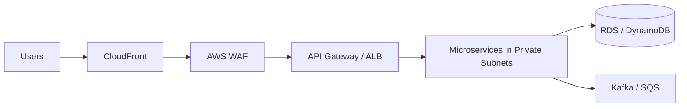

**Thiết kế mạng:**

- Public subnet chỉ chứa edge components (ALB/NAT nếu cần).
- Tất cả service nghiệp vụ chạy private subnet.
- DB, cache chỉ cho phép inbound từ security group của service liên quan.
- Egress outbound bị kiểm soát qua NAT + firewall policy.

### 8.5. Container Standards

| Tiêu chí | Chuẩn áp dụng |
|----------|---------------|
| Base image | Distroless/Alpine tối giản |
| Build | Multi-stage Docker build |
| Security | Run as non-root, read-only filesystem |
| Health check | `/healthz`, `/readyz` rõ ràng |
| Resource limit | CPU/memory request-limit bắt buộc |
| Artifact | Immutable tag theo commit SHA |

### 8.6. Autoscaling Policy

| Service | Metric scale-out | Min/Max replica | Cooldown |
|---------|------------------|-----------------|----------|
| Gateway | CPU > 60% hoặc RPS | 4/50 | 60s |
| Order | RPS + queue lag | 6/80 | 90s |
| Payment | in-flight request | 4/40 | 120s |
| Search | P95 latency + CPU | 4/60 | 60s |
| Consumers | consumer lag | 2/100 | 45s |

### 8.7. CI/CD Pipeline chi tiết

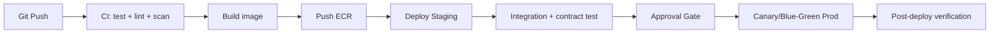

**Gate bắt buộc trước production:**

- Unit test pass >= 90% success.
- Contract test pass 100%.
- Security scan không có lỗ hổng Critical/High chưa waive.
- Smoke test pass sau deploy.

### 8.8. Deployment Strategy theo service

| Service | Strategy | Lý do |
|---------|----------|-------|
| Gateway | Canary 5% -> 25% -> 100% | Rủi ro cao, cần quan sát lỗi sớm |
| Order/Payment/Inventory | Blue-Green | Tránh downtime, rollback nhanh |
| Catalog/Search | Rolling update | Chấp nhận rolling vì read-heavy |
| Consumers | Rolling + drain graceful | Tránh mất message đang xử lý |
| Lambda workers | Alias weighted canary | Native deployment control |

### 8.9. Backup, DR, và BCP

| Thành phần | RPO | RTO | Chiến lược |
|-----------|-----|-----|------------|
| Order DB | 5 phút | 30 phút | PITR + multi-AZ |
| Payment DB | < 1 phút | 15 phút | Synchronous replica + PITR |
| Catalog DB | 15 phút | 60 phút | Snapshot định kỳ |
| Kafka topics | 5 phút | 30 phút | Replication + mirror topic |
| Object storage | gần 0 | 15 phút | Versioning + cross-region replication |

**BCP thực tế cho flash sale:**

- Freeze deploy trước sự kiện 24 giờ.
- Pre-scale capacity lên 2-3 lần baseline.
- War-room trực chiến (Product + Eng + SRE + Security).
- Chuẩn bị runbook rollback trong 1 lệnh.

### 8.10. IaC Structure & Environment Promotion

| Thành phần | Công cụ | Quy tắc |
|------------|---------|---------|
| VPC, subnet, SG, IAM | Terraform/CDK | Tách module reusable |
| ECS/EKS services | Terraform/CDK + Helm (nếu EKS) | Mỗi service 1 module/chart |
| Database/cache | Terraform | Backup policy bắt buộc |
| CI/CD pipelines | Terraform + GitHub Actions templates | Chuẩn hóa theo service type |

**Promotion flow:**

1. Merge vào `main` -> deploy `dev` tự động.
2. Tag release -> deploy `staging`.
3. Sau khi test + approval -> deploy `prod` theo canary/blue-green.
4. Artifact immutable, tuyệt đối không rebuild giữa các môi trường.

---

## Phần 9 — So sánh các Solution Infrastructure

### 9.1. 3 phương án cho ShopVN

- **Solution A: ECS Fargate-first**
- **Solution B: EKS-first**
- **Solution C: Hybrid (ECS cho core + Lambda cho event-driven)**

### 9.2. So sánh định tính

| Tiêu chí | Solution A: ECS Fargate | Solution B: EKS | Solution C: Hybrid (ECS + Lambda) |
|----------|--------------------------|-----------------|------------------------------------|
| Độ phức tạp vận hành | Thấp-Trung bình | Cao | Trung bình |
| Chi phí nền tảng ban đầu | Trung bình | Cao (team + control plane) | Trung bình |
| Tốc độ go-live | Nhanh | Chậm hơn | Nhanh-Trung bình |
| Khả năng custom networking/runtime | Trung bình | Rất cao | Cao |
| Học tập cho team | Dễ hơn | Khó hơn | Trung bình |
| Phù hợp team 30 dev | ✅ tốt | ⚠️ cần team platform mạnh | ✅ tốt nếu governance tốt |
| Phù hợp phase 1 | ✅ | ⚠️ | ✅ |
| Phù hợp scale rất lớn dài hạn | ⚠️ | ✅ | ✅ |

### 9.3. Ước lượng chi phí tương đối (tham chiếu)

| Thành phần | A: ECS Fargate | B: EKS | C: Hybrid |
|-----------|-----------------|--------|-----------|
| Compute core APIs | 1.0x | 0.8x-1.1x (tùy tối ưu node) | 0.9x |
| Ops overhead nhân sự | 1.0x | 1.4x | 1.2x |
| Event workloads | 1.0x | 1.0x | 0.6x-0.9x (Lambda phù hợp burst) |
| Tổng giai đoạn đầu | **1.0x (baseline)** | **1.2x-1.4x** | **0.95x-1.15x** |

> Ghi chú: Đây là estimate tương đối để ra quyết định kiến trúc ban đầu. Cost thực tế phụ thuộc traffic, data transfer, reserved plans, và mức tối ưu workload.

### 9.4. Decision đề xuất cho ShopVN

**Khuyến nghị:** chọn **Solution C (Hybrid)** theo lộ trình:

1. Core domain (`Order`, `Payment`, `Inventory`, `Catalog`) chạy ECS Fargate.
2. Workload burst/event-driven (`Notification`, ảnh, enrichment) chạy Lambda.
3. Khi team platform trưởng thành và custom nhu cầu tăng mạnh, cân nhắc chuyển một phần hoặc toàn bộ sang EKS.

### 9.5. Migration Path 3 giai đoạn

| Giai đoạn | Thời gian | Trọng tâm | Kết quả |
|-----------|-----------|-----------|---------|
| Phase 1 | 0-3 tháng | Strangler Fig + tách core services | Monolith giảm tải 40-60% |
| Phase 2 | 3-9 tháng | Event-driven, observability, security hardening | Scale độc lập cho core flow |
| Phase 3 | 9-18 tháng | Tối ưu cost/perf, cân nhắc EKS cho workload phù hợp | Nền tảng ổn định dài hạn |

### 9.6. Weighted Decision Matrix

| Tiêu chí | Trọng số | ECS Fargate | EKS | Hybrid |
|----------|----------|-------------|-----|--------|
| Time-to-market | 25% | 9 | 6 | 8 |
| Vận hành dài hạn | 20% | 7 | 9 | 8 |
| Chi phí giai đoạn đầu | 20% | 8 | 6 | 8 |
| Khả năng mở rộng cực lớn | 15% | 7 | 9 | 8 |
| Năng lực hiện tại của team | 20% | 8 | 6 | 8 |
| **Điểm tổng** | **100%** | **7.95** | **7.10** | **8.00** |

Kết quả định lượng phù hợp với khuyến nghị chọn **Hybrid** cho bối cảnh hiện tại của ShopVN.

---

## Phần 10 — Tổng kết Architecture Decision Records

### 10.1. Danh sách ADR chính

| ADR # | Quyết định | Lý do | Alternatives đã cân nhắc |
|-------|------------|-------|---------------------------|
| ADR-001 | Decompose theo Business Capability + Bounded Context | Ranh giới nghiệp vụ rõ, phù hợp team ownership | Tách theo technical layer |
| ADR-002 | Database per Service | Giảm coupling dữ liệu, tăng autonomy | Shared database |
| ADR-003 | Saga Orchestration cho checkout | Luồng nhiều bước, cần compensating rõ ràng | Choreography thuần event |
| ADR-004 | Transactional Outbox | Tránh dual-write inconsistency | 2PC, publish trực tiếp sau commit |
| ADR-005 | Sync + Async hybrid communication | Cân bằng độ trễ và độ tin cậy | Sync-only hoặc async-only |
| ADR-006 | CQRS cho Catalog/Search | Read-heavy, cần query tối ưu | Single model duy nhất |
| ADR-007 | Event Sourcing chưa áp dụng phase đầu | Giảm complexity, tăng tốc delivery | Full Event Sourcing từ đầu |
| ADR-008 | Defense-in-depth resilience stack | Ngăn cascading failure | Chỉ dùng retry cơ bản |
| ADR-009 | Zero Trust + mTLS + IAM per service | Tăng security posture nội bộ | Shared static credentials |
| ADR-010 | Hybrid ECS + Lambda | Go-live nhanh + tối ưu burst cost | ECS-only, EKS-only |

### 10.2. ADR template đề xuất

| Trường | Nội dung cần có |
|--------|-----------------|
| `Title` | Tên quyết định |
| `Status` | Proposed / Accepted / Deprecated |
| `Context` | Bối cảnh nghiệp vụ và kỹ thuật |
| `Decision` | Quyết định cụ thể |
| `Consequences` | Lợi ích, trade-off, rủi ro |
| `Alternatives` | Các phương án đã loại |
| `Date` | Ngày quyết định |
| `Owners` | Team/phụ trách |

### 10.3. Trade-off tổng thể

| Quyết định | Lợi ích | Trade-off |
|-----------|---------|-----------|
| Tách nhiều services ngay từ đầu | Autonomy cao | Tăng vận hành và quan sát |
| Saga thay vì transaction phân tán | Scale tốt, linh hoạt | Eventual consistency + debug khó hơn |
| Hybrid compute | Tối ưu chi phí/tính linh hoạt | Governance phức tạp hơn |
| CQRS có chọn lọc | Tối ưu read path | Tăng đồng bộ dữ liệu |

### 10.4. KPI đánh giá thành công sau migration

| KPI | Trước migration | Mục tiêu sau migration |
|-----|-----------------|------------------------|
| Deploy frequency | 2 lần/tháng | >= 20 lần/tháng |
| Lead time for change | 7-14 ngày | < 1 ngày |
| MTTR | 4 giờ | < 30 phút |
| Checkout success rate | 96-97% peak | >= 99.5% |
| P95 API latency | 450-700ms peak | < 300ms |
| Downtime mỗi lần release | 2-3 giờ | ~0 (zero-downtime) |

### 10.5. Kết luận case study

Thiết kế này giúp ShopVN:

- Chuyển từ monolith sang kiến trúc microservice có lộ trình, giảm rủi ro big-bang.
- Tập trung đầu tư vào core domain (`Order`, `Payment`, `Inventory`) nơi tạo khác biệt cạnh tranh.
- Đảm bảo scale cho flash sale bằng event-driven, autoscaling và resilience patterns.
- Tăng độ tin cậy vận hành thông qua observability đầy đủ và SLO-driven operations.
- Đáp ứng bảo mật thực chiến với Zero Trust, mTLS, secrets rotation và security testing liên tục.

### 10.6. Backlog thực thi 90 ngày đầu

| Tuần | Deliverable | Owner |
|------|-------------|-------|
| 1-2 | Chuẩn hóa logging/metrics/tracing SDK cho tất cả services | Platform |
| 3-4 | Triển khai API Gateway policy chuẩn + idempotency middleware | Experience |
| 5-6 | Hoàn thiện Order Saga orchestration + outbox relay | Core Commerce |
| 7-8 | Payment ACL + callback verification + reconciliation job | Payment |
| 9-10 | Inventory atomic reserve + expiry worker | Core Commerce |
| 11-12 | SLO dashboard + alert burn-rate + runbook SEV-1 | SRE |

**Definition of Done cho mỗi service migration:**

- Contract test pass.
- SLO và alert đã bật.
- Runbook + on-call ownership rõ ràng.
- Rollback verified trong staging.

---

## 🔗 Liên kết

- [01 — Microservice Overview](01-microservice-overview.md)
- [02 — Single Responsibility & Bounded Context](02-single-responsibility-bounded-context.md)
- [05 — Decomposition Strategies](05-decomposition-strategies.md)
- [06 — Inter-Service Communication](06-inter-service-communication.md)
- [07 — API Gateway](07-api-gateway.md)
- [08 — Service Discovery](08-service-discovery.md)
- [09 — Data Management](09-data-management.md)
- [10 — Resilience Patterns](10-resilience-patterns.md)
- [11 — Observability & Evolvability](11-observability-evolvability.md)
- [12 — Containerization](12-containerization.md)
- [13 — Orchestration](13-orchestration.md)
- [14 — CI/CD Deployment](14-cicd-deployment.md)
- [15 — Security](15-security.md)
- [16 — Configuration & Secrets Management](16-configuration-secrets-management.md)
- [17 — Design Patterns](17-design-patterns.md)
- [18 — AWS Deployment Architecture](18-aws-deployment-architecture.md)
- [19 — AWS Communication & Discovery](19-aws-communication-discovery.md)
- [20 — AWS Data Management](20-aws-data-management.md)
- [21 — AWS Resilience](21-aws-resilience.md)
- [22 — AWS Observability](22-aws-observability.md)
- [23 — AWS Security](23-aws-security.md)
- [24 — AWS CI/CD Deployment](24-aws-cicd-deployment.md)
