# 🛒 Case Study: Thiết kế kiến trúc Microservice cho E-Commerce Platform

## 📋 Mục lục

- [Đề bài](#-đề-bài)
- [Yêu cầu chức năng (Functional Requirements)](#-yêu-cầu-chức-năng-functional-requirements)
- [Yêu cầu phi chức năng (Non-Functional Requirements)](#-yêu-cầu-phi-chức-năng-non-functional-requirements)
- [Phần 1 — Phân tích Domain & Bounded Context](#phần-1--phân-tích-domain--bounded-context)
- [Phần 2 — Decompose Services](#phần-2--decompose-services)
- [Phần 3 — Inter-Service Communication](#phần-3--inter-service-communication)
- [Phần 4 — Data Management & Patterns](#phần-4--data-management--patterns)
- [Phần 5 — Resilience & Reliability](#phần-5--resilience--reliability)
- [Phần 6 — Observability](#phần-6--observability)
- [Phần 7 — Security Architecture](#phần-7--security-architecture)
- [Phần 8 — Infrastructure & Deployment](#phần-8--infrastructure--deployment)
- [Phần 9 — So sánh các Solution Infrastructure](#phần-9--so-sánh-các-solution-infrastructure)
- [Phần 10 — Tổng kết Architecture Decision Records](#phần-10--tổng-kết-architecture-decision-records)

---

## 📝 Đề bài

### Bối cảnh

Công ty **ShopVN** đang vận hành một **Monolith E-Commerce** được xây dựng từ 5 năm trước. Hệ thống hiện tại gặp các vấn đề:

- **Scale khó**: Toàn bộ hệ thống phải scale cùng nhau dù chỉ có module thanh toán bị quá tải
- **Deploy rủi ro**: Mỗi lần deploy mất 2-3 giờ downtime, 1 bug nhỏ ảnh hưởng toàn hệ thống
- **Team bottleneck**: 30 developers làm chung 1 codebase, conflict liên tục
- **Tech stack cứng nhắc**: Toàn bộ viết bằng Java, không thể dùng Python cho ML recommendation

### Quy mô hệ thống

| Metric | Giá trị |
|--------|---------|
| Số user đăng ký | 2 triệu |
| DAU (Daily Active Users) | 200,000 |
| Số đơn hàng/ngày | 50,000 |
| Peak concurrent users | 20,000 (flash sale) |
| Số sản phẩm (SKU) | 500,000 |
| Số merchants/sellers | 5,000 |
| Uptime yêu cầu | 99.9% |
| Response time P95 | < 300ms |
| Vùng phục vụ | Việt Nam (single region) |

### Các module hiện tại trong Monolith

```
┌─────────────────────────────────────────────────────────┐
│                    MONOLITH SHOPVN                      │
│                                                         │
│  ┌──────────┐ ┌──────────┐ ┌──────────┐ ┌────────────┐  │
│  │   User   │ │ Product  │ │  Order   │ │  Payment   │  │
│  │  Module  │ │  Module  │ │  Module  │ │   Module   │  │
│  └──────────┘ └──────────┘ └──────────┘ └────────────┘  │
│  ┌──────────┐ ┌──────────┐ ┌──────────┐ ┌────────────┐  │
│  │Inventory │ │ Shopping │ │Promotion │ │Notification│  │
│  │  Module  │ │   Cart   │ │  Module  │ │   Module   │  │
│  └──────────┘ └──────────┘ └──────────┘ └────────────┘  │
│  ┌──────────┐ ┌──────────┐ ┌──────────┐                 │
│  │ Shipping │ │  Review  │ │  Search  │                 │
│  │  Module  │ │  Module  │ │  Module  │                 │
│  └──────────┘ └──────────┘ └──────────┘                 │
│                                                         │
│              ┌──────────────────────┐                   │
│              │   Single Database    │                   │
│              │    (PostgreSQL)      │                   │
│              └──────────────────────┘                   │
└─────────────────────────────────────────────────────────┘
```

---

## 🎯 Yêu cầu chức năng (Functional Requirements)

| # | Chức năng | Mô tả |
|---|-----------|-------|
| F1 | **User Management** | Đăng ký, đăng nhập, profile, address book, OAuth (Google/Facebook) |
| F2 | **Product Catalog** | CRUD sản phẩm, categories, attributes, hình ảnh, seller quản lý sản phẩm |
| F3 | **Search & Discovery** | Full-text search, filter, faceted search, auto-suggest, ranking |
| F4 | **Shopping Cart** | Thêm/xóa/sửa giỏ hàng, persistent cart, merge cart (guest → login) |
| F5 | **Order Management** | Tạo đơn, theo dõi trạng thái, hủy đơn, order history |
| F6 | **Payment** | Thanh toán COD, ví điện tử (MoMo, ZaloPay), banking, refund |
| F7 | **Inventory** | Quản lý tồn kho, reserved stock khi đặt hàng, low-stock alert |
| F8 | **Promotion** | Voucher, flash sale, combo deal, tự động áp dụng khuyến mãi |
| F9 | **Notification** | Email, SMS, push notification, in-app notification |
| F10 | **Shipping** | Tính phí ship, tracking, tích hợp đối tác vận chuyển (GHN, GHTK) |
| F11 | **Review & Rating** | Đánh giá sản phẩm, rating, hình ảnh review |
| F12 | **Recommendation** | Gợi ý sản phẩm dựa trên hành vi, "Mua cùng", "Xem gần đây" |

---

## ⚡ Yêu cầu phi chức năng (Non-Functional Requirements)

| # | Yêu cầu | Chi tiết |
|---|---------|----------|
| NF1 | **Availability** | 99.9% uptime (~8.76h downtime/năm) |
| NF2 | **Scalability** | Handle 10x traffic trong flash sale (200K concurrent) |
| NF3 | **Performance** | API response P95 < 300ms, search < 200ms |
| NF4 | **Data Consistency** | Eventual consistency chấp nhận được cho catalog/search, Strong consistency cho payment/inventory |
| NF5 | **Security** | PCI-DSS compliance cho payment, OWASP Top 10 |
| NF6 | **Deployability** | Zero-downtime deployment, rollback < 5 phút |
| NF7 | **Observability** | Distributed tracing, centralized logging, real-time alerting |
| NF8 | **Cost** | Startup budget — tối ưu chi phí, scale dần |

---

## Phần 1 — Phân tích Domain & Bounded Context

> 🔗 Áp dụng kiến thức từ [02 — Single Responsibility & Bounded Context](02-single-responsibility-bounded-context.md) và [05 — Decomposition Strategies](05-decomposition-strategies.md)

### 1.1. Xác định Domain và Subdomain

**E-Commerce** là domain chính của ShopVN. Theo phương pháp Domain-Driven Design (DDD), ta phân tích domain thành các **Subdomain** với 3 loại:

- **Core Domain** — Tạo lợi thế cạnh tranh trực tiếp, cần đầu tư nhiều nhất
- **Supporting Domain** — Hỗ trợ Core Domain, tùy chỉnh theo đặc thù business
- **Generic Domain** — Không tạo khác biệt, có thể dùng SaaS hoặc thư viện có sẵn

| Subdomain | Loại | Lý do phân loại | Hướng đầu tư |
|-----------|------|-----------------|--------------|
| **Order Management** | 🔴 Core | Quy trình đặt hàng là trải nghiệm cốt lõi, cần tối ưu cho thị trường VN (COD chiếm ~60%) | Team senior, tự phát triển 100% |
| **Payment** | 🔴 Core | Tích hợp MoMo, ZaloPay, VNPay — hệ sinh thái thanh toán đặc thù VN | Team senior, ACL wrapper cho providers |
| **Inventory** | 🔴 Core | Quản lý 500K SKU, flash sale cần xử lý race condition, tránh oversell | Team senior, Redis + DB locking |
| **Product Catalog** | 🟡 Supporting | Quản lý sản phẩm, category — cần tùy chỉnh cho 5K merchants VN | Team mid-senior |
| **Search & Discovery** | 🟡 Supporting | Tìm kiếm tiếng Việt có dấu, gợi ý thông minh — đặc thù ngôn ngữ | Elasticsearch + custom analyzer |
| **Promotion** | 🟡 Supporting | Voucher, flash sale, combo — chiến lược marketing đặc thù | Rule engine tự phát triển |
| **Review & Rating** | 🟡 Supporting | Nội dung UGC tạo niềm tin cho buyer VN | Moderation pipeline |
| **Recommendation** | 🟡 Supporting | Gợi ý sản phẩm dựa trên hành vi — tăng conversion rate | ML model + feature store |
| **Shopping Cart** | 🟡 Supporting | Session-based, merge khi login — cần hiệu năng cao | Redis-backed |
| **Shipping/Fulfillment** | 🟡 Supporting | Tích hợp GHN, GHTK, Viettel Post — đối tác vận chuyển VN | Adapter pattern cho từng carrier |
| **Notification** | ⚪ Generic | Email, SMS, push — không tạo khác biệt cạnh tranh | SES, Firebase FCM, eSMS |
| **User & Auth** | ⚪ Generic | Đăng nhập, OAuth, quản lý profile — bài toán đã có lời giải | Cognito / Keycloak + custom profile |

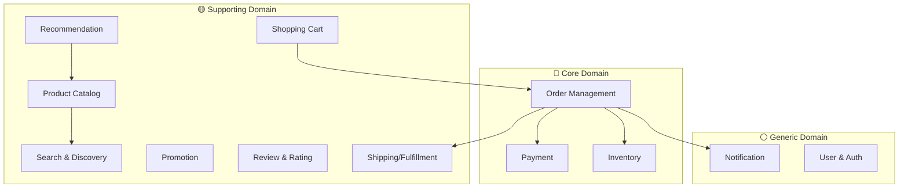

### 1.2. Xác định Bounded Context

Mỗi **Bounded Context (BC)** đại diện cho một ranh giới ngữ nghĩa rõ ràng. Từ 12 functional requirements, ta xác định 12 BC:

| # | Bounded Context | Functional Req | Aggregate chính | Ranh giới dữ liệu |
|---|----------------|----------------|-----------------|-------------------|
| 1 | **Identity & Access** | User Management | `User`, `Role`, `Session` | Credentials, OAuth tokens, profile |
| 2 | **Catalog** | Product Catalog | `Product`, `Category`, `Attribute` | Product info, media, category tree |
| 3 | **Discovery** | Search & Discovery | `SearchIndex`, `Suggestion` | Search index (derived), ranking |
| 4 | **Cart** | Shopping Cart | `Cart`, `CartItem` | Cart state, item snapshots |
| 5 | **Order** | Order Management | `Order`, `OrderItem`, `Return` | Order lifecycle, history |
| 6 | **Payment** | Payment | `Payment`, `Transaction`, `Refund` | Payment records, transactions |
| 7 | **Inventory** | Inventory | `Stock`, `Reservation` | Stock levels, reservations |
| 8 | **Promotion** | Promotion | `Voucher`, `Campaign`, `FlashSale` | Promotion rules, usage tracking |
| 9 | **Fulfillment** | Shipping | `Shipment`, `Tracking`, `Carrier` | Shipping records, tracking events |
| 10 | **Engagement** | Notification | `Notification`, `Template` | Notification logs, preferences |
| 11 | **Trust & UGC** | Review & Rating | `Review`, `Rating`, `Report` | Reviews, moderation queue |
| 12 | **Personalization** | Recommendation | `Signal`, `Model` | Behavioral data, ML features |

**Nguyên tắc mapping:**
- **1 BC = 1 Service** (khởi đầu). Khi service quá lớn, có thể tách tiếp
- Mỗi BC sở hữu **database riêng** — không chia sẻ schema
- Giao tiếp giữa BC qua **API** hoặc **Domain Event**

### 1.3. Ubiquitous Language

| Thuật ngữ | Bounded Context | Định nghĩa chính xác |
|-----------|----------------|----------------------|
| `User` | Identity & Access | Người dùng đã đăng ký, có credentials |
| `Buyer` | Order | Người đặt hàng (user logged in hoặc guest) |
| `Merchant` | Catalog | Nhà bán hàng đã xác minh |
| `Product` | Catalog | Đơn vị sản phẩm gồm mô tả, hình ảnh, thuộc tính, giá gốc |
| `SKU` | Catalog / Inventory | Stock Keeping Unit — biến thể cụ thể (size, color) |
| `CartItem` | Cart | Snapshot của SKU tại thời điểm thêm vào giỏ + quantity |
| `Order` | Order | Đơn hàng đã xác nhận, gồm items, tổng tiền, trạng thái |
| `Payment` | Payment | Giao dịch thanh toán cho một Order |
| `Stock` | Inventory | Số lượng tồn kho khả dụng (available) của một SKU |
| `Reservation` | Inventory | Giữ chỗ tạm cho stock khi checkout — TTL 15 phút |
| `Voucher` | Promotion | Mã giảm giá có điều kiện (min order, thời hạn) |
| `FlashSale` | Promotion | Bán giá sốc trong khung giờ cố định, giới hạn số lượng |
| `Shipment` | Fulfillment | Đơn vận chuyển gửi tới carrier, có tracking number |
| `Review` | Trust & UGC | Đánh giá text + hình ảnh của buyer, cần moderation |

> ⚠️ **Lưu ý:** `Product` trong **Catalog BC** là source of truth. Trong **Cart BC** và **Order BC**, ta chỉ lưu **snapshot** — tránh bị ảnh hưởng khi merchant cập nhật giá.

### 1.4. Context Mapping

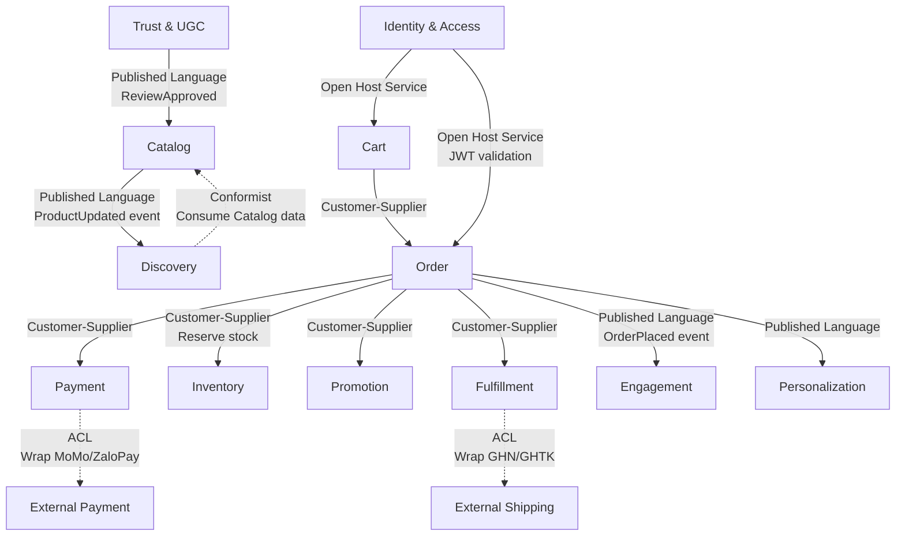

**Chi tiết Context Mapping Patterns:**

| Upstream (U) | Downstream (D) | Pattern | Mô tả |
|-------------|----------------|---------|-------|
| Catalog | Discovery | **Conformist** | Discovery chấp nhận hoàn toàn model của Catalog, re-index khi nhận event |
| Order | Inventory | **Customer-Supplier** | Order yêu cầu reserve stock, Inventory cung cấp API theo nhu cầu |
| Order | Payment | **Customer-Supplier** | Order khởi tạo payment request, Payment callback kết quả |
| Payment | MoMo/ZaloPay | **Anti-Corruption Layer** | Wrap API bên ngoài bằng Adapter, model nội bộ thống nhất |
| Fulfillment | GHN/GHTK | **Anti-Corruption Layer** | Chuẩn hóa thành `Shipment` + `TrackingEvent` nội bộ |
| Identity & Access | Tất cả BC | **Open Host Service** | JWT validation endpoint chuẩn cho mọi service |
| Trust & UGC | Catalog | **Published Language** | ReviewApproved → Catalog cập nhật average rating |

### 1.5. Event Storming — Checkout Flow

```
┌──────────────────────────────────────────────────────────────────────────────┐
│                     EVENT STORMING — CHECKOUT FLOW                           │
│                                                                              │
│  🟦 Command    🟧 Domain Event    🟨 Aggregate    🟪 Policy/Rule             │
├──────────────────────────────────────────────────────────────────────────────┤
│                                                                              │
│  🟦 PlaceOrder ──▶ 🟨 Cart ──▶ 🟧 CartCheckedOut                             │
│        │                              │                                      │
│        ▼                              ▼                                      │
│  🟦 CreateOrder ──▶ 🟨 Order ──▶ 🟧 OrderCreated                             │
│                              │                                               │
│                              ├──▶ 🟦 ReserveStock ──▶ 🟨 Inventory           │
│                              │         ├──▶ 🟧 StockReserved ✓               │
│                              │         └──▶ 🟧 StockReservationFailed ✗      │
│                              │                                               │
│                              ├──▶ 🟦 ApplyVoucher ──▶ 🟨 Promotion           │
│                              │         ├──▶ 🟧 VoucherApplied ✓              │
│                              │         └──▶ 🟧 VoucherRejected ✗             │
│                              │                                               │
│                              └──▶ 🟦 InitiatePayment ──▶ 🟨 Payment          │
│                                        ├──▶ 🟧 PaymentCompleted ✓            │
│                                        └──▶ 🟧 PaymentFailed ✗               │
│                                                   │                          │
│                                                   ▼                          │
│                                  🟪 Release stock + Restore voucher          │
│                                                                              │
│  (PaymentCompleted) ──▶ 🟧 OrderConfirmed ──▶ 🟦 CreateShipment              │
│                                                    │                         │
│                              🟪 Notify buyer "Đơn hàng đã xác nhận"          │
│                              🟪 Notify merchant "Có đơn hàng mới"            │
└──────────────────────────────────────────────────────────────────────────────┘
```

**Key takeaways:**

1. **Saga Pattern cần thiết** — Flow span qua 5 BC, cần Orchestration Saga cho compensating actions
2. **Stock Reservation có TTL** — Payment không hoàn thành trong 15 phút → reservation tự động release
3. **Price snapshot tại checkout** — Giá "đóng băng" khi buyer đặt hàng
4. **COD flow khác biệt** — `PaymentCompleted` chỉ xảy ra khi shipper thu tiền thành công

---

## Phần 2 — Decompose Services

> 🔗 Áp dụng kiến thức từ [05 — Decomposition Strategies](05-decomposition-strategies.md) và [03 — Loose Coupling & High Cohesion](03-loose-coupling-high-cohesion.md)

### 2.1. Nguyên tắc Decomposition

| Nguyên tắc | Mô tả | Ví dụ ShopVN |
|------------|-------|-------------|
| **1:1 BC → Service** | Mỗi BC map thành 1 microservice | Order BC → Order Service |
| **Single Responsibility** | Mỗi service chỉ có một lý do để thay đổi | Payment Service chỉ thay đổi khi logic thanh toán đổi |
| **Own Your Data** | Service sở hữu database riêng | Order có `order_db`, Inventory có `inventory_db` |
| **High Cohesion** | Chức năng liên quan chặt nằm cùng service | Product CRUD + Category + Attribute → Catalog Service |
| **Loose Coupling** | Thay đổi A không yêu cầu đổi B | Payment thêm VNPay không ảnh hưởng Order |
| **Team Ownership** | 1 team sở hữu 1-2 services (2-pizza team) | Team 4-6 người/service |

### 2.2. Danh sách Services chi tiết

| # | Service | Trách nhiệm chính | API chính | Data Owned | Tech Stack |
|---|---------|-------------------|-----------|------------|------------|
| 0 | **API Gateway** | Auth verify, routing, rate limiting, SSL termination | `/*` (proxy) | Rate limit counters | Kong / AWS ALB |
| 1 | **Auth Service** | Đăng ký, đăng nhập, OAuth, JWT issue/refresh | `POST /auth/login`<br/>`POST /auth/refresh` | Credentials, sessions, OAuth tokens | Node.js, PostgreSQL, Redis |
| 2 | **User Service** | Profile, address book, merchant registration | `GET/PUT /users/{id}`<br/>`POST /merchants/register` | Profiles, addresses, merchant info | Node.js, PostgreSQL |
| 3 | **Catalog Service** | Product CRUD, category tree, media upload | `GET/POST /products`<br/>`GET /categories` | Products, categories, attributes | Java/Spring, PostgreSQL, S3 |
| 4 | **Search Service** | Full-text search, faceted search, autosuggest | `GET /search?q=`<br/>`GET /suggest?q=` | Search index (derived) | Python/FastAPI, OpenSearch |
| 5 | **Cart Service** | Add/remove items, merge guest→user cart | `GET/POST /carts/{userId}/items` | Cart state (Redis) | Node.js, Redis, DynamoDB |
| 6 | **Order Service** | Order creation, lifecycle, Saga orchestrator | `POST /orders`<br/>`GET /orders/{id}` | Orders, order_items, saga_state | Java/Spring, PostgreSQL |
| 7 | **Payment Service** | Payment initiation, callback, refund | `POST /payments/initiate`<br/>`POST /payments/callback` | Payments, transactions | Java/Spring, PostgreSQL |
| 8 | **Inventory Service** | Stock management, reservation (hold/commit/release) | `POST /inventory/reserve`<br/>`POST /inventory/commit` | Stocks, reservations | Go, PostgreSQL, Redis |
| 9 | **Promotion Service** | Voucher CRUD, flash sale, rule engine | `POST /promotions/validate`<br/>`GET /flash-sales/active` | Vouchers, campaigns | Java/Spring, PostgreSQL, Redis |
| 10 | **Shipping Service** | Shipping fee calc, carrier selection, tracking | `POST /shipping/calculate`<br/>`POST /shipments` | Shipments, tracking_events | Node.js, PostgreSQL |
| 11 | **Notification Service** | Multi-channel notification (push, SMS, email) | `POST /notifications/send` | Notifications, templates | Node.js, MongoDB, SQS |
| 12 | **Review Service** | Submit review, moderation, rating aggregation | `POST /reviews`<br/>`GET /products/{id}/reviews` | Reviews, ratings | Node.js, MongoDB |
| 13 | **Recommendation Service** | Gợi ý sản phẩm dựa trên hành vi, "Mua cùng" | `GET /recommendations/{userId}` | Behavioral data, ML features | Python, Redis, PostgreSQL |

### 2.3. Service Dependency Graph

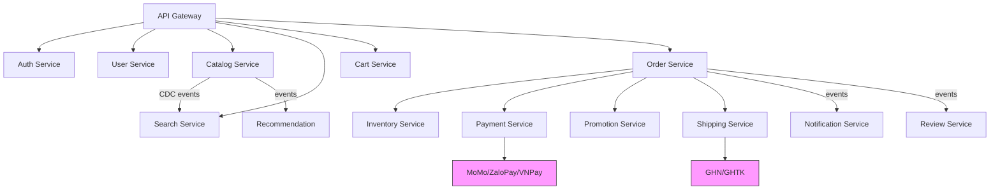

**Quy tắc dependency:**
- **User/Catalog** là upstream (ít dependency)
- **Order** là orchestrator (có nhiều downstream nhất)
- **Notification** chỉ subscribe events (không ai phụ thuộc vào nó)
- **Không có circular dependency** — nếu A → B thì B không → A (qua event nếu cần)

### 2.4. Strangler Fig Migration Plan

Migrate từ Monolith sang Microservices theo từng phase, **không big-bang rewrite**:

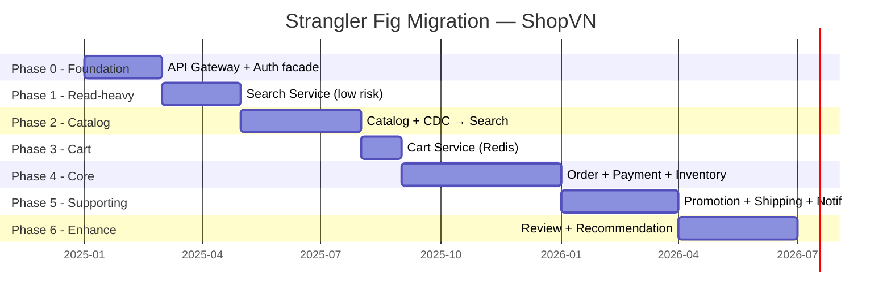

| Phase | Services | Duration | Risk Level | Rollback Strategy |
|-------|----------|----------|------------|-------------------|
| **Phase 0** | API Gateway, Auth facade | 2 tháng | 🟢 Low | Bypass gateway, direct to monolith |
| **Phase 1** | Search Service | 2 tháng | 🟢 Low | Fallback to monolith search module |
| **Phase 2** | Catalog + CDC | 3 tháng | 🟡 Medium | Feature flag toggle old/new catalog |
| **Phase 3** | Cart Service | 1 tháng | 🟢 Low | Fallback to session-based cart |
| **Phase 4** | Order + Payment + Inventory | 4 tháng | 🔴 High | Parallel run + shadow traffic |
| **Phase 5** | Promotion, Shipping, Notification | 3 tháng | 🟡 Medium | Feature flag per module |
| **Phase 6** | Review, Recommendation | 3 tháng | 🟢 Low | Disable features, no business impact |

**Tổng thời gian: ~18 tháng** — Monolith vẫn chạy song song trong suốt quá trình migrate.

---

## Phần 3 — Inter-Service Communication

> 🔗 Áp dụng kiến thức từ [06 — Inter-Service Communication](06-inter-service-communication.md), [07 — API Gateway](07-api-gateway.md), [08 — Service Discovery](08-service-discovery.md)

### 3.1. Quy tắc chọn Sync vs Async

```
┌───────────────────────────────────────────────────────────────┐
│                DECISION FRAMEWORK                             │
│                                                               │
│   User đang chờ response?  ──── YES ──▶ SYNC (REST/gRPC)      │
│         │                                                     │
│         NO                                                    │
│         │                                                     │
│   Cần kết quả ngay?  ──── YES ──▶ SYNC với timeout            │
│         │                                                     │
│         NO                                                    │
│         │                                                     │
│   Là side effect / fan-out?  ──── YES ──▶ ASYNC (Event)       │
│         │                                                     │
│         NO                                                    │
│         │                                                     │
│   Cần eventual consistency OK?  ──── YES ──▶ ASYNC (Event)    │
│         │                                                     │
│         NO ──▶ SYNC với strong consistency                    │
└───────────────────────────────────────────────────────────────┘
```

### 3.2. Communication Matrix

| Flow | Bước | Sync/Async | Protocol | Lý do |
|------|------|------------|----------|-------|
| **Browse Products** | Gateway → Catalog/Search | Sync | REST | User-facing, P95 < 200ms |
| **Add to Cart** | Gateway → Cart | Sync | REST | Confirm ngay cho user |
| **Cart price check** | Cart → Catalog | Sync | gRPC | Cần giá hiện tại, internal call |
| **Checkout** | Order → Inventory reserve | Sync | gRPC | Cần quyết định ngay (còn hàng?) |
| **Create Payment** | Order → Payment | Sync | gRPC | Cần payment_url trả cho user |
| **Payment captured** | Payment → Order | **Async** | Event | Decouple, webhook-based, reliable |
| **Create shipment** | Order → Shipping | **Async** | Event | Có thể delay, không block user |
| **Notification** | Order/Payment → Notification | **Async** | Event | Fan-out, không critical path |
| **Search index update** | Catalog → Search | **Async** | Event+CDC | Eventual consistency OK |
| **Rating update** | Review → Catalog | **Async** | Event | Aggregate tính toán async |
| **Recommendation** | Order → Recommendation | **Async** | Event | ML pipeline, batch process |
| **Flash sale stock check** | Cart → Inventory | Sync | gRPC | Cần real-time stock, atomic |

### 3.3. Event Taxonomy & Catalog

**Phân loại event:**
- **Domain Event** — Sự kiện nội bộ BC: `OrderPlaced`, `StockReserved`
- **Integration Event** — Public, versioned schema: `order.placed.v1`
- **Command** — Yêu cầu hành động: `ReserveStockCommand`

**Naming convention:** Past tense, aggregate + action, versioned

| Event | Producer | Consumers | Key Payload | Ordering Key |
|-------|----------|-----------|-------------|-------------|
| `order.created.v1` | Order | Inventory, Promotion | orderId, userId, items[] | orderId |
| `order.confirmed.v1` | Order | Shipping, Notification, Recommendation | orderId, items, address | orderId |
| `order.cancelled.v1` | Order | Inventory, Promotion, Notification | orderId, reason | orderId |
| `payment.initiated.v1` | Payment | Order | paymentId, orderId, amount | orderId |
| `payment.captured.v1` | Payment | Order, Notification | paymentId, orderId, amount | orderId |
| `payment.failed.v1` | Payment | Order, Notification | paymentId, orderId, reason | orderId |
| `payment.refunded.v1` | Payment | Order, Notification | paymentId, orderId, refundAmount | orderId |
| `stock.reserved.v1` | Inventory | Order | reservationId, orderId, expiresAt | orderId |
| `stock.released.v1` | Inventory | Order | reservationId, orderId | orderId |
| `stock.low.v1` | Inventory | Notification, Catalog | skuId, currentStock, threshold | skuId |
| `product.created.v1` | Catalog | Search, Recommendation | productId, name, category, price | productId |
| `product.updated.v1` | Catalog | Search, Cart | productId, changedFields | productId |
| `product.price_changed.v1` | Catalog | Search, Cart, Promotion | productId, oldPrice, newPrice | productId |
| `review.approved.v1` | Review | Catalog (rating update) | reviewId, productId, rating | productId |
| `shipment.created.v1` | Shipping | Order, Notification | shipmentId, orderId, tracking | orderId |
| `shipment.delivered.v1` | Shipping | Order, Notification, Review | shipmentId, orderId | orderId |
| `voucher.applied.v1` | Promotion | Order | voucherId, orderId, discount | orderId |
| `user.registered.v1` | Auth | User, Notification | userId, email | userId |
| `flash_sale.started.v1` | Promotion | Search, Catalog, Notification | campaignId, products[], startTime | campaignId |
| `flash_sale.ended.v1` | Promotion | Search, Catalog | campaignId | campaignId |

### 3.4. API Gateway Design

```
┌─────────────────────────────────────────────────────────────────┐
│                      API GATEWAY                                │
│                                                                 │
│  Internet ──▶ CloudFront (CDN) ──▶ ALB ──▶ API Gateway          │
│                                                                 │
│  Responsibilities:                                              │
│  ┌──────────────────────────────────────────────────────────┐   │
│  │  1. Authentication  │ Validate JWT, reject invalid token │   │
│  │  2. Rate Limiting   │ Per IP, per user, per API key      │   │
│  │  3. Routing         │ /api/orders/* → Order Service      │   │
│  │  4. SSL Termination │ HTTPS → HTTP (internal)            │   │
│  │  5. Request Logging │ Access log + correlation ID        │   │
│  │  6. CORS            │ Allowed origins configuration      │   │
│  └──────────────────────────────────────────────────────────┘   │
│                                                                 │
│  Routing Table:                                                 │
│  ┌──────────────────────────┬─────────────────────┐             │
│  │ Path Pattern             │ Target Service      │             │
│  ├──────────────────────────┼─────────────────────┤             │
│  │ /api/v1/auth/*           │ Auth Service        │             │
│  │ /api/v1/users/*          │ User Service        │             │
│  │ /api/v1/products/*       │ Catalog Service     │             │
│  │ /api/v1/search/*         │ Search Service      │             │
│  │ /api/v1/cart/*           │ Cart Service        │             │
│  │ /api/v1/orders/*         │ Order Service       │             │
│  │ /api/v1/payments/*       │ Payment Service     │             │
│  │ /api/v1/reviews/*        │ Review Service      │             │
│  │ /api/v1/recommendations/*│ Recommendation      │             │
│  └──────────────────────────┴─────────────────────┘             │
└─────────────────────────────────────────────────────────────────┘
```

### 3.5. Service Discovery

**DNS-based (ECS Service Connect / Cloud Map):**

- Mỗi service đăng ký DNS name trong namespace `shopvn.local`
- Ví dụ: `order-service.shopvn.local:3003`
- Health check tự động deregister instance unhealthy
- Không cần client-side discovery library — platform managed

### 3.6. Sequence Diagram — Complete Checkout Flow

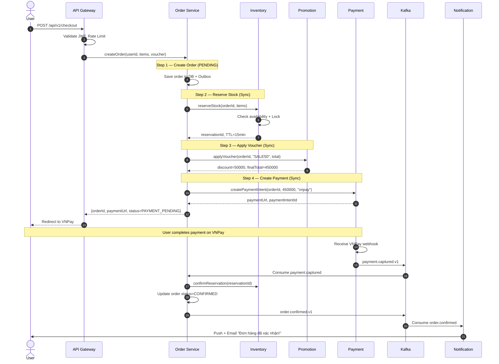

### 3.7. Sequence Diagram — Flash Sale Flow

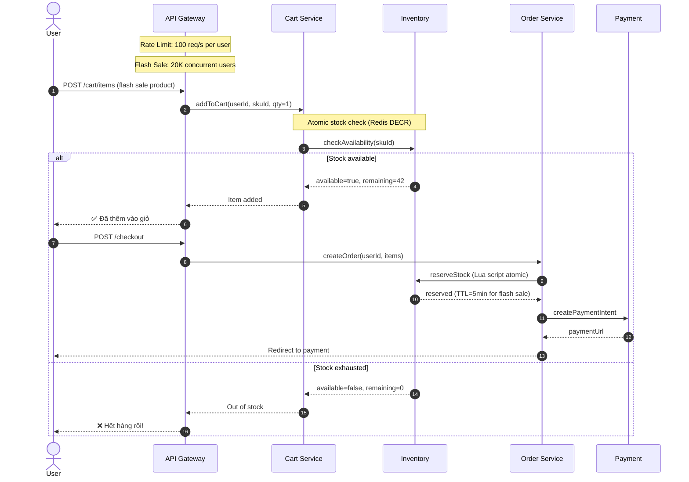

---

## Phần 4 — Data Management & Patterns

> 🔗 Áp dụng kiến thức từ [09 — Data Management](09-data-management.md)

### 4.1. Database per Service — Polyglot Persistence

Mỗi service **sở hữu database riêng**, không service nào truy cập trực tiếp DB của service khác.

| # | Service | Primary DB | Secondary Store | Lý do chọn | Data Volume ước tính |
|---|---------|-----------|----------------|-------------|---------------------|
| 1 | **User** | PostgreSQL | Redis (cache) | ACID cho account. Redis giảm latency | ~2M records, ~50GB |
| 2 | **Catalog** | PostgreSQL | OpenSearch (CDC sync) | Product master cần ACID. OpenSearch cho search | ~500K SKUs, ~100GB |
| 3 | **Search** | OpenSearch | Redis (query cache) | Read-only derived data, optimized cho full-text | ~20GB index |
| 4 | **Cart** | Redis (primary) | DynamoDB (backup) | Key-value + TTL. Sub-ms latency | ~200K active carts, ~2GB |
| 5 | **Order** | PostgreSQL | Read Replica | ACID bắt buộc cho state machine. Replica cho reporting | ~18M orders/năm, ~200GB |
| 6 | **Payment** | PostgreSQL | — | ACID + audit trail (PCI-DSS). Không cache để tránh stale state | ~150GB/năm |
| 7 | **Inventory** | PostgreSQL | Redis (stock cache) | Strong consistency cho stock count (tránh oversell) | ~500K SKU records, ~10GB |
| 8 | **Promotion** | PostgreSQL | Redis (rule cache + counter) | ACID cho voucher codes. Redis compiled rules + usage counter | ~5GB |
| 9 | **Notification** | MongoDB | — | Flexible schema cho đa dạng template (email, SMS, push) | ~100GB/năm |
| 10 | **Review** | MongoDB | — | Flexible content: text + images + ratings | ~50GB/năm |
| 11 | **Recommendation** | Redis (feature store) | PostgreSQL (metadata) | Real-time feature serving + model metadata | ~5GB Redis |

```
┌────────────────────────────────────────────────────────────────┐
│                  DATA ARCHITECTURE OVERVIEW                    │
│                                                                │
│  ┌──────────┐  ┌──────────┐  ┌──────────┐  ┌──────────┐        │
│  │  User    │  │ Catalog  │  │  Order   │  │ Payment  │        │
│  │PostgreSQL│  │PostgreSQL│  │PostgreSQL│  │PostgreSQL│        │
│  │ + Redis  │  │+ OpenSrch│  │+ Replica │  │(PCI-DSS) │        │
│  └──────────┘  └──────────┘  └──────────┘  └──────────┘        │
│                                                                │
│  ┌──────────┐  ┌──────────┐  ┌──────────┐  ┌──────────┐        │
│  │  Cart    │  │Inventory │  │Promotion │  │  Search  │        │
│  │  Redis   │  │PostgreSQL│  │PostgreSQL│  │OpenSearch│        │
│  │+DynamoDB │  │ + Redis  │  │ + Redis  │  │ + Redis  │        │
│  └──────────┘  └──────────┘  └──────────┘  └──────────┘        │
│                                                                │
│  ┌──────────┐  ┌──────────┐  ┌─────────────────────────┐       │
│  │ Notif    │  │  Review  │  │    Event Bus (Kafka)    │       │
│  │ MongoDB  │  │ MongoDB  │  │  Topics: orders.*       │       │
│  └──────────┘  └──────────┘  │  payments.* catalog.*   │       │
│                              └─────────────────────────┘       │
│  ┌─────────────────────────────────────────────────────┐       │
│  │         Object Storage (S3): images, media          │       │
│  └─────────────────────────────────────────────────────┘       │
└────────────────────────────────────────────────────────────────┘
```

### 4.2. Saga Pattern cho Order Flow

**Chọn Orchestration Saga** (Order Service là orchestrator):

| Tiêu chí | Orchestration ✅ | Choreography |
|----------|-----------------|-------------|
| Flow control | Centralized, dễ quản lý | Distributed, khó theo dõi |
| Debug/Monitor | Dễ — xem state machine | Khó — phải correlate events |
| Onboarding | Team dễ hiểu flow | Phải đọc event chain |

**Saga State Machine:**

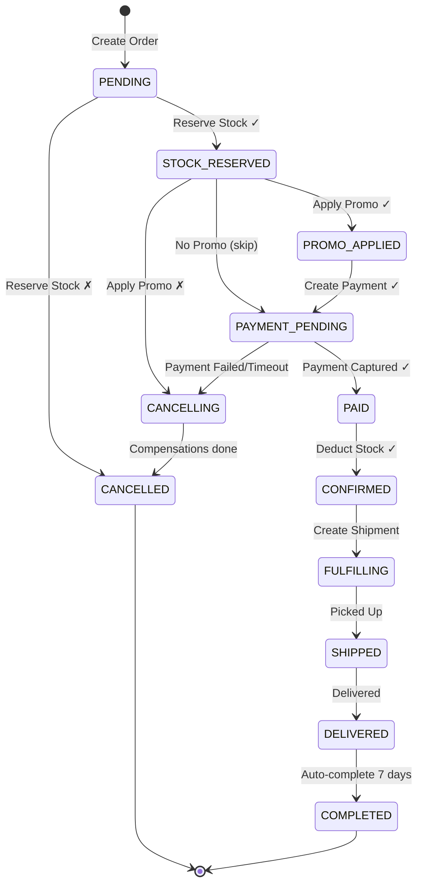

**Chi tiết từng bước:**

| Step | Action | Compensating Action | Timeout |
|------|--------|--------------------:|---------|
| 1. Create Order | Save order (PENDING) | — | — |
| 2. Reserve Stock | `POST /inventory/reserve` | Release reservation | 5s |
| 3. Apply Promotion | `POST /promotions/apply` | Reverse voucher usage | 3s |
| 4. Create Payment | `POST /payments/initiate` | Cancel payment intent | 10s |
| 5. Wait Payment | Webhook: payment.captured | Release stock + reverse promo | **15 min** |
| 6. Confirm Order | Deduct stock, update status | Refund + restore (manual review) | 5s |
| 7. Create Shipment | Async event | Retry via DLQ | 30s |

**Failure Sequence — Payment Failed:**

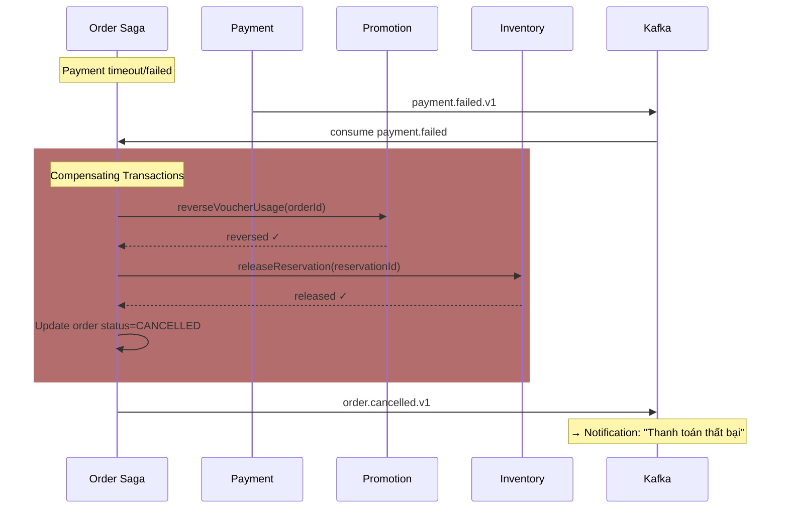

### 4.3. CQRS — Áp dụng ở đâu?

| Service | Cần CQRS? | Write Model | Read Model | Sync Mechanism |
|---------|-----------|-------------|------------|----------------|
| **Catalog** | ✅ Có | PostgreSQL (normalized) | OpenSearch (denormalized) | CDC (Debezium) → Kafka |
| **Search** | ✅ Full CQRS | — (derived) | OpenSearch | Kafka consumer |
| **Order** | ✅ Có | PostgreSQL | Read Replica + materialized views | PostgreSQL replication |
| **Inventory** | ⚠️ Từng phần | PostgreSQL (SoT) | Redis cache (stock level) | Write-through cache |
| **User** | ❌ Không | PostgreSQL + Redis cache | — | Đơn giản, không cần tách |
| **Cart** | ❌ Không | Redis | — | Đã là key-value, đủ nhanh |
| **Payment** | ❌ Không | PostgreSQL | — | Security concern, ít duplicate data |

**CQRS Flow cho Catalog/Search:**

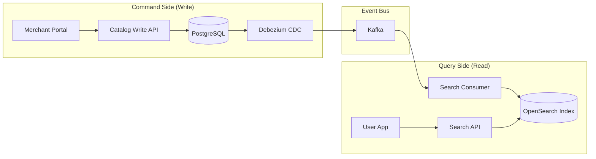

### 4.4. Event Sourcing — Decision

**Khuyến nghị: KHÔNG dùng full Event Sourcing ở giai đoạn đầu**

| Tiêu chí | Event Sourcing | Traditional + Outbox ✅ |
|----------|---------------|----------------------|
| Complexity | Cao (event replay, snapshot, schema evolution) | Trung bình |
| Team learning curve | 3-6 tháng | 2-4 tuần |
| Audit trail | Tuyệt vời — mọi thay đổi đều là event | Đủ tốt — audit table + Outbox events |
| Debugging | Khác biệt (replay events) | Quen thuộc (query DB state) |
| Phù hợp ShopVN | Phase 3+ nếu cần | ✅ Phase 1-2 |

### 4.5. Transactional Outbox Pattern

Giải quyết **Dual Write** problem (ghi DB + publish event phải atomic):

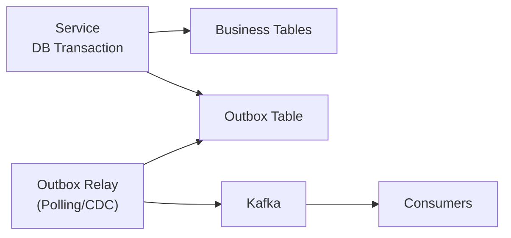

**Outbox table schema:**

```sql
CREATE TABLE outbox_events (
    id            UUID PRIMARY KEY DEFAULT gen_random_uuid(),
    aggregate_type VARCHAR(100) NOT NULL,  -- 'Order', 'Payment'
    aggregate_id   VARCHAR(100) NOT NULL,  -- 'ORD-001'
    event_type     VARCHAR(100) NOT NULL,  -- 'order.created.v1'
    payload        JSONB NOT NULL,
    created_at     TIMESTAMP DEFAULT NOW(),
    published_at   TIMESTAMP NULL          -- NULL = chưa publish
);
```

### 4.6. Data Consistency Rules

| Data | Consistency Level | Pattern | Lý do |
|------|------------------|---------|-------|
| Payment capture | **Strong** | Sync + DB transaction | Không được mất tiền |
| Inventory deduct | **Strong** | Atomic operation + locking | Tránh oversell |
| Order state | **Strong** | Saga orchestrator | Business-critical lifecycle |
| Search index | **Eventual** | CDC + async reindex | Delay 1-5s chấp nhận |
| Recommendation | **Eventual** | Batch ML pipeline | Delay phút-giờ OK |
| Notification | **Eventual** | Async event + DLQ | Retry nếu fail |
| Review rating aggregate | **Eventual** | Event → recalculate avg | Delay vài giây OK |

---

## Phần 5 — Resilience & Reliability

> 🔗 Áp dụng kiến thức từ [10 — Resilience Patterns](10-resilience-patterns.md)

### 5.1. Mục tiêu Resilience

- **99.9% uptime** (~8.76h downtime/năm)
- Flash sale: **200K concurrent** (10x normal)
- **Graceful degradation** > hard failure
- **No cascading failures** — 1 service chết không kéo theo hệ thống

### 5.2. Circuit Breaker — Áp dụng ở đâu?

| Caller → Callee | Failure Threshold | Open Duration | Fallback |
|----------------|-------------------|---------------|----------|
| Order → Payment | 5 lỗi / 30s | 30s | Mark order "payment pending", retry later |
| Payment → Bank API | 3 lỗi / 10s | 60s | Return "bank unavailable", queue for retry |
| Search → OpenSearch | 5 lỗi / 30s | 20s | Return cached popular products |
| Shipping → GHN/GHTK | 3 lỗi / 20s | 45s | Queue shipment creation, retry |
| Gateway → Any Service | 10 lỗi / 60s | 30s | Return 503 with retry-after header |

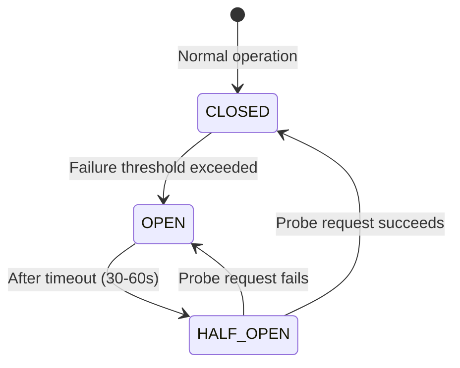

### 5.3. Retry Policy

| Service Call | Max Retries | Base Delay | Max Delay | Điều kiện |
|-------------|-------------|------------|-----------|-----------|
| Order → Inventory | 1 | 100ms | 500ms | Chỉ retry network error, KHÔNG retry "out of stock" |
| Payment → VNPay | 2 | 500ms | 5s | Retry timeout/5xx. KHÔNG retry 4xx |
| Outbox relay | 5 | 1s | 30s | Exponential backoff + jitter |
| Kafka consumer | 3 | 1s | 10s | Retry, sau đó → DLQ |
| Search → OpenSearch | 1 | 50ms | 200ms | Chỉ retry connection error |

> ⚠️ **Idempotency là tiên quyết** — Mọi operation được retry phải có idempotency key.

### 5.4. Bulkhead Pattern

```
┌──────────────────────────────────────────────────────────────┐
│               ORDER SERVICE — BULKHEAD ISOLATION             │
│                                                              │
│  ┌─────────────────┐  ┌─────────────────┐  ┌──────────────┐  │
│  │ Payment Pool    │  │ Inventory Pool  │  │ Other Pool   │  │
│  │ Max: 20 threads │  │ Max: 30 threads │  │ Max: 50      │  │
│  │ Queue: 10       │  │ Queue: 20       │  │ Queue: 30    │  │
│  │                 │  │                 │  │              │  │
│  │ Bank API chậm   │  │ DB lock wait    │  │ Promo, Ship  │  │
│  │ → chỉ 20 thread │  │ → không ảnh     │  │ → hoạt động  │  │
│  │   bị block      │  │   hưởng Payment │  │   bình thường│  │
│  └─────────────────┘  └─────────────────┘  └──────────────┘  │
│                                                              │
│  ✅ Payment chậm → chỉ Payment pool bị ảnh hưởng             │
│  ✅ Inventory, Promotion, Shipping vẫn hoạt động bình thường │
└──────────────────────────────────────────────────────────────┘
```

### 5.5. Rate Limiting

| Endpoint | Rate Limit | Algorithm | Action khi exceed |
|----------|-----------|-----------|-------------------|
| `POST /auth/login` | 5 req/min per IP | Sliding window | 429 + block 15min |
| `GET /search` | 100 req/min per IP | Token bucket | 429 + retry-after |
| `POST /checkout` | 10 req/min per user | Fixed window | 429 + "Vui lòng thử lại" |
| `POST /reviews` | 5 req/hour per user | Sliding window | 429 |
| Flash sale endpoints | 200 req/s global | Leaky bucket | 503 + queue position |

### 5.6. Timeout Configuration

| Service Call | Connect Timeout | Read Timeout | Total Timeout |
|-------------|----------------|-------------|---------------|
| Gateway → Any | 1s | 5s | 10s |
| Order → Inventory | 500ms | 2s | 3s |
| Payment → Bank API | 2s | 10s | 15s |
| Search → OpenSearch | 500ms | 1s | 2s |
| Shipping → GHN API | 2s | 5s | 10s |
| Kafka producer | — | — | 5s (ack timeout) |

### 5.7. Fallback Strategies

| Service Down | Fallback Behavior | User Experience |
|-------------|-------------------|----------------|
| Search | Show popular products + cached results | "Kết quả phổ biến" |
| Recommendation | Show top sellers / recently viewed | Vẫn có gợi ý, ít personalized |
| Promotion (timeout) | Checkout without voucher | "Voucher tạm thời không khả dụng" |
| Notification | Retry via DLQ (async) | User không biết, nhận muộn |
| Review | Disable submit, show cached ratings | "Tạm thời không thể đánh giá" |
| Shipping (fee calc) | Use cached fee hoặc flat rate | "Phí ship ước tính" |

### 5.8. Chaos Engineering Plan

| # | Experiment | Target | Expected Behavior | Success Criteria |
|---|-----------|--------|-------------------|-----------------|
| 1 | Kill Payment pod | Payment Service | Circuit breaker opens, orders marked "pending" | No cascading failure, other services OK |
| 2 | Inject 2s latency | Inventory Service | Timeout → fast fail checkout | P95 checkout < 5s, no hang |
| 3 | Stop Kafka consumer | Order consumer | Messages queue up, DLQ for failures | No data loss, resume OK |
| 4 | Network partition | Order ↔ Payment | Saga compensating transaction triggers | Stock released, order cancelled |
| 5 | Flash sale 10x load | All services | Auto-scaling triggers, rate limiting | SLO met for core flows |

**Tools:** Chaos Monkey (K8s), tc (traffic control), k6/Locust (load test)

### 5.9. Defense in Depth — Thứ tự áp dụng

```
Request ──▶ Rate Limit ──▶ Timeout ──▶ Retry ──▶ Circuit Breaker ──▶ Bulkhead ──▶ Fallback
   │            │             │           │            │                │            │
   │         Quá nhiều     Quá lâu    Thử lại     Quá nhiều lỗi   Isolate pool  Trả kết quả
   │         request?      chờ?       lần nữa?    → ngắt mạch    → không lan    thay thế
   │            │             │           │            │           tràn           │
   ▼            ▼             ▼           ▼            ▼                │         ▼
  429          504        Retry/Fail    Open CB    Thread pool      Fallback    Graceful
                                                   isolated       response    degradation
```

---

## Phần 6 — Observability

> 🔗 Áp dụng kiến thức từ [11 — Observability & Evolvability](11-observability-evolvability.md)

*(Sẽ viết chi tiết: logging strategy, metrics quan trọng, tracing flow, alerting rules, dashboard design)*

---

## Phần 7 — Security Architecture

> 🔗 Áp dụng kiến thức từ [15 — Security](15-security.md)

*(Sẽ viết chi tiết: AuthN/AuthZ flow, service-to-service auth, API security, data encryption, network segmentation)*

---

## Phần 8 — Infrastructure & Deployment

> 🔗 Áp dụng kiến thức từ [12 — Containerization](12-containerization.md), [13 — Orchestration](13-orchestration.md), [14 — CI/CD](14-cicd-deployment.md)

*(Sẽ viết chi tiết: container strategy, orchestration choice, CI/CD pipeline design, deployment strategy per service, IaC)*

---

## Phần 9 — So sánh các Solution Infrastructure

*(Sẽ viết chi tiết: so sánh ít nhất 3 solutions — ECS Fargate / EKS / ECS+Lambda hybrid, bảng so sánh chi phí, độ phức tạp, team skill, migration path)*

| Tiêu chí | Solution A: ECS Fargate | Solution B: EKS | Solution C: Hybrid (ECS + Lambda) |
|----------|------------------------|-----------------|----------------------------------|
| Độ phức tạp vận hành | ... | ... | ... |
| Chi phí (estimate) | ... | ... | ... |
| Scaling | ... | ... | ... |
| Team skill yêu cầu | ... | ... | ... |
| Phù hợp cho | ... | ... | ... |

---

## Phần 10 — Tổng kết Architecture Decision Records

*(Sẽ viết chi tiết: tổng hợp tất cả quyết định kiến trúc dưới dạng ADR — lý do chọn, alternatives đã cân nhắc, trade-offs)*

| ADR # | Quyết định | Lý do | Alternatives |
|-------|-----------|-------|-------------|
| ADR-001 | ... | ... | ... |
| ADR-002 | ... | ... | ... |

---

## 🔗 Liên kết

- [01 — Microservice Overview](01-microservice-overview.md)
- [05 — Decomposition Strategies](05-decomposition-strategies.md)
- [06 — Inter-Service Communication](06-inter-service-communication.md)
- [09 — Data Management](09-data-management.md)
- [10 — Resilience Patterns](10-resilience-patterns.md)
- [17 — Design Patterns](17-design-patterns.md)
