# 🛵 Case Study: Thiết kế kiến trúc Microservice cho Food Delivery Platform

## 📋 Mục lục

- [Đề bài](#đề-bài)
  - [Bối cảnh](#bối-cảnh)
  - [Quy mô hệ thống](#quy-mô-hệ-thống)
  - [Module hiện tại trong Monolith](#module-hiện-tại-trong-monolith)
- [Yêu cầu chức năng (Functional Requirements)](#yêu-cầu-chức-năng-functional-requirements)
- [Yêu cầu phi chức năng (Non-Functional Requirements)](#yêu-cầu-phi-chức-năng-non-functional-requirements)
- [Phần 1 — Domain & Bounded Context](#phần-1--domain--bounded-context)
  - [1.1. Subdomain Classification](#11-subdomain-classification)
  - [1.2. Bounded Context Mapping](#12-bounded-context-mapping)
  - [1.3. Ubiquitous Language](#13-ubiquitous-language)
  - [1.4. Context Map Patterns](#14-context-map-patterns)
  - [1.5. Event Storming cho Place Order](#15-event-storming-cho-place-order)
  - [1.6. Domain Invariants](#16-domain-invariants)
  - [1.7. Ownership Matrix](#17-ownership-matrix)
- [Phần 2 — Service Decomposition](#phần-2--service-decomposition)
  - [2.1. Nguyên tắc tách service](#21-nguyên-tắc-tách-service)
  - [2.2. Service Catalog chi tiết](#22-service-catalog-chi-tiết)
  - [2.3. Dependency Graph](#23-dependency-graph)
  - [2.4. API Contracts quan trọng](#24-api-contracts-quan-trọng)
  - [2.5. Team Ownership & Topology](#25-team-ownership--topology)
  - [2.6. Strangler Fig Migration Plan](#26-strangler-fig-migration-plan)
  - [2.7. Release Governance](#27-release-governance)
  - [2.8. Endpoint Matrix (Core APIs)](#28-endpoint-matrix-core-apis)
  - [2.9. Error Code Catalog](#29-error-code-catalog)
- [Phần 3 — Inter-Service Communication](#phần-3--inter-service-communication)
  - [3.1. Decision framework: Sync vs Async](#31-decision-framework-sync-vs-async)
  - [3.2. Communication Matrix](#32-communication-matrix)
  - [3.3. Event Catalog & Versioning](#33-event-catalog--versioning)
  - [3.4. Idempotency & Delivery Semantics](#34-idempotency--delivery-semantics)
  - [3.5. API Gateway Design](#35-api-gateway-design)
  - [3.6. Service Discovery](#36-service-discovery)
  - [3.7. Sequence Diagram: End-to-End Delivery Flow](#37-sequence-diagram-end-to-end-delivery-flow)
  - [3.8. Broker Topology, Retry và DLQ](#38-broker-topology-retry-và-dlq)
  - [3.9. Event Payload Samples (JSON)](#39-event-payload-samples-json)
- [Phần 4 — Data Management & Patterns](#phần-4--data-management--patterns)
  - [4.1. Database per Service](#41-database-per-service)
  - [4.2. Saga Orchestration cho Order Lifecycle](#42-saga-orchestration-cho-order-lifecycle)
  - [4.3. Outbox Pattern](#43-outbox-pattern)
  - [4.4. CQRS cho Search/Tracking](#44-cqrs-cho-searchtracking)
  - [4.5. Event Sourcing — Decision](#45-event-sourcing--decision)
  - [4.6. Schema mẫu (Order/Dispatch)](#46-schema-mẫu-orderdispatch)
  - [4.7. Concurrency Control & Reconciliation Jobs](#47-concurrency-control--reconciliation-jobs)
  - [4.8. Data Consistency Rules](#48-data-consistency-rules)
  - [4.9. Reconciliation Jobs](#49-reconciliation-jobs)
- [Phần 5 — Resilience & Reliability](#phần-5--resilience--reliability)
  - [5.1. Reliability Goals](#51-reliability-goals)
  - [5.2. Circuit Breaker/Retry/Timeout](#52-circuit-breakerretrytimeout)
  - [5.3. Bulkhead & Rate Limiting](#53-bulkhead--rate-limiting)
  - [5.4. Capacity Planning cho giờ cao điểm](#54-capacity-planning-cho-giờ-cao-điểm)
  - [5.5. Fallback Strategies](#55-fallback-strategies)
  - [5.6. Runbook SEV-1: Không ghép được tài xế](#56-runbook-sev-1-không-ghép-được-tài-xế)
  - [5.7. Chaos Engineering Plan](#57-chaos-engineering-plan)
  - [5.8. Defense in Depth](#58-defense-in-depth)
- [Phần 6 — Observability](#phần-6--observability)
  - [6.1. Telemetry Architecture](#61-telemetry-architecture)
  - [6.2. Metrics & SLO](#62-metrics--slo)
  - [6.3. Logging Standard](#63-logging-standard)
  - [6.4. Distributed Tracing](#64-distributed-tracing)
  - [6.5. Alerting & Dashboard](#65-alerting--dashboard)
  - [6.6. Retention, Sampling và Cost Control](#66-retention-sampling-và-cost-control)
  - [6.7. Incident Runbook: Payment Spike](#67-incident-runbook-payment-spike)
- [Phần 7 — Security Architecture](#phần-7--security-architecture)
  - [7.1. AuthN/AuthZ](#71-authnauthz)
  - [7.2. Service-to-Service Security](#72-service-to-service-security)
  - [7.3. Data Protection](#73-data-protection)
  - [7.4. API Security Controls](#74-api-security-controls)
  - [7.5. Threat Model (STRIDE)](#75-threat-model-stride)
  - [7.6. Secrets Management](#76-secrets-management)
  - [7.7. Security Testing Pipeline](#77-security-testing-pipeline)
  - [7.8. Compliance Checklist](#78-compliance-checklist)
  - [7.9. Security Incident Response](#79-security-incident-response)
- [Phần 8 — Infrastructure & Deployment](#phần-8--infrastructure--deployment)
  - [8.1. Mục tiêu nền tảng hạ tầng](#81-mục-tiêu-nền-tảng-hạ-tầng)
  - [8.2. Runtime Strategy](#82-runtime-strategy)
  - [8.3. Network Topology](#83-network-topology)
  - [8.4. Container Standards](#84-container-standards)
  - [8.5. Autoscaling Policy](#85-autoscaling-policy)
  - [8.6. CI/CD Strategy](#86-cicd-strategy)
  - [8.7. Deployment Patterns](#87-deployment-patterns)
  - [8.8. DR/Backup Strategy](#88-drbackup-strategy)
  - [8.9. IaC Structure](#89-iac-structure)
  - [8.10. Environment Promotion Flow](#810-environment-promotion-flow)
- [Phần 9 — So sánh lựa chọn hạ tầng](#phần-9--so-sánh-lựa-chọn-hạ-tầng)
  - [9.1. Options](#91-options)
  - [9.2. So sánh định tính](#92-so-sánh-định-tính)
  - [9.3. Ước lượng chi phí tương đối](#93-ước-lượng-chi-phí-tương-đối)
  - [9.4. Weighted Decision Matrix](#94-weighted-decision-matrix)
  - [9.5. Khuyến nghị cho FastBite](#95-khuyến-nghị-cho-fastbite)
  - [9.6. Migration Path 18 tháng](#96-migration-path-18-tháng)
- [Phần 10 — ADR & Execution Plan](#phần-10--adr--execution-plan)
  - [10.1. ADR chính](#101-adr-chính)
  - [10.2. ADR template đề xuất](#102-adr-template-đề-xuất)
  - [10.3. Trade-off tổng thể](#103-trade-off-tổng-thể)
  - [10.4. 90-day Plan](#104-90-day-plan)
  - [10.5. KPI thành công](#105-kpi-thành-công)
  - [10.6. Kết luận case study](#106-kết-luận-case-study)
  - [10.7. Risk Register](#107-risk-register)
- [Liên kết liên quan](#liên-kết-liên-quan)

---

## Đề bài

### Bối cảnh

Công ty **FastBite** đang vận hành nền tảng giao đồ ăn trên một Monolith được xây cách đây 4 năm. Hệ thống tăng trưởng nhanh về người dùng và nhà hàng đối tác, nhưng đang gặp các vấn đề sau:

- Mỗi đợt cao điểm trưa/tối (lunch/dinner peak), `Order` và `Dispatch` đều bị nghẽn.
- Mỗi lần deploy toàn khối mất 45–90 phút, rủi ro downtime cao.
- 25 backend engineers cùng làm trên một repo nên conflict diễn ra liên tục.
- Khó tích hợp thuật toán route optimization (Python/ML) trong stack cũ.

### Quy mô hệ thống

| Chỉ số | Giá trị |
|--------|---------|
| User đăng ký | 3.5 triệu |
| MAU | 1.1 triệu |
| Đơn/ngày | 120.000 |
| Peak order/phút | 2.400 |
| Nhà hàng đối tác | 18.000 |
| Tài xế online giờ cao điểm | 14.000 |
| SLA tạo đơn | < 2 giây |
| SLA ghép tài xế | < 10 giây |
| Vùng hoạt động | 8 thành phố lớn |

### Module hiện tại trong Monolith

```
┌───────────────────────────────────────────────────────────┐
│                    FASTBITE MONOLITH                      │
│                                                           │
│ User | Restaurant | Menu | Search | Cart                  │
│ Order | Payment | Dispatch | Driver Tracking              │
│ Promo | Notification | Review | Support                   │
│                                                           │
│             Single PostgreSQL + Redis shared              │
└───────────────────────────────────────────────────────────┘
```

---

## Yêu cầu chức năng (Functional Requirements)

| # | Chức năng | Mô tả |
|---|-----------|-------|
| F1 | User & Auth | Đăng ký/đăng nhập, social login, profile, địa chỉ |
| F2 | Restaurant Catalog | Danh sách nhà hàng, giờ mở cửa, trạng thái online |
| F3 | Menu Management | Menu theo chi nhánh, option/topping, hết món theo giờ |
| F4 | Search & Filter | Tìm món/quán, lọc theo thời gian giao, giá, đánh giá |
| F5 | Cart | Thêm/sửa món, custom option, tính giá tạm |
| F6 | Order Management | Tạo đơn, trạng thái đơn, hủy đơn có điều kiện |
| F7 | Payment | COD, card, e-wallet, refund toàn phần/một phần |
| F8 | Dispatch | Ghép tài xế tối ưu (ETA + cost + fairness) |
| F9 | Driver Tracking | Cập nhật vị trí real-time, hiển thị ETA |
| F10 | Promotion | Voucher, freeship, campaign theo khung giờ |
| F11 | Notification | Push/SMS/email theo trạng thái đơn |
| F12 | Review & Support | Đánh giá sau đơn hoàn thành, mở ticket khiếu nại |

**Ví dụ thực tế:** người dùng đặt combo trưa lúc 11:45; hệ thống cần hoàn tất `create order -> authorize payment -> assign driver` trong dưới 10 giây để tránh drop-off.

---

## Yêu cầu phi chức năng (Non-Functional Requirements)

| # | Yêu cầu | Mục tiêu |
|---|---------|----------|
| NF1 | Availability | 99.95% |
| NF2 | Scalability | 12x so với giờ thường (đặc biệt ở giờ cao điểm trưa/tối) |
| NF3 | Performance | P95 API < 250ms |
| NF4 | Consistency | Strong consistency cho order/payment; eventual consistency cho search/review |
| NF5 | Security | OWASP Top 10, token security, PCI scope reduction |
| NF6 | Deployability | Zero-downtime, rollback < 5 phút |
| NF7 | Observability | Logs + Metrics + Traces + alert theo SLO |
| NF8 | Cost | Tối ưu chi phí burst traffic |

---

## Phần 1 — Domain & Bounded Context

> 🔗 Liên quan: [02-single-responsibility-bounded-context.md](02-single-responsibility-bounded-context.md), [05-decomposition-strategies.md](05-decomposition-strategies.md)

### 1.1. Subdomain Classification

**Food Delivery** là domain chính của FastBite. Theo phương pháp Domain-Driven Design (DDD), ta phân tích domain thành các **Subdomain** với 3 loại:

- **Core Domain** — Tạo lợi thế cạnh tranh trực tiếp, cần đầu tư nhiều nhất
- **Supporting Domain** — Hỗ trợ Core Domain, tùy chỉnh theo đặc thù business
- **Generic Domain** — Không tạo khác biệt, có thể dùng SaaS hoặc thư viện có sẵn

| Subdomain | Loại | Lý do phân loại | Hướng đầu tư |
|-----------|------|-----------------|--------------|
| **Order Management** | 🔴 Core | Trải nghiệm đặt món là trung tâm conversion — quy trình phải tối ưu cho thời gian thực (lunch/dinner peak), hủy đơn có điều kiện, trạng thái đơn phức tạp hơn e-commerce | Team senior, tự phát triển 100% |
| **Dispatch** | 🔴 Core | Ảnh hưởng trực tiếp ETA, chi phí giao và driver retention — thuật toán matching (proximity + fairness + cost) là lợi thế cạnh tranh chính | Team senior, ML scoring model tự phát triển |
| **Payment** | 🔴 Core | Doanh thu và rủi ro tài chính — hỗ trợ COD + e-wallet + card, refund toàn phần/một phần, đặc thù thanh toán VN | Team senior, ACL wrapper cho providers |
| **Merchant/Catalog** | 🟡 Supporting | Quản lý 18K nhà hàng, giờ mở/đóng, trạng thái online — cần tùy chỉnh theo đặc thù multi-branch | Team mid-senior |
| **Menu Management** | 🟡 Supporting | Menu theo chi nhánh, option/topping, hết món theo giờ — dữ liệu cập nhật rất thường xuyên | Team mid-senior, Redis cache layer |
| **Search & Discovery** | 🟡 Supporting | Tìm món/quán theo vị trí, giờ giao, rating — đặc thù geo + tiếng Việt có dấu | OpenSearch + custom geo analyzer |
| **Fleet Tracking** | 🟡 Supporting | Cập nhật vị trí real-time cho 14.000 tài xế, tính ETA liên tục — cải thiện UX và độ tin cậy | Redis Streams + geo indexing |
| **Promotion** | 🟡 Supporting | Voucher, freeship, campaign khung giờ — chiến lược marketing tăng conversion giờ thấp điểm | Rule engine tự phát triển |
| **Cart** | 🟡 Supporting | Cart có thời gian sống ngắn (session-based), custom option phức tạp — cần hiệu năng cao | Redis-backed |
| **Review & Rating** | 🟡 Supporting | Đánh giá quán/tài xế sau mỗi đơn — UGC tạo niềm tin cho người dùng | Moderation pipeline |
| **Notification** | ⚪ Generic | Push/SMS/email theo trạng thái đơn — không tạo khác biệt cạnh tranh | Firebase FCM, SES, eSMS |
| **Identity & Auth** | ⚪ Generic | Đăng nhập, social login, profile — bài toán đã có lời giải chuẩn | Cognito / Keycloak + custom profile |
| **Support** | ⚪ Generic | Ticket khiếu nại, escalation — có thể dùng SaaS hoặc giải pháp sẵn | Tích hợp Zendesk hoặc tự build đơn giản |

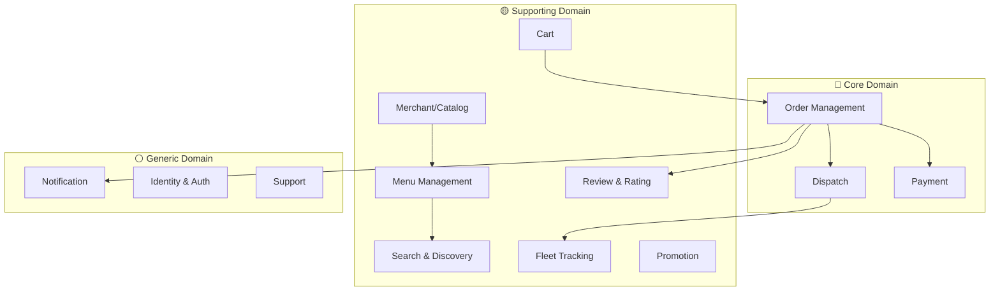

### 1.2. Bounded Context Mapping

| BC | Aggregate chính | Dữ liệu sở hữu |
|----|------------------|----------------|
| Identity BC | `User`, `Session` | auth/token/profile |
| Merchant BC | `Restaurant`, `Branch` | thông tin quán, SLA |
| Menu BC | `Menu`, `MenuItem`, `OptionSet` | món, giá, availability |
| Cart BC | `Cart`, `CartItem` | cart state |
| Order BC | `Order`, `OrderLine`, `OrderState` | lifecycle đơn |
| Payment BC | `Payment`, `PaymentAttempt`, `Refund` | giao dịch thanh toán |
| Dispatch BC | `Assignment`, `CandidateScore` | matching tài xế |
| Tracking BC | `DriverLocation`, `Trip` | stream vị trí |
| Promotion BC | `Voucher`, `Campaign` | rules + usage |
| Engagement BC | `Notification`, `Template` | lịch sử gửi |
| Trust BC | `Review`, `Rating` | điểm đánh giá |
| Support BC | `Ticket`, `Resolution` | khiếu nại |

### 1.3. Ubiquitous Language

| Thuật ngữ | Định nghĩa |
|----------|------------|
| `OrderPlaced` | Đơn đã được tạo thành công |
| `RestaurantAccepted` | Quán đã nhận và chuẩn bị món |
| `DriverAssigned` | Dispatch đã ghép tài xế |
| `PickupETA` | ETA tài xế tới quán |
| `DropoffETA` | ETA tài xế tới người dùng |
| `AssignmentTimeout` | Quá thời gian mà chưa ghép được tài xế |
| `SurgeZone` | Khu vực nhu cầu cao cần incentive |
| `PartialRefund` | Hoàn một phần tiền đơn |

### 1.4. Context Map Patterns

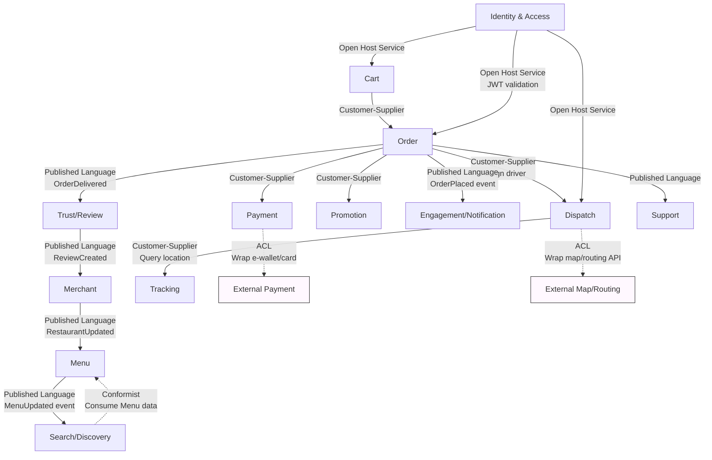

**Chi tiết Context Mapping Patterns:**

| Upstream (U) | Downstream (D) | Pattern | Mô tả |
|-------------|----------------|---------|-------|
| Menu | Search/Discovery | **Conformist** | Search chấp nhận hoàn toàn model của Menu, re-index khi nhận event |
| Merchant | Menu | **Published Language** | Menu nhận RestaurantUpdated event để đồng bộ giờ mở/đóng |
| Order | Payment | **Customer-Supplier** | Order khởi tạo payment request, Payment callback kết quả |
| Order | Dispatch | **Customer-Supplier** | Dispatch nhận signal sau payment success, trả về assignment result |
| Order | Promotion | **Customer-Supplier** | Order yêu cầu validate + apply voucher theo workflow checkout |
| Dispatch | Tracking | **Customer-Supplier** | Dispatch query vị trí driver từ Tracking để tính candidate score |
| Payment | e-wallet providers | **Anti-Corruption Layer** | Wrap API bên ngoài (MoMo, ZaloPay) bằng Adapter, model nội bộ thống nhất |
| Dispatch | External map/routing | **Anti-Corruption Layer** | Chuẩn hóa Google Maps / OSRM API thành model nội bộ, tránh lộ domain |
| Identity & Access | Tất cả BC | **Open Host Service** | JWT validation endpoint chuẩn cho mọi service |
| Trust/Review | Merchant | **Published Language** | ReviewCreated → Merchant cập nhật average rating cho nhà hàng |

### 1.5. Event Storming cho Place Order

```
┌──────────────────────────────────────────────────────────────────────────────┐
│                  EVENT STORMING — PLACE ORDER (FOOD DELIVERY)                │
│                                                                              │
│  🟦 Command    🟧 Domain Event    🟨 Aggregate    🟪 Policy/Rule             │
├──────────────────────────────────────────────────────────────────────────────┤
│                                                                              │
│  🟦 PlaceOrder ──▶ 🟨 Cart ──▶ 🟧 CartCheckedOut                             │
│        │                              │                                      │
│        ▼                              ▼                                      │
│  🟦 CreateOrder ──▶ 🟨 Order ──▶ 🟧 OrderPlaced                              │
│                              │                                               │
│                              ├──▶ 🟦 ApplyVoucher ──▶ 🟨 Promotion           │
│                              │         ├──▶ 🟧 VoucherApplied ✓              │
│                              │         └──▶ 🟧 VoucherRejected ✗             │
│                              │                                               │
│                              └──▶ 🟦 InitiatePayment ──▶ 🟨 Payment          │
│                                        ├──▶ 🟧 PaymentCaptured ✓             │
│                                        └──▶ 🟧 PaymentFailed ✗               │
│                                                   │                          │
│                                                   ▼                          │
│                                  🟪 Release voucher + Cancel order           │
│                                                                              │
│  (PaymentCaptured) ──▶ 🟧 OrderConfirmed ──▶ 🟦 NotifyRestaurant             │
│                              │                                               │
│                              └──▶ 🟦 AssignDriver ──▶ 🟨 Dispatch            │
│                                        ├──▶ 🟧 DriverAssigned ✓              │
│                                        └──▶ 🟧 AssignmentTimeout ✗           │
│                                                   │                          │
│                                                   ▼                          │
│                                  🟪 Retry with expanded radius               │
│                                  🟪 Fallback: zone-based queue               │
│                                                                              │
│  (DriverAssigned) ──▶ 🟧 OrderInDelivery ──▶ 🟦 StartTracking                │
│                              │                                               │
│                              🟪 Notify user "Tài xế đang đến lấy món"        │
│                              🟪 Notify restaurant "Tài xế sắp tới"           │
│                                                                              │
│  (DriverArrived at restaurant) ──▶ 🟧 OrderPickedUp                          │
│                              🟪 Notify user "Tài xế đã lấy món"              │
│                                                                              │
│  (DriverArrived at user) ──▶ 🟧 OrderDelivered                               │
│                              🟪 Notify user "Đơn đã giao thành công"         │
│                              🟪 Open review window                           │
└──────────────────────────────────────────────────────────────────────────────┘
```

**Flowchart tổng quan:**

```mermaid
flowchart LR
    C1[Command: PlaceOrder] --> E1[Event: order.placed.v1]
    E1 --> C2[Command: InitiatePayment]
    C2 --> E2[Event: payment.captured.v1]
    E2 --> C3[Command: AssignDriver]
    C3 --> E3[Event: driver.assigned.v1]
    E3 --> E4[Event: order.in_delivery.v1]
    E4 --> E5[Event: order.delivered.v1]
```

**Key takeaways:**

1. **Saga Pattern cần thiết** — Flow span qua 5 BC (Order, Promotion, Payment, Dispatch, Tracking), cần Orchestration Saga cho compensating actions
2. **Driver Assignment có retry policy** — Nếu không ghép được tài xế trong 10s, mở rộng bán kính tìm kiếm, fallback zone-based queue
3. **Payment trước Dispatch (đa số trường hợp)** — Với card/e-wallet cần authorize/capture payment trước khi gửi signal cho Dispatch để tránh ghost order
4. **COD flow là nhánh riêng** — Với COD, Dispatch được phép chạy sau `risk_check=PASS`; `PaymentCaptured`/`CashCollected` chỉ xảy ra khi tài xế xác nhận thu tiền thành công
5. **Real-time tracking bắt đầu ngay** — Sau `DriverAssigned`, Tracking service bắt đầu stream vị trí tới ứng dụng người dùng

**Ví dụ thực tế:** nếu `payment.failed.v1`, Order phát `order.cancelled.v1` và Promotion rollback usage của voucher.

### 1.6. Domain Invariants

| Invariant | Enforcement |
|----------|-------------|
| Một order chỉ có 1 trạng thái tại 1 thời điểm | State machine ở Order service |
| Payment callback xử lý tối đa 1 lần | Unique key `provider_txn_id` |
| Driver không nhận 2 đơn overlap cùng trip window | Dispatch assignment validator |
| Review chỉ mở sau `order.delivered` | Review API guard |
| Voucher usage không vượt quota | Atomic counter ở Promotion |

### 1.7. Ownership Matrix

| Team | Domain sở hữu | On-call | Mục tiêu vận hành |
|------|----------------|---------|-------------------|
| Core Commerce | Cart, Order, Promotion | 24/7 | Checkout success >= 99.5% |
| Payments | Payment, Refund | 24/7 | Payment success >= 99.8% |
| Delivery Ops | Dispatch, Tracking | 24/7 | Match <= 10s cho >= 98% đơn |
| Discovery | Merchant, Menu, Search | Giờ hành chính + trực peak | Search P95 < 200ms |
| Engagement | Notification, Review, Support | Giờ hành chính | Notification delivery >= 99% |
| Platform/SRE | Gateway, CI/CD, Observability | 24/7 | MTTR < 30 phút |

**Quy tắc ownership:**

- Service chỉ có **một owner chính** — không chia sẻ ownership giữa nhiều team.
- Shared library (SDK telemetry, error codes) phải có versioning và backward compatibility.
- Incident SEV-1 bắt buộc có Incident Commander từ team owning service lỗi.
- Team owner chịu trách nhiệm SLO, on-call rotation, và runbook của service mình.

---

## Phần 2 — Service Decomposition

> 🔗 Liên quan: [03-loose-coupling-high-cohesion.md](03-loose-coupling-high-cohesion.md), [05-decomposition-strategies.md](05-decomposition-strategies.md)

### 2.1. Nguyên tắc tách service

| Nguyên tắc | Ứng dụng tại FastBite |
|------------|-----------------------|
| Single Responsibility | Payment chỉ xử lý payment lifecycle |
| High Cohesion | Menu + option + availability cùng Menu service |
| Loose Coupling | Dispatch không truy cập DB Order trực tiếp |
| Database per Service | Mỗi service sở hữu DB/schema riêng |
| Independent Deployability | Deploy Dispatch không ảnh hưởng Payment |

### 2.2. Service Catalog chi tiết

| # | Service | Trách nhiệm chính | API tiêu biểu | Data store | Tech Stack |
|---|---------|-------------------|---------------|------------|------------|
| 0 | **API Gateway** | Auth verify, routing, throttling | `/*` (proxy) | Redis counter | Kong / AWS ALB |
| 1 | **Identity Service** | Login, refresh, OAuth, JWT issue | `POST /auth/login`<br/>`POST /auth/refresh` | PostgreSQL, Redis | Node.js, PostgreSQL, Redis |
| 2 | **User Service** | Profile, address book | `GET/PUT /users/{id}` | PostgreSQL | Node.js, PostgreSQL |
| 3 | **Merchant Service** | Quản lý quán/chi nhánh, giờ mở cửa | `GET /restaurants`<br/>`PUT /restaurants/{id}` | PostgreSQL, S3 | Java/Spring, PostgreSQL |
| 4 | **Menu Service** | Menu + option/topping + stock status | `GET /menus/{restaurantId}` | PostgreSQL, Redis | Java/Spring, PostgreSQL, Redis |
| 5 | **Search Service** | Search/filter/ranking theo geo + text | `GET /search?q=&lat=&lng=` | OpenSearch, Redis | Python/FastAPI, OpenSearch |
| 6 | **Cart Service** | Cart + custom option + price preview | `POST /carts/{uid}/items` | Redis, DynamoDB (backup) | Node.js, Redis |
| 7 | **Order Service** | Orchestrator + state machine + Saga | `POST /orders`<br/>`GET /orders/{id}` | PostgreSQL | Java/Spring, PostgreSQL |
| 8 | **Payment Service** | initiate/callback/refund, ACL providers | `POST /payments/initiate`<br/>`POST /payments/callback` | PostgreSQL | Java/Spring, PostgreSQL |
| 9 | **Dispatch Service** | candidate scoring (ML) + assignment | `POST /dispatch/assign`<br/>`POST /dispatch/{orderId}/retry` | PostgreSQL, Redis | Go + Python/ML, Redis |
| 10 | **Tracking Service** | ingest GPS stream + publish ETA | `POST /tracking/locations`<br/>`GET /tracking/{orderId}` | Redis Streams, TimescaleDB | Go, Redis Streams |
| 11 | **Promotion Service** | voucher/campaign/rule engine | `POST /promos/apply`<br/>`GET /promos/active` | PostgreSQL, Redis | Java/Spring, PostgreSQL, Redis |
| 12 | **Notification Service** | push/sms/email fan-out | `POST /notifications/send` | MongoDB, SQS | Node.js, MongoDB |
| 13 | **Review Service** | rating/review quán + tài xế | `POST /reviews`<br/>`GET /restaurants/{id}/reviews` | MongoDB | Node.js, MongoDB |
| 14 | **Support Service** | ticket/escalation/resolution | `POST /tickets`<br/>`GET /tickets/{id}` | PostgreSQL | Node.js, PostgreSQL |

### 2.3. Dependency Graph

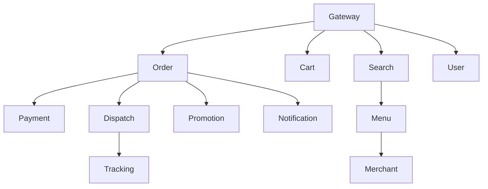

### 2.4. API Contracts quan trọng

**Create Order request**

```json
{
  "userId": "USR-1001",
  "restaurantId": "RES-902",
  "items": [
    {"menuItemId": "IT-1", "qty": 1, "options": ["OP-SPICY"]},
    {"menuItemId": "IT-5", "qty": 2, "options": []}
  ],
  "addressId": "ADDR-11",
  "voucherCode": "LUNCH30",
  "paymentMethod": "wallet"
}
```

**Create Order response**

```json
{
  "orderId": "ORD-20260227-1881",
  "orderCode": "FB-1881",
  "status": "PAYMENT_PENDING",
  "paymentUrl": "https://wallet-provider/...",
  "expiresAt": "2026-02-27T11:47:00Z"
}
```

`orderId` là ID nội bộ phục vụ event/log/tracing (`ORD-...`), còn `orderCode` là mã hiển thị cho người dùng (`FB-...`).

| Quy tắc | Mục tiêu |
|--------|----------|
| Header `Idempotency-Key` bắt buộc | Chống double charge |
| `x-request-id` xuyên suốt | Trace cross-service |
| Error codes chuẩn hóa | Dễ xử lý ở mobile app |
| Backward-compatible fields | Không phá client cũ |

### 2.5. Team Ownership & Topology

| Team | Services sở hữu | KPI |
|------|------------------|-----|
| Core Commerce | Cart, Order, Promotion | Checkout success rate |
| Payments | Payment, Refund | Payment fail rate |
| Delivery Ops | Dispatch, Tracking | Match latency, ETA accuracy |
| Discovery | Merchant, Menu, Search | Search CTR |
| Engagement | Notification, Review, Support | Delivery notification success |
| Platform/SRE | Gateway, CI/CD, observability | MTTR, release stability |

### 2.6. Strangler Fig Migration Plan

Migrate từ Monolith sang Microservices theo từng phase, **không big-bang rewrite**:

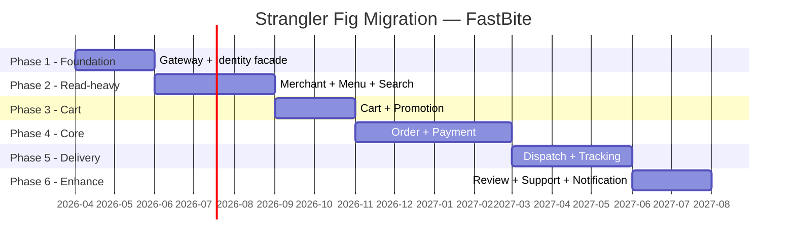

| Phase | Services | Duration | Risk Level | Rollback Strategy |
|-------|----------|----------|------------|-------------------|
| **Phase 1** | API Gateway, Identity facade | 2 tháng | 🟢 Low | Bypass gateway, direct to monolith |
| **Phase 2** | Merchant, Menu, Search | 3 tháng | 🟢 Low | Feature flag toggle old/new search |
| **Phase 3** | Cart, Promotion | 2 tháng | 🟡 Medium | Fallback to session-based cart in monolith |
| **Phase 4** | Order, Payment | 4 tháng | 🔴 High | Shadow traffic + parallel run, so khớp `order_total` |
| **Phase 5** | Dispatch, Tracking | 3 tháng | 🔴 High | Disable dispatch mới, quay lại legacy matching |
| **Phase 6** | Review, Support, Notification | 2 tháng | 🟢 Low | Disable features, no business impact |

**Tổng thời gian Strangler core: ~16 tháng**; cộng thêm ~2 tháng hardening/cost optimization để khớp roadmap tổng thể 18 tháng. Monolith vẫn chạy song song trong suốt quá trình migrate, và mỗi phase chỉ cutover khi shadow test đạt 100% match.

**Ví dụ thực tế:** Phase 4 chạy 2 tuần shadow mode, so khớp 100% `order_total` giữa hệ mới và monolith trước khi cutover. Phase 5 chạy song song dispatch cũ/mới, so sánh `assignment_latency` và `match_rate` trước khi tắt legacy.

### 2.7. Release Governance

| Loại thay đổi | Approver chính | Review bắt buộc |
|---------------|----------------|-----------------|
| Checkout logic | Core Commerce lead | Payments + SRE |
| Payment provider integration | Payments lead | Security |
| Dispatch scoring/rules | Delivery Ops lead | Product + SRE |
| Shared SDK/telemetry | Platform lead | Service owners |

**Quy tắc release:**

- Service critical (`Order`, `Payment`, `Dispatch`) deploy theo change window.
- Mọi release phải có rollback plan đã test ở staging.
- Freeze deploy trước campaign lớn ít nhất 24 giờ.

### 2.8. Endpoint Matrix (Core APIs)

| Service | Method | Endpoint | Mục đích | Response chính |
|---------|--------|----------|----------|----------------|
| Order | `POST` | `/api/v1/orders` | Tạo đơn | `orderId`, `status`, `paymentUrl` |
| Order | `GET` | `/api/v1/orders/{orderId}` | Lấy trạng thái đơn | `status`, timeline |
| Order | `POST` | `/api/v1/orders/{orderId}/cancel` | Hủy đơn | `cancelResult` |
| Payment | `POST` | `/api/v1/payments/initiate` | Khởi tạo thanh toán | `paymentIntentId`, `paymentUrl` |
| Payment | `POST` | `/api/v1/payments/callback` | Callback provider | `ack` |
| Payment | `POST` | `/api/v1/payments/{paymentId}/refund` | Hoàn tiền | `refundId`, `status` |
| Dispatch | `POST` | `/api/v1/dispatch/assign` | Trigger assign tài xế (internal/manual/ops) | `assignmentId`, `state` |
| Dispatch | `POST` | `/api/v1/dispatch/{orderId}/retry` | Retry assign | `retryRound` |
| Tracking | `POST` | `/api/v1/tracking/locations` | Ingest GPS từ driver app | `accepted` |
| Tracking | `GET` | `/api/v1/tracking/{orderId}` | Lấy vị trí/ETA real-time | `lat`, `lng`, `eta` |
| Promotion | `POST` | `/api/v1/promos/apply` | Validate + apply voucher | `discount`, `finalAmount` |
| Notification | `POST` | `/api/v1/notifications/send` | Gửi thông báo | `notificationId` |

**Header chuẩn cho core write APIs:**

- `Authorization: Bearer <jwt>`
- `x-request-id: <uuid>`
- `Idempotency-Key: <uuid/string>` (bắt buộc với `POST /orders`, `POST /payments/initiate`, `POST /payments/{id}/refund`)

### 2.9. Error Code Catalog

| Code | HTTP | Service | Ý nghĩa | Retryable |
|------|------|---------|---------|-----------|
| `ORDER_OUT_OF_MENU_STOCK` | 409 | Order/Menu | món đã hết | No |
| `ORDER_INVALID_STATE_TRANSITION` | 409 | Order | chuyển trạng thái không hợp lệ | No |
| `PAYMENT_PROVIDER_TIMEOUT` | 504 | Payment | provider timeout | Yes |
| `PAYMENT_SIGNATURE_INVALID` | 401 | Payment | callback signature sai | No |
| `PAYMENT_DUPLICATE_CALLBACK` | 200 | Payment | callback trùng, đã xử lý | No |
| `DISPATCH_NO_DRIVER_AVAILABLE` | 409 | Dispatch | chưa có tài xế phù hợp | Yes |
| `DISPATCH_ASSIGNMENT_TIMEOUT` | 504 | Dispatch | quá thời gian assign | Yes |
| `PROMO_EXPIRED` | 400 | Promotion | voucher hết hạn | No |
| `PROMO_USAGE_LIMIT_REACHED` | 409 | Promotion | vượt quota voucher | No |
| `TRACKING_STREAM_LAG_HIGH` | 503 | Tracking | stream lag cao, degrade mode | Yes |

---

## Phần 3 — Inter-Service Communication

> 🔗 Liên quan: [06-inter-service-communication.md](06-inter-service-communication.md), [07-api-gateway.md](07-api-gateway.md), [08-service-discovery.md](08-service-discovery.md)

### 3.1. Decision framework: Sync vs Async

| Điều kiện | Chọn |
|-----------|------|
| User đang chờ phản hồi trực tiếp | Sync (REST/gRPC) |
| Side-effect, fan-out, không chặn UX | Async (event) |
| Cần strong consistency trong critical path | Sync + timeout + fallback |
| Chấp nhận eventual consistency | Async |

### 3.2. Communication Matrix

| Flow | Kiểu | Protocol | Lý do |
|------|------|----------|-------|
| Gateway -> Order create | Sync | REST | UX cần phản hồi ngay |
| Order -> Payment initiate | Sync | gRPC | nội bộ latency thấp |
| Payment callback -> Order | Async | Event | tránh coupling provider |
| Order -> Dispatch | Async | Event | matching có thể retry |
| Dispatch -> Tracking | Async | Event/stream | vị trí real-time |
| Menu -> Search reindex | Async | CDC + event | eventual consistency |
| Order -> Notification | Async | Event | fan-out |

**External vs Internal contracts (để tránh nhầm Sync/Async):**

| Loại contract | Flow | Hình thức |
|---------------|------|-----------|
| External API (client -> platform) | Mobile/Web -> Gateway -> Services | REST qua API Gateway |
| Internal Sync (service -> service) | Order -> Payment initiate | gRPC nội bộ |
| Internal Async (event-driven) | Order -> Dispatch | `order.ready_for_dispatch.v1` qua broker |
| Internal Ops API | Ops tool -> Dispatch | REST `/api/v1/dispatch/assign` chỉ dùng internal/manual |

### 3.3. Event Catalog & Versioning

| Event | Producer | Consumer | Partition Key |
|------|----------|----------|---------------|
| `order.placed.v1` | Order | Promotion, Notification | orderId |
| `payment.captured.v1` | Payment | Order, Dispatch, Notification | orderId |
| `payment.failed.v1` | Payment | Order, Notification | orderId |
| `order.ready_for_dispatch.v1` | Order | Dispatch | orderId |
| `dispatch.assignment_started.v1` | Dispatch | Notification | orderId |
| `dispatch.assignment_timeout.v1` | Dispatch | Order, Notification | orderId |
| `driver.assigned.v1` | Dispatch | Order, Tracking, Notification | orderId |
| `order.picked_up.v1` | Tracking | Order, Notification | orderId |
| `order.delivered.v1` | Tracking | Order, Review, Loyalty | orderId |

**Versioning rule:** chỉ additive changes trong cùng version; breaking changes phải tạo `v2`.

### 3.4. Idempotency & Delivery Semantics

| Use case | Idempotency key | TTL |
|----------|------------------|-----|
| Create order | `Idempotency-Key` (client-generated) | 24 giờ |
| Initiate payment | `Idempotency-Key` hoặc `orderId + attemptNo` | 24 giờ |
| Payment callback | `providerTxnId` | 7 ngày |
| Assign driver | `orderId + retryRound` | 2 giờ |

- Producer dùng at-least-once.
- Consumer phải idempotent (`processed_events` table).
- Duplicate event được ACK và bỏ qua side effects.
- Với write APIs, server lưu tuple `(client_id, idempotency_key, request_hash, response)` để trả lại đúng response cũ khi client retry.
- `userId + cartHash` chỉ dùng cho anti-abuse/detect duplicate intent, không thay cho `Idempotency-Key`.

### 3.5. API Gateway Design

```
┌─────────────────────────────────────────────────────────────────┐
│                      API GATEWAY (FastBite)                     │
│                                                                 │
│  Internet ──▶ CloudFront (CDN) ──▶ ALB ──▶ API Gateway          │
│                                                                 │
│  Responsibilities:                                              │
│  ┌──────────────────────────────────────────────────────────┐   │
│  │  1. Auth Verify     │ Validate JWT, reject invalid token │   │
│  │  2. Routing         │ /api/v1/orders/* → Order Service   │   │
│  │  3. Rate Limiting   │ Per IP, per user, per endpoint     │   │
│  │  4. SSL Termination │ HTTPS → HTTP (internal)            │   │
│  │  5. Request Logging │ Access log + x-request-id          │   │
│  │  6. CORS            │ Allowed origins (web, mobile)      │   │
│  └──────────────────────────────────────────────────────────┘   │
│                                                                 │
│  Routing Table:                                                 │
│  ┌────────────────────────────┬──────────────────────┐          │
│  │ Path Pattern               │ Target Service       │          │
│  ├────────────────────────────┼──────────────────────┤          │
│  │ /api/v1/auth/*             │ Identity Service     │          │
│  │ /api/v1/users/*            │ User Service         │          │
│  │ /api/v1/restaurants/*      │ Merchant Service     │          │
│  │ /api/v1/menus/*            │ Menu Service         │          │
│  │ /api/v1/search/*           │ Search Service       │          │
│  │ /api/v1/carts/*            │ Cart Service         │          │
│  │ /api/v1/orders/*           │ Order Service        │          │
│  │ /api/v1/payments/*         │ Payment Service      │          │
│  │ /api/v1/dispatch/*         │ Dispatch Service     │          │
│  │ /api/v1/tracking/*         │ Tracking Service     │          │
│  │ /api/v1/promos/*           │ Promotion Service    │          │
│  │ /api/v1/notifications/*    │ Notification Service │          │
│  │ /api/v1/reviews/*          │ Review Service       │          │
│  │ /api/v1/tickets/*          │ Support Service      │          │
│  └────────────────────────────┴──────────────────────┘          │
└─────────────────────────────────────────────────────────────────┘
```

### 3.6. Service Discovery

> 🔗 Kiến thức nền tảng: [08 — Service Discovery](08-service-discovery.md)

#### Tại sao cần Service Discovery?

Trong môi trường containerized (ECS, Kubernetes), mỗi service instance được cấp **IP động** và sẽ thay đổi sau mỗi lần restart, scale hoặc deploy phiên bản mới; vì vậy không thể hard-code IP trong cấu hình.

**Service Discovery** giải quyết bài toán: **"Service A muốn gọi Service B — gọi đến đâu?"**

```
❌ Không có Service Discovery:
   Order Service → http://10.0.3.47:3003  ← IP cứng, container restart = mất kết nối

✅ Có Service Discovery:
   Order Service → http://order-service.fastbite.local:3007  ← DNS tự resolve đúng IP
```

#### So sánh Client-side vs Server-side Discovery

| Tiêu chí | Client-side Discovery | Server-side / Platform-based Discovery |
|----------|----------------------|----------------------------------------|
| **Cách hoạt động** | Service tự query registry (Consul, Eureka) rồi chọn instance | Platform (ECS, K8s) tự quản lý DNS/load balancing |
| **Library cần thiết** | Cần SDK/client library trong mỗi service | Không cần — transparent cho application code |
| **Load balancing** | Client tự chọn (round-robin, weighted) | Platform managed (ALB, kube-proxy, Envoy) |
| **Ví dụ** | Netflix Eureka, HashiCorp Consul client | AWS Cloud Map + ECS Service Connect, Kubernetes DNS |
| **Ưu điểm** | Linh hoạt, tuỳ chỉnh routing logic | Đơn giản, không coupling vào library, ít ops overhead |
| **Nhược điểm** | Mỗi service phải tích hợp SDK, thêm complexity | Ít kiểm soát routing logic ở application level |

#### FastBite chọn: DNS-based (Server-side) với AWS Cloud Map + ECS Service Connect

Lý do:
- **Polyglot tech stack** — FastBite có Node.js, Go, Python (ML dispatch scoring). Client-side discovery yêu cầu mỗi ngôn ngữ đều có SDK tương thích → tăng maintenance burden
- **Team size vừa** — 6 team, không muốn mỗi team phải hiểu và vận hành service registry
- **AWS-native** — Toàn bộ infra trên AWS ECS → Cloud Map tích hợp sẵn, zero-config
- **Giảm failure domain** — Không có thêm thành phần (Consul cluster, Eureka server) cần quản lý HA

#### Service Registry — DNS Mapping

Tất cả services đăng ký trong **AWS Cloud Map** namespace: `fastbite.local`

| # | Service | DNS Name | Port | Protocol | Ghi chú |
|---|---------|----------|------|----------|---------|
| 0 | API Gateway | `gateway.fastbite.local` | 443 | HTTPS | Entry point, public-facing |
| 1 | Identity Service | `identity-service.fastbite.local` | 3001 | HTTP | Internal only |
| 2 | User Service | `user-service.fastbite.local` | 3002 | HTTP | Internal only |
| 3 | Merchant Service | `merchant-service.fastbite.local` | 3003 | HTTP | Internal only |
| 4 | Menu Service | `menu-service.fastbite.local` | 3004 | HTTP | Internal only |
| 5 | Search Service | `search-service.fastbite.local` | 3005 | HTTP | Internal only |
| 6 | Cart Service | `cart-service.fastbite.local` | 3006 | HTTP | Internal only |
| 7 | Order Service | `order-service.fastbite.local` | 3007 | HTTP | Saga orchestrator |
| 8 | Payment Service | `payment-service.fastbite.local` | 3008 | HTTP | PCI-DSS isolated subnet |
| 9 | Dispatch Service | `dispatch-service.fastbite.local` | 3009 | gRPC | High-throughput, gRPC cho scoring |
| 10 | Tracking Service | `tracking-service.fastbite.local` | 3010 | HTTP | GPS ingest + ETA |
| 11 | Promotion Service | `promotion-service.fastbite.local` | 3011 | HTTP | Internal only |
| 12 | Notification Service | `notification-service.fastbite.local` | 3012 | HTTP | Async consumer chính |
| 13 | Review Service | `review-service.fastbite.local` | 3013 | HTTP | Internal only |
| 14 | Support Service | `support-service.fastbite.local` | 3014 | HTTP | Internal only |

> 💡 Service gọi nhau qua DNS name, không bao giờ dùng IP trực tiếp. Ví dụ: Order Service gọi Payment bằng `payment-service.fastbite.local:3008`

#### Health Check — Cơ chế giám sát sức khoẻ

Mỗi service cung cấp endpoint `/readyz` (readiness) cho Cloud Map/ECS và `/healthz` (liveness) cho runtime:

```
GET /readyz HTTP/1.1
Host: order-service.fastbite.local:3007

Response 200 OK:
{
  "status": "healthy",
  "uptime": 84329,
  "checks": {
    "database": "connected",
    "kafka": "connected",
    "redis": "connected"
  }
}
```

**Cấu hình Health Check:**

| Tham số | Giá trị | Ý nghĩa |
|---------|---------|---------|
| **Path** | `/readyz` | Endpoint readiness dùng cho routing |
| **Interval** | 10 giây | Tần suất kiểm tra |
| **Timeout** | 5 giây | Thời gian chờ response tối đa |
| **Healthy threshold** | 2 lần liên tiếp | Số lần pass liên tiếp để đánh dấu healthy |
| **Unhealthy threshold** | 3 lần liên tiếp | Số lần fail liên tiếp để đánh dấu unhealthy |
| **Deregister delay** | 30 giây | Thời gian chờ trước khi xoá khỏi DNS |

**Quy trình Health Check:**

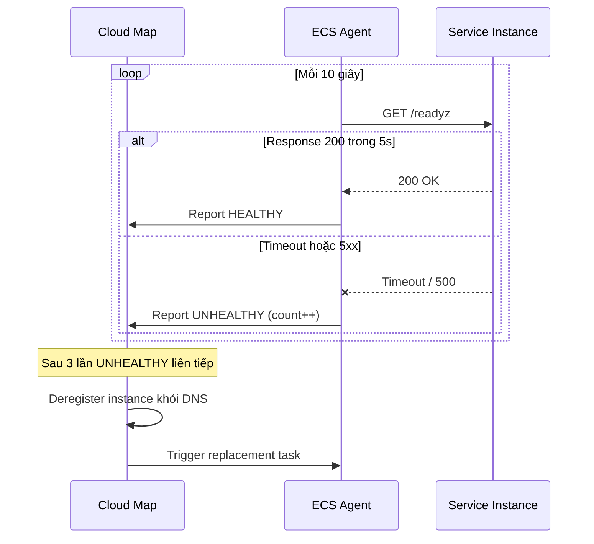

#### Khi một Service Instance gặp sự cố

Khi một instance bị crash, OOM, hoặc treo (hang), hệ thống tự động xử lý **không cần can thiệp thủ công**:

```
Thời điểm    Sự kiện
──────────────────────────────────────────────────────────────
T+0s         Instance #2 của Dispatch Service bị OOM killed
T+10s        Health check lần 1 — FAIL
T+20s        Health check lần 2 — FAIL
T+30s        Health check lần 3 — FAIL → đánh dấu UNHEALTHY
T+30s        Cloud Map xoá IP của instance #2 khỏi DNS record
T+30s        Traffic tự động route sang instance #1 và #3
T+35s        ECS khởi động instance #4 thay thế (desired count = 3)
T+55s        Instance #4 healthy → Cloud Map đăng ký vào DNS
T+55s        Traffic phân phối đều cho instance #1, #3, #4
```

**Điểm quan trọng:**
- Caller (ví dụ: Order Service) **không cần biết** instance nào bị lỗi — DNS tự trả về danh sách instance healthy
- **DNS TTL thấp (5-10s)** đảm bảo caller nhận IP mới nhanh chóng
- Kết hợp với **Retry + Circuit Breaker** (xem [Phần 5](#phần-5--resilience--reliability)) để xử lý request đang in-flight tại thời điểm instance crash
- ECS **desired count** đảm bảo luôn có đủ số instance tối thiểu — tự động thay thế instance bị xoá

### 3.7. Sequence Diagram: End-to-End Delivery Flow

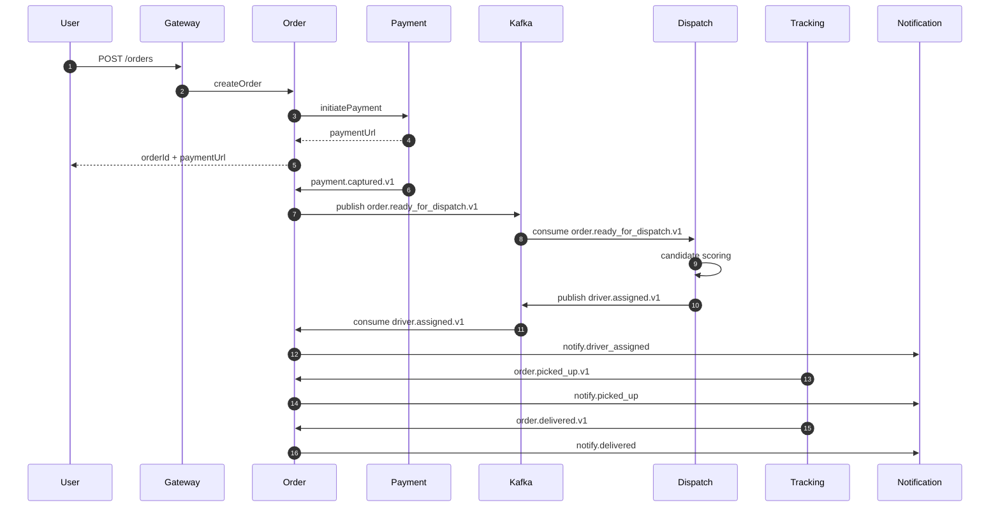

**Ví dụ thực tế:** nếu sau 10 giây chưa assign được driver, Dispatch phát `dispatch.assignment_timeout.v1`, hệ thống tự mở rộng bán kính tìm driver từ 2km lên 4km.

### 3.8. Broker Topology, Retry và DLQ

| Topic | Partitions | Retention | Consumer groups |
|-------|------------|-----------|-----------------|
| `order.placed.v1` | 48 | 7 ngày | promo-cg, notify-cg |
| `payment.captured.v1` | 32 | 14 ngày | order-cg, dispatch-cg, notify-cg |
| `order.ready_for_dispatch.v1` | 24 | 7 ngày | dispatch-cg |
| `dispatch.assignment_timeout.v1` | 24 | 7 ngày | order-cg, notify-cg |
| `driver.assigned.v1` | 24 | 7 ngày | order-cg, tracking-cg |
| `tracking.events.v1` | 64 | 2 ngày | eta-cg, notify-cg, analytics-cg |

| Chính sách | Giá trị |
|-----------|---------|
| Retry consumer | 3 lần, exponential backoff 1s/5s/20s |
| DLQ | Mỗi consumer group có 1 DLQ riêng |
| Replay | replay offset theo time window khi incident |
| Poison message | đẩy DLQ + alert SEV-2 |

### 3.9. Event Payload Samples (JSON)

**`order.placed.v1`**

```json
{
  "eventId": "evt-9bda-1201",
  "eventType": "order.placed.v1",
  "occurredAt": "2026-02-27T11:45:18Z",
  "orderId": "ORD-20260227-1881",
  "userId": "USR-1001",
  "restaurantId": "RES-902",
  "amount": {
    "subtotal": 185000,
    "discount": 30000,
    "shippingFee": 15000,
    "total": 170000,
    "currency": "VND"
  },
  "items": [
    {"menuItemId": "IT-1", "qty": 1},
    {"menuItemId": "IT-5", "qty": 2}
  ]
}
```

**`payment.captured.v1`**

```json
{
  "eventId": "evt-a112-8821",
  "eventType": "payment.captured.v1",
  "occurredAt": "2026-02-27T11:45:26Z",
  "orderId": "ORD-20260227-1881",
  "paymentId": "PAY-20260227-551",
  "provider": "momo",
  "providerTxnId": "MMO-99887766",
  "capturedAmount": 170000,
  "currency": "VND",
  "status": "CAPTURED"
}
```

**`driver.assigned.v1`**

```json
{
  "eventId": "evt-cx21-7788",
  "eventType": "driver.assigned.v1",
  "occurredAt": "2026-02-27T11:45:40Z",
  "orderId": "ORD-20260227-1881",
  "assignmentId": "ASN-44771",
  "driverId": "DRV-0901",
  "zoneId": "HCM-D1",
  "pickupEtaSec": 240,
  "dropoffEtaSec": 980,
  "retryRound": 1
}
```

**Quy tắc schema cho events:**

- Có `eventId`, `eventType`, `occurredAt` bắt buộc.
- Không đổi nghĩa field trong cùng version.
- Field mới thêm phải optional để giữ backward compatibility.

---

## Phần 4 — Data Management & Patterns

> 🔗 Liên quan: [09-data-management.md](09-data-management.md), [17-design-patterns.md](17-design-patterns.md)

### 4.1. Database per Service

Mỗi service **sở hữu database riêng**, không service nào truy cập trực tiếp DB của service khác.

| # | Service | Primary DB | Secondary Store | Lý do chọn | Data Volume ước tính |
|---|---------|-----------|----------------|-------------|---------------------|
| 1 | **Order** | PostgreSQL | Read Replica | ACID cho state machine. Replica cho reporting | ~44M orders/năm, ~300GB |
| 2 | **Payment** | PostgreSQL | — | ACID + audit trail. Không cache để tránh stale state | ~200GB/năm |
| 3 | **Dispatch** | PostgreSQL | Redis (scoring cache) | Strong consistency cho assignment. Redis pre-compute scoring | ~44M assignments/năm, ~150GB |
| 4 | **Tracking** | Redis Streams | TimescaleDB + S3 archive | High-write real-time GPS events. TimescaleDB cho query time-series gần hạn, S3 cho cold analytics | ~50GB Redis, ~300GB TimescaleDB/năm, ~2TB S3/năm |
| 5 | **Menu** | PostgreSQL | Redis (item cache) | ACID cho catalog consistency + Redis giảm latency | ~18K restaurants × ~50 items, ~5GB |
| 6 | **Search** | OpenSearch | Redis (query cache) | Read-only derived data, optimized cho full-text/filter | ~15GB index |
| 7 | **Cart** | Redis (primary) | DynamoDB (backup) | Key-value + TTL. Backup chống mất cart khi Redis outage | ~100K active carts, ~1GB |
| 8 | **User** | PostgreSQL | Redis (cache) | ACID cho account. Redis giảm latency profile lookup | ~3.5M records, ~30GB |
| 9 | **Merchant** | PostgreSQL | Redis (cache) | Restaurant info + SLA data | ~18K records, ~2GB |
| 10 | **Promotion** | PostgreSQL | Redis (rule cache + counter) | ACID cho voucher codes. Redis compiled rules + usage counter | ~3GB |
| 11 | **Notification** | MongoDB | — | Flexible schema cho đa dạng template (push, SMS, email) | ~80GB/năm |
| 12 | **Review** | MongoDB | — | Flexible content: text + images + ratings | ~30GB/năm |

```
┌────────────────────────────────────────────────────────────────┐
│                  DATA ARCHITECTURE OVERVIEW                    │
│                                                                │
│  ┌──────────┐  ┌──────────┐  ┌──────────┐  ┌──────────┐        │
│  │  Order   │  │ Payment  │  │ Dispatch │  │ Tracking │        │
│  │PostgreSQL│  │PostgreSQL│  │PostgreSQL│  │  Redis   │        │
│  │+ Replica │  │(PCI-DSS) │  │ + Redis  │  │ Streams  │        │
│  └──────────┘  └──────────┘  └──────────┘  └──────────┘        │
│                                                                │
│  ┌──────────┐  ┌──────────┐  ┌──────────┐  ┌──────────┐        │
│  │   Menu   │  │  Search  │  │   Cart   │  │Promotion │        │
│  │PostgreSQL│  │OpenSearch│  │  Redis   │  │PostgreSQL│        │
│  │ + Redis  │  │ + Redis  │  │          │  │ + Redis  │        │
│  └──────────┘  └──────────┘  └──────────┘  └──────────┘        │
│                                                                │
│  ┌──────────┐  ┌──────────┐  ┌─────────────────────────┐       │
│  │ Notif    │  │  Review  │  │    Event Bus (Kafka)    │       │
│  │ MongoDB  │  │ MongoDB  │  │  Topics: orders.*       │       │
│  └──────────┘  └──────────┘  │  payments.* dispatch.*  │       │
│                              └─────────────────────────┘       │
│  ┌─────────────────────────────────────────────────────┐       │
│  │      Object Storage (S3): GPS archive, images       │       │
│  └─────────────────────────────────────────────────────┘       │
└────────────────────────────────────────────────────────────────┘
```

### 4.2. Saga Orchestration cho Order Lifecycle

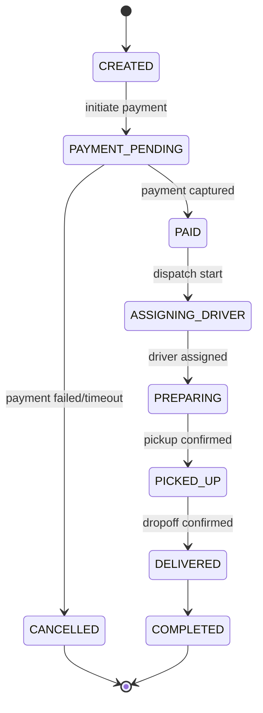

**Chi tiết từng bước:**

| Step | Action | Compensating Action | Timeout |
|------|--------|--------------------:|---------|
| 1. Create Order | Save order (CREATED) | — | — |
| 2. Apply Promotion | `POST /promos/apply` | Reverse voucher usage | 3s |
| 3. Initiate Payment | `POST /payments/initiate` | Cancel payment intent | 10s |
| 4. Wait Payment | Webhook: payment.captured | Release promo + cancel order | **15 min** |
| 5. Assign Driver | Publish `order.ready_for_dispatch.v1` | Retry mở rộng bán kính; sau 3 round đưa vào manual dispatch queue | **10s/round** |
| 6. Restaurant Accept | Event: restaurant.accepted | Notify user + reassign nếu reject | **5 min** |
| 7. Pickup Confirm | Event: order.picked_up | Alert support nếu quá thời gian | **30 min** |
| 8. Delivery Confirm | Event: order.delivered | — | — |

**Nhánh COD (Cash on Delivery) để tránh mâu thuẫn state machine:**

- `CREATED -> COD_PENDING -> ASSIGNING_DRIVER -> DELIVERED -> CASH_COLLECTED -> COMPLETED`
- Dispatch được phép bắt đầu ở trạng thái `COD_PENDING` nếu `payment_method=COD` và `risk_check=PASS`.
- Nếu giao hàng thất bại hoặc tài xế không thu được tiền: chuyển `PAYMENT_COLLECTION_FAILED` và mở quy trình support/recovery.

**Failure Sequence — Payment Failed:**

```mermaid
sequenceDiagram
    participant OS as Order Saga
    participant PAY as Payment
    participant PRM as Promotion
    participant K as Kafka
    participant NTF as Notification

    Note over OS: Payment timeout/failed
    PAY->>K: payment.failed.v1
    K->>OS: consume payment.failed
    
    rect rgb(36, 29, 29)
        Note over OS: Compensating Transactions
        OS->>PRM: reverseVoucherUsage(orderId)
        PRM-->>OS: reversed ✓
        OS->>OS: Update order status=CANCELLED
    end
    
    OS->>K: order.cancelled.v1
    K->>NTF: consume order.cancelled
    Note over NTF: Push: "Thanh toán thất bại, đơn đã hủy"
```

### 4.3. Outbox Pattern

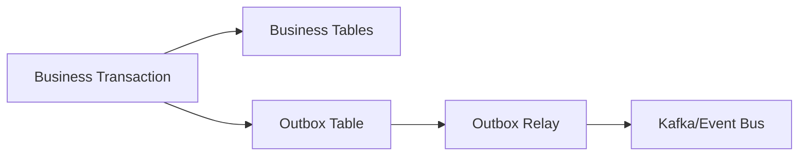

**Service nào cần Outbox?**

| Service | Cần Outbox? | Events phát ra | Lý do |
|---------|------------|----------------|-------|
| **Order Service** | ✅ | `order.placed`, `order.cancelled`, `order.delivered` | Saga orchestrator — cần đảm bảo event tới Payment, Dispatch, Notification |
| **Payment Service** | ✅ | `payment.captured`, `payment.failed`, `payment.refunded` | Order cần biết kết quả để chuyển trạng thái |
| **Dispatch Service** | ✅ | `driver.assigned`, `dispatch.assignment_timeout`, `driver.reassigned` | Order + Tracking cần biết kết quả assignment |
| **Promotion Service** | ✅ | `voucher.applied`, `voucher.released` | Order Saga cần biết kết quả validate voucher |
| **Menu Service** | ❌ | Dùng **CDC (Debezium)** đọc trực tiếp từ DB WAL | Debezium đã giải quyết dual write, không cần outbox table riêng |
| **Tracking Service** | ❌ | GPS data đi qua **Redis Streams** trực tiếp | Không cần transactional guarantee cho location stream |

> 💡 Mỗi service có outbox table **trong cùng database của nó**. Business data + outbox event được ghi trong **cùng 1 DB transaction** → cả 2 đều thành công hoặc đều rollback, không bao giờ mất event.

**Outbox schema mẫu**

```sql
CREATE TABLE outbox_events (
  id UUID PRIMARY KEY DEFAULT gen_random_uuid(),
  aggregate_type VARCHAR(60) NOT NULL,   -- 'Order', 'Payment', 'Assignment'
  aggregate_id VARCHAR(60) NOT NULL,     -- 'ORD-20260227-1881'
  event_type VARCHAR(100) NOT NULL,      -- 'order.placed.v1'
  payload JSONB NOT NULL,
  created_at TIMESTAMP NOT NULL DEFAULT NOW(),
  published_at TIMESTAMP NULL            -- NULL = chưa publish
);
```

### 4.4. CQRS cho Search/Tracking

| Service | Cần CQRS? | Write Model | Read Model | Sync Mechanism |
|---------|-----------|-------------|------------|----------------|
| **Menu → Search** | ✅ Full CQRS | PostgreSQL (normalized) | OpenSearch (denormalized) | CDC (Debezium) → Kafka |
| **Search** | ✅ Full CQRS | — (derived) | OpenSearch | Kafka consumer |
| **Order** | ✅ Có | PostgreSQL | Read Replica + materialized views | PostgreSQL replication |
| **Tracking** | ✅ Có | Redis Streams (raw GPS) | Redis Hash (ETA projection) | Stream consumer real-time |
| **Dispatch** | ⚠️ Từng phần | PostgreSQL (SoT) | Redis cache (driver availability) | Write-through cache |
| **Cart** | ❌ Không | Redis | — | Đã là key-value, đủ nhanh |
| **Payment** | ❌ Không | PostgreSQL | — | Security concern, ít duplicate data |

**Lý do chọn Read Model cụ thể cho từng service:**

| Service | Read Model | Tại sao chọn? | Tại sao KHÔNG dùng cách khác? |
|---------|------------|---------------|-------------------------------|
| **Menu → OpenSearch** | OpenSearch | Cần full-text search tiếng Việt, filter theo khu vực/giá/đánh giá, ranking theo relevance + distance — đây là thế mạnh của search engine | Redis chỉ lookup theo key, không hỗ trợ full-text search hay geo-filter cho 900K menu items |
| **Order → PG Read Replica** | PostgreSQL Read Replica + materialized views | Cần SQL JOIN phức tạp (order → items → restaurant snapshot), aggregate báo cáo (GMV, top quán) | Redis không hỗ trợ JOIN/aggregate; OpenSearch không phù hợp cho transactional data cần consistency cao |
| **Tracking → Redis Hash** | Redis Hash | Dữ liệu đơn giản dạng key-value (`order_id → {lat, lng, eta}`), cần tra cứu sub-ms cho real-time UX | PostgreSQL quá chậm cho GPS polling 5s/lần × 14K drivers; OpenSearch overkill cho lookup đơn giản |
| **Dispatch → Redis** | Redis cache | Driver availability dạng sorted set (`zone → driver scores`), tốc độ đọc cực nhanh cho matching | PostgreSQL latency quá cao cho scoring 2,400 order/phút; **source of truth vẫn là PostgreSQL + locking** khi assign thật |

**CQRS Flow cho Menu/Search:**

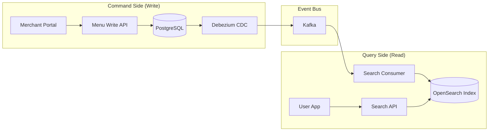

**Ví dụ thực tế:** ứng dụng người dùng đọc ETA từ Redis Hash projection thay vì query trực tiếp Redis Streams. Merchant cập nhật menu -> CDC -> Kafka -> Search consumer -> OpenSearch index cập nhật trong 1-3 giây.

### 4.5. Event Sourcing — Decision

**Khuyến nghị: KHÔNG dùng full Event Sourcing ở giai đoạn đầu**

| Tiêu chí | Event Sourcing | Traditional + Outbox ✅ |
|----------|---------------|----------------------|
| Complexity | Cao (event replay, snapshot, schema evolution) | Trung bình |
| Team learning curve | 3-6 tháng | 2-4 tuần |
| Audit trail | Tuyệt vời — mọi thay đổi đều là event | Đủ tốt — audit table + Outbox events |
| Debugging | Khác biệt (replay events) | Quen thuộc (query DB state) |
| Phù hợp FastBite | Phase 3+ nếu cần audit chi tiết cho Dispatch/Payment | ✅ Phase 1-2 |

> 💡 FastBite giai đoạn đầu dùng **Traditional DB + Outbox Pattern** cho tất cả core services. Event Sourcing có thể xem xét cho Dispatch scoring history hoặc Payment audit trail ở phase sau khi team đã quen với event-driven architecture.

### 4.6. Schema mẫu (Order/Dispatch)

**Order tables:**

```sql
CREATE TABLE orders (
  order_id VARCHAR(40) PRIMARY KEY,
  user_id VARCHAR(40) NOT NULL,
  restaurant_id VARCHAR(40) NOT NULL,
  status VARCHAR(30) NOT NULL,
  subtotal BIGINT NOT NULL,
  discount BIGINT NOT NULL DEFAULT 0,
  shipping_fee BIGINT NOT NULL DEFAULT 0,
  total_amount BIGINT NOT NULL,
  payment_method VARCHAR(20) NOT NULL,
  address_id VARCHAR(40) NOT NULL,
  created_at TIMESTAMP NOT NULL DEFAULT NOW(),
  updated_at TIMESTAMP NOT NULL DEFAULT NOW()
);

CREATE TABLE order_items (
  order_id VARCHAR(40) NOT NULL,
  line_no INT NOT NULL,
  menu_item_id VARCHAR(40) NOT NULL,
  item_name_snapshot VARCHAR(200) NOT NULL,
  qty INT NOT NULL,
  unit_price_snapshot BIGINT NOT NULL,
  options_snapshot JSONB,
  item_discount BIGINT NOT NULL DEFAULT 0,
  PRIMARY KEY (order_id, line_no)
);
```

**Dispatch tables:**

```sql
CREATE TABLE assignments (
  assignment_id VARCHAR(40) PRIMARY KEY,
  order_id VARCHAR(40) NOT NULL,
  driver_id VARCHAR(40) NULL,
  state VARCHAR(30) NOT NULL,
  score NUMERIC(10,2) NULL,
  retry_round INT NOT NULL DEFAULT 1,
  search_radius_km NUMERIC(5,1) NOT NULL DEFAULT 2.0,
  started_at TIMESTAMP NOT NULL,
  expires_at TIMESTAMP NOT NULL,
  version BIGINT NOT NULL DEFAULT 0
);
```

**Menu tables:**

```sql
CREATE TABLE menu_items (
  item_id VARCHAR(40) PRIMARY KEY,
  restaurant_id VARCHAR(40) NOT NULL,
  name VARCHAR(200) NOT NULL,
  description TEXT,
  category VARCHAR(60) NOT NULL,
  base_price BIGINT NOT NULL,
  is_available BOOLEAN NOT NULL DEFAULT TRUE,
  available_from TIME,
  available_until TIME,
  image_url VARCHAR(500),
  created_at TIMESTAMP NOT NULL DEFAULT NOW(),
  updated_at TIMESTAMP NOT NULL DEFAULT NOW()
);

CREATE TABLE menu_item_options (
  option_id VARCHAR(40) PRIMARY KEY,
  item_id VARCHAR(40) NOT NULL REFERENCES menu_items(item_id),
  option_group VARCHAR(60) NOT NULL,
  option_name VARCHAR(100) NOT NULL,
  extra_price BIGINT NOT NULL DEFAULT 0,
  is_default BOOLEAN NOT NULL DEFAULT FALSE
);
```

### 4.7. Concurrency Control & Reconciliation Jobs

| Bài toán | Cách xử lý |
|----------|------------|
| Race condition driver assignment | Atomic SQL update + version check |
| Lost update | Optimistic locking (`version`) |
| Payment callback đến muộn | Kiểm tra order status + idempotency |
| Event mất/consumer down | Replay từ offset + reconciliation jobs |

**Chi tiết từng case:**

**① Race condition driver assignment**

Scenario: Giờ cao điểm, 2 request cùng lúc cố gắng assign cùng 1 driver cho 2 đơn khác nhau.

```sql
-- ❌ Cách sai — đọc rồi ghi riêng lẻ → 1 driver nhận 2 đơn overlap
SELECT status FROM drivers WHERE driver_id = 'DRV-0901';  -- 'AVAILABLE'
-- 2 request cùng đọc = AVAILABLE → đều nghĩ driver rảnh
UPDATE drivers SET status = 'ASSIGNED', current_order_id = :order_id
WHERE driver_id = 'DRV-0901';

-- ✅ Cách đúng — Atomic conditional update (1 câu SQL duy nhất)
UPDATE drivers
SET status = 'ASSIGNED',
    current_order_id = :order_id,
    version = version + 1
WHERE driver_id = :driver_id
  AND status = 'AVAILABLE'
  AND version = :expected_version;
-- Nếu affected_rows = 0 → driver đã được assign cho đơn khác, chọn driver tiếp theo.
```

Với Redis (dùng cho pre-check trước khi vào DB):

```lua
-- Redis Lua script — atomic remove driver khỏi available set
local removed = redis.call('ZREM', KEYS[1], ARGV[1])  -- KEYS[1] = zone:HCM-D1:available
if removed == 1 then
    redis.call('SET', 'driver:' .. ARGV[1] .. ':order', ARGV[2])  -- ARGV[2] = orderId
    return 1  -- success, driver claimed
end
return 0  -- driver đã bị claim bởi đơn khác
```

**② Lost update (Cập nhật bị ghi đè)**

Scenario: 2 ops cùng sửa thông tin nhà hàng (giờ mở cửa), người sau ghi đè thay đổi của người trước.

```
Ops A đọc restaurant (version = 5), sửa giờ mở cửa
Ops B đọc restaurant (version = 5), sửa địa chỉ
Ops A save → version 5→6 ✓
Ops B save → version 5→6 ✗ CONFLICT! (version đã là 6)
```

```sql
-- Optimistic locking — kiểm tra version khi update
UPDATE restaurants
SET opening_hours = :new_hours, version = version + 1
WHERE restaurant_id = :id AND version = :expected_version;
-- affected_rows = 0 → conflict → trả 409 Conflict, yêu cầu client reload
```

> Dùng cho: Merchant (restaurant update), Menu (item update), Dispatch (assignment state transition).

**③ Payment callback đến muộn**

Scenario: User thanh toán MoMo thành công, nhưng callback về FastBite bị delay 5 phút (do network, queue provider). Lúc đó order có thể đã bị cancel do payment timeout.

```
T+0:00  User checkout → Order CREATED, payment pending (TTL 15min)
T+0:01  Redirect MoMo → User thanh toán thành công
T+0:06  Callback từ MoMo đến muộn (delay 5 phút)
        → Payment Service nhận callback
        → Kiểm tra: Order vẫn PAYMENT_PENDING? → OK, xử lý bình thường
        → Nếu Order đã CANCELLED (do timeout) → Trigger refund tự động
```

```
-- Xử lý trong Payment Service:
1. Lookup order by order_id → check status
2. Nếu status = PAYMENT_PENDING → confirm payment → order → PAID → assign driver
3. Nếu status = CANCELLED → auto refund → notify user "Đã hoàn tiền"
4. Idempotency: check payment_provider_txn_id đã xử lý chưa
   → Nếu đã xử lý → return success (không xử lý lại)
```

**④ Event mất / Consumer down**

Scenario: Order Service publish `order.placed` nhưng Payment consumer đang deploy/crash → event không được xử lý.

```
Giải pháp multi-layer:
1. Kafka consumer group — khi consumer restart, đọc tiếp từ last committed offset
   → Event không mất, chỉ delay xử lý

2. Dead Letter Queue (DLQ) — event xử lý fail 3 lần → chuyển vào DLQ
   → Alert team để investigate manually

3. Reconciliation job — safety net cuối cùng (xem section 4.9)
```

### 4.8. Data Consistency Rules

| Dữ liệu | Mức consistency | Pattern |
|---------|-----------------|---------|
| Payment transaction | Strong | DB transaction + idempotency |
| Order state | Strong | state machine + saga orchestrator |
| Driver assignment state | Strong | conditional update + optimistic lock |
| Menu item availability | Strong | DB + cache invalidation |
| Search index menu | Eventual | CDC → async reindex (delay 1-3s) |
| Tracking ETA projection | Eventual | Stream consumer → Redis Hash |
| Review aggregate | Eventual | event-based recompute |
| Notification delivery | Eventual | async + retry + DLQ |

### 4.9. Reconciliation Jobs

| Job | Tần suất | Logic | Phát hiện vấn đề gì? |
|-----|----------|-------|----------------------|
| **Order ↔ Payment** | Mỗi 15 phút | So khớp `orders(status=PAID)` với `payments(status=CAPTURED)` | Order paid nhưng chưa có payment (event mất) hoặc payment captured nhưng order vẫn pending (callback bị miss) |
| **Driver assignment stuck** | Mỗi 5 phút | Quét `assignments WHERE state='PENDING' AND started_at < NOW() - INTERVAL '3 min'` | Đơn mắc kẹt do consumer down khi xử lý dispatch event → trigger re-assign |
| **Voucher usage audit** | Mỗi giờ | So khớp `voucher_usages` với `orders(status IN ('PAID','COMPLETED'))` | Voucher đã apply nhưng order bị cancel mà chưa release usage → tự động release |
| **Tracking stream lag** | Mỗi 2 phút | Kiểm tra consumer lag của tracking stream consumers | Lag > 30s → alert SEV-2, lag > 60s → alert SEV-1 |
| **Payment ↔ Provider** | Mỗi ngày | Gọi API đối soát MoMo/ZaloPay, so với `payments` nội bộ | Phát hiện giao dịch thành công ở provider nhưng FastBite chưa ghi nhận → trigger bù trừ |

---

## Phần 5 — Resilience & Reliability

> 🔗 Liên quan: [10-resilience-patterns.md](10-resilience-patterns.md)

### 5.1. Reliability Goals

- 99.95% availability toàn nền tảng.
- Không để lỗi `Dispatch` làm sập `Order`.
- Graceful degradation khi external provider lỗi.

### 5.2. Circuit Breaker/Retry/Timeout

| Caller -> Callee | Circuit breaker | Retry | Timeout |
|------------------|----------------|-------|---------|
| Order -> Payment | 5 lỗi/30s, open 30s | 1 | 3s |
| Payment -> Wallet API | 3 lỗi/10s, open 60s | 2 + jitter | 10s |
| Dispatch -> Routing API | 5 lỗi/20s, open 20s | 1 | 2s |
| Gateway -> nội bộ | 10 lỗi/60s | 0-1 | 2-5s |

**Circuit Breaker State Machine:**

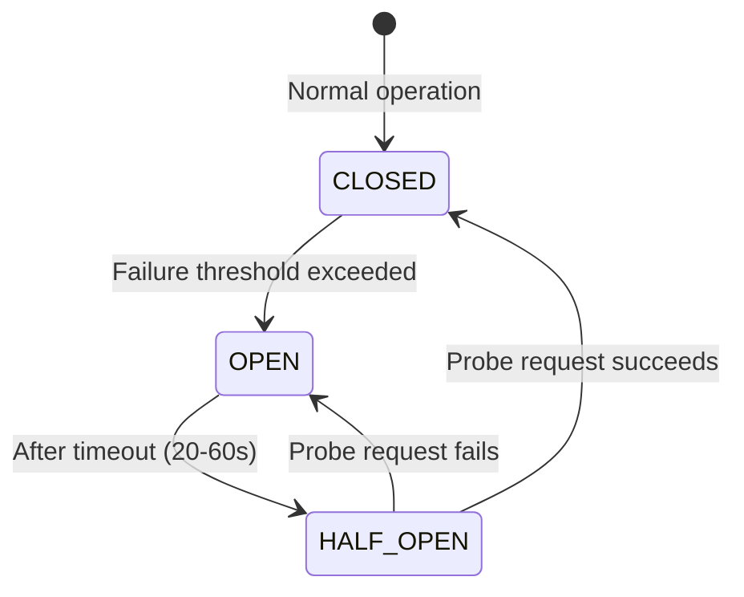

- **CLOSED**: Mọi request đi qua bình thường, CB theo dõi tỉ lệ lỗi.
- **OPEN**: Quá nhiều lỗi liên tiếp → ngắt mạch, tất cả request fail ngay (fast-fail) để giảm áp lực lên downstream.
- **HALF_OPEN**: Sau khoảng timeout, cho vài probe request thử lại. Nếu thành công → về CLOSED; nếu thất bại → quay lại OPEN.

### 5.3. Bulkhead & Rate Limiting

**Rate Limiting:**

| Endpoint | Limit | Action |
|----------|-------|--------|
| `POST /auth/login` | 5 req/min/IP | 429 + temporary block |
| `POST /orders` | 12 req/min/user | 429 |
| `POST /payments/initiate` | 5 req/min/user | 429 + fraud flag |
| `GET /tracking/{orderId}` | 60 req/min/user | degrade update interval |

**Bulkhead — Tại sao cần khi các service đã tách riêng?**

Payment, Dispatch, Tracking là các service độc lập với DB riêng — chúng không ảnh hưởng trực tiếp đến nhau. Nhưng vấn đề nằm ở **Order Service — service gọi tất cả chúng**. Khi tạo đơn, Order Service phải gọi Payment, Dispatch, Promotion. Nếu dùng chung 1 thread/connection pool:

```
Ví dụ: Order Service có 100 threads, dùng chung cho mọi outbound call

Routing API (Google Maps) bị chậm (timeout 5s mỗi request)
→ 70 threads đang chờ Dispatch Service trả về (vì Dispatch chờ Routing API)
→ Chỉ còn 30 threads cho cả Payment + Promotion + Notification
→ Các request tạo đơn mới không có thread để gọi Payment
→ Toàn bộ order flow CHẾT — dù Payment và Promotion vẫn hoạt động bình thường!
```

> 💡 **Bulkhead không bảo vệ giữa các downstream service** — nó bảo vệ **bên trong caller (Order Service)**, đảm bảo 1 downstream chậm/chết không chiếm hết resource, kéo theo các downstream khác không gọi được. Giống tàu thuỷ chia khoang kín nước — 1 khoang thủng thì các khoang khác vẫn an toàn.

**Giải pháp: Tách thread pool riêng cho từng downstream**

```
┌──────────────────────────────────────────────────────────────────┐
│               ORDER SERVICE — BULKHEAD ISOLATION                 │
│                                                                  │
│  ┌─────────────────┐  ┌─────────────────┐  ┌──────────────┐      │
│  │ Payment Pool    │  │ Dispatch Pool   │  │ Other Pool   │      │
│  │ Max: 25 threads │  │ Max: 30 threads │  │ Max: 45      │      │
│  │ Queue: 10       │  │ Queue: 15       │  │ Queue: 20    │      │
│  │                 │  │                 │  │              │      │
│  │ Wallet API chậm │  │ Routing API chậm│  │ Promo, Notif │      │
│  │ → chỉ 25 thread │  │ → chỉ 30 thread │  │ → hoạt động  │      │
│  │   bị block      │  │   bị block      │  │   bình thường│      │
│  └─────────────────┘  └─────────────────┘  └──────────────┘      │
│                                                                  │
│  ✅ Routing API chậm → chỉ 30 thread Dispatch pool bị kẹt        │
│  ✅ Payment pool vẫn có 25 thread riêng → authorize bình thường  │
│  ✅ Promotion, Notification vẫn có 45 thread → không bị ảnh hưởng│
└──────────────────────────────────────────────────────────────────┘
```

- Tracking stream consumer tách khỏi notification worker (bulkhead ở mức consumer group).

### 5.4. Capacity Planning cho giờ cao điểm

| Thành phần | Baseline | Peak |
|------------|----------|------------|
| Create order RPS | 3.3 (~200 order/min) | 40 (2,400 order/min) |
| Payment callback msg/s | 4 | 45 |
| Dispatch scoring QPS | 5 | 60 |
| Tracking updates msg/s | 1,500 | 4,700 (14K drivers × 1 ping/3s) |
| Notification msg/s | 15 | 160 |

> Ghi chú: Mục tiêu autoscale 12x áp dụng chủ yếu cho order path (Order/Payment/Dispatch). Tracking phụ thuộc trần số driver online, nên peak bị giới hạn bởi lưu lượng GPS thực tế.

**Timeline hành động trước/trong/sau giờ cao điểm (Lunch/Dinner Peak):**

```
┌─────────────────────────────────────────────────────────────────────┐
│                   PEAK HOURS TIMELINE (11h-13h / 18h-20h)           │
├─────────────────────────────────────────────────────────────────────┤
│                                                                     │
│  T-7 ngày   📋 Planning                                             │
│  ├── Xác nhận campaign promotion giờ trưa/tối (freeship, voucher)   │
│  ├── Tính toán capacity dựa trên traffic tuần trước + campaign      │
│  └── Chuẩn bị pre-scale config cho từng service                     │
│                                                                     │
│  T-1 ngày   🔧 Pre-scale & Verify                                   │
│  ├── Scale Dispatch pods lên theo bảng pre-scale                    │
│  ├── Warm up Redis cache (menu items, restaurant availability)      │
│  ├── Pre-warm DB connection pools                                   │
│  ├── Load test với traffic giả lập 80% peak                         │
│  └── Verify monitoring dashboards & alerting rules                  │
│                                                                     │
│  T-30 phút  🚦 Final check (10:30 hoặc 17:30)                       │
│  ├── Code freeze — không deploy bất kỳ service nào                  │
│  ├── On-call team monitor Slack channel                             │
│  ├── Verify tất cả pods healthy, zero error rate                    │
│  └── Bật high-priority alerting (PagerDuty)                         │
│                                                                     │
│  T=0        🔥 Peak bắt đầu (11:00 hoặc 18:00)                      │
│  ├── Monitor real-time: RPS, error rate, latency, dispatch lag      │
│  ├── Nếu error rate > 5% → xem xét bật degraded mode                │
│  ├── Nếu dispatch queue lag > 2 phút → scale consumers              │
│  └── Nếu 1 service chết → Circuit Breaker + fallback                │
│                                                                     │
│  T+2 giờ    📉 Hết giờ cao điểm (13:00 hoặc 20:00)                  │
│  ├── Chờ 30 phút để traffic giảm tự nhiên                           │
│  ├── Scale down pods dần (không scale xuống đột ngột)               │
│  ├── Chạy reconciliation jobs kiểm tra dữ liệu                      │
│  └── Thu thập metrics cho report                                    │
│                                                                     │
│  T+1 ngày   📝 Review                                               │
│  ├── So sánh actual vs predicted traffic                            │
│  ├── Phân tích bottleneck nếu có                                    │
│  └── Cập nhật capacity model cho tuần tiếp theo                     │
└─────────────────────────────────────────────────────────────────────┘
```

**Degraded Mode — giữ gì, giảm gì, tắt gì:**

| Khi bật degraded mode | Hành động | Lý do |
|----------------------|-----------|-------|
| ✅ **Giữ** | Order flow (Order → Payment → Dispatch) | Core business, mất = mất doanh thu + mất khách |
| ✅ **Giữ** | Driver tracking & location updates | User cần biết tài xế ở đâu, giảm support ticket |
| ✅ **Giữ** | Restaurant menu (từ cache) | User cần xem menu trước khi đặt |
| ⚠️ **Giảm** | Search — trả kết quả từ cache, tắt auto-suggest | Giảm load OpenSearch |
| ⚠️ **Giảm** | ETA calculation — dùng cached ETA thay vì real-time routing | Giảm load Routing API |
| ❌ **Tắt** | Review write — tạm không cho submit đánh giá | Không urgent, giảm DB write |
| ❌ **Tắt** | Notification email/SMS — queue lại, gửi sau | Delay 30 phút chấp nhận được |
| ❌ **Tắt** | Promotion campaign phức tạp — chỉ giữ freeship cơ bản | Giảm computation trên Promotion Service |

### 5.5. Fallback Strategies

**Fallback là gì?**

Khi một downstream service bị lỗi hoặc phản hồi quá chậm, thay vì trả lỗi trực tiếp cho người dùng, hệ thống sẽ trả về một **kết quả thay thế** — chất lượng thấp hơn nhưng vẫn hoạt động được (degraded but functional). Mục tiêu là giữ cho core flow (đặt đơn, thanh toán, ghép tài xế) **không bị gián đoạn** dù một số service phụ trợ đang down.

**Bảng tổng hợp Fallback:**

| Service Down | Fallback Behavior | User Experience |
|-------------|-------------------|----------------|
| Routing API (ETA) | Dùng cached ETA từ lần gọi gần nhất | "Thời gian giao dự kiến ~30 phút" (ước tính) |
| Dispatch scoring | Fallback nearest driver (chỉ dựa khoảng cách) | Giao đơn chậm hơn vài phút nhưng vẫn có tài xế |
| Promotion (timeout) | Checkout không voucher | "Voucher tạm thời không khả dụng" |
| Notification | Retry via DLQ (async) | User không biết, nhận thông báo muộn |
| Search | Show danh sách nhà hàng phổ biến gần người dùng | "Nhà hàng gợi ý quanh bạn" |
| Review | Disable submit, show cached rating | "Tạm thời không thể đánh giá" |

**Chi tiết các case quan trọng:**

#### Case 1: Routing API Down → Dùng cached ETA

```
User đặt phở lúc 11:45 → Order Service → Dispatch Service → Routing API (Google Maps)
                                                                   ❌ Circuit Breaker OPEN
                                                                   │
                                                                   ▼
                                                           Fallback Handler
                                                                   │
                                                           ┌───────┴────────┐
                                                           │  Redis Cache   │
                                                           │  Key: eta:     │
                                                           │  {zone}:{dist} │
                                                           └───────┬────────┘
                                                                   │
                                                                   ▼
                                                           Trả về cached ETA ~28 phút
                                                           + ghi nhận flag estimated_eta=true
```

- Dispatch Service lưu **ETA trung bình theo zone + khoảng cách** mỗi 15 phút vào Redis (pre-warm).
- Khi Routing API down, dùng cached ETA thay vì tính real-time. Sai số ~5-10 phút nhưng vẫn giao được.
- Khi Routing API hồi phục, **recalculation job** cập nhật ETA chính xác cho đơn đang giao.

#### Case 2: Dispatch Scoring Fail → Fallback Nearest Driver

```
Order Service → Dispatch Service → Scoring Engine (ML-based optimal matching)
                                         ❌ Timeout 2s / Error
                                         │
                                         ▼
                                 Fallback: nearest driver algorithm
                                         │
                                         ▼
                                 Chọn tài xế gần nhà hàng nhất (Haversine distance)
                                 + driver online + không đang giao đơn khác
```

- ML scoring engine tối ưu theo ETA + cost + driver fairness, nhưng khi fail, fallback về thuật toán đơn giản: **tài xế gần nhất còn rảnh**.
- Kết quả không tối ưu (có thể tài xế gần nhưng đường tắc), nhưng đơn vẫn được ghép -> người dùng vẫn nhận đồ ăn.

#### Case 3: Promotion Service Timeout → Checkout không voucher

- Checkout **vẫn hoạt động bình thường** — chỉ không áp dụng được voucher giảm giá.
- User nhận thông báo: *"Voucher tạm thời không khả dụng. Bạn có thể tiếp tục đặt đơn với giá gốc, hoặc thử lại sau."*
- **Không bao giờ** tự fake kết quả giảm giá — luôn trả giá gốc khi Promotion không xác nhận được.

> ⚠️ **Những service KHÔNG BAO GIỜ được có fallback:**
>
> | Service | Lý do không fallback |
> |---------|---------------------|
> | **Payment** | Không bao giờ fake kết quả thanh toán. Nếu Payment gateway down -> **dừng checkout**, thông báo người dùng thử lại. Trả kết quả sai sẽ gây mất tiền hoặc giao đơn không thanh toán |
> | **Order State** | Không bao giờ bỏ qua state machine. Nếu Order Service down → **dừng flow**. Bỏ qua state check sẽ gây duplicate order, double charge hoặc giao đơn đã hủy |
>
> Nguyên tắc: **Fallback chỉ áp dụng cho service mà kết quả sai/thiếu không gây thiệt hại tài chính trực tiếp**. Với Payment và Order state, "fail fast + thông báo rõ ràng" tốt hơn "fail silently + hậu quả nghiêm trọng".

### 5.6. Runbook SEV-1: Không ghép được tài xế

**Decision table (trigger -> action -> owner):**

| Trigger | Ngưỡng | Hành động ngay | Owner |
|---------|--------|----------------|-------|
| `unassigned_rate` tăng đột biến | > 15% trong 5 phút | Bật fallback nearest-driver + tăng search radius 2km -> 4km | Delivery Ops on-call |
| `dispatch.pending` lag cao | > 2 phút hoặc > 5.000 jobs | Scale-out dispatch consumers + tạm dừng rollout | SRE |
| Routing provider lỗi/chậm | error > 20% hoặc P95 > 1.5s trong 5 phút | Mở circuit breaker, dùng cached ETA | Delivery Ops |
| Driver supply thấp theo zone | idle drivers < 10/zone | Bật incentive tạm thời theo zone, ưu tiên driver idle lâu | Operations |

**Checklist xử lý:**

1. Mở war-room, phân công `Incident Commander` và cập nhật status page mỗi 15 phút.
2. Kiểm tra `dispatch.pending`, consumer lag, health của routing provider.
3. Áp dụng hành động theo decision table (ưu tiên fallback trước, sau đó scale).
4. Nếu sau 10 phút vẫn không cải thiện: chuyển sang manual dispatch tại zone bị ảnh hưởng.
5. Chỉ đóng incident khi `unassigned_rate < 5%` liên tục 15 phút và `assignment_p95 <= 10s`.

### 5.7. Chaos Engineering Plan

| Experiment | Kỳ vọng | Success criteria |
|------------|---------|------------------|
| Kill 50% Dispatch tasks/pods | autoscale + queue tăng có kiểm soát | match SLA giảm không quá 5% |
| Inject 2s latency Payment provider | CB mở, degrade an toàn | không cascade sang Order |
| Stop tracking consumer 10 phút | lag tăng rồi hồi phục sau restart | không mất event |
| Network partition Order <-> Dispatch | timeout + fallback manual | đơn không rơi trạng thái mồ côi |

**Tools:** AWS Fault Injection Simulator (FIS), tc (traffic control), k6/Locust (load test)

### 5.8. Defense in Depth

**Defense in Depth** (phòng thủ nhiều lớp) là chiến lược kết hợp **nhiều resilience pattern thành một chuỗi tuần tự**, trong đó mỗi lớp đảm nhận một nhiệm vụ riêng và **bắt những lỗi mà lớp trước bỏ sót**.

```
Request ──▶ Rate Limit ──▶ Timeout ──▶ Retry ──▶ Circuit Breaker ──▶ Bulkhead ──▶ Fallback
   │            │             │           │            │                │            │
   │         Quá nhiều     Quá lâu    Thử lại     Quá nhiều lỗi   Isolate pool  Trả kết quả
   │         request?      chờ?       lần nữa?    → ngắt mạch    → không lan    thay thế
   │            │             │           │            │           tràn           │
   ▼            ▼             ▼           ▼            ▼                │         ▼
  429          504        Retry/Fail    Open CB    Thread pool      Fallback    Graceful
                                                   isolated       response    degradation
```

**Chi tiết từng lớp trong FastBite:**

| Lớp | Chức năng | Cấu hình ở đâu | Khi trigger thì sao? | Ví dụ FastBite |
|-----|-----------|-----------------|----------------------|----------------|
| **Rate Limit** | Giới hạn số request/giây, chặn traffic bất thường (DDoS, bot, abuse) | API Gateway (Kong/Nginx) | Trả `429 Too Many Requests`, request bị reject ngay tại gateway | Giờ cao điểm: mỗi user tối đa 12 req/min cho tạo đơn. Bot spam đặt đơn bị chặn ngay |
| **Timeout** | Đặt thời gian chờ tối đa cho mỗi lần gọi downstream | Client-side (caller service) — HTTP client config | Request bị cancel sau thời gian timeout, thread được giải phóng | Order Service gọi Dispatch Service với timeout 2s. Nếu Dispatch chậm > 2s → fail fast |
| **Retry** | Thử lại request khi gặp lỗi tạm thời (network blip, 503 tạm) | Client-side — retry policy với exponential backoff + jitter | Gửi lại request tối đa N lần. **Bắt buộc**: downstream phải idempotent | Dispatch timeout lần 1 → retry sau 200ms → thành công lần 2. Idempotency key đảm bảo không assign 2 tài xế |
| **Circuit Breaker** | Theo dõi tỉ lệ lỗi, khi vượt ngưỡng → ngắt mạch (OPEN), ngừng gọi service đang chết | Client-side — Resilience4j hoặc Istio | Trạng thái OPEN: mọi request fail ngay (fast-fail). Sau timeout → HALF-OPEN, thử vài request | Routing API lỗi 60% trong 20s → circuit OPEN. Dispatch ngừng gọi Routing, dùng cached ETA |
| **Bulkhead** | Cách ly thread pool / connection pool theo từng downstream | Caller service — separate thread pool per downstream | Thread pool đầy → request mới bị reject, nhưng pool khác không bị ảnh hưởng | Order Service: 25 threads cho Payment, 30 threads cho Dispatch. Routing chậm → Dispatch pool đầy, Payment pool vẫn bình thường |
| **Fallback** | Cung cấp response thay thế (degraded) khi tất cả lớp trên đều fail | Caller service — fallback handler trong code | Trả response degraded thay vì lỗi 500 | Routing API fail → dùng cached ETA. Scoring fail → nearest driver. Promotion timeout → checkout không voucher |

**Ví dụ thực tế: User đặt đơn khi Routing API chậm**

Tình huống: Nguyễn Thị B đặt combo trưa lúc 11:50. Routing API (Google Maps) đang bị quá tải, response time tăng từ 100ms → 6s, rồi bắt đầu trả lỗi 503.

```
Bước 1 — Rate Limit (Gateway):
  Request tạo đơn của người dùng B đến Gateway.
  ✅ PASS — người dùng B mới gửi 3 req/min, dưới ngưỡng 12 req/min.
  → Request được forward tới Order Service.

Bước 2 — Timeout (Order Service → Dispatch Service):
  Order Service gọi Dispatch Service, timeout = 2s.
  Dispatch Service gọi Routing API, timeout = 2s.
  ❌ TRIGGER — Routing API response mất 6s > timeout 2s.
  → Dispatch request bị cancel, trả lỗi về Order Service.

Bước 3 — Retry (Order Service):
  Retry policy: max 1 lần, backoff 200ms.
  Lần 1 (sau 200ms): Routing API vẫn chậm → timeout 2s → fail.
  ❌ TRIGGER — Hết retry quota.

Bước 4 — Circuit Breaker (Dispatch Service):
  Đã tích lũy 60% failure rate trong 20s gần nhất (nhiều đơn cùng gọi Routing fail).
  ❌ TRIGGER — Circuit Routing API chuyển sang OPEN.
  → Các request dispatch tiếp theo skip Routing API hoàn toàn (fast-fail <5ms).

Bước 5 — Bulkhead (Order Service):
  Thread pool "dispatch-pool" (30 threads) vẫn hoạt động bình thường vì CB đã fast-fail.
  ✅ KHÔNG LAN TRÀN — Thread pool "payment-pool" (25 threads) không bị ảnh hưởng.
  → Payment authorization vẫn thành công.

Bước 6 — Fallback (Dispatch Service):
  ❌ TRIGGER — Routing API fail.
  → Dispatch Service dùng cached ETA (Redis: eta:{zone}:{distance_bucket}).
  → Ghép tài xế bằng nearest driver algorithm thay vì ML scoring.
  → Trả response cho người dùng B:
     "✅ Đơn hàng #FB-8891 đã được đặt thành công!
      🛵 Thời gian giao dự kiến ~30 phút (ước tính).
      Bạn có thể theo dõi tài xế trên bản đồ."

Sau 3 phút — Circuit Breaker HALF-OPEN:
  Cho 2 request thử gọi Routing API → 2/2 thành công.
  → Circuit chuyển về CLOSED, ETA real-time hoạt động trở lại.
  → Background job recalculate ETA chính xác cho các đơn đang giao.
```

> 💡 **Nguyên tắc quan trọng:** Mỗi lớp bảo vệ một khía cạnh khác nhau. Rate Limit bảo vệ **gateway**, Timeout bảo vệ **thread**, Retry xử lý **lỗi tạm thời**, Circuit Breaker bảo vệ **downstream**, Bulkhead bảo vệ **resource isolation**, Fallback bảo vệ **user experience**. Thiếu bất kỳ lớp nào đều tạo ra lỗ hổng.

---

## Phần 6 — Observability

> 🔗 Liên quan: [11-observability-evolvability.md](11-observability-evolvability.md), [22-aws-observability.md](22-aws-observability.md)

### 6.1. Telemetry Architecture

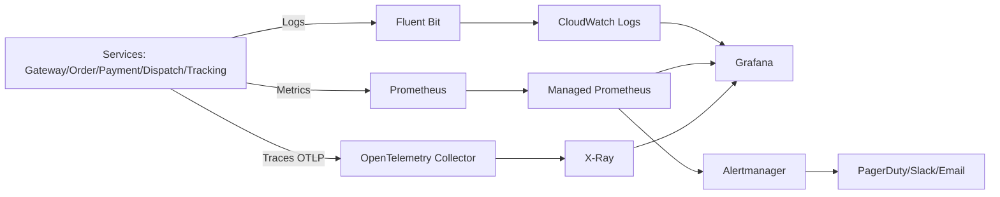

### 6.2. Metrics & SLO

FastBite áp dụng kết hợp:

- **RED** (Rate, Errors, Duration) cho HTTP/gRPC endpoints.
- **USE** (Utilization, Saturation, Errors) cho hạ tầng (CPU, memory, queue, connection pool).

**RED Metrics theo service:**

| Service | Golden Metrics chính | Ngưỡng cảnh báo |
|---------|----------------------|-----------------|
| API Gateway | RPS, 4xx/5xx rate, P95 latency | 5xx > 1% trong 5 phút |
| Order | create success rate, saga timeout rate | success < 99.3% trong 10 phút hoặc burn-rate > 2x |
| Payment | callback delay, failed charge rate | failed charge > 2% |
| Dispatch | assign latency P95, unassigned rate | P95 > 10s hoặc unassigned > 2% |
| Tracking | location update lag, stale position rate | lag > 30s |
| Kafka | consumer lag, DLQ size | lag > 10,000 messages |
| Database | CPU, connections, slow query count | CPU > 80% trong 10 phút |

**SLI/SLO và Error Budget:**

| User Journey | SLI | SLO | Error Budget (tháng) |
|-------------|-----|-----|----------------------|
| Đặt đơn | Order create success ratio | >= 99.7% | 0.3% (~10,800 lỗi/tháng trên 120K đơn/ngày) |
| Thanh toán | Payment capture success ratio | >= 99.8% | 0.2% |
| Ghép tài xế | Driver assigned <= 10s ratio | >= 98% | 2% |
| Tạo đơn latency | P95 create-order latency | < 250ms | 5% request có thể > 250ms |
| Tracking availability | Tracking API availability | >= 99.9% | 43.8 phút/tháng |
| ETA accuracy | Delivery within ETA ± 10 phút | >= 92% | 8% đơn có thể lệch > 10 phút |

**Quy tắc vận hành Error Budget:**

- Nếu burn rate > 2x trong 1 giờ → dừng release tính năng mới.
- Ưu tiên fix reliability bug trước feature.
- Chỉ mở lại release khi burn rate trở lại ngưỡng an toàn.

### 6.3. Logging Standard

**Nguyên tắc:**

- Log theo định dạng **JSON** để dễ query.
- Mọi log phải có `trace_id`, `span_id`, `request_id`.
- Tuyệt đối không log `password`, `card_number`, `cvv`, access token full.
- Phân mức log rõ ràng: `DEBUG`, `INFO`, `WARN`, `ERROR`.

**Schema log chuẩn:**

| Field | Bắt buộc | Ví dụ | Ý nghĩa |
|------|----------|-------|---------|
| `timestamp` | ✅ | `2026-02-28T11:48:32.456Z` | Thời điểm phát sinh |
| `service` | ✅ | `dispatch-service` | Tên service |
| `env` | ✅ | `prod` | Môi trường |
| `level` | ✅ | `ERROR` | Mức log |
| `trace_id` | ✅ | `7bf93a...` | Correlate trace |
| `span_id` | ✅ | `01d078...` | Span hiện tại |
| `request_id` | ✅ | `req-8d42...` | ID request từ gateway |
| `order_id` | ⚠️ nếu có | `ORD-20260228-4421` | ID đơn hàng nội bộ |
| `driver_id` | ⚠️ nếu có | `DRV-1234` | ID tài xế |
| `zone` | ⚠️ nếu có | `hcm-q1` | Zone dispatch |
| `error_code` | ⚠️ nếu lỗi | `DISPATCH_TIMEOUT` | Mã lỗi chuẩn hóa |
| `message` | ✅ | `driver assignment timeout` | Nội dung chính |

**Ví dụ log thực tế (dispatch timeout):**

```json
{
  "timestamp": "2026-02-28T11:48:32.456Z",
  "service": "dispatch-service",
  "env": "prod",
  "level": "ERROR",
  "trace_id": "7bf93a2241c84d9b8e1f929d0e0e5847",
  "span_id": "01d078bb1ca903c8",
  "request_id": "req-8d42-a7bf",
  "order_id": "ORD-20260228-4421",
  "zone": "hcm-q1",
  "candidates_evaluated": 12,
  "candidates_available": 0,
  "error_code": "DISPATCH_NO_DRIVER_AVAILABLE",
  "message": "No available driver within 3km radius after 10s timeout"
}
```

### 6.4. Distributed Tracing

**Trace flow xuyên suốt Place Order:**

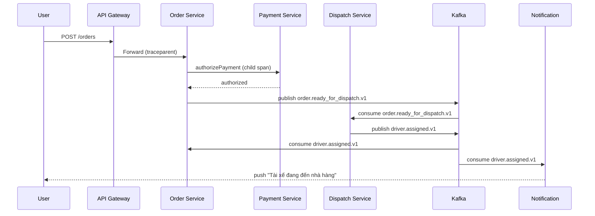

- Sampling 15% bình thường, 100% khi incident.
- Mỗi span ghi lại latency, status, error nếu có.
- Async events (qua Kafka) propagate `traceparent` trong message header để trace xuyên suốt.

**Trace tags bắt buộc:**

| Tag | Ví dụ |
|-----|-------|
| `order.id` | `ORD-20260228-4421` |
| `payment.provider` | `momo` |
| `dispatch.zone` | `hcm-q1` |
| `driver.id` | `DRV-1234` |
| `restaurant.id` | `RST-5678` |
| `user.tier` | `gold` |
| `http.status_code` | `200` |

### 6.5. Alerting & Dashboard

**Alert rules theo severity:**

| Severity | Điều kiện | Kênh | SLA phản hồi |
|----------|-----------|------|--------------|
| `SEV-1` | Order flow down > 5 phút hoặc order success < 97% trong 5 phút | PagerDuty + Phone | 5 phút |
| `SEV-2` | Order success < 99.3% trong 10 phút, payment fail rate > 5%, hoặc dispatch assign P95 > 10s | PagerDuty + Slack | 15 phút |
| `SEV-3` | Tracking lag > 30s hoặc search latency P95 > 500ms | Slack | 30 phút |
| `SEV-4` | Storage > 80% hoặc cert sắp hết hạn | Email + ticket | 4 giờ |

**Alert anti-noise policies:**

- Dùng **multi-window, multi-burn-rate** cho SLO alert (ví dụ: 5% burn trong 1h VÀ 10% burn trong 6h).
- Alert chỉ bắn khi vi phạm liên tục — không bắn spike ngắn < 2 phút.
- Gom alert theo service owner để tránh duplicate.
- Silence alerts trong maintenance window đã lên lịch.
- Review alert fatigue hàng tháng: tắt alert có action rate < 10%.

**Dashboard bắt buộc:**

| Dashboard | Đối tượng | Nội dung |
|-----------|-----------|----------|
| Executive Health | CTO/Product | Total orders, completion rate, GMV/hour |
| Core Ops | SRE/DevOps | Order funnel, bottleneck stage, SLI/SLO |
| Dispatch Deep Dive | Team Dispatch | Assignment time theo zone, driver availability heatmap |
| Payment | Team Payment | Fail reasons theo provider, callback delay |
| Tracking | Team Tracking | Location update lag, stale position rate |

### 6.6. Retention, Sampling và Cost Control

| Telemetry | Hot retention | Cold retention | Sampling |
|-----------|---------------|----------------|----------|
| Access logs | 30 ngày | 180 ngày | 100% |
| App logs | 14 ngày | 90 ngày | 100% ERROR, 20% INFO |
| Traces | 7 ngày | 30 ngày | 15% bình thường, 100% incident |
| Metrics | 15 tháng | - | downsample theo thời gian |

**Nguyên tắc tối ưu chi phí observability:**

- Gắn nhãn `service`/`team` cho tất cả telemetry để **chargeback** chi phí về đúng team.
- Cắt log `DEBUG` ở production sau 24 giờ kể từ release mới.
- Archive logs sang S3 Glacier/Infrequent Access lifecycle policy sau hot retention.
- Tracking location logs chiếm volume lớn nhất (~4.7K msg/s peak) → aggressive sampling 10% cho non-error, 100% cho error/slow.
- Review chi phí observability hàng tháng — target < 5% tổng infra cost.

### 6.7. Incident Runbook: Payment Spike

1. Xác nhận spike theo provider breakdown.
2. Kiểm tra latency và error code (4xx/5xx/timeout).
3. Nếu do provider: mở CB, route sang provider dự phòng hoặc COD.
4. Tạm dừng rollout liên quan payment.
5. Theo dõi SLO burn-rate và cập nhật status page.
6. Postmortem trong 24 giờ.

**Failover matrix (provider outage):**

| Điều kiện | Hành động traffic shift | Điều kiện rollback |
|-----------|-------------------------|--------------------|
| Provider A fail rate > 8% trong 5 phút | Chuyển 70% traffic sang Provider B, 30% COD | Provider A fail rate < 2% trong 15 phút liên tục |
| Provider A timeout P95 > 3s trong 10 phút | Chuyển 50% sang Provider B, giữ 50% A để canary | Timeout P95 < 1s trong 20 phút |
| Cả A và B đều bất ổn | Chỉ mở COD cho nhóm người dùng đủ điều kiện + giới hạn GMV | Một provider phục hồi SLO capture >= 99.8% trong 30 phút |

---

## Phần 7 — Security Architecture

> 🔗 Liên quan: [15-security.md](15-security.md), [16-configuration-secrets-management.md](16-configuration-secrets-management.md), [23-aws-security.md](23-aws-security.md)

### 7.1. AuthN/AuthZ

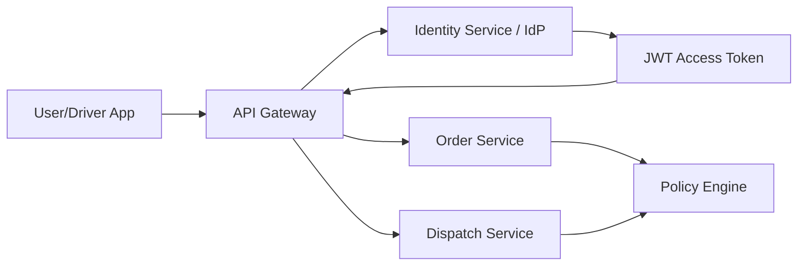

**Luồng chuẩn 5 bước:**

1. User login qua `Identity Service` (OAuth2/OIDC, social login Google/Facebook).
2. Nhận `access_token` (JWT, TTL ngắn 15 phút) + `refresh_token` (rotate mỗi lần dùng).
3. Gateway xác thực chữ ký JWT (public key từ JWKS endpoint).
4. Gateway forward claims cần thiết (`sub`, `role`, `scope`, `user_type`) vào header nội bộ.
5. Service kiểm tra quyền theo policy (RBAC/ABAC) — ví dụ: `driver` chỉ xem đơn mình được assign, `restaurant` chỉ sửa menu của mình.

- **RBAC cho backoffice**: ops, support, finance — mỗi role có scope riêng.
- **User types**: `customer`, `driver`, `restaurant_admin`, `ops_admin`.

### 7.2. Service-to-Service Security

| Control | Áp dụng |
|--------|---------|
| mTLS | Internal service calls |
| IAM role per service | Truy cập AWS resources |
| Network policy/SG | Chặn east-west traffic không hợp lệ |
| API allowlist | Callback/payment endpoints |

### 7.3. Data Protection

| Data type | At rest | In transit | Ghi chú |
|----------|---------|------------|---------|
| User PII | AES-256 (KMS) | TLS 1.2+ | Mask trong log |
| Payment metadata | AES-256 | TLS 1.2+ | Không lưu PAN/CVV |
| Location data | AES-256 | TLS 1.2+ | Retention 30 ngày, sau đó anonymize |
| Secrets/API keys | Secrets Manager | TLS 1.2+ | Auto-rotation 30-90 ngày |
| Backup | Encrypted snapshot | Private network | Cross-account copy |

**Phân loại dữ liệu:**

- `Public`: menu, restaurant info công khai.
- `Internal`: metrics, logs nghiệp vụ thường.
- `Confidential`: hồ sơ người dùng, địa chỉ, phone, driver location.
- `Restricted`: payment token, security events.

### 7.4. API Security Controls

| Mối đe dọa | Control |
|-----------|---------|
| Brute force login | Rate limit 5 req/min/IP + CAPTCHA sau 3 lần fail + lockout 15 phút |
| Token theft | TLS everywhere + JWT TTL 15 phút + rotate refresh token mỗi lần dùng |
| Fake payment callback | HMAC signature + nonce + timestamp check + IP allowlist cho provider |
| Order amount tampering | Server-side price revalidation từ Menu Service, không tin client-side amount |
| Fake driver location | Location validation (speed check, geofence), reject jumps > 200km/h |
| DDoS / L7 flood | AWS WAF + CDN + autoscaling + rate limiting per user + per IP |
| Broken object-level authorization | Check ownership: customer chỉ xem order mình, driver chỉ xem assignment mình |
| Replay attack trên tracking | Timestamp validation, reject location updates cách > 30s so với server time |

### 7.5. Threat Model (STRIDE)

| STRIDE | Ví dụ rủi ro | Mitigation |
|--------|-------------|------------|
| Spoofing | giả callback payment, giả location tài xế | HMAC + nonce + IP allowlist, location speed validation |
| Tampering | sửa amount đơn hàng, sửa ETA | server-side revalidation, signed response |
| Repudiation | chối giao dịch, chối nhận đơn | immutable audit logs + transaction ID |
| Info Disclosure | lộ location người dùng, lộ phone tài xế | field-level masking, proxy phone number |
| DoS | flood checkout giờ cao điểm | rate limit + WAF + queue-based throttling |
| Elevation | người dùng thường gọi admin API, driver sửa order | RBAC + ABAC + policy engine |

### 7.6. Secrets Management

| Loại secret | Nơi lưu | Rotation | Owner |
|------------|---------|----------|-------|
| DB password | AWS Secrets Manager | 30 ngày | Platform team |
| Payment provider key (MoMo/VNPay) | Secrets Manager + KMS | 30 ngày | Payment team |
| JWT signing key | KMS/HSM | 90 ngày | Security team |
| Routing API key (Google Maps) | Secrets Manager | 90 ngày | Dispatch team |
| TLS cert nội bộ | ACM/Cert Manager | 60 ngày | Platform team |
| Push notification key (FCM) | Secrets Manager | 90 ngày | Engagement team |

**Nguyên tắc vận hành:**

- Không hard-code secret trong source code.
- Không truyền secret qua env var nếu runtime hỗ trợ file mount tạm thời.
- Audit toàn bộ truy cập secret qua CloudTrail.
- Pre-commit hook chặn secret commit (gitleaks/detect-secrets).

### 7.7. Security Testing Pipeline

| Giai đoạn | Kiểm thử |
|----------|----------|
| PR | SAST (Semgrep/CodeQL), secret scan (gitleaks) |
| Build | Dependency scan (SCA), container image scan |
| Pre-prod | DAST (OWASP ZAP), API fuzzing |
| Prod định kỳ | Pen-test, cloud config audit (CIS benchmark) |

### 7.8. Compliance Checklist

| Kiểm soát | Trạng thái yêu cầu |
|-----------|--------------------|
| MFA cho tài khoản admin | Bắt buộc |
| Secret rotation tự động | Bắt buộc |
| Immutable audit log | Bắt buộc |
| Không lưu PAN/CVV | Bắt buộc |
| Data masking trong log | Bắt buộc |
| Vulnerability scan định kỳ | Hàng tuần |
| Pen-test độc lập | Ít nhất 1 lần/năm |

### 7.9. Security Incident Response

#### Bảng phân loại mức độ nghiêm trọng (Severity Classification)

| Mức độ | Mô tả | Người chịu trách nhiệm | Thời gian phản hồi | Ví dụ |
|--------|--------|------------------------|---------------------|-------|
| **SEV-1** | Data breach, dữ liệu thanh toán hoặc location bị lộ | Incident Commander + Security Team + CTO | ≤ 15 phút | Rò rỉ driver location data, DB bị exfiltrate |
| **SEV-2** | Unauthorized access được phát hiện | Security Team + Team Lead liên quan | ≤ 30 phút | Tài khoản admin bị chiếm, privilege escalation |
| **SEV-3** | Hoạt động đáng ngờ (brute force, scanning) | Security Team | ≤ 2 giờ | Brute force login, port scanning nội bộ |
| **SEV-4** | Vi phạm policy nhỏ | Tạo ticket, assign owner | Ngày làm việc tiếp theo | Secret không rotate đúng hạn, TLS cert sắp hết hạn |

#### Quy trình 7 bước Incident Response

**Bước 1 — Phát hiện bất thường qua SIEM/alerts**

- **Ai:** Security Team (on-call rotation 24/7).
- **Cách thực hiện:** SIEM tổng hợp log từ CloudTrail, VPC Flow Logs, WAF, GuardDuty. Alert rules tự động trigger khi phát hiện anomaly (ví dụ: số lần login fail > 50/phút, outbound traffic bất thường từ service nào đó).
- **Công cụ:** AWS GuardDuty, CloudWatch Alarms, PagerDuty/Opsgenie.

**Bước 2 — Phân loại mức độ ảnh hưởng (SEV-1..SEV-4)**

- **Ai:** On-call engineer đánh giá ban đầu → Security Lead xác nhận severity.
- **Cách thực hiện:** Dựa vào bảng severity ở trên. Nếu liên quan đến dữ liệu thanh toán hoặc location → tự động escalate lên SEV-1.

**Bước 3 — Cô lập thành phần bị compromise**

- **Ai:** DevOps/Platform Engineer dưới sự chỉ đạo của Incident Commander.
- **Cách thực hiện:**
  - Revoke IAM credentials/session tokens của thành phần bị compromise.
  - Cập nhật Security Group/NACL để block traffic đáng ngờ.
  - Nếu container bị compromise: drain node, terminate pod nhưng **giữ lại snapshot** để forensic.
  - Nếu cần: tạm thời disable API endpoint hoặc feature flag liên quan.

**Bước 4 — Rotate toàn bộ credentials liên quan**

- **Ai:** Security Team + DevOps.
- **Cách thực hiện:**
  - Rotate tất cả API keys, database passwords, JWT signing keys có khả năng bị ảnh hưởng.
  - Invalidate toàn bộ active sessions/tokens liên quan.
  - Cập nhật secrets trong AWS Secrets Manager.
  - Verify các service đã pick up credentials mới thành công.

**Bước 5 — Thu thập forensic logs**

- **Ai:** Security Team.
- **Cách thực hiện:**
  - Export và archive toàn bộ logs liên quan trong khoảng thời gian incident.
  - Tạo timeline chi tiết: thời điểm xâm nhập, lateral movement, dữ liệu bị truy cập.
  - Lưu evidence vào S3 bucket riêng với **write-once policy** (Object Lock).

**Bước 6 — Thông báo stakeholder theo quy định**

- **Ai:** Incident Commander phối hợp với Legal/Compliance.
- **Cách thực hiện:** Theo Communication Matrix bên dưới, thông báo đúng người, đúng thời điểm.

**Bước 7 — Post-incident review + hardening action items**

- **Ai:** Toàn bộ team liên quan, điều phối bởi Engineering Manager.
- **Cách thực hiện:**
  - Tổ chức **blameless post-mortem** trong vòng 48 giờ sau incident.
  - Viết Incident Report: timeline, root cause, impact, action items.
  - Tạo hardening tickets với deadline cụ thể.
  - Cập nhật runbook và alert rules dựa trên bài học rút ra.

#### Communication Matrix

| Mức độ | Team Lead | CTO | Legal/Compliance | Khách hàng bị ảnh hưởng | Toàn bộ công ty |
|--------|-----------|-----|------------------|------------------------|-----------------|
| **SEV-1** | Ngay lập tức | Ngay lập tức | Trong 1 giờ | Trong 24 giờ (sau khi có đánh giá impact) | Sau post-mortem |
| **SEV-2** | Ngay lập tức | Trong 1 giờ | Trong 4 giờ (nếu liên quan dữ liệu) | Nếu cần | Sau post-mortem |
| **SEV-3** | Trong 2 giờ | Báo cáo hàng tuần | Không bắt buộc | Không | Không |
| **SEV-4** | Qua ticket | Không | Không | Không | Không |

#### Ví dụ thực tế: Phát hiện driver location data bị leak

Kịch bản: Monitoring phát hiện lượng request bất thường từ 1 IP address đến Tracking API, query location history của nhiều driver khác nhau.

```
Timeline:

T+0 min    │ GuardDuty alert: Unusual API call pattern trên Tracking Service.
           │ CloudWatch alarm: 500 req/min từ IP 103.x.x.x đến GET /tracking/drivers/{id}/history.
           │
T+3 min    │ On-call xác nhận: request dùng token hợp lệ của tài khoản ops-support.
           │ → Phân loại SEV-1 (location data là Confidential, có thể bị exfiltrate).
           │ → Tạo Slack war room #inc-20260228-location-leak.
           │
T+5 min    │ Incident Commander (Security Lead) join war room.
           │ Thông báo CTO.
           │
T+8 min    │ CÔ LẬP:
           │ - Revoke token của tài khoản ops-support ngay lập tức.
           │ - Block IP 103.x.x.x tại WAF.
           │ - Tạm disable endpoint /tracking/drivers/{id}/history qua feature flag.
           │
T+12 min   │ ROTATE:
           │ - Reset password tài khoản ops-support.
           │ - Force logout toàn bộ session của tài khoản này.
           │ - Rotate JWT signing key (invalidate tất cả token đang lưu hành).
           │
T+20 min   │ FORENSIC:
           │ - Xác định: tài khoản ops-support bị credential stuffing (password reuse từ breach khác).
           │ - Attacker query location history của 847 driver trong 45 phút.
           │ - Không truy cập được payment data hay PII khác (RBAC chặn đúng).
           │ - Archive toàn bộ CloudTrail logs + access logs.
           │
T+30 min   │ THÔNG BÁO:
           │ - CTO: data bị truy cập là driver location (không có payment/PII).
           │ - Legal: đánh giá nghĩa vụ thông báo theo quy định.
           │
T+45 min   │ Incident resolved. Downgrade status.
           │
T+48 giờ   │ POST-MORTEM:
           │ - Root cause: Tài khoản ops dùng password yếu, không bật MFA.
           │ - Action items:
           │     ✅ Bắt buộc MFA cho tất cả tài khoản ops/admin.
           │     ✅ Thêm rate limit per-user cho tracking history API (10 req/min).
           │     ✅ Anonymize driver location history sau 30 ngày.
           │     ✅ Implement IP-based anomaly detection cho admin endpoints.
```

---

## Phần 8 — Infrastructure & Deployment

> 🔗 Áp dụng kiến thức từ [12 — Containerization](12-containerization.md), [13 — Orchestration](13-orchestration.md), [14 — CI/CD](14-cicd-deployment.md), [18 — AWS Deployment Architecture](18-aws-deployment-architecture.md), [24 — AWS CI/CD Deployment](24-aws-cicd-deployment.md)

### 8.1. Mục tiêu nền tảng hạ tầng

- Triển khai độc lập từng service — mỗi team deploy không ảnh hưởng team khác.
- Scale ngang theo tải thực tế — đặc biệt Tracking và Dispatch khi peak lunch/dinner.
- Tự động hóa hạ tầng bằng IaC — không manual provision.
- Quan sát và bảo mật built-in — telemetry + security từ ngày đầu.
- Tối ưu chi phí theo từng giai đoạn tăng trưởng — startup budget, scale dần.

### 8.2. Runtime Strategy

| Workload | Runtime | Lý do |
|----------|---------|-------|
| Core APIs (Order/Payment/Dispatch) | ECS Fargate (baseline) | Cần runtime ổn định, low latency, control scaling và go-live nhanh |
| Tracking ingest burst (GPS data) | ECS + autoscaling | High-write, cần burst absorb 14K drivers × 1 ping/3s |
| Menu/Search API | ECS Fargate (baseline) | Read-heavy, cần tuning CPU/memory |
| Notification fan-out | Lambda | Event-driven, burst traffic, không cần chạy 24/7 |
| Scheduled jobs (reconciliation) | ECS cron/Step Functions | Chạy theo lịch, không cần container luôn sẵn |
| Image processing (menu photos) | Lambda | Sporadic workload, phù hợp pay-per-invocation |

> Baseline triển khai giai đoạn hiện tại là **Hybrid (ECS Fargate + Lambda)**. EKS chỉ là phương án tương lai khi đạt các trigger ở [9.5](#95-khuyến-nghị-cho-fastbite).

### 8.3. Network Topology

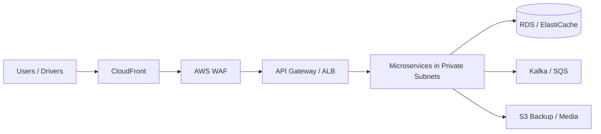

**Thiết kế mạng:**

- Public subnet chỉ chứa edge components (ALB, NAT Gateway) — không đặt service nghiệp vụ.
- Tất cả microservices (Order, Payment, Dispatch, Tracking…) chạy trong private subnet.
- DB, cache (RDS, ElastiCache) chỉ cho phép inbound từ security group của service liên quan — không mở public.
- Egress outbound kiểm soát qua NAT + firewall policy — chỉ allow traffic tới payment providers, map APIs.
- WebSocket endpoint cho driver tracking đi qua ALB với sticky session.

### 8.4. Container Standards

| Tiêu chí | Chuẩn áp dụng |
|----------|---------------|
| Base image | Distroless/Alpine tối giản — giảm attack surface |
| Build | Multi-stage Docker build — tách build dependencies khỏi runtime |
| Security | Run as non-root, read-only filesystem |
| Health check | `/healthz` (liveness), `/readyz` (readiness) rõ ràng |
| Resource limit | CPU/memory request-limit bắt buộc trên mỗi task/pod |
| Artifact | Immutable tag theo commit SHA — không dùng `latest` |

### 8.5. Autoscaling Policy

| Service | Metric scale-out | Min/Max replica | Cooldown |
|---------|------------------|-----------------|----------|
| Gateway | CPU > 60% hoặc RPS > 5K | 3/40 | 60s |
| Order | RPS + active saga count | 4/60 | 90s |
| Payment | In-flight request count | 3/30 | 120s |
| Dispatch | Pending assignment queue depth | 3/40 | 60s |
| Tracking | **GPS write throughput (msg/s)** | 4/80 | 45s |
| Search | P95 latency + CPU > 65% | 3/40 | 60s |
| Kafka consumers | Consumer lag (messages behind) | 2/60 | 45s |

> ⚠️ **Tracking service cần scale policy riêng** vì đặc thù high-write GPS data: 14K drivers online peak × 1 GPS ping mỗi 3 giây = ~4,700 msg/s liên tục. Scale-out dựa trên write throughput (msg/s) thay vì CPU, vì bottleneck là I/O (Redis write + Kafka publish) chứ không phải compute. Cooldown ngắn hơn (45s) để phản ứng nhanh với burst khi drivers bắt đầu ca đồng loạt.

### 8.6. CI/CD Strategy

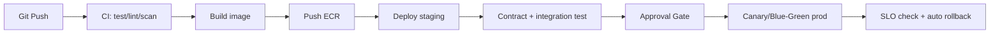

**Gate bắt buộc trước production:**

- Unit test pass 100% (không chấp nhận flaky fail); coverage mục tiêu >= 80% cho service critical.
- Contract test pass 100% — đảm bảo API không break downstream.
- Security scan không có lỗ hổng Critical/High chưa waive.
- Smoke test pass sau deploy — health check + 1 happy-path request.

### 8.7. Deployment Patterns

| Service | Strategy | Lý do |
|---------|----------|-------|
| Gateway | Canary 5% → 25% → 100% | Rủi ro cao, cần quan sát lỗi sớm |
| Order/Payment/Dispatch | Blue-Green | Tránh downtime, rollback nhanh |
| Search/Menu | Rolling update | Chấp nhận rolling vì read-heavy |
| Tracking | Rolling + drain graceful | Tránh mất GPS data đang buffer |
| Kafka consumers | Rolling + drain graceful | Tránh mất message đang xử lý |
| Notification Lambda | Weighted alias canary | Native Lambda deployment control |

### 8.8. DR/Backup Strategy

| Thành phần | RPO | RTO | Chiến lược |
|-----------|-----|-----|------------|
| Order DB | 5 phút | 30 phút | PITR + multi-AZ |
| Payment DB | < 1 phút | 15 phút | Synchronous replica + PITR |
| Dispatch DB | 5 phút | 20 phút | PITR + multi-AZ |
| Tracking stream | 1 phút | 10 phút | Redis Streams replica + AOF + cross-AZ; Kafka mirror chỉ cho fan-out analytics |
| Menu/Catalog DB | 15 phút | 60 phút | Snapshot định kỳ |
| Object storage (ảnh menu) | gần 0 | 15 phút | Versioning + cross-region replication |

**BCP thực tế cho peak hours (lunch/dinner):**

- Freeze deploy trước khung 11:00-13:00 và 17:00-20:00 — không deploy bất kỳ service nào.
- Pre-scale capacity lên 2x baseline trước peak 30 phút (scheduled scaling).
- War-room trực chiến nếu có campaign lớn (Product + Eng + SRE).
- Chuẩn bị runbook rollback trong 1 lệnh — blue-green switch < 1 phút.
- Nếu Dispatch service gặp sự cố peak hours: bật fallback zone-based assignment thay vì optimal matching.

### 8.9. IaC Structure

| Layer | Công cụ | Quy tắc |
|-------|---------|---------|
| VPC, subnet, SG, IAM | Terraform/CDK | Tách module reusable |
| ECS/EKS services | Terraform/CDK + Helm (nếu EKS) | Mỗi service 1 module/chart |
| Data layer (RDS, ElastiCache, Kafka) | Terraform | Backup policy bắt buộc |
| CI/CD pipelines | Terraform + GitHub Actions templates | Chuẩn hóa theo service type |

### 8.10. Environment Promotion Flow

1. Merge vào `main` → deploy `dev` tự động.
2. Tag release → deploy `staging`.
3. Contract/integration/perf smoke pass → approval gate.
4. Deploy `prod` theo canary/blue-green.
5. Auto rollback nếu SLO burn-rate vượt ngưỡng.
6. Artifact immutable — tuyệt đối không rebuild giữa các môi trường.

---

## Phần 9 — So sánh lựa chọn hạ tầng

### 9.1. Options

#### Solution A: ECS Fargate-first

**Kiến trúc tổng quan:** Tất cả microservices (Order, Payment, Dispatch, Tracking, Menu…) đều chạy trên **Amazon ECS với launch type Fargate**. AWS quản lý hoàn toàn infrastructure layer — không cần provision hay patch EC2 instance. Mỗi service đóng gói Docker container, định nghĩa Task Definition, deploy qua ECS Service với ALB phía trước.

```
┌─────────────────────────────────────────────────┐
│                   ALB / API Gateway             │
├──────────┬──────────┬──────────┬────────────────┤
│ Order    │ Payment  │ Dispatch │ Tracking       │
│ (Fargate)│ (Fargate)│ (Fargate)│ (Fargate)      │
└──────────┴──────────┴──────────┴────────────────┘
         Tất cả services → ECS Fargate
```

- **Ưu điểm:**
  - Đơn giản vận hành — không quản lý cluster node, không lo patching OS
  - Thời gian go-live nhanh — team chỉ cần biết Docker + ECS Task Definition
  - Auto Scaling tích hợp sẵn ở mức task, kết hợp CloudWatch metrics
  - Bảo mật tốt — mỗi task chạy isolated, có riêng ENI

- **Nhược điểm:**
  - Chi phí cao hơn EC2 15-30% cho workload stable chạy 24/7 (Tracking service chạy liên tục)
  - Ít flexibility về networking và runtime — khó can thiệp sâu vào host OS
  - Không phù hợp cho workload cần GPU (ML route optimization)
  - Vendor lock-in cao hơn so với Kubernetes

#### Solution B: EKS-first

**Kiến trúc tổng quan:** Tất cả microservices chạy trên **Amazon EKS**. Team quản lý Kubernetes cluster, sử dụng Helm charts để deploy. Mỗi service là Deployment + Service + Ingress, với HPA để auto-scale.

```
┌─────────────────────────────────────────────────┐
│              Ingress Controller (ALB/Nginx)       │
├──────────┬──────────┬──────────┬────────────────┤
│ Order    │ Payment  │ Dispatch │ Tracking       │
│ (Pod)    │ (Pod)    │ (Pod)    │ (Pod)          │
├──────────┴──────────┴──────────┴────────────────┤
│            EKS Cluster (Managed Node Groups)     │
└─────────────────────────────────────────────────┘
         Tất cả services → Kubernetes Pods
```

- **Ưu điểm:**
  - Linh hoạt cao nhất — toàn quyền kiểm soát networking (Service Mesh, Network Policy), scheduling
  - Ecosystem cực lớn — Helm charts, Operators, CNCF tooling
  - Portable — migrate sang GKE, AKS khi cần multi-cloud
  - Chi phí compute tối ưu sâu với Spot Instances, Karpenter, bin-packing pods

- **Nhược điểm:**
  - Cần team platform có kinh nghiệm Kubernetes — ít nhất 2-3 người hiểu sâu K8s
  - Chi phí control plane cố định (~$73/tháng/cluster), cộng nhân sự vận hành
  - Learning curve cao — YAML manifests phức tạp, debugging pod failures khó hơn
  - Thời gian go-live chậm hơn — setup cluster + add-ons mất 2-4 tuần

#### Solution C: Hybrid (ECS cho core + Lambda cho event-driven)

**Kiến trúc tổng quan:** Phân loại workload và chọn compute phù hợp nhất cho từng loại. **Core API services** (request-response, cần low latency) deploy trên **ECS Fargate**. **Event-driven và burst workloads** (notification, image processing) chạy trên **Lambda**.

```
┌─────────────────────────────────────────────────────┐
│                  ALB / API Gateway                  │
├──────────┬──────────┬──────────┬──────────┐         │
│ Order    │ Payment  │ Dispatch │ Tracking │← Fargate│
│ (Fargate)│ (Fargate)│ (Fargate)│ (Fargate)│ (core)  │
├──────────┴──────────┴──────────┴──────────┤         │
│                                           │         │
│  SQS/SNS/EventBridge triggers             │         │
│  ┌────────────┬───────────┐               │         │
│  │Notification│ Image     │  ← Lambda     │         │
│  │ (Lambda)   │ Resize    │   (event)     │         │
│  │            │ (Lambda)  │               │         │
│  └────────────┴───────────┘               │         │
└─────────────────────────────────────────────────────┘
```

- **Ưu điểm:**
  - Tối ưu chi phí theo từng loại workload — Lambda chỉ tính tiền khi thực thi
  - Balance giữa simplicity (ECS cho core) và cost-efficiency (Lambda cho event-driven)
  - Giảm operational overhead so với EKS nhưng linh hoạt hơn ECS thuần túy
  - Lộ trình migration rõ ràng — bắt đầu đơn giản, phức tạp hóa khi cần

- **Nhược điểm:**
  - Phải quản lý 2 compute platform (ECS + Lambda) — cần chuẩn hóa CI/CD cho cả hai
  - Lambda có cold start latency (100-500ms), không phù hợp cho real-time API
  - Governance phức tạp hơn — cần decision framework rõ ràng khi nào dùng ECS, khi nào Lambda

### 9.2. So sánh định tính

| Tiêu chí | Solution A: ECS Fargate | Solution B: EKS | Solution C: Hybrid (ECS + Lambda) |
|----------|--------------------------|-----------------|------------------------------------|
| Độ phức tạp vận hành | Thấp-Trung bình | Cao | Trung bình |
| Chi phí nền tảng ban đầu | Trung bình | Cao (team + control plane) | Trung bình |
| Tốc độ go-live | Nhanh | Chậm hơn | Nhanh-Trung bình |
| Khả năng custom networking/runtime | Trung bình | Rất cao | Cao |
| Học tập cho team | Dễ hơn | Khó hơn | Trung bình |
| Phù hợp team 25 dev | ✅ tốt | ⚠️ cần team platform mạnh | ✅ tốt nếu governance rõ |
| Phù hợp phase 1 | ✅ | ⚠️ | ✅ |
| Phù hợp scale rất lớn dài hạn | ⚠️ | ✅ | ✅ |
| Xử lý GPS high-write (Tracking) | ⚠️ chi phí cao | ✅ Spot + bin-packing | ✅ ECS + autoscaling |

### 9.3. Ước lượng chi phí tương đối

| Thành phần | A: ECS Fargate | B: EKS | C: Hybrid |
|-----------|-----------------|--------|-----------|
| Compute core APIs | 1.0x | 0.8x-1.1x (tùy tối ưu node) | 0.9x |
| Tracking high-write | 1.0x | 0.7x (Spot friendly) | 0.9x |
| Ops overhead nhân sự | 1.0x | 1.4x | 1.2x |
| Event workloads | 1.0x | 1.0x | 0.6x-0.9x (Lambda phù hợp burst) |
| **Tổng giai đoạn đầu** | **1.0x (baseline)** | **1.2x-1.4x** | **0.95x-1.15x** |

> Ghi chú: Đây là estimate tương đối để ra quyết định kiến trúc ban đầu. Cost thực tế phụ thuộc traffic, data transfer, reserved plans, và mức tối ưu workload.

### 9.4. Weighted Decision Matrix

| Tiêu chí | Trọng số | ECS | EKS | Hybrid |
|----------|----------|-----|-----|--------|
| Time-to-market | 25% | 9 | 6 | 8 |
| Ops complexity | 20% | 8 | 6 | 7 |
| Cost giai đoạn đầu | 20% | 8 | 6 | 8 |
| Scalability dài hạn | 20% | 7 | 9 | 8 |
| Team readiness | 15% | 8 | 6 | 8 |
| **Điểm tổng** | 100% | **8.05** | **6.60** | **7.80** |

### 9.5. Khuyến nghị cho FastBite

**Khuyến nghị:** chọn **Solution C (Hybrid)** — ECS Fargate cho core APIs + Lambda cho event-driven workloads.

#### Tại sao Hybrid phù hợp nhất với bối cảnh FastBite?

FastBite là startup với **team 25 backend engineers**, có kinh nghiệm backend nhưng **chưa có chuyên môn Kubernetes**. Trong bối cảnh này:

| Yếu tố bối cảnh | Ảnh hưởng tới quyết định |
|------------------|--------------------------|
| Team 25 dev, chưa có K8s experience | Loại bỏ Solution B (EKS) ở giai đoạn đầu — learning curve quá cao |
| Startup budget, cần tối ưu chi phí | Hybrid cho phép dùng Lambda cho burst workloads thay vì Fargate 24/7 |
| Cần go-live nhanh (target < 3 tháng Phase 1) | ECS Fargate setup nhanh hơn EKS 2-4 tuần |
| Traffic pattern không đều — peak lunch/dinner, thấp lúc 2-5h sáng | Lambda auto-scale to zero cho event workloads, Fargate auto-scale cho core |

#### Chi tiết mapping Service → Compute Platform

| Service | Compute | Lý do |
|---------|---------|-------|
| **Order Service** | ECS Fargate | Core business flow, cần low latency ổn định, chạy liên tục |
| **Payment Service** | ECS Fargate | Xử lý giao dịch tài chính, cần connection pool tới Payment Gateway |
| **Dispatch Service** | ECS Fargate | Matching tài xế real-time, cần latency < 200ms, long-running computation |
| **Tracking Service** | ECS Fargate | High-write GPS ingest liên tục, cần giữ connection tới Redis/Kafka |
| **Menu/Catalog Service** | ECS Fargate | Read-heavy, serve qua cache, cần response ổn định |
| **Search Service** | ECS Fargate | Query OpenSearch, CPU burst khi indexing |
| **Identity/User Service** | ECS Fargate | Authentication flow cần latency thấp |
| **Notification Service** | Lambda | Event-driven trigger từ SQS, burst traffic, không cần chạy 24/7 |
| **Image Processing** | Lambda | Resize ảnh menu khi upload, sporadic workload |
| **Webhook Handler** | Lambda | Nhận webhook từ Payment providers, traffic không dự đoán |
| **Report Generation** | Lambda | Tạo báo cáo theo schedule, chạy vài lần/ngày |

#### Khi nào FastBite nên cân nhắc migrate sang EKS?

Không cần migrate sang EKS trừ khi gặp **ít nhất 2 trong 4 triggers** sau:

| Trigger | Mô tả | Ngưỡng cụ thể |
|---------|--------|----------------|
| **Số lượng services lớn** | Quản lý hàng trăm ECS services trở nên khó khăn | > 80 microservices |
| **Cần custom operators** | Yêu cầu tự động hóa phức tạp: ML model serving, custom autoscaler cho GPS workload | Khi built-in ECS/Lambda không đáp ứng |
| **Multi-cloud requirement** | Business yêu cầu chạy trên nhiều cloud provider | Có yêu cầu rõ ràng từ stakeholder |
| **Team platform trưởng thành** | Đã có team platform 3-5 người với production K8s experience | Team platform ≥ 3 người có CKA/CKAD |

> **Lưu ý:** Migration sang EKS không phải là mục tiêu — mà là công cụ khi ECS/Lambda không còn đáp ứng được nhu cầu.

### 9.6. Migration Path 18 tháng

| Giai đoạn | Thời gian | Trọng tâm | Kết quả |
|-----------|-----------|-----------|---------|
| Phase 1 | 0-3 tháng | Gateway + Identity + Search + Menu | Monolith giảm tải 30-40% |
| Phase 2 | 3-9 tháng | Cart/Order/Payment chuyển microservices | Core flow độc lập |
| Phase 3 | 9-14 tháng | Dispatch/Tracking + autoscaling tuning | Scale độc lập cho real-time workload |
| Phase 4 | 14-18 tháng | Cost optimization + platform hardening | Nền tảng ổn định dài hạn |

**Mapping với roadmap chi tiết ở [2.6](#26-strangler-fig-migration-plan):**

- 9.6 là bản rút gọn theo năng lực hạ tầng và vận hành.
- Phase 1-3 tương ứng các phase Foundation -> Core Migration ở 2.6.
- Phase 4 tương ứng hardening/optimize sau khi hoàn tất tách service chính.

---

## Phần 10 — ADR & Execution Plan

### 10.1. ADR chính

| ADR # | Quyết định | Lý do | Alternatives đã cân nhắc |
|-------|------------|-------|---------------------------|
| ADR-001 | Decompose theo Business Capability + Bounded Context | Ranh giới nghiệp vụ rõ, phù hợp team ownership | Tách theo technical layer |
| ADR-002 | Database per Service | Giảm coupling dữ liệu, tăng autonomy | Shared database |
| ADR-003 | Saga Orchestration cho order lifecycle | Compensating action rõ ràng, dễ debug/monitor | Choreography thuần event |
| ADR-004 | Transactional Outbox bắt buộc cho critical services | Tránh dual-write inconsistency | 2PC, publish trực tiếp sau commit |
| ADR-005 | Idempotency-Key bắt buộc cho create-order/payment | Tránh double charge, safe retry | Best-effort only |
| ADR-006 | CQRS cho Search/Tracking | Read-heavy, cần query tối ưu khác write model | Single model duy nhất |
| ADR-007 | Sync + Async hybrid communication | Cân bằng latency và reliability | Sync-only hoặc async-only |
| ADR-008 | Defense-in-depth resilience stack | Ngăn cascading failure cho peak hours | Chỉ dùng retry cơ bản |
| ADR-009 | Zero Trust + mTLS + IAM per service | Tăng security posture nội bộ | Shared static credentials |
| ADR-010 | Hybrid ECS + Lambda runtime | Go-live nhanh + tối ưu burst cost | ECS-only, EKS-only |

### 10.2. ADR template đề xuất

| Trường | Nội dung cần có |
|--------|-----------------|
| `Title` | Tên quyết định |
| `Status` | Proposed / Accepted / Deprecated |
| `Context` | Bối cảnh nghiệp vụ và kỹ thuật |
| `Decision` | Quyết định cụ thể |
| `Consequences` | Lợi ích, trade-off, rủi ro |
| `Alternatives` | Các phương án đã loại |
| `Date` | Ngày quyết định |
| `Owners` | Team/người phụ trách |

### 10.3. Trade-off tổng thể

| Quyết định | Lợi ích | Trade-off |
|-----------|---------|-----------|
| Tách nhiều services ngay từ đầu | Autonomy cao, deploy độc lập | Tăng vận hành và quan sát |
| Saga thay vì transaction phân tán | Scale tốt, linh hoạt compensate | Eventual consistency + debug khó hơn |
| Hybrid compute (ECS + Lambda) | Tối ưu chi phí theo workload | Governance phức tạp hơn (2 platform) |
| CQRS có chọn lọc (Search, Tracking) | Tối ưu read path, tách concern | Tăng đồng bộ dữ liệu, eventual lag |
| GPS data qua Redis Streams + Kafka fan-out | High throughput, tách ingest và analytics | Tăng độ phức tạp vận hành 2 lớp stream |
| Zone-based fallback cho Dispatch | Không mất đơn khi algorithm down | Matching quality giảm (ETA kém hơn) |

### 10.4. 90-day Plan

| Tuần | Deliverable | Owner |
|------|-------------|-------|
| 1-2 | Platform baseline: gateway, auth, logging/metrics/tracing SDK | Platform |
| 3-4 | Merchant/Menu/Search services + CDC pipeline | Discovery |
| 5-6 | Cart/Promotion + rate limiting middleware | Core Commerce |
| 7-8 | Order + Payment + Outbox + callback idempotency | Core Commerce |
| 9-10 | Dispatch + Tracking + zone-based fallback | Delivery Ops |
| 11-12 | SLO dashboard, runbook, game day, production cutover | Platform/SRE |

### 10.5. KPI thành công

| KPI | Trước migration | Mục tiêu sau migration |
|-----|-----------------|------------------------|
| Deploy frequency | 2 lần/tháng | >= 20 lần/tháng |
| Lead time for change | 5-10 ngày | < 1 ngày |
| MTTR | 3 giờ | < 30 phút |
| Order success rate peak | 96-97% | >= 99.5% |
| Driver assignment <= 10s | ~85% | >= 98% |
| P95 API latency | 400-600ms | < 250ms |
| Downtime mỗi lần release | 45-90 phút | ~0 (zero-downtime) |

**Definition of Done cho mỗi service migration:**

- Contract test pass — API không break downstream consumers.
- SLO + alert + dashboard đã bật trên production.
- Runbook incident có owner trực (team + on-call rotation).
- Rollback test thành công trên staging — switch < 1 phút.
- Logging/metrics/tracing integrated với central observability stack.

### 10.6. Kết luận case study

Thiết kế này giúp FastBite:

- Chuyển từ monolith sang kiến trúc microservice có lộ trình rõ ràng, giảm rủi ro big-bang rewrite.
- Tập trung đầu tư vào core domain (`Order`, `Payment`, `Dispatch`) nơi tạo khác biệt cạnh tranh trong thị trường food delivery.
- Đảm bảo scale cho peak lunch/dinner bằng event-driven architecture, autoscaling policy riêng cho từng workload (đặc biệt Tracking GPS high-write).
- Tăng độ tin cậy vận hành thông qua observability đầy đủ (logs + metrics + traces) và SLO-driven operations.
- Giải quyết bài toán real-time delivery bằng Dispatch matching + Tracking stream, driver assignment < 10 giây cho 98%+ đơn hàng.
- Đáp ứng bảo mật thực chiến với Zero Trust, mTLS, secrets rotation và security testing liên tục.

### 10.7. Risk Register

| Risk | Ảnh hưởng | Mitigation |
|------|-----------|------------|
| Dispatch logic mới làm tăng unassigned rate | Mất đơn giờ cao điểm | Shadow test + gradual rollout + zone-based fallback |
| Payment provider outage | Mất doanh thu ngắn hạn | Multi-provider + circuit breaker + fallback COD |
| Event schema breaking change | Consumer fail hàng loạt | Schema registry + compatibility gate |
| Team chưa quen microservices ops | MTTR tăng | Training + runbook + game day |
| GPS tracking data loss khi Redis Streams down | Mất vị trí tài xế real-time | Redis replica + AOF + local buffer trên device + reconnect retry |

---

## Liên kết liên quan

- [01 — Microservice Overview](01-microservice-overview.md)
- [02 — Single Responsibility & Bounded Context](02-single-responsibility-bounded-context.md)
- [05 — Decomposition Strategies](05-decomposition-strategies.md)
- [06 — Inter-Service Communication](06-inter-service-communication.md)
- [07 — API Gateway](07-api-gateway.md)
- [08 — Service Discovery](08-service-discovery.md)
- [09 — Data Management](09-data-management.md)
- [10 — Resilience Patterns](10-resilience-patterns.md)
- [11 — Observability & Evolvability](11-observability-evolvability.md)
- [12 — Containerization](12-containerization.md)
- [13 — Orchestration](13-orchestration.md)
- [14 — CI/CD Deployment](14-cicd-deployment.md)
- [15 — Security](15-security.md)
- [16 — Configuration & Secrets Management](16-configuration-secrets-management.md)
- [17 — Design Patterns](17-design-patterns.md)
- [18 — AWS Deployment Architecture](18-aws-deployment-architecture.md)
- [19 — AWS Communication & Discovery](19-aws-communication-discovery.md)
- [20 — AWS Data Management](20-aws-data-management.md)
- [21 — AWS Resilience](21-aws-resilience.md)
- [22 — AWS Observability](22-aws-observability.md)
- [23 — AWS Security](23-aws-security.md)
- [24 — AWS CI/CD Deployment](24-aws-cicd-deployment.md)
