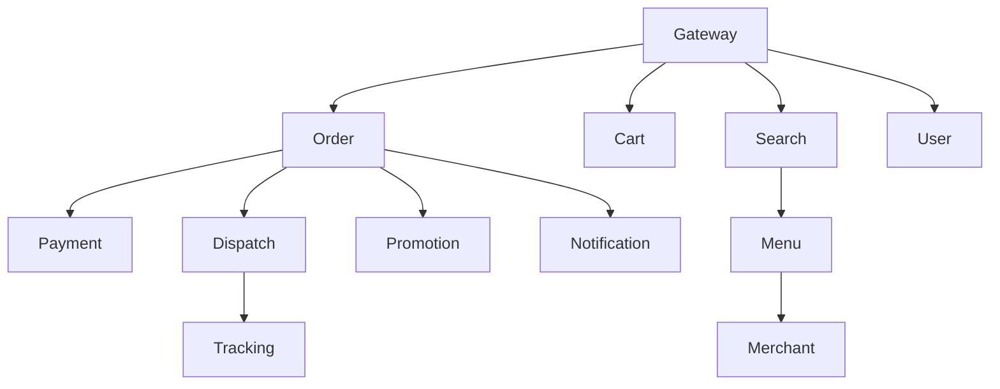
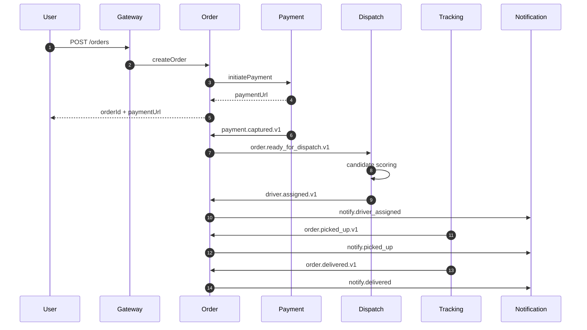
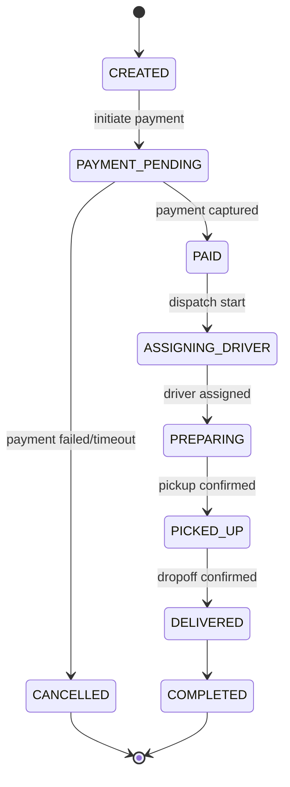
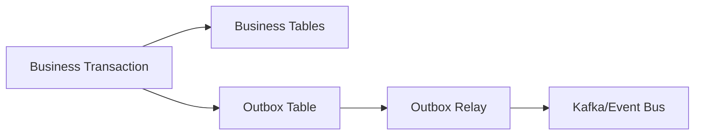
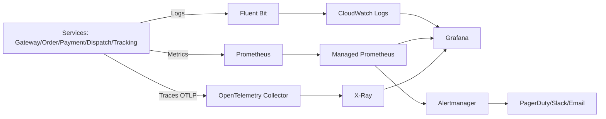
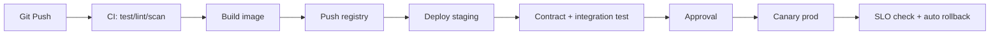

# 🛵 Case Study: Thiết kế kiến trúc Microservice cho Food Delivery Platform

## 📋 Mục lục

- [Đề bài](#đề-bài)
  - [Bối cảnh](#bối-cảnh)
  - [Quy mô hệ thống](#quy-mô-hệ-thống)
  - [Module hiện tại trong Monolith](#module-hiện-tại-trong-monolith)
- [Yêu cầu chức năng (Functional Requirements)](#yêu-cầu-chức-năng-functional-requirements)
- [Yêu cầu phi chức năng (Non-Functional Requirements)](#yêu-cầu-phi-chức-năng-non-functional-requirements)
- [Phần 1 — Domain & Bounded Context](#phần-1--domain--bounded-context)
  - [1.1. Subdomain Classification](#11-subdomain-classification)
  - [1.2. Bounded Context Mapping](#12-bounded-context-mapping)
  - [1.3. Ubiquitous Language](#13-ubiquitous-language)
  - [1.4. Context Map Patterns](#14-context-map-patterns)
  - [1.5. Event Storming cho Place Order](#15-event-storming-cho-place-order)
  - [1.6. Domain Invariants](#16-domain-invariants)
  - [1.7. Ownership Matrix](#17-ownership-matrix)
- [Phần 2 — Service Decomposition](#phần-2--service-decomposition)
  - [2.1. Nguyên tắc tách service](#21-nguyên-tắc-tách-service)
  - [2.2. Service Catalog chi tiết](#22-service-catalog-chi-tiết)
  - [2.3. Dependency Graph](#23-dependency-graph)
  - [2.4. API Contracts quan trọng](#24-api-contracts-quan-trọng)
  - [2.5. Team Ownership & Topology](#25-team-ownership--topology)
  - [2.6. Strangler Fig Migration Plan](#26-strangler-fig-migration-plan)
  - [2.7. Release Governance](#27-release-governance)
  - [2.8. Endpoint Matrix (Core APIs)](#28-endpoint-matrix-core-apis)
  - [2.9. Error Code Catalog](#29-error-code-catalog)
- [Phần 3 — Inter-Service Communication](#phần-3--inter-service-communication)
  - [3.1. Decision framework: Sync vs Async](#31-decision-framework-sync-vs-async)
  - [3.2. Communication Matrix](#32-communication-matrix)
  - [3.3. Event Catalog & Versioning](#33-event-catalog--versioning)
  - [3.4. Idempotency & Delivery Semantics](#34-idempotency--delivery-semantics)
  - [3.5. Sequence Diagram: End-to-End Delivery Flow](#35-sequence-diagram-end-to-end-delivery-flow)
  - [3.6. Broker Topology, Retry và DLQ](#36-broker-topology-retry-và-dlq)
  - [3.7. Event Payload Samples (JSON)](#37-event-payload-samples-json)
- [Phần 4 — Data Management & Patterns](#phần-4--data-management--patterns)
  - [4.1. Database per Service](#41-database-per-service)
  - [4.2. Saga Orchestration cho Order Lifecycle](#42-saga-orchestration-cho-order-lifecycle)
  - [4.3. Outbox Pattern](#43-outbox-pattern)
  - [4.4. CQRS cho Search/Tracking](#44-cqrs-cho-searchtracking)
  - [4.5. Schema mẫu (Order/Dispatch)](#45-schema-mẫu-orderdispatch)
  - [4.6. Reconciliation Jobs](#46-reconciliation-jobs)
  - [4.7. Data Consistency Rules](#47-data-consistency-rules)
- [Phần 5 — Resilience & Reliability](#phần-5--resilience--reliability)
  - [5.1. Reliability Goals](#51-reliability-goals)
  - [5.2. Circuit Breaker/Retry/Timeout](#52-circuit-breakerretrytimeout)
  - [5.3. Bulkhead & Rate Limiting](#53-bulkhead--rate-limiting)
  - [5.4. Capacity Planning cho giờ cao điểm](#54-capacity-planning-cho-giờ-cao-điểm)
  - [5.5. Runbook SEV-1: Không ghép được tài xế](#55-runbook-sev-1-không-ghép-được-tài-xế)
  - [5.6. Chaos Engineering Plan](#56-chaos-engineering-plan)
  - [5.7. Defense in Depth](#57-defense-in-depth)
- [Phần 6 — Observability](#phần-6--observability)
  - [6.1. Telemetry Architecture](#61-telemetry-architecture)
  - [6.2. Metrics & SLO](#62-metrics--slo)
  - [6.3. Logging Standard](#63-logging-standard)
  - [6.4. Distributed Tracing](#64-distributed-tracing)
  - [6.5. Alerting & Dashboard](#65-alerting--dashboard)
  - [6.6. Retention, Sampling và Cost Control](#66-retention-sampling-và-cost-control)
  - [6.7. Incident Runbook: Payment Spike](#67-incident-runbook-payment-spike)
- [Phần 7 — Security Architecture](#phần-7--security-architecture)
  - [7.1. AuthN/AuthZ](#71-authnauthz)
  - [7.2. Service-to-Service Security](#72-service-to-service-security)
  - [7.3. Data Protection](#73-data-protection)
  - [7.4. Threat Model (STRIDE)](#74-threat-model-stride)
  - [7.5. Security Testing Pipeline](#75-security-testing-pipeline)
  - [7.6. Compliance Checklist](#76-compliance-checklist)
  - [7.7. Security Incident Response](#77-security-incident-response)
- [Phần 8 — Infrastructure & Deployment](#phần-8--infrastructure--deployment)
  - [8.1. Runtime Strategy](#81-runtime-strategy)
  - [8.2. Network Topology](#82-network-topology)
  - [8.3. CI/CD Strategy](#83-cicd-strategy)
  - [8.4. Deployment Patterns](#84-deployment-patterns)
  - [8.5. DR/Backup Strategy](#85-drbackup-strategy)
  - [8.6. IaC Structure](#86-iac-structure)
  - [8.7. Environment Promotion Flow](#87-environment-promotion-flow)
- [Phần 9 — So sánh lựa chọn hạ tầng](#phần-9--so-sánh-lựa-chọn-hạ-tầng)
  - [9.1. Options](#91-options)
  - [9.2. Weighted Decision Matrix](#92-weighted-decision-matrix)
  - [9.3. Khuyến nghị cho FastBite](#93-khuyến-nghị-cho-fastbite)
  - [9.4. Migration Path 18 tháng](#94-migration-path-18-tháng)
- [Phần 10 — ADR & Execution Plan](#phần-10--adr--execution-plan)
  - [10.1. ADR chính](#101-adr-chính)
  - [10.2. 90-day Plan](#102-90-day-plan)
  - [10.3. KPI thành công](#103-kpi-thành-công)
  - [10.4. Risk Register](#104-risk-register)
- [Liên kết liên quan](#liên-kết-liên-quan)

---

## Đề bài

### Bối cảnh

Công ty **FastBite** đang vận hành nền tảng giao đồ ăn qua một Monolith xây từ 4 năm trước. Hệ thống đã tăng trưởng nhanh về user và merchant nhưng đang gặp các vấn đề:

- Mỗi đợt lunch/dinner peak xuất hiện nghẽn `Order` và `Dispatch`.
- Deploy toàn khối mất 45-90 phút, rủi ro downtime cao.
- Team 25 backend engineers làm chung một repo gây conflict liên tục.
- Khó tích hợp thuật toán route optimization (Python/ML) trong stack cũ.

### Quy mô hệ thống

| Metric | Giá trị |
|--------|---------|
| User đăng ký | 3.5 triệu |
| MAU | 1.1 triệu |
| Đơn/ngày | 120,000 |
| Peak order/min | 2,400 |
| Nhà hàng đối tác | 18,000 |
| Tài xế online peak | 14,000 |
| SLA tạo đơn | < 2 giây |
| SLA ghép tài xế | < 10 giây |
| Vùng hoạt động | 8 thành phố lớn |

### Module hiện tại trong Monolith

```
┌───────────────────────────────────────────────────────────┐
│                    FASTBITE MONOLITH                     │
│                                                           │
│ User | Restaurant | Menu | Search | Cart                 │
│ Order | Payment | Dispatch | Driver Tracking             │
│ Promo | Notification | Review | Support                  │
│                                                           │
│             Single PostgreSQL + Redis shared             │
└───────────────────────────────────────────────────────────┘
```

---

## Yêu cầu chức năng (Functional Requirements)

| # | Chức năng | Mô tả |
|---|-----------|-------|
| F1 | User & Auth | Đăng ký/đăng nhập, social login, profile, địa chỉ |
| F2 | Restaurant Catalog | Danh sách nhà hàng, giờ mở cửa, trạng thái online |
| F3 | Menu Management | Menu theo chi nhánh, option/topping, hết món theo giờ |
| F4 | Search & Filter | Tìm món/quán, lọc theo thời gian giao, giá, đánh giá |
| F5 | Cart | Thêm/sửa món, custom option, tính giá tạm |
| F6 | Order Management | Tạo đơn, trạng thái đơn, hủy đơn có điều kiện |
| F7 | Payment | COD, card, e-wallet, refund toàn phần/một phần |
| F8 | Dispatch | Ghép tài xế tối ưu (ETA + cost + fairness) |
| F9 | Driver Tracking | Cập nhật vị trí real-time, hiển thị ETA |
| F10 | Promotion | Voucher, freeship, campaign theo khung giờ |
| F11 | Notification | Push/SMS/email theo trạng thái đơn |
| F12 | Review & Support | Đánh giá sau đơn hoàn thành, mở ticket khiếu nại |

**Ví dụ thực tế:** user đặt combo trưa lúc 11:45, hệ thống cần hoàn thành `create order -> payment authorize -> assign driver` trong < 10 giây để tránh drop-off.

---

## Yêu cầu phi chức năng (Non-Functional Requirements)

| # | Yêu cầu | Mục tiêu |
|---|---------|----------|
| NF1 | Availability | 99.95% |
| NF2 | Scalability | 12x peak giờ trưa/tối |
| NF3 | Performance | P95 API < 250ms |
| NF4 | Consistency | Strong cho order/payment, eventual cho search/review |
| NF5 | Security | OWASP Top 10, token security, PCI scope reduction |
| NF6 | Deployability | Zero-downtime, rollback < 5 phút |
| NF7 | Observability | Logs + Metrics + Traces + alert theo SLO |
| NF8 | Cost | Tối ưu chi phí burst traffic |

---

## Phần 1 — Domain & Bounded Context

> 🔗 Liên quan: [02-single-responsibility-bounded-context.md](02-single-responsibility-bounded-context.md), [05-decomposition-strategies.md](05-decomposition-strategies.md)

### 1.1. Subdomain Classification

| Subdomain | Loại | Lý do |
|-----------|------|-------|
| Order | Core | Trải nghiệm đặt món là trung tâm của conversion |
| Dispatch | Core | Ảnh hưởng trực tiếp ETA, chi phí và retention |
| Payment | Core | Doanh thu và rủi ro tài chính |
| Menu/Catalog | Supporting | Dữ liệu lớn, cập nhật liên tục |
| Fleet Tracking | Supporting | Tăng UX qua vị trí real-time |
| Promotion | Supporting | Tăng conversion giờ thấp điểm |
| Notification | Generic | Có thể dùng dịch vụ managed |
| Identity | Generic | Pattern chuẩn, dễ commodity |

### 1.2. Bounded Context Mapping

| BC | Aggregate chính | Dữ liệu sở hữu |
|----|------------------|----------------|
| Identity BC | `User`, `Session` | auth/token/profile |
| Merchant BC | `Restaurant`, `Branch` | thông tin quán, SLA |
| Menu BC | `Menu`, `MenuItem`, `OptionSet` | món, giá, availability |
| Cart BC | `Cart`, `CartItem` | cart state |
| Order BC | `Order`, `OrderLine`, `OrderState` | lifecycle đơn |
| Payment BC | `Payment`, `PaymentAttempt`, `Refund` | giao dịch thanh toán |
| Dispatch BC | `Assignment`, `CandidateScore` | matching tài xế |
| Tracking BC | `DriverLocation`, `Trip` | stream vị trí |
| Promotion BC | `Voucher`, `Campaign` | rules + usage |
| Engagement BC | `Notification`, `Template` | lịch sử gửi |
| Trust BC | `Review`, `Rating` | điểm đánh giá |
| Support BC | `Ticket`, `Resolution` | khiếu nại |

### 1.3. Ubiquitous Language

| Thuật ngữ | Định nghĩa |
|----------|------------|
| `OrderPlaced` | Đơn đã được tạo thành công |
| `RestaurantAccepted` | Quán đã nhận và chuẩn bị món |
| `DriverAssigned` | Dispatch đã ghép tài xế |
| `PickupETA` | ETA tài xế tới quán |
| `DropoffETA` | ETA tài xế tới user |
| `AssignmentTimeout` | Quá thời gian mà chưa ghép được tài xế |
| `SurgeZone` | Khu vực nhu cầu cao cần incentive |
| `PartialRefund` | Hoàn một phần tiền đơn |

### 1.4. Context Map Patterns

| Upstream | Downstream | Pattern | Mô tả |
|----------|------------|---------|-------|
| Menu | Search | Conformist | Search dùng model do Menu publish |
| Order | Payment | Customer-Supplier | Order yêu cầu API theo workflow checkout |
| Order | Dispatch | Customer-Supplier | Dispatch nhận signal sau payment success |
| Payment | e-wallet providers | Anti-Corruption Layer | Chuẩn hóa API provider về model nội bộ |
| Dispatch | External map/routing | ACL | Tránh lộ domain model nội bộ |
| Identity | Tất cả service | Open Host Service | Xác minh JWT thống nhất |

### 1.5. Event Storming cho Place Order

```mermaid
flowchart LR
    C1[Command: PlaceOrder] --> E1[Event: order.placed.v1]
    E1 --> C2[Command: InitiatePayment]
    C2 --> E2[Event: payment.captured.v1]
    E2 --> C3[Command: AssignDriver]
    C3 --> E3[Event: driver.assigned.v1]
    E3 --> E4[Event: order.in_delivery.v1]
    E4 --> E5[Event: order.delivered.v1]
```



**Ví dụ thực tế:** nếu `payment.failed.v1`, Order phát `order.cancelled.v1` và Promotion rollback usage của voucher.

### 1.6. Domain Invariants

| Invariant | Enforcement |
|----------|-------------|
| Một order chỉ có 1 trạng thái tại 1 thời điểm | State machine ở Order service |
| Payment callback xử lý tối đa 1 lần | Unique key `provider_txn_id` |
| Driver không nhận 2 đơn overlap cùng trip window | Dispatch assignment validator |
| Review chỉ mở sau `order.delivered` | Review API guard |
| Voucher usage không vượt quota | Atomic counter ở Promotion |

### 1.7. Ownership Matrix

| Team | Domain sở hữu | On-call | Mục tiêu vận hành |
|------|----------------|---------|-------------------|
| Core Commerce | Cart, Order, Promotion | 24/7 | Checkout success >= 99.5% |
| Payments | Payment, Refund | 24/7 | Payment success >= 99.8% |
| Delivery Ops | Dispatch, Tracking | 24/7 | Match <= 10s cho >= 98% đơn |
| Discovery | Merchant, Menu, Search | Giờ hành chính + trực peak | Search P95 < 200ms |
| Engagement | Notification, Review, Support | Giờ hành chính | Notification delivery >= 99% |
| Platform/SRE | Gateway, CI/CD, Observability | 24/7 | MTTR < 30 phút |

---

## Phần 2 — Service Decomposition

> 🔗 Liên quan: [03-loose-coupling-high-cohesion.md](03-loose-coupling-high-cohesion.md), [05-decomposition-strategies.md](05-decomposition-strategies.md)

### 2.1. Nguyên tắc tách service

| Nguyên tắc | Ứng dụng tại FastBite |
|------------|-----------------------|
| Single Responsibility | Payment chỉ xử lý payment lifecycle |
| High Cohesion | Menu + option + availability cùng Menu service |
| Loose Coupling | Dispatch không truy cập DB Order trực tiếp |
| Database per Service | Mỗi service sở hữu DB/schema riêng |
| Independent Deployability | Deploy Dispatch không ảnh hưởng Payment |

### 2.2. Service Catalog chi tiết

| Service | Trách nhiệm chính | API tiêu biểu | Data store |
|---------|--------------------|---------------|------------|
| API Gateway | Auth verify, routing, throttling | `/*` | Redis counter |
| Identity Service | Login, refresh, OAuth | `POST /auth/login` | PostgreSQL |
| User Service | Profile/address | `GET/PUT /users/{id}` | PostgreSQL |
| Merchant Service | Quản lý quán/chi nhánh | `GET /restaurants` | PostgreSQL |
| Menu Service | Menu + option + stock status | `GET /menus/{restaurantId}` | PostgreSQL + Redis |
| Search Service | Search/filter/ranking | `GET /search` | OpenSearch |
| Cart Service | Cart + price preview | `POST /carts/{uid}/items` | Redis |
| Order Service | Orchestrator + state machine | `POST /orders` | PostgreSQL |
| Payment Service | initiate/callback/refund | `POST /payments/initiate` | PostgreSQL |
| Dispatch Service | candidate scoring + assignment | `POST /dispatch/assign` | PostgreSQL + Redis |
| Tracking Service | ingest GPS + publish ETA | `GET /tracking/{orderId}` | Redis Streams |
| Promotion Service | voucher/campaign/rule | `POST /promos/apply` | PostgreSQL + Redis |
| Notification Service | push/sms/email | `POST /notifications/send` | MongoDB |
| Review Service | rating/review | `POST /reviews` | MongoDB |
| Support Service | ticket/escalation | `POST /tickets` | PostgreSQL |

### 2.3. Dependency Graph



### 2.4. API Contracts quan trọng

**Create Order request**

```json
{
  "userId": "USR-1001",
  "restaurantId": "RES-902",
  "items": [
    {"menuItemId": "IT-1", "qty": 1, "options": ["OP-SPICY"]},
    {"menuItemId": "IT-5", "qty": 2, "options": []}
  ],
  "addressId": "ADDR-11",
  "voucherCode": "LUNCH30",
  "paymentMethod": "wallet"
}
```

**Create Order response**

```json
{
  "orderId": "ORD-20260227-1881",
  "status": "PAYMENT_PENDING",
  "paymentUrl": "https://wallet-provider/...",
  "expiresAt": "2026-02-27T11:47:00Z"
}
```

| Quy tắc | Mục tiêu |
|--------|----------|
| Header `Idempotency-Key` bắt buộc | Chống double charge |
| `x-request-id` xuyên suốt | Trace cross-service |
| Error codes chuẩn hóa | Dễ xử lý ở mobile app |
| Backward-compatible fields | Không phá client cũ |

### 2.5. Team Ownership & Topology

| Team | Services sở hữu | KPI |
|------|------------------|-----|
| Core Commerce | Cart, Order, Promotion | Checkout success rate |
| Payments | Payment, Refund | Payment fail rate |
| Delivery Ops | Dispatch, Tracking | Match latency, ETA accuracy |
| Discovery | Merchant, Menu, Search | Search CTR |
| Engagement | Notification, Review, Support | Delivery notification success |
| Platform/SRE | Gateway, CI/CD, observability | MTTR, release stability |

### 2.6. Strangler Fig Migration Plan

| Phase | Scope | Risk | Rollback |
|------|-------|------|----------|
| P1 | Gateway + Identity facade | Low | Bypass gateway |
| P2 | Merchant/Menu/Search | Low | Feature flag old search |
| P3 | Cart + Promotion | Medium | Fallback cart logic |
| P4 | Order + Payment | High | Shadow traffic + parallel run |
| P5 | Dispatch + Tracking | High | Disable dispatch mới, quay lại legacy |
| P6 | Review + Support | Medium | Disable feature |

**Ví dụ thực tế:** P4 chạy 2 tuần shadow mode, so khớp 100% `order_total` giữa hệ mới và monolith trước khi cutover.

### 2.7. Release Governance

| Loại thay đổi | Approver chính | Review bắt buộc |
|---------------|----------------|-----------------|
| Checkout logic | Core Commerce lead | Payments + SRE |
| Payment provider integration | Payments lead | Security |
| Dispatch scoring/rules | Delivery Ops lead | Product + SRE |
| Shared SDK/telemetry | Platform lead | Service owners |

**Quy tắc release:**

- Service critical (`Order`, `Payment`, `Dispatch`) deploy theo change window.
- Mọi release phải có rollback plan đã test ở staging.
- Freeze deploy trước campaign lớn ít nhất 24 giờ.

### 2.8. Endpoint Matrix (Core APIs)

| Service | Method | Endpoint | Mục đích | Response chính |
|---------|--------|----------|----------|----------------|
| Order | `POST` | `/api/v1/orders` | Tạo đơn | `orderId`, `status`, `paymentUrl` |
| Order | `GET` | `/api/v1/orders/{orderId}` | Lấy trạng thái đơn | `status`, timeline |
| Order | `POST` | `/api/v1/orders/{orderId}/cancel` | Hủy đơn | `cancelResult` |
| Payment | `POST` | `/api/v1/payments/initiate` | Khởi tạo thanh toán | `paymentIntentId`, `paymentUrl` |
| Payment | `POST` | `/api/v1/payments/callback` | Callback provider | `ack` |
| Payment | `POST` | `/api/v1/payments/{paymentId}/refund` | Hoàn tiền | `refundId`, `status` |
| Dispatch | `POST` | `/api/v1/dispatch/assign` | Trigger assign tài xế | `assignmentId`, `state` |
| Dispatch | `POST` | `/api/v1/dispatch/{orderId}/retry` | Retry assign | `retryRound` |
| Tracking | `POST` | `/api/v1/tracking/locations` | Ingest GPS từ driver app | `accepted` |
| Tracking | `GET` | `/api/v1/tracking/{orderId}` | Lấy vị trí/ETA realtime | `lat`, `lng`, `eta` |
| Promotion | `POST` | `/api/v1/promos/apply` | Validate + apply voucher | `discount`, `finalAmount` |
| Notification | `POST` | `/api/v1/notifications/send` | Gửi thông báo | `notificationId` |

**Header chuẩn cho core write APIs:**

- `Authorization: Bearer <jwt>`
- `x-request-id: <uuid>`
- `Idempotency-Key: <uuid/string>` (bắt buộc với `POST /orders`, `POST /payments/initiate`, `POST /payments/{id}/refund`)

### 2.9. Error Code Catalog

| Code | HTTP | Service | Ý nghĩa | Retryable |
|------|------|---------|---------|-----------|
| `ORDER_OUT_OF_MENU_STOCK` | 409 | Order/Menu | món đã hết | No |
| `ORDER_INVALID_STATE_TRANSITION` | 409 | Order | chuyển trạng thái không hợp lệ | No |
| `PAYMENT_PROVIDER_TIMEOUT` | 504 | Payment | provider timeout | Yes |
| `PAYMENT_SIGNATURE_INVALID` | 401 | Payment | callback signature sai | No |
| `PAYMENT_DUPLICATE_CALLBACK` | 200 | Payment | callback trùng, đã xử lý | No |
| `DISPATCH_NO_DRIVER_AVAILABLE` | 409 | Dispatch | chưa có tài xế phù hợp | Yes |
| `DISPATCH_ASSIGNMENT_TIMEOUT` | 504 | Dispatch | quá thời gian assign | Yes |
| `PROMO_EXPIRED` | 400 | Promotion | voucher hết hạn | No |
| `PROMO_USAGE_LIMIT_REACHED` | 409 | Promotion | vượt quota voucher | No |
| `TRACKING_STREAM_LAG_HIGH` | 503 | Tracking | stream lag cao, degrade mode | Yes |

---

## Phần 3 — Inter-Service Communication

> 🔗 Liên quan: [06-inter-service-communication.md](06-inter-service-communication.md), [07-api-gateway.md](07-api-gateway.md), [08-service-discovery.md](08-service-discovery.md)

### 3.1. Decision framework: Sync vs Async

| Điều kiện | Chọn |
|-----------|------|
| User đang chờ phản hồi trực tiếp | Sync (REST/gRPC) |
| Side-effect, fan-out, không chặn UX | Async (event) |
| Cần strong consistency trong critical path | Sync + timeout + fallback |
| Chấp nhận eventual consistency | Async |

### 3.2. Communication Matrix

| Flow | Kiểu | Protocol | Lý do |
|------|------|----------|-------|
| Gateway -> Order create | Sync | REST | UX cần phản hồi ngay |
| Order -> Payment initiate | Sync | gRPC | nội bộ latency thấp |
| Payment callback -> Order | Async | Event | tránh coupling provider |
| Order -> Dispatch | Async | Event | matching có thể retry |
| Dispatch -> Tracking | Async | Event/stream | vị trí real-time |
| Menu -> Search reindex | Async | CDC + event | eventual consistency |
| Order -> Notification | Async | Event | fan-out |

### 3.3. Event Catalog & Versioning

| Event | Producer | Consumer | Partition Key |
|------|----------|----------|---------------|
| `order.placed.v1` | Order | Payment, Promotion | orderId |
| `payment.captured.v1` | Payment | Order, Dispatch, Notification | orderId |
| `payment.failed.v1` | Payment | Order, Notification | orderId |
| `dispatch.assignment_started.v1` | Dispatch | Notification | orderId |
| `driver.assigned.v1` | Dispatch | Order, Tracking, Notification | orderId |
| `order.picked_up.v1` | Tracking | Order, Notification | orderId |
| `order.delivered.v1` | Tracking | Order, Review, Loyalty | orderId |

**Versioning rule:** chỉ additive changes trong cùng version; breaking changes phải tạo `v2`.

### 3.4. Idempotency & Delivery Semantics

| Use case | Idempotency key | TTL |
|----------|------------------|-----|
| Create order | `userId + cartHash` | 30 phút |
| Initiate payment | `orderId + method` | 24 giờ |
| Payment callback | `providerTxnId` | 7 ngày |
| Assign driver | `orderId + retryRound` | 2 giờ |

- Producer dùng at-least-once.
- Consumer phải idempotent (`processed_events` table).
- Duplicate event được ACK và bỏ qua side effects.

### 3.5. Sequence Diagram: End-to-End Delivery Flow



**Ví dụ thực tế:** nếu 90 giây chưa assign được driver, Dispatch phát `dispatch.timeout.v1`, hệ thống tự mở rộng bán kính tìm driver từ 2km lên 4km.

### 3.6. Broker Topology, Retry và DLQ

| Topic | Partitions | Retention | Consumer groups |
|-------|------------|-----------|-----------------|
| `order.placed.v1` | 48 | 7 ngày | payment-cg, promo-cg |
| `payment.captured.v1` | 32 | 14 ngày | order-cg, dispatch-cg, notify-cg |
| `driver.assigned.v1` | 24 | 7 ngày | order-cg, tracking-cg |
| `tracking.events.v1` | 64 | 2 ngày | eta-cg, notify-cg, analytics-cg |

| Chính sách | Giá trị |
|-----------|---------|
| Retry consumer | 3 lần, exponential backoff 1s/5s/20s |
| DLQ | Mỗi consumer group có 1 DLQ riêng |
| Replay | replay offset theo time window khi incident |
| Poison message | đẩy DLQ + alert SEV-2 |

### 3.7. Event Payload Samples (JSON)

**`order.placed.v1`**

```json
{
  "eventId": "evt-9bda-1201",
  "eventType": "order.placed.v1",
  "occurredAt": "2026-02-27T11:45:18Z",
  "orderId": "ORD-20260227-1881",
  "userId": "USR-1001",
  "restaurantId": "RES-902",
  "amount": {
    "subtotal": 185000,
    "discount": 30000,
    "shippingFee": 15000,
    "total": 170000,
    "currency": "VND"
  },
  "items": [
    {"menuItemId": "IT-1", "qty": 1},
    {"menuItemId": "IT-5", "qty": 2}
  ]
}
```

**`payment.captured.v1`**

```json
{
  "eventId": "evt-a112-8821",
  "eventType": "payment.captured.v1",
  "occurredAt": "2026-02-27T11:45:26Z",
  "orderId": "ORD-20260227-1881",
  "paymentId": "PAY-20260227-551",
  "provider": "momo",
  "providerTxnId": "MMO-99887766",
  "capturedAmount": 170000,
  "currency": "VND",
  "status": "CAPTURED"
}
```

**`driver.assigned.v1`**

```json
{
  "eventId": "evt-cx21-7788",
  "eventType": "driver.assigned.v1",
  "occurredAt": "2026-02-27T11:45:40Z",
  "orderId": "ORD-20260227-1881",
  "assignmentId": "ASN-44771",
  "driverId": "DRV-0901",
  "zoneId": "HCM-D1",
  "pickupEtaSec": 240,
  "dropoffEtaSec": 980,
  "retryRound": 1
}
```

**Quy tắc schema cho events:**

- Có `eventId`, `eventType`, `occurredAt` bắt buộc.
- Không đổi nghĩa field trong cùng version.
- Field mới thêm phải optional để giữ backward compatibility.

---

## Phần 4 — Data Management & Patterns

> 🔗 Liên quan: [09-data-management.md](09-data-management.md), [17-design-patterns.md](17-design-patterns.md)

### 4.1. Database per Service

| Service | Primary DB | Secondary store | Lý do |
|---------|------------|----------------|-------|
| Order | PostgreSQL | Read replica | ACID cho state machine |
| Payment | PostgreSQL | - | audit + transaction safety |
| Dispatch | PostgreSQL | Redis | scoring cache low latency |
| Tracking | Redis Streams | S3 archive | high-write real-time events |
| Menu | PostgreSQL | Redis cache | catalog consistency + speed |
| Search | OpenSearch | - | full-text/filter |
| Notification | MongoDB | SQS queue | schema linh hoạt + async send |

### 4.2. Saga Orchestration cho Order Lifecycle



| Step | Timeout | Compensate |
|------|---------|------------|
| Payment capture | 15 phút | cancel order + release promo |
| Driver assignment | 90 giây | retry with wider radius |
| Pickup confirmation | 30 phút | alert support |

### 4.3. Outbox Pattern



**Outbox schema mẫu**

```sql
CREATE TABLE outbox_events (
  id UUID PRIMARY KEY,
  aggregate_type VARCHAR(60) NOT NULL,
  aggregate_id VARCHAR(60) NOT NULL,
  event_type VARCHAR(100) NOT NULL,
  payload JSONB NOT NULL,
  created_at TIMESTAMP NOT NULL DEFAULT NOW(),
  published_at TIMESTAMP NULL
);
```

### 4.4. CQRS cho Search/Tracking

| Domain | Write Model | Read Model |
|--------|-------------|-----------|
| Search | Menu updates từ PostgreSQL | OpenSearch index |
| Tracking | GPS ingest stream | user-facing tracking projection |

**Ví dụ thực tế:** app user đọc ETA từ projection cache thay vì query trực tiếp stream events.

### 4.5. Schema mẫu (Order/Dispatch)

```sql
CREATE TABLE orders (
  order_id VARCHAR(40) PRIMARY KEY,
  user_id VARCHAR(40) NOT NULL,
  restaurant_id VARCHAR(40) NOT NULL,
  status VARCHAR(30) NOT NULL,
  subtotal BIGINT NOT NULL,
  discount BIGINT NOT NULL DEFAULT 0,
  shipping_fee BIGINT NOT NULL DEFAULT 0,
  total_amount BIGINT NOT NULL,
  created_at TIMESTAMP NOT NULL DEFAULT NOW(),
  updated_at TIMESTAMP NOT NULL DEFAULT NOW()
);

CREATE TABLE assignments (
  assignment_id VARCHAR(40) PRIMARY KEY,
  order_id VARCHAR(40) NOT NULL,
  driver_id VARCHAR(40) NULL,
  state VARCHAR(30) NOT NULL,
  score NUMERIC(10,2) NULL,
  started_at TIMESTAMP NOT NULL,
  expires_at TIMESTAMP NOT NULL
);
```

### 4.6. Reconciliation Jobs

| Job | Tần suất | Mục tiêu |
|-----|----------|----------|
| Order vs Payment reconciliation | mỗi 15 phút | phát hiện mismatch |
| Driver assignment stuck scan | mỗi 5 phút | phát hiện đơn mắc kẹt |
| Voucher usage audit | mỗi giờ | phát hiện overuse |
| Tracking stream lag audit | mỗi 2 phút | đảm bảo real-time |

### 4.7. Data Consistency Rules

| Dữ liệu | Mức consistency | Pattern |
|---------|-----------------|---------|
| Payment transaction | Strong | DB transaction + idempotency |
| Order state | Strong | state machine + saga orchestrator |
| Driver assignment state | Strong | conditional update + lock |
| Search index menu | Eventual | CDC -> async reindex |
| Review aggregate | Eventual | event-based recompute |
| Notification delivery | Eventual | async + retry + DLQ |

---

## Phần 5 — Resilience & Reliability

> 🔗 Liên quan: [10-resilience-patterns.md](10-resilience-patterns.md)

### 5.1. Reliability Goals

- 99.95% availability toàn nền tảng.
- Không để lỗi `Dispatch` làm sập `Order`.
- Graceful degradation khi external provider lỗi.

### 5.2. Circuit Breaker/Retry/Timeout

| Caller -> Callee | Circuit breaker | Retry | Timeout |
|------------------|----------------|-------|---------|
| Order -> Payment | 5 lỗi/30s, open 30s | 1 | 3s |
| Payment -> Wallet API | 3 lỗi/10s, open 60s | 2 + jitter | 10s |
| Dispatch -> Routing API | 5 lỗi/20s, open 20s | 1 | 2s |
| Gateway -> nội bộ | 10 lỗi/60s | 0-1 | 2-5s |

### 5.3. Bulkhead & Rate Limiting

| Endpoint | Limit | Action |
|----------|-------|--------|
| `POST /auth/login` | 5 req/min/IP | 429 + temporary block |
| `POST /orders` | 12 req/min/user | 429 |
| `POST /payments/initiate` | 5 req/min/user | 429 + fraud flag |
| `GET /tracking/{orderId}` | 60 req/min/user | degrade update interval |

**Bulkhead pools:**

- Payment pool tách riêng với Dispatch pool.
- Tracking stream consumer tách khỏi notification worker.

### 5.4. Capacity Planning cho giờ cao điểm

| Thành phần | Baseline | Peak (12x) |
|------------|----------|------------|
| Create order RPS | 180 | 2,160 |
| Payment callback msg/s | 220 | 2,300 |
| Dispatch scoring QPS | 250 | 2,800 |
| Tracking updates msg/s | 4,000 | 35,000 |
| Notification msg/s | 900 | 8,500 |

### 5.5. Runbook SEV-1: Không ghép được tài xế

1. Kiểm tra queue `dispatch.pending` và consumer lag.
2. Kiểm tra health routing provider và map API latency.
3. Bật fallback strategy:
   - tăng search radius.
   - ưu tiên driver idle lâu.
   - bật incentive tạm thời theo zone.
4. Nếu vẫn fail: chuyển sang manual dispatch tại zone affected.
5. Cập nhật status page 15 phút/lần và mở war-room.

### 5.6. Chaos Engineering Plan

| Experiment | Kỳ vọng | Success criteria |
|------------|---------|------------------|
| Kill 50% Dispatch pods | autoscale + queue tăng có kiểm soát | match SLA giảm không quá 5% |
| Inject 2s latency Payment provider | CB mở, degrade an toàn | không cascade sang Order |
| Stop tracking consumer 10 phút | lag tăng rồi hồi phục sau restart | không mất event |
| Network partition Order <-> Dispatch | timeout + fallback manual | đơn không rơi trạng thái mồ côi |

### 5.7. Defense in Depth

```
Request -> Rate Limit -> Timeout -> Retry -> Circuit Breaker -> Bulkhead -> Fallback -> DLQ
```

- Mỗi lớp xử lý một failure mode khác nhau.
- Không phụ thuộc một pattern duy nhất.
- Ưu tiên graceful degradation thay vì hard failure.

---

## Phần 6 — Observability

> 🔗 Liên quan: [11-observability-evolvability.md](11-observability-evolvability.md), [22-aws-observability.md](22-aws-observability.md)

### 6.1. Telemetry Architecture



### 6.2. Metrics & SLO

| SLI | SLO |
|-----|-----|
| Order create success rate | >= 99.7% |
| P95 create-order latency | < 250ms |
| Driver assign <= 10s | >= 98% |
| Payment success rate | >= 99.8% |
| Delivery ETA accuracy | >= 92% |

### 6.3. Logging Standard

| Field | Bắt buộc |
|------|----------|
| timestamp | ✅ |
| service | ✅ |
| level | ✅ |
| trace_id | ✅ |
| request_id | ✅ |
| order_id | ⚠️ nếu có |
| driver_id | ⚠️ nếu có |
| error_code | ⚠️ nếu lỗi |

### 6.4. Distributed Tracing

- Trace xuyên suốt: Gateway -> Order -> Payment -> Dispatch -> Notification.
- Sampling 15% bình thường, 100% khi incident.
- Tag quan trọng: `order.id`, `payment.provider`, `dispatch.zone`.

### 6.5. Alerting & Dashboard

| Alert | Ngưỡng |
|------|--------|
| Dispatch assign latency P95 > 12s | 5 phút liên tục |
| Payment failed rate > 3% | 3 phút |
| Tracking lag > 30s | 5 phút |
| API 5xx > 1% | 5 phút |

Dashboard bắt buộc:

- Executive: total orders, completion rate, GMV/hour.
- Core Ops: order funnel và bottleneck stage.
- Dispatch: assignment time theo zone.
- Payment: fail reasons theo provider.

### 6.6. Retention, Sampling và Cost Control

| Telemetry | Hot retention | Cold retention | Sampling |
|-----------|---------------|----------------|----------|
| Access logs | 30 ngày | 180 ngày | 100% |
| App logs | 14 ngày | 90 ngày | 100% ERROR, 20% INFO |
| Traces | 7 ngày | 30 ngày | 15% bình thường, 100% incident |
| Metrics | 15 tháng | - | downsample theo thời gian |

### 6.7. Incident Runbook: Payment Spike

1. Xác nhận spike theo provider breakdown.
2. Kiểm tra latency và error code (4xx/5xx/timeout).
3. Nếu do provider: mở CB, route sang provider dự phòng hoặc COD.
4. Tạm dừng rollout liên quan payment.
5. Theo dõi SLO burn-rate và cập nhật status page.
6. Postmortem trong 24 giờ.

---

## Phần 7 — Security Architecture

> 🔗 Liên quan: [15-security.md](15-security.md), [16-configuration-secrets-management.md](16-configuration-secrets-management.md), [23-aws-security.md](23-aws-security.md)

### 7.1. AuthN/AuthZ

- OAuth2/OIDC cho end-user.
- JWT ngắn hạn (15 phút), refresh token rotate.
- RBAC cho backoffice (ops, support, finance).

### 7.2. Service-to-Service Security

| Control | Áp dụng |
|--------|---------|
| mTLS | Internal service calls |
| IAM role per service | Truy cập AWS resources |
| Network policy/SG | Chặn east-west traffic không hợp lệ |
| API allowlist | Callback/payment endpoints |

### 7.3. Data Protection

| Data type | At rest | In transit |
|----------|---------|------------|
| User PII | AES-256 (KMS) | TLS 1.2+ |
| Payment metadata | AES-256 | TLS 1.2+ |
| Location data | AES-256 | TLS 1.2+ |
| Secrets | Secrets Manager | TLS 1.2+ |

### 7.4. Threat Model (STRIDE)

| STRIDE | Ví dụ | Mitigation |
|--------|-------|------------|
| Spoofing | giả callback payment | HMAC + nonce + IP allowlist |
| Tampering | sửa amount | server-side revalidation |
| Repudiation | chối giao dịch | immutable audit logs |
| Info Disclosure | lộ location user | field-level masking |
| DoS | flood checkout | rate limit + WAF |
| Elevation | user thường gọi admin API | RBAC + ABAC |

### 7.5. Security Testing Pipeline

1. PR: SAST + secret scanning.
2. Build: dependency + container scan.
3. Staging: DAST + API fuzzing.
4. Prod định kỳ: pentest + CIS benchmark.

### 7.6. Compliance Checklist

| Kiểm soát | Trạng thái yêu cầu |
|-----------|--------------------|
| MFA cho tài khoản admin | Bắt buộc |
| Secret rotation | 30-90 ngày |
| Immutable audit log | Bắt buộc |
| Không lưu PAN/CVV | Bắt buộc |
| Data masking trong log | Bắt buộc |

### 7.7. Security Incident Response

1. Detect qua SIEM/alert.
2. Classify SEV và phạm vi ảnh hưởng.
3. Isolate workload nghi ngờ compromise.
4. Rotate credentials liên quan.
5. Thu thập forensic artifacts.
6. Thông báo stakeholder theo policy.
7. Khắc phục và cập nhật hardening backlog.

---

## Phần 8 — Infrastructure & Deployment

> 🔗 Liên quan: [12-containerization.md](12-containerization.md), [13-orchestration.md](13-orchestration.md), [14-cicd-deployment.md](14-cicd-deployment.md), [24-aws-cicd-deployment.md](24-aws-cicd-deployment.md)

### 8.1. Runtime Strategy

| Workload | Runtime |
|----------|---------|
| Core APIs (Order/Payment/Dispatch) | ECS Fargate hoặc EKS |
| Tracking ingest burst | ECS + autoscaling |
| Notification fan-out | Lambda |
| Scheduled jobs (reconciliation) | ECS cron/Step Functions |

### 8.2. Network Topology

```
┌──────────────────── Edge Layer ────────────────────┐
│ CloudFront -> WAF -> API Gateway/ALB               │
└──────────────────────┬─────────────────────────────┘
                       │
┌──────────────────────▼─────────────────────────────┐
│ Private Subnets: microservices runtime             │
│ Order Payment Dispatch Tracking Search             │
└──────────────────────┬─────────────────────────────┘
                       │
      ┌────────────────▼────────────────┐
      │ RDS | Redis | Kafka | S3 backup │
      └─────────────────────────────────┘
```

### 8.3. CI/CD Strategy



### 8.4. Deployment Patterns

| Service | Pattern |
|---------|---------|
| Gateway | Canary |
| Order/Payment/Dispatch | Blue-Green |
| Search/Menu | Rolling |
| Notification Lambda | Weighted alias canary |

### 8.5. DR/Backup Strategy

| Component | RPO | RTO |
|----------|-----|-----|
| Order DB | 5 phút | 30 phút |
| Payment DB | < 1 phút | 15 phút |
| Dispatch DB | 5 phút | 20 phút |
| Tracking stream | 1 phút | 10 phút |

### 8.6. IaC Structure

| Layer | Công cụ | Ghi chú |
|-------|---------|---------|
| Network/IAM | Terraform/CDK | module reusable |
| Service runtime | Terraform/CDK + Helm (nếu EKS) | tách theo service |
| Data layer | Terraform | backup policy bắt buộc |
| CI/CD pipeline | Terraform + workflow templates | chuẩn hóa toàn repo |

### 8.7. Environment Promotion Flow

1. Merge `main` -> deploy `dev` tự động.
2. Tag release -> deploy `staging`.
3. Contract/integration/perf smoke pass -> approval gate.
4. Deploy `prod` theo canary/blue-green.
5. Auto rollback nếu SLO burn-rate vượt ngưỡng.

---

## Phần 9 — So sánh lựa chọn hạ tầng

### 9.1. Options

- Option A: ECS Fargate-first.
- Option B: EKS-first.
- Option C: Hybrid ECS + Lambda.

### 9.2. Weighted Decision Matrix

| Tiêu chí | Trọng số | ECS | EKS | Hybrid |
|----------|----------|-----|-----|--------|
| Time-to-market | 25% | 9 | 6 | 8 |
| Ops complexity | 20% | 8 | 6 | 7 |
| Cost giai đoạn đầu | 20% | 8 | 6 | 8 |
| Scalability dài hạn | 20% | 7 | 9 | 8 |
| Team readiness | 15% | 8 | 6 | 8 |
| **Điểm tổng** | 100% | **8.05** | **6.65** | **7.85** |

### 9.3. Khuyến nghị cho FastBite

- Phase đầu chọn **ECS-first hoặc Hybrid** để go-live nhanh.
- Workload burst/side-effect (notification fan-out) chạy Lambda.
- Sau 12-18 tháng, khi platform team đủ mạnh, đánh giá chuyển workload đặc thù sang EKS.

### 9.4. Migration Path 18 tháng

| Giai đoạn | Thời gian | Mục tiêu |
|-----------|-----------|----------|
| Phase 1 | 0-3 tháng | Gateway + Identity + Search |
| Phase 2 | 3-9 tháng | Cart/Order/Payment chuyển microservices |
| Phase 3 | 9-14 tháng | Dispatch/Tracking + autoscaling tuning |
| Phase 4 | 14-18 tháng | Cost optimization + platform hardening |

---

## Phần 10 — ADR & Execution Plan

### 10.1. ADR chính

| ADR | Quyết định | Lý do | Alternative |
|-----|------------|-------|-------------|
| ADR-001 | BC-first decomposition | đúng theo business boundary | technical-layer split |
| ADR-002 | Saga orchestration cho order lifecycle | compensating action rõ ràng | choreography-only |
| ADR-003 | Outbox bắt buộc cho critical services | tránh dual write inconsistency | direct publish |
| ADR-004 | Idempotency-Key bắt buộc cho create-order/payment | tránh double charge | best-effort only |
| ADR-005 | Hybrid runtime strategy | cân bằng tốc độ và chi phí | EKS-only |

### 10.2. 90-day Plan

| Tuần | Deliverable |
|------|-------------|
| 1-2 | Platform baseline: gateway, auth, logging SDK |
| 3-4 | Merchant/Menu/Search services + CDC |
| 5-6 | Cart/Promotion + rate limiting |
| 7-8 | Order + Payment + Outbox + callback idempotency |
| 9-10 | Dispatch + Tracking + zone-based fallback |
| 11-12 | SLO dashboard, runbook, game day, production cutover |

### 10.3. KPI thành công

| KPI | Trước | Mục tiêu sau migration |
|-----|-------|------------------------|
| Deploy frequency | 2 lần/tháng | >= 20 lần/tháng |
| MTTR | 3 giờ | < 30 phút |
| Order success rate peak | 96-97% | >= 99.5% |
| Driver assignment <= 10s | ~85% | >= 98% |
| P95 API latency | 400-600ms | < 250ms |

**Definition of Done cho mỗi service:**

- Contract test pass.
- SLO + alert + dashboard đã có.
- Runbook incident có owner trực.
- Rollback test thành công trên staging.

### 10.4. Risk Register

| Risk | Ảnh hưởng | Mitigation |
|------|-----------|------------|
| Dispatch logic mới làm tăng unassigned rate | Mất đơn giờ cao điểm | shadow test + gradual rollout |
| Payment provider outage | Mất doanh thu ngắn hạn | multi-provider + CB + fallback COD |
| Event schema breaking change | Consumer fail hàng loạt | schema registry + compatibility gate |
| Team chưa quen microservices ops | MTTR tăng | training + runbook + game day |

---

## Liên kết liên quan

- [01-microservice-overview.md](01-microservice-overview.md)
- [02-single-responsibility-bounded-context.md](02-single-responsibility-bounded-context.md)
- [05-decomposition-strategies.md](05-decomposition-strategies.md)
- [06-inter-service-communication.md](06-inter-service-communication.md)
- [07-api-gateway.md](07-api-gateway.md)
- [08-service-discovery.md](08-service-discovery.md)
- [09-data-management.md](09-data-management.md)
- [10-resilience-patterns.md](10-resilience-patterns.md)
- [11-observability-evolvability.md](11-observability-evolvability.md)
- [12-containerization.md](12-containerization.md)
- [13-orchestration.md](13-orchestration.md)
- [14-cicd-deployment.md](14-cicd-deployment.md)
- [15-security.md](15-security.md)
- [16-configuration-secrets-management.md](16-configuration-secrets-management.md)
- [17-design-patterns.md](17-design-patterns.md)
- [18-aws-deployment-architecture.md](18-aws-deployment-architecture.md)
- [22-aws-observability.md](22-aws-observability.md)
- [23-aws-security.md](23-aws-security.md)
- [24-aws-cicd-deployment.md](24-aws-cicd-deployment.md)
