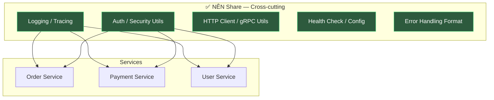
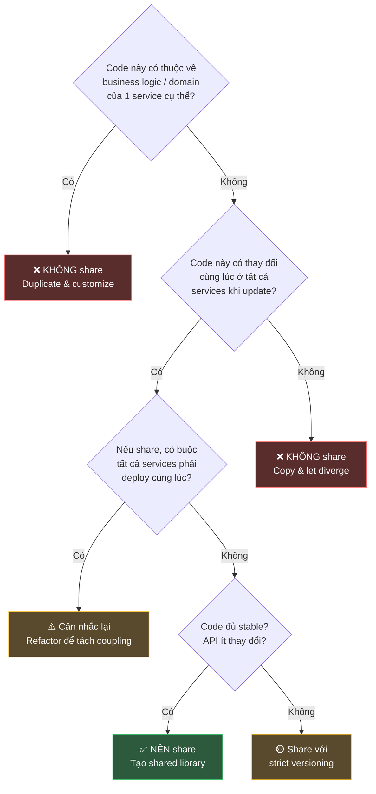
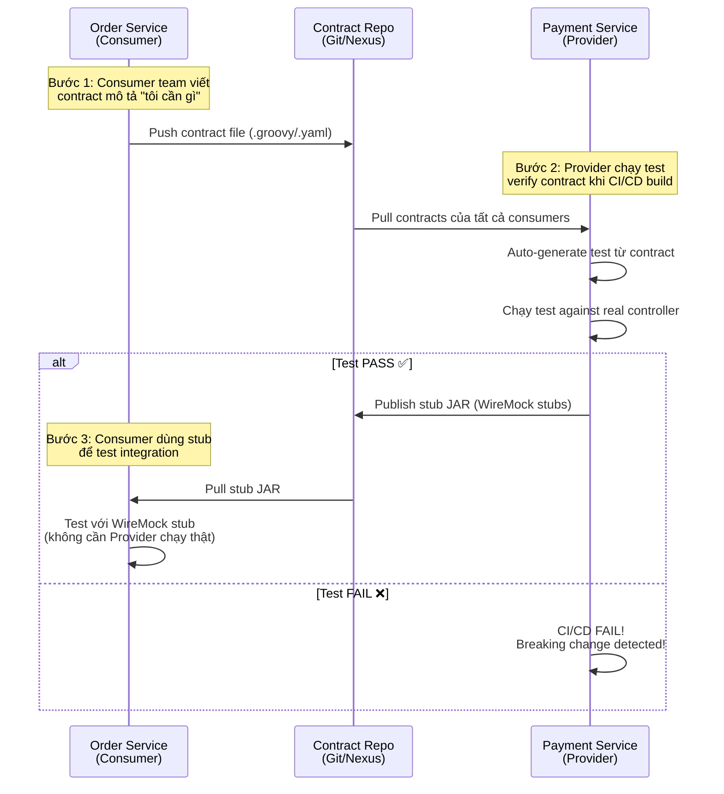
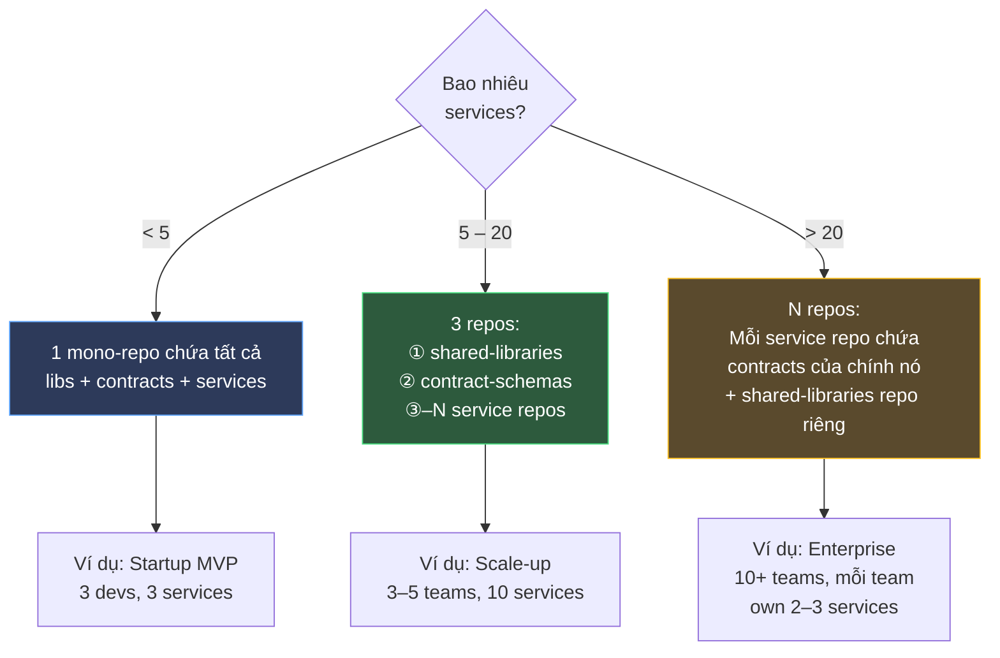
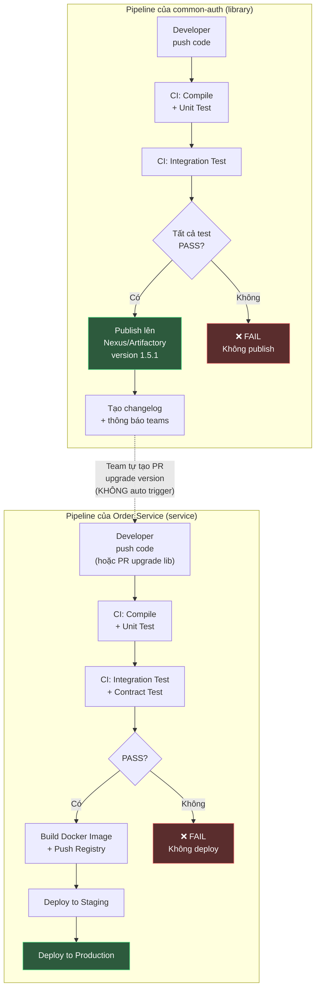
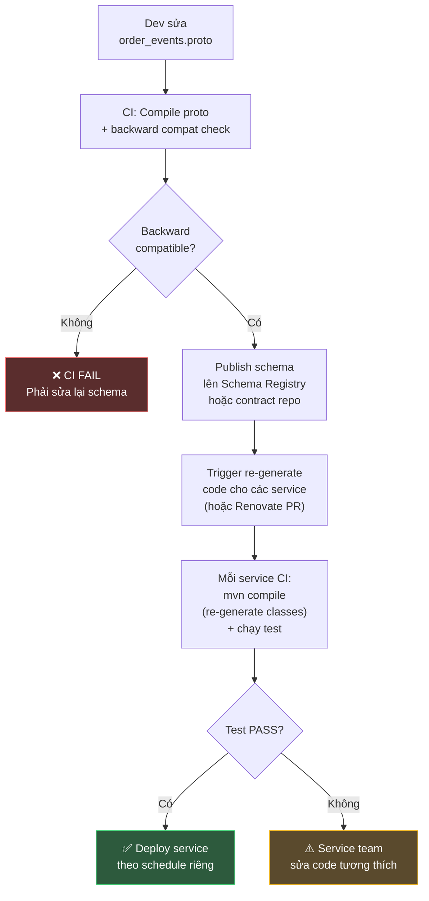
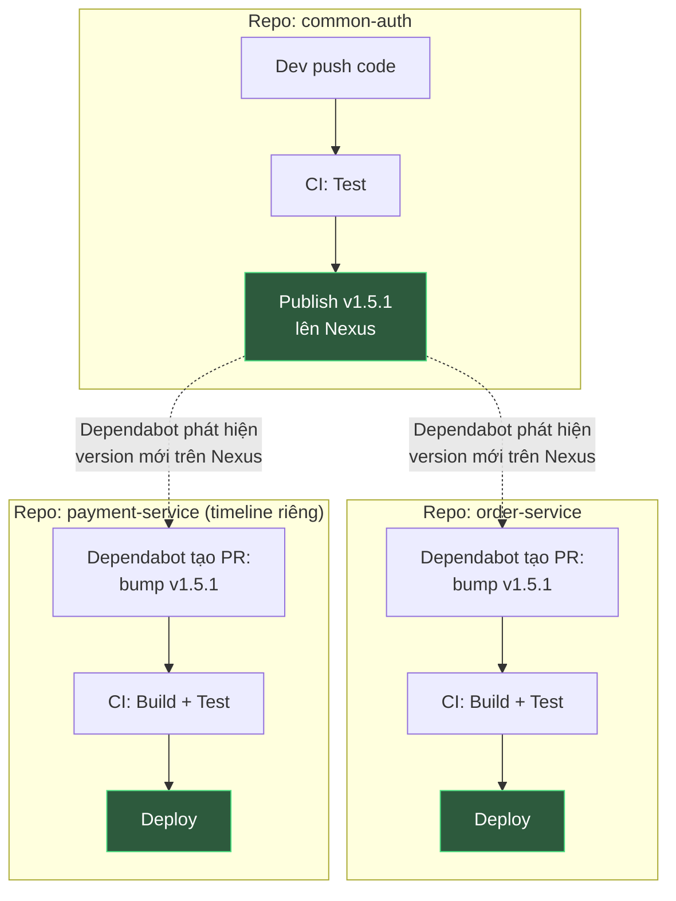
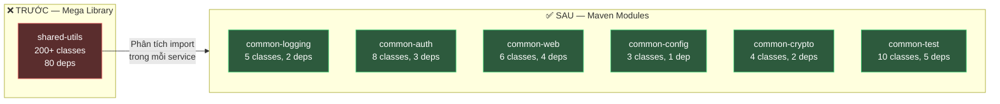

# Shared Code Strategy trong Microservice

## 📋 Mục lục

- [1. Giới thiệu — Vấn đề chia sẻ code](#1-giới-thiệu--vấn-đề-chia-sẻ-code)
- [2. Nguyên tắc cốt lõi — Cái gì NÊN và KHÔNG NÊN share](#2-nguyên-tắc-cốt-lõi--cái-gì-nên-và-không-nên-share)
  - [2.1. Nên share — Cross-cutting Concerns](#21-nên-share--cross-cutting-concerns)
  - [2.2. Không nên share — Domain/Business Logic](#22-không-nên-share--domainbusiness-logic)
  - [2.3. Decision Framework — Checklist xác định nhanh](#23-decision-framework--checklist-xác-định-nhanh)
- [3. Các hình thức chia sẻ code](#3-các-hình-thức-chia-sẻ-code)
  - [3.1. Shared Library (Package/Module)](#31-shared-library-packagemodule)
  - [3.2. Code Generation (Schema-first)](#32-code-generation-schema-first)
  - [3.3. Sidecar / Service Mesh](#33-sidecar--service-mesh)
  - [3.4. Platform Service (Shared Capability as a Service)](#34-platform-service-shared-capability-as-a-service)
  - [3.5. Copy-Paste (Duplicate & Diverge)](#35-copy-paste-duplicate--diverge)
  - [3.6. So sánh các hình thức](#36-so-sánh-các-hình-thức)
- [4. Shared Library — Deep Dive & Best Practices](#4-shared-library--deep-dive--best-practices)
  - [4.1. Cấu trúc và phân loại library](#41-cấu-trúc-và-phân-loại-library)
  - [4.2. Versioning Strategy](#42-versioning-strategy)
  - [4.3. Backward Compatibility](#43-backward-compatibility)
  - [4.4. Mono-repo vs Multi-repo cho shared library](#44-mono-repo-vs-multi-repo-cho-shared-library)
- [5. Contract Sharing — API Contracts & Schema](#5-contract-sharing--api-contracts--schema)
  - [5.1. Ý tưởng cốt lõi — "Share contract, không share code"](#51-ý-tưởng-cốt-lõi--share-contract-không-share-code)
  - [5.2. Protobuf / gRPC](#52-protobuf--grpc)
  - [5.3. OpenAPI / Swagger](#53-openapi--swagger)
  - [5.4. Avro Schema + Schema Registry](#54-avro-schema--schema-registry)
  - [5.5. Consumer-Driven Contract Testing](#55-consumer-driven-contract-testing)
  - [5.6. So sánh tổng hợp các cách Contract Sharing](#56-so-sánh-tổng-hợp-các-cách-contract-sharing)
  - [5.7. Thực tế — Bao nhiêu repo? Để chung hay tách?](#57-thực-tế--bao-nhiêu-repo-contract-để-chung-hay-tách-riêng-shared-code)
- [6. Anti-patterns — Những sai lầm phổ biến](#6-anti-patterns--những-sai-lầm-phổ-biến)
  - [6.1. Shared Domain Model](#61-shared-domain-model)
  - [6.2. Mega Shared Library](#62-mega-shared-library)
  - [6.3. Diamond Dependency](#63-diamond-dependency)
  - [6.4. Tight Version Locking](#64-tight-version-locking)
  - [6.5. Shared Database Schema Library](#65-shared-database-schema-library)
- [7. Ảnh hưởng của Shared Code tới CI/CD Pipeline](#7-ảnh-hưởng-của-shared-code-tới-cicd-pipeline)
  - [7.1. Vấn đề cốt lõi — Ripple Effect](#71-vấn-đề-cốt-lõi--thay-đổi-1-library--bao-nhiêu-service-phải-build-lại)
  - [7.2. Pipeline cho Shared Library — Phải tách riêng](#72-pipeline-cho-shared-library--phải-tách-riêng)
  - [7.3. Upgrade Library — Quy trình đúng](#73-upgrade-library--quy-trình-đúng)
  - [7.4. Tự động hóa: Dependabot / Renovate](#74-tự-động-hóa-dependabot--renovate-cho-shared-library)
  - [7.5. Contract Schema thay đổi → Pipeline](#75-contract-schema-thay-đổi--ảnh-hưởng-pipeline-thế-nào)
  - [7.6. Mono-repo vs Multi-repo CI/CD](#76-mono-repo-vs-multi-repo--cicd-khác-nhau-thế-nào)
  - [7.7. Checklist CI/CD cho Shared Code](#77-tổng-kết--checklist-cicd-cho-shared-code)
- [8. Case Study thực tế](#8-case-study-thực-tế)
  - [8.1. E-Commerce: Shared code giữa Order, Payment, Inventory](#81-e-commerce-shared-code-giữa-order-payment-inventory)
  - [8.2. Từ Mega Library → Micro Libraries](#82-từ-mega-library--micro-libraries)
- [9. Best Practices tổng hợp](#9-best-practices-tổng-hợp)
- [10. Tổng kết](#10-tổng-kết)
- [11. Liên kết liên quan](#11-liên-kết-liên-quan)

---

## 1. Giới thiệu — Vấn đề chia sẻ code

Trong kiến trúc Microservice, mỗi service nên **độc lập** và **tự chủ** ([xem doc 04](04-autonomy-independence.md)). Tuy nhiên, thực tế luôn có những phần code **giống nhau** xuất hiện ở nhiều service:

- Logging format
- Error handling
- Authentication/Authorization logic
- Data validation
- DTO/Model cho event communication
- Utility functions (date format, string utils...)

**Câu hỏi kinh điển**: Copy-paste code hay tạo shared library?

```
┌─────────────────────────────────────────────────────────────────────┐
│                    THE SHARED CODE DILEMMA                          │
│                                                                     │
│   Copy-Paste                          Shared Library                │
│   ┌──────────┐                        ┌──────────┐                  │
│   │Service A │  Code giống nhau       │Service A │                  │
│   │ ┌──────┐ │  nhưng độc lập         │    │     │                  │
│   │ │utils │ │                        │    ▼     │                  │
│   │ └──────┘ │                        │ ┌──────┐ │                  │
│   └──────────┘                        │ │shared│◄├──┐               │
│   ┌──────────┐                        │ │ lib  │ │  │               │
│   │Service B │                        │ └──────┘ │  │               │
│   │ ┌──────┐ │                        └──────────┘  │               │
│   │ │utils │ │  ← Duplicate nhưng     ┌──────────┐  │               │
│   │ └──────┘ │    không coupling      │Service B │  │               │
│   └──────────┘                        │ ┌──────┐ │  │               │
│                                       │ │shared│◄├──┘               │
│   ✅ Independence                     │ │ lib  │ │                  │
│   ❌ Maintenance burden               │ └──────┘ │                  │
│                                       └──────────┘                  │
│                                       ✅ DRY                        │
│                                       ⚠️ Coupling risk              │
└─────────────────────────────────────────────────────────────────────┘
```

> **Nguyên tắc vàng**: _"Don't share code that creates coupling between services. Do share code that helps services be independently better."_ — Sam Newman, Building Microservices

**Cả hai hướng đều có trade-off**. Document này sẽ giúp bạn xác định khi nào nên share, khi nào nên duplicate, và nếu share thì share bằng cách nào.

---

## 2. Nguyên tắc cốt lõi — Cái gì NÊN và KHÔNG NÊN share

### 2.1. Nên share — Cross-cutting Concerns

**Cross-cutting concerns** là những thứ **không thuộc về business logic** của bất kỳ service nào, mà là **yêu cầu chung của toàn hệ thống**.

| Loại | Ví dụ | Lý do nên share |
|------|-------|-----------------|
| **Observability** | Logging format, tracing propagation, metrics collection | Cần thống nhất để aggregate logs/traces |
| **Security** | JWT validation, OAuth token parsing, encryption utils | Logic security phải nhất quán, tránh sai lệch |
| **Communication** | HTTP client wrapper, gRPC interceptors, message serialization | Đảm bảo contract consistency |
| **Infrastructure** | Health check endpoint, graceful shutdown, config loading | Boilerplate giống nhau ở mọi service |
| **Data Format** | Date/time utils, currency formatting, locale | Tránh inconsistency khi trao đổi dữ liệu |
| **Testing** | Test fixtures factory, mock helpers, contract test base | Giảm effort setup test |



### 2.2. Không nên share — Domain/Business Logic

**Business logic** là thứ **thuộc về Bounded Context** của từng service. Chia sẻ nó sẽ tạo **coupling** và vi phạm nguyên tắc autonomy.

| Loại | Ví dụ | Tại sao KHÔNG nên share |
|------|-------|------------------------|
| **Domain Models** | `Order`, `Product`, `User` entity | Mỗi service có view riêng về cùng 1 entity |
| **Business Rules** | Tính giá, validate đơn hàng, tính phí ship | Logic có thể diverge theo thời gian |
| **Database Schema** | ORM models, migration scripts | Vi phạm Database per Service |
| **Service-specific DTOs** | Request/Response models nội bộ | Tạo tight coupling giữa services |
| **Workflow Logic** | Order processing flow, payment flow | Mỗi service tự quản lý workflow |

**Ví dụ kinh điển — "User" khác nhau ở mỗi service:**

```
┌─────────────────────────────────────────────────────────────────┐
│  CÙNG CONCEPT "USER" — NHƯNG MỖI SERVICE CẦN KHÁC NHAU          │
│                                                                 │
│  ┌─────────────────┐  ┌─────────────────┐  ┌─────────────────┐  │
│  │  Auth Service   │  │  Order Service  │  │  Notification   │  │
│  │                 │  │                 │  │  Service        │  │
│  │  User {         │  │  Customer {     │  │  Recipient {    │  │
│  │    id           │  │    id           │  │    id           │  │
│  │    email        │  │    name         │  │    email        │  │
│  │    passwordHash │  │    shippingAddr │  │    phone        │  │
│  │    roles[]      │  │    loyaltyTier  │  │    preferences  │  │
│  │    mfaEnabled   │  │    creditLimit  │  │    timezone     │  │
│  │    lastLogin    │  │  }              │  │  }              │  │
│  │  }              │  │                 │  │                 │  │
│  └─────────────────┘  └─────────────────┘  └─────────────────┘  │
│                                                                 │
│  ❌ KHÔNG nên tạo SharedUserModel cho cả 3 service              │
│  ✅ Mỗi service định nghĩa model riêng phù hợp Bounded Context  │
└─────────────────────────────────────────────────────────────────┘
```

### 2.3. Decision Framework — Checklist xác định nhanh

Khi phân vân có nên share một đoạn code hay không, trả lời các câu hỏi sau:



**Quick Rules of Thumb:**

| Câu hỏi | Nếu CÓ → | Nếu KHÔNG → |
|----------|-----------|-------------|
| Code thuộc domain logic? | ❌ Không share | Tiếp tục đánh giá |
| Code thay đổi vì lý do business? | ❌ Không share | Tiếp tục đánh giá |
| Thay đổi code buộc deploy nhiều service? | ⚠️ Cảnh báo coupling | ✅ Có thể share |
| Code giống nhau ≥ 3 services? | ✅ Nên xem xét share | Copy cũng OK |
| Code liên quan tới compliance/security? | ✅ Nên share (nhất quán) | Tùy context |

---

## 3. Các hình thức chia sẻ code

### 3.1. Shared Library (Package/Module)

Đây là hình thức **phổ biến nhất**. Code chung được đóng gói thành library/package và publish lên registry.

```
┌───────────────────────────────────────────────────────────┐
│                  SHARED LIBRARY FLOW                      │
│                                                           │
│   ┌─────────────┐        ┌───────────────────────┐        │
│   │ Shared Lib  │──────▶ │  Maven Repository     │        │
│   │ Source Code │ deploy │  (Nexus / Artifactory │        │
│   │  (Git repo) │        │   / GitHub Packages)  │        │
│   └─────────────┘        └──────────┬────────────┘        │
│                                     │                     │
│                    ┌────────────────┼──────────────┐      │
│                    ▼                ▼              ▼      │
│              ┌──────────┐    ┌──────────┐    ┌──────────┐ │
│              │Service A │    │Service B │    │Service C │ │
│              │ v1.2.0   │    │ v1.1.0   │    │ v1.2.0   │ │
│              └──────────┘    └──────────┘    └──────────┘ │
│                                                           │
│  ✅ Mỗi service chọn version riêng                        │
│  ✅ Update không buộc deploy tất cả                       │
└───────────────────────────────────────────────────────────┘
```

**Ví dụ thực tế (Java / Spring Boot — Maven):**

```xml
<!-- pom.xml của Order Service -->
<dependencies>
    <dependency>
        <groupId>com.mycompany</groupId>
        <artifactId>common-logging</artifactId>
        <version>2.1.0</version>
    </dependency>
    <dependency>
        <groupId>com.mycompany</groupId>
        <artifactId>common-auth</artifactId>
        <version>1.5.0</version>
    </dependency>
    <dependency>
        <groupId>com.mycompany</groupId>
        <artifactId>common-web</artifactId>
        <version>3.0.0</version>
    </dependency>
</dependencies>
```

```xml
<!-- pom.xml của Payment Service -->
<dependencies>
    <dependency>
        <groupId>com.mycompany</groupId>
        <artifactId>common-logging</artifactId>
        <version>2.1.0</version>
    </dependency>
    <dependency>
        <groupId>com.mycompany</groupId>
        <artifactId>common-auth</artifactId>
        <version>1.5.0</version>
    </dependency>
    <dependency>
        <groupId>com.mycompany</groupId>
        <artifactId>common-crypto</artifactId>
        <version>1.0.0</version>
    </dependency>
</dependencies>
```

**Ưu điểm:**
- DRY — Không duplicate code
- Version control — Mỗi service chọn version phù hợp
- Dễ test và maintain centrally

**Nhược điểm:**
- Tạo coupling (dù là loose coupling qua versioning)
- Cần CI/CD riêng cho library
- Diamond dependency problem có thể xảy ra

### 3.2. Code Generation (Schema-first)

Thay vì share code trực tiếp, share **schema/contract** rồi **generate code** từ đó. Mỗi service có code riêng, nhưng đảm bảo compatible.

```
┌─────────────────────────────────────────────────────────────┐
│                  CODE GENERATION FLOW                       │
│                                                             │
│   ┌───────────────────┐                                     │
│   │  Shared Schema    │                                     │
│   │  (.proto / .yaml  │                                     │
│   │   / .avsc / .json)│                                     │
│   └────────┬──────────┘                                     │
│            │                                                │
│            ▼                                                │
│   ┌───────────────────┐                                     │
│   │  Code Generator   │                                     │
│   │  (protoc/openapi  │                                     │
│   │   generator/avro) │                                     │
│   └────────┬──────────┘                                     │
│            │                                                │
│   ┌────────┼────────┬────────────┐                          │
│   ▼        ▼        ▼            ▼                          │
│  Java    Go     TypeScript   Python                         │
│  stubs   stubs    types      classes                        │
│   │        │        │            │                          │
│   ▼        ▼        ▼            ▼                          │
│ Service  Service  Service    Service                        │
│    A       B        C          D                            │
│                                                             │
│  ✅ Polyglot friendly — mỗi service dùng ngôn ngữ khác      │
│  ✅ Schema là source of truth                               │
│  ✅ Không runtime dependency                                │
└─────────────────────────────────────────────────────────────┘
```

**Ví dụ — Protobuf schema:**

```protobuf
// shared-schemas/events/order_events.proto
syntax = "proto3";
package events;

message OrderCreatedEvent {
  string order_id = 1;
  string customer_id = 2;
  repeated OrderItem items = 3;
  int64 total_amount_cents = 4;
  string currency = 5;
  google.protobuf.Timestamp created_at = 6;
}

message OrderItem {
  string product_id = 1;
  int32 quantity = 2;
  int64 unit_price_cents = 3;
}
```

Từ schema này, generate:
- **Java** → classes cho Payment Service
- **Go** → structs cho Inventory Service
- **TypeScript** → interfaces cho Notification Service

### 3.3. Sidecar / Service Mesh

Thay vì embed shared code vào application, chạy nó như một **sidecar container** cạnh service. Phù hợp cho infrastructure concerns.

```
┌──────────────────────────────────────────────────────┐
│                  SIDECAR PATTERN                     │
│                                                      │
│   Pod / Task Definition                              │
│   ┌─────────────────────────────────────────────┐    │
│   │  ┌──────────────┐    ┌──────────────────┐   │    │
│   │  │  Application │    │    Sidecar       │   │    │
│   │  │  Container   │◄──▶│  (Envoy/Dapr/    │   │    │
│   │  │              │    │   Fluentd...)    │   │    │
│   │  │  Chỉ chứa    │    │                  │   │    │
│   │  │  business    │    │  Xử lý:          │   │    │
│   │  │  logic       │    │  - mTLS          │   │    │
│   │  │              │    │  - Retry/CB      │   │    │
│   │  │              │    │  - Logging       │   │    │
│   │  │              │    │  - Tracing       │   │    │
│   │  └──────────────┘    └──────────────────┘   │    │
│   └─────────────────────────────────────────────┘    │
│                                                      │
│  ✅ Ngôn ngữ agnostic — sidecar chạy riêng process   │
│  ✅ Service không cần biết về infra concerns         │
│  ❌ Thêm latency (intra-pod communication)           │
│  ❌ Phức tạp hơn khi debug                           │
└──────────────────────────────────────────────────────┘
```

**Khi nào dùng Sidecar thay vì Shared Library:**

| Tiêu chí | Shared Library | Sidecar |
|----------|---------------|---------|
| Polyglot (nhiều ngôn ngữ) | ❌ Phải viết lib cho mỗi ngôn ngữ | ✅ 1 sidecar cho mọi ngôn ngữ |
| Performance | ✅ In-process, nhanh | ⚠️ Thêm network hop |
| Update | Phải rebuild & redeploy service | Update sidecar riêng |
| Scope | App-level logic | Network/infra concerns |

### 3.4. Platform Service (Shared Capability as a Service)

Thay vì share code, tạo một **service chuyên trách** cung cấp capability đó qua API.

```
┌────────────────────────────────────────────────────────┐
│              PLATFORM SERVICE APPROACH                 │
│                                                        │
│   Thay vì share logging library → Logging Service      │
│   Thay vì share auth library    → Auth Service         │
│   Thay vì share email utils     → Notification Service │
│                                                        │
│   ┌──────────┐  ┌──────────┐  ┌──────────┐             │
│   │Service A │  │Service B │  │Service C │             │
│   └────┬─────┘  └────┬─────┘  └────┬─────┘             │
│        │             │             │                   │
│        └─────────────┼─────────────┘                   │
│                      ▼                                 │
│              ┌───────────────┐                         │
│              │ Auth Service  │  ← Platform Service     │
│              │ (centralized) │                         │
│              └───────────────┘                         │
│                                                        │
│   ✅ Không code coupling                               │
│   ✅ Single source of truth                            │
│   ❌ Network dependency (latency, availability)        │
│   ❌ Single point of failure nếu không HA              │
└────────────────────────────────────────────────────────┘
```

### 3.5. Copy-Paste (Duplicate & Diverge)

Đôi khi, **duplicate là lựa chọn đúng**. Đặc biệt khi:
- Code nhỏ và đơn giản (< 50 lines)
- Có khả năng sẽ diverge theo thời gian
- Tạo library sẽ over-engineering
- Service dùng ngôn ngữ khác nhau

> _"A little copying is better than a little dependency."_ — Go Proverb

**Khi nào duplicate là OK:**
- Simple utility functions (string format, date parse)
- Small value objects / DTOs
- Configuration boilerplate
- Code mà bạn dự đoán sẽ thay đổi khác nhau ở mỗi service

### 3.6. So sánh các hình thức

| Tiêu chí | Shared Library | Code Gen | Sidecar | Platform Service | Copy-Paste |
|----------|:-:|:-:|:-:|:-:|:-:|
| **Coupling level** | Medium | Low | Low | Low (runtime) | None |
| **Polyglot support** | ❌ Per-language | ✅ Multi-lang | ✅ Any lang | ✅ Via API | ✅ Any lang |
| **Maintenance cost** | Medium | Medium | High | High | Low → High |
| **Consistency** | High | High | High | High | Low |
| **Latency impact** | None | None | Small | Medium | None |
| **Best for** | Cùng tech stack | API contracts | Infra concerns | Complex features | Simple utils |

---

## 4. Shared Library — Deep Dive & Best Practices

### 4.1. Cấu trúc và phân loại library

**Nguyên tắc quan trọng nhất**: **Tách nhỏ library theo concern**, không gom tất cả vào 1 mega library.

```
┌───────────────────────────────────────────────────────────────┐
│               LIBRARY STRUCTURE — ĐÚNG vs SAI                 │
│                                                               │
│  ❌ SAI — Mega Library                                        │
│  ┌──────────────────────────────────────────┐                 │
│  │  com.mycompany:shared-utils              │                 │
│  │  ├── logging/                            │                 │
│  │  ├── auth/                               │                 │
│  │  ├── http-client/                        │                 │
│  │  ├── database/                           │                 │
│  │  ├── crypto/                             │                 │
│  │  ├── email/                              │                 │
│  │  └── ... (mọi thứ dump vào đây)          │                 │
│  └──────────────────────────────────────────┘                 │
│  → Service chỉ cần logging nhưng phải kéo cả DB,              │
│    crypto, email... vào classpath                             │
│                                                               │
│  ✅ ĐÚNG — Micro Libraries (Maven modules)                    │
│  ┌─────────────────────┐ ┌─────────────────────┐              │
│  │common-logging       │ │common-auth          │              │
│  └─────────────────────┘ └─────────────────────┘              │
│  ┌─────────────────────┐ ┌─────────────────────┐              │
│  │common-web           │ │common-crypto        │              │
│  └─────────────────────┘ └─────────────────────┘              │
│  → Mỗi service chỉ khai báo dependency đúng cái mình cần      │
└───────────────────────────────────────────────────────────────┘
```

**Phân loại library theo layer:**

| Layer | Maven Artifact | Ví dụ |
|-------|----------------|-------|
| **Observability** | `common-logging`, `common-tracing`, `common-metrics` | Logback config, Micrometer/OpenTelemetry auto-config |
| **Security** | `common-auth`, `common-crypto` | Spring Security filter cho JWT, encryption utils |
| **Communication** | `common-web`, `common-grpc`, `common-kafka` | RestTemplate/WebClient wrapper, Kafka producer config |
| **Infrastructure** | `common-health`, `common-config`, `common-spring-boot-starter` | Actuator extensions, Spring Cloud Config integration |
| **Testing** | `common-test`, `common-contract-test` | TestContainers base, Spring Cloud Contract verifier |

### 4.2. Versioning Strategy

Sử dụng **Semantic Versioning (SemVer)** là bắt buộc:

```
MAJOR.MINOR.PATCH
  │      │     │
  │      │     └── Bug fix, backward compatible
  │      └──────── New feature, backward compatible
  └─────────────── Breaking change ⚠️
```

**Quy tắc versioning cho shared library:**

```
┌──────────────────────────────────────────────────────────┐
│                VERSIONING STRATEGY                       │
│                                                          │
│  1. PATCH (1.0.x) — Bug fixes                            │
│     → Consumer nhận nếu dùng version range [1.0,1.1)     │
│     → Không cần action từ service teams                  │
│                                                          │
│  2. MINOR (1.x.0) — New features, backward compatible    │
│     → Consumer nhận nếu dùng version range [1.0,2.0)     │
│     → Service teams nên review changelog                 │
│                                                          │
│  3. MAJOR (x.0.0) — Breaking changes ⚠️                  │
│     → Consumer KHÔNG tự động nhận                        │
│     → Service teams phải chủ động upgrade                │
│     → Cung cấp migration guide                           │
│     → Duy trì version cũ 1 thời gian (deprecation)       │
│                                                          │
│  Timeline example:                                       │
│  ─────────────────────────────────────────────────       │
│  v1.0.0 ──▶ v1.1.0 ──▶ v1.2.0 ──▶ v2.0.0                 │
│                                      │                   │
│                                      ├── Migration Guide │
│                                      └── v1.x maintained │
│                                          thêm 3 tháng    │
└──────────────────────────────────────────────────────────┘
```

### 4.3. Backward Compatibility

**Golden rule**: MINOR và PATCH KHÔNG BAO GIỜ break backward compatibility.

Những thay đổi **backward compatible** (OK cho MINOR):
- Thêm function/method mới
- Thêm optional parameter
- Thêm field mới vào response type
- Deprecate (nhưng không xóa) function

Những thay đổi **breaking** (chỉ được ở MAJOR):
- Xóa function/method
- Đổi function signature
- Đổi behavior của function hiện tại
- Xóa field khỏi type/interface
- Thay đổi required dependencies

### 4.4. Mono-repo vs Multi-repo cho shared library

| Tiêu chí | Mono-repo | Multi-repo |
|----------|-----------|------------|
| **Cấu trúc** | Tất cả libs + services trong 1 repo | Mỗi lib 1 repo riêng |
| **Ưu điểm** | Atomic changes, dễ refactor cross-lib | Independence, clear ownership |
| **Nhược điểm** | Build time lớn, tooling phức tạp | Cross-repo changes khó, versioning overhead |
| **Phù hợp** | Team nhỏ-vừa, startup | Team lớn, org nhiều teams |
| **Tools** | Bazel, Maven multi-module | Standard Maven / Gradle |

**Mono-repo example (Maven multi-module):**

```
my-platform/
├── pom.xml                             ← Parent POM (BOM, plugin management)
├── common/
│   ├── common-logging/
│   │   ├── src/main/java/
│   │   └── pom.xml                     ← com.mycompany:common-logging
│   ├── common-auth/
│   │   ├── src/main/java/
│   │   └── pom.xml                     ← com.mycompany:common-auth
│   └── common-web/
│       ├── src/main/java/
│       └── pom.xml                     ← com.mycompany:common-web
├── services/
│   ├── order-service/
│   │   ├── src/main/java/
│   │   └── pom.xml                     ← depends on common-logging, common-auth
│   ├── payment-service/
│   │   ├── src/main/java/
│   │   └── pom.xml
│   └── user-service/
│       ├── src/main/java/
│       └── pom.xml
└── .mvn/
```

---

## 5. Contract Sharing — API Contracts & Schema

### 5.1. Ý tưởng cốt lõi — "Share contract, không share code"

Trong Microservice, các service giao tiếp qua **API** (REST, gRPC) hoặc **events** (Kafka, RabbitMQ). Vấn đề: làm sao đảm bảo **producer** và **consumer** "nói cùng ngôn ngữ" mà **không coupling code**?

**Contract Sharing** giải quyết bằng cách:
1. Viết **schema/contract** mô tả cấu trúc dữ liệu (không phải logic xử lý)
2. Từ schema đó, **generate code** cho từng service
3. Mỗi service có **code riêng** (generated), nhưng đảm bảo **compatible** với nhau

```
┌─────────────────────────────────────────────────────────────────────┐
│            CONTRACT SHARING — CÁCH HOẠT ĐỘNG                        │
│                                                                     │
│   ┌───────────────────────────────────────────────────────────┐     │
│   │  TRUYỀN THỐNG (share code trực tiếp):                     │     │
│   │                                                           │     │
│   │  Order Service ──import──▶ SharedOrderDTO.java ◀──import──│     │
│   │                            (shared library)      Payment  │     │
│   │                                                  Service  │     │
│   │  ❌ Coupling: thay đổi DTO → cả 2 phải rebuild            │     │
│   └───────────────────────────────────────────────────────────┘     │
│                                                                     │
│   ┌───────────────────────────────────────────────────────────┐     │
│   │  CONTRACT SHARING (share schema, generate code):          │     │
│   │                                                           │     │
│   │  order_events.proto ──generate──▶ OrderCreatedEvent.java  │     │
│   │  (schema file)       │            (trong Order Service)   │     │
│   │                      │                                    │     │
│   │                      └──generate──▶ OrderCreatedEvent.java│     │
│   │                                    (trong Payment Service)│     │
│   │                                                           │     │
│   │  ✅ Mỗi service có file riêng, build riêng                │     │
│   │  ✅ Schema thay đổi → chỉ re-generate, không coupling     │     │
│   └───────────────────────────────────────────────────────────┘     │
└─────────────────────────────────────────────────────────────────────┘
```

> **Tóm lại**: Thay vì 2 services cùng import 1 Java class (coupling), ta viết 1 file mô tả cấu trúc → tool tự generate ra Java class cho từng service. Hai class giống nhau về structure nhưng **hoàn toàn độc lập** về build/deploy.

---

### 5.2. Protobuf / gRPC
#### Bước 1: Viết schema (file `.proto`)

Schema đặt trong **repo riêng** hoặc **thư mục shared** trong mono-repo. File `.proto` chỉ mô tả **cấu trúc dữ liệu**, không có logic.

```protobuf
// repo: contract-schemas/proto/order/order_events.proto
syntax = "proto3";
package com.mycompany.order.events;

import "google/protobuf/timestamp.proto";

// Event phát ra khi order được tạo
message OrderCreatedEvent {
  string order_id = 1;
  string customer_id = 2;
  repeated OrderItem items = 3;
  Money total_amount = 4;
  google.protobuf.Timestamp created_at = 5;
}

message OrderItem {
  string product_id = 1;
  int32 quantity = 2;
  Money unit_price = 3;
}

// Type dùng chung cho tiền tệ
message Money {
  int64 amount_cents = 1;       // VD: 1500 = 15.00
  string currency_code = 2;     // VD: "VND", "USD"
}
```

#### Bước 2: Cấu hình Maven plugin để generate code

Mỗi service cần dùng event này sẽ **kéo file `.proto`** về và **generate Java class** lúc build.

```xml
<!-- pom.xml của Payment Service -->
<build>
    <plugins>
        <plugin>
            <groupId>org.xolstice.maven.plugins</groupId>
            <artifactId>protobuf-maven-plugin</artifactId>
            <version>0.6.1</version>
            <configuration>
                <!-- Chỉ tới thư mục chứa .proto files -->
                <protoSourceRoot>
                    ${project.basedir}/src/main/proto
                </protoSourceRoot>
            </configuration>
            <executions>
                <execution>
                    <goals>
                        <goal>compile</goal>       <!-- Generate Java classes -->
                        <goal>compile-custom</goal> <!-- Generate gRPC stubs nếu cần -->
                    </goals>
                </execution>
            </executions>
        </plugin>
    </plugins>
</build>
```

#### Bước 3: Maven build → Auto generate Java classes

Khi chạy `mvn compile`, plugin sẽ đọc file `.proto` và **tự động generate** ra Java class:

```
┌────────────────────────────────────────────────────────────────────┐
│                    PROTOBUF GENERATE FLOW                          │
│                                                                    │
│   Input (.proto file)              Output (generated Java class)   │
│   ┌─────────────────────┐          ┌───────────────────────────┐   │
│   │ message Money {     │          │ public final class Money  │   │
│   │   int64             │  protoc  │   extends GeneratedMsg {  │   │
│   │     amount_cents=1; │ ───────▶ │   long getAmountCents();  │   │
│   │   string            │          │   String getCurrencyCode  │   │
│   │     currency_code=2;│          │   // builder, equals,     │   │
│   │ }                   │          │   // hashCode, toString   │   │
│   └─────────────────────┘          └───────────────────────────┘   │
│                                                                    │
│   File generated nằm ở:                                            │
│   target/generated-sources/protobuf/java/                          │
│   └── com/mycompany/order/events/                                  │
│       ├── OrderCreatedEvent.java    ← AUTO GENERATED               │
│       ├── OrderItem.java            ← AUTO GENERATED               │
│       └── Money.java                ← AUTO GENERATED               │
│                                                                    │
│   ⚠️ KHÔNG sửa file generated — sửa file .proto rồi re-generate    │
└────────────────────────────────────────────────────────────────────┘
```

#### Bước 4: Service sử dụng generated class như bình thường

```java
// Payment Service — consume event từ Kafka
@KafkaListener(topics = "order-events")
public void handleOrderCreated(OrderCreatedEvent event) {
    // OrderCreatedEvent là class được AUTO GENERATED từ .proto
    String orderId = event.getOrderId();
    Money total = event.getTotalAmount();
    
    log.info("Processing payment for order: {}, amount: {} {}",
        orderId,
        total.getAmountCents(),
        total.getCurrencyCode());
    
    paymentService.charge(orderId, total);
}
```

```java
// Order Service — publish event lên Kafka
public void createOrder(CreateOrderRequest request) {
    Order order = orderRepository.save(/* ... */);
    
    // Build event bằng generated Builder
    OrderCreatedEvent event = OrderCreatedEvent.newBuilder()
        .setOrderId(order.getId())
        .setCustomerId(order.getCustomerId())
        .setTotalAmount(Money.newBuilder()
            .setAmountCents(order.getTotalCents())
            .setCurrencyCode("VND")
            .build())
        .setCreatedAt(Timestamps.fromMillis(System.currentTimeMillis()))
        .build();
    
    kafkaTemplate.send("order-events", event);
}
```

#### Tổng kết flow:


**Quy tắc quan trọng:**
- **Chỉ thêm field mới**, không xóa hoặc đổi field number → backward compatible
- File `.proto` là **source of truth** — không bao giờ sửa file generated
- Mỗi service generate **code riêng**, build **riêng** → không coupling

---

### 5.3. OpenAPI / Swagger

Phù hợp cho **REST API**. Ý tưởng tương tự Protobuf: viết spec → generate code.

#### Bước 1: Service owner viết OpenAPI spec

```yaml
# contract-schemas/openapi/order-service.yaml
openapi: 3.0.3
info:
  title: Order Service API
  version: 1.2.0

paths:
  /orders:
    post:
      operationId: createOrder
      summary: Create new order
      requestBody:
        content:
          application/json:
            schema:
              $ref: '#/components/schemas/CreateOrderRequest'
      responses:
        '201':
          content:
            application/json:
              schema:
                $ref: '#/components/schemas/OrderResponse'

components:
  schemas:
    CreateOrderRequest:
      type: object
      required: [customerId, items]
      properties:
        customerId:
          type: string
          format: uuid
        items:
          type: array
          items:
            $ref: '#/components/schemas/OrderItemRequest'

    OrderItemRequest:
      type: object
      required: [productId, quantity]
      properties:
        productId:
          type: string
        quantity:
          type: integer
          minimum: 1

    OrderResponse:
      type: object
      properties:
        id:
          type: string
          format: uuid
        status:
          type: string
          enum: [PENDING, CONFIRMED, SHIPPED]
        totalAmountCents:
          type: integer
          format: int64
```

#### Bước 2: Service khác generate client code từ spec

```xml
<!-- pom.xml của Payment Service — cần gọi Order Service API -->
<plugin>
    <groupId>org.openapitools</groupId>
    <artifactId>openapi-generator-maven-plugin</artifactId>
    <version>7.0.0</version>
    <executions>
        <execution>
            <goals>
                <goal>generate</goal>
            </goals>
            <configuration>
                <!-- Trỏ tới OpenAPI spec của Order Service -->
                <inputSpec>
                    ${project.basedir}/src/main/resources/contracts/order-service.yaml
                </inputSpec>
                <generatorName>java</generatorName>
                <library>resttemplate</library>
                <apiPackage>com.mycompany.payment.client.order.api</apiPackage>
                <modelPackage>com.mycompany.payment.client.order.model</modelPackage>
                <configOptions>
                    <useSpringBoot3>true</useSpringBoot3>
                </configOptions>
            </configuration>
        </execution>
    </executions>
</plugin>
```

#### Bước 3: Kết quả generate

```
┌──────────────────────────────────────────────────────────────────┐
│               OPENAPI GENERATE FLOW                              │
│                                                                  │
│   Input (YAML spec)                Output (generated Java)       │
│   ┌─────────────────────┐          ┌────────────────────────┐    │
│   │ OrderResponse:      │ openapi  │ public class           │    │
│   │   properties:       │ generate │   OrderResponse {      │    │
│   │     id: string      │ ───────▶ │   private String id;   │    │
│   │     status: string  │          │   private String status│    │
│   │     totalAmount:    │          │   private Long         │    │
│   │       integer       │          │     totalAmountCents;  │    │
│   └─────────────────────┘          │   // getters, setters  │    │
│                                    └────────────────────────┘    │
│                                                                  │
│   Ngoài model, còn generate cả API client:                       │
│   ┌────────────────────────────────────────┐                     │
│   │ public class OrderApi {                │                     │
│   │   OrderResponse createOrder(           │                     │
│   │     CreateOrderRequest request         │                     │
│   │   );                                   │                     │
│   │ }                                      │                     │
│   │ → Có sẵn RestTemplate call, error      │                     │
│   │   handling, serialization              │                     │
│   └────────────────────────────────────────┘                     │
│                                                                  │
│   Payment Service gọi Order API:                                 │
│   ┌────────────────────────────────────────┐                     │
│   │ OrderApi orderApi = new OrderApi();    │                     │
│   │ OrderResponse resp =                   │                     │
│   │   orderApi.createOrder(request);       │                     │
│   │ // → Tự động call REST, parse JSON     │                     │
│   └────────────────────────────────────────┘                     │
└──────────────────────────────────────────────────────────────────┘
```

#### So sánh Protobuf vs OpenAPI:

| Tiêu chí | Protobuf / gRPC | OpenAPI / Swagger |
|----------|----------------|-------------------|
| **Dùng cho** | gRPC call, Kafka events | REST API |
| **Format** | Binary (nhỏ, nhanh) | JSON (dễ debug) |
| **Schema file** | `.proto` | `.yaml` / `.json` |
| **Generate tool** | `protoc` + `protobuf-maven-plugin` | `openapi-generator-maven-plugin` |
| **Output** | Model classes + gRPC stubs | Model classes + REST client |
| **Khi nào chọn** | Service-to-service nội bộ, high performance | Public API, cần human-readable |

---

### 5.4. Avro Schema + Schema Registry

Phù hợp cho **event-driven architecture** — define schema cho messages trên **Kafka**. Điểm khác biệt lớn nhất: schema được lưu trữ và validate **tại runtime** bởi Schema Registry.

#### Flow hoạt động:

```
┌───────────────────────────────────────────────────────────────────────┐
│             AVRO + SCHEMA REGISTRY FLOW                               │
│                                                                       │
│  ① Order Service (Producer) gửi event                                │
│  ┌───────────────────┐     ┌──────────────────┐     ┌──────────────┐  │
│  │ Order Service     │     │ Schema Registry  │     │   Kafka      │  │
│  │                   │     │ (Confluent)      │     │   Broker     │  │
│  │ 1. Build event    │     │                  │     │              │  │
│  │    object         │     │                  │     │              │  │
│  │                   │     │                  │     │              │  │
│  │ 2. Serializer     │────▶│ 3. Kiểm tra      │     │              │  │
│  │    gửi schema     │     │    schema có tồn │     │              │  │
│  │    tới registry   │     │    tại? Có compat│     │              │  │
│  │                   │     │   với version cũ?│     │              │  │
│  │                   │◀────│                  │     │              │  │
│  │                   │     │ 4. Trả về        │     │              │  │
│  │ 5. Serialize      │     │    schema ID     │     │              │  │
│  │    event thành    │─────────────────────────────▶│ 6. Lưu       │  │
│  │    bytes + kèm    │     │                  │     │    message   │  │
│  │    schema ID      │     │                  │     │    + schemaID│  │
│  └───────────────────┘     └──────────────────┘     └──────┬───────┘  │
│                                                            │          │
│  ② Payment Service (Consumer) nhận event                  │          │
│  ┌───────────────────┐     ┌──────────────────┐            │          │
│  │ Payment Service   │     │ Schema Registry  │            │          │
│  │                   │◀────────────────────────────────────┘          │
│  │ 7. Nhận bytes     │     │                  │                       │
│  │    + schema ID    │     │                  │                       │
│  │                   │────▶│ 8. Lấy schema    │                       │
│  │ 9. Deserializer   │◀────│    theo ID       │                       │
│  │    dùng schema    │     │                  │                       │
│  │    để parse bytes │     │                  │                       │
│  │    → Java object  │     │                  │                       │
│  └───────────────────┘     └──────────────────┘                       │
│                                                                       │
│  KEY INSIGHT:                                                         │
│  • Message trên Kafka KHÔNG chứa schema (nhẹ, nhỏ)                    │
│  • Message chỉ chứa schema ID + data bytes                            │
│  • Schema Registry là "từ điển" trung tâm — ai cần thì tra            │
│  • Registry tự kiểm tra compatibility khi producer đăng ký schema mới │
└───────────────────────────────────────────────────────────────────────┘
```

#### Bước 1: Viết Avro schema

```json
// contract-schemas/avro/com/mycompany/events/OrderCreatedEvent.avsc
{
  "type": "record",
  "name": "OrderCreatedEvent",
  "namespace": "com.mycompany.events.order",
  "fields": [
    {"name": "order_id", "type": "string"},
    {"name": "customer_id", "type": "string"},
    {"name": "total_amount_cents", "type": "long"},
    {"name": "currency", "type": "string", "default": "USD"},
    {"name": "created_at", "type": {"type": "long", "logicalType": "timestamp-millis"}}
  ]
}
```

#### Bước 2: Maven plugin generate Java class từ Avro schema

```xml
<!-- pom.xml -->
<plugin>
    <groupId>org.apache.avro</groupId>
    <artifactId>avro-maven-plugin</artifactId>
    <version>1.11.3</version>
    <executions>
        <execution>
            <phase>generate-sources</phase>
            <goals>
                <goal>schema</goal>
            </goals>
            <configuration>
                <sourceDirectory>
                    ${project.basedir}/src/main/avro
                </sourceDirectory>
                <outputDirectory>
                    ${project.build.directory}/generated-sources/avro
                </outputDirectory>
            </configuration>
        </execution>
    </executions>
</plugin>
```

#### Bước 3: Cấu hình Kafka Serializer/Deserializer sử dụng Schema Registry

```yaml
# application.yml của Order Service (Producer)
spring:
  kafka:
    producer:
      key-serializer: org.apache.kafka.common.serialization.StringSerializer
      value-serializer: io.confluent.kafka.serializers.KafkaAvroSerializer
    properties:
      schema.registry.url: http://schema-registry:8081
      # Tự động đăng ký schema mới lên registry
      auto.register.schemas: true
```

```yaml
# application.yml của Payment Service (Consumer)
spring:
  kafka:
    consumer:
      key-deserializer: org.apache.kafka.common.serialization.StringDeserializer
      value-deserializer: io.confluent.kafka.serializers.KafkaAvroDeserializer
    properties:
      schema.registry.url: http://schema-registry:8081
      specific.avro.reader: true
```

#### Bước 4: Service dùng generated class như bình thường

```java
// Order Service — Producer
@Service
public class OrderEventPublisher {
    
    private final KafkaTemplate<String, OrderCreatedEvent> kafkaTemplate;

    public void publishOrderCreated(Order order) {
        // OrderCreatedEvent là class AUTO GENERATED từ .avsc
        OrderCreatedEvent event = OrderCreatedEvent.newBuilder()
            .setOrderId(order.getId())
            .setCustomerId(order.getCustomerId())
            .setTotalAmountCents(order.getTotalCents())
            .setCurrency("VND")
            .setCreatedAt(Instant.now().toEpochMilli())
            .build();

        // KafkaAvroSerializer tự động:
        // 1. Gửi schema lên Schema Registry (nếu chưa có)
        // 2. Nhận schema ID
        // 3. Serialize event thành bytes + gắn schema ID
        kafkaTemplate.send("order-events", order.getId(), event);
    }
}
```

```java
// Payment Service — Consumer
@Service
public class OrderEventConsumer {

    @KafkaListener(topics = "order-events")
    public void handleOrderCreated(OrderCreatedEvent event) {
        // KafkaAvroDeserializer tự động:
        // 1. Đọc schema ID từ message
        // 2. Lấy schema từ Schema Registry theo ID
        // 3. Dùng schema để parse bytes → OrderCreatedEvent object
        
        log.info("Order received: {}, amount: {} {}",
            event.getOrderId(),
            event.getTotalAmountCents(),
            event.getCurrency());
        
        paymentService.processPayment(event);
    }
}
```

#### Schema Registry — Compatibility Rules

Schema Registry sẽ **từ chối** schema mới nếu vi phạm compatibility rule:

| Rule | Cho phép | Không cho phép | Khi nào dùng |
|------|---------|---------------|-------------|
| **BACKWARD** | Xóa field (có default), thêm field (có default) | Thêm required field mới | Consumer mới đọc được data cũ |
| **FORWARD** | Thêm field, xóa field (có default) | Xóa required field | Producer mới, consumer cũ vẫn đọc được |
| **FULL** | Thêm/xóa field (đều phải có default) | Mọi breaking change | An toàn nhất, khuyến nghị dùng |
| **NONE** | Mọi thay đổi | — | Không khuyến nghị ở production |

```
Ví dụ BACKWARD compatible:

  Schema v1:                    Schema v2 (OK ✅):
  {                             {
    "order_id": string,           "order_id": string,
    "customer_id": string,        "customer_id": string,
    "total": long                 "total": long,
  }                               "currency": string = "USD"  ← thêm field CÓ default
                                }

  Schema v2 (FAIL ❌):
  {
    "order_id": string,
    "customer_id": string,
    "total": long,
    "currency": string           ← thêm field KHÔNG có default → REJECT!
  }
```

---

### 5.5. Consumer-Driven Contract Testing

Các cách trên (Protobuf, OpenAPI, Avro) đều là **provider-driven**: provider định nghĩa schema, consumer tuân theo. **Consumer-Driven Contract Testing** đảo ngược: **consumer nói cho provider biết mình cần gì**.

#### Tại sao cần?

```
Vấn đề với provider-driven:

   Payment Service (provider) có API trả về 20 fields
   Order Service (consumer) chỉ dùng 3 fields: {id, status, amount}
   
   Payment team đổi tên field "amount" → "totalAmount"
   → OpenAPI spec vẫn valid (đổi tên thôi)
   → Nhưng Order Service CRASH vì expect "amount" 🚨
   
   Không ai biết Order Service đang dùng field nào!
```

#### Flow hoạt động với Spring Cloud Contract:



#### Bước 1: Consumer viết contract

```groovy
// Order Service repo: src/test/resources/contracts/payment/shouldReturnPaymentStatus.groovy
Contract.make {
    description "Order Service cần lấy payment status"
    
    request {
        method GET()
        url "/payments/PAY-123"
        headers {
            contentType applicationJson()
        }
    }
    
    response {
        status 200
        headers {
            contentType applicationJson()
        }
        body([
            id    : "PAY-123",
            status: "COMPLETED",       // Consumer CHỈ CẦN 3 fields này
            amount: 150000             // Nếu provider đổi tên → test FAIL
        ])
    }
}
```

#### Bước 2: Provider verify — test được auto-generate

Khi Payment Service build, Spring Cloud Contract **tự động generate** JUnit test:

```java
// AUTO-GENERATED test trong Payment Service
// (developer KHÔNG viết file này — plugin generate)
public class PaymentContractTest extends PaymentBaseTestClass {

    @Test
    public void shouldReturnPaymentStatus() throws Exception {
        // given:
        MockMvcRequestSpecification request = given()
            .header("Content-Type", "application/json");

        // when:
        ResponseOptions response = given().spec(request)
            .get("/payments/PAY-123");

        // then:
        assertThat(response.statusCode()).isEqualTo(200);
        
        DocumentContext parsedJson = JsonPath.parse(response.getBody().asString());
        assertThat(parsedJson.read("$.id", String.class)).isEqualTo("PAY-123");
        assertThat(parsedJson.read("$.status", String.class)).isEqualTo("COMPLETED");
        assertThat(parsedJson.read("$.amount", Integer.class)).isEqualTo(150000);
    }
}
```

Payment team chạy `mvn test` → nếu controller trả về đúng format → PASS. Nếu đổi `amount` thành `totalAmount` → **FAIL ngay lập tức** → biết mình đang break consumer.

#### Bước 3: Consumer test với WireMock stub (không cần provider chạy thật)

```java
// Order Service — Integration test
@SpringBootTest
@AutoConfigureStubRunner(
    ids = "com.mycompany:payment-service:+:stubs:8090",
    stubsMode = StubRunnerProperties.StubsMode.REMOTE
)
class OrderServiceIntegrationTest {

    @Autowired
    private PaymentClient paymentClient;  // Feign client gọi Payment API

    @Test
    void shouldGetPaymentStatus() {
        // WireMock stub tự động chạy ở port 8090
        // Stub trả về response đúng như contract đã define
        // → KHÔNG cần Payment Service chạy thật

        PaymentResponse response = paymentClient.getPayment("PAY-123");

        assertThat(response.getId()).isEqualTo("PAY-123");
        assertThat(response.getStatus()).isEqualTo("COMPLETED");
        assertThat(response.getAmount()).isEqualTo(150000);
    }
}
```

#### Tóm tắt lợi ích:

```
┌──────────────────────────────────────────────────────────────┐
│         CONSUMER-DRIVEN CONTRACT TESTING — TÓM TẮT           │
│                                                              │
│  KHÔNG CÓ contract testing:                                  │
│  • Provider đổi API → không biết consumer nào bị ảnh hưởng   │
│  • Chỉ phát hiện lỗi khi deploy lên staging/production 🚨    │
│  • Integration test cần tất cả services chạy cùng lúc        │
│                                                              │
│  CÓ contract testing:                                        │
│  • Provider biết CHÍNH XÁC consumer cần fields nào           │
│  • Breaking change bị phát hiện ngay lúc build (CI/CD) ✅    │
│  • Consumer test với stub — nhanh, không cần dependencies    │
│  • Provider tự tin refactor — contract test bảo vệ           │
└──────────────────────────────────────────────────────────────┘
```

### 5.6. So sánh tổng hợp các cách Contract Sharing

| Tiêu chí | Protobuf/gRPC | OpenAPI/Swagger | Avro + Registry | Contract Testing |
|----------|:---:|:---:|:---:|:---:|
| **Dùng cho** | gRPC, events | REST API | Kafka events | REST API verification |
| **Ai viết contract** | Provider | Provider | Provider | Consumer |
| **Generate code** | ✅ Java classes + stubs | ✅ Client + models | ✅ Java classes | ✅ Test + WireMock stubs |
| **Runtime validation** | ❌ Compile-time | ❌ Compile-time | ✅ Schema Registry | ❌ Build-time |
| **Compatibility check** | Manual (field rules) | Manual | ✅ Tự động (Registry) | ✅ Tự động (test) |
| **Spring Boot support** | `protobuf-maven-plugin` | `openapi-generator` | `avro-maven-plugin` | `spring-cloud-contract` |
| **Khi nào chọn** | High perf, internal | Public/external API | Event streaming | Verify API không break |

### 5.7. Thực tế — Bao nhiêu repo contract? Để chung hay tách riêng shared code?

#### Có bao nhiêu contract repo trong 1 dự án thực tế?

Tùy quy mô, nhưng phổ biến nhất là **3 mô hình** sau:

| Mô hình | Số repo | Khi nào dùng | Ví dụ thực tế |
|---------|:-------:|-------------|---------------|
| **1 contract repo duy nhất** | 1 | Team nhỏ (< 5 services), cùng tech stack | Startup, giai đoạn đầu |
| **1 contract repo + N service repos** | 2–N | Team trung bình (5–20 services) | Phổ biến nhất |
| **Contract nằm trong repo của provider** | 0 (không repo riêng) | Team lớn, mỗi team sở hữu 1–3 services | Netflix, Amazon style |

**Mô hình phổ biến nhất — 1 Contract Repo trung tâm:**

```
┌───────────────────────────────────────────────────────────────────┐
│  Thường gặp nhất ở team 5–20 services                             │
│                                                                   │
│  Repo: contract-schemas (1 repo duy nhất)                         │
│  ├── proto/                                                       │
│  │   ├── order/                                                   │
│  │   │   ├── order_service.proto      ← gRPC API của Order        │
│  │   │   └── order_events.proto       ← Kafka events của Order    │
│  │   ├── payment/                                                 │
│  │   │   ├── payment_service.proto                                │
│  │   │   └── payment_events.proto                                 │
│  │   └── common/                                                  │
│  │       ├── money.proto              ← Shared types              │
│  │       └── pagination.proto                                     │
│  ├── openapi/                                                     │
│  │   ├── order-service.yaml           ← REST API spec             │
│  │   └── payment-service.yaml                                     │
│  ├── avro/                                                        │
│  │   ├── order-created.avsc                                       │
│  │   └── payment-completed.avsc                                   │
│  └── pom.xml                          ← Build + publish generated │
│                                          classes lên Nexus        │
│                                                                   │
│  Mỗi service kéo generated classes từ Nexus:                      │
│  ┌──────────┐  ┌──────────┐  ┌──────────┐  ┌──────────┐           │
│  │ Order    │  │ Payment  │  │ User     │  │Inventory │           │
│  │ Service  │  │ Service  │  │ Service  │  │ Service  │           │
│  │ (repo    │  │ (repo    │  │ (repo    │  │ (repo    │           │
│  │  riêng)  │  │  riêng)  │  │  riêng)  │  │  riêng)  │           │
│  └──────────┘  └──────────┘  └──────────┘  └──────────┘           │
└───────────────────────────────────────────────────────────────────┘
```

**Mô hình team lớn — Contract nằm trong repo của provider:**

```
┌───────────────────────────────────────────────────────────────────┐
│  Team lớn: mỗi team sở hữu service + contract của service đó      │
│                                                                   │
│  Repo: order-service                                              │
│  ├── src/main/java/...           ← Code business logic            │
│  ├── src/main/proto/                                              │
│  │   ├── order_service.proto     ← Contract do Order team sở hữu  │
│  │   └── order_events.proto                                       │
│  ├── src/main/resources/                                          │
│  │   └── openapi/                                                 │
│  │       └── order-service.yaml  ← OpenAPI spec                   │
│  └── pom.xml                                                      │
│                                                                   │
│  Repo: payment-service                                            │
│  ├── src/main/java/...                                            │
│  ├── src/main/proto/                                              │
│  │   ├── payment_service.proto   ← Contract do Payment team sở hữu│
│  │   └── payment_events.proto                                     │
│  └── pom.xml                                                      │
│                                                                   │
│  Consumer (Payment) muốn gọi Order API:                           │
│  → Lấy contract từ Order repo bằng 1 trong 2 cách dưới đây        │
└───────────────────────────────────────────────────────────────────┘
```

**Vậy Consumer lấy contract từ Provider repo bằng cách nào?**

Khi contract nằm trong repo của Order Service, Payment Service cần lấy file `.proto` / `.yaml` đó về để generate client code. Có **2 cách phổ biến**:

**Cách 1 — Provider publish generated classes lên Nexus (phổ biến nhất):**

Order Service CI build xong sẽ publish **2 artifact riêng biệt** lên Nexus:

```
┌───────────────────────────────────────────────────────────────────────┐
│  CÁCH 1: PUBLISH GENERATED CLASSES LÊN NEXUS                          │
│                                                                       │
│  Repo: order-service (CI/CD pipeline)                                 │
│  ┌────────────────────────────────────────────────────────┐           │
│  │  mvn deploy → publish 2 artifacts:                     │           │
│  │                                                        │           │
│  │  ① com.mycompany:order-service:1.0.0                  │           │
│  │     → JAR chạy app (Spring Boot fat JAR)               │           │
│  │                                                        │           │
│  │  ② com.mycompany:order-service-proto:1.0.0            │           │
│  │     → JAR CHỈ chứa generated Java classes từ .proto    │           │
│  │     → OrderCreatedEvent.java, OrderItem.java, ...      │           │
│  │     → KHÔNG chứa business logic                        │           │
│  └────────────────────────────────────────────────────────┘           │
│                          │                                            │
│                          ▼  publish lên Nexus                         │
│                                                                       │
│  Repo: payment-service                                                │
│  ┌────────────────────────────────────────────────────────┐           │
│  │  pom.xml chỉ cần thêm dependency:                      │           │
│  │                                                        │           │
│  │  <dependency>                                          │           │
│  │    <groupId>com.mycompany</groupId>                    │           │
│  │    <artifactId>order-service-proto</artifactId>        │           │
│  │    <version>1.0.0</version>                            │           │
│  │  </dependency>                                         │           │
│  │                                                        │           │
│  │  → Có sẵn OrderCreatedEvent.java để dùng               │           │
│  │  → KHÔNG cần biết file .proto ở đâu                    │           │
│  │  → KHÔNG cần cài protoc hay plugin generate            │           │
│  └────────────────────────────────────────────────────────┘           │
│                                                                       │
│  ✅ Đơn giản nhất — Payment team chỉ khai báo dependency              │
│  ✅ Version rõ ràng — upgrade = đổi version trong pom.xml             │
│  ❌ Phụ thuộc Order team publish kịp thời                             │
└───────────────────────────────────────────────────────────────────────┘
```

**Cách 2 — Git submodule (consumer tự generate):**

Payment repo "mount" thư mục proto của Order repo vào project, tự generate code:

```
┌──────────────────────────────────────────────────────────────────────┐
│  CÁCH 2: GIT SUBMODULE                                               │
│                                                                       │
│  payment-service/                                                     │
│  ├── src/main/java/...            ← Business logic                    │
│  ├── src/main/proto/                                                  │
│  │   ├── payment/                  ← Proto của chính Payment          │
│  │   │   └── payment_events.proto                                     │
│  │   └── order/                    ← Git submodule                    │
│  │       ├── order_service.proto      trỏ tới order-service repo      │
│  │       └── order_events.proto      (read-only, không sửa ở đây)    │
│  └── pom.xml                       ← protobuf-maven-plugin generate  │
│                                       TẤT CẢ .proto trong thư mục    │
│                                                                       │
│  Setup 1 lần:                                                         │
│  $ git submodule add                                                  │
│      git@github.com:mycompany/order-service.git                       │
│      src/main/proto/order                                             │
│      --branch main                                                    │
│      -- src/main/proto              ← chỉ mount thư mục proto        │
│                                                                       │
│  Khi Order team update proto:                                         │
│  $ git submodule update --remote    ← kéo version mới nhất            │
│  $ mvn compile                      ← re-generate Java classes        │
│                                                                       │
│  ✅ Payment team kiểm soát chính xác commit/version nào đang dùng     │
│  ✅ Không phụ thuộc Order team publish artifact                        │
│  ❌ Phức tạp hơn — team phải hiểu Git submodule                       │
│  ❌ Mỗi service phải cài protoc + plugin                              │
└──────────────────────────────────────────────────────────────────────┘
```

**So sánh 2 cách:**

| Tiêu chí | Cách 1: Publish lên Nexus | Cách 2: Git submodule |
|----------|:---:|:---:|
| **Độ đơn giản** | ✅ Chỉ thêm dependency | ⚠️ Cần hiểu submodule |
| **Consumer cần protoc?** | ❌ Không | ✅ Có |
| **Version control** | Version trong pom.xml | Git commit SHA |
| **Ai generate code?** | Provider (1 lần) | Mỗi consumer (mỗi build) |
| **Phổ biến** | ✅ Hầu hết teams | Ít hơn, team có kinh nghiệm |
| **Khi nào chọn** | Default choice | Cần proto mới nhất ngay lập tức |

#### Contract có nằm chung repo với shared libraries không?

**Câu trả lời ngắn: KHÔNG NÊN gộp chung, nhưng thực tế nhiều team vẫn làm.**

Lý do nên **tách riêng**:

```
┌───────────────────────────────────────────────────────────────────────┐
│   ❌ GỘP CHUNG — 1 repo cho tất cả                                    │
│                                                                       │
│   Repo: shared-platform                                               │
│   ├── common-logging/          ← Shared library (Java code)           │
│   ├── common-auth/             ← Shared library (Java code)           │
│   ├── common-web/              ← Shared library (Java code)           │
│   ├── proto/                   ← Contracts (schema files)             │
│   │   ├── order_events.proto                                          │
│   │   └── payment_events.proto                                        │
│   └── openapi/                 ← Contracts (spec files)               │
│       └── order-service.yaml                                          │
│                                                                       │
│   Vấn đề:                                                             │
│   • Dev sửa common-logging → CI build cả proto, openapi               │
│   • Dev thêm field vào .proto → trigger rebuild common-auth?          │
│   • Ownership không rõ: ai review PR sửa logging + thêm proto field?  │
│   • Versioning chung: library v2.0 ≠ schema v2.0, nhưng cùng repo     │
│                                                                       │
│   ✅ TÁCH RIÊNG — Theo concern                                        │
│                                                                       │
│   Repo: shared-libraries                 Repo: contract-schemas       │
│   ├── common-logging/                    ├── proto/                   │
│   ├── common-auth/                       │   ├── order/               │
│   ├── common-web/                        │   └── payment/             │
│   ├── common-crypto/                     ├── openapi/                 │
│   └── pom.xml                            ├── avro/                    │
│                                          └── pom.xml                  │
│   Owner: Platform/Infra team             Owner: Tất cả service teams  │
│   Release cycle: riêng                   Release cycle: riêng         │
│   CI: build Java libs                    CI: generate + compat check  │
└───────────────────────────────────────────────────────────────────────┘
```

| Tiêu chí | Gộp chung 1 repo | Tách riêng |
|----------|:---:|:---:|
| **CI/CD** | Phức tạp — phải filter path | Đơn giản — mỗi repo 1 pipeline |
| **Ownership** | Mờ — ai cũng sửa được mọi thứ | Rõ — team phụ trách từng repo |
| **Versioning** | Khó — lib v2.0 ≠ schema v2.0 | Dễ — version độc lập |
| **Onboarding** | 1 repo để clone | Nhiều repo, cần hướng dẫn |
| **Team nhỏ (< 10 người)** | ✅ OK, đơn giản hơn | Over-engineering |
| **Team lớn (> 10 người)** | ❌ Conflict nhiều | ✅ Nên tách |

#### Tổng kết — Cấu trúc repo thực tế theo quy mô



**Ví dụ cụ thể — team 10 services, 3 teams:**

```
Team structure:
├── Platform team (sở hữu infra concerns)
├── Order team (Order, Inventory, Catalog)
└── Payment team (Payment, Billing, Notification)

Repos:
├── shared-libraries/              ← Platform team sở hữu
│   ├── common-logging/
│   ├── common-auth/
│   ├── common-web/
│   └── common-test/
│
├── contract-schemas/              ← Tất cả teams contribute, Platform team review
│   ├── proto/
│   │   ├── order/                 ← Order team viết + maintain
│   │   ├── payment/               ← Payment team viết + maintain
│   │   └── common/                ← Platform team viết (Money, Pagination...)
│   ├── openapi/
│   └── avro/
│
├── order-service/                 ← Order team
├── inventory-service/             ← Order team
├── catalog-service/               ← Order team
├── payment-service/               ← Payment team
├── billing-service/               ← Payment team
└── notification-service/          ← Payment team

Quy tắc:
• Sửa proto/order/* → Order team tự review, Platform team approve compat
• Sửa common-logging → Platform team review, publish → teams tự upgrade
• Mỗi service repo chỉ kéo dependency từ Nexus, không import source trực tiếp
```

---

## 6. Anti-patterns — Những sai lầm phổ biến

### 6.1. Shared Domain Model

```
❌ ANTI-PATTERN: Shared Domain Model

   com.mycompany:shared-models
   ├── User.java          ← Dùng chung cho Auth, Order, Notification
   ├── Order.java         ← Dùng chung cho Order, Payment, Shipping
   └── Product.java       ← Dùng chung cho Catalog, Inventory, Order

   Vấn đề:
   • Auth cần thêm field "mfaEnabled" vào User
   • Nhưng Order Service không cần, phải update anyway
   • Thay đổi 1 field → phải test + deploy tất cả services
   
   → DISTRIBUTED MONOLITH! 🚨
```

**Giải pháp**: Mỗi service định nghĩa model riêng. Nếu cần chuyển đổi, dùng mapping layer tại boundary.

### 6.2. Mega Shared Library

```
❌ ANTI-PATTERN: Mega Shared Library

   com.mycompany:shared-everything (v47.3.2)
   ├── com.mycompany.utils/
   ├── com.mycompany.models/
   ├── com.mycompany.database/
   ├── com.mycompany.auth/
   ├── com.mycompany.logging/
   ├── com.mycompany.email/
   ├── com.mycompany.pdf/
   ├── com.mycompany.payment/
   └── ... (500+ classes, 50+ transitive dependencies)

   Vấn đề:
   • Service chỉ cần logging → kéo 50 dependencies vào classpath
   • Update PDF generator → tất cả services phải test lại
   • Build time tăng, security surface lớn (CVE trên dep không dùng)
   • Không team nào "own" cả library → không ai maintain
```

**Giải pháp**: Tách thành nhiều micro libraries theo concern (xem [4.1](#41-cấu-trúc-và-phân-loại-library)).

### 6.3. Diamond Dependency

```
❌ ANTI-PATTERN: Diamond Dependency

   Order Service (Spring Boot)
   ├── com.mycompany:common-auth:2.0.0
   │   └── com.mycompany:common-web:3.0.0       ← version 3
   └── com.mycompany:common-logging:1.5.0
       └── com.mycompany:common-web:2.0.0       ← version 2 ⚠️

   → Maven chọn 1 version (nearest-wins), có thể gây NoSuchMethodError!
   → Gradle thì chọn highest version, vẫn có thể incompatible
```

**Giải pháp**:
- Shared libraries **không nên depend lẫn nhau** khi có thể
- Nếu phải depend → dùng `<dependencyManagement>` (BOM) ở parent POM để lock version
- Dùng `maven-enforcer-plugin` để phát hiện conflict sớm
- Giữ dependency tree nông (shallow)

### 6.4. Tight Version Locking

```
❌ ANTI-PATTERN: Bắt buộc tất cả services dùng cùng version

   Policy: "All services MUST use com.mycompany:common-auth:2.3.1"

   → Update auth library = update TẤT CẢ services
   → Giống monolith deployment
   → Nếu 1 service fail test → block tất cả
```

**Giải pháp**: Cho phép services dùng các MINOR/PATCH version khác nhau. Chỉ set policy cho MAJOR version range.

### 6.5. Shared Database Schema Library

```
❌ ANTI-PATTERN: Share JPA Entity / DB schema

   com.mycompany:shared-jpa-entities
   ├── UserEntity.java       ← @Entity, dùng chung cho Auth, Order, Notification
   ├── OrderEntity.java      ← @Entity, dùng chung cho Order, Payment, Shipping
   └── resources/db/migration/ ← Flyway migrations dùng chung

   Vấn đề:
   • Vi phạm "Database per Service" pattern
   • Implicit coupling qua database schema
   • Không thể đổi từ PostgreSQL sang MongoDB cho 1 service
   • Entity thay đổi → tất cả services phải chạy lại migration
```

---

## 7. Ảnh hưởng của Shared Code tới CI/CD Pipeline

Shared code không chỉ ảnh hưởng tới **thiết kế** mà còn ảnh hưởng trực tiếp tới **CI/CD pipeline** — nơi quyết định tốc độ và sự an toàn khi deliver code lên production. Share sai cách sẽ biến pipeline từ "independent per service" thành "deploy cả hệ thống cùng lúc" — tức là quay về monolith.

### 7.1. Vấn đề cốt lõi — "Thay đổi 1 library → bao nhiêu service phải build lại?"

```
┌───────────────────────────────────────────────────────────────────────┐
│     SHARED LIBRARY THAY ĐỔI → RIPPLE EFFECT TRÊN CI/CD                │
│                                                                       │
│  Dev sửa 1 bug trong common-auth v1.5.1                               │
│                                                                       │
│  ❌ NẾU KHÔNG CÓ CHIẾN LƯỢC ĐÚNG:                                     │
│  ┌───────────────┐                                                    │
│  │ common-auth   │──push──▶ Nexus (v1.5.1)                            │
│  │ bug fix       │                │                                   │
│  └───────────────┘                │                                   │
│                    ┌──────────────┼──────────────┬──────────────┐     │
│                    ▼              ▼              ▼              ▼     │
│              ┌──────────┐  ┌──────────┐  ┌──────────┐  ┌──────────┐   │
│              │ Order    │  │ Payment  │  │ User     │  │ Inventory│   │
│              │ Service  │  │ Service  │  │ Service  │  │ Service  │   │
│              │ rebuild? │  │ rebuild? │  │ rebuild? │  │ rebuild? │   │
│              │ redeploy?│  │ redeploy?│  │ redeploy?│  │ redeploy?│   │
│              └──────────┘  └──────────┘  └──────────┘  └──────────┘   │
│                                                                       │
│  → 15 services × (build + test + deploy) = hàng giờ pipeline          │
│  → 1 service fail test → block tất cả? Hay bỏ qua?                    │
│  → Rollback library version → rollback tất cả services?               │
│                                                                       │
│  ✅ NẾU CÓ CHIẾN LƯỢC ĐÚNG:                                           │
│  • Mỗi service tự chọn khi nào upgrade                                │
│  • Library có pipeline riêng, publish version mới lên Nexus           │
│  • Service pipeline chỉ trigger khi CHÍNH NÓ thay đổi                 │
│  • Upgrade library = 1 PR bình thường, review + test riêng            │
└───────────────────────────────────────────────────────────────────────┘
```

### 7.2. Pipeline cho Shared Library — Phải tách riêng

Shared library **PHẢI** có CI/CD pipeline riêng, tách biệt khỏi pipeline của services.



**Ví dụ GitHub Actions — Pipeline cho shared library:**

```yaml
# .github/workflows/common-auth-ci.yml
name: common-auth CI/CD

on:
  push:
    paths:
      - 'common/common-auth/**'    # Chỉ trigger khi code library thay đổi
    branches: [main]
  pull_request:
    paths:
      - 'common/common-auth/**'

jobs:
  build-and-publish:
    runs-on: ubuntu-latest
    steps:
      - uses: actions/checkout@v4

      - name: Setup Java 21
        uses: actions/setup-java@v4
        with:
          java-version: '21'
          distribution: 'temurin'

      - name: Build & Test
        run: mvn -pl common/common-auth -am clean verify
        # -pl: chỉ build module common-auth
        # -am: also make (build dependencies)

      - name: Publish to Nexus
        if: github.ref == 'refs/heads/main'
        run: mvn -pl common/common-auth deploy
        env:
          NEXUS_USERNAME: ${{ secrets.NEXUS_USERNAME }}
          NEXUS_PASSWORD: ${{ secrets.NEXUS_PASSWORD }}

      - name: Notify teams
        if: github.ref == 'refs/heads/main'
        run: |
          VERSION=$(mvn -pl common/common-auth help:evaluate -Dexpression=project.version -q -DforceStdout)
          # Gửi Slack/Teams notification
          echo "common-auth $VERSION published to Nexus"
```

**Ví dụ GitHub Actions — Pipeline cho service (tách biệt):**

```yaml
# .github/workflows/order-service-ci.yml
name: Order Service CI/CD

on:
  push:
    paths:
      - 'services/order-service/**'    # Chỉ trigger khi SERVICE thay đổi
    branches: [main]
  pull_request:
    paths:
      - 'services/order-service/**'

jobs:
  build-and-deploy:
    runs-on: ubuntu-latest
    steps:
      - uses: actions/checkout@v4

      - name: Setup Java 21
        uses: actions/setup-java@v4
        with:
          java-version: '21'
          distribution: 'temurin'

      - name: Build & Test
        run: mvn -pl services/order-service -am clean verify
        # Tự kéo common-auth từ Nexus theo version trong pom.xml

      - name: Contract Test
        run: mvn -pl services/order-service spring-cloud-contract:generateTests test

      - name: Build & Push Docker Image
        if: github.ref == 'refs/heads/main'
        run: |
          docker build -t mycompany/order-service:${{ github.sha }} services/order-service/
          docker push mycompany/order-service:${{ github.sha }}

      - name: Deploy to ECS/K8s
        if: github.ref == 'refs/heads/main'
        run: ./deploy.sh order-service ${{ github.sha }}
```

> **Key insight**: Library pipeline kết thúc ở bước **publish lên Nexus**. Service pipeline **KHÔNG tự động trigger** khi library publish version mới. Team service tự quyết định khi nào upgrade.

### 7.3. Upgrade Library — Quy trình đúng

Khi library publish version mới, services **KHÔNG nên tự động upgrade**. Thay vào đó:

```
┌──────────────────────────────────────────────────────────────────────┐
│           QUY TRÌNH UPGRADE SHARED LIBRARY                           │
│                                                                      │
│  Bước 1: Library team publish common-auth v1.5.1 lên Nexus           │
│          │                                                           │
│          ▼                                                           │
│  Bước 2: Gửi thông báo (Slack/Email) tới service teams               │
│          "common-auth v1.5.1 released — bug fix XYZ, xem changelog"  │
│          │                                                           │
│          ▼                                                           │
│  Bước 3: Mỗi service team TỰ QUYẾT ĐỊNH khi nào upgrade              │
│          │                                                           │
│          ├──▶ Order team: Tạo PR đổi version trong pom.xml           │
│          │    ┌──────────────────────────────────────────┐           │
│          │    │ <dependency>                             │           │
│          │    │   <groupId>com.mycompany</groupId>       │           │
│          │    │   <artifactId>common-auth</artifactId>   │           │
│          │    │   <version>1.5.0 → 1.5.1</version>       │           │
│          │    │ </dependency>                            │           │
│          │    └──────────────────────────────────────────┘           │
│          │    → CI chạy test → Review → Merge → Deploy               │
│          │                                                           │
│          ├──▶ Payment team: Upgrade tuần sau (đang bận feature)      │
│          │                                                           │
│          └──▶ User team: Không cần upgrade (bug không ảnh hưởng)     │
│                                                                      │
│  ✅ Mỗi service deploy RIÊNG, theo timeline RIÊNG                    │
│  ✅ Không có "big bang" upgrade tất cả cùng lúc                      │
└──────────────────────────────────────────────────────────────────────┘
```

### 7.4. Tự động hóa: Dependabot / Renovate cho Shared Library

Để không quên upgrade, dùng tool tự động tạo PR khi library có version mới:

```yaml
# .github/dependabot.yml (trong repo của Order Service)
version: 2
updates:
  - package-ecosystem: "maven"
    directory: "/services/order-service"
    schedule:
      interval: "weekly"
    allow:
      # Chỉ track shared libraries nội bộ
      - dependency-name: "com.mycompany:common-*"
    # PATCH/MINOR: auto-merge nếu test pass
    # MAJOR: require manual review
    open-pull-requests-limit: 5
```

```
┌───────────────────────────────────────────────────────────────────┐
│           DEPENDABOT / RENOVATE FLOW                              │
│                                                                   │
│  common-auth v1.5.1                                               │
│  published lên Nexus                                              │
│       │                                                           │
│       ▼                                                           │
│  Dependabot phát hiện version mới                                 │
│       │                                                           │
│       ├──▶ Order Service repo: Tự tạo PR                          │
│       │    "Bump common-auth from 1.5.0 to 1.5.1"                 │
│       │    → CI tự chạy test                                      │
│       │    → PATCH version + test PASS → Auto-merge ✅            │
│       │                                                           │
│       ├──▶ Payment Service repo: Tự tạo PR                        │
│       │    → CI test FAIL → Giữ PR open, notify team ⚠️           │
│       │                                                           │
│       └──▶ User Service repo: Tự tạo PR                           │
│            → CI PASS → Auto-merge ✅                              │
│                                                                   │
│  Với MAJOR version (v2.0.0):                                      │
│  → Tạo PR nhưng KHÔNG auto-merge                                  │
│  → Require manual review + migration                              │
└───────────────────────────────────────────────────────────────────┘
```

### 7.5. Contract Schema thay đổi → Ảnh hưởng pipeline thế nào?

Khi file `.proto` / `.avsc` / OpenAPI spec thay đổi, cần flow riêng:



**Ví dụ — CI check backward compatibility cho Protobuf:**

```yaml
# .github/workflows/contract-schema-ci.yml
name: Contract Schema CI

on:
  pull_request:
    paths:
      - 'contract-schemas/proto/**'
      - 'contract-schemas/avro/**'

jobs:
  compatibility-check:
    runs-on: ubuntu-latest
    steps:
      - uses: actions/checkout@v4
        with:
          fetch-depth: 0    # Cần history để so sánh với version trước

      - name: Check Protobuf backward compatibility
        uses: bufbuild/buf-action@v1
        with:
          # buf breaking: so sánh .proto hiện tại với main branch
          # FAIL nếu có breaking change (xóa field, đổi field number)
          input: contract-schemas/proto
          breaking_against: 'https://github.com/${{ github.repository }}.git#branch=main,subdir=contract-schemas/proto'

      - name: Check Avro compatibility via Schema Registry
        run: |
          # Gửi schema mới lên registry ở mode "test" 
          # Registry sẽ check compatibility mà không thực sự register
          curl -X POST \
            -H "Content-Type: application/vnd.schemaregistry.v1+json" \
            -d @contract-schemas/avro/OrderCreatedEvent.avsc \
            http://schema-registry:8081/compatibility/subjects/order-events-value/versions/latest
```

### 7.6. Mono-repo vs Multi-repo — CI/CD khác nhau thế nào?

| Aspect | Mono-repo | Multi-repo |
|--------|-----------|------------|
| **Trigger** | Path filter: chỉ build module thay đổi | Mỗi repo có pipeline riêng |
| **Library publish** | `mvn -pl common/common-auth deploy` | Push → auto publish |
| **Service nhận lib mới** | Cùng repo, dùng trực tiếp (không cần publish) | Pull từ Nexus, tạo PR upgrade |
| **Atomic change** | ✅ Sửa lib + service trong 1 commit | ❌ Phải 2 PR ở 2 repo |
| **Build time** | ⚠️ Cần tool (Nx, Bazel) để skip module không đổi | ✅ Mỗi repo build nhanh |
| **Ví dụ config** | GitHub Actions `paths` filter | Mỗi repo có `.github/workflows/` riêng |

**Mono-repo — GitHub Actions với path filter:**

```yaml
# Trong mono-repo: chỉ build service bị ảnh hưởng
on:
  push:
    paths:
      - 'services/order-service/**'      # Code service thay đổi
      - 'common/common-auth/**'          # HOẶC lib mà service depend thay đổi
      - 'contract-schemas/proto/order/**' # HOẶC contract thay đổi
```

**Multi-repo — Mỗi repo pipeline riêng:**



### 7.7. Tổng kết — Checklist CI/CD cho Shared Code

| # | Rule | Chi tiết |
|---|------|---------|
| 1 | **Library có pipeline riêng** | Tách biệt khỏi service pipeline, kết thúc ở bước publish |
| 2 | **Service pipeline KHÔNG auto-trigger khi lib thay đổi** | Service team tự quyết định upgrade |
| 3 | **Dùng Dependabot/Renovate** | Auto tạo PR upgrade, auto-merge cho PATCH/MINOR |
| 4 | **Contract schema CI phải check backward compat** | `buf breaking` cho proto, Schema Registry cho Avro |
| 5 | **Mono-repo dùng path filter** | Chỉ build module thay đổi, không build toàn bộ |
| 6 | **Version pin trong pom.xml** | Không dùng `LATEST` hoặc `SNAPSHOT` ở production |
| 7 | **Changelog + notification mỗi release** | Service teams biết có gì mới để quyết định upgrade |
| 8 | **MAJOR upgrade = manual PR + review** | Không bao giờ auto-merge breaking change |

---

## 8. Case Study thực tế

### 8.1. E-Commerce: Shared code giữa Order, Payment, Inventory

**Bối cảnh**: Hệ thống e-commerce có 5 services chính, cùng viết bằng Java / Spring Boot. Dùng Maven multi-module, publish shared libraries lên Nexus nội bộ.

```
┌───────────────────────────────────────────────────────────────────┐
│              E-COMMERCE SHARED CODE MAP (Spring Boot)             │
│                                                                   │
│   Shared Libraries (Maven artifacts):                             │
│   ┌────────────────┐ ┌────────────────┐ ┌────────────────┐        │
│   │common-logging  │ │common-auth     │ │common-events   │        │
│   │                │ │                │ │                │        │
│   │• Logback +     │ │• Spring        │ │• Event DTOs    │        │
│   │  MDC config    │ │  Security      │ │• Kafka         │        │
│   │• Correlation   │ │  JWT Filter    │ │  Serializer    │        │
│   │  ID filter     │ │• @PreAuthorize │ │• Avro schemas  │        │
│   │• Sleuth/OTel   │ │  helpers       │ │                │        │
│   └──────┬─────────┘ └──────┬─────────┘ └──────┬─────────┘        │
│          │                  │                  │                  │
│   ┌──────┼──────────────────┼──────────────────┼──────────┐       │
│   │      ▼                  ▼                  ▼          │       │
│   │   Order ──────────── Payment                          │       │
│   │   Service            Service                          │       │
│   │      │                                                │       │
│   │      ▼                                                │       │
│   │   Inventory ──────── Notification                     │       │
│   │   Service            Service                          │       │
│   │                         │                             │       │
│   │                      Catalog                          │       │
│   │                      Service                          │       │
│   └───────────────────────────────────────────────────────┘       │
│                                                                   │
│   Generated Code (từ Protobuf / OpenAPI):                         │
│   ┌───────────────────────────────────────────┐                   │
│   │  common-proto-generated                   │                   │
│   │  • OrderCreatedEvent.java                 │                   │
│   │  • PaymentCompletedEvent.java             │                   │
│   │  • InventoryReservedEvent.java            │                   │
│   │  → protobuf-maven-plugin generate classes │                   │
│   └───────────────────────────────────────────┘                   │
│                                                                   │
│   KHÔNG share:                                                    │
│   • Order domain logic (pricing, discount rules)                  │
│   • Payment processing logic (gateway integration)                │
│   • Inventory calculation logic (stock management)                │
│   • Mỗi service có riêng JPA Entities, business rules             │
└───────────────────────────────────────────────────────────────────┘
```

**Chi tiết quyết định share/không share:**

| Code | Share? | Hình thức | Lý do |
|------|:------:|-----------|-------|
| Logging + MDC correlation ID | ✅ | Shared lib `common-logging` | Cần thống nhất format để ELK aggregate |
| JWT validation filter | ✅ | Shared lib `common-auth` (Spring Security Filter) | Security logic phải nhất quán |
| Event class definitions | ✅ | Code gen từ Protobuf (`protobuf-maven-plugin`) | Đảm bảo producer/consumer compatible |
| Error response format | ✅ | Shared lib `common-web` (`@ControllerAdvice`) | API consistency cho clients |
| Order pricing logic | ❌ | — | Business logic thuộc Order domain |
| User JPA Entity | ❌ | — | Mỗi service cần view khác nhau |
| Flyway migrations | ❌ | — | Database per Service |
| Email template rendering | ❌ | Platform Service | Notification Service xử lý centrally |

### 8.2. Từ Mega Library → Micro Libraries

**Tình huống**: Team bắt đầu với 1 shared library `com.mycompany:shared-utils` cho 3 Spring Boot services. Sau 1 năm, library phình lên 200+ classes, 80+ transitive dependencies, 15 services sử dụng.

**Vấn đề gặp phải:**
- Update 1 method → 15 services phải chạy lại integration test
- `mvn install` cho library: 5 phút
- Mỗi service kéo 80 transitive dependencies vào classpath nhưng chỉ dùng 5
- Không team nào chịu maintain, merge conflict liên tục

**Quá trình tách:**



**Bước thực hiện:**
1. **Phân tích import** — dùng `mvn dependency:analyze` và IntelliJ "Find Usages" xem mỗi service dùng class nào
2. **Nhóm theo concern** — logging, auth, web, crypto...
3. **Tách từng nhóm** thành Maven module riêng với `pom.xml` riêng
4. **Update services** dần dần — thay `shared-utils` bằng các module nhỏ, không bắt buộc tất cả cùng lúc
5. **Deprecate mega library** — `@Deprecated` trên package, set deadline để xóa

---

## 9. Best Practices tổng hợp

### ✅ Nên làm

| # | Best Practice | Chi tiết |
|---|--------------|----------|
| 1 | **Share cross-cutting, không share domain** | Logging, auth, tracing = share. Business logic = không |
| 2 | **Tách nhỏ library theo concern** | `common-logging` thay vì `shared-utils` mega JAR |
| 3 | **Dùng Semantic Versioning nghiêm ngặt** | MAJOR = breaking, MINOR = feature, PATCH = fix |
| 4 | **Cho phép services dùng version khác nhau** | Không bắt buộc tất cả cùng version |
| 5 | **Share contract, không share implementation** | Protobuf/OpenAPI schema → generate code |
| 6 | **Mỗi library có owner rõ ràng** | 1 team chịu trách nhiệm maintain |
| 7 | **Library phải có CI/CD riêng** | Auto test, auto publish khi merge |
| 8 | **Viết changelog cho mỗi version** | Giúp service teams biết có gì thay đổi |
| 9 | **Dùng contract testing** | Pact/Spring Cloud Contract để verify compatibility |
| 10 | **Giữ dependency tree nông** | Shared lib không nên depend shared lib khác |

### ❌ Không nên làm

| # | Anti-practice | Hậu quả |
|---|--------------|---------|
| 1 | Share domain models giữa services | Distributed monolith |
| 2 | Gom tất cả vào 1 mega library | Coupling cao, build chậm |
| 3 | Bắt buộc tất cả services cùng version | Mất independent deployment |
| 4 | Share JPA entities / DB schema | Vi phạm database per service |
| 5 | Shared library depend nhiều external libs | Diamond dependency risk |
| 6 | Không viết documentation cho library | Teams không biết cách dùng |
| 7 | Breaking change ở MINOR version | Phá vỡ trust, service crash |

---

## 10. Tổng kết

```
┌──────────────────────────────────────────────────────────────┐
│                    SHARED CODE STRATEGY                      │
│                       DECISION TREE                          │
│                                                              │
│   Code cần chia sẻ?                                          │
│   │                                                          │
│   ├── Domain/Business Logic?                                 │
│   │   └── ❌ KHÔNG share → Duplicate hoặc Platform Service   │
│   │                                                          │
│   ├── Cross-cutting Concern?                                 │
│   │   ├── Cùng tech stack? → ✅ Shared Library (micro)       │
│   │   ├── Polyglot?       → ✅ Code Generation / Sidecar     │
│   │   └── Complex feature? → ✅ Platform Service             │
│   │                                                          │
│   ├── API Contract / Event Schema?                           │
│   │   └── ✅ Schema-first + Code Generation                  │
│   │                                                          │
│   └── Simple utility (< 50 lines)?                           │
│       └── 🟡 Copy-paste cũng OK                              │
│                                                              │
│   KEY PRINCIPLES:                                            │
│   • "Share things that help services be independently better"│
│   • "A little copying is better than a little dependency"    │
│   • "Share contracts, not implementations"                   │
└──────────────────────────────────────────────────────────────┘
```

**Ba nguyên tắc nhớ nhanh:**

1. **Share what's boring, own what's interesting** — Logging, auth boilerplate thì share. Business logic là thứ tạo giá trị, phải own riêng.

2. **Share contracts, not implementations** — Dùng Protobuf/OpenAPI schema làm source of truth. Generate code cho mỗi service. Không share code xử lý.

3. **Small, focused, versioned** — Library nhỏ theo concern, versioning SemVer nghiêm ngặt, cho phép services update theo tốc độ riêng.

---

## 11. Liên kết liên quan

- [03 — Loose Coupling & High Cohesion](03-loose-coupling-high-cohesion.md) — Nguyên tắc nền tảng cho quyết định share code
- [04 — Autonomy & Independence](04-autonomy-independence.md) — Tại sao service cần độc lập
- [02 — Bounded Context](02-single-responsibility-bounded-context.md) — Ranh giới domain quyết định gì nên share
- [06 — Inter-Service Communication](06-inter-service-communication.md) — Protocols và contracts giữa services
- [17 — Design Patterns](17-design-patterns.md) — Sidecar, Ambassador patterns
- [09 — Data Management](09-data-management.md) — Database per Service, tại sao không share DB
- [14 — CI/CD & Deployment](14-cicd-deployment.md) — Pipeline cho shared libraries
