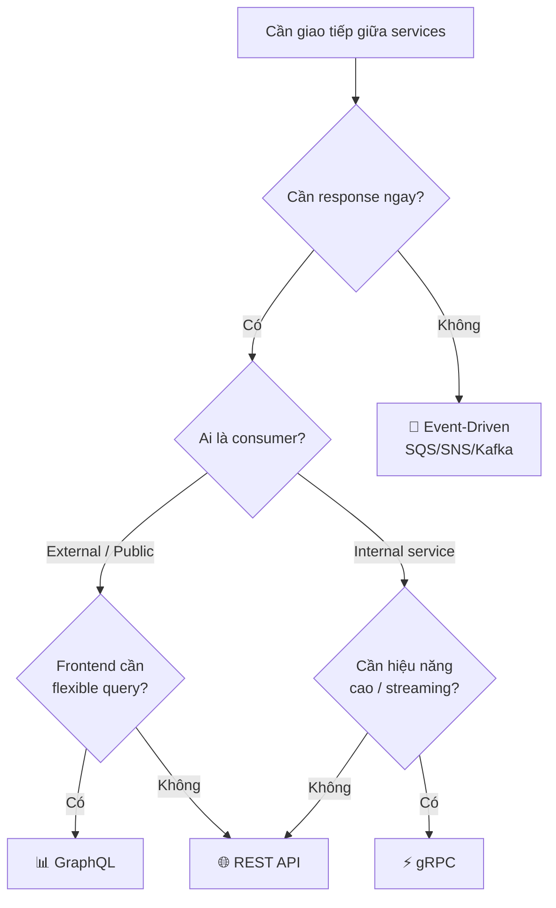
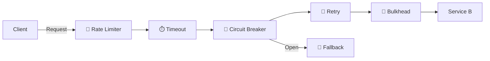

# 📋 Microservice Cheat Sheet — Tra cứu nhanh

> Tổng hợp các quyết định quan trọng khi thiết kế và vận hành hệ thống Microservice. Dùng để tra cứu nhanh — mỗi phần đi thẳng vào trọng tâm.

---

## 📑 Mục lục

- [1. Microservice vs Monolith — Khi nào chọn gì?](#1-microservice-vs-monolith--khi-nào-chọn-gì)
- [2. Checklist Decompose Service](#2-checklist-decompose-service)
- [3. Communication — Decision Matrix](#3-communication--decision-matrix)
- [4. Data Patterns — Khi nào dùng gì?](#4-data-patterns--khi-nào-dùng-gì)
- [5. Resilience — Áp dụng khi nào?](#5-resilience--áp-dụng-khi-nào)
- [6. Deployment Strategies — So sánh nhanh](#6-deployment-strategies--so-sánh-nhanh)
- [7. AWS — ECS vs EKS vs Lambda](#7-aws--ecs-vs-eks-vs-lambda)
- [8. Security Checklist](#8-security-checklist)
- [9. Observability Checklist](#9-observability-checklist)

---

## 1. Microservice vs Monolith — Khi nào chọn gì?

| Tiêu chí | 🏢 Monolith | 🧩 Microservice |
|----------|:-----------:|:---------------:|
| Team size | < 10 người | > 10 người, nhiều team |
| Domain complexity | Đơn giản, ít thay đổi | Phức tạp, nhiều subdomain |
| Time to market | Cần ship nhanh (MVP) | Đã có nền tảng ổn định |
| Scale yêu cầu | Scale đồng đều | Scale từng phần riêng |
| Deploy frequency | Vài lần/tháng | Nhiều lần/ngày, độc lập |
| Tech stack | Thống nhất 1 stack | Cần polyglot (nhiều ngôn ngữ) |
| DevOps maturity | Thấp | Cao (CI/CD, monitoring, container) |

> 💡 **Nguyên tắc vàng**: Bắt đầu Monolith → tách dần khi cần. Đừng Microservice từ ngày đầu nếu chưa hiểu rõ domain.

📖 Chi tiết: [01-microservice-overview.md](01-microservice-overview.md)

---

## 2. Checklist Decompose Service

Trước khi tách service, đi qua từng bước:

- [ ] **① Xác định Bounded Context** — Dùng Event Storming hoặc Domain Storytelling để tìm ranh giới domain
- [ ] **② Áp dụng Single Responsibility** — Mỗi service chỉ sở hữu 1 business capability rõ ràng
- [ ] **③ Kiểm tra data ownership** — Service sở hữu data riêng? Có cần share DB không?
- [ ] **④ Đánh giá coupling** — Service mới có phụ thuộc quá nhiều vào service khác?
- [ ] **⑤ Xác định communication** — Sync hay Async? API contract ra sao?
- [ ] **⑥ Đảm bảo independent deployment** — Deploy service này không ảnh hưởng service kia?
- [ ] **⑦ Kiểm tra team ownership** — Có 1 team chịu trách nhiệm toàn bộ service?

```
┌─────────────────────────────────────────────────────────────────┐
│                    DECOMPOSITION FLOW                           │
│                                                                 │
│  Monolith ──▶ Identify ──▶ Define ──▶ Extract ──▶ Validate     │
│              Domains     Boundaries   Services    Independence  │
│                │              │           │            │         │
│           Event Storming  Bounded     API +DB      Deploy &     │
│           Domain Mapping  Context     per svc     Test riêng    │
└─────────────────────────────────────────────────────────────────┘
```

📖 Chi tiết: [02-single-responsibility-bounded-context.md](02-single-responsibility-bounded-context.md) | [05-decomposition-strategies.md](05-decomposition-strategies.md)

---

## 3. Communication — Decision Matrix

### Bảng quyết định nhanh

| Khi nào? | REST | gRPC | GraphQL | Event-Driven |
|----------|:----:|:----:|:-------:|:------------:|
| CRUD đơn giản, public API | ✅ | ❌ | ⚠️ | ❌ |
| Internal service, cần hiệu năng cao | ⚠️ | ✅ | ❌ | ❌ |
| Frontend cần linh hoạt query | ❌ | ❌ | ✅ | ❌ |
| Gửi thông báo, không cần response ngay | ❌ | ❌ | ❌ | ✅ |
| Đồng bộ data giữa services | ❌ | ❌ | ❌ | ✅ |
| Real-time streaming | ❌ | ✅ | ⚠️ | ✅ |
| Mobile / low bandwidth | ⚠️ | ✅ | ✅ | ❌ |

> ✅ Phù hợp nhất　⚠️ Dùng được　❌ Không phù hợp

### Flowchart chọn Communication Pattern



📖 Chi tiết: [06-inter-service-communication.md](06-inter-service-communication.md) | [07-api-gateway.md](07-api-gateway.md)

---

## 4. Data Patterns — Khi nào dùng gì?

| Pattern | Dùng khi | ⚠️ Tránh khi | Complexity |
|---------|----------|-------------|:----------:|
| **Database per Service** | Mỗi service cần autonomy, scale riêng | Data quá đơn giản, 1-2 services | 🟢 Thấp |
| **Saga** (Choreography) | 2-4 services, flow đơn giản | Nhiều step, cần orchestrate phức tạp | 🟡 Trung bình |
| **Saga** (Orchestration) | 5+ services, flow phức tạp, cần rollback rõ ràng | Flow đơn giản (overkill) | 🔴 Cao |
| **CQRS** | Read/Write tải khác nhau, cần optimize read riêng | CRUD đơn giản, ít traffic | 🟡 Trung bình |
| **Event Sourcing** | Cần audit trail, replay events, temporal query | Chỉ cần state hiện tại, team chưa quen | 🔴 Cao |

### Ví dụ thực tế — E-Commerce Order Flow

```
Đặt hàng → Order Service ──(event)──▶ Payment Service
                                          │
                                     ──(event)──▶ Inventory Service
                                                       │
                                                  ──(event)──▶ Shipping Service

Pattern: Saga Choreography — mỗi service lắng nghe event và tiếp tục flow
```

📖 Chi tiết: [09-data-management.md](09-data-management.md) | [20-aws-data-management.md](20-aws-data-management.md)

---

## 5. Resilience — Áp dụng khi nào?

| Pattern | Vấn đề giải quyết | Khi nào dùng | Ví dụ |
|---------|-------------------|-------------|-------|
| 🔌 **Circuit Breaker** | Ngăn cascade failure | Gọi external service / dependency không ổn định | Payment → Bank API |
| 🔄 **Retry** (+ Exponential Backoff) | Transient errors (mạng, timeout) | Lỗi tạm thời, idempotent operation | DB connection timeout |
| 🧱 **Bulkhead** | Cô lập failure | Tách thread pool / resource cho mỗi dependency | Tách pool cho DB vs API |
| 🚦 **Rate Limiter** | Quá tải | Bảo vệ service khỏi spike traffic | Public API, login endpoint |
| 🔀 **Fallback** | Graceful degradation | Có thể trả kết quả thay thế chấp nhận được | Cache cũ, default response |
| ⏱️ **Timeout** | Treo request vô hạn | Mọi external call | Tất cả HTTP/gRPC calls |

### Áp dụng kết hợp



> 💡 **Thứ tự áp dụng**: Rate Limiter → Timeout → Circuit Breaker → Retry → Bulkhead

📖 Chi tiết: [10-resilience-patterns.md](10-resilience-patterns.md) | [21-aws-resilience.md](21-aws-resilience.md)

---

## 6. Deployment Strategies — So sánh nhanh

| Tiêu chí | 🔵🟢 Blue-Green | 🐤 Canary | 🔄 Rolling |
|----------|:---------------:|:---------:|:----------:|
| **Downtime** | Zero | Zero | Near-zero |
| **Rollback speed** | ⚡ Tức thì (switch traffic) | 🏃 Nhanh (dừng canary) | 🐢 Chậm hơn |
| **Resource cost** | 🔴 2x infra | 🟡 +10-20% | 🟢 Thấp nhất |
| **Risk** | 🟢 Thấp | 🟢 Rất thấp | 🟡 Trung bình |
| **Phù hợp** | Critical services, DB migration | High-traffic, cần validate dần | Non-critical, tiết kiệm cost |
| **AWS** | ECS + ALB | Lambda alias, EKS | ECS default |

📖 Chi tiết: [14-cicd-deployment.md](14-cicd-deployment.md) | [24-aws-cicd-deployment.md](24-aws-cicd-deployment.md)

---

## 7. AWS — ECS vs EKS vs Lambda

| Tiêu chí | 🐳 ECS Fargate | ☸️ EKS | ⚡ Lambda |
|----------|:--------------:|:------:|:---------:|
| **Quản lý** | AWS managed | Self-managed (K8s) | Fully managed |
| **Startup time** | Giây | Giây | Milliseconds (warm) |
| **Max execution** | Không giới hạn | Không giới hạn | 15 phút |
| **Pricing** | Per vCPU + Memory/giờ | EC2/Fargate + K8s fee | Per request + duration |
| **Scale** | Auto Scaling | HPA/VPA/KEDA | Tự động, tức thì |
| **Learning curve** | 🟢 Thấp | 🔴 Cao | 🟢 Thấp |
| **Best for** | Hầu hết workload | Multi-cloud, cần K8s ecosystem | Event-driven, bursty traffic |

### Khi nào chọn gì?

| Scenario | Chọn |
|----------|------|
| Team nhỏ, muốn đơn giản | ECS Fargate |
| Đã dùng K8s, cần portability | EKS |
| API xử lý < 15 phút, traffic biến động | Lambda |
| Long-running process, WebSocket | ECS / EKS |
| Xử lý event S3, SQS, DynamoDB Streams | Lambda |
| Budget hạn chế, traffic thấp | Lambda |

📖 Chi tiết: [18-aws-deployment-architecture.md](18-aws-deployment-architecture.md) | [19-aws-communication-discovery.md](19-aws-communication-discovery.md)

---

## 8. Security Checklist

### 🔐 Checklist nhanh cho mỗi service

**Authentication & Authorization**
- [ ] 🔑 OAuth2 / OIDC cho external users (Cognito, Auth0)
- [ ] 🎫 JWT token với expiry ngắn (15-30 phút) + Refresh Token
- [ ] 🛡️ RBAC hoặc ABAC cho authorization
- [ ] 🔒 Service-to-service: mTLS hoặc IAM Role

**API Security**
- [ ] 🚦 Rate Limiting trên API Gateway
- [ ] ✅ Input Validation — whitelist, không blacklist
- [ ] 🧹 Sanitize output — ngăn XSS, injection
- [ ] 📝 API Versioning

**Data & Network**
- [ ] 🔐 Encrypt at rest (KMS) + in transit (TLS 1.2+)
- [ ] 🔑 Secrets ở Vault / Secrets Manager — KHÔNG hardcode
- [ ] 🏰 Network isolation: VPC, Security Groups, private subnet
- [ ] 📋 Audit logging cho mọi action nhạy cảm

**DevSecOps**
- [ ] 🔍 SAST/DAST trong CI/CD pipeline
- [ ] 🐳 Scan Docker image vulnerabilities
- [ ] 📦 Dependency vulnerability scanning
- [ ] 🔄 Rotate secrets/keys định kỳ

📖 Chi tiết: [15-security.md](15-security.md) | [23-aws-security.md](23-aws-security.md) | [16-configuration-secrets-management.md](16-configuration-secrets-management.md)

---

## 9. Observability Checklist

### Ba trụ cột — Tối thiểu cần có

```
┌─────────────────────────────────────────────────────────────────┐
│                    OBSERVABILITY PILLARS                         │
│                                                                 │
│   📝 LOGS            📊 METRICS           🔍 TRACES             │
│   ─────────          ──────────           ────────              │
│   Structured JSON    Request rate (RPS)   Distributed tracing   │
│   Correlation ID     Error rate (%)       Span & trace ID       │
│   Log levels         Latency (p50/p95/p99) Service dependency   │
│   Centralized        Resource (CPU/MEM)   Bottleneck detection  │
│                                                                 │
│   ELK / CloudWatch   Prometheus/Grafana   Jaeger / X-Ray       │
│                      CloudWatch Metrics                         │
└─────────────────────────────────────────────────────────────────┘
```

### Checklist tối thiểu

**📝 Logs**
- [ ] Structured logging (JSON format)
- [ ] Correlation ID truyền qua tất cả services
- [ ] Log levels chuẩn: ERROR > WARN > INFO > DEBUG
- [ ] Centralized log aggregation (ELK / CloudWatch Logs)
- [ ] Log retention policy (30-90 ngày)

**📊 Metrics**
- [ ] RED metrics: **R**ate, **E**rror, **D**uration cho mỗi service
- [ ] Resource metrics: CPU, Memory, Disk, Network
- [ ] Business metrics: Orders/phút, Users active
- [ ] Alerting rules: Error rate > 1%, p99 > 3s
- [ ] Dashboard cho mỗi service + tổng quan hệ thống

**🔍 Traces**
- [ ] Distributed tracing enable cho tất cả services
- [ ] Trace ID propagate qua HTTP headers / message metadata
- [ ] Sample rate phù hợp (production: 1-10%)
- [ ] Service dependency map tự động

### Ví dụ Alert Rules

| Metric | Warning | Critical | Action |
|--------|---------|----------|--------|
| Error rate | > 1% | > 5% | Check logs, rollback nếu cần |
| p99 latency | > 2s | > 5s | Scale up, check dependencies |
| CPU usage | > 70% | > 90% | Auto scale / investigate |
| Disk usage | > 70% | > 85% | Cleanup / expand storage |

📖 Chi tiết: [11-observability-evolvability.md](11-observability-evolvability.md) | [22-aws-observability.md](22-aws-observability.md)

---

## 🔗 Quick Reference Links

| Chủ đề | Docs |
|--------|------|
| Tổng quan Microservice | [01-overview](01-microservice-overview.md) |
| Decomposition | [02-SRP](02-single-responsibility-bounded-context.md), [05-strategies](05-decomposition-strategies.md) |
| Communication | [06-communication](06-inter-service-communication.md), [07-gateway](07-api-gateway.md), [08-discovery](08-service-discovery.md) |
| Data | [09-data](09-data-management.md) |
| Resilience | [10-resilience](10-resilience-patterns.md) |
| Observability | [11-observability](11-observability-evolvability.md) |
| Deployment | [12-container](12-containerization.md), [13-orchestration](13-orchestration.md), [14-cicd](14-cicd-deployment.md) |
| Security | [15-security](15-security.md), [16-config](16-configuration-secrets-management.md) |
| Design Patterns | [17-patterns](17-design-patterns.md) |
| AWS | [18](18-aws-deployment-architecture.md)–[24](24-aws-cicd-deployment.md) |
| Case Study | [25-ecommerce](25-case-study-ecommerce.md), [26-food-delivery](26-case-study-food-delivery.md) |

---

> 💡 **Tip**: Bookmark file này — dùng khi cần quyết định nhanh trong thiết kế hệ thống Microservice!
