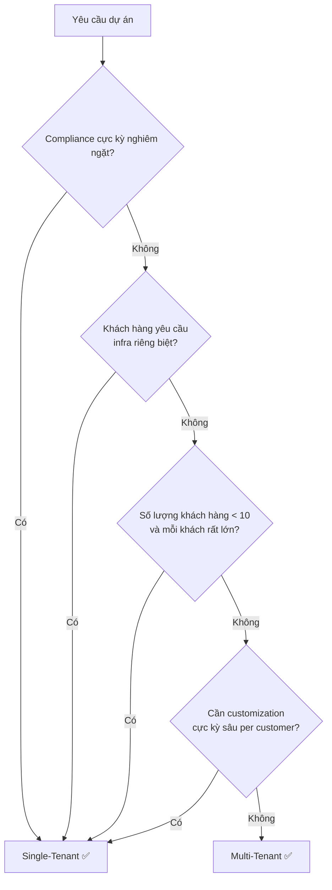
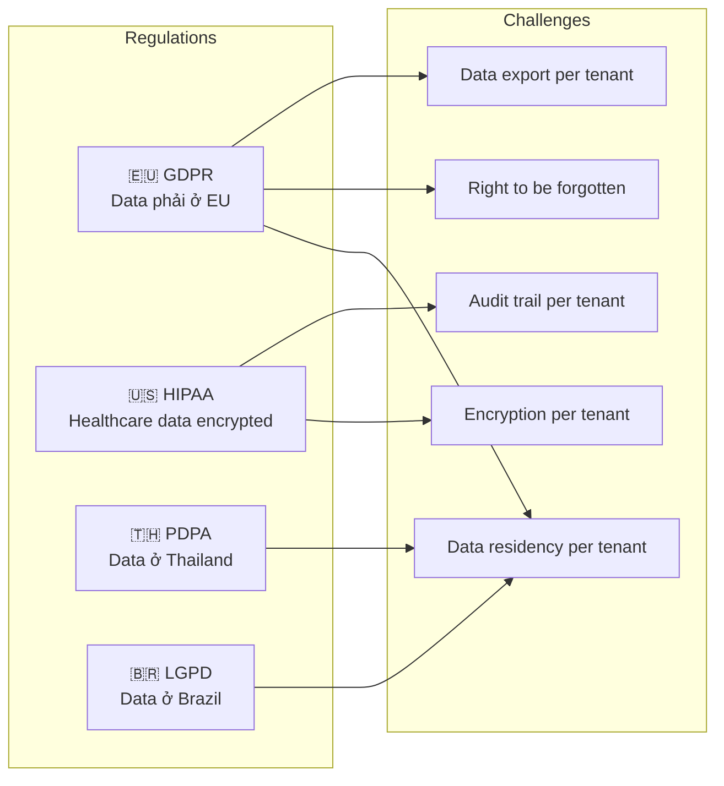
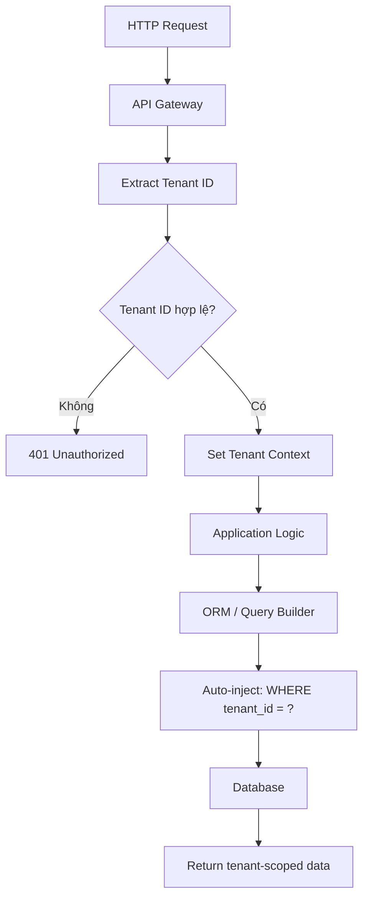
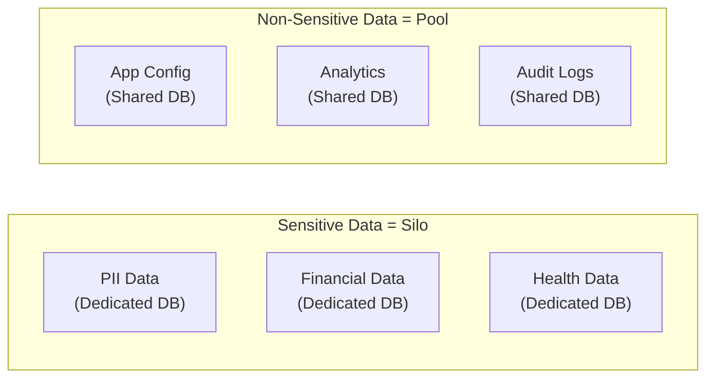
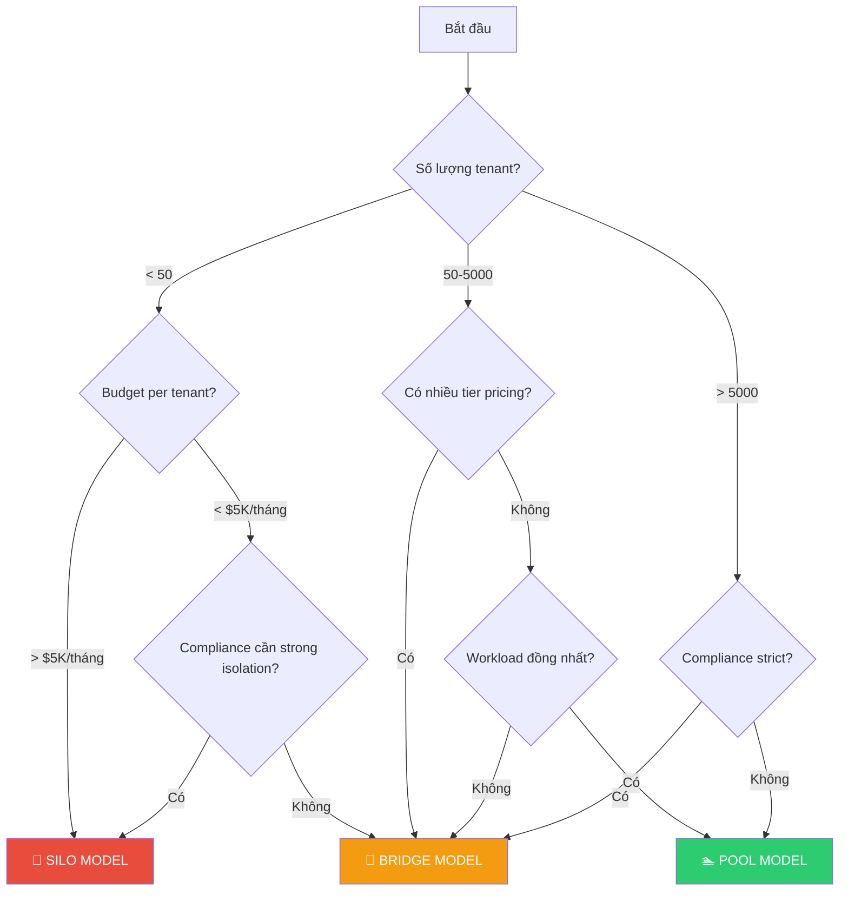
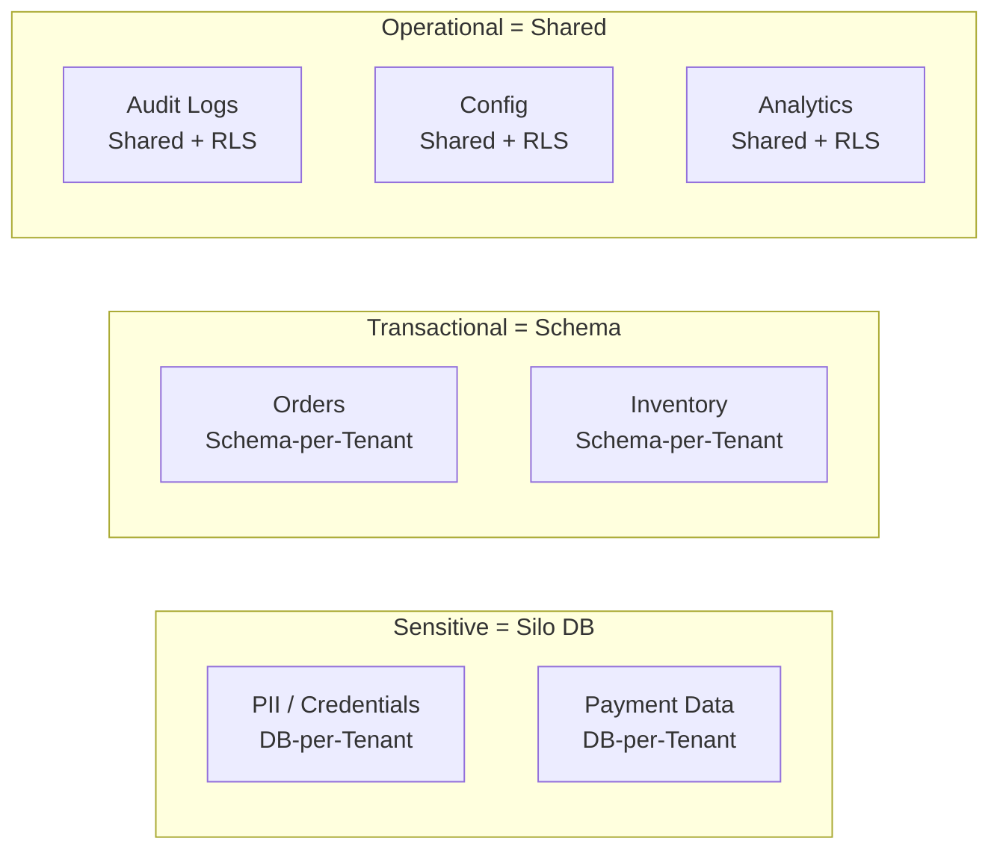
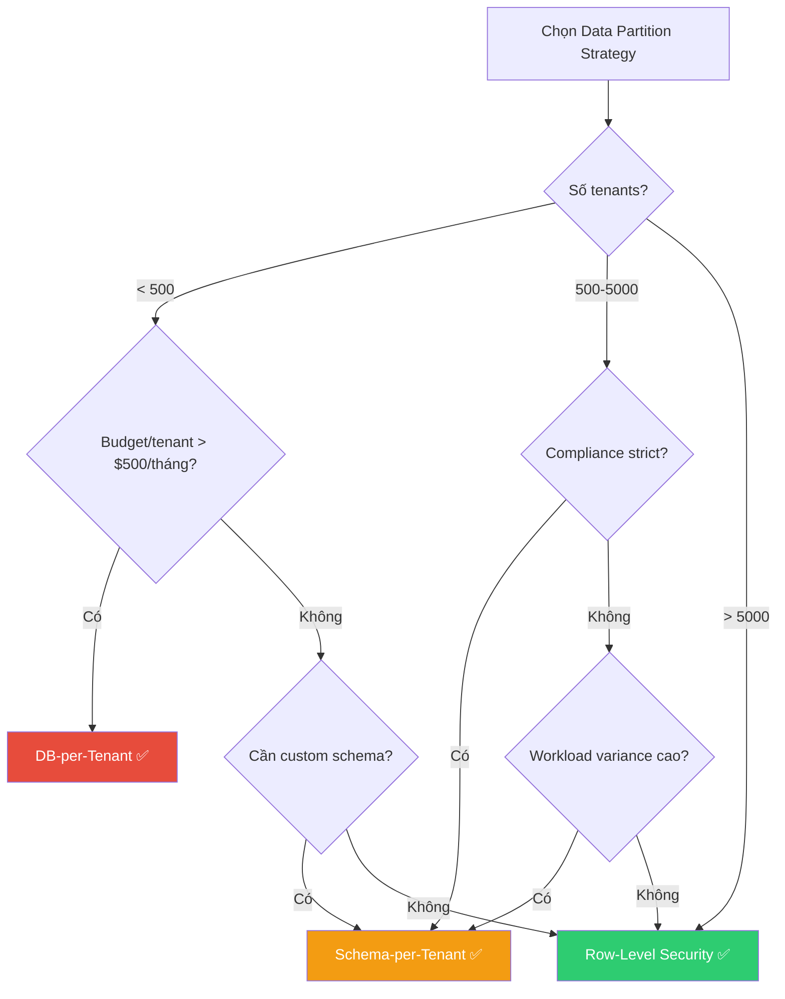

# 🏢 Multi-Tenant Architecture — Xây dựng hệ thống Multi-Tenant từ A đến Z

> Hướng dẫn toàn diện về thiết kế, triển khai và vận hành hệ thống Multi-Tenant trong kiến trúc Microservice — bao gồm Best Practices, Bad Practices và các bài học thực tế.

```
┌─────────────────────────────────────────────────────────────────────┐
│                    MULTI-TENANT ARCHITECTURE                        │
│                                                                     │
│  ┌──────────┐  ┌──────────┐  ┌──────────┐  ┌──────────┐            │
│  │ Tenant A │  │ Tenant B │  │ Tenant C │  │ Tenant D │            │
│  └────┬─────┘  └────┬─────┘  └────┬─────┘  └────┬─────┘            │
│       │             │             │             │                   │
│  ─────┴─────────────┴─────────────┴─────────────┴──────────         │
│              Shared Infrastructure / Isolated Data                  │
│                                                                     │
│  ┌──────────────────────────────────────────────────────┐           │
│  │  Shared Services │ Shared Compute │ Shared Network   │           │
│  └──────────────────────────────────────────────────────┘           │
└─────────────────────────────────────────────────────────────────────┘
```

---

## 📋 Mục lục

- [1. Tổng quan Multi-Tenancy](#1-tổng-quan-multi-tenancy)
  - [1.1 Multi-Tenancy là gì?](#11-multi-tenancy-là-gì)
  - [1.2 Single-Tenant vs Multi-Tenant](#12-single-tenant-vs-multi-tenant)
  - [1.3 Tại sao cần Multi-Tenancy?](#13-tại-sao-cần-multi-tenancy)
  - [1.4 Các thách thức chính](#14-các-thách-thức-chính)
- [2. Tenant Isolation Models](#2-tenant-isolation-models)
  - [2.1 Silo Model (Dedicated)](#21-silo-model-dedicated)
  - [2.2 Pool Model (Shared)](#22-pool-model-shared)
  - [2.3 Bridge Model (Hybrid)](#23-bridge-model-hybrid)
  - [2.4 So sánh và ma trận quyết định](#24-so-sánh-và-ma-trận-quyết-định)
- [3. Data Partitioning Strategies](#3-data-partitioning-strategies)
  - [3.1 Database-per-Tenant](#31-database-per-tenant)
  - [3.2 Schema-per-Tenant](#32-schema-per-tenant)
  - [3.3 Row-Level Security (Shared Table)](#33-row-level-security-shared-table)
  - [3.4 Table-per-Tenant](#34-table-per-tenant)
  - [3.5 Hybrid Data Partitioning](#35-hybrid-data-partitioning)
  - [3.6 So sánh chi tiết](#36-so-sánh-chi-tiết)
- [4. Tenant Identity & Context Propagation](#4-tenant-identity--context-propagation)
  - [4.1 Tenant Resolution Strategies](#41-tenant-resolution-strategies)
  - [4.2 Tenant Context trong Microservice](#42-tenant-context-trong-microservice)
  - [4.3 Propagation qua Message Queue / Event Bus](#43-propagation-qua-message-queue--event-bus)
- [5. Authentication & Authorization](#5-authentication--authorization)
  - [5.1 Tenant-aware AuthN/AuthZ](#51-tenant-aware-authnauthz)
  - [5.2 RBAC trong Multi-Tenant](#52-rbac-trong-multi-tenant)
  - [5.3 Cross-Tenant Access Control](#53-cross-tenant-access-control)
  - [5.4 API Gateway và Tenant Routing](#54-api-gateway-và-tenant-routing)
- [6. Compute & Infrastructure Isolation](#6-compute--infrastructure-isolation)
  - [6.1 Shared Compute (Pool)](#61-shared-compute-pool)
  - [6.2 Dedicated Compute (Silo)](#62-dedicated-compute-silo)
  - [6.3 Kubernetes Multi-Tenancy](#63-kubernetes-multi-tenancy)
  - [6.4 Serverless Multi-Tenancy](#64-serverless-multi-tenancy)
  - [6.5 Network Isolation](#65-network-isolation)
- [7. Noisy Neighbor Problem](#7-noisy-neighbor-problem)
  - [7.1 Nguyên nhân và tác động](#71-nguyên-nhân-và-tác-động)
  - [7.2 Detection & Monitoring](#72-detection--monitoring)
  - [7.3 Mitigation Strategies](#73-mitigation-strategies)
  - [7.4 Rate Limiting & Throttling per Tenant](#74-rate-limiting--throttling-per-tenant)
  - [7.5 Resource Quotas & Fair Scheduling](#75-resource-quotas--fair-scheduling)
- [8. Tenant Onboarding & Lifecycle](#8-tenant-onboarding--lifecycle)
  - [8.1 Automated Provisioning](#81-automated-provisioning)
  - [8.2 Tenant Configuration & Customization](#82-tenant-configuration--customization)
  - [8.3 Tenant Offboarding & Data Retention](#83-tenant-offboarding--data-retention)
  - [8.4 Tenant Migration](#84-tenant-migration)
- [9. Security & Compliance](#9-security--compliance)
  - [9.1 Cross-Tenant Data Leak Prevention](#91-cross-tenant-data-leak-prevention)
  - [9.2 Encryption Strategies](#92-encryption-strategies)
  - [9.3 Compliance (GDPR, HIPAA, SOC2)](#93-compliance-gdpr-hipaa-soc2)
  - [9.4 Data Residency & Sovereignty](#94-data-residency--sovereignty)
  - [9.5 Audit Logging per Tenant](#95-audit-logging-per-tenant)
- [10. Observability & Monitoring](#10-observability--monitoring)
  - [10.1 Tenant-aware Logging](#101-tenant-aware-logging)
  - [10.2 Tenant-aware Metrics](#102-tenant-aware-metrics)
  - [10.3 Tenant-aware Tracing](#103-tenant-aware-tracing)
  - [10.4 Per-Tenant Dashboards & Alerting](#104-per-tenant-dashboards--alerting)
  - [10.5 Cost Attribution per Tenant](#105-cost-attribution-per-tenant)
- [11. Scaling & Performance](#11-scaling--performance)
  - [11.1 Horizontal vs Vertical Scaling per Tenant](#111-horizontal-vs-vertical-scaling-per-tenant)
  - [11.2 Caching Strategies](#112-caching-strategies)
  - [11.3 Connection Pooling](#113-connection-pooling)
  - [11.4 Tenant-aware Auto Scaling](#114-tenant-aware-auto-scaling)
- [12. CI/CD & Deployment](#12-cicd--deployment)
  - [12.1 Schema Migration cho Multi-Tenant](#121-schema-migration-cho-multi-tenant)
  - [12.2 Feature Flags per Tenant](#122-feature-flags-per-tenant)
  - [12.3 Canary Deployment per Tenant](#123-canary-deployment-per-tenant)
  - [12.4 Rollback Strategies](#124-rollback-strategies)
- [13. Triển khai trên Cloud (AWS / Azure / GCP)](#13-triển-khai-trên-cloud-aws--azure--gcp)
  - [13.1 AWS Multi-Tenant Patterns](#131-aws-multi-tenant-patterns)
  - [13.2 Azure Multi-Tenant Patterns](#132-azure-multi-tenant-patterns)
  - [13.3 GCP Multi-Tenant Patterns](#133-gcp-multi-tenant-patterns)
- [14. Best Practices — Tổng hợp](#14-best-practices--tổng-hợp)
- [15. Bad Practices & Anti-Patterns](#15-bad-practices--anti-patterns)
- [16. Case Study: Thiết kế SaaS Multi-Tenant E2E](#16-case-study-thiết-kế-saas-multi-tenant-e2e)
- [17. Tài liệu tham khảo](#17-tài-liệu-tham-khảo)

---

## 1. Tổng quan Multi-Tenancy

### 1.1 Multi-Tenancy là gì?

**Multi-Tenancy** (đa thuê) là một mô hình kiến trúc phần mềm trong đó **một instance duy nhất** của ứng dụng phục vụ **nhiều khách hàng (tenant)** đồng thời. Mỗi tenant chia sẻ cùng hạ tầng, codebase và tài nguyên hệ thống, nhưng dữ liệu và cấu hình của họ được **cách ly logic** với nhau.

#### Thuật ngữ cốt lõi

| Thuật ngữ | Định nghĩa | Ví dụ |
|-----------|------------|-------|
| **Tenant** | Một đơn vị tổ chức (thường là công ty/tổ chức) sử dụng hệ thống. Một tenant có thể chứa nhiều users | Công ty ACME đăng ký dùng Slack → ACME là 1 tenant |
| **Tenant ID** | Định danh duy nhất (UUID/string) gắn với mỗi tenant, xuyên suốt toàn bộ hệ thống | `tenant_id = "acme-corp-uuid-1234"` |
| **Tenant Context** | Thông tin tenant hiện tại được truyền qua các layer trong một request | JWT claim, HTTP header, ThreadLocal |
| **Tenant Isolation** | Cơ chế đảm bảo tenant A không thể truy cập dữ liệu/tài nguyên của tenant B | Database riêng, Row-Level Security, Network Policy |
| **Tenant Tier** | Phân loại tenant theo mức dịch vụ (Free/Pro/Enterprise) — ảnh hưởng đến mức isolation và resource allocation | Free → shared DB; Enterprise → dedicated DB |
| **Noisy Neighbor** | Hiện tượng một tenant sử dụng quá nhiều tài nguyên, làm ảnh hưởng hiệu năng của các tenant khác | Tenant A chạy query nặng → tenant B bị chậm |
| **Cross-Tenant Data Leak** | Lỗi bảo mật khi dữ liệu của tenant A bị lộ cho tenant B | Thiếu `WHERE tenant_id = ?` trong query |
| **SaaS** (Software as a Service) | Mô hình phân phối phần mềm qua cloud, thường sử dụng multi-tenancy | Slack, Salesforce, Jira, Shopify |

#### Phân biệt Tenant vs User vs Organization

```
┌─────────────────────────────────────────────────────┐
│                    SaaS Platform                    │
│                                                     │
│  ┌───────────────────────┐  ┌─────────────────────┐ │
│  │      Tenant A         │  │     Tenant B        │ │
│  │   (ACME Corp)         │  │   (Beta Inc)        │ │
│  │                       │  │                     │ │
│  │  ┌─────┐  ┌─────┐     │  │  ┌─────┐  ┌─────┐   │ │
│  │  │Admin│  │User │     │  │  │Admin│  │User │   │ │
│  │  │John │  │Jane │     │  │  │Bob  │  │Alice│   │ │
│  │  └─────┘  └─────┘     │  │  └─────┘  └─────┘   │ │
│  │                       │  │                     │ │
│  │  Organization = Tenant│  │  Organization=Tenant│ │
│  │  Users ⊂ Tenant       │  │  Users ⊂ Tenant     │ │
│  └───────────────────────┘  └─────────────────────┘ │
│                                                     │
│  Tenant boundary = ranh giới isolation              │
│  User = cá nhân đăng nhập, thuộc về 1 tenant        │
└─────────────────────────────────────────────────────┘
```

**Quy tắc quan trọng:**
- **Tenant** = ranh giới cách ly dữ liệu và tài nguyên (thường = 1 tổ chức/công ty)
- **User** = cá nhân thuộc về một tenant, có role/permission riêng
- **Organization** = có thể đồng nghĩa với tenant, hoặc là cấp trên/dưới tùy thiết kế
- Một user **chỉ thuộc 1 tenant** (mô hình đơn giản) hoặc **thuộc nhiều tenant** (mô hình phức tạp — Slack, Notion)

### 1.2 Single-Tenant vs Multi-Tenant

#### Kiến trúc Single-Tenant

Mỗi khách hàng có **instance riêng** của toàn bộ ứng dụng: codebase, database, infra tách biệt hoàn toàn.

```
┌─────────────────┐  ┌─────────────────┐  ┌─────────────────┐
│   Instance A    │  │   Instance B    │  │   Instance C    │
│  (Customer A)   │  │  (Customer B)   │  │  (Customer C)   │
│                 │  │                 │  │                 │
│  ┌──────────┐   │  │  ┌──────────┐   │  │  ┌──────────┐   │
│  │   App    │   │  │  │   App    │   │  │  │   App    │   │
│  └────┬─────┘   │  │  └────┬─────┘   │  │  └────┬─────┘   │
│  ┌────┴─────┐   │  │  ┌────┴─────┐   │  │  ┌────┴─────┐   │
│  │    DB    │   │  │  │    DB    │   │  │  │    DB    │   │
│  └──────────┘   │  │  └──────────┘   │  │  └──────────┘   │
└─────────────────┘  └─────────────────┘  └─────────────────┘
   Riêng biệt            Riêng biệt           Riêng biệt
```

#### Kiến trúc Multi-Tenant

Tất cả khách hàng chia sẻ **cùng một instance** của ứng dụng, dữ liệu được cách ly bằng logic.

```
┌──────────────────────────────────────────────────────┐
│              Shared Application Instance             │
│                                                      │
│  ┌─────────────────────────────────────────────────┐ │
│  │              Application Layer                  │ │
│  │      Tenant Context → Route → Process           │ │
│  └────────────────────┬────────────────────────────┘ │
│                       │                              │
│  ┌────────┬───────────┼───────────┬────────────────┐ │
│  │Tenant A│  Tenant B │  Tenant C │   Tenant D     │ │
│  │ Data   │  Data     │  Data     │   Data         │ │
│  └────────┴───────────┴───────────┴────────────────┘ │
│           Shared Database (logical isolation)        │
└──────────────────────────────────────────────────────┘
```

#### Bảng so sánh toàn diện

| Tiêu chí | Single-Tenant | Multi-Tenant |
|----------|:------------:|:------------:|
| **Kiến trúc** | 1 instance / 1 customer | 1 instance / N customers |
| **Chi phí hạ tầng** | 🔴 Cao — nhân bản mọi thứ theo số khách | 🟢 Thấp — chia sẻ tài nguyên |
| **Chi phí vận hành** | 🔴 Cao — quản lý N hệ thống | 🟢 Thấp — quản lý 1 hệ thống |
| **Data Isolation** | 🟢 Mạnh nhất — vật lý tách biệt | 🟡 Phụ thuộc chiến lược — logic isolation |
| **Customization** | 🟢 Tùy biến thoải mái per customer | 🟡 Giới hạn — phải thiết kế configuration system |
| **Security Risk** | 🟢 Thấp — không chia sẻ gì | 🔴 Cao hơn — rủi ro cross-tenant leak |
| **Performance** | 🟢 Ổn định — không noisy neighbor | 🟡 Cần quản lý noisy neighbor |
| **Scalability** | 🔴 Khó scale — phải clone per customer | 🟢 Dễ scale — thêm tenant = thêm data |
| **Time-to-Market** | 🔴 Chậm — mỗi customer = 1 deployment | 🟢 Nhanh — onboard tenant mới trong phút |
| **Update/Patch** | 🔴 Phải update từng instance | 🟢 Update 1 lần cho tất cả |
| **Compliance** | 🟢 Dễ đáp ứng — data riêng biệt | 🟡 Phức tạp — cần thiết kế cẩn thận |
| **Phù hợp cho** | On-premise, Enterprise lớn, ngành regulated | SaaS, startup, scale nhanh |

#### Khi nào chọn Single-Tenant?



### 1.3 Tại sao cần Multi-Tenancy?

#### 1.3.1 Business Drivers

**① Hiệu quả chi phí (Cost Efficiency)**

Multi-Tenancy là nền tảng kinh tế của mô hình SaaS:

```
Single-Tenant (100 khách hàng):
┌──────────────────────────────────────────┐
│  100 × Server    = 100 servers           │
│  100 × Database  = 100 DB instances      │
│  100 × Ops team  = huge ops overhead     │
│  Chi phí: $$$$$$$$$$                     │
└──────────────────────────────────────────┘

Multi-Tenant (100 khách hàng):
┌──────────────────────────────────────────┐
│  2-3 × Server cluster = auto-scaled      │
│  1-3 × Database       = shared/pooled    │
│  1 × Ops pipeline     = automated        │
│  Chi phí: $$$                            │
└──────────────────────────────────────────┘

→ Tiết kiệm 60-80% chi phí hạ tầng
```

**② Tốc độ phát triển sản phẩm (Time-to-Market)**

- Onboard tenant mới trong **phút** thay vì **ngày/tuần**
- Một codebase → một CI/CD pipeline → deploy cho tất cả tenant
- Bug fix / feature release đồng thời cho toàn bộ khách hàng
- A/B testing dễ dàng: feature flag per tenant

**③ Khả năng mở rộng (Scalability)**

- Thêm 1000 tenant mới ≠ thêm 1000 server mới
- Horizontal scaling dựa trên tổng load, không phải per-customer
- Resource pooling tối ưu hóa utilization
- Elastic scaling theo actual demand

**④ Operational Excellence**

- Monitoring tập trung — 1 dashboard cho toàn hệ thống
- Schema migration 1 lần cho tất cả (trong shared model)
- Security patching nhanh và đồng nhất
- Giảm DevOps overhead đáng kể

#### 1.3.2 Ví dụ thực tế

| SaaS Product | Multi-Tenant Model | Số tenant | Ghi chú |
|-------------|-------------------|-----------|---------|
| **Salesforce** | Shared DB + Metadata-driven schema | 150,000+ orgs | Tenant customization qua metadata, không thay đổi schema |
| **Slack** | Shared infrastructure, sharded DB | 750,000+ orgs | Shard by tenant cho performance |
| **Shopify** | Sharded DB, pod-based isolation | 2M+ shops | Mỗi "pod" chứa ~10K shops, dedicated DB shard |
| **Jira/Atlassian** | Shared infra (cloud), per-tenant DB (data center) | 200,000+ | Hybrid model tùy deployment |
| **AWS Cognito** | Shared compute, per-tenant User Pool | Millions | Pool-based isolation cho identity |

### 1.4 Các thách thức chính

Multi-Tenancy mang lại lợi ích lớn nhưng đi kèm **5 nhóm thách thức trọng yếu**:

#### Thách thức 1: Data Isolation & Security

```
⚠️ VẤN ĐỀ NGHIÊM TRỌNG NHẤT

Một dòng code thiếu sót có thể lộ data toàn bộ tenant:

  ❌ SELECT * FROM orders;                         → Lộ data mọi tenant
  ✅ SELECT * FROM orders WHERE tenant_id = ?;     → Chỉ data tenant hiện tại

Điều này phải được enforce ở:
  • Application layer (middleware, ORM filter)
  • Database layer (Row-Level Security, schema)
  • Infrastructure layer (network, IAM)
  • API layer (authorization check)
```

**Rủi ro cụ thể:**
- **Cross-tenant data leak**: Query thiếu `tenant_id` filter
- **Cache poisoning**: Cache key không chứa tenant → trả data sai tenant
- **Shared file storage leak**: Upload/download file không validate tenant
- **Log leakage**: Log chứa sensitive data của tenant khác
- **API response leak**: Serialization lỗi trả data cross-tenant

#### Thách thức 2: Noisy Neighbor

```
Tenant A: 10 requests/giây (bình thường)
Tenant B: 10,000 requests/giây (spike đột biến)

Hậu quả (nếu không có isolation):
┌──────────────────────────────────────────┐
│  Shared Resource Pool                    │
│                                          │
│  CPU:  [████████████████████████████░░]  │
│         ↑ Tenant B chiếm 90% CPU         │
│                                          │
│  Tenant A response time: 200ms → 5000ms  │
│  Tenant C response time: 150ms → 3000ms  │
│  Tenant B response time: 100ms → 200ms   │
│                                          │
│  → Tất cả tenant khác bị ảnh hưởng!      │
└──────────────────────────────────────────┘
```

**Giải pháp**: Rate limiting, resource quotas, tenant-aware scaling, circuit breaker per tenant (chi tiết ở [Chương 7](#7-noisy-neighbor-problem))

#### Thách thức 3: Tenant Customization

Mỗi tenant có nhu cầu khác nhau nhưng phải chạy trên **cùng một codebase**:

| Nhu cầu | Độ khó | Giải pháp |
|---------|:------:|-----------|
| Custom branding (logo, color) | 🟢 Dễ | Tenant config table |
| Custom fields trên entities | 🟡 Trung bình | EAV pattern / JSON columns / Metadata tables |
| Custom business rules | 🟡 Trung bình | Rule engine, feature flags |
| Custom workflows | 🔴 Khó | Workflow engine (Temporal, Camunda) |
| Custom integrations | 🔴 Khó | Webhook system, plugin architecture |
| Custom schema changes | 🔴 Rất khó | Metadata-driven schema (Salesforce approach) |

#### Thách thức 4: Compliance & Data Residency



**Vấn đề cụ thể:**
- Tenant ở EU yêu cầu data phải lưu ở EU region → cần **multi-region deployment**
- Tenant healthcare yêu cầu HIPAA → cần **encryption at rest + audit logging**
- GDPR "right to be forgotten" → phải xóa **toàn bộ** data của tenant mà **không ảnh hưởng** tenant khác
- Trong shared database model, việc đảm bảo compliance **cực kỳ phức tạp**

#### Thách thức 5: Operational Complexity

| Vấn đề vận hành | Trong Single-Tenant | Trong Multi-Tenant |
|-----------------|--------------------|--------------------|
| Schema migration | Migrate 1 DB | Migrate 1 DB nhưng ảnh hưởng tất cả tenant / hoặc migrate N schemas |
| Monitoring | Monitor 1 instance | Monitor per-tenant metrics trong shared infra |
| Debugging | Log của 1 customer | Phải filter log theo tenant_id, distributed tracing cần tenant context |
| Backup/Restore | Backup 1 DB | Backup shared DB — restore 1 tenant = phức tạp |
| Performance tuning | Optimize cho 1 workload | Optimize cho N workloads khác nhau trên shared resources |
| Tenant onboarding | Deploy mới hoàn toàn | Provision resources, seed data, config — cần automation |
| Rollback | Rollback 1 instance | Rollback ảnh hưởng tất cả tenant — cần canary per tenant |

#### Tổng kết thách thức — Risk Matrix

```
                      Xác suất xảy ra
                    Thấp        Cao
                 ┌──────────┬──────────┐
          Cao    │ Data     │ Noisy    │
Tác động         │ Residency│ Neighbor │
                 │ Violation│ Problem  │
                 ├──────────┼──────────┤
          Thấp   │ Schema   │ Config   │
                 │ Migration│ Drift    │
                 │ Failure  │          │
                 └──────────┴──────────┘

Ưu tiên xử lý:
1. 🔴 Cross-tenant data leak    → Impact: catastrophic, Must fix
2. 🟠 Noisy neighbor            → Impact: high, Should fix
3. 🟡 Compliance violation      → Impact: high, Must plan
4. 🟢 Operational complexity    → Impact: medium, Optimize over time
```

---

## 2. Tenant Isolation Models

Ba mô hình cách ly tenant cơ bản: **Silo** (tách biệt hoàn toàn), **Pool** (chia sẻ hoàn toàn), và **Bridge** (kết hợp). Việc chọn đúng mô hình ảnh hưởng trực tiếp đến chi phí, bảo mật, hiệu năng và khả năng scale của toàn bộ hệ thống.

```
┌──────────────────────────────────────────────────────────────────────┐
│                    ISOLATION SPECTRUM                                │
│                                                                      │
│  Silo                    Bridge                    Pool              │
│  (Dedicated)             (Hybrid)                  (Shared)          │
│  ◄──────────────────────────────────────────────────────────►        │
│                                                                      │
│  🔒 Max Isolation                              💰 Max Cost Savings   │
│  💰 Max Cost                                   🔒 Min Isolation      │
│  🔧 Max Customization                          🔧 Min Customization  │
│  📈 Min Resource Efficiency                    📈 Max Efficiency     │
└──────────────────────────────────────────────────────────────────────┘
```

### 2.1 Silo Model (Dedicated)

**Silo Model** cung cấp cho mỗi tenant **tài nguyên riêng biệt hoàn toàn** — từ compute, database, storage đến network. Mỗi tenant hoạt động như một "hòn đảo" độc lập.

#### Kiến trúc Silo Model

```
┌─────────────────────────────────────────────────────────────────┐
│                      SILO MODEL                                 │
│                                                                 │
│  ┌──────────────────┐   ┌──────────────────┐   ┌──────────────┐ │
│  │    Tenant A      │   │    Tenant B      │   │   Tenant C   │ │
│  │                  │   │                  │   │              │ │
│  │  ┌─────────────┐ │   │  ┌─────────────┐ │   │ ┌──────────┐ │ │
│  │  │   App Pod   │ │   │  │   App Pod   │ │   │ │ App Pod  │ │ │
│  │  │  (Private)  │ │   │  │  (Private)  │ │   │ │(Private) │ │ │
│  │  └──────┬──────┘ │   │  └──────┬──────┘ │   │ └─────┬────┘ │ │
│  │  ┌──────┴──────┐ │   │  ┌──────┴──────┐ │   │ ┌─────┴────┐ │ │
│  │  │  Database   │ │   │  │  Database   │ │   │ │ Database │ │ │
│  │  │  (Private)  │ │   │  │  (Private)  │ │   │ │(Private) │ │ │
│  │  └─────────────┘ │   │  └─────────────┘ │   │ └──────────┘ │ │
│  │  ┌─────────────┐ │   │  ┌─────────────┐ │   │ ┌──────────┐ │ │
│  │  │   Cache     │ │   │  │   Cache     │ │   │ │  Cache   │ │ │
│  │  └─────────────┘ │   │  └─────────────┘ │   │ └──────────┘ │ │
│  │  ┌─────────────┐ │   │  ┌─────────────┐ │   │ ┌──────────┐ │ │
│  │  │   Storage   │ │   │  │   Storage   │ │   │ │ Storage  │ │ │
│  │  └─────────────┘ │   │  └─────────────┘ │   │ └──────────┘ │ │
│  │                  │   │                  │   │              │ │
│  │  VPC / Namespace │   │  VPC / Namespace │   │VPC/Namespace │ │
│  └──────────────────┘   └──────────────────┘   └──────────────┘ │
│                                                                 │
│  Mọi thứ tách biệt: compute, data, network, storage             │
└─────────────────────────────────────────────────────────────────┘
```

#### Các mức Silo

| Mức Silo | Mô tả | Chi phí | Isolation |
|----------|--------|:-------:|:---------:|
| **Account-level** | Mỗi tenant = 1 AWS Account / Azure Subscription | 💰💰💰💰 | 🔒🔒🔒🔒 |
| **VPC-level** | Mỗi tenant = 1 VPC riêng trong cùng account | 💰💰💰 | 🔒🔒🔒 |
| **Cluster-level** | Mỗi tenant = 1 K8s cluster riêng | 💰💰💰 | 🔒🔒🔒 |
| **Namespace-level** | Mỗi tenant = 1 K8s namespace + resource quota | 💰💰 | 🔒🔒 |
| **Container-level** | Mỗi tenant = dedicated containers trong shared cluster | 💰💰 | 🔒🔒 |

#### Ưu điểm

- ✅ **Isolation tuyệt đối**: Không có bất kỳ shared resource nào → zero cross-tenant risk
- ✅ **Performance guaranteed**: Không bao giờ bị noisy neighbor
- ✅ **Compliance dễ dàng**: Mỗi tenant có thể đặt ở region riêng, encryption key riêng
- ✅ **Customization tối đa**: Có thể tune DB, scale compute, custom config per tenant
- ✅ **Backup/Restore đơn giản**: Backup/restore per tenant = backup/restore 1 DB
- ✅ **Blast radius nhỏ**: Lỗi 1 tenant không ảnh hưởng tenant khác

#### Nhược điểm

- ❌ **Chi phí cao nhất**: Mỗi tenant cần dedicated resources → chi phí tăng tuyến tính theo số tenant
- ❌ **Operational overhead lớn**: Quản lý N databases, N clusters, N pipelines
- ❌ **Schema migration phức tạp**: Phải apply cho từng tenant DB → cần automation mạnh
- ❌ **Onboarding chậm**: Provision infra cho tenant mới mất thời gian (trừ khi automation tốt)
- ❌ **Resource waste**: Tenant nhỏ vẫn cần minimum resources → utilization thấp
- ❌ **Cross-tenant analytics khó**: Data phân tán → cần ETL/data pipeline riêng

#### Use Cases phù hợp

```
✅ Silo Model phù hợp khi:
├── Ngành regulated: Healthcare (HIPAA), Finance (PCI-DSS), Government
├── Enterprise khách hàng lớn: Mỗi khách hàng trả $10K+/tháng
├── Yêu cầu SLA riêng: 99.99% uptime guarantee per tenant
├── Data residency bắt buộc: Data phải ở region cụ thể per tenant
├── Số lượng tenant ít: 10-100 tenants (không phải 10,000+)
└── Tenant yêu cầu dedicated resources trong hợp đồng
```

#### Ví dụ thực tế

- **AWS GovCloud**: Mỗi government agency = separate account
- **Salesforce Shield**: Enterprise tier = dedicated infrastructure
- **MongoDB Atlas Dedicated**: 1 cluster per customer

### 2.2 Pool Model (Shared)

**Pool Model** cho tất cả tenant chia sẻ **toàn bộ tài nguyên**: cùng compute, cùng database, cùng cache. Cách ly bằng **logic trong application** (tenant_id).

#### Kiến trúc Pool Model

```
┌────────────────────────────────────────────────────────────────┐
│                       POOL MODEL                               │
│                                                                │
│  ┌──────────────────────────────────────────────────────────┐  │
│  │                  Shared Compute Layer                    │  │
│  │                                                          │  │
│  │   Request → Extract Tenant ID → Route → Process          │  │
│  │                                                          │  │
│  │   ┌────────┐  ┌────────┐  ┌────────┐  ┌────────┐         │  │
│  │   │ Pod 1  │  │ Pod 2  │  │ Pod 3  │  │ Pod N  │         │  │
│  │   │(shared)│  │(shared)│  │(shared)│  │(shared)│         │  │
│  │   └───┬────┘  └───┬────┘  └───┬────┘  └───┬────┘         │  │
│  │       └───────────┼───────────┼───────────┘              │  │
│  └───────────────────┼───────────┼──────────────────────────┘  │
│                      │           │                             │
│  ┌───────────────────┴───────────┴──────────────────────────┐  │
│  │              Shared Database                             │  │
│  │                                                          │  │
│  │  orders table:                                           │  │
│  │  ┌──────────┬───────────┬─────────┬──────────┐           │  │
│  │  │tenant_id │ order_id  │ amount  │ status   │           │  │
│  │  ├──────────┼───────────┼─────────┼──────────┤           │  │
│  │  │ acme     │ ORD-001   │ $100    │ paid     │           │  │
│  │  │ acme     │ ORD-002   │ $250    │ pending  │           │  │
│  │  │ beta     │ ORD-003   │ $75     │ paid     │           │  │
│  │  │ gamma    │ ORD-004   │ $500    │ shipped  │           │  │
│  │  └──────────┴───────────┴─────────┴──────────┘           │  │
│  │                                                          │  │
│  │  ⚠️ Mọi query PHẢI có WHERE tenant_id = ?                │  │
│  └──────────────────────────────────────────────────────────┘  │
│                                                                │
│  Shared: Compute + DB + Cache + Storage + Network              │
└────────────────────────────────────────────────────────────────┘
```

#### Cơ chế cách ly trong Pool Model



**Các kỹ thuật enforce isolation:**

| Kỹ thuật | Layer | Mô tả | Độ tin cậy |
|---------|-------|--------|:----------:|
| **ORM Global Filter** | Application | Hibernate filter, Django middleware tự động thêm `tenant_id` | 🟡 Trung bình |
| **Row-Level Security (RLS)** | Database | PostgreSQL RLS policy, database-level enforcement | 🟢 Cao |
| **View-based** | Database | Mỗi tenant có view filter sẵn tenant_id | 🟡 Trung bình |
| **Application middleware** | Application | Interceptor inject tenant context vào mọi request | 🟡 Trung bình |
| **Policy-as-Code** | Infrastructure | OPA/Kyverno enforce tenant boundary | 🟢 Cao |

#### Ưu điểm

- ✅ **Chi phí thấp nhất**: Tất cả tenant chia sẻ resources → chi phí không tăng tuyến tính
- ✅ **Onboarding nhanh**: Thêm tenant = insert row vào bảng `tenants` → xong trong giây
- ✅ **Schema migration đơn giản**: Migrate 1 database = done cho tất cả tenant
- ✅ **Resource utilization cao**: Pooling maximizes usage, ít waste
- ✅ **Cross-tenant analytics dễ**: Data ở cùng DB → query cross-tenant đơn giản
- ✅ **Operational đơn giản**: 1 DB to monitor, 1 cluster to manage

#### Nhược điểm

- ❌ **Isolation yếu nhất**: Hoàn toàn phụ thuộc application logic → 1 bug = data leak
- ❌ **Noisy neighbor nghiêm trọng**: 1 tenant heavy → ảnh hưởng tất cả
- ❌ **Compliance khó**: Khó đáp ứng data residency, per-tenant encryption
- ❌ **Backup/Restore per tenant khó**: Không thể restore data của 1 tenant từ shared DB dễ dàng
- ❌ **Performance limit**: Shared DB có giới hạn connection, IOPS
- ❌ **Customization giới hạn**: Không thể custom schema per tenant

#### Use Cases phù hợp

```
✅ Pool Model phù hợp khi:
├── SaaS B2B nhỏ/vừa: Slack free tier, Trello, Notion
├── Số lượng tenant nhiều: 1,000 - 1,000,000+ tenants
├── Compliance không quá strict: Không cần data residency per tenant
├── Budget hạn chế: Startup, early-stage product
├── Tenant workload tương đồng: Tất cả tenant sử dụng giống nhau
└── Cần onboard nhanh: Self-service signup
```

### 2.3 Bridge Model (Hybrid)

**Bridge Model** kết hợp Silo và Pool — **một số thành phần shared, một số dedicated** tùy theo tenant tier hoặc loại resource. Đây là mô hình **phổ biến nhất** trong thực tế.

#### Kiến trúc Bridge Model

```
┌──────────────────────────────────────────────────────────────────┐
│                       BRIDGE MODEL                               │
│                                                                  │
│  ┌──────────────────────────────────────────────────────┐        │
│  │              Shared Compute Layer                    │        │
│  │    (Tất cả tenant share cùng compute pods)           │        │
│  │    API Gateway → Tenant Router → Shared Services     │        │
│  └──────────────────────┬───────────────────────────────┘        │
│                         │                                        │
│           ┌─────────────┼─────────────┐                          │
│           │             │             │                          │
│           ▼             ▼             ▼                          │
│  ┌──────────────┐ ┌──────────┐ ┌────────────────────┐            │
│  │   Free Tier  │ │ Pro Tier │ │  Enterprise Tier   │            │
│  │              │ │          │ │                    │            │
│  │  Shared DB   │ │ Shared DB│ │  Dedicated DB      │            │
│  │  (Pool)      │ │ (Schema) │ │  (Silo)            │            │
│  │              │ │          │ │                    │            │
│  │  Shared Cache│ │ Dedicated│ │  Dedicated Cache   │            │
│  │              │ │ Cache NS │ │  Dedicated Storage │            │
│  │  Rate: 100/m │ │ Rate:1K/m│ │  Rate: Unlimited   │            │
│  └──────────────┘ └──────────┘ └────────────────────┘            │
│                                                                  │
│  Compute: Shared    │  Data: Tiered    │  Network: Tiered        │
└──────────────────────────────────────────────────────────────────┘
```

#### Các kiểu Bridge phổ biến

**① Tiered by Tenant Plan**

Mức isolation tăng theo pricing tier:

```
┌──────────────┬───────────────┬────────────────┬──────────────────┐
│              │   Free/Basic  │     Pro        │   Enterprise     │
├──────────────┼───────────────┼────────────────┼──────────────────┤
│ Compute      │ Shared pods   │ Shared pods    │ Dedicated pods   │
│ Database     │ Shared table  │ Shared schema  │ Dedicated DB     │
│ Cache        │ Shared Redis  │ Dedicated NS   │ Dedicated Redis  │
│ Storage      │ Shared bucket │ Prefix-based   │ Dedicated bucket │
│ Network      │ Shared VPC    │ Shared VPC     │ Dedicated VPC    │
│ Rate Limit   │ 100 req/min   │ 1K req/min     │ Custom / No limit│
│ SLA          │ 99.5%         │ 99.9%          │ 99.99%           │
│ Support      │ Community     │ Email          │ Dedicated TAM    │
└──────────────┴───────────────┴────────────────┴──────────────────┘
```

**② Tiered by Resource Type**

Một số resources shared, một số dedicated cho tất cả tenant:

```
┌─────────────────────────────────────────────────────────┐
│                                                         │
│  SHARED cho tất cả tenant:                              │
│  ├── API Gateway                                        │
│  ├── Authentication Service (Cognito/Auth0)             │
│  ├── Notification Service                               │
│  ├── File Processing Pipeline                           │
│  └── Monitoring / Logging Infrastructure                │
│                                                         │
│  DEDICATED per tenant:                                  │
│  ├── Database (hoặc schema)                             │
│  ├── Encryption keys                                    │
│  ├── S3 bucket (hoặc prefix)                            │
│  └── Background job queue                               │
│                                                         │
└─────────────────────────────────────────────────────────┘
```

**③ Tiered by Data Sensitivity**



#### Ưu điểm

- ✅ **Cân bằng cost vs isolation**: Chi phí hợp lý, isolation đủ tốt cho từng tier
- ✅ **Flexible**: Có thể "nâng cấp" tenant từ Pool → Silo khi cần
- ✅ **Revenue-aligned**: Tenant trả nhiều hơn → được isolation tốt hơn
- ✅ **Phổ biến nhất**: Hầu hết SaaS thành công đều dùng Bridge model
- ✅ **Progressive isolation**: Bắt đầu Pool, dần chuyển sang Silo khi cần

#### Nhược điểm

- ❌ **Phức tạp nhất để implement**: Code phải handle cả Pool và Silo logic
- ❌ **Routing phức tạp**: Tenant Router phải biết tenant nào dùng model nào
- ❌ **Testing khó**: Phải test tất cả combination của isolation levels
- ❌ **Migration giữa tiers**: Di chuyển tenant từ Pool → Silo cần migration plan

### 2.4 So sánh và ma trận quyết định

#### Bảng so sánh toàn diện

| Tiêu chí | Silo 🏢 | Pool 🏊 | Bridge 🌉 |
|----------|:-------:|:-------:|:----------:|
| **Data Isolation** | 🟢 Vật lý | 🔴 Logic | 🟡 Tiered |
| **Chi phí per tenant** | 🔴 Cao | 🟢 Thấp | 🟡 Trung bình |
| **Noisy Neighbor** | 🟢 Không có | 🔴 Nghiêm trọng | 🟡 Giảm thiểu |
| **Onboarding speed** | 🔴 Chậm (phút-giờ) | 🟢 Nhanh (giây) | 🟡 Tùy tier |
| **Schema migration** | 🔴 Phức tạp (N lần) | 🟢 Đơn giản (1 lần) | 🟡 Tùy tier |
| **Customization** | 🟢 Tối đa | 🔴 Giới hạn | 🟡 Per tier |
| **Compliance** | 🟢 Dễ | 🔴 Khó | 🟡 Per tier |
| **Max tenants** | 🔴 10-1000 | 🟢 1000-1M+ | 🟢 100-100K+ |
| **Operational burden** | 🔴 Cao | 🟢 Thấp | 🟡 Trung bình |
| **Backup per tenant** | 🟢 Dễ | 🔴 Khó | 🟡 Tùy tier |
| **Cross-tenant analytics** | 🔴 Khó | 🟢 Dễ | 🟡 Trung bình |
| **Blast radius** | 🟢 1 tenant | 🔴 Tất cả | 🟡 Per group |

#### Decision Matrix — Chọn model nào?



#### Ví dụ áp dụng trong thực tế

| Công ty | Model | Chi tiết |
|---------|-------|----------|
| **Shopify** | Bridge | Free stores → shared pods; Shopify Plus → dedicated infrastructure |
| **Slack** | Bridge | Free/Pro → shared infra; Enterprise Grid → dedicated data plane |
| **Salesforce** | Pool + Bridge | Standard → shared Oracle DB; Shield → dedicated encryption, monitoring |
| **GitHub** | Bridge | Free/Team → shared; Enterprise Server → dedicated (self-hosted) |
| **Atlassian Cloud** | Bridge | Standard → shared; Premium → performance isolation; Dedicated → full silo |
| **AWS Control Tower** | Silo | Mỗi workload = separate AWS Account |

#### Anti-pattern cần tránh khi chọn model

```
❌ ANTI-PATTERN 1: "Silo cho mọi thứ ngay từ đầu"
   → Chi phí quá cao cho startup, không scale
   → Nên: Bắt đầu Pool → chuyển Bridge khi cần

❌ ANTI-PATTERN 2: "Pool cho mọi thứ mãi mãi"  
   → Khi có enterprise customer yêu cầu compliance → không đáp ứng được
   → Nên: Plan cho Bridge từ architecture level

❌ ANTI-PATTERN 3: "Chọn model dựa trên tech stack, không phải business"
   → Model phải align với pricing, compliance, customer segment
   → Nên: Business requirements → Model → Tech implementation

❌ ANTI-PATTERN 4: "Không có migration path giữa các tiers"
   → Tenant muốn upgrade nhưng không thể migrate data
   → Nên: Thiết kế tenant migration pipeline từ đầu
```

---

## 3. Data Partitioning Strategies

Chiến lược phân tách dữ liệu (Data Partitioning) là **quyết định quan trọng nhất** khi xây dựng hệ thống multi-tenant. Nó ảnh hưởng trực tiếp đến isolation, performance, cost và khả năng scale.

```
                    DATA PARTITIONING SPECTRUM

  Database-per-Tenant     Schema-per-Tenant     Row-Level Security
  ┌─────────────┐         ┌─────────────┐       ┌─────────────────┐
  │ ┌───┐ ┌───┐ │         │ DB Instance │       │   DB Instance   │
  │ │DB │ │DB │ │         │ ┌────┬────┐ │       │ ┌─────────────┐ │
  │ │ A │ │ B │ │         │ │Sch │Sch │ │       │ │  Shared     │ │
  │ └───┘ └───┘ │         │ │ A  │ B  │ │       │ │  Table      │ │
  │ ┌───┐ ┌───┐ │         │ ├────┼────┤ │       │ │ tenant_id=A │ │
  │ │DB │ │DB │ │         │ │Sch │Sch │ │       │ │ tenant_id=B │ │
  │ │ C │ │ D │ │         │ │ C  │ D  │ │       │ │ tenant_id=C │ │
  │ └───┘ └───┘ │         │ └────┴────┘ │       │ └─────────────┘ │
  └─────────────┘         └─────────────┘       └─────────────────┘
  Max Isolation            Medium                Min Isolation
  Max Cost                 Medium Cost           Min Cost
```

### 3.1 Database-per-Tenant

Mỗi tenant có **database instance riêng biệt hoàn toàn**. Đây là chiến lược cho isolation cao nhất ở tầng data.

#### Kiến trúc

```
┌──────────────────────────────────────────────────────┐
│                 Application Layer                     │
│                                                      │
│  Tenant Router: tenant_id → connection string        │
│                                                      │
│  ┌──────────────────────────────────────────────┐    │
│  │           Connection Pool Manager             │    │
│  │  tenant_a → jdbc:postgresql://db-a:5432/app   │    │
│  │  tenant_b → jdbc:postgresql://db-b:5432/app   │    │
│  │  tenant_c → jdbc:postgresql://db-c:5432/app   │    │
│  └──────┬──────────┬──────────┬─────────────────┘    │
│         │          │          │                       │
└─────────┼──────────┼──────────┼───────────────────────┘
          │          │          │
   ┌──────┴───┐ ┌────┴─────┐ ┌─┴──────────┐
   │ DB: app  │ │ DB: app  │ │ DB: app    │
   │ Host:db-a│ │ Host:db-b│ │ Host:db-c  │
   │ Tenant A │ │ Tenant B │ │ Tenant C   │
   └──────────┘ └──────────┘ └────────────┘
```

#### Implementation — Tenant Connection Routing

```java
// TenantConnectionProvider.java
@Component
public class TenantConnectionProvider {

    private final Map<String, DataSource> dataSources = new ConcurrentHashMap<>();
    private final TenantConfigRepository tenantConfigRepo;

    public DataSource getDataSource(String tenantId) {
        return dataSources.computeIfAbsent(tenantId, id -> {
            TenantConfig config = tenantConfigRepo.findByTenantId(id);
            return DataSourceBuilder.create()
                .url(config.getDbUrl())       // jdbc:postgresql://db-tenant-a:5432/app
                .username(config.getDbUser())
                .password(config.getDbPass())
                .build();
        });
    }
}

// Tenant Config Table (trong shared management DB)
// ┌───────────┬─────────────────────────────┬──────────┐
// │ tenant_id │ db_url                       │ db_user  │
// ├───────────┼─────────────────────────────┼──────────┤
// │ acme      │ jdbc:postgresql://db-a/app   │ acme_usr │
// │ beta      │ jdbc:postgresql://db-b/app   │ beta_usr │
// └───────────┴─────────────────────────────┴──────────┘
```

#### Ưu / Nhược điểm

| ✅ Ưu điểm | ❌ Nhược điểm |
|------------|--------------|
| Isolation vật lý mạnh nhất | Chi phí cao: 1 DB instance/tenant |
| Không noisy neighbor ở DB level | Connection pool explosion khi nhiều tenant |
| Backup/restore per tenant dễ dàng | Schema migration phải chạy N lần |
| Custom schema per tenant được | Monitoring N databases phức tạp |
| Compliance / data residency dễ | Provisioning chậm (tạo DB mới) |
| Performance tuning per tenant | Cross-tenant reporting cần ETL |

#### Khi nào dùng?

- Tenant < 500 và mỗi tenant đủ lớn để justify chi phí DB riêng
- Regulated industries: HIPAA, PCI-DSS, Government
- Yêu cầu data residency: tenant EU phải có DB ở EU region
- Enterprise tier trong Bridge model

#### Tip tiết kiệm chi phí

- **AWS RDS**: Dùng Aurora Serverless v2 → auto-scale, chỉ trả tiền khi dùng
- **Azure**: SQL Elastic Pool → nhiều DB share compute resources
- **PostgreSQL**: Dùng 1 PostgreSQL instance, mỗi tenant = 1 database (không phải 1 server)

### 3.2 Schema-per-Tenant

Tất cả tenant chia sẻ **cùng một database instance**, nhưng mỗi tenant có **schema riêng** (namespace trong DB).

#### Kiến trúc

```
┌──────────────────────────────────────────────┐
│            PostgreSQL Instance                │
│                                              │
│  ┌──────────────┐  ┌──────────────┐          │
│  │ Schema: acme │  │ Schema: beta │          │
│  │              │  │              │          │
│  │  ┌────────┐  │  │  ┌────────┐  │          │
│  │  │ users  │  │  │  │ users  │  │ . . .    │
│  │  │ orders │  │  │  │ orders │  │          │
│  │  │products│  │  │  │products│  │          │
│  │  └────────┘  │  │  └────────┘  │          │
│  └──────────────┘  └──────────────┘          │
│                                              │
│  Shared resources: connections, memory, CPU  │
└──────────────────────────────────────────────┘
```

#### Implementation — PostgreSQL Schema Switching

```sql
-- Tạo schema cho tenant mới
CREATE SCHEMA tenant_acme;
CREATE SCHEMA tenant_beta;

-- Tạo table trong schema của tenant
CREATE TABLE tenant_acme.users (
    id UUID PRIMARY KEY DEFAULT gen_random_uuid(),
    email VARCHAR(255) NOT NULL,
    name VARCHAR(255)
);

CREATE TABLE tenant_beta.users (
    id UUID PRIMARY KEY DEFAULT gen_random_uuid(),
    email VARCHAR(255) NOT NULL,
    name VARCHAR(255)
);

-- Switch schema khi query
SET search_path TO tenant_acme;
SELECT * FROM users;  -- Tự động query tenant_acme.users
```

```java
// Application-level schema switching (Spring Boot + Hibernate)
@Component
public class TenantSchemaInterceptor implements HandlerInterceptor {

    @Override
    public boolean preHandle(HttpServletRequest request,
                             HttpServletResponse response,
                             Object handler) {
        String tenantId = extractTenantId(request);
        // Set schema cho connection hiện tại
        TenantContext.setCurrentTenant("tenant_" + tenantId);
        return true;
    }
}

// Hibernate MultiTenantConnectionProvider
public class SchemaMultiTenantProvider implements MultiTenantConnectionProvider {

    @Override
    public Connection getConnection(String tenantIdentifier) {
        Connection conn = dataSource.getConnection();
        conn.createStatement()
            .execute("SET search_path TO " + tenantIdentifier);
        return conn;
    }
}
```

#### Ưu / Nhược điểm

| ✅ Ưu điểm | ❌ Nhược điểm |
|------------|--------------|
| Isolation tốt hơn shared table | Vẫn share DB → noisy neighbor ở I/O level |
| Backup per tenant khả thi (pg_dump schema) | Migration phải chạy cho mỗi schema |
| Schema customization per tenant | Số schema có giới hạn (PostgreSQL: hàng nghìn OK, hàng chục nghìn → chậm) |
| Chi phí thấp hơn DB-per-tenant | Connection pool vẫn shared → cần quản lý |
| Không cần tenant_id trong mọi query | Catalog queries chậm khi nhiều schema |

#### Khi nào dùng?

- 50-5,000 tenants, mỗi tenant có workload tương đối
- Cần isolation tốt hơn shared table nhưng không cần dedicated DB
- Pro tier trong Bridge model
- PostgreSQL / SQL Server (hỗ trợ schema tốt)

### 3.3 Row-Level Security (Shared Table)

Tất cả tenant chia sẻ **cùng database, schema, và table**. Phân biệt data bằng cột `tenant_id` trong **mọi bảng**.

#### Kiến trúc

```
┌──────────────────────────────────────────────────────┐
│                   Shared Database                     │
│                                                      │
│   users table:                                       │
│   ┌──────────┬──────┬───────────┬──────────────┐     │
│   │tenant_id │  id  │   email   │    name      │     │
│   ├──────────┼──────┼───────────┼──────────────┤     │
│   │  acme    │  1   │ j@acme   │ John         │     │
│   │  acme    │  2   │ k@acme   │ Kate         │     │
│   │  beta    │  3   │ b@beta   │ Bob          │     │
│   │  gamma   │  4   │ g@gamma  │ Grace        │     │
│   └──────────┴──────┴───────────┴──────────────┘     │
│                                                      │
│   ⚠️ EVERY query MUST filter by tenant_id           │
│   ⚠️ EVERY index SHOULD include tenant_id           │
│   ⚠️ EVERY foreign key SHOULD include tenant_id     │
└──────────────────────────────────────────────────────┘
```

#### Implementation — PostgreSQL Row-Level Security (RLS)

```sql
-- Bước 1: Tạo table với tenant_id
CREATE TABLE orders (
    id UUID PRIMARY KEY DEFAULT gen_random_uuid(),
    tenant_id VARCHAR(50) NOT NULL,
    customer_name VARCHAR(255),
    amount DECIMAL(10,2),
    created_at TIMESTAMP DEFAULT NOW()
);

-- Bước 2: Tạo index composite (tenant_id là prefix)
CREATE INDEX idx_orders_tenant ON orders (tenant_id, created_at DESC);

-- Bước 3: Enable RLS
ALTER TABLE orders ENABLE ROW LEVEL SECURITY;

-- Bước 4: Tạo policy — user chỉ thấy data của tenant mình
CREATE POLICY tenant_isolation_policy ON orders
    USING (tenant_id = current_setting('app.current_tenant'));

-- Bước 5: Set tenant context trước mỗi query
SET app.current_tenant = 'acme';
SELECT * FROM orders;  -- Chỉ trả về orders của 'acme'

-- ⚠️ QUAN TRỌNG: RLS không áp dụng cho superuser/table owner
-- Phải tạo role riêng cho application
CREATE ROLE app_user LOGIN PASSWORD 'xxx';
GRANT SELECT, INSERT, UPDATE, DELETE ON orders TO app_user;
```

#### Implementation — Application-Level Filter (ORM)

```java
// Spring Boot + Hibernate Global Filter
// Hibernate entity
@Entity
@Table(name = "orders")
@FilterDef(name = "tenantFilter",
           parameters = @ParamDef(name = "tenantId", type = "string"))
@Filter(name = "tenantFilter", condition = "tenant_id = :tenantId")
public class Order {
    @Id
    private UUID id;

    @Column(name = "tenant_id", nullable = false)
    private String tenantId;

    private String customerName;
    private BigDecimal amount;
}

// Tự động enable filter cho mọi session
@Component
public class TenantFilterAspect {

    @Autowired private EntityManager entityManager;

    @Before("execution(* com.app.repository.*.*(..))")
    public void enableTenantFilter() {
        Session session = entityManager.unwrap(Session.class);
        String tenantId = TenantContext.getCurrentTenant();
        session.enableFilter("tenantFilter")
               .setParameter("tenantId", tenantId);
    }
}
```

#### ⚠️ Các lỗi phổ biến với Shared Table

```
❌ LỖI 1: Quên WHERE tenant_id trong raw query
   SELECT * FROM orders WHERE amount > 100;
   → Lộ data tất cả tenant!
   ✅ FIX: Dùng RLS ở DB level + ORM filter ở app level (defense in depth)

❌ LỖI 2: Index không có tenant_id prefix
   CREATE INDEX idx_orders_date ON orders (created_at);
   → Full table scan across tenants, chậm
   ✅ FIX: CREATE INDEX idx ON orders (tenant_id, created_at);

❌ LỖI 3: Foreign key không check tenant_id
   orders.user_id → users.id  (không check tenant)
   → Tenant A có thể reference user của Tenant B
   ✅ FIX: Composite FK: (tenant_id, user_id) → (tenant_id, id)

❌ LỖI 4: Cache key không chứa tenant_id
   cache.get("user:123")  → có thể trả user 123 của tenant khác
   ✅ FIX: cache.get("tenant:acme:user:123")

❌ LỖI 5: Unique constraint không include tenant_id
   UNIQUE(email)  → 2 tenant không thể có user cùng email
   ✅ FIX: UNIQUE(tenant_id, email)
```

#### Ưu / Nhược điểm

| ✅ Ưu điểm | ❌ Nhược điểm |
|------------|--------------|
| Chi phí thấp nhất | Isolation yếu nhất — phụ thuộc code |
| Schema migration 1 lần | 1 bug = data leak cross-tenant |
| Onboarding instant | Noisy neighbor ở mọi layer |
| Cross-tenant analytics dễ | Mọi query, index, FK phải có tenant_id |
| Scale đến hàng triệu tenant | Backup/restore per tenant rất khó |
| Operational đơn giản | Table size lớn → cần partitioning |

### 3.4 Table-per-Tenant

Ít phổ biến hơn — mỗi tenant có **bộ table riêng** trong cùng schema (thêm suffix/prefix tenant vào tên bảng).

```sql
-- Table per tenant
CREATE TABLE orders_acme (...);
CREATE TABLE orders_beta (...);
CREATE TABLE orders_gamma (...);

-- Dynamic table routing
SELECT * FROM orders_{tenant_id};
```

#### Tại sao KHÔNG nên dùng?

```
❌ ANTI-PATTERN — Table-per-Tenant

Vấn đề:
├── Schema migration nightmare: ALTER TABLE cho mỗi tenant table
├── Dynamic SQL: Không dùng được prepared statements tốt
├── ORM không hỗ trợ: Phải viết custom logic
├── Catalog bloat: Hàng nghìn tables → DB metadata chậm
├── Không có lợi ích isolation hơn Schema-per-Tenant
└── Connection pooling phức tạp

Thay vì Table-per-Tenant → Dùng:
├── Schema-per-Tenant (nếu cần isolation)
└── Row-Level Security (nếu cần đơn giản)
```

### 3.5 Hybrid Data Partitioning

Kết hợp nhiều strategies cho các loại data khác nhau hoặc các tier khác nhau.

#### Tiered Partitioning

```
┌──────────────────────────────────────────────────────────────┐
│                    HYBRID PARTITIONING                        │
│                                                              │
│  Free Tier tenants (1000+):                                 │
│  ┌────────────────────────────────────────┐                 │
│  │  Shared Table + Row-Level Security     │                 │
│  │  (Pool model, tenant_id column)        │                 │
│  └────────────────────────────────────────┘                 │
│                                                              │
│  Pro Tier tenants (100-500):                                │
│  ┌────────────────────────────────────────┐                 │
│  │  Schema-per-Tenant                     │                 │
│  │  (Dedicated schema, shared DB instance)│                 │
│  └────────────────────────────────────────┘                 │
│                                                              │
│  Enterprise Tier tenants (10-50):                           │
│  ┌────────────────────────────────────────┐                 │
│  │  Database-per-Tenant                   │                 │
│  │  (Dedicated DB, possibly dedicated     │                 │
│  │   instance in specific region)         │                 │
│  └────────────────────────────────────────┘                 │
└──────────────────────────────────────────────────────────────┘
```

#### Partitioning by Data Type



#### Implementation — Tenant Router

```java
@Component
public class DataPartitionRouter {

    public DataSource route(String tenantId, DataCategory category) {
        TenantConfig config = tenantConfigRepo.findByTenantId(tenantId);

        return switch (config.getTier()) {
            case ENTERPRISE -> getDedicatedDb(tenantId);
            case PRO        -> getSchemaBasedDs(tenantId);
            case FREE       -> getSharedDs(); // + RLS filter
        };
    }

    // Category-based routing (cross-tier)
    public DataSource routeByCategory(String tenantId, DataCategory cat) {
        return switch (cat) {
            case PII, PAYMENT -> getDedicatedDb(tenantId); // Luôn silo cho sensitive
            case TRANSACTIONAL -> getSchemaBasedDs(tenantId);
            case OPERATIONAL   -> getSharedDs();
        };
    }
}
```

### 3.6 So sánh chi tiết

#### Bảng so sánh toàn diện

| Tiêu chí | DB-per-Tenant | Schema-per-Tenant | Row-Level Security | Table-per-Tenant |
|----------|:------------:|:-----------------:|:------------------:|:----------------:|
| **Isolation Level** | 🟢 Vật lý | 🟡 Logic (schema) | 🔴 Logic (row) | 🟡 Logic (table) |
| **Chi phí** | 🔴 Cao nhất | 🟡 Trung bình | 🟢 Thấp nhất | 🟡 Trung bình |
| **Max tenants** | 🔴 ~500 | 🟡 ~5,000 | 🟢 Hàng triệu | 🔴 ~1,000 |
| **Noisy neighbor** | 🟢 Không | 🟡 DB-level | 🔴 Mọi level | 🟡 DB-level |
| **Migration** | 🔴 N lần | 🔴 N lần | 🟢 1 lần | 🔴 N lần |
| **Onboarding** | 🔴 Chậm | 🟡 Trung bình | 🟢 Instant | 🟡 Trung bình |
| **Custom schema** | 🟢 Có | 🟢 Có | 🔴 Không | 🟡 Hạn chế |
| **Backup per tenant** | 🟢 Dễ | 🟡 Khả thi | 🔴 Khó | 🟡 Khả thi |
| **Cross-tenant query** | 🔴 Cần ETL | 🟡 Cross-schema | 🟢 Direct | 🟡 UNION ALL |
| **Compliance** | 🟢 Dễ | 🟡 Trung bình | 🔴 Khó | 🟡 Trung bình |
| **ORM support** | 🟢 Native | 🟢 Tốt | 🟡 Cần config | 🔴 Kém |
| **Recommended?** | ✅ Enterprise | ✅ Mid-tier | ✅ Free/Basic | ❌ Avoid |

#### Decision Flowchart



---

## 4. Tenant Identity & Context Propagation

### 4.1 Tenant Resolution Strategies

> TODO: Subdomain, header, JWT claim, path-based

### 4.2 Tenant Context trong Microservice

> TODO: ThreadLocal, middleware, interceptor

### 4.3 Propagation qua Message Queue / Event Bus

> TODO: Event metadata, correlation

---

## 5. Authentication & Authorization

### 5.1 Tenant-aware AuthN/AuthZ

> TODO: OAuth2, JWT with tenant claims

### 5.2 RBAC trong Multi-Tenant

> TODO: Org-level RBAC, tenant roles

### 5.3 Cross-Tenant Access Control

> TODO: Khi nào cho phép, cách thiết kế

### 5.4 API Gateway và Tenant Routing

> TODO: Gateway patterns, routing logic

---

## 6. Compute & Infrastructure Isolation

### 6.1 Shared Compute (Pool)

> TODO

### 6.2 Dedicated Compute (Silo)

> TODO

### 6.3 Kubernetes Multi-Tenancy

> TODO: Namespace, vCluster, network policy, resource quota

### 6.4 Serverless Multi-Tenancy

> TODO: Lambda, Azure Functions

### 6.5 Network Isolation

> TODO: VPC, Security Groups, Private Endpoints

---

## 7. Noisy Neighbor Problem

### 7.1 Nguyên nhân và tác động

> TODO

### 7.2 Detection & Monitoring

> TODO

### 7.3 Mitigation Strategies

> TODO

### 7.4 Rate Limiting & Throttling per Tenant

> TODO

### 7.5 Resource Quotas & Fair Scheduling

> TODO

---

## 8. Tenant Onboarding & Lifecycle

### 8.1 Automated Provisioning

> TODO

### 8.2 Tenant Configuration & Customization

> TODO

### 8.3 Tenant Offboarding & Data Retention

> TODO

### 8.4 Tenant Migration

> TODO

---

## 9. Security & Compliance

### 9.1 Cross-Tenant Data Leak Prevention

> TODO

### 9.2 Encryption Strategies

> TODO

### 9.3 Compliance (GDPR, HIPAA, SOC2)

> TODO

### 9.4 Data Residency & Sovereignty

> TODO

### 9.5 Audit Logging per Tenant

> TODO

---

## 10. Observability & Monitoring

### 10.1 Tenant-aware Logging

> TODO

### 10.2 Tenant-aware Metrics

> TODO

### 10.3 Tenant-aware Tracing

> TODO

### 10.4 Per-Tenant Dashboards & Alerting

> TODO

### 10.5 Cost Attribution per Tenant

> TODO

---

## 11. Scaling & Performance

### 11.1 Horizontal vs Vertical Scaling per Tenant

> TODO

### 11.2 Caching Strategies

> TODO

### 11.3 Connection Pooling

> TODO

### 11.4 Tenant-aware Auto Scaling

> TODO

---

## 12. CI/CD & Deployment

### 12.1 Schema Migration cho Multi-Tenant

> TODO

### 12.2 Feature Flags per Tenant

> TODO

### 12.3 Canary Deployment per Tenant

> TODO

### 12.4 Rollback Strategies

> TODO

---

## 13. Triển khai trên Cloud (AWS / Azure / GCP)

### 13.1 AWS Multi-Tenant Patterns

> TODO

### 13.2 Azure Multi-Tenant Patterns

> TODO

### 13.3 GCP Multi-Tenant Patterns

> TODO

---

## 14. Best Practices — Tổng hợp

> TODO: Checklist tổng hợp tất cả best practices

---

## 15. Bad Practices & Anti-Patterns

> TODO: Tổng hợp tất cả anti-patterns, sai lầm phổ biến

---

## 16. Case Study: Thiết kế SaaS Multi-Tenant E2E

> TODO: End-to-end case study

---

## 17. Tài liệu tham khảo

- [AWS SaaS Lens — Multi-Tenant Architecture](https://docs.aws.amazon.com/wellarchitected/latest/saas-lens/saas-lens.html)
- [Azure Architecture — Multi-Tenant Solutions](https://learn.microsoft.com/en-us/azure/architecture/guide/multitenant/overview)
- [Microsoft — Tenancy Models for SaaS](https://learn.microsoft.com/en-us/azure/sql-database/saas-tenancy-app-design-patterns)
- [AWS — SaaS Tenant Isolation Strategies](https://docs.aws.amazon.com/whitepapers/latest/saas-tenant-isolation-strategies/saas-tenant-isolation-strategies.html)
- [Martin Fowler — Multi-Tenancy](https://martinfowler.com/articles/multi-tenancy.html)

---

> 🔗 **Liên kết**: [Microservice Overview](01-microservice-overview.md) · [Data Management](09-data-management.md) · [Security](15-security.md) · [Design Patterns](17-design-patterns.md) · [AWS Security](23-aws-security.md)
