# 🏢 Multi-Tenant Architecture — Xây dựng hệ thống Multi-Tenant từ A đến Z

> Hướng dẫn toàn diện về thiết kế, triển khai và vận hành hệ thống Multi-Tenant trong kiến trúc Microservice — bao gồm Best Practices, Bad Practices và các bài học thực tế.

```
┌─────────────────────────────────────────────────────────────────────┐
│                    MULTI-TENANT ARCHITECTURE                        │
│                                                                     │
│  ┌──────────┐  ┌──────────┐  ┌──────────┐  ┌──────────┐            │
│  │ Tenant A │  │ Tenant B │  │ Tenant C │  │ Tenant D │            │
│  └────┬─────┘  └────┬─────┘  └────┬─────┘  └────┬─────┘            │
│       │             │             │             │                   │
│  ─────┴─────────────┴─────────────┴─────────────┴──────────         │
│              Shared Infrastructure / Isolated Data                  │
│                                                                     │
│  ┌──────────────────────────────────────────────────────┐           │
│  │  Shared Services │ Shared Compute │ Shared Network   │           │
│  └──────────────────────────────────────────────────────┘           │
└─────────────────────────────────────────────────────────────────────┘
```

---

## 📋 Mục lục

- [1. Tổng quan Multi-Tenancy](#1-tổng-quan-multi-tenancy)
  - [1.1 Multi-Tenancy là gì?](#11-multi-tenancy-là-gì)
  - [1.2 Single-Tenant vs Multi-Tenant](#12-single-tenant-vs-multi-tenant)
  - [1.3 Tại sao cần Multi-Tenancy?](#13-tại-sao-cần-multi-tenancy)
  - [1.4 Các thách thức chính](#14-các-thách-thức-chính)
- [2. Tenant Isolation Models](#2-tenant-isolation-models)
  - [2.1 Silo Model (Dedicated)](#21-silo-model-dedicated)
  - [2.2 Pool Model (Shared)](#22-pool-model-shared)
  - [2.3 Bridge Model (Hybrid)](#23-bridge-model-hybrid)
  - [2.4 So sánh và ma trận quyết định](#24-so-sánh-và-ma-trận-quyết-định)
- [3. Data Partitioning Strategies](#3-data-partitioning-strategies)
  - [3.1 Database-per-Tenant](#31-database-per-tenant)
  - [3.2 Schema-per-Tenant](#32-schema-per-tenant)
  - [3.3 Row-Level Security (Shared Table)](#33-row-level-security-shared-table)
  - [3.4 Table-per-Tenant](#34-table-per-tenant)
  - [3.5 Hybrid Data Partitioning](#35-hybrid-data-partitioning)
  - [3.6 So sánh chi tiết](#36-so-sánh-chi-tiết)
- [4. Tenant Identity & Context Propagation](#4-tenant-identity--context-propagation)
  - [4.1 Tenant Resolution Strategies](#41-tenant-resolution-strategies)
  - [4.2 Tenant Context trong Microservice](#42-tenant-context-trong-microservice)
  - [4.3 Propagation qua Message Queue / Event Bus](#43-propagation-qua-message-queue--event-bus)
- [5. Authentication & Authorization](#5-authentication--authorization)
  - [5.1 Tenant-aware AuthN/AuthZ](#51-tenant-aware-authnauthz)
  - [5.2 RBAC trong Multi-Tenant](#52-rbac-trong-multi-tenant)
  - [5.3 Cross-Tenant Access Control](#53-cross-tenant-access-control)
  - [5.4 API Gateway và Tenant Routing](#54-api-gateway-và-tenant-routing)
- [6. Compute & Infrastructure Isolation](#6-compute--infrastructure-isolation)
  - [6.1 Shared Compute (Pool)](#61-shared-compute-pool)
  - [6.2 Dedicated Compute (Silo)](#62-dedicated-compute-silo)
  - [6.3 Kubernetes Multi-Tenancy](#63-kubernetes-multi-tenancy)
  - [6.4 Serverless Multi-Tenancy](#64-serverless-multi-tenancy)
  - [6.5 Network Isolation](#65-network-isolation)
- [7. Noisy Neighbor Problem](#7-noisy-neighbor-problem)
  - [7.1 Nguyên nhân và tác động](#71-nguyên-nhân-và-tác-động)
  - [7.2 Detection & Monitoring](#72-detection--monitoring)
  - [7.3 Mitigation Strategies](#73-mitigation-strategies)
  - [7.4 Rate Limiting & Throttling per Tenant](#74-rate-limiting--throttling-per-tenant)
  - [7.5 Resource Quotas & Fair Scheduling](#75-resource-quotas--fair-scheduling)
- [8. Tenant Onboarding & Lifecycle](#8-tenant-onboarding--lifecycle)
  - [8.1 Automated Provisioning](#81-automated-provisioning)
  - [8.2 Tenant Configuration & Customization](#82-tenant-configuration--customization)
  - [8.3 Tenant Offboarding & Data Retention](#83-tenant-offboarding--data-retention)
  - [8.4 Tenant Migration](#84-tenant-migration)
- [9. Security & Compliance](#9-security--compliance)
  - [9.1 Cross-Tenant Data Leak Prevention](#91-cross-tenant-data-leak-prevention)
  - [9.2 Encryption Strategies](#92-encryption-strategies)
  - [9.3 Compliance (GDPR, HIPAA, SOC2)](#93-compliance-gdpr-hipaa-soc2)
  - [9.4 Data Residency & Sovereignty](#94-data-residency--sovereignty)
  - [9.5 Audit Logging per Tenant](#95-audit-logging-per-tenant)
- [10. Observability & Monitoring](#10-observability--monitoring)
  - [10.1 Tenant-aware Logging](#101-tenant-aware-logging)
  - [10.2 Tenant-aware Metrics](#102-tenant-aware-metrics)
  - [10.3 Tenant-aware Tracing](#103-tenant-aware-tracing)
  - [10.4 Per-Tenant Dashboards & Alerting](#104-per-tenant-dashboards--alerting)
  - [10.5 Cost Attribution per Tenant](#105-cost-attribution-per-tenant)
- [11. Scaling & Performance](#11-scaling--performance)
  - [11.1 Horizontal vs Vertical Scaling per Tenant](#111-horizontal-vs-vertical-scaling-per-tenant)
  - [11.2 Caching Strategies](#112-caching-strategies)
  - [11.3 Connection Pooling](#113-connection-pooling)
  - [11.4 Tenant-aware Auto Scaling](#114-tenant-aware-auto-scaling)
- [12. CI/CD & Deployment](#12-cicd--deployment)
  - [12.1 Schema Migration cho Multi-Tenant](#121-schema-migration-cho-multi-tenant)
  - [12.2 Feature Flags per Tenant](#122-feature-flags-per-tenant)
  - [12.3 Canary Deployment per Tenant](#123-canary-deployment-per-tenant)
  - [12.4 Rollback Strategies](#124-rollback-strategies)
- [13. Triển khai trên Cloud (AWS / Azure / GCP)](#13-triển-khai-trên-cloud-aws--azure--gcp)
  - [13.1 AWS Multi-Tenant Patterns](#131-aws-multi-tenant-patterns)
  - [13.2 Azure Multi-Tenant Patterns](#132-azure-multi-tenant-patterns)
  - [13.3 GCP Multi-Tenant Patterns](#133-gcp-multi-tenant-patterns)
- [14. Best Practices — Tổng hợp](#14-best-practices--tổng-hợp)
- [15. Bad Practices & Anti-Patterns](#15-bad-practices--anti-patterns)
- [16. Case Study: Thiết kế SaaS Multi-Tenant E2E](#16-case-study-thiết-kế-saas-multi-tenant-e2e)
- [17. Tài liệu tham khảo](#17-tài-liệu-tham-khảo)

---

## 1. Tổng quan Multi-Tenancy

### 1.1 Multi-Tenancy là gì?

**Multi-Tenancy** (đa thuê) là một mô hình kiến trúc phần mềm trong đó **một instance duy nhất** của ứng dụng phục vụ **nhiều khách hàng (tenant)** đồng thời. Mỗi tenant chia sẻ cùng hạ tầng, codebase và tài nguyên hệ thống, nhưng dữ liệu và cấu hình của họ được **cách ly logic** với nhau.

#### Thuật ngữ cốt lõi

| Thuật ngữ | Định nghĩa | Ví dụ |
|-----------|------------|-------|
| **Tenant** | Một đơn vị tổ chức (thường là công ty/tổ chức) sử dụng hệ thống. Một tenant có thể chứa nhiều users | Công ty ACME đăng ký dùng Slack → ACME là 1 tenant |
| **Tenant ID** | Định danh duy nhất (UUID/string) gắn với mỗi tenant, xuyên suốt toàn bộ hệ thống | `tenant_id = "acme-corp-uuid-1234"` |
| **Tenant Context** | Thông tin tenant hiện tại được truyền qua các layer trong một request | JWT claim, HTTP header, ThreadLocal |
| **Tenant Isolation** | Cơ chế đảm bảo tenant A không thể truy cập dữ liệu/tài nguyên của tenant B | Database riêng, Row-Level Security, Network Policy |
| **Tenant Tier** | Phân loại tenant theo mức dịch vụ (Free/Pro/Enterprise) — ảnh hưởng đến mức isolation và resource allocation | Free → shared DB; Enterprise → dedicated DB |
| **Noisy Neighbor** | Hiện tượng một tenant sử dụng quá nhiều tài nguyên, làm ảnh hưởng hiệu năng của các tenant khác | Tenant A chạy query nặng → tenant B bị chậm |
| **Cross-Tenant Data Leak** | Lỗi bảo mật khi dữ liệu của tenant A bị lộ cho tenant B | Thiếu `WHERE tenant_id = ?` trong query |
| **SaaS** (Software as a Service) | Mô hình phân phối phần mềm qua cloud, thường sử dụng multi-tenancy | Slack, Salesforce, Jira, Shopify |

#### Phân biệt Tenant vs User vs Organization

```
┌─────────────────────────────────────────────────────┐
│                    SaaS Platform                    │
│                                                     │
│  ┌───────────────────────┐  ┌─────────────────────┐ │
│  │      Tenant A         │  │     Tenant B        │ │
│  │   (ACME Corp)         │  │   (Beta Inc)        │ │
│  │                       │  │                     │ │
│  │  ┌─────┐  ┌─────┐     │  │  ┌─────┐  ┌─────┐   │ │
│  │  │Admin│  │User │     │  │  │Admin│  │User │   │ │
│  │  │John │  │Jane │     │  │  │Bob  │  │Alice│   │ │
│  │  └─────┘  └─────┘     │  │  └─────┘  └─────┘   │ │
│  │                       │  │                     │ │
│  │  Organization = Tenant│  │  Organization=Tenant│ │
│  │  Users ⊂ Tenant       │  │  Users ⊂ Tenant     │ │
│  └───────────────────────┘  └─────────────────────┘ │
│                                                     │
│  Tenant boundary = ranh giới isolation              │
│  User = cá nhân đăng nhập, thuộc về 1 tenant        │
└─────────────────────────────────────────────────────┘
```

**Quy tắc quan trọng:**
- **Tenant** = ranh giới cách ly dữ liệu và tài nguyên (thường = 1 tổ chức/công ty)
- **User** = cá nhân thuộc về một tenant, có role/permission riêng
- **Organization** = có thể đồng nghĩa với tenant, hoặc là cấp trên/dưới tùy thiết kế
- Một user **chỉ thuộc 1 tenant** (mô hình đơn giản) hoặc **thuộc nhiều tenant** (mô hình phức tạp — Slack, Notion)

### 1.2 Single-Tenant vs Multi-Tenant

#### Kiến trúc Single-Tenant

Mỗi khách hàng có **instance riêng** của toàn bộ ứng dụng: codebase, database, infra tách biệt hoàn toàn.

```
┌─────────────────┐  ┌─────────────────┐  ┌─────────────────┐
│   Instance A    │  │   Instance B    │  │   Instance C    │
│  (Customer A)   │  │  (Customer B)   │  │  (Customer C)   │
│                 │  │                 │  │                 │
│  ┌──────────┐   │  │  ┌──────────┐   │  │  ┌──────────┐   │
│  │   App    │   │  │  │   App    │   │  │  │   App    │   │
│  └────┬─────┘   │  │  └────┬─────┘   │  │  └────┬─────┘   │
│  ┌────┴─────┐   │  │  ┌────┴─────┐   │  │  ┌────┴─────┐   │
│  │    DB    │   │  │  │    DB    │   │  │  │    DB    │   │
│  └──────────┘   │  │  └──────────┘   │  │  └──────────┘   │
└─────────────────┘  └─────────────────┘  └─────────────────┘
   Riêng biệt            Riêng biệt           Riêng biệt
```

#### Kiến trúc Multi-Tenant

Tất cả khách hàng chia sẻ **cùng một instance** của ứng dụng, dữ liệu được cách ly bằng logic.

```
┌──────────────────────────────────────────────────────┐
│              Shared Application Instance             │
│                                                      │
│  ┌─────────────────────────────────────────────────┐ │
│  │              Application Layer                  │ │
│  │      Tenant Context → Route → Process           │ │
│  └────────────────────┬────────────────────────────┘ │
│                       │                              │
│  ┌────────┬───────────┼───────────┬────────────────┐ │
│  │Tenant A│  Tenant B │  Tenant C │   Tenant D     │ │
│  │ Data   │  Data     │  Data     │   Data         │ │
│  └────────┴───────────┴───────────┴────────────────┘ │
│           Shared Database (logical isolation)        │
└──────────────────────────────────────────────────────┘
```

#### Bảng so sánh toàn diện

| Tiêu chí | Single-Tenant | Multi-Tenant |
|----------|:------------:|:------------:|
| **Kiến trúc** | 1 instance / 1 customer | 1 instance / N customers |
| **Chi phí hạ tầng** | 🔴 Cao — nhân bản mọi thứ theo số khách | 🟢 Thấp — chia sẻ tài nguyên |
| **Chi phí vận hành** | 🔴 Cao — quản lý N hệ thống | 🟢 Thấp — quản lý 1 hệ thống |
| **Data Isolation** | 🟢 Mạnh nhất — vật lý tách biệt | 🟡 Phụ thuộc chiến lược — logic isolation |
| **Customization** | 🟢 Tùy biến thoải mái per customer | 🟡 Giới hạn — phải thiết kế configuration system |
| **Security Risk** | 🟢 Thấp — không chia sẻ gì | 🔴 Cao hơn — rủi ro cross-tenant leak |
| **Performance** | 🟢 Ổn định — không noisy neighbor | 🟡 Cần quản lý noisy neighbor |
| **Scalability** | 🔴 Khó scale — phải clone per customer | 🟢 Dễ scale — thêm tenant = thêm data |
| **Time-to-Market** | 🔴 Chậm — mỗi customer = 1 deployment | 🟢 Nhanh — onboard tenant mới trong phút |
| **Update/Patch** | 🔴 Phải update từng instance | 🟢 Update 1 lần cho tất cả |
| **Compliance** | 🟢 Dễ đáp ứng — data riêng biệt | 🟡 Phức tạp — cần thiết kế cẩn thận |
| **Phù hợp cho** | On-premise, Enterprise lớn, ngành regulated | SaaS, startup, scale nhanh |

#### Khi nào chọn Single-Tenant?

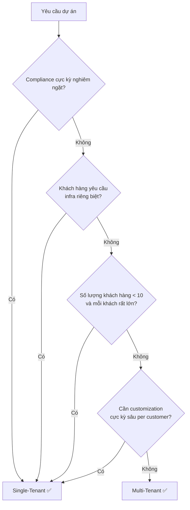
```mermaid
graph TD
    A[Yêu cầu dự án] --> B{Compliance cực kỳ nghiêm ngặt?}
    B -->|Có| C[Single-Tenant ✅]
    B -->|Không| D{Khách hàng yêu cầu<br/>infra riêng biệt?}
    D -->|Có| C
    D -->|Không| E{Số lượng khách hàng < 10<br/>và mỗi khách rất lớn?}
    E -->|Có| C
    E -->|Không| F{Cần customization<br/>cực kỳ sâu per customer?}
    F -->|Có| C
    F -->|Không| G[Multi-Tenant ✅]
```

### 1.3 Tại sao cần Multi-Tenancy?

#### 1.3.1 Business Drivers

**① Hiệu quả chi phí (Cost Efficiency)**

Multi-Tenancy là nền tảng kinh tế của mô hình SaaS:

```
Single-Tenant (100 khách hàng):
┌──────────────────────────────────────────┐
│  100 × Server    = 100 servers           │
│  100 × Database  = 100 DB instances      │
│  100 × Ops team  = huge ops overhead     │
│  Chi phí: $$$$$$$$$$                     │
└──────────────────────────────────────────┘

Multi-Tenant (100 khách hàng):
┌──────────────────────────────────────────┐
│  2-3 × Server cluster = auto-scaled      │
│  1-3 × Database       = shared/pooled    │
│  1 × Ops pipeline     = automated        │
│  Chi phí: $$$                            │
└──────────────────────────────────────────┘

→ Tiết kiệm 60-80% chi phí hạ tầng
```

**② Tốc độ phát triển sản phẩm (Time-to-Market)**

- Onboard tenant mới trong **phút** thay vì **ngày/tuần**
- Một codebase → một CI/CD pipeline → deploy cho tất cả tenant
- Bug fix / feature release đồng thời cho toàn bộ khách hàng
- A/B testing dễ dàng: feature flag per tenant

**③ Khả năng mở rộng (Scalability)**

- Thêm 1000 tenant mới ≠ thêm 1000 server mới
- Horizontal scaling dựa trên tổng load, không phải per-customer
- Resource pooling tối ưu hóa utilization
- Elastic scaling theo actual demand

**④ Operational Excellence**

- Monitoring tập trung — 1 dashboard cho toàn hệ thống
- Schema migration 1 lần cho tất cả (trong shared model)
- Security patching nhanh và đồng nhất
- Giảm DevOps overhead đáng kể

#### 1.3.2 Ví dụ thực tế

| SaaS Product | Multi-Tenant Model | Số tenant | Ghi chú |
|-------------|-------------------|-----------|---------|
| **Salesforce** | Shared DB + Metadata-driven schema | 150,000+ orgs | Tenant customization qua metadata, không thay đổi schema |
| **Slack** | Shared infrastructure, sharded DB | 750,000+ orgs | Shard by tenant cho performance |
| **Shopify** | Sharded DB, pod-based isolation | 2M+ shops | Mỗi "pod" chứa ~10K shops, dedicated DB shard |
| **Jira/Atlassian** | Shared infra (cloud), per-tenant DB (data center) | 200,000+ | Hybrid model tùy deployment |
| **AWS Cognito** | Shared compute, per-tenant User Pool | Millions | Pool-based isolation cho identity |

### 1.4 Các thách thức chính

Multi-Tenancy mang lại lợi ích lớn nhưng đi kèm **5 nhóm thách thức trọng yếu**:

#### Thách thức 1: Data Isolation & Security

```
⚠️ VẤN ĐỀ NGHIÊM TRỌNG NHẤT

Một dòng code thiếu sót có thể lộ data toàn bộ tenant:

  ❌ SELECT * FROM orders;                         → Lộ data mọi tenant
  ✅ SELECT * FROM orders WHERE tenant_id = ?;     → Chỉ data tenant hiện tại

Điều này phải được enforce ở:
  • Application layer (middleware, ORM filter)
  • Database layer (Row-Level Security, schema)
  • Infrastructure layer (network, IAM)
  • API layer (authorization check)
```

**Rủi ro cụ thể:**
- **Cross-tenant data leak**: Query thiếu `tenant_id` filter
- **Cache poisoning**: Cache key không chứa tenant → trả data sai tenant
- **Shared file storage leak**: Upload/download file không validate tenant
- **Log leakage**: Log chứa sensitive data của tenant khác
- **API response leak**: Serialization lỗi trả data cross-tenant

#### Thách thức 2: Noisy Neighbor

```
Tenant A: 10 requests/giây (bình thường)
Tenant B: 10,000 requests/giây (spike đột biến)

Hậu quả (nếu không có isolation):
┌──────────────────────────────────────────┐
│  Shared Resource Pool                    │
│                                          │
│  CPU:  [████████████████████████████░░]  │
│         ↑ Tenant B chiếm 90% CPU         │
│                                          │
│  Tenant A response time: 200ms → 5000ms  │
│  Tenant C response time: 150ms → 3000ms  │
│  Tenant B response time: 100ms → 200ms   │
│                                          │
│  → Tất cả tenant khác bị ảnh hưởng!      │
└──────────────────────────────────────────┘
```

**Giải pháp**: Rate limiting, resource quotas, tenant-aware scaling, circuit breaker per tenant (chi tiết ở [Chương 7](#7-noisy-neighbor-problem))

#### Thách thức 3: Tenant Customization

Mỗi tenant có nhu cầu khác nhau nhưng phải chạy trên **cùng một codebase**:

| Nhu cầu | Độ khó | Giải pháp |
|---------|:------:|-----------|
| Custom branding (logo, color) | 🟢 Dễ | Tenant config table |
| Custom fields trên entities | 🟡 Trung bình | EAV pattern / JSON columns / Metadata tables |
| Custom business rules | 🟡 Trung bình | Rule engine, feature flags |
| Custom workflows | 🔴 Khó | Workflow engine (Temporal, Camunda) |
| Custom integrations | 🔴 Khó | Webhook system, plugin architecture |
| Custom schema changes | 🔴 Rất khó | Metadata-driven schema (Salesforce approach) |

#### Thách thức 4: Compliance & Data Residency

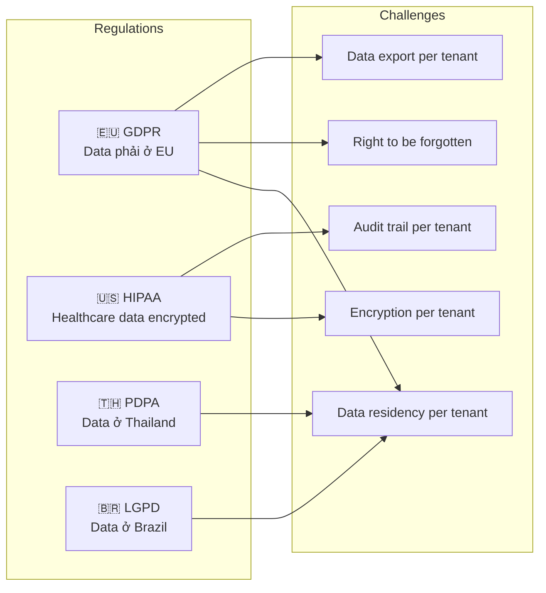
```mermaid
graph LR
    subgraph "Regulations"
        GDPR["🇪🇺 GDPR<br/>Data phải ở EU"]
        HIPAA["🇺🇸 HIPAA<br/>Healthcare data encrypted"]
        PDPA["🇹🇭 PDPA<br/>Data ở Thailand"]
        LGPD["🇧🇷 LGPD<br/>Data ở Brazil"]
    end

    subgraph "Challenges"
        C1["Data residency per tenant"]
        C2["Encryption per tenant"]
        C3["Right to be forgotten"]
        C4["Audit trail per tenant"]
        C5["Data export per tenant"]
    end

    GDPR --> C1
    GDPR --> C3
    GDPR --> C5
    HIPAA --> C2
    HIPAA --> C4
    PDPA --> C1
    LGPD --> C1
```

**Vấn đề cụ thể:**
- Tenant ở EU yêu cầu data phải lưu ở EU region → cần **multi-region deployment**
- Tenant healthcare yêu cầu HIPAA → cần **encryption at rest + audit logging**
- GDPR "right to be forgotten" → phải xóa **toàn bộ** data của tenant mà **không ảnh hưởng** tenant khác
- Trong shared database model, việc đảm bảo compliance **cực kỳ phức tạp**

#### Thách thức 5: Operational Complexity

| Vấn đề vận hành | Trong Single-Tenant | Trong Multi-Tenant |
|-----------------|--------------------|--------------------|
| Schema migration | Migrate 1 DB | Migrate 1 DB nhưng ảnh hưởng tất cả tenant / hoặc migrate N schemas |
| Monitoring | Monitor 1 instance | Monitor per-tenant metrics trong shared infra |
| Debugging | Log của 1 customer | Phải filter log theo tenant_id, distributed tracing cần tenant context |
| Backup/Restore | Backup 1 DB | Backup shared DB — restore 1 tenant = phức tạp |
| Performance tuning | Optimize cho 1 workload | Optimize cho N workloads khác nhau trên shared resources |
| Tenant onboarding | Deploy mới hoàn toàn | Provision resources, seed data, config — cần automation |
| Rollback | Rollback 1 instance | Rollback ảnh hưởng tất cả tenant — cần canary per tenant |

#### Tổng kết thách thức — Risk Matrix

```
                      Xác suất xảy ra
                    Thấp        Cao
                 ┌──────────┬──────────┐
          Cao    │ Data     │ Noisy    │
Tác động         │ Residency│ Neighbor │
                 │ Violation│ Problem  │
                 ├──────────┼──────────┤
          Thấp   │ Schema   │ Config   │
                 │ Migration│ Drift    │
                 │ Failure  │          │
                 └──────────┴──────────┘

Ưu tiên xử lý:
1. 🔴 Cross-tenant data leak    → Impact: catastrophic, Must fix
2. 🟠 Noisy neighbor            → Impact: high, Should fix
3. 🟡 Compliance violation      → Impact: high, Must plan
4. 🟢 Operational complexity    → Impact: medium, Optimize over time
```

---

## 2. Tenant Isolation Models

Ba mô hình cách ly tenant cơ bản: **Silo** (tách biệt hoàn toàn), **Pool** (chia sẻ hoàn toàn), và **Bridge** (kết hợp). Việc chọn đúng mô hình ảnh hưởng trực tiếp đến chi phí, bảo mật, hiệu năng và khả năng scale của toàn bộ hệ thống.

```
┌──────────────────────────────────────────────────────────────────────┐
│                    ISOLATION SPECTRUM                                │
│                                                                      │
│  Silo                    Bridge                    Pool              │
│  (Dedicated)             (Hybrid)                  (Shared)          │
│  ◄──────────────────────────────────────────────────────────►        │
│                                                                      │
│  🔒 Max Isolation                              💰 Max Cost Savings   │
│  💰 Max Cost                                   🔒 Min Isolation      │
│  🔧 Max Customization                          🔧 Min Customization  │
│  📈 Min Resource Efficiency                    📈 Max Efficiency     │
└──────────────────────────────────────────────────────────────────────┘
```

### 2.1 Silo Model (Dedicated)

**Silo Model** cung cấp cho mỗi tenant **tài nguyên riêng biệt hoàn toàn** — từ compute, database, storage đến network. Mỗi tenant hoạt động như một "hòn đảo" độc lập.

#### Kiến trúc Silo Model

```
┌─────────────────────────────────────────────────────────────────┐
│                      SILO MODEL                                 │
│                                                                 │
│  ┌──────────────────┐   ┌──────────────────┐   ┌──────────────┐ │
│  │    Tenant A      │   │    Tenant B      │   │   Tenant C   │ │
│  │                  │   │                  │   │              │ │
│  │  ┌─────────────┐ │   │  ┌─────────────┐ │   │ ┌──────────┐ │ │
│  │  │   App Pod   │ │   │  │   App Pod   │ │   │ │ App Pod  │ │ │
│  │  │  (Private)  │ │   │  │  (Private)  │ │   │ │(Private) │ │ │
│  │  └──────┬──────┘ │   │  └──────┬──────┘ │   │ └─────┬────┘ │ │
│  │  ┌──────┴──────┐ │   │  ┌──────┴──────┐ │   │ ┌─────┴────┐ │ │
│  │  │  Database   │ │   │  │  Database   │ │   │ │ Database │ │ │
│  │  │  (Private)  │ │   │  │  (Private)  │ │   │ │(Private) │ │ │
│  │  └─────────────┘ │   │  └─────────────┘ │   │ └──────────┘ │ │
│  │  ┌─────────────┐ │   │  ┌─────────────┐ │   │ ┌──────────┐ │ │
│  │  │   Cache     │ │   │  │   Cache     │ │   │ │  Cache   │ │ │
│  │  └─────────────┘ │   │  └─────────────┘ │   │ └──────────┘ │ │
│  │  ┌─────────────┐ │   │  ┌─────────────┐ │   │ ┌──────────┐ │ │
│  │  │   Storage   │ │   │  │   Storage   │ │   │ │ Storage  │ │ │
│  │  └─────────────┘ │   │  └─────────────┘ │   │ └──────────┘ │ │
│  │                  │   │                  │   │              │ │
│  │  VPC / Namespace │   │  VPC / Namespace │   │VPC/Namespace │ │
│  └──────────────────┘   └──────────────────┘   └──────────────┘ │
│                                                                 │
│  Mọi thứ tách biệt: compute, data, network, storage             │
└─────────────────────────────────────────────────────────────────┘
```

#### Các mức Silo

| Mức Silo | Mô tả | Chi phí | Isolation |
|----------|--------|:-------:|:---------:|
| **Account-level** | Mỗi tenant = 1 AWS Account / Azure Subscription | 💰💰💰💰 | 🔒🔒🔒🔒 |
| **VPC-level** | Mỗi tenant = 1 VPC riêng trong cùng account | 💰💰💰 | 🔒🔒🔒 |
| **Cluster-level** | Mỗi tenant = 1 K8s cluster riêng | 💰💰💰 | 🔒🔒🔒 |
| **Namespace-level** | Mỗi tenant = 1 K8s namespace + resource quota | 💰💰 | 🔒🔒 |
| **Container-level** | Mỗi tenant = dedicated containers trong shared cluster | 💰💰 | 🔒🔒 |

#### Ưu điểm

- ✅ **Isolation tuyệt đối**: Không có bất kỳ shared resource nào → zero cross-tenant risk
- ✅ **Performance guaranteed**: Không bao giờ bị noisy neighbor
- ✅ **Compliance dễ dàng**: Mỗi tenant có thể đặt ở region riêng, encryption key riêng
- ✅ **Customization tối đa**: Có thể tune DB, scale compute, custom config per tenant
- ✅ **Backup/Restore đơn giản**: Backup/restore per tenant = backup/restore 1 DB
- ✅ **Blast radius nhỏ**: Lỗi 1 tenant không ảnh hưởng tenant khác

#### Nhược điểm

- ❌ **Chi phí cao nhất**: Mỗi tenant cần dedicated resources → chi phí tăng tuyến tính theo số tenant
- ❌ **Operational overhead lớn**: Quản lý N databases, N clusters, N pipelines
- ❌ **Schema migration phức tạp**: Phải apply cho từng tenant DB → cần automation mạnh
- ❌ **Onboarding chậm**: Provision infra cho tenant mới mất thời gian (trừ khi automation tốt)
- ❌ **Resource waste**: Tenant nhỏ vẫn cần minimum resources → utilization thấp
- ❌ **Cross-tenant analytics khó**: Data phân tán → cần ETL/data pipeline riêng

#### Use Cases phù hợp

```
✅ Silo Model phù hợp khi:
├── Ngành regulated: Healthcare (HIPAA), Finance (PCI-DSS), Government
├── Enterprise khách hàng lớn: Mỗi khách hàng trả $10K+/tháng
├── Yêu cầu SLA riêng: 99.99% uptime guarantee per tenant
├── Data residency bắt buộc: Data phải ở region cụ thể per tenant
├── Số lượng tenant ít: 10-100 tenants (không phải 10,000+)
└── Tenant yêu cầu dedicated resources trong hợp đồng
```

#### Ví dụ thực tế

- **AWS GovCloud**: Mỗi government agency = separate account
- **Salesforce Shield**: Enterprise tier = dedicated infrastructure
- **MongoDB Atlas Dedicated**: 1 cluster per customer

### 2.2 Pool Model (Shared)

**Pool Model** cho tất cả tenant chia sẻ **toàn bộ tài nguyên**: cùng compute, cùng database, cùng cache. Cách ly bằng **logic trong application** (tenant_id).

#### Kiến trúc Pool Model

```
┌────────────────────────────────────────────────────────────────┐
│                       POOL MODEL                               │
│                                                                │
│  ┌──────────────────────────────────────────────────────────┐  │
│  │                  Shared Compute Layer                    │  │
│  │                                                          │  │
│  │   Request → Extract Tenant ID → Route → Process          │  │
│  │                                                          │  │
│  │   ┌────────┐  ┌────────┐  ┌────────┐  ┌────────┐         │  │
│  │   │ Pod 1  │  │ Pod 2  │  │ Pod 3  │  │ Pod N  │         │  │
│  │   │(shared)│  │(shared)│  │(shared)│  │(shared)│         │  │
│  │   └───┬────┘  └───┬────┘  └───┬────┘  └───┬────┘         │  │
│  │       └───────────┼───────────┼───────────┘              │  │
│  └───────────────────┼───────────┼──────────────────────────┘  │
│                      │           │                             │
│  ┌───────────────────┴───────────┴──────────────────────────┐  │
│  │              Shared Database                             │  │
│  │                                                          │  │
│  │  orders table:                                           │  │
│  │  ┌──────────┬───────────┬─────────┬──────────┐           │  │
│  │  │tenant_id │ order_id  │ amount  │ status   │           │  │
│  │  ├──────────┼───────────┼─────────┼──────────┤           │  │
│  │  │ acme     │ ORD-001   │ $100    │ paid     │           │  │
│  │  │ acme     │ ORD-002   │ $250    │ pending  │           │  │
│  │  │ beta     │ ORD-003   │ $75     │ paid     │           │  │
│  │  │ gamma    │ ORD-004   │ $500    │ shipped  │           │  │
│  │  └──────────┴───────────┴─────────┴──────────┘           │  │
│  │                                                          │  │
│  │  ⚠️ Mọi query PHẢI có WHERE tenant_id = ?                │  │
│  └──────────────────────────────────────────────────────────┘  │
│                                                                │
│  Shared: Compute + DB + Cache + Storage + Network              │
└────────────────────────────────────────────────────────────────┘
```

#### Cơ chế cách ly trong Pool Model

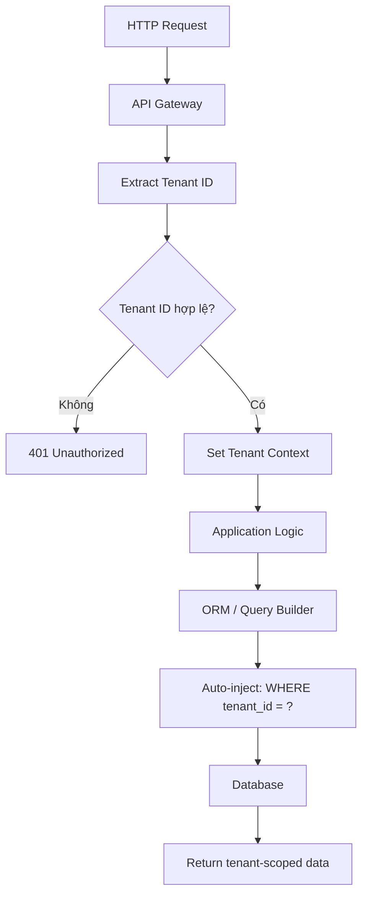
```mermaid
graph TD
    A[HTTP Request] --> B[API Gateway]
    B --> C[Extract Tenant ID]
    C --> D{Tenant ID hợp lệ?}
    D -->|Không| E[401 Unauthorized]
    D -->|Có| F[Set Tenant Context]
    F --> G[Application Logic]
    G --> H[ORM / Query Builder]
    H --> I["Auto-inject: WHERE tenant_id = ?"]
    I --> J[Database]
    J --> K[Return tenant-scoped data]
```

**Các kỹ thuật enforce isolation:**

| Kỹ thuật | Layer | Mô tả | Độ tin cậy |
|---------|-------|--------|:----------:|
| **ORM Global Filter** | Application | Hibernate filter, Django middleware tự động thêm `tenant_id` | 🟡 Trung bình |
| **Row-Level Security (RLS)** | Database | PostgreSQL RLS policy, database-level enforcement | 🟢 Cao |
| **View-based** | Database | Mỗi tenant có view filter sẵn tenant_id | 🟡 Trung bình |
| **Application middleware** | Application | Interceptor inject tenant context vào mọi request | 🟡 Trung bình |
| **Policy-as-Code** | Infrastructure | OPA/Kyverno enforce tenant boundary | 🟢 Cao |

#### Ưu điểm

- ✅ **Chi phí thấp nhất**: Tất cả tenant chia sẻ resources → chi phí không tăng tuyến tính
- ✅ **Onboarding nhanh**: Thêm tenant = insert row vào bảng `tenants` → xong trong giây
- ✅ **Schema migration đơn giản**: Migrate 1 database = done cho tất cả tenant
- ✅ **Resource utilization cao**: Pooling maximizes usage, ít waste
- ✅ **Cross-tenant analytics dễ**: Data ở cùng DB → query cross-tenant đơn giản
- ✅ **Operational đơn giản**: 1 DB to monitor, 1 cluster to manage

#### Nhược điểm

- ❌ **Isolation yếu nhất**: Hoàn toàn phụ thuộc application logic → 1 bug = data leak
- ❌ **Noisy neighbor nghiêm trọng**: 1 tenant heavy → ảnh hưởng tất cả
- ❌ **Compliance khó**: Khó đáp ứng data residency, per-tenant encryption
- ❌ **Backup/Restore per tenant khó**: Không thể restore data của 1 tenant từ shared DB dễ dàng
- ❌ **Performance limit**: Shared DB có giới hạn connection, IOPS
- ❌ **Customization giới hạn**: Không thể custom schema per tenant

#### Use Cases phù hợp

```
✅ Pool Model phù hợp khi:
├── SaaS B2B nhỏ/vừa: Slack free tier, Trello, Notion
├── Số lượng tenant nhiều: 1,000 - 1,000,000+ tenants
├── Compliance không quá strict: Không cần data residency per tenant
├── Budget hạn chế: Startup, early-stage product
├── Tenant workload tương đồng: Tất cả tenant sử dụng giống nhau
└── Cần onboard nhanh: Self-service signup
```

### 2.3 Bridge Model (Hybrid)

**Bridge Model** kết hợp Silo và Pool — **một số thành phần shared, một số dedicated** tùy theo tenant tier hoặc loại resource. Đây là mô hình **phổ biến nhất** trong thực tế.

#### Kiến trúc Bridge Model

```
┌──────────────────────────────────────────────────────────────────┐
│                       BRIDGE MODEL                               │
│                                                                  │
│  ┌──────────────────────────────────────────────────────┐        │
│  │              Shared Compute Layer                    │        │
│  │    (Tất cả tenant share cùng compute pods)           │        │
│  │    API Gateway → Tenant Router → Shared Services     │        │
│  └──────────────────────┬───────────────────────────────┘        │
│                         │                                        │
│           ┌─────────────┼─────────────┐                          │
│           │             │             │                          │
│           ▼             ▼             ▼                          │
│  ┌──────────────┐ ┌──────────┐ ┌────────────────────┐            │
│  │   Free Tier  │ │ Pro Tier │ │  Enterprise Tier   │            │
│  │              │ │          │ │                    │            │
│  │  Shared DB   │ │ Shared DB│ │  Dedicated DB      │            │
│  │  (Pool)      │ │ (Schema) │ │  (Silo)            │            │
│  │              │ │          │ │                    │            │
│  │  Shared Cache│ │ Dedicated│ │  Dedicated Cache   │            │
│  │              │ │ Cache NS │ │  Dedicated Storage │            │
│  │  Rate: 100/m │ │ Rate:1K/m│ │  Rate: Unlimited   │            │
│  └──────────────┘ └──────────┘ └────────────────────┘            │
│                                                                  │
│  Compute: Shared    │  Data: Tiered    │  Network: Tiered        │
└──────────────────────────────────────────────────────────────────┘
```

#### Các kiểu Bridge phổ biến

**① Tiered by Tenant Plan**

Mức isolation tăng theo pricing tier:

```
┌──────────────┬───────────────┬────────────────┬──────────────────┐
│              │   Free/Basic  │     Pro        │   Enterprise     │
├──────────────┼───────────────┼────────────────┼──────────────────┤
│ Compute      │ Shared pods   │ Shared pods    │ Dedicated pods   │
│ Database     │ Shared table  │ Shared schema  │ Dedicated DB     │
│ Cache        │ Shared Redis  │ Dedicated NS   │ Dedicated Redis  │
│ Storage      │ Shared bucket │ Prefix-based   │ Dedicated bucket │
│ Network      │ Shared VPC    │ Shared VPC     │ Dedicated VPC    │
│ Rate Limit   │ 100 req/min   │ 1K req/min     │ Custom / No limit│
│ SLA          │ 99.5%         │ 99.9%          │ 99.99%           │
│ Support      │ Community     │ Email          │ Dedicated TAM    │
└──────────────┴───────────────┴────────────────┴──────────────────┘
```

**② Tiered by Resource Type**

Một số resources shared, một số dedicated cho tất cả tenant:

```
┌─────────────────────────────────────────────────────────┐
│                                                         │
│  SHARED cho tất cả tenant:                              │
│  ├── API Gateway                                        │
│  ├── Authentication Service (Cognito/Auth0)             │
│  ├── Notification Service                               │
│  ├── File Processing Pipeline                           │
│  └── Monitoring / Logging Infrastructure                │
│                                                         │
│  DEDICATED per tenant:                                  │
│  ├── Database (hoặc schema)                             │
│  ├── Encryption keys                                    │
│  ├── S3 bucket (hoặc prefix)                            │
│  └── Background job queue                               │
│                                                         │
└─────────────────────────────────────────────────────────┘
```

**③ Tiered by Data Sensitivity**

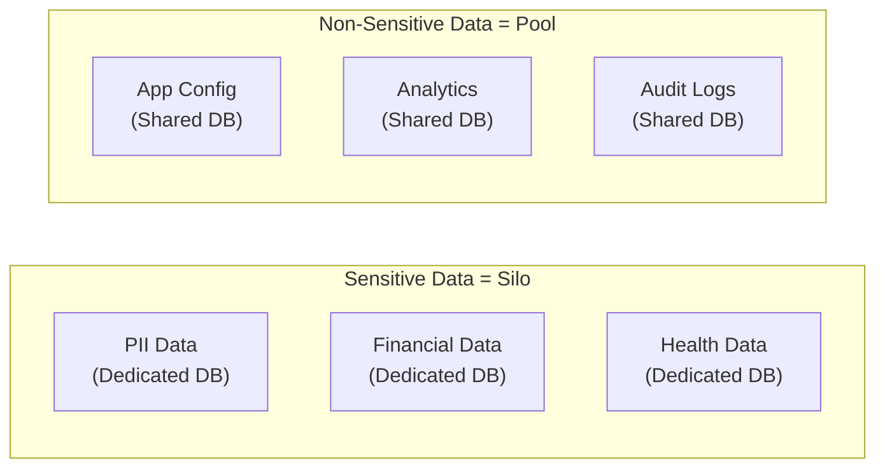
```mermaid
graph LR
    subgraph "Sensitive Data = Silo"
        PII["PII Data<br/>(Dedicated DB)"]
        Financial["Financial Data<br/>(Dedicated DB)"]
        Health["Health Data<br/>(Dedicated DB)"]
    end

    subgraph "Non-Sensitive Data = Pool"
        Config["App Config<br/>(Shared DB)"]
        Analytics["Analytics<br/>(Shared DB)"]
        Logs["Audit Logs<br/>(Shared DB)"]
    end
```

#### Ưu điểm

- ✅ **Cân bằng cost vs isolation**: Chi phí hợp lý, isolation đủ tốt cho từng tier
- ✅ **Flexible**: Có thể "nâng cấp" tenant từ Pool → Silo khi cần
- ✅ **Revenue-aligned**: Tenant trả nhiều hơn → được isolation tốt hơn
- ✅ **Phổ biến nhất**: Hầu hết SaaS thành công đều dùng Bridge model
- ✅ **Progressive isolation**: Bắt đầu Pool, dần chuyển sang Silo khi cần

#### Nhược điểm

- ❌ **Phức tạp nhất để implement**: Code phải handle cả Pool và Silo logic
- ❌ **Routing phức tạp**: Tenant Router phải biết tenant nào dùng model nào
- ❌ **Testing khó**: Phải test tất cả combination của isolation levels
- ❌ **Migration giữa tiers**: Di chuyển tenant từ Pool → Silo cần migration plan

### 2.4 So sánh và ma trận quyết định

#### Bảng so sánh toàn diện

| Tiêu chí | Silo 🏢 | Pool 🏊 | Bridge 🌉 |
|----------|:-------:|:-------:|:----------:|
| **Data Isolation** | 🟢 Vật lý | 🔴 Logic | 🟡 Tiered |
| **Chi phí per tenant** | 🔴 Cao | 🟢 Thấp | 🟡 Trung bình |
| **Noisy Neighbor** | 🟢 Không có | 🔴 Nghiêm trọng | 🟡 Giảm thiểu |
| **Onboarding speed** | 🔴 Chậm (phút-giờ) | 🟢 Nhanh (giây) | 🟡 Tùy tier |
| **Schema migration** | 🔴 Phức tạp (N lần) | 🟢 Đơn giản (1 lần) | 🟡 Tùy tier |
| **Customization** | 🟢 Tối đa | 🔴 Giới hạn | 🟡 Per tier |
| **Compliance** | 🟢 Dễ | 🔴 Khó | 🟡 Per tier |
| **Max tenants** | 🔴 10-1000 | 🟢 1000-1M+ | 🟢 100-100K+ |
| **Operational burden** | 🔴 Cao | 🟢 Thấp | 🟡 Trung bình |
| **Backup per tenant** | 🟢 Dễ | 🔴 Khó | 🟡 Tùy tier |
| **Cross-tenant analytics** | 🔴 Khó | 🟢 Dễ | 🟡 Trung bình |
| **Blast radius** | 🟢 1 tenant | 🔴 Tất cả | 🟡 Per group |

#### Decision Matrix — Chọn model nào?

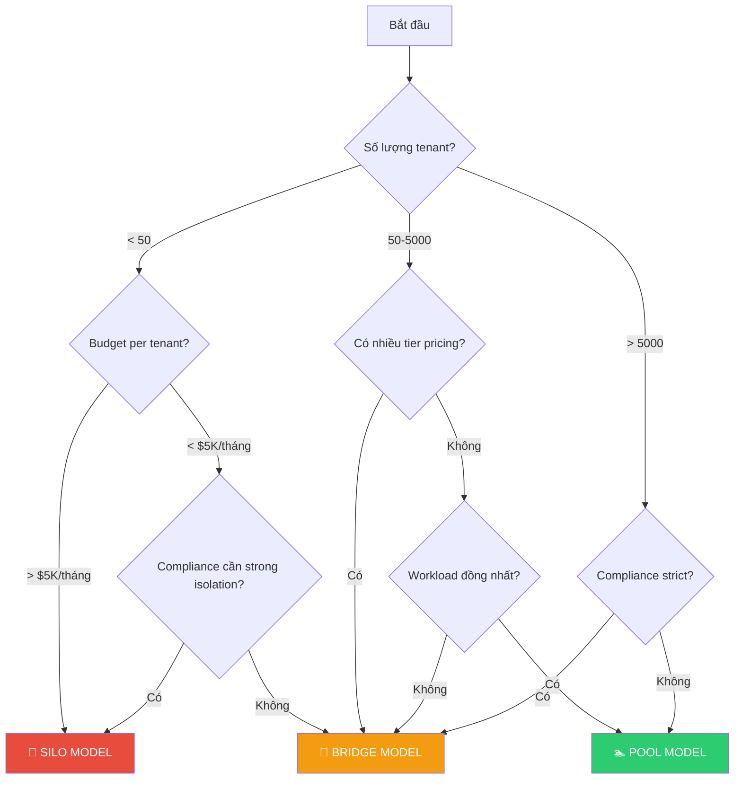
```mermaid
graph TD
    START[Bắt đầu] --> Q1{Số lượng tenant?}
    
    Q1 -->|"< 50"| Q2{Budget per tenant?}
    Q1 -->|"50-5000"| Q4{Có nhiều tier pricing?}
    Q1 -->|"> 5000"| Q5{Compliance strict?}
    
    Q2 -->|"> $5K/tháng"| SILO["🏢 SILO MODEL"]
    Q2 -->|"< $5K/tháng"| Q3{Compliance cần strong isolation?}
    Q3 -->|Có| SILO
    Q3 -->|Không| BRIDGE["🌉 BRIDGE MODEL"]
    
    Q4 -->|Có| BRIDGE
    Q4 -->|Không| Q6{Workload đồng nhất?}
    Q6 -->|Có| POOL["🏊 POOL MODEL"]
    Q6 -->|Không| BRIDGE
    
    Q5 -->|Có| BRIDGE
    Q5 -->|Không| POOL

    style SILO fill:#e74c3c,color:#fff
    style POOL fill:#2ecc71,color:#fff
    style BRIDGE fill:#f39c12,color:#fff
```

#### Ví dụ áp dụng trong thực tế

| Công ty | Model | Chi tiết |
|---------|-------|----------|
| **Shopify** | Bridge | Free stores → shared pods; Shopify Plus → dedicated infrastructure |
| **Slack** | Bridge | Free/Pro → shared infra; Enterprise Grid → dedicated data plane |
| **Salesforce** | Pool + Bridge | Standard → shared Oracle DB; Shield → dedicated encryption, monitoring |
| **GitHub** | Bridge | Free/Team → shared; Enterprise Server → dedicated (self-hosted) |
| **Atlassian Cloud** | Bridge | Standard → shared; Premium → performance isolation; Dedicated → full silo |
| **AWS Control Tower** | Silo | Mỗi workload = separate AWS Account |

#### Anti-pattern cần tránh khi chọn model

```
❌ ANTI-PATTERN 1: "Silo cho mọi thứ ngay từ đầu"
   → Chi phí quá cao cho startup, không scale
   → Nên: Bắt đầu Pool → chuyển Bridge khi cần

❌ ANTI-PATTERN 2: "Pool cho mọi thứ mãi mãi"  
   → Khi có enterprise customer yêu cầu compliance → không đáp ứng được
   → Nên: Plan cho Bridge từ architecture level

❌ ANTI-PATTERN 3: "Chọn model dựa trên tech stack, không phải business"
   → Model phải align với pricing, compliance, customer segment
   → Nên: Business requirements → Model → Tech implementation

❌ ANTI-PATTERN 4: "Không có migration path giữa các tiers"
   → Tenant muốn upgrade nhưng không thể migrate data
   → Nên: Thiết kế tenant migration pipeline từ đầu
```

---

## 3. Data Partitioning Strategies

Chiến lược phân tách dữ liệu (Data Partitioning) là **quyết định quan trọng nhất** khi xây dựng hệ thống multi-tenant. Nó ảnh hưởng trực tiếp đến isolation, performance, cost và khả năng scale.

```
                    DATA PARTITIONING SPECTRUM

  Database-per-Tenant     Schema-per-Tenant     Row-Level Security
  ┌─────────────┐         ┌─────────────┐       ┌─────────────────┐
  │ ┌───┐ ┌───┐ │         │ DB Instance │       │   DB Instance   │
  │ │DB │ │DB │ │         │ ┌────┬────┐ │       │ ┌─────────────┐ │
  │ │ A │ │ B │ │         │ │Sch │Sch │ │       │ │  Shared     │ │
  │ └───┘ └───┘ │         │ │ A  │ B  │ │       │ │  Table      │ │
  │ ┌───┐ ┌───┐ │         │ ├────┼────┤ │       │ │ tenant_id=A │ │
  │ │DB │ │DB │ │         │ │Sch │Sch │ │       │ │ tenant_id=B │ │
  │ │ C │ │ D │ │         │ │ C  │ D  │ │       │ │ tenant_id=C │ │
  │ └───┘ └───┘ │         │ └────┴────┘ │       │ └─────────────┘ │
  └─────────────┘         └─────────────┘       └─────────────────┘
  Max Isolation            Medium                Min Isolation
  Max Cost                 Medium Cost           Min Cost
```

### 3.1 Database-per-Tenant

Mỗi tenant có **database instance riêng biệt hoàn toàn**. Đây là chiến lược cho isolation cao nhất ở tầng data.

#### Kiến trúc

```
┌──────────────────────────────────────────────────────┐
│                 Application Layer                     │
│                                                      │
│  Tenant Router: tenant_id → connection string        │
│                                                      │
│  ┌──────────────────────────────────────────────┐    │
│  │           Connection Pool Manager             │    │
│  │  tenant_a → jdbc:postgresql://db-a:5432/app   │    │
│  │  tenant_b → jdbc:postgresql://db-b:5432/app   │    │
│  │  tenant_c → jdbc:postgresql://db-c:5432/app   │    │
│  └──────┬──────────┬──────────┬─────────────────┘    │
│         │          │          │                       │
└─────────┼──────────┼──────────┼───────────────────────┘
          │          │          │
   ┌──────┴───┐ ┌────┴─────┐ ┌─┴──────────┐
   │ DB: app  │ │ DB: app  │ │ DB: app    │
   │ Host:db-a│ │ Host:db-b│ │ Host:db-c  │
   │ Tenant A │ │ Tenant B │ │ Tenant C   │
   └──────────┘ └──────────┘ └────────────┘
```

#### Implementation — Tenant Connection Routing

```java
// TenantConnectionProvider.java
@Component
public class TenantConnectionProvider {

    private final Map<String, DataSource> dataSources = new ConcurrentHashMap<>();
    private final TenantConfigRepository tenantConfigRepo;

    public DataSource getDataSource(String tenantId) {
        return dataSources.computeIfAbsent(tenantId, id -> {
            TenantConfig config = tenantConfigRepo.findByTenantId(id);
            return DataSourceBuilder.create()
                .url(config.getDbUrl())       // jdbc:postgresql://db-tenant-a:5432/app
                .username(config.getDbUser())
                .password(config.getDbPass())
                .build();
        });
    }
}

// Tenant Config Table (trong shared management DB)
// ┌───────────┬─────────────────────────────┬──────────┐
// │ tenant_id │ db_url                       │ db_user  │
// ├───────────┼─────────────────────────────┼──────────┤
// │ acme      │ jdbc:postgresql://db-a/app   │ acme_usr │
// │ beta      │ jdbc:postgresql://db-b/app   │ beta_usr │
// └───────────┴─────────────────────────────┴──────────┘
```

#### Ưu / Nhược điểm

| ✅ Ưu điểm | ❌ Nhược điểm |
|------------|--------------|
| Isolation vật lý mạnh nhất | Chi phí cao: 1 DB instance/tenant |
| Không noisy neighbor ở DB level | Connection pool explosion khi nhiều tenant |
| Backup/restore per tenant dễ dàng | Schema migration phải chạy N lần |
| Custom schema per tenant được | Monitoring N databases phức tạp |
| Compliance / data residency dễ | Provisioning chậm (tạo DB mới) |
| Performance tuning per tenant | Cross-tenant reporting cần ETL |

#### Khi nào dùng?

- Tenant < 500 và mỗi tenant đủ lớn để justify chi phí DB riêng
- Regulated industries: HIPAA, PCI-DSS, Government
- Yêu cầu data residency: tenant EU phải có DB ở EU region
- Enterprise tier trong Bridge model

#### Tip tiết kiệm chi phí

- **AWS RDS**: Dùng Aurora Serverless v2 → auto-scale, chỉ trả tiền khi dùng
- **Azure**: SQL Elastic Pool → nhiều DB share compute resources
- **PostgreSQL**: Dùng 1 PostgreSQL instance, mỗi tenant = 1 database (không phải 1 server)

### 3.2 Schema-per-Tenant

Tất cả tenant chia sẻ **cùng một database instance**, nhưng mỗi tenant có **schema riêng** (namespace trong DB).

#### Kiến trúc

```
┌──────────────────────────────────────────────┐
│            PostgreSQL Instance                │
│                                              │
│  ┌──────────────┐  ┌──────────────┐          │
│  │ Schema: acme │  │ Schema: beta │          │
│  │              │  │              │          │
│  │  ┌────────┐  │  │  ┌────────┐  │          │
│  │  │ users  │  │  │  │ users  │  │ . . .    │
│  │  │ orders │  │  │  │ orders │  │          │
│  │  │products│  │  │  │products│  │          │
│  │  └────────┘  │  │  └────────┘  │          │
│  └──────────────┘  └──────────────┘          │
│                                              │
│  Shared resources: connections, memory, CPU  │
└──────────────────────────────────────────────┘
```

#### Implementation — PostgreSQL Schema Switching

```sql
-- Tạo schema cho tenant mới
CREATE SCHEMA tenant_acme;
CREATE SCHEMA tenant_beta;

-- Tạo table trong schema của tenant
CREATE TABLE tenant_acme.users (
    id UUID PRIMARY KEY DEFAULT gen_random_uuid(),
    email VARCHAR(255) NOT NULL,
    name VARCHAR(255)
);

CREATE TABLE tenant_beta.users (
    id UUID PRIMARY KEY DEFAULT gen_random_uuid(),
    email VARCHAR(255) NOT NULL,
    name VARCHAR(255)
);

-- Switch schema khi query
SET search_path TO tenant_acme;
SELECT * FROM users;  -- Tự động query tenant_acme.users
```

```java
// Application-level schema switching (Spring Boot + Hibernate)
@Component
public class TenantSchemaInterceptor implements HandlerInterceptor {

    @Override
    public boolean preHandle(HttpServletRequest request,
                             HttpServletResponse response,
                             Object handler) {
        String tenantId = extractTenantId(request);
        // Set schema cho connection hiện tại
        TenantContext.setCurrentTenant("tenant_" + tenantId);
        return true;
    }
}

// Hibernate MultiTenantConnectionProvider
public class SchemaMultiTenantProvider implements MultiTenantConnectionProvider {

    @Override
    public Connection getConnection(String tenantIdentifier) {
        Connection conn = dataSource.getConnection();
        conn.createStatement()
            .execute("SET search_path TO " + tenantIdentifier);
        return conn;
    }
}
```

#### Ưu / Nhược điểm

| ✅ Ưu điểm | ❌ Nhược điểm |
|------------|--------------|
| Isolation tốt hơn shared table | Vẫn share DB → noisy neighbor ở I/O level |
| Backup per tenant khả thi (pg_dump schema) | Migration phải chạy cho mỗi schema |
| Schema customization per tenant | Số schema có giới hạn (PostgreSQL: hàng nghìn OK, hàng chục nghìn → chậm) |
| Chi phí thấp hơn DB-per-tenant | Connection pool vẫn shared → cần quản lý |
| Không cần tenant_id trong mọi query | Catalog queries chậm khi nhiều schema |

#### Khi nào dùng?

- 50-5,000 tenants, mỗi tenant có workload tương đối
- Cần isolation tốt hơn shared table nhưng không cần dedicated DB
- Pro tier trong Bridge model
- PostgreSQL / SQL Server (hỗ trợ schema tốt)

### 3.3 Row-Level Security (Shared Table)

Tất cả tenant chia sẻ **cùng database, schema, và table**. Phân biệt data bằng cột `tenant_id` trong **mọi bảng**.

#### Kiến trúc

```
┌──────────────────────────────────────────────────────┐
│                   Shared Database                     │
│                                                      │
│   users table:                                       │
│   ┌──────────┬──────┬───────────┬──────────────┐     │
│   │tenant_id │  id  │   email   │    name      │     │
│   ├──────────┼──────┼───────────┼──────────────┤     │
│   │  acme    │  1   │ j@acme   │ John         │     │
│   │  acme    │  2   │ k@acme   │ Kate         │     │
│   │  beta    │  3   │ b@beta   │ Bob          │     │
│   │  gamma   │  4   │ g@gamma  │ Grace        │     │
│   └──────────┴──────┴───────────┴──────────────┘     │
│                                                      │
│   ⚠️ EVERY query MUST filter by tenant_id           │
│   ⚠️ EVERY index SHOULD include tenant_id           │
│   ⚠️ EVERY foreign key SHOULD include tenant_id     │
└──────────────────────────────────────────────────────┘
```

#### Implementation — PostgreSQL Row-Level Security (RLS)

```sql
-- Bước 1: Tạo table với tenant_id
CREATE TABLE orders (
    id UUID PRIMARY KEY DEFAULT gen_random_uuid(),
    tenant_id VARCHAR(50) NOT NULL,
    customer_name VARCHAR(255),
    amount DECIMAL(10,2),
    created_at TIMESTAMP DEFAULT NOW()
);

-- Bước 2: Tạo index composite (tenant_id là prefix)
CREATE INDEX idx_orders_tenant ON orders (tenant_id, created_at DESC);

-- Bước 3: Enable RLS
ALTER TABLE orders ENABLE ROW LEVEL SECURITY;

-- Bước 4: Tạo policy — user chỉ thấy data của tenant mình
CREATE POLICY tenant_isolation_policy ON orders
    USING (tenant_id = current_setting('app.current_tenant'));

-- Bước 5: Set tenant context trước mỗi query
SET app.current_tenant = 'acme';
SELECT * FROM orders;  -- Chỉ trả về orders của 'acme'

-- ⚠️ QUAN TRỌNG: RLS không áp dụng cho superuser/table owner
-- Phải tạo role riêng cho application
CREATE ROLE app_user LOGIN PASSWORD 'xxx';
GRANT SELECT, INSERT, UPDATE, DELETE ON orders TO app_user;
```

#### Implementation — Application-Level Filter (ORM)

```java
// Spring Boot + Hibernate Global Filter
// Hibernate entity
@Entity
@Table(name = "orders")
@FilterDef(name = "tenantFilter",
           parameters = @ParamDef(name = "tenantId", type = "string"))
@Filter(name = "tenantFilter", condition = "tenant_id = :tenantId")
public class Order {
    @Id
    private UUID id;

    @Column(name = "tenant_id", nullable = false)
    private String tenantId;

    private String customerName;
    private BigDecimal amount;
}

// Tự động enable filter cho mọi session
@Component
public class TenantFilterAspect {

    @Autowired private EntityManager entityManager;

    @Before("execution(* com.app.repository.*.*(..))")
    public void enableTenantFilter() {
        Session session = entityManager.unwrap(Session.class);
        String tenantId = TenantContext.getCurrentTenant();
        session.enableFilter("tenantFilter")
               .setParameter("tenantId", tenantId);
    }
}
```

#### ⚠️ Các lỗi phổ biến với Shared Table

```
❌ LỖI 1: Quên WHERE tenant_id trong raw query
   SELECT * FROM orders WHERE amount > 100;
   → Lộ data tất cả tenant!
   ✅ FIX: Dùng RLS ở DB level + ORM filter ở app level (defense in depth)

❌ LỖI 2: Index không có tenant_id prefix
   CREATE INDEX idx_orders_date ON orders (created_at);
   → Full table scan across tenants, chậm
   ✅ FIX: CREATE INDEX idx ON orders (tenant_id, created_at);

❌ LỖI 3: Foreign key không check tenant_id
   orders.user_id → users.id  (không check tenant)
   → Tenant A có thể reference user của Tenant B
   ✅ FIX: Composite FK: (tenant_id, user_id) → (tenant_id, id)

❌ LỖI 4: Cache key không chứa tenant_id
   cache.get("user:123")  → có thể trả user 123 của tenant khác
   ✅ FIX: cache.get("tenant:acme:user:123")

❌ LỖI 5: Unique constraint không include tenant_id
   UNIQUE(email)  → 2 tenant không thể có user cùng email
   ✅ FIX: UNIQUE(tenant_id, email)
```

#### Ưu / Nhược điểm

| ✅ Ưu điểm | ❌ Nhược điểm |
|------------|--------------|
| Chi phí thấp nhất | Isolation yếu nhất — phụ thuộc code |
| Schema migration 1 lần | 1 bug = data leak cross-tenant |
| Onboarding instant | Noisy neighbor ở mọi layer |
| Cross-tenant analytics dễ | Mọi query, index, FK phải có tenant_id |
| Scale đến hàng triệu tenant | Backup/restore per tenant rất khó |
| Operational đơn giản | Table size lớn → cần partitioning |

### 3.4 Table-per-Tenant

Ít phổ biến hơn — mỗi tenant có **bộ table riêng** trong cùng schema (thêm suffix/prefix tenant vào tên bảng).

```sql
-- Table per tenant
CREATE TABLE orders_acme (...);
CREATE TABLE orders_beta (...);
CREATE TABLE orders_gamma (...);

-- Dynamic table routing
SELECT * FROM orders_{tenant_id};
```

#### Tại sao KHÔNG nên dùng?

```
❌ ANTI-PATTERN — Table-per-Tenant

Vấn đề:
├── Schema migration nightmare: ALTER TABLE cho mỗi tenant table
├── Dynamic SQL: Không dùng được prepared statements tốt
├── ORM không hỗ trợ: Phải viết custom logic
├── Catalog bloat: Hàng nghìn tables → DB metadata chậm
├── Không có lợi ích isolation hơn Schema-per-Tenant
└── Connection pooling phức tạp

Thay vì Table-per-Tenant → Dùng:
├── Schema-per-Tenant (nếu cần isolation)
└── Row-Level Security (nếu cần đơn giản)
```

### 3.5 Hybrid Data Partitioning

Kết hợp nhiều strategies cho các loại data khác nhau hoặc các tier khác nhau.

#### Tiered Partitioning

```
┌──────────────────────────────────────────────────────────────┐
│                    HYBRID PARTITIONING                        │
│                                                              │
│  Free Tier tenants (1000+):                                 │
│  ┌────────────────────────────────────────┐                 │
│  │  Shared Table + Row-Level Security     │                 │
│  │  (Pool model, tenant_id column)        │                 │
│  └────────────────────────────────────────┘                 │
│                                                              │
│  Pro Tier tenants (100-500):                                │
│  ┌────────────────────────────────────────┐                 │
│  │  Schema-per-Tenant                     │                 │
│  │  (Dedicated schema, shared DB instance)│                 │
│  └────────────────────────────────────────┘                 │
│                                                              │
│  Enterprise Tier tenants (10-50):                           │
│  ┌────────────────────────────────────────┐                 │
│  │  Database-per-Tenant                   │                 │
│  │  (Dedicated DB, possibly dedicated     │                 │
│  │   instance in specific region)         │                 │
│  └────────────────────────────────────────┘                 │
└──────────────────────────────────────────────────────────────┘
```

#### Partitioning by Data Type

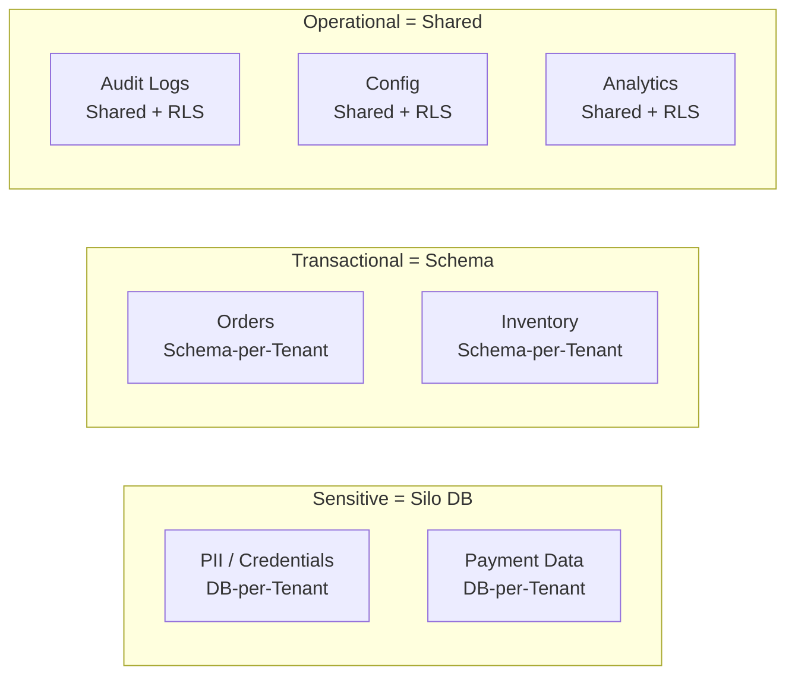
```mermaid
graph LR
    subgraph "Sensitive = Silo DB"
        PII["PII / Credentials<br/>DB-per-Tenant"]
        Payment["Payment Data<br/>DB-per-Tenant"]
    end

    subgraph "Transactional = Schema"
        Orders["Orders<br/>Schema-per-Tenant"]
        Inventory["Inventory<br/>Schema-per-Tenant"]
    end

    subgraph "Operational = Shared"
        Logs["Audit Logs<br/>Shared + RLS"]
        Config["Config<br/>Shared + RLS"]
        Analytics["Analytics<br/>Shared + RLS"]
    end
```

#### Implementation — Tenant Router

```java
@Component
public class DataPartitionRouter {

    public DataSource route(String tenantId, DataCategory category) {
        TenantConfig config = tenantConfigRepo.findByTenantId(tenantId);

        return switch (config.getTier()) {
            case ENTERPRISE -> getDedicatedDb(tenantId);
            case PRO        -> getSchemaBasedDs(tenantId);
            case FREE       -> getSharedDs(); // + RLS filter
        };
    }

    // Category-based routing (cross-tier)
    public DataSource routeByCategory(String tenantId, DataCategory cat) {
        return switch (cat) {
            case PII, PAYMENT -> getDedicatedDb(tenantId); // Luôn silo cho sensitive
            case TRANSACTIONAL -> getSchemaBasedDs(tenantId);
            case OPERATIONAL   -> getSharedDs();
        };
    }
}
```

### 3.6 So sánh chi tiết

#### Bảng so sánh toàn diện

| Tiêu chí | DB-per-Tenant | Schema-per-Tenant | Row-Level Security | Table-per-Tenant |
|----------|:------------:|:-----------------:|:------------------:|:----------------:|
| **Isolation Level** | 🟢 Vật lý | 🟡 Logic (schema) | 🔴 Logic (row) | 🟡 Logic (table) |
| **Chi phí** | 🔴 Cao nhất | 🟡 Trung bình | 🟢 Thấp nhất | 🟡 Trung bình |
| **Max tenants** | 🔴 ~500 | 🟡 ~5,000 | 🟢 Hàng triệu | 🔴 ~1,000 |
| **Noisy neighbor** | 🟢 Không | 🟡 DB-level | 🔴 Mọi level | 🟡 DB-level |
| **Migration** | 🔴 N lần | 🔴 N lần | 🟢 1 lần | 🔴 N lần |
| **Onboarding** | 🔴 Chậm | 🟡 Trung bình | 🟢 Instant | 🟡 Trung bình |
| **Custom schema** | 🟢 Có | 🟢 Có | 🔴 Không | 🟡 Hạn chế |
| **Backup per tenant** | 🟢 Dễ | 🟡 Khả thi | 🔴 Khó | 🟡 Khả thi |
| **Cross-tenant query** | 🔴 Cần ETL | 🟡 Cross-schema | 🟢 Direct | 🟡 UNION ALL |
| **Compliance** | 🟢 Dễ | 🟡 Trung bình | 🔴 Khó | 🟡 Trung bình |
| **ORM support** | 🟢 Native | 🟢 Tốt | 🟡 Cần config | 🔴 Kém |
| **Recommended?** | ✅ Enterprise | ✅ Mid-tier | ✅ Free/Basic | ❌ Avoid |

#### Decision Flowchart

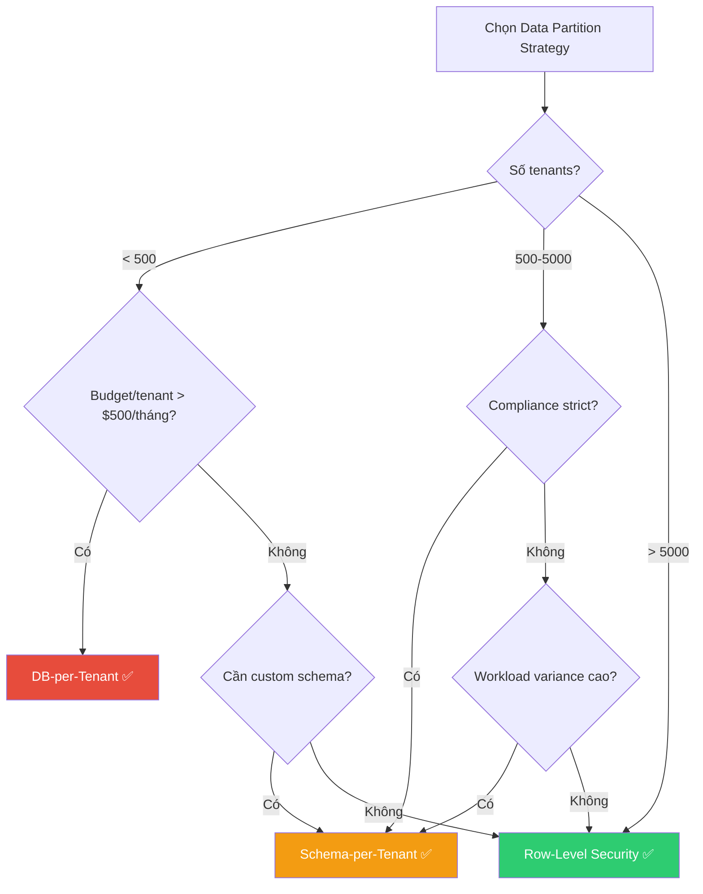
```mermaid
graph TD
    S[Chọn Data Partition Strategy] --> Q1{Số tenants?}
    
    Q1 -->|"< 500"| Q2{Budget/tenant > $500/tháng?}
    Q2 -->|Có| DB["DB-per-Tenant ✅"]
    Q2 -->|Không| Q3{Cần custom schema?}
    Q3 -->|Có| SCHEMA["Schema-per-Tenant ✅"]
    Q3 -->|Không| RLS["Row-Level Security ✅"]
    
    Q1 -->|"500-5000"| Q4{Compliance strict?}
    Q4 -->|Có| SCHEMA
    Q4 -->|Không| Q5{Workload variance cao?}
    Q5 -->|Có| SCHEMA
    Q5 -->|Không| RLS
    
    Q1 -->|"> 5000"| RLS

    style DB fill:#e74c3c,color:#fff
    style SCHEMA fill:#f39c12,color:#fff
    style RLS fill:#2ecc71,color:#fff
```

---

## 4. Tenant Identity & Context Propagation

Tenant Identity & Context Propagation là **xương sống** của mọi hệ thống multi-tenant. Mỗi request đi vào hệ thống phải được **xác định thuộc về tenant nào** (Identity) và thông tin đó phải được **truyền xuyên suốt** qua tất cả các layer, service, message queue (Propagation) — không bao giờ bị mất.

```
┌─────────────────────────────────────────────────────────────────────┐
│              TENANT CONTEXT LIFECYCLE                               │
│                                                                     │
│  ① RESOLVE        ② SET CONTEXT      ③ PROPAGATE       ④ ENFORCE │
│                                                                     │
│  Client Request   Middleware/         Service-to-Service  DB Query  │
│  ───────────►     Interceptor         ───────────────►    Filter    │
│                   ───────────►        Event Bus           Cache Key │
│  Subdomain?                           Message Queue       Storage   │
│  Header?          ThreadLocal /                           Logging   │
│  JWT Claim?       Context Object                                    │
│  Path?            AsyncLocal                                        │
│                                                                     │
│  ⚠️ Nếu bất kỳ bước nào bị thiếu → Cross-Tenant Data Leak!          │
└─────────────────────────────────────────────────────────────────────┘
```

### 4.1 Tenant Resolution Strategies

**Tenant Resolution** là bước đầu tiên — xác định request đến từ tenant nào. Có 5 chiến lược phổ biến:

#### Tổng quan các chiến lược

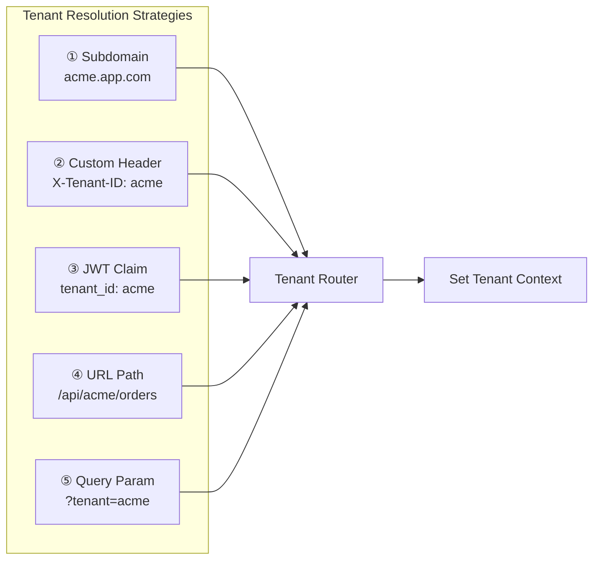
```mermaid
graph LR
    subgraph "Tenant Resolution Strategies"
        A["① Subdomain\nacme.app.com"]
        B["② Custom Header\nX-Tenant-ID: acme"]
        C["③ JWT Claim\ntenant_id: acme"]
        D["④ URL Path\n/api/acme/orders"]
        E["⑤ Query Param\n?tenant=acme"]
    end

    A --> R[Tenant Router]
    B --> R
    C --> R
    D --> R
    E --> R
    R --> CTX[Set Tenant Context]
```

#### ① Subdomain-based Resolution

Mỗi tenant có **subdomain riêng**. Đây là chiến lược phổ biến nhất cho SaaS B2B.

```
┌─────────────────────────────────────────────────────┐
│  SUBDOMAIN RESOLUTION                               │
│                                                     │
│  acme.myapp.com    ──►  tenant_id = "acme"          │
│  beta.myapp.com    ──►  tenant_id = "beta"          │
│  gamma.myapp.com   ──►  tenant_id = "gamma"         │
│                                                     │
│  Custom domain (CNAME):                             │
│  app.acme-corp.com ──►  tenant_id = "acme"          │
│  (DNS CNAME → acme.myapp.com)                       │
└─────────────────────────────────────────────────────┘
```

**Implementation:**

```java
@Component
public class SubdomainTenantResolver implements TenantResolver {

    // Danh sách domain chính của platform
    private static final Set<String> PLATFORM_DOMAINS = Set.of(
        "myapp.com", "myapp.io", "localhost"
    );

    @Override
    public String resolve(HttpServletRequest request) {
        String host = request.getServerName(); // acme.myapp.com

        // Case 1: Subdomain resolution
        for (String domain : PLATFORM_DOMAINS) {
            if (host.endsWith("." + domain)) {
                String subdomain = host.replace("." + domain, "");
                return validateTenant(subdomain);
            }
        }

        // Case 2: Custom domain → lookup mapping table
        // app.acme-corp.com → tenants_domains table → "acme"
        return customDomainRepo.findTenantByDomain(host)
            .orElseThrow(() -> new TenantNotFoundException(
                "No tenant found for domain: " + host));
    }

    private String validateTenant(String tenantId) {
        if (!tenantRepo.existsById(tenantId)) {
            throw new TenantNotFoundException("Tenant not found: " + tenantId);
        }
        return tenantId;
    }
}
```

**Nginx routing cho subdomain:**

```nginx
# Wildcard subdomain → forward to app
server {
    listen 443 ssl;
    server_name ~^(?<tenant>[a-z0-9-]+)\.myapp\.com$;

    location / {
        proxy_pass http://app-backend;
        proxy_set_header X-Tenant-ID $tenant;
        proxy_set_header Host $host;
    }
}
```

| ✅ Ưu điểm | ❌ Nhược điểm |
|------------|--------------|
| UX tốt: tenant biết URL của mình | DNS wildcard certificate cần quản lý |
| SEO friendly | Custom domain cần CNAME mapping + SSL cert |
| Dễ cache per subdomain (CDN) | Không dùng được khi API-only (không có browser) |
| Tenant isolation rõ ràng ở URL level | CORS phức tạp hơn (cross-origin) |

**Ví dụ thực tế:** Slack (`acme.slack.com`), Shopify (`acme.myshopify.com`), Atlassian (`acme.atlassian.net`)

#### ② HTTP Header-based Resolution

Tenant ID được truyền qua **custom HTTP header**. Phù hợp cho API-first architectures.

```
┌─────────────────────────────────────────────────────┐
│  HEADER-BASED RESOLUTION                            │
│                                                     │
│  POST /api/orders HTTP/1.1                          │
│  Host: api.myapp.com                                │
│  X-Tenant-ID: acme                     ◄── tenant   │
│  Authorization: Bearer eyJ...                       │
│  Content-Type: application/json                     │
│                                                     │
│  {"item": "laptop", "qty": 1}                       │
└─────────────────────────────────────────────────────┘
```

**Implementation:**

```java
@Component
public class HeaderTenantResolver implements TenantResolver {

    private static final String TENANT_HEADER = "X-Tenant-ID";

    @Override
    public String resolve(HttpServletRequest request) {
        String tenantId = request.getHeader(TENANT_HEADER);

        if (tenantId == null || tenantId.isBlank()) {
            throw new MissingTenantException(
                "Missing required header: " + TENANT_HEADER);
        }

        // Sanitize — phòng injection
        tenantId = tenantId.trim().toLowerCase()
            .replaceAll("[^a-z0-9_-]", "");

        // Validate tenant tồn tại
        if (!tenantRepo.existsById(tenantId)) {
            throw new TenantNotFoundException("Invalid tenant: " + tenantId);
        }

        return tenantId;
    }
}
```

| ✅ Ưu điểm | ❌ Nhược điểm |
|------------|--------------|
| Đơn giản, dễ implement | Client phải tự thêm header → dễ quên/sai |
| Phù hợp API-to-API, service mesh | Header có thể bị giả mạo nếu không verify |
| Không ảnh hưởng URL structure | Không dùng cho browser-based apps (user không set header) |
| Dễ test (curl, Postman) | Cần validate + cross-check với auth context |

**⚠️ Security Warning:** Header `X-Tenant-ID` **phải luôn được validate** với JWT/auth context. Không bao giờ tin tưởng header đơn lẻ.

#### ③ JWT Claim-based Resolution

Tenant ID **nhúng trong JWT token** — cách **an toàn nhất** vì token đã được sign bởi auth server.

```
┌─────────────────────────────────────────────────────────┐
│  JWT CLAIM-BASED RESOLUTION                             │
│                                                         │
│  JWT Payload:                                           │
│  {                                                      │
│    "sub": "user-uuid-1234",                             │
│    "email": "john@acme.com",                            │
│    "tenant_id": "acme",           ◄── tenant identity   │
│    "tenant_tier": "enterprise",   ◄── tenant metadata   │
│    "roles": ["admin", "billing"],                       │
│    "iat": 1700000000,                                   │
│    "exp": 1700003600                                    │
│  }                                                      │
│                                                         │
│  Signed bởi Auth Server → Không thể giả mạo             │
└─────────────────────────────────────────────────────────┘
```

**Implementation:**

```java
@Component
public class JwtTenantResolver implements TenantResolver {

    private final JwtDecoder jwtDecoder;

    @Override
    public String resolve(HttpServletRequest request) {
        String authHeader = request.getHeader("Authorization");
        if (authHeader == null || !authHeader.startsWith("Bearer ")) {
            throw new AuthenticationException("Missing Bearer token");
        }

        String token = authHeader.substring(7);
        Jwt jwt = jwtDecoder.decode(token); // Verify signature + expiry

        String tenantId = jwt.getClaimAsString("tenant_id");
        if (tenantId == null) {
            throw new MissingTenantException("JWT missing tenant_id claim");
        }

        // Optional: Cross-check header vs JWT
        String headerTenant = request.getHeader("X-Tenant-ID");
        if (headerTenant != null && !headerTenant.equals(tenantId)) {
            throw new TenantMismatchException(
                "Header tenant '" + headerTenant +
                "' does not match JWT tenant '" + tenantId + "'");
        }

        return tenantId;
    }
}
```

| ✅ Ưu điểm | ❌ Nhược điểm |
|------------|--------------|
| An toàn nhất — token đã signed | Token size lớn hơn khi thêm claims |
| Không thể giả mạo tenant_id | Token revocation phức tạp (stateless JWT) |
| Kết hợp AuthN + tenant identity | Tenant switch cần re-authenticate |
| Không cần DB lookup per request | User thuộc nhiều tenant → cần tenant selector |

**Ví dụ thực tế:** Auth0, AWS Cognito, Keycloak đều hỗ trợ custom claims trong JWT.

#### ④ URL Path-based Resolution

Tenant ID nằm trong **URL path**.

```
GET /api/tenants/acme/orders         → tenant_id = "acme"
GET /api/tenants/beta/users          → tenant_id = "beta"
GET /api/v1/acme/products            → tenant_id = "acme"
```

**Implementation (Spring Boot):**

```java
@RestController
@RequestMapping("/api/tenants/{tenantId}")
public class OrderController {

    @GetMapping("/orders")
    public List<Order> getOrders(@PathVariable String tenantId) {
        // Validate tenantId matches authenticated user's tenant
        TenantContext.validateAccess(tenantId);
        TenantContext.setCurrentTenant(tenantId);
        return orderService.findAll();
    }
}
```

| ✅ Ưu điểm | ❌ Nhược điểm |
|------------|--------------|
| RESTful, explicit | URL dài, lặp tenant ở mọi endpoint |
| Dễ debug — thấy tenant trong URL | Khó refactor khi cần thay đổi URL structure |
| API versioning + tenant cùng lúc | Mỗi controller phải handle @PathVariable |

#### ⑤ Query Parameter-based Resolution

```
GET /api/orders?tenant_id=acme       → tenant_id = "acme"
```

**⚠️ Ít được khuyến khích** — dễ bị lộ trong logs, browser history, referrer headers.

#### Bảng so sánh tổng hợp

| Tiêu chí | Subdomain | Header | JWT Claim | URL Path | Query Param |
|----------|:---------:|:------:|:---------:|:--------:|:-----------:|
| **Security** | 🟡 | 🟡 | 🟢 Cao nhất | 🟡 | 🔴 Thấp |
| **UX (Browser)** | 🟢 Tốt nhất | 🔴 Không dùng được | 🟡 | 🟡 | 🟡 |
| **API-first** | 🟡 | 🟢 Tốt nhất | 🟢 | 🟢 | 🟡 |
| **Implementation** | 🟡 DNS + SSL | 🟢 Đơn giản | 🟡 Auth server | 🟢 Đơn giản | 🟢 Đơn giản |
| **Multi-tenant switch** | 🔴 Đổi URL | 🟢 Đổi header | 🔴 Re-auth | 🟢 Đổi path | 🟢 Đổi param |
| **Service-to-service** | 🔴 Không phù hợp | 🟢 Tốt nhất | 🟢 | 🟡 | 🟡 |
| **Phổ biến cho** | SaaS B2B web | Internal APIs | Public APIs | REST APIs | Legacy |

#### Composite Resolution — Best Practice

Trong thực tế, thường **kết hợp nhiều chiến lược** và ưu tiên theo thứ tự:

```java
@Component
public class CompositeTenantResolver implements TenantResolver {

    private final List<TenantResolver> resolvers;

    public CompositeTenantResolver(
            JwtTenantResolver jwtResolver,
            HeaderTenantResolver headerResolver,
            SubdomainTenantResolver subdomainResolver) {
        // Ưu tiên: JWT > Header > Subdomain
        this.resolvers = List.of(jwtResolver, headerResolver, subdomainResolver);
    }

    @Override
    public String resolve(HttpServletRequest request) {
        for (TenantResolver resolver : resolvers) {
            try {
                String tenantId = resolver.resolve(request);
                if (tenantId != null) {
                    return tenantId;
                }
            } catch (Exception ignored) {
                // Thử resolver tiếp theo
            }
        }
        throw new TenantNotFoundException("Cannot resolve tenant from request");
    }
}
```

```
Resolution Priority:
┌─────────────────────────────────────────────┐
│  1. JWT Claim (nếu có Bearer token)         │  ← Tin cậy nhất
│  2. HTTP Header (nếu internal service call) │  ← Service mesh
│  3. Subdomain (nếu browser request)         │  ← User-facing
│  4. URL Path (fallback)                     │  ← REST API
│  5. ❌ Reject request                       │  ← Không xác định
└─────────────────────────────────────────────┘
```

### 4.2 Tenant Context trong Microservice

Sau khi resolve được tenant, bước tiếp theo là **lưu tenant context** sao cho toàn bộ code trong request có thể truy cập mà **không cần truyền tham số tenant_id** qua từng method.

#### Tenant Context Object

```java
// TenantContext.java — Immutable context object
public record TenantContext(
    String tenantId,          // "acme"
    String tenantTier,        // "enterprise" | "pro" | "free"
    String tenantRegion,      // "ap-southeast-1"
    Map<String, String> metadata  // Custom config
) {
    // Validation trong constructor
    public TenantContext {
        Objects.requireNonNull(tenantId, "tenantId must not be null");
        if (tenantId.isBlank()) {
            throw new IllegalArgumentException("tenantId must not be blank");
        }
    }
}
```

#### ① ThreadLocal Pattern (Java / JVM)

**ThreadLocal** lưu tenant context **per-thread** — mỗi request thread có context riêng, không chia sẻ.

```java
public class TenantContextHolder {

    private static final ThreadLocal<TenantContext> CONTEXT =
        new ThreadLocal<>();

    // ① Set khi request đến (middleware/interceptor)
    public static void set(TenantContext ctx) {
        CONTEXT.set(ctx);
    }

    // ② Get ở bất kỳ đâu trong cùng thread
    public static TenantContext get() {
        TenantContext ctx = CONTEXT.get();
        if (ctx == null) {
            throw new IllegalStateException(
                "TenantContext not set! " +
                "Ensure TenantInterceptor is configured.");
        }
        return ctx;
    }

    public static String getTenantId() {
        return get().tenantId();
    }

    // ③ Clear khi request kết thúc (BẮT BUỘC — tránh memory leak)
    public static void clear() {
        CONTEXT.remove();
    }
}
```

**Interceptor tự động set/clear context:**

```java
@Component
public class TenantInterceptor implements HandlerInterceptor {

    private final TenantResolver tenantResolver;
    private final TenantConfigService tenantConfigService;

    @Override
    public boolean preHandle(HttpServletRequest request,
                             HttpServletResponse response,
                             Object handler) {
        // ① Resolve tenant từ request
        String tenantId = tenantResolver.resolve(request);

        // ② Load tenant config
        TenantConfig config = tenantConfigService.getConfig(tenantId);

        // ③ Set context
        TenantContextHolder.set(new TenantContext(
            tenantId,
            config.getTier(),
            config.getRegion(),
            config.getMetadata()
        ));

        // ④ Set MDC cho logging (tự động thêm tenant_id vào mọi log)
        MDC.put("tenant_id", tenantId);
        MDC.put("tenant_tier", config.getTier());

        return true;
    }

    @Override
    public void afterCompletion(HttpServletRequest request,
                                HttpServletResponse response,
                                Object handler, Exception ex) {
        // ⑤ BẮT BUỘC: Clear context sau mỗi request
        TenantContextHolder.clear();
        MDC.clear();
    }
}

// Đăng ký interceptor
@Configuration
public class WebConfig implements WebMvcConfigurer {

    @Override
    public void addInterceptors(InterceptorRegistry registry) {
        registry.addInterceptor(tenantInterceptor)
            .addPathPatterns("/api/**")          // Áp dụng cho API
            .excludePathPatterns(
                "/api/health",                   // Health check — no tenant
                "/api/auth/login",               // Login — chưa có tenant
                "/api/public/**"                 // Public endpoints
            );
    }
}
```

#### ② Async Context Propagation

**⚠️ Vấn đề quan trọng:** ThreadLocal **không tự động truyền** sang thread khác (async, thread pool, @Async, CompletableFuture).

```
┌─────────────────────────────────────────────────────────┐
│  ⚠️ THREADLOCAL + ASYNC = CONTEXT LOST!                 │
│                                                         │
│  Request Thread (có context):                           │
│  ┌─────────────────────────────┐                        │
│  │ TenantContext = "acme"      │                        │
│  │                             │                        │
│  │ CompletableFuture.runAsync( │                        │
│  │   () -> {                   │                        │
│  │     // ❌ TenantContext = null!                      │
│  │     // Chạy trên thread pool thread khác             │
│  │   }                         │                        │
│  │ );                          │                        │
│  └─────────────────────────────┘                        │
│                                                         │
│  FIX: Dùng InheritableThreadLocal hoặc TaskDecorator    │
└─────────────────────────────────────────────────────────┘
```

**Fix 1: TaskDecorator (Spring) — Recommended:**

```java
@Component
public class TenantAwareTaskDecorator implements TaskDecorator {

    @Override
    public Runnable decorate(Runnable runnable) {
        // Capture context trên calling thread
        TenantContext ctx = TenantContextHolder.get();
        Map<String, String> mdcContext = MDC.getCopyOfContextMap();

        return () -> {
            try {
                // Set context trên worker thread
                TenantContextHolder.set(ctx);
                if (mdcContext != null) MDC.setContextMap(mdcContext);
                runnable.run();
            } finally {
                // Clear trên worker thread
                TenantContextHolder.clear();
                MDC.clear();
            }
        };
    }
}

// Cấu hình thread pool
@Configuration
@EnableAsync
public class AsyncConfig {

    @Bean
    public Executor taskExecutor(TenantAwareTaskDecorator decorator) {
        ThreadPoolTaskExecutor executor = new ThreadPoolTaskExecutor();
        executor.setCorePoolSize(10);
        executor.setMaxPoolSize(50);
        executor.setTaskDecorator(decorator);  // ← Truyền context
        executor.initialize();
        return executor;
    }
}
```

**Fix 2: Context wrapper cho CompletableFuture:**

```java
public class TenantAwareExecutor {

    public static <T> CompletableFuture<T> supplyAsync(
            Supplier<T> supplier, Executor executor) {
        TenantContext ctx = TenantContextHolder.get();
        return CompletableFuture.supplyAsync(() -> {
            try {
                TenantContextHolder.set(ctx);
                return supplier.get();
            } finally {
                TenantContextHolder.clear();
            }
        }, executor);
    }
}

// Sử dụng
CompletableFuture<Report> future = TenantAwareExecutor.supplyAsync(
    () -> reportService.generate(), // tenant context được giữ
    asyncExecutor
);
```

#### ③ Node.js / Express Pattern

```javascript
// Dùng AsyncLocalStorage (Node.js 16+) — tương đương ThreadLocal
import { AsyncLocalStorage } from 'async_hooks';

const tenantStorage = new AsyncLocalStorage();

// Middleware — set context
function tenantMiddleware(req, res, next) {
    const tenantId = req.headers['x-tenant-id']
        || extractFromJwt(req)
        || extractFromSubdomain(req);

    if (!tenantId) {
        return res.status(400).json({ error: 'Missing tenant context' });
    }

    const tenantCtx = {
        tenantId,
        tier: null, // sẽ load từ DB
        region: null,
    };

    // Chạy toàn bộ request chain trong context
    tenantStorage.run(tenantCtx, () => {
        next();
    });
}

// Get context ở bất kỳ đâu (service, repository, etc.)
function getCurrentTenant() {
    const ctx = tenantStorage.getStore();
    if (!ctx) throw new Error('Tenant context not available');
    return ctx;
}

// Sử dụng trong service
class OrderService {
    async getOrders() {
        const { tenantId } = getCurrentTenant();
        return db.query('SELECT * FROM orders WHERE tenant_id = $1', [tenantId]);
    }
}

app.use(tenantMiddleware);
```

#### ④ Python / FastAPI Pattern

```python
from contextvars import ContextVar
from fastapi import FastAPI, Request, HTTPException

# ContextVar — Python's ThreadLocal equivalent (async-safe)
tenant_ctx: ContextVar[dict] = ContextVar('tenant_ctx')

app = FastAPI()

@app.middleware("http")
async def tenant_middleware(request: Request, call_next):
    tenant_id = (
        request.headers.get("x-tenant-id")
        or extract_from_jwt(request)
        or extract_from_subdomain(request)
    )

    if not tenant_id:
        raise HTTPException(status_code=400, detail="Missing tenant context")

    # Set context — tự động propagate qua async/await
    token = tenant_ctx.set({
        "tenant_id": tenant_id,
        "tier": await load_tenant_tier(tenant_id),
    })

    try:
        response = await call_next(request)
        return response
    finally:
        tenant_ctx.reset(token)

# Sử dụng ở bất kỳ đâu
def get_current_tenant() -> dict:
    try:
        return tenant_ctx.get()
    except LookupError:
        raise RuntimeError("Tenant context not set")

class OrderService:
    async def get_orders(self):
        ctx = get_current_tenant()
        return await db.fetch(
            "SELECT * FROM orders WHERE tenant_id = $1",
            ctx["tenant_id"]
        )
```

#### ⚠️ Common Pitfalls — Lỗi thường gặp

```
❌ PITFALL 1: Quên clear ThreadLocal
   → Memory leak trong connection pool (Tomcat reuse threads)
   → Data leak: request sau nhận context của request trước
   ✅ FIX: Luôn clear trong finally/afterCompletion

❌ PITFALL 2: Async code mất context
   → @Async, CompletableFuture, parallel streams
   ✅ FIX: TaskDecorator hoặc context wrapper

❌ PITFALL 3: Scheduler/Cron job không có context
   → Background jobs không có HTTP request → không có tenant
   ✅ FIX: Job metadata phải chứa tenant_id, set context trước khi execute

❌ PITFALL 4: WebSocket connection không có context per message
   → Context chỉ set khi connect, không refresh per message
   ✅ FIX: Mỗi WebSocket message phải carry tenant_id

❌ PITFALL 5: Static method access tenant context
   → Khó test, khó trace
   ✅ FIX: Inject TenantContextProvider thay vì static access
```

### 4.3 Propagation qua Message Queue / Event Bus

Khi service A gọi service B qua **message queue** (SQS, Kafka, RabbitMQ) hoặc **event bus** (EventBridge, SNS), tenant context phải được **nhúng vào message metadata**.

#### Luồng propagation tổng quan

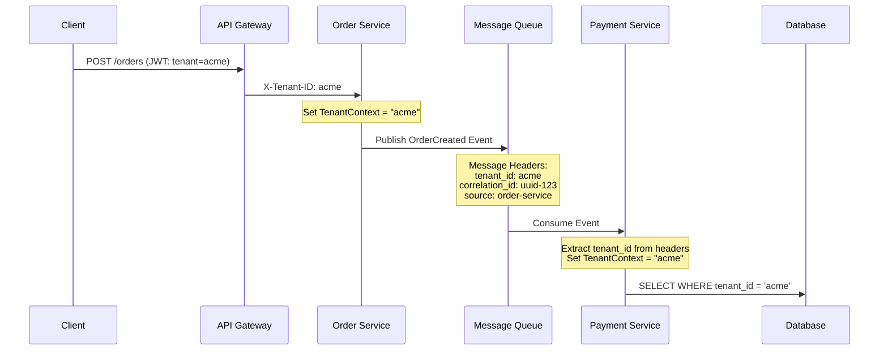
```mermaid
sequenceDiagram
    participant Client
    participant GW as API Gateway
    participant OrderSvc as Order Service
    participant Queue as Message Queue
    participant PaymentSvc as Payment Service
    participant DB as Database

    Client->>GW: POST /orders (JWT: tenant=acme)
    GW->>OrderSvc: X-Tenant-ID: acme
    Note over OrderSvc: Set TenantContext = "acme"
    
    OrderSvc->>Queue: Publish OrderCreated Event
    Note over Queue: Message Headers:<br/>tenant_id: acme<br/>correlation_id: uuid-123<br/>source: order-service
    
    Queue->>PaymentSvc: Consume Event
    Note over PaymentSvc: Extract tenant_id from headers<br/>Set TenantContext = "acme"
    
    PaymentSvc->>DB: SELECT WHERE tenant_id = 'acme'
```

#### Event Format — Chuẩn hóa

```json
{
  "metadata": {
    "event_id": "evt-uuid-7890",
    "event_type": "order.created",
    "source": "order-service",
    "timestamp": "2024-01-15T10:30:00Z",
    "version": "1.0",

    "tenant_id": "acme",
    "tenant_tier": "enterprise",
    "correlation_id": "corr-uuid-1234",
    "causation_id": "evt-uuid-6789",
    "trace_id": "trace-uuid-5678"
  },
  "payload": {
    "order_id": "ORD-001",
    "total": 150.00,
    "currency": "USD"
  }
}
```

**Quy tắc chuẩn hóa metadata:**

| Field | Bắt buộc? | Mô tả |
|-------|:---------:|-------|
| `tenant_id` | ✅ **Bắt buộc** | Tenant sở hữu event |
| `tenant_tier` | 🟡 Nên có | Để consumer biết routing/priority |
| `correlation_id` | ✅ **Bắt buộc** | Trace toàn bộ flow xuyên services |
| `causation_id` | 🟡 Nên có | Event nào gây ra event này |
| `trace_id` | 🟡 Nên có | Distributed tracing (OpenTelemetry) |
| `source` | ✅ **Bắt buộc** | Service nào publish event |
| `event_type` | ✅ **Bắt buộc** | Loại event |

#### Implementation — Kafka

**Producer (auto-inject tenant context):**

```java
@Component
public class TenantAwareKafkaProducer {

    private final KafkaTemplate<String, String> kafka;
    private final ObjectMapper mapper;

    public void publish(String topic, Object event) {
        String tenantId = TenantContextHolder.getTenantId();

        // Tạo message với tenant headers
        ProducerRecord<String, String> record = new ProducerRecord<>(
            topic,
            null,                          // partition (null = auto)
            tenantId,                      // key = tenant_id (để ordering)
            mapper.writeValueAsString(event)
        );

        // Inject tenant metadata vào Kafka headers
        record.headers()
            .add("tenant_id", tenantId.getBytes())
            .add("tenant_tier",
                 TenantContextHolder.get().tenantTier().getBytes())
            .add("correlation_id",
                 MDC.get("correlation_id").getBytes())
            .add("source", "order-service".getBytes());

        kafka.send(record);
    }
}
```

**Consumer (auto-extract tenant context):**

```java
@Component
public class TenantAwareKafkaConsumer {

    @KafkaListener(topics = "order-events")
    public void consume(ConsumerRecord<String, String> record) {
        try {
            // ① Extract tenant từ Kafka headers
            String tenantId = headerValue(record, "tenant_id");
            String tenantTier = headerValue(record, "tenant_tier");
            String correlationId = headerValue(record, "correlation_id");

            // ② Set context cho consumer thread
            TenantContextHolder.set(new TenantContext(
                tenantId, tenantTier, null, Map.of()
            ));
            MDC.put("tenant_id", tenantId);
            MDC.put("correlation_id", correlationId);

            // ③ Process event — toàn bộ code bên dưới có tenant context
            processEvent(record.value());

        } finally {
            // ④ Clear context
            TenantContextHolder.clear();
            MDC.clear();
        }
    }

    private String headerValue(ConsumerRecord<?, ?> record, String key) {
        Header header = record.headers().lastHeader(key);
        if (header == null) {
            throw new IllegalStateException(
                "Missing required header: " + key);
        }
        return new String(header.value());
    }
}
```

#### Implementation — SQS / SNS (AWS)

```java
// Producer — SQS message attributes
public void publishToSqs(String queueUrl, Object event) {
    String tenantId = TenantContextHolder.getTenantId();

    SendMessageRequest request = SendMessageRequest.builder()
        .queueUrl(queueUrl)
        .messageBody(mapper.writeValueAsString(event))
        .messageAttributes(Map.of(
            "tenant_id", attr(tenantId),
            "tenant_tier", attr(TenantContextHolder.get().tenantTier()),
            "correlation_id", attr(MDC.get("correlation_id")),
            "source", attr("order-service")
        ))
        // Message group ID = tenant_id → ordering per tenant
        .messageGroupId(tenantId)
        .build();

    sqsClient.sendMessage(request);
}

// Consumer — Lambda handler
public void handleSqsEvent(SQSEvent event) {
    for (SQSEvent.SQSMessage msg : event.getRecords()) {
        String tenantId = msg.getMessageAttributes()
            .get("tenant_id").getStringValue();

        try {
            TenantContextHolder.set(new TenantContext(tenantId, ...));
            processMessage(msg.getBody());
        } finally {
            TenantContextHolder.clear();
        }
    }
}
```

#### gRPC Metadata Propagation

```java
// gRPC Client Interceptor — auto-inject tenant
public class TenantClientInterceptor implements ClientInterceptor {

    private static final Metadata.Key<String> TENANT_KEY =
        Metadata.Key.of("x-tenant-id", Metadata.ASCII_STRING_MARSHALLER);

    @Override
    public <ReqT, RespT> ClientCall<ReqT, RespT> interceptCall(
            MethodDescriptor<ReqT, RespT> method,
            CallOptions options,
            Channel next) {

        return new ForwardingClientCall.SimpleForwardingClientCall<>(
                next.newCall(method, options)) {
            @Override
            public void start(Listener<RespT> listener, Metadata headers) {
                // Inject tenant vào gRPC metadata
                headers.put(TENANT_KEY,
                    TenantContextHolder.getTenantId());
                super.start(listener, headers);
            }
        };
    }
}

// gRPC Server Interceptor — auto-extract tenant
public class TenantServerInterceptor implements ServerInterceptor {

    @Override
    public <ReqT, RespT> ServerCall.Listener<ReqT> interceptCall(
            ServerCall<ReqT, RespT> call,
            Metadata headers,
            ServerCallHandler<ReqT, RespT> next) {

        String tenantId = headers.get(TENANT_KEY);
        if (tenantId == null) {
            call.close(Status.UNAUTHENTICATED
                .withDescription("Missing tenant context"), new Metadata());
            return new ServerCall.Listener<>() {};
        }

        // Set context cho gRPC handler thread
        Context ctx = Context.current()
            .withValue(TENANT_CONTEXT_KEY, tenantId);

        return Contexts.interceptCall(ctx, call, headers, next);
    }
}
```

#### Tổng kết Propagation — Checklist

```
✅ TENANT CONTEXT PROPAGATION CHECKLIST

Synchronous (HTTP/gRPC):
├── ✅ REST → X-Tenant-ID header (auto-inject via interceptor)
├── ✅ gRPC → Metadata key (auto-inject via ClientInterceptor)
├── ✅ GraphQL → Context object with tenant
└── ✅ Service Mesh → Header propagation (Istio/Linkerd auto-forward)

Asynchronous (Queues/Events):
├── ✅ Kafka → Record headers (tenant_id, correlation_id)
├── ✅ SQS → Message attributes
├── ✅ SNS → Message attributes
├── ✅ EventBridge → detail.metadata.tenant_id
└── ✅ RabbitMQ → Message headers

Background Jobs:
├── ✅ Cron jobs → Job metadata chứa tenant_id
├── ✅ Scheduled tasks → Iterate per tenant, set context trước mỗi tenant
└── ✅ Batch processing → Partition by tenant_id

Internal:
├── ✅ ThreadLocal / AsyncLocalStorage / ContextVar
├── ✅ Async thread pool → TaskDecorator
├── ✅ CompletableFuture → Context wrapper
├── ✅ MDC (logging) → tenant_id label
└── ✅ Metrics → tenant_id tag
```

```
⚠️ NGUYÊN TẮC VÀNG:
   Tenant context KHÔNG BAO GIỜ được "suy luận" (infer).
   Nó phải được TRUYỀN TƯỜNG MINH (explicit propagation)
   trong MỌI communication channel.

   Nếu bạn không trả lời được câu hỏi:
   "Tenant context được truyền từ đâu sang đâu, bằng cách nào?"
   → Bạn có lỗ hổng cross-tenant data leak.
```

## 5. Authentication & Authorization

Trong hệ thống multi-tenant, AuthN (xác thực) và AuthZ (phân quyền) phải trả lời **3 câu hỏi** cùng lúc:

```
┌─────────────────────────────────────────────────────────────────┐
│              MULTI-TENANT AUTH FLOW                             │
│                                                                 │
│  ① WHO are you?        → Authentication (AuthN)                │
│     User identity: email, password, MFA, SSO                    │
│                                                                 │
│  ② WHICH tenant?       → Tenant Resolution                     │
│     Tenant context: JWT claim, subdomain, header                │
│                                                                 │
│  ③ WHAT can you do?    → Authorization (AuthZ)                 │
│     Permissions: RBAC, ABAC, scoped to tenant                   │
│                                                                 │
│  ⚠️ AuthZ phải LUÔN scope theo tenant:                          │
│     "User X có quyền Y TRONG tenant Z" — không phải chỉ "X có Y"│
└─────────────────────────────────────────────────────────────────┘
```

### 5.1 Tenant-aware AuthN/AuthZ

#### Authentication Flow — Multi-Tenant

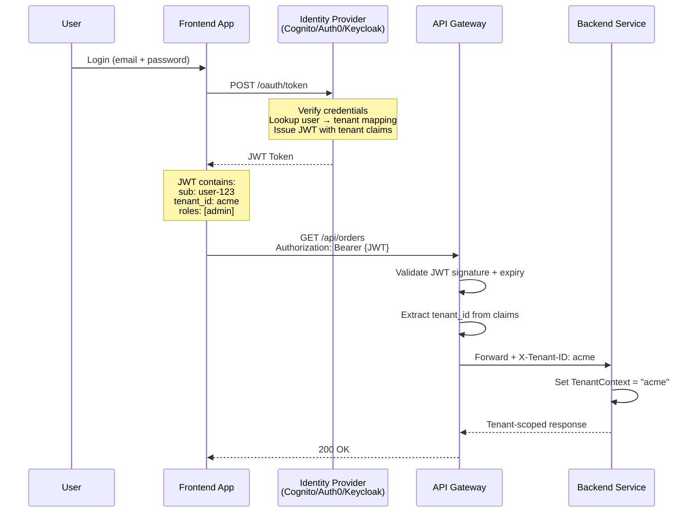
```mermaid
sequenceDiagram
    participant User
    participant App as Frontend App
    participant IDP as Identity Provider<br/>(Cognito/Auth0/Keycloak)
    participant API as API Gateway
    participant Svc as Backend Service

    User->>App: Login (email + password)
    App->>IDP: POST /oauth/token
    Note over IDP: Verify credentials<br/>Lookup user → tenant mapping<br/>Issue JWT with tenant claims

    IDP-->>App: JWT Token
    Note over App: JWT contains:<br/>sub: user-123<br/>tenant_id: acme<br/>roles: [admin]

    App->>API: GET /api/orders<br/>Authorization: Bearer {JWT}
    API->>API: Validate JWT signature + expiry
    API->>API: Extract tenant_id from claims
    API->>Svc: Forward + X-Tenant-ID: acme
    Svc->>Svc: Set TenantContext = "acme"
    Svc-->>API: Tenant-scoped response
    API-->>App: 200 OK
```

#### JWT Structure cho Multi-Tenant

```json
{
  "header": {
    "alg": "RS256",
    "typ": "JWT",
    "kid": "key-id-123"
  },
  "payload": {
    "sub": "user-uuid-1234",
    "email": "john@acme.com",
    "name": "John Doe",

    "tenant_id": "acme",
    "tenant_name": "ACME Corp",
    "tenant_tier": "enterprise",

    "org_id": "org-acme-001",
    "roles": ["admin", "billing"],
    "permissions": ["order:read", "order:write", "user:manage"],

    "iss": "https://auth.myapp.com",
    "aud": "https://api.myapp.com",
    "iat": 1700000000,
    "exp": 1700003600,
    "scope": "openid profile email"
  }
}
```

**Các claim quan trọng cho multi-tenant:**

| Claim | Bắt buộc | Mô tả |
|-------|:--------:|-------|
| `sub` | ✅ | User ID duy nhất (UUID) |
| `tenant_id` | ✅ | Tenant hiện tại của user |
| `tenant_tier` | 🟡 | Tier ảnh hưởng rate limit, features |
| `roles` | ✅ | Roles **trong tenant** (admin, member, viewer) |
| `permissions` | 🟡 | Fine-grained permissions |
| `org_id` | 🟡 | Nếu org ≠ tenant (multi-level hierarchy) |

#### Mô hình Identity Provider

**① Shared Identity Provider (1 IDP cho tất cả tenant)**

```
┌──────────────────────────────────────────────────────┐
│              Shared Identity Provider                │
│              (Cognito / Auth0 / Keycloak)            │
│                                                      │
│  ┌──────────────────────────────────────────────┐    │
│  │              Single User Pool                │    │
│  │                                              │    │
│  │  User: john@acme.com → tenant_id: acme       │    │
│  │  User: jane@beta.com → tenant_id: beta       │    │
│  │  User: bob@acme.com  → tenant_id: acme       │    │
│  │                                              │    │
│  │Tenant mapping: user_attributes / app_metadata│    │
│  └──────────────────────────────────────────────┘    │
│                                                      │
│  ✅ Đơn giản, 1 pool to manage                       │
│  ❌ Rủi ro: user xem data tenant khác nếu bug        │
│  ❌ SSO config phải validate tenant                  │
└──────────────────────────────────────────────────────┘
```

**② Per-Tenant Identity Provider (1 IDP/pool per tenant)**

```
┌──────────────────────────────────────────────────────┐
│           Per-Tenant User Pools                      │
│                                                      │
│  ┌──────────────┐  ┌──────────────┐  ┌────────────┐  │
│  │  Pool: ACME  │  │  Pool: BETA  │  │ Pool:GAMMA │  │
│  │              │  │              │  │            │  │
│  │  john@acme   │  │  jane@beta   │  │ bob@gamma  │  │
│  │  bob@acme    │  │  alice@beta  │  │ sue@gamma  │  │
│  └──────────────┘  └──────────────┘  └────────────┘  │
│                                                      │
│  ✅ Isolation mạnh: mỗi tenant có IdP riêng          │
│  ✅ Tenant có thể tự cấu hình SSO (SAML/OIDC)        │
│  ❌ Quản lý N user pools → operational overhead      │
│  ❌ User thuộc nhiều tenant → phức tạp               │
└──────────────────────────────────────────────────────┘
```

**So sánh:**

| Tiêu chí | Shared Pool | Per-Tenant Pool |
|----------|:-----------:|:---------------:|
| **Isolation** | 🟡 Logic | 🟢 Vật lý |
| **Chi phí** | 🟢 Thấp | 🔴 Cao (N pools) |
| **SSO per tenant** | 🟡 Phức tạp | 🟢 Dễ (mỗi pool có SSO riêng) |
| **User multi-tenant** | 🟢 Dễ | 🔴 Phức tạp (user ở nhiều pools) |
| **Quản lý** | 🟢 1 pool | 🔴 N pools |
| **Phù hợp** | Free/Pro tier | Enterprise tier |

#### Tenant-aware Authentication Middleware

```java
@Component
public class TenantAuthFilter extends OncePerRequestFilter {

    private final JwtDecoder jwtDecoder;
    private final TenantRepository tenantRepo;

    @Override
    protected void doFilterInternal(HttpServletRequest request,
                                     HttpServletResponse response,
                                     FilterChain chain) throws Exception {

        String token = extractBearerToken(request);
        if (token == null) {
            response.sendError(401, "Missing authentication token");
            return;
        }

        try {
            // ① Decode + verify JWT
            Jwt jwt = jwtDecoder.decode(token);

            // ② Extract user + tenant info
            String userId = jwt.getSubject();
            String tenantId = jwt.getClaimAsString("tenant_id");
            List<String> roles = jwt.getClaimAsStringList("roles");

            if (tenantId == null) {
                response.sendError(403, "Token missing tenant_id claim");
                return;
            }

            // ③ Verify tenant is active
            Tenant tenant = tenantRepo.findById(tenantId).orElse(null);
            if (tenant == null || !tenant.isActive()) {
                response.sendError(403, "Tenant suspended or not found");
                return;
            }

            // ④ Set security context
            var auth = new TenantAuthentication(userId, tenantId, roles);
            SecurityContextHolder.getContext().setAuthentication(auth);

            // ⑤ Set tenant context
            TenantContextHolder.set(new TenantContext(
                tenantId, tenant.getTier(), tenant.getRegion(), Map.of()
            ));

            chain.doFilter(request, response);

        } catch (JwtException e) {
            response.sendError(401, "Invalid token: " + e.getMessage());
        } finally {
            TenantContextHolder.clear();
            SecurityContextHolder.clearContext();
        }
    }
}
```

#### User thuộc nhiều Tenant

Nhiều SaaS (Slack, Notion) cho phép user thuộc **nhiều tenant**. Điều này cần **tenant selector** flow:

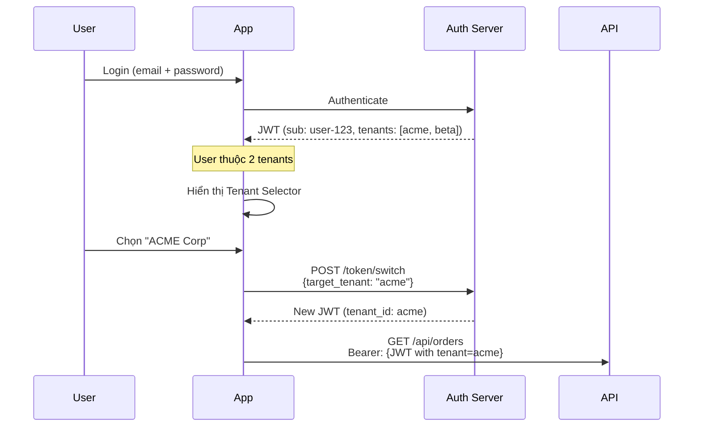
```mermaid
sequenceDiagram
    participant User
    participant App
    participant IDP as Auth Server
    participant API

    User->>App: Login (email + password)
    App->>IDP: Authenticate
    IDP-->>App: JWT (sub: user-123, tenants: [acme, beta])
    Note over App: User thuộc 2 tenants

    App->>App: Hiển thị Tenant Selector
    User->>App: Chọn "ACME Corp"

    App->>IDP: POST /token/switch<br/>{target_tenant: "acme"}
    IDP-->>App: New JWT (tenant_id: acme)

    App->>API: GET /api/orders<br/>Bearer: {JWT with tenant=acme}
```

```java
// Tenant switch endpoint
@PostMapping("/auth/switch-tenant")
public TokenResponse switchTenant(
        @RequestBody SwitchTenantRequest request,
        Authentication auth) {

    String userId = auth.getName();
    String targetTenant = request.getTargetTenantId();

    // Verify user có quyền access tenant này
    if (!userTenantRepo.existsByUserIdAndTenantId(userId, targetTenant)) {
        throw new ForbiddenException(
            "User not member of tenant: " + targetTenant);
    }

    // Issue new token với tenant mới
    return tokenService.issueToken(userId, targetTenant);
}
```

### 5.2 RBAC trong Multi-Tenant

**Role-Based Access Control (RBAC)** trong multi-tenant phải **scope roles theo tenant** — cùng một user có thể là Admin ở tenant A nhưng chỉ là Viewer ở tenant B.

#### Mô hình RBAC Multi-Tenant

```
┌────────────────────────────────────────────────────────────────┐
│                  MULTI-TENANT RBAC                             │
│                                                                │
│  ┌──────────────────────────────────┐                          │
│  │        Platform Level            │                          │
│  │  Super Admin → quản lý tất cả    │                          │
│  │  tenant, billing, system config  │                          │
│  └──────────────┬───────────────────┘                          │
│                 │                                              │
│    ┌────────────┼────────────┐                                 │
│    ▼            ▼            ▼                                 │
│  ┌──────────┐┌──────────┐┌──────────┐                          │
│  │ Tenant A ││ Tenant B ││ Tenant C │                          │
│  │          ││          ││          │                          │
│  │ Roles:   ││ Roles:   ││ Roles:   │                          │
│  │ • Owner  ││ • Owner  ││ • Owner  │                          │
│  │ • Admin  ││ • Admin  ││ • Admin  │                          │
│  │ • Editor ││ • Member ││ • Viewer │   ← Roles có thể khác    │
│  │ • Viewer ││ • Guest  ││          │     nhau per tenant      │
│  └──────────┘└──────────┘└──────────┘                          │
│                                                                │
│  User John: Admin@TenantA, Member@TenantB                      │
│  User Jane: Owner@TenantB, Viewer@TenantC                      │
└────────────────────────────────────────────────────────────────┘
```

#### Database Schema cho RBAC Multi-Tenant

```sql
-- Bảng tenant
CREATE TABLE tenants (
    id VARCHAR(50) PRIMARY KEY,
    name VARCHAR(255) NOT NULL,
    tier VARCHAR(20) DEFAULT 'free',    -- free, pro, enterprise
    status VARCHAR(20) DEFAULT 'active', -- active, suspended, deleted
    created_at TIMESTAMP DEFAULT NOW()
);

-- Bảng users (global — user có thể thuộc nhiều tenant)
CREATE TABLE users (
    id UUID PRIMARY KEY DEFAULT gen_random_uuid(),
    email VARCHAR(255) UNIQUE NOT NULL,
    password_hash VARCHAR(255),
    name VARCHAR(255),
    created_at TIMESTAMP DEFAULT NOW()
);

-- Bảng roles (có thể global hoặc per-tenant)
CREATE TABLE roles (
    id UUID PRIMARY KEY DEFAULT gen_random_uuid(),
    tenant_id VARCHAR(50),             -- NULL = global role, NOT NULL = custom role
    name VARCHAR(100) NOT NULL,        -- "admin", "editor", "viewer"
    description TEXT,
    is_system BOOLEAN DEFAULT false,   -- System roles không được xóa
    UNIQUE(tenant_id, name),
    FOREIGN KEY (tenant_id) REFERENCES tenants(id)
);

-- Bảng permissions
CREATE TABLE permissions (
    id UUID PRIMARY KEY DEFAULT gen_random_uuid(),
    resource VARCHAR(100) NOT NULL,    -- "orders", "users", "billing"
    action VARCHAR(50) NOT NULL,       -- "read", "write", "delete", "manage"
    description TEXT,
    UNIQUE(resource, action)
);

-- Role ↔ Permission mapping
CREATE TABLE role_permissions (
    role_id UUID REFERENCES roles(id) ON DELETE CASCADE,
    permission_id UUID REFERENCES permissions(id) ON DELETE CASCADE,
    PRIMARY KEY (role_id, permission_id)
);

-- User ↔ Tenant ↔ Role mapping (QUAN TRỌNG NHẤT)
CREATE TABLE tenant_memberships (
    user_id UUID REFERENCES users(id) ON DELETE CASCADE,
    tenant_id VARCHAR(50) REFERENCES tenants(id) ON DELETE CASCADE,
    role_id UUID REFERENCES roles(id),
    status VARCHAR(20) DEFAULT 'active',  -- active, invited, suspended
    joined_at TIMESTAMP DEFAULT NOW(),
    PRIMARY KEY (user_id, tenant_id)
);

-- Index cho query phổ biến
CREATE INDEX idx_membership_tenant ON tenant_memberships(tenant_id);
CREATE INDEX idx_membership_user ON tenant_memberships(user_id);
```

```
Entity Relationship:
┌────────┐    ┌────────────────────┐    ┌──────────┐
│  User  │───▶│ tenant_memberships │◀───│  Tenant  │
│        │    │ (user, tenant,role)│    │          │
└────────┘    └─────────┬──────────┘    └──────────┘
                        │
                   ┌────▼────┐    ┌───────────────────┐
                   │  Role   │───▶│ role_permissions  │
                   │         │    │ (role, permission)│
                   └─────────┘    └────────┬──────────┘
                                           │
                                    ┌──────▼──────┐
                                    │ Permission  │
                                    │(resource,   │
                                    │ action)     │
                                    └─────────────┘
```

#### Default Roles — Template

```java
// Hệ thống roles mặc định cho mọi tenant
public enum DefaultRole {

    OWNER("owner", "Full access + tenant management", Set.of(
        "orders:*", "users:*", "billing:*", "settings:*", "roles:*"
    )),

    ADMIN("admin", "Full access trừ billing và tenant deletion", Set.of(
        "orders:*", "users:*", "settings:read", "settings:write"
    )),

    EDITOR("editor", "CRUD trên business resources", Set.of(
        "orders:read", "orders:write", "orders:delete",
        "products:read", "products:write"
    )),

    VIEWER("viewer", "Read-only access", Set.of(
        "orders:read", "products:read", "reports:read"
    )),

    GUEST("guest", "Minimal access", Set.of(
        "products:read"
    ));

    // Wildcard permission: "orders:*" = tất cả actions trên orders
}
```

#### Authorization Check — Implementation

```java
@Component
public class TenantAuthorizationService {

    private final TenantMembershipRepository membershipRepo;
    private final RolePermissionRepository rolePermRepo;

    /**
     * Check: User có permission X trong tenant hiện tại không?
     */
    public boolean hasPermission(String userId, String resource,
                                  String action) {
        String tenantId = TenantContextHolder.getTenantId();

        // ① Lấy role của user trong tenant
        TenantMembership membership = membershipRepo
            .findByUserIdAndTenantId(userId, tenantId)
            .orElseThrow(() -> new ForbiddenException(
                "User not member of tenant: " + tenantId));

        // ② Check membership status
        if (!"active".equals(membership.getStatus())) {
            throw new ForbiddenException("Membership suspended");
        }

        // ③ Check permission through role
        String requiredPerm = resource + ":" + action;
        String wildcardPerm = resource + ":*";

        Set<String> userPerms = rolePermRepo
            .findPermissionsByRoleId(membership.getRoleId());

        return userPerms.contains(requiredPerm)
            || userPerms.contains(wildcardPerm)
            || userPerms.contains("*:*"); // super permission
    }

    /**
     * Check permission — throw nếu không có
     */
    public void requirePermission(String resource, String action) {
        String userId = SecurityContextHolder.getContext()
            .getAuthentication().getName();

        if (!hasPermission(userId, resource, action)) {
            throw new ForbiddenException(String.format(
                "Permission denied: %s:%s in tenant %s",
                resource, action, TenantContextHolder.getTenantId()));
        }
    }
}

// Sử dụng với annotation
@Target(ElementType.METHOD)
@Retention(RetentionPolicy.RUNTIME)
public @interface RequirePermission {
    String resource();
    String action();
}

@Aspect
@Component
public class PermissionAspect {

    @Autowired private TenantAuthorizationService authService;

    @Before("@annotation(perm)")
    public void checkPermission(RequirePermission perm) {
        authService.requirePermission(perm.resource(), perm.action());
    }
}

// Controller sử dụng
@RestController
public class OrderController {

    @GetMapping("/api/orders")
    @RequirePermission(resource = "orders", action = "read")
    public List<Order> listOrders() {
        return orderService.findAll(); // Đã scoped theo tenant
    }

    @PostMapping("/api/orders")
    @RequirePermission(resource = "orders", action = "write")
    public Order createOrder(@RequestBody CreateOrderRequest req) {
        return orderService.create(req);
    }

    @DeleteMapping("/api/orders/{id}")
    @RequirePermission(resource = "orders", action = "delete")
    public void deleteOrder(@PathVariable String id) {
        orderService.delete(id);
    }
}

### 5.3 Cross-Tenant Access Control

Mặc định, mọi truy cập **phải bị giới hạn trong tenant hiện tại**. Tuy nhiên, có những use case hợp lệ cần truy cập **cross-tenant**:

#### Khi nào cho phép Cross-Tenant Access?

```
✅ CHO PHÉP (có kiểm soát):
├── Platform Admin: quản lý, support, debugging cho tenant
├── Partner integration: tenant A chia sẻ catalog cho tenant B
├── Marketplace: seller (tenant A) bán hàng cho buyer (tenant B)
├── Parent-child tenant: head office xem data chi nhánh
└── Data export/analytics: aggregated report cross-tenant

❌ KHÔNG BAO GIỜ cho phép:
├── Regular user truy cập data tenant khác
├── API endpoint thiếu tenant validation
├── Background job process data không đúng tenant
└── Cache/queue message không có tenant context
```

#### Cross-Tenant Access Patterns

**① Platform Admin Pattern**

```
┌─────────────────────────────────────────────────────────┐
│  PLATFORM ADMIN ACCESS                                  │
│                                                         │
│  Platform Admin (role: SUPER_ADMIN)                     │
│  ┌─────────────────────────────────────────┐            │
│  │  Can:                                   │            │
│  │  • View any tenant's data (read-only)   │            │
│  │  • Impersonate tenant for debugging     │            │
│  │  • Manage tenant lifecycle              │            │
│  │                                         │            │
│  │  Cannot:                                │            │
│  │  • Modify tenant's business data        │            │
│  │  • Access without audit logging         │            │
│  │  • Bypass without explicit tenant_id    │            │
│  └─────────────────────────────────────────┘            │
│                                                         │
│  ⚠️ Mọi cross-tenant access PHẢI được audit logged      │
└─────────────────────────────────────────────────────────┘
```

```java
@Component
public class CrossTenantAccessService {

    private final AuditLogService auditLog;

    /**
     * Platform admin impersonate tenant — cho support/debugging
     */
    public <T> T executeAsTenant(String targetTenantId,
                                  String reason,
                                  Supplier<T> action) {
        String adminId = SecurityContextHolder.getContext()
            .getAuthentication().getName();

        // ① Verify caller là platform admin
        if (!isPlatformAdmin(adminId)) {
            throw new ForbiddenException("Only platform admins allowed");
        }

        // ② Audit log TRƯỚC KHI thực hiện
        auditLog.log(AuditEvent.builder()
            .action("CROSS_TENANT_ACCESS")
            .actor(adminId)
            .targetTenant(targetTenantId)
            .reason(reason)
            .timestamp(Instant.now())
            .build());

        // ③ Temporarily switch context
        TenantContext originalCtx = TenantContextHolder.get();
        try {
            TenantContextHolder.set(new TenantContext(
                targetTenantId, "admin-override", null, Map.of()
            ));
            return action.get();
        } finally {
            // ④ Restore original context
            TenantContextHolder.set(originalCtx);
        }
    }
}

// Sử dụng
@GetMapping("/admin/tenants/{tenantId}/orders")
@RequireRole("SUPER_ADMIN")
public List<Order> viewTenantOrders(
        @PathVariable String tenantId,
        @RequestParam String reason) {

    return crossTenantService.executeAsTenant(
        tenantId,
        reason,
        () -> orderService.findAll()
    );
}
```

**② Partner/Marketplace Pattern — Shared Resources**

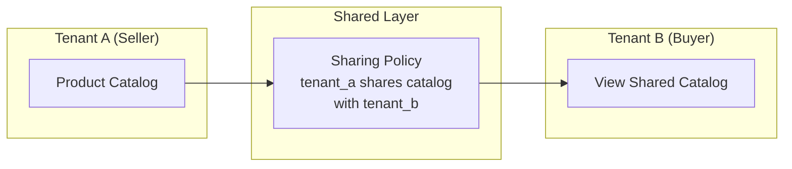
```mermaid
graph LR
    subgraph "Tenant A (Seller)"
        CatalogA["Product Catalog"]
    end

    subgraph "Shared Layer"
        SP["Sharing Policy<br/>tenant_a shares catalog<br/>with tenant_b"]
    end

    subgraph "Tenant B (Buyer)"
        ViewB["View Shared Catalog"]
    end

    CatalogA --> SP
    SP --> ViewB
```

```sql
-- Sharing policy table
CREATE TABLE resource_sharing_policies (
    id UUID PRIMARY KEY DEFAULT gen_random_uuid(),
    owner_tenant_id VARCHAR(50) NOT NULL,      -- Tenant sở hữu resource
    target_tenant_id VARCHAR(50) NOT NULL,      -- Tenant được chia sẻ
    resource_type VARCHAR(100) NOT NULL,        -- "product_catalog"
    access_level VARCHAR(20) NOT NULL,          -- "read", "write"
    expires_at TIMESTAMP,                       -- Có thời hạn
    created_at TIMESTAMP DEFAULT NOW(),
    FOREIGN KEY (owner_tenant_id) REFERENCES tenants(id),
    FOREIGN KEY (target_tenant_id) REFERENCES tenants(id)
);

-- Query: Tenant B xem catalog được share từ Tenant A
SELECT p.* FROM products p
JOIN resource_sharing_policies rsp
    ON rsp.owner_tenant_id = p.tenant_id
    AND rsp.resource_type = 'product_catalog'
    AND rsp.target_tenant_id = 'tenant_b'
    AND rsp.access_level IN ('read', 'write')
    AND (rsp.expires_at IS NULL OR rsp.expires_at > NOW());
```

#### Anti-patterns — Cross-Tenant Access

```
❌ ANTI-PATTERN 1: Bypass tenant filter cho "convenience"
   // NEVER DO THIS
   session.disableFilter("tenantFilter");
   List<Order> allOrders = orderRepo.findAll(); // Tất cả tenant!
   ✅ FIX: Luôn dùng explicit cross-tenant service với audit

❌ ANTI-PATTERN 2: Admin endpoint không có audit log
   ✅ FIX: Mọi cross-tenant access phải logged với who, what, when, why

❌ ANTI-PATTERN 3: Sharing bằng cách bỏ tenant_id khỏi query  
   ✅ FIX: Dùng sharing policy table, explicit access grants
```

### 5.4 API Gateway và Tenant Routing

API Gateway là **điểm vào duy nhất** (single entry point) cho mọi request — nơi thực hiện tenant resolution, authentication, rate limiting, và routing **trước khi** request đến backend services.

#### Kiến trúc tổng quan

```
┌─────────────────────────────────────────────────────────────────────┐
│                        API GATEWAY                                  │
│                                                                     │
│ Request ──► ① TLS ──► ② Auth ──► ③ Tenant ──► ④ Rate ──► ⑤ Route│
│              Termination  Verify     Resolve     Limit     to Svc   │
│                                                                     │
│  ┌─────────────────────────────────────────────────────────────┐    │
│  │  ① TLS Termination: Decrypt HTTPS                          │    │
│  │  ② Authentication:  Verify JWT signature + expiry          │    │
│  │  ③ Tenant Resolve:  Extract tenant_id from JWT/subdomain   │    │
│  │  ④ Rate Limiting:   Apply per-tenant rate limits           │    │
│  │  ⑤ Routing:         Route to correct backend based on      │    │
│  │                     tenant tier / region / feature flags    │    │
│  └─────────────────────────────────────────────────────────────┘    │
│                                                                     │
│  Headers injected vào backend request:                              │
│  ┌─────────────────────────────────────────────────────────────┐    │
│  │  X-Tenant-ID: acme                                          │    │
│  │  X-Tenant-Tier: enterprise                                  │    │
│  │  X-User-ID: user-uuid-1234                                  │    │
│  │  X-User-Roles: admin,billing                                │    │
│  │  X-Request-ID: req-uuid-5678                                │    │
│  │  X-Forwarded-For: 1.2.3.4                                   │    │
│  └─────────────────────────────────────────────────────────────┘    │
└─────────────────────────────────────────────────────────────────────┘
```

#### Tenant-aware Routing Patterns

**① Tier-based Routing — Route theo tenant tier:**

```
┌──────────────────────────────────────────────────────────────┐
│                    API GATEWAY ROUTING                       │
│                                                              │
│  Request + tenant_id ──► Lookup tenant tier                  │
│                                                              │
│  ┌──────────────────────────────────────────────────┐        │
│  │ Free tier     ──► shared-cluster (pool)          │        │
│  │ Pro tier      ──► shared-cluster (priority queue)│        │
│  │ Enterprise    ──► dedicated-cluster (silo)       │        │
│  └──────────────────────────────────────────────────┘        │
│                                                              │
│  ┌──────────────────────────────────────────────────┐        │
│  │  Rate Limits per tier:                           │        │
│  │  Free:       100 req/min,  1K req/day            │        │
│  │  Pro:        1K req/min,   100K req/day          │        │
│  │  Enterprise: 10K req/min,  Unlimited             │        │
│  └──────────────────────────────────────────────────┘        │
└──────────────────────────────────────────────────────────────┘
```

**② Region-based Routing — Data residency compliance:**

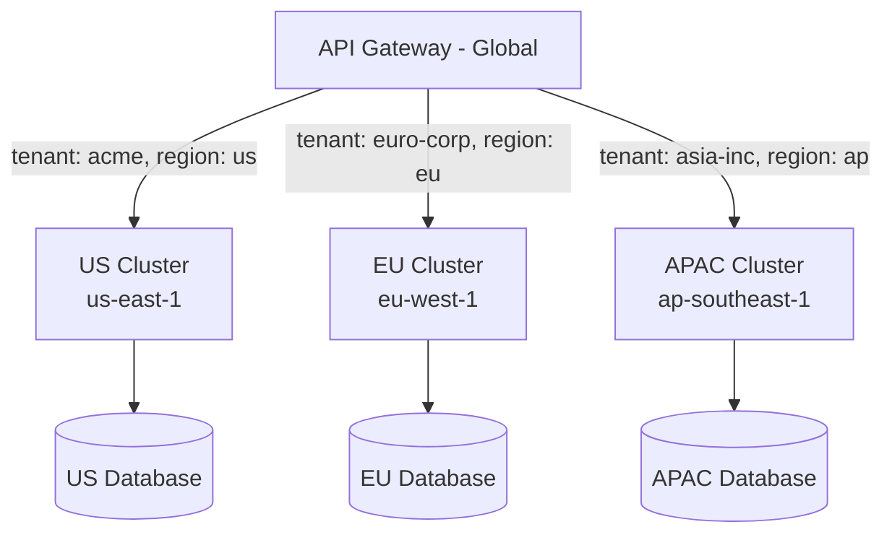
```mermaid
graph TD
    GW[API Gateway - Global]

    GW -->|tenant: acme, region: us| US[US Cluster<br/>us-east-1]
    GW -->|tenant: euro-corp, region: eu| EU[EU Cluster<br/>eu-west-1]
    GW -->|tenant: asia-inc, region: ap| AP[APAC Cluster<br/>ap-southeast-1]

    US --> US_DB[(US Database)]
    EU --> EU_DB[(EU Database)]
    AP --> AP_DB[(APAC Database)]
```

#### Implementation — AWS API Gateway + Lambda Authorizer

```javascript
// Lambda Authorizer — validate JWT + resolve tenant + inject context
exports.handler = async (event) => {
    try {
        const token = event.authorizationToken.replace('Bearer ', '');
        const decoded = jwt.verify(token, publicKey, { algorithms: ['RS256'] });

        const tenantId = decoded.tenant_id;
        const userId = decoded.sub;
        const roles = decoded.roles || [];
        const tenantTier = decoded.tenant_tier || 'free';

        // Verify tenant active (cache this!)
        const tenant = await tenantCache.get(tenantId);
        if (!tenant || tenant.status !== 'active') {
            return generateDeny(userId, event.methodArn);
        }

        // Generate IAM policy with tenant context
        const policy = generateAllow(userId, event.methodArn);

        // Inject tenant info vào context → available in backend
        policy.context = {
            tenantId: tenantId,
            tenantTier: tenantTier,
            userId: userId,
            roles: roles.join(','),
        };

        return policy;
    } catch (err) {
        console.error('Auth failed:', err.message);
        return generateDeny('unknown', event.methodArn);
    }
};

// Backend nhận context từ API Gateway
// event.requestContext.authorizer.tenantId = "acme"
// event.requestContext.authorizer.tenantTier = "enterprise"
```

#### Implementation — Kong Gateway Plugin (Lua)

```lua
-- kong-tenant-plugin/handler.lua
local TenantHandler = {
    PRIORITY = 900, -- Chạy sau auth plugin
    VERSION = "1.0",
}

function TenantHandler:access(conf)
    -- Extract tenant từ JWT (đã verify bởi JWT plugin)
    local jwt_claims = kong.ctx.shared.authenticated_jwt_token_claims
    if not jwt_claims then
        return kong.response.exit(401, { message = "Missing JWT" })
    end

    local tenant_id = jwt_claims.tenant_id
    if not tenant_id then
        return kong.response.exit(403, { message = "Missing tenant_id" })
    end

    -- Lookup tenant config (cached)
    local tenant = get_tenant_config(tenant_id)  -- Redis cache
    if not tenant or tenant.status ~= "active" then
        return kong.response.exit(403, { message = "Tenant inactive" })
    end

    -- Rate limiting per tier
    local rate_limit = conf.rate_limits[tenant.tier] or 100
    -- Apply rate limit (delegate to rate-limiting plugin)

    -- Inject headers cho backend
    kong.service.request.set_header("X-Tenant-ID", tenant_id)
    kong.service.request.set_header("X-Tenant-Tier", tenant.tier)
    kong.service.request.set_header("X-User-ID", jwt_claims.sub)
    kong.service.request.set_header("X-User-Roles",
        table.concat(jwt_claims.roles or {}, ","))

    -- Tier-based routing
    if tenant.tier == "enterprise" and tenant.dedicated_upstream then
        kong.service.request.set_scheme("https")
        kong.service.set_target(tenant.dedicated_upstream, 443)
    end
end

return TenantHandler
```

#### Security Best Practices — Gateway Level

```
✅ GATEWAY SECURITY CHECKLIST

Authentication:
├── ✅ JWT validation: signature, expiry, issuer, audience
├── ✅ Token revocation check (blacklist / introspection)
├── ✅ mTLS cho service-to-service (internal traffic)
└── ✅ API key rotation policy

Tenant Isolation:
├── ✅ Strip client-provided X-Tenant-ID header (chống spoofing)
├── ✅ Re-inject tenant from verified JWT claims
├── ✅ Validate tenant active status before routing
└── ✅ Per-tenant rate limiting (không dùng global rate limit)

Request Validation:
├── ✅ Request size limits per tenant tier
├── ✅ Input validation / WAF rules
├── ✅ IP allowlist per enterprise tenant
└── ✅ CORS policy per tenant subdomain

Logging & Monitoring:
├── ✅ Log tenant_id trong mọi access log
├── ✅ Alert khi tenant bất thường (spike traffic)
├── ✅ Track API usage per tenant cho billing
└── ✅ Separate error rates per tenant
```

---

## 6. Compute & Infrastructure Isolation

Compute isolation quyết định **cách các tenant chia sẻ (hoặc không chia sẻ) tài nguyên xử lý** — CPU, memory, network, storage. Đây là yếu tố ảnh hưởng trực tiếp đến **chi phí, hiệu năng, bảo mật** của hệ thống.

```
              COMPUTE ISOLATION SPECTRUM

  Shared Everything              Mixed                Dedicated Everything
  (Pool)                         (Bridge)             (Silo)
  ◄──────────────────────────────────────────────────────────►

  ┌────────────────┐    ┌──────────────────┐    ┌────────────────┐
  │ All tenants    │    │ Shared compute   │    │ Each tenant    │
  │ same pods      │    │ Dedicated DB     │    │ own cluster    │
  │ same DB        │    │ Per-tenant cache │    │ own DB         │
  │ same cache     │    │ Rate limits      │    │ own VPC        │
  └────────────────┘    └──────────────────┘    └────────────────┘
  💰 Cheapest           💰 Balanced              💰 Most expensive
  🔒 Least isolated     🔒 Reasonable            🔒 Most isolated
```

### 6.1 Shared Compute (Pool)

Tất cả tenant chạy trên **cùng compute resources** — cùng pods/containers, cùng process, phân biệt bằng logic (tenant context).

#### Kiến trúc

```
┌──────────────────────────────────────────────────────────────┐
│                    SHARED COMPUTE                            │
│                                                              │
│  ┌────────────────────────────────────────────────────────┐  │
│  │              Shared Kubernetes Cluster                 │  │
│  │                                                        │  │
│  │  ┌──────────┐ ┌──────────┐ ┌──────────┐ ┌──────────┐   │  │
│  │  │  Pod 1   │ │  Pod 2   │ │  Pod 3   │ │  Pod N   │   │  │
│  │  │ order-svc│ │ order-svc│ │ user-svc │ │ user-svc │   │  │
│  │  │          │ │          │ │          │ │          │   │  │
│  │  │ Handles: │ │ Handles: │ │ Handles: │ │ Handles: │   │  │
│  │  │ Tenant A │ │ Tenant C │ │ Tenant A │ │ Tenant B │   │  │
│  │  │ Tenant B │ │ Tenant D │ │ Tenant B │ │ Tenant C │   │  │
│  │  │ Tenant E │ │ Tenant F │ │ Tenant D │ │ Tenant D │   │  │
│  │  └──────────┘ └──────────┘ └──────────┘ └──────────┘   │  │
│  │                                                        │  │
│  │  Load Balancer routes theo availability, KHÔNG theo    │  │
│  │  tenant — bất kỳ pod nào cũng handle bất kỳ tenant     │  │
│  └────────────────────────────────────────────────────────┘  │
│                                                              │
│  ✅ Max resource utilization                                 │
│  ❌ Noisy neighbor risk cao nhất                             │
│  ❌ Tenant A heavy query → ảnh hưởng tất cả tenant khác      │
└──────────────────────────────────────────────────────────────┘
```

#### Kỹ thuật cải thiện isolation trong Pool

| Kỹ thuật | Mô tả | Hiệu quả |
|---------|--------|:---------:|
| **Request-level rate limiting** | Giới hạn requests/giây per tenant | 🟡 |
| **Connection pooling per tenant** | Mỗi tenant có connection pool riêng (bounded) | 🟡 |
| **Priority queues** | Enterprise requests ưu tiên cao hơn Free | 🟢 |
| **CPU/Memory limits per request** | Timeout + memory cap cho mỗi request | 🟡 |
| **Circuit breaker per tenant** | Tenant lỗi nhiều → circuit break riêng | 🟢 |
| **Bulkhead pattern** | Thread pool riêng cho premium tenant | 🟢 |

#### Khi nào dùng?

```
✅ Shared Compute phù hợp khi:
├── Tenant workload tương đồng (đều nhỏ, ít spike)
├── Số lượng tenant rất lớn (1000+)
├── Budget hạn chế (startup, free tier)
├── Acceptable SLA: 99.5% (không cần 99.99%)
└── Không có compliance yêu cầu compute isolation
```

### 6.2 Dedicated Compute (Silo)

Mỗi tenant (hoặc nhóm tenant) có **compute resources riêng biệt** — dedicated pods, nodes, hoặc toàn bộ cluster.

#### Kiến trúc

```
┌─────────────────────────────────────────────────────────────┐
│                   DEDICATED COMPUTE                         │
│                                                             │
│  ┌──────────────────┐  ┌──────────────────┐                 │
│  │   Tenant A       │  │   Tenant B       │                 │
│  │   (Enterprise)   │  │   (Enterprise)   │                 │
│  │                  │  │                  │                 │
│  │  ┌────┐ ┌────┐   │  │  ┌────┐ ┌────┐   │  . . .          │
│  │  │Pod │ │Pod │   │  │  │Pod │ │Pod │   │                 │
│  │  │ A1 │ │ A2 │   │  │  │ B1 │ │ B2 │   │                 │
│  │  └────┘ └────┘   │  │  └────┘ └────┘   │                 │
│  │                  │  │                  │                 │
│  │  Node Pool: A    │  │  Node Pool: B    │                 │
│  │  CPU: 8 cores    │  │  CPU: 16 cores   │                 │
│  │  RAM: 32 GB      │  │  RAM: 64 GB      │                 │
│  │                  │  │                  │                 │
│  │  ┌──────────┐    │  │  ┌──────────┐    │                 │
│  │  │ DB: A    │    │  │  │ DB: B    │    │                 │
│  │  └──────────┘    │  │  └──────────┘    │                 │
│  └──────────────────┘  └──────────────────┘                 │
│                                                             │
│  ✅ Zero noisy neighbor                                     │
│  ✅ Custom scaling per tenant                               │
│  ❌ Costly — resources idle khi tenant inactive             │
└─────────────────────────────────────────────────────────────┘
```

#### Các mức Dedicated

| Mức | Mô tả | Chi phí | Isolation | Use case |
|-----|--------|:-------:|:---------:|----------|
| **Dedicated Pods** | Tenant-specific pods trên shared nodes | 💰💰 | 🔒🔒 | Mid-tier |
| **Dedicated Node Pool** | Tenant pods chạy trên reserved nodes | 💰💰💰 | 🔒🔒🔒 | Enterprise |
| **Dedicated Cluster** | Tenant có K8s cluster riêng | 💰💰💰💰 | 🔒🔒🔒🔒 | Regulated |
| **Dedicated Account/VPC** | Tenant có cloud account riêng | 💰💰💰💰💰 | 🔒🔒🔒🔒🔒 | Government |

#### Bảng so sánh Pool vs Silo Compute

| Tiêu chí | Shared (Pool) | Dedicated (Silo) |
|----------|:-------------:|:-----------------:|
| **Chi phí per tenant** | 🟢 $1-10/tháng | 🔴 $100-10,000/tháng |
| **Noisy neighbor** | 🔴 Cao | 🟢 Không |
| **Resource utilization** | 🟢 80-95% | 🔴 20-50% |
| **Scaling speed** | 🟢 Nhanh (shared pool) | 🟡 Chậm hơn (provision) |
| **Custom tuning** | 🔴 Không | 🟢 Per tenant |
| **Blast radius** | 🔴 Tất cả tenant | 🟢 1 tenant |
| **Max tenants** | 🟢 10,000+ | 🔴 10-500 |
| **Monitoring** | 🟢 1 cluster | 🔴 N clusters |
| **Compliance** | 🔴 Khó | 🟢 Dễ |

### 6.3 Kubernetes Multi-Tenancy

Kubernetes cung cấp nhiều cơ chế native cho multi-tenancy. Có **3 mô hình chính**:

#### Tổng quan 3 mô hình K8s Multi-Tenancy

```
┌─────────────────────────────────────────────────────────────────┐
│              KUBERNETES MULTI-TENANCY MODELS                    │
│                                                                 │
│  Model 1: Namespace        Model 2: vCluster      Model 3:      │
│  per Tenant               per Tenant              Cluster per   │
│                                                    Tenant       │
│  ┌─────────────────┐     ┌─────────────────┐     ┌───────────┐  │
│  │  Shared Cluster │     │  Shared Cluster │     │ Cluster A │  │
│  │                 │     │                 │     │           │  │
│  │  ┌───┐ ┌───┐    │     │  ┌──────────┐   │     │ ┌────────┐│  │
│  │  │ns │ │ns │    │     │  │ vCluster │   │     │ │Full K8s││  │
│  │  │ A │ │ B │    │     │  │A (virtual│   │     │ │for A   ││  │
│  │  └───┘ └───┘    │     │  │ control  │   │     │ └────────┘│  │
│  │  ┌───┐ ┌───┐    │     │  │ plane)   │   │     └───────────┘  │
│  │  │ns │ │ns │    │     │  └──────────┘   │     ┌───────────┐  │
│  │  │ C │ │ D │    │     │  ┌──────────┐   │     │ Cluster B │  │
│  │  └───┘ └───┘    │     │  │ vCluster │   │     │           │  │
│  │                 │     │  │ B        │   │     │ ┌────────┐│  │
│  └─────────────────┘     │  └──────────┘   │     │ │Full K8s││  │
│                          └─────────────────┘     │ │for B   ││  │
│  💰 Cheapest             💰 Medium               │ └────────┘│  │
│  🔒 Soft isolation       🔒 Strong               └───────────┘  │
│                                                  💰 Expensive   │
│                                                  🔒 Full        │
└─────────────────────────────────────────────────────────────────┘
```

#### ① Namespace-per-Tenant

Mỗi tenant có **Kubernetes namespace riêng** với resource quotas, network policies, và RBAC.

**Namespace + ResourceQuota:**

```yaml
# namespace cho tenant
apiVersion: v1
kind: Namespace
metadata:
  name: tenant-acme
  labels:
    tenant: acme
    tier: enterprise
---
# Resource quota — giới hạn tài nguyên per tenant
apiVersion: v1
kind: ResourceQuota
metadata:
  name: tenant-quota
  namespace: tenant-acme
spec:
  hard:
    requests.cpu: "4"           # Max 4 CPU requests
    requests.memory: "8Gi"      # Max 8 GB RAM requests
    limits.cpu: "8"             # Max 8 CPU limits
    limits.memory: "16Gi"       # Max 16 GB RAM limits
    pods: "20"                  # Max 20 pods
    services: "10"              # Max 10 services
    persistentvolumeclaims: "5" # Max 5 PVCs
---
# LimitRange — default limits cho mỗi pod
apiVersion: v1
kind: LimitRange
metadata:
  name: tenant-limits
  namespace: tenant-acme
spec:
  limits:
    - default:
        cpu: "500m"
        memory: "512Mi"
      defaultRequest:
        cpu: "200m"
        memory: "256Mi"
      type: Container
```

**Network Policy — Tenant isolation:**

```yaml
# Deny all traffic giữa các tenant namespaces
apiVersion: networking.k8s.io/v1
kind: NetworkPolicy
metadata:
  name: deny-cross-tenant
  namespace: tenant-acme
spec:
  podSelector: {}  # Áp dụng cho tất cả pods trong namespace
  policyTypes:
    - Ingress
    - Egress
  ingress:
    # Chỉ cho phép traffic từ cùng namespace
    - from:
        - namespaceSelector:
            matchLabels:
              tenant: acme
    # Cho phép traffic từ ingress controller
    - from:
        - namespaceSelector:
            matchLabels:
              app: ingress-nginx
  egress:
    # Cho phép traffic tới cùng namespace
    - to:
        - namespaceSelector:
            matchLabels:
              tenant: acme
    # Cho phép DNS
    - to:
        - namespaceSelector:
            matchLabels:
              k8s-app: kube-dns
      ports:
        - protocol: UDP
          port: 53
    # Cho phép shared services (database, cache)
    - to:
        - namespaceSelector:
            matchLabels:
              app: shared-services
```

**RBAC — Per-tenant access:**

```yaml
# Role cho tenant admin
apiVersion: rbac.authorization.k8s.io/v1
kind: Role
metadata:
  name: tenant-admin
  namespace: tenant-acme
rules:
  - apiGroups: ["", "apps", "batch"]
    resources: ["pods", "deployments", "services", "configmaps", "jobs"]
    verbs: ["get", "list", "watch", "create", "update", "delete"]
  - apiGroups: [""]
    resources: ["secrets"]
    verbs: ["get", "list"]   # Chỉ read secrets, không create
---
# Bind role cho tenant admin user
apiVersion: rbac.authorization.k8s.io/v1
kind: RoleBinding
metadata:
  name: tenant-admin-binding
  namespace: tenant-acme
subjects:
  - kind: User
    name: admin@acme.com
    apiGroup: rbac.authorization.k8s.io
roleRef:
  kind: Role
  name: tenant-admin
  apiGroup: rbac.authorization.k8s.io
```

#### ② vCluster — Virtual Clusters

**vCluster** tạo **virtual Kubernetes cluster** bên trong host cluster — mỗi tenant có control plane riêng (virtual API server, virtual scheduler) nhưng chia sẻ worker nodes.

```
┌─────────────────────────────────────────────────────────┐
│                   HOST CLUSTER                          │
│                                                         │
│  ┌────────────────────┐  ┌────────────────────┐         │
│  │ vCluster: Acme     │  │ vCluster: Beta     │         │
│  │                    │  │                    │         │
│  │ ┌──────────────┐   │  │ ┌──────────────┐   │         │
│  │ │Virtual API   │   │  │ │Virtual API   │   │         │
│  │ │Server + etcd │   │  │ │Server + etcd │   │         │
│  │ └──────────────┘   │  │ └──────────────┘   │         │
│  │                    │  │                    │         │
│  │ Tenant thấy full   │  │ Tenant thấy full   │         │
│  │ K8s cluster riêng  │  │ K8s cluster riêng  │         │
│  │ • kubectl works    │  │ • kubectl works    │         │
│  │ • CRDs riêng       │  │ • CRDs riêng       │         │
│  │ • Namespaces riêng │  │ • Helm riêng       │         │
│  └────────────────────┘  └────────────────────┘         │
│                                                         │
│  Workloads thực tế chạy trên shared worker nodes        │
│  (synced từ vCluster xuống host cluster)                │
└─────────────────────────────────────────────────────────┘
```

```bash
# Tạo vCluster cho tenant
vcluster create tenant-acme \
  --namespace host-ns-acme \
  --set syncer.extraArgs="{--enforce-node-selector}" \
  --set isolation.enabled=true \
  --set isolation.resourceQuota.enabled=true \
  --set isolation.limitRange.enabled=true \
  --set isolation.networkPolicy.enabled=true

# Tenant connect vào vCluster riêng
vcluster connect tenant-acme --namespace host-ns-acme
kubectl get pods  # Chỉ thấy pods của tenant mình
```

#### So sánh các mô hình K8s Multi-Tenancy

| Tiêu chí | Namespace | vCluster | Dedicated Cluster |
|----------|:---------:|:--------:|:-----------------:|
| **Isolation** | 🟡 Soft (logical) | 🟢 Strong (virtual) | 🟢 Full (physical) |
| **Chi phí** | 🟢 Thấp nhất | 🟡 Trung bình | 🔴 Cao nhất |
| **Tenant UX** | 🔴 Hạn chế | 🟢 Full kubectl | 🟢 Full cluster |
| **CRDs per tenant** | 🔴 Shared | 🟢 Riêng | 🟢 Riêng |
| **Max tenants** | 🟢 1000+ | 🟡 100-500 | 🔴 10-50 |
| **Noisy neighbor** | 🟡 ResourceQuota | 🟡 + isolation | 🟢 Không |
| **Network isolation** | 🟡 NetworkPolicy | 🟢 + virtual network | 🟢 VPC tách biệt |
| **Ops overhead** | 🟢 Thấp | 🟡 Trung bình | 🔴 Cao |
| **Phù hợp** | Free/Basic tier | Pro/Enterprise | Regulated/Gov |

### 6.4 Serverless Multi-Tenancy

Serverless (AWS Lambda, Azure Functions, Google Cloud Functions) mang lại **lợi thế tự nhiên** cho multi-tenancy — auto-scaling, pay-per-use — nhưng cũng có **thách thức riêng** về isolation.

#### Serverless Multi-Tenancy Models

```
┌──────────────────────────────────────────────────────────────────┐
│              SERVERLESS MULTI-TENANCY                            │
│                                                                  │
│  Model A: Shared Function          Model B: Function per Tenant  │
│  (Pool)                            (Silo)                        │
│                                                                  │
│  ┌─────────────────────┐          ┌────────────────────────┐     │
│  │  Lambda: order-svc  │          │ Lambda: order-svc-acme │     │
│  │                     │          │ (only tenant acme)     │     │
│  │  Handles ALL tenants│          └────────────────────────┘     │
│  │  tenant_id from JWT │          ┌────────────────────────┐     │
│  │                     │          │ Lambda: order-svc-beta │     │
│  └─────────────────────┘          │ (only tenant beta)     │     │
│                                   └────────────────────────┘     │
│  ✅ Simple, cost-effective        ✅ Full isolation              │
│  ❌ Noisy neighbor (cold start)   ❌ N functions to manage       │
│  ❌ Shared concurrency limits     ❌ Higher cost                 │
└──────────────────────────────────────────────────────────────────┘
```

#### AWS Lambda — Isolation Techniques

**① Shared Function + Reserved Concurrency per Tenant:**

```
┌─────────────────────────────────────────────────────────┐
│  AWS Lambda Concurrency Management                      │
│                                                         │
│  Account limit: 1000 concurrent executions              │
│                                                         │
│  ┌──────────────────────────────────────────┐           │
│  │ order-svc (shared, all tenants)          │           │
│  │ Reserved concurrency: 500                │           │
│  │                                          │           │
│  │Per-tenant throttling (application-level):│           │
│  │   Free tier:       10 concurrent         │           │
│  │   Pro tier:        50 concurrent         │           │
│  │   Enterprise tier: 200 concurrent        │           │
│  └──────────────────────────────────────────┘           │
│                                                         │
│  ┌──────────────────────────────────────────┐           │
│  │ order-svc-enterprise-acme (dedicated)    │           │
│  │ Reserved concurrency: 200                │           │
│  │ Provisioned concurrency: 50 (no cold     │           │
│  │                            start)        │           │
│  └──────────────────────────────────────────┘           │
└─────────────────────────────────────────────────────────┘
```

**② IAM Role per Tenant (Security boundary):**

```python
# Lambda handler — tenant-scoped IAM
import boto3

def handler(event, context):
    tenant_id = event['requestContext']['authorizer']['tenantId']
    tenant_tier = event['requestContext']['authorizer']['tenantTier']

    if tenant_tier == 'enterprise':
        # Enterprise: assume tenant-specific role
        sts = boto3.client('sts')
        credentials = sts.assume_role(
            RoleArn=f'arn:aws:iam::role/tenant-{tenant_id}-role',
            RoleSessionName=f'session-{tenant_id}',
            # Inline policy: restrict to tenant's resources only
            Policy=json.dumps({
                "Version": "2012-10-17",
                "Statement": [{
                    "Effect": "Allow",
                    "Action": ["dynamodb:*"],
                    "Resource": f"arn:aws:dynamodb:*:*:table/orders",
                    "Condition": {
                        "ForAllValues:StringEquals": {
                            "dynamodb:LeadingKeys": [tenant_id]
                        }
                    }
                }]
            })
        )['Credentials']

        # Tạo client với tenant-scoped credentials
        dynamodb = boto3.resource('dynamodb',
            aws_access_key_id=credentials['AccessKeyId'],
            aws_secret_access_key=credentials['SecretAccessKey'],
            aws_session_token=credentials['SessionToken']
        )
    else:
        # Free/Pro: shared role + application-level filter
        dynamodb = boto3.resource('dynamodb')

    table = dynamodb.Table('orders')
    response = table.query(
        KeyConditionExpression=Key('tenant_id').eq(tenant_id)
    )
    return {'statusCode': 200, 'body': json.dumps(response['Items'])}
```

#### Serverless Multi-Tenancy — So sánh

| Tiêu chí | Shared Function | Dedicated Function | Hybrid |
|----------|:--------------:|:------------------:|:------:|
| **Isolation** | 🔴 Application-level | 🟢 Function-level | 🟡 Per tier |
| **Chi phí** | 🟢 Lowest | 🔴 Highest | 🟡 Balanced |
| **Cold start** | 🟢 Shared warm pool | 🔴 Per-tenant cold | 🟡 Provisioned for premium |
| **Concurrency** | 🔴 Shared limit | 🟢 Per-function limit | 🟡 Reserved per tier |
| **Deployment** | 🟢 1 function | 🔴 N functions | 🟡 1 + N |
| **Scaling** | 🟢 Auto (pooled) | 🟢 Auto (isolated) | 🟢 Auto |
| **Phù hợp** | Free/Basic | Enterprise | Bridge model |

### 6.5 Network Isolation

Network isolation đảm bảo **traffic của tenant A không thể reach tài nguyên của tenant B** ở layer network.

#### Các mức Network Isolation

```
┌──────────────────────────────────────────────────────────────────┐
│              NETWORK ISOLATION LEVELS                            │
│                                                                  │
│  Level 1: Security Groups       Level 2: Subnet/VPC Isolation    │
│  (Weakest — cùng VPC)           (Stronger)                       │
│                                                                  │
│  ┌─────────────────────┐       ┌────────────────────────────┐    │
│  │  VPC: Shared        │       │  VPC: tenant-acme          │    │
│  │                     │       │  CIDR: 10.1.0.0/16         │    │
│  │  SG-A: tenant-acme  │       │  ┌──────────────────┐      │    │
│  │  SG-B: tenant-beta  │       │  │ Private Subnet   │      │    │
│  │                     │       │  │ 10.1.1.0/24      │      │    │
│  │  SG rules:          │       │  └──────────────────┘      │    │
│  │  A → A only         │       └────────────────────────────┘    │
│  │  B → B only         │       ┌────────────────────────────┐    │
│  └─────────────────────┘       │  VPC: tenant-beta          │    │
│                                │  CIDR: 10.2.0.0/16         │    │
│  Level 3: VPC + PrivateLink    │  ┌──────────────────┐      │    │
│  (Strongest)                   │  │ Private Subnet   │      │    │
│                                │  └──────────────────┘      │    │
│  Tenant VPC ◄── PrivateLink    └────────────────────────────┘    │
│       ──► Shared Service VPC                                     │
│  (No internet, no VPC Peering)                                   │
└──────────────────────────────────────────────────────────────────┘
```

#### ① Security Groups (Cùng VPC, phân tách bằng SG rules)

```
┌─────────────────────────────────────────────────┐
│  Shared VPC: 10.0.0.0/16                        │
│                                                 │
│  ┌────────────────┐  ┌────────────────┐         │
│  │ SG: tenant-acme│  │ SG: tenant-beta│         │
│  │                │  │                │         │
│  │ Inbound:       │  │ Inbound:       │         │
│  │  - Self (acme) │  │  - Self (beta) │         │
│  │  - ALB SG      │  │  - ALB SG      │         │
│  │                │  │                │         │
│  │ Outbound:      │  │ Outbound:      │         │
│  │  - Shared DB SG│  │  - Shared DB SG│         │
│  │  - NAT GW      │  │  - NAT GW      │         │
│  └────────────────┘  └────────────────┘         │
│                                                 │
│  ⚠️ Weak isolation: cùng VPC, chỉ SG rules      │
│  ✅ Simple, cost-effective                      │
└─────────────────────────────────────────────────┘
```

#### ② VPC per Tenant + Shared Services via PrivateLink

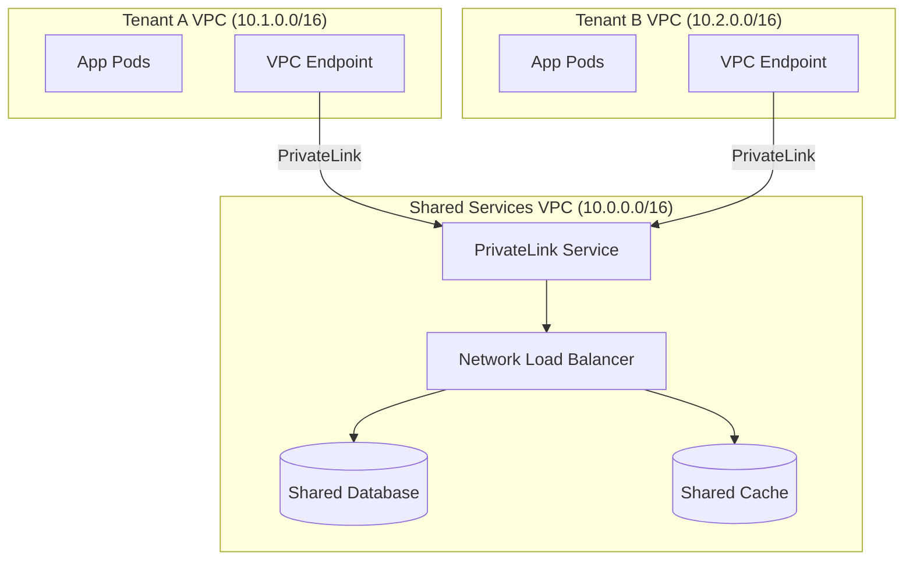
```mermaid
graph TB
    subgraph "Tenant A VPC (10.1.0.0/16)"
        A_App[App Pods]
        A_EP[VPC Endpoint]
    end

    subgraph "Tenant B VPC (10.2.0.0/16)"
        B_App[App Pods]
        B_EP[VPC Endpoint]
    end

    subgraph "Shared Services VPC (10.0.0.0/16)"
        NLB[Network Load Balancer]
        DB[(Shared Database)]
        Cache[(Shared Cache)]
        PLS[PrivateLink Service]
    end

    A_EP -->|PrivateLink| PLS
    B_EP -->|PrivateLink| PLS
    PLS --> NLB
    NLB --> DB
    NLB --> Cache
```

**Terraform — VPC per Tenant:**

```hcl
# Module: per-tenant VPC
module "tenant_vpc" {
  source   = "./modules/tenant-vpc"
  for_each = var.enterprise_tenants

  tenant_id       = each.key
  vpc_cidr        = each.value.cidr   # "10.${index}.0.0/16"
  azs             = ["ap-southeast-1a", "ap-southeast-1b"]
  private_subnets = each.value.private_subnets
  public_subnets  = each.value.public_subnets

  # PrivateLink endpoint tới shared services
  shared_service_endpoint = aws_vpc_endpoint_service.shared.id

  tags = {
    Tenant = each.key
    Tier   = each.value.tier
  }
}

# PrivateLink — expose shared services
resource "aws_vpc_endpoint_service" "shared" {
  acceptance_required        = false
  network_load_balancer_arns = [aws_lb.shared_nlb.arn]

  allowed_principals = [
    for tenant in var.enterprise_tenants :
    "arn:aws:iam::root"  # Restrict per tenant account
  ]
}
```

#### Network Isolation Decision Matrix

| Tiêu chí | Security Groups | Subnet Isolation | VPC per Tenant | VPC + PrivateLink |
|----------|:--------------:|:----------------:|:--------------:|:------------------:|
| **Isolation** | 🔴 Weak | 🟡 Medium | 🟢 Strong | 🟢 Strongest |
| **Chi phí** | 🟢 Free | 🟢 Low | 🟡 Medium | 🔴 High |
| **Complexity** | 🟢 Simple | 🟡 Medium | 🔴 Complex | 🔴 Complex |
| **Cross-tenant risk** | 🔴 SG misconfiguration | 🟡 Routing leak | 🟢 No shared network | 🟢 No shared network |
| **Shared services** | 🟢 Same VPC | 🟢 Same VPC | 🟡 VPC Peering/TGW | 🟢 PrivateLink |
| **Max tenants** | 🟢 Unlimited | 🟢 ~200/VPC | 🟡 ~50 VPCs | 🟡 ~50 VPCs |
| **Phù hợp** | Free/Basic | Pro tier | Enterprise | Regulated/Gov |

#### Tổng kết — Compute & Network Isolation Checklist

```
✅ COMPUTE & NETWORK ISOLATION CHECKLIST

Compute:
├── ✅ ResourceQuota / LimitRange per tenant namespace
├── ✅ Pod Security Standards (restricted/baseline/privileged)
├── ✅ Node affinity/taints cho enterprise tenants
├── ✅ Provisioned concurrency cho premium Lambda functions
└── ✅ Bulkhead pattern — thread pool isolation

Network:
├── ✅ NetworkPolicy deny-all + allowlist per namespace
├── ✅ Security Groups per tenant (minimum)
├── ✅ VPC per tenant cho enterprise (PrivateLink to shared)
├── ✅ DNS resolution scoped per tenant
├── ✅ TLS/mTLS giữa tất cả services
└── ✅ Egress filtering — tenant không access internet trực tiếp
```

---

## 7. Noisy Neighbor Problem

**Noisy Neighbor** là hiện tượng **một tenant tiêu thụ tài nguyên quá mức**, làm **suy giảm hiệu năng** của các tenant khác cùng chia sẻ infrastructure. Đây là thách thức lớn nhất của mô hình Pool (shared compute).

```
┌──────────────────────────────────────────────────────────────────┐
│                    NOISY NEIGHBOR PROBLEM                        │
│                                                                  │
│  Shared Resource Pool (CPU, Memory, DB Connections, I/O)         │
│  ┌────────────────────────────────────────────────────────┐      │
│  │  ████████████████████████████████████░░░░░░░░░░░░░░░░  │      │
│  │  ▲ Tenant A: 80% resources!!!       ▲ Tenant B-F: 20%  │      │
│  └────────────────────────────────────────────────────────┘      │
│                                                                  │
│  Hậu quả:                                                        │
│  • Tenant B-F: tăng latency 5x-10x                               │
│  • Timeout, 5xx errors tăng vọt                                  │
│  • SLA violation cho tất cả tenant                               │
│  • Customer churn — tenant trả tiền bỏ đi vì "app chậm"          │
└──────────────────────────────────────────────────────────────────┘
```

### 7.1 Nguyên nhân và tác động

#### Nguyên nhân phổ biến

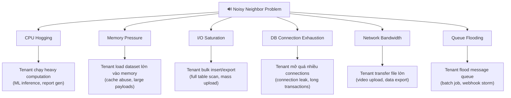
```mermaid
graph TD
    NP[🔊 Noisy Neighbor Problem]

    NP --> CPU[CPU Hogging]
    NP --> MEM[Memory Pressure]
    NP --> IO[I/O Saturation]
    NP --> DB[DB Connection Exhaustion]
    NP --> NET[Network Bandwidth]
    NP --> Q[Queue Flooding]

    CPU --> CPU1["Tenant chạy heavy computation<br/>(ML inference, report gen)"]
    MEM --> MEM1["Tenant load dataset lớn vào memory<br/>(cache abuse, large payloads)"]
    IO --> IO1["Tenant bulk insert/export<br/>(full table scan, mass upload)"]
    DB --> DB1["Tenant mở quá nhiều connections<br/>(connection leak, long transactions)"]
    NET --> NET1["Tenant transfer file lớn<br/>(video upload, data export)"]
    Q --> Q1["Tenant flood message queue<br/>(batch job, webhook storm)"]
```

#### Bảng nguyên nhân — tác động — ví dụ thực tế

| Nguyên nhân | Tài nguyên bị ảnh hưởng | Tác động | Ví dụ thực tế |
|------------|:----------------------:|---------|---------------|
| **Bulk data export** | CPU + DB I/O | Query chậm cho tất cả tenant | Tenant export 1M rows CSV |
| **Heavy API usage** | CPU + Network | Rate limit shared, latency tăng | Tenant call API 1000 req/s |
| **Large file upload** | Network + Storage I/O | Upload/download chậm | Tenant upload video 2GB |
| **Long-running query** | DB connections + Lock | Connection pool exhausted | `SELECT * FROM orders` (no index) |
| **Memory leak** | RAM | Pod/container OOM kill | Tenant app không release cache |
| **Message flood** | Queue throughput | Consumer lag cho tất cả | Tenant produce 100K messages/min |
| **Webhook storm** | Outbound connections | Connection pool exhausted | Tenant configure 50 webhooks |

#### Tác động theo cascade

```
Tenant A sends heavy query
    │
    ▼
1. DB connection pool: 50/50 used by Tenant A
    │
    ▼
2. Tenant B, C, D: connection timeout (no available connections)
    │
    ▼
3. API response time: 200ms → 5000ms → timeout (30s)
    │
    ▼
4. Health check fails → pod restart
    │
    ▼
5. During restart: ALL tenants get 503 errors
    │
    ▼
6. Auto-scaler kicks in (1-2 min delay)
    │
    ▼
7. New pods start but DB still saturated by Tenant A
    │
    ▼
8. Cascading failure: entire service degraded for 5-15 minutes
```

### 7.2 Detection & Monitoring

Phát hiện noisy neighbor **sớm** là chìa khóa — trước khi nó ảnh hưởng các tenant khác.

#### Metrics cần thu thập per Tenant

```
┌──────────────────────────────────────────────────────────────┐
│              PER-TENANT METRICS                              │
│                                                              │
│  Application Layer:                                          │
│  ├── request_count{tenant_id="acme"}                         │
│  ├── request_latency_p99{tenant_id="acme"}                   │
│  ├── error_rate{tenant_id="acme"}                            │
│  ├── active_connections{tenant_id="acme"}                    │
│  └── payload_size_bytes{tenant_id="acme"}                    │
│                                                              │
│  Database Layer:                                             │
│  ├── db_query_count{tenant_id="acme"}                        │
│  ├── db_query_duration_p99{tenant_id="acme"}                 │
│  ├── db_connections_active{tenant_id="acme"}                 │
│  └── db_rows_scanned{tenant_id="acme"}                       │
│                                                              │
│  Infrastructure Layer:                                       │
│  ├── cpu_usage_percent{tenant_id="acme"}                     │
│  ├── memory_usage_bytes{tenant_id="acme"}                    │
│  ├── network_bytes_in{tenant_id="acme"}                      │
│  └── disk_iops{tenant_id="acme"}                             │
│                                                              │
│  Queue Layer:                                                │
│  ├── messages_produced{tenant_id="acme"}                     │
│  ├── messages_consumed{tenant_id="acme"}                     │
│  └── consumer_lag{tenant_id="acme"}                          │
└──────────────────────────────────────────────────────────────┘
```

#### Implementation — Per-Tenant Metrics (Micrometer / Prometheus)

```java
@Component
public class TenantMetricsRecorder {

    private final MeterRegistry registry;

    /**
     * Record request metrics per tenant
     */
    public void recordRequest(String tenantId, String endpoint,
                               long durationMs, int statusCode) {
        // Request count per tenant
        registry.counter("http_requests_total",
            "tenant_id", tenantId,
            "endpoint", endpoint,
            "status", String.valueOf(statusCode)
        ).increment();

        // Request duration per tenant
        registry.timer("http_request_duration",
            "tenant_id", tenantId,
            "endpoint", endpoint
        ).record(Duration.ofMillis(durationMs));
    }

    /**
     * Record DB query metrics per tenant
     */
    public void recordDbQuery(String tenantId, String operation,
                               long durationMs, long rowsScanned) {
        registry.timer("db_query_duration",
            "tenant_id", tenantId,
            "operation", operation
        ).record(Duration.ofMillis(durationMs));

        registry.counter("db_rows_scanned_total",
            "tenant_id", tenantId
        ).increment(rowsScanned);
    }

    /**
     * Track active connections per tenant (gauge)
     */
    public void trackActiveConnections(String tenantId,
                                        AtomicInteger counter) {
        registry.gauge("active_connections",
            Tags.of("tenant_id", tenantId),
            counter
        );
    }
}
```

#### Alert Rules — Phát hiện Noisy Neighbor

```yaml
# Prometheus alerting rules
groups:
  - name: noisy_neighbor_alerts
    rules:
      # Alert: Tenant chiếm >50% DB connections
      - alert: TenantExcessiveDbConnections
        expr: |
          db_connections_active / ignoring(tenant_id)
          group_left sum(db_connections_active) > 0.5
        for: 2m
        labels:
          severity: warning
        annotations:
          summary: "Tenant {{ $labels.tenant_id }} using >50% DB connections"

      # Alert: Tenant request rate gấp 10x trung bình
      - alert: TenantRequestSpike
        expr: |
          rate(http_requests_total[5m])
          > 10 * avg without(tenant_id)(rate(http_requests_total[5m]))
        for: 3m
        labels:
          severity: warning
        annotations:
          summary: "Tenant {{ $labels.tenant_id }} request rate 10x above average"

      # Alert: Tenant latency p99 >5s (ảnh hưởng shared resources)
      - alert: TenantHighLatency
        expr: |
          histogram_quantile(0.99, rate(http_request_duration_bucket[5m])) > 5
        for: 5m
        labels:
          severity: critical
        annotations:
          summary: "Tenant {{ $labels.tenant_id }} p99 latency >5s"

      # Alert: Tenant error rate >10%
      - alert: TenantHighErrorRate
        expr: |
          rate(http_requests_total{status=~"5.."}[5m])
          / rate(http_requests_total[5m]) > 0.1
        for: 3m
        labels:
          severity: warning
```

#### Dashboard — Noisy Neighbor Detection

```
┌─────────────────────────────────────────────────────────────┐
│  📊 NOISY NEIGHBOR DASHBOARD                                │
│                                                             │
│  ┌────────────────────────┐  ┌───────────────────────────┐  │
│  │ Top 5 Tenants by CPU   │  │ Top 5 by DB Connections   │  │
│  │                        │  │                           │  │
│  │ 1. acme    ████░ 45%   │  │ 1. acme    ████████ 80%   │  │
│  │ 2. beta    ██░░░ 20%   │  │ 2. beta    ██░░░░░░  8%   │  │
│  │ 3. gamma   █░░░░ 12%   │  │ 3. gamma   █░░░░░░░  5%   │  │
│  │ 4. delta   █░░░░  8%   │  │ 4. delta   █░░░░░░░  3%   │  │
│  │ 5. other   ██░░░ 15%   │  │ 5. other   █░░░░░░░  4%   │  │
│  └────────────────────────┘  └───────────────────────────┘  │
│                                                             │
│  ┌────────────────────────┐  ┌───────────────────────────┐  │
│  │ Request Rate (req/s)   │  │ P99 Latency per Tenant    │  │
│  │                        │  │                           │  │
│  │     ╱╲    ← acme spike │  │ acme:  ███████████  5.2s  │  │
│  │    ╱  ╲                │  │ beta:  ██░░░░░░░░  0.8s   │  │
│  │ ──╱────╲──── baseline  │  │ gamma: ██░░░░░░░░  0.6s   │  │
│  │  ╱      ╲              │  │ delta: █░░░░░░░░░  0.3s   │  │
│  └────────────────────────┘  └───────────────────────────┘  │
│                                                             │
│  ⚠️ ALERT: Tenant "acme" consuming 80% DB connections       │
│     Action: Auto-throttle applied at 08:32:15 UTC           │
└─────────────────────────────────────────────────────────────┘
```

### 7.3 Mitigation Strategies

#### Tổng quan các chiến lược

```
┌──────────────────────────────────────────────────────────────────┐
│              NOISY NEIGHBOR MITIGATION STRATEGIES                │
│                                                                  │
│  Reactive (Phát hiện → Phản ứng)       Proactive (Ngăn chặn)     │
│  ├── Auto-throttle khi vượt ngưỡng     ├── Rate limiting         │
│  ├── Circuit breaker per tenant        ├── Resource quotas       │
│  ├── Alert + manual intervention       ├── Connection pool cap   │
│  └── Tenant suspend (extreme case)     ├── Request size limits   │
│                                        ├── Query timeout         │
│                                        └── Fair scheduling       │
│                                                                  │
│  Infrastructure (Cách ly vật lý)                                 │
│  ├── Bulkhead pattern (thread pools)                             │
│  ├── Dedicated resources for premium                             │
│  ├── Auto-scale per tenant workload                              │
│  └── Priority queues per tier                                    │
└──────────────────────────────────────────────────────────────────┘
```

#### ① Bulkhead Pattern — Thread Pool Isolation

```
┌──────────────────────────────────────────────────────────────┐
│              BULKHEAD PATTERN                                │
│                                                              │
│  TRƯỚC (Shared Thread Pool):                                 │
│  ┌────────────────────────────────────────────────────┐      │
│  │  Thread Pool: 200 threads (shared)                 │      │
│  │  Tenant A flood → 190 threads                      │      │
│  │  Tenant B, C, D, E → fight for 10 threads          │      │
│  └────────────────────────────────────────────────────┘      │
│                                                              │
│  SAU (Isolated Thread Pools):                                │
│  ┌──────────┐ ┌──────────┐ ┌──────────┐ ┌───────────┐        │
│  │ Premium  │ │ Standard │ │ Free     │ │ Internal  │        │
│  │ Pool: 80 │ │ Pool: 60 │ │ Pool: 40 │ │ Pool: 20  │        │
│  │          │ │          │ │          │ │           │        │
│  │ acme     │ │ beta     │ │ free-xyz │ │ health    │        │
│  │enterprise│ │ gamma    │ │ free-abc │ │ metrics   │        │
│  └──────────┘ └──────────┘ └──────────┘ └───────────┘        │
│                                                              │
│  Tenant A flood → chỉ exhaust Premium Pool                   │
│  Tenant B, C, D vẫn có 60 threads available                  │
└──────────────────────────────────────────────────────────────┘
```

```java
// Resilience4j Bulkhead per tenant tier
@Configuration
public class TenantBulkheadConfig {

    @Bean
    public BulkheadRegistry bulkheadRegistry() {
        BulkheadConfig premiumConfig = BulkheadConfig.custom()
            .maxConcurrentCalls(80)
            .maxWaitDuration(Duration.ofMillis(500))
            .build();

        BulkheadConfig standardConfig = BulkheadConfig.custom()
            .maxConcurrentCalls(40)
            .maxWaitDuration(Duration.ofMillis(200))
            .build();

        BulkheadConfig freeConfig = BulkheadConfig.custom()
            .maxConcurrentCalls(10)
            .maxWaitDuration(Duration.ofMillis(100))
            .build();

        return BulkheadRegistry.of(Map.of(
            "enterprise", premiumConfig,
            "pro", standardConfig,
            "free", freeConfig
        ));
    }
}

// Usage in service
@Service
public class OrderService {

    private final BulkheadRegistry bulkheadRegistry;

    public List<Order> findOrders(String tenantId, String tier) {
        Bulkhead bulkhead = bulkheadRegistry.bulkhead(tier);

        return Bulkhead.decorateSupplier(bulkhead, () -> {
            return orderRepository.findByTenantId(tenantId);
        }).get();
        // Throws BulkheadFullException nếu pool đầy
        // → trả 429 Too Many Requests cho tenant
    }
}
```

#### ② Circuit Breaker per Tenant

```java
// Circuit breaker per tenant — isolate failures
@Component
public class TenantCircuitBreakerManager {

    private final ConcurrentMap<String, CircuitBreaker> breakers
        = new ConcurrentHashMap<>();

    public CircuitBreaker getOrCreate(String tenantId) {
        return breakers.computeIfAbsent(tenantId, id -> {
            CircuitBreakerConfig config = CircuitBreakerConfig.custom()
                .slidingWindowSize(20)
                .failureRateThreshold(50)        // 50% failure → open
                .waitDurationInOpenState(Duration.ofSeconds(30))
                .permittedNumberOfCallsInHalfOpenState(5)
                .slowCallRateThreshold(80)       // 80% slow → open
                .slowCallDurationThreshold(Duration.ofSeconds(3))
                .build();

            return CircuitBreaker.of("tenant-" + id, config);
        });
    }

    /**
     * Execute with per-tenant circuit breaker
     */
    public <T> T execute(String tenantId, Supplier<T> action) {
        CircuitBreaker cb = getOrCreate(tenantId);

        try {
            return CircuitBreaker.decorateSupplier(cb, action).get();
        } catch (CallNotPermittedException e) {
            // Circuit is OPEN — tenant bị tạm ngừng
            throw new TenantThrottledException(
                "Tenant " + tenantId + " is temporarily throttled. " +
                "Circuit breaker state: OPEN. Retry after 30s.");
        }
    }
}
```

```
Circuit Breaker States per Tenant:

  Tenant A: ● CLOSED  (healthy — requests pass through)
  Tenant B: ● CLOSED  (healthy)
  Tenant C: ◐ HALF-OPEN (testing — 5 probe requests)
  Tenant D: ○ OPEN   (unhealthy — all requests rejected with 429)

  Khi Tenant D fail rate >50%:
  CLOSED → OPEN (reject tất cả request Tenant D)
  → 30s sau → HALF-OPEN (cho 5 request thử)
  → Thành công → CLOSED (recovery)
  → Thất bại → OPEN (tiếp tục reject)

  ⚡ Chỉ ảnh hưởng Tenant D, không ảnh hưởng A, B, C
```

#### ③ Connection Pool per Tenant (Database)

```java
@Component
public class TenantConnectionPoolManager {

    private final Map<String, HikariDataSource> tenantPools
        = new ConcurrentHashMap<>();

    /**
     * Mỗi tenant có connection pool riêng với giới hạn
     */
    public DataSource getDataSource(String tenantId, String tier) {
        return tenantPools.computeIfAbsent(tenantId, id -> {
            HikariConfig config = new HikariConfig();
            config.setJdbcUrl("jdbc:postgresql://db-host:5432/mydb");
            config.setPoolName("pool-" + tenantId);

            // Connection limit theo tier
            switch (tier) {
                case "enterprise":
                    config.setMaximumPoolSize(20);
                    config.setMinimumIdle(5);
                    break;
                case "pro":
                    config.setMaximumPoolSize(10);
                    config.setMinimumIdle(2);
                    break;
                default: // free
                    config.setMaximumPoolSize(3);
                    config.setMinimumIdle(1);
            }

            config.setConnectionTimeout(5000);    // 5s timeout
            config.setMaxLifetime(600000);         // 10 min max life
            config.setLeakDetectionThreshold(30000); // Detect leak >30s

            return new HikariDataSource(config);
        });
    }
}
```

```
Connection Pool Isolation:

┌──────────────────────────────────────────────────────┐
│  Total DB connections: 100                           │
│                                                      │
│  ┌──────────┐ ┌──────────┐ ┌──────────┐ ┌────────┐   │
│  │ Acme     │ │ Beta     │ │ Gamma    │ │ Reserve│   │
│  │ (ent)    │ │ (pro)    │ │ (free)   │ │        │   │
│  │ max: 20  │ │ max: 10  │ │ max: 3   │ │ 20     │   │
│  │ used: 15 │ │ used: 4  │ │ used: 2  │ │ (burst)│   │
│  └──────────┘ └──────────┘ └──────────┘ └────────┘   │
│                                                      │
│  Acme heavy query → exhausts 20 connections          │
│  Beta và Gamma: KHÔNG bị ảnh hưởng                   │
└──────────────────────────────────────────────────────┘
```

#### ④ Query Timeout + Row Limit per Tenant

```java
@Component
public class TenantQueryGuard {

    /**
     * Enforce query limits per tenant tier
     */
    public <T> List<T> executeWithLimits(String tenantId,
                                          String tier,
                                          Supplier<List<T>> query) {
        // Set statement timeout
        int timeoutSeconds = switch (tier) {
            case "enterprise" -> 30;
            case "pro" -> 15;
            default -> 5;  // free: max 5 seconds
        };

        int maxRows = switch (tier) {
            case "enterprise" -> 10_000;
            case "pro" -> 5_000;
            default -> 1_000;  // free: max 1000 rows
        };

        // Execute with timeout
        try {
            jdbcTemplate.execute(
                "SET LOCAL statement_timeout = '" + 
                timeoutSeconds * 1000 + "ms'");

            List<T> results = query.get();

            // Enforce row limit
            if (results.size() > maxRows) {
                log.warn("Tenant {} exceeded row limit: {} > {}",
                    tenantId, results.size(), maxRows);
                return results.subList(0, maxRows);
            }

            return results;
        } catch (QueryTimeoutException e) {
            log.error("Tenant {} query timeout after {}s",
                tenantId, timeoutSeconds);
            throw new TenantQuotaExceededException(
                "Query timeout. Max " + timeoutSeconds + "s allowed.");
        }
    }
}
```

### 7.4 Rate Limiting & Throttling per Tenant

Rate limiting là **tuyến phòng thủ đầu tiên** chống noisy neighbor — giới hạn số lượng requests/operations mà mỗi tenant có thể thực hiện trong một khoảng thời gian.

#### Rate Limiting Algorithms

```
┌──────────────────────────────────────────────────────────────────┐
│              RATE LIMITING ALGORITHMS                            │
│                                                                  │
│  ① Fixed Window          ② Sliding Window      ③ Token Bucket  │
│                                                                  │
│  ┌─────┬─────┐           ┌───────────────┐        ┌───────────┐  │
│  │ 0-1 │ 1-2 │           │  ╱────────╲   │        │ Bucket    │  │
│  │ min │ min │           │ ╱  sliding ╲  │        │ capacity  │  │
│  │     │     │           │╱   1 min    ╲ │        │ = 100     │  │
│  │ 100 │ 100 │           │  window       │        │ refill    │  │
│  │ req │ req │           │  max: 100     │        │ = 10/sec  │  │
│  └─────┴─────┘           └───────────────┘        └───────────┘  │
│                                                                  │
│  ⚠️ Burst at              ✅ Smooth                ✅ Allows     │
│  window boundary           distribution            burst         │
│                                                                  │
│  ④ Leaky Bucket          ⑤ Sliding Log (Precise)               │
│  ┌───────────┐           ┌───────────────────────┐               │
│  │ ●●●●●     │           │ Timestamp log:        │               │
│  │ drip rate │           │ [t1, t2, t3, ..., tN] │               │
│  │ = 10/sec  │           │ Count in window       │               │
│  │ (constant)│           │ Exact, but memory ↑   │               │
│  └───────────┘           └───────────────────────┘               │
└──────────────────────────────────────────────────────────────────┘
```

#### Per-Tenant Rate Limits theo Tier

| Resource | Free | Pro | Enterprise |
|----------|:----:|:---:|:----------:|
| **API requests** | 100/min | 1,000/min | 10,000/min |
| **API daily cap** | 5,000/day | 100,000/day | Unlimited |
| **Bulk operations** | 10/hour | 100/hour | 1,000/hour |
| **File upload size** | 10 MB | 100 MB | 1 GB |
| **Webhook endpoints** | 3 | 10 | 50 |
| **Concurrent connections** | 5 | 50 | 500 |
| **Query timeout** | 5s | 15s | 30s |
| **Export rows** | 1,000 | 10,000 | 100,000 |
| **Storage** | 1 GB | 50 GB | 500 GB |

#### Implementation — Distributed Rate Limiter (Redis)

```java
@Component
public class TenantRateLimiter {

    private final StringRedisTemplate redis;

    /**
     * Sliding Window Rate Limiter — per tenant
     *
     * Dùng Redis sorted set: score = timestamp, member = request ID
     */
    public RateLimitResult checkRateLimit(String tenantId,
                                           String endpoint,
                                           int maxRequests,
                                           Duration window) {
        String key = "rate_limit:" + tenantId + ":" + endpoint;
        long now = System.currentTimeMillis();
        long windowStart = now - window.toMillis();

        // Lua script cho atomicity
        String luaScript = """
            -- Remove expired entries
            redis.call('ZREMRANGEBYSCORE', KEYS[1], 0, ARGV[1])

            -- Count current window
            local count = redis.call('ZCARD', KEYS[1])

            if count < tonumber(ARGV[2]) then
                -- Under limit: add new request
                redis.call('ZADD', KEYS[1], ARGV[3], ARGV[4])
                redis.call('EXPIRE', KEYS[1], ARGV[5])
                return {1, count + 1, tonumber(ARGV[2])}
            else
                -- Over limit: reject
                return {0, count, tonumber(ARGV[2])}
            end
            """;

        List<Long> result = redis.execute(
            RedisScript.of(luaScript, List.class),
            List.of(key),
            String.valueOf(windowStart),     // ARGV[1]
            String.valueOf(maxRequests),      // ARGV[2]
            String.valueOf(now),             // ARGV[3]
            UUID.randomUUID().toString(),    // ARGV[4]
            String.valueOf(window.toSeconds()) // ARGV[5]
        );

        boolean allowed = result.get(0) == 1;
        long currentCount = result.get(1);
        long limit = result.get(2);

        return new RateLimitResult(
            allowed,
            limit,
            limit - currentCount,  // remaining
            windowStart + window.toMillis()  // reset time
        );
    }
}

// Record kết quả
public record RateLimitResult(
    boolean allowed,
    long limit,
    long remaining,
    long resetTimestamp
) {}
```

#### Rate Limit Response Headers

```java
@Component
public class RateLimitResponseFilter implements Filter {

    @Override
    public void doFilter(ServletRequest req, ServletResponse resp,
                          FilterChain chain) throws Exception {
        HttpServletResponse response = (HttpServletResponse) resp;
        String tenantId = TenantContextHolder.getTenantId();
        String tier = TenantContextHolder.getTier();

        // Lookup tier limits
        int maxRequests = getTierLimit(tier);

        RateLimitResult result = rateLimiter.checkRateLimit(
            tenantId, "api", maxRequests, Duration.ofMinutes(1));

        // Set standard rate limit headers
        response.setHeader("X-RateLimit-Limit",
            String.valueOf(result.limit()));
        response.setHeader("X-RateLimit-Remaining",
            String.valueOf(result.remaining()));
        response.setHeader("X-RateLimit-Reset",
            String.valueOf(result.resetTimestamp()));

        if (!result.allowed()) {
            response.setStatus(429);
            response.setHeader("Retry-After", "60");
            response.getWriter().write("""
                {
                  "error": "rate_limit_exceeded",
                  "message": "Too many requests. Upgrade plan for higher limits.",
                  "limit": %d,
                  "retry_after_seconds": 60,
                  "upgrade_url": "https://app.example.com/billing/upgrade"
                }
                """.formatted(result.limit()));
            return;
        }

        chain.doFilter(req, resp);
    }
}
```

#### Multi-Dimension Rate Limiting

```
┌──────────────────────────────────────────────────────────────┐
│              MULTI-DIMENSION RATE LIMITING                   │
│                                                              │
│  Dimension 1: API endpoint                                   │
│  ├── GET /api/orders           → 100 req/min                 │
│  ├── POST /api/orders          → 20 req/min                  │
│  ├── DELETE /api/orders/{id}   → 10 req/min                  │
│  └── POST /api/export          → 2 req/hour (heavy)          │
│                                                              │
│  Dimension 2: Operation type                                 │
│  ├── Read operations           → higher limit                │
│  ├── Write operations          → lower limit                 │
│  └── Bulk/Export operations    → very low limit              │
│                                                              │
│  Dimension 3: Tenant tier                                    │
│  ├── Free                      → 1x base limits              │
│  ├── Pro                       → 10x base limits             │
│  └── Enterprise                → 100x base limits            │
│                                                              │
│  Dimension 4: Time of day (optional)                         │
│  ├── Peak hours (9am-5pm)      → standard limits             │
│  └── Off-peak hours            → 2x limits (burst)           │
└──────────────────────────────────────────────────────────────┘
```

### 7.5 Resource Quotas & Fair Scheduling

Resource Quotas giới hạn **tổng tài nguyên** mà tenant có thể sử dụng (storage, compute, API calls). Fair Scheduling đảm bảo **mọi tenant đều có cơ hội truy cập** tài nguyên một cách công bằng.

#### Quota Management System

```
┌──────────────────────────────────────────────────────────────┐
│              TENANT QUOTA MANAGEMENT                         │
│                                                              │
│  ┌───────────────────────────────────────────────────┐       │
│  │            Quota Configuration                    │       │
│  │                                                   │       │
│  │  Tenant: acme (Pro tier)                          │       │
│  │  ┌─────────────────┬──────────┬──────────┐        │       │
│  │  │ Resource        │ Limit    │ Used     │        │       │
│  │  ├─────────────────┼──────────┼──────────┤        │       │
│  │  │ Storage         │ 50 GB    │ 23 GB    │        │       │
│  │  │ API calls/month │ 100,000  │ 67,432   │        │       │
│  │  │ Users           │ 50       │ 23       │        │       │
│  │  │ Projects        │ 20       │ 8        │        │       │
│  │  │ Webhooks        │ 10       │ 5        │        │       │
│  │  │ File upload/day │ 500 MB   │ 120 MB   │        │       │
│  │  └─────────────────┴──────────┴──────────┘        │       │
│  └───────────────────────────────────────────────────┘       │
│                                                              │
│  Enforcement:                                                │
│  ├── ✅ Soft limit (80%): Warning notification               │
│  ├── ⚠️ Hard limit (100%): Block new creation                │
│  └── 🔴 Grace period (110%): 7 days to reduce usage          │
└──────────────────────────────────────────────────────────────┘
```

#### Implementation — Quota Service

```java
@Service
public class TenantQuotaService {

    private final QuotaRepository quotaRepo;
    private final NotificationService notificationService;

    /**
     * Check + enforce quota trước khi cho phép operation
     */
    public void checkAndConsumeQuota(String tenantId,
                                      QuotaType type,
                                      long amount) {
        TenantQuota quota = quotaRepo.findByTenantIdAndType(
            tenantId, type)
            .orElseThrow(() -> new QuotaNotFoundException(
                "No quota defined for " + type));

        long newUsage = quota.getCurrentUsage() + amount;
        double usagePercent = (double) newUsage / quota.getLimit() * 100;

        // Hard limit — block
        if (newUsage > quota.getLimit()) {
            throw new QuotaExceededException(String.format(
                "Quota exceeded for %s. Limit: %d, Used: %d, Requested: %d. " +
                "Upgrade your plan at /billing/upgrade",
                type, quota.getLimit(), quota.getCurrentUsage(), amount));
        }

        // Soft limit — warn at 80%
        if (usagePercent >= 80 && !quota.isWarningNotified()) {
            notificationService.sendQuotaWarning(tenantId, type,
                quota.getCurrentUsage(), quota.getLimit());
            quota.setWarningNotified(true);
        }

        // Critical — warn at 95%
        if (usagePercent >= 95) {
            notificationService.sendQuotaCritical(tenantId, type,
                quota.getCurrentUsage(), quota.getLimit());
        }

        // Update usage
        quota.setCurrentUsage(newUsage);
        quotaRepo.save(quota);
    }

    /**
     * Get quota status for tenant dashboard
     */
    public List<QuotaStatus> getQuotaStatus(String tenantId) {
        return quotaRepo.findByTenantId(tenantId).stream()
            .map(q -> new QuotaStatus(
                q.getType(),
                q.getLimit(),
                q.getCurrentUsage(),
                (double) q.getCurrentUsage() / q.getLimit() * 100
            ))
            .toList();
    }
}

// Quota enforcement annotation
@Target(ElementType.METHOD)
@Retention(RetentionPolicy.RUNTIME)
public @interface RequireQuota {
    QuotaType type();
    long amount() default 1;
}

@Aspect
@Component
public class QuotaEnforcementAspect {

    @Autowired private TenantQuotaService quotaService;

    @Before("@annotation(quota)")
    public void enforceQuota(RequireQuota quota) {
        String tenantId = TenantContextHolder.getTenantId();
        quotaService.checkAndConsumeQuota(
            tenantId, quota.type(), quota.amount());
    }
}

// Usage
@PostMapping("/api/projects")
@RequireQuota(type = QuotaType.PROJECTS)
public Project createProject(@RequestBody CreateProjectRequest req) {
    return projectService.create(req);
}

@PostMapping("/api/upload")
@RequireQuota(type = QuotaType.STORAGE_MB, amount = 10) // 10 MB
public UploadResponse uploadFile(@RequestParam MultipartFile file) {
    return storageService.upload(file);
}
```

#### Fair Scheduling — Weighted Fair Queue

```
┌──────────────────────────────────────────────────────────────┐
│              WEIGHTED FAIR QUEUE                             │
│                                                              │
│  Incoming requests → Priority Queue → Worker Pool            │
│                                                              │
│  ┌─────────────────────────────────────────┐                 │
│  │  Priority Queue (weighted):             │                 │
│  │                                         │                 │
│  │  Enterprise (weight: 5)  ██████████████ │                 │
│  │  Pro        (weight: 3)  ████████       │                 │
│  │  Free       (weight: 1)  ███            │                 │
│  └─────────────────────────────────────────┘                 │
│                                                              │
│  Processing order:                                           │
│  E, E, E, E, E, P, P, P, F, E, E, E, E, E, P, P, P, F...     │
│                                                              │
│  Enterprise gets 5/(5+3+1) = 55% of processing capacity      │
│  Pro gets       3/(5+3+1) = 33% of processing capacity       │
│  Free gets      1/(5+3+1) = 11% of processing capacity       │
└──────────────────────────────────────────────────────────────┘
```

```java
@Component
public class TenantFairScheduler {

    private final Map<String, PriorityBlockingQueue<TenantTask>> queues
        = new ConcurrentHashMap<>();

    private static final Map<String, Integer> TIER_WEIGHTS = Map.of(
        "enterprise", 5,
        "pro", 3,
        "free", 1
    );

    /**
     * Submit task với priority theo tenant tier
     */
    public <T> CompletableFuture<T> submit(String tenantId,
                                            String tier,
                                            Callable<T> task) {
        int weight = TIER_WEIGHTS.getOrDefault(tier, 1);

        CompletableFuture<T> future = new CompletableFuture<>();
        TenantTask<T> tenantTask = new TenantTask<>(
            tenantId, tier, weight, task, future,
            System.nanoTime()
        );

        // Virtual timestamp = actual_time / weight
        // Lower virtualTimestamp → higher priority
        globalQueue.offer(tenantTask);
        return future;
    }

    /**
     * Worker loop — processes tasks fairly
     */
    @Scheduled(fixedDelay = 1)
    public void processQueue() {
        TenantTask<?> task = globalQueue.poll();
        if (task != null) {
            TenantContextHolder.set(new TenantContext(task.tenantId()));
            try {
                Object result = task.callable().call();
                task.future().complete(result);
            } catch (Exception e) {
                task.future().completeExceptionally(e);
            } finally {
                TenantContextHolder.clear();
            }
        }
    }

    record TenantTask<T>(
        String tenantId,
        String tier,
        int weight,
        Callable<T> callable,
        CompletableFuture<T> future,
        long submitTime
    ) implements Comparable<TenantTask<?>> {

        // Virtual timestamp = submitTime / weight
        // Enterprise (weight=5): lower virtual time → processed sooner
        @Override
        public int compareTo(TenantTask<?> other) {
            long myVirtual = this.submitTime / this.weight;
            long otherVirtual = other.submitTime / other.weight;
            return Long.compare(myVirtual, otherVirtual);
        }
    }
}
```

#### Tổng kết — Noisy Neighbor Prevention Checklist

```
✅ NOISY NEIGHBOR PREVENTION CHECKLIST

Detection:
├── ✅ Per-tenant metrics (request count, latency, error rate)
├── ✅ Per-tenant DB metrics (connections, query duration, rows)
├── ✅ Alert rules: spike detection, resource hogging
├── ✅ Dashboard: Top N tenants by resource consumption
└── ✅ Anomaly detection (baseline deviation)

Rate Limiting:
├── ✅ API rate limit per tenant tier (Redis-based)
├── ✅ Multi-dimension: per endpoint + per tier + per operation
├── ✅ Standard headers: X-RateLimit-Limit, Remaining, Reset
├── ✅ Graceful 429 response with upgrade CTA
└── ✅ Distributed rate limiter (Redis Lua script)

Resource Isolation:
├── ✅ Bulkhead pattern: thread pool per tier
├── ✅ Circuit breaker per tenant
├── ✅ Connection pool per tenant (bounded)
├── ✅ Query timeout + row limit per tier
└── ✅ Fair scheduling: weighted priority queue

Quotas:
├── ✅ Storage, API calls, users, projects — per tenant
├── ✅ Soft limit (80% warning) + hard limit (100% block)
├── ✅ Quota dashboard for self-service monitoring
└── ✅ Upgrade CTA when approaching limits
```

---

## 8. Tenant Onboarding & Lifecycle

Tenant lifecycle quản lý **toàn bộ vòng đời** của một tenant — từ lúc đăng ký, provisioning, hoạt động, cho đến offboarding/xóa. Đây là quy trình **tự động hóa cao** để scale được số lượng tenant lớn.

```
┌──────────────────────────────────────────────────────────────────┐
│               TENANT LIFECYCLE                                   │
│                                                                  │
│  ① Sign-up    ② Provision   ③ Active   ④ Suspend   ⑤ Delete  │
│                                                                  │
│  ┌──────┐    ┌──────┐     ┌──────┐      ┌───────┐    ┌──────┐    │
│  │ NEW  │───▶│SETUP │────▶│ACTIVE│─────▶│ SUSP. │───▶│DELETE│    │
│  └──────┘    └──────┘     └──┬───┘      └───┬───┘    └──────┘    │
│                              │              │                    │
│                              │   ┌───────┐  │                    │
│                              └──▶│UPGRADE│──┘                    │
│                                  │ tier  │  (reactivate)         │
│                                  └───────┘                       │
│                                                                  │
│  Duration:                                                       │
│  Sign-up → Active: 30 seconds (fully automated)                  │
│  Active → Suspend: immediate (API call)                          │
│  Suspend → Delete: 30-90 days (data retention policy)            │
└──────────────────────────────────────────────────────────────────┘
```

### 8.1 Automated Provisioning

Khi tenant mới đăng ký, hệ thống phải **tự động tạo mọi resource cần thiết** — không cần human intervention.

#### Provisioning Flow

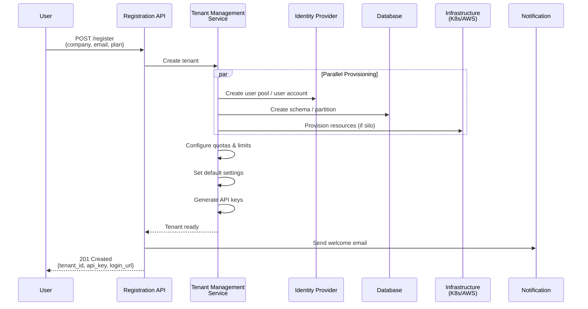
```mermaid
sequenceDiagram
    participant User
    participant API as Registration API
    participant TMS as Tenant Management<br/>Service
    participant IDP as Identity Provider
    participant DB as Database
    participant Infra as Infrastructure<br/>(K8s/AWS)
    participant Notify as Notification

    User->>API: POST /register<br/>{company, email, plan}
    API->>TMS: Create tenant

    par Parallel Provisioning
        TMS->>IDP: Create user pool / user account
        TMS->>DB: Create schema / partition
        TMS->>Infra: Provision resources (if silo)
    end

    TMS->>TMS: Configure quotas & limits
    TMS->>TMS: Set default settings
    TMS->>TMS: Generate API keys

    TMS-->>API: Tenant ready
    API->>Notify: Send welcome email
    API-->>User: 201 Created<br/>{tenant_id, api_key, login_url}
```

#### Provisioning Pipeline — Implementation

```java
@Service
public class TenantProvisioningService {

    private final TenantRepository tenantRepo;
    private final IdentityService identityService;
    private final DatabaseProvisioner dbProvisioner;
    private final QuotaService quotaService;
    private final NotificationService notificationService;

    /**
     * Full automated provisioning pipeline
     */
    @Transactional
    public TenantOnboardingResult provisionTenant(
            TenantRegistrationRequest request) {

        // ① Validate
        validateRegistration(request);

        // ② Create tenant record
        Tenant tenant = Tenant.builder()
            .id(generateTenantId(request.getCompanyName()))
            .name(request.getCompanyName())
            .tier(request.getPlan())
            .status(TenantStatus.PROVISIONING)
            .region(request.getPreferredRegion())
            .createdAt(Instant.now())
            .build();
        tenantRepo.save(tenant);

        try {
            // ③ Provision identity (user + credentials)
            UserCredentials creds = identityService.createTenantAdmin(
                tenant.getId(),
                request.getAdminEmail(),
                request.getAdminName()
            );

            // ④ Provision data storage
            dbProvisioner.provision(tenant.getId(), tenant.getTier());

            // ⑤ Setup quotas
            quotaService.initializeQuotas(tenant.getId(), tenant.getTier());

            // ⑥ Generate API keys
            ApiKey apiKey = apiKeyService.generate(tenant.getId());

            // ⑦ Setup default configuration
            configService.initializeDefaults(tenant.getId(), tenant.getTier());

            // ⑧ Mark as active
            tenant.setStatus(TenantStatus.ACTIVE);
            tenant.setProvisionedAt(Instant.now());
            tenantRepo.save(tenant);

            // ⑨ Send welcome notification
            notificationService.sendWelcome(
                request.getAdminEmail(), tenant, apiKey);

            return TenantOnboardingResult.success(tenant, creds, apiKey);

        } catch (Exception e) {
            // ⑩ Rollback on failure
            log.error("Provisioning failed for tenant: {}",
                tenant.getId(), e);
            tenant.setStatus(TenantStatus.FAILED);
            tenantRepo.save(tenant);
            rollback(tenant.getId());
            throw new ProvisioningException(
                "Failed to provision tenant", e);
        }
    }

    private String generateTenantId(String companyName) {
        String slug = companyName.toLowerCase()
            .replaceAll("[^a-z0-9]", "-")
            .replaceAll("-+", "-")
            .substring(0, Math.min(companyName.length(), 20));
        return slug + "-" + RandomStringUtils.randomAlphanumeric(6);
    }
}
```

#### Database Provisioner — Per-Tier Strategy

```java
@Component
public class DatabaseProvisioner {

    /**
     * Provision database resources based on tenant tier
     */
    public void provision(String tenantId, String tier) {
        switch (tier) {
            case "free", "pro" -> provisionSharedSchema(tenantId);
            case "enterprise" -> provisionDedicatedDatabase(tenantId);
        }
    }

    /**
     * Pool model: create schema in shared database
     */
    private void provisionSharedSchema(String tenantId) {
        // Schema-per-tenant trong shared DB
        String schema = "tenant_" + tenantId.replace("-", "_");

        jdbcTemplate.execute("CREATE SCHEMA IF NOT EXISTS " + schema);

        // Run migrations cho schema mới
        flyway.configure()
            .schemas(schema)
            .load()
            .migrate();

        // Register tenant → schema mapping
        tenantSchemaRegistry.register(tenantId, schema);

        log.info("Provisioned shared schema '{}' for tenant '{}'",
            schema, tenantId);
    }

    /**
     * Silo model: create dedicated RDS instance
     */
    private void provisionDedicatedDatabase(String tenantId) {
        // Create RDS instance via AWS SDK
        CreateDBInstanceRequest request = CreateDBInstanceRequest.builder()
            .dbInstanceIdentifier("db-" + tenantId)
            .dbInstanceClass("db.r6g.large")
            .engine("postgres")
            .masterUsername("tenant_admin")
            .masterUserPassword(secretsManager.generatePassword())
            .allocatedStorage(100)
            .multiAZ(true)
            .storageEncrypted(true)
            .kmsKeyId(getOrCreateTenantKmsKey(tenantId))
            .vpcSecurityGroupIds(getSecurityGroups(tenantId))
            .tags(Tag.builder()
                .key("tenant_id").value(tenantId)
                .build())
            .build();

        rdsClient.createDBInstance(request);

        // Wait for instance to be available (async)
        eventBus.publish(new DatabaseProvisioningStarted(tenantId));
    }
}
```

#### Provisioning — Tier-based Resource Matrix

| Resource | Free | Pro | Enterprise |
|----------|------|-----|-----------|
| **Database** | Shared DB, shared schema | Shared DB, tenant schema | Dedicated RDS instance |
| **Storage** | Shared S3 bucket + prefix | Shared S3 bucket + prefix | Dedicated S3 bucket |
| **Cache** | Shared Redis, key prefix | Shared Redis, dedicated DB# | Dedicated Redis cluster |
| **Compute** | Shared pods | Shared pods, priority | Dedicated namespace/pods |
| **Identity** | Shared user pool | Shared user pool | Dedicated user pool |
| **API Keys** | 1 key | 5 keys | Unlimited keys |
| **Encryption** | Platform key | Platform key | Dedicated KMS key |
| **DNS** | — | — | Custom subdomain |
| **Provisioning time** | < 5 seconds | < 10 seconds | 5-15 minutes |

### 8.2 Tenant Configuration & Customization

Mỗi tenant có thể **tùy chỉnh hành vi** của hệ thống theo nhu cầu riêng mà **không ảnh hưởng tenant khác**.

#### Configuration Layers

```
┌──────────────────────────────────────────────────────────────────┐
│              TENANT CONFIGURATION LAYERS                         │
│                                                                  │
│  Layer 1: Platform Defaults (base config, all tenants)           │
│  ┌──────────────────────────────────────────────────────────┐    │
│  │  timezone: UTC, locale: en-US, currency: USD             │    │
│  │  date_format: ISO-8601, pagination: 20                   │    │
│  └──────────────────────────────────────────────────────────┘    │
│                     ▼ Override                                   │
│  Layer 2: Tier Defaults (per-tier config)                        │
│  ┌──────────────────────────────────────────────────────────┐    │
│  │  Free: max_users=5, features=[basic]                     │    │
│  │  Pro:  max_users=50, features=[basic, advanced]          │    │
│  │  Ent:  max_users=unlimited, features=[basic, adv, custom]│    │
│  └──────────────────────────────────────────────────────────┘    │
│                     ▼ Override                                   │
│  Layer 3: Tenant-Specific Config (per-tenant overrides)          │
│  ┌──────────────────────────────────────────────────────────┐    │
│  │  acme: timezone=Asia/Tokyo, locale=ja-JP, currency=JPY   │    │
│  │  beta: timezone=Europe/London, locale=en-GB, currency=GBP│    │
│  └──────────────────────────────────────────────────────────┘    │
│                                                                  │
│  Resolution: Tenant > Tier > Platform (most specific wins)       │
└──────────────────────────────────────────────────────────────────┘
```

#### Implementation — Hierarchical Configuration

```java
@Service
public class TenantConfigService {

    private final ConfigRepository configRepo;
    private final LoadingCache<String, Map<String, Object>> cache;

    public TenantConfigService(ConfigRepository configRepo) {
        this.configRepo = configRepo;
        this.cache = CacheBuilder.newBuilder()
            .expireAfterWrite(5, TimeUnit.MINUTES)
            .maximumSize(10_000)
            .build(CacheLoader.from(this::loadConfig));
    }

    /**
     * Lấy config value — theo thứ tự ưu tiên:
     * tenant-specific > tier-default > platform-default
     */
    public <T> T getConfig(String tenantId, String key, Class<T> type) {
        Map<String, Object> config = cache.get(tenantId);
        Object value = config.get(key);

        if (value == null) {
            throw new ConfigNotFoundException(
                "Config key not found: " + key);
        }

        return type.cast(value);
    }

    /**
     * Load merged config for tenant
     */
    private Map<String, Object> loadConfig(String tenantId) {
        Tenant tenant = tenantRepo.findById(tenantId)
            .orElseThrow();

        // Layer 1: Platform defaults
        Map<String, Object> merged = new HashMap<>(
            configRepo.findByScope("platform"));

        // Layer 2: Tier defaults (override platform)
        merged.putAll(
            configRepo.findByScope("tier:" + tenant.getTier()));

        // Layer 3: Tenant-specific (override tier)
        merged.putAll(
            configRepo.findByScope("tenant:" + tenantId));

        return Collections.unmodifiableMap(merged);
    }

    /**
     * Tenant tự cập nhật config riêng
     */
    public void updateTenantConfig(String tenantId,
                                     String key, Object value) {
        // Validate key is tenant-configurable
        if (!isConfigurable(key)) {
            throw new ForbiddenException(
                "Config key '" + key + "' is not tenant-configurable");
        }

        configRepo.upsert("tenant:" + tenantId, key, value);

        // Invalidate cache
        cache.invalidate(tenantId);

        // Publish event cho các service khác
        eventBus.publish(new TenantConfigChanged(tenantId, key, value));
    }
}
```

#### Feature Flags per Tenant

```java
@Service
public class TenantFeatureService {

    /**
     * Check feature availability for tenant
     */
    public boolean isFeatureEnabled(String tenantId, String feature) {
        TenantConfig config = getConfig(tenantId);

        // Check explicit tenant override
        Boolean override = config.getFeatureOverride(feature);
        if (override != null) return override;

        // Check tier-based feature set
        String tier = config.getTier();
        return TIER_FEATURES.getOrDefault(tier, Set.of())
                            .contains(feature);
    }

    private static final Map<String, Set<String>> TIER_FEATURES = Map.of(
        "free", Set.of(
            "basic_dashboard", "email_notifications"
        ),
        "pro", Set.of(
            "basic_dashboard", "email_notifications",
            "advanced_analytics", "api_access",
            "webhook_integration", "custom_branding"
        ),
        "enterprise", Set.of(
            "basic_dashboard", "email_notifications",
            "advanced_analytics", "api_access",
            "webhook_integration", "custom_branding",
            "sso_saml", "audit_log", "data_export",
            "custom_roles", "sla_support", "dedicated_compute"
        )
    );
}

// Sử dụng trong controller
@GetMapping("/api/analytics/advanced")
public AnalyticsResponse advancedAnalytics() {
    String tenantId = TenantContextHolder.getTenantId();

    if (!featureService.isFeatureEnabled(tenantId, "advanced_analytics")) {
        throw new FeatureNotAvailableException(
            "Advanced Analytics requires Pro plan or above. " +
            "Upgrade at /billing/upgrade");
    }

    return analyticsService.getAdvanced(tenantId);
}
```

#### Customization Options per Tenant

| Category | Config Key | Type | Tenant-Editable | Example |
|----------|-----------|:----:|:--------------:|---------|
| **Locale** | `timezone` | String | ✅ | `Asia/Ho_Chi_Minh` |
| **Locale** | `locale` | String | ✅ | `vi-VN` |
| **Locale** | `currency` | String | ✅ | `VND` |
| **Locale** | `date_format` | String | ✅ | `DD/MM/YYYY` |
| **Branding** | `logo_url` | URL | ✅ (Pro+) | `https://cdn.../logo.png` |
| **Branding** | `primary_color` | HEX | ✅ (Pro+) | `#1E40AF` |
| **Branding** | `custom_domain` | String | ✅ (Ent) | `app.acme.com` |
| **Security** | `mfa_required` | Boolean | ✅ | `true` |
| **Security** | `session_timeout` | Minutes | ✅ | `30` |
| **Security** | `ip_allowlist` | List | ✅ (Ent) | `["1.2.3.0/24"]` |
| **Notification** | `webhook_url` | URL | ✅ | `https://hooks.slack...` |
| **Notification** | `email_digest` | Enum | ✅ | `daily` |
| **Data** | `retention_days` | Integer | 🔒 Platform | `365` |
| **Infra** | `compute_tier` | Enum | 🔒 Platform | `dedicated` |

### 8.3 Tenant Offboarding & Data Retention

Offboarding phải **an toàn, tuân thủ compliance**, và **không ảnh hưởng tenant khác**. Dữ liệu không được xóa ngay mà phải tuân theo **data retention policy**.

#### Offboarding State Machine

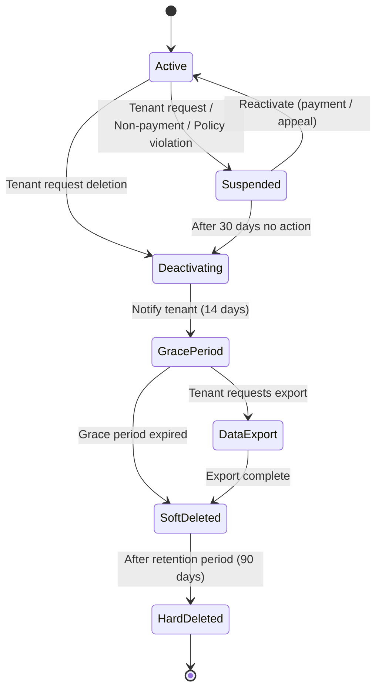
```mermaid
stateDiagram-v2
    [*] --> Active

    Active --> Suspended: Tenant request /<br/>Non-payment / Policy violation
    Active --> Deactivating: Tenant request deletion

    Suspended --> Active: Reactivate (payment / appeal)
    Suspended --> Deactivating: After 30 days no action

    Deactivating --> GracePeriod: Notify tenant (14 days)
    GracePeriod --> DataExport: Tenant requests export
    GracePeriod --> SoftDeleted: Grace period expired

    DataExport --> SoftDeleted: Export complete
    SoftDeleted --> HardDeleted: After retention period (90 days)

    HardDeleted --> [*]
```

#### Data Retention Policy

```
┌──────────────────────────────────────────────────────────────────┐
│              DATA RETENTION TIMELINE                             │
│                                                                  │
│  Day 0          Day 14         Day 30          Day 90    Day 365 │
│  ├──────────────┼──────────────┼───────────────┼─────────┤       │
│  │              │              │               │         │       │
│  ▼              ▼              ▼               ▼         ▼       │
│  Deactivate     Grace Period   Soft Delete     Hard      Backup  │
│  Request        Ends           (anonymize PII) Delete    Purge   │
│                                                                  │
│  Access:                                                         │
│  ┌───────┐ ┌──────────┐ ┌──────────┐ ┌────────┐ ┌──────────┐     │
│  │ Full  │ │ Read-only│ │ Export   │ │ No     │ │ No       │     │
│  │ access│ │ + export │ │ only     │ │ access │ │ recovery │     │
│  └───────┘ └──────────┘ └──────────┘ └────────┘ └──────────┘     │
│                                                                  │
│  Compliance:                                                     │
│  • GDPR: Right to erasure — hard delete PII within 30 days       │
│  • HIPAA: Retain records minimum 6 years                         │
│  • SOX: Financial records retain 7 years                         │
│  → Retention policy phải configurable per compliance regime      │
└──────────────────────────────────────────────────────────────────┘
```

#### Offboarding Pipeline — Implementation

```java
@Service
public class TenantOffboardingService {

    /**
     * Initiate tenant offboarding — starts grace period
     */
    public OffboardingResult initiate(String tenantId, String reason) {

        Tenant tenant = tenantRepo.findById(tenantId)
            .orElseThrow();

        // ① Mark tenant as deactivating
        tenant.setStatus(TenantStatus.DEACTIVATING);
        tenant.setDeactivationReason(reason);
        tenant.setDeactivationRequestedAt(Instant.now());
        tenant.setGracePeriodEndsAt(
            Instant.now().plus(14, ChronoUnit.DAYS));
        tenantRepo.save(tenant);

        // ② Revoke API keys (no new requests)
        apiKeyService.revokeAll(tenantId);

        // ③ Notify admin
        notificationService.sendOffboardingNotice(
            tenant.getAdminEmail(),
            tenant.getGracePeriodEndsAt());

        // ④ Schedule data export generation
        exportService.scheduleExport(tenantId);

        return new OffboardingResult(
            tenant.getId(),
            tenant.getGracePeriodEndsAt(),
            "Offboarding initiated. Data export available for 14 days."
        );
    }

    /**
     * Soft delete — after grace period
     * Anonymize PII, keep business data for compliance
     */
    @Scheduled(cron = "0 0 2 * * ?") // Daily at 2 AM
    public void processSoftDeletes() {
        List<Tenant> expired = tenantRepo
            .findByStatusAndGracePeriodEndsBefore(
                TenantStatus.DEACTIVATING, Instant.now());

        for (Tenant tenant : expired) {
            try {
                // Anonymize user PII
                userService.anonymizeAllUsers(tenant.getId());

                // Remove secrets and credentials
                secretsService.deleteAll(tenant.getId());

                // Delete cached data
                cacheService.evictAll(tenant.getId());

                // Mark soft-deleted
                tenant.setStatus(TenantStatus.SOFT_DELETED);
                tenant.setSoftDeletedAt(Instant.now());
                tenant.setHardDeleteScheduledAt(
                    Instant.now().plus(90, ChronoUnit.DAYS));
                tenantRepo.save(tenant);

                auditLog.log("TENANT_SOFT_DELETED", tenant.getId());

            } catch (Exception e) {
                log.error("Soft delete failed for tenant: {}",
                    tenant.getId(), e);
                alertService.alert("Offboarding failure: " + tenant.getId());
            }
        }
    }

    /**
     * Hard delete — permanently remove all data
     */
    @Scheduled(cron = "0 0 3 * * ?") // Daily at 3 AM
    public void processHardDeletes() {
        List<Tenant> toDelete = tenantRepo
            .findByStatusAndHardDeleteScheduledBefore(
                TenantStatus.SOFT_DELETED, Instant.now());

        for (Tenant tenant : toDelete) {
            // ① Delete database schema/tables
            dbProvisioner.deprovision(tenant.getId(), tenant.getTier());

            // ② Delete storage (S3 objects, files)
            storageService.deleteAllTenantData(tenant.getId());

            // ③ Delete search index
            searchService.deleteIndex(tenant.getId());

            // ④ Delete message queue topics (if dedicated)
            messagingService.cleanup(tenant.getId());

            // ⑤ Delete infrastructure (if silo)
            if ("enterprise".equals(tenant.getTier())) {
                infraService.deprovision(tenant.getId());
            }

            // ⑥ Final: delete tenant record
            tenant.setStatus(TenantStatus.HARD_DELETED);
            tenantRepo.save(tenant); // Keep tombstone record
            
            auditLog.log("TENANT_HARD_DELETED", tenant.getId());
        }
    }
}
```

#### Data Export — Cho tenant download trước khi xóa

```java
@Service
public class TenantDataExportService {

    /**
     * Generate full data export cho tenant
     * Format: ZIP file chứa JSON/CSV per entity
     */
    public ExportResult exportAll(String tenantId) {
        String exportId = UUID.randomUUID().toString();
        Path exportDir = Path.of("/tmp/exports/" + exportId);
        Files.createDirectories(exportDir);

        TenantContextHolder.set(new TenantContext(tenantId));
        try {
            // Export từng entity
            exportEntity(exportDir, "users", userRepo.findAll());
            exportEntity(exportDir, "orders", orderRepo.findAll());
            exportEntity(exportDir, "products", productRepo.findAll());
            exportEntity(exportDir, "settings", configRepo.findAll());

            // Create ZIP
            Path zipFile = createZip(exportDir, tenantId);

            // Upload to S3 (signed URL, valid 7 days)
            String downloadUrl = s3Service.uploadExport(
                zipFile, tenantId, Duration.ofDays(7));

            return new ExportResult(exportId, downloadUrl,
                Instant.now().plus(7, ChronoUnit.DAYS));

        } finally {
            TenantContextHolder.clear();
            FileUtils.deleteDirectory(exportDir.toFile());
        }
    }
}
```

### 8.4 Tenant Migration

Migration là quá trình **di chuyển tenant giữa các tiers, regions, hoặc infrastructure models** mà không downtime.

#### Các kịch bản Migration

```
┌──────────────────────────────────────────────────────────────────┐
│              TENANT MIGRATION SCENARIOS                          │
│                                                                  │
│  ① Tier Upgrade: Free → Pro → Enterprise                        │
│     Trigger: Tenant upgrade plan                                 │
│     Impact: Thay đổi quotas, features, possibly infra            │
│                                                                  │
│  ② Pool → Silo: Shared DB → Dedicated DB                        │
│     Trigger: Tier upgrade to Enterprise                          │
│     Impact: Data migration, connection switch                    │
│                                                                  │
│  ③ Region Migration: us-east-1 → eu-west-1                      │
│     Trigger: Data residency requirement (GDPR)                   │
│     Impact: Full data + infra migration                          │
│                                                                  │
│  ④ Schema Migration: Add new columns/tables per tenant          │
│     Trigger: Application update                                  │
│     Impact: Schema change without downtime                       │
└──────────────────────────────────────────────────────────────────┘
```

#### Pool → Silo Migration (chi tiết)

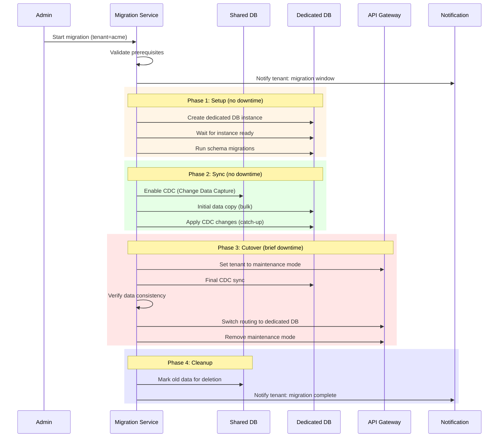
```mermaid
sequenceDiagram
    participant Admin
    participant MigSvc as Migration Service
    participant SharedDB as Shared DB
    participant DedDB as Dedicated DB
    participant GW as API Gateway
    participant Notify as Notification

    Admin->>MigSvc: Start migration (tenant=acme)
    MigSvc->>MigSvc: Validate prerequisites
    MigSvc->>Notify: Notify tenant: migration window

    rect rgb(255, 245, 230)
        Note over MigSvc,DedDB: Phase 1: Setup (no downtime)
        MigSvc->>DedDB: Create dedicated DB instance
        MigSvc->>DedDB: Wait for instance ready
        MigSvc->>DedDB: Run schema migrations
    end

    rect rgb(230, 255, 230)
        Note over MigSvc,DedDB: Phase 2: Sync (no downtime)
        MigSvc->>SharedDB: Enable CDC (Change Data Capture)
        MigSvc->>DedDB: Initial data copy (bulk)
        MigSvc->>DedDB: Apply CDC changes (catch-up)
    end

    rect rgb(255, 230, 230)
        Note over MigSvc,GW: Phase 3: Cutover (brief downtime)
        MigSvc->>GW: Set tenant to maintenance mode
        MigSvc->>DedDB: Final CDC sync
        MigSvc->>MigSvc: Verify data consistency
        MigSvc->>GW: Switch routing to dedicated DB
        MigSvc->>GW: Remove maintenance mode
    end

    rect rgb(230, 230, 255)
        Note over MigSvc,SharedDB: Phase 4: Cleanup
        MigSvc->>SharedDB: Mark old data for deletion
        MigSvc->>Notify: Notify tenant: migration complete
    end
```

#### Migration Service — Implementation

```java
@Service
public class TenantMigrationService {

    /**
     * Migrate tenant from shared (pool) to dedicated (silo) DB
     */
    public MigrationResult migratePoolToSilo(String tenantId) {
        String migrationId = UUID.randomUUID().toString();

        log.info("Starting pool→silo migration: tenant={}, migration={}",
            tenantId, migrationId);

        // Phase 1: Provision dedicated infrastructure
        log.info("[Phase 1] Provisioning dedicated DB...");
        DatabaseInfo dedicatedDb = dbProvisioner
            .provisionDedicatedDatabase(tenantId);
        waitForReady(dedicatedDb, Duration.ofMinutes(15));
        runSchemaMigrations(dedicatedDb);

        // Phase 2: Data sync
        log.info("[Phase 2] Starting data sync...");
        CdcStream cdc = cdcService.startCapture(
            sharedDb, tenantId);                   // Start CDC
        bulkCopyService.copy(
            sharedDb, dedicatedDb, tenantId);       // Initial bulk copy
        cdc.applyPending(dedicatedDb);              // Apply CDC changes

        // Phase 3: Cutover (minimize downtime)
        log.info("[Phase 3] Cutover...");
        maintenanceService.enable(tenantId,
            "System upgrade in progress. Back in ~30 seconds.");

        cdc.applyPending(dedicatedDb);              // Final sync
        long pendingChanges = cdc.getPendingCount();
        if (pendingChanges > 0) {
            throw new MigrationException(
                "Still " + pendingChanges + " pending changes");
        }

        // Verify data consistency
        DataConsistencyResult check = consistencyChecker.verify(
            sharedDb, dedicatedDb, tenantId);
        if (!check.isConsistent()) {
            maintenanceService.disable(tenantId);
            throw new MigrationException(
                "Data inconsistency detected: " + check.getDetails());
        }

        // Switch routing
        routingService.updateRoute(tenantId, dedicatedDb.getEndpoint());
        tenantRepo.updateTier(tenantId, "enterprise");

        maintenanceService.disable(tenantId);

        // Phase 4: Cleanup
        log.info("[Phase 4] Cleanup...");
        cdc.stop();
        scheduleDataCleanup(sharedDb, tenantId, Duration.ofDays(7));

        return new MigrationResult(migrationId, "SUCCESS",
            "Migration completed. Downtime: ~30 seconds.");
    }
}
```

#### Tổng kết — Tenant Lifecycle Checklist

```
✅ TENANT LIFECYCLE CHECKLIST

Onboarding:
├── ✅ Automated provisioning pipeline (no human intervention)
├── ✅ Per-tier resource provisioning (DB, cache, storage, compute)
├── ✅ Rollback on provisioning failure
├── ✅ Welcome email with credentials + quick start guide
└── ✅ Provisioning time: <30s (pool), <15min (silo)

Configuration:
├── ✅ Hierarchical config: Platform > Tier > Tenant
├── ✅ Tenant self-service config (timezone, locale, branding)
├── ✅ Feature flags per tier + per tenant override
├── ✅ Config change events → propagated to all services
└── ✅ Config cache with TTL + invalidation

Offboarding:
├── ✅ Grace period (14 days) with read-only + export
├── ✅ Data export (ZIP) with signed download URL
├── ✅ Soft delete: anonymize PII, keep business data
├── ✅ Hard delete: scheduled after retention period (90 days)
├── ✅ Compliance-aware retention (GDPR, HIPAA, SOX)
└── ✅ Audit log for all offboarding actions

Migration:
├── ✅ Pool → Silo with CDC (near-zero downtime)
├── ✅ Tier upgrade with instant quota/feature update
├── ✅ Region migration for data residency compliance
├── ✅ Data consistency verification before cutover
└── ✅ Rollback capability at every phase
```

---

## 9. Security & Compliance

Security trong multi-tenant là **mission-critical** — một lỗ hổng có thể **leak data giữa các tenant**, gây mất niềm tin và vi phạm pháp luật. Nguyên tắc: **Zero Trust between tenants** — mọi lớp đều phải enforce isolation.

```
┌──────────────────────────────────────────────────────────────────┐
│              MULTI-TENANT SECURITY LAYERS                        │
│                                                                  │
│  Layer 1: Network          Firewall, SG, VPC isolation           │
│  Layer 2: Authentication   JWT + tenant_id, SSO/SAML             │
│  Layer 3: Authorization    RBAC scoped by tenant_id              │
│  Layer 4: Data Access      Row-level security, schema isolation  │
│  Layer 5: Encryption       Per-tenant keys (KMS), TLS            │
│  Layer 6: Audit            Per-tenant audit log, immutable       │
│  Layer 7: Compliance       GDPR, HIPAA, SOC2 — per tenant        │
│                                                                  │
│  ⚡ MỌI layer phải enforce tenant_id — không layer nào optional   │
└──────────────────────────────────────────────────────────────────┘
```

### 9.1 Cross-Tenant Data Leak Prevention

Cross-tenant data leak (hay **tenant bleed**) là lỗi nghiêm trọng nhất trong multi-tenancy — khi tenant A truy cập được data của tenant B.

#### Nguyên nhân phổ biến

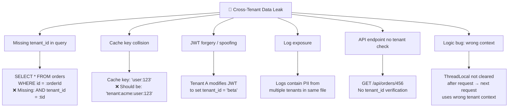
```mermaid
graph TD
    LEAK[🔴 Cross-Tenant Data Leak]

    LEAK --> Q[Missing tenant_id in query]
    LEAK --> C[Cache key collision]
    LEAK --> J[JWT forgery / spoofing]
    LEAK --> L[Log exposure]
    LEAK --> API[API endpoint no tenant check]
    LEAK --> BUG[Logic bug: wrong context]

    Q --> Q1["SELECT * FROM orders<br/>WHERE id = :orderId<br/>❌ Missing: AND tenant_id = :tid"]
    C --> C1["Cache key: 'user:123'<br/>❌ Should be: 'tenant:acme:user:123'"]
    J --> J1["Tenant A modifies JWT<br/>to set tenant_id = 'beta'"]
    L --> L1["Logs contain PII from<br/>multiple tenants in same file"]
    API --> API1["GET /api/orders/456<br/>No tenant_id verification"]
    BUG --> BUG1["ThreadLocal not cleared<br/>after request → next request<br/>uses wrong tenant context"]
```

#### Phòng chống — Database Layer

```java
/**
 * ① Hibernate Filter — TỰ ĐỘNG thêm tenant_id vào mọi query
 * Đây là lớp bảo vệ QUAN TRỌNG nhất
 */
@FilterDef(
    name = "tenantFilter",
    parameters = @ParamDef(name = "tenantId", type = String.class)
)
@Filter(
    name = "tenantFilter",
    condition = "tenant_id = :tenantId"
)
@Entity
@Table(name = "orders")
public class Order {
    @Id private Long id;

    @Column(name = "tenant_id", nullable = false, updatable = false)
    private String tenantId;

    // ... other fields
}

/**
 * ② Interceptor enable filter cho mọi request
 */
@Component
public class TenantFilterInterceptor implements HandlerInterceptor {

    @Autowired private EntityManager em;

    @Override
    public boolean preHandle(HttpServletRequest req,
                              HttpServletResponse resp,
                              Object handler) {
        String tenantId = TenantContextHolder.getTenantId();
        if (tenantId == null) {
            throw new SecurityException("No tenant context");
        }

        Session session = em.unwrap(Session.class);
        session.enableFilter("tenantFilter")
               .setParameter("tenantId", tenantId);
        return true;
    }
}

/**
 * ③ PostgreSQL Row-Level Security — backup protection
 */
-- Tạo RLS policy (defense-in-depth)
-- Ngay cả khi application code bỏ sót WHERE clause,
-- database vẫn enforce tenant isolation

ALTER TABLE orders ENABLE ROW LEVEL SECURITY;

CREATE POLICY tenant_isolation ON orders
    USING (tenant_id = current_setting('app.current_tenant'));

-- Set tenant context cho mỗi DB connection
SET app.current_tenant = 'acme';
```

#### Phòng chống — Cache Layer

```java
/**
 * Tenant-safe cache key strategy
 * MỌI cache key PHẢI có tenant_id prefix
 */
@Component
public class TenantCacheKeyGenerator implements KeyGenerator {

    @Override
    public Object generate(Object target, Method method, Object... params) {
        String tenantId = TenantContextHolder.getTenantId();
        String methodKey = target.getClass().getSimpleName()
            + "." + method.getName();
        String paramsKey = Arrays.stream(params)
            .map(Object::toString)
            .collect(Collectors.joining(":"));

        // Format: tenant:{tenantId}:{class.method}:{params}
        return "tenant:" + tenantId + ":" + methodKey + ":" + paramsKey;
    }
}

// Usage — cache LUÔN scoped theo tenant
@Cacheable(cacheNames = "orders", keyGenerator = "tenantCacheKeyGenerator")
public List<Order> findOrders(String status) {
    // Cache key: tenant:acme:OrderService.findOrders:PENDING
    return orderRepository.findByStatus(status);
}
```

#### Phòng chống — Context Propagation Safety

```java
/**
 * Đảm bảo TenantContext LUÔN được clear sau mỗi request
 * Tránh context leak sang request tiếp theo
 */
@Component
@Order(Ordered.HIGHEST_PRECEDENCE)
public class TenantContextSafetyFilter extends OncePerRequestFilter {

    @Override
    protected void doFilterInternal(HttpServletRequest req,
                                      HttpServletResponse resp,
                                      FilterChain chain) throws Exception {
        try {
            chain.doFilter(req, resp);
        } finally {
            // CRITICAL: Always clear context — prevent tenant bleed
            TenantContextHolder.clear();
        }
    }
}

/**
 * Async task wrapper — propagate tenant context safely
 */
public class TenantAwareRunnable implements Runnable {
    private final String tenantId;
    private final Runnable delegate;

    public TenantAwareRunnable(Runnable delegate) {
        this.tenantId = TenantContextHolder.getTenantId();
        this.delegate = delegate;
    }

    @Override
    public void run() {
        TenantContextHolder.set(new TenantContext(tenantId));
        try {
            delegate.run();
        } finally {
            TenantContextHolder.clear();
        }
    }
}
```

#### Cross-Tenant Leak Testing

```java
/**
 * Integration test — verify tenant isolation
 */
@SpringBootTest
public class TenantIsolationTest {

    @Test
    void tenant_A_cannot_see_tenant_B_data() {
        // Setup: Create data for both tenants
        setTenantContext("tenant-a");
        orderService.create(new Order("Order A1"));
        orderService.create(new Order("Order A2"));

        setTenantContext("tenant-b");
        orderService.create(new Order("Order B1"));

        // Test: Tenant A should only see their orders
        setTenantContext("tenant-a");
        List<Order> ordersA = orderService.findAll();
        assertThat(ordersA).hasSize(2);
        assertThat(ordersA).allMatch(o ->
            o.getTenantId().equals("tenant-a"));

        // Test: Tenant B should only see their orders
        setTenantContext("tenant-b");
        List<Order> ordersB = orderService.findAll();
        assertThat(ordersB).hasSize(1);
        assertThat(ordersB).allMatch(o ->
            o.getTenantId().equals("tenant-b"));
    }

    @Test
    void tenant_A_cannot_access_tenant_B_by_id() {
        setTenantContext("tenant-a");
        Order orderA = orderService.create(new Order("Order A1"));

        // Tenant B tries to access Tenant A's order by ID
        setTenantContext("tenant-b");
        assertThrows(NotFoundException.class, () ->
            orderService.findById(orderA.getId()));
    }

    @Test
    void cache_is_isolated_between_tenants() {
        setTenantContext("tenant-a");
        orderService.findAll(); // Populate cache

        setTenantContext("tenant-b");
        List<Order> ordersB = orderService.findAll();

        // Should NOT return Tenant A's cached data
        assertThat(ordersB).allMatch(o ->
            o.getTenantId().equals("tenant-b"));
    }
}
```

### 9.2 Encryption Strategies

#### Encryption at Rest — Per-Tenant Keys

```
┌──────────────────────────────────────────────────────────────────┐
│              ENCRYPTION ARCHITECTURE                             │
│                                                                  │
│  ① Shared Platform Key (Free/Pro tier)                          │
│  ┌──────────────────────────────────────────────────────┐        │
│  │  AWS KMS: platform-master-key                        │        │
│  │  ├── Encrypts ALL tenant data                        │        │
│  │  ├── Key rotation: annual (automatic)                │        │
│  │  └── Simple, cost-effective                          │        │
│  └──────────────────────────────────────────────────────┘        │
│                                                                  │
│  ② Per-Tenant Key (Enterprise tier)                             │
│  ┌──────────────────────────────────────────────────────┐        │
│  │  AWS KMS: tenant-{id}-master-key                     │        │
│  │  ├── Each tenant has dedicated CMK                   │        │
│  │  ├── Tenant can manage own key policy                │        │
│  │  ├── Independent key rotation                        │        │
│  │  └── Crypto-erase: delete key = delete all data      │        │
│  └──────────────────────────────────────────────────────┘        │
│                                                                  │
│  ③ BYOK — Bring Your Own Key (Enterprise+)                      │
│  ┌──────────────────────────────────────────────────────┐        │
│  │  Tenant provides their own KMS key                   │        │
│  │  ├── Full tenant control over encryption             │        │
│  │  ├── Tenant can revoke access anytime                │        │
│  │  └── Required: HIPAA, financial compliance           │        │
│  └──────────────────────────────────────────────────────┘        │
└──────────────────────────────────────────────────────────────────┘
```

#### Implementation — Per-Tenant Encryption

```java
@Service
public class TenantEncryptionService {

    private final KmsClient kmsClient;
    private final LoadingCache<String, String> keyCache;

    /**
     * Encrypt data with tenant-specific key
     */
    public byte[] encrypt(String tenantId, byte[] plaintext) {
        String keyId = getOrCreateTenantKey(tenantId);

        EncryptResponse response = kmsClient.encrypt(
            EncryptRequest.builder()
                .keyId(keyId)
                .plaintext(SdkBytes.fromByteArray(plaintext))
                .encryptionContext(Map.of(
                    "tenant_id", tenantId,
                    "service", "order-service"
                ))
                .build());

        return response.ciphertextBlob().asByteArray();
    }

    /**
     * Decrypt with tenant-specific key
     */
    public byte[] decrypt(String tenantId, byte[] ciphertext) {
        DecryptResponse response = kmsClient.decrypt(
            DecryptRequest.builder()
                .ciphertextBlob(SdkBytes.fromByteArray(ciphertext))
                .encryptionContext(Map.of(
                    "tenant_id", tenantId,
                    "service", "order-service"
                ))
                .build());

        // Verify the decryption was done with correct tenant key
        // (encryption context mismatch → DecryptException)
        return response.plaintext().asByteArray();
    }

    /**
     * Get or create dedicated KMS key for tenant
     */
    private String getOrCreateTenantKey(String tenantId) {
        return keyCache.get(tenantId, id -> {
            // Check existing key
            Optional<String> existing = keyRegistry.findByTenant(id);
            if (existing.isPresent()) return existing.get();

            // Create new CMK for tenant
            CreateKeyResponse key = kmsClient.createKey(
                CreateKeyRequest.builder()
                    .description("Data encryption key for tenant: " + id)
                    .keyUsage(KeyUsageType.ENCRYPT_DECRYPT)
                    .tags(Tag.builder()
                        .tagKey("tenant_id").tagValue(id)
                        .build())
                    .build());

            String keyId = key.keyMetadata().keyId();

            // Setup automatic key rotation
            kmsClient.enableKeyRotation(
                EnableKeyRotationRequest.builder()
                    .keyId(keyId).build());

            keyRegistry.register(id, keyId);
            return keyId;
        });
    }

    /**
     * Crypto-erase: xóa key = xóa toàn bộ data (dùng cho offboarding)
     */
    public void cryptoErase(String tenantId) {
        String keyId = keyRegistry.findByTenant(tenantId)
            .orElseThrow();

        // Schedule key deletion (7 days minimum waiting period)
        kmsClient.scheduleKeyDeletion(
            ScheduleKeyDeletionRequest.builder()
                .keyId(keyId)
                .pendingWindowInDays(7)
                .build());

        log.info("Scheduled crypto-erase for tenant: {}. " +
                 "Key will be deleted in 7 days.", tenantId);
    }
}
```

#### Encryption in Transit

```
┌──────────────────────────────────────────────────────────────┐
│  ENCRYPTION IN TRANSIT                                       │
│                                                              │
│  Client ──TLS 1.3──▶ ALB ──TLS──▶ Service ──TLS──▶ Database  │
│                                                              │
│  Requirements:                                               │
│  ├── TLS 1.2+ (prefer TLS 1.3) for all endpoints             │
│  ├── mTLS between internal services                          │
│  ├── Certificate per service (not per tenant)                │
│  ├── Private CA for internal communication                   │
│  └── HSTS headers for all web endpoints                      │
│                                                              │
│  Per-Tenant Custom Domains:                                  │
│  ├── acme.app.example.com → ACM certificate (auto-renewal)   │
│  ├── beta.app.example.com → ACM certificate                  │
│  └── custom.acme.com → Customer-provided certificate         │
└──────────────────────────────────────────────────────────────┘
```

### 9.3 Compliance (GDPR, HIPAA, SOC2)

#### Compliance Matrix per Regulation

| Requirement | GDPR | HIPAA | SOC2 | Implementation |
|------------|:----:|:-----:|:----:|----------------|
| **Data encryption at rest** | ✅ | ✅ | ✅ | KMS per tenant |
| **Data encryption in transit** | ✅ | ✅ | ✅ | TLS 1.2+ |
| **Access logging** | ✅ | ✅ | ✅ | Audit log per tenant |
| **Right to erasure** | ✅ | ❌ | ❌ | Hard delete within 30 days |
| **Data portability** | ✅ | ❌ | ❌ | Export API (JSON/CSV) |
| **Data minimization** | ✅ | ❌ | ❌ | Collect only necessary data |
| **Consent management** | ✅ | ❌ | ❌ | Consent service |
| **Breach notification** | ✅ 72h | ✅ 60 days | ✅ | Incident response plan |
| **Data residency** | ✅ | ❌ | ❌ | Region-specific deployment |
| **BAA (Business Associate)** | ❌ | ✅ | ❌ | Legal agreement |
| **Minimum retention** | ❌ | ✅ 6yr | ❌ | Retention policy |
| **Annual audit** | ❌ | ❌ | ✅ | Third-party attestation |
| **Access controls** | ✅ | ✅ | ✅ | RBAC + MFA |
| **Vulnerability management** | ✅ | ✅ | ✅ | Regular scanning |

#### Per-Tenant Compliance Configuration

```java
@Service
public class TenantComplianceService {

    /**
     * Set compliance regime per tenant
     * Ảnh hưởng: encryption, retention, audit, data handling
     */
    public void setComplianceRegime(String tenantId,
                                      Set<ComplianceRegime> regimes) {
        TenantCompliance compliance = TenantCompliance.builder()
            .tenantId(tenantId)
            .regimes(regimes)
            .build();

        // Apply most restrictive rules from all applicable regimes
        if (regimes.contains(ComplianceRegime.GDPR)) {
            compliance.setDataResidencyRequired(true);
            compliance.setRightToErasure(true);
            compliance.setConsentRequired(true);
            compliance.setBreachNotificationHours(72);
        }

        if (regimes.contains(ComplianceRegime.HIPAA)) {
            compliance.setEncryptionRequired(true);
            compliance.setDedicatedKeyRequired(true);
            compliance.setMinRetentionYears(6);
            compliance.setAuditLogRequired(true);
            compliance.setBreachNotificationDays(60);
        }

        if (regimes.contains(ComplianceRegime.SOC2)) {
            compliance.setAuditLogRequired(true);
            compliance.setAccessControlRequired(true);
            compliance.setVulnerabilityScanRequired(true);
        }

        complianceRepo.save(compliance);

        // Apply compliance settings to infrastructure
        applyComplianceSettings(tenantId, compliance);
    }

    /**
     * Validate ongoing compliance
     */
    public ComplianceReport validateCompliance(String tenantId) {
        TenantCompliance compliance = complianceRepo
            .findByTenantId(tenantId).orElseThrow();

        List<ComplianceViolation> violations = new ArrayList<>();

        // Check encryption
        if (compliance.isEncryptionRequired()) {
            if (!encryptionService.hasDedicatedKey(tenantId)) {
                violations.add(new ComplianceViolation(
                    "ENCRYPTION", "Dedicated KMS key required but not found"));
            }
        }

        // Check data residency
        if (compliance.isDataResidencyRequired()) {
            String region = tenantRepo.findById(tenantId)
                .map(Tenant::getRegion).orElse("unknown");
            if (!isAllowedRegion(tenantId, region)) {
                violations.add(new ComplianceViolation(
                    "DATA_RESIDENCY",
                    "Data stored in non-compliant region: " + region));
            }
        }

        // Check audit logging
        if (compliance.isAuditLogRequired()) {
            if (!auditService.isEnabledForTenant(tenantId)) {
                violations.add(new ComplianceViolation(
                    "AUDIT_LOG", "Audit logging not enabled"));
            }
        }

        return new ComplianceReport(tenantId,
            compliance.getRegimes(),
            violations,
            violations.isEmpty() ? "COMPLIANT" : "NON_COMPLIANT");
    }
}
```

#### GDPR — Right to Erasure Implementation

```java
@Service
public class GdprErasureService {

    /**
     * Process GDPR erasure request
     * Must complete within 30 days (law requirement)
     */
    public ErasureResult processErasureRequest(String tenantId,
                                                 String userId) {
        String requestId = UUID.randomUUID().toString();

        // ① Log the request
        auditLog.log("GDPR_ERASURE_REQUESTED", tenantId,
            Map.of("user_id", userId, "request_id", requestId));

        // ② Find all PII data across services
        List<DataLocation> locations = dataDiscovery
            .findPersonalData(tenantId, userId);

        // ③ Delete or anonymize PII in each location
        for (DataLocation loc : locations) {
            switch (loc.getType()) {
                case DATABASE:
                    anonymizeInDatabase(loc, userId);
                    break;
                case STORAGE:
                    deleteFromStorage(loc, userId);
                    break;
                case SEARCH_INDEX:
                    deleteFromSearchIndex(loc, userId);
                    break;
                case CACHE:
                    evictFromCache(loc, userId);
                    break;
                case LOG:
                    // Logs: anonymize, cannot delete (audit trail)
                    redactInLogs(loc, userId);
                    break;
            }
        }

        // ④ Verify erasure
        List<DataLocation> remaining = dataDiscovery
            .findPersonalData(tenantId, userId);

        boolean complete = remaining.isEmpty();

        // ⑤ Log completion
        auditLog.log("GDPR_ERASURE_COMPLETED", tenantId,
            Map.of("request_id", requestId,
                    "locations_processed", locations.size(),
                    "complete", complete));

        return new ErasureResult(requestId, complete,
            Instant.now(), locations.size());
    }

    private void anonymizeInDatabase(DataLocation loc, String userId) {
        // Replace PII with anonymized values
        jdbcTemplate.update("""
            UPDATE users SET
                email = CONCAT('deleted_', id, '@redacted.com'),
                full_name = 'REDACTED',
                phone = NULL,
                address = NULL,
                ip_address = NULL,
                anonymized_at = NOW()
            WHERE id = ? AND tenant_id = ?
            """, userId, loc.getTenantId());
    }
}

### 9.4 Data Residency & Sovereignty

Data Residency yêu cầu **dữ liệu của tenant phải được lưu trữ và xử lý** tại một vùng địa lý cụ thể (thường là quốc gia/khu vực mà tenant hoạt động).

#### Tại sao cần Data Residency?

```
┌──────────────────────────────────────────────────────────────────┐
│              DATA RESIDENCY REQUIREMENTS                         │
│                                                                  │
│  GDPR (EU):                                                      │
│  ├── Data EU citizens → phải ở EU hoặc "adequate" countries      │
│  ├── Transfer sang US/Asia → cần Standard Contractual Clauses    │
│  └── Violation: fine up to 4% global revenue                     │
│                                                                  │
│  China (PIPL):                                                   │
│  ├── Data Chinese citizens → PHẢI ở China                        │
│  └── Cross-border transfer → government approval required        │
│                                                                  │
│  Russia (Federal Law 152-FZ):                                    │
│  ├── Personal data Russian citizens → PHẢI ở Russia              │
│  └── No exception for SaaS platforms                             │
│                                                                  │
│  Vietnam (Decree 13):                                            │
│  ├── Important data → PHẢI có bản sao ở Vietnam                  │
│  └── Cross-border → impact assessment required                   │
└──────────────────────────────────────────────────────────────────┘
```

#### Multi-Region Architecture

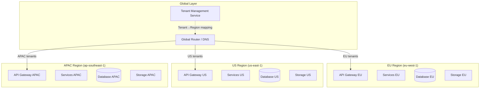
```mermaid
graph TD
    subgraph "Global Layer"
        GR[Global Router / DNS]
        TMS[Tenant Management Service]
    end

    subgraph "EU Region (eu-west-1)"
        EU_GW[API Gateway EU]
        EU_SVC[Services EU]
        EU_DB[(Database EU)]
        EU_S3[Storage EU]
    end

    subgraph "US Region (us-east-1)"
        US_GW[API Gateway US]
        US_SVC[Services US]
        US_DB[(Database US)]
        US_S3[Storage US]
    end

    subgraph "APAC Region (ap-southeast-1)"
        AP_GW[API Gateway APAC]
        AP_SVC[Services APAC]
        AP_DB[(Database APAC)]
        AP_S3[Storage APAC]
    end

    GR -->|EU tenants| EU_GW
    GR -->|US tenants| US_GW
    GR -->|APAC tenants| AP_GW

    TMS -.->|Tenant→Region mapping| GR
```

#### Implementation — Region-Aware Routing

```java
@Service
public class TenantRegionRouter {

    private static final Map<String, String> COUNTRY_TO_REGION = Map.of(
        "DE", "eu-west-1",
        "FR", "eu-west-1",
        "NL", "eu-west-1",
        "US", "us-east-1",
        "CA", "us-east-1",
        "JP", "ap-northeast-1",
        "SG", "ap-southeast-1",
        "VN", "ap-southeast-1",
        "AU", "ap-southeast-2"
    );

    /**
     * Resolve region for tenant based on residency requirements
     */
    public String resolveRegion(String tenantId) {
        Tenant tenant = tenantRepo.findById(tenantId).orElseThrow();

        // Priority 1: Explicit region override (enterprise config)
        if (tenant.getRegionOverride() != null) {
            return tenant.getRegionOverride();
        }

        // Priority 2: Compliance-driven region
        TenantCompliance compliance = complianceRepo
            .findByTenantId(tenantId).orElse(null);
        if (compliance != null && compliance.getRequiredRegion() != null) {
            return compliance.getRequiredRegion();
        }

        // Priority 3: Country-based default
        String country = tenant.getCountryCode();
        return COUNTRY_TO_REGION.getOrDefault(country, "us-east-1");
    }

    /**
     * Validate data does not leave allowed region
     */
    public void enforceResidency(String tenantId, String targetRegion) {
        String allowedRegion = resolveRegion(tenantId);

        if (!targetRegion.equals(allowedRegion)) {
            throw new DataResidencyViolationException(String.format(
                "Data residency violation: tenant %s data must stay in %s, " +
                "but operation targets %s",
                tenantId, allowedRegion, targetRegion));
        }
    }
}
```

#### Terraform — Multi-Region Infrastructure

```hcl
# modules/tenant-region/main.tf
variable "regions" {
  default = ["eu-west-1", "us-east-1", "ap-southeast-1"]
}

# Deploy per region
module "region" {
  source   = "./modules/region-stack"
  for_each = toset(var.regions)

  region = each.value

  # Database
  db_instance_class = "db.r6g.large"
  db_multi_az       = true
  db_encrypted      = true

  # S3 — block cross-region replication
  s3_bucket_policy = jsonencode({
    Version = "2012-10-17"
    Statement = [
      {
        Sid       = "DenyNonRegionalAccess"
        Effect    = "Deny"
        Principal = "*"
        Action    = "s3:*"
        Resource  = "arn:aws:s3:::tenant-data-${each.value}/*"
        Condition = {
          StringNotEquals = {
            "aws:RequestedRegion" = each.value
          }
        }
      }
    ]
  })

  tags = {
    Environment = "production"
    Region      = each.value
    DataResidency = "enforced"
  }
}
```

### 9.5 Audit Logging per Tenant

Audit log ghi lại **mọi hành động** liên quan đến data và security của tenant — immutable, searchable, và compliance-ready.

#### Audit Log Architecture

```
┌─────────────────────────────────────────────────────────────────┐
│              AUDIT LOG ARCHITECTURE                             │
│                                                                 │
│  Application ──▶ Audit Service ──▶ Storage                      │
│                                                                 │
│  ┌──────────┐   ┌──────────────┐   ┌────────────────────────┐   │
│  │ API call │──▶│ AuditLogger  │──▶│ Kinesis / Kafka        │   │
│  │ DB write │   │              │   │ (streaming, ordered)   │   │
│  │ Login    │   │ Enrichment:  │   └─────────┬──────────────┘   │
│  │ Config   │   │ + timestamp  │             │                  │
│  │ change   │   │ + tenant_id  │   ┌─────────▼──────────────┐   │
│  └──────────┘   │ + user_id    │   │ S3 (long-term archive) │   │
│                 │ + ip_address │   │ (immutable, encrypted) │   │
│                 │ + request_id │   └─────────┬──────────────┘   │
│                 └──────────────┘             │                  │
│                                    ┌─────────▼──────────────┐   │
│                                    │ OpenSearch / CloudWatc │   │
│                                    │(searchable, dashboards)│   │
│                                    └────────────────────────┘   │
│                                                                 │
│  Requirements:                                                  │
│  ├── Immutable (append-only, no delete)                         │
│  ├── Tamper-proof (hash chain or WORM storage)                  │
│  ├── Per-tenant isolated (tenant A cannot read B's logs)        │
│  ├── Searchable (by tenant, user, action, time range)           │
│  └── Retention: configurable per compliance regime              │
└─────────────────────────────────────────────────────────────────┘
```

#### Implementation — Structured Audit Logger

```java
@Service
public class TenantAuditService {

    private final KinesisClient kinesis;
    private final ObjectMapper objectMapper;

    /**
     * Log audit event — immutable, structured
     */
    public void log(AuditEvent event) {
        // Enrich event
        event.setTimestamp(Instant.now());
        event.setRequestId(MDC.get("requestId"));
        event.setSourceIp(MDC.get("sourceIp"));
        event.setUserAgent(MDC.get("userAgent"));

        // Compute hash for integrity
        String payload = objectMapper.writeValueAsString(event);
        event.setContentHash(sha256(payload));

        // Send to stream (ordered by tenant)
        kinesis.putRecord(PutRecordRequest.builder()
            .streamName("audit-events")
            .data(SdkBytes.fromUtf8String(payload))
            .partitionKey(event.getTenantId()) // Same tenant → same shard
            .build());
    }

    /**
     * Convenience methods for common audit events
     */
    public void logDataAccess(String tenantId, String userId,
                               String resource, String action) {
        log(AuditEvent.builder()
            .tenantId(tenantId)
            .userId(userId)
            .category("DATA_ACCESS")
            .action(action)
            .resource(resource)
            .build());
    }

    public void logAuthEvent(String tenantId, String userId,
                              String action, boolean success) {
        log(AuditEvent.builder()
            .tenantId(tenantId)
            .userId(userId)
            .category("AUTHENTICATION")
            .action(action)
            .success(success)
            .severity(success ? "INFO" : "WARNING")
            .build());
    }

    public void logConfigChange(String tenantId, String userId,
                                  String key, Object oldValue,
                                  Object newValue) {
        log(AuditEvent.builder()
            .tenantId(tenantId)
            .userId(userId)
            .category("CONFIGURATION")
            .action("CONFIG_CHANGED")
            .details(Map.of(
                "key", key,
                "old_value", String.valueOf(oldValue),
                "new_value", String.valueOf(newValue)
            ))
            .build());
    }

    public void logSecurityEvent(String tenantId, String userId,
                                   String action, String severity,
                                   Map<String, String> details) {
        log(AuditEvent.builder()
            .tenantId(tenantId)
            .userId(userId)
            .category("SECURITY")
            .action(action)
            .severity(severity)
            .details(details)
            .build());
    }
}

/**
 * Audit Event — Structured log entry
 */
@Data @Builder
public class AuditEvent {
    private String id;              // UUID
    private Instant timestamp;
    private String tenantId;
    private String userId;
    private String category;        // DATA_ACCESS, AUTH, CONFIG, SECURITY
    private String action;          // CREATE, READ, UPDATE, DELETE, LOGIN
    private String resource;        // orders/123, users/456
    private String severity;        // INFO, WARNING, CRITICAL
    private boolean success;
    private String requestId;
    private String sourceIp;
    private String userAgent;
    private Map<String, String> details;
    private String contentHash;     // SHA-256 for integrity
}
```

#### Audit Log Query API — Per Tenant

```java
@RestController
@RequestMapping("/api/audit")
public class AuditLogController {

    @Autowired private AuditQueryService queryService;

    /**
     * Tenant admin có thể query audit logs của tenant mình
     */
    @GetMapping("/logs")
    @PreAuthorize("hasAuthority('AUDIT_READ')")
    public Page<AuditEvent> queryLogs(
            @RequestParam(required = false) String userId,
            @RequestParam(required = false) String category,
            @RequestParam(required = false) String action,
            @RequestParam(required = false)
                @DateTimeFormat(iso = ISO.DATE_TIME) Instant from,
            @RequestParam(required = false)
                @DateTimeFormat(iso = ISO.DATE_TIME) Instant to,
            Pageable pageable) {

        String tenantId = TenantContextHolder.getTenantId();

        // Tenant can ONLY query their own logs
        return queryService.search(
            tenantId, userId, category, action,
            from, to, pageable);
    }

    /**
     * Export audit logs (compliance requirement)
     */
    @PostMapping("/export")
    @PreAuthorize("hasAuthority('AUDIT_EXPORT')")
    public ExportResponse exportLogs(
            @RequestBody AuditExportRequest request) {
        String tenantId = TenantContextHolder.getTenantId();
        return queryService.exportToCsv(tenantId, request);
    }
}
```

#### Tổng kết — Security & Compliance Checklist

```
✅ SECURITY & COMPLIANCE CHECKLIST

Cross-Tenant Isolation:
├── ✅ Hibernate Filter: auto tenant_id on all queries
├── ✅ PostgreSQL RLS: defense-in-depth at DB level
├── ✅ Cache key: tenant-prefixed (no collision)
├── ✅ Context safety: ThreadLocal cleared after every request
├── ✅ Async safety: TenantAwareRunnable for thread pool tasks
└── ✅ Integration tests: tenant isolation verification

Encryption:
├── ✅ At rest: KMS per tenant (Enterprise), shared key (Free/Pro)
├── ✅ In transit: TLS 1.2+ all endpoints, mTLS internal
├── ✅ BYOK support for Enterprise+ tier
└── ✅ Crypto-erase for offboarding (delete key = delete data)

Compliance:
├── ✅ GDPR: right to erasure, data portability, consent
├── ✅ HIPAA: BAA, encryption, 6-year retention
├── ✅ SOC2: audit logs, access controls, vulnerability scanning
├── ✅ Per-tenant compliance configuration
└── ✅ Automated compliance validation

Data Residency:
├── ✅ Multi-region deployment (EU, US, APAC)
├── ✅ Country → Region routing
├── ✅ S3 bucket policy: deny cross-region access
└── ✅ Enforcement at API + infrastructure level

Audit Logging:
├── ✅ Structured events: DATA_ACCESS, AUTH, CONFIG, SECURITY
├── ✅ Immutable: append-only, hash chain
├── ✅ Per-tenant isolation: tenant can only query own logs
├── ✅ Searchable + exportable (compliance requirement)
└── ✅ Configurable retention per compliance regime
```

---

## 10. Observability & Monitoring

Observability trong multi-tenant phải **segment mọi thứ theo tenant_id** — logs, metrics, traces. Không có tenant context = không debug được, không billing được, không detect được noisy neighbor.

```
┌─────────────────────────────────────────────────────────────────┐
│              TENANT-AWARE OBSERVABILITY                         │
│                                                                 │
│  Three Pillars — tất cả đều PHẢI có tenant_id                   │
│                                                                 │
│  ┌──────────┐    ┌──────────┐    ┌──────────┐                   │
│  │  LOGS    │    │ METRICS  │    │ TRACES   │                   │
│  │          │    │          │    │          │                   │
│  │ tenant_id│    │ tenant_id│    │ tenant_id│                   │
│  │ in every │    │ as label/│    │ in span  │                   │
│  │ log line │    │ dimension│    │ baggage  │                   │
│  └────┬─────┘    └────┬─────┘    └────┬─────┘                   │
│       │               │               │                         │
│       ▼               ▼               ▼                         │
│  ┌──────────────────────────────────────┐                       │
│  │      Unified Observability Platform  │                       │
│  │  (CloudWatch / Grafana / Datadog)    │                       │
│  │                                      │                       │
│  │  Filter by: tenant_id = "acme"       │                       │
│  │  → Logs + Metrics + Traces cho acme  │                       │
│  └──────────────────────────────────────┘                       │
└─────────────────────────────────────────────────────────────────┘
```

### 10.1 Tenant-aware Logging

Mọi log line phải chứa **tenant_id** — đây là yêu cầu bắt buộc, không có ngoại lệ.

#### Structured Logging Format

```json
{
  "timestamp": "2025-03-28T08:32:15.123Z",
  "level": "INFO",
  "logger": "com.app.OrderService",
  "message": "Order created successfully",
  "tenant_id": "acme",
  "user_id": "user-456",
  "trace_id": "abc123def456",
  "span_id": "span-789",
  "request_id": "req-xyz-001",
  "service": "order-service",
  "environment": "production",
  "region": "ap-southeast-1",
  "context": {
    "order_id": "ORD-12345",
    "amount": 150.00,
    "currency": "USD"
  }
}
```

#### Implementation — MDC-based Tenant Logging

```java
/**
 * Filter: inject tenant_id vào MDC (Mapped Diagnostic Context)
 * → Tất cả logs trong request sẽ tự động có tenant_id
 */
@Component
@Order(Ordered.HIGHEST_PRECEDENCE + 1)
public class TenantLoggingFilter extends OncePerRequestFilter {

    @Override
    protected void doFilterInternal(HttpServletRequest req,
                                      HttpServletResponse resp,
                                      FilterChain chain) throws Exception {
        try {
            String tenantId = TenantContextHolder.getTenantId();
            String userId = TenantContextHolder.getUserId();

            // Set MDC — auto-included in every log line
            MDC.put("tenant_id", tenantId != null ? tenantId : "unknown");
            MDC.put("user_id", userId != null ? userId : "anonymous");
            MDC.put("request_id", generateRequestId());
            MDC.put("trace_id", getTraceId());

            chain.doFilter(req, resp);
        } finally {
            MDC.clear();
        }
    }

    private String generateRequestId() {
        return "req-" + UUID.randomUUID().toString().substring(0, 8);
    }
}
```

#### Logback Configuration — Structured JSON Output

```xml
<!-- logback-spring.xml -->
<configuration>
    <appender name="JSON_CONSOLE"
              class="ch.qos.logback.core.ConsoleAppender">
        <encoder class="net.logstash.logback.encoder.
                        LogstashEncoder">
            <fieldNames>
                <timestamp>timestamp</timestamp>
                <level>level</level>
                <logger>logger</logger>
                <message>message</message>
            </fieldNames>

            <!-- MDC fields auto-included -->
            <includeMdcKeyName>tenant_id</includeMdcKeyName>
            <includeMdcKeyName>user_id</includeMdcKeyName>
            <includeMdcKeyName>request_id</includeMdcKeyName>
            <includeMdcKeyName>trace_id</includeMdcKeyName>
        </encoder>
    </appender>

    <root level="INFO">
        <appender-ref ref="JSON_CONSOLE" />
    </root>
</configuration>
```

#### Log Isolation — Per-Tenant Log Streams

```
┌──────────────────────────────────────────────────────────────┐
│              LOG ROUTING PER TENANT                          │
│                                                              │
│  Application Logs                                            │
│       │                                                      │
│       ▼                                                      │
│  ┌──────────────────┐                                        │
│  │ Log Router       │                                        │
│  │ (Fluentd/Fluent  │                                        │
│  │  Bit/Vector)     │                                        │
│  └────┬─────────────┘                                        │
│       │                                                      │
│       ├──▶ /logs/platform/  (all tenants, platform ops)      │
│       ├──▶ /logs/acme/      (tenant acme, 30 days retain)    │
│       ├──▶ /logs/beta/      (tenant beta, 90 days retain)    │
│       └──▶ /logs/enterprise/(tenant ent, 365 days retain)    │
│                                                              │
│  Retention per tier:                                         │
│  ├── Free: 7 days                                            │
│  ├── Pro: 30 days                                            │
│  └── Enterprise: 365 days (+ S3 archive)                     │
└──────────────────────────────────────────────────────────────┘
```

### 10.2 Tenant-aware Metrics

Metrics phải có **tenant_id** là dimension/label — cho phép filter, group by, và alert per tenant.

#### Metric Design Principles

```
┌──────────────────────────────────────────────────────────────────┐
│  METRIC NAMING CONVENTION                                        │
│                                                                  │
│  Format: {domain}_{entity}_{action}_{unit}                       │
│  Labels: tenant_id, service, endpoint, status                    │
│                                                                  │
│  Examples:                                                       │
│  ├── http_requests_total{tenant_id, endpoint, status}            │
│  ├── http_request_duration_seconds{tenant_id, endpoint}          │
│  ├── db_query_duration_seconds{tenant_id, operation}             │
│  ├── db_connections_active{tenant_id}                            │
│  ├── storage_usage_bytes{tenant_id}                              │
│  ├── api_calls_total{tenant_id, tier}                            │
│  └── tenant_active_users{tenant_id}                              │
│                                                                  │
│  ⚠️ Cardinality warning:                                         │
│  tenant_id × endpoint × status có thể = hàng ngàn time series    │
│  → Limit: max 10,000 active tenants × 50 endpoints = 500K        │
│  → Solution: rollup, pre-aggregation, hoặc tenant sampling       │
└──────────────────────────────────────────────────────────────────┘
```

#### Implementation — Micrometer Per-Tenant Metrics

```java
@Component
public class TenantMetricsService {

    private final MeterRegistry registry;

    /**
     * HTTP request metrics per tenant
     */
    public Timer.Sample startTimer() {
        return Timer.start(registry);
    }

    public void recordRequest(Timer.Sample sample,
                               String tenantId, String endpoint,
                               String method, int status) {
        sample.stop(Timer.builder("http.server.requests")
            .tag("tenant_id", tenantId)
            .tag("endpoint", endpoint)
            .tag("method", method)
            .tag("status", String.valueOf(status))
            .publishPercentiles(0.5, 0.95, 0.99)
            .register(registry));
    }

    /**
     * Business metrics per tenant
     */
    public void recordOrderCreated(String tenantId, double amount) {
        registry.counter("business.orders.created",
            "tenant_id", tenantId).increment();

        registry.summary("business.orders.amount",
            "tenant_id", tenantId).record(amount);
    }

    /**
     * Resource usage metrics per tenant
     */
    public void recordStorageUsage(String tenantId, long bytes) {
        registry.gauge("resource.storage.usage.bytes",
            Tags.of("tenant_id", tenantId),
            bytes);
    }

    public void recordActiveUsers(String tenantId, int count) {
        registry.gauge("resource.active.users",
            Tags.of("tenant_id", tenantId),
            count);
    }
}
```

#### Prometheus Queries — Per-Tenant Analysis

```promql
# Request rate per tenant (top 10)
topk(10,
  sum by (tenant_id) (
    rate(http_server_requests_total[5m])
  )
)

# P99 latency per tenant
histogram_quantile(0.99,
  sum by (tenant_id, le) (
    rate(http_server_requests_duration_seconds_bucket[5m])
  )
)

# Error rate per tenant
sum by (tenant_id) (
  rate(http_server_requests_total{status=~"5.."}[5m])
) / sum by (tenant_id) (
  rate(http_server_requests_total[5m])
)

# Storage usage per tenant (GB)
resource_storage_usage_bytes / 1e9

# DB connections per tenant vs limit
db_connections_active
  / on(tenant_id) db_connections_limit * 100
```

### 10.3 Tenant-aware Tracing

Distributed tracing phải **propagate tenant_id** qua toàn bộ call chain — từ API Gateway đến database query.

#### Tracing Architecture

```mermaid
graph LR
    subgraph "Trace: req-abc-123"
        A["API Gateway<br/>tenant_id=acme"] -->|gRPC| B["Order Service<br/>tenant_id=acme"]
        B -->|HTTP| C["Payment Service<br/>tenant_id=acme"]
        B -->|SQL| D["Database<br/>tenant_id=acme"]
        C -->|HTTP| E["External Gateway<br/>tenant_id=acme"]
    end

    style A fill:#e3f2fd
    style B fill:#e8f5e9
    style C fill:#fff3e0
    style D fill:#fce4ec
    style E fill:#f3e5f5
```

#### Implementation — OpenTelemetry with Tenant Context

```java
/**
 * OpenTelemetry SpanProcessor — inject tenant_id vào mọi span
 */
@Component
public class TenantSpanProcessor implements SpanProcessor {

    @Override
    public void onStart(Context parentContext,
                         ReadWriteSpan span) {
        String tenantId = TenantContextHolder.getTenantId();
        if (tenantId != null) {
            span.setAttribute("tenant.id", tenantId);
            span.setAttribute("tenant.tier",
                TenantContextHolder.getTier());
        }

        String userId = TenantContextHolder.getUserId();
        if (userId != null) {
            span.setAttribute("user.id", userId);
        }
    }

    @Override
    public boolean isStartRequired() { return true; }

    @Override
    public boolean isEndRequired() { return false; }

    @Override
    public void onEnd(ReadableSpan span) {}
}

/**
 * Baggage propagation — tenant_id follows the entire trace
 */
@Component
public class TenantBaggagePropagator {

    /**
     * Inject tenant_id into outgoing requests (gRPC, HTTP)
     */
    public void injectBaggage() {
        String tenantId = TenantContextHolder.getTenantId();
        if (tenantId != null) {
            Baggage.current().toBuilder()
                .put("tenant_id", tenantId)
                .build()
                .makeCurrent();
        }
    }

    /**
     * Extract tenant_id from incoming request baggage
     */
    public String extractTenantId() {
        return Baggage.current().getEntryValue("tenant_id");
    }
}
```

#### Trace Query — Filter by Tenant

```
# Jaeger / Tempo query examples

# All traces for tenant "acme" in last 1 hour
{ tenant.id = "acme" } | duration > 1s

# Slow traces per tenant (> 3 seconds)
{ tenant.id = "acme" && duration > 3s }

# Error traces per tenant
{ tenant.id = "acme" && status = error }

# Cross-service traces for specific order
{ tenant.id = "acme" && order_id = "ORD-12345" }
```

#### Trace Sampling — Per-Tenant Strategy

```java
/**
 * Intelligent sampling: sample more for premium tenants,
 * always sample errors and slow requests
 */
@Component
public class TenantTraceSampler implements Sampler {

    @Override
    public SamplingResult shouldSample(Context parentContext,
                                        String traceId,
                                        String name,
                                        SpanKind spanKind,
                                        Attributes attributes,
                                        List<LinkData> links) {

        String tenantId = attributes.get(
            AttributeKey.stringKey("tenant.id"));
        String tier = getTierForTenant(tenantId);

        double sampleRate = switch (tier) {
            case "enterprise" -> 1.0;   // 100% sampling
            case "pro"        -> 0.1;   // 10% sampling
            default           -> 0.01;  // 1% sampling (free)
        };

        // Always sample errors and slow requests
        if (isError(attributes) || isSlow(attributes)) {
            sampleRate = 1.0;
        }

        return Math.random() < sampleRate
            ? SamplingResult.create(SamplingDecision.RECORD_AND_SAMPLE)
            : SamplingResult.create(SamplingDecision.DROP);
    }
}

### 10.4 Per-Tenant Dashboards & Alerting

#### Dashboard Architecture

```
┌──────────────────────────────────────────────────────────────────┐
│              DASHBOARD HIERARCHY                                 │
│                                                                  │
│  Level 1: Platform Overview (SRE/Platform team)                  │
│  ┌──────────────────────────────────────────────────────────┐    │
│  │  • Total tenants (active/suspended/trial)                │    │
│  │  • Platform health (CPU, memory, DB, cache)              │    │
│  │  • Top 10 tenants by resource usage                      │    │
│  │  • Noisy neighbor alerts                                 │    │
│  │  • Cross-tenant latency comparison                       │    │
│  └──────────────────────────────────────────────────────────┘    │
│                                                                  │
│  Level 2: Tenant Detail (Support team / Tenant admin)            │
│  ┌──────────────────────────────────────────────────────────┐    │
│  │  • Tenant-specific request rate, latency, errors         │    │
│  │  • Quota usage (API calls, storage, users)               │    │
│  │  • Feature usage analytics                               │    │
│  │  • Recent audit log entries                              │    │
│  └──────────────────────────────────────────────────────────┘    │
│                                                                  │
│  Level 3: Self-Service (Tenant admin — exposed via app)          │
│  ┌──────────────────────────────────────────────────────────┐    │
│  │  • API usage + remaining quota                           │    │
│  │  • Active users count                                    │    │
│  │  • Storage consumption                                   │    │
│  │  • Uptime / availability SLA                             │    │
│  └──────────────────────────────────────────────────────────┘    │
└──────────────────────────────────────────────────────────────────┘
```

#### Grafana Dashboard — Tenant Overview (JSON Model)

```json
{
  "dashboard": {
    "title": "Multi-Tenant Overview",
    "templating": {
      "list": [
        {
          "name": "tenant_id",
          "type": "query",
          "query": "label_values(http_server_requests_total, tenant_id)",
          "multi": true,
          "includeAll": true
        },
        {
          "name": "tier",
          "type": "custom",
          "options": ["free", "pro", "enterprise"],
          "multi": true
        }
      ]
    },
    "panels": [
      {
        "title": "Request Rate by Tenant",
        "type": "timeseries",
        "targets": [{
          "expr": "sum by (tenant_id) (rate(http_server_requests_total{tenant_id=~\"$tenant_id\"}[5m]))"
        }]
      },
      {
        "title": "P99 Latency by Tenant",
        "type": "timeseries",
        "targets": [{
          "expr": "histogram_quantile(0.99, sum by (tenant_id, le) (rate(http_server_requests_duration_seconds_bucket{tenant_id=~\"$tenant_id\"}[5m])))"
        }]
      },
      {
        "title": "Error Rate by Tenant",
        "type": "gauge",
        "targets": [{
          "expr": "sum by (tenant_id) (rate(http_server_requests_total{status=~\"5..\", tenant_id=~\"$tenant_id\"}[5m])) / sum by (tenant_id) (rate(http_server_requests_total{tenant_id=~\"$tenant_id\"}[5m])) * 100"
        }],
        "thresholds": [
          {"value": 0, "color": "green"},
          {"value": 1, "color": "yellow"},
          {"value": 5, "color": "red"}
        ]
      },
      {
        "title": "Quota Usage",
        "type": "bargauge",
        "targets": [{
          "expr": "tenant_quota_usage_percent{tenant_id=~\"$tenant_id\"}"
        }]
      }
    ]
  }
}
```

#### Alert Rules — Per-Tenant

```yaml
# prometheus-alerts.yml
groups:
  - name: tenant_alerts
    rules:
      # High error rate for specific tenant
      - alert: TenantHighErrorRate
        expr: |
          (sum by (tenant_id) (rate(http_server_requests_total{status=~"5.."}[5m]))
          / sum by (tenant_id) (rate(http_server_requests_total[5m])))
          > 0.05
        for: 5m
        labels:
          severity: warning
        annotations:
          summary: "Tenant {{ $labels.tenant_id }} error rate > 5%"
          description: "Error rate: {{ $value | humanizePercentage }}"

      # Quota approaching limit
      - alert: TenantQuotaNearLimit
        expr: tenant_quota_usage_percent > 80
        for: 10m
        labels:
          severity: info
        annotations:
          summary: "Tenant {{ $labels.tenant_id }} quota at {{ $value }}%"

      # Tenant latency SLA breach
      - alert: TenantLatencySLABreach
        expr: |
          histogram_quantile(0.99,
            sum by (tenant_id, le) (
              rate(http_server_requests_duration_seconds_bucket[5m])
            )) > 3.0
        for: 10m
        labels:
          severity: critical
        annotations:
          summary: "Tenant {{ $labels.tenant_id }} P99 latency > 3s (SLA breach)"

      # Noisy neighbor detection
      - alert: NoisyNeighborDetected
        expr: |
          (sum by (tenant_id) (rate(http_server_requests_total[5m]))
          / ignoring(tenant_id) sum(rate(http_server_requests_total[5m])))
          > 0.3
        for: 5m
        labels:
          severity: warning
        annotations:
          summary: "Tenant {{ $labels.tenant_id }} consuming > 30% total capacity"

      # Tenant becoming inactive (possible churn)
      - alert: TenantInactive
        expr: |
          sum by (tenant_id) (
            rate(http_server_requests_total[24h])) == 0
          and on(tenant_id) tenant_status == 1
        for: 72h
        labels:
          severity: info
        annotations:
          summary: "Tenant {{ $labels.tenant_id }} inactive for 72 hours"
```

#### Self-Service API — Tenant Metrics Exposure

```java
/**
 * API cho tenant admin xem metrics của tenant mình
 */
@RestController
@RequestMapping("/api/metrics")
public class TenantMetricsController {

    @GetMapping("/usage")
    @PreAuthorize("hasAuthority('METRICS_READ')")
    public TenantUsageResponse getUsage() {
        String tenantId = TenantContextHolder.getTenantId();

        return TenantUsageResponse.builder()
            .tenantId(tenantId)
            .period("current_month")
            .apiCalls(metricsService.getApiCallCount(tenantId))
            .apiCallsLimit(quotaService.getLimit(tenantId, "api_calls"))
            .storageUsedBytes(metricsService.getStorageUsage(tenantId))
            .storageLimitBytes(quotaService.getLimit(tenantId, "storage"))
            .activeUsers(metricsService.getActiveUsers(tenantId))
            .activeUsersLimit(quotaService.getLimit(tenantId, "users"))
            .uptimePercent(metricsService.getUptimePercent(tenantId))
            .avgLatencyMs(metricsService.getAvgLatency(tenantId))
            .build();
    }
}
```

### 10.5 Cost Attribution per Tenant

Cost attribution theo dõi **chi phí thực tế** mà mỗi tenant tiêu thụ — dùng cho billing, profitability analysis, và capacity planning.

#### Cost Attribution Model

```
┌──────────────────────────────────────────────────────────────────┐
│              COST ATTRIBUTION MODEL                              │
│                                                                  │
│  Direct Costs (attributable 100% to tenant):                     │
│  ├── Dedicated DB instance (silo tenants)                        │
│  ├── Dedicated cache cluster                                     │
│  ├── Dedicated S3 bucket storage                                 │
│  ├── Dedicated compute pods                                      │
│  └── Per-tenant KMS key charges                                  │
│                                                                  │
│  Shared Costs (allocated by usage ratio):                        │
│  ├── Shared DB → allocated by row count or query time            │
│  ├── Shared cache → allocated by key count or memory usage       │
│  ├── Shared compute → allocated by CPU time or request count     │
│  ├── API Gateway → allocated by request count                    │
│  ├── Load balancer → allocated by bandwidth                      │
│  └── Monitoring → allocated equally or by tier                   │
│                                                                  │
│  Formula:                                                        │
│  tenant_cost = direct_costs + (shared_costs × usage_ratio)       │
│  usage_ratio = tenant_usage / total_usage                        │
│                                                                  │
│  Gross Margin = (revenue - tenant_cost) / revenue × 100          │
└──────────────────────────────────────────────────────────────────┘
```

#### Implementation — Cost Tracker

```java
@Service
public class TenantCostAttributionService {

    /**
     * Calculate monthly cost per tenant
     */
    public TenantCostReport calculateMonthlyCost(String tenantId,
                                                    YearMonth month) {
        TenantCostReport report = new TenantCostReport();
        report.setTenantId(tenantId);
        report.setMonth(month);

        // ① Direct costs (AWS Cost Explorer / tags)
        double directCosts = awsCostExplorer.getCostByTag(
            "tenant_id", tenantId, month);
        report.setDirectCosts(directCosts);

        // ② Shared costs allocation
        SharedCostAllocation shared = calculateSharedCosts(
            tenantId, month);
        report.setSharedCosts(shared);

        // ③ Total cost
        double totalCost = directCosts + shared.getTotal();
        report.setTotalCost(totalCost);

        // ④ Revenue (from billing system)
        double revenue = billingService.getMonthlyRevenue(
            tenantId, month);
        report.setRevenue(revenue);

        // ⑤ Gross margin
        report.setGrossMargin(
            (revenue - totalCost) / revenue * 100);

        return report;
    }

    private SharedCostAllocation calculateSharedCosts(
            String tenantId, YearMonth month) {

        // Get tenant's share of each resource
        double totalRequests = metricsService.getTotalRequests(month);
        double tenantRequests = metricsService
            .getTenantRequests(tenantId, month);
        double requestRatio = tenantRequests / totalRequests;

        double totalDbTime = metricsService.getTotalDbTime(month);
        double tenantDbTime = metricsService
            .getTenantDbTime(tenantId, month);
        double dbRatio = tenantDbTime / totalDbTime;

        double totalStorage = metricsService.getTotalStorage(month);
        double tenantStorage = metricsService
            .getTenantStorage(tenantId, month);
        double storageRatio = tenantStorage / totalStorage;

        // Get total shared costs from AWS
        double sharedComputeCost = awsCostExplorer
            .getSharedCost("compute", month);
        double sharedDbCost = awsCostExplorer
            .getSharedCost("database", month);
        double sharedStorageCost = awsCostExplorer
            .getSharedCost("storage", month);
        double sharedNetworkCost = awsCostExplorer
            .getSharedCost("network", month);

        return SharedCostAllocation.builder()
            .compute(sharedComputeCost * requestRatio)
            .database(sharedDbCost * dbRatio)
            .storage(sharedStorageCost * storageRatio)
            .network(sharedNetworkCost * requestRatio)
            .build();
    }
}
```

#### Cost Dashboard — Per-Tenant Profitability

```
┌──────────────────────────────────────────────────────────────────┐
│  TENANT PROFITABILITY DASHBOARD — March 2025                     │
│                                                                  │
│  Tenant     │ Tier  │ Revenue │  Cost  │ Margin │ Status         │
│  ─────────────────────────────────────────────────────────────── │
│  acme       │ Ent.  │ $5,000  │ $1,200 │  76%   │ 🟢 Healthy     │
│  beta-corp  │ Pro   │   $200  │    $85 │  57%   │ 🟢 Healthy     │
│  gamma-io   │ Pro   │   $200  │   $310 │ -55%   │ 🔴 Negative    │
│  delta-labs │ Free  │     $0  │    $15 │  N/A   │ 🟡 Trial       │
│  epsilon    │ Ent.  │ $3,000  │   $900 │  70%   │ 🟢 Healthy     │
│                                                                  │
│  Total Platform:                                                 │
│  ├── Revenue: $8,400                                             │
│  ├── Cost: $2,510                                                │
│  ├── Gross Margin: 70.1%                                         │
│  └── Unprofitable tenants: 1 (gamma-io)                          │
│                                                                  │
│  Action Items:                                                   │
│  • gamma-io: investigate high DB usage, suggest tier upgrade     │
│  • delta-labs: trial expires in 5 days, auto-convert to Free     │
└──────────────────────────────────────────────────────────────────┘
```

#### AWS Cost Allocation Tags

```hcl
# Terraform — tag all resources with tenant_id
resource "aws_db_instance" "tenant_db" {
  identifier = "db-${var.tenant_id}"
  # ... config ...

  tags = {
    tenant_id    = var.tenant_id
    tier         = var.tier
    service      = "order-service"
    cost_center  = "platform"
    environment  = "production"
  }
}

# Enable Cost Allocation Tags in AWS Billing
resource "aws_ce_cost_allocation_tag" "tenant_tag" {
  tag_key = "tenant_id"
  status  = "Active"
}
```

#### Tổng kết — Observability Checklist

```
✅ OBSERVABILITY & MONITORING CHECKLIST

Logging:
├── ✅ Structured JSON logs with tenant_id in every line
├── ✅ MDC-based auto-injection (TenantLoggingFilter)
├── ✅ Per-tenant log routing + retention (7/30/365 days)
└── ✅ Log isolation: tenant can only see own logs

Metrics:
├── ✅ tenant_id as dimension on all metrics
├── ✅ Micrometer: request rate, latency, business, resource
├── ✅ Prometheus queries: top tenants, P99, error rate
└── ✅ Cardinality management: rollup, sampling

Tracing:
├── ✅ OpenTelemetry: tenant_id in every span
├── ✅ Baggage propagation across services
├── ✅ Per-tenant sampling strategy (tier-based)
└── ✅ Trace query: filter by tenant + order_id

Dashboards:
├── ✅ Platform overview (SRE team)
├── ✅ Tenant detail (Support / Admin)
├── ✅ Self-service metrics API (Tenant admin)
└── ✅ Per-tenant alerting (error, quota, SLA, noisy neighbor)

Cost Attribution:
├── ✅ Direct costs: AWS tags per tenant
├── ✅ Shared costs: usage-ratio allocation
├── ✅ Profitability dashboard per tenant
├── ✅ AWS Cost Allocation Tags enabled
└── ✅ Action items for unprofitable tenants
```

---

## 11. Scaling & Performance

Scaling multi-tenant khác với single-tenant vì phải **giữ fair resource distribution** giữa các tenant khi scale. Không thể scale cho 1 tenant mà ảnh hưởng đến tenant khác.

```
┌──────────────────────────────────────────────────────────────────┐
│              MULTI-TENANT SCALING STRATEGY                       │
│                                                                  │
│  Scale WHAT?          Scale HOW?        Scale WHEN?              │
│  ┌─────────────┐     ┌──────────────┐  ┌──────────────────┐      │
│  │ Compute     │     │ Horizontal   │  │ CPU > 70%        │      │
│  │ Database    │     │ (add pods)   │  │ Memory > 80%     │      │
│  │ Cache       │     │              │  │ Queue depth > N  │      │
│  │ Queue       │     │ Vertical     │  │ Latency > SLA    │      │
│  │ Storage     │     │ (bigger pods)│  │ Tenant request   │      │
│  └─────────────┘     └──────────────┘  └──────────────────┘      │
│                                                                  │
│  Scale FOR WHOM?                                                 │
│  ├── Platform-wide: scale shared infrastructure                  │
│  ├── Per-tier: different scaling for Free/Pro/Enterprise         │
│  └── Per-tenant: dedicated scaling for Enterprise (silo)         │
└──────────────────────────────────────────────────────────────────┘
```

### 11.1 Horizontal vs Vertical Scaling per Tenant

#### Scaling Strategies theo Tier

```
┌──────────────────────────────────────────────────────────────────┐
│              SCALING PER TIER                                    │
│                                                                  │
│  FREE TIER (Pool — shared everything):                           │
│  ┌───────────────────────────────────────────┐                   │
│  │  Compute: shared pods, NO dedicated scale │                   │
│  │  DB: shared instance, scale vertically    │                   │
│  │  Cache: shared Redis, scale cluster       │                   │
│  │  Strategy: scale platform when total load │                   │
│  │  increases → all free tenants benefit     │                   │
│  └───────────────────────────────────────────┘                   │
│                                                                  │
│  PRO TIER (Pool — priority scaling):                             │
│  ┌───────────────────────────────────────────┐                   │
│  │  Compute: shared pods with priority class │                   │
│  │  DB: shared instance, read replicas       │                   │
│  │  Cache: dedicated Redis DB number         │                   │
│  │  Strategy: HPA scales based on Pro-tier   │                   │
│  │  metrics, preempts Free resources         │                   │
│  └───────────────────────────────────────────┘                   │
│                                                                  │
│  ENTERPRISE TIER (Silo — independent scaling):                   │
│  ┌───────────────────────────────────────────┐                   │
│  │  Compute: dedicated namespace + pods      │                   │
│  │  DB: dedicated RDS, scale independently   │                   │
│  │  Cache: dedicated Redis cluster           │                   │
│  │  Strategy: per-tenant HPA + VPA           │                   │
│  │  tenant can request custom scaling        │                   │
│  └───────────────────────────────────────────┘                   │
└──────────────────────────────────────────────────────────────────┘
```

#### Kubernetes HPA — Tenant-aware Scaling

```yaml
# Shared pool HPA — scale based on aggregate tenant metrics
apiVersion: autoscaling/v2
kind: HorizontalPodAutoscaler
metadata:
  name: order-service-hpa
  namespace: shared-pool
spec:
  scaleTargetRef:
    apiVersion: apps/v1
    kind: Deployment
    name: order-service
  minReplicas: 3
  maxReplicas: 50
  metrics:
    # Scale on CPU
    - type: Resource
      resource:
        name: cpu
        target:
          type: Utilization
          averageUtilization: 70
    # Scale on custom metric: request rate
    - type: Pods
      pods:
        metric:
          name: http_requests_per_second
        target:
          type: AverageValue
          averageValue: "200"
    # Scale on queue depth
    - type: External
      external:
        metric:
          name: sqs_queue_depth
          selector:
            matchLabels:
              queue: order-processing
        target:
          type: Value
          value: "100"
  behavior:
    scaleUp:
      stabilizationWindowSeconds: 60
      policies:
        - type: Percent
          value: 50
          periodSeconds: 60
    scaleDown:
      stabilizationWindowSeconds: 300
      policies:
        - type: Percent
          value: 10
          periodSeconds: 120

---
# Enterprise tenant — dedicated HPA
apiVersion: autoscaling/v2
kind: HorizontalPodAutoscaler
metadata:
  name: order-service-hpa-acme
  namespace: tenant-acme  # dedicated namespace
spec:
  scaleTargetRef:
    apiVersion: apps/v1
    kind: Deployment
    name: order-service
  minReplicas: 2
  maxReplicas: 20
  metrics:
    - type: Resource
      resource:
        name: cpu
        target:
          type: Utilization
          averageUtilization: 60  # Lower threshold for premium
```

#### Pod Priority — Tier-based Preemption

```yaml
# Priority Classes
apiVersion: scheduling.k8s.io/v1
kind: PriorityClass
metadata:
  name: enterprise-priority
value: 1000
globalDefault: false
description: "Enterprise tenant pods — highest priority"

---
apiVersion: scheduling.k8s.io/v1
kind: PriorityClass
metadata:
  name: pro-priority
value: 500
description: "Pro tenant pods — medium priority"

---
apiVersion: scheduling.k8s.io/v1
kind: PriorityClass
metadata:
  name: free-priority
value: 100
description: "Free tenant pods — lowest priority (preemptible)"

---
# Enterprise deployment uses high priority
apiVersion: apps/v1
kind: Deployment
metadata:
  name: order-service
  namespace: tenant-acme
spec:
  template:
    spec:
      priorityClassName: enterprise-priority
      containers:
        - name: order-service
          resources:
            requests:
              cpu: "500m"
              memory: "512Mi"
            limits:
              cpu: "2000m"
              memory: "2Gi"
```

### 11.2 Caching Strategies

Multi-tenant caching phải giải quyết 3 vấn đề: **isolation** (tenant A không đọc cache tenant B), **fairness** (1 tenant không chiếm hết cache), và **invalidation** (config change → clear đúng tenant).

#### Multi-Layer Cache Architecture

```
┌──────────────────────────────────────────────────────────────────┐
│              MULTI-LAYER CACHE                                   │
│                                                                  │
│  Layer 1: In-Process (Caffeine) — per pod                        │
│  ┌──────────────────────────────────────────────────────────┐    │
│  │  TTL: 30s–5min | Max: 1000 entries per tenant            │    │
│  │  Key: tenant:{tid}:{entity}:{id}                         │    │
│  │  Use: hot path data, avoid Redis roundtrip               │    │
│  └──────────────────────────────────────────────────────────┘    │
│                      ▼ miss                                      │
│  Layer 2: Distributed (Redis) — shared or dedicated              │
│  ┌──────────────────────────────────────────────────────────┐    │
│  │  TTL: 5min–1hr | Max: per-tenant memory quota            │    │
│  │  Key: tenant:{tid}:{service}:{entity}:{id}               │    │
│  │  Use: cross-pod shared state, sessions, configs          │    │
│  └──────────────────────────────────────────────────────────┘    │
│                      ▼ miss                                      │
│  Layer 3: Database                                               │
│  ┌──────────────────────────────────────────────────────────┐    │
│  │  Source of truth, always filtered by tenant_id           │    │
│  └──────────────────────────────────────────────────────────┘    │
└──────────────────────────────────────────────────────────────────┘
```

#### Implementation — Tenant-aware Caffeine Cache

```java
@Configuration
public class TenantCacheConfig {

    /**
     * Per-tenant Caffeine cache with size limits
     */
    @Bean
    public CacheManager tenantCacheManager() {
        CaffeineCacheManager manager = new CaffeineCacheManager();
        manager.setCaffeine(Caffeine.newBuilder()
            .maximumSize(10_000)       // Global max entries
            .expireAfterWrite(5, TimeUnit.MINUTES)
            .recordStats());           // Enable metrics
        return manager;
    }
}

/**
 * Tenant-scoped cache with per-tenant eviction
 */
@Service
public class TenantCacheService {

    private final RedisTemplate<String, Object> redis;

    /**
     * Get from cache — tenant-scoped key
     */
    public <T> Optional<T> get(String tenantId, String key,
                                 Class<T> type) {
        String cacheKey = buildKey(tenantId, key);
        Object value = redis.opsForValue().get(cacheKey);
        return Optional.ofNullable(type.cast(value));
    }

    /**
     * Put with TTL — respects per-tenant memory quota
     */
    public void put(String tenantId, String key,
                     Object value, Duration ttl) {
        // Check tenant cache quota
        long currentUsage = getCurrentCacheUsage(tenantId);
        long quota = getCacheQuota(tenantId);

        if (currentUsage >= quota) {
            // Evict least recently used entries for this tenant
            evictLRU(tenantId, 100);
        }

        String cacheKey = buildKey(tenantId, key);
        redis.opsForValue().set(cacheKey, value, ttl);

        // Track tenant cache usage
        redis.opsForSet().add("cache:keys:" + tenantId, cacheKey);
    }

    /**
     * Invalidate ALL cache for a specific tenant
     * (ví dụ: khi tenant change config, upgrade tier)
     */
    public void invalidateAll(String tenantId) {
        Set<Object> keys = redis.opsForSet()
            .members("cache:keys:" + tenantId);

        if (keys != null && !keys.isEmpty()) {
            redis.delete(keys.stream()
                .map(Object::toString)
                .collect(Collectors.toList()));
            redis.delete("cache:keys:" + tenantId);
        }

        log.info("Invalidated all cache for tenant: {} ({} keys)",
            tenantId, keys != null ? keys.size() : 0);
    }

    private String buildKey(String tenantId, String key) {
        return "tenant:" + tenantId + ":" + key;
    }

    private long getCacheQuota(String tenantId) {
        String tier = tenantService.getTier(tenantId);
        return switch (tier) {
            case "free"       -> 1_000;    // 1K keys
            case "pro"        -> 10_000;   // 10K keys
            case "enterprise" -> 100_000;  // 100K keys
            default           -> 1_000;
        };
    }
}
```

#### Cache Invalidation Strategy

| Event | Invalidation Scope | Method |
|-------|-------------------|--------|
| Entity update | Single key | Delete specific key |
| Tenant config change | All tenant cache | `invalidateAll(tenantId)` |
| Tier upgrade | All tenant cache | `invalidateAll(tenantId)` |
| Schema migration | All tenants, specific entity | Pattern delete `tenant:*:orders:*` |
| Deployment (new version) | All cache | Full flush |
| Feature flag toggle | Tenant feature cache | Delete feature keys |

### 11.3 Connection Pooling

Database connections là **tài nguyên hữu hạn** — multi-tenant phải chia sẻ connection pool có kỷ luật.

#### Connection Pool Strategy per Tier

```
┌──────────────────────────────────────────────────────────────────┐
│              CONNECTION POOL ARCHITECTURE                        │
│                                                                  │
│  Pool Model (Free + Pro):                                        │
│  ┌─────────────────────────────────────────────────────────┐     │
│  │  Shared HikariCP Pool                                   │     │
│  │  ├── Max total: 100 connections                         │     │
│  │  ├── Per-tenant limit: 10 (Free), 30 (Pro)              │     │
│  │  ├── Timeout: 5s (Free), 10s (Pro)                      │     │
│  │  └── Semaphore enforced per tenant                      │     │
│  └─────────────────────────────────────────────────────────┘     │
│                                                                  │
│  Silo Model (Enterprise):                                        │
│  ┌─────────────────────────────────────────────────────────┐     │
│  │  Dedicated HikariCP Pool                                │     │
│  │  ├── Max: 50 connections (dedicated DB)                 │     │
│  │  ├── No sharing with other tenants                      │     │
│  │  ├── Timeout: 30s                                       │     │
│  │  └── Independent scaling                                │     │
│  └─────────────────────────────────────────────────────────┘     │
└──────────────────────────────────────────────────────────────────┘
```

#### Implementation — Per-Tenant Connection Limiter

```java
/**
 * Tenant-aware connection pool wrapper
 * Giới hạn số connection mà mỗi tenant có thể sử dụng
 */
@Component
public class TenantConnectionPool {

    private final HikariDataSource sharedPool;
    private final Map<String, HikariDataSource> dedicatedPools;

    // Semaphore per tenant to limit concurrent connections
    private final LoadingCache<String, Semaphore> tenantSemaphores;

    public TenantConnectionPool(HikariDataSource sharedPool) {
        this.sharedPool = sharedPool;
        this.dedicatedPools = new ConcurrentHashMap<>();
        this.tenantSemaphores = CacheBuilder.newBuilder()
            .build(CacheLoader.from(this::createSemaphore));
    }

    /**
     * Get connection — scoped and limited per tenant
     */
    public Connection getConnection(String tenantId) throws SQLException {
        String tier = tenantService.getTier(tenantId);

        if ("enterprise".equals(tier)) {
            // Silo: dedicated pool
            return getDedicatedPool(tenantId).getConnection();
        }

        // Pool: shared pool with per-tenant limit
        Semaphore semaphore = tenantSemaphores.get(tenantId);
        boolean acquired = semaphore.tryAcquire(
            getTimeout(tier), TimeUnit.SECONDS);

        if (!acquired) {
            throw new TenantConnectionLimitException(
                "Connection pool exhausted for tenant: " + tenantId +
                ". Max: " + getMaxConnections(tier));
        }

        try {
            Connection conn = sharedPool.getConnection();
            // Set tenant context on connection
            conn.createStatement().execute(
                "SET app.current_tenant = '" + tenantId + "'");
            return new TenantAwareConnection(conn, semaphore);
        } catch (SQLException e) {
            semaphore.release(); // Release on failure
            throw e;
        }
    }

    private Semaphore createSemaphore(String tenantId) {
        String tier = tenantService.getTier(tenantId);
        int maxConnections = getMaxConnections(tier);
        return new Semaphore(maxConnections);
    }

    private int getMaxConnections(String tier) {
        return switch (tier) {
            case "free"       -> 5;
            case "pro"        -> 15;
            case "enterprise" -> 50;
            default           -> 5;
        };
    }

    private long getTimeout(String tier) {
        return switch (tier) {
            case "free"       -> 3;   // seconds
            case "pro"        -> 10;
            case "enterprise" -> 30;
            default           -> 3;
        };
    }
}

/**
 * Connection wrapper — auto-release semaphore on close
 */
public class TenantAwareConnection implements Connection {
    private final Connection delegate;
    private final Semaphore semaphore;

    @Override
    public void close() throws SQLException {
        try {
            delegate.close();
        } finally {
            semaphore.release(); // Always release permit
        }
    }

    // Delegate all other methods to underlying connection...
}
```

#### HikariCP Configuration — Per Model

```yaml
# Shared pool (Free + Pro tenants)
spring:
  datasource:
    hikari:
      pool-name: shared-pool
      maximum-pool-size: 100
      minimum-idle: 20
      idle-timeout: 300000       # 5 minutes
      max-lifetime: 1800000      # 30 minutes
      connection-timeout: 10000  # 10 seconds
      leak-detection-threshold: 60000  # 60 seconds
      connection-test-query: SELECT 1

# Dedicated pool (Enterprise tenant — created dynamically)
tenant:
  dedicated-pool:
    maximum-pool-size: 50
    minimum-idle: 5
    idle-timeout: 600000
    max-lifetime: 3600000
    connection-timeout: 30000
```

| Metric | Free | Pro | Enterprise |
|--------|------|-----|-----------|
| **Max connections** | 5 | 15 | 50 (dedicated) |
| **Connection timeout** | 3s | 10s | 30s |
| **Query timeout** | 5s | 15s | 60s |
| **Idle timeout** | 1 min | 5 min | 10 min |
| **Pool type** | Shared | Shared | Dedicated |

### 11.4 Tenant-aware Auto Scaling

Auto scaling phải **phản ứng thông minh** — scale shared infrastructure cho overall load, scale dedicated resources cho per-tenant load.

#### KEDA — Event-Driven Autoscaling per Tenant

```yaml
# KEDA ScaledObject — scale worker pods based on
# per-tenant SQS queue depth
apiVersion: keda.sh/v1alpha1
kind: ScaledObject
metadata:
  name: order-processor-scaler
  namespace: shared-pool
spec:
  scaleTargetRef:
    name: order-processor
  pollingInterval: 15
  cooldownPeriod: 60
  minReplicaCount: 2
  maxReplicaCount: 30
  triggers:
    # Scale on SQS queue depth
    - type: aws-sqs-queue
      metadata:
        queueURL: https://sqs.ap-southeast-1.amazonaws.com/123/orders
        queueLength: "20"
        awsRegion: ap-southeast-1
    # Scale on Prometheus metric: pending orders per tenant
    - type: prometheus
      metadata:
        serverAddress: http://prometheus:9090
        metricName: tenant_pending_orders
        query: |
          sum(tenant_pending_orders{namespace="shared-pool"})
        threshold: "50"

---
# Enterprise tenant — dedicated KEDA scaler
apiVersion: keda.sh/v1alpha1
kind: ScaledObject
metadata:
  name: order-processor-scaler-acme
  namespace: tenant-acme
spec:
  scaleTargetRef:
    name: order-processor
  minReplicaCount: 1
  maxReplicaCount: 10
  triggers:
    - type: prometheus
      metadata:
        serverAddress: http://prometheus:9090
        metricName: tenant_acme_pending_orders
        query: |
          tenant_pending_orders{tenant_id="acme"}
        threshold: "10"  # Lower threshold for premium
```

#### Scaling Decision Tree

```mermaid
graph TD
    START[Scale Event Detected] --> CHECK{Which tier?}

    CHECK -->|Free/Pro| SHARED[Shared Pool Scaling]
    CHECK -->|Enterprise| DEDICATED[Dedicated Scaling]

    SHARED --> S1{CPU > 70% or<br/>Latency > SLA?}
    S1 -->|Yes| S2[Scale shared pods +20%]
    S1 -->|No| S3{Queue depth > 100?}
    S3 -->|Yes| S4[Scale worker pods]
    S3 -->|No| S5[No action]

    DEDICATED --> D1{Tenant metrics<br/>above threshold?}
    D1 -->|Yes| D2[Scale tenant pods]
    D1 -->|No| D3{Tenant requested<br/>manual scale?}
    D3 -->|Yes| D4[Apply requested scale]
    D3 -->|No| D5[No action]

    S2 --> ALERT[Record scaling event<br/>in tenant metrics]
    S4 --> ALERT
    D2 --> ALERT
    D4 --> ALERT
```

#### Tổng kết — Scaling & Performance Checklist

```
✅ SCALING & PERFORMANCE CHECKLIST

Horizontal Scaling:
├── ✅ Tier-based HPA: shared (pool) + dedicated (silo)
├── ✅ Pod priority classes: Enterprise > Pro > Free
├── ✅ Preemption: Free pods evicted when resources scarce
└── ✅ Custom metrics scaling (request rate, queue depth)

Caching:
├── ✅ Multi-layer: Caffeine (L1) → Redis (L2) → DB (L3)
├── ✅ Tenant-scoped cache keys: tenant:{tid}:{entity}:{id}
├── ✅ Per-tenant cache quota (1K/10K/100K keys)
├── ✅ Invalidation strategy per event type
└── ✅ Cache isolation: no cross-tenant data leaks

Connection Pooling:
├── ✅ Shared pool with per-tenant semaphore limits
├── ✅ Dedicated pool for Enterprise tenants
├── ✅ Configurable timeout/max per tier
├── ✅ Auto-release on connection close
└── ✅ Leak detection enabled

Auto Scaling:
├── ✅ KEDA: event-driven scaling (SQS, Prometheus)
├── ✅ Per-tenant KEDA scalers for Enterprise
├── ✅ Scaling decision tree: tier-aware
└── ✅ Scale events recorded in tenant metrics
```

---

## 12. CI/CD & Deployment

CI/CD cho multi-tenant phải đảm bảo **deployment an toàn** — một lỗi deploy có thể ảnh hưởng tất cả tenant. Strategy: **progressive rollout** — deploy từng nhóm tenant, không deploy tất cả cùng lúc.

```
┌──────────────────────────────────────────────────────────────────┐
│              MULTI-TENANT DEPLOYMENT STRATEGY                    │
│                                                                  │
│  ① Schema Migration    ② Feature Flags    ③ Canary Deploy      │
│  ┌──────────────┐     ┌──────────────┐   ┌──────────────┐        │
│  │ Flyway per   │     │ Toggle per   │   │ 5% tenants   │        │
│  │ tenant schema│     │ tenant/tier  │   │ → 25% → 100% │        │
│  │ + backward   │     │ + gradual    │   │ + auto rollbk│        │
│  │   compatible │     │   enable     │   │   on error   │        │
│  └──────────────┘     └──────────────┘   └──────────────┘        │
│                                                                  │
│  Key Principle:                                                  │
│  "Deploy code first, enable feature later"                       │
│  → Separate deployment from feature activation                   │
│  → Gives control over which tenants see new features             │
└──────────────────────────────────────────────────────────────────┘
```

### 12.1 Schema Migration cho Multi-Tenant

Schema migration cho multi-tenant phải xử lý **hàng trăm schemas** đồng thời mà **không downtime**.

#### Migration Architecture

```mermaid
graph TD
    subgraph "Migration Pipeline"
        CI[CI/CD Pipeline] --> VAL[Validate Migration]
        VAL --> COMPAT[Check Backward<br/>Compatibility]
        COMPAT --> POOL{Tenant Model?}

        POOL -->|Pool: Shared DB| SHARED[Migrate Shared Schema]
        POOL -->|Pool: Schema-per-tenant| BATCH[Batch Migrate<br/>All Tenant Schemas]
        POOL -->|Silo: Dedicated DB| PARALLEL[Parallel Migrate<br/>Each Tenant DB]

        SHARED --> VERIFY[Verify Migration]
        BATCH --> VERIFY
        PARALLEL --> VERIFY

        VERIFY --> DONE[Migration Complete]
    end
```

#### Flyway — Multi-Tenant Schema Migration

```java
@Service
public class MultiTenantMigrationService {

    private final TenantRepository tenantRepo;
    private final DataSourceProvider dataSourceProvider;

    /**
     * Run migrations for ALL tenants
     * Strategy: parallel execution with error isolation
     */
    public MigrationReport migrateAll() {
        List<Tenant> tenants = tenantRepo.findAllActive();
        List<MigrationResult> results = new CopyOnWriteArrayList<>();

        // Parallel migration (max 10 concurrent)
        ExecutorService executor = Executors.newFixedThreadPool(10);

        List<CompletableFuture<Void>> futures = tenants.stream()
            .map(tenant -> CompletableFuture.runAsync(() -> {
                try {
                    MigrationResult result = migrateTenant(tenant);
                    results.add(result);
                } catch (Exception e) {
                    log.error("Migration failed for tenant: {}",
                        tenant.getId(), e);
                    results.add(MigrationResult.failure(
                        tenant.getId(), e.getMessage()));
                }
            }, executor))
            .toList();

        // Wait for all migrations
        CompletableFuture.allOf(
            futures.toArray(new CompletableFuture[0])).join();

        executor.shutdown();

        return new MigrationReport(results);
    }

    /**
     * Migrate single tenant schema
     */
    private MigrationResult migrateTenant(Tenant tenant) {
        DataSource ds = dataSourceProvider.getDataSource(tenant);
        String schema = getSchema(tenant);

        Flyway flyway = Flyway.configure()
            .dataSource(ds)
            .schemas(schema)
            .locations("classpath:db/migration/tenant")
            .baselineOnMigrate(true)
            .outOfOrder(false)
            .validateOnMigrate(true)
            .table("flyway_schema_history_" + tenant.getId())
            .build();

        MigrateResult result = flyway.migrate();

        log.info("Migrated tenant '{}': {} migrations applied",
            tenant.getId(), result.migrationsExecuted);

        return MigrationResult.success(
            tenant.getId(), result.migrationsExecuted);
    }
}
```

#### Backward-Compatible Migration Rules

```
┌──────────────────────────────────────────────────────────────────┐
│  BACKWARD-COMPATIBLE MIGRATION RULES                             │
│                                                                  │
│  ✅ SAFE (backward compatible):                                  │
│  ├── ADD column (with default or nullable)                       │
│  ├── ADD index                                                   │
│  ├── ADD table                                                   │
│  ├── RENAME column (with alias/view for old code)                │
│  └── ADD constraint (as NOT VALID, then validate async)          │
│                                                                  │
│  ❌ UNSAFE (NOT backward compatible):                            │
│  ├── DROP column → old code still references it                  │
│  ├── DROP table → old code still queries it                      │
│  ├── RENAME column (without alias) → old code breaks             │
│  ├── Change column type → data conversion may fail               │
│  └── ADD NOT NULL without default → inserts fail                 │
│                                                                  │
│  Strategy for UNSAFE changes — 3-phase approach:                 │
│  Phase 1: Deploy code that handles both old + new schema         │
│  Phase 2: Run migration (add new, keep old)                      │
│  Phase 3: Deploy code that uses only new schema                  │
│  Phase 4: Cleanup migration — remove old column/table            │
└──────────────────────────────────────────────────────────────────┘
```

#### Migration CI Pipeline

```yaml
# .github/workflows/migration.yml
name: Schema Migration

on:
  push:
    paths:
      - 'src/main/resources/db/migration/**'

jobs:
  validate:
    runs-on: ubuntu-latest
    steps:
      - uses: actions/checkout@v4

      # Validate migration SQL syntax
      - name: Validate migrations
        run: |
          flyway -url=jdbc:postgresql://localhost/test \
                 -schemas=test_schema \
                 validate

      # Check backward compatibility
      - name: Check backward compatibility
        run: |
          # Ensure no DROP COLUMN, DROP TABLE in migration
          for file in src/main/resources/db/migration/tenant/*.sql; do
            if grep -iE "DROP\s+(COLUMN|TABLE)" "$file"; then
              echo "❌ UNSAFE: $file contains DROP statement"
              echo "Use 3-phase migration approach instead"
              exit 1
            fi
          done
          echo "✅ All migrations are backward compatible"

      # Dry-run against staging
      - name: Dry-run migration
        run: |
          flyway -url=$STAGING_DB_URL \
                 -schemas=migration_test \
                 -dryRunOutput=dryrun.sql \
                 migrate
```

### 12.2 Feature Flags per Tenant

Feature flags cho phép **deploy code trước, enable feature sau** — kiểm soát từng tenant/tier thấy feature mới khi nào.

#### Feature Flag Architecture

```
┌──────────────────────────────────────────────────────────────────┐
│              FEATURE FLAG LIFECYCLE                              │
│                                                                  │
│  Step 1: Code deployed (feature behind flag)                     │
│  Step 2: Enable for internal testing tenant                      │
│  Step 3: Enable for beta tenants (5%)                            │
│  Step 4: Enable for Pro tier (25%)                               │
│  Step 5: Enable for ALL tenants (100%)                           │
│  Step 6: Remove flag, feature is permanent                       │
│                                                                  │
│  ┌─────┐  ┌─────────┐  ┌──────┐  ┌──────┐  ┌─────┐  ┌──────┐     │
│  │CODED│→ │INTERNAL │→ │ BETA │→ │ PRO  │→ │ ALL │→ │PERM. │     │
│  │     │  │ ONLY    │  │  5%  │  │ 25%  │  │100% │  │      │     │
│  └─────┘  └─────────┘  └──────┘  └──────┘  └─────┘  └──────┘     │
│                                                                  │
│  Duration per step: 1-7 days (depending on risk)                 │
└──────────────────────────────────────────────────────────────────┘
```

#### Implementation — Feature Flag Service

```java
@Service
public class FeatureFlagService {

    private final FeatureFlagRepository flagRepo;
    private final LoadingCache<String, Map<String, FeatureFlag>> cache;

    /**
     * Check if feature is enabled for tenant
     */
    public boolean isEnabled(String tenantId, String featureName) {
        FeatureFlag flag = getFlag(featureName);
        if (flag == null) return false;

        return switch (flag.getStrategy()) {
            case GLOBAL_ON  -> true;
            case GLOBAL_OFF -> false;
            case TENANT_LIST -> flag.getEnabledTenants()
                                    .contains(tenantId);
            case TIER_BASED  -> flag.getEnabledTiers()
                                    .contains(getTier(tenantId));
            case PERCENTAGE  -> isInPercentage(tenantId,
                                    flag.getPercentage());
            case GRADUAL     -> isInGradualRollout(tenantId, flag);
        };
    }

    /**
     * Percentage-based rollout — deterministic per tenant
     */
    private boolean isInPercentage(String tenantId, int percentage) {
        // Deterministic hash → same tenant always gets same result
        int hash = Math.abs(tenantId.hashCode() % 100);
        return hash < percentage;
    }

    /**
     * Gradual rollout — increase percentage over time
     */
    private boolean isInGradualRollout(String tenantId,
                                         FeatureFlag flag) {
        Instant now = Instant.now();
        Duration elapsed = Duration.between(
            flag.getRolloutStartedAt(), now);
        Duration total = flag.getRolloutDuration();

        // Calculate current percentage based on elapsed time
        double progress = Math.min(1.0,
            (double) elapsed.toMillis() / total.toMillis());
        int currentPercentage = (int) (progress * 100);

        return isInPercentage(tenantId, currentPercentage);
    }
}

/**
 * Feature flag definition
 */
@Data @Builder
public class FeatureFlag {
    private String name;
    private String description;
    private RolloutStrategy strategy;
    private Set<String> enabledTenants;
    private Set<String> enabledTiers;
    private int percentage;
    private Instant rolloutStartedAt;
    private Duration rolloutDuration;
    private boolean killSwitch;  // emergency disable
}

// Usage in code
@Service
public class OrderService {

    public Order createOrder(CreateOrderRequest request) {
        String tenantId = TenantContextHolder.getTenantId();

        Order order = processOrder(request);

        // New feature behind flag
        if (featureFlags.isEnabled(tenantId, "async_notifications")) {
            notificationService.sendAsync(order);
        } else {
            notificationService.sendSync(order); // old behavior
        }

        return order;
    }
}
```

#### Feature Flag Admin API

```java
@RestController
@RequestMapping("/admin/features")
@PreAuthorize("hasRole('PLATFORM_ADMIN')")
public class FeatureFlagAdminController {

    /**
     * Enable feature for specific tenants
     */
    @PostMapping("/{name}/enable")
    public FeatureFlag enableForTenants(
            @PathVariable String name,
            @RequestBody EnableRequest request) {
        return flagService.enableForTenants(
            name, request.getTenantIds());
    }

    /**
     * Start gradual rollout
     */
    @PostMapping("/{name}/rollout")
    public FeatureFlag startRollout(
            @PathVariable String name,
            @RequestBody RolloutRequest request) {
        return flagService.startGradualRollout(
            name,
            request.getStartPercentage(),
            request.getDuration());
    }

    /**
     * Emergency kill switch
     */
    @PostMapping("/{name}/kill")
    public FeatureFlag killSwitch(@PathVariable String name) {
        log.warn("KILL SWITCH activated for feature: {}", name);
        return flagService.disableAll(name);
    }
}

### 12.3 Canary Deployment per Tenant

Canary deployment trong multi-tenant cho phép **deploy phiên bản mới cho 1 nhóm tenant trước**, monitor, rồi mới mở rộng.

#### Canary Strategy — Tenant-based Traffic Routing

```mermaid
graph LR
    subgraph "Traffic Router"
        LB[Load Balancer<br/>Envoy / ALB]
    end

    subgraph "Canary Group — 5% tenants"
        V2A[v2.1.0 Pod A]
        V2B[v2.1.0 Pod B]
    end

    subgraph "Stable Group — 95% tenants"
        V1A[v2.0.0 Pod A]
        V1B[v2.0.0 Pod B]
        V1C[v2.0.0 Pod C]
    end

    LB -->|"tenant=acme,beta"| V2A
    LB -->|"tenant=acme,beta"| V2B
    LB -->|"all other tenants"| V1A
    LB -->|"all other tenants"| V1B
    LB -->|"all other tenants"| V1C

    style V2A fill:#e8f5e9
    style V2B fill:#e8f5e9
    style V1A fill:#e3f2fd
    style V1B fill:#e3f2fd
    style V1C fill:#e3f2fd
```

#### Argo Rollouts — Tenant-based Canary

```yaml
apiVersion: argoproj.io/v1alpha1
kind: Rollout
metadata:
  name: order-service
  namespace: shared-pool
spec:
  replicas: 10
  strategy:
    canary:
      # Step 1: Route canary tenants to new version
      canaryService: order-service-canary
      stableService: order-service-stable
      trafficRouting:
        istio:
          virtualService:
            name: order-service-vs
            routes:
              - primary
      steps:
        # Phase 1: Internal testing (2 tenants)
        - setCanaryScale:
            replicas: 2
        - setHeaderRoute:
            name: canary-tenants
            match:
              - headerName: X-Tenant-ID
                headerValue:
                  exact: "internal-test"
        - pause:
            duration: 1h

        # Phase 2: Beta tenants (5%)
        - setWeight: 5
        - pause:
            duration: 6h

        # Phase 3: Analysis gate — auto check metrics
        - analysis:
            templates:
              - templateName: canary-analysis
            args:
              - name: service
                value: order-service

        # Phase 4: Pro tenants (25%)
        - setWeight: 25
        - pause:
            duration: 12h

        # Phase 5: Analysis gate again
        - analysis:
            templates:
              - templateName: canary-analysis

        # Phase 6: All tenants (100%)
        - setWeight: 100

---
# Auto analysis — compare canary vs stable metrics
apiVersion: argoproj.io/v1alpha1
kind: AnalysisTemplate
metadata:
  name: canary-analysis
spec:
  metrics:
    # Error rate must be < 1%
    - name: error-rate
      interval: 2m
      failureLimit: 3
      provider:
        prometheus:
          address: http://prometheus:9090
          query: |
            sum(rate(http_server_requests_total{
              status=~"5..",
              rollouts_pod_template_hash="{{args.canary-hash}}"
            }[5m])) /
            sum(rate(http_server_requests_total{
              rollouts_pod_template_hash="{{args.canary-hash}}"
            }[5m]))
      successCondition: result[0] < 0.01

    # P99 latency must be < 3 seconds
    - name: latency-p99
      interval: 2m
      failureLimit: 3
      provider:
        prometheus:
          address: http://prometheus:9090
          query: |
            histogram_quantile(0.99,
              sum by (le) (rate(http_server_requests_duration_seconds_bucket{
                rollouts_pod_template_hash="{{args.canary-hash}}"
              }[5m])))
      successCondition: result[0] < 3.0
```

#### Istio VirtualService — Tenant-based Routing

```yaml
apiVersion: networking.istio.io/v1
kind: VirtualService
metadata:
  name: order-service-vs
spec:
  hosts:
    - order-service
  http:
    # Route canary tenants to new version
    - match:
        - headers:
            x-tenant-id:
              regex: "^(internal-test|beta-.*)$"
      route:
        - destination:
            host: order-service-canary
          weight: 100

    # All other tenants → stable version
    - route:
        - destination:
            host: order-service-stable
          weight: 95
        - destination:
            host: order-service-canary
          weight: 5  # 5% random tenants
```

### 12.4 Rollback Strategies

Rollback trong multi-tenant phải **nhanh và chính xác** — chỉ rollback affected tenant, không ảnh hưởng tenant khác.

#### Rollback Decision Tree

```mermaid
graph TD
    INCIDENT[Incident Detected] --> SCOPE{Scope Assessment}

    SCOPE -->|Single tenant| TENANT[Tenant-level Rollback]
    SCOPE -->|Multiple tenants| MULTI[Multi-tenant Rollback]
    SCOPE -->|All tenants| FULL[Full Rollback]

    TENANT --> T1[Disable feature flag<br/>for this tenant]
    T1 --> T2[Route tenant to<br/>stable version]
    T2 --> T3[Investigate root cause]

    MULTI --> M1[Pause canary rollout]
    M1 --> M2[Abort Argo Rollout]
    M2 --> M3[All traffic → stable version]

    FULL --> F1[Emergency: rollback<br/>entire deployment]
    F1 --> F2[Restore previous<br/>Docker image tag]
    F2 --> F3[Rollback DB migration<br/>if needed]

    T3 --> POSTMORTEM[Post-mortem]
    M3 --> POSTMORTEM
    F3 --> POSTMORTEM
```

#### Implementation — Multi-Level Rollback

```java
@Service
public class RollbackService {

    /**
     * Level 1: Feature-level rollback (safest, fastest)
     * Disable feature flag → old behavior immediately
     */
    public void rollbackFeature(String featureName,
                                  @Nullable String tenantId) {
        if (tenantId != null) {
            // Rollback for single tenant
            featureFlagService.disableForTenant(featureName, tenantId);
            log.warn("Feature '{}' disabled for tenant '{}'",
                featureName, tenantId);
        } else {
            // Rollback for all tenants (kill switch)
            featureFlagService.disableAll(featureName);
            log.warn("KILL SWITCH: Feature '{}' disabled globally",
                featureName);
        }

        // Clear cache to apply immediately
        cacheService.invalidateFeatureFlags();
    }

    /**
     * Level 2: Canary rollback
     * Abort Argo Rollout → revert to stable version
     */
    public void rollbackCanary(String serviceName) {
        // Abort Argo Rollout
        kubeClient.argoRollouts()
            .inNamespace("shared-pool")
            .withName(serviceName)
            .abort();

        log.warn("Canary rollback: {} reverted to stable",
            serviceName);

        // Record incident
        incidentService.create(IncidentRequest.builder()
            .severity(Severity.HIGH)
            .title("Canary rollback: " + serviceName)
            .description("Auto rollback triggered by analysis failure")
            .build());
    }

    /**
     * Level 3: Full deployment rollback
     * Revert to previous version
     */
    public void rollbackDeployment(String serviceName,
                                     String previousVersion) {
        // Update deployment image
        kubeClient.apps().deployments()
            .inNamespace("shared-pool")
            .withName(serviceName)
            .edit(d -> {
                d.getSpec().getTemplate().getSpec()
                    .getContainers().get(0)
                    .setImage("registry/" + serviceName
                        + ":" + previousVersion);
                return d;
            });

        // Wait for rollout
        kubeClient.apps().deployments()
            .inNamespace("shared-pool")
            .withName(serviceName)
            .waitUntilReady(5, TimeUnit.MINUTES);

        log.warn("FULL ROLLBACK: {} reverted to version {}",
            serviceName, previousVersion);
    }

    /**
     * Level 4: Database migration rollback (most dangerous)
     * Only if migration was backward-compatible
     */
    public void rollbackMigration(String tenantId,
                                    String targetVersion) {
        Flyway flyway = createFlyway(tenantId);

        // Undo migration (Flyway Teams feature)
        flyway.undo();

        log.warn("DB migration rollback for tenant '{}' to v{}",
            tenantId, targetVersion);
    }
}
```

#### Automated Rollback Triggers

```yaml
# prometheus-alerts.yml
groups:
  - name: deployment_rollback
    rules:
      # Auto rollback if error rate spikes after deployment
      - alert: AutoRollbackTrigger
        expr: |
          (
            sum(rate(http_server_requests_total{status=~"5.."}[5m]))
            / sum(rate(http_server_requests_total[5m]))
          ) > 0.05
          and
          changes(kube_deployment_status_observed_generation[10m]) > 0
        for: 3m
        labels:
          severity: critical
          action: auto_rollback
        annotations:
          summary: "Error rate > 5% after deployment — auto rollback"
          runbook: "https://wiki/runbooks/auto-rollback"

      # Alert if canary performs worse than stable
      - alert: CanaryDegraded
        expr: |
          (
            histogram_quantile(0.99,
              sum by (le) (rate(http_server_requests_duration_seconds_bucket{
                version="canary"}[5m])))
            /
            histogram_quantile(0.99,
              sum by (le) (rate(http_server_requests_duration_seconds_bucket{
                version="stable"}[5m])))
          ) > 1.5
        for: 5m
        labels:
          severity: warning
        annotations:
          summary: "Canary P99 latency 50% worse than stable"
```

#### Tổng kết — CI/CD & Deployment Checklist

```
✅ CI/CD & DEPLOYMENT CHECKLIST

Schema Migration:
├── ✅ Flyway per-tenant parallel migration
├── ✅ Backward-compatible migration rules
├── ✅ 3-phase approach for unsafe changes
├── ✅ CI validation: syntax + compatibility + dry-run
└── ✅ Error isolation: one tenant failure ≠ all fail

Feature Flags:
├── ✅ Per-tenant, per-tier, percentage-based strategies
├── ✅ Gradual rollout with time-based progression
├── ✅ Kill switch for emergency disable
├── ✅ Admin API for enable/rollout/kill
└── ✅ Deterministic hash for consistent rollout

Canary Deployment:
├── ✅ Tenant-based traffic routing (Istio VirtualService)
├── ✅ Argo Rollouts with progressive steps
├── ✅ Auto analysis gates (error rate, latency)
├── ✅ 5-phase rollout: internal → beta → 25% → 100%
└── ✅ Auto pause/rollback on metric degradation

Rollback:
├── ✅ Level 1: Feature flag disable (instant)
├── ✅ Level 2: Canary abort (seconds)
├── ✅ Level 3: Full deployment rollback (minutes)
├── ✅ Level 4: DB migration undo (manual, careful)
└── ✅ Automated rollback triggers (Prometheus alerts)
```

---

## 13. Triển khai trên Cloud (AWS / Azure / GCP)

Mỗi cloud provider có các managed service riêng hỗ trợ multi-tenancy. Section này tập trung vào **mapping từ pattern → service** và best practice cho từng cloud.

```
┌─────────────────────────────────────────────────────────────────────┐
│              CLOUD PROVIDER COMPARISON                              │
│                                                                     │
│  Pattern          │ AWS              │ Azure           │ GCP        │
│  ─────────────────┼──────────────────┼─────────────────┼────────    │
│  Compute          │ EKS / ECS        │ AKS             │ GKE        │
│  API Gateway      │ API Gateway      │ API Mgmt        │ Apigee     │
│  Database (pool)  │ RDS (shared)     │ Azure SQL       │ Cloud SQL  │
│  Database (silo)  │ RDS (dedicated)  │ SQL Elastic Pool│ AlloyDB    │
│  Cache            │ ElastiCache      │ Azure Cache     │ Memorystore│
│  Queue            │ SQS / SNS        │ Service Bus     │ Pub/Sub    │
│  Identity         │ Cognito          │ Azure AD B2C    │ Identity   │
│  Secrets          │ Secrets Manager  │ Key Vault       │ Secret Mgr │
│  Encryption       │ KMS              │ Key Vault       │ Cloud KMS  │
│  Monitoring       │ CloudWatch       │ Monitor         │ Cloud Mon  │
│  Storage          │ S3               │ Blob Storage    │ GCS        │
│  CDN              │ CloudFront       │ Front Door      │ Cloud CDN  │
│  Service Mesh     │ App Mesh         │ Linkerd on AKS  │ Anthos     │
└─────────────────────────────────────────────────────────────────────┘
```

### 13.1 AWS Multi-Tenant Patterns

AWS là cloud phổ biến nhất cho SaaS multi-tenant — có **SaaS Lens** trong Well-Architected Framework.

#### AWS Reference Architecture

```mermaid
graph TD
    subgraph "Edge Layer"
        CF[CloudFront CDN]
        WAF[AWS WAF]
        R53[Route 53]
    end

    subgraph "API Layer"
        APIGW[API Gateway<br/>+ Lambda Authorizer]
        COGNITO[Cognito<br/>User Pool per tenant]
    end

    subgraph "Compute Layer — EKS"
        NS_SHARED[Namespace: shared-pool<br/>Free + Pro tenants]
        NS_ENT1[Namespace: tenant-acme<br/>Enterprise]
        NS_ENT2[Namespace: tenant-beta<br/>Enterprise]
    end

    subgraph "Data Layer"
        RDS_SHARED[RDS Aurora<br/>Shared DB — Pool]
        RDS_ENT[RDS Aurora<br/>Dedicated — Silo]
        REDIS_SHARED[ElastiCache Redis<br/>Shared Cluster]
        REDIS_ENT[ElastiCache Redis<br/>Dedicated]
        S3[S3 Buckets<br/>per-tenant prefix]
    end

    subgraph "Async Layer"
        SQS[SQS Queues<br/>per-tenant or shared]
        SNS[SNS Topics]
        KINESIS[Kinesis Data Streams<br/>Audit Logs]
    end

    subgraph "Observability"
        CW[CloudWatch<br/>Logs + Metrics]
        XRAY[X-Ray Tracing]
        OS[OpenSearch<br/>per-tenant index]
    end

    R53 --> CF --> WAF --> APIGW
    APIGW --> COGNITO
    APIGW --> NS_SHARED
    APIGW --> NS_ENT1
    APIGW --> NS_ENT2
    NS_SHARED --> RDS_SHARED
    NS_SHARED --> REDIS_SHARED
    NS_ENT1 --> RDS_ENT
    NS_ENT1 --> REDIS_ENT
    NS_SHARED --> SQS
    SQS --> SNS
    NS_SHARED --> CW
```

#### Terraform — AWS Multi-Tenant Infrastructure

```hcl
# modules/tenant/main.tf
# Module tạo infrastructure cho 1 tenant

variable "tenant_id" { type = string }
variable "tier"      { type = string }  # free, pro, enterprise

# ── Cognito User Pool per Tenant ──
resource "aws_cognito_user_pool" "tenant" {
  name = "tenant-${var.tenant_id}"

  password_policy {
    minimum_length    = 12
    require_lowercase = true
    require_numbers   = true
    require_symbols   = true
  }

  schema {
    name                = "tenant_id"
    attribute_data_type = "String"
    mutable             = false
    string_attribute_constraints {
      max_length = 50
    }
  }

  tags = local.tags
}

# ── Database — conditional on tier ──
resource "aws_rds_cluster" "tenant_db" {
  count = var.tier == "enterprise" ? 1 : 0

  cluster_identifier = "db-${var.tenant_id}"
  engine             = "aurora-postgresql"
  engine_version     = "15.4"
  master_username    = "admin"
  master_password    = random_password.db.result

  db_subnet_group_name   = var.db_subnet_group
  vpc_security_group_ids = [var.db_security_group]

  deletion_protection = true
  storage_encrypted   = true
  kms_key_id          = aws_kms_key.tenant.arn

  tags = local.tags
}

# ── KMS Key per Tenant (Enterprise) ──
resource "aws_kms_key" "tenant" {
  count = var.tier == "enterprise" ? 1 : 0

  description = "CMK for tenant ${var.tenant_id}"
  key_usage   = "ENCRYPT_DECRYPT"

  policy = jsonencode({
    Version = "2012-10-17"
    Statement = [
      {
        Sid    = "AllowTenantAdmin"
        Effect = "Allow"
        Principal = { AWS = var.tenant_admin_role_arn }
        Action    = ["kms:Encrypt", "kms:Decrypt",
                     "kms:GenerateDataKey"]
        Resource  = "*"
      }
    ]
  })

  tags = local.tags
}

# ── S3 Bucket — per tenant prefix or dedicated ──
resource "aws_s3_bucket" "tenant" {
  count  = var.tier == "enterprise" ? 1 : 0
  bucket = "saas-${var.tenant_id}-data"

  tags = local.tags
}

# ── EKS Namespace (Enterprise) ──
resource "kubernetes_namespace" "tenant" {
  count = var.tier == "enterprise" ? 1 : 0

  metadata {
    name = "tenant-${var.tenant_id}"
    labels = {
      tenant_id = var.tenant_id
      tier      = var.tier
    }
  }
}

# ── Resource Quota per namespace ──
resource "kubernetes_resource_quota" "tenant" {
  count = var.tier == "enterprise" ? 1 : 0

  metadata {
    name      = "tenant-quota"
    namespace = kubernetes_namespace.tenant[0].metadata[0].name
  }

  spec {
    hard = {
      "requests.cpu"    = "4"
      "requests.memory" = "8Gi"
      "limits.cpu"      = "8"
      "limits.memory"   = "16Gi"
      "pods"            = "50"
    }
  }
}

locals {
  tags = {
    tenant_id   = var.tenant_id
    tier        = var.tier
    managed_by  = "terraform"
    environment = var.environment
  }
}
```

#### AWS SaaS Lens — Key Recommendations

| Pillar | Recommendation | Implementation |
|--------|---------------|----------------|
| **Security** | Tenant isolation at every layer | RLS + IAM policies + VPC |
| **Reliability** | Blast radius containment | Silo for Enterprise, throttling for Pool |
| **Performance** | Noisy neighbor protection | Per-tenant quotas + rate limiting |
| **Cost** | Cost attribution per tenant | AWS Cost Allocation Tags |
| **Operations** | Tenant-aware observability | CloudWatch dimensions + X-Ray |

### 13.2 Azure Multi-Tenant Patterns

Azure có hỗ trợ multi-tenancy tốt qua **Azure AD B2C** và **Elastic Pools**.

#### Azure Reference Architecture

```
┌──────────────────────────────────────────────────────────────────┐
│              AZURE MULTI-TENANT ARCHITECTURE                     │
│                                                                  │
│  ┌──────────────────────────────────────────────────┐            │
│  │  Front Door (CDN + WAF + Global LB)              │            │
│  └─────────────────────┬────────────────────────────┘            │
│                        ▼                                         │
│  ┌──────────────────────────────────────────────────┐            │
│  │  Azure API Management                            │            │
│  │  ├── Rate limiting per tenant (subscription key) │            │
│  │  ├── JWT validation → tenant_id extraction       │            │
│  │  └── Routing: /tenant-a/* → backend-a            │            │
│  └─────────────────────┬────────────────────────────┘            │
│                        ▼                                         │
│  ┌──────────────────────────────────────────────────┐            │
│  │  AKS (Azure Kubernetes Service)                  │            │
│  │  ├── Namespace: shared-pool                      │            │
│  │  ├── Namespace: tenant-acme (dedicated)          │            │
│  │  └── Pod Identity → Azure AD Managed Identity    │            │
│  └─────────────────────┬────────────────────────────┘            │
│                        ▼                                         │
│  ┌─────────────────┐ ┌────────────────┐ ┌───────────────┐        │
│  │ Azure SQL       │ │ Azure Cache    │ │ Blob Storage  │        │
│  │ Elastic Pool    │ │ for Redis      │ │ per-tenant    │        │
│  │ (shared)        │ │ (shared/silo)  │ │ container     │        │
│  │                 │ │                │ │               │        │
│  │ + Dedicated DB  │ │                │ │               │        │
│  │ (enterprise)    │ │                │ │               │        │
│  └─────────────────┘ └────────────────┘ └───────────────┘        │
│                                                                  │
│  Identity: Azure AD B2C (tenant per org)                         │
│  Secrets: Azure Key Vault (per-tenant keys)                      │
│  Monitoring: Azure Monitor + App Insights                        │
│  Messaging: Azure Service Bus (per-tenant queues)                │
└──────────────────────────────────────────────────────────────────┘
```

#### Azure SQL Elastic Pool — Cost-Efficient Multi-Tenancy

```json
// Azure Resource Manager (ARM) template snippet
{
  "type": "Microsoft.Sql/servers/elasticPools",
  "name": "[concat(variables('sqlServerName'), '/tenant-pool')]",
  "properties": {
    "edition": "Standard",
    "dtu": 400,
    "databaseDtuMin": 0,
    "databaseDtuMax": 100,
    "storageMB": 512000
  }
}

// Per-tenant database IN the elastic pool
{
  "type": "Microsoft.Sql/servers/databases",
  "name": "[concat(variables('sqlServerName'), '/', parameters('tenantId'))]",
  "properties": {
    "elasticPoolId": "[resourceId('Microsoft.Sql/servers/elasticPools', variables('sqlServerName'), 'tenant-pool')]",
    "collation": "SQL_Latin1_General_CP1_CI_AS"
  }
}
```

> **Elastic Pool** = mỗi tenant có riêng database nhưng **chia sẻ DTU resources** trong pool → cost-efficient hơn dedicated DB cho mỗi tenant.

#### Azure vs AWS Key Differences

| Aspect | AWS | Azure |
|--------|-----|-------|
| **DB Multi-tenant** | RDS + RLS / Schema-per-tenant | SQL Elastic Pool (DB-per-tenant, shared resources) |
| **Identity** | Cognito User Pool | Azure AD B2C (more enterprise-ready) |
| **API Gateway** | API Gateway + Lambda Auth | API Management (built-in subscription keys) |
| **Encryption** | KMS (per-tenant CMK) | Key Vault (per-tenant vault or key) |
| **Isolation** | IAM policies + VPC | RBAC + Azure Policy + VNet |

### 13.3 GCP Multi-Tenant Patterns

GCP mạnh về **data analytics** và **Kubernetes (GKE)** — phù hợp cho data-intensive multi-tenant.

#### GCP Reference Architecture

```
┌──────────────────────────────────────────────────────────────────┐
│              GCP MULTI-TENANT ARCHITECTURE                       │
│                                                                  │
│  ┌──────────────────────────────────────────────────┐            │
│  │  Cloud CDN + Cloud Armor (WAF)                   │            │
│  └─────────────────────┬────────────────────────────┘            │
│                        ▼                                         │
│  ┌──────────────────────────────────────────────────┐            │
│  │  Apigee API Platform                             │            │
│  │  ├── Developer portal per tenant                 │            │
│  │  ├── API key / OAuth per tenant                  │            │
│  │  └── Analytics per tenant                        │            │
│  └─────────────────────┬────────────────────────────┘            │
│                        ▼                                         │
│  ┌──────────────────────────────────────────────────┐            │
│  │  GKE (Google Kubernetes Engine)                  │            │
│  │  ├── Namespace per tenant (Enterprise)           │            │
│  │  ├── Workload Identity → GCP IAM                 │            │
│  │  └── Config Connector for IaC                    │            │
│  └─────────────────────┬────────────────────────────┘            │
│                        ▼                                         │
│  ┌─────────────────┐ ┌────────────────┐ ┌───────────────┐        │
│  │ Cloud SQL /     │ │ Memorystore    │ │ Cloud Storage │        │
│  │ AlloyDB /       │ │ (Redis)        │ │ per-tenant    │        │
│  │ Spanner         │ │                │ │ bucket/prefix │        │
│  │ (shared/silo)   │ │                │ │               │        │
│  └─────────────────┘ └────────────────┘ └───────────────┘        │
│                                                                  │
│  ┌────────────────────────┐  ┌──────────────────────────┐        │
│  │ BigQuery               │  │ Pub/Sub                  │        │
│  │ ├── Dataset per tenant │  │ ├── Topic per tenant     │        │
│  │ └── Analytics / BI     │  │ └── Subscription per svc │        │
│  └────────────────────────┘  └──────────────────────────┘        │
│                                                                  │
│  Identity: Identity Platform (Firebase Auth)                     │
│  Secrets: Secret Manager (per-tenant secrets)                    │
│  Monitoring: Cloud Monitoring + Cloud Trace                      │
└──────────────────────────────────────────────────────────────────┘
```

#### GCP — Cloud Spanner for Global Multi-Tenant

```sql
-- Spanner: globally distributed with tenant-level isolation
-- Interleaved tables for co-located tenant data

CREATE TABLE Tenants (
  tenant_id   STRING(36) NOT NULL,
  name        STRING(256),
  tier        STRING(20),
  region      STRING(50),
  created_at  TIMESTAMP NOT NULL
    OPTIONS (allow_commit_timestamp = true),
) PRIMARY KEY (tenant_id);

-- Orders interleaved with Tenants → co-located on same node
CREATE TABLE Orders (
  tenant_id   STRING(36) NOT NULL,
  order_id    STRING(36) NOT NULL,
  amount      FLOAT64,
  status      STRING(20),
  created_at  TIMESTAMP NOT NULL
    OPTIONS (allow_commit_timestamp = true),
) PRIMARY KEY (tenant_id, order_id),
  INTERLEAVE IN PARENT Tenants ON DELETE CASCADE;

-- Row-level access via Spanner Fine-Grained Access Control
GRANT SELECT ON TABLE Orders
  TO ROLE tenant_reader
  WHERE tenant_id = @current_tenant;
```

> **Spanner Interleaving** = data cùng tenant nằm trên cùng node → queries nhanh, no cross-node joins.

#### Cloud Provider Selection Guide

| Criteria | Best Choice | Why |
|----------|------------|-----|
| **Most SaaS features** | AWS | SaaS Lens, Cognito, extensive docs |
| **Enterprise identity** | Azure | Azure AD B2C, Entra ID integration |
| **Global database** | GCP | Spanner (global consistency) |
| **Cost-efficient DB** | Azure | Elastic Pools (shared DTU) |
| **Kubernetes native** | GCP | GKE Autopilot, Config Connector |
| **Analytics per tenant** | GCP | BigQuery dataset per tenant |
| **Compliance (gov)** | AWS | GovCloud, most certifications |
| **Hybrid cloud** | Azure | Arc, on-prem AD integration |

---

## 14. Best Practices — Tổng hợp

Tổng hợp tất cả best practices từ 13 phần trước — dùng làm **checklist review** khi thiết kế hoặc audit hệ thống multi-tenant.

### 14.1 Architecture & Design

```
✅ ARCHITECTURE BEST PRACTICES

Tenant Model:
├── ✅ Chọn Pool/Bridge/Silo phù hợp với từng tier
├── ✅ Hỗ trợ migration giữa các model (Pool → Silo)
├── ✅ Tenant ID là UUID, immutable, globally unique
├── ✅ Tenant context propagated qua toàn bộ call chain
└── ✅ Mọi API, DB query, cache key đều PHẢI có tenant_id

Isolation:
├── ✅ Compute: namespace isolation (K8s) cho Enterprise
├── ✅ Network: VPC/subnet isolation cho Silo tenants
├── ✅ Data: RLS + Hibernate Filter (defense-in-depth)
├── ✅ Cache: tenant-prefixed keys, no shared keys
├── ✅ Queue: per-tenant queues hoặc tagged messages
└── ✅ Logs: per-tenant log streams, cannot read others

API Design:
├── ✅ tenant_id from JWT (never from URL/query param)
├── ✅ Rate limiting per tenant (tier-based thresholds)
├── ✅ Quota enforcement at API Gateway level
├── ✅ Versioning: maintain backward compatibility
└── ✅ Error messages: never leak tenant data
```

### 14.2 Data & Security

```
✅ DATA & SECURITY BEST PRACTICES

Database:
├── ✅ RLS (Row-Level Security) enabled on all tables
├── ✅ tenant_id column: NOT NULL, indexed, in every table
├── ✅ Composite primary key: (tenant_id, entity_id)
├── ✅ Foreign keys: within same tenant only
├── ✅ Connection pooling: per-tenant limits (semaphore)
└── ✅ Schema migration: backward-compatible, parallel

Security:
├── ✅ Zero Trust between tenants
├── ✅ Per-tenant encryption keys (Enterprise: BYOK)
├── ✅ TLS 1.3 everywhere, mTLS internal
├── ✅ Audit logging: structured, immutable, per-tenant
├── ✅ GDPR/HIPAA/SOC2 compliance per tenant
├── ✅ Data residency enforcement (Terraform + routing)
└── ✅ Crypto-erase: delete key = delete all tenant data
```

### 14.3 Operations & Observability

```
✅ OPERATIONS BEST PRACTICES

Observability:
├── ✅ tenant_id in EVERY log line (MDC injection)
├── ✅ tenant_id as dimension on ALL metrics
├── ✅ tenant_id in EVERY trace span (OpenTelemetry)
├── ✅ Per-tenant dashboards (Platform + Self-service)
├── ✅ Noisy neighbor detection alerts
└── ✅ Cost attribution per tenant

Deployment:
├── ✅ Progressive rollout: internal → beta → pro → all
├── ✅ Feature flags: deploy code first, enable later
├── ✅ Canary deployment: tenant-based traffic routing
├── ✅ 4-level rollback: flag → canary → deploy → DB
├── ✅ Schema migration: validate + backward-compat check
└── ✅ Auto rollback triggers (Prometheus alerts)

Scaling:
├── ✅ HPA: tier-based (shared pool + dedicated silo)
├── ✅ Pod priority: Enterprise > Pro > Free
├── ✅ KEDA: event-driven scaling per tenant
├── ✅ Cache: multi-layer + per-tenant quota
├── ✅ Connection pool: semaphore-limited per tenant
└── ✅ Noisy neighbor throttling before platform scales

Lifecycle:
├── ✅ Automated provisioning pipeline (10 steps)
├── ✅ Tenant config: 3-layer hierarchy
├── ✅ Offboarding: grace period → soft delete → hard delete
├── ✅ Migration: CDC-based, near-zero downtime
└── ✅ Trial → conversion → upsell flow
```

---

## 15. Bad Practices & Anti-Patterns

Các sai lầm phổ biến khi thiết kế multi-tenant — mỗi anti-pattern kèm **hậu quả** và **cách fix**.

### 15.1 Data Isolation Anti-Patterns

| # | Anti-Pattern | Hậu quả | Fix |
|---|-------------|---------|-----|
| 1 | **tenant_id từ URL/query param** | Tenant A xem data tenant B bằng cách đổi URL | Lấy tenant_id từ JWT claim, server-side validate |
| 2 | **Không có RLS** | Bug trong code → data leak | Enable RLS + Hibernate Filter (defense-in-depth) |
| 3 | **Cache key không có tenant prefix** | `cache:user:123` — tenant A đọc cache tenant B | Key format: `tenant:{tid}:{entity}:{id}` |
| 4 | **Shared ThreadLocal không clear** | Thread pool reuse → tenant context từ request trước | `TenantContextSafetyFilter` + finally block |
| 5 | **Foreign key cross-tenant** | Join data 2 tenants khác nhau | Composite FK: `(tenant_id, entity_id)` |
| 6 | **Log không có tenant_id** | Không biết log nào của tenant nào khi debug | MDC injection, structured JSON logging |

### 15.2 Architecture Anti-Patterns

| # | Anti-Pattern | Hậu quả | Fix |
|---|-------------|---------|-----|
| 7 | **One-size-fits-all isolation** | Enterprise tenant cùng pool với Free | Tier-based: Pool (Free), Bridge (Pro), Silo (Enterprise) |
| 8 | **No rate limiting per tenant** | 1 tenant DDoS → toàn platform down | Rate limit per tenant tại API Gateway |
| 9 | **Hardcode tenant config** | Mỗi lần thêm tenant phải deploy lại | Config service: DB-based + cache + feature flags |
| 10 | **No tenant context propagation** | Async job chạy không biết tenant nào | Baggage propagation (OpenTelemetry), TenantAwareRunnable |
| 11 | **Deploy tất cả cùng lúc** | Bug ảnh hưởng 100% tenants ngay lập tức | Progressive rollout: canary + feature flags |
| 12 | **Schema migration không backward-compatible** | Old pods crash sau migration | 3-phase migrate: add new → use both → drop old |

### 15.3 Security Anti-Patterns

| # | Anti-Pattern | Hậu quả | Fix |
|---|-------------|---------|-----|
| 13 | **Shared encryption key cho tất cả** | Compromise 1 key = leak toàn bộ data | Per-tenant KMS key (Enterprise), BYOK option |
| 14 | **Tenant admin có quyền platform admin** | Tenant A xóa data tenant B | Separate IAM roles: tenant-scoped vs platform-scoped |
| 15 | **Audit log chung, không filter** | Tenant A xem audit log tenant B | Per-tenant audit streams, RLS on audit table |
| 16 | **Không validate tenant_id trong JWT** | JWT forgery → access any tenant | Validate `tenant_id` claim server-side, cross-check DB |
| 17 | **Error message leak tenant info** | `"Tenant acme has 500 users"` trong error | Generic error messages, tenant-specific detail only in logs |

### 15.4 Performance Anti-Patterns

| # | Anti-Pattern | Hậu quả | Fix |
|---|-------------|---------|-----|
| 18 | **Không limit connection pool per tenant** | 1 tenant chiếm hết DB connections | Semaphore per tenant, tier-based limits |
| 19 | **Cache không có per-tenant quota** | 1 tenant flood cache, evict data tenant khác | Per-tenant cache quota (1K/10K/100K keys) |
| 20 | **Metric không có tenant_id dimension** | Không phân biệt traffic/latency per tenant | tenant_id as label on ALL Prometheus metrics |
| 21 | **Scale by total load, ignore tenant distribution** | Enterprise tenant's request served by overloaded pod | Tier-based HPA + dedicated pods for Enterprise |
| 22 | **Synchronous tenant provisioning** | Onboarding timeout → failed registration | Async provisioning pipeline (Step Function / Saga) |

### 15.5 Tóm tắt — Red Flags Checklist

```
🚨 RED FLAGS — NẾU CÓ BẤT KỲ ITEM NÀO → PHẢI FIX NGAY

❌ tenant_id lấy từ URL hoặc query parameter
❌ SQL queries không có WHERE tenant_id = ?
❌ Cache keys không có tenant prefix
❌ Log lines không có tenant_id
❌ Không có RLS trên database
❌ Shared encryption key cho tất cả tenants
❌ Error messages chứa thông tin tenant khác
❌ ThreadLocal không được clear sau mỗi request
❌ Không có rate limiting per tenant
❌ Deploy new version cho 100% tenants cùng lúc
❌ Schema migration chứa DROP COLUMN/TABLE
❌ Connection pool không limit per tenant
```

---

## 16. Case Study: Thiết kế SaaS Multi-Tenant E2E

Thiết kế **TaskFlow** — một SaaS Project Management Platform (tương tự Jira/Asana) phục vụ hàng ngàn organization.

### 16.1 Business Requirements

```
┌──────────────────────────────────────────────────────────────────┐
│  TASKFLOW — SaaS Project Management                              │
│                                                                  │
│  Target: 10,000 tenants, 500K users                              │
│  Tiers:                                                          │
│  ├── Free:       5 users, 3 projects, 1GB storage                │
│  ├── Pro ($29):  50 users, unlimited projects, 50GB              │
│  └── Enterprise: unlimited, custom domain, SSO, SLA 99.95%       │
│                                                                  │
│  Core Features:                                                  │
│  ├── Project boards (Kanban, Scrum)                              │
│  ├── Task management + assignments                               │
│  ├── Real-time collaboration (comments, mentions)                │
│  ├── File attachments                                            │
│  ├── Notifications (email, Slack, webhook)                       │
│  ├── Reporting & analytics per project                           │
│  └── REST API + Webhooks for integrations                        │
│                                                                  │
│  Compliance: GDPR (EU tenants), SOC2 (all)                       │
│  Regions: US (us-east-1), EU (eu-west-1), APAC (ap-southeast-1)  │
└──────────────────────────────────────────────────────────────────┘
```

### 16.2 Architecture Decisions

| Decision | Choice | Rationale |
|----------|--------|-----------|
| **Tenant model** | Pool (Free/Pro) + Silo (Enterprise) | Cost-efficient for small, isolated for large |
| **DB strategy** | Shared DB + RLS (Pool), Dedicated Aurora (Silo) | Balance isolation vs cost |
| **Identity** | Cognito User Pool per tenant | Managed auth, custom domain support |
| **API Gateway** | AWS API Gateway + Lambda Authorizer | Rate limiting per tenant built-in |
| **Compute** | EKS (shared namespace + dedicated namespace) | K8s native scaling |
| **Cache** | ElastiCache Redis (shared cluster) | Multi-layer: Caffeine + Redis |
| **Messaging** | SQS + SNS | Per-tenant queue for Enterprise |
| **Storage** | S3 (per-tenant prefix, per-tenant bucket Enterprise) | Scalable, lifecycle policies |
| **Observability** | CloudWatch + X-Ray + Grafana | Tenant-aware dashboards |
| **CI/CD** | GitHub Actions + Argo Rollouts + ArgoCD | GitOps, canary deployment |

### 16.3 System Architecture

```mermaid
graph TD
    subgraph "Client Layer"
        WEB[Web App<br/>React SPA]
        MOB[Mobile App<br/>React Native]
        API_CLIENT[API Clients<br/>SDK / Webhooks]
    end

    subgraph "Edge"
        CF[CloudFront]
        WAF[AWS WAF]
        R53[Route 53<br/>*.taskflow.app]
    end

    subgraph "API Layer"
        APIGW[API Gateway<br/>Rate limit per tenant]
        AUTH[Lambda Authorizer<br/>JWT → tenant_id]
        COGN[Cognito<br/>User Pool per tenant]
    end

    subgraph "Services — EKS"
        PROJ[Project Service]
        TASK[Task Service]
        USER_SVC[User Service]
        NOTIFY[Notification Service]
        FILE[File Service]
        REPORT[Reporting Service]
    end

    subgraph "Data Layer"
        RDS_POOL[Aurora PostgreSQL<br/>Shared — Pool tenants]
        RDS_ENT[Aurora PostgreSQL<br/>Dedicated — Enterprise]
        REDIS[ElastiCache Redis<br/>Cache + Sessions]
        S3_DATA[S3<br/>File Attachments]
        ES[OpenSearch<br/>Full-text Search]
    end

    subgraph "Async"
        SQS[SQS Queues]
        SNS[SNS Topics]
    end

    WEB --> CF --> WAF --> APIGW
    MOB --> APIGW
    API_CLIENT --> APIGW
    APIGW --> AUTH --> COGN
    APIGW --> PROJ & TASK & USER_SVC
    PROJ --> RDS_POOL & REDIS
    TASK --> RDS_POOL & REDIS & ES
    TASK --> SQS --> NOTIFY
    FILE --> S3_DATA
    REPORT --> RDS_POOL
```

### 16.4 Database Schema Design

```sql
-- Shared database schema (Pool tenants — Free/Pro)
-- RLS enabled on ALL tables

CREATE TABLE tenants (
    id          UUID PRIMARY KEY DEFAULT gen_random_uuid(),
    name        VARCHAR(256) NOT NULL,
    slug        VARCHAR(100) UNIQUE NOT NULL,
    tier        VARCHAR(20) NOT NULL DEFAULT 'free',
    status      VARCHAR(20) NOT NULL DEFAULT 'active',
    region      VARCHAR(50) NOT NULL DEFAULT 'us-east-1',
    custom_domain VARCHAR(256),
    created_at  TIMESTAMPTZ NOT NULL DEFAULT NOW()
);

CREATE TABLE projects (
    id          UUID NOT NULL DEFAULT gen_random_uuid(),
    tenant_id   UUID NOT NULL REFERENCES tenants(id),
    name        VARCHAR(256) NOT NULL,
    description TEXT,
    board_type  VARCHAR(20) DEFAULT 'kanban',
    status      VARCHAR(20) DEFAULT 'active',
    created_at  TIMESTAMPTZ NOT NULL DEFAULT NOW(),
    PRIMARY KEY (tenant_id, id)
);

CREATE TABLE tasks (
    id          UUID NOT NULL DEFAULT gen_random_uuid(),
    tenant_id   UUID NOT NULL,
    project_id  UUID NOT NULL,
    title       VARCHAR(500) NOT NULL,
    description TEXT,
    status      VARCHAR(20) DEFAULT 'todo',
    priority    VARCHAR(10) DEFAULT 'medium',
    assignee_id UUID,
    due_date    DATE,
    created_at  TIMESTAMPTZ NOT NULL DEFAULT NOW(),
    PRIMARY KEY (tenant_id, id),
    FOREIGN KEY (tenant_id, project_id)
        REFERENCES projects(tenant_id, id)
);

-- RLS Policies
ALTER TABLE projects ENABLE ROW LEVEL SECURITY;
CREATE POLICY tenant_isolation ON projects
    USING (tenant_id = current_setting('app.current_tenant')::UUID);

ALTER TABLE tasks ENABLE ROW LEVEL SECURITY;
CREATE POLICY tenant_isolation ON tasks
    USING (tenant_id = current_setting('app.current_tenant')::UUID);

-- Indexes for performance
CREATE INDEX idx_tasks_tenant_project
    ON tasks(tenant_id, project_id, status);
CREATE INDEX idx_tasks_tenant_assignee
    ON tasks(tenant_id, assignee_id, status);
```

### 16.5 Key Implementation Highlights

#### Request Flow — End to End

```
Client Request
  │
  ├─① CloudFront → WAF (IP filtering, rate limit)
  ├─② API Gateway → Lambda Authorizer
  │     └── Decode JWT → extract tenant_id, user_id
  │     └── Check rate limit: 100 req/s (Free), 1000 (Pro)
  ├─③ Service Pod → TenantContextFilter
  │     └── Set ThreadLocal: tenantId, userId, tier
  │     └── Set MDC: tenant_id (for logging)
  │     └── Set Hibernate Filter: tenant_id
  ├─④ Business Logic
  │     └── All queries auto-filtered by tenant_id
  │     └── All cache keys prefixed with tenant_id
  ├─⑤ Database → RLS enforcement
  │     └── SET app.current_tenant = '{tenant_id}'
  │     └── RLS policy auto-filters rows
  ├─⑥ Response → clear TenantContext
  │     └── ThreadLocal.clear()
  │     └── MDC.clear()
  └─⑦ Observability
        └── Log: JSON with tenant_id
        └── Metric: http_requests{tenant_id=...}
        └── Trace: span attribute tenant.id
```

### 16.6 Lessons Learned

| # | Lesson | Impact |
|---|--------|--------|
| 1 | **RLS + Hibernate Filter = bắt buộc** | Tránh 100% data leak bug ở query level |
| 2 | **Rate limiting phải ở API Gateway** | Tránh noisy neighbor kill toàn platform |
| 3 | **Per-tenant cache quota cần sớm** | 1 tenant đã flood Redis trước khi implement |
| 4 | **Feature flags > gradual deploy** | Rollback tính bằng giây thay vì phút |
| 5 | **Cost attribution từ ngày đầu** | Phát hiện 3 tenants lỗ sau 2 tháng |
| 6 | **Async provisioning là bắt buộc** | Sync provisioning timeout khi tạo Aurora |
| 7 | **ThreadLocal clear PHẢI test** | 1 lần quên clear → tenant A thấy data tenant B |
| 8 | **Silo cho Enterprise nên plan sớm** | Migration Pool → Silo mất 2 sprint |

---

## 17. Tài liệu tham khảo

- [AWS SaaS Lens — Multi-Tenant Architecture](https://docs.aws.amazon.com/wellarchitected/latest/saas-lens/saas-lens.html)
- [Azure Architecture — Multi-Tenant Solutions](https://learn.microsoft.com/en-us/azure/architecture/guide/multitenant/overview)
- [Microsoft — Tenancy Models for SaaS](https://learn.microsoft.com/en-us/azure/sql-database/saas-tenancy-app-design-patterns)
- [AWS — SaaS Tenant Isolation Strategies](https://docs.aws.amazon.com/whitepapers/latest/saas-tenant-isolation-strategies/saas-tenant-isolation-strategies.html)
- [Martin Fowler — Multi-Tenancy](https://martinfowler.com/articles/multi-tenancy.html)

---

> 🔗 **Liên kết**: [Microservice Overview](01-microservice-overview.md) · [Data Management](09-data-management.md) · [Security](15-security.md) · [Design Patterns](17-design-patterns.md) · [AWS Security](23-aws-security.md)
