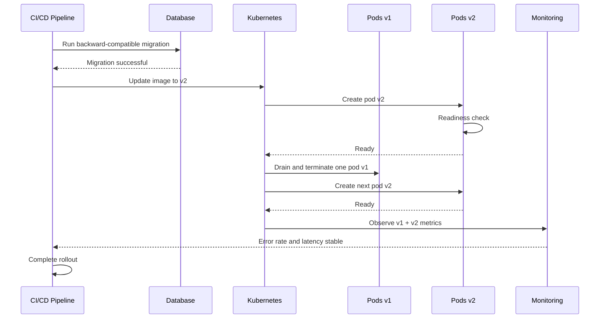
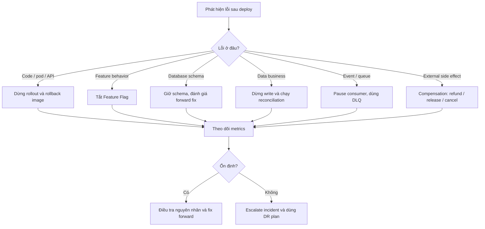
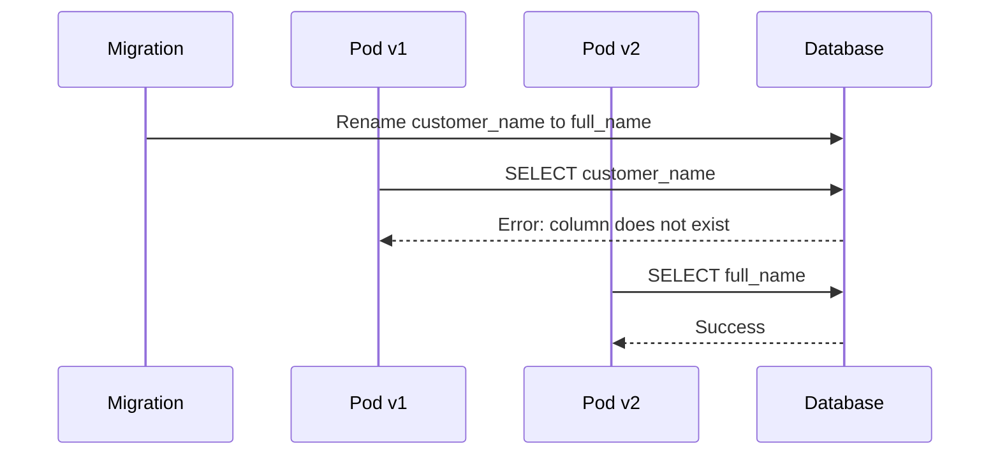

# Deployment Compatibility & Rollback trong Microservice

## 📋 Mục lục

- [1. Vấn đề cốt lõi](#1-vấn-đề-cốt-lõi)
  - [1.1. Vì sao rollback code chưa đủ](#11-vì-sao-rollback-code-chưa-đủ)
  - [1.2. Khi nào nhiều version cùng chạy](#12-khi-nào-nhiều-version-cùng-chạy)
- [2. Các loại compatibility cần bảo đảm](#2-các-loại-compatibility-cần-bảo-đảm)
  - [2.1. API compatibility](#21-api-compatibility)
  - [2.2. Database schema và data compatibility](#22-database-schema-và-data-compatibility)
  - [2.3. Event và message compatibility](#23-event-và-message-compatibility)
  - [2.4. Cache và session compatibility](#24-cache-và-session-compatibility)
  - [2.5. Configuration và secrets compatibility](#25-configuration-và-secrets-compatibility)
  - [2.6. External side effects](#26-external-side-effects)
- [3. Database Migration — Expand-Contract](#3-database-migration--expand-contract)
  - [3.1. Ví dụ migration nguy hiểm](#31-ví-dụ-migration-nguy-hiểm)
  - [3.2. Quy trình Expand-Contract an toàn](#32-quy-trình-expand-contract-an-toàn)
  - [3.3. Rollback code sau khi migration](#33-rollback-code-sau-khi-migration)
  - [3.4. Khi nào database rollback thật sự cần thiết](#34-khi-nào-database-rollback-thật-sự-cần-thiết)
  - [3.5. Chạy migration như một bước độc lập](#35-chạy-migration-như-một-bước-độc-lập)
- [4. Rolling Update khi v1 và v2 cùng chạy](#4-rolling-update-khi-v1-và-v2-cùng-chạy)
  - [4.1. Luồng triển khai](#41-luồng-triển-khai)
  - [4.2. Những quy tắc bắt buộc](#42-những-quy-tắc-bắt-buộc)
  - [4.3. Rollback trong Rolling Update](#43-rollback-trong-rolling-update)
  - [4.4. In-flight request và graceful shutdown](#44-in-flight-request-và-graceful-shutdown)
- [5. Blue-Green và Canary có giải quyết được vấn đề này không](#5-blue-green-và-canary-có-giải-quyết-được-vấn-đề-này-không)
  - [5.1. Blue-Green dùng chung database](#51-blue-green-dùng-chung-database)
  - [5.2. Blue-Green với hai database riêng](#52-blue-green-với-hai-database-riêng)
  - [5.3. Canary và shared state](#53-canary-và-shared-state)
- [6. Rollback các thành phần ngoài code](#6-rollback-các-thành-phần-ngoài-code)
  - [6.1. Database](#61-database)
  - [6.2. Message và event](#62-message-và-event)
  - [6.3. Cache và session](#63-cache-và-session)
  - [6.4. Configuration và secrets](#64-configuration-và-secrets)
  - [6.5. Infrastructure](#65-infrastructure)
  - [6.6. Business side effects](#66-business-side-effects)
- [7. Feature Flag — Tách deploy khỏi release](#7-feature-flag--tách-deploy-khỏi-release)
- [8. Quy trình rollback thực tế](#8-quy-trình-rollback-thực-tế)
  - [8.1. Trước khi deploy](#81-trước-khi-deploy)
  - [8.2. Khi phát hiện lỗi](#82-khi-phát-hiện-lỗi)
  - [8.3. Sau khi rollback](#83-sau-khi-rollback)
- [9. Ví dụ end-to-end — Đổi tên cột customer name thành full name](#9-ví-dụ-end-to-end--đổi-tên-cột-customer-name-thành-full-name)
- [10. Checklist](#10-checklist)
- [11. Anti-patterns](#11-anti-patterns)
- [12. Tổng kết](#12-tổng-kết)
- [13. Liên kết liên quan](#13-liên-kết-liên-quan)

## 1. Vấn đề cốt lõi

Trong một deployment hiện đại, việc đổi Docker image hoặc chuyển traffic chỉ là một phần của release. Một release có thể đồng thời thay đổi:

- Code và business logic.
- Database schema và cách dữ liệu được lưu.
- API contract giữa các service.
- Event hoặc message trên Kafka, RabbitMQ, SQS.
- Cache và session.
- Configuration và secrets.
- Infrastructure như Load Balancer, queue, DNS hoặc security rule.
- Side effect bên ngoài như charge payment, gửi email hoặc trừ tồn kho.

Nếu chỉ rollback code, các thành phần còn lại vẫn giữ trạng thái đã bị thay đổi.

```text
Rollback Docker image về v1
          │
          ├── Database đã thêm/xóa field vẫn giữ nguyên
          ├── Message v2 có thể đã nằm trong queue
          ├── Cache có thể đang chứa format của v2
          ├── Payment có thể đã được charge
          └── Event đã gửi ra ngoài không thể tự biến mất
```

### 1.1. Vì sao rollback code chưa đủ

Ví dụ v2 có business logic mới:

```text
v2 nhận đơn hàng
    → charge payment
    → ghi trạng thái PAYMENT_PENDING
```

Sau đó v2 bị lỗi và rollback về v1. Việc đổi image về v1 không thể tự động:

- Hoàn tiền cho payment đã charge.
- Đổi lại trạng thái đã ghi.
- Xóa event đã publish.
- Khôi phục dữ liệu đã thay đổi theo format mới.

Vì vậy cần phân biệt các khái niệm sau:

| Khái niệm | Ý nghĩa |
|---|---|
| **Deployment rollback** | Đưa traffic hoặc process về version code trước |
| **Schema rollback** | Đưa cấu trúc database về trạng thái cũ |
| **Data rollback** | Đưa các bản ghi đã thay đổi về dữ liệu cũ |
| **Business compensation** | Thực hiện hành động bù, ví dụ refund hoặc release inventory |
| **Infrastructure rollback** | Đưa cấu hình hạ tầng về revision trước |

Năm loại rollback này không phải lúc nào cũng thực hiện cùng nhau.

### 1.2. Khi nào nhiều version cùng chạy

Nhiều version cùng tồn tại trong các chiến lược sau:

| Strategy | v1 và v2 cùng chạy? | Đặc điểm |
|---|:---:|---|
| **Rolling Update** | Có | User có thể được route tới v1 hoặc v2 |
| **Canary** | Có | Một phần traffic đi tới v2 |
| **Blue-Green** | Có | Hai environment cùng tồn tại; thường chỉ một bên nhận production traffic |
| **Recreate** | Không | Dừng v1 rồi mới chạy v2, có downtime |

Trong Rolling Update, request có thể đi qua hai version khác nhau:

```text
                 ┌─────────┐
User A ─────────►│  v1 pod │──┐
                 └─────────┘  │
                              ├──► Shared Database
                 ┌─────────┐  │
User B ─────────►│  v2 pod │──┘
                 └─────────┘
```

Do đó, v1 và v2 phải cùng hiểu:

- Cùng API contract.
- Cùng database schema trong giai đoạn chuyển tiếp.
- Cùng format của data đã tồn tại.
- Cùng event/message mà service khác gửi tới.

## 2. Các loại compatibility cần bảo đảm

**Backward compatibility** là khả năng version mới vẫn hoạt động với client, dữ liệu hoặc dependency của version cũ.

Trong deployment, không chỉ có code cần backward compatible. Các contract khác cũng cần được thiết kế để hai version cùng tồn tại trong một khoảng thời gian.

### 2.1. API compatibility

Thay đổi an toàn thường là:

- Thêm endpoint mới.
- Thêm response field mới.
- Thêm optional request field.
- Giữ nguyên ý nghĩa của field cũ.
- Cho consumer cũ bỏ qua field mà nó không biết.

Ví dụ response có thể thêm field:

```json
{
  "id": 123,
  "name": "Keyboard",
  "price": 100,
  "category": "hardware"
}
```

Consumer cũ chỉ đọc `id`, `name` và `price` vẫn hoạt động.

Thay đổi nguy hiểm là:

```text
v1: price = 100 USD
v2: price = 100 cents
```

JSON vẫn hợp lệ nhưng ý nghĩa dữ liệu đã thay đổi. Đây là **semantic breaking change**, có thể làm v1 xử lý sai mà không báo lỗi rõ ràng.

Khi cần breaking change, dùng chiến lược nhiều phase:

```text
Phase 1 — Expand:
  Giữ API v1, thêm API v2

Phase 2 — Migrate:
  Chuyển từng consumer sang v2

Phase 3 — Contract:
  Xóa API v1 sau khi không còn consumer
```

Không nên xóa API v1 ngay khi v2 vừa được deploy. Trong thời gian Rolling Update, consumer cũ vẫn có thể tồn tại.

### 2.2. Database schema và data compatibility

Database có hai lớp compatibility:

1. **Schema compatibility** — v1 và v2 có thể query các column/table hiện có.
2. **Data compatibility** — dữ liệu do v2 ghi có thể được v1 đọc và xử lý đúng.

Chỉ thêm column mới chưa đủ. Ví dụ v2 ghi status mới:

```text
v1 hiểu: PENDING, PAID, CANCELLED
v2 ghi:  PAYMENT_REVIEW
```

Nếu v1 nhận `PAYMENT_REVIEW` mà không có logic xử lý, rollback code vẫn có thể gây lỗi nghiệp vụ.

Các nguyên tắc quan trọng:

- Thêm column mới trước khi deploy code dùng column đó.
- Ưu tiên column nullable hoặc có default phù hợp.
- Không xóa hoặc rename column đang được version cũ sử dụng.
- Không đổi ý nghĩa của dữ liệu trong cùng một field.
- Khi format dữ liệu thay đổi, cho v2 đọc được cả format cũ và mới.
- Backfill dữ liệu bằng job riêng, có thể retry và theo dõi tiến độ.
- Chỉ thực hiện destructive change sau khi hết rollback window.

### 2.3. Event và message compatibility

Trong event-driven architecture, code v2 có thể gửi message mà consumer v1 chưa hiểu:

```text
v2 Order Service ── order.created.v2 ──► v1 Notification Service
```

Cách xử lý:

- Chỉ thêm field mới, không đổi ý nghĩa field cũ.
- Consumer phải bỏ qua field không biết.
- Dùng version cho event khi format hoặc semantics thay đổi.
- Giữ producer hỗ trợ event cũ trong thời gian chuyển tiếp.
- Dùng DLQ cho message không parse hoặc không xử lý được.
- Dùng idempotency để retry không tạo side effect hai lần.
- Không xóa event version cũ ngay sau khi deploy producer mới.

Ví dụ:

```text
order.created.v1  — vẫn được publish trong giai đoạn chuyển tiếp
order.created.v2  — consumer mới có thể xử lý thêm warehouseId
```

Nếu v2 đã publish message ra ngoài, rollback code không thể xóa message đã được consumer xử lý. Trường hợp đó cần một **compensating event** nếu business cho phép.

### 2.4. Cache và session compatibility

Hai version có thể cùng dùng một cache key nhưng serialize dữ liệu khác nhau:

```text
v1 ghi user:123 theo format A
v2 ghi user:123 theo format B
v2 rollback
v1 đọc format B và lỗi
```

Các cách an toàn hơn:

```text
user:v1:123
user:v2:123
```

Hoặc:

- Invalidate cache khi thay đổi format.
- Cho v1 đọc được format v2 nếu có thể.
- Dùng cache key có schema version.
- Warm cache sau khi deploy.
- Không coi cache là source of truth.

Session cũng phải tương thích giữa hai version. Không nên để rollout làm toàn bộ user bị logout chỉ vì format session thay đổi.

### 2.5. Configuration và secrets compatibility

Trong Rolling Update, v1 và v2 có thể cùng đọc ConfigMap hoặc Secret.

Nếu xóa config cũ ngay khi thêm config mới:

```text
v2 cần PAYMENT_PROVIDER_URL_V2
v1 vẫn cần PAYMENT_PROVIDER_URL
config cũ bị xóa
→ v1 crash khi rollback
```

Quy trình an toàn:

1. Thêm config mới, giữ config cũ.
2. Deploy code hỗ trợ cả hai config.
3. Chuyển toàn bộ pod sang config mới.
4. Chờ hết rollback window.
5. Xóa config cũ.

Với secret rotation, nên giữ secret cũ và mới cùng tồn tại trong một khoảng thời gian. Không nên revoke secret cũ trước khi toàn bộ pod v1 đã được drain.

### 2.6. External side effects

Một số hành động không thể undo bằng deployment rollback:

- Charge thẻ hoặc ví điện tử.
- Gửi email, SMS hoặc push notification.
- Trừ hoặc reserve inventory.
- Tạo vận đơn với đơn vị vận chuyển.
- Publish event cho hệ thống khác.
- Gửi request tới một external provider.

Các hành động này cần thiết kế riêng:

- **Idempotency key** để retry không charge hai lần.
- **Transactional Outbox** để ghi database và publish event đáng tin cậy.
- **Saga** để quản lý nhiều local transaction.
- **Compensating action** như refund, release hoặc cancel.
- **Reconciliation job** để tìm và sửa trạng thái không nhất quán.

```text
Rollback code ≠ hoàn tác hành động đã xảy ra bên ngoài

Payment đã charge  ──► cần refund
Inventory đã reserve ──► cần release
Email đã gửi ──► không thể thu hồi, chỉ có thể gửi thông báo sửa
```

## 3. Database Migration — Expand-Contract

**Expand-Contract** là pattern thay đổi schema theo nhiều bước nhỏ để schema cũ và schema mới cùng tồn tại trong thời gian chuyển tiếp.

Mục tiêu là:

```text
v1 + schema cũ     vẫn chạy được
v1 + schema mở rộng vẫn chạy được
v2 + schema mở rộng vẫn chạy được
rollback v2 → v1   vẫn an toàn
```

### 3.1. Ví dụ migration nguy hiểm

Giả sử database hiện tại có:

```text
orders.customer_name
```

Cách nguy hiểm:

```sql
ALTER TABLE orders
RENAME COLUMN customer_name TO full_name;
```

Trong Rolling Update:

```text
Pod v1 vẫn chạy
v1 đọc customer_name
column đã bị rename
→ v1 lỗi ngay lập tức
```

Rollback image về v1 cũng không giải quyết được vì schema đã bị thay đổi theo hướng breaking.

Các thao tác thường nguy hiểm:

```sql
DROP COLUMN old_column;
RENAME COLUMN old_column TO new_column;
ALTER COLUMN type theo hướng không tương thích;
Đổi enum hoặc status mà v1 không hiểu;
Đổi format JSON lưu trong một column;
```

### 3.2. Quy trình Expand-Contract an toàn

Ví dụ đổi `customer_name` thành `full_name`.

#### Phase 1 — Expand schema

```sql
ALTER TABLE orders
ADD COLUMN full_name VARCHAR(255) NULL;
```

Chưa xóa `customer_name`. v1 vẫn hoạt động.

#### Phase 2 — Deploy code tương thích

v2 có thể dùng logic:

```text
Khi đọc:
  nếu full_name có giá trị → dùng full_name
  nếu chưa có → fallback về customer_name

Khi ghi:
  ghi customer_name
  ghi full_name
```

Trong giai đoạn này:

```text
v1 → đọc/ghi customer_name
v2 → đọc/ghi customer_name và full_name
```

Cả hai version cùng dùng database mà không phá nhau.

#### Phase 3 — Backfill dữ liệu cũ

```sql
UPDATE orders
SET full_name = customer_name
WHERE full_name IS NULL;
```

Với bảng lớn, nên chạy theo batch:

- Chia theo primary key hoặc thời gian.
- Có checkpoint để resume.
- Giới hạn tốc độ để không ảnh hưởng production.
- Ghi metrics về số bản ghi đã xử lý và số lỗi.

#### Phase 4 — Chuyển sang field mới

Sau khi backfill xong và đã xác nhận dữ liệu hợp lệ:

```text
v2 đọc full_name
v2 vẫn có thể fallback customer_name trong một thời gian
```

#### Phase 5 — Contract

Chỉ sau khi:

- Không còn pod v1.
- Không còn consumer cũ.
- Không cần rollback về code cũ.
- Backfill đã verify.
- Backup và restore procedure đã sẵn sàng.

mới xóa field cũ:

```sql
ALTER TABLE orders
DROP COLUMN customer_name;
```

Sơ đồ:

```text
┌──────────────┐
│ 1. Add field │  full_name nullable
└──────┬───────┘
       ▼
┌───────────────────────┐
│ 2. Deploy compatible  │  v1 + v2 cùng chạy
│    code                │
└──────┬────────────────┘
       ▼
┌───────────────────────┐
│ 3. Dual-write         │  Ghi old + new field
│    và backfill         │
└──────┬────────────────┘
       ▼
┌───────────────────────┐
│ 4. Migrate readers    │  Đọc field mới
└──────┬────────────────┘
       ▼
┌───────────────────────┐
│ 5. Contract           │  Xóa field cũ sau rollback window
└───────────────────────┘
```

### 3.3. Rollback code sau khi migration

Nếu migration được thiết kế theo Expand-Contract, rollback thường chỉ cần rollback code:

```text
v2 code có bug
    ↓
rollback image về v1
    ↓
v1 tiếp tục đọc customer_name
    ↓
full_name vẫn tồn tại nhưng không gây lỗi
```

Không cần chạy `DROP COLUMN full_name` hoặc một `down migration` ngay lập tức.

Đây là nguyên tắc quan trọng:

> Database nên giữ trạng thái tương thích với cả version cũ và version mới trong suốt rollback window.

Tuy nhiên, schema compatibility chưa đảm bảo data compatibility. Ví dụ v2 ghi status mới:

```text
v2 ghi PAYMENT_REVIEW
v1 không hiểu PAYMENT_REVIEW
```

Trong trường hợp này cần:

- Không cho v2 ghi giá trị mà v1 không hiểu trước khi rollback window kết thúc.
- Hoặc cập nhật v1 để tolerant với giá trị mới.
- Hoặc dùng feature flag để chưa bật business path mới.
- Hoặc nếu không thể tương thích, không dùng Rolling Update cho change đó.

### 3.4. Khi nào database rollback thật sự cần thiết

Database rollback có thể cần khi migration:

- Làm hỏng schema do bug nghiêm trọng.
- Tạo index sai gây ảnh hưởng lớn.
- Ghi dữ liệu sai hàng loạt.
- Không thể phục hồi bằng code hoặc forward migration.
- Cần khôi phục sau sự cố corruption.

Các lựa chọn:

| Cách xử lý | Khi dùng | Rủi ro |
|---|---|---|
| **Down migration** | Thay đổi nhỏ và reversible | Có thể mất data hoặc fail do data mới |
| **Forward fix** | Phần lớn lỗi migration thông thường | Cần viết migration mới |
| **Point-in-Time Recovery** | Data/schema đã hỏng nghiêm trọng | Có thể mất các write sau thời điểm restore |
| **Snapshot restore** | Khôi phục database lớn hoặc disaster | Cần downtime hoặc data reconciliation |
| **Compensation** | Business data sai nhưng schema còn tốt | Logic bù có thể phức tạp |

Trong production, ưu tiên thường là:

```text
Giữ schema mở rộng
    ↓
Rollback code nếu cần
    ↓
Phân tích nguyên nhân
    ↓
Fix forward bằng code/migration mới
```

Không nên tự động chạy destructive down migration chỉ vì deployment bị rollback.

### 3.5. Chạy migration như một bước độc lập

Không nên để mọi application pod tự chạy migration khi startup:

```text
Pod v1 start → migration?
Pod v2 start → migration?
Pod v2 khác start → migration?
```

Cách này có thể gây race condition và khiến rollback khó đoán.

Nên dùng một migration job riêng:

```text
Build artifact
    ↓
Run migration job một lần
    ↓
Verify migration
    ↓
Deploy application
    ↓
Post-deploy verification
```

Migration job nên có:

- Migration version table.
- Lock để chỉ một job chạy tại một thời điểm.
- Idempotent hoặc có cơ chế phát hiện đã chạy.
- Timeout và retry có kiểm soát.
- Backup/PITR trước destructive operation.
- Log và metric rõ ràng.
- Manual approval cho migration lớn.

## 4. Rolling Update khi v1 và v2 cùng chạy

### 4.1. Luồng triển khai

Một Rolling Update an toàn có thể gồm các bước sau:



Trong thời gian này, service phải chấp nhận request từ cả v1 và v2.

Một cấu hình Kubernetes thường dùng:

```yaml
strategy:
  type: RollingUpdate
  rollingUpdate:
    maxSurge: 1
    maxUnavailable: 0
```

Ý nghĩa:

- `maxSurge: 1`: tạo thêm tối đa một pod mới trong quá trình rollout.
- `maxUnavailable: 0`: không chủ động làm giảm số pod available.
- `readinessProbe`: chỉ route traffic tới pod đã sẵn sàng.

Các tham số này giúp giảm downtime, nhưng không tự bảo đảm backward compatibility.

### 4.2. Những quy tắc bắt buộc

Trước khi cho v2 nhận traffic, cần kiểm tra:

1. **API**
   - v2 gọi được downstream version cũ.
   - downstream vẫn phục vụ request từ v1.
   - Response field và error code không bị breaking.

2. **Database**
   - Schema đã expand trước khi deploy code.
   - v1 và v2 cùng query được database.
   - v2 không ghi data format mà v1 không hiểu.

3. **Event/message**
   - Consumer v1 hiểu message do v2 publish.
   - Consumer v2 hiểu message cũ đang nằm trong queue.
   - Consumer có idempotency.

4. **Cache/session**
   - Hai version hiểu cùng cache hoặc dùng versioned key.
   - Session không bị invalidate ngoài ý muốn.

5. **Config/secrets**
   - Config mới được thêm trước khi code mới dùng.
   - Config cũ vẫn tồn tại trong rollback window.

6. **Side effects**
   - Payment, inventory và external call có idempotency.
   - Có compensation nếu workflow thất bại giữa chừng.

7. **Observability**
   - Có metric tách theo version.
   - Có log version, commit SHA hoặc image digest.
   - Có alert cho cả technical metrics và business metrics.

### 4.3. Rollback trong Rolling Update

Khi phát hiện lỗi:

```text
v1 ─┐
    ├── traffic hiện tại
v2 ─┘
```

Có thể dừng rollout và rollback Deployment:

```bash
kubectl rollout pause deployment/order-service
kubectl rollout undo deployment/order-service
kubectl rollout status deployment/order-service
```

Kubernetes sẽ tạo lại các pod v1 và dần drain pod v2.

Trong khi rollback, một lần nữa v1 và v2 có thể cùng tồn tại. Vì vậy, schema và data vẫn phải tương thích với cả hai version.

Quy trình rollback nên là:

```text
1. Dừng rollout
2. Giảm hoặc ngừng promotion traffic
3. Rollback image/config về revision trước
4. Giữ schema mở rộng
5. Theo dõi error rate và business metrics
6. Tìm nguyên nhân
7. Fix forward hoặc deploy version đã sửa
```

Không nên mặc định làm:

```text
kubectl rollout undo
    ↓
DROP COLUMN mới ngay lập tức
```

### 4.4. In-flight request và graceful shutdown

Trong lúc pod v2 bị thay thế hoặc rollback, có thể vẫn có request đang xử lý. Cần:

- Đưa pod về `NotReady` trước khi terminate.
- Cho Load Balancer ngừng gửi request mới.
- Chờ request hiện tại hoàn tất trong `terminationGracePeriodSeconds`.
- Đóng consumer sau khi drain message đang xử lý.
- Không để transaction bị cắt giữa chừng nếu có thể.
- Dùng idempotency cho request có thể retry.
- Thiết lập timeout rõ ràng cho downstream call.

```text
Pod v2 nhận SIGTERM
       ↓
Readiness = false
       ↓
Không nhận request mới
       ↓
Hoàn tất request đang xử lý
       ↓
Commit hoặc rollback local transaction
       ↓
Shutdown
```

Graceful shutdown không giải quyết breaking schema, nhưng giúp tránh request bị cắt và message bị xử lý nửa chừng.

## 5. Blue-Green và Canary có giải quyết được vấn đề này không

Blue-Green và Canary giảm một số rủi ro deployment, nhưng không tự động giải quyết vấn đề shared state.

### 5.1. Blue-Green dùng chung database

Mô hình thường gặp:

```text
                 ┌──────────────┐
100% traffic ───►│ Blue v1      │──┐
                 └──────────────┘  │
                                   ├──► Shared Database
                 ┌──────────────┐  │
0% traffic ─────►│ Green v2     │──┘
                 └──────────────┘
```

Green có thể được test trước khi switch traffic, nhưng Green vẫn có thể:

- Dùng chung database với Blue.
- Đọc cache do Blue tạo.
- Nhận message từ queue.
- Ghi event hoặc side effect nếu không giới hạn traffic.

Nếu Green đã migrate database theo hướng breaking, Blue không còn rollback được an toàn.

Vì vậy, Blue-Green vẫn cần:

- Expand-Contract migration.
- Backward-compatible data format.
- Feature flag cho business logic mới.
- Giới hạn side effect trong giai đoạn test Green.
- Auto rollback dựa trên metrics.

Blue-Green giúp rollback **traffic/code** nhanh hơn, không làm database tự quay lại trạng thái cũ.

### 5.2. Blue-Green với hai database riêng

Một số hệ thống tạo Green database riêng:

```text
Blue Service ──► Blue DB

Green Service ─► Green DB
```

Muốn cutover an toàn phải đồng bộ dữ liệu:

```text
Blue DB ── full load + CDC ──► Green DB
```

Nhưng sau cutover:

```text
Green DB đã nhận write mới
Blue DB có thể bị stale
```

Do đó, không thể luôn luôn rollback bằng cách đổi connection string về Blue DB. Có thể mất các write phát sinh trên Green.

Rollback database riêng cần một cơ chế như:

- Reverse replication.
- Bidirectional replication có conflict resolution.
- Tạm dừng write trong lúc cutover.
- Reconcile dữ liệu trước khi switch ngược.
- Compensation cho các transaction đã phát sinh.

Nếu tài liệu chỉ nói “switch connection string về Blue DB để rollback”, cần bổ sung điều kiện rằng dữ liệu trên Green phải được đồng bộ hoặc xử lý trước.

### 5.3. Canary và shared state

Canary có mô hình:

```text
95% traffic ──► v1 ──┐
                     ├──► Shared Database
5% traffic ───► v2 ──┘
```

Canary giảm blast radius của lỗi code, nhưng v1 và v2 vẫn cùng đọc/ghi:

- Database.
- Cache.
- Queue.
- Event bus.
- External provider.

Do đó, Canary đặc biệt cần:

- Metrics theo canary và stable version.
- Contract compatibility.
- Idempotent write.
- Kiểm soát side effect của traffic canary.
- Quy tắc rollback khi error rate, latency hoặc business metric vượt ngưỡng.

## 6. Rollback các thành phần ngoài code

### 6.1. Database

| Tình huống | Cách xử lý ưu tiên |
|---|---|
| Thêm column/index an toàn | Giữ nguyên schema, rollback code nếu cần |
| Data backfill sai | Dừng job, xác định phạm vi, chạy compensation hoặc restore có chọn lọc |
| Rename/drop column sai | Restore/PITR hoặc forward fix; không rollback mù |
| Đổi data format | Hỗ trợ cả format cũ và mới, migrate dần |
| Data business sai | Reconciliation hoặc compensating transaction |

Database migration nên **forward-only** trong đa số trường hợp:

```text
V1 schema → V2 schema → V3 schema
```

Thay vì thường xuyên làm:

```text
V2 schema → V1 schema → V2 schema
```

Lý do là dữ liệu đã được ghi theo schema mới có thể không thể chuyển ngược losslessly.

### 6.2. Message và event

Message đã publish có thể:

- Đang nằm trong queue.
- Đã được consumer xử lý.
- Đã tạo side effect ở service khác.

Rollback producer không xóa được các message này.

Chiến lược xử lý:

- Giữ consumer v1 tương thích với event v2 trong thời gian chuyển tiếp.
- Giữ consumer v2 tương thích với event v1 cũ trong queue.
- Dùng schema registry nếu hệ thống cần kiểm tra schema tự động.
- Dùng DLQ để cô lập message lỗi.
- Dùng replay có kiểm soát khi cần xử lý lại.
- Dùng compensating event thay vì cố xóa event đã phát.

### 6.3. Cache và session

Cache thường không cần rollback dữ liệu như database. Khi format không tương thích:

```text
1. Dừng ghi format mới
2. Rollback code
3. Invalidate cache không tương thích
4. Warm cache bằng code cũ
```

Session cần thận trọng hơn vì xóa session có thể làm user logout. Nên version hóa session hoặc cho hai version cùng đọc được session trong một thời gian.

### 6.4. Configuration và secrets

Config cũng phải được quản lý như một contract:

```text
Add config mới
    ↓
Code hỗ trợ cũ + mới
    ↓
Deploy toàn bộ pod
    ↓
Xóa config cũ sau rollback window
```

Khi rollback:

- Revert config về revision tương thích với code cũ.
- Kiểm tra secret cũ còn valid.
- Không revoke key cũ quá sớm.
- Đảm bảo service có thể khởi động với bộ config đã rollback.

### 6.5. Infrastructure

Infrastructure có thể gồm:

- Kubernetes Deployment và Service.
- Ingress hoặc Load Balancer rule.
- Target Group.
- IAM policy.
- Security Group.
- Queue và retention policy.
- DNS record.
- Autoscaling policy.

Nên quản lý bằng IaC và version control:

```text
Git commit A → infrastructure v1
Git commit B → infrastructure v2
```

Tuy nhiên, rollback IaC cũng cần đánh giá stateful resource. Không nên tự động xóa database hoặc queue chỉ vì một Terraform plan cũ được apply lại.

### 6.6. Business side effects

Business side effect thường cần **compensation**, không phải rollback kỹ thuật.

Ví dụ Saga cho checkout:

```text
1. Create Order
2. Reserve Inventory
3. Charge Payment
4. Create Shipment
```

Nếu bước 4 thất bại:

```text
Compensate 3: Refund Payment
Compensate 2: Release Inventory
Compensate 1: Cancel Order
```

Đây không phải là transaction rollback xuyên nhiều database. Đây là chuỗi local transaction và compensating action.

## 7. Feature Flag — Tách deploy khỏi release

**Feature Flag** cho phép deploy code trước nhưng bật business behavior sau.

```text
Deploy code v2
    ↓
Feature mới vẫn OFF
    ↓
Kiểm tra compatibility và metrics
    ↓
Bật cho internal user hoặc 1% traffic
    ↓
Mở rộng dần
```

Feature Flag hữu ích khi:

- Code mới và schema mới đã được deploy nhưng chưa muốn bật logic mới.
- Cần rollback business behavior mà không rollback toàn bộ image.
- Muốn canary theo nhóm user.
- Muốn giảm rủi ro khi thay đổi workflow có side effect.

Tuy nhiên, Feature Flag cũng cần quản lý:

- Owner rõ ràng.
- Default value an toàn.
- Audit log.
- Expiry date.
- Test cả trạng thái ON và OFF.
- Không để flag cũ tồn tại vĩnh viễn.

## 8. Quy trình rollback thực tế

### 8.1. Trước khi deploy

Mỗi release nên trả lời được:

```text
- Image digest nào đang deploy?
- Code version nào đang chạy?
- Migration nào sẽ chạy?
- Schema cũ có còn tương thích không?
- Có thể rollback code về revision nào?
- Nếu database không rollback được thì fix forward ra sao?
- Event v2 có consumer cũ nào không?
- Cache/session có đổi format không?
- External side effect nào có thể đã xảy ra?
- Ai là owner và ai quyết định rollback?
```

Cần chuẩn bị:

- Backup hoặc PITR đã kiểm tra.
- Migration đã test trên dữ liệu gần giống production.
- Rollback runbook.
- Dashboard theo version.
- Alert cho error rate, latency và business metric.
- Contract test.
- Smoke test và acceptance test.
- Cơ chế pause rollout.

### 8.2. Khi phát hiện lỗi

Phân loại lỗi trước khi hành động:

| Loại lỗi | Hành động ban đầu |
|---|---|
| Pod crash/readiness fail | Dừng rollout, rollback code |
| API 5xx tăng | Dừng promotion, rollback hoặc tắt feature flag |
| Database query chậm | Giảm traffic, kiểm tra index/query, chưa vội drop schema |
| Data sai | Dừng write path, xác định phạm vi, chuẩn bị compensation |
| Event không xử lý được | Pause consumer, đưa message vào DLQ, giữ producer tương thích |
| Payment/inventory sai | Kích hoạt runbook compensation và reconciliation |
| Infrastructure sai | Revert IaC/routing có kiểm soát |

Một flow tổng quát:



### 8.3. Sau khi rollback

Rollback thành công về mặt traffic chưa có nghĩa incident đã kết thúc. Cần:

- Xác nhận pod cũ healthy.
- Kiểm tra error rate và latency đã giảm.
- Kiểm tra queue lag và DLQ.
- Kiểm tra database connection, lock và replication lag.
- Kiểm tra business metric như order, payment, inventory.
- Tìm các side effect đã xảy ra trong khoảng thời gian v2 chạy.
- Chạy reconciliation nếu cần.
- Giữ lại log, trace và image digest để điều tra.
- Xác định schema/config nào không được rollback.
- Viết post-incident review.

## 9. Ví dụ end-to-end — Đổi tên cột customer name thành full name

### Bối cảnh

Service `Order` đang chạy v1:

```text
v1 đọc và ghi orders.customer_name
```

Muốn chuyển sang v2:

```text
v2 đọc và ghi orders.full_name
```

### Cách làm sai



Trong Rolling Update, v1 vẫn tồn tại nên hệ thống bị lỗi. Nếu rollback code về v1, v1 vẫn không thể hoạt động vì column cũ đã bị rename.

### Cách làm đúng

#### Bước 1 — Add field mới

```sql
ALTER TABLE orders
ADD COLUMN full_name VARCHAR(255) NULL;
```

#### Bước 2 — Deploy v2 tương thích

```text
v1:
  read customer_name
  write customer_name

v2:
  read full_name nếu có, fallback customer_name
  write cả customer_name và full_name
```

#### Bước 3 — Backfill

```sql
UPDATE orders
SET full_name = customer_name
WHERE full_name IS NULL;
```

#### Bước 4 — Verify

Kiểm tra:

```text
- Không còn full_name NULL ngoài trường hợp hợp lệ
- v2 đọc được cả dữ liệu mới và cũ
- v1 vẫn xử lý được dữ liệu do v2 tạo
- Error rate ổn định
- Rollback test đã chạy trên staging
```

#### Bước 5 — Contract sau rollback window

Khi không còn nhu cầu rollback v1:

```sql
ALTER TABLE orders
DROP COLUMN customer_name;
```

### Nếu v2 lỗi ở bước 2 hoặc 3

Có thể rollback code về v1:

```text
v2 image → v1 image
full_name vẫn giữ lại
customer_name vẫn giữ lại
```

Không cần rollback schema.

### Nếu v2 đã bị contract và xóa `customer_name`

Lúc này rollback image về v1 không còn an toàn. Các lựa chọn là:

1. Deploy một version tương thích trung gian.
2. Khôi phục column bằng migration mới.
3. Restore database từ backup/PITR nếu dữ liệu đã bị ảnh hưởng.
4. Reconcile dữ liệu phát sinh trong thời gian sự cố.
5. Fix forward thay vì rollback về v1.

Đây là lý do không nên contract ngay sau khi deploy v2. Cần có **rollback window** rõ ràng.

## 10. Checklist

### Compatibility

- [ ] v1 và v2 có thể cùng chạy trong một khoảng thời gian.
- [ ] API mới không phá consumer cũ.
- [ ] Event mới không phá consumer cũ.
- [ ] Consumer mới xử lý được message cũ còn trong queue.
- [ ] Data format mới không làm v1 xử lý sai.
- [ ] Cache/session có version hoặc backward compatibility.
- [ ] Config mới được thêm trước khi code mới sử dụng.
- [ ] Secret rotation có thời gian overlap.

### Database

- [ ] Migration chạy trước code mới.
- [ ] Migration là backward compatible.
- [ ] Không rename/drop column đang được dùng.
- [ ] Có Expand-Contract plan cho breaking schema change.
- [ ] Backfill có checkpoint, retry và metric.
- [ ] Migration chạy như job độc lập, không chạy đua giữa các pod.
- [ ] Có backup/PITR và đã kiểm tra restore.
- [ ] Biết rõ database có rollback được hay phải fix forward.
- [ ] Chưa contract trước khi hết rollback window.

### Deployment

- [ ] Artifact dùng immutable tag hoặc image digest.
- [ ] Readiness/liveness probe được cấu hình.
- [ ] Graceful shutdown và connection draining hoạt động.
- [ ] `maxUnavailable` và `maxSurge` phù hợp.
- [ ] Có thể pause rollout.
- [ ] Có rollback command hoặc traffic switch đã test.
- [ ] Có smoke test, contract test và acceptance test.
- [ ] Có metrics phân biệt v1/v2.

### Rollback

- [ ] Có phân biệt deployment rollback và data compensation.
- [ ] Có runbook cho database failure.
- [ ] Có runbook cho message/DLQ.
- [ ] Có runbook cho payment, inventory hoặc external side effect.
- [ ] Có owner quyết định rollback.
- [ ] Đã test rollback trên staging.
- [ ] Đã xác định rollback window.
- [ ] Có kế hoạch fix forward nếu database không thể rollback.
- [ ] Có reconciliation sau khi rollback.

## 11. Anti-patterns

### 11.1. Rollback code rồi drop schema ngay

```text
v2 lỗi
→ rollout undo
→ drop column mới
```

Sai vì v1/v2 có thể vẫn còn request, dữ liệu mới có thể đã được ghi và service khác có thể đã dùng schema mới.

### 11. Migration destructive trước khi deploy code

```sql
DROP COLUMN customer_name;
```

rồi mới deploy code v2 là không an toàn với Rolling Update và Canary.

### 11. Down migration tự động sau mọi deployment failure

Không phải deployment failure nào cũng cần schema rollback. Down migration có thể làm mất dữ liệu hoặc khiến dữ liệu không thể chuyển ngược.

### 11. Chỉ theo dõi HTTP 200

HTTP 200 không chứng minh business flow đúng. Cần theo dõi thêm:

- Payment success rate.
- Order creation success rate.
- Inventory reservation success rate.
- Queue lag.
- Duplicate event.
- Reconciliation mismatch.

### 11. Cho mỗi pod tự chạy migration

Nhiều pod tự chạy migration có thể tạo race condition, lock lâu và rollback khó đoán. Hãy dùng migration job riêng.

### 11. Dùng `latest` cho image

Nếu không biết chính xác image digest đang chạy, rollback sẽ không reproducible.

Nên dùng:

```text
order-service:git-a1b2c3d
order-service@sha256:...
```

### 11. Nghĩ Blue-Green giải quyết mọi vấn đề

Blue-Green giúp chuyển traffic và rollback code nhanh. Nó không tự rollback:

- Database.
- Message đã gửi.
- Cache incompatibility.
- Payment đã charge.
- Inventory đã reserve.
- Data đã ghi theo format mới.

## 12. Tổng kết

Các nguyên tắc quan trọng nhất:

1. **Rollback code không đồng nghĩa rollback toàn bộ hệ thống.**
2. Khi Rolling Update hoặc Canary, v1 và v2 phải tương thích với nhau.
3. Database migration nên theo **Expand-Contract**.
4. Thường rollback code nhưng giữ schema mở rộng, thay vì rollback database ngay.
5. Destructive migration nên chạy sau khi hết rollback window.
6. Database rollback có thể làm mất dữ liệu, vì vậy thường ưu tiên **fix forward**.
7. Event, cache, session, config và external side effect cũng cần deployment compatibility.
8. Business side effect thường xử lý bằng **compensation**, không phải `kubectl rollout undo`.
9. Blue-Green và Canary giảm blast radius hoặc giúp switch traffic nhanh, nhưng không tự giải quyết shared state.
10. Mọi release quan trọng cần có rollback plan, compensation plan và reconciliation plan.

Câu hỏi cần trả lời trước mỗi release là:

> Nếu rollback image về v1 ngay bây giờ, v1 có đọc được database, event, cache, config và dữ liệu mà v2 vừa tạo không?

Nếu câu trả lời là “không”, release đó chưa sẵn sàng cho Rolling Update hoặc Canary.

## 13. Liên kết liên quan

- [04 — Autonomy & Independence](04-autonomy-independence.md) — Backward Compatibility, Independent Deployment và Consumer-Driven Contract Testing
- [06 — Inter-Service Communication](06-inter-service-communication.md) — Event Versioning, Outbox và Saga
- [09 — Data Management](09-data-management.md) — Saga, Compensation và Transactional Outbox
- [13 — Orchestration](13-orchestration.md) — Kubernetes Rolling Update và Rollback
- [14 — CI/CD & Deployment](14-cicd-deployment.md) — Deployment Strategies và Database Migration trong CI/CD
- [17 — Design Patterns](17-design-patterns.md) — Saga, Outbox, Blue-Green và Canary
- [20 — Data Management trên AWS](20-aws-data-management.md) — RDS Schema Migration và Blue-Green Database Migration
- [24 — CI/CD & Deployment Strategies trên AWS](24-aws-cicd-deployment.md) — Blue-Green ECS, Canary Lambda/EKS và Auto Rollback
- [25 — Case Study: E-Commerce Platform](25-case-study-ecommerce.md) — Rollback, Outbox, Saga và deployment strategy theo từng service
