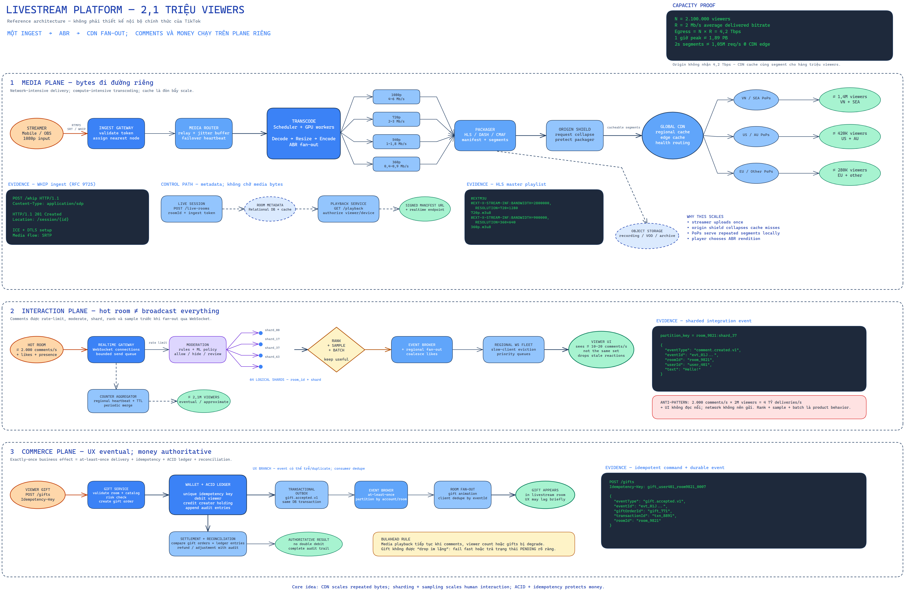
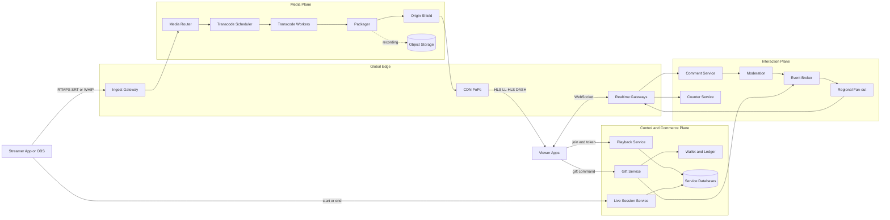
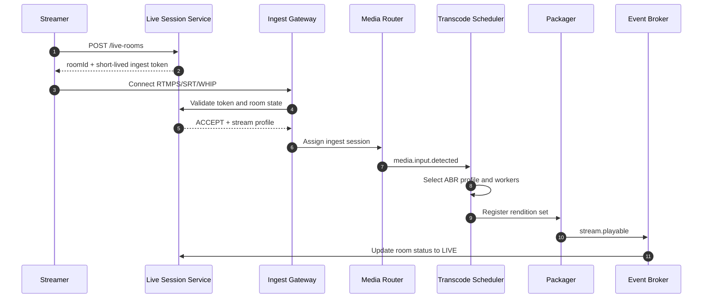
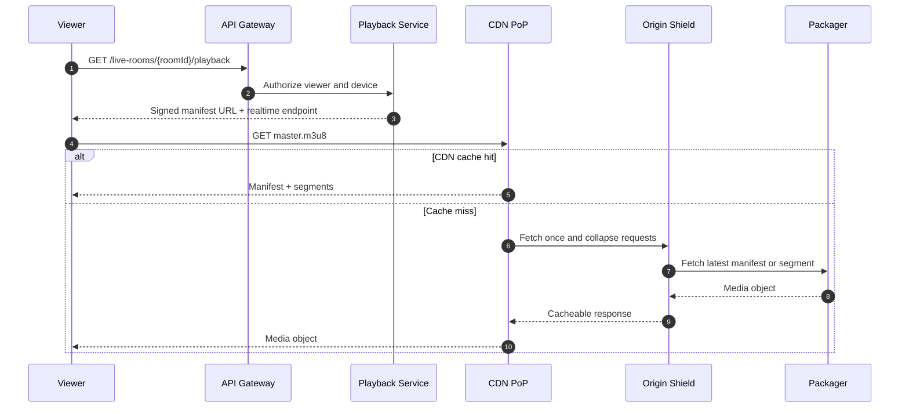
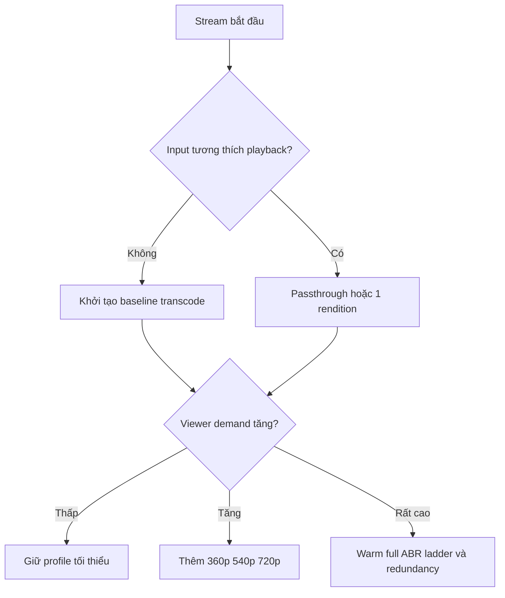
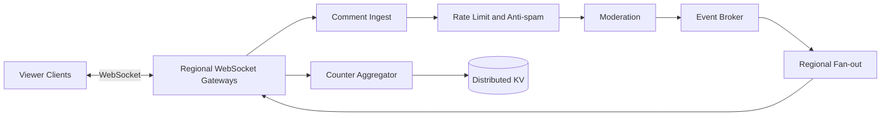
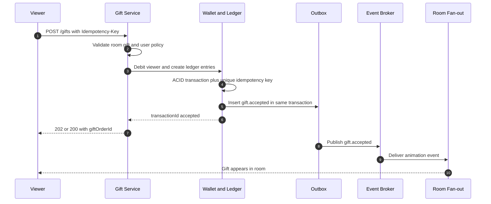

# 🎥 Case Study: Thiết kế nền tảng Livestream cho 2,1 triệu người xem đồng thời

## 📋 Mục lục

- [1. Phạm vi và kết luận nhanh](#1-phạm-vi-và-kết-luận-nhanh)
  - [1.1. Đây không phải kiến trúc chính thức của TikTok](#11-đây-không-phải-kiến-trúc-chính-thức-của-tiktok)
  - [1.2. Kết luận cốt lõi](#12-kết-luận-cốt-lõi)
- [2. Yêu cầu và giả định tải](#2-yêu-cầu-và-giả-định-tải)
  - [2.1. Functional Requirements](#21-functional-requirements)
  - [2.2. Non-Functional Requirements](#22-non-functional-requirements)
  - [2.3. Hai dạng tải hoàn toàn khác nhau](#23-hai-dạng-tải-hoàn-toàn-khác-nhau)
- [3. Chuẩn hóa các khái niệm trong bài talk](#3-chuẩn-hóa-các-khái-niệm-trong-bài-talk)
  - [3.1. Transcoding và ABR](#31-transcoding-và-abr)
  - [3.2. Ingest không đồng nghĩa playback](#32-ingest-không-đồng-nghĩa-playback)
  - [3.3. Object Storage không phải Block Storage](#33-object-storage-không-phải-block-storage)
  - [3.4. Microservice không phải kiểu scaling thứ ba](#34-microservice-không-phải-kiểu-scaling-thứ-ba)
  - [3.5. Message broker không chở media thô](#35-message-broker-không-chở-media-thô)
- [4. Domain và ranh giới service](#4-domain-và-ranh-giới-service)
  - [4.1. Ba plane của hệ thống](#41-ba-plane-của-hệ-thống)
  - [4.2. Bounded Context](#42-bounded-context)
  - [4.3. Service Catalog](#43-service-catalog)
- [5. Kiến trúc tổng thể](#5-kiến-trúc-tổng-thể)
  - [5.1. Sơ đồ kiến trúc](#51-sơ-đồ-kiến-trúc)
  - [5.2. Luồng start stream](#52-luồng-start-stream)
  - [5.3. Luồng viewer join](#53-luồng-viewer-join)
- [6. Media pipeline](#6-media-pipeline)
  - [6.1. Ingest](#61-ingest)
  - [6.2. Transcoding và ABR ladder](#62-transcoding-và-abr-ladder)
  - [6.3. Packaging và segment](#63-packaging-và-segment)
  - [6.4. Origin và CDN nhiều tầng](#64-origin-và-cdn-nhiều-tầng)
  - [6.5. Playback và lựa chọn protocol](#65-playback-và-lựa-chọn-protocol)
  - [6.6. Recording và VOD](#66-recording-và-vod)
- [7. Capacity Planning cho 2,1 triệu viewers](#7-capacity-planning-cho-21-triệu-viewers)
  - [7.1. Công thức băng thông](#71-công-thức-băng-thông)
  - [7.2. Phép tính minh họa](#72-phép-tính-minh-họa)
  - [7.3. Vì sao origin không chịu 4,2 Tbps](#73-vì-sao-origin-không-chịu-42-tbps)
  - [7.4. Phân phối tải không đều](#74-phân-phối-tải-không-đều)
  - [7.5. Chi phí không thể suy ra từ một con số](#75-chi-phí-không-thể-suy-ra-từ-một-con-số)
- [8. Bài toán một triệu streams nhỏ](#8-bài-toán-một-triệu-streams-nhỏ)
  - [8.1. Bottleneck chuyển từ egress sang compute](#81-bottleneck-chuyển-từ-egress-sang-compute)
  - [8.2. On-demand transcoding](#82-on-demand-transcoding)
  - [8.3. Passthrough và client-side encoding](#83-passthrough-và-client-side-encoding)
  - [8.4. Scheduling và admission control](#84-scheduling-và-admission-control)
- [9. Comments likes và viewer count](#9-comments-likes-và-viewer-count)
  - [9.1. Kiến trúc interaction plane](#91-kiến-trúc-interaction-plane)
  - [9.2. Hot room và chiến lược partition](#92-hot-room-và-chiến-lược-partition)
  - [9.3. Sampling ranking và batching](#93-sampling-ranking-và-batching)
  - [9.4. Viewer count gần đúng](#94-viewer-count-gần-đúng)
  - [9.5. Backpressure](#95-backpressure)
- [10. Gift donation và wallet](#10-gift-donation-và-wallet)
  - [10.1. Tách UX event khỏi financial ledger](#101-tách-ux-event-khỏi-financial-ledger)
  - [10.2. Luồng xử lý idempotent](#102-luồng-xử-lý-idempotent)
  - [10.3. Consistency và reconciliation](#103-consistency-và-reconciliation)
  - [10.4. Multi-region và data residency](#104-multi-region-và-data-residency)
- [11. Resilience và graceful degradation](#11-resilience-và-graceful-degradation)
  - [11.1. Bulkhead giữa các plane](#111-bulkhead-giữa-các-plane)
  - [11.2. Thứ tự degrade](#112-thứ-tự-degrade)
  - [11.3. Failover media](#113-failover-media)
  - [11.4. Retry Circuit Breaker và Load Shedding](#114-retry-circuit-breaker-và-load-shedding)
- [12. Data Management](#12-data-management)
  - [12.1. Chọn data store theo workload](#121-chọn-data-store-theo-workload)
  - [12.2. Ownership và event contracts](#122-ownership-và-event-contracts)
  - [12.3. Lifecycle và retention](#123-lifecycle-và-retention)
- [13. Security và Trust and Safety](#13-security-và-trust-and-safety)
  - [13.1. Bảo vệ ingest](#131-bảo-vệ-ingest)
  - [13.2. Bảo vệ playback](#132-bảo-vệ-playback)
  - [13.3. Chống abuse và moderation](#133-chống-abuse-và-moderation)
  - [13.4. Bảo vệ payment](#134-bảo-vệ-payment)
- [14. Observability và SLO](#14-observability-và-slo)
  - [14.1. QoE phía viewer](#141-qoe-phía-viewer)
  - [14.2. Metrics theo pipeline](#142-metrics-theo-pipeline)
  - [14.3. Tracing logging và cardinality](#143-tracing-logging-và-cardinality)
  - [14.4. SLO tham khảo](#144-slo-tham-khảo)
- [15. Kiểm thử và vận hành sự kiện lớn](#15-kiểm-thử-và-vận-hành-sự-kiện-lớn)
  - [15.1. Load model](#151-load-model)
  - [15.2. Test pyramid cho livestream](#152-test-pyramid-cho-livestream)
  - [15.3. Runbook peak event](#153-runbook-peak-event)
  - [15.4. Chaos scenarios](#154-chaos-scenarios)
- [16. Architecture Decision Records](#16-architecture-decision-records)
- [17. Anti-patterns](#17-anti-patterns)
- [18. Mapping tham khảo trên AWS](#18-mapping-tham-khảo-trên-aws)
- [19. Checklist trả lời câu hỏi phỏng vấn](#19-checklist-trả-lời-câu-hỏi-phỏng-vấn)
- [20. Tổng kết](#20-tổng-kết)
- [21. Liên kết liên quan](#21-liên-kết-liên-quan)
- [22. Tham khảo](#22-tham-khảo)

---

## 1. Phạm vi và kết luận nhanh

### 1.1. Đây không phải kiến trúc chính thức của TikTok

Tài liệu này được biên soạn từ transcript một buổi tech talk về bài toán livestream có khoảng **2,1 triệu người xem đồng thời**. Nội dung được chuẩn hóa lại bằng các nguyên tắc System Design và tài liệu công khai.

> ⚠️ **Lưu ý:** đây là một **reference architecture** phục vụ học tập. Nó không mô tả chính xác hệ thống nội bộ của TikTok, không xác nhận thông tin thuộc NDA, và không nên được trích dẫn như tài liệu chính thức của TikTok.

Một số phép tính và thuật ngữ trong bài talk chỉ mang tính minh họa. Tài liệu này sẽ giữ lại trực giác đúng, đồng thời sửa các điểm dễ gây hiểu nhầm như `Block Storage`, vai trò của Kafka, cách scale media server và cách tính bandwidth.

### 1.2. Kết luận cốt lõi

Việc phát **một stream** cho 2,1 triệu viewers không được giải quyết bằng một server cực mạnh. Kiến trúc đúng dựa trên bốn ý tưởng:

1. Streamer chỉ gửi một hoặc vài luồng ingest vào hệ thống.
2. Media pipeline tạo nhiều mức chất lượng bằng **Adaptive Bitrate Streaming** (ABR).
3. CDN phân phối các segment đã cache từ hàng chục hoặc hàng trăm Points of Presence (PoP).
4. Comments, likes, viewer count và gifts chạy trên các plane riêng, có consistency và SLO khác media.

```text
Streamer ── một ingest ──▶ Media Pipeline ──▶ CDN PoPs ──▶ 2,1M Viewers
                                  │
                                  ├──▶ Comments / Likes
                                  ├──▶ Viewer Count
                                  └──▶ Gifts / Wallet
```

**Điểm quan trọng nhất:** video delivery thường là bài toán **bandwidth + cache + QoE**. Comments là bài toán **hot-key fan-out + backpressure**. Gifts là bài toán **financial correctness + idempotency**. Không nên dùng cùng một kiến trúc và cùng một consistency model cho cả ba.

---

## 2. Yêu cầu và giả định tải

### 2.1. Functional Requirements

| # | Chức năng | Mô tả |
|---|-----------|-------|
| F1 | Start/End Live | Streamer tạo room, nhận stream key hoặc ingest token, bắt đầu và kết thúc phiên live |
| F2 | Media Ingest | Nhận audio/video từ mobile app hoặc encoder như OBS |
| F3 | Transcoding | Tạo nhiều rendition theo resolution, bitrate và codec |
| F4 | Playback | Viewer join room, nhận manifest và phát video phù hợp với thiết bị/mạng |
| F5 | Interaction | Comments, likes, reactions, follow và share |
| F6 | Viewer Count | Hiển thị số người đang xem gần real-time |
| F7 | Moderation | Lọc text, audio, hình ảnh và hành vi vi phạm policy |
| F8 | Gift/Donation | Trừ balance của viewer, ghi nhận doanh thu streamer, phát animation |
| F9 | Recording | Lưu bản ghi để replay, audit hoặc chuyển thành VOD |
| F10 | Discovery | Đề xuất live rooms, search, ranking và notification |

**Ví dụ thực tế:** một streamer tại Việt Nam phát bằng điện thoại qua 4G. Viewer tại Hà Nội dùng Wi-Fi có thể xem 1080p, còn viewer đang di chuyển bằng 4G tự hạ xuống 360p mà không phải rời room.

### 2.2. Non-Functional Requirements

Các con số dưới đây là mục tiêu thiết kế minh họa, không phải SLO của bất kỳ nền tảng cụ thể nào.

| # | Yêu cầu | Mục tiêu tham khảo |
|---|---------|--------------------|
| NF1 | Peak concurrency | 2,1 triệu viewers cho một room |
| NF2 | Concurrent rooms | Có thể có hàng trăm nghìn đến hàng triệu live rooms nhỏ |
| NF3 | Join latency | P95 time-to-first-frame dưới 2–3 giây trong điều kiện mạng tốt |
| NF4 | Glass-to-glass latency | 2–5 giây cho low-latency broadcast; dưới 1 giây cho chế độ tương tác đặc biệt |
| NF5 | Availability | Media playback SLO cao hơn interaction phụ trợ |
| NF6 | Adaptation | Tự đổi bitrate khi bandwidth thiết bị thay đổi |
| NF7 | Isolation | Comments hoặc gifts lỗi không được làm video dừng |
| NF8 | Financial correctness | Không double charge; có audit và reconciliation |
| NF9 | Global delivery | Viewer được phục vụ từ PoP gần về mặt network |
| NF10 | Security | Chống stream-key theft, token sharing, DDoS và abuse |

### 2.3. Hai dạng tải hoàn toàn khác nhau

| Scenario | Đặc trưng | Bottleneck chính |
|----------|-----------|------------------|
| **A. Một room, 2,1 triệu viewers** | Một nội dung được đọc lặp lại cực nhiều | CDN egress, cache hit ratio, hot-room interaction fan-out |
| **B. Một triệu rooms, mỗi room 12 viewers** | Rất nhiều input độc lập, ít khả năng chia sẻ cache | Ingest sessions, transcoding compute, scheduler, control-plane state |

Scenario A thuận lợi cho CDN vì hàng triệu người cùng yêu cầu các segment giống nhau. Scenario B khó hơn ở media processing vì mỗi stream cần ingest, kiểm tra, có thể transcode và duy trì state riêng.

> 💡 **Quy tắc:** không dùng `total viewers` làm capacity metric duy nhất. Luôn cần ít nhất `concurrent rooms`, `renditions per room`, `average delivered bitrate`, `comments per second` và phân bố địa lý.

---

## 3. Chuẩn hóa các khái niệm trong bài talk

### 3.1. Transcoding và ABR

**Transcoding** là quá trình decode media đầu vào rồi encode lại thành codec, resolution hoặc bitrate khác. Ví dụ, input 1080p 6 Mbps có thể tạo ra các output 1080p, 720p, 480p và 360p.

**Adaptive Bitrate Streaming** (ABR) là cơ chế cung cấp nhiều rendition để player tự chọn chất lượng theo bandwidth, buffer, CPU và kích thước màn hình.

| Khái niệm | Thay đổi gì? | Ví dụ |
|-----------|--------------|-------|
| Transcoding | Codec, resolution, bitrate, frame rate | H.264 1080p 6 Mbps → H.264 480p 1 Mbps |
| Transmuxing | Chỉ đổi container/packaging, không encode lại | RTMP/FLV → CMAF segment |
| Resizing | Đổi kích thước hình ảnh | 1920×1080 → 1280×720 |
| Crop/Letterbox | Điều chỉnh aspect ratio | 16:9 hiển thị trong khung 4:3 |
| ABR switching | Player đổi rendition khi đang xem | 720p → 360p khi mạng yếu |

Đổi từ 16:9 sang 4:3 không chỉ là “transcode”. Hệ thống còn phải chọn crop, letterbox hoặc layout policy để tránh làm méo hình.

### 3.2. Ingest không đồng nghĩa playback

RTMP/RTMPS thường được dùng ở phía **ingest**, tức streamer đẩy media vào nền tảng. Viewer không nhất thiết xem bằng RTMP.

| Chặng | Protocol thường gặp | Mục tiêu |
|-------|---------------------|----------|
| Streamer → Ingest | RTMPS, SRT, RTP, WHIP/WebRTC | Đưa media vào hệ thống ổn định |
| Pipeline nội bộ | RTP/SRTP, SRT hoặc protocol nội bộ | Relay media giữa các media nodes |
| CDN → Viewer | HLS, Low-Latency HLS, DASH/CMAF | Scale qua HTTP cache |
| Tương tác siêu thấp | WebRTC | Latency dưới giây, đổi lại chi phí cao hơn |
| App ↔ Interaction | WebSocket/WebTransport | Comments, reactions, room events |

[AWS Live Streaming reference architecture](https://docs.aws.amazon.com/solutions/latest/live-streaming-on-aws/architecture-overview.html) cũng tách ingest, transcode, package và CDN delivery thành các bước riêng.

### 3.3. Object Storage không phải Block Storage

Video recording, media segment lâu dài và thumbnail phù hợp với **Object Storage**. Amazon S3 là một ví dụ object storage, không phải block storage.

| Storage | Mô hình | Phù hợp |
|---------|---------|---------|
| Object Storage | `bucket + object key + metadata` | Recording, VOD, thumbnail, archive |
| Block Storage | Volume gắn vào máy như disk | Filesystem, database volume |
| File Storage | Shared filesystem | Workflow cần POSIX semantics |

Hot live segments có thể nằm trong memory/disk của packager hoặc origin cache trước khi hết TTL. Object Storage thường phù hợp với recording và VOD hơn là bắt buộc phải đứng trên critical path của mọi live segment.

### 3.4. Microservice không phải kiểu scaling thứ ba

Hai hướng scale compute cơ bản vẫn là:

- **Vertical scaling:** tăng CPU, RAM, NIC hoặc GPU cho một node.
- **Horizontal scaling:** tăng số node và phân phối workload.

Microservice là cách phân rã hệ thống theo responsibility hoặc Bounded Context. Nó giúp từng workload scale độc lập, nhưng không phải một “kiểu scale thứ ba”.

Khi horizontal scale ingest, streamer cũng không phải upload vào mọi server. Một ingest gateway định tuyến session tới một media node. Media node đó relay hoặc replicate luồng vào backbone khi cần.

### 3.5. Message broker không chở media thô

Kafka, Pulsar hoặc một message broker phù hợp với **metadata events** như `stream.started`, `comment.created` và `gift.accepted`. Chúng thường không phải data plane để chuyển hàng terabit video thô giữa các media servers.

```text
Media bytes:  Streamer ─▶ Media Server ─▶ Media Backbone ─▶ CDN Origin
Metadata:     Services ─▶ Kafka/Pulsar ─▶ Consumers
```

Lý do là raw media có bitrate cao, yêu cầu timing liên tục và congestion control riêng. Đưa toàn bộ video qua message broker sẽ tăng copy, storage I/O và latency không cần thiết.

---

## 4. Domain và ranh giới service

### 4.1. Ba plane của hệ thống

Một cách phân rã hữu ích là tách hệ thống thành ba **plane** — ba nhóm workload có đặc tính khác nhau.

| Plane | Trách nhiệm | Đặc trưng |
|-------|-------------|-----------|
| **Media Plane** | Ingest, transcode, package, origin, CDN delivery | Bandwidth lớn, latency liên tục, tối ưu native/media |
| **Interaction Plane** | Comments, likes, presence, viewer count | Nhiều connection lâu dài, fan-out, chấp nhận dữ liệu gần đúng |
| **Control and Commerce Plane** | Room lifecycle, auth, policy, gift, wallet, settlement | Request/event business, cần audit và consistency theo domain |

Tách plane tạo **Bulkhead** tự nhiên. Ví dụ Comment Service quá tải không chiếm thread pool hoặc network queue của media delivery.

### 4.2. Bounded Context

| Bounded Context | Aggregate chính | Data sở hữu |
|-----------------|-----------------|-------------|
| Identity | `User`, `Device`, `Session` | Identity, auth session, device trust |
| Live Session | `LiveRoom`, `StreamSession` | Room lifecycle, title, status, owner |
| Media Ingest | `IngestSession` | Endpoint assignment, health, codec metadata |
| Media Processing | `TranscodeJob`, `RenditionSet` | Processing state, ABR profile |
| Playback | `PlaybackSession`, `PlaybackPolicy` | Token, entitlement, manifest policy |
| Interaction | `Comment`, `Reaction`, `Presence` | Room events và ephemeral state |
| Moderation | `PolicyDecision`, `ModerationCase` | Detection result, enforcement action |
| Monetization | `GiftOrder`, `WalletTransaction`, `LedgerEntry` | Balance, gift lifecycle, settlement |
| Analytics | `QoEEvent`, `BusinessEvent` | Derived analytics, aggregates |
| Recording | `RecordingAsset` | Recording state, object locations, retention |

### 4.3. Service Catalog

| Service | Trách nhiệm chính | Scale key | Data store gợi ý |
|---------|-------------------|-----------|-------------------|
| Live Session Service | Start/end room, room metadata | `room_id` | Relational DB + cache |
| Ingest Gateway | Xác thực stream key, chọn media node | `stream_id` | In-memory + session registry |
| Media Router | Relay media, health/failover | `stream_id` | Memory, local buffer |
| Transcode Scheduler | Chọn worker/GPU và ABR profile | `job_id` | Queue + scheduler state |
| Transcode Worker | Encode renditions | GPU/CPU capacity | Ephemeral local state |
| Packager | Tạo HLS/DASH/CMAF manifest và segments | `stream_id` | Hot object/cache |
| Origin Service | Origin authorization, cache shield | `asset_key` | Origin cache/object store |
| Playback Service | Cấp signed playback token/URL | `user_id`, `room_id` | Cache + policy DB |
| Realtime Gateway | Giữ WebSocket connections | `connection_id` | Memory + presence store |
| Comment Service | Validate, persist, publish comment | `room_id + shard` | Log store/NoSQL |
| Moderation Service | Text/audio/video policy | `content_id` | Queue + policy DB |
| Counter Service | Viewer/like aggregates | `room_id + region` | Distributed counter/KV |
| Gift Service | Gift lifecycle và animation event | `gift_order_id` | Relational DB |
| Wallet/Ledger Service | Debit/credit, audit, settlement | `account_id` | ACID relational ledger |
| Recording Service | Ghép segment thành recording/VOD | `recording_id` | Object Storage |
| QoE Analytics | Collect player telemetry | `event_time` | Event stream + OLAP |

> 🔗 Nguyên tắc tách service liên quan trực tiếp tới [Single Responsibility & Bounded Context](02-single-responsibility-bounded-context.md) và [Decomposition Strategies](05-decomposition-strategies.md).

---

## 5. Kiến trúc tổng thể

### 5.1. Sơ đồ kiến trúc

> 🧩 [Mở bản Excalidraw có thể chỉnh sửa](diagrams/30-livestream-system-design.excalidraw)





Media bytes không đi qua API Gateway business thông thường. Chúng đi qua ingress, media routers, packagers và CDN được tối ưu cho streaming.

### 5.2. Luồng start stream



**Điểm thiết kế:** token ingest nên ngắn hạn, gắn với `room_id`, `streamer_id` và policy. Không gửi stream key vĩnh viễn trong log hoặc analytics event.

### 5.3. Luồng viewer join



Hàng triệu viewer có thể request cùng một segment, nhưng CDN edge hợp nhất request đồng thời và cache kết quả. Origin không cần tạo hai triệu bản vật lý của segment.

---

## 6. Media pipeline

### 6.1. Ingest

Ingest layer nhận media gần streamer nhất về mặt network, xác thực và chuyển luồng vào media backbone.

| Lựa chọn | Điểm mạnh | Trade-off |
|----------|-----------|-----------|
| RTMPS | Tương thích OBS và nhiều encoder | Chạy trên TCP, có thể tăng delay khi packet loss |
| SRT | Chịu jitter và packet loss tốt | Support trên browser/mobile không trực tiếp như WebRTC |
| WHIP/WebRTC | Chuẩn ingest WebRTC, latency thấp | ICE/DTLS/SRTP và vận hành phức tạp hơn |
| RTP | Đơn giản trong mạng kiểm soát | Không phù hợp để expose trực tiếp ra Internet nếu thiếu lớp bảo vệ |

[RFC 9725](https://www.rfc-editor.org/rfc/rfc9725.html) chuẩn hóa WHIP — giao thức HTTP đơn giản để thiết lập WebRTC ingest vào streaming service hoặc CDN.

**Ví dụ:** streamer tại TP.HCM được Anycast/DNS đưa tới ingest PoP Singapore hoặc Việt Nam tùy network path, không nhất thiết theo biên giới quốc gia.

### 6.2. Transcoding và ABR ladder

Một ABR ladder minh họa:

| Rendition | Resolution | Video bitrate | Phù hợp |
|-----------|------------|---------------|---------|
| Source | 1080×1920 | 4–6 Mbps | Thiết bị và mạng tốt |
| High | 720×1280 | 2–3 Mbps | Wi-Fi/5G ổn định |
| Medium | 540×960 | 1–1,8 Mbps | Mobile phổ biến |
| Low | 360×640 | 400–900 Kbps | 3G/4G yếu |
| Audio-only | Không có video | 48–128 Kbps | Mạng rất yếu hoặc background |

Đây chỉ là ladder minh họa. Profile thực tế phụ thuộc content complexity, codec, frame rate, latency target và thiết bị hỗ trợ.

Transcode worker có thể dùng CPU, GPU hoặc ASIC. Workload encode thường compute-intensive hơn Media Router, trong khi CDN delivery chủ yếu network-intensive.

### 6.3. Packaging và segment

Packager chuyển rendition thành manifest và các media segment cho HLS/DASH/CMAF.

```text
1080p encoder ─┐
720p encoder  ─┼──▶ Packager ──▶ master manifest + media playlists + segments
540p encoder  ─┤
360p encoder  ─┘
```

Segment càng dài thì cache và compression hiệu quả hơn, nhưng latency thường cao hơn. Low-Latency HLS dùng partial segments/chunks để player không phải chờ toàn bộ segment hoàn tất.

### 6.4. Origin và CDN nhiều tầng

```text
Packager ─▶ Origin ─▶ Origin Shield ─▶ Regional Cache ─▶ Edge PoP ─▶ Viewer
```

| Tầng | Vai trò |
|------|---------|
| Origin/Packager | Source of truth cho manifest và segment mới nhất |
| Origin Shield | Gộp cache miss từ nhiều PoP, bảo vệ origin |
| Regional Cache | Giảm cross-region fetch |
| Edge PoP | Serve viewer từ network gần nhất |

CDN topology không đồng nghĩa “mỗi quốc gia có đúng một server”. Một nước có thể có nhiều PoP, không có PoP, hoặc được phục vụ từ nước lân cận. Routing dựa trên latency, peering, capacity, health và commercial agreement.

### 6.5. Playback và lựa chọn protocol

| Mục tiêu | Protocol phù hợp | Latency điển hình |
|----------|-------------------|-------------------|
| Broadcast scale lớn | HLS/DASH | Vài giây đến hàng chục giây tùy cấu hình |
| Low-latency broadcast | LL-HLS/CMAF | Khoảng 2–5 giây |
| Co-host, đấu giá tương tác, gọi video | WebRTC | Dưới 1 giây trong điều kiện phù hợp |

Amazon IVS công bố low-latency channel dưới 5 giây và real-time stage dưới 300 ms cho dịch vụ của họ. Đây là ví dụ cho thấy một nền tảng có thể cung cấp nhiều latency class thay vì ép mọi room dùng cấu hình đắt nhất.

### 6.6. Recording và VOD

Recording Service nhận segment hoặc output riêng rồi ghi vào Object Storage. Sau khi stream kết thúc, một workflow bất đồng bộ có thể:

1. Xác nhận đủ segment.
2. Ghép timeline và xử lý discontinuity.
3. Tạo thumbnail, subtitle hoặc watermark.
4. Đăng ký VOD asset.
5. Áp dụng lifecycle để archive hoặc xóa.

**Ví dụ:** live kéo dài hai giờ được giữ bản replay 30 ngày. Sau 30 ngày, asset chuyển sang storage class rẻ hơn hoặc bị xóa theo policy của creator.

---

## 7. Capacity Planning cho 2,1 triệu viewers

### 7.1. Công thức băng thông

Gọi:

- `N` là số viewer đồng thời.
- `R` là average delivered bitrate cho mỗi viewer, tính bằng bit/giây.
- `E` là tổng egress bitrate.

```text
E = N × R
Data trong T giây = E × T ÷ 8
```

Phải phân biệt rõ **Mb/s** (megabit mỗi giây) và **MB/s** (megabyte mỗi giây). `1 byte = 8 bits`.

### 7.2. Phép tính minh họa

Giả sử:

- `N = 2.100.000 viewers`
- Average delivered bitrate `R = 2 Mb/s`, đã bao gồm audio nhưng chưa cộng protocol overhead
- Stream duy trì peak trong `1 giờ`

```text
Egress bitrate = 2.100.000 × 2 Mb/s
               = 4.200.000 Mb/s
               = 4,2 Tb/s

Egress bytes mỗi giây = 4,2 Tb/s ÷ 8
                       = 525 GB/s

Data trong 1 giờ = 525 GB/s × 3.600
                  = 1.890.000 GB
                  = 1.890 TB
                  = 1,89 PB
```

Kết quả hợp lý để nhớ là **khoảng 4,2 Tbps** và **1,89 PB cho một giờ peak liên tục**. Protocol overhead, retry, manifest request và traffic không đều làm capacity thực tế cao hơn.

Nếu segment dài 2 giây, số segment request trung bình tại CDN edge xấp xỉ:

```text
2.100.000 viewers ÷ 2 giây = 1.050.000 segment requests/second
```

Đây là request rate tổng trên toàn CDN, không phải trên một server.

### 7.3. Vì sao origin không chịu 4,2 Tbps

Hàng triệu viewers trong cùng ABR rendition yêu cầu cùng một segment. Edge PoP fetch segment một lần rồi phục vụ nhiều connection.

Giả sử có:

- 100 PoPs đang phục vụ room.
- 6 rendition.
- Origin Shield hoạt động tốt.

Mỗi PoP chỉ cần fetch segment mới của mỗi rendition một số lần rất nhỏ, thay vì fetch một lần cho mỗi viewer. Origin traffic phụ thuộc tổng bitrate của **ABR ladder × số cache domain/PoP bị miss**, không phụ thuộc tuyến tính hoàn toàn vào số viewer.

> ⚠️ Manifest cá nhân hóa quá mức, cache key sai, signed URL chứa query khác nhau hoặc TTL quá ngắn có thể phá cache hit ratio và kéo traffic ngược về origin.

### 7.4. Phân phối tải không đều

Chia `4,2 Tbps / 100 PoPs = 42 Gbps/PoP` chỉ là trung bình. Traffic thực tế thường lệch mạnh theo quốc gia, ISP và thời điểm.

Ví dụ nếu 80% traffic tập trung vào 20 PoPs nóng:

```text
Hot traffic = 4,2 Tbps × 80% = 3,36 Tbps
Average per hot PoP = 3,36 Tbps ÷ 20 = 168 Gbps
```

Capacity plan phải dùng phân bố theo PoP/ISP và headroom, không dùng average toàn cầu.

Khoảng cách vật lý cũng không nên tính kiểu “20 km mất 1 giây”. Tín hiệu trong cáp quang truyền khoảng 200.000 km/s, tương đương khoảng 5 ms cho 1.000 km theo một chiều ở giới hạn lý tưởng. Latency Internet thực tế cao hơn vì đường đi không thẳng, router, congestion, retransmission và processing. Với livestream, buffering và segment duration thường đóng góp nhiều giây — lớn hơn propagation delay.

### 7.5. Chi phí không thể suy ra từ một con số

Không thể lấy một mức giá Internet công khai rồi nhân thẳng để kết luận chi phí của một nền tảng hyperscale. Giá phụ thuộc:

- Hợp đồng CDN và committed volume.
- Region, ISP, peering và on-net/off-net traffic.
- Average bitrate thực tế sau ABR.
- Cache hit ratio và origin egress.
- Transcoding phút, codec và accelerator.
- Recording, logs, analytics và moderation.
- Peak-to-average ratio và reserved capacity.

Công thức khái niệm:

```text
Total cost ≈ CDN egress
           + origin egress
           + transcode compute
           + ingest and media relay
           + realtime connections
           + storage and processing
           + observability and operations
```

Nói ngắn gọn: **bandwidth thường là khoản lớn cho một mega-stream; compute thường nổi bật khi có rất nhiều streams nhỏ**.

---

## 8. Bài toán một triệu streams nhỏ

### 8.1. Bottleneck chuyển từ egress sang compute

Với một room lớn, cùng segment được cache và tái sử dụng. Với một triệu room nhỏ, mỗi room có input riêng nên không chia sẻ kết quả transcode.

| Resource | Một mega-stream | Một triệu streams nhỏ |
|----------|-----------------|------------------------|
| Ingest sessions | Ít | Rất lớn |
| Transcode jobs | Một ABR ladder lớn | Có thể hàng triệu ladder nhỏ |
| CDN cache reuse | Rất cao | Thấp |
| Egress | Rất lớn | Có thể tương đương hoặc thấp hơn |
| Scheduler state | Nhỏ | Rất lớn |
| Start/stop churn | Thấp | Rất cao |

### 8.2. On-demand transcoding

Không nên luôn tạo mọi rendition ngay khi stream bắt đầu.



Trigger có thể dựa trên viewer count, device capability, rebuffer rate hoặc business tier. On-demand transcoding giảm chi phí nhưng làm rendition mới xuất hiện chậm vài giây.

### 8.3. Passthrough và client-side encoding

Nếu input đã có codec, resolution và bitrate được phần lớn thiết bị hỗ trợ, hệ thống có thể **passthrough** thay vì transcode. Tuy nhiên passthrough có ba rủi ro:

- Viewer mạng yếu không có rendition thấp hơn.
- Codec/profile từ streamer có thể không tương thích mọi thiết bị.
- Input bitrate xấu hoặc keyframe interval sai làm playback không ổn định.

Đẩy multi-rendition encoding về streamer cũng có thể giảm server compute. Đổi lại, streamer phải có CPU/GPU và uplink đủ mạnh để upload nhiều luồng. Mobile device còn bị giới hạn bởi pin và nhiệt.

**Kết luận:** passthrough và client-side encoding là optimization có điều kiện, không phải mặc định cho mọi room.

### 8.4. Scheduling và admission control

Transcode Scheduler cần quản lý:

- Capacity theo codec, resolution, FPS và accelerator type.
- Warm pool để giảm cold start.
- Priority giữa creator thường, creator lớn và sự kiện đã đặt trước.
- Bin-packing nhưng vẫn giữ fault isolation.
- Preemption hoặc degrade khi thiếu GPU.

Khi hết capacity, hệ thống cần **admission control** thay vì nhận mọi job rồi sập toàn cluster. Ví dụ fallback từ 6 renditions xuống 3, tạm tắt 1080p hoặc chỉ passthrough cho room ít người.

---

## 9. Comments likes và viewer count

### 9.1. Kiến trúc interaction plane



WebSocket cho phép server push event mà client không cần polling. Tuy nhiên WebSocket API truyền thống không tự có backpressure đầy đủ; server và client vẫn cần queue limit, drop policy và flow control.

### 9.2. Hot room và chiến lược partition

Nếu toàn bộ event của room 2,1 triệu người dùng chung một partition, `room_id` trở thành **hot key**. Một consumer đơn lẻ có thể không theo kịp.

Chiến lược thực tế:

```text
partition_key = room_id + logical_shard
```

Ví dụ room `R100` có 64 logical shards. Event được phân tán theo `hash(user_id) % 64`, sau đó Regional Fan-out merge theo time window ngắn.

Trade-off là không còn total ordering tuyệt đối giữa mọi comment. Điều này thường chấp nhận được vì người xem không thể đọc hết hàng nghìn comment mỗi giây. Gifts và moderation actions vẫn có sequence/id riêng để xử lý chính xác.

### 9.3. Sampling ranking và batching

Giả sử room nhận 2.000 comments/second. Nếu gửi mọi comment tới 2 triệu viewers, số lần delivery lý thuyết là:

```text
2.000 × 2.000.000 = 4 tỷ message deliveries/second
```

Không người dùng nào đọc được 2.000 comment mỗi giây. Hệ thống nên:

1. Lọc spam và policy violation.
2. Rank theo relevance, locale, relationship và diversity.
3. Sample xuống số event phù hợp với UI, ví dụ vài đến vài chục comment/second.
4. Batch các event nhỏ trong cửa sổ ngắn.
5. Cho client drop animation/reaction cũ khi render không kịp.

Sampling là product behavior, không chỉ là optimization kỹ thuật. Hai viewers có thể thấy tập comment khác nhau.

### 9.4. Viewer count gần đúng

Viewer count hiển thị không cần transaction toàn cầu cho từng join/leave. Mỗi region có thể giữ counter cục bộ rồi định kỳ merge.

```text
Displayed count = sum(regional approximate counters)
```

Các nguồn sai lệch gồm disconnect không sạch, mobile background, heartbeat timeout, bot filtering và aggregation lag. Vì vậy UI có thể hiển thị `2,1M` thay vì một số tuyệt đối từng millisecond.

Điều này không có nghĩa mọi dữ liệu đều được phép sai. Settlement hoặc báo cáo doanh thu phải đọc từ nguồn authoritative riêng.

### 9.5. Backpressure

Khi consumer chậm hơn producer, queue tăng vô hạn sẽ dẫn tới OOM hoặc latency không kiểm soát. Interaction plane cần:

| Cơ chế | Ví dụ |
|--------|-------|
| Bounded queue | Mỗi connection chỉ giữ tối đa N KB pending |
| Priority | Moderation/gift cao hơn reaction animation |
| Coalescing | Gộp 500 likes thành `like_delta=500` |
| Drop stale | Bỏ reaction cũ hơn 2 giây |
| Slow-client eviction | Đóng connection quá chậm và cho client reconnect |
| Load shedding | Tạm giảm comment rate cho hot room |

---

## 10. Gift donation và wallet

### 10.1. Tách UX event khỏi financial ledger

Một gift có hai kết quả khác nhau:

1. **UX effect:** animation xuất hiện trong room.
2. **Financial effect:** debit viewer, credit/settle cho creator và ghi audit.

Không nên dùng animation event làm source of truth cho tiền. Source of truth phải là ledger transaction.

```text
Gift accepted ──▶ Animation Event ──▶ Room Fan-out
      │
      └─────────▶ Wallet Ledger ──▶ Settlement and Reconciliation
```

Nếu settlement chậm, UI có thể hiển thị trạng thái `processing`. Thà chậm một chút còn hơn double charge hoặc mất audit trail.

### 10.2. Luồng xử lý idempotent



`Exactly-once delivery` qua network gần như không phải primitive thực tế. Mục tiêu đúng là **exactly-once business effect** bằng at-least-once delivery, idempotency key, unique constraint và consumer deduplication.

### 10.3. Consistency và reconciliation

| Data | Consistency cần thiết | Cơ chế |
|------|-----------------------|--------|
| Wallet balance | Strong trong phạm vi account/ledger shard | ACID transaction hoặc serialized account writes |
| Gift animation | Eventual, có thể trễ hoặc duplicate ngắn hạn | Event + dedupe ở client/gateway |
| Room gift total | Eventual aggregate | Stream processing |
| Creator settlement | Chính xác theo kỳ | Ledger + reconciliation |
| Analytics dashboard | Eventual | OLAP pipeline |

Reconciliation job định kỳ so sánh gift orders, ledger entries, settlement records và provider callbacks. Mọi sai lệch phải có case ID, audit trail và quy trình refund/adjustment.

### 10.4. Multi-region và data residency

Mỗi wallet/account hoặc room có thể được gán một **home region** để giữ ordering và ownership. Request từ region khác được định tuyến về home region hoặc ghi vào regional log rồi replicate theo policy.

Data residency có thể yêu cầu dữ liệu người dùng EU ở EU. Khi đó cần tách:

- Media delivery toàn cầu qua CDN.
- PII và wallet ledger theo jurisdiction.
- Event replication chỉ chứa field tối thiểu.
- Settlement và analytics dùng dữ liệu đã tokenized/anonymized khi phù hợp.

> 🔗 Xem thêm [Data Management](09-data-management.md) về CAP, Saga, Outbox và eventual consistency.

---

## 11. Resilience và graceful degradation

### 11.1. Bulkhead giữa các plane

```text
Media Plane       ── CPU/GPU/NIC pools riêng ── ưu tiên cao nhất
Interaction Plane ── WebSocket/queue pools riêng
Commerce Plane    ── DB/ledger pools riêng, không dùng chung với comments
Analytics Plane   ── async, được phép lag
```

Media phải tiếp tục phát ngay cả khi analytics, comment hoặc recommendation gặp sự cố. Đây là ứng dụng trực tiếp của **Bulkhead Pattern**.

### 11.2. Thứ tự degrade

Một degrade ladder tham khảo:

1. Giảm/tắt reaction animation.
2. Giảm tốc độ comment fan-out và viewer-count refresh.
3. Tạm tắt ranking/personalization phụ trợ.
4. Giảm số rendition cao như 1080p.
5. Chuyển viewer sang bitrate thấp hơn.
6. Giữ audio-only nếu video không thể duy trì.
7. Chỉ dừng media khi không còn phương án an toàn.

Gift command không nên bị “drop im lặng”. Nếu Wallet không khả dụng, API phải fail fast hoặc trả trạng thái rõ ràng, không phát animation giả rồi mất giao dịch.

### 11.3. Failover media

| Thành phần | Kỹ thuật |
|------------|----------|
| Ingest | Primary/backup endpoint, reconnect token, dual ingest cho sự kiện quan trọng |
| Media Router | Health heartbeat, bounded jitter buffer, fast reassignment |
| Transcoder | Redundant worker hoặc shadow output cho tier quan trọng |
| Packager/Origin | Multi-AZ, replicated state tối thiểu |
| CDN | Multi-PoP, health-based routing, có thể multi-CDN |
| Player | Retry manifest, alternate base URL, rendition fallback |

Dual ingest nghĩa là encoder gửi hai feed độc lập hoặc một contribution feed được replicate qua đường dự phòng. Nó khác với việc streamer phải upload tới mọi delivery server.

### 11.4. Retry Circuit Breaker và Load Shedding

- Retry chỉ dùng cho lỗi transient và phải có exponential backoff + jitter.
- Không retry vô hạn start-stream hoặc gift command.
- Circuit Breaker bảo vệ dependency như moderation model hoặc external payment provider.
- Load Shedding loại bỏ workload thấp ưu tiên trước khi resource saturation kéo sập media.
- Autoscaling dùng queue depth, active sessions, encode FPS, GPU utilization và egress — không chỉ CPU.

> 🔗 Các pattern được giải thích chi tiết trong [Resilience Patterns](10-resilience-patterns.md).

---

## 12. Data Management

### 12.1. Chọn data store theo workload

| Workload | Store phù hợp | Lý do |
|----------|---------------|-------|
| Room metadata | Relational DB hoặc document DB | Query theo owner/status, cần lifecycle rõ |
| Wallet/ledger | Relational ACID database | Transaction, unique constraint, audit |
| Presence/viewer count | Distributed KV/counter | TTL, high write rate, approximate aggregate |
| Comment event log | Kafka/Pulsar + NoSQL/search index | Append-heavy, replay và moderation |
| Hot manifest/segment | Packager/origin cache | TTL ngắn, đọc lặp lại |
| Recording/VOD | Object Storage | Object lớn, durable, lifecycle policy |
| QoE analytics | Event stream + columnar OLAP | Aggregate theo thời gian/region/device |
| Moderation evidence | Object Storage + case DB | Retention và audit access |

Amazon S3 mô tả dữ liệu dưới dạng objects trong buckets và cung cấp strong read-after-write cho PUT/DELETE. Điều đó xác nhận S3 là **Object Storage**, không phải Block Storage.

### 12.2. Ownership và event contracts

Mỗi service sở hữu schema của mình. Service khác chỉ truy cập qua API hoặc integration event.

Ví dụ event:

```json
{
  "eventId": "evt_01J...",
  "eventType": "live.stream.started.v1",
  "occurredAt": "2026-03-21T13:10:00Z",
  "roomId": "room_9821",
  "streamId": "stream_771",
  "ownerId": "user_101",
  "region": "ap-southeast",
  "mediaProfile": {
    "codec": "h264",
    "width": 1080,
    "height": 1920,
    "fps": 30
  }
}
```

Quy tắc contract:

- Event có `eventId` để dedupe.
- Breaking change tạo version mới.
- Không nhét PII hoặc stream key vào event.
- Partition key được chọn theo ordering requirement.
- Producer dùng Transactional Outbox khi vừa ghi DB vừa publish event.

### 12.3. Lifecycle và retention

| Data | Retention minh họa |
|------|--------------------|
| Live segment nóng | Vài phút đến vài giờ |
| Comment hot cache | Vài phút |
| Comment history | Theo product/policy, có thể 7–90 ngày |
| Playback telemetry thô | Ngắn hạn, sau đó aggregate |
| Recording | Theo creator plan và compliance |
| Wallet ledger | Dài hạn theo luật tài chính |
| Moderation evidence | Theo policy và legal hold |

Lifecycle phải xóa cả primary object, replica, search index và derived dataset theo data-deletion workflow. Chỉ xóa record trong một database là chưa đủ.

---

## 13. Security và Trust and Safety

### 13.1. Bảo vệ ingest

- Dùng RTMPS/SRT encryption hoặc WebRTC DTLS-SRTP.
- Stream key/token ngắn hạn, có rotation và revoke.
- Ràng buộc token với room, account, device hoặc session.
- Rate limit start/reconnect để chống resource exhaustion.
- Không log secret và không gửi secret qua analytics.
- Phát hiện duplicate ingest hoặc stream hijacking.

### 13.2. Bảo vệ playback

- Signed URL/cookie có TTL ngắn.
- Playback token chứa entitlement tối thiểu.
- Origin chỉ chấp nhận request từ CDN.
- WAF/DDoS protection cho control APIs và realtime gateway.
- Watermark hoặc forensic watermark cho nội dung cần bảo vệ.
- Chống token sharing bằng risk signals, không khóa cứng IP gây lỗi cho mobile user.

### 13.3. Chống abuse và moderation

Moderation là pipeline nhiều lớp:

```text
Comment ─▶ lexical rules ─▶ ML classifier ─▶ policy engine ─▶ allow / hide / review
Video   ─▶ frame/audio sampling ─▶ classifiers ─▶ policy action
Account ─▶ behavior signals ─▶ risk score ─▶ rate limit / challenge / ban
```

Fast path xử lý rule rõ ràng trong vài millisecond. Slow path dùng model nặng hoặc human review. Policy decision phải có reason code và audit trail để hỗ trợ appeal.

### 13.4. Bảo vệ payment

- Idempotency key và unique transaction ID.
- mTLS/service identity cho internal calls.
- Encryption at rest và key rotation.
- Không đưa card secret hoặc wallet credential vào event bus.
- Fraud/risk check trước debit khi cần.
- Maker-checker hoặc approval cho manual adjustment lớn.
- Immutable audit trail và reconciliation.

> 🔗 Xem [Security](15-security.md) và [Configuration & Secrets Management](16-configuration-secrets-management.md).

---

## 14. Observability và SLO

### 14.1. QoE phía viewer

Server khỏe không đồng nghĩa viewer xem tốt. Player phải gửi **Quality of Experience** (QoE) telemetry.

| Metric | Ý nghĩa |
|--------|---------|
| Join success rate | Tỷ lệ viewer phát được video |
| Time to first frame | Thời gian từ join tới frame đầu |
| Rebuffer ratio | Thời gian buffering / thời gian xem |
| Playback error rate | Manifest/segment/decoder failure |
| Average delivered bitrate | Chất lượng thực tế viewer nhận |
| ABR switch rate | Tần suất đổi rendition |
| Glass-to-glass latency | Camera capture tới màn hình viewer |
| CDN throughput | Throughput theo PoP/ISP |
| Exit after join | Viewer rời sớm do trải nghiệm xấu |

Telemetry cần gắn `room_id`, coarse location, ISP, device, app version và CDN PoP. Tránh label có cardinality vô hạn trong Prometheus.

### 14.2. Metrics theo pipeline

| Thành phần | RED/USE metrics quan trọng |
|------------|----------------------------|
| Ingest | connect success, packet loss, reconnects, input bitrate |
| Media Router | active streams, buffer depth, relay loss, NIC saturation |
| Transcoder | encode FPS, queue depth, GPU/CPU utilization, dropped frames |
| Packager | segment publish delay, manifest staleness, discontinuities |
| Origin/CDN | hit ratio, origin requests, egress, 4xx/5xx, per-PoP saturation |
| Realtime Gateway | active connections, messages/s, send queue, slow clients |
| Comment | ingest rate, moderation latency, accepted/dropped rate |
| Wallet | debit latency, idempotency hit, reconciliation mismatch |

### 14.3. Tracing logging và cardinality

Distributed tracing phù hợp cho control/commerce flow như `join room` hoặc `send gift`. Không trace từng packet video.

Structured log nên có:

```json
{
  "service": "playback-service",
  "trace_id": "4bf92f...",
  "room_id": "room_9821",
  "playback_session_id": "ps_771",
  "region": "ap-southeast",
  "result": "token_issued",
  "latency_ms": 43
}
```

Không đưa `room_id` hoặc `user_id` làm Prometheus label nếu cardinality lên hàng triệu. Dùng log/trace/OLAP để drill down, còn metrics dùng dimensions hữu hạn như region, status, codec và app version bucket.

### 14.4. SLO tham khảo

| SLI | SLO minh họa |
|-----|--------------|
| Playback join success | ≥ 99,95% |
| Time to first frame | P95 < 2,5 giây |
| Rebuffer ratio | P95 < 1% |
| Media segment availability | ≥ 99,99% |
| Comment accepted latency | P95 < 500 ms |
| Gift command result | P95 < 2 giây khi Wallet healthy |
| Ledger correctness | Không double debit; mismatch phải được phát hiện và reconcile |

SLO phải tách theo network class và geography. Không nên so viewer dùng 3G yếu với viewer dùng Wi-Fi trong cùng một percentile duy nhất.

> 🔗 Xem thêm [Observability & Evolvability](11-observability-evolvability.md).

---

## 15. Kiểm thử và vận hành sự kiện lớn

### 15.1. Load model

Một load test hợp lệ cần mô phỏng nhiều dimension:

```text
Traffic = rooms
        × viewers per room distribution
        × delivered bitrate distribution
        × regions and ISPs
        × segment duration
        × comments per second
        × gifts per second
        × reconnect and retry rate
```

Không nên chỉ mở 2,1 triệu HTTP requests từ một data center. Cách đó không phản ánh CDN cache, geographic routing, mobile network và long-lived WebSocket connection.

### 15.2. Test pyramid cho livestream

| Tầng test | Nội dung |
|-----------|----------|
| Unit/contract | Manifest parser, token policy, event schema, idempotency |
| Component | Transcoder profile, packager output, WebSocket gateway |
| Pipeline | Ingest → transcode → package → playback tự động |
| Load | Mega-room, nhiều room nhỏ, reconnect storm, comment spike |
| Soak | Chạy nhiều giờ để phát hiện leak và queue drift |
| Chaos | Mất transcoder, origin, PoP, broker partition hoặc database replica |
| Game day | Diễn tập event thật với on-call, dashboard và rollback |

### 15.3. Runbook peak event

**Trước sự kiện:**

- Forecast peak theo room, geography và bitrate.
- Pre-warm transcoder, origin shield và realtime capacity.
- Xác nhận dual ingest và backup encoder.
- Freeze thay đổi rủi ro cao.
- Load test signed manifest và comment hot-room path.
- Kiểm tra CDN quota/commit và escalation contact.

**Trong sự kiện:**

- Theo dõi QoE, không chỉ CPU.
- So sánh primary và backup ingest health.
- Theo dõi cache hit ratio, origin egress, transcode FPS và WebSocket send queue.
- Áp dụng degrade ladder theo trigger đã định trước.
- Có Incident Commander và communication channel duy nhất.

**Sau sự kiện:**

- Đối soát gift/ledger.
- Kiểm tra recording completeness.
- Tổng hợp error budget và peak actual.
- Viết postmortem nếu có user impact.

### 15.4. Chaos scenarios

| Scenario | Kỳ vọng |
|----------|---------|
| Mất một ingest node | Stream reconnect hoặc failover trong giới hạn SLO |
| Một rendition encoder chết | Player chuyển rendition khác; scheduler thay worker |
| Origin Shield lỗi | CDN dùng alternate origin hoặc giảm cache efficiency có kiểm soát |
| Comment broker lag | Video vẫn chạy; giảm comment rate |
| Counter store partition | Viewer count stale nhưng playback không lỗi |
| Wallet DB unavailable | Gift fail fast/pending rõ ràng; không double charge |
| Một CDN PoP mất kết nối | Routing chuyển sang PoP khác, theo dõi latency tăng |
| Reconnect storm | Admission control và jitter ngăn thundering herd |

---

## 16. Architecture Decision Records

| ADR | Quyết định | Lý do | Trade-off |
|-----|------------|-------|-----------|
| ADR-001 | Tách Media, Interaction và Commerce Plane | Fault isolation và scale độc lập | Nhiều platform phải vận hành |
| ADR-002 | HLS/LL-HLS qua CDN cho mass audience | Cache tốt, device support rộng | Latency cao hơn WebRTC |
| ADR-003 | WebRTC chỉ cho co-host/real-time mode | Latency thấp | Egress/compute và vận hành cao |
| ADR-004 | ABR ladder động theo demand | Giảm transcode cost cho long tail | Rendition mới có cold-start |
| ADR-005 | Comment hiển thị qua ranking/sampling | Không thể fan-out mọi comment | Viewer không thấy cùng một tập comment |
| ADR-006 | Viewer count eventual | Availability và throughput | Số hiển thị có thể trễ |
| ADR-007 | Wallet dùng ACID ledger + idempotency | Financial correctness | Write latency và complexity cao hơn |
| ADR-008 | Object Storage cho recording/VOD | Durable, scale và lifecycle tốt | Không dùng như hot database |
| ADR-009 | Kafka/Pulsar cho metadata, không cho raw media | Tách timing/media khỏi event processing | Cần media backbone riêng |
| ADR-010 | Graceful degradation ưu tiên media | Giữ trải nghiệm cốt lõi | Tính năng phụ có thể bị giảm |

---

## 17. Anti-patterns

| Anti-pattern | Vì sao sai | Cách sửa |
|-------------|------------|----------|
| Một server phát cho mọi viewer | NIC và failure domain tập trung | CDN + multi-tier cache |
| Horizontal scale bắt streamer upload N lần | Đẩy complexity và bandwidth sang creator | Session routing + internal relay |
| Gọi Microservice là kiểu scale thứ ba | Nhầm decomposition với scaling | Scale từng service theo workload |
| Dùng Kafka để chở raw video | Copy/I/O/latency không phù hợp media timing | Media router/backbone chuyên dụng |
| Lưu video vào “Block Storage như S3” | S3 là Object Storage | Chọn store đúng semantics |
| Transcode mọi room thành mọi rendition | Lãng phí GPU cho long-tail | On-demand ladder + passthrough có điều kiện |
| Gửi mọi comment cho mọi viewer | Fan-out bùng nổ, UI không đọc được | Moderate + rank + sample + batch |
| Đòi viewer count strongly consistent toàn cầu | Coordination cost không tạo giá trị UX | Regional aggregate + eventual display |
| Dùng eventual consistency cho wallet mà không audit | Có thể mất/double tiền | ACID ledger + idempotency + reconciliation |
| Retry ở mọi tầng | Retry storm | Retry budget, backoff, circuit breaker |
| Cá nhân hóa URL làm vỡ CDN cache | Origin bị thundering herd | Chuẩn hóa cache key, signed cookie/token |
| Chỉ monitor server CPU | Không thấy rebuffer/join failure | Client QoE telemetry + pipeline metrics |

---

## 18. Mapping tham khảo trên AWS

Đây là một mapping để học, không phải lựa chọn bắt buộc.

| Capability | Managed option | Custom option |
|------------|----------------|---------------|
| Live streaming managed | Amazon IVS | Media servers trên EC2/EKS |
| Contribution ingest | MediaLive inputs, IVS RTMPS/SRT | RTMPS/SRT/WHIP gateways tự vận hành |
| Transcode | AWS Elemental MediaLive | FFmpeg/GStreamer workers trên EC2/GPU |
| Package/origin | AWS Elemental MediaPackage | Custom packager/origin |
| CDN | Amazon CloudFront | Multi-CDN hoặc CDN khác |
| Recording objects | Amazon S3 | S3-compatible Object Storage |
| Metadata events | MSK/Kinesis/SNS/SQS | Kafka/Pulsar/Redpanda |
| Realtime gateway | API Gateway WebSocket hoặc custom fleet | Netty/Go/Elixir WebSocket fleet |
| Relational ledger | Aurora/RDS | PostgreSQL/MySQL cluster |
| Hot counters | DynamoDB/ElastiCache | Cassandra/Redis-compatible store |
| Observability | CloudWatch/X-Ray/Managed Prometheus | OpenTelemetry + Prometheus/Grafana |

AWS reference architecture công khai mô tả MediaLive ingest/transcode, MediaPackage tạo HLS/DASH/CMAF và CloudFront phân phối tới viewer. Đây là ví dụ gần với pipeline tổng quát trong tài liệu này.

---

## 19. Checklist trả lời câu hỏi phỏng vấn

Khi được hỏi “Thiết kế TikTok Live cho 2 triệu người xem”, nên đi theo thứ tự:

1. Làm rõ một room lớn hay nhiều room nhỏ.
2. Chốt latency target: HLS, LL-HLS hay WebRTC.
3. Ước lượng bitrate, egress Tbps và data/hour.
4. Tách Media Plane khỏi Control/Interaction/Commerce Plane.
5. Vẽ ingest → transcode → package → origin → CDN → viewer.
6. Giải thích ABR và cache hit giúp bảo vệ origin.
7. Xử lý hot-room comments bằng sharding, moderation, sampling và backpressure.
8. Xử lý viewer count bằng regional approximate counters.
9. Xử lý gifts bằng idempotency, ledger, Outbox và reconciliation.
10. Nêu graceful degradation, dual ingest, observability và load test.
11. Nêu trade-off của một mega-stream so với một triệu small streams.
12. Khẳng định đây là reference design, không đoán kiến trúc nội bộ công ty.

Một câu trả lời tốt không cần nhớ tên sản phẩm cụ thể. Quan trọng là phân biệt đúng workload, tính đúng đơn vị và giải thích trade-off.

---

## 20. Tổng kết

Bài toán 2,1 triệu concurrent viewers không được giải bằng “một máy chủ thật mạnh”. Hệ thống cần:

- Ingest gần streamer và relay qua media backbone.
- Transcoding/ABR để phù hợp thiết bị và network khác nhau.
- Packaging và CDN cache để fan-out nội dung ở edge.
- Plane riêng cho comments, counters và gifts.
- On-demand processing cho long-tail streams.
- Idempotent financial workflow cho donation/gift.
- Bulkhead, backpressure và graceful degradation.
- QoE telemetry từ player và capacity planning theo geography.

Với một mega-stream, CDN egress là trọng tâm. Với hàng triệu streams nhỏ, ingest/transcode scheduling mới là điểm khó. Với hot-room interaction, fan-out và backpressure mới là bottleneck. Với gifts, correctness quan trọng hơn việc animation xuất hiện ngay lập tức.

---

## 21. Liên kết liên quan

- [03 — Loose Coupling & High Cohesion](03-loose-coupling-high-cohesion.md)
- [05 — Decomposition Strategies](05-decomposition-strategies.md)
- [06 — Inter-Service Communication](06-inter-service-communication.md)
- [08 — Service Discovery](08-service-discovery.md)
- [09 — Data Management](09-data-management.md)
- [10 — Resilience Patterns](10-resilience-patterns.md)
- [11 — Observability & Evolvability](11-observability-evolvability.md)
- [13 — Orchestration](13-orchestration.md)
- [15 — Security](15-security.md)
- [17 — Design Patterns](17-design-patterns.md)

---

## 22. Tham khảo

- [AWS — Live Streaming on AWS Architecture Overview](https://docs.aws.amazon.com/solutions/latest/live-streaming-on-aws/architecture-overview.html)
- [AWS — What is Amazon IVS Low-Latency Streaming?](https://docs.aws.amazon.com/ivs/latest/LowLatencyUserGuide/what-is.html)
- [Apple — Enabling Low-Latency HTTP Live Streaming](https://developer.apple.com/documentation/http-live-streaming/enabling-low-latency-http-live-streaming-hls)
- [IETF RFC 9725 — WebRTC-HTTP Ingestion Protocol](https://www.rfc-editor.org/rfc/rfc9725.html)
- [Amazon S3 — Object Storage and Consistency Model](https://docs.aws.amazon.com/AmazonS3/latest/userguide/Welcome.html)
- [MDN — WebSocket API](https://developer.mozilla.org/en-US/docs/Web/API/WebSockets_API)
- Transcript tech talk do người học cung cấp — dùng làm nguồn ý tưởng, không phải tài liệu chính thức của TikTok.
