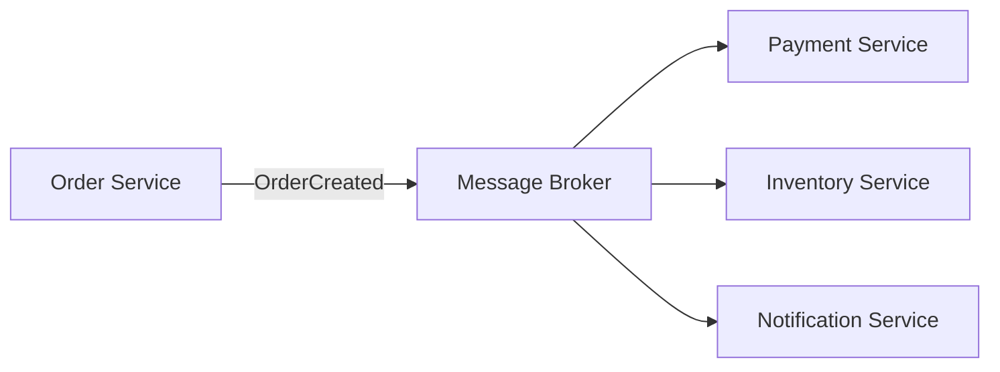
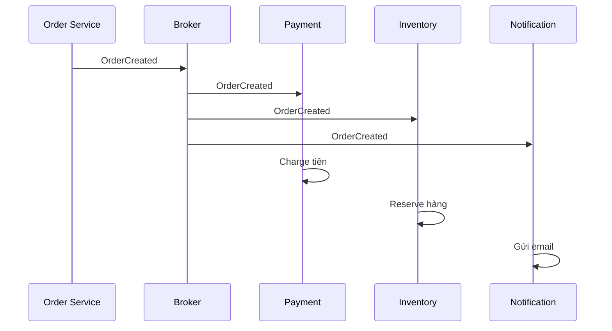
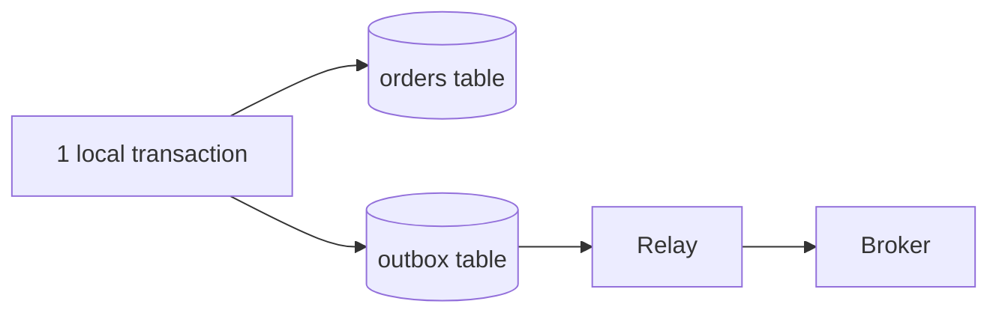
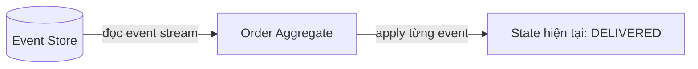
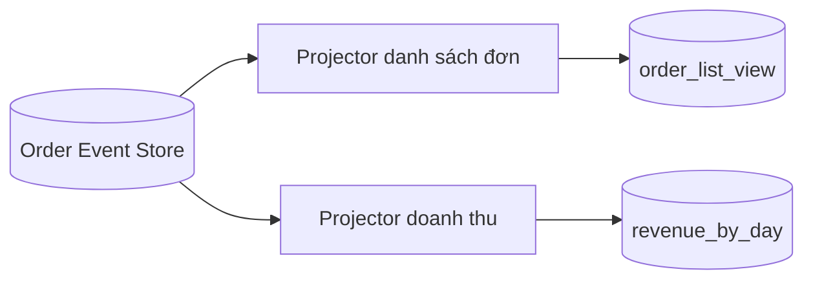
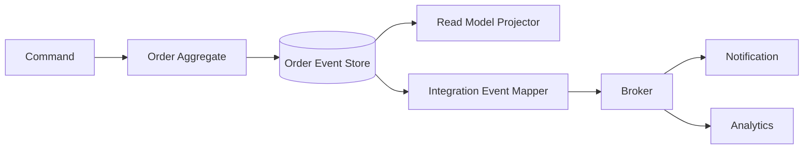

# Event-Driven Architecture vs Event Sourcing — Hiểu đúng bằng ví dụ đặt hàng

## Mục lục

- [Trả lời trong 30 giây](#trả-lời-trong-30-giây)
- [Ví dụ trước: một đơn hàng bình thường](#ví-dụ-trước-một-đơn-hàng-bình-thường)
- [Event-Driven Architecture làm gì?](#event-driven-architecture-làm-gì)
  - [Các thành phần và trách nhiệm](#các-thành-phần-và-trách-nhiệm)
  - [Luồng OrderCreated](#luồng-ordercreated)
  - [EDA không làm gì?](#eda-không-làm-gì)
  - [Những thứ bắt buộc khi dùng EDA](#những-thứ-bắt-buộc-khi-dùng-eda)
- [Event Sourcing làm gì?](#event-sourcing-làm-gì)
  - [Các thành phần và trách nhiệm](#các-thành-phần-và-trách-nhiệm-1)
  - [Cách dựng lại trạng thái](#cách-dựng-lại-trạng-thái)
  - [Event Sourcing có chỉ là audit log?](#event-sourcing-có-chỉ-là-audit-log)
  - [Event Sourcing không làm gì?](#event-sourcing-không-làm-gì)
  - [CQRS và projection: khi nào thật sự khác CRUD?](#cqrs-và-projection-khi-nào-thật-sự-khác-crud)
  - [Những thứ thường cần thêm](#những-thứ-thường-cần-thêm)
- [So sánh: cái nào chịu trách nhiệm việc gì?](#so-sánh-cái-nào-chịu-trách-nhiệm-việc-gì)
- [Bốn kiến trúc có thể dùng](#bốn-kiến-trúc-có-thể-dùng)
- [Ví dụ đầy đủ: đặt hàng bằng cả hai pattern](#ví-dụ-đầy-đủ-đặt-hàng-bằng-cả-hai-pattern)
- [Khi nào chọn cái nào?](#khi-nào-chọn-cái-nào)
- [Những nhầm lẫn cần tránh](#những-nhầm-lẫn-cần-tránh)
- [Checklist ngắn](#checklist-ngắn)
- [Liên kết liên quan](#liên-kết-liên-quan)

---

## Trả lời trong 30 giây

Hãy nhớ đúng hai câu này:

> **Event-Driven Architecture (EDA) là cách các service báo tin cho nhau.**
>
> **Event Sourcing là cách một service tự lưu lịch sử thay đổi của nó.**

Ví dụ một đơn hàng vừa được tạo:

- **EDA:** Order Service báo tin `OrderCreated` cho Payment, Inventory và Notification.
- **Event Sourcing:** Order Service tự lưu `OrderCreated` vào lịch sử của đơn hàng để sau này biết đơn đã đi qua những trạng thái nào.

Hai pattern có thể cùng dùng event tên giống nhau, nhưng làm **hai việc khác nhau**.

```text
EDA = loa phát thanh giữa các phòng ban
      “Đơn #123 đã được tạo.”

Event Sourcing = sổ lịch sử của riêng Order Service
      “10:00 tạo đơn; 10:02 đã thanh toán; 10:05 đã giao.”
```

> 💡 **Đừng nhớ thuật ngữ trước:** nếu muốn service khác biết một việc đã xảy ra, nghĩ tới **EDA**. Nếu muốn lưu đầy đủ quá khứ của chính entity đó, nghĩ tới **Event Sourcing**.

---

## Ví dụ trước: một đơn hàng bình thường

Giả sử hệ thống có **Order Service**. Khi khách đặt hàng, service lưu một dòng vào bảng `orders`:

```text
orders
┌───────────┬──────────┬────────────┐
│ id        │ status   │ total      │
├───────────┼──────────┼────────────┤
│ order-123 │ CREATED  │ 500.000 đ  │
└───────────┴──────────┴────────────┘
```

Khi thanh toán xong, service cập nhật dòng đó thành `PAID`. Khi giao xong, cập nhật thành `DELIVERED`.

```text
CREATED  →  PAID  →  SHIPPED  →  DELIVERED
```

Đây là cách lưu **current state** (trạng thái hiện tại). Nó hoàn toàn bình thường và phù hợp với rất nhiều hệ thống CRUD.

Nhưng có hai câu hỏi khác nhau có thể xuất hiện:

1. **“Payment, Inventory, Notification làm sao biết đơn vừa tạo?”**
   - Đây là câu hỏi về giao tiếp giữa service.
   - **EDA** giải quyết câu hỏi này.

2. **“Đơn đã đổi trạng thái bao nhiêu lần, do ai, vào lúc nào; nó ở trạng thái nào lúc 10:03?”**
   - Đây là câu hỏi về lịch sử dữ liệu của Order Service.
   - **Event Sourcing** giải quyết câu hỏi này.

---

## Event-Driven Architecture làm gì?

EDA là cách Order Service **thông báo** cho service khác sau khi một fact đã xảy ra.

Khi tạo đơn, Order Service phát một event tên `OrderCreated`. Event đi qua **message broker** (hệ thống trung chuyển message) như Kafka, RabbitMQ hoặc SNS/SQS. Các service quan tâm tự nhận event đó.



Order Service không cần gọi trực tiếp từng service và không cần biết có bao nhiêu service đang nghe.

### Các thành phần và trách nhiệm

| Thành phần | Làm gì? | Trong ví dụ đặt hàng |
|---|---|---|
| **Producer** | Phát thông báo | Order Service phát `OrderCreated` |
| **Event** | Nội dung thông báo về việc đã xảy ra | `OrderCreated { orderId: "123" }` |
| **Broker** | Nhận, lưu tạm/route và chuyển event | Kafka, RabbitMQ, SNS/SQS |
| **Consumer** | Nhận thông báo và tự xử lý việc của mình | Payment charge tiền; Inventory giữ hàng |

Hãy hình dung broker như bưu điện:

```text
Order Service viết thư: “Order #123 đã tạo.”
                  │
                  ▼
             Message Broker
              ├── gửi bản sao cho Payment
              ├── gửi bản sao cho Inventory
              └── gửi bản sao cho Notification
```

### Luồng OrderCreated

Sau khi khách tạo đơn, flow đơn giản có thể là:

1. Order Service tạo đơn trong database của nó.
2. Order Service phát `OrderCreated`.
3. Payment Service nhận event và xử lý thanh toán.
4. Inventory Service nhận event và reserve (giữ) hàng.
5. Notification Service nhận event và gửi email.



Điểm mạnh là ngày mai có thêm **Analytics Service**, team chỉ cần cho Analytics subscribe `OrderCreated`. Không phải sửa Order Service để nó gọi Analytics.

### EDA không làm gì?

EDA **không** tự làm các việc sau:

| Việc | EDA có tự giải quyết không? | Cần gì thêm? |
|---|:---:|---|
| Lưu lịch sử đầy đủ của order | ❌ | Event Sourcing hoặc audit log |
| Đảm bảo Payment chỉ charge đúng một lần | ❌ | Idempotency key/deduplication |
| Đảm bảo DB update và publish event cùng thành công | ❌ | Transactional Outbox |
| Rollback payment khi hết hàng | ❌ | Saga + compensating action |
| Đảm bảo tất cả service cập nhật ngay lập tức | ❌ | Chấp nhận eventual consistency hoặc dùng sync call |

Nói cách khác, EDA chỉ nói: **“hãy chuyển tin bằng event thay vì gọi trực tiếp.”** Các quy tắc an toàn khi chuyển tin vẫn phải được thiết kế.

### Những thứ bắt buộc khi dùng EDA

#### 1. Idempotent consumer: event đến hai lần vẫn không gây hại

Broker thường dùng **at-least-once delivery**: ưu tiên không mất event, nên đôi lúc giao cùng event nhiều lần. Ví dụ Payment nhận `OrderCreated` hai lần. Nếu không cẩn thận, khách bị charge hai lần.

Consumer phải dùng `event_id` hoặc idempotency key để nhận ra event đã xử lý:

```text
Payment nhận evt-abc lần đầu  → charge thành công, lưu evt-abc đã xử lý
Payment nhận evt-abc lần hai  → thấy đã xử lý, bỏ qua
```

#### 2. Transactional Outbox: không mất event khi broker lỗi

Nếu Order Service làm hai bước riêng:

```text
1. Lưu order vào database              thành công
2. Publish OrderCreated lên broker     broker đang lỗi
```

thì order đã tồn tại nhưng Payment/Inventory không biết. Đây là **dual write problem**.

Outbox ghi order và “ý định gửi event” trong cùng một database transaction. Worker/relay sẽ gửi event sau.



Nếu broker đang down, row trong `outbox` còn đó để relay thử lại. Xem thêm: [Transactional Outbox Pattern](17-data-patterns/transactional-outbox.md).

#### 3. Retry và DLQ: xử lý lỗi có giới hạn

- Lỗi mạng tạm thời: retry với backoff (chờ lâu dần giữa các lần thử).
- Payload sai schema hoặc code lỗi mãi: không retry vô hạn.
- Sau số lần retry tối đa: đưa message vào **Dead Letter Queue (DLQ)** để team điều tra và replay sau khi sửa.

#### 4. Ordering: chỉ tin vào thứ tự phù hợp

Kafka thường chỉ bảo đảm thứ tự **trong một partition**. Nếu event của cùng một order cần đúng thứ tự, dùng `orderId` làm key để chúng đi cùng partition.

Không giả định `OrderCreated` của order A luôn đến trước `OrderCreated` của order B. Thường business chỉ cần thứ tự cho **cùng một order**, không cần thứ tự toàn hệ thống.

---

## Event Sourcing làm gì?

Event Sourcing không tập trung vào việc gửi thông báo cho service khác. Nó tập trung vào việc **Order Service lưu dữ liệu của chính nó**.

Thay vì chỉ giữ dòng trạng thái cuối cùng:

```text
order-123: status = DELIVERED
```

Order Service giữ một danh sách event không bị ghi đè:

```text
OrderCreated
PaymentReceived
OrderPacked
OrderShipped
OrderDelivered
```

Danh sách này gọi là **event stream**. Nơi lưu gọi là **event store**. Event stream là **source of truth** (nguồn dữ liệu đáng tin cậy nhất) của order.

### Các thành phần và trách nhiệm

| Thành phần | Làm gì? | Ví dụ |
|---|---|---|
| **Command** | Yêu cầu thay đổi | `ShipOrder(order-123)` |
| **Aggregate** | Kiểm tra business rule rồi quyết định event nào hợp lệ | Order aggregate chỉ cho ship khi đã paid |
| **Event store** | Lưu event theo thứ tự, chỉ append | Lưu `OrderShipped` là event số 4 |
| **Event stream** | Lịch sử của một entity/aggregate | Toàn bộ event của `order-123` |
| **Projection** | Dựng bảng/view dễ query từ event stream | `order_list_view` cho UI |
| **Snapshot** | Bản chụp state để không phải đọc lại quá nhiều event | State ở event số 1.000 |

Hãy hình dung Event Sourcing là sổ giao dịch ngân hàng. Không sửa dòng “số dư” để xóa lịch sử. Mỗi lần nạp/rút tiền tạo một dòng mới; số dư hiện tại là tổng các dòng đó.

### Cách dựng lại trạng thái

Muốn biết trạng thái hiện tại của `order-123`, Order Service đọc event stream theo thứ tự rồi áp dụng từng event:

```text
Bắt đầu: không có order

OrderCreated       → status = CREATED
PaymentReceived    → status = PAID
OrderPacked        → status = PACKED
OrderShipped       → status = SHIPPED
OrderDelivered     → status = DELIVERED
```

Quá trình đọc lại này gọi là **replay** hoặc **rehydrate**.



Khi nhận command mới, aggregate phải dựng lại state trước, kiểm tra rule, sau đó mới append event mới.

Ví dụ khách yêu cầu hủy đơn:

```text
Command: CancelOrder(order-123)

1. Order aggregate replay history → biết order đang SHIPPED
2. Rule nói “đơn đã ship không thể cancel bình thường”
3. Từ chối command; không tạo event mới
```

Nếu order còn `PAID` nhưng chưa ship, aggregate có thể append `OrderCancelled`. Event cũ `PaymentReceived` vẫn được giữ; sau đó có thể có `PaymentRefunded` như một fact mới. Không xóa lịch sử.

### Event Sourcing có chỉ là audit log?

**Nếu chỉ ghi history để xem lại thì đúng, nó chỉ là audit log.** Audit log là dữ liệu phụ; application vẫn tin vào bảng state hiện tại.

```text
Audit log:
  orders.status = DELIVERED       ← dữ liệu chính
  audit_logs = [Created, Paid...] ← để điều tra khi cần
```

Event Sourcing khác ở chỗ hệ thống bảo đảm **mọi thay đổi nghiệp vụ được ghi bằng event**, và state hiện tại có thể được dựng lại từ event đó:

```text
Event Sourcing:
  events = [OrderCreated, PaymentReceived, OrderShipped]
          ↓ replay
  orders.status = SHIPPED         ← state dựng lại được
```

Ví dụ bảng `order_list_view` bị xóa do lỗi migration. Với audit log thông thường, team cần restore bảng chính từ backup. Với Event Sourcing, team có thể tạo một projection mới rồi replay toàn bộ `OrderCreated`, `PaymentReceived`, `OrderShipped` để dựng lại bảng đọc.

Nói ngắn: **event chỉ là log khi application không thể hoặc không dùng nó để dựng state.** Nếu event là con đường bắt buộc của mọi thay đổi và có thể rebuild state, đó mới là Event Sourcing. Martin Fowler cũng nhấn mạnh điểm này: lợi ích không chỉ là có history, mà là có thể complete rebuild và temporal query từ chuỗi event.

### Event Sourcing không làm gì?

| Việc | Event Sourcing có tự giải quyết không? | Cần gì thêm? |
|---|:---:|---|
| Gửi thông báo cho Payment/Inventory | ❌ | EDA, integration event hoặc API call |
| Tự tạo giao tiếp giữa microservice | ❌ | Broker/API contract tùy kiến trúc |
| Làm mọi query UI nhanh | ❌ | Projection/read model |
| Làm dữ liệu giữa projection và write side đồng bộ ngay | ❌ | Chấp nhận lag hoặc thiết kế read-your-own-writes |
| Tự xử lý schema cũ | ❌ | Event versioning/upcasting |

Event Sourcing nói: **“lịch sử event là dữ liệu gốc.”** Nó không nói: **“hãy gửi event này ra Kafka.”**

### Những thứ thường cần thêm

#### 1. Snapshot: stream dài thì đừng replay từ đầu mỗi lần

Nếu một account có 1 triệu event, đọc từ event đầu mỗi lần xử lý command sẽ chậm. Snapshot lưu state đã tính tại một version:

```text
Events 1 ... 10.000 | Snapshot state ở event 10.000 | Events 10.001 ... 10.050

Muốn dựng state hiện tại:
- load snapshot ở event 10.000
- chỉ replay event 10.001 đến 10.050
```

Snapshot là cache. Nếu nó hỏng, hệ thống phải dựng lại được từ event stream.

#### 2. Projection: event store không phải màn hình UI

UI thường cần query như “100 đơn gần nhất”, “đơn đang giao” hoặc “doanh thu theo tháng”. Đọc rồi tự tính từ hàng triệu event cho từng trang web là không phù hợp.

Projector đọc event và cập nhật các bảng phục vụ từng query:



Các bảng `order_list_view` và `revenue_by_day` gọi là **projection** hoặc **read model**. Chúng có thể xóa và dựng lại từ event stream.

### CQRS và projection: khi nào thật sự khác CRUD?

**CQRS không chỉ là có một hàm write và một hàm read.** CRUD nào cũng có `createOrder()` và `getOrder()`. Cũng không phải cứ JOIN các bảng rồi map sang `OrderDetailResponse` là CQRS.

CRUD bình thường dùng **cùng model dữ liệu** cho cả ghi và đọc:

```text
orders
id | customer_id | status | total

POST /orders  → INSERT/UPDATE orders
GET /orders/1 → SELECT/JOIN từ orders và các bảng gốc → map DTO
```

`OrderDetailResponse` có shape khác entity nhưng nó chỉ là kết quả format của query tại thời điểm request. Đây vẫn là CRUD thông thường.

CQRS trở nên có ý nghĩa khi hệ thống có **read model tồn tại riêng**, được thiết kế cho một nhu cầu đọc cụ thể và được cập nhật từ write side:

```text
Write model:                         Read model:
Order aggregate / event stream       order_detail_view
- CreateOrder                        - order_id
- PayOrder                           - customer_name
- ShipOrder                          - item_summary
- kiểm tra business rule             - driver_name, ETA
                                     - display_status
```

```text
OrderShipped event
        ↓
projector cập nhật order_detail_view
        ↓
GET /orders/123 chỉ đọc thẳng order_detail_view
```

Đây là lý do CQRS thường đi cùng Event Sourcing: event đã được ghi ở write side là input tự nhiên để projector cập nhật read model. Nhưng hai pattern vẫn độc lập:

- Có thể dùng **CQRS không Event Sourcing**: `orders` là write model; khi order đổi trạng thái, code cập nhật `order_detail_view`.
- Có thể dùng **Event Sourcing không CQRS**: replay event stream để trả query, dù cách này thường không phù hợp khi UI đọc nhiều.
- CQRS không bắt buộc hai database. Read/write model có thể nằm ở các bảng khác nhau trong cùng database; chỉ khi cần scale độc lập mới tách database/service.

Nếu `orders` đã đáp ứng tốt cả ghi và đọc, hoặc UI chỉ JOIN vài bảng rồi map DTO không gặp vấn đề hiệu năng/độ phức tạp, **không cần CQRS**. Martin Fowler cảnh báo CQRS phù hợp cho một phần domain phức tạp hoặc chênh lệch read/write lớn; áp dụng cho mọi CRUD thường chỉ thêm complexity.

#### 3. Optimistic concurrency: hai người cùng sửa một order

Mỗi stream có version. Nếu hai request cùng đọc order ở version 7:

```text
Request A append thành công → stream lên version 8
Request B append với expected version 7 → bị từ chối
```

Request B phải load lại state version 8 rồi kiểm tra command còn hợp lệ không. Điều này giúp business rule không bị hai request ghi đè lẫn nhau.

#### 4. Schema evolution và privacy

Event có thể được giữ nhiều năm. Vì vậy:

- Không sửa event cũ tùy ý.
- Thêm field optional thường an toàn hơn đổi/xóa field cũ.
- Event cũ cần đọc được bằng versioning hoặc upcasting.
- Không lưu password, access token hay PII không thật sự cần vào event stream.

---

## So sánh: cái nào chịu trách nhiệm việc gì?

| Cần làm việc này | EDA | Event Sourcing |
|---|:---:|:---:|
| Báo cho service khác một việc đã xảy ra | ✅ Việc chính | ❌ Không phải việc chính |
| Tách Order khỏi Notification/Analytics | ✅ Việc chính | ❌ |
| Lưu toàn bộ lifecycle của một order | ❌ | ✅ Việc chính |
| Dựng lại state order ở tuần trước | ❌ Broker có thể đã hết retention | ✅ Replay event stream |
| Tạo bảng nhanh cho UI | Có thể làm, nhưng không phải mục tiêu chính | Thường cần projection |
| Dùng Kafka/RabbitMQ | Thường có | Không bắt buộc |
| Dùng Event Store | Không bắt buộc | Có |
| Cần idempotency cho consumer | Có | Có, nếu projection/consumer có thể nhận event lặp |
| Cần snapshot | Không phải nhu cầu chính | Thường cần khi stream dài |

Một cách nhớ khác:

```text
EDA:          Service A  ── thông báo ──► Service B
Event Sourcing: Service A  ── lưu lịch sử ──► Event Store
```

---

## Bốn kiến trúc có thể dùng

### 1. Chỉ dùng database CRUD — không EDA, không Event Sourcing

```text
Client → Order Service → orders table
```

Phù hợp với application đơn giản. Đây là điểm bắt đầu tốt, không phải thất bại kiến trúc.

### 2. Dùng EDA, không dùng Event Sourcing

```text
Order Service → orders table + outbox → Broker → Notification/Analytics
```

`orders` table vẫn là source of truth. Event được dùng để các service khác biết order thay đổi. Đây là lựa chọn rất phổ biến.

### 3. Dùng Event Sourcing, không dùng EDA

```text
Order module → Event Store → Internal projection → UI
```

Phù hợp với monolith/modular monolith cần audit và history. Không có service khác cần được thông báo, nên chưa cần broker.

### 4. Dùng cả EDA và Event Sourcing



Order Service lưu lịch sử nội bộ bằng Event Sourcing, sau đó chỉ publish **integration event** cần thiết ra broker. Đây là mạnh nhất nhưng cũng phức tạp nhất.

> **Quan trọng:** event nội bộ trong Event Store không nên tự động là API công khai. Order Service nên ánh xạ nó thành integration event có schema/version riêng cho service ngoài.

---

## Ví dụ đầy đủ: đặt hàng bằng cả hai pattern

Giả sử Order domain phức tạp và cần audit. Order Service dùng Event Sourcing:

```text
Order #123 stream:
1. OrderCreated
2. PaymentAuthorized
3. StockReserved
4. OrderConfirmed
```

Vai trò của **Event Sourcing** trong ví dụ này:

- Order Service biết chính xác order đã đi qua những bước nào.
- Có thể replay để xem state tại event số 2.
- Có thể dựng projection cho màn hình “Đơn hàng của tôi”.

Sau khi `OrderConfirmed` được append thành công, service công bố integration event:

```json
{
  "event_type": "order.confirmed.v1",
  "event_id": "evt-999",
  "payload": {
    "order_id": "order-123",
    "customer_id": "customer-7",
    "total": 500000
  }
}
```

Vai trò của **EDA** trong ví dụ này:

- Notification Service nhận event để gửi email.
- Analytics Service nhận event để cập nhật dashboard.
- Loyalty Service nhận event để cộng điểm.
- Order Service không cần biết hoặc gọi từng service trên.

```text
Event Sourcing:  giữ lịch sử Order #123 bên trong Order Service
EDA:             phát tin “Order #123 đã confirmed” cho service khác
```

---

## Khi nào chọn cái nào?

| Nếu câu hỏi của bạn là... | Bắt đầu xem pattern nào? |
|---|---|
| “Làm sao thêm Analytics mà không sửa Order Service?” | EDA |
| “Làm sao gửi email sau khi đơn đã tạo mà user không phải chờ?” | EDA |
| “Làm sao đảm bảo không mất thông báo khi broker down?” | EDA + Transactional Outbox |
| “Làm sao biết số dư tài khoản lúc cuối tháng trước?” | Event Sourcing |
| “Làm sao biết đầy đủ các lần đổi trạng thái của claim bảo hiểm?” | Event Sourcing |
| “Màn hình đọc nhiều, shape dữ liệu đọc khác dữ liệu ghi?” | CQRS/projection; chưa chắc cần Event Sourcing |
| “Tôi chỉ có CRUD đơn giản” | Database current state thường đủ |

> ⚠️ **Đừng chọn pattern vì tên nghe phức tạp:** broker tạo thêm consumer lag, retry, DLQ và schema versioning. Event Sourcing tạo thêm projection, replay, snapshot và bài toán privacy. Chỉ trả giá này khi nó giải quyết một nhu cầu nghiệp vụ thật.

---

## Những nhầm lẫn cần tránh

1. **“Dùng Kafka là Event Sourcing.”**
   - Không đúng. Kafka có thể chỉ đang chuyển integration event. Nếu bảng `orders` mới là source of truth, đó là EDA với CRUD database.

2. **“Event Sourcing phải có Kafka.”**
   - Không đúng. Event store trong một monolith đã đủ cho Event Sourcing.

3. **“EDA tự làm dữ liệu nhất quán.”**
   - Không đúng. Consumer xử lý chậm, duplicate và failure vẫn tồn tại. Cần Outbox, idempotency, retry, DLQ và đôi khi Saga.

4. **“Event Sourcing tự làm audit hợp pháp.”**
   - Không hoàn toàn. Cần quyền truy cập, backup, retention, log và quy trình bảo vệ event store.

5. **“Mọi event trong Event Store phải publish cho service khác.”**
   - Không nên. Domain event nội bộ cần được che giấu; chỉ publish integration event là contract công khai.

6. **“Phải dùng một trong hai cho mọi service.”**
   - Không. CRUD + transaction đơn giản thường là câu trả lời tốt nhất.

---

## Checklist ngắn

### Nếu chọn EDA

- [ ] Tôi có consumer độc lập hoặc fan-out thật sự cần thiết.
- [ ] Consumer chấp nhận eventual consistency.
- [ ] Tôi có Outbox nếu vừa ghi database vừa publish event.
- [ ] Consumer xử lý duplicate an toàn bằng idempotency/deduplication.
- [ ] Tôi có retry, DLQ, alert cho consumer lag và quy tắc event versioning.

### Nếu chọn Event Sourcing

- [ ] Lịch sử transition có giá trị nghiệp vụ thật, không chỉ “cho có audit”.
- [ ] Event stream là source of truth của aggregate.
- [ ] Tôi có cách replay deterministic, snapshot cho stream dài và projection cho query.
- [ ] Tôi có optimistic concurrency, event versioning và kế hoạch privacy/retention.
- [ ] Tôi tách domain event nội bộ khỏi integration event công khai.

---

## Liên kết liên quan

- [06 — Inter-Service Communication](06-inter-service-communication.md) — giao tiếp sync/async, broker, Pub/Sub và DLQ.
- [09 — Data Management](09-data-management.md) — Saga, CQRS, Event Sourcing và consistency.
- [Event-Driven Architecture Pattern](17-communication-patterns/event-driven-architecture.md) — tài liệu chuyên sâu về delivery, schema và vận hành EDA.
- [Event Sourcing Pattern](17-data-patterns/event-sourcing.md) — tài liệu chuyên sâu về event store, aggregate, projection và replay.
- [Transactional Outbox Pattern](17-data-patterns/transactional-outbox.md) — giải quyết dual write giữa database và broker.
- [Saga Pattern](17-data-patterns/saga.md) — workflow nhiều bước và compensating action.
- [CQRS Pattern](17-data-patterns/cqrs.md) — tách command/query và read model.
- [Martin Fowler — CQRS](https://martinfowler.com/bliki/CQRS.html) — giải thích CQRS là model update khác model display; đồng thời cảnh báo không lạm dụng cho CRUD.
- [Microsoft — CQRS Pattern](https://learn.microsoft.com/en-us/azure/architecture/patterns/cqrs) — read/write model riêng, có thể chung hoặc tách data store.
- [Martin Fowler — Event Sourcing](https://martinfowler.com/eaaDev/EventSourcing.html) — replay, complete rebuild và temporal query.
- [Over-engineering](17-anti-patterns/over-engineering.md) — tránh thêm complexity khi domain chưa cần.
