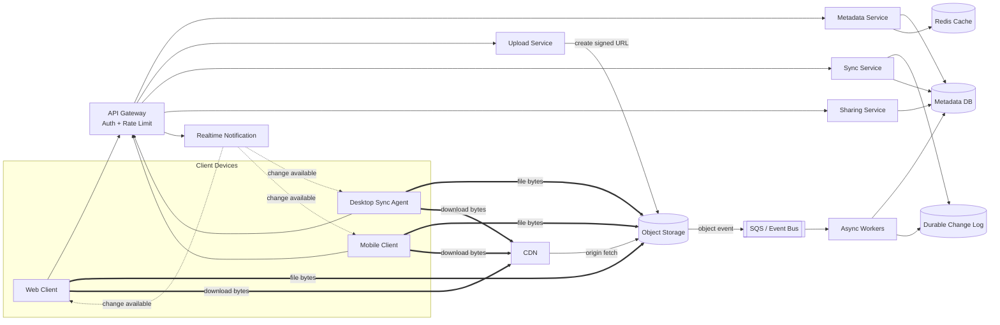
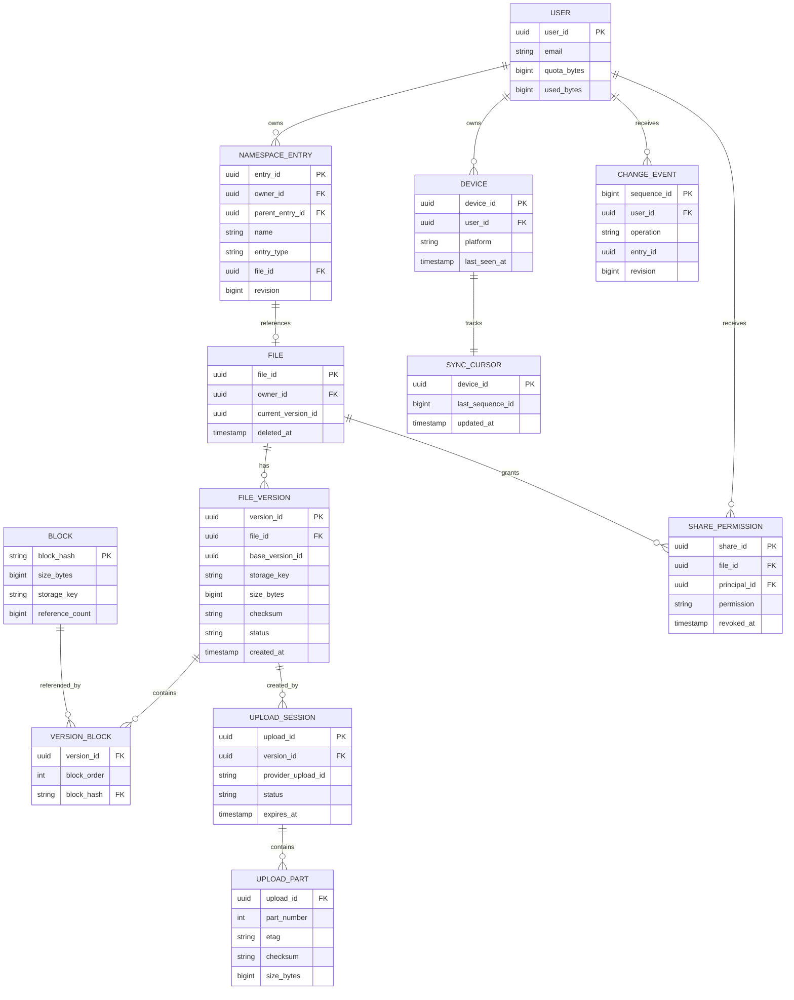
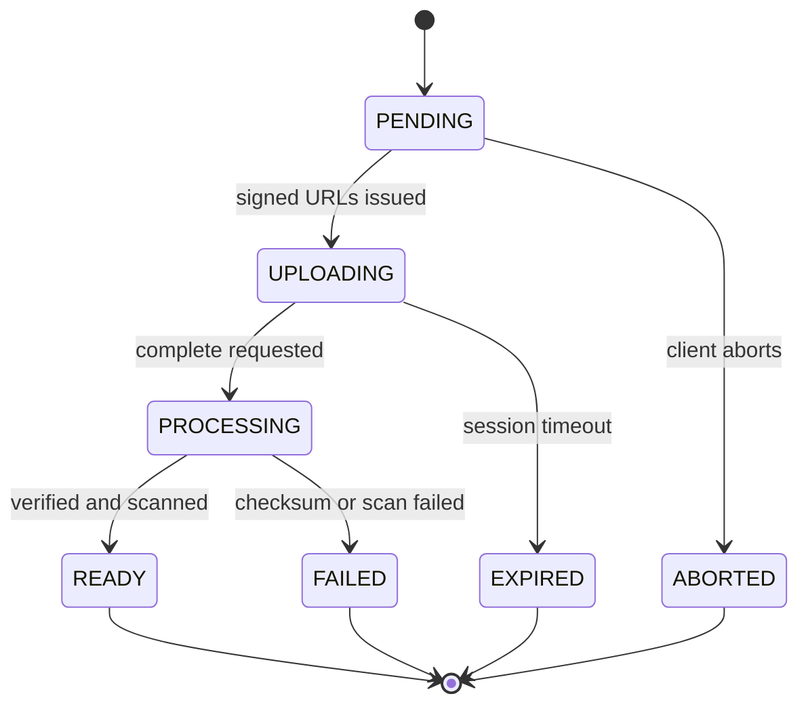
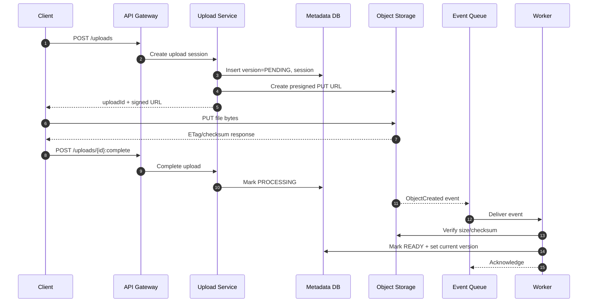
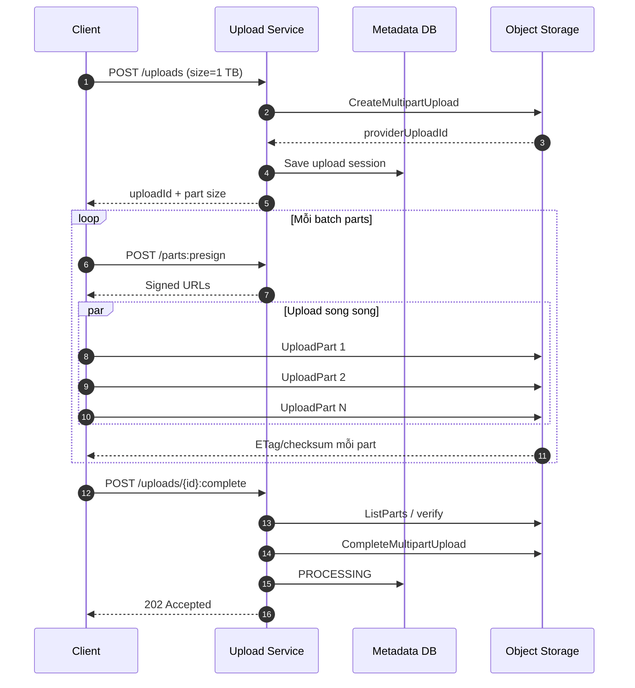
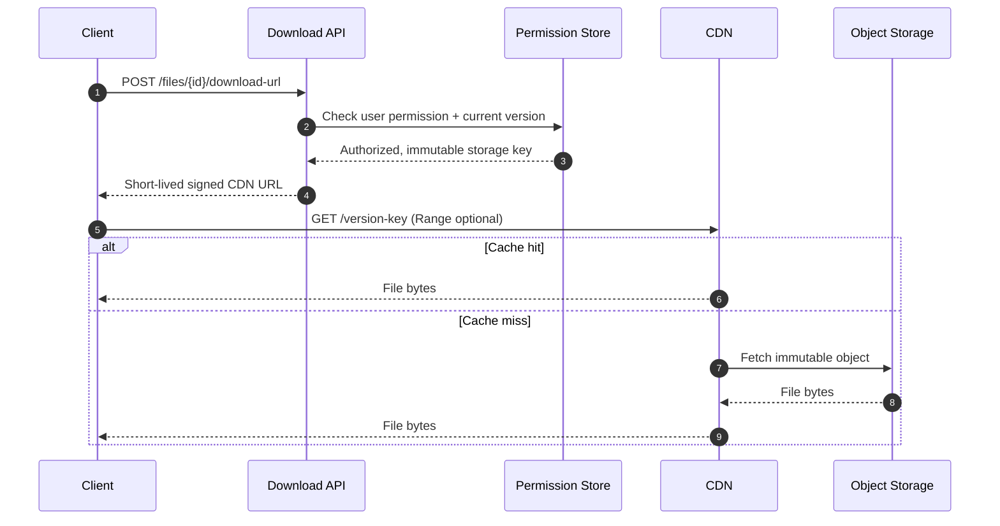
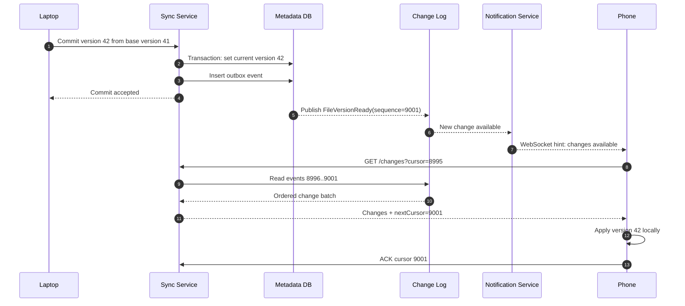
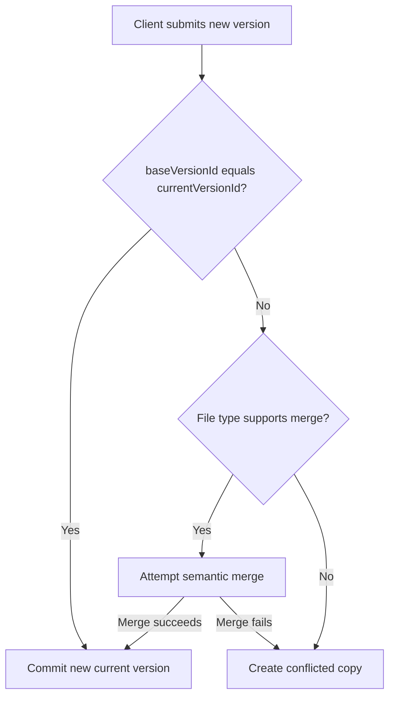
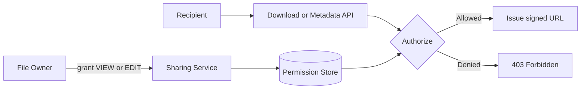
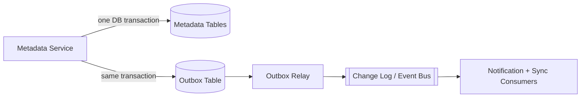

# Case Study: System Design Dropbox — File Storage, Sharing và Multi-Device Sync

## Mục lục

- [1. Mục tiêu của bài toán](#1-mục-tiêu-của-bài-toán)
- [2. Clarify Requirements](#2-clarify-requirements)
  - [2.1. Functional Requirements](#21-functional-requirements)
  - [2.2. Non-Functional Requirements](#22-non-functional-requirements)
  - [2.3. Phạm vi không thiết kế sâu](#23-phạm-vi-không-thiết-kế-sâu)
- [3. Back-of-the-Envelope Estimation](#3-back-of-the-envelope-estimation)
  - [3.1. Giả định đầu vào](#31-giả-định-đầu-vào)
  - [3.2. Storage](#32-storage)
  - [3.3. Upload traffic](#33-upload-traffic)
  - [3.4. Download traffic](#34-download-traffic)
  - [3.5. Control-plane QPS](#35-control-plane-qps)
  - [3.6. Kết luận kiến trúc từ estimation](#36-kết-luận-kiến-trúc-từ-estimation)
- [4. Architecture Decisions](#4-architecture-decisions)
- [5. High-Level Architecture](#5-high-level-architecture)
  - [5.1. Data plane và control plane](#51-data-plane-và-control-plane)
  - [5.2. Trách nhiệm của từng thành phần](#52-trách-nhiệm-của-từng-thành-phần)
- [6. Data Model](#6-data-model)
  - [6.1. Các entity chính](#61-các-entity-chính)
  - [6.2. Query patterns](#62-query-patterns)
  - [6.3. Trạng thái của File Version](#63-trạng-thái-của-file-version)
- [7. API Design](#7-api-design)
  - [7.1. Upload APIs](#71-upload-apis)
  - [7.2. File và download APIs](#72-file-và-download-apis)
  - [7.3. Sharing APIs](#73-sharing-apis)
  - [7.4. Sync APIs](#74-sync-apis)
- [8. Upload Design](#8-upload-design)
  - [8.1. Upload file nhỏ](#81-upload-file-nhỏ)
  - [8.2. Resumable Multipart Upload](#82-resumable-multipart-upload)
  - [8.3. Idempotency và cleanup](#83-idempotency-và-cleanup)
  - [8.4. Vì sao file không đi qua Upload Service](#84-vì-sao-file-không-đi-qua-upload-service)
- [9. Download Design](#9-download-design)
  - [9.1. Download qua signed CDN URL](#91-download-qua-signed-cdn-url)
  - [9.2. Cache strategy](#92-cache-strategy)
- [10. Multi-Device Sync](#10-multi-device-sync)
  - [10.1. Thành phần phía client](#101-thành-phần-phía-client)
  - [10.2. Durable Change Log và cursor](#102-durable-change-log-và-cursor)
  - [10.3. WebSocket có vai trò gì](#103-websocket-có-vai-trò-gì)
  - [10.4. Conflict resolution](#104-conflict-resolution)
  - [10.5. Offline và reconciliation](#105-offline-và-reconciliation)
- [11. Chunking, Differential Sync và Deduplication](#11-chunking-differential-sync-và-deduplication)
  - [11.1. Tại sao cần chunking](#111-tại-sao-cần-chunking)
  - [11.2. Logical chunk khác S3 multipart part](#112-logical-chunk-khác-s3-multipart-part)
  - [11.3. Fixed-size và content-defined chunking](#113-fixed-size-và-content-defined-chunking)
  - [11.4. Chunk manifest](#114-chunk-manifest)
  - [11.5. Giới hạn của ETag](#115-giới-hạn-của-etag)
  - [11.6. Trade-off của deduplication](#116-trade-off-của-deduplication)
- [12. File Sharing và Authorization](#12-file-sharing-và-authorization)
- [13. Consistency và Reliability](#13-consistency-và-reliability)
  - [13.1. Consistency model](#131-consistency-model)
  - [13.2. S3 event processing](#132-s3-event-processing)
  - [13.3. Transactional Outbox](#133-transactional-outbox)
  - [13.4. Failure scenarios](#134-failure-scenarios)
  - [13.5. Backup và Disaster Recovery](#135-backup-và-disaster-recovery)
- [14. Scalability và Partitioning](#14-scalability-và-partitioning)
- [15. Security](#15-security)
- [16. Observability và SLO](#16-observability-và-slo)
- [17. Những phương án không chọn](#17-những-phương-án-không-chọn)
- [18. Cách trình bày trong System Design Interview](#18-cách-trình-bày-trong-system-design-interview)
  - [18.1. Khung trình bày 45 phút](#181-khung-trình-bày-45-phút)
  - [18.2. Các câu hỏi interviewer có thể đào sâu](#182-các-câu-hỏi-interviewer-có-thể-đào-sâu)
  - [18.3. Checklist tự đánh giá](#183-checklist-tự-đánh-giá)
- [19. Kết luận](#19-kết-luận)
- [20. Tài liệu liên quan](#20-tài-liệu-liên-quan)

---

## 1. Mục tiêu của bài toán

Tài liệu này thiết kế một hệ thống lưu trữ file tương tự **Dropbox**. Người dùng có thể upload, download, chia sẻ và đồng bộ file giữa nhiều thiết bị.

Bài toán khó không nằm ở một API upload đơn lẻ. Hệ thống phải xử lý đồng thời ba nhóm vấn đề:

1. **File content có kích thước rất lớn** — không thể truyền toàn bộ dữ liệu qua application server.
2. **Metadata thay đổi thường xuyên** — rename, move, share và tạo version phải nhất quán.
3. **Thiết bị có thể mất kết nối** — sync không được phụ thuộc hoàn toàn vào WebSocket hoặc một notification tạm thời.

Một nguyên tắc xuyên suốt tài liệu là:

> Requirements tạo ra constraints; constraints dẫn đến architectural decisions. Không chọn công nghệ trước khi giải thích vấn đề mà công nghệ đó giải quyết.

---

## 2. Clarify Requirements

Trong System Design Interview, bước đầu tiên không phải là tự bổ sung càng nhiều tính năng càng tốt. Mục tiêu là hỏi lại để xác định chính xác phạm vi và tiêu chí thành công.

### 2.1. Functional Requirements

| ID | Chức năng | Phạm vi thiết kế |
|---|---|---|
| F1 | Upload file | Upload trực tiếp và resumable upload cho file lớn |
| F2 | Download file | Download toàn file hoặc theo byte range |
| F3 | File management | List, rename, move và delete file/folder |
| F4 | Share file | Share cho user khác với quyền `VIEW` hoặc `EDIT` |
| F5 | Multi-device sync | Đồng bộ thay đổi giữa desktop, mobile và web |
| F6 | File versioning | Mỗi lần cập nhật tạo immutable version mới |
| F7 | Conflict handling | Phát hiện hai thiết bị cùng sửa từ một base version |
| F8 | Offline support | Thiết bị reconnect có thể lấy lại tất cả thay đổi bị bỏ lỡ |

**Ví dụ:** Người dùng sửa `proposal.docx` trên laptop khi điện thoại đang offline. Khi điện thoại reconnect, nó phải nhận được version mới ngay cả khi WebSocket notification trước đó đã bị mất.

### 2.2. Non-Functional Requirements

| ID | Yêu cầu | Mục tiêu tham khảo |
|---|---|---|
| NF1 | Maximum file size | 1 TB |
| NF2 | Metadata latency | P95 dưới 200 ms |
| NF3 | Sync propagation | P95 dưới 3 giây khi hai thiết bị online |
| NF4 | Availability | 99.99% cho metadata API |
| NF5 | Durability | Không mất file đã được xác nhận `READY` |
| NF6 | Resumability | Tiếp tục upload từ phần đã hoàn thành sau khi mất mạng |
| NF7 | Consistency | Strong consistency cho permission; eventual consistency ngắn cho notification |
| NF8 | Security | TLS, encryption at rest, short-lived signed URL và audit log |
| NF9 | Scalability | 100 triệu registered users, 10 triệu DAU |

“Sync càng nhanh càng tốt” không phải một requirement có thể kiểm thử. Ta cần hỏi rõ “nhanh” là bao nhiêu, đo ở percentile nào và trong điều kiện thiết bị online hay offline.

### 2.3. Phạm vi không thiết kế sâu

Để giữ interview tập trung, các phần sau được xem là out of scope hoặc chỉ đề cập ở mức interface:

- Collaborative editing theo từng ký tự như Google Docs.
- Preview và transcoding cho mọi định dạng media.
- Full-text search bên trong nội dung file.
- Legal hold, eDiscovery và data residency theo từng quốc gia.
- Thuật toán antivirus cụ thể.

---

## 3. Back-of-the-Envelope Estimation

Estimation không nhằm tìm ra con số tuyệt đối chính xác. Nó giúp xác định bottleneck và loại bỏ những kiến trúc không phù hợp.

### 3.1. Giả định đầu vào

| Metric | Giá trị |
|---|---:|
| Registered users | 100 triệu |
| Daily Active Users | 10 triệu |
| Logical storage trung bình/user | 2 GB |
| Upload trung bình/user/day | 5 file |
| Download trung bình/user/day | 10 file |
| Kích thước file trung bình | 500 KB |
| Peak factor | 5 lần average |
| Maximum file size | 1 TB |

Kích thước trung bình 500 KB và maximum 1 TB không mâu thuẫn. Chúng thể hiện một phân phối có nhiều file nhỏ và một số ít file rất lớn.

### 3.2. Storage

```text
100 triệu users × 2 GB = 200 PB logical storage
```

Con số này chưa bao gồm:

- Nhiều version của cùng một file.
- Deleted-file retention.
- Chunk manifest và metadata.
- Replica nội bộ do object storage quản lý.
- Tăng trưởng user và storage theo thời gian.

Nếu upload mới tạo ra 25 TB/ngày, một năm có thể tăng thêm khoảng 9.1 PB logical data trước khi tính retention và deduplication.

### 3.3. Upload traffic

```text
10 triệu users × 5 file × 500 KB = 25 TB/ngày
```

Average upload bandwidth:

```text
25 TB / 86,400 giây ≈ 289 MB/s
```

Peak upload bandwidth:

```text
289 MB/s × 5 ≈ 1.45 GB/s
```

### 3.4. Download traffic

```text
10 triệu users × 10 file × 500 KB = 50 TB/ngày
```

Average download bandwidth:

```text
50 TB / 86,400 giây ≈ 579 MB/s
```

Peak download bandwidth:

```text
579 MB/s × 5 ≈ 2.9 GB/s
```

### 3.5. Control-plane QPS

Upload operations:

```text
50 triệu uploads/ngày / 86,400 ≈ 579 uploads/s
Peak ≈ 2,900 uploads/s
```

Download operations:

```text
100 triệu downloads/ngày / 86,400 ≈ 1,157 downloads/s
Peak ≈ 5,800 downloads/s
```

Đây chỉ là QPS ở mức logical operation. Một multipart upload còn tạo nhiều request presign, upload part, retry, complete và event processing. Vì vậy control-plane QPS thực tế sẽ cao hơn.

### 3.6. Kết luận kiến trúc từ estimation

| Quan sát | Quyết định |
|---|---|
| Peak bandwidth tính bằng GB/s | Không proxy file content qua application server |
| Storage đạt hàng trăm PB | Dùng distributed object storage như Amazon S3 |
| File có thể đạt 1 TB | Dùng resumable multipart upload |
| Download lớn hơn upload | Cân nhắc CDN và hỗ trợ byte-range request |
| User có nhiều thiết bị | Dùng durable change log và per-device cursor |
| Metadata QPS thấp hơn data bandwidth nhiều lần | Tách control plane khỏi data plane |

---

## 4. Architecture Decisions

| ADR | Quyết định | Lý do | Trade-off |
|---|---|---|---|
| ADR-01 | File content lưu trong object storage | Durable, scale lớn, hỗ trợ multipart | Phụ thuộc object storage provider |
| ADR-02 | Client upload/download trực tiếp | Giảm bandwidth và CPU cho backend | Signed URL và lifecycle phức tạp hơn |
| ADR-03 | File version là immutable | Dễ cache, rollback và tránh overwrite race | Tăng storage, cần retention policy |
| ADR-04 | Metadata là source of truth cho namespace | Query folder, permission và version nhanh | Phải giữ metadata và object storage đồng bộ |
| ADR-05 | Durable Change Log cho sync | Device offline không mất thay đổi | Cần cursor, retention và compaction |
| ADR-06 | WebSocket chỉ gửi notification hint | Latency thấp nhưng không làm nguồn sự thật | Client vẫn phải pull change log |
| ADR-07 | Event processing là at-least-once | Phù hợp với S3/SQS và dễ vận hành | Consumer phải idempotent |
| ADR-08 | Chunking chỉ áp dụng khi có lợi | Resume và differential sync | Metadata, CPU hash và request cost tăng |

---

## 5. High-Level Architecture



Mũi tên nét đậm biểu diễn **file bytes**. File content đi trực tiếp giữa client với S3/CDN. Application services chỉ xử lý metadata, authorization, upload session và signed URL.

### 5.1. Data plane và control plane

```text
Control plane: metadata, permission, upload session, change log, signed URL
Data plane:    file bytes được truyền trực tiếp qua S3/CDN
```

Tách hai plane giúp application server không trở thành bandwidth bottleneck.

### 5.2. Trách nhiệm của từng thành phần

| Thành phần | Trách nhiệm |
|---|---|
| API Gateway | Authentication, routing, rate limiting, request ID |
| Metadata Service | Namespace, folder, file, version và optimistic concurrency |
| Upload Service | Upload session, presigned URL, complete/abort và quota |
| Sharing Service | Permission, public link, revoke và authorization policy |
| Sync Service | Change feed, cursor và reconciliation |
| Realtime Notification | Báo cho device rằng có thay đổi mới |
| Metadata DB | Source of truth cho metadata và permission |
| Object Storage | Lưu file content hoặc chunks |
| CDN | Cache file immutable và phục vụ byte range |
| Queue/Event Bus | Tách S3 event khỏi worker và hấp thụ burst |
| Async Worker | Verify object, malware scan, finalize version, cleanup |

Không nhất thiết phải deploy từng logical component thành một microservice ngay từ ngày đầu. Một team nhỏ có thể bắt đầu với modular monolith cho control plane, sau đó tách Upload hoặc Sync khi workload và ownership yêu cầu.

---

## 6. Data Model

### 6.1. Các entity chính



Một số lựa chọn quan trọng:

- `NamespaceEntry` quản lý cây folder và filename.
- `File` đại diện cho identity ổn định của file.
- `FileVersion` là immutable snapshot của nội dung.
- `base_version_id` dùng để phát hiện concurrent update.
- `ChangeEvent` là nguồn dữ liệu bền vững để sync.

### 6.2. Query patterns

Data model phải xuất phát từ các query chính:

| Query | Index gợi ý |
|---|---|
| List folder | `(owner_id, parent_entry_id, name)` |
| Lấy current version | `file_id` hoặc `current_version_id` |
| List file được share cho user | `(principal_id, revoked_at)` |
| Kiểm tra quyền trên file | `(file_id, principal_id)` |
| Lấy changes sau cursor | `(user_id, sequence_id)` |
| Resume upload | `upload_id`, `(upload_id, part_number)` |
| Tìm block đã tồn tại | `(tenant_id, block_hash)` hoặc `block_hash` tùy policy |

**Ví dụ:** Nếu chỉ tạo primary key `(user_id, file_id)` cho bảng share, hệ thống list được file đã share cho user. Tuy nhiên, query “file này đang share cho những ai?” cần một index theo `file_id`.

### 6.3. Trạng thái của File Version



Chỉ version ở trạng thái `READY` mới được đặt làm `current_version_id` và xuất hiện trên thiết bị khác.

---

## 7. API Design

### 7.1. Upload APIs

```http
POST   /v1/uploads
POST   /v1/uploads/{uploadId}/parts:presign
GET    /v1/uploads/{uploadId}
POST   /v1/uploads/{uploadId}:complete
DELETE /v1/uploads/{uploadId}
```

Khởi tạo upload:

```json
POST /v1/uploads
Idempotency-Key: 93c851c7-...

{
  "parentEntryId": "folder-123",
  "fileName": "proposal.pdf",
  "sizeBytes": 734003200,
  "baseVersionId": "version-41",
  "contentChecksum": "sha256:..."
}
```

Response:

```json
{
  "uploadId": "upload-789",
  "versionId": "version-42",
  "strategy": "MULTIPART",
  "partSizeBytes": 134217728,
  "expiresAt": "2026-06-01T10:30:00Z"
}
```

Complete upload:

```json
POST /v1/uploads/upload-789:complete

{
  "parts": [
    {
      "partNumber": 1,
      "etag": "provider-etag-1",
      "checksum": "sha256:..."
    }
  ]
}
```

### 7.2. File và download APIs

```http
GET    /v1/folders/{folderId}/entries?cursor=...
GET    /v1/files/{fileId}
PATCH  /v1/entries/{entryId}
DELETE /v1/entries/{entryId}
GET    /v1/files/{fileId}/versions
POST   /v1/files/{fileId}/download-url
```

Response của download URL:

```json
{
  "versionId": "version-42",
  "url": "https://cdn.example.com/signed/...",
  "expiresAt": "2026-06-01T10:05:00Z",
  "checksum": "sha256:..."
}
```

### 7.3. Sharing APIs

```http
POST   /v1/files/{fileId}/shares
GET    /v1/files/{fileId}/shares
DELETE /v1/files/{fileId}/shares/{shareId}
GET    /v1/shared-with-me?cursor=...
POST   /v1/files/{fileId}/public-links
DELETE /v1/public-links/{linkId}
```

### 7.4. Sync APIs

```http
GET  /v1/changes?cursor={sequenceId}&limit=500
GET  /v1/snapshot
POST /v1/devices/{deviceId}/ack-cursor
GET  /v1/realtime-ticket
```

`GET /changes` phải trả cả `nextCursor` và cờ `hasMore`. Client lặp cho đến khi bắt kịp head của change log.

---

## 8. Upload Design

### 8.1. Upload file nhỏ

File nhỏ có thể dùng một presigned `PUT` URL.



Client nhận `202 Accepted` khi completion đang được xử lý. Nếu business yêu cầu completion đồng bộ, backend có thể verify nhanh rồi trả `200`, còn malware scan tiếp tục bất đồng bộ với trạng thái riêng.

### 8.2. Resumable Multipart Upload



Nếu connection bị mất, client gọi `GET /uploads/{uploadId}`. Backend đối soát dữ liệu đã lưu với `ListParts` của object storage rồi chỉ trả về các part còn thiếu.

### 8.3. Idempotency và cleanup

- `POST /uploads` nhận `Idempotency-Key` để retry không tạo nhiều version.
- `complete` phải idempotent. Gọi lại sau khi hoàn thành vẫn trả cùng kết quả.
- Upload session có `expires_at`.
- Background job abort multipart upload quá hạn.
- Object không gắn với version hợp lệ được xem là orphan và bị xóa sau grace period.
- Quota được reserve khi tạo upload, commit khi `READY`, release khi upload thất bại.

### 8.4. Vì sao file không đi qua Upload Service

Nếu peak upload là 1.45 GB/s, proxy file qua service sẽ làm tăng:

- Network bandwidth của compute layer.
- Số connection dài hạn.
- Memory buffer và timeout.
- Chi phí autoscaling.
- Blast radius khi Upload Service gặp sự cố.

Upload Service chỉ cấp quyền tạm thời. Client truyền file trực tiếp đến object storage.

---

## 9. Download Design

### 9.1. Download qua signed CDN URL



Download API không tự “gọi CDN để kiểm tra cache”. Nó authorize rồi trả signed URL. Client mới là thành phần kết nối đến CDN.

### 9.2. Cache strategy

File version là immutable nên có thể cache với TTL dài. Object key nên chứa `version_id` hoặc content hash:

```text
/tenant/{tenantId}/files/{fileId}/versions/{versionId}
```

CDN có lợi khi cùng một version được download nhiều lần. Với file cá nhân chỉ được đọc một lần, cache hit ratio có thể thấp. Vì vậy cần đo hit ratio trước khi mở CDN cho mọi traffic.

Các lưu ý:

- Signed URL có TTL ngắn, ví dụ 5 phút.
- CDN dùng private origin access; S3 bucket không public.
- Hỗ trợ HTTP Range để resume download.
- Không overwrite object key đang được cache.
- Revoke share phải chặn việc cấp URL mới; URL cũ vẫn hợp lệ đến khi hết TTL.

---

## 10. Multi-Device Sync

### 10.1. Thành phần phía client

```text
┌────────────────────────────────────────────────────────────┐
│                    Desktop Sync Agent                      │
│                                                            │
│  ┌──────────────┐    ┌──────────────┐    ┌──────────────┐  │
│  │ File Watcher │───▶│   Indexer    │───▶│ Chunker/Hash │  │
│  └──────────────┘    └──────┬───────┘    └──────┬───────┘  │
│                             │                   │          │
│                             ▼                   ▼          │
│                      ┌──────────────┐    ┌──────────────┐  │
│                      │   Local DB   │    │Upload Manager│  │
│                      │path/version/ │    │retry/resume  │  │
│                      │hash/cursor   │    └──────────────┘  │
│                      └──────┬───────┘                      │
│                             ▼                              │
│                      ┌──────────────┐                      │
│                      │ Sync Engine  │                      │
│                      └──────────────┘                      │
└────────────────────────────────────────────────────────────┘
```

- **File Watcher:** phát hiện create, modify, rename và delete.
- **Indexer:** chuẩn hóa path, đọc metadata và loại bỏ duplicate local event.
- **Chunker/Hasher:** tính checksum cho file hoặc block.
- **Local DB:** lưu mapping local path với remote entry/version và sync cursor.
- **Upload Manager:** retry, concurrency limit và resume.
- **Sync Engine:** push local changes, pull remote changes và xử lý conflict.

### 10.2. Durable Change Log và cursor



`sequence_id` có thể chỉ đảm bảo thứ tự trong phạm vi một user hoặc namespace. Không cần tạo global ordering cho toàn bộ hệ thống vì nó làm tăng contention.

### 10.3. WebSocket có vai trò gì

WebSocket giúp giảm latency khi hai thiết bị đang online. Tuy nhiên, WebSocket không đảm bảo device luôn nhận đủ event.

Thiết kế đúng là:

```text
WebSocket = “Có dữ liệu mới, hãy pull”
Change Log = “Đây là toàn bộ dữ liệu bạn chưa xử lý”
```

Có thể thay WebSocket bằng long polling hoặc push notification trên mobile. Quyết định phụ thuộc vào latency target, số connection đồng thời và chi phí vận hành.

### 10.4. Conflict resolution

Giả sử laptop và phone đều sửa từ `baseVersionId=41`:

1. Laptop commit version 42 thành công.
2. Phone gửi version 43 nhưng vẫn khai báo base version 41.
3. Metadata Service thấy current version đã là 42.
4. Hệ thống không overwrite im lặng.
5. Hệ thống tạo `conflicted copy` hoặc yêu cầu merge.



Đối với binary file như ZIP hoặc PSD, conflicted copy thường an toàn hơn last-write-wins vì không làm mất dữ liệu của một thiết bị.

### 10.5. Offline và reconciliation

Khi device offline lâu hơn retention của change log, cursor có thể quá cũ. Sync Service trả `CURSOR_EXPIRED`. Client khi đó tải một namespace snapshot mới rồi so sánh với local state.

Reconciliation định kỳ giúp sửa các trường hợp:

- Notification bị mất.
- Local watcher bỏ sót event.
- Client crash sau khi download nhưng trước khi cập nhật local DB.
- Event bị xử lý lặp.
- Cursor ACK thất bại.

---

## 11. Chunking, Differential Sync và Deduplication

### 11.1. Tại sao cần chunking

“File lớn” chưa phải lý do đủ mạnh để tự xây chunk store. Object storage đã hỗ trợ multipart upload cho file lớn.

Chunking ở tầng ứng dụng có giá trị khi cần:

- Chỉ upload phần nội dung đã thay đổi.
- Deduplicate các block giống nhau.
- Retry một phần nhỏ thay vì toàn file.
- Upload song song và kiểm soát progress.

**Ví dụ:** File VM image 10 GB chỉ thay đổi 8 MB. Upload lại toàn bộ 10 GB gây lãng phí. Differential sync chỉ upload các chunk mới.

### 11.2. Logical chunk khác S3 multipart part

Hai khái niệm này không nên bị trộn lẫn:

| Khái niệm | Mục đích |
|---|---|
| Logical sync chunk | Hash, deduplication và nhận biết phần nội dung thay đổi |
| Multipart upload part | Truyền một object lớn lên S3 theo nhiều phần |

Nếu map chunk 4 MB thành một S3 multipart part thì gặp hai vấn đề phổ biến:

- Multipart part thường phải đạt tối thiểu 5 MiB, trừ part cuối.
- Một multipart upload chỉ hỗ trợ số part hữu hạn, phổ biến là 10.000 parts.

File 1 TB chia thành chunk 4 MB tạo khoảng 262.144 chunks. Vì vậy không thể mặc định map 1:1 vào multipart parts.

Các hướng xử lý:

1. Dùng multipart part lớn hơn, ví dụ 128 MB, nhưng logical chunk bên trong vẫn nhỏ hơn.
2. Lưu mỗi logical chunk thành một object và dùng manifest để ghép file.
3. Gom nhiều logical chunks thành một packed object để giảm request và metadata cost.

### 11.3. Fixed-size và content-defined chunking

| Tiêu chí | Fixed-size chunking | Content-defined chunking |
|---|---|---|
| Cách chia | Mỗi N MB | Ranh giới dựa trên rolling hash |
| Độ đơn giản | Cao | Thấp hơn |
| CPU | Thấp | Cao hơn |
| Sửa đè trong một vùng | Hiệu quả | Hiệu quả |
| Chèn/xóa byte ở đầu file | Có thể làm lệch mọi chunk phía sau | Giữ được nhiều ranh giới cũ |
| Phù hợp | MVP, file thay đổi theo block ổn định | Dedup và differential sync nâng cao |

Nếu chèn một byte ở đầu file, fixed-size chunking có thể làm checksum của toàn bộ chunks phía sau thay đổi. **Content-defined chunking** dùng rolling hash để tìm ranh giới theo nội dung, nên nhiều chunk cũ vẫn được tái sử dụng.

### 11.4. Chunk manifest

Một file version có thể được biểu diễn bằng ordered manifest:

```json
{
  "versionId": "version-42",
  "totalSize": 12582912,
  "blocks": [
    {
      "order": 0,
      "hash": "sha256:block-a",
      "size": 4194304
    },
    {
      "order": 1,
      "hash": "sha256:block-b",
      "size": 4194304
    },
    {
      "order": 2,
      "hash": "sha256:block-c",
      "size": 4194304
    }
  ]
}
```

Client gửi danh sách hash. Server trả những block chưa tồn tại trong phạm vi được phép deduplicate. Sau khi upload đủ block, server atomically publish manifest thành một `READY` version.

### 11.5. Giới hạn của ETag

Không nên mặc định S3 ETag là SHA-256 hoặc MD5 của toàn object:

- Multipart ETag không phải checksum MD5 của toàn file.
- Encryption hoặc storage implementation có thể thay đổi ý nghĩa ETag.
- ETag phù hợp để tham chiếu part trong multipart completion, không thay thế checksum end-to-end.

Để resume và verify, hệ thống nên lưu:

- Provider upload ID.
- Part number.
- ETag của từng part.
- SHA-256 hoặc checksum được object storage hỗ trợ.
- Kết quả `ListParts` khi cần reconciliation.

### 11.6. Trade-off của deduplication

Deduplication giảm storage và bandwidth nhưng tạo thêm rủi ro:

- Hash lookup làm tăng metadata QPS.
- Reference counting và garbage collection phức tạp.
- Cross-tenant dedup có thể làm lộ việc một nội dung đã tồn tại.
- Client-side encryption với key riêng làm giảm khả năng dedup.
- Nhiều object nhỏ làm tăng request cost.

Một lựa chọn an toàn là deduplicate trong phạm vi một tenant hoặc một user. Cross-tenant dedup chỉ nên dùng khi threat model và encryption model cho phép.

---

## 12. File Sharing và Authorization



Một permission record cần ít nhất:

```text
(file_id, principal_id, permission, granted_by, created_at, revoked_at)
```

Các quy tắc quan trọng:

- Owner luôn có quyền quản lý file.
- `VIEW` chỉ được đọc current hoặc allowed versions.
- `EDIT` được tạo version mới nhưng không tự động được thay đổi ACL.
- Revoke có hiệu lực ngay với metadata API.
- Signed URL đã cấp trước đó chỉ hết hiệu lực khi TTL kết thúc, trừ khi dùng cơ chế revoke ở CDN.
- Permission cache phải có TTL ngắn hoặc invalidation event.
- Public link dùng token entropy cao, hỗ trợ expiration và optional password.

Authorization phải được thực hiện **trước khi** cấp signed URL. Không dùng việc “file ID có tồn tại” như một permission check.

---

## 13. Consistency và Reliability

### 13.1. Consistency model

| Dữ liệu | Consistency đề xuất | Lý do |
|---|---|---|
| Permission và revoke | Strong consistency | Tránh truy cập trái phép |
| Current file version | Strong trong một file/namespace | Tránh lost update |
| Folder listing | Read-after-write cho owner | UX dễ hiểu |
| Realtime notification | Eventual consistency | Notification chỉ là hint |
| CDN cache | Eventual nhưng object immutable | Không overwrite cached key |
| Analytics/audit projection | Eventual consistency | Không nằm trên critical path |

### 13.2. S3 event processing

Object storage notification thường có đặc tính **at-least-once**. Event có thể bị gửi lặp, đến trễ hoặc không theo thứ tự mong muốn.

Worker phải idempotent:

```text
Idempotency key = event type + bucket + object key + version/generation
```

Pseudo flow:

```text
1. Nhận ObjectCreated event.
2. Kiểm tra event đã xử lý chưa.
3. Đọc upload session và expected checksum.
4. Verify object metadata.
5. Trong transaction:
   - chuyển version PROCESSING → READY;
   - cập nhật current version nếu base revision hợp lệ;
   - ghi outbox change event.
6. Đánh dấu event đã xử lý.
7. ACK queue message.
```

Nếu event lặp lại, transition `READY → READY` không được tạo thêm version hoặc cộng quota lần nữa.

### 13.3. Transactional Outbox

Nếu Metadata DB cập nhật current version thành công nhưng publish sync event thất bại, thiết bị khác sẽ không biết có thay đổi mới. Transactional Outbox giải quyết dual-write này.



Metadata update và outbox insert commit trong cùng transaction. Relay có thể publish lặp, vì vậy consumer vẫn phải idempotent.

### 13.4. Failure scenarios

| Sự cố | Hành vi mong muốn |
|---|---|
| Client mất mạng giữa upload | Resume từ các part đã hoàn thành |
| Client upload xong nhưng không gọi complete | Session hết hạn; reconciliation hoặc cleanup xử lý orphan |
| Complete API bị retry | Trả cùng kết quả, không tạo version mới |
| S3 event bị gửi hai lần | Worker deduplicate và xử lý idempotent |
| DB lỗi sau khi object đã upload | Giữ session để retry; không publish version chưa `READY` |
| WebSocket bị drop | Client pull `/changes` bằng cursor |
| Device offline nhiều ngày | Đọc change log; nếu cursor expired thì tải snapshot |
| Hai device cùng sửa | Kiểm tra `baseVersionId`, tạo conflict copy |
| Malware scan thất bại | Version không trở thành `READY`; quarantine object |
| CDN lỗi | Có thể trả signed origin URL nếu security policy cho phép |

### 13.5. Backup và Disaster Recovery

- Metadata DB: Multi-AZ, point-in-time recovery và backup được kiểm thử restore.
- Object storage: versioning, lifecycle policy và replication nếu RPO yêu cầu.
- Change log: retention đủ dài để xử lý outage và consumer lag.
- RPO/RTO cần được định lượng, ví dụ RPO dưới 5 phút và RTO dưới 30 phút.
- Chạy restore drill định kỳ; backup chưa từng restore không được xem là đã kiểm chứng.

---

## 14. Scalability và Partitioning

Metadata có thể partition theo `owner_id` hoặc `namespace_id`. Cách này giữ phần lớn folder listing và sync operations của một user trong cùng shard.

| Thành phần | Partition key | Lưu ý |
|---|---|---|
| Namespace entries | `owner_id` hoặc `namespace_id` | Shared folder lớn có thể thành hot shard |
| Change log | `user_id`/`namespace_id` | Chỉ cần ordered trong partition |
| Upload sessions | `upload_id` | Phân phối đều nếu dùng UUID ngẫu nhiên |
| Share index | `principal_id` | Tối ưu “shared with me” |
| Block index | `tenant_id + hash_prefix` | Tránh một tenant hoặc prefix quá nóng |

Các kỹ thuật scale:

- Stateless services sau load balancer.
- Redis cache cho metadata nóng và permission, nhưng DB vẫn là source of truth.
- Read replica cho folder listing nếu consistency cho phép.
- Queue hấp thụ burst từ object events.
- Backpressure khi malware scanner hoặc worker lag.
- Per-user và per-IP rate limit.
- Separate worker pools cho finalize, scanning và cleanup để tạo bulkhead.

**Hot shared folder:** Nếu hàng triệu user cùng theo dõi một folder, không fan-out đồng bộ một event thành hàng triệu rows trên request path. Có thể lưu change theo shared namespace rồi để từng user/device pull bằng cursor.

---

## 15. Security

| Nhóm | Control |
|---|---|
| Authentication | OAuth 2.0/OIDC, refresh token rotation, device session management |
| Authorization | Owner/share permission check trước mọi metadata và signed URL operation |
| Transport | TLS cho client-edge và service-to-service |
| Storage | Encryption at rest bằng managed key hoặc tenant key |
| Signed URL | TTL ngắn, giới hạn method/object key/content length |
| Upload validation | Size, MIME sniffing, checksum và quota |
| Malware | Quarantine → scan → publish `READY` |
| Abuse prevention | Rate limit, upload quota, anomalous download detection |
| Audit | Share, revoke, download URL issuance, delete và restore |
| Secrets | Secrets Manager/Vault; không hard-code storage credentials |
| Data deletion | Tombstone, retention window, async physical deletion |

Presigned upload URL phải bị giới hạn vào một object key cụ thể. Không cấp credential cho phép client ghi tùy ý vào bucket.

Hash-based dedup cũng cần threat modeling. Nếu API trả ngay “block này đã tồn tại” cho mọi tenant, attacker có thể suy luận một nội dung nhạy cảm đã được lưu trong hệ thống.

---

## 16. Observability và SLO

### SLI/SLO chính

| SLI | SLO tham khảo |
|---|---|
| Metadata API availability | 99.99% |
| Metadata API latency | P95 < 200 ms |
| Upload finalize latency | P95 < 5 giây sau complete |
| Online sync propagation | P95 < 3 giây |
| Download URL issuance | P95 < 200 ms |
| Successful resumable upload | > 99.9% với retry |
| Permission revoke propagation | P99 < 1 giây trong control plane |

### Metrics cần theo dõi

- Upload sessions theo trạng thái.
- Multipart abort và orphan object count.
- Finalize latency và failure rate.
- Checksum mismatch.
- Queue depth, oldest message age và DLQ count.
- Change log consumer lag.
- WebSocket connections và reconnect rate.
- Sync conflicts/user/day.
- CDN hit ratio và origin bandwidth.
- Metadata DB latency, connection pool và hot partitions.
- Storage growth, version retention và dedup ratio.

Mỗi request cần có `request_id`, `user_id` đã hash/mask, `upload_id`, `file_id` và `version_id` để trace xuyên suốt control plane. Không ghi signed URL hoặc access token vào log.

---

## 17. Những phương án không chọn

| Phương án | Vì sao không chọn làm mặc định | Khi có thể dùng |
|---|---|---|
| Proxy toàn bộ file qua backend | Tăng bandwidth, timeout và chi phí compute | Cần transform/inspection inline bắt buộc |
| Chỉ dùng WebSocket cho sync | Device offline sẽ mất event | Không nên dùng như nguồn sự thật |
| Polling mỗi giây cho mọi device | QPS nền cao và lãng phí pin | MVP nhỏ hoặc fallback với interval dài |
| Overwrite cùng S3 object key | Cache invalidation và race phức tạp | Nội bộ, không CDN và không versioning |
| Last-write-wins cho mọi conflict | Có thể mất dữ liệu người dùng | Dữ liệu có thể tái tạo hoặc business chấp nhận |
| Chunk 4 MB map 1:1 vào multipart | Quá nhiều parts cho file 1 TB | Chỉ file nhỏ hơn giới hạn provider |
| Cross-tenant dedup mặc định | Rủi ro privacy và encryption | Threat model cho phép và lợi ích đủ lớn |
| Tách mọi component thành microservice | Tăng distributed complexity | Khi có scale hoặc team ownership độc lập |

---

## 18. Cách trình bày trong System Design Interview

### 18.1. Khung trình bày 45 phút

| Thời gian | Nội dung |
|---:|---|
| 0–5 phút | Clarify scope, file size, latency, consistency và conflict policy |
| 5–10 phút | Estimation: storage, bandwidth và QPS |
| 10–18 phút | API, data model và high-level architecture |
| 18–28 phút | Upload/download flow và direct-to-object-storage |
| 28–38 phút | Deep dive sync, change log, cursor và conflict |
| 38–43 phút | Reliability, security và bottlenecks |
| 43–45 phút | Trade-off, recap và câu hỏi còn mở |

Một câu trả lời tốt luôn nối problem với decision:

> Peak download gần 3 GB/s, vì vậy application server không nên proxy file. Backend chỉ authorize và cấp signed URL; client tải trực tiếp từ CDN/S3.

> WebSocket giúp đạt sync latency dưới 3 giây khi device online, nhưng connection có thể mất. Vì vậy WebSocket chỉ báo có thay đổi; durable change log và cursor mới bảo đảm correctness.

> File 10 GB có thể chỉ đổi 8 MB. Chunking giúp differential sync, không chỉ để “upload được file lớn”.

### 18.2. Các câu hỏi interviewer có thể đào sâu

1. Làm sao resume upload sau khi client crash?
2. Upload xong trên S3 nhưng metadata update thất bại thì sao?
3. Làm sao tránh xử lý S3 event hai lần?
4. WebSocket có thật sự cần thiết không?
5. Device offline một tháng sync lại thế nào?
6. Hai thiết bị cùng sửa một file xử lý ra sao?
7. Tại sao chunk 4 MB không phù hợp khi map trực tiếp vào multipart upload 1 TB?
8. ETag có phải checksum của file không?
9. Revoke share có vô hiệu hóa signed URL cũ ngay không?
10. CDN có hiệu quả với file cá nhân không?
11. Deduplication ảnh hưởng encryption và privacy thế nào?
12. Metadata DB partition theo key nào?
13. Làm sao tránh hot partition với shared folder rất lớn?
14. Làm sao garbage collect chunk không còn version nào tham chiếu?
15. Nếu queue lag hai giờ, người dùng thấy trạng thái gì?

### 18.3. Checklist tự đánh giá

- [ ] Requirement đã được định lượng bằng P95/P99, availability và maximum size.
- [ ] Estimation đã dẫn đến ít nhất một architectural decision.
- [ ] Diagram thể hiện rõ file bytes có đi qua backend hay không.
- [ ] Upload được tách thành initiate, upload parts, complete và abort.
- [ ] Có idempotency và cleanup cho orphan upload.
- [ ] Phân biệt logical chunk với multipart part.
- [ ] Không dùng ETag như checksum end-to-end một cách mù quáng.
- [ ] Sync có durable change log và per-device cursor.
- [ ] WebSocket chỉ là notification optimization.
- [ ] Có conflict resolution dựa trên base version.
- [ ] Permission được check trước khi cấp signed URL.
- [ ] Worker xử lý event at-least-once theo cách idempotent.
- [ ] Có security, observability và failure scenarios.
- [ ] Mỗi công nghệ được giải thích bằng problem và trade-off.

---

## 19. Kết luận

Thiết kế Dropbox-like system không chỉ là đặt file vào S3. Một kiến trúc đáng tin cậy phải phối hợp bốn lớp:

1. **Object storage/CDN** xử lý file bytes ở quy mô lớn.
2. **Metadata control plane** quản lý namespace, version và permission.
3. **Durable sync protocol** dùng change log, cursor và conflict detection.
4. **Reliability layer** xử lý idempotency, event lặp, retry, cleanup và reconciliation.

Ba quyết định quan trọng nhất là:

- Tách data plane khỏi control plane và cho client truyền file trực tiếp với object storage.
- Xem WebSocket là tối ưu latency, không phải cơ chế đảm bảo sync.
- Chỉ sử dụng chunking/deduplication sau khi giải thích rõ lợi ích và chi phí của nó.

Trong interview, correctness quan trọng nhưng reasoning cũng quan trọng không kém. Hãy luôn trình bày theo chuỗi:

```text
Requirement → Constraint → Problem → Options → Trade-off → Decision
```

---

## 20. Tài liệu liên quan

- [06 — Inter-Service Communication](06-inter-service-communication.md) — Sync/Async và Event-Driven Communication.
- [07 — API Gateway](07-api-gateway.md) — Authentication, routing và rate limiting tại edge.
- [09 — Data Management](09-data-management.md) — Data consistency, Transactional Outbox và CQRS.
- [10 — Resilience Patterns](10-resilience-patterns.md) — Retry, timeout, bulkhead và idempotency.
- [11 — Observability & Evolvability](11-observability-evolvability.md) — Metrics, logs, traces và SLO.
- [15 — Security](15-security.md) — OAuth2, Zero Trust và API security.
- [19 — AWS Communication & Service Discovery](19-aws-communication-discovery.md) — SQS, EventBridge và tích hợp bất đồng bộ trên AWS.
- [20 — AWS Data Management](20-aws-data-management.md) — Lựa chọn database và data consistency trên AWS.
