# 🏗️ Microservice Architecture - Tài liệu học tập

> Repository chứa tài liệu chi tiết về kiến trúc Microservice — từ khái niệm cơ bản đến triển khai nâng cao.

```
┌─────────────────────────────────────────────────────────────────────┐
│                     MICROSERVICE ARCHITECTURE                       │
│                                                                     │
│   ┌──────────┐  ┌──────────┐  ┌──────────┐  ┌──────────┐          │
│   │ Service A│  │ Service B│  │ Service C│  │ Service D│          │
│   │  ┌────┐  │  │  ┌────┐  │  │  ┌────┐  │  │  ┌────┐  │          │
│   │  │ DB │  │  │  │ DB │  │  │  │ DB │  │  │  │ DB │  │          │
│   │  └────┘  │  │  └────┘  │  │  └────┘  │  │  └────┘  │          │
│   └────┬─────┘  └────┬─────┘  └────┬─────┘  └────┬─────┘          │
│        │              │              │              │                │
│   ─────┴──────────────┴──────────────┴──────────────┴─────────      │
│                    Message Bus / API Gateway                        │
└─────────────────────────────────────────────────────────────────────┘
```

---

## 📋 Mục lục

- [Roadmap học tập](#-roadmap-học-tập)
- [1. Khái niệm cơ bản](#1-khái-niệm-cơ-bản)
- [2. Communication & Integration](#2-communication--integration)
- [3. Data Management](#3-data-management)
- [4. Resilience & Reliability](#4-resilience--reliability)
- [5. Observability](#5-observability)
- [6. Deployment & Infrastructure](#6-deployment--infrastructure)
- [7. Security](#7-security)
- [8. Design Patterns tổng hợp](#8-design-patterns-tổng-hợp)
- [Tham khảo](#-tham-khảo)

---

## 🗺️ Roadmap học tập

```mermaid
graph LR
    A[1. Overview<br/>Monolith vs Microservice] --> B[2. Decomposition<br/>Strategies]
    B --> C[3. Communication<br/>REST / gRPC / MQ]
    C --> D[4. API Gateway<br/>& BFF]
    C --> E[5. Service<br/>Discovery]
    D --> F[6. Data<br/>Management]
    E --> F
    F --> G[7. Resilience<br/>Patterns]
    G --> H[8. Observability<br/>Logs / Metrics / Traces]
    H --> I[9. Containerization<br/>Docker]
    I --> J[10. Orchestration<br/>Kubernetes]
    J --> K[11. CI/CD<br/>Deployment]
    K --> L[12. Security<br/>OAuth2 / mTLS]
    L --> M[13. Design Patterns<br/>Tổng hợp]

    style A fill:#4CAF50,color:#fff
    style B fill:#4CAF50,color:#fff
    style C fill:#2196F3,color:#fff
    style D fill:#2196F3,color:#fff
    style E fill:#2196F3,color:#fff
    style F fill:#FF9800,color:#fff
    style G fill:#f44336,color:#fff
    style H fill:#9C27B0,color:#fff
    style I fill:#00BCD4,color:#fff
    style J fill:#00BCD4,color:#fff
    style K fill:#00BCD4,color:#fff
    style L fill:#E91E63,color:#fff
    style M fill:#607D8B,color:#fff
```



---

## 1. Khái niệm cơ bản

| # | Tài liệu | Mô tả | Trạng thái |
|---|----------|--------|:----------:|
| 01 | [Microservice Overview](docs/01-microservice-overview.md) | Microservice là gì, Monolith vs Microservice vs SOA, ưu/nhược điểm | ✅ |
| 02 | [Decomposition Strategies](docs/02-decomposition-strategies.md) | Phân tách service theo Business Capability, DDD, Strangler Fig | ⬜ |

## 2. Communication & Integration

| # | Tài liệu | Mô tả | Trạng thái |
|---|----------|--------|:----------:|
| 03 | [Inter-Service Communication](docs/03-inter-service-communication.md) | REST vs gRPC vs GraphQL, Sync vs Async, Event-Driven | ⬜ |
| 04 | [API Gateway](docs/04-api-gateway.md) | API Gateway Pattern, BFF, Rate Limiting, Load Balancing | ⬜ |
| 05 | [Service Discovery](docs/05-service-discovery.md) | Client-side vs Server-side, Consul, Eureka, DNS-based | ⬜ |

## 3. Data Management

| # | Tài liệu | Mô tả | Trạng thái |
|---|----------|--------|:----------:|
| 06 | [Data Management](docs/06-data-management.md) | Database per Service, Saga, CQRS, Event Sourcing, CAP Theorem | ⬜ |

## 4. Resilience & Reliability

| # | Tài liệu | Mô tả | Trạng thái |
|---|----------|--------|:----------:|
| 07 | [Resilience Patterns](docs/07-resilience-patterns.md) | Circuit Breaker, Retry, Bulkhead, Rate Limiter, Fallback | ⬜ |

## 5. Observability

| # | Tài liệu | Mô tả | Trạng thái |
|---|----------|--------|:----------:|
| 08 | [Observability](docs/08-observability.md) | Logs, Metrics, Traces, ELK, Prometheus, Grafana, Jaeger | ⬜ |

## 6. Deployment & Infrastructure

| # | Tài liệu | Mô tả | Trạng thái |
|---|----------|--------|:----------:|
| 09 | [Containerization](docs/09-containerization.md) | Docker, Docker Compose, multi-stage build, best practices | ⬜ |
| 10 | [Orchestration](docs/10-orchestration.md) | Kubernetes, Service Mesh (Istio/Linkerd), Helm Charts | ⬜ |
| 11 | [CI/CD & Deployment](docs/11-cicd-deployment.md) | Pipeline, Blue-Green, Canary, Rolling, GitOps | ⬜ |

## 7. Security

| # | Tài liệu | Mô tả | Trạng thái |
|---|----------|--------|:----------:|
| 12 | [Security](docs/12-security.md) | OAuth2, JWT, mTLS, API Security, Zero Trust | ⬜ |

## 8. Design Patterns tổng hợp

| # | Tài liệu | Mô tả | Trạng thái |
|---|----------|--------|:----------:|
| 13 | [Design Patterns](docs/13-design-patterns.md) | Sidecar, Ambassador, Adapter, Anti-patterns, tổng hợp | ⬜ |

---

## 📊 Tổng quan kiến trúc Microservice

```
                              ┌─────────────┐
                              │   Clients   │
                              │ Web/Mobile  │
                              └──────┬──────┘
                                     │
                              ┌──────▼──────┐
                              │ API Gateway │
                              │ Auth/Route  │
                              │ Rate Limit  │
                              └──────┬──────┘
                                     │
                    ┌────────────────┼────────────────┐
                    │                │                │
             ┌──────▼──────┐ ┌──────▼──────┐ ┌──────▼──────┐
             │  Service A  │ │  Service B  │ │  Service C  │
             │  (Users)    │ │  (Orders)   │ │  (Products) │
             └──────┬──────┘ └──────┬──────┘ └──────┬──────┘
                    │                │                │
             ┌──────▼──────┐ ┌──────▼──────┐ ┌──────▼──────┐
             │ PostgreSQL  │ │   MongoDB   │ │    Redis    │
             └─────────────┘ └─────────────┘ └─────────────┘
                    │                │                │
                    └────────────────┼────────────────┘
                                     │
                              ┌──────▼──────┐
                              │ Message Bus │
                              │ Kafka/NATS  │
                              └─────────────┘

    ┌─────────────────────────────────────────────────────────────┐
    │                    INFRASTRUCTURE LAYER                      │
    │  ┌───────────┐  ┌───────────┐  ┌───────────┐  ┌─────────┐ │
    │  │ Container │  │ Service   │  │ Monitoring│  │  CI/CD  │ │
    │  │ Runtime   │  │ Discovery │  │ & Logging │  │ Pipeline│ │
    │  │ (Docker)  │  │ (Consul)  │  │ (ELK/Prom)│  │(Jenkins)│ │
    │  └───────────┘  └───────────┘  └───────────┘  └─────────┘ │
    └─────────────────────────────────────────────────────────────┘
```

---

## 📖 Quy ước

| Ký hiệu | Ý nghĩa |
|:--------:|---------|
| ⬜ | Chưa viết |
| 🟡 | Đang viết |
| ✅ | Hoàn thành |

Mỗi tài liệu đều có:
- 📋 **Mục lục** với anchor links tới từng phần
- 📊 **Diagrams** (Mermaid / ASCII art / Tables)
- 💡 **Ví dụ thực tế** và use cases
- 🔗 **Liên kết** tới các tài liệu liên quan

---

## 📚 Tham khảo

- [Microservices.io](https://microservices.io/) — Patterns & best practices
- [Martin Fowler — Microservices](https://martinfowler.com/articles/microservices.html)
- [Microsoft — Microservices Architecture](https://learn.microsoft.com/en-us/azure/architecture/guide/architecture-styles/microservices)
- [The Twelve-Factor App](https://12factor.net/)
- [Building Microservices — Sam Newman](https://www.oreilly.com/library/view/building-microservices-2nd/9781492034018/)

---

> 💡 **Tip**: Đọc theo thứ tự từ 01 → 13 để có lộ trình học tập tốt nhất!
