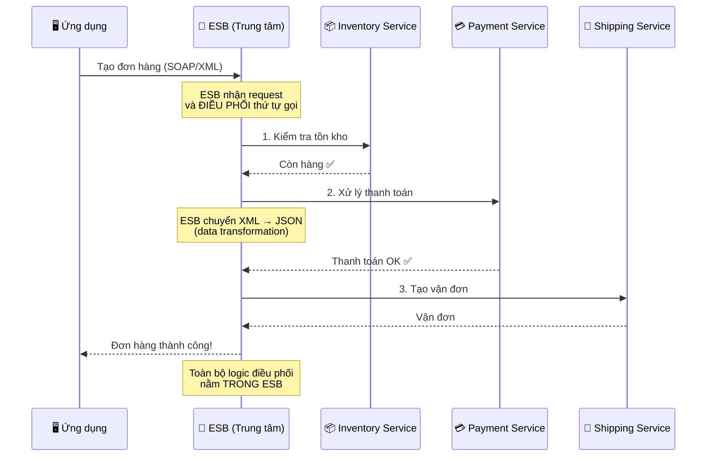
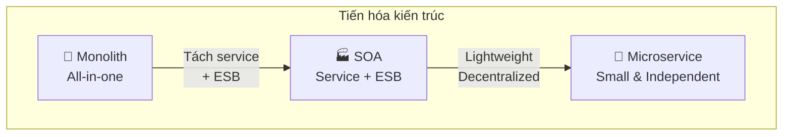
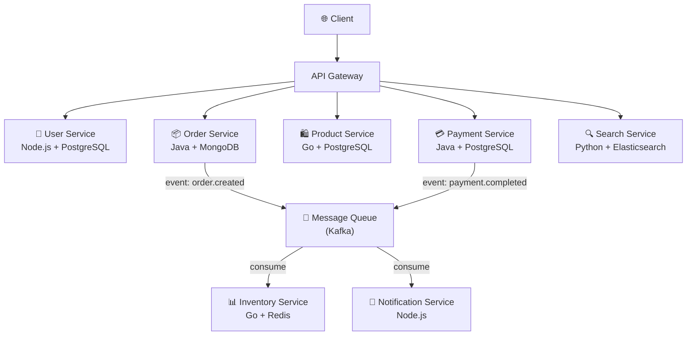
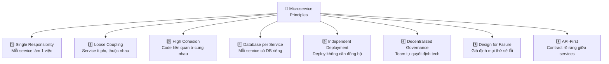

# Microservice Overview

## Mục lục

- [Microservice là gì?](#microservice-là-gì)
- [Kiến trúc Monolithic](#kiến-trúc-monolithic)
  - [Đặc điểm của Monolith](#đặc-điểm-của-monolith)
  - [Ưu điểm của Monolith](#ưu-điểm-của-monolith)
  - [Nhược điểm của Monolith](#nhược-điểm-của-monolith)
- [Kiến trúc Microservice](#kiến-trúc-microservice)
  - [Đặc điểm của Microservice](#đặc-điểm-của-microservice)
  - [Ưu điểm của Microservice](#ưu-điểm-của-microservice)
  - [Nhược điểm của Microservice](#nhược-điểm-của-microservice)
- [SOA là gì? (Service-Oriented Architecture)](#soa-là-gì-service-oriented-architecture)
  - [Ý tưởng cốt lõi của SOA](#ý-tưởng-cốt-lõi-của-soa)
  - [ESB là gì? (Enterprise Service Bus)](#esb-là-gì-enterprise-service-bus)
  - [Ví dụ cụ thể: Luồng "Tạo đơn hàng" trong SOA](#ví-dụ-cụ-thể-luồng-tạo-đơn-hàng-trong-soa)
  - [Vấn đề của SOA — Tại sao cần Microservice?](#vấn-đề-của-soa--tại-sao-cần-microservice)
  - [Tóm lại: SOA dễ hiểu qua phép ẩn dụ](#tóm-lại-soa-dễ-hiểu-qua-phép-ẩn-dụ)
  - [Hiểu lầm thường gặp: "SOA chỉ là Microservice + Orchestrator?"](#hiểu-lầm-thường-gặp-soa-chỉ-là-microservice--orchestrator)
- [SOA vs Microservice — Bảng so sánh](#soa-vs-microservice--bảng-so-sánh)
- [So sánh tổng hợp: Monolith vs SOA vs Microservice](#so-sánh-tổng-hợp-monolith-vs-soa-vs-microservice)
- [Khi nào nên dùng Microservice?](#khi-nào-nên-dùng-microservice)
- [Khi nào KHÔNG nên dùng Microservice?](#khi-nào-không-nên-dùng-microservice)
- [Ví dụ thực tế](#ví-dụ-thực-tế)
  - [Ví dụ 1: Hệ thống E-Commerce](#ví-dụ-1-hệ-thống-e-commerce)
  - [Ví dụ 2: Netflix — Từ Monolith đến Microservice](#ví-dụ-2-netflix--từ-monolith-đến-microservice)
- [Các nguyên tắc cốt lõi của Microservice](#các-nguyên-tắc-cốt-lõi-của-microservice)
- [Links liên quan](#links-liên-quan)

---

## Microservice là gì?

**Microservice Architecture** (kiến trúc vi dịch vụ) là một phong cách kiến trúc phần mềm trong đó ứng dụng được xây dựng dưới dạng **tập hợp các service nhỏ, độc lập**, mỗi service:

- Chạy trong **process riêng** (own process)
- Giao tiếp qua các **giao thức nhẹ** (lightweight protocols) như HTTP/REST, gRPC, hoặc messaging
- Được **triển khai độc lập** (independently deployable)
- Tập trung vào **một nhiệm vụ nghiệp vụ cụ thể** (single business capability)

> 💡 Thuật ngữ "Microservice" được phổ biến rộng rãi bởi **Martin Fowler** và **James Lewis** trong bài viết năm 2014.

---

## Kiến trúc Monolithic

**Monolithic Architecture** (kiến trúc nguyên khối) là kiến trúc truyền thống, trong đó toàn bộ ứng dụng được xây dựng và triển khai **như một đơn vị duy nhất**.

```
┌─────────────────────────────────────────────────┐
│                MONOLITHIC APP                   │
│                                                 │
│  ┌──────────┐ ┌──────────┐ ┌──────────────────┐ │
│  │    UI    │ │ Business │ │  Data Access     │ │
│  │  Layer   │ │  Logic   │ │    Layer         │ │
│  └──────────┘ └──────────┘ └──────────────────┘ │
│                                                 │
│  ┌─────────────────────────────────────────────┐│
│  │         Shared Database                     ││
│  └─────────────────────────────────────────────┘│
└─────────────────────────────────────────────────┘
         │
         ▼
   Deploy as ONE unit
   (WAR / JAR / single binary)
```

### Đặc điểm của Monolith

- Tất cả module nằm trong **một codebase**
- Chia sẻ **chung một database**
- Triển khai dưới dạng **một artifact** duy nhất (VD: WAR file, single binary)
- Các module giao tiếp qua **function call** trong cùng process

### Ưu điểm của Monolith

| Ưu điểm | Giải thích |
|----------|------------|
| **Đơn giản để phát triển** | Một codebase, dễ setup, dễ debug |
| **Dễ test** | End-to-end test trong cùng một process |
| **Dễ triển khai** | Chỉ cần deploy một artifact |
| **Hiệu suất cao** | Giao tiếp nội bộ qua function call, không qua network |
| **Consistency dễ đảm bảo** | ACID transaction trên cùng database |

### Nhược điểm của Monolith

| Nhược điểm | Giải thích |
|------------|------------|
| **Khó scale riêng lẻ** | Phải scale toàn bộ app dù chỉ một module cần |
| **Codebase phình to** | Khó hiểu, khó maintain khi hệ thống lớn |
| **Triển khai rủi ro** | Thay đổi nhỏ → deploy lại toàn bộ |
| **Technology lock-in** | Khó đổi tech stack cho từng phần |
| **Team coupling** | Nhiều team cùng sửa một codebase → conflict |

---

## Kiến trúc Microservice

```
┌──────────┐  ┌───────────┐  ┌──────────┐  ┌──────────┐
│ User     │  │ Order     │  │ Product  │  │ Payment  │
│ Service  │  │ Service   │  │ Service  │  │ Service  │
│          │  │           │  │          │  │          │
│ ┌──────┐ │  │ ┌──────┐  │  │ ┌──────┐ │  │ ┌──────┐ │
│ │ DB 1 │ │  │ │ DB 2 │  │  │ │ DB 3 │ │  │ │ DB 4 │ │
│ └──────┘ │  │ └──────┘  │  │ └──────┘ │  │ └──────┘ │
└────┬─────┘  └─────┬─────┘  └─────┬────┘  └─────┬────┘
     │              │              │             │
─────┴──────────────┴──────────────┴─────────────┴─────
              API Gateway / Message Bus
```

### Đặc điểm của Microservice

- Mỗi service **có database riêng** (Database per Service)
- Giao tiếp qua **network** (HTTP, gRPC, Message Queue)
- **Triển khai độc lập** — mỗi service có CI/CD riêng
- Mỗi service có thể dùng **tech stack khác nhau** (Polyglot)
- Tổ chức team theo **service ownership** (mỗi team sở hữu một hoặc vài service)

### Ưu điểm của Microservice

| Ưu điểm | Giải thích |
|----------|------------|
| **Scale độc lập** | Chỉ scale service nào cần, tiết kiệm tài nguyên |
| **Triển khai độc lập** | Thay đổi một service không ảnh hưởng service khác |
| **Tự do công nghệ** | Mỗi service chọn tech phù hợp nhất (Java, Go, Node.js, ...) |
| **Fault isolation** | Một service lỗi không kéo sập toàn hệ thống |
| **Team autonomy** | Team nhỏ, độc lập, di chuyển nhanh |
| **Dễ hiểu từng phần** | Codebase nhỏ, tập trung vào một domain |

### Nhược điểm của Microservice

| Nhược điểm | Giải thích |
|------------|------------|
| **Phức tạp phân tán** | Network latency, partial failure, eventual consistency |
| **Khó debug & trace** | Request đi qua nhiều service → cần distributed tracing |
| **Data consistency** | Không còn ACID transaction đơn giản → cần Saga pattern |
| **Ops overhead** | Nhiều service = nhiều thứ phải monitor, deploy, quản lý |
| **Testing phức tạp** | Integration test giữa các service khó hơn |
| **Network overhead** | Giao tiếp qua mạng chậm hơn function call |

---

## SOA là gì? (Service-Oriented Architecture)

**SOA** (Service-Oriented Architecture — kiến trúc hướng dịch vụ) là một kiến trúc phần mềm xuất hiện từ **đầu những năm 2000**, chủ yếu được dùng trong các **doanh nghiệp lớn** (ngân hàng, bảo hiểm, viễn thông...).

### Dòng thời gian: SOA ra đời trước Microservice

```
Timeline kiến trúc phần mềm:
═══════════════════════════════════════════════════════════════

~1990s ──── Monolithic Architecture
            │  Tất cả trong 1 cục, deploy 1 lần
            │
~2000-2005 ── SOA ra đời
            │  Tách thành service, kết nối qua ESB
            │  Phổ biến trong enterprise (ngân hàng, viễn thông)
            │  Công cụ: IBM WebSphere, Oracle SOA Suite, TIBCO
            │
~2005-2010 ── SOA bộc lộ vấn đề
            │  ESB phình to, trở thành bottleneck
            │  SOAP/XML quá nặng nề
            │
~2011-2014 ── Microservice ra đời
            │  Netflix, Amazon, Spotify áp dụng thành công
            │  Martin Fowler & James Lewis đặt tên chính thức (2014)
            │  Lấy ý tưởng tách service từ SOA,
            │  nhưng BỎ ĐI sự tập trung (ESB)
            │
~2015+  ──── Microservice trở thành xu hướng chính
            Cloud-native, Docker, Kubernetes hỗ trợ mạnh

═══════════════════════════════════════════════════════════════
```

> 💡 **Microservice không phải phát minh mới hoàn toàn** — nó là bước tiến hóa từ SOA, giữ lại ý tưởng hay (tách service) và loại bỏ điểm yếu (ESB tập trung, shared DB).

### Ý tưởng cốt lõi của SOA

Trước SOA, doanh nghiệp lớn thường có nhiều hệ thống **rời rạc**, không nói chuyện được với nhau:

```
❌ Trước SOA — Các hệ thống "silo" (cô lập)
═══════════════════════════════════════════════

┌─────────────┐  ┌─────────────┐  ┌─────────────┐
│ Hệ thống HR │  │ Hệ thống    │  │ Hệ thống    │
│ (Nhân sự)   │  │ Kế toán     │  │ Bán hàng    │
│             │  │             │  │             │
│ Không kết   │  │ Không kết   │  │ Không kết   │
│ nối được    │  │ nối được    │  │ nối được    │
└─────────────┘  └─────────────┘  └─────────────┘
     ❌ Muốn biết lương nhân viên?
        → Phải vào 2 hệ thống khác nhau, copy paste thủ công!
```

SOA giải quyết bằng cách: **Mỗi hệ thống "bọc" chức năng của mình thành service**, rồi tất cả kết nối qua **một trung tâm điều phối gọi là ESB**.

### ESB là gì? (Enterprise Service Bus)

**ESB** là "bến xe trung tâm" — nơi mọi service gửi/nhận message. ESB chịu trách nhiệm:
- **Routing** — chuyển request đến đúng service
- **Transform** — chuyển đổi format dữ liệu (VD: XML → JSON)
- **Orchestration** — điều phối thứ tự gọi nhiều service
- **Protocol mediation** — dịch giữa các giao thức (SOAP, JMS, FTP...)

```
✅ Sau SOA — Kết nối qua ESB
═══════════════════════════════════════════════

                    ┌─────────────────────────┐
                    │     ESB (Bến xe TT)     │
                    │                         │
                    │  • Routing              │
                    │  • Data transformation  │
                    │  • Orchestration        │
                    │  • Logging              │
                    └────┬──────┬──────┬──────┘
                         │      │      │
              ┌──────────┘      │      └─────────┐
              │                 │                │
        ┌─────▼──────┐  ┌───────▼────┐  ┌────────▼────┐
        │ HR Service │  │ Accounting │  │   Sales     │
        │            │  │  Service   │  │  Service    │
        │ • getStaff │  │ • getSalary│  │ • getOrders │
        │ • addStaff │  │ • payroll  │  │ • getRevenue│
        └────────────┘  └────────────┘  └─────────────┘
              │                │                │
              └────────────────┼────────────────┘
                               │
                    ┌──────────▼──────────┐
                    │   Shared Database   │
                    │   (Oracle / DB2)    │
                    └─────────────────────┘

💡 Giờ muốn biết lương nhân viên?
   → HR Service lấy thông tin NV → ESB chuyển cho Accounting Service
   → Accounting tính lương → ESB trả kết quả → Tự động!
```

### Ví dụ cụ thể: Luồng "Tạo đơn hàng" trong SOA



**Điểm quan trọng:** Logic nghiệp vụ "tạo đơn hàng gồm 3 bước" nằm **trong ESB**, không phải trong service. ESB trở thành **bộ não trung tâm**.

### Vấn đề của SOA — Tại sao cần Microservice?

| Vấn đề | Giải thích | Ảnh hưởng |
|--------|------------|-----------|
| **ESB là single point of failure** | ESB chết → toàn bộ hệ thống chết | Rủi ro cực lớn |
| **ESB phình to** | Càng nhiều logic đổ vào ESB → ESB trở thành "God Object" | Khó maintain, khó test |
| **Smart pipes, dumb endpoints** | ESB thông minh, service thụ động → service không tự chủ | Ngược với Microservice: "dumb pipes, smart endpoints" |
| **Shared database** | Nhiều service dùng chung DB → thay đổi schema ảnh hưởng tất cả | Coupling cao, sợ thay đổi |
| **Nặng nề** | SOAP/XML, WSDL, WS-* standards → phức tạp | Chậm, khó phát triển |
| **Vendor lock-in** | ESB thường là sản phẩm thương mại đắt đỏ (IBM, Oracle, TIBCO) | Chi phí cao, phụ thuộc vendor |

```
SOA:  "Smart Pipes, Dumb Endpoints"
       ┌──────────────────────────┐
       │        ESB               │
       │  ┌────────────────────┐  │
       │  │ Business logic     │  │  ← Logic nằm ở đây
       │  │ Routing rules      │  │
       │  │ Data transformation│  │
       │  │ Orchestration      │  │
       │  └────────────────────┘  │
       └──────────────────────────┘
              │         │
        ┌─────▼──┐ ┌────▼───┐
        │Service │ │Service │  ← Service đơn giản,
        │  (đơn  │ │  (đơn  │    chỉ nhận lệnh
        │  giản) │ │  giản) │
        └────────┘ └────────┘

Microservice:  "Dumb Pipes, Smart Endpoints"
       ┌──────────────────────────┐
       │    API Gateway / MQ      │
       │    (chỉ routing đơn giản)│  ← Pipe đơn giản
       └──────────────────────────┘
              │          │
        ┌─────▼───┐ ┌────▼────┐
        │Service  │ │Service  │  ← Service THÔNG MINH,
        │ ┌─────┐ │ │ ┌─────┐ │    tự chứa logic
        │ │Logic│ │ │ │Logic│ │
        │ │ DB  │ │ │ │ DB  │ │
        │ └─────┘ │ │ └─────┘ │
        └─────────┘ └─────────┘
```

### Tóm lại: SOA dễ hiểu qua phép ẩn dụ

| | SOA | Microservice |
|--|-----|-------------|
| **Ẩn dụ** | 🏭 **Nhà máy lớn** — có 1 quản đốc (ESB) điều phối mọi công nhân | 🏪 **Chuỗi cửa hàng nhỏ** — mỗi cửa hàng tự quản, tự quyết |
| **Giao tiếp** | Qua tổng đài trung tâm (ESB) | Gọi trực tiếp hoặc gửi tin nhắn (REST/gRPC/MQ) |
| **Dữ liệu** | Kho hàng chung (shared DB) | Mỗi cửa hàng có kho riêng (DB per service) |
| **Khi 1 phần lỗi** | Quản đốc bận → cả nhà máy đứng | Cửa hàng A đóng → cửa hàng B vẫn bán bình thường |

> 💡 **Tóm gọn:** SOA = "tách service nhưng vẫn phụ thuộc vào trung tâm (ESB)". Microservice = "tách service VÀ phi tập trung hoàn toàn".

### Hiểu lầm thường gặp: "SOA chỉ là Microservice + Orchestrator?"

Thoạt nhìn SOA giống Microservice dùng **Saga Orchestration pattern** — đều có một "bộ điều phối" ở giữa. Nhưng thực tế khác nhau rất nhiều:

| | ESB trong SOA | Saga Orchestrator trong Microservice |
|--|--------------|--------------------------------------|
| **Số lượng** | **1 ESB duy nhất** cho toàn hệ thống | **Nhiều orchestrator**, mỗi cái lo 1 workflow |
| **Phạm vi** | Làm **mọi thứ**: routing, transform data, orchestrate, protocol mediation, logging | **Chỉ điều phối** 1 business flow cụ thể |
| **Database** | Các service **dùng chung DB** | Mỗi service **có DB riêng** |
| **Khi lỗi** | ESB chết → **cả hệ thống chết** | Orchestrator A chết → chỉ flow A bị ảnh hưởng |
| **Service** | Service lớn, **thụ động** (chờ ESB gọi) | Service nhỏ, **tự chủ** (tự chứa logic) |
| **Tech** | Bắt buộc cùng stack (SOAP/XML) | Mỗi service tự chọn tech |

```
SOA — 1 ESB "ông vua" quản hết:

       Service A ──┐
       Service B ──┼──▶ [ ESB — God Object ]  ──▶ Shared DB
       Service C ──┘      routing + transform
                          + orchestrate + logging
                          + protocol mediation
                          (TẤT CẢ trong 1 chỗ)


Microservice + Saga — nhiều orchestrator nhỏ, service tự chủ:

  ┌─ Order Saga Orchestrator ──────── chỉ lo flow đặt hàng
  ├─ Payment Saga Orchestrator ────── chỉ lo flow thanh toán
  ├─ Refund Saga Orchestrator ─────── chỉ lo flow hoàn tiền
  │
  │  Service A ──▶ DB A  ┐
  │  Service B ──▶ DB B  ├── mỗi service ĐỘC LẬP hoàn toàn
  │  Service C ──▶ DB C  ┘
```

> 💡 **Nói đơn giản:** ESB giống **1 ông giám đốc** quản hết mọi phòng ban. Saga Orchestrator giống **trưởng nhóm dự án** — mỗi dự án có 1 trưởng nhóm riêng, nhưng nhân viên (service) vẫn tự chủ trong công việc của mình.

---

## SOA vs Microservice — Bảng so sánh

| Tiêu chí | SOA | Microservice |
|----------|-----|-------------|
| **Kích thước service** | Lớn, có thể chứa nhiều function | Nhỏ, tập trung vào 1 business capability |
| **Giao tiếp** | ESB (Enterprise Service Bus) — nặng, tập trung | Lightweight protocol (REST, gRPC, MQ) |
| **Data** | Thường **share database** | **Database per service** |
| **Logic điều phối** | Nằm trong ESB (centralized) | Nằm trong service (decentralized) |
| **Governance** | Centralized governance | Decentralized governance |
| **Triển khai** | Thường deploy cùng nhau | Deploy **độc lập** |
| **Technology** | Thường đồng nhất (Java/SOAP) | Polyglot (đa ngôn ngữ, đa framework) |
| **Scope** | Enterprise-wide reuse | Bounded context (DDD) |
| **Coupling** | Cao (qua ESB) | Thấp (loose coupling) |
| **Chi phí** | Cao (license ESB thương mại) | Thấp hơn (open-source tools) |

---

## So sánh tổng hợp: Monolith vs SOA vs Microservice



| Tiêu chí | Monolith | SOA | Microservice |
|----------|----------|-----|-------------|
| **Độ phức tạp ban đầu** | ⭐ Thấp | ⭐⭐⭐ Cao | ⭐⭐ Trung bình |
| **Khả năng scale** | Toàn bộ | Theo service group | Theo từng service |
| **Tốc độ phát triển** | Nhanh (ban đầu) | Chậm (ESB phức tạp) | Nhanh (khi đã setup) |
| **Team size phù hợp** | Nhỏ (< 10) | Lớn (enterprise) | Trung bình → Lớn |
| **Triển khai** | Đơn giản | Phức tạp | Tự động (CI/CD) |
| **Fault isolation** | Không | Một phần | Tốt |
| **Tech diversity** | Một tech stack | Hạn chế | Tự do |

---

## Khi nào nên dùng Microservice?

✅ **Nên dùng khi:**

1. **Hệ thống lớn, phức tạp** — nhiều domain nghiệp vụ riêng biệt
2. **Cần scale từng phần** — VD: search service cần scale nhiều hơn auth service
3. **Nhiều team phát triển song song** — giảm conflict, tăng autonomy
4. **Cần triển khai thường xuyên** — deploy service riêng lẻ, không ảnh hưởng toàn hệ thống
5. **Cần đa dạng công nghệ** — VD: ML service dùng Python, API service dùng Go
6. **Yêu cầu fault isolation** — lỗi một phần không được ảnh hưởng toàn bộ

## Khi nào KHÔNG nên dùng Microservice?

❌ **Không nên khi:**

1. **Ứng dụng nhỏ, đơn giản** — overhead quá lớn so với lợi ích
2. **Team nhỏ** (< 5 người) — không đủ người để vận hành nhiều service
3. **Chưa hiểu rõ domain** — chia sai boundary sẽ rất khó sửa
4. **Chưa có DevOps maturity** — cần CI/CD, monitoring, containerization
5. **Startup giai đoạn đầu** — nên bắt đầu bằng Monolith, tách sau khi hiểu rõ domain

> 💡 **Lời khuyên từ Martin Fowler**: *"Don't even consider microservices unless you have a system that's too complex to manage as a monolith."*
>
> **MonolithFirst** — Bắt đầu bằng Monolith, chuyển sang Microservice khi thực sự cần.

---

## Ví dụ thực tế

### Ví dụ 1: Hệ thống E-Commerce

**Monolith approach:**

```
┌────────────────────────────────────────────┐
│            E-Commerce Monolith             │
│                                            │
│  User Module ← Order Module ← Product      │
│       ↕            ↕           Module      │
│  Payment Module ← Inventory ← Search       │
│       ↕            Module      Module      │
│  Notification Module                       │
│                                            │
│  ┌──────────────────────────────────────┐  │
│  │         Shared PostgreSQL            │  │
│  └──────────────────────────────────────┘  │
└────────────────────────────────────────────┘
```

**Microservice approach:**



**Phân tích:**
- **User Service**: Quản lý đăng ký, đăng nhập, profile → dùng Node.js vì CRUD đơn giản
- **Order Service**: Logic phức tạp, cần transaction → dùng Java
- **Search Service**: Full-text search → dùng Python + Elasticsearch
- **Inventory Service**: Đọc/ghi nhanh, real-time → dùng Go + Redis
- Các service giao tiếp qua **Kafka** cho event-driven flow (order created → update inventory → gửi notification)

### Ví dụ 2: Netflix — Từ Monolith đến Microservice

Netflix là một trong những case study nổi tiếng nhất về chuyển đổi từ Monolith sang Microservice.

```
Timeline:
═══════════════════════════════════════════════════════════

2007 ─── Monolithic Architecture
         │ - Single Java WAR deployment
         │ - Shared Oracle database
         │ - Vertical scaling
         │
2008 ─── Database corruption → 3 ngày downtime
         │ → Quyết định chuyển sang Microservice
         │
2009-2011 ─── Migration phase
         │ - Tách từng module thành service
         │ - Chuyển sang AWS (cloud-native)
         │ - Xây dựng OSS tools: Eureka, Zuul, Hystrix
         │
2012+ ── Full Microservice
         │ - 700+ microservices
         │ - 1 tỷ API calls/ngày
         │ - Deploy hàng nghìn lần/ngày

═══════════════════════════════════════════════════════════
```

**Bài học từ Netflix:**
1. **Strangler Fig Pattern** — Dần dần thay thế từng phần của Monolith, không rewrite từ đầu
2. **Chaos Engineering** — Tạo ra Chaos Monkey để test fault tolerance
3. **Open Source** — Chia sẻ công cụ nội bộ: Eureka (Service Discovery), Zuul (API Gateway), Hystrix (Circuit Breaker)

---

## Các nguyên tắc cốt lõi của Microservice



| Nguyên tắc | Mô tả | Ví dụ |
|------------|--------|-------|
| **Single Responsibility** | Mỗi service chỉ đảm nhận một business capability | User Service chỉ quản lý user, không xử lý payment |
| **Loose Coupling** | Thay đổi service A không cần sửa service B | Giao tiếp qua API contract, không share internal model |
| **High Cohesion** | Những thứ thay đổi cùng nhau nên ở cùng nhau | Order logic + Order DB nằm trong Order Service |
| **Database per Service** | Mỗi service sở hữu data riêng | User Service dùng PostgreSQL, Search dùng Elasticsearch |
| **Independent Deployment** | Deploy service không cần deploy service khác | CI/CD pipeline riêng cho mỗi service |
| **Decentralized Governance** | Team tự chọn ngôn ngữ, framework, tool | Team A dùng Java, Team B dùng Go |
| **Design for Failure** | Mọi network call đều có thể fail | Dùng Circuit Breaker, Retry, Fallback |
| **API-First** | Thiết kế API trước khi implement | OpenAPI spec, gRPC proto file |

---

## Links liên quan

- Tiếp theo: [Single Responsibility & Bounded Context](02-single-responsibility-bounded-context.md) — SRP và cách xác định ranh giới service
- [Loose Coupling & High Cohesion](03-loose-coupling-high-cohesion.md) — Nguyên tắc kết nối lỏng, gắn kết cao
- [Autonomy & Independence](04-autonomy-independence.md) — Tự chủ và độc lập trong Microservice
- [Decomposition Strategies](05-decomposition-strategies.md) — Cách phân tách Monolith thành Microservice
- [Inter-Service Communication](06-inter-service-communication.md) — Giao tiếp giữa các service
- [Resilience Patterns](10-resilience-patterns.md) — Xử lý lỗi trong hệ thống phân tán
- [Design Patterns tổng hợp](16-design-patterns.md) — Tất cả pattern quan trọng
