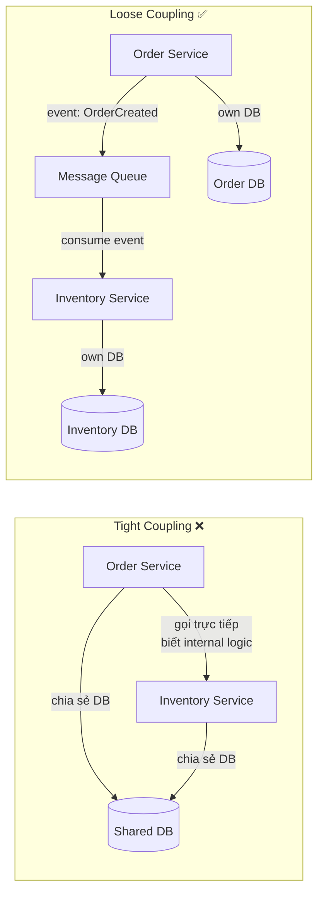
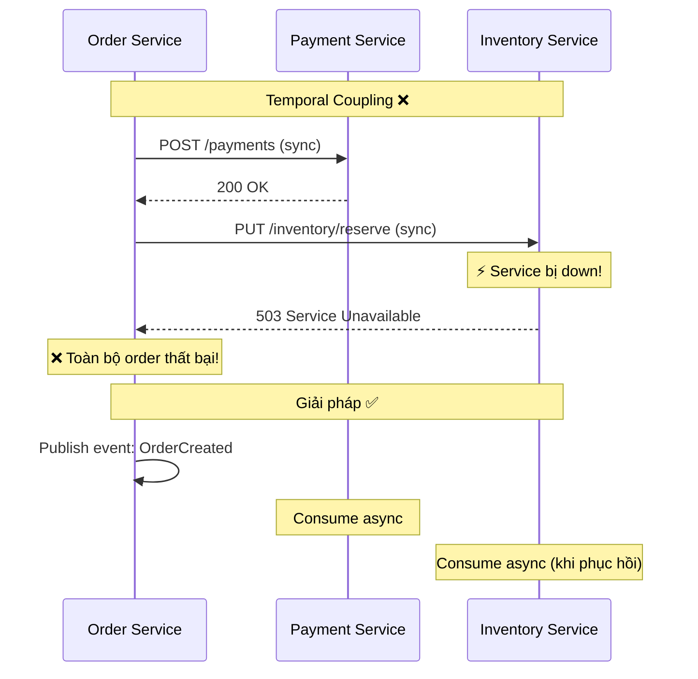
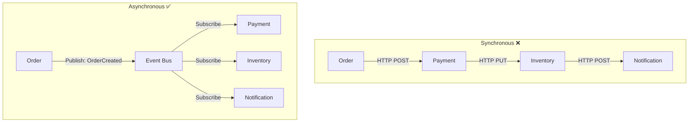
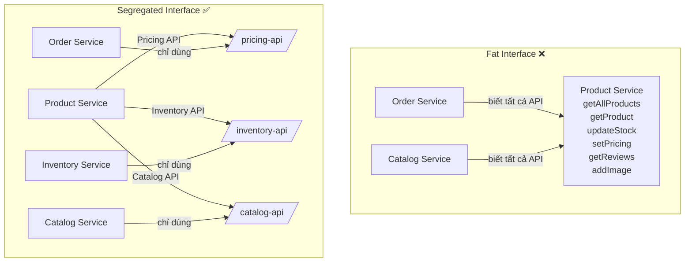
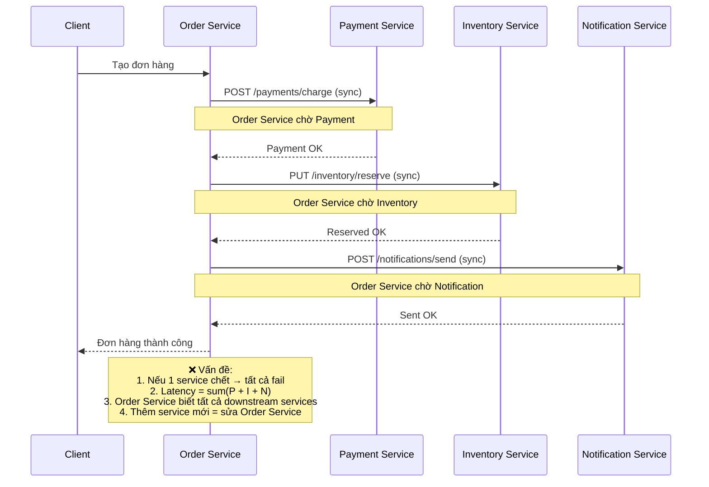
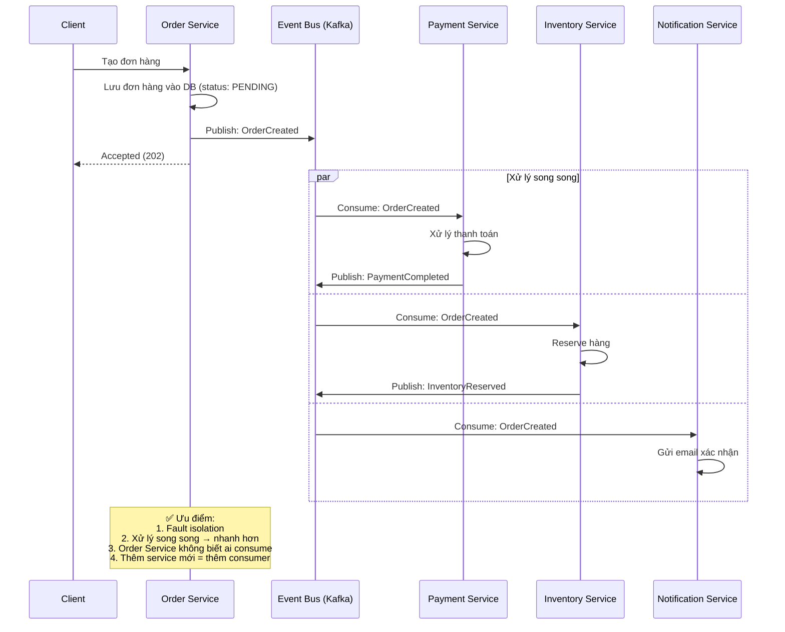
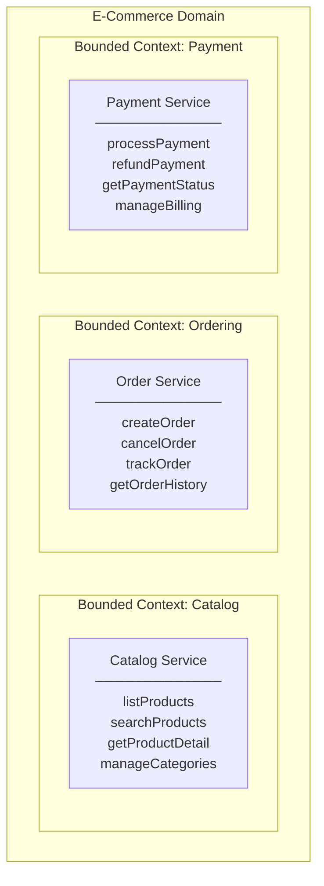
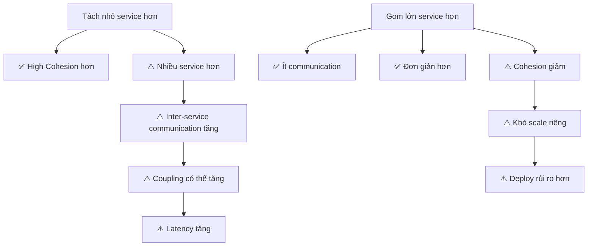
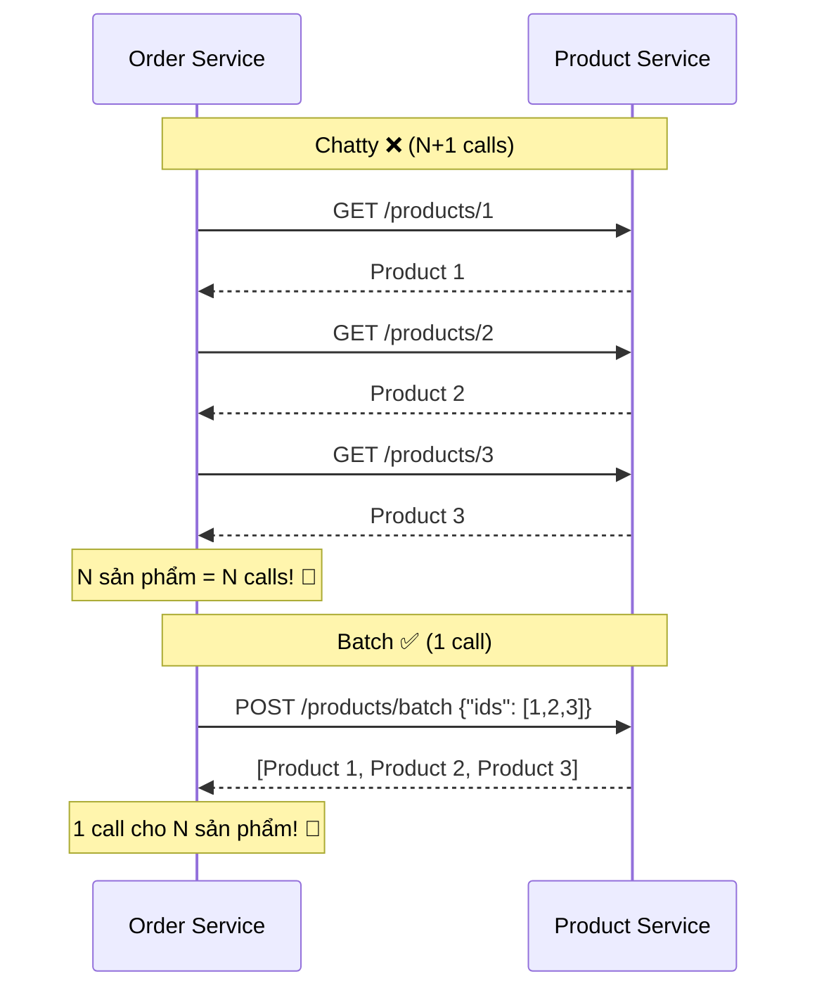
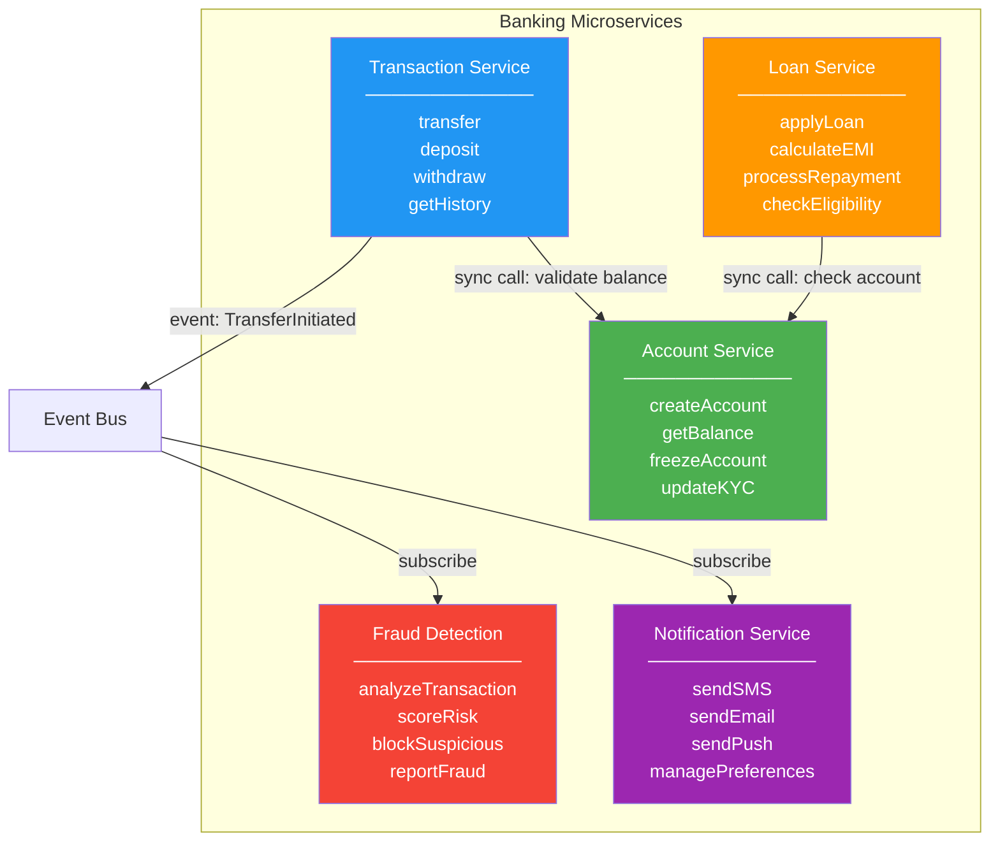

# Loose Coupling & High Cohesion trong Microservice

## 📋 Mục lục

- [1. Giới thiệu](#1-giới-thiệu)
- [2. Loose Coupling — Liên kết lỏng](#2-loose-coupling--liên-kết-lỏng)
  - [2.1. Loose Coupling là gì?](#21-loose-coupling-là-gì)
  - [2.2. Tại sao Loose Coupling quan trọng?](#22-tại-sao-loose-coupling-quan-trọng)
  - [2.3. Các loại Coupling trong Microservice](#23-các-loại-coupling-trong-microservice)
  - [2.4. Kỹ thuật đạt Loose Coupling](#24-kỹ-thuật-đạt-loose-coupling)
  - [2.5. Ví dụ thực tế — Tight vs Loose Coupling](#25-ví-dụ-thực-tế--tight-vs-loose-coupling)
- [3. High Cohesion — Tính gắn kết cao](#3-high-cohesion--tính-gắn-kết-cao)
  - [3.1. High Cohesion là gì?](#31-high-cohesion-là-gì)
  - [3.2. Các mức độ Cohesion](#32-các-mức-độ-cohesion)
  - [3.3. Kỹ thuật đạt High Cohesion](#33-kỹ-thuật-đạt-high-cohesion)
  - [3.4. Ví dụ thực tế — Low vs High Cohesion](#34-ví-dụ-thực-tế--low-vs-high-cohesion)
- [4. Mối quan hệ giữa Coupling và Cohesion](#4-mối-quan-hệ-giữa-coupling-và-cohesion)
  - [4.1. Ma trận Coupling–Cohesion](#41-ma-trận-couplingcohesion)
  - [4.2. Trade-off trong thực tế](#42-trade-off-trong-thực-tế)
- [5. Các Anti-patterns phổ biến](#5-các-anti-patterns-phổ-biến)
  - [5.1. Distributed Monolith](#51-distributed-monolith)
  - [5.2. Chatty Services](#52-chatty-services)
  - [5.3. Shared Database](#53-shared-database)
  - [5.4. God Service](#54-god-service)
- [6. Đo lường Coupling và Cohesion](#6-đo-lường-coupling-và-cohesion)
  - [6.1. Metrics cho Coupling](#61-metrics-cho-coupling)
  - [6.2. Metrics cho Cohesion](#62-metrics-cho-cohesion)
  - [6.3. Công cụ hỗ trợ đo lường](#63-công-cụ-hỗ-trợ-đo-lường)
- [7. Áp dụng trong thực tế — Case Study](#7-áp-dụng-trong-thực-tế--case-study)
  - [7.1. E-Commerce Platform](#71-e-commerce-platform)
  - [7.2. Banking System](#72-banking-system)
- [8. Best Practices](#8-best-practices)
- [9. Tổng kết](#9-tổng-kết)
- [10. Liên kết liên quan](#10-liên-kết-liên-quan)

---

## 1. Giới thiệu

**Loose Coupling** (liên kết lỏng) và **High Cohesion** (tính gắn kết cao) là hai nguyên tắc nền tảng quyết định chất lượng thiết kế của một hệ thống Microservice. Chúng không phải là khái niệm mới — đã xuất hiện từ thời lập trình module hóa (structured programming) với Larry Constantine năm 1968 — nhưng trong bối cảnh Microservice, tầm quan trọng của chúng được nâng lên một cấp độ hoàn toàn khác.

Nếu **Bounded Context** ([xem doc 02](02-single-responsibility-bounded-context.md)) giúp xác định **ranh giới** của mỗi service, thì Loose Coupling & High Cohesion giúp xác định **chất lượng** của ranh giới đó:
- Service có **thực sự độc lập** không? → Loose Coupling
- Service có **tập trung đúng việc** không? → High Cohesion

```
┌─────────────────────────────────────────────────────────────────┐
│                    THIẾT KẾ MICROSERVICE TỐT                    │
│                                                                 │
│  ┌─────────────────┐          ┌─────────────────┐               │
│  │   Service A     │          │   Service B     │               │
│  │  ┌───┐ ┌───┐    │  ─ ─ ─▶  │  ┌───┐ ┌───┐    │               │
│  │  │ a │ │ b │    │ (loose)  │  │ d │ │ e │    │               │
│  │  └─┬─┘ └─┬─┘    │          │  └─┬─┘ └─┬─┘    │               │
│  │    └──┬──┘      │          │    └──┬──┘      │               │
│  │       │(tight)  │          │       │(tight)  │               │
│  │    ┌──┴──┐      │          │    ┌──┴──┐      │               │
│  │    │  c  │      │          │    │  f  │      │               │
│  │    └─────┘      │          │    └─────┘      │               │
│  └─────────────────┘          └─────────────────┘               │
│                                                                 │
│  Bên trong: High Cohesion (gắn kết chặt)                        │
│  Bên ngoài: Loose Coupling (liên kết lỏng)                      │
└─────────────────────────────────────────────────────────────────┘
```

---

## 2. Loose Coupling — Liên kết lỏng

### 2.1. Loose Coupling là gì?

**Loose Coupling** là đặc tính của hệ thống mà trong đó các thành phần (service) có **mức phụ thuộc tối thiểu** vào nhau. Khi một service thay đổi, các service khác **không cần phải thay đổi theo** hoặc chỉ cần thay đổi rất ít.



**Định nghĩa chính thức**: Hai service A và B là loosely coupled nếu:
1. A có thể thay đổi implementation mà **không ảnh hưởng** đến B
2. A và B có thể **deploy độc lập** nhau
3. A và B có thể **scale độc lập** nhau
4. Khi A gặp sự cố, B **vẫn hoạt động** được (có thể với chức năng giảm)

### 2.2. Tại sao Loose Coupling quan trọng?

| Lợi ích | Mô tả | Ví dụ |
|---------|--------|-------|
| **Independent Deployment** | Deploy service A mà không cần deploy B | Update logic tính giá mà không cần update Order Service |
| **Independent Scaling** | Scale riêng từng service theo nhu cầu | Scale Payment Service x10 vào Black Friday |
| **Fault Isolation** | Lỗi service A không lan sang B | Payment Service chết, User vẫn duyệt sản phẩm được |
| **Team Autonomy** | Mỗi team tự quyết công nghệ, release cycle | Team A dùng Java, Team B dùng Go |
| **Faster Development** | Giảm coordination giữa các team | Không cần họp sync deploy giữa 5 team |
| **Easier Testing** | Test từng service một cách độc lập | Mock external dependencies, test nhanh hơn |

### 2.3. Các loại Coupling trong Microservice

Coupling không chỉ có một loại. Dưới đây là phân loại từ **nguy hiểm nhất** (nên tránh) đến **chấp nhận được**:

#### 2.3.1. Implementation Coupling (🔴 Nguy hiểm nhất)

Service A phụ thuộc vào **chi tiết cài đặt bên trong** của Service B.

```
❌ Service A gọi trực tiếp class/method nội bộ của Service B
❌ Service A đọc trực tiếp database của Service B
❌ Service A phụ thuộc vào cấu trúc bảng DB của Service B
```

**Ví dụ vi phạm**:
```
Order Service → SELECT * FROM inventory.products WHERE stock > 0
                         ↑ đọc trực tiếp DB của Inventory Service!
```

Khi Inventory Service đổi schema (ví dụ rename `stock` → `quantity`), Order Service sẽ **lỗi ngay lập tức**.

#### 2.3.2. Temporal Coupling (🟠 Nguy hiểm)

Service A **yêu cầu** Service B phải **đang hoạt động** tại thời điểm gọi.



#### 2.3.3. Deployment Coupling (🟠 Nguy hiểm)

Phải deploy **nhiều service cùng lúc** để hệ thống hoạt động đúng.

```
❌ Phải deploy Order Service v2.0 VÀ Payment Service v3.0 cùng lúc
   vì chúng phụ thuộc vào API version mới của nhau

✅ Order Service v2.0 tương thích ngược với Payment Service v2.0 VÀ v3.0
   → Deploy từng cái riêng, bất kỳ thời điểm nào
```

#### 2.3.4. Domain Coupling (🟢 Chấp nhận được)

Service A cần **thông tin nghiệp vụ** từ Service B để hoàn thành công việc. Đây là coupling **tự nhiên** và không thể tránh hoàn toàn.

```
✅ Order Service cần biết giá sản phẩm → gọi Product Service API
✅ Shipping Service cần biết địa chỉ → gọi Customer Service API
```

**Quan trọng**: Domain Coupling là chấp nhận được, nhưng cần **giảm thiểu** và **quản lý tốt**.

#### 2.3.5. Contract Coupling (🟢 Chấp nhận được)

Service A phụ thuộc vào **API contract** (interface) của Service B, không phải implementation.

```
✅ Order Service gọi: GET /api/v1/products/{id}
   → Chỉ biết URL, request/response format
   → Không biết Product Service dùng Java hay Go, PostgreSQL hay MongoDB
```

### 2.4. Kỹ thuật đạt Loose Coupling

#### 2.4.1. Asynchronous Communication (Giao tiếp bất đồng bộ)

Sử dụng **message broker** (Kafka, RabbitMQ, NATS) thay vì gọi HTTP trực tiếp.



**Ưu điểm**:
- Service **không cần biết** ai sẽ xử lý event
- Service consumer có thể **offline tạm thời**, xử lý sau khi phục hồi
- Dễ dàng **thêm consumer mới** mà không ảnh hưởng producer

**Nhược điểm**:
- Tăng **complexity** (quản lý message broker, xử lý duplicate, ordering)
- **Eventual consistency** — dữ liệu không đồng bộ ngay lập tức
- Khó **debug** và trace hơn

#### 2.4.2. API Contract & Versioning

Định nghĩa API contract rõ ràng và áp dụng **backward-compatible versioning**.

```
# Backward Compatible (không breaking) ✅
- Thêm field mới vào response
- Thêm endpoint mới
- Thêm optional parameter

# Breaking Change (cần version mới) ⚠️
- Xóa hoặc rename field trong response
- Thay đổi kiểu dữ liệu của field
- Xóa endpoint
```

**Chiến lược versioning**:

| Chiến lược | Cách dùng | Ưu điểm | Nhược điểm |
|-----------|-----------|----------|------------|
| **URL Path** | `/api/v1/orders` | Đơn giản, rõ ràng | URL dài, nhiều version phải maintain |
| **Header** | `Accept: application/vnd.api+json;version=1` | URL sạch | Khó test bằng browser |
| **Query Param** | `/api/orders?version=1` | Dễ test | Dễ quên, không chuẩn |

#### 2.4.3. Event-Driven Architecture

Thay vì service A **yêu cầu** service B làm gì (command), service A **thông báo** điều gì đã xảy ra (event), và các service khác tự quyết định phản ứng.

```
# Command Pattern (higher coupling) ⚠️
Order Service → "Hãy trừ tiền khách hàng 100$" → Payment Service

# Event Pattern (lower coupling) ✅
Order Service → "Đơn hàng #123 đã được tạo, tổng 100$" → Event Bus
Payment Service tự lắng nghe và quyết định: "OK, tôi sẽ xử lý thanh toán"
Inventory Service tự lắng nghe và quyết định: "OK, tôi sẽ reserve hàng"
Email Service tự lắng nghe và quyết định: "OK, tôi sẽ gửi email xác nhận"
```

#### 2.4.4. Database per Service

Mỗi service sở hữu **riêng** database của mình. Không service nào được đọc/ghi trực tiếp vào database của service khác.

```
┌──────────────┐    ┌──────────────┐    ┌──────────────┐
│ Order Service│    │Product Service│   │ User Service │
└──────┬───────┘    └──────┬───────┘    └──────┬───────┘
       │                   │                   │
  ┌────▼─────┐         ┌───▼─────┐         ┌───▼──────┐
  │Order DB  │         │Product  │         │ User DB  │
  │(Postgres)│         │DB(Mongo)│         │(Postgres)│
  └─────────┘          └─────────┘         └──────────┘
       ✅                  ✅                  ✅
  Mỗi service            Mỗi service         Mỗi service
  own riêng DB          own riêng DB         own riêng DB
```

> 📖 Chi tiết về Database per Service → [09-data-management.md](09-data-management.md)

#### 2.4.5. Interface Segregation (Tách biệt giao diện)

Mỗi consumer chỉ nên biết về **phần API mà nó cần**, không phải toàn bộ API của provider.



### 2.5. Ví dụ thực tế — Tight vs Loose Coupling

#### Bài toán: Xử lý đơn hàng trong E-Commerce

**Tight Coupling ❌**:



**Loose Coupling ✅**:



---

## 3. High Cohesion — Tính gắn kết cao

### 3.1. High Cohesion là gì?

**High Cohesion** (tính gắn kết cao) nghĩa là mọi thành phần bên trong một service đều **liên quan chặt chẽ** đến nhau và cùng phục vụ **một mục đích duy nhất**. Nói cách khác: mọi thứ thay đổi cùng nhau thì **nên ở cùng nhau**.

```
High Cohesion ✅:
┌─────────────────────────────┐
│      Payment Service        │
│  ┌───────────────────────┐  │
│  │ processPayment()      │  │
│  │ refundPayment()       │  │
│  │ getPaymentHistory()   │  │
│  │ validateCard()        │  │
│  │ calculateFees()       │  │
│  │ generateReceipt()     │  │
│  └───────────────────────┘  │
│  → Tất cả đều liên quan     │
│    đến "thanh toán"         │
└─────────────────────────────┘

Low Cohesion ❌:
┌─────────────────────────────┐
│      "Utility" Service      │
│  ┌───────────────────────┐  │
│  │ processPayment()      │  │ ← Thanh toán
│  │ sendEmail()           │  │ ← Email
│  │ resizeImage()         │  │ ← Xử lý ảnh
│  │ generateReport()      │  │ ← Báo cáo
│  │ validateAddress()     │  │ ← Địa lý
│  │ convertCurrency()     │  │ ← Tài chính
│  └───────────────────────┘  │
│  → Không liên quan gì nhau! │
└─────────────────────────────┘
```

### 3.2. Các mức độ Cohesion

Từ **tốt nhất** → **tệ nhất**:

| Mức độ | Tên | Mô tả | Ví dụ |
|--------|-----|--------|-------|
| 🟢 1 | **Functional Cohesion** | Mọi thành phần cùng thực hiện **1 chức năng** rõ ràng | Payment Service chỉ xử lý thanh toán |
| 🟢 2 | **Sequential Cohesion** | Output của phần A là input của phần B trong **1 pipeline** | Data Processing: Parse → Validate → Transform → Store |
| 🟡 3 | **Communicational Cohesion** | Các phần cùng thao tác trên **1 tập dữ liệu** | Customer Service: CRUD trên customer data |
| 🟡 4 | **Procedural Cohesion** | Các phần thực hiện theo **1 trình tự** nhưng không chia sẻ data | Wizard steps: Step1 → Step2 → Step3 |
| 🟠 5 | **Temporal Cohesion** | Các phần chạy **cùng thời điểm** nhưng không liên quan logic | Init module: load config + init logger + warm cache |
| 🔴 6 | **Logical Cohesion** | Gom vì **cùng loại** nhưng khác chức năng | Utils: stringUtils, dateUtils, fileUtils |
| 🔴 7 | **Coincidental Cohesion** | Gom **ngẫu nhiên**, không liên quan | "MiscService" chứa đủ thứ |

**Mục tiêu**: Đạt **Functional Cohesion** hoặc **Sequential Cohesion** cho mỗi Microservice.

### 3.3. Kỹ thuật đạt High Cohesion

#### 3.3.1. Thiết kế theo Domain (DDD Alignment)

Mỗi service tương ứng với **1 Bounded Context** trong domain model.



#### 3.3.2. Single Responsibility Principle (SRP)

Một service chỉ nên có **1 lý do để thay đổi**.

```
✅ Order Service thay đổi khi:
   → Logic xử lý đơn hàng thay đổi

❌ Order Service KHÔNG nên thay đổi khi:
   → Cách gửi email thay đổi (→ Notification Service)
   → Cách tính thuế thay đổi (→ Tax Service)
   → Cách xử lý thanh toán thay đổi (→ Payment Service)
```

> 📖 Chi tiết SRP → [02-single-responsibility-bounded-context.md](02-single-responsibility-bounded-context.md)

#### 3.3.3. Cohesive Data Ownership

Service sở hữu **tất cả data** liên quan đến domain của nó, và **chỉ** data đó.

```
┌─────────────────────────────────────────────────────┐
│             Product Service                         │
│                                                     │
│  Owns:                                              │
│  ├── products table (name, description, SKU)        │
│  ├── categories table (name, hierarchy)             │
│  ├── product_images table (url, alt_text)           │
│  └── product_attributes table (color, size, etc.)   │
│                                                     │
│  Does NOT own:                                      │
│  ├── ❌ product_reviews → Review Service            │
│  ├── ❌ product_pricing → Pricing Service           │
│  └── ❌ product_inventory → Inventory Service       │
└─────────────────────────────────────────────────────┘
```

#### 3.3.4. "Change Together" Heuristic

Đặt câu hỏi: **"Những thứ nào thường thay đổi cùng nhau?"** → Chúng nên ở cùng 1 service.

```
Ví dụ: Khi thay đổi business rule về "discount":
   → calculateDiscount()     🔄 thay đổi
   → validateCoupon()        🔄 thay đổi
   → applyPromotion()        🔄 thay đổi
   → getDiscountHistory()    🔄 thay đổi
   → Tất cả nên ở CÙNG Promotion Service ✅

   → sendEmail()             ⬜ không thay đổi
   → updateInventory()       ⬜ không thay đổi
   → Không nên ở Promotion Service ✅
```

### 3.4. Ví dụ thực tế — Low vs High Cohesion

#### Bài toán: Hệ thống quản lý người dùng

**Low Cohesion ❌ — "Super User Service"**:

```
┌─────────────────────────────────────────┐
│           User Service (Monolithic)     │
│                                         │
│  👤 User Management                     │
│  ├── createUser()                       │
│  ├── updateProfile()                    │
│  └── deleteUser()                       │
│                                         │
│  🔐 Authentication                      │
│  ├── login()                            │
│  ├── logout()                           │
│  ├── refreshToken()                     │
│  └── manageMFA()                        │
│                                         │
│  🔑 Authorization                       │
│  ├── checkPermission()                  │
│  ├── assignRole()                       │
│  └── managePolicies()                   │
│                                         │
│  📧 Notification                        │
│  ├── sendWelcomeEmail()                 │
│  ├── sendPasswordReset()                │
│  └── sendLoginAlert()                   │
│                                         │
│  📊 Analytics                           │
│  ├── trackLogin()                       │
│  ├── generateUserReport()               │
│  └── calculateDAU()                     │
│                                         │
│  ❌ Vấn đề:                             │
│  • 5 lý do thay đổi khác nhau           │
│  • Team quá lớn, khó phối hợp           │
│  • Deploy rủi ro (thay đổi nhỏ ảnh      │
│    hưởng toàn bộ)                       │
│  • Scale toàn bộ khi chỉ cần scale      │
│    authentication                       │
└─────────────────────────────────────────┘
```

**High Cohesion ✅ — Tách đúng domain**:

```
┌──────────────────┐  ┌──────────────────┐
│  Profile Service │  │   Auth Service   │
│  ──────────────  │  │  ──────────────  │
│  createUser()    │  │  login()         │
│  updateProfile() │  │  logout()        │
│  deleteUser()    │  │  refreshToken()  │
│  getProfile()    │  │  manageMFA()     │
│                  │  │  validateToken() │
│  → 1 lý do:      │  │                  │
│    User profile  │  │  → 1 lý do:      │
│    thay đổi      │  │    Auth logic    │
└──────────────────┘  │    thay đổi      │
                      └──────────────────┘

┌──────────────────┐  ┌──────────────────┐
│   AuthZ Service  │  │Notification Svc  │
│  ──────────────  │  │  ──────────────  │
│  checkPermission()│ │  sendEmail()     │
│  assignRole()    │  │  sendSMS()       │
│  managePolicies()│  │  sendPush()      │
│  evaluateAccess()│  │  manageTemplates()│
│                  │  │                  │
│  → 1 lý do:      │  │  → 1 lý do:      │
│    Permission    │  │    Notification  │
│    rules thay đổi│  │    logic thay đổi│
└──────────────────┘  └──────────────────┘
```

---

## 4. Mối quan hệ giữa Coupling và Cohesion

### 4.1. Ma trận Coupling–Cohesion

Coupling và Cohesion có **mối quan hệ nghịch đảo** tự nhiên: khi bạn tăng Cohesion (gom đúng thứ vào cùng nhau), Coupling tự nhiên giảm (ít phụ thuộc chéo giữa các service).

```
              High Cohesion          Low Cohesion
            ┌──────────────────┬──────────────────┐
            │                  │                  │
  Loose     │   ✅ LÝ TƯỞNG    │   ⚠️ NANO        │
  Coupling  │                  │   SERVICES       │
            │  Mỗi service tập │  Quá nhiều       │
            │  trung, ít phụ   │  service nhỏ,    │
            │  thuộc bên ngoài │  thiếu logic     │
            │                  │                  │
            ├──────────────────┼──────────────────┤
            │                  │                  │
  Tight     │   ⚠️ BIG BALL    │   ❌ TỆ NHẤT     │
  Coupling  │   OF MUD         │   DISTRIBUTED    │
            │                  │   MONOLITH       │
            │  Service lớn,    │  Tệ hơn          │
            │  gắn kết nhưng   │  monolith:       │
            │  quá phụ thuộc   │  phức tạp +      │
            │  lẫn nhau        │  chậm + khó      │
            │                  │  maintain        │
            └──────────────────┴──────────────────┘
```

| Trạng thái | Cohesion | Coupling | Đánh giá |
|-----------|----------|----------|----------|
| ✅ Lý tưởng | High | Loose | Mỗi service tập trung, ít phụ thuộc bên ngoài |
| ⚠️ Nano Services | Low | Loose | Quá nhiều service nhỏ, thiếu nghiệp vụ, overhead cao |
| ⚠️ Big Ball of Mud | High | Tight | Service gắn kết nhưng phụ thuộc chéo quá nhiều |
| ❌ Distributed Monolith | Low | Tight | Tệ nhất: phức tạp của distributed + không lợi ích gì |

### 4.2. Trade-off trong thực tế

**Không có giải pháp hoàn hảo** — luôn có trade-off:



**Nguyên tắc thực tế**:
1. **Bắt đầu lớn hơn** — Dễ tách service hơn là gom lại
2. **Tách khi có lý do rõ ràng** — Khác team, khác scaling requirement, khác release cycle
3. **Chấp nhận một ít coupling** — Domain coupling là tự nhiên và OK
4. **Đo lường** — Dùng metrics để quyết định tách hay gom

---

## 5. Các Anti-patterns phổ biến

### 5.1. Distributed Monolith

**Đặc điểm**: Tách thành nhiều service nhưng vẫn phải **deploy cùng nhau**, **share database**, và **gọi đồng bộ chéo** liên tục.

```
❌ Distributed Monolith:
┌────────┐    ┌────────┐    ┌────────┐
│Service │───▶│Service │───▶│Service │
│   A    │◀───│   B    │◀───│   C    │
└───┬────┘    └───┬────┘    └───┬────┘
    │             │             │
    ▼             ▼             ▼
┌─────────────────────────────────────┐
│          SHARED DATABASE            │
│  ┌────────┐ ┌────────┐ ┌────────┐   │
│  │Table A │ │Table B │ │Table C │   │
│  └────────┘ └────────┘ └────────┘   │
└─────────────────────────────────────┘

Triệu chứng:
• Deploy 1 service → phải deploy 2 service khác
• Thay đổi 1 table → 3 service bị ảnh hưởng
• 1 service chậm → cả chain chậm
• Lock release → coordination meeting trước mỗi deploy
```

**Cách fix**: 
- Tách database cho từng service
- Dùng async communication
- Thiết kế API contract rõ ràng

### 5.2. Chatty Services

**Đặc điểm**: Service A phải gọi Service B **quá nhiều lần** để hoàn thành 1 tác vụ, tạo ra **network overhead** lớn.



**Cách fix**:
- Thiết kế **batch API** (lấy nhiều items trong 1 request)
- Sử dụng **data replication** (lưu copy dữ liệu cần thiết tại consumer)
- Dùng **BFF pattern** (Backend for Frontend gom nhiều calls)
- Cân nhắc **merge 2 service** nếu chatty quá nhiều

### 5.3. Shared Database

**Đặc điểm**: Nhiều service **đọc/ghi cùng 1 database**, phá vỡ encapsulation.

```
❌ Shared Database:
┌────────────┐  ┌────────────┐  ┌────────────┐
│  Order     │  │  Payment   │  │  Shipping  │
│  Service   │  │  Service   │  │  Service   │
└─────┬──────┘  └─────┬──────┘  └─────┬──────┘
      │               │               │
      ▼               ▼               ▼
┌───────────────────────────────────────────┐
│              SHARED DATABASE              │
│                                           │
│  orders table ← 3 service đều đọc/ghi!    │
│  • Order Service: CRUD orders             │
│  • Payment Service: update payment_status │
│  • Shipping Service: update ship_status   │
│                                           │
│  Vấn đề:                                  │
│  • Ai thay đổi schema? Ảnh hưởng ai?      │
│  • Ai lock row? Ai bị block?              │
│  • Performance bottleneck tại DB          │
└───────────────────────────────────────────┘

✅ Database per Service:
┌────────────┐  ┌────────────┐  ┌────────────┐
│  Order     │  │  Payment   │  │  Shipping  │
│  Service   │  │  Service   │  │  Service   │
└─────┬──────┘  └─────┬──────┘  └─────┬──────┘
      │               │               │
  ┌───▼───┐       ┌───▼───┐       ┌───▼───┐
  │Order  │       │Payment│       │Ship   │
  │  DB   │       │  DB   │       │  DB   │
  └───────┘       └───────┘       └───────┘

  Giao tiếp qua API / Events, không đọc DB nhau
```

### 5.4. God Service

**Đặc điểm**: Một service **biết quá nhiều**, **làm quá nhiều**, trở thành **điểm tắc nghẽn** cho toàn bộ hệ thống.

```
❌ God Service:
┌─────────────────────────────────────────────┐
│              ORDER SERVICE                  │
│                                             │
│  • Tạo đơn hàng                             │
│  • Validate sản phẩm                        │
│  • Tính giá & discount                      │
│  • Xử lý thanh toán                         │
│  • Kiểm tra & reserve inventory             │
│  • Tính phí ship                            │
│  • Gửi email                                │
│  • Tạo report                               │
│  • Quản lý refund                           │
│  • Track delivery                           │
│                                             │
│  → 10 lý do thay đổi                        │
│  → 8 team phải coordinate                   │
│  → Deploy 1 lần / tháng vì sợ               │
└─────────────────────────────────────────────┘

✅ Tách ra:
Order Service → chỉ tạo/quản lý đơn hàng
Pricing Service → tính giá, discount
Payment Service → xử lý thanh toán
Inventory Service → quản lý kho
Shipping Service → tính phí, track ship
Notification Service → gửi email/SMS
Reporting Service → tạo report
```

---

## 6. Đo lường Coupling và Cohesion

### 6.1. Metrics cho Coupling

| Metric | Cách đo | Ngưỡng tốt |
|--------|---------|-------------|
| **Afferent Coupling (Ca)** | Số service **phụ thuộc vào** service này | < 5 |
| **Efferent Coupling (Ce)** | Số service mà service này **phụ thuộc** | < 3 |
| **Instability (I)** | I = Ce / (Ca + Ce). 0 = ổn định, 1 = không ổn định | Phụ thuộc context |
| **Change Failure Rate** | % deploy gây incident ở **service khác** | < 5% |
| **Deploy Coupling Rate** | % deploy yêu cầu deploy **cùng service khác** | 0% (lý tưởng) |
| **Sync Call Depth** | Chiều sâu chuỗi gọi đồng bộ A→B→C→D | ≤ 2 |

```
Ví dụ đo Instability:

Payment Service:
  Ca = 4 (Order, Refund, Subscription, Billing phụ thuộc)
  Ce = 1 (chỉ phụ thuộc External Payment Gateway)
  I  = 1 / (4 + 1) = 0.2 → Khá ổn định ✅

Notification Service:
  Ca = 0 (không ai phụ thuộc kết quả)
  Ce = 3 (phụ thuộc Email, SMS, Push providers)
  I  = 3 / (0 + 3) = 1.0 → Không ổn định (nhưng OK vì nó là leaf service)
```

### 6.2. Metrics cho Cohesion

| Metric | Cách đo | Ngưỡng tốt |
|--------|---------|-------------|
| **LCOM (Lack of Cohesion)** | Số cặp method không chia sẻ instance variables | Càng thấp càng tốt |
| **Relatedness of Changes** | Khi thay đổi 1 feature, bao nhiêu % files trong service bị thay đổi | > 60% |
| **Domain Purity** | Bao nhiêu % endpoints thuộc cùng 1 bounded context | > 90% |
| **Reason to Change** | Service có bao nhiêu lý do khác nhau để thay đổi | 1-2 |

### 6.3. Công cụ hỗ trợ đo lường

| Công cụ | Đo gì | Loại |
|---------|-------|------|
| **SonarQube** | Coupling metrics trong code | Static Analysis |
| **Jaeger / Zipkin** | Service dependency graph, call depth | Distributed Tracing |
| **Prometheus + Grafana** | Deploy frequency, failure rate | Monitoring |
| **Git analysis** | Co-change patterns (files thường thay đổi cùng nhau) | VCS Analysis |
| **Backstage** | Service catalog, dependency visualization | Developer Portal |

```
# Ví dụ: Dùng git log phát hiện co-change patterns
# Nếu 2 service thường xuyên commit cùng thời điểm → có thể coupled

$ git log --name-only --pretty=format: | sort | uniq -c | sort -rn
     45 order-service/src/OrderController.java
     43 payment-service/src/PaymentHandler.java    ← Cùng thay đổi!
     42 order-service/src/OrderRepository.java
     
# → Order Service và Payment Service có thể bị coupled!
```

---

## 7. Áp dụng trong thực tế — Case Study

### 7.1. E-Commerce Platform

**Bài toán**: Xây dựng hệ thống e-commerce từ monolith sang microservice.

```
┌──────────────────────────────────────────────────────────────┐
│                    E-COMMERCE PLATFORM                       │
│                                                              │
│  ┌──────────┐  ┌──────────┐  ┌──────────┐  ┌──────────┐      │
│  │ Catalog  │  │  Order   │  │ Payment  │  │ Shipping │      │
│  │ Service  │  │ Service  │  │ Service  │  │ Service  │      │
│  │          │  │          │  │          │  │          │      │
│  │ products │  │  orders  │  │ payments │  │ shipments│      │
│  │ search   │  │  cart    │  │ refunds  │  │ tracking │      │
│  │ category │  │  pricing │  │ billing  │  │ rates    │      │
│  └────┬─────┘  └────┬─────┘  └────┬─────┘  └────┬─────┘      │
│       │             │             │             │            │
│  ┌────▼─────┐  ┌────▼─────┐  ┌────▼─────┐  ┌────▼─────┐      │
│  │Elastic   │  │PostgreSQL│  │PostgreSQL│  │ MongoDB  │      │
│  │Search    │  │          │  │          │  │          │      │
│  └──────────┘  └──────────┘  └──────────┘  └──────────┘      │
│                                                              │
│  Coupling: Loose (event-driven qua Kafka)                    │
│  Cohesion: High (mỗi service = 1 bounded context)            │
└──────────────────────────────────────────────────────────────┘

Event Flow:
  Catalog → ProductUpdated → Order (update cached price)
  Order → OrderCreated → Payment, Shipping, Notification
  Payment → PaymentCompleted → Order (update status)
  Shipping → ShipmentDelivered → Order, Notification
```

**Phân tích Coupling**:

| Quan hệ | Loại Coupling | Mức độ | Giải pháp |
|---------|--------------|--------|-----------|
| Order → Product price | Domain | 🟢 Chấp nhận | Cache giá tại Order Service, sync qua event |
| Order → Payment | Domain | 🟢 Chấp nhận | Async event (OrderCreated) |
| Payment → External Gateway | Contract | 🟢 Chấp nhận | API contract, adapter pattern |
| Shipping → Order status | Domain | 🟢 Chấp nhận | Event (ShipmentDelivered) |

**Phân tích Cohesion**:

| Service | Chức năng | Cohesion Level | Đánh giá |
|---------|-----------|---------------|----------|
| Catalog | Quản lý sản phẩm, tìm kiếm, danh mục | Functional | ✅ |
| Order | Quản lý đơn hàng, giỏ hàng, tính giá | Functional | ✅ |
| Payment | Xử lý thanh toán, hoàn tiền, billing | Functional | ✅ |
| Shipping | Quản lý vận chuyển, tracking, tính phí | Functional | ✅ |

### 7.2. Banking System

**Bài toán**: Hệ thống ngân hàng — yêu cầu cao về **consistency** và **security**.



**Lưu ý đặc biệt cho Banking**:
- **Transaction Service → Account Service**: Dùng **sync call** (không phải async) vì cần **strong consistency** khi validate balance
- **Fraud Detection**: Nhận event **async** — không block transaction flow, phân tích sau (nếu phát hiện fraud → gọi sync để block)
- **Saga Pattern**: Dùng cho cross-service transaction (transfer giữa 2 account ở 2 service khác nhau)

---

## 8. Best Practices

### Checklist cho Loose Coupling

```
□ Mỗi service có database riêng
□ Giao tiếp qua API contract hoặc events, không gọi internal
□ Service có thể deploy độc lập (không cần deploy cùng service khác)
□ Service có thể scale độc lập
□ Khi 1 service down, các service khác vẫn hoạt động (graceful degradation)
□ API versioning được áp dụng (backward compatible)
□ Không share code library chứa business logic giữa các service
□ Ưu tiên async communication cho non-critical flows
□ Sync call depth ≤ 2 (A → B → C là tối đa)
□ Mỗi service có thể test độc lập (không cần start service khác)
```

### Checklist cho High Cohesion

```
□ Mỗi service có tối đa 1-2 lý do để thay đổi
□ Tất cả endpoints trong service thuộc cùng 1 bounded context
□ Service sở hữu toàn bộ data liên quan đến domain của nó
□ Khi thay đổi 1 business rule, chỉ cần sửa 1 service
□ Team size cho mỗi service: 3-8 người (2-pizza team)
□ Service name mô tả rõ ràng domain (không có "UtilService", "CommonService")
□ Không có "feature envy" (service A chứa logic lẽ ra thuộc service B)
□ Database schema phản ánh đúng domain model của service
```

### Nguyên tắc đặt tên service

| ❌ Tên xấu | ✅ Tên tốt | Lý do |
|-----------|-----------|-------|
| UtilityService | - | Không mô tả domain nào |
| DataService | CustomerService, OrderService | "Data" quá chung |
| ProcessingService | PaymentProcessingService | "Processing" không rõ nghĩa |
| HelperService | - | Nên gom logic vào service chính |
| MicroService1 | InventoryService | Tên phải mô tả nghiệp vụ |

---

## 9. Tổng kết

```
┌─────────────────────────────────────────────────────────────┐
│                      TÓM TẮT                                │
│                                                             │
│  LOOSE COUPLING                   HIGH COHESION             │
│  ─────────────                   ─────────────              │
│  • Giảm phụ thuộc giữa          • Gom logic liên quan       │
│    các service                    vào cùng 1 service        │
│  • Async > Sync                  • 1 service = 1 domain     │
│  • Database per Service          • SRP: 1 lý do thay đổi    │
│  • API Contract                  • "Change together =       │
│  • Event-Driven                    Stay together"           │
│                                                             │
│  ANTI-PATTERNS cần tránh:                                   │
│  ─────────────────────                                      │
│  • Distributed Monolith (tight coupling + low cohesion)     │
│  • Chatty Services (gọi chéo quá nhiều)                     │
│  • Shared Database (chia sẻ DB)                             │
│  • God Service (1 service làm quá nhiều việc)               │
│                                                             │
│  METRICS:                                                   │
│  ────────                                                   │
│  • Deploy Coupling Rate → 0%                                │
│  • Sync Call Depth ≤ 2                                      │
│  • Change Failure Rate < 5%                                 │
│  • Reason to Change = 1-2 per service                       │
│                                                             │
│  NGUYÊN TẮC VÀNG:                                           │
│  "Liên kết lỏng ở bên ngoài,                                │
│   gắn kết chặt ở bên trong"                                 │
└─────────────────────────────────────────────────────────────┘
```

---

## 10. Liên kết liên quan

- ⬅️ [02 - Single Responsibility & Bounded Context](02-single-responsibility-bounded-context.md) — SRP và cách xác định ranh giới service
- ➡️ [04 - Autonomy & Independence](04-autonomy-independence.md) — Service autonomy, independent deployment
- 📖 [06 - Inter-Service Communication](06-inter-service-communication.md) — Chi tiết về sync vs async communication
- 📖 [09 - Data Management](09-data-management.md) — Database per Service, Saga Pattern
- 📖 [10 - Resilience Patterns](10-resilience-patterns.md) — Circuit Breaker, Fallback khi service khác không available
- 📖 [16 - Design Patterns](16-design-patterns.md) — Anti-patterns chi tiết
