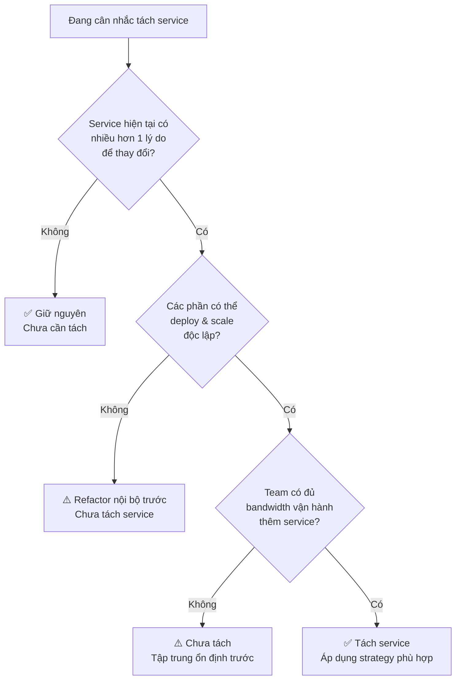
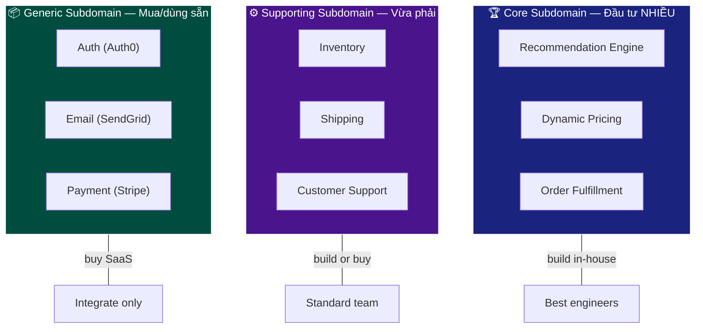
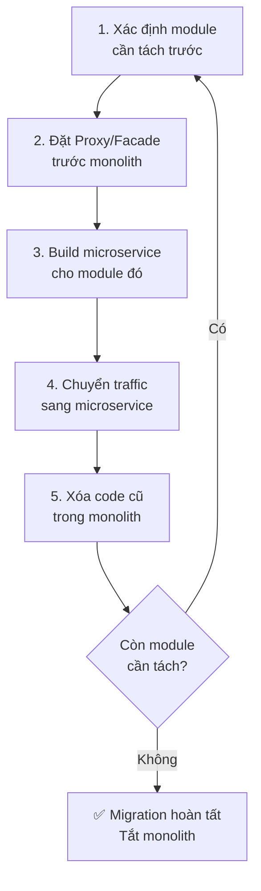
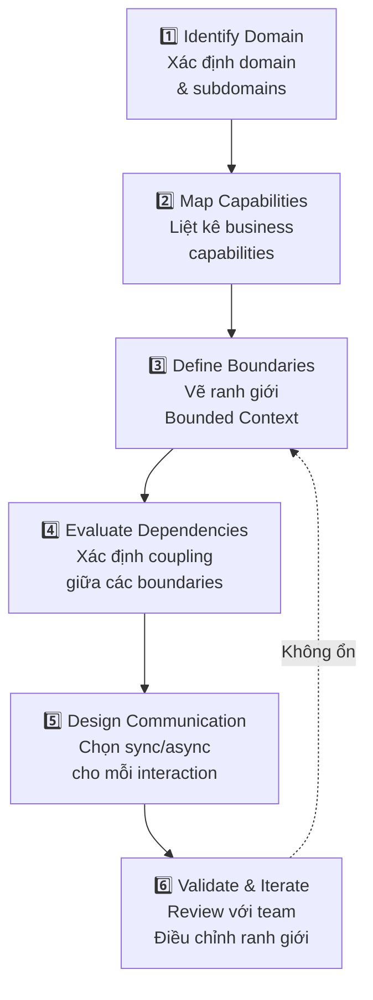

# Decomposition Strategies — Chiến lược phân tách Microservice

## 📋 Mục lục

- [1. Giới thiệu](#1-giới-thiệu)
- [2. Tại sao Decomposition khó?](#2-tại-sao-decomposition-khó)
  - [2.1. Tách quá nhỏ vs quá lớn](#21-tách-quá-nhỏ-vs-quá-lớn)
  - [2.2. Service Granularity — Kích thước phù hợp](#22-service-granularity--kích-thước-phù-hợp)
- [3. Decompose by Business Capability](#3-decompose-by-business-capability)
  - [3.1. Business Capability là gì?](#31-business-capability-là-gì)
  - [3.2. Cách xác định Business Capability](#32-cách-xác-định-business-capability)
  - [3.3. Ví dụ thực tế — E-Commerce](#33-ví-dụ-thực-tế--e-commerce)
  - [3.4. Ưu và nhược điểm](#34-ưu-và-nhược-điểm)
- [4. Decompose by Subdomain (DDD)](#4-decompose-by-subdomain-ddd)
  - [4.1. Tổng quan DDD Decomposition](#41-tổng-quan-ddd-decomposition)
  - [4.2. Core / Supporting / Generic Subdomain](#42-core--supporting--generic-subdomain)
  - [4.3. Ví dụ thực tế — Online Banking](#43-ví-dụ-thực-tế--online-banking)
  - [4.4. Business Capability vs Subdomain](#44-business-capability-vs-subdomain)
- [5. Strangler Fig Pattern](#5-strangler-fig-pattern)
  - [5.1. Strangler Fig là gì?](#51-strangler-fig-là-gì)
  - [5.2. Các bước thực hiện](#52-các-bước-thực-hiện)
  - [5.3. Ví dụ thực tế — Migrate E-Commerce Monolith](#53-ví-dụ-thực-tế--migrate-e-commerce-monolith)
  - [5.4. Kỹ thuật hỗ trợ Strangler Fig](#54-kỹ-thuật-hỗ-trợ-strangler-fig)
  - [5.5. Ưu và nhược điểm](#55-ưu-và-nhược-điểm)
- [6. Các chiến lược Decomposition khác](#6-các-chiến-lược-decomposition-khác)
  - [6.1. Decompose by Use Case / User Story](#61-decompose-by-use-case--user-story)
  - [6.2. Decompose by Resource / Entity](#62-decompose-by-resource--entity)
  - [6.3. Decompose by Volatility](#63-decompose-by-volatility)
  - [6.4. Decompose by Team](#64-decompose-by-team)
- [7. Quy trình phân tách step-by-step](#7-quy-trình-phân-tách-step-by-step)
  - [7.1. Framework 6 bước](#71-framework-6-bước)
  - [7.2. Ví dụ áp dụng — Hệ thống Food Delivery](#72-ví-dụ-áp-dụng--hệ-thống-food-delivery)
- [8. Anti-patterns khi Decompose](#8-anti-patterns-khi-decompose)
- [9. Checklist trước khi tách service](#9-checklist-trước-khi-tách-service)
- [10. Tổng kết](#10-tổng-kết)
- [11. Liên kết liên quan](#11-liên-kết-liên-quan)

---

## 1. Giới thiệu

Trong các doc trước, chúng ta đã tìm hiểu:
- **Ranh giới** service qua SRP & Bounded Context ([doc 02](02-single-responsibility-bounded-context.md))
- **Chất lượng** ranh giới qua Loose Coupling & High Cohesion ([doc 03](03-loose-coupling-high-cohesion.md))
- **Mức độ độc lập** cần đạt ([doc 04](04-autonomy-independence.md))

Bài này trả lời câu hỏi thực tế nhất: **"OK, tôi hiểu lý thuyết rồi — vậy cụ thể tách service bằng cách nào?"**

```
┌─────────────────────────────────────────────────────────────────┐
│              DECOMPOSITION STRATEGIES OVERVIEW                   │
│                                                                 │
│   Có monolith / ý tưởng hệ thống                                │
│          │                                                      │
│          ▼                                                      │
│   ┌─────────────────────────────────────┐                        │
│   │    Chọn chiến lược phân tách        │                        │
│   └──────────────┬──────────────────────┘                        │
│                  │                                              │
│     ┌────────────┼────────────┬──────────────┐                   │
│     ▼            ▼            ▼              ▼                  │
│  ┌────────┐ ┌──────────┐ ┌──────────┐ ┌───────────┐             │
│  │Business│ │Subdomain │ │Strangler │ │  Khác:    │             │
│  │Capabil.│ │  (DDD)   │ │   Fig    │ │Use Case,  │             │
│  │        │ │          │ │          │ │Volatility,│             │
│  │Greenf. │ │Greenf.   │ │Brownf.   │ │Team, ...  │             │
│  │project │ │project   │ │migration │ │           │             │
│  └────────┘ └──────────┘ └──────────┘ └───────────┘             │
│                                                                 │
│  Greenfield = dự án mới    Brownfield = migrate từ monolith      │
└─────────────────────────────────────────────────────────────────┘
```

> **Lưu ý quan trọng**: Không có chiến lược "đúng nhất" — mỗi chiến lược phù hợp với **bối cảnh** và **giai đoạn** khác nhau. Thực tế, nhiều tổ chức **kết hợp** nhiều chiến lược.

---

## 2. Tại sao Decomposition khó?

### 2.1. Tách quá nhỏ vs quá lớn

```
Tách quá nhỏ (Nano-services) 🔬        Tách quá lớn (Mini-monoliths) 🏔️
──────────────────────────────          ──────────────────────────────────

┌──┐ ┌──┐ ┌──┐ ┌──┐ ┌──┐ ┌──┐          ┌────────────┐  ┌────────────┐
│S1│→│S2│→│S3│→│S4│→│S5│→│S6│          │  Service A │  │  Service B │
└──┘ └──┘ └──┘ └──┘ └──┘ └──┘          │            │  │            │
                                       │  User Mgmt │  │  Tất cả    │
Vấn đề:                                │  + Auth    │  │  Business  │
• Network latency chồng chất           │  + Profile │  │  Logic     │
• Distributed transaction phức tạp     │  + Social  │  │  còn lại   │
• Debug/trace qua nhiều service        │  + Notif.  │  │            │
• Deploy 1 feature → update 5 service  │  + ...     │  │            │
• Overhead vận hành: 30 services       └────────────┘  └────────────┘
  cho team 5 người
                                        Vấn đề:
                                        • Coupling cao bên trong service
                                        • Khó scale từng phần
                                        • Team lớn, khó coordinate
                                        • Deploy chậm vì quá nhiều code

             ✅ Sweet Spot — Vừa phải
             ────────────────────────
             ┌────────┐ ┌────────┐ ┌────────┐ ┌────────┐
             │  User  │ │ Order  │ │Payment │ │Catalog │
             │Service │ │Service │ │Service │ │Service │
             └────────┘ └────────┘ └────────┘ └────────┘
             
             • Mỗi service = 1 business capability
             • Team 3-8 người own 1-3 services
             • Ít cross-service calls
```

### 2.2. Service Granularity — Kích thước phù hợp

Không có quy tắc cứng, nhưng có **heuristics** (quy tắc ngón tay cái):

| Heuristic | Mô tả | Ví dụ |
|-----------|--------|-------|
| **Two-Pizza Team** | 1 team (6-8 người) có thể own & vận hành service | Team quá lớn → tách service |
| **Single Responsibility** | Service chỉ có 1 lý do để thay đổi | Order Service đổi khi logic đơn hàng đổi, không đổi khi thanh toán đổi |
| **Bounded Context** | Service nằm trong 1 Bounded Context | "Product" trong Catalog ≠ "Product" trong Inventory |
| **Change Frequency** | Phần nào thay đổi thường xuyên → tách riêng | Pricing thay đổi hàng tuần → tách khỏi Catalog |
| **Autonomous Function** | Service hoàn thành 1 chức năng mà không cần gọi nhiều service khác | Nếu Service A luôn phải gọi B, C, D → có thể nên gộp |
| **Data Ownership** | Service own 1 tập dữ liệu rõ ràng | User Service own bảng users, profiles |



---

## 3. Decompose by Business Capability

### 3.1. Business Capability là gì?

**Business Capability** (năng lực kinh doanh) là **những gì doanh nghiệp làm** để tạo ra giá trị, bất kể cách triển khai kỹ thuật.

```
Phân biệt:
────────────

Business Capability              ≠  Technical Function
(Doanh nghiệp LÀM GÌ)              (Kỹ thuật TRIỂN KHAI THẾ NÀO)

• Quản lý đơn hàng                   • REST API
• Xử lý thanh toán                   • Database CRUD
• Quản lý kho hàng                   • Message Queue
• Hỗ trợ khách hàng                  • Caching layer

→ Tách theo Business Capability      → KHÔNG tách theo Technical Function
```

> **Nguyên tắc**: Service boundary nên phản ánh **ranh giới nghiệp vụ**, không phải ranh giới kỹ thuật.

### 3.2. Cách xác định Business Capability

```
Bước 1: Phân tích tổ chức doanh nghiệp
────────────────────────────────────────
Hỏi: "Doanh nghiệp có những phòng ban / chức năng gì?"

   ┌──────────┐ ┌──────────┐ ┌──────────┐ ┌──────────┐
   │  Sales   │ │Marketing │ │  Kho vận │ │ Tài chính│
   └──────────┘ └──────────┘ └──────────┘ └──────────┘

Bước 2: Liệt kê capability của từng phòng ban
────────────────────────────────────────
   Sales:
   • Quản lý khách hàng (Customer Management)
   • Quản lý đơn hàng (Order Management)
   • Quản lý giá (Pricing)
   
   Kho vận:
   • Quản lý tồn kho (Inventory Management)
   • Quản lý vận chuyển (Shipping Management)
   • Quản lý nhà cung cấp (Supplier Management)

Bước 3: Map capability → service
────────────────────────────────────────
   Customer Management  → Customer Service
   Order Management     → Order Service
   Pricing             → Pricing Service
   Inventory Management → Inventory Service
   Shipping Management  → Shipping Service
```

### 3.3. Ví dụ thực tế — E-Commerce

```
┌─────────────────────────────────────────────────────────────────┐
│            E-COMMERCE — BUSINESS CAPABILITY MAP                  │
│                                                                 │
│  ┌─────────────────────────────────────────────────────────┐     │
│  │                 CORE CAPABILITIES                       │     │
│  │                                                         │     │
│  │  ┌──────────────┐  ┌──────────────┐  ┌──────────────┐   │     │
│  │  │  Product     │  │   Order      │  │  Payment     │   │     │
│  │  │  Management  │  │  Management  │  │  Processing  │   │     │
│  │  │              │  │              │  │              │   │     │
│  │  │• CRUD sản    │  │• Tạo đơn hàng│  │• Thu tiền    │   │     │
│  │  │  phẩm        │  │• Theo dõi    │  │• Hoàn tiền   │   │     │
│  │  │• Phân loại   │  │  trạng thái  │  │• Quản lý ví  │   │     │
│  │  │• Quản lý giá │  │• Hủy đơn     │  │• Đối soát    │   │     │
│  │  └──────────────┘  └──────────────┘  └──────────────┘   │     │
│  └─────────────────────────────────────────────────────────┘     │
│                                                                 │
│  ┌─────────────────────────────────────────────────────────┐     │
│  │               SUPPORTING CAPABILITIES                   │     │
│  │                                                         │     │
│  │  ┌──────────────┐  ┌──────────────┐  ┌──────────────┐   │     │
│  │  │  Inventory   │  │  Shipping    │  │  Customer    │   │     │
│  │  │  Management  │  │  Management  │  │   Support    │   │     │
│  │  │              │  │              │  │              │   │     │
│  │  │• Tồn kho     │  │• Tính phí    │  │• Ticket      │   │     │
│  │  │• Reserve     │  │  ship        │  │• Live chat   │   │     │
│  │  │• Nhập hàng   │  │• Tracking    │  │• FAQ         │   │     │
│  │  └──────────────┘  └──────────────┘  └──────────────┘   │     │
│  └─────────────────────────────────────────────────────────┘     │
│                                                                 │
│  ┌─────────────────────────────────────────────────────────┐     │
│  │               GENERIC CAPABILITIES                      │     │
│  │                                                         │     │
│  │  ┌──────────────┐  ┌──────────────┐  ┌──────────────┐   │     │
│  │  │    User      │  │ Notification │  │   Search     │   │     │
│  │  │   Identity   │  │   Service    │  │   Service    │   │     │
│  │  │              │  │              │  │              │   │     │
│  │  │• Đăng ký     │  │• Email       │  │• Full-text   │   │     │
│  │  │• Đăng nhập   │  │• SMS         │  │  search      │   │     │
│  │  │• Phân quyền  │  │• Push        │  │• Filter      │   │     │
│  │  └──────────────┘  └──────────────┘  └──────────────┘   │     │
│  └─────────────────────────────────────────────────────────┘     │
│                                                                 │
│  Mapping: 1 Business Capability → 1 Microservice                 │
│  Tổng: 9 services cho hệ thống e-commerce trung bình             │
└─────────────────────────────────────────────────────────────────┘
```

### 3.4. Ưu và nhược điểm

| | Ưu điểm | Nhược điểm |
|---|---------|-----------|
| ✅ | Dễ hiểu — service phản ánh cách doanh nghiệp hoạt động | Cần hiểu sâu nghiệp vụ, dev thuần kỹ thuật sẽ khó |
| ✅ | Ổn định — business capability ít thay đổi hơn kỹ thuật | Một số capability mờ ranh giới (Pricing thuộc Sales hay Product?) |
| ✅ | Dễ assign team — mỗi team own 1 capability | Có thể tạo service quá lớn nếu capability quá rộng |
| ✅ | Phù hợp Conway's Law — tổ chức team = tổ chức service | |

---

## 4. Decompose by Subdomain (DDD)

### 4.1. Tổng quan DDD Decomposition

Chiến lược này dùng **Domain-Driven Design** (xem chi tiết tại [doc 02](02-single-responsibility-bounded-context.md)) để phân tách service:

```
Domain (toàn bộ hệ thống)
    │
    ├── Core Subdomain ────────→ Service quan trọng nhất
    │                              (tự build, đầu tư nhiều)
    │
    ├── Supporting Subdomain ──→ Service hỗ trợ
    │                              (có thể outsource 1 phần)
    │
    └── Generic Subdomain ─────→ Service phổ thông
                                   (dùng SaaS / open-source)
```

### 4.2. Core / Supporting / Generic Subdomain

| Loại | Đặc điểm | Chiến lược | Ví dụ (E-Commerce) |
|------|-----------|------------|---------------------|
| **Core** | Tạo lợi thế cạnh tranh, phức tạp, thay đổi thường xuyên | **Tự build**, đội ngũ giỏi nhất, đầu tư nhiều nhất | Recommendation Engine, Pricing Algorithm, Order Fulfillment |
| **Supporting** | Cần thiết nhưng không tạo lợi thế cạnh tranh | Tự build hoặc **customize** giải pháp có sẵn | Inventory, Shipping, Customer Support |
| **Generic** | Bài toán phổ biến, mọi công ty đều giống nhau | **Mua SaaS** hoặc dùng open-source | Auth (Auth0), Email (SendGrid), Payment gateway (Stripe) |



### 4.3. Ví dụ thực tế — Online Banking

```
┌─────────────────────────────────────────────────────────────────┐
│               ONLINE BANKING — DDD DECOMPOSITION                 │
│                                                                 │
│  Domain: Ngân hàng số                                            │
│                                                                 │
│  Core Subdomains:                                                │
│  ─────────────────                                              │
│  ┌──────────────┐  ┌──────────────┐  ┌──────────────┐            │
│  │  Transaction │  │  Loan        │  │  Risk        │            │
│  │  Processing  │  │  Origination │  │  Assessment  │            │
│  │              │  │              │  │              │            │
│  │ • Chuyển tiền│  │ • Đánh giá   │  │ • Fraud      │            │
│  │ • Thanh toán │  │   khoản vay  │  │   detection  │            │
│  │ • Đối soát   │  │ • Tính lãi   │  │ • Credit     │            │
│  │              │  │ • Giải ngân  │  │   scoring    │            │
│  └──────────────┘  └──────────────┘  └──────────────┘            │
│  → Tự build 100%, team senior, security-first                    │
│                                                                 │
│  Supporting Subdomains:                                          │
│  ─────────────────────                                          │
│  ┌──────────────┐  ┌──────────────┐                              │
│  │  Customer    │  │  Account     │                              │
│  │  Management  │  │  Management  │                              │
│  │              │  │              │                              │
│  │ • KYC/eKYC   │  │ • Mở tài    │                              │
│  │ • Profile    │  │   khoản     │                              │
│  │ • Preferences│  │ • Đóng TK   │                              │
│  └──────────────┘  └──────────────┘                              │
│  → Tự build, có thể dùng 1 số thư viện                          │
│                                                                 │
│  Generic Subdomains:                                             │
│  ───────────────────                                            │
│  ┌──────────────┐  ┌──────────────┐  ┌──────────────┐            │
│  │  Identity &  │  │ Notification │  │  Reporting   │            │
│  │  Auth        │  │              │  │              │            │
│  │              │  │              │  │              │            │
│  │ • Keycloak   │  │ • Firebase   │  │ • Metabase   │            │
│  │ • OAuth2/OIDC│  │ • Twilio SMS │  │ • Grafana    │            │
│  └──────────────┘  └──────────────┘  └──────────────┘            │
│  → Dùng SaaS / open-source, chỉ integrate                       │
└─────────────────────────────────────────────────────────────────┘
```

### 4.4. Business Capability vs Subdomain

Hai chiến lược rất giống nhau, khác ở **góc nhìn**:

| Tiêu chí | Business Capability | Subdomain (DDD) |
|----------|---------------------|------------------|
| **Góc nhìn** | Từ tổ chức doanh nghiệp (phòng ban, chức năng) | Từ domain model (ngôn ngữ, nghiệp vụ) |
| **Xuất phát** | "Doanh nghiệp LÀM GÌ?" | "Domain có những KHÁI NIỆM gì?" |
| **Phân loại** | Không phân loại ưu tiên | Chia thành Core / Supporting / Generic |
| **Chiến lược đầu tư** | Không chỉ ra nên build hay buy | Rõ ràng: Core → build, Generic → buy |
| **Khi nào dùng** | Khi nghiệp vụ rõ ràng, tổ chức ổn định | Khi domain phức tạp, cần strategic design |
| **Kết quả** | Thường giống nhau ở level service boundary | Thường giống nhau, nhưng DDD cho thêm insight về đầu tư |

> **Thực tế**: Hầu hết team dùng **kết hợp** cả hai. Dùng Business Capability để xác định ranh giới ban đầu, rồi dùng DDD để đi sâu vào core domain.

---

## 5. Strangler Fig Pattern

### 5.1. Strangler Fig là gì?

**Strangler Fig** (cây đa bóp nghẹt) là pattern migrate **dần dần** từ monolith sang microservice, thay vì rewrite toàn bộ (big-bang migration).

Tên lấy từ loại cây tropical vine bọc quanh cây chủ, dần dần thay thế hoàn toàn:

```
Giai đoạn 1:          Giai đoạn 2:         Giai đoạn 3:
Monolith sống         Microservice bắt      Monolith chết
                      đầu thay thế

  ┌─────────┐         ┌──┐┌─────────┐       ┌──┐┌──┐┌──┐
  │         │         │MS││         │       │MS││MS││MS│
  │         │         │ 1││         │       │ 1││ 2││ 3│
  │Monolith │         └──┘│Monolith │       └──┘└──┘└──┘
  │         │             │ (nhỏ    │       ┌──┐┌──┐
  │         │             │  hơn)   │       │MS││MS│
  │         │             │         │       │ 4││ 5│
  └─────────┘             └─────────┘       └──┘└──┘
  
  100% monolith       30% micro             100% micro
                      70% monolith          0% monolith
```

> **Tại sao không rewrite toàn bộ?** Vì big-bang rewrite là **rủi ro cực cao**: dự án kéo dài hàng năm, business tiếp tục thay đổi trên monolith cũ, đến khi xong thì requirements đã khác. Joel Spolsky gọi đây là "điều tệ nhất một công ty phần mềm có thể làm".

### 5.2. Các bước thực hiện



**Chi tiết từng bước:**

```
Bước 1: CHỌN MODULE TÁCH TRƯỚC
──────────────────────────────
Ưu tiên module:
  • Thay đổi thường xuyên nhất (high change frequency)
  • Ít phụ thuộc vào phần còn lại (low coupling)
  • Có business value cao khi tách (scale riêng, deploy riêng)
  • Có boundary rõ ràng (dễ tách data)

❌ KHÔNG tách trước: module phức tạp nhất, nhiều dependency nhất

Bước 2: ĐẶT PROXY TRƯỚC MONOLITH
──────────────────────────────
             ┌───────────┐
  Client ──▶ │   Proxy   │──▶ Monolith (tất cả traffic)
             │ (API GW)  │
             └───────────┘

Proxy ban đầu chỉ forward tất cả request → monolith.
Mục đích: có 1 điểm để "rẽ nhánh" traffic sau này.

Bước 3: BUILD MICROSERVICE
──────────────────────────────
Build service mới cho module đã chọn:
  • Implement đầy đủ chức năng
  • Migrate data (hoặc sync data từ monolith)
  • Test kỹ (unit, integration, contract)

Bước 4: CHUYỂN TRAFFIC
──────────────────────────────
             ┌───────────┐
  Client ──▶ │   Proxy   │──┬──▶ Microservice (module A)
             │ (API GW)  │  │
             └───────────┘  └──▶ Monolith (phần còn lại)

Proxy route traffic của module A → microservice mới.
Phần còn lại vẫn → monolith.

Bước 5: XÓA CODE CŨ
──────────────────────────────
Xóa code module A trong monolith.
Monolith nhỏ hơn → dễ maintain hơn.
```

### 5.3. Ví dụ thực tế — Migrate E-Commerce Monolith

```
┌─────────────────────────────────────────────────────────────────┐
│        STRANGLER FIG — E-COMMERCE MIGRATION PLAN                │
│                                                                 │
│  Monolith hiện tại:                                             │
│  ┌─────────────────────────────────────────────────────────┐    │
│  │  User | Product | Order | Payment | Inventory | Search  │    │
│  │  ─────────────────────────────────────────────────────  │    │
│  │              Shared PostgreSQL Database                 │    │
│  └─────────────────────────────────────────────────────────┘    │
│                                                                 │
│  Phase 1 (Tháng 1-2): Tách Search ──────────────────────        │
│  Lý do: ít coupling, cần scale riêng, có thể dùng               │
│         Elasticsearch thay vì SQL LIKE                          │
│  ┌─────────────────────────────────────┐  ┌──────────┐          │
│  │  User | Product | Order | Payment   │  │  Search  │          │
│  │  | Inventory                        │  │  Service │          │
│  │  ─────────────────────────────────  │  │          │          │
│  │         PostgreSQL                  │  │ Elastic  │          │
│  └─────────────────────────────────────┘  │ Search   │          │
│                                           └──────────┘          │
│  Data sync: Monolith publish event → Search consume & index     │
│                                                                 │
│  Phase 2 (Tháng 3-4): Tách User/Auth ───────────────────        │
│  Lý do: cần riêng cho SSO, OAuth2, dùng lại cho các app khác    │
│  ┌───────────────────────────────┐  ┌──────┐ ┌──────────┐       │
│  │ Product | Order | Payment     │  │ User │ │  Search  │       │
│  │ | Inventory                   │  │ Svc  │ │  Service │       │
│  │ ───────────────────────────   │  └──────┘ └──────────┘       │
│  │       PostgreSQL              │                              │
│  └───────────────────────────────┘                              │
│                                                                 │
│  Phase 3 (Tháng 5-7): Tách Payment ─────────────────────        │
│  Lý do: compliance PCI-DSS, cần security riêng                  │
│                                                                 │
│  Phase 4 (Tháng 8-10): Tách Order + Inventory ──────────        │
│  Lý do: hai module coupling cao, tách cùng đợt                  │
│                                                                 │
│  Phase 5 (Tháng 11-12): Tách Product, xóa monolith ─────        │
│                                                                 │
│  Timeline: 12 tháng (thay vì 18-24 tháng big-bang rewrite)      │
│  Risk: THẤP (rollback từng phase nếu lỗi)                       │
└─────────────────────────────────────────────────────────────────┘
```

### 5.4. Kỹ thuật hỗ trợ Strangler Fig

| Kỹ thuật | Mô tả | Khi nào dùng |
|----------|--------|--------------|
| **Branch by Abstraction** | Tạo abstraction layer trong monolith, swap implementation giữa code cũ và service mới | Khi module cần tách nằm **sâu** trong monolith, không dễ route ở tầng HTTP |
| **Event Interception** | Monolith publish event, microservice mới subscribe & xử lý | Khi cần **sync data** giữa monolith và service mới |
| **Asset Capture** | Microservice mới bắt đầu xử lý **write** trước, monolith chỉ còn xử lý **read** từ data cũ | Khi migrate data lớn, không thể chuyển 1 lần |
| **Dark Launch** | Service mới chạy nhận traffic thật nhưng **không trả response** cho user, chỉ so sánh kết quả với monolith | Khi cần validate service mới trước khi chuyển traffic |
| **Feature Toggle** | Bật/tắt route traffic giữa monolith và microservice | Khi cần rollback nhanh |

```
Branch by Abstraction — Ví dụ:
────────────────────────────────

Trước:
  OrderController → OrderService → OrderRepository → DB

Bước 1 (Abstraction):
  OrderController → IOrderService (interface)
                        ├── OldOrderService → DB       ← code cũ
                        └── NewOrderService → Order MS  ← gọi microservice

Bước 2 (Switch):
  Feature flag: use_new_order_service = true
  → Route sang NewOrderService

Bước 3 (Clean up):
  Xóa OldOrderService, xóa interface, chỉ giữ NewOrderService
```

### 5.5. Ưu và nhược điểm

| | Ưu điểm | Nhược điểm |
|---|---------|-----------|
| ✅ | Rủi ro thấp — migrate dần, rollback từng phần | Cần duy trì cả monolith + microservice trong thời gian dài |
| ✅ | Business tiếp tục chạy — không downtime | Data consistency giữa monolith và service mới phức tạp |
| ✅ | Team học dần — không cần biết microservice ngay từ đầu | Tổng thời gian dài hơn big-bang (nếu big-bang thành công) |
| ✅ | Có thể dừng bất kỳ lúc nào — không bắt buộc migrate hết | Proxy layer thêm latency |

---

## 6. Các chiến lược Decomposition khác

### 6.1. Decompose by Use Case / User Story

Tách service dựa trên **user journey** hoặc **use case**:

```
Use Case: "Khách hàng đặt hàng"
──────────────────────────────────

  User ──▶ Browse Products ──▶ Add to Cart ──▶ Checkout ──▶ Pay

  Mapping:
  • Browse Products  → Catalog Service
  • Add to Cart      → Cart Service
  • Checkout         → Order Service
  • Pay              → Payment Service
```

**Khi nào dùng**: Khi hệ thống **user-facing** rõ ràng, các journey không chồng chéo nhiều.

**Cẩn thận**: Dễ tạo service quá nhỏ (ví dụ: "Cart Service" riêng có thể overkill nếu cart chỉ là 1 list tạm).

### 6.2. Decompose by Resource / Entity

Tách service theo **resource / entity** chính:

```
Entities:
  • User      → User Service
  • Product   → Product Service
  • Order     → Order Service
  • Review    → Review Service
```

**Cẩn thận**: Đây là cách đơn giản nhất nhưng dễ sai nhất. Nó dẫn đến **CRUD services** (service chỉ làm Create/Read/Update/Delete) — thiếu business logic, coupling cao vì logic nằm ở caller.

```
❌ Anti-pattern: Anemic Services (CRUD only)

  Order Service:          Caller (API Gateway / BFF):
  • createOrder()         • Gọi Inventory.check()
  • getOrder()            • Gọi Order.create()
  • updateOrder()         • Gọi Payment.charge()
  • deleteOrder()         • Gọi Notification.send()
                          • Xử lý error, rollback...
  
  → Business logic nằm ở caller, không ở service
  → Order Service chỉ là CRUD wrapper quanh database
  → Caller phải biết quá nhiều → tight coupling

✅ Nên: Order Service chứa business logic

  Order Service:
  • placeOrder()          ← Tự gọi Inventory, Payment bên trong
  • cancelOrder()         ← Tự xử lý hoàn tiền, hoàn kho
  • getOrderStatus()
  
  → Business logic nằm trong service
  → Caller chỉ cần biết: "placeOrder với data này"
```

### 6.3. Decompose by Volatility

Tách các phần **thay đổi thường xuyên** ra khỏi phần **ổn định**:

```
┌─────────────────────────────────────────────────────────────┐
│                  DECOMPOSE BY VOLATILITY                    │
│                                                             │
│  Thay đổi thường xuyên (tuần/ngày):   Ổn định (tháng/năm):  │
│  ────────────────────────────────     ───────────────────── │
│  ┌──────────────┐  ┌──────────────┐   ┌──────────────┐      │
│  │  Pricing     │  │  Promotion   │   │    User      │      │
│  │  Service     │  │  Service     │   │   Service    │      │
│  │              │  │              │   │              │      │
│  │ Giá thay đổi │  │ Campaign mới │   │ Đăng ký/     │      │
│  │ theo mùa,    │  │ mỗi tuần     │   │ đăng nhập    │      │
│  │ đối thủ,     │  │              │   │ ít thay đổi  │      │
│  │ demand       │  │              │   │              │      │
│  └──────────────┘  └──────────────┘   └──────────────┘      │
│                                                             │
│  → Deploy 10 lần/tuần                 → Deploy 1 lần/tháng  │
│  → Cần canary deploy, feature flag    → Đơn giản, ổn định   │
└─────────────────────────────────────────────────────────────┘
```

**Khi nào dùng**: Khi bạn nhận thấy 1 module trong monolith **liên tục gây conflict khi merge**, hoặc **block** các team khác deploy.

### 6.4. Decompose by Team

Tách service theo **cấu trúc team** (áp dụng Conway's Law — xem [doc 04, section 6](04-autonomy-independence.md)):

```
Team Structure:                    Service Structure:
──────────────                     ──────────────────

┌─────────────┐                    ┌──────────────┐
│  Team Alpha │ ──── owns ────▶    │  Catalog +   │
│  (5 devs)   │                    │  Search Svc  │
└─────────────┘                    └──────────────┘

┌─────────────┐                    ┌──────────────┐
│  Team Beta  │ ──── owns ────▶    │  Order +     │
│  (4 devs)   │                    │  Payment Svc │
└─────────────┘                    └──────────────┘

┌─────────────┐                    ┌──────────────┐
│ Team Gamma  │ ──── owns ────▶    │  User +      │
│  (3 devs)   │                    │  Notif. Svc  │
└─────────────┘                    └──────────────┘
```

**Khi nào dùng**: Khi bạn đã có team structure ổn định và muốn giảm cross-team dependency.

**Cẩn thận**: Tổ chức team sai → kiến trúc service sai. Phải đảm bảo team structure phản ánh **nghiệp vụ**, không phải kỹ thuật.

---

## 7. Quy trình phân tách step-by-step

### 7.1. Framework 6 bước



```
Chi tiết:

1️⃣ IDENTIFY DOMAIN
   • Liệt kê tất cả chức năng hệ thống
   • Phân loại: Core / Supporting / Generic
   • Output: Domain map

2️⃣ MAP CAPABILITIES
   • Mỗi subdomain → liệt kê capabilities
   • Group capabilities liên quan
   • Output: Capability map

3️⃣ DEFINE BOUNDARIES
   • Mỗi group → 1 service candidate
   • Xác định data ownership
   • Xác định API boundary
   • Output: Service candidates

4️⃣ EVALUATE DEPENDENCIES
   • Vẽ dependency graph giữa các service candidates
   • Kiểm tra: có circular dependency không?
   • Kiểm tra: service A gọi B quá nhiều → nên gộp?
   • Output: Dependency graph đã optimize

5️⃣ DESIGN COMMUNICATION
   • Sync (REST/gRPC) cho query cần response ngay
   • Async (Event/Message) cho command không cần response ngay
   • Xác định data sync strategy
   • Output: Communication diagram

6️⃣ VALIDATE & ITERATE
   • Review với domain expert & team
   • Prototype 2-3 service trước
   • Điều chỉnh ranh giới dựa trên feedback thực tế
   • Output: Final service architecture
```

### 7.2. Ví dụ áp dụng — Hệ thống Food Delivery

```
1️⃣ Domain & Subdomains:
───────────────────────
  Core:       Ordering, Delivery, Restaurant Matching
  Supporting: Menu Management, Customer Profile, Driver Management
  Generic:    Auth, Payment, Notification, Maps/Geolocation

2️⃣ Capability Map:
───────────────────
  Ordering:
    • Tạo đơn, hủy đơn, theo dõi đơn
  Delivery:
    • Assign driver, tracking realtime, estimate ETA
  Restaurant Matching:
    • Tìm nhà hàng gần, ranking, recommendation
  Menu Management:
    • CRUD menu, giá theo giờ, khuyến mãi
  ...

3️⃣ Service Candidates:
───────────────────────
  ┌────────────┐  ┌────────────┐  ┌────────────┐
  │  Order     │  │  Delivery  │  │ Restaurant │
  │  Service   │  │  Service   │  │  Service   │
  └─────┬──────┘  └─────┬──────┘  └─────┬──────┘
        │               │               │
  ┌─────▼──────┐  ┌─────▼──────┐  ┌─────▼──────┐
  │   Order    │  │  Delivery  │  │ Restaurant │
  │   DB       │  │  DB        │  │  DB        │
  └────────────┘  └────────────┘  └────────────┘

  + Driver Service, Payment Service (Stripe),
    Notification Service, Auth (Firebase Auth),
    Geo Service (Google Maps API)

4️⃣ Dependency Check:
───────────────────────
  Order → Restaurant: cần menu & giá     → Sync (gRPC)
  Order → Payment: cần charge tiền       → Sync (REST)
  Order → Delivery: cần assign driver    → Async (Event)
  Order → Notification: thông báo user   → Async (Event)

  ⚠️ Order gọi nhiều service → OK vì đây là orchestrator
     cho use case "đặt hàng"
  ⚠️ Delivery ↔ Geo: gọi rất nhiều (tracking realtime)
     → Dùng gRPC streaming hoặc WebSocket

5️⃣ Communication Design:
───────────────────────
  Sync:  Order ──gRPC──▶ Restaurant (lấy menu)
         Order ──REST──▶ Payment (charge)
  Async: Order ──Event──▶ Delivery (assign driver)
         Order ──Event──▶ Notification (email/push)
         Delivery ──Event──▶ Order (status update)

6️⃣ Validate:
───────────────────────
  • Team 1 (5 devs): Order + Payment integration
  • Team 2 (4 devs): Delivery + Driver + Geo
  • Team 3 (3 devs): Restaurant + Menu
  • Platform team: Auth, Notification, Infra

  → Mỗi team 3-5 người, own 1-2 services ✅
```

---

## 8. Anti-patterns khi Decompose

| Anti-pattern | Mô tả | Triệu chứng | Cách fix |
|-------------|--------|-------------|----------|
| **Entity Trap** | Tách 1 entity = 1 service (CRUD services) | Service chỉ có CRUD, business logic ở caller | Tách theo business capability, không theo entity |
| **Premature Decomposition** | Tách quá sớm khi chưa hiểu domain | Ranh giới sai, phải merge lại rồi tách lại | Bắt đầu với monolith hoặc modular monolith, tách sau khi hiểu domain |
| **Distributed Monolith** | Tách service nhưng vẫn deploy cùng, share DB | Deploy 1 service = deploy N service | Tách DB, async communication, xem [doc 04](04-autonomy-independence.md) |
| **Big Bang Migration** | Rewrite toàn bộ monolith → microservice cùng lúc | Dự án 2 năm, cuối cùng cancel | Dùng Strangler Fig, migrate dần |
| **Nano-services** | Tách quá nhỏ, mỗi function 1 service | Latency cao, debug khó, overhead vận hành lớn | Gộp lại theo business capability |
| **Tech-Driven Split** | Tách theo layer kỹ thuật (UI service, Logic service, Data service) | Cross-service call cho mọi request, latency cao | Tách theo vertical slice (business capability), không horizontal layer |

```
❌ Tech-Driven Split (Horizontal):

  ┌───────────┐
  │  UI Layer │ Service
  └─────┬─────┘
        │ (mọi request đều phải đi qua 3 services)
  ┌─────▼─────┐
  │  Business │ Service
  │  Logic    │
  └─────┬─────┘
        │
  ┌─────▼─────┐
  │  Data     │ Service
  │  Access   │
  └───────────┘

✅ Business-Driven Split (Vertical):

  ┌────────┐  ┌────────┐  ┌────────┐
  │ Order  │  │Payment │  │Catalog │
  │        │  │        │  │        │
  │ UI     │  │ UI     │  │ UI     │
  │ Logic  │  │ Logic  │  │ Logic  │
  │ Data   │  │ Data   │  │ Data   │
  └────────┘  └────────┘  └────────┘
  
  Mỗi service là vertical slice: tự chứa UI logic + 
  business logic + data access
```

---

## 9. Checklist trước khi tách service

```
TRƯỚC KHI TÁCH — Hỏi những câu này:

Về Business:
  □ Service có 1 business capability rõ ràng?
  □ Service có thể hoạt động ĐỘC LẬP (không gọi 5 service khác)?
  □ Có team riêng (3-8 người) sẵn sàng own service này?
  □ Business value của việc tách > chi phí vận hành thêm?

Về Data:
  □ Service own data riêng? Có thể tách DB?
  □ Data consistency strategy đã rõ (eventual OK hay cần strong)?
  □ Migration plan cho data hiện có?

Về Technical:
  □ CI/CD pipeline riêng đã sẵn sàng?
  □ Monitoring, logging, tracing đã có?
  □ API contract đã được định nghĩa?
  □ Failure mode đã được xem xét (service chết thì sao)?

Về Communication:
  □ Sync hay async? Đã chọn xong?
  □ Có circular dependency với service khác không?
  □ Latency budget có chấp nhận được không?

Nếu có > 3 câu trả lời "Không" → CHƯA NÊN TÁCH
```

---

## 10. Tổng kết

```
┌─────────────────────────────────────────────────────────────────┐
│                    DECOMPOSITION CHEAT SHEET                     │
│                                                                 │
│  Bạn đang ở đâu?          → Chiến lược nào?                     │
│  ──────────────────          ─────────────────                  │
│                                                                 │
│  Dự án mới (Greenfield)   → Business Capability                 │
│                              hoặc DDD Subdomain                 │
│                                                                 │
│  Migrate monolith          → Strangler Fig Pattern              │
│  (Brownfield)                + chọn module theo Volatility      │
│                                                                 │
│  Domain phức tạp           → DDD Subdomain                      │
│                              (Core/Supporting/Generic)          │
│                                                                 │
│  Domain đơn giản           → Business Capability                │
│                                                                 │
│  Chưa hiểu domain rõ      → Modular Monolith trước              │
│                              → tách sau khi hiểu                │
│                                                                 │
│  ─────────────────────────────────────────────────              │
│                                                                 │
│  Quy tắc vàng:                                                  │
│  1. Tách theo NGHIỆP VỤ, không theo KỸ THUẬT                   │
│  2. Bắt đầu với SỐ ÍT service, tách thêm khi CẦN              │
│  3. Nếu không chắc → CHƯA TÁCH                                 │
│  4. Modular Monolith luôn là bước đệm tốt                      │
│  5. Strangler Fig > Big Bang rewrite                            │
└─────────────────────────────────────────────────────────────────┘
```

---

## 11. Liên kết liên quan

| Doc | Liên quan |
|-----|-----------|
| [01 - Microservice Overview](01-microservice-overview.md) | Monolith vs Microservice — tại sao cần tách |
| [02 - SRP & Bounded Context](02-single-responsibility-bounded-context.md) | DDD Bounded Context — nền tảng cho Decompose by Subdomain |
| [03 - Loose Coupling & High Cohesion](03-loose-coupling-high-cohesion.md) | Đánh giá chất lượng ranh giới sau khi tách |
| [04 - Autonomy & Independence](04-autonomy-independence.md) | Mức độ độc lập cần đạt, Conway's Law & team ownership |
| [06 - Inter-Service Communication](06-inter-service-communication.md) | Sync vs Async — quyết định communication sau khi tách |
| [09 - Data Management](09-data-management.md) | Database per Service, Saga — xử lý data sau khi tách |
