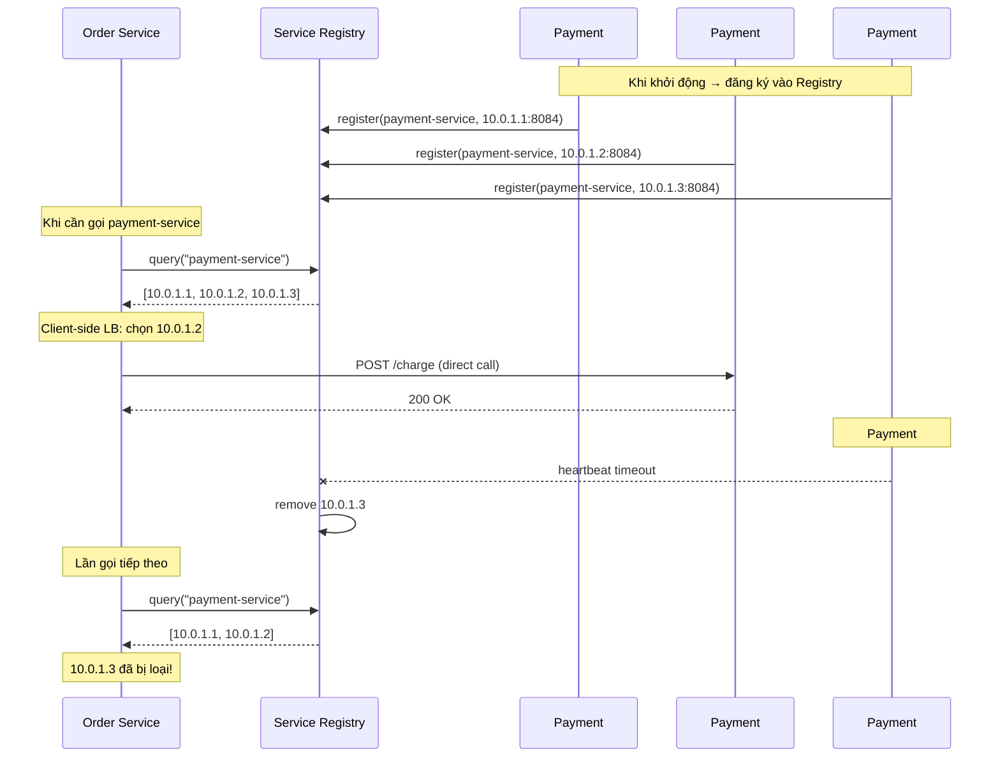
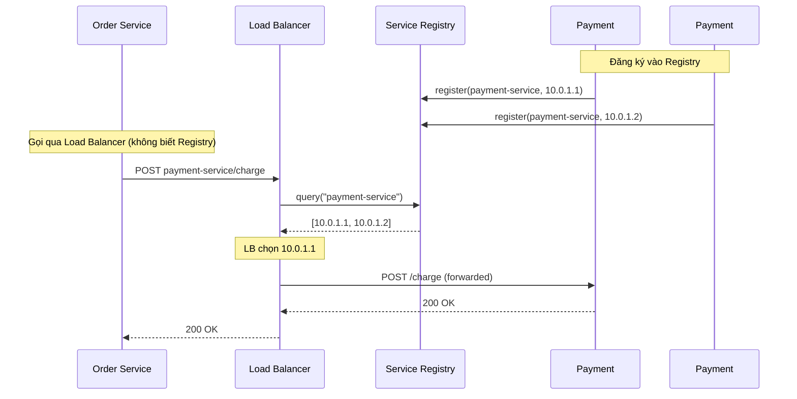

# Service Discovery — Tìm kiếm và kết nối Service trong Microservice

## 📋 Mục lục

- [1. Giới thiệu](#1-giới-thiệu)
- [2. Service Discovery là gì?](#2-service-discovery-là-gì)
  - [2.1. Vấn đề khi không có Service Discovery](#21-vấn-đề-khi-không-có-service-discovery)
  - [2.2. Service Discovery giải quyết gì?](#22-service-discovery-giải-quyết-gì)
  - [2.3. Các thành phần chính](#23-các-thành-phần-chính)
- [3. Service Registry](#3-service-registry)
  - [3.1. Service Registry là gì?](#31-service-registry-là-gì)
  - [3.2. Self-Registration vs Third-Party Registration](#32-self-registration-vs-third-party-registration)
  - [3.3. Health Check](#33-health-check)
- [4. Client-Side Discovery](#4-client-side-discovery)
  - [4.1. Cách hoạt động](#41-cách-hoạt-động)
  - [4.2. Load Balancing tại Client](#42-load-balancing-tại-client)
  - [4.3. Ưu nhược điểm](#43-ưu-nhược-điểm)
- [5. Server-Side Discovery](#5-server-side-discovery)
  - [5.1. Cách hoạt động](#51-cách-hoạt-động)
  - [5.2. Ưu nhược điểm](#52-ưu-nhược-điểm)
- [6. So sánh Client-Side vs Server-Side Discovery](#6-so-sánh-client-side-vs-server-side-discovery)
- [7. DNS-Based Service Discovery](#7-dns-based-service-discovery)
  - [7.1. Cách hoạt động](#71-cách-hoạt-động)
  - [7.2. DNS SRV Records](#72-dns-srv-records)
  - [7.3. Hạn chế của DNS-Based Discovery](#73-hạn-chế-của-dns-based-discovery)
- [8. Các giải pháp Service Discovery phổ biến](#8-các-giải-pháp-service-discovery-phổ-biến)
  - [8.1. Netflix Eureka](#81-netflix-eureka)
  - [8.2. HashiCorp Consul](#82-hashicorp-consul)
  - [8.3. Apache ZooKeeper](#83-apache-zookeeper)
  - [8.4. etcd](#84-etcd)
  - [8.5. Kubernetes Service Discovery](#85-kubernetes-service-discovery)
  - [8.6. So sánh tổng hợp](#86-so-sánh-tổng-hợp)
- [9. Service Discovery trong Kubernetes](#9-service-discovery-trong-kubernetes)
  - [9.1. Kubernetes DNS](#91-kubernetes-dns)
  - [9.2. Kubernetes Services](#92-kubernetes-services)
  - [9.3. Headless Services](#93-headless-services)
- [10. Service Mesh và Service Discovery](#10-service-mesh-và-service-discovery)
- [11. Ví dụ thực tế — E-Commerce](#11-ví-dụ-thực-tế--e-commerce)
- [12. Anti-patterns](#12-anti-patterns)
- [13. Checklist triển khai](#13-checklist-triển-khai)
- [14. Tổng kết](#14-tổng-kết)
- [15. Liên kết liên quan](#15-liên-kết-liên-quan)

---

## 1. Giới thiệu

Trong [doc 07](07-api-gateway.md), chúng ta đã tìm hiểu API Gateway — "cổng vào" của hệ thống. Nhưng Gateway cần biết **services nằm ở đâu** (IP, port) để route request. Khi hệ thống có hàng chục services, mỗi service chạy nhiều instances, IP thay đổi liên tục (auto-scaling, deployment, crash) → **cần một cơ chế tự động tìm kiếm service**: đó là **Service Discovery**.

---

## 2. Service Discovery là gì?

### 2.1. Vấn đề khi không có Service Discovery

```
❌ Hardcode IP/Port — Cách "thủ công":
──────────────────────────────────────

  Order Service cần gọi Payment Service:

  // application.yml
  payment-service:
    url: http://192.168.1.50:8084

  Vấn đề:
  ─────────
  1. Payment Service deploy lên server mới (IP đổi)
     → Phải sửa config Order Service → redeploy
  
  2. Payment Service scale lên 3 instances
     → 192.168.1.50:8084
     → 192.168.1.51:8084
     → 192.168.1.52:8084
     → Hardcode 3 IP? Thêm instance mới → sửa config lại?
  
  3. Payment Service instance bị crash
     → Order Service vẫn gọi IP cũ → lỗi
     → Ai thông báo cho Order Service?
  
  4. Môi trường dev/staging/production khác IP
     → Mỗi môi trường 1 config file riêng
  
  5. 50 instances × 50 services = 2,500 kết nối tiềm năng
     → Quản lý config thủ công = NIGHTMARE
```

### 2.2. Service Discovery giải quyết gì?

```
✅ Có Service Discovery:
─────────────────────────

  Order Service cần gọi Payment Service:

  // Code chỉ cần biết TÊN service, không cần biết IP
  paymentClient.call("payment-service", "/charge")

  Service Discovery tự động:
  ┌─────────────────────────────────────────────────────┐
  │                                                     │
  │  1. Payment Service khởi động                        │
  │     → Đăng ký: "Tôi là payment-service,              │
  │        IP=192.168.1.50, port=8084, healthy=true"     │
  │                                                     │
  │  2. Order Service muốn gọi payment-service            │
  │     → Hỏi registry: "payment-service ở đâu?"         │
  │     → Nhận: [192.168.1.50:8084, 192.168.1.51:8084]   │
  │     → Chọn 1 instance (load balancing)                │
  │                                                     │
  │  3. Payment instance crash                            │
  │     → Registry phát hiện (health check fail)          │
  │     → Xóa instance khỏi danh sách                    │
  │     → Order Service tự động không gọi instance đó     │
  │                                                     │
  │  4. Payment scale lên instance mới                    │
  │     → Instance mới tự đăng ký vào registry            │
  │     → Order Service tự động biết instance mới         │
  │                                                     │
  └─────────────────────────────────────────────────────┘

  Kết quả:
  • KHÔNG cần hardcode IP/port
  • Tự động phát hiện instance mới / instance chết
  • Tự động load balancing
  • Zero config change khi scale / deploy / failover
```

### 2.3. Các thành phần chính

```
┌─────────────────────────────────────────────────────────────────┐
│              SERVICE DISCOVERY — CÁC THÀNH PHẦN                 │
│                                                                 │
│                                                                 │
│      ┌──────────────────┐                                       │
│      │  Service Registry│◄──── Trung tâm lưu trữ thông tin      │
│      │  (Consul, Eureka)│      tất cả service instances         │
│      └───────────────┬──┘                                       │
│                      │                                          │
│     ┌────────────────┼──────────────────────┐                   │
│     │                │                      │                   │
│     ▼                ▼                      ▼                   │
│  ┌──────────┐  ┌──────────┐          ┌──────────────┐           │
│  │Register  │  │  Query   │          │ Health Check │           │
│  │(đăng ký) │  │(tìm kiếm)│          │ (kiểm tra    │           │
│  │          │  │          │          │  sức khỏe)   │           │
│  └──────────┘  └──────────┘          └──────────────┘           │
│       ▲             ▲                       │                   │
│       │             │                       ▼                   │
│  ┌─────────┐  ┌─────────┐           ┌──────────────┐            │
│  │ Service │  │ Service │           │ Unhealthy?   │            │
│  │Provider │  │Consumer │           │ → Deregister │            │
│  │(Payment)│  │ (Order) │           └──────────────┘            │
│  └─────────┘  └─────────┘                                       │
│                                                                 │
│  3 hoạt động chính:                                             │
│  1. REGISTER: Service khởi động → đăng ký vào registry          │
│  2. QUERY:    Service cần gọi service khác → hỏi registry       │
│  3. HEALTH:   Registry kiểm tra → xóa instance không healthy    │
└─────────────────────────────────────────────────────────────────┘
```

---

## 3. Service Registry

### 3.1. Service Registry là gì?

**Service Registry** là database chứa thông tin **network locations** (IP, port) của tất cả service instances đang hoạt động. Nó là **trái tim** của Service Discovery.

```
Service Registry chứa gì?
──────────────────────────

  ┌───────────────────────────────────────────────────────────────┐
  │  SERVICE REGISTRY                                             │
  │                                                               │
  │  Service Name      │ Instance ID │ Host:Port         │ Status │
  │────────────────────│─────────────│───────────────────│────────│
  │  payment-service   │ pay-001     │ 192.168.1.50:8084 │ UP     │
  │  payment-service   │ pay-002     │ 192.168.1.51:8084 │ UP     │
  │  payment-service   │ pay-003     │ 192.168.1.52:8084 │ DOWN   │
  │  order-service     │ ord-001     │ 192.168.1.60:8082 │ UP     │
  │  order-service     │ ord-002     │ 192.168.1.61:8082 │ UP     │
  │  user-service      │ usr-001     │ 192.168.1.70:8081 │ UP     │
  │  product-service   │ prd-001     │ 192.168.1.80:8083 │ UP     │
  │  product-service   │ prd-002     │ 192.168.1.81:8083 │ UP     │
  │                                                               │
  │  Metadata (optional):                                         │
  │  • Version: v2.1.0                                            │
  │  • Zone: us-east-1a                                           │
  │  • Weight: 80 (for weighted load balancing)                   │
  │  • Tags: ["production", "canary"]                             │
  └───────────────────────────────────────────────────────────────┘
```

### 3.2. Self-Registration vs Third-Party Registration

Có 2 cách để service đăng ký vào registry:

```
CÁCH 1: SELF-REGISTRATION — Service tự đăng ký
───────────────────────────────────────────────

  ┌───────────────┐             ┌──────────────────┐
  │  Payment      │──register──▶│  Service Registry│
  │  Service      │             │  (Eureka/Consul) │
  │               │◄─heartbeat──│                  │
  │  Khi start:   │             └──────────────────┘
  │  1. Gọi API   │
  │     register  │
  │  2. Gửi       │
  │     heartbeat │
  │     mỗi 30s   │
  │  3. Khi stop: │
  │     deregister│
  └───────────────┘

  Ưu điểm:
    ✅ Đơn giản, không cần thêm component
    ✅ Service kiểm soát được registration của mình
  
  Nhược điểm:
    ❌ Service phải biết registry (coupling)
    ❌ Phải implement registration logic cho MỌI ngôn ngữ
    ❌ Service quên deregister khi crash → stale entry

  Ví dụ: Netflix Eureka Client, Consul Agent (embedded)


CÁCH 2: THIRD-PARTY REGISTRATION — Bên thứ 3 đăng ký hộ
─────────────────────────────────────────────────────────

  ┌─────────────┐                     ┌──────────────────┐
  │  Payment    │                     │  Service Registry│
  │  Service    │                     │  (Consul/etcd)   │
  │             │                     └────────▲─────────┘
  │  Không biết │                              │
  │  registry   │                         register/
  │  tồn tại!   │                         deregister
  └──────┬──────┘                              │
         │                             ┌───────┴────────┐
         │ deploy/start/stop           │   Registrar    │
         └─────────────────────────────│  (bên thứ 3)   │
                                       │                │
                                       │ • Kubernetes   │
                                       │ • Netflix Prana│
                                       │ • Registrator  │
                                       └────────────────┘

  Registrar theo dõi service lifecycle:
    Service start  → Registrar đăng ký vào registry
    Service stop   → Registrar xóa khỏi registry
    Service crash  → Registrar phát hiện → xóa

  Ưu điểm:
    ✅ Service không cần biết registry → không coupling
    ✅ Hỗ trợ mọi ngôn ngữ (registrar xử lý hết)
    ✅ Không bị stale entry khi crash
  
  Nhược điểm:
    ❌ Thêm 1 component phải quản lý (registrar)
    ❌ Registrar thành single point of failure

  Ví dụ: Kubernetes (kubelet), Registrator (Docker), Consul + Nomad
```

| Tiêu chí | Self-Registration | Third-Party Registration |
|----------|-------------------|------------------------|
| **Coupling** | Service phụ thuộc registry SDK | Service không biết registry |
| **Complexity** | Code thêm registration logic | Thêm registrar component |
| **Multi-language** | Mỗi ngôn ngữ cần SDK riêng | Registrar xử lý tất cả |
| **Crash handling** | Dựa vào heartbeat timeout | Registrar phát hiện ngay |
| **Phổ biến** | Eureka, Consul Agent | Kubernetes, Registrator |

### 3.3. Health Check

Registry cần biết service instance nào **đang sống** và **có khả năng xử lý request**:

```
HEALTH CHECK — 3 cách kiểm tra:
────────────────────────────────

1. HEARTBEAT (Client → Registry)
   ─────────────────────────────
   Service gửi heartbeat (ping) đến registry mỗi 30s.
   Registry không nhận heartbeat sau 90s → đánh dấu DOWN.

   Payment Service → heartbeat mỗi 30s → Eureka
   Payment Service crash → không gửi heartbeat
   90s sau → Eureka: payment-001 = DOWN → loại khỏi danh sách

   ⚠️ Vấn đề: Service gửi heartbeat nhưng thực ra không thể 
   xử lý request (ví dụ: DB connection pool cạn) → registry 
   vẫn nghĩ UP

2. ACTIVE HEALTH CHECK (Registry → Service)
   ─────────────────────────────────────────
   Registry chủ động gọi health endpoint của service mỗi 10s.

   Consul → GET http://payment:8084/health mỗi 10s
   Response 200 + {"status": "UP", "db": "UP"} → HEALTHY
   Response 503 + {"status": "DOWN", "db": "DOWN"} → UNHEALTHY
   Không response (timeout) → CRITICAL

   ✅ Chính xác hơn heartbeat: kiểm tra THỰC SỰ service 
   có hoạt động không (bao gồm DB, cache, dependencies)

3. TTL (Time-To-Live)
   ───────────────────
   Service phải "renew" registration trước khi TTL hết hạn.

   Payment Service register với TTL = 60s
   → Phải gọi renew trước 60s
   → Không renew → registry tự xóa

   Tương tự heartbeat nhưng ở mức registration thay vì ping.
```

```
Health Check Response — Nên check những gì?
───────────────────────────────────────────

  GET /health hoặc GET /actuator/health

  {
    "status": "UP",
    "components": {
      "db": {
        "status": "UP",
        "details": { "database": "PostgreSQL", "pool": "8/20" }
      },
      "redis": {
        "status": "UP",
        "details": { "cluster": "3 nodes" }
      },
      "kafka": {
        "status": "UP"
      },
      "diskSpace": {
        "status": "UP",
        "details": { "free": "15GB" }
      }
    }
  }

  Nếu DB DOWN → toàn bộ health = DOWN
  → Registry loại instance này khỏi danh sách
  → Các service khác không gọi đến instance này nữa
```

---

## 4. Client-Side Discovery

### 4.1. Cách hoạt động

Trong **Client-Side Discovery**, service **consumer** (caller) chịu trách nhiệm:
1. **Query** registry để lấy danh sách instances
2. **Chọn** 1 instance (load balancing)
3. **Gọi** trực tiếp đến instance đó

```
CLIENT-SIDE DISCOVERY — Flow:
─────────────────────────────

  ┌─────────────────────────────────────────────────────────────┐
  │                                                             │
  │  Order Service (consumer/caller)                             │
  │                                                             │
  │  Step 1: Query registry                                      │
  │  ─────────────────                                           │
  │  Order Service → "Cho tôi danh sách payment-service"         │
  │                                                             │
  │                    ┌──────────────────┐                      │
  │                    │  Service Registry│                      │
  │                    │                  │                      │
  │                    │  payment-service:│                      │
  │                    │  • 10.0.1.1:8084 │                      │
  │                    │  • 10.0.1.2:8084 │                      │
  │                    │  • 10.0.1.3:8084 │                      │
  │                    └────────┬─────────┘                      │
  │                             │                               │
  │  Step 2: Nhận danh sách      │                               │
  │  ──────────────────────      ▼                               │
  │  instances = [10.0.1.1, 10.0.1.2, 10.0.1.3]                 │
  │                                                             │
  │  Step 3: Client-side Load Balancing                          │
  │  ─────────────────────────────────                           │
  │  Chọn instance theo algorithm (Round Robin, Random, ...)     │
  │  → Chọn 10.0.1.2:8084                                       │
  │                                                             │
  │  Step 4: Gọi trực tiếp                                       │
  │  ─────────────────────                                       │
  │  Order Service ──── HTTP/gRPC ────▶ 10.0.1.2:8084            │
  │  (KHÔNG qua proxy/load balancer nào)                         │
  │                                                             │
  └─────────────────────────────────────────────────────────────┘
```



### 4.2. Load Balancing tại Client

Khi client nhận được danh sách instances, client tự chọn instance bằng **load balancing algorithm**:

```
CLIENT-SIDE LOAD BALANCING ALGORITHMS:
──────────────────────────────────────

1. ROUND ROBIN — Lần lượt từng instance
   Request 1 → 10.0.1.1
   Request 2 → 10.0.1.2
   Request 3 → 10.0.1.3
   Request 4 → 10.0.1.1  (quay lại)
   
   ✅ Đơn giản, phân phối đều
   ❌ Không biết instance nào đang "bận"

2. WEIGHTED ROUND ROBIN — Có trọng số
   10.0.1.1 (weight=5): nhận 5 requests
   10.0.1.2 (weight=3): nhận 3 requests
   10.0.1.3 (weight=2): nhận 2 requests
   
   ✅ Instance mạnh hơn nhận nhiều traffic hơn
   Dùng khi: Instances có cấu hình khác nhau

3. RANDOM — Ngẫu nhiên
   Chọn random 1 instance trong danh sách.
   
   ✅ Đơn giản nhất
   ❌ Có thể phân phối không đều (nhất là ít request)

4. LEAST CONNECTIONS — Ít connection nhất
   10.0.1.1: 15 active connections
   10.0.1.2: 8 active connections  ← chọn
   10.0.1.3: 12 active connections
   
   ✅ Thông minh, tránh overload instance bận
   ❌ Client phải track connection count

5. ZONE-AWARE — Ưu tiên cùng zone
   Order Service ở zone us-east-1a:
     → Ưu tiên Payment instances ở us-east-1a
     → Nếu không có → fallback sang us-east-1b
   
   ✅ Giảm latency (same zone = low latency)
   ✅ Giảm cross-zone data transfer cost
```

### 4.3. Ưu nhược điểm

| Ưu điểm | Nhược điểm |
|---------|-----------|
| ✅ Không có proxy trung gian → ít latency hơn | ❌ Client phải biết registry + implement LB logic |
| ✅ Client tự quyết LB algorithm → linh hoạt | ❌ Mỗi ngôn ngữ cần SDK riêng (Java, Go, Python...) |
| ✅ Không có single point of failure (proxy) | ❌ Coupling giữa client code và discovery mechanism |
| ✅ Client có thể cache danh sách instances | ❌ Upgrade discovery logic → phải update TẤT CẢ services |

**Giải pháp phổ biến**: Netflix Ribbon (deprecated → Spring Cloud LoadBalancer), gRPC client-side LB

---

## 5. Server-Side Discovery

### 5.1. Cách hoạt động

Trong **Server-Side Discovery**, client gọi qua **Load Balancer / Router** — component này query registry và forward request đến instance phù hợp. Client **không biết** registry tồn tại.

```
SERVER-SIDE DISCOVERY — Flow:
─────────────────────────────

  ┌─────────────────────────────────────────────────────────────┐
  │                                                             │
  │  Order Service (consumer/caller)                             │
  │                                                             │
  │  // Chỉ biết tên service, KHÔNG biết registry                │
  │  paymentClient.call("payment-service", "/charge")            │
  │         │                                                   │
  │         │ DNS hoặc VIP (Virtual IP)                          │
  │         ▼                                                   │
  │  ┌──────────────┐      query      ┌──────────────────┐      │
  │  │ Load Balancer│──────────────▶  │  Service Registry│      │
  │  │ / Router     │◀──────────────  │                  │      │
  │  │              │   instances     │  payment-service:│      │
  │  │ • Nhận request│   list         │  • 10.0.1.1:8084 │      │
  │  │ • Query registry               │  • 10.0.1.2:8084 │      │
  │  │ • LB chọn instance             │  • 10.0.1.3:8084 │      │
  │  │ • Forward request               └──────────────────┘      │
  │  └───────┬──────┘                                           │
  │          │                                                  │
  │          │ forward                                          │
  │          ▼                                                  │
  │  ┌──────────────┐                                           │
  │  │ Payment      │                                           │
  │  │ 10.0.1.2:8084│                                           │
  │  └──────────────┘                                           │
  │                                                             │
  │  Client (Order Service) KHÔNG CẦN:                           │
  │  • Biết registry ở đâu                                      │
  │  • Implement LB algorithm                                    │
  │  • Import discovery SDK                                      │
  │  → Chỉ cần gọi bằng TÊN service                             │
  │                                                             │
  └─────────────────────────────────────────────────────────────┘
```



### 5.2. Ưu nhược điểm

| Ưu điểm | Nhược điểm |
|---------|-----------|
| ✅ Client đơn giản — chỉ gọi bằng tên service | ❌ Load Balancer thêm 1 network hop → latency |
| ✅ Không cần SDK riêng cho mỗi ngôn ngữ | ❌ LB là single point of failure (cần HA) |
| ✅ Discovery logic tập trung — dễ thay đổi | ❌ LB phải scale đủ để handle all traffic |
| ✅ Client code không coupling với registry | ❌ Thêm 1 component phải operate & monitor |

**Giải pháp phổ biến**: AWS ELB/ALB, Kubernetes Service + kube-proxy, NGINX, Envoy, HAProxy

---

## 6. So sánh Client-Side vs Server-Side Discovery

| Tiêu chí | Client-Side | Server-Side |
|----------|------------|------------|
| **Client complexity** | Cao — cần SDK, LB logic | Thấp — chỉ cần DNS/hostname |
| **Network hop** | Ít hơn (direct call) | Thêm 1 hop qua LB |
| **Latency** | Thấp hơn | Cao hơn (qua proxy) |
| **Language support** | Cần SDK cho mỗi ngôn ngữ | Bất kỳ ngôn ngữ nào |
| **LB flexibility** | Client tự chọn algorithm | LB quyết định |
| **Single point of failure** | Không (phân tán ở client) | LB (cần HA) |
| **Upgrade discovery** | Update tất cả clients | Update LB (1 nơi) |
| **Phù hợp** | Homogeneous stack (cùng ngôn ngữ) | Polyglot (nhiều ngôn ngữ) |

```
Thực tế chọn thế nào?
──────────────────────

  Java / Spring ecosystem      → Client-side (Spring Cloud LoadBalancer)
  Kubernetes                    → Server-side (kube-proxy + DNS)
  Multi-language / Polyglot     → Server-side (LB / Service Mesh)
  Cần tối ưu latency            → Client-side (direct call)
  Đội nhỏ, ít operation         → Server-side (ít component quản lý)
  
  Xu hướng hiện đại: Service Mesh (Istio/Linkerd) 
  → Kết hợp ưu điểm cả 2: sidecar proxy ở client (client-side)
    nhưng client code không biết (transparent như server-side)
```

---

## 7. DNS-Based Service Discovery

### 7.1. Cách hoạt động

DNS (Domain Name System) là cơ chế "discovery" cơ bản nhất — map tên sang IP. Có thể dùng DNS cho service discovery bằng cách **cập nhật DNS records** khi service instances thay đổi.

```
DNS-BASED DISCOVERY:
────────────────────

  Order Service muốn gọi payment-service:

  Step 1: DNS lookup
    nslookup payment-service.myapp.local
    → 10.0.1.1
    → 10.0.1.2
    → 10.0.1.3

  Step 2: Gọi bằng IP nhận được
    HTTP POST http://10.0.1.2:8084/charge

  ┌──────────────┐    DNS query     ┌──────────────┐
  │ Order Service│──────────────▶  │  DNS Server  │
  │              │◀──────────────  │  (CoreDNS,   │
  │              │  A records:     │   Consul DNS) │
  │              │  10.0.1.1       │              │
  │              │  10.0.1.2       └──────────────┘
  │              │  10.0.1.3
  │              │
  │  Chọn 1 IP  │────── HTTP ──────▶ 10.0.1.2:8084
  └──────────────┘                   (Payment Service)
```

### 7.2. DNS SRV Records

**SRV Records** (Service Records) mở rộng DNS để trả về cả **port** và **priority/weight** — không chỉ IP:

```
DNS A RECORD (chỉ IP):
───────────────────────
  payment-service.myapp.local.  A  10.0.1.1
  payment-service.myapp.local.  A  10.0.1.2

  → Chỉ biết IP, KHÔNG biết port
  → Phải assume port cố định (ví dụ: 8084)

DNS SRV RECORD (IP + Port + Priority + Weight):
────────────────────────────────────────────────
  _payment._tcp.myapp.local.  SRV  10 60 8084 pay1.myapp.local.
  _payment._tcp.myapp.local.  SRV  10 40 8084 pay2.myapp.local.
  _payment._tcp.myapp.local.  SRV  20 100 8084 pay3.myapp.local.

  Format: Priority Weight Port Target
  
  • Priority 10 (pay1, pay2) được ưu tiên hơn Priority 20 (pay3)
  • Trong cùng priority: pay1 nhận 60% traffic, pay2 nhận 40%
  • pay3 chỉ dùng khi pay1 và pay2 đều unavailable (failover)
```

### 7.3. Hạn chế của DNS-Based Discovery

```
HẠN CHẾ CỦA DNS-BASED DISCOVERY:
─────────────────────────────────

1. DNS CACHING — Vấn đề lớn nhất
   ────────────────────────────────
   DNS record có TTL (Time-to-Live): ví dụ TTL = 60s
   
   Payment instance crash lúc T+0s:
   → DNS server cập nhật: xóa IP instance crash
   → Nhưng client đã CACHE DNS kết quả trước đó
   → Client tiếp tục gọi IP cũ (đã chết) thêm 60s nữa!
   
   Giảm TTL xuống 5s? → Tăng DNS query load đáng kể
   TTL = 0? → Mỗi request đều DNS lookup → chậm

   ⚠️ Java nổi tiếng cache DNS vô hạn (JVM default):
   networkaddress.cache.ttl = -1  (cache FOREVER!)
   → Phải set networkaddress.cache.ttl = 30 trong code

2. KHÔNG CÓ HEALTH CHECK
   ──────────────────────
   DNS không biết service có HEALTHY hay không.
   Instance đăng ký IP vào DNS nhưng bị stuck → 
   DNS vẫn trả IP đó → client gọi → timeout.

   → Cần thêm external health check + DNS update mechanism

3. KHÔNG CÓ LOAD BALANCING THÔNG MINH
   ────────────────────────────────────
   DNS round-robin chỉ trả IP theo thứ tự.
   Không biết instance nào đang bận/rảnh.
   Không có weighted routing (trừ SRV).

4. KHÔNG REAL-TIME
   ────────────────
   Service mới đăng ký → DNS record cập nhật
   → Nhưng tất cả clients đang cache → chưa thấy instance mới
   → Phải chờ cache expire (TTL) → không instant
```

> **Tổng kết**: DNS-based discovery phù hợp cho **hệ thống đơn giản**, ít thay đổi. Với Microservice (instances thay đổi liên tục) → cần giải pháp chuyên dụng hơn (Consul, Eureka, Kubernetes).

---

## 8. Các giải pháp Service Discovery phổ biến

### 8.1. Netflix Eureka

```
NETFLIX EUREKA:
───────────────

  Kiểu:      Client-Side Discovery
  Ngôn ngữ:  Java (Spring Cloud)
  Model:     AP (Availability + Partition tolerance — CAP theorem)

  Kiến trúc:
  ┌─────────────────────────────────────────────────────────┐
  │                                                         │
  │  ┌──────────────┐     ┌──────────────┐                   │
  │  │ Eureka Server│◄───▶│ Eureka Server│  ← Peer-to-peer  │
  │  │   (node 1)   │     │   (node 2)   │    replication    │
  │  └──────┬───────┘     └──────┬───────┘                   │
  │         │                    │                           │
  │    ┌────┴────────────────────┴────┐                      │
  │    │          Eureka Clients       │                      │
  │    │                               │                      │
  │    │  ┌───────────┐ ┌───────────┐  │                      │
  │    │  │ Payment   │ │  Order    │  │                      │
  │    │  │ Service   │ │  Service  │  │                      │
  │    │  │           │ │           │  │                      │
  │    │  │ • Register│ │ • Register│  │                      │
  │    │  │ • Heartbeat│ │ • Fetch   │  │                      │
  │    │  │   (30s)   │ │   registry│  │                      │
  │    │  │ • Fetch   │ │   (30s)   │  │                      │
  │    │  │   registry│ │           │  │                      │
  │    │  └───────────┘ └───────────┘  │                      │
  │    └───────────────────────────────┘                      │
  │                                                         │
  └─────────────────────────────────────────────────────────┘

  Đặc điểm:
  • AP model: Eureka ưu tiên AVAILABILITY — khi network partition,
    mỗi Eureka node vẫn serve (có thể data cũ) thay vì refuse
  • Self-preservation mode: Nếu > 85% instances ngưng heartbeat
    → Eureka KHÔNG xóa chúng (nghĩ là network issue, không phải
    tất cả cùng crash)
  • Client cache registry locally → vẫn hoạt động khi Eureka down
```

### 8.2. HashiCorp Consul

```
HASHICORP CONSUL:
─────────────────

  Kiểu:      Cả Client-Side và Server-Side (DNS interface + HTTP API)
  Ngôn ngữ:  Go (language-agnostic)
  Model:     CP (Consistency + Partition tolerance — Raft consensus)

  Kiến trúc:
  ┌─────────────────────────────────────────────────────────┐
  │                                                         │
  │  ┌────────────────────────────────────┐                  │
  │  │         CONSUL SERVERS             │                  │
  │  │         (3 hoặc 5 nodes)           │                  │
  │  │                                    │                  │
  │  │  ┌────────┐ ┌────────┐ ┌────────┐  │                  │
  │  │  │Server 1│ │Server 2│ │Server 3│  │                  │
  │  │  │(Leader)│ │        │ │        │  │                  │
  │  │  └────┬───┘ └────┬───┘ └────┬───┘  │                  │
  │  │       └──── Raft ─┴──── Consensus ─┘                  │
  │  └────────────────────┬───────────────┘                  │
  │                       │                                  │
  │  ┌────────────────────┴───────────────────────┐          │
  │  │           CONSUL AGENTS (mỗi node)          │          │
  │  │                                             │          │
  │  │  ┌─────────────┐       ┌─────────────┐      │          │
  │  │  │   Node 1     │       │   Node 2     │      │          │
  │  │  │ ┌─────────┐ │       │ ┌─────────┐ │      │          │
  │  │  │ │ Consul  │ │       │ │ Consul  │ │      │          │
  │  │  │ │ Agent   │ │       │ │ Agent   │ │      │          │
  │  │  │ └────┬────┘ │       │ └────┬────┘ │      │          │
  │  │  │      │      │       │      │      │      │          │
  │  │  │ ┌────▼────┐ │       │ ┌────▼────┐ │      │          │
  │  │  │ │ Payment │ │       │ │  Order  │ │      │          │
  │  │  │ │ Service │ │       │ │ Service │ │      │          │
  │  │  │ └─────────┘ │       │ └─────────┘ │      │          │
  │  │  └─────────────┘       └─────────────┘      │          │
  │  └─────────────────────────────────────────────┘          │
  │                                                         │
  └─────────────────────────────────────────────────────────┘

  Đặc điểm:
  • Multi-datacenter native — hỗ trợ WAN federation
  • DNS interface — query bằng DNS: payment.service.consul
  • Health check tích hợp — HTTP, TCP, gRPC, script
  • Key-Value store — lưu config (giống etcd)
  • Service Mesh (Consul Connect) — mTLS giữa services
  • Multi-language — agent chạy trên node, không phụ thuộc 
    ngôn ngữ service
```

### 8.3. Apache ZooKeeper

```
APACHE ZOOKEEPER:
─────────────────

  Kiểu:      Client-Side Discovery
  Ngôn ngữ:  Java
  Model:     CP (Consistency — Zab consensus)

  Đặc điểm:
  • Ban đầu là coordination service (KHÔNG phải service discovery)
  • Dùng cho: leader election, distributed locking, config management
  • Ephemeral nodes — service tạo node tạm thời, node tự xóa khi
    connection mất → discovery tự nhiên
  • Watch mechanism — client đăng ký watch, nhận notification khi 
    data thay đổi → real-time update (khác DNS phải poll)
  
  ⚠️ Nhược điểm cho service discovery:
  • Quá phức tạp cho chỉ service discovery
  • Java-centric, client library phức tạp
  • CP model: khi partition → unavailable (chọn consistency)
  • Đang bị thay thế bởi Consul, etcd, Kubernetes

  Vẫn phổ biến trong: Kafka (metadata), Hadoop, Solr
```

### 8.4. etcd

```
ETCD:
─────

  Kiểu:      Client-Side Discovery
  Ngôn ngữ:  Go
  Model:     CP (Consistency — Raft consensus)

  Đặc điểm:
  • Distributed key-value store
  • Kubernetes dùng etcd làm "source of truth" cho toàn bộ cluster state
  • Watch API — nhận notification khi key thay đổi
  • Lease mechanism — tương tự TTL, key tự expire nếu không renew
  • Đơn giản hơn ZooKeeper nhưng cùng guarantees

  Dùng etcd cho service discovery:
    PUT /services/payment/instance-1  value={"host":"10.0.1.1","port":8084}
    PUT /services/payment/instance-2  value={"host":"10.0.1.2","port":8084}
    
    GET /services/payment/ → list all instances
    
    Watch /services/payment/ → nhận event khi instance thêm/xóa
```

### 8.5. Kubernetes Service Discovery

```
KUBERNETES SERVICE DISCOVERY:
─────────────────────────────

  Kiểu:      Server-Side Discovery (built-in)
  Model:     DNS + Virtual IP (ClusterIP)

  Khi bạn dùng Kubernetes → Service Discovery MIỄN PHÍ!
  Không cần Eureka, Consul, ZooKeeper.

  Cách hoạt động:
  1. Deploy Payment Service (3 pods)
  2. Tạo Kubernetes Service: "payment-service"
  3. Kubernetes tự động:
     • Assign ClusterIP (virtual IP) cho service
     • Tạo DNS entry: payment-service.namespace.svc.cluster.local
     • kube-proxy route traffic đến healthy pods
     • Khi pod crash → tự loại khỏi endpoint list

  ┌──────────────────────────────────────────────────────┐
  │  Kubernetes Cluster                                   │
  │                                                      │
  │  Order Pod                                            │
  │    │                                                 │
  │    │  http://payment-service:8084/charge              │
  │    │  (chỉ cần TÊN service!)                         │
  │    ▼                                                 │
  │  ┌─────────────────────────────────────┐              │
  │  │  K8s Service: payment-service       │              │
  │  │  ClusterIP: 10.96.45.123            │              │
  │  │  DNS: payment-service.default.svc   │              │
  │  └───────────────┬─────────────────────┘              │
  │                  │ kube-proxy (iptables/IPVS)         │
  │         ┌────────┼────────┐                           │
  │         ▼        ▼        ▼                           │
  │    ┌─────────┐┌─────────┐┌─────────┐                  │
  │    │  Pod 1  ││  Pod 2  ││  Pod 3  │                  │
  │    │ Payment ││ Payment ││ Payment │                  │
  │    │10.244.1 ││10.244.2 ││10.244.3 │                  │
  │    └─────────┘└─────────┘└─────────┘                  │
  │                                                      │
  └──────────────────────────────────────────────────────┘
```

### 8.6. So sánh tổng hợp

| Tiêu chí | Eureka | Consul | ZooKeeper | etcd | Kubernetes |
|----------|--------|--------|-----------|------|------------|
| **CAP** | AP | CP | CP | CP | CP |
| **Discovery type** | Client-side | Client + Server | Client-side | Client-side | Server-side |
| **Health check** | Heartbeat | HTTP/TCP/gRPC/Script | Ephemeral nodes | Lease + TTL | Liveness/Readiness probe |
| **DNS interface** | ❌ | ✅ | ❌ | ❌ | ✅ (CoreDNS) |
| **KV store** | ❌ | ✅ | ✅ | ✅ | ✅ (etcd) |
| **Multi-DC** | ❌ (single region) | ✅ (WAN federation) | ❌ | ❌ | ❌ (cần federation) |
| **Ngôn ngữ** | Java-centric | Language-agnostic | Java-centric | Language-agnostic | Language-agnostic |
| **Complexity** | Thấp | Trung bình | Cao | Thấp | Thấp (nếu đã dùng K8s) |
| **Phù hợp** | Spring Cloud | Multi-DC, polyglot | Kafka, Hadoop | Kubernetes backend | Kubernetes workloads |

```
Chọn nhanh:
────────────

  Dùng Kubernetes?               → K8s Service Discovery (built-in, đủ dùng)
  Spring Cloud / Java?            → Eureka (hoặc Consul)
  Multi-datacenter?               → Consul (WAN federation native)
  Polyglot (nhiều ngôn ngữ)?      → Consul hoặc K8s
  Đã có ZooKeeper (Kafka)?        → Có thể reuse, nhưng nên migrate sang Consul/K8s
  Cần KV store + discovery?       → Consul hoặc etcd
```

---

## 9. Service Discovery trong Kubernetes

### 9.1. Kubernetes DNS

Kubernetes chạy **CoreDNS** (trước đây là kube-dns) — cung cấp DNS cho mọi service trong cluster:

```
KUBERNETES DNS NAMING CONVENTION:
─────────────────────────────────

  <service-name>.<namespace>.svc.cluster.local

  Ví dụ:
  ┌─────────────────────────────────────────────────────────┐
  │  Service              DNS Name                           │
  │─────────────────────────────────────────────────────────│
  │  payment-service      payment-service.default.svc.cluster.local │
  │  (namespace: default)                                    │
  │                                                         │
  │  order-service        order-service.production.svc.cluster.local│
  │  (namespace: production)                                 │
  │                                                         │
  │  user-service         user-service.production.svc.cluster.local │
  │  (namespace: production)                                 │
  └─────────────────────────────────────────────────────────┘

  Shortcut (cùng namespace):
  ────────────────────────────
  Nếu Order Service và Payment Service cùng namespace "production":
    → Chỉ cần: http://payment-service:8084/charge
    → Không cần full DNS name

  Cross-namespace:
  ────────────────
  Order Service (namespace: production) gọi Auth Service (namespace: infra):
    → http://auth-service.infra.svc.cluster.local:8080/verify
    → Hoặc ngắn gọn: http://auth-service.infra:8080/verify
```

### 9.2. Kubernetes Services

```
KUBERNETES SERVICE TYPES:
─────────────────────────

1. ClusterIP (default) — Internal only
   ───────────────────────────────────
   apiVersion: v1
   kind: Service
   metadata:
     name: payment-service
   spec:
     type: ClusterIP          # chỉ truy cập nội bộ cluster
     selector:
       app: payment
     ports:
       - port: 8084
         targetPort: 8084

   → ClusterIP: 10.96.45.123 (virtual IP)
   → Chỉ pods TRONG cluster mới gọi được
   → Dùng cho: internal service-to-service

2. NodePort — Expose ra ngoài qua node port
   ──────────────────────────────────────────
   spec:
     type: NodePort
     ports:
       - port: 8084
         nodePort: 30084      # 30000-32767

   → Truy cập qua: <node-ip>:30084
   → Dùng cho: dev/test, expose tạm thời

3. LoadBalancer — Dùng cloud provider LB
   ──────────────────────────────────────
   spec:
     type: LoadBalancer

   → Cloud tự tạo LB (AWS ALB, GCP LB)
   → External IP assigned
   → Dùng cho: expose service ra internet

4. ExternalName — Map đến external DNS
   ─────────────────────────────────────
   spec:
     type: ExternalName
     externalName: payment.external-api.com

   → payment-service.default.svc → CNAME → payment.external-api.com
   → Dùng cho: trỏ đến service bên ngoài cluster
```

### 9.3. Headless Services

```
HEADLESS SERVICE — Khi cần biết IP của TỪNG pod:
─────────────────────────────────────────────────

  Normal Service (ClusterIP):
    DNS lookup "payment-service" → 10.96.45.123 (Virtual IP)
    → Không biết pod nào phía sau
    → kube-proxy load balance

  Headless Service (clusterIP: None):
    DNS lookup "payment-service" → 
      10.244.1.5    (Pod 1 IP)
      10.244.2.8    (Pod 2 IP)
      10.244.3.12   (Pod 3 IP)
    → Trả về IP của TẤT CẢ pods!
    → Client tự chọn pod (client-side discovery)

  apiVersion: v1
  kind: Service
  metadata:
    name: payment-service
  spec:
    clusterIP: None           # ← Headless!
    selector:
      app: payment
    ports:
      - port: 8084

  Khi nào dùng Headless?
  ──────────────────────
  • StatefulSet: cần gọi đúng pod cụ thể (ví dụ: database replica)
    → mysql-0.mysql-headless.default.svc (pod cụ thể)
  • Client-side load balancing: client muốn tự chọn pod
  • gRPC: cần kết nối trực tiếp đến mỗi pod (không qua L4 proxy)
  
  ⚠️ gRPC + ClusterIP = Vấn đề:
  gRPC dùng HTTP/2 → 1 long-lived connection → kube-proxy chỉ route
  connection ĐẦU TIÊN → mọi request đi đến 1 pod → không LB!
  → Giải pháp: Headless Service + client-side LB, hoặc Service Mesh
```

---

## 10. Service Mesh và Service Discovery

**Service Mesh** (Istio, Linkerd) giải quyết Service Discovery theo cách **transparent** — service code không cần thay đổi:

```
SERVICE MESH — Discovery qua Sidecar Proxy:
────────────────────────────────────────────

  ┌─────────────────────────────────────────────────────────┐
  │  Kubernetes Cluster + Istio Service Mesh                 │
  │                                                         │
  │  ┌──────────────────────┐   ┌──────────────────────┐     │
  │  │  Pod: Order Service   │   │  Pod: Payment Service│     │
  │  │                      │   │                      │     │
  │  │  ┌─────────────────┐ │   │ ┌─────────────────┐  │     │
  │  │  │  Order App      │ │   │ │  Payment App    │  │     │
  │  │  │                 │ │   │ │                 │  │     │
  │  │  │ call("payment") │ │   │ │ (nhận request)  │  │     │
  │  │  └────────┬────────┘ │   │ └────────▲────────┘  │     │
  │  │           │          │   │          │           │     │
  │  │  ┌────────▼────────┐ │   │ ┌────────┴────────┐  │     │
  │  │  │  Envoy Sidecar  │─┼───┼─▶  Envoy Sidecar  │  │     │
  │  │  │                 │ │   │ │                 │  │     │
  │  │  │ • Service       │ │   │ │ • mTLS          │  │     │
  │  │  │   Discovery     │ │   │ │ • Auth          │  │     │
  │  │  │ • Load Balancing│ │   │ │ • Metrics       │  │     │
  │  │  │ • Retry/CB      │ │   │ │                 │  │     │
  │  │  │ • mTLS          │ │   │ │                 │  │     │
  │  │  └─────────────────┘ │   │ └─────────────────┘  │     │
  │  └──────────────────────┘   └──────────────────────┘     │
  │                                                         │
  │  ┌──────────────────────────────────┐                    │
  │  │  Istio Control Plane (istiod)    │                    │
  │  │                                  │                    │
  │  │  • Pilot: push service registry  │                    │
  │  │    đến tất cả Envoy sidecars     │                    │
  │  │  • Citadel: cấp TLS certificates │                    │
  │  │  • Galley: config management     │                    │
  │  └──────────────────────────────────┘                    │
  │                                                         │
  │  Ưu điểm:                                                │
  │  • App code KHÔNG CẦN import SDK (Eureka, Consul...)     │
  │  • Discovery + LB + Retry + CB + mTLS → tất cả ở sidecar│
  │  • Hỗ trợ mọi ngôn ngữ (sidecar là proxy, không phải SDK)│
  │  • Consistent behavior cho TẤT CẢ services               │
  │                                                         │
  │  Nhược điểm:                                              │
  │  • Thêm latency (qua 2 sidecar proxies)                  │
  │  • Phức tạp: vận hành Istio control plane                 │
  │  • Resource overhead: mỗi pod thêm 1 Envoy container     │
  └─────────────────────────────────────────────────────────┘
```

> **Chi tiết**: Service Mesh sẽ được trình bày kỹ trong [doc 13 — Orchestration](13-orchestration.md).

---

## 11. Ví dụ thực tế — E-Commerce

```
E-COMMERCE — SERVICE DISCOVERY ARCHITECTURE:
─────────────────────────────────────────────

Scenario: Hệ thống e-commerce trên Kubernetes, 6 services.

  ┌─────────────────────────────────────────────────────────────┐
  │  Kubernetes Cluster                                          │
  │                                                             │
  │  ┌─────────────────────────────────────────────────────────┐ │
  │  │  Namespace: production                                  │ │
  │  │                                                         │ │
  │  │  API Gateway (Kong/NGINX Ingress)                       │ │
  │  │       │                                                 │ │
  │  │       │  Kubernetes DNS:                                 │ │
  │  │       │  <service-name>.production.svc                  │ │
  │  │       │                                                 │ │
  │  │  ┌────▼────┐  ┌──────────┐  ┌───────────┐               │ │
  │  │  │  User   │  │  Order   │  │  Product  │               │ │
  │  │  │ Service │  │  Service │  │  Service  │               │ │
  │  │  │ (3 pods)│  │ (5 pods) │  │  (3 pods) │               │ │
  │  │  └─────────┘  └────┬─────┘  └───────────┘               │ │
  │  │                    │                                     │ │
  │  │            ┌───────┼────────┐                            │ │
  │  │            ▼                ▼                            │ │
  │  │       ┌──────────┐  ┌───────────┐                       │ │
  │  │       │ Payment  │  │ Inventory │                       │ │
  │  │       │ Service  │  │  Service  │                       │ │
  │  │       │ (3 pods) │  │  (3 pods) │                       │ │
  │  │       └──────────┘  └───────────┘                       │ │
  │  │                                                         │ │
  │  │       ┌───────────────┐                                 │ │
  │  │       │ Notification  │                                 │ │
  │  │       │   Service     │                                 │ │
  │  │       │   (2 pods)    │                                 │ │
  │  │       └───────────────┘                                 │ │
  │  └─────────────────────────────────────────────────────────┘ │
  │                                                             │
  │  Service Discovery Flow:                                     │
  │  ───────────────────────                                     │
  │                                                             │
  │  1. Order Service cần gọi Payment:                           │
  │     → http://payment-service:8084/charge                     │
  │     → CoreDNS resolve → ClusterIP 10.96.45.123               │
  │     → kube-proxy → route đến 1 trong 3 Payment pods          │
  │                                                             │
  │  2. Payment pod #2 crash:                                    │
  │     → kubelet detect (liveness probe fail)                   │
  │     → Endpoints controller loại pod khỏi endpoint list       │
  │     → kube-proxy update iptables → traffic chỉ đến pod 1, 3 │
  │     → Kubernetes tạo pod mới (ReplicaSet) → tự đăng ký       │
  │                                                             │
  │  3. Auto-scaling Order Service 5 → 8 pods:                   │
  │     → HPA tạo 3 pods mới                                    │
  │     → Pods pass readiness probe                              │
  │     → Endpoints controller thêm vào endpoint list            │
  │     → Tự động nhận traffic                                   │
  │                                                             │
  │  KHÔNG CẦN: Eureka, Consul, manual config                    │
  │  Kubernetes xử lý TẤT CẢ: register, discover, health check  │
  └─────────────────────────────────────────────────────────────┘
```

```
ORDER FLOW — Service Discovery in action:
──────────────────────────────────────────

  User → POST /orders

  API Gateway:
    → DNS: order-service.production.svc → ClusterIP
    → kube-proxy → Order Pod #3

  Order Service (Pod #3):
    1. Validate user:
       → http://user-service:8081/users/123
       → DNS resolve → User Pod #1 (via kube-proxy)
    
    2. Check inventory:
       → http://inventory-service:8085/check
       → DNS resolve → Inventory Pod #2
    
    3. Process payment:
       → http://payment-service:8084/charge
       → DNS resolve → Payment Pod #1
    
    4. Send notification (async):
       → Publish event to Kafka
       → Notification Service consumes

  Toàn bộ discovery = DNS + kube-proxy
  Zero SDK, zero config, zero maintenance
```

---

## 12. Anti-patterns

| Anti-pattern | Mô tả | Triệu chứng | Cách fix |
|-------------|--------|-------------|----------|
| **Hardcode IP/Port** | Config cứng IP address của service | Đổi server → sửa config → redeploy tất cả | Dùng Service Discovery + service name |
| **DNS caching quá lâu** | Client cache DNS kết quả lâu (hoặc vô hạn) | Gọi đến instance đã chết, timeout liên tục | Set TTL hợp lý (30-60s), Java: set `networkaddress.cache.ttl` |
| **No health check** | Đăng ký vào registry nhưng không có health check | Stale entries, traffic đến instance không hoạt động | Implement health endpoint, configure readiness/liveness probe |
| **Registry as single point of failure** | 1 registry node, không HA | Registry chết → toàn bộ discovery mất | Cluster mode (3-5 nodes), client-side cache |
| **Over-engineering discovery** | Dùng Consul/Eureka khi chỉ có Kubernetes | Thêm component không cần thiết, phức tạp vô ích | Dùng K8s built-in discovery nếu đã ở trên K8s |
| **Không cache registry** | Mỗi request đều query registry | Registry bị overload, thêm latency mỗi call | Client-side cache với TTL ngắn (30s), watch mechanism |
| **Ignore graceful shutdown** | Service shutdown không deregister | Traffic đến instance đang shutdown → error | Implement shutdown hook: deregister → drain connections → stop |

```
GRACEFUL SHUTDOWN — Tránh traffic đến instance đang tắt:
────────────────────────────────────────────────────────

  ❌ Không graceful:
  Service nhận SIGTERM → tắt ngay
  → Request đang xử lý bị cắt ngang
  → Registry vẫn còn entry (chờ heartbeat timeout)
  → Trong 30-90s: traffic vẫn route đến instance đã chết

  ✅ Graceful shutdown:
  Service nhận SIGTERM:
    1. Deregister khỏi registry NGAY LẬP TỨC
       → Registry xóa entry → không route traffic mới đến
    2. Trả lỗi cho health check (503)
       → Load balancer biết → ngưng gửi request mới
    3. Chờ request đang xử lý hoàn thành (drain period: 15-30s)
    4. Đóng connections
    5. Shutdown

  // Spring Boot example:
  @PreDestroy
  public void onShutdown() {
      // 1. Deregister
      discoveryClient.deregister();
      // 2. Wait for in-flight requests
      Thread.sleep(15_000);
      // 3. Close resources
      dataSource.close();
  }

  // Kubernetes: terminationGracePeriodSeconds
  spec:
    terminationGracePeriodSeconds: 30
    containers:
      - name: payment
        lifecycle:
          preStop:
            exec:
              command: ["sh", "-c", "sleep 10"]
```

---

## 13. Checklist triển khai

```
SERVICE DISCOVERY CHECKLIST:
────────────────────────────

Registration:
  □ Service tự đăng ký khi khởi động (hoặc registrar đăng ký hộ)
  □ Service deregister khi shutdown (graceful shutdown)
  □ Metadata đăng ký đầy đủ (version, zone, tags)

Health Check:
  □ Health endpoint implemented (/health hoặc /actuator/health)
  □ Health check bao gồm dependencies (DB, cache, message broker)
  □ Readiness probe (sẵn sàng nhận traffic) vs Liveness probe (còn sống)
  □ Health check interval và timeout hợp lý (10s check, 5s timeout)

Discovery:
  □ Service gọi nhau bằng TÊN (không hardcode IP)
  □ Client-side cache registry data (giảm load registry)
  □ Fallback khi registry unavailable (dùng cache cũ)
  □ DNS TTL cấu hình hợp lý (không quá dài, không quá ngắn)

High Availability:
  □ Registry cluster mode (3-5 nodes)
  □ Registry data replicated across nodes
  □ Client-side cache hoạt động khi registry down
  □ Test: registry node fail → discovery vẫn hoạt động

Graceful Shutdown:
  □ Deregister trước khi shutdown
  □ Drain in-flight requests
  □ terminationGracePeriodSeconds cấu hình (Kubernetes)
  □ preStop hook nếu cần delay

Monitoring:
  □ Alert khi service instance count giảm bất thường
  □ Alert khi registry node down
  □ Metrics: registration count, query latency, health check failures
  □ Dashboard: hiển thị tất cả services + instances + status
```

---

## 14. Tổng kết

```
┌─────────────────────────────────────────────────────────────────┐
│            SERVICE DISCOVERY CHEAT SHEET                         │
│                                                                 │
│  Service Discovery = Cơ chế tự động tìm kiếm service instances  │
│                                                                 │
│  ┌─────────────────────────────────────────────────────────┐     │
│  │ 3 thành phần chính:                                    │     │
│  │  1. Service Registry — Lưu trữ thông tin instances      │     │
│  │  2. Registration — Service đăng ký vào registry         │     │
│  │  3. Discovery — Tìm kiếm service cần gọi               │     │
│  └─────────────────────────────────────────────────────────┘     │
│                                                                 │
│  ┌─────────────────────────────────────────────────────────┐     │
│  │ 2 kiểu Discovery:                                      │     │
│  │  • Client-Side: Client query registry + tự LB           │     │
│  │    → Ít latency, nhưng cần SDK                          │     │
│  │  • Server-Side: Gọi qua LB/proxy, LB query registry    │     │
│  │    → Client đơn giản, nhưng thêm 1 hop                  │     │
│  └─────────────────────────────────────────────────────────┘     │
│                                                                 │
│  Chọn giải pháp:                                                │
│  • Kubernetes               → K8s DNS + Service (built-in)      │
│  • Spring Cloud / Java      → Eureka                            │
│  • Multi-DC / Polyglot      → Consul                            │
│  • Cần transparent discovery → Service Mesh (Istio/Linkerd)     │
│                                                                 │
│  Nguyên tắc quan trọng:                                          │
│  ─────────────────────                                           │
│  1. KHÔNG BAO GIỜ hardcode IP/port                               │
│  2. LUÔN có health check                                         │
│  3. Registry PHẢI high available (cluster mode)                  │
│  4. Graceful shutdown: deregister → drain → stop                 │
│  5. Client-side cache registry data (fallback khi registry down) │
└─────────────────────────────────────────────────────────────────┘
```

---

## 15. Liên kết liên quan

| Doc | Liên quan |
|-----|-----------|
| [06 - Inter-Service Communication](06-inter-service-communication.md) | Service Discovery giúp service tìm nhau để giao tiếp |
| [07 - API Gateway](07-api-gateway.md) | Gateway cần Service Discovery để route request đến đúng service |
| [09 - Data Management](09-data-management.md) | Database per Service — mỗi service cần được discover độc lập |
| [10 - Resilience Patterns](10-resilience-patterns.md) | Circuit Breaker, Retry kết hợp với Discovery khi instance fail |
| [12 - Containerization](12-containerization.md) | Docker container → IP thay đổi → cần Service Discovery |
| [13 - Orchestration](13-orchestration.md) | Kubernetes Service Discovery, Service Mesh |
| [15 - Security](15-security.md) | mTLS giữa services, Consul Connect |
