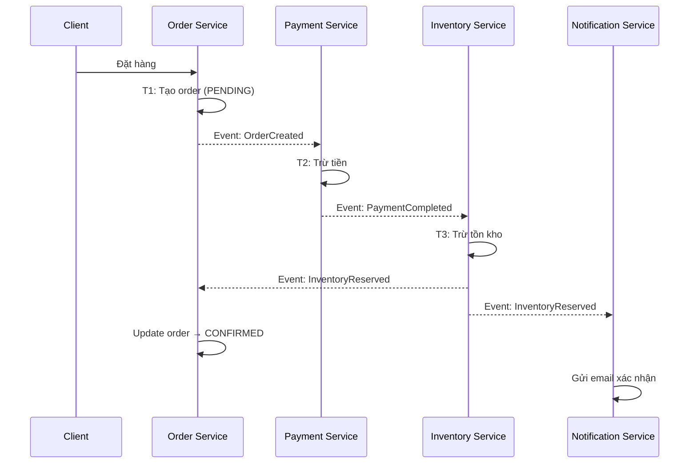
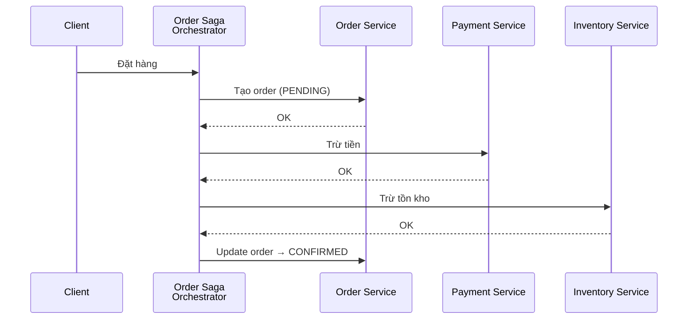

# Data Management trong Microservice

## 📋 Mục lục

- [1. Giới thiệu](#1-giới-thiệu)
- [2. Database per Service](#2-database-per-service)
  - [2.1. Tại sao mỗi service cần database riêng?](#21-tại-sao-mỗi-service-cần-database-riêng)
  - [2.2. Các mô hình triển khai](#22-các-mô-hình-triển-khai)
  - [2.3. Polyglot Persistence](#23-polyglot-persistence)
  - [2.4. Thách thức khi mỗi service có DB riêng](#24-thách-thức-khi-mỗi-service-có-db-riêng)
- [3. Shared Database — Anti-pattern](#3-shared-database--anti-pattern)
  - [3.1. Tại sao Shared Database là anti-pattern?](#31-tại-sao-shared-database-là-anti-pattern)
  - [3.2. Khi nào chấp nhận Shared Database?](#32-khi-nào-chấp-nhận-shared-database)
- [4. CAP Theorem](#4-cap-theorem)
  - [4.1. Ba thuộc tính CAP](#41-ba-thuộc-tính-cap)
  - [4.2. Tại sao chỉ chọn được 2/3?](#42-tại-sao-chỉ-chọn-được-23)
  - [4.3. CAP trong thực tế — Không đơn giản là chọn 2](#43-cap-trong-thực-tế--không-đơn-giản-là-chọn-2)
  - [4.4. BASE — Thay thế cho ACID trong hệ phân tán](#44-base--thay-thế-cho-acid-trong-hệ-phân-tán)
- [5. Quản lý Data Consistency xuyên service](#5-quản-lý-data-consistency-xuyên-service)
  - [5.1. Vấn đề: Distributed Transaction](#51-vấn-đề-distributed-transaction)
  - [5.2. Two-Phase Commit (2PC) — Và tại sao nên tránh](#52-two-phase-commit-2pc--và-tại-sao-nên-tránh)
- [6. Saga Pattern](#6-saga-pattern)
  - [6.1. Saga là gì?](#61-saga-là-gì)
  - [6.2. Choreography Saga](#62-choreography-saga)
  - [6.3. Orchestration Saga](#63-orchestration-saga)
  - [6.4. So sánh Choreography vs Orchestration](#64-so-sánh-choreography-vs-orchestration)
  - [6.5. Xử lý lỗi trong Saga — Compensating Transaction](#65-xử-lý-lỗi-trong-saga--compensating-transaction)
  - [6.6. Saga Execution Coordinator (SEC)](#66-saga-execution-coordinator-sec)
- [7. CQRS — Command Query Responsibility Segregation](#7-cqrs--command-query-responsibility-segregation)
  - [7.1. Vấn đề với CRUD truyền thống](#71-vấn-đề-với-crud-truyền-thống)
  - [7.2. CQRS là gì?](#72-cqrs-là-gì)
  - [7.3. Các mức độ áp dụng CQRS](#73-các-mức-độ-áp-dụng-cqrs)
  - [7.4. Ví dụ thực tế — E-Commerce Product Service](#74-ví-dụ-thực-tế--e-commerce-product-service)
  - [7.5. Khi nào nên / không nên dùng CQRS](#75-khi-nào-nên--không-nên-dùng-cqrs)
- [8. Event Sourcing](#8-event-sourcing)
  - [8.1. Ví dụ đời thực](#81-ví-dụ-đời-thực)
  - [8.2. Vấn đề mà Event Sourcing giải quyết](#82-vấn-đề-mà-event-sourcing-giải-quyết)
  - [8.3. Nguyên tắc hoạt động](#83-nguyên-tắc-hoạt-động)
  - [8.4. Ví dụ chi tiết — Đơn hàng từ đầu đến cuối](#84-ví-dụ-chi-tiết--đơn-hàng-từ-đầu-đến-cuối)
  - [8.5. Vấn đề hiệu năng — Snapshot](#85-vấn-đề-hiệu-năng--snapshot)
  - [8.6. Event Sourcing kết hợp CQRS](#86-event-sourcing-kết-hợp-cqrs)
  - [8.7. Các Event Store phổ biến](#87-các-event-store-phổ-biến)
  - [8.8. Khi nào nên / không nên dùng Event Sourcing](#88-khi-nào-nên--không-nên-dùng-event-sourcing)
- [9. Cross-Service Data — Lấy data từ service khác](#9-cross-service-data--lấy-data-từ-service-khác)
  - [9.1. Vấn đề: Service cần data không thuộc về mình](#91-vấn-đề-service-cần-data-không-thuộc-về-mình)
  - [9.2. Change Data Capture (CDC)](#92-change-data-capture-cdc)
  - [9.3. Event-Carried State Transfer](#93-event-carried-state-transfer)
  - [9.4. API Composition](#94-api-composition)
  - [9.5. So sánh các cách tiếp cận](#95-so-sánh-các-cách-tiếp-cận)
- [10. Transactional Outbox Pattern](#10-transactional-outbox-pattern)
  - [10.1. Vấn đề: Dual Write](#101-vấn-đề-dual-write)
  - [10.2. Outbox Pattern giải quyết thế nào?](#102-outbox-pattern-giải-quyết-thế-nào)
  - [10.3. Outbox + CDC — Giải pháp hoàn chỉnh](#103-outbox--cdc--giải-pháp-hoàn-chỉnh)
- [11. Tổng kết](#11-tổng-kết)
- [12. Liên kết liên quan](#12-liên-kết-liên-quan)

---

## 1. Giới thiệu

Trong kiến trúc Microservice, mỗi service nên **sở hữu data riêng** — đây là nguyên tắc nền tảng. Nhưng khi data bị phân tán, hàng loạt thách thức xuất hiện: làm sao giữ **consistency** xuyên service? Làm sao thực hiện **transaction** khi data nằm ở nhiều database? Làm sao **query** data khi nó thuộc về nhiều service khác nhau?

Document này sẽ đi qua các pattern và chiến lược quản lý data trong Microservice — từ nguyên tắc cơ bản (Database per Service) đến các pattern nâng cao (Saga, CQRS, Event Sourcing).

> 📌 Liên quan: [doc 04 — Autonomy & Independence](04-autonomy-independence.md) đã nói về service autonomy. Data independence chính là nền tảng để đạt autonomy.

---

## 2. Database per Service

### 2.1. Tại sao mỗi service cần database riêng?

```
Nguyên tắc: Mỗi service SỞ HỮU data của mình
──────────────────────────────────────────────

  ┌─────────────┐   ┌─────────────┐   ┌─────────────┐
  │ Order       │   │ Product     │   │ User        │
  │ Service     │   │ Service     │   │ Service     │
  │             │   │             │   │             │
  │  ┌───────┐  │   │  ┌───────┐  │   │  ┌───────┐  │
  │  │Order  │  │   │  │Product│  │   │  │User   │  │
  │  │  DB   │  │   │  │  DB   │  │   │  │  DB   │  │
  │  └───────┘  │   │  └───────┘  │   │  └───────┘  │
  └─────────────┘   └─────────────┘   └─────────────┘
       ❌ Không ai khác được truy cập Order DB trực tiếp
       ✅ Muốn data Order? → Gọi Order Service API
```

**Lý do:**

| Lý do | Giải thích |
|-------|-----------|
| **Loose Coupling** | Service đổi schema DB mà không ảnh hưởng service khác |
| **Independent Deployment** | Deploy Order Service mà không sợ break Product Service |
| **Technology Freedom** | Order dùng PostgreSQL, Product dùng Elasticsearch — tùy nhu cầu |
| **Team Autonomy** | Team Order tự quyết định schema, indexing, migration — không cần "xin phép" |
| **Scalability** | Scale DB của service nào đang chịu tải cao, không cần scale cả hệ thống |
| **Fault Isolation** | Order DB chết → chỉ Order Service chết, Product Service vẫn chạy bình thường |

### 2.2. Các mô hình triển khai

```
Mô hình 1: Separate Database Server
──────────────────────────────────────
  Mỗi service có DB server riêng hoàn toàn.

  Order Service ──▶ PostgreSQL Server A (port 5432)
  Product Service ──▶ PostgreSQL Server B (port 5433)
  User Service ──▶ MySQL Server C (port 3306)

  ✅ Cách ly hoàn toàn, fault isolation tốt nhất
  ❌ Chi phí cao nhất (nhiều server/instance)

Mô hình 2: Separate Schema (cùng DB server)
──────────────────────────────────────
  Các service dùng chung DB server, nhưng mỗi service có schema riêng.

  PostgreSQL Server:
    ├── schema: order_svc    ← Order Service dùng
    ├── schema: product_svc  ← Product Service dùng
    └── schema: user_svc     ← User Service dùng

  ✅ Tiết kiệm chi phí (1 server)
  ✅ Vẫn tách biệt ở mức schema (mỗi service chỉ có quyền trên schema mình)
  ❌ Cùng server → chung resource (CPU, RAM, I/O)
  ❌ Server chết → ảnh hưởng TẤT CẢ services

Mô hình 3: Separate Table (cùng schema)
──────────────────────────────────────
  Cùng schema nhưng convention đặt tên table theo service.

  PostgreSQL / Schema public:
    ├── order_orders
    ├── order_items
    ├── product_products
    ├── product_categories
    └── user_users

  ✅ Đơn giản nhất, phù hợp team nhỏ / giai đoạn đầu
  ❌ Không có cơ chế enforce ownership ở mức DB
  ❌ Dev có thể "lỡ" JOIN bảng service khác → tight coupling
```

```
Khuyến nghị:
────────────
  Startup / MVP        → Mô hình 2 hoặc 3 (tiết kiệm)
  Growth / Scale-up    → Mô hình 2 (separate schema)
  Enterprise / Large   → Mô hình 1 (separate server)

  Bắt đầu đơn giản → tách ra khi cần. Đừng over-engineer từ đầu.
```

### 2.3. Polyglot Persistence

**Polyglot Persistence** (đa dạng công nghệ lưu trữ) = Mỗi service **chọn database phù hợp nhất** với use case của mình, thay vì ép tất cả dùng chung 1 loại DB.

```
Ví dụ — E-Commerce system:
──────────────────────────

  ┌────────────────────────────────────────────────────────────────┐
  │                                                                │
  │  🟢 PRIMARY DATABASE (source of truth)                         │
  │  ─────────────────────────────────────                         │
  │  Order Service ──▶ PostgreSQL                                  │
  │     Cần ACID transaction, relational data (order → items)      │
  │                                                                │
  │  Product Reviews ──▶ MongoDB                                   │
  │     Flexible schema (review có thể kèm ảnh, video, rating)    │
  │                                                                │
  │  Recommendation ──▶ Neo4j (Graph DB)                           │
  │     "Users who bought X also bought Y" → graph traversal      │
  │                                                                │
  │  Notification Log ──▶ Cassandra                                │
  │     Append-heavy, time-series, distributed, no single failure  │
  │                                                                │
  │                                                                │
  │  🔵 SPECIALIZED STORE (secondary / derived)                    │
  │  ──────────────────────────────────────────                    │
  │  Product Catalog ──▶ PostgreSQL (primary) + Elasticsearch (search) │
  │     Write vào PostgreSQL → sync sang Elasticsearch cho search  │
  │                                                                │
  │  User Session ──▶ Redis                                        │
  │     Data tạm thời (TTL), mất thì user login lại — OK          │
  │                                                                │
  │  Shopping Cart ──▶ Redis / DynamoDB                             │
  │     Key-value, auto-expire, ephemeral data                    │
  │                                                                │
  │  Analytics ──▶ ClickHouse / BigQuery                           │
  │     Columnar storage, aggregate data từ nhiều source           │
  │                                                                │
  └────────────────────────────────────────────────────────────────┘
```

> ⚠️ **Primary DB vs Specialized Store — Phân biệt quan trọng:**
>
> Không phải DB nào cũng phù hợp làm **primary database** (source of truth). Cần phân biệt rõ:

```
Primary DB — Source of truth, data KHÔNG ĐƯỢC mất:
──────────────────────────────────────────────────
  ✅ PostgreSQL, MySQL     — ACID, durable, proven
  ✅ MongoDB               — Durable (với writeConcern: majority)
  ✅ Cassandra, DynamoDB   — Durable, distributed
  ✅ Neo4j                 — Durable graph store

Specialized Store — Secondary, derived, hoặc ephemeral:
───────────────────────────────────────────────────────
  ⚠️ Elasticsearch — KHÔNG NÊN làm primary DB
     • Near real-time (write → 1s mới searchable)
     • Không có transaction (không ACID)
     • Risk mất data khi split-brain
     • Thực tế: Luôn dùng kèm primary DB (PostgreSQL → CDC → ES)

  ⚠️ Redis — Chỉ làm primary cho EPHEMERAL data
     • Persistence có (AOF/RDB) nhưng durability không bằng RDBMS
     • Phù hợp: session, cache, cart, rate limit, leaderboard
     • KHÔNG phù hợp: order, payment, user profile (data quan trọng)
     • Thực tế: Shopping cart ở hệ thống lớn dùng DynamoDB hơn Redis

  ⚠️ ClickHouse / BigQuery — Read-only analytics
     • Data aggregated từ nhiều source, không phải source of truth
```

```
Kiến trúc thực tế — Product Service:
─────────────────────────────────────

  Admin ──▶ Product Service ──▶ PostgreSQL (primary, source of truth)
                                     │
                                  CDC / Event
                                     │
                                     ▼
  User search ──▶ Product Service ──▶ Elasticsearch (search, read-only)

  → PostgreSQL là nơi DUY NHẤT ghi data
  → Elasticsearch chỉ phục vụ search — rebuild được từ PostgreSQL
  → ES chết? Search tạm lỗi, nhưng data KHÔNG MẤT
```

| DB Type | Phù hợp | Ví dụ DB | Làm Primary? |
|---------|---------|----------|:------------:|
| **Relational** | ACID, quan hệ phức tạp, JOIN | PostgreSQL, MySQL | ✅ Luôn được |
| **Document** | Schema linh hoạt, nested objects | MongoDB, CouchDB | ✅ Được |
| **Key-Value** | Cache, session, đọc/ghi nhanh | Redis, DynamoDB | ⚠️ Chỉ ephemeral data (Redis) / ✅ DynamoDB |
| **Graph** | Quan hệ phức tạp, traversal | Neo4j, Amazon Neptune | ✅ Được |
| **Search Engine** | Full-text search, filtering | Elasticsearch, OpenSearch | ❌ Không nên |
| **Column-family** | Write-heavy, time-series | Cassandra, HBase | ✅ Được |
| **Columnar** | Analytics, OLAP | ClickHouse, BigQuery | ❌ Secondary/derived |

> ⚠️ **Cẩn trọng**: Polyglot Persistence = nhiều DB → nhiều thứ phải vận hành, monitor, backup. Chỉ đa dạng hóa khi **thật sự cần**. Đừng dùng 7 loại DB cho 3 services.

### 2.4. Thách thức khi mỗi service có DB riêng

```
Database per Service → 3 thách thức lớn:
────────────────────────────────────────

  1. CROSS-SERVICE QUERIES
     ─────────────────────
     Monolith: SELECT * FROM orders JOIN users ON orders.user_id = users.id
     Microservice: ❌ Không thể JOIN — data ở 2 DB khác nhau!
     
     → Giải pháp: API Composition, CQRS (xem phần 7, 9)

  2. DISTRIBUTED TRANSACTIONS
     ────────────────────────
     Monolith: BEGIN → debit account → create order → COMMIT
     Microservice: ❌ 2 DB → không thể 1 transaction!
     
     → Giải pháp: Saga Pattern (xem phần 6)

  3. DATA CONSISTENCY
     ────────────────
     Monolith: ACID đảm bảo consistency
     Microservice: Eventual consistency — data có thể inconsistent tạm thời
     
     → Giải pháp: Event-driven, Saga, Outbox Pattern (xem phần 6, 10)
```

---

## 3. Shared Database — Anti-pattern

### 3.1. Tại sao Shared Database là anti-pattern?

```
❌ Shared Database:
──────────────────

  ┌─────────────┐   ┌─────────────┐   ┌─────────────┐
  │ Order       │   │ Product     │   │ User        │
  │ Service     │   │ Service     │   │ Service     │
  └──────┬──────┘   └──────┬──────┘   └──────┬──────┘
         │                 │                 │
         └────────────┬────┴────────────────┘
                      │
                ┌─────▼─────┐
                │           │
                │  Shared   │
                │ Database  │
                │           │
                └───────────┘

  Vấn đề:
  ────────
  1. TIGHT COUPLING
     Order Service đọc trực tiếp bảng users
     → User Service đổi schema → Order Service BỂ

  2. KHÔNG THỂ INDEPENDENT DEPLOY
     Migration bảng products → phải coordinate với TẤT CẢ
     services đang đọc bảng này

  3. KHÔNG THỂ SCALE ĐỘC LẬP
     Product Service cần read replica
     → phải scale cả DB chung → ảnh hưởng tất cả

  4. SINGLE POINT OF FAILURE
     DB chết → TẤT CẢ services chết

  5. OWNERSHIP KHÔNG RÕ RÀNG
     Bảng orders có cột product_name — ai own cột này?
     Order Service hay Product Service? → conflict
```

### 3.2. Khi nào chấp nhận Shared Database?

```
Có thể chấp nhận Shared Database khi:
──────────────────────────────────────

  1. Giai đoạn chuyển đổi (Monolith → Microservice)
     Đang tách service từ monolith, chưa tách DB xong
     → Tạm dùng shared DB, có kế hoạch tách sau

  2. Reporting / Analytics
     Read-only replica cho reporting
     → Không ghi, không coupling logic

  3. Team rất nhỏ (2-3 người)
     Overhead quản lý nhiều DB > benefit
     → Dùng separate schema trong cùng DB server (mô hình 2)

  4. Legacy system integration
     Hệ thống cũ dùng shared DB, chưa có resource refactor

  ⚠️ Coi đây là TECHNICAL DEBT — có kế hoạch trả nợ
```

---

## 4. CAP Theorem

### 4.1. Ba thuộc tính CAP

**CAP Theorem** (Eric Brewer, 2000) nói rằng: Trong một hệ thống phân tán (distributed system), bạn chỉ có thể **đảm bảo tối đa 2 trong 3** thuộc tính sau:

```
                    C
                   ╱ ╲
                  ╱   ╲
          ┌──────╱─────╲──────┐
          │   Consistency     │
          │  (Nhất quán)      │
          │                   │
          │  Mọi node đều     │
          │  thấy data        │
          │  giống nhau       │
          │  tại cùng thời    │
          │  điểm             │
          └───────────────────┘
                 ╱   ╲
                ╱     ╲
               ╱       ╲
  ┌───────────╱─┐   ┌───╲───────────┐
  │ Availability│   │ Partition     │
  │ (Sẵn sàng)  │   │ Tolerance     │
  │             │   │ (Chịu phân    │
  │ Mọi request │   │  mảnh mạng)   │
  │ đều nhận    │   │               │
  │ response    │   │ Hệ thống vẫn  │
  │ (không lỗi) │   │ hoạt động khi │
  │             │   │ mất kết nối   │
  │             │   │ giữa các node │
  └─────────────┘   └───────────────┘
         A                  P
```

| Thuộc tính | Ý nghĩa | Ví dụ |
|-----------|---------|-------|
| **Consistency (C)** | Mọi read đều trả về data mới nhất (hoặc lỗi) | Sau khi write, tất cả node đọc ra cùng giá trị |
| **Availability (A)** | Mọi request đều nhận response (không timeout, không lỗi) | Dù 1 node chết, hệ thống vẫn trả response |
| **Partition Tolerance (P)** | Hệ thống tiếp tục hoạt động khi network bị phân mảnh | Node A không liên lạc được Node B, nhưng cả 2 vẫn serve request |

### 4.2. Tại sao chỉ chọn được 2/3?

```
Ví dụ minh họa — 2 node database:
──────────────────────────────────

  Normal (không partition):
  ┌────────┐   sync OK   ┌────────┐
  │ Node A │◄───────────▶│ Node B │
  │ data=5 │             │ data=5 │
  └────────┘             └────────┘
  → Cả C, A, P đều OK — không có vấn đề gì


  Khi PARTITION xảy ra (mất kết nối A ↔ B):
  ┌────────┐    ╳ ╳ ╳     ┌────────┐
  │ Node A │    network   │ Node B │
  │ data=? │    down!     │ data=? │
  └────────┘              └────────┘

  Client ghi data=10 vào Node A:
  
  Lựa chọn 1: Ưu tiên Consistency (CP)
  ───────────────────────────────────────
    Node A nhận write data=10
    Node A KHÔNG THỂ sync sang Node B (mất kết nối)
    → Node A từ chối write (hoặc Node B từ chối read)
    → Đảm bảo data nhất quán, NHƯNG hệ thống unavailable
    ✅ Consistent  ❌ Available  ✅ Partition Tolerant

  Lựa chọn 2: Ưu tiên Availability (AP)
  ───────────────────────────────────────
    Node A nhận write data=10 → OK, trả thành công
    Node B vẫn serve read với data=5 (data cũ)
    → Hệ thống vẫn available, NHƯNG data inconsistent
    ❌ Consistent  ✅ Available  ✅ Partition Tolerant

  Lựa chọn 3: Không chịu Partition (CA)
  ───────────────────────────────────────
    Khi mất kết nối → shutdown toàn bộ hệ thống
    → Consistent + Available KHI mạng tốt, nhưng CHẾT khi partition
    ✅ Consistent  ✅ Available  ❌ Partition Tolerant
    ⚠️ Không thực tế trong distributed system — partition LUÔN xảy ra
```

### 4.3. CAP trong thực tế — Không đơn giản là chọn 2

CAP Theorem nói về hệ thống **distributed** (nhiều node kết nối qua mạng). Trong thực tế, **mạng LUÔN có thể lỗi** — dây đứt, switch hỏng, packet mất, data center mất kết nối. Đây không phải "nếu" mà là "khi nào" xảy ra. Vì vậy, **Partition Tolerance không phải lựa chọn — mà là thực tế phải chấp nhận**.

Câu hỏi thực sự chỉ là: **Khi partition xảy ra, hy sinh Consistency hay Availability?**

```
Tại sao Partition Tolerance (P) là bắt buộc?
─────────────────────────────────────────────

  Distributed system = nhiều node kết nối qua MẠNG
  Mạng = KHÔNG đáng tin cậy (unreliable)

  ┌─────────────┐     network     ┌─────────────┐
  │   Node A    │◄──────────────▶ │   Node B    │
  │  (Hà Nội)   │    có thể lỗi   │  (Sài Gòn)  │
  └─────────────┘   bất cứ lúc    └─────────────┘
                     nào!

  Các nguyên nhân partition:
  • Dây mạng / switch / router hỏng
  • Data center mất kết nối (thiên tai, mất điện)
  • Firewall chặn nhầm traffic
  • Network congestion → timeout → coi như mất kết nối
  • Cloud provider AZ (Availability Zone) bị cô lập

  → Bạn KHÔNG THỂ ngăn partition xảy ra
  → Hệ thống PHẢI xử lý được partition (P là bắt buộc)
  → Vậy chỉ còn chọn: CP (hy sinh Available) hay AP (hy sinh Consistent)?
```

```
Còn single-node database thì sao?
──────────────────────────────────

  Single-node (1 máy duy nhất) = KHÔNG PHẢI distributed system
  → Không có 2 node → không có network giữa các node
  → Không có partition → CAP KHÔNG ÁP DỤNG

  ┌───────────────────────────────────────────────────────────────┐
  │  Database            │ Hành vi                                │
  │──────────────────────│────────────────────────────────────────│
  │  PostgreSQL (1 node) │ ACID đầy đủ, Consistent + Available    │
  │  MySQL (1 node)      │ Nhưng 1 node chết = MẤT TẤT CẢ         │
  │  SQL Server (1 node) │ Không có HA, không scale được          │
  └───────────────────────────────────────────────────────────────┘

  Vậy khi nào single-node phải đối mặt CAP?
  → Khi bạn THÊM REPLICA (để HA hoặc scale read)
  → Lúc này có 2+ node → trở thành distributed → CAP áp dụng
  → Và TÙY CẤU HÌNH replication mà thành CP hay AP (xem dưới)

  Ví dụ:
    PostgreSQL 1 node  →  Không liên quan CAP (CA tầm thường)
    PostgreSQL + 2 replica  →  Distributed → phải chọn CP hay AP


  CP Systems (ưu tiên Consistency):
  ┌───────────────────────────────────────────────────────────────┐
  │  Database            │ Hành vi khi partition                  │
  │──────────────────────│────────────────────────────────────────│
  │  PostgreSQL          │ Synchronous replication: replica lag   │
  │  (sync replication)  │ → primary chờ replica ACK → nếu mất    │
  │                      │ kết nối → write bị block (unavailable) │
  │  MySQL Group         │ Single-primary mode: mất majority      │
  │  Replication         │ → partition bị reject write            │
  │  MongoDB (default)   │ Primary unavailable → lỗi write        │
  │  HBase               │ Reject request nếu không sync được     │
  │  Redis Cluster       │ Reject write nếu mất majority node     │
  │  Zookeeper           │ Unavailable nếu mất quorum             │
  │  etcd                │ Raft consensus → unavailable nếu       │
  │                      │ mất majority                           │
  └───────────────────────────────────────────────────────────────┘

  AP Systems (ưu tiên Availability):
  ┌───────────────────────────────────────────────────────────────┐
  │  Database            │ Hành vi khi partition                  │
  │──────────────────────│────────────────────────────────────────│
  │  PostgreSQL          │ Async replication: replica có thể đọc  │
  │  (async replication) │ data cũ (stale read), write vẫn OK     │
  │                      │ → Available nhưng inconsistent tạm     │
  │  MySQL (async        │ Tương tự — primary vẫn serve write,    │
  │   replication)       │ replica có thể lag                     │
  │  Cassandra           │ Vẫn serve, eventual consistency        │
  │  DynamoDB            │ Always available, conflict resolve     │
  │  CouchDB             │ Multi-master, merge conflicts later    │
  │  Riak                │ Available, vector clocks cho conflict  │
  └───────────────────────────────────────────────────────────────┘
```

```
Vậy SQL database thuộc loại nào?
────────────────────────────────

  SQL (single node):
  ──────────────────
    → CA — Consistent + Available, nhưng KHÔNG distributed
    → Node chết = hệ thống chết. Không có partition để xét.
    → Hầu hết ứng dụng nhỏ-vừa dùng cách này.

  SQL (distributed / replicated):
  ───────────────────────────────
    → TÙY CẤU HÌNH replication mà thành CP hoặc AP:

    ┌──────────────────────────────────────────────────────────────┐
    │  Cấu hình             │ CAP   │ Trade-off                    │
    │───────────────────────│───────│───────────────────────────── │
    │  Sync replication     │ CP    │ Write chậm hơn (chờ ACK      │
    │  (synchronous_commit) │       │ từ replica), nhưng data      │
    │                       │       │ không bao giờ stale          │
    │                       │       │                              │
    │  Async replication    │ AP    │ Write nhanh (không chờ),     │
    │  (default PostgreSQL) │       │ nhưng replica có thể lag     │
    │                       │       │ vài ms → stale read          │
    │                       │       │                              │
    │  Semi-sync            │ CP/AP │ Ở giữa — chờ ít nhất 1       │
    │  (MySQL semi-sync)    │       │ replica ACK, cho phép        │
    │                       │       │ còn lại async                │
    └──────────────────────────────────────────────────────────────┘

    Ví dụ PostgreSQL:
      primary ──sync──▶ replica-1 (đồng bộ, phải ACK) → CP
      primary ──async─▶ replica-2 (bất đồng bộ, có thể lag) → AP

      → Cùng 1 database, CÓ THỂ vừa CP vừa AP tùy cấu hình!
    
  SQL (NewSQL — distributed SQL):
  ────────────────────────────────
    → CP — Thiết kế để vừa distributed vừa strong consistency

    ┌───────────────────────────────────────────────────────────┐
    │  Database          │ Hành vi                              │
    │────────────────────│──────────────────────────────────────│
    │  CockroachDB       │ Raft consensus, serializable         │
    │                    │ → unavailable nếu mất majority       │
    │  Google Spanner    │ TrueTime + Paxos, externally         │
    │                    │ consistent → unavailable khi partition│
    │  YugabyteDB        │ Raft consensus, PostgreSQL-compatible│
    │  TiDB              │ Raft, MySQL-compatible               │
    └───────────────────────────────────────────────────────────┘

    → NewSQL = "distributed SQL with strong consistency"
    → Trade-off: latency cao hơn (consensus overhead)
  ```

```
Chọn CP hay AP tùy vào USE CASE:
─────────────────────────────────

  CP — Khi data SAI thì thà KHÔNG có:
    • Banking: Số dư tài khoản PHẢI chính xác
    • Inventory: Số lượng tồn kho phải đúng (tránh oversell)
    • Booking: Đặt vé máy bay không được trùng ghế

  AP — Khi service CHẾT thì tệ hơn data cũ:
    • Social feed: Hiện bài cũ 5 phút vẫn OK
    • Product catalog: Giá cũ vài giây không sao
    • Shopping cart: Giỏ hàng hiện data cũ > giỏ hàng lỗi 500
    • DNS: Trả IP cũ tốt hơn không trả gì
```

### 4.4. BASE — Thay thế cho ACID trong hệ phân tán

Trong monolith, chúng ta quen với **ACID** (Atomicity, Consistency, Isolation, Durability). Trong hệ phân tán, **BASE** là mô hình thực tế hơn:

| | ACID | BASE |
|---|------|------|
| **Viết tắt** | Atomicity, Consistency, Isolation, Durability | Basically Available, Soft state, Eventually consistent |
| **Consistency** | Strong — data luôn nhất quán | Eventual — data nhất quán **sau một khoảng thời gian** |
| **Availability** | Có thể unavailable để đảm bảo consistency | Basically Available — hệ thống luôn trả response |
| **Phù hợp** | Single database, transaction đơn giản | Distributed system, microservices |
| **Trade-off** | Hy sinh availability khi cần | Hy sinh consistency tạm thời |

```
Ví dụ Eventual Consistency — E-Commerce:
─────────────────────────────────────────

  1. User đặt hàng → Order Service ghi order vào DB ✅
  2. Order Service publish event "OrderCreated"
  3. Inventory Service nhận event → trừ tồn kho (sau 50ms)
  4. Notification Service nhận event → gửi email (sau 200ms)

  Trong khoảng 50ms sau bước 1:
    Order DB: order tồn tại ✅
    Inventory DB: chưa trừ tồn kho ❌ (inconsistent!)
    
  Sau 200ms: Tất cả đã sync → consistent ✅

  → "Eventually" consistent — không phải "immediately" consistent
  → Chấp nhận được cho hầu hết business case
```

---

## 5. Quản lý Data Consistency xuyên service

### 5.1. Vấn đề: Distributed Transaction

```
Ví dụ: User đặt hàng — cần 3 bước atomic:
──────────────────────────────────────────

  1. Order Service:     Tạo order (status=CREATED)
  2. Payment Service:   Trừ tiền (debit $100)
  3. Inventory Service: Trừ tồn kho (stock -= 1)

  Trong Monolith:
  ───────────────
    BEGIN TRANSACTION
      INSERT INTO orders ...
      UPDATE accounts SET balance = balance - 100 ...
      UPDATE products SET stock = stock - 1 ...
    COMMIT    ← Tất cả thành công hoặc tất cả rollback

  Trong Microservice:
  ───────────────────
    Order DB:     INSERT → ✅
    Payment DB:   UPDATE → ✅
    Inventory DB: UPDATE → ❌ Hết hàng!

    Bước 3 lỗi, nhưng bước 1 và 2 đã COMMIT rồi!
    → Order đã tạo + tiền đã trừ + hàng không đủ = DATA INCONSISTENT 💥
    → Không có cơ chế ROLLBACK xuyên 3 databases!
```

### 5.2. Two-Phase Commit (2PC) — Và tại sao nên tránh

**Two-Phase Commit** (2PC) là cách truyền thống để đảm bảo distributed transaction:

```
2PC — Hoạt động thế nào:
────────────────────────

  Phase 1: PREPARE (Coordinator hỏi)
  ┌──────────────┐
  │ Coordinator  │──── "Bạn sẵn sàng commit?" ────▶ Order DB:     YES ✅
  │ (Transaction │──── "Bạn sẵn sàng commit?" ────▶ Payment DB:   YES ✅
  │  Manager)    │──── "Bạn sẵn sàng commit?" ────▶ Inventory DB: YES ✅
  └──────────────┘

  Phase 2: COMMIT (Tất cả nói YES → Coordinator ra lệnh commit)
  ┌──────────────┐
  │ Coordinator  │──── "COMMIT!" ────▶ Order DB:     COMMITTED ✅
  │              │──── "COMMIT!" ────▶ Payment DB:   COMMITTED ✅
  │              │──── "COMMIT!" ────▶ Inventory DB: COMMITTED ✅
  └──────────────┘

  Nếu BẤT KỲ AI nói NO:
  ┌──────────────┐
  │ Coordinator  │──── "ROLLBACK!" ────▶ Tất cả ROLLBACK
  └──────────────┘
```

```
Tại sao TRÁNH 2PC trong Microservice:
──────────────────────────────────────

  1. BLOCKING — Tất cả participant bị lock cho đến khi coordinator quyết định
     → Latency cao, throughput thấp

  2. SINGLE POINT OF FAILURE — Coordinator chết giữa chừng
     → Participant không biết commit hay rollback → stuck!

  3. TIGHT COUPLING — Tất cả service phải implement XA protocol
     → Phụ thuộc vào cùng transaction manager

  4. KHÔNG SCALE — Lock resource xuyên service
     → Càng nhiều service tham gia → càng chậm

  5. HẠN CHẾ DB — Không phải DB nào cũng support XA
     → MongoDB, Cassandra, Redis → không support 2PC

  ❌ 2PC đi ngược lại tinh thần Microservice (autonomy, independence)
  ✅ Dùng Saga Pattern thay thế
```

---

## 6. Saga Pattern

### 6.1. Saga là gì?

**Saga** là pattern thay thế distributed transaction bằng **chuỗi local transaction** — mỗi service thực hiện transaction riêng, và nếu một bước fail thì thực hiện **compensating transaction** (giao dịch bù) để rollback các bước trước.

```
Saga = Chuỗi local transactions + Compensating transactions
────────────────────────────────────────────────────────────

  Thay vì 1 distributed transaction:
    BEGIN → Step 1 + Step 2 + Step 3 → COMMIT/ROLLBACK

  Saga tách thành:
    T1 (local) → T2 (local) → T3 (local)

  Nếu T3 fail:
    C2 (compensate T2) → C1 (compensate T1)

  ┌────────────────────────────────────────────────────────┐
  │  Happy path:                                           │
  │  T1 ──✅──▶ T2 ──✅──▶ T3 ──✅──▶ DONE                 │
  │                                                        │
  │  Failure at T3:                                        │
  │  T1 ──✅──▶ T2 ──✅──▶ T3 ──❌──▶ C2 ──▶ C1 ──▶ ROLLED │
  │                          fail!     undo   undo   BACK  │
  └────────────────────────────────────────────────────────┘
```

Saga có 2 cách triển khai: **Choreography** và **Orchestration**.

### 6.2. Choreography Saga

Mỗi service **tự lắng nghe event** và quyết định bước tiếp theo — **không có coordinator trung tâm**.



```
Choreography — Khi FAIL:
─────────────────────────

  Order ──▶ event: OrderCreated
  Payment ──▶ T2: Trừ tiền ✅ ──▶ event: PaymentCompleted
  Inventory ──▶ T3: Trừ tồn kho ❌ (hết hàng!)
              ──▶ event: InventoryFailed

  Payment lắng nghe InventoryFailed:
    → C2: Hoàn tiền (compensating transaction)
    → event: PaymentRefunded

  Order lắng nghe PaymentRefunded:
    → C1: Update order → CANCELLED
    → event: OrderCancelled

  Notification lắng nghe OrderCancelled:
    → Gửi email "Đơn hàng bị huỷ do hết hàng"
```

```
Choreography — Ưu / Nhược:
───────────────────────────

  ✅ Loose coupling — service không biết nhau, chỉ biết events
  ✅ Simple — không cần orchestrator, mỗi service tự xử lý
  ✅ Phù hợp saga ít bước (2-4 services)

  ❌ Khó theo dõi flow — logic phân tán, không có nơi nào thấy toàn bộ saga
  ❌ Cyclic dependency — Service A listen event từ B, B listen từ A
  ❌ Khó debug — "Tại sao order bị cancel?" → phải trace qua nhiều services
  ❌ Không phù hợp saga phức tạp (5+ services)
```

### 6.3. Orchestration Saga

Có **1 Orchestrator** (điều phối viên) biết toàn bộ flow, ra lệnh cho từng service theo thứ tự.



```
Orchestration — Khi FAIL:
─────────────────────────

  Orchestrator → Order: Tạo order → ✅
  Orchestrator → Payment: Trừ tiền → ✅
  Orchestrator → Inventory: Trừ tồn kho → ❌ Hết hàng!

  Orchestrator biết phải compensate:
  Orchestrator → Payment: Hoàn tiền (C2) → ✅
  Orchestrator → Order: Cancel order (C1) → ✅

  ┌────────────────────────────────────────────────────────────────┐
  │  Orchestrator (Saga State Machine):                            │
  │                                                                │
  │  State: STARTED                                                │
  │    → command: CreateOrder                                      │
  │    → on success → State: ORDER_CREATED                         │
  │                                                                │
  │  State: ORDER_CREATED                                          │
  │    → command: ProcessPayment                                   │
  │    → on success → State: PAYMENT_COMPLETED                     │
  │    → on failure → command: CancelOrder → State: CANCELLED      │
  │                                                                │
  │  State: PAYMENT_COMPLETED                                      │
  │    → command: ReserveInventory                                 │
  │    → on success → State: CONFIRMED                             │
  │    → on failure → command: RefundPayment → CancelOrder         │
  │                  → State: CANCELLED                            │
  │                                                                │
  │  State: CONFIRMED → DONE ✅                                    │
  │  State: CANCELLED → DONE (compensated) ✅                      │
  └────────────────────────────────────────────────────────────────┘
```

```
Orchestration — Ưu / Nhược:
────────────────────────────

  ✅ Dễ hiểu — toàn bộ flow ở 1 chỗ (orchestrator)
  ✅ Dễ debug — orchestrator log từng bước, biết saga đang ở state nào
  ✅ Phù hợp saga phức tạp (5+ services)
  ✅ Dễ thêm / bớt bước — chỉ sửa orchestrator
  ✅ Centralized error handling

  ❌ Single point of failure — orchestrator chết → saga stuck
     (giải pháp: persistent state + retry)
  ❌ Coupling vào orchestrator — orchestrator biết tất cả services
  ❌ Thêm 1 component phải maintain
```

### 6.4. So sánh Choreography vs Orchestration

| Tiêu chí | Choreography | Orchestration |
|----------|-------------|---------------|
| **Coordinator** | Không có — mỗi service tự quyết | Có orchestrator trung tâm |
| **Coupling** | Loose — chỉ biết events | Orchestrator biết tất cả services |
| **Visibility** | Khó — logic phân tán | Dễ — flow tập trung 1 chỗ |
| **Complexity** | Đơn giản cho 2-4 bước | Đơn giản cho 5+ bước |
| **Debug** | Khó — trace qua nhiều services | Dễ — xem state machine |
| **Single point of failure** | Không | Orchestrator (cần HA) |
| **Phù hợp** | Saga đơn giản, ít bước | Saga phức tạp, nhiều bước |

```
Chọn nhanh:
────────────

  2-4 services, flow đơn giản → Choreography
  5+ services, flow phức tạp  → Orchestration
  Cần visibility + audit log  → Orchestration
  Muốn maximum loose coupling → Choreography
```

### 6.5. Xử lý lỗi trong Saga — Compensating Transaction

**Compensating Transaction** (giao dịch bù) là transaction đảo ngược hiệu ứng của transaction trước đó. **Không phải rollback** — mà là **tạo transaction mới** để undo.

```
Compensating Transaction ≠ Rollback:
─────────────────────────────────────

  Rollback (ACID):
    BEGIN → INSERT order → ROLLBACK
    → Order chưa bao giờ tồn tại (undo hoàn toàn)

  Compensating Transaction (Saga):
    T1: INSERT order (status=CREATED)      → COMMITTED ✅ (đã tồn tại!)
    C1: UPDATE order SET status=CANCELLED  → COMMITTED ✅ (tạo transaction mới)
    → Order VẪN tồn tại trong DB, nhưng status = CANCELLED
    → Có audit trail: ai tạo, khi nào cancel
```

```
Ví dụ — Compensating cho từng service:
──────────────────────────────────────

  ┌────────────────┬───────────────────────┬────────────────────────┐
  │ Service        │ Transaction (Ti)      │ Compensating (Ci)      │
  │────────────────│───────────────────────│────────────────────────│
  │ Order          │ Create order (PENDING)│ Cancel order           │
  │ Payment        │ Charge $100           │ Refund $100            │
  │ Inventory      │ Reserve 1 item        │ Release 1 item         │
  │ Shipping       │ Create shipment       │ Cancel shipment        │
  │ Loyalty        │ Add 100 points        │ Deduct 100 points      │
  │ Notification   │ Send confirmation email│ Send cancellation email│
  └────────────────┴───────────────────────┴────────────────────────┘

  ⚠️ Một số transaction KHÔNG THỂ compensate:
  ────────────────────────────────────────────
    • Email đã gửi → không thể "un-send"
      → Compensate = gửi email thông báo huỷ
    • SMS đã gửi → tương tự
    • 3rd party API đã gọi → tuỳ partner có support cancel không

  Thiết kế Saga phải tính trước compensating cho MỌI bước.
```

### 6.6. Saga Execution Coordinator (SEC)

Trong Orchestration Saga, orchestrator cần **persist state** để tránh mất trạng thái khi crash:

```
Saga Execution Coordinator — Persistent State:
──────────────────────────────────────────────

  Saga Log (trong DB):
  ┌────────┬────────────────┬───────────┬────────────┬───────────┐
  │ SagaID │ Step           │ Status    │ Timestamp  │ Data      │
  │────────│────────────────│───────────│────────────│───────────│
  │ S-001  │ CreateOrder    │ COMPLETED │ 10:00:01   │ {orderId} │
  │ S-001  │ ProcessPayment │ COMPLETED │ 10:00:02   │ {txnId}   │
  │ S-001  │ ReserveStock   │ FAILED    │ 10:00:03   │ {error}   │
  │ S-001  │ RefundPayment  │ COMPLETED │ 10:00:04   │ {refundId}│
  │ S-001  │ CancelOrder    │ COMPLETED │ 10:00:05   │ {}        │
  └────────┴────────────────┴───────────┴────────────┴───────────┘

  Khi orchestrator crash và restart:
  1. Đọc saga log từ DB
  2. Tìm saga đang IN_PROGRESS
  3. Xem bước cuối → quyết định tiếp tục hay compensate
  → Saga KHÔNG bị mất giữa chừng
```

---

## 7. CQRS — Command Query Responsibility Segregation

### 7.1. Vấn đề với CRUD truyền thống

```
CRUD truyền thống — 1 model cho cả Read và Write:
──────────────────────────────────────────────────

  ┌───────────┐
  │  Client   │
  └─────┬─────┘
        │
  ┌─────▼─────┐       ┌─────────────┐
  │  Service  │──────▶│  Database   │
  │           │       │             │
  │ CREATE    │       │ products    │
  │ READ      │       │ ┌─────────┐ │
  │ UPDATE    │       │ │ id      │ │
  │ DELETE    │       │ │ name    │ │
  │           │       │ │ price   │ │
  │ Cùng 1    │       │ │ stock   │ │
  │ model     │       │ │ desc    │ │
  │           │       │ │ ...     │ │
  └───────────┘       │ └─────────┘ │
                      └─────────────┘

  Vấn đề:
  ────────
  1. READ và WRITE có yêu cầu KHÁC NHAU
     Write: validate, business rules, cần ít fields
     Read: JOIN nhiều bảng, aggregate, cần nhiều fields

  2. READ nhiều hơn WRITE (thường 90:10)
     → Optimize cho read → ảnh hưởng write, và ngược lại

  3. Complex queries
     "Trang chủ cần: top products + user orders + recommendations"
     → JOIN 5 bảng, aggregate → CHẬM
     → Không thể index tối ưu cho mọi query pattern

  4. Scaling
     Muốn scale read → cần read replica
     Muốn scale write → cần sharding
     → Khác chiến lược, nhưng chung 1 model → khó tối ưu
```

### 7.2. CQRS là gì?

**CQRS** tách hệ thống thành 2 phần: **Command** (ghi) và **Query** (đọc) — mỗi phần có model, logic, và thậm chí database riêng.

```
CQRS — Tách Command và Query:
─────────────────────────────

  ┌──────────────────────────────────────────────────────────────┐
  │                                                              │
  │  ┌─────────────────────┐     ┌─────────────────────────┐     │
  │  │   COMMAND Side      │     │   QUERY Side            │     │
  │  │   (Write)           │     │   (Read)                │     │
  │  │                     │     │                         │     │
  │  │ • Create, Update,   │     │ • Read, Search, Filter  │     │
  │  │   Delete            │     │ • Aggregate, Report     │     │
  │  │ • Business rules    │     │ • Denormalized views    │     │
  │  │ • Validation        │     │ • Optimized for read    │     │
  │  │                     │     │                         │     │
  │  │  ┌──────────────┐   │     │  ┌──────────────┐       │     │
  │  │  │ Write Model  │   │     │  │ Read Model   │       │     │
  │  │  └──────┬───────┘   │     │  └──────┬───────┘       │     │
  │  │         │           │     │         │               │     │
  │  │  ┌──────▼───────┐   │     │  ┌──────▼───────┐       │     │
  │  │  │  Write DB    │   │ ──▶ │  │  Read DB     │       │     │
  │  │  │ (PostgreSQL) │   │sync │  │(Elasticsearch)│      │     │
  │  │  └──────────────┘   │     │  └──────────────┘       │     │
  │  └─────────────────────┘     └─────────────────────────┘     │
  │                                                              │
  │  Write DB ──sync──▶ Read DB (async, eventual consistency)    │
  └──────────────────────────────────────────────────────────────┘
```

### 7.3. Các mức độ áp dụng CQRS

```
Level 1: Tách code (cùng DB)
────────────────────────────
  Command Handler → Write logic → DB
  Query Handler   → Read logic  → DB (cùng DB)

  ✅ Đơn giản, code tổ chức tốt hơn
  ❌ Chưa tối ưu performance

Level 2: Tách model (cùng DB)
────────────────────────────
  Command → Write Model (normalized) → DB
  Query   → Read Model (denormalized view/materialized view) → DB (cùng DB)

  ✅ Read model tối ưu cho query (materialized view)
  ❌ Vẫn chung DB resource

Level 3: Tách DB (separate databases)
────────────────────────────────────
  Command → Write Model → Write DB (PostgreSQL)
                            │
                     async sync (CDC/Events)
                            │
  Query   → Read Model  → Read DB (Elasticsearch / Redis / MongoDB)

  ✅ Scale read và write độc lập
  ✅ Mỗi DB tối ưu cho use case riêng
  ❌ Phức tạp: phải sync data, eventual consistency
  ❌ Overhead vận hành: 2+ databases
```

### 7.4. Ví dụ thực tế — E-Commerce Product Service

```
Product Service với CQRS Level 3:
──────────────────────────────────

  COMMAND SIDE (Write):
  ─────────────────────
  Admin gọi: POST /products
    → Validate (name required, price > 0)
    → Write vào PostgreSQL (normalized)
    → Publish event: ProductCreated

  PostgreSQL (Write DB — normalized):
  ┌──────────────────┐    ┌───────────────────┐
  │ products         │    │ product_categories│
  │ ──────────       │    │ ──────────────────│
  │ id          PK   │    │ product_id    FK  │
  │ name             │    │ category_id   FK  │
  │ price            │    └───────────────────┘
  │ description      │    ┌───────────────────┐
  │ stock            │    │ categories        │
  │ created_at       │    │ ──────────────────│
  └──────────────────┘    │ id            PK  │
                          │ name              │
                          └───────────────────┘

  SYNC (Event / CDC):
  ────────────────────
  ProductCreated event → consumed by sync worker
  → Transform + denormalize → Write vào Elasticsearch

  QUERY SIDE (Read):
  ──────────────────
  User gọi: GET /products?q=iphone&category=phone&sort=price
    → Query Elasticsearch (denormalized, pre-joined)
    → Trả về nhanh, full-text search, faceted filtering

  Elasticsearch (Read DB — denormalized):
  {
    "id": "P-001",
    "name": "iPhone 15 Pro",
    "price": 999,
    "description": "...",
    "stock": 50,
    "categories": ["phone", "apple", "flagship"],
    "avgRating": 4.7,
    "totalReviews": 1234,
    "seller": { "name": "Apple Store", "rating": 4.9 }
  }

  → Tất cả data cần hiển thị đã được FLATTEN vào 1 document
  → Không cần JOIN khi query → cực nhanh
```

### 7.5. Khi nào nên / không nên dùng CQRS

```
✅ NÊN dùng CQRS khi:
──────────────────────
  • Read/Write ratio chênh lệch lớn (90:10)
  • Query pattern phức tạp (search, filter, aggregate)
  • Cần scale read và write riêng
  • Read model cần denormalize (pre-join) cho performance
  • Kết hợp Event Sourcing

❌ KHÔNG NÊN dùng CQRS khi:
────────────────────────────
  • CRUD đơn giản, ít query pattern
  • Data cần strong consistency (real-time balance)
  • Team nhỏ, hệ thống đơn giản → over-engineering
  • Mới bắt đầu microservice → đừng thêm complexity
```

---

## 8. Event Sourcing

### 8.1. Ví dụ đời thực

Trước khi vào kỹ thuật, hãy xem 2 ví dụ đời thực mà ai cũng biết:

```
Ví dụ 1: SỔ TIẾT KIỆM NGÂN HÀNG
──────────────────────────────────

  Bạn ra ngân hàng hỏi: "Tài khoản tôi còn bao nhiêu tiền?"

  Cách 1 — Chỉ lưu SỐ DƯ (cách thông thường):
  ┌─────────────────────────────────┐
  │  Tài khoản: Hiep                │
  │  Số dư: 500.000đ                │
  └─────────────────────────────────┘
  → Biết còn 500k, nhưng KHÔNG biết 500k đến từ đâu
  → "Tại sao hôm qua còn 800k, hôm nay chỉ còn 500k?" → Không biết!

  Cách 2 — Lưu SỔ GIAO DỊCH (Event Sourcing):
  ┌────┬──────────────────────┬──────────┬───────────┐
  │ #  │ Giao dịch            │ Số tiền  │ Ngày      │
  │────│──────────────────────│──────────│───────────│
  │ 1  │ Mở tài khoản         │          │ 01/01     │
  │ 2  │ Nạp tiền             │ +1.000k  │ 01/01     │
  │ 3  │ Rút tiền ATM         │ -200k    │ 05/01     │
  │ 4  │ Chuyển cho Lan       │ -300k    │ 10/01     │
  └────┴──────────────────────┴──────────┴───────────┘
  Số dư = 0 + 1000 - 200 - 300 = 500k ✅

  → Biết chính xác 500k đến từ đâu
  → Biết hôm qua 800k vì chưa chuyển 300k cho Lan
  → Muốn biết số dư ngày 05/01? Tính: 0 + 1000 - 200 = 800k ✅
```

```
Ví dụ 2: GOOGLE DOCS
─────────────────────

  Khi bạn gõ trong Google Docs, nó KHÔNG lưu "nội dung hiện tại".
  Nó lưu MỌI THAO TÁC bạn làm:

  ┌────┬──────────────────────────────────┬───────────┐
  │ #  │ Thao tác                         │ Thời gian │
  │────│──────────────────────────────────│───────────│
  │ 1  │ Gõ "Xin"                         │ 10:00:01  │
  │ 2  │ Gõ " chào"                       │ 10:00:02  │
  │ 3  │ Gõ " các bạn"                    │ 10:00:03  │
  │ 4  │ Xoá " các bạn"                   │ 10:00:05  │
  │ 5  │ Gõ " mọi người"                  │ 10:00:06  │
  └────┴──────────────────────────────────┴───────────┘

  Nội dung hiện tại = replay tất cả thao tác = "Xin chào mọi người"
  
  Nhờ vậy mà Google Docs có thể:
  → Xem VERSION HISTORY — "ai sửa gì lúc nào?"
  → UNDO — quay lại bất kỳ thời điểm nào
  → COLLABORATION — nhiều người cùng sửa, merge thao tác
```

```
Tóm lại — Event Sourcing là gì?
────────────────────────────────

  Cách thông thường: Lưu TRẠNG THÁI HIỆN TẠI
    → UPDATE balance = 500   (ghi đè, mất lịch sử)

  Event Sourcing: Lưu MỌI SỰ KIỆN ĐÃ XẢY RA
    → Nạp 1000, Rút 200, Chuyển 300  (giữ lại tất cả)
    → Trạng thái hiện tại = tính lại từ sự kiện

  Giống sổ tiết kiệm ngân hàng:
    KHÔNG BAO GIỜ tẩy xoá dòng cũ
    Muốn sửa sai → GHI THÊM dòng mới (ví dụ: "Hoàn tiền 300k")
```

### 8.2. Vấn đề mà Event Sourcing giải quyết

Tại sao không đơn giản lưu state như bình thường? Vì **có những hệ thống mà lịch sử quan trọng hơn hiện tại**:

```
Cách thông thường — Lưu state (UPDATE/ghi đè):
──────────────────────────────────────────────

  Bước 1: INSERT order (status = PENDING,  total = 100)
  Bước 2: UPDATE order SET status = PAID
  Bước 3: UPDATE order SET status = SHIPPED
  Bước 4: UPDATE order SET status = DELIVERED

  Database hiện tại:
  ┌──────────┬───────────┬───────┐
  │ order_id │ status    │ total │
  │──────────│───────────│───────│
  │ O-123    │ DELIVERED │ 100   │  ← Chỉ có trạng thái cuối cùng
  └──────────┴───────────┴───────┘

  ❌ "Order này thanh toán lúc mấy giờ?" → Không biết
  ❌ "Ship lúc nào? Giao lúc nào?" → Không biết
  ❌ "Có ai sửa total từ 200 thành 100 không?" → Không biết
  ❌ "Khách claim chưa nhận hàng — chứng minh đã giao?" → Không chứng minh được
```

```
Event Sourcing — Lưu events (APPEND, không ghi đè):
───────────────────────────────────────────────────

  ┌─────┬──────────────────┬─────────────────────────┬───────────┐
  │ #   │ Sự kiện          │ Dữ liệu                │ Thời gian │
  │─────│──────────────────│─────────────────────────│───────────│
  │ 1   │ OrderCreated     │ {items: [...], total:100}│ 10:00:01 │
  │ 2   │ PaymentReceived  │ {method: "VISA", txn:T1}│ 10:00:05 │
  │ 3   │ OrderConfirmed   │ {}                      │ 10:00:06 │
  │ 4   │ ItemShipped      │ {tracking: "VN123"}     │ 10:02:00 │
  │ 5   │ OrderDelivered   │ {signature: "Hiep"}     │ 11:30:00 │
  └─────┴──────────────────┴─────────────────────────┴───────────┘

  Status hiện tại? → Đọc event cuối → DELIVERED ✅
  "Thanh toán lúc nào?" → Event #2 → 10:00:05 ✅
  "Ship lúc nào?" → Event #4 → 10:02:00, tracking VN123 ✅
  "Chứng minh đã giao?" → Event #5 → 11:30, có chữ ký ✅
  "Trạng thái lúc 10:01?" → Replay event 1-3 → CONFIRMED ✅

  ✅ Biết TẤT CẢ mọi thứ đã xảy ra
  ✅ Truy vết được bất kỳ thời điểm nào
  ✅ Không ai có thể "lén sửa" — events không xoá/sửa được
```

```
Ai cần Event Sourcing?
──────────────────────

  🏦 Ngân hàng / Tài chính
     "Tiền đi đâu? Ai chuyển? Lúc nào?" → BẮT BUỘC có audit trail

  🏥 Y tế
     "Bệnh nhân được kê thuốc gì, ai kê, lúc nào?" → Pháp lý yêu cầu

  🛒 E-Commerce (Order phức tạp)
     "Khách claim không nhận hàng" → cần chứng minh đã giao

  📊 Hệ thống cần "time travel"
     "Giá sản phẩm tuần trước là bao nhiêu?" → replay events

  ❌ Blog, landing page, CRUD đơn giản → KHÔNG CẦN Event Sourcing
```

### 8.3. Nguyên tắc hoạt động

```
3 nguyên tắc cốt lõi:
──────────────────────

  1. KHÔNG LƯU STATE — LƯU EVENTS
     ─────────────────────────────
     Thông thường: bảng orders có 1 dòng, UPDATE liên tục
     Event Sourcing: bảng events có NHIỀU dòng, chỉ INSERT thêm

  2. EVENTS KHÔNG THỂ SỬA / XOÁ (Immutable)
     ──────────────────────────────────────────
     Giống sổ kế toán — viết nhầm thì GHI THÊM bút toán điều chỉnh
     KHÔNG BAO GIỜ tẩy xoá dòng cũ

     Ví dụ: Charge nhầm $100
       ❌ Cách sai:  XOÁ event "PaymentReceived $100"
       ✅ Cách đúng: THÊM event "PaymentRefunded $100"

  3. STATE = TÍNH LẠI TỪ EVENTS
     ───────────────────────────
     Muốn biết trạng thái hiện tại?
     → Lấy tất cả events của entity đó
     → "Phát lại" (replay) từ đầu đến cuối
     → Kết quả = trạng thái hiện tại
```

### 8.4. Ví dụ chi tiết — Đơn hàng từ đầu đến cuối

Đi qua toàn bộ vòng đời 1 đơn hàng để thấy Event Sourcing hoạt động thế nào:

```
BƯỚC 1: Khách đặt hàng
───────────────────────
  → Hệ thống KHÔNG tạo row trong bảng orders
  → Hệ thống GHI 1 EVENT vào Event Store:

  Event Store (bảng events):
  ┌─────┬────────────────┬──────────────────────────────────┐
  │ #   │ event_type     │ data                             │
  │─────│────────────────│──────────────────────────────────│
  │ 1   │ OrderCreated   │ {orderId:"O-123", items:["iPhone"│
  │     │                │  ], total: 999, customer:"Hiep"} │
  └─────┴────────────────┴──────────────────────────────────┘

  Trạng thái hiện tại (tính từ events):
  → Replay event 1: order = {id:"O-123", status:"PENDING", total:999}


BƯỚC 2: Thanh toán thành công
─────────────────────────────
  → GHI THÊM 1 event (KHÔNG update row nào):

  ┌─────┬────────────────┬──────────────────────────────────┐
  │ 1   │ OrderCreated   │ {orderId:"O-123", ...}           │
  │ 2   │ PaymentReceived│ {method:"VISA", amount:999}      │ ← MỚI
  └─────┴────────────────┴──────────────────────────────────┘

  Trạng thái hiện tại (tính lại):
  → Replay event 1: status = PENDING
  → Replay event 2: status = PAID
  → Kết quả: {id:"O-123", status:"PAID", total:999}


BƯỚC 3: Giao hàng
──────────────────
  ┌─────┬────────────────┬──────────────────────────────────┐
  │ 1   │ OrderCreated   │ {orderId:"O-123", ...}           │
  │ 2   │ PaymentReceived│ {method:"VISA", amount:999}      │
  │ 3   │ ItemShipped    │ {tracking:"VN123", carrier:"GHN"}│ ← MỚI
  └─────┴────────────────┴──────────────────────────────────┘

  Trạng thái: replay 1→2→3 = {status:"SHIPPED", tracking:"VN123"}


BƯỚC 4: Khách đổi ý — huỷ đơn (sau khi đã ship!)
──────────────────────────────────────────────────
  ┌─────┬────────────────┬──────────────────────────────────┐
  │ 1   │ OrderCreated   │ {orderId:"O-123", ...}           │
  │ 2   │ PaymentReceived│ {method:"VISA", amount:999}      │
  │ 3   │ ItemShipped    │ {tracking:"VN123", carrier:"GHN"}│
  │ 4   │ OrderCancelled │ {reason:"Khách đổi ý"}          │ ← MỚI
  │ 5   │ PaymentRefunded│ {amount:999, refundId:"R-001"}   │ ← MỚI
  └─────┴────────────────┴──────────────────────────────────┘

  Trạng thái: replay 1→2→3→4→5 = {status:"CANCELLED", refunded:true}

  ⚠️ Lưu ý: KHÔNG XOÁ event 2 (PaymentReceived) và event 3 (ItemShipped)
     Mà THÊM event 4 (Cancel) và event 5 (Refund)
     → Lịch sử HOÀN CHỈNH: đã ship, rồi huỷ, rồi hoàn tiền
```

```
So sánh với cách thông thường:
──────────────────────────────

  Cách thông thường (chỉ lưu state):
  ┌──────────┬───────────┬───────┐
  │ order_id │ status    │ total │
  │──────────│───────────│───────│
  │ O-123    │ CANCELLED │ 999   │ ← Chỉ biết bị huỷ, KHÔNG biết đã từng ship
  └──────────┴───────────┴───────┘

  Event Sourcing (lưu events):
  → Biết: tạo lúc nào, pay lúc nào, ship lúc nào, huỷ lúc nào, hoàn tiền lúc nào
  → "Time travel": muốn biết trạng thái lúc 10:02? Replay event 1-3 → SHIPPED
```

### 8.5. Vấn đề hiệu năng — Snapshot

Nếu 1 entity có **hàng nghìn events** thì replay hết sẽ chậm. Giải pháp: **Snapshot** — lưu "ảnh chụp" state tại 1 thời điểm, chỉ replay events sau snapshot.

```
Ví dụ: Tài khoản có 10.000 giao dịch
──────────────────────────────────────

  Không có Snapshot:
    Event 1 → Event 2 → ... → Event 10.000 → Tính số dư
    Phải replay 10.000 events mỗi lần xem số dư → CHẬM ❌

  Có Snapshot (chụp mỗi 1.000 events):
    Snapshot tại Event 9.000: {balance: 5.000.000đ}
    Chỉ replay Event 9.001 → 10.000 (1.000 events) → Số dư hiện tại
    → Nhanh gấp 10 lần ✅

  Hình dung:
  ┌────────────────────────────────────────────────────────────┐
  │  [E1] [E2] ... [E1000] [E1001] ... [E2000] ... [E10000]  │
  │                   ▲                    ▲                  │
  │              Snapshot 1           Snapshot 2               │
  │          {balance: 800k}      {balance: 1.2M}              │
  │                                                            │
  │  Muốn biết số dư hiện tại:                                │
  │  1. Lấy Snapshot gần nhất (Snapshot tại E9000)             │
  │  2. Chỉ replay E9001 → E10000                             │
  │  → Không cần replay từ đầu                                │
  └────────────────────────────────────────────────────────────┘
```

### 8.6. Event Sourcing kết hợp CQRS

Event Sourcing lưu events rất tốt cho **write**, nhưng **read thì chậm** (phải replay events mỗi lần query). Giải pháp: kết hợp với **CQRS** — tách read ra riêng.

```
Vấn đề: Query chậm khi dùng Event Sourcing
────────────────────────────────────────────

  "Cho tôi danh sách 100 đơn hàng mới nhất có status = SHIPPED"

  Với Event Sourcing thuần:
  → Phải load events của TẤT CẢ đơn hàng
  → Replay từng đơn để tính status
  → Filter những đơn SHIPPED
  → CỰC CHẬM khi có hàng triệu đơn ❌
```

```
Giải pháp: Event Sourcing + CQRS
─────────────────────────────────

  WRITE (Event Sourcing)              READ (CQRS)
  ──────────────────────              ────────────

  Khách đặt hàng                      Khách xem đơn hàng
       │                                    │
       ▼                                    ▼
  ┌──────────────┐                   ┌──────────────┐
  │ Ghi EVENT    │                   │ Query bảng   │
  │ vào Event    │                   │ orders_view  │
  │ Store        │                   │ (đã tính sẵn)│
  └──────┬───────┘                   └──────────────┘
         │                                  ▲
         │ Mỗi khi có event mới             │
         │ → tự động cập nhật          ┌────┘
         │                             │
         ▼                             │
  ┌──────────────┐               ┌─────┴────────┐
  │ Event Store  │──── sync ───▶ │  Read DB     │
  │ (events)     │   (Projection)│ (bảng thường)│
  └──────────────┘               └──────────────┘

  Event Store (chỉ INSERT events):
  ┌─────┬────────────────┬────────────┐
  │ 1   │ OrderCreated   │ {O-123...} │
  │ 2   │ PaymentReceived│ {O-123...} │
  │ 3   │ ItemShipped    │ {O-123...} │
  └─────┴────────────────┴────────────┘

  Read DB (cập nhật tự động từ events):
  ┌──────────┬───────────┬───────┬──────────┐
  │ order_id │ status    │ total │ customer │
  │──────────│───────────│───────│──────────│
  │ O-123    │ SHIPPED   │ 999   │ Hiep     │
  └──────────┴───────────┴───────┴──────────┘

  → Write: ghi events (source of truth, audit trail đầy đủ)
  → Read: query bảng thường (nhanh, đã denormalize sẵn)
  → Cả 2 bên đều được tối ưu cho use case của mình ✅
```

```
"Projection" là gì?
────────────────────

  Projection = chương trình lắng nghe events → cập nhật Read DB
  Nói đơn giản: nó "dịch" events thành bảng bình thường để query nhanh.

  Ví dụ đơn giản:
  ────────────────
  Khi nhận event OrderCreated:
    → INSERT INTO orders_view (order_id, status, total) VALUES ('O-123', 'PENDING', 999)

  Khi nhận event PaymentReceived:
    → UPDATE orders_view SET status = 'PAID' WHERE order_id = 'O-123'

  Khi nhận event ItemShipped:
    → UPDATE orders_view SET status = 'SHIPPED' WHERE order_id = 'O-123'

  → Projection "chuyển đổi" events thành bảng bình thường
  → Read DB luôn ở trạng thái mới nhất (hoặc gần mới nhất — eventual consistency)
```

#### Projection hoạt động thế nào?

Projection thực chất là 1 **consumer** (chương trình chạy nền) lắng nghe events từ Event Store. Mỗi khi có event mới, nó đọc event đó và cập nhật Read DB tương ứng.

```
Projection — Flow chi tiết:
───────────────────────────

  ┌──────────────┐     ┌────────────────┐     ┌──────────────┐
  │ Event Store  │────▶│  Projection    │────▶│  Read DB     │
  │              │     │  (Consumer)    │     │              │
  │ events table │     │                │     │ orders_view  │
  │              │     │ Lắng nghe event│     │ products_view│
  │              │     │ → xử lý       │     │ dashboard    │
  │              │     │ → ghi Read DB  │     │              │
  └──────────────┘     └────────────────┘     └──────────────┘

  Có 2 cách Projection nhận events:

  Cách 1: POLLING (kéo)
  ─────────────────────
    Projection chạy loop, mỗi 100ms hỏi:
    "Có event mới nào sau event #5 không?"
    → SELECT * FROM events WHERE sequence > 5 ORDER BY sequence

    ✅ Đơn giản, dễ implement
    ❌ Có độ trễ (100ms polling interval)
    ❌ Query DB liên tục → tốn resource

  Cách 2: SUBSCRIPTION / STREAMING (đẩy)
  ───────────────────────────────────────
    Event Store tự đẩy event mới cho Projection.
    Thường dùng:
    • Kafka Consumer — subscribe topic, nhận event real-time
    • EventStoreDB Subscription — built-in subscription
    • PostgreSQL LISTEN/NOTIFY — DB tự thông báo khi có row mới
    • CDC (Debezium) — capture INSERT từ events table → đẩy vào Kafka

    ✅ Gần real-time (ms)
    ✅ Không cần polling
    ❌ Cần thêm infrastructure (Kafka, Debezium...)
```

```
Projection — Ví dụ thực tế E-Commerce:
──────────────────────────────────────

  Từ CÙNG 1 stream events, có thể tạo NHIỀU Read DB khác nhau
  cho nhiều mục đích khác nhau:

  Event Store (source of truth):
  ┌─────┬──────────────────┬─────────────────────────────────┐
  │ #   │ event_type       │ data                            │
  │─────│──────────────────│─────────────────────────────────│
  │ 1   │ OrderCreated     │ {O-123, customer:"Hiep",        │
  │     │                  │  items:["iPhone"], total:999}    │
  │ 2   │ PaymentReceived  │ {O-123, method:"VISA"}          │
  │ 3   │ ItemShipped      │ {O-123, tracking:"VN123"}       │
  │ 4   │ OrderCreated     │ {O-456, customer:"Lan",         │
  │     │                  │  items:["AirPods"], total:199}   │
  │ 5   │ PaymentReceived  │ {O-456, method:"MoMo"}          │
  └─────┴──────────────────┴─────────────────────────────────┘
                    │
        ┌───────────┼───────────┐
        ▼           ▼           ▼
  Projection 1  Projection 2  Projection 3


  📋 Projection 1: "Orders View" — Cho trang quản lý đơn hàng
  ─────────────────────────────────────────────────────────────
  Read DB: bảng orders_view (PostgreSQL / MySQL)
  ┌──────────┬──────────┬───────────┬───────┬──────────┐
  │ order_id │ customer │ status    │ total │ tracking │
  │──────────│──────────│───────────│───────│──────────│
  │ O-123    │ Hiep     │ SHIPPED   │ 999   │ VN123    │
  │ O-456    │ Lan      │ PAID      │ 199   │ null     │
  └──────────┴──────────┴───────────┴───────┴──────────┘
  → Admin query: SELECT * FROM orders_view WHERE status = 'SHIPPED'


  📊 Projection 2: "Dashboard" — Cho trang thống kê
  ──────────────────────────────────────────────────
  Read DB: bảng daily_stats (PostgreSQL)
  ┌────────────┬──────────────┬─────────────┬─────────────┐
  │ date       │ total_orders │ total_revenue│ top_product │
  │────────────│──────────────│─────────────│─────────────│
  │ 2025-02-24 │ 2            │ 1198        │ iPhone      │
  └────────────┴──────────────┴─────────────┴─────────────┘
  → Dashboard query: SELECT * FROM daily_stats WHERE date = TODAY


  🔍 Projection 3: "Search" — Cho trang tìm kiếm đơn hàng
  ─────────────────────────────────────────────────────────
  Read DB: Elasticsearch index
  {
    "order_id": "O-123",
    "customer": "Hiep",
    "items": ["iPhone"],
    "status": "SHIPPED",
    "tracking": "VN123"
  }
  → User search: GET /search?q=iPhone&status=SHIPPED


  🔑 Điểm quan trọng:
  ────────────────────
  • 3 Projection đọc CÙNG events nhưng tạo ra 3 Read DB KHÁC NHAU
  • Mỗi Read DB tối ưu cho 1 use case riêng
  • Thêm use case mới? → Thêm Projection mới, KHÔNG cần sửa Write side
  • Read DB hỏng? → Xoá đi, replay lại TẤT CẢ events → rebuild từ đầu ✅
```

```
Projection bị lỗi / mất data thì sao?
──────────────────────────────────────

  Read DB chỉ là "bản sao được tính từ events".
  Events (source of truth) KHÔNG BAO GIỜ mất.

  Nếu Read DB hỏng:
  ──────────────────
    1. Xoá Read DB
    2. Chạy lại Projection từ event #1
    3. Projection replay TẤT CẢ events → rebuild Read DB
    4. Done ✅ — data giống hệt như trước

  Ví dụ:
    Elasticsearch index bị corrupt
    → Xoá index
    → Projection replay 1 triệu events → rebuild index
    → Mất vài phút, nhưng data KHÔNG MẤT

  Giống như:
    Sổ tiết kiệm (events) vẫn còn nguyên
    Bảng tóm tắt số dư (Read DB) bị rách
    → Tính lại từ sổ giao dịch → ra đúng số dư ✅

  Đây là 1 ưu điểm lớn của Event Sourcing:
  Read DB = DISPOSABLE (dùng xong có thể xoá, rebuild lại được)
```

```
Công nghệ thường dùng cho Projection:
──────────────────────────────────────

  ┌───────────────────┬────────────────────────────────────────┐
  │ Thành phần        │ Công nghệ phổ biến                     │
  │───────────────────│────────────────────────────────────────│
  │ Event Store       │ PostgreSQL (bảng events), EventStoreDB,│
  │                   │ Kafka (topic = event stream)            │
  │                   │                                        │
  │ Projection chạy   │ • Kafka Consumer (Java/Spring, Node.js)│
  │ bằng gì?          │ • EventStoreDB built-in Projection     │
  │                   │ • Custom worker (cron polling DB)       │
  │                   │ • Debezium CDC → Kafka → Consumer       │
  │                   │                                        │
  │ Read DB           │ • PostgreSQL / MySQL (query thường)    │
  │ (output)          │ • Elasticsearch (full-text search)      │
  │                   │ • Redis (cache, real-time dashboard)    │
  │                   │ • MongoDB (flexible view)               │
  └───────────────────┴────────────────────────────────────────┘

  Ví dụ stack phổ biến:
  ─────────────────────
  Stack 1 (đơn giản):
    PostgreSQL (events table) → Polling Worker → PostgreSQL (read views)

  Stack 2 (phổ biến nhất):
    PostgreSQL (events) → Debezium CDC → Kafka → Consumer → Elasticsearch

  Stack 3 (chuyên dụng):
    EventStoreDB → Built-in Subscription → Consumer → MongoDB + Redis
```

### 8.7. Các Event Store phổ biến

| Event Store | Mô tả | Phù hợp |
|------------|-------|---------|
| **EventStoreDB** | Purpose-built cho event sourcing, có subscription + projection | Dự án cần event sourcing "chính quy" |
| **PostgreSQL** | Dùng bảng events thông thường, đơn giản nhất | Team quen PostgreSQL, bắt đầu nhỏ |
| **Apache Kafka** | Distributed log, dùng topic = event stream | Đã có Kafka, cần scale lớn |
| **Axon Server** | Framework + event store cho Java/Kotlin | Java ecosystem |

### 8.8. Khi nào nên / không nên dùng Event Sourcing

```
✅ NÊN dùng khi:
─────────────────
  • Cần LỊCH SỬ ĐẦY ĐỦ — "ai làm gì, lúc nào?" (finance, y tế, pháp lý)
  • Cần XEM LẠI trạng thái ở quá khứ — "giá sản phẩm tuần trước?"
  • Cần CHỨNG MINH — "đơn hàng đã giao, có chữ ký"
  • Domain phức tạp, nhiều bước — order, payment, shipping, refund
  • Đã dùng event-driven architecture

❌ KHÔNG NÊN dùng khi:
──────────────────────
  • CRUD đơn giản — blog, user profile, landing page
  • Không cần lịch sử — chỉ cần biết "bây giờ là gì"
  • Team chưa quen — learning curve cao, dễ làm sai
  • Data ít thay đổi — overhead không đáng

⚠️ Hầu hết ứng dụng KHÔNG CẦN Event Sourcing.
   Chỉ dùng khi lịch sử thật sự quan trọng với business.
   Nếu chỉ cần audit log đơn giản → dùng bảng audit_log là đủ,
   không cần Event Sourcing.
```

---

## 9. Cross-Service Data — Lấy data từ service khác

### 9.1. Vấn đề: Service cần data không thuộc về mình

Trong microservice, mỗi service có DB riêng (xem [phần 2](#2-database-per-service)). Nhưng thực tế, khi hiển thị cho user thì thường cần **ghép data từ nhiều service**:

```
Ví dụ: Trang "Chi tiết đơn hàng"
─────────────────────────────────

  User mở trang chi tiết đơn hàng, cần hiển thị:
  ┌──────────────────────────────────────────────┐
  │  Đơn hàng: O-123                             │
  │  Khách hàng: Hiep              ← User Service│
  │  Sản phẩm: iPhone 15        ← Product Service│
  │  Tổng tiền: 999đ              ← Order Service│
  │  Trạng thái giao: Đang ship ← Shipping Service│
  └──────────────────────────────────────────────┘

  Order Service chỉ có trong DB của mình:
  ┌──────────┬──────────┬───────┐
  │ order_id │ user_id  │ total │
  │──────────│──────────│───────│
  │ O-123    │ U-456    │ 999   │  ← Chỉ có user_id, KHÔNG có tên khách
  └──────────┴──────────┴───────┘

  → Tên khách "Hiep" nằm ở DB của User Service
  → Tên sản phẩm "iPhone 15" nằm ở DB của Product Service
  → KHÔNG THỂ JOIN — vì khác database!

  Vậy lấy data bằng cách nào?
```

```
3 cách lấy data từ service khác:
────────────────────────────────

  ┌──────────────────────────────────────────────────────────────┐
  │                                                              │
  │  Cách 1: GỌI API lúc cần (API Composition)                  │
  │  ──────────────────────────────────────────                  │
  │  Order Service gọi: GET /users/U-456 → lấy tên "Hiep"       │
  │  → Đơn giản, data mới nhất, nhưng chậm (network call)       │
  │                                                              │
  │  Cách 2: COPY data về local (Event-Carried State Transfer)   │
  │  ──────────────────────────────────────────────────────────   │
  │  User Service publish event: {userId: U-456, name: "Hiep"}   │
  │  Order Service nhận event → lưu vào bảng local_users         │
  │  → Nhanh (query local), nhưng data có thể cũ vài giây       │
  │                                                              │
  │  Cách 3: BẮT thay đổi từ DB nguồn (CDC)                     │
  │  ──────────────────────────────────────                      │
  │  Debezium đọc DB của User Service → đẩy thay đổi sang Kafka │
  │  Order Service consume → cập nhật bảng local_users           │
  │  → Tương tự cách 2, nhưng không cần User Service sửa code   │
  │                                                              │
  └──────────────────────────────────────────────────────────────┘
```

### 9.2. Change Data Capture (CDC)

**CDC** = Bắt **mọi thay đổi** (INSERT, UPDATE, DELETE) từ database nguồn và stream đến consumer — thường qua **database log** (WAL/binlog).

```
CDC với Debezium + Kafka:
─────────────────────────

  ┌──────────────┐     ┌──────────┐     ┌─────────┐     ┌──────────────┐
  │ Product      │     │ Debezium │     │ Kafka   │     │ Order        │
  │ Service      │     │ Connector│     │         │     │ Service      │
  │              │     │          │     │         │     │              │
  │ PostgreSQL   │────▶│ Đọc WAL  │────▶│ Topic:  │────▶│ Local copy   │
  │ products     │     │ (change  │     │ product │     │ of product   │
  │ table        │     │  log)    │     │ .changes│     │ data         │
  └──────────────┘     └──────────┘     └─────────┘     └──────────────┘

  Product Service INSERT/UPDATE/DELETE product
  → PostgreSQL ghi WAL
  → Debezium đọc WAL → publish change event vào Kafka
  → Order Service consume → update local copy

  Ưu điểm:
  ✅ Product Service KHÔNG CẦN biết ai đang đọc data
  ✅ Không cần sửa code Product Service (capture ở DB level)
  ✅ Real-time (near real-time, thường < 1 giây)
  ✅ Reliable — WAL-based, không mất event

  Nhược điểm:
  ❌ Schema coupling — consumer phải biết schema DB nguồn
  ❌ Cần Kafka + Debezium infrastructure
  ❌ Exposes internal DB structure → tight coupling nếu không cẩn thận
```

### 9.3. Event-Carried State Transfer

Service publish **domain event** chứa đủ data — consumer lưu vào **local store** để query mà không cần gọi lại service gốc.

```
Event-Carried State Transfer:
─────────────────────────────

  Product Service publish event:
  {
    "type": "ProductUpdated",
    "data": {
      "productId": "P-001",
      "name": "iPhone 15 Pro",
      "price": 999,
      "category": "phone"
    }
  }

  Order Service nhận event:
  → Lưu vào local table: order_product_cache
  ┌───────────┬────────────────┬───────┐
  │ productId │ name           │ price │
  │───────────│────────────────│───────│
  │ P-001     │ iPhone 15 Pro  │ 999   │
  └───────────┴────────────────┴───────┘

  Khi Order Service cần product info:
  → Query local table → NHANH, không phụ thuộc Product Service

  ✅ Zero runtime dependency — Product Service chết, Order vẫn có data
  ✅ Cực nhanh — local query
  ✅ Decoupled — chỉ subscribe event, không biết internal schema

  ❌ Data có thể stale (eventual consistency)
  ❌ Storage duplication — mỗi consumer lưu 1 bản copy
  ❌ Phải design event chứa đủ data mà consumer cần
```

### 9.4. API Composition

Service gọi **API** của service khác tại **runtime** để lấy data cần thiết.

```
API Composition:
────────────────

  Client: GET /order-details/O-123

  Order Service (API Composer):
  ┌──────────────────────────────────────────────┐
  │  1. Query local DB: order O-123              │
  │  2. Call User Service: GET /users/U-456      │ ── parallel
  │  3. Call Product Service: GET /products/P-001│ ── parallel
  │                                              │
  │  4. Combine responses:                       │
  │     {                                        │
  │       "orderId": "O-123",                    │
  │       "customer": { "name": "Hiep" },        │
  │       "product": { "name": "iPhone 15" },    │
  │       "total": 999                           │
  │     }                                        │
  └──────────────────────────────────────────────┘

  ✅ Đơn giản — không cần event infrastructure
  ✅ Data luôn mới nhất (real-time query)
  ✅ Không duplicate storage

  ❌ Runtime dependency — User Service chết → Order API cũng lỗi
  ❌ Latency cao hơn — network call tại query time
  ❌ Không scale tốt cho high-traffic read
```

### 9.5. So sánh các cách tiếp cận

| Tiêu chí | API Composition | Event-Carried State Transfer | CDC |
|----------|----------------|------------------------------|-----|
| **Consistency** | Strong (real-time) | Eventual | Eventual |
| **Latency** | Cao (network call) | Thấp (local query) | Thấp (local query) |
| **Coupling** | Runtime dependency | Event contract | Schema coupling |
| **Availability** | Phụ thuộc upstream | Independent | Independent |
| **Complexity** | Thấp | Trung bình | Cao (Debezium, Kafka) |
| **Storage** | Không duplicate | Duplicate | Duplicate |
| **Phù hợp** | Low traffic, cần data mới | High traffic, chấp nhận stale | Cross-system sync, legacy |

---

## 10. Transactional Outbox Pattern

### 10.1. Vấn đề: Dual Write

```
Dual Write Problem:
──────────────────

  Order Service cần:
  1. Ghi order vào DB
  2. Publish event "OrderCreated" vào Message Broker

  ❌ Vấn đề — 2 bước KHÔNG ATOMIC:

  Scenario 1: DB OK, Publish FAIL
  ────────────────────────────────
    1. INSERT order vào DB → ✅ COMMITTED
    2. Publish event vào Kafka → ❌ Kafka down!
    → Order tồn tại trong DB nhưng KHÔNG AI biết
    → Inventory không trừ kho, Payment không charge

  Scenario 2: Publish OK, DB FAIL
  ────────────────────────────────
    1. Publish event vào Kafka → ✅
    2. INSERT order vào DB → ❌ DB lỗi!
    → Event đã gửi nhưng order KHÔNG tồn tại
    → Inventory trừ kho cho order ma

  Scenario 3: Service crash giữa chừng
  ─────────────────────────────────────
    1. INSERT order vào DB → ✅ COMMITTED
    2. --- SERVICE CRASH ---
    → Event KHÔNG BAO GIỜ được publish

  ⚠️ Bạn KHÔNG THỂ đảm bảo 2 writes atomic
     mà không dùng distributed transaction (2PC).
     Nhưng 2PC thì đã nói rồi — TRÁNH trong microservice.
```

```
"Nhưng DB và Kafka của tôi đều HA, có cần Outbox không?"
─────────────────────────────────────────────────────────

  Trả lời: CÓ — vì HA và Outbox giải quyết 2 VẤN ĐỀ KHÁC NHAU.

  HA giải quyết: "DB / Kafka có CHẾT hay không?"
  Outbox giải quyết: "DB write và event publish có ĐỒNG BỘ hay không?"

  Dù cả DB và Kafka đều HA 99.99%, vẫn xảy ra:
  ──────────────────────────────────────────────

  Tình huống 1: Network giữa App và Kafka bị timeout
  ────────────────────────────────────────────────────
    App → INSERT order vào DB       → ✅ (DB vẫn sống)
    App → Publish event vào Kafka   → ❌ (network timeout)
    
    Kafka vẫn sống! Nhưng APP không gửi được → event mất
    → HA không cứu được tình huống này

  Tình huống 2: App crash / bị kill giữa 2 bước
  ──────────────────────────────────────────────
    App → INSERT order vào DB       → ✅ COMMITTED
    App → --- POD BỊ KILL (OOM, deploy mới, scale down) ---
    
    DB vẫn sống, Kafka vẫn sống, nhưng event KHÔNG BAO GIỜ được gửi
    → HA không liên quan — vấn đề ở APP, không phải infrastructure

  Tình huống 3: Thứ tự thực hiện bị sai
  ──────────────────────────────────────
    App → Publish event vào Kafka   → ✅
    App → INSERT order vào DB       → ❌ (unique constraint violation)
    
    Event đã gửi → Inventory trừ kho cho order KHÔNG TỒN TẠI
    → "Phantom event" — event mồ côi, không có data tương ứng

  ┌──────────────────────────────────────────────────────────────┐
  │                                                              │
  │  HA         = Infrastructure không chết                      │
  │  Outbox     = Data + Event luôn đồng bộ (atomic)             │
  │                                                              │
  │  HA KHÔNG thể thay thế Outbox                                │
  │  Outbox KHÔNG thể thay thế HA                                │
  │  → Cần CẢ HAI                                                │
  │                                                              │
  └──────────────────────────────────────────────────────────────┘
```

```
Khi nào CẦN Outbox Pattern?
────────────────────────────

  ✅ CẦN — Khi service vừa ghi DB vừa publish event:
     • Order Service: tạo order + publish OrderCreated
     • Payment Service: update payment + publish PaymentCompleted
     • Bất kỳ service nào cần: "ghi data XÀ publish event" atomic

  ❌ KHÔNG CẦN — Khi chỉ làm 1 trong 2:
     • Chỉ ghi DB, không publish event → không có dual write
     • Chỉ publish event, không ghi DB → không có dual write
     • Event Sourcing thuần → Event Store VỪA LÀ DB vừa là event log
       → chỉ có 1 write, không phải dual write
```

### 10.2. Outbox Pattern giải quyết thế nào?

**Outbox Pattern** = Ghi event vào **bảng outbox trong cùng database** với business data — trong **cùng 1 local transaction**. Sau đó, một process riêng đọc outbox và publish event ra message broker.

```
Outbox Pattern:
───────────────

  ┌────────────────────────────────────────────────────┐
  │  Order Service                                     │
  │                                                    │
  │  BEGIN TRANSACTION                                 │
  │    INSERT INTO orders (id, ...) VALUES (...)       │
  │    INSERT INTO outbox (id, event_type, payload)    │
  │      VALUES ('evt-1', 'OrderCreated', '{...}')     │
  │  COMMIT                                            │
  │                                                    │
  │  → Cùng 1 transaction = ATOMIC ✅                  │
  │  → Order tạo thành công = Event trong outbox       │
  │  → Order rollback = Event cũng rollback            │
  └────────────────────────────────────────────────────┘

  Outbox Table:
  ┌──────────┬────────────────┬─────────────────────┬───────────┐
  │ id       │ event_type     │ payload             │ published │
  │──────────│────────────────│─────────────────────│───────────│
  │ evt-1    │ OrderCreated   │ {"orderId":"O-123"} │ false     │
  │ evt-2    │ OrderConfirmed │ {"orderId":"O-124"} │ true      │
  └──────────┴────────────────┴─────────────────────┴───────────┘

  Outbox Publisher (separate process / polling):
  ┌──────────────────────────────────────────────────────────────┐
  │  1. SELECT * FROM outbox WHERE published = false             │
  │  2. Publish to Kafka                                         │
  │  3. UPDATE outbox SET published = true WHERE id = 'evt-1'    │
  │                                                              │
  │  (Polling mỗi 100ms hoặc dùng CDC để detect new outbox rows) │
  └──────────────────────────────────────────────────────────────┘
```

### 10.3. Outbox + CDC — Giải pháp hoàn chỉnh

Thay vì polling outbox table, dùng **CDC** (Debezium) để capture INSERT vào outbox table → publish event ngay lập tức:

```
Outbox + CDC (Debezium):
────────────────────────

  ┌──────────────┐     ┌──────────┐     ┌─────────┐     ┌──────────────┐
  │ Order        │     │ Debezium │     │ Kafka   │     │ Inventory    │
  │ Service      │     │          │     │         │     │ Service      │
  │              │     │          │     │         │     │              │
  │ ┌──────────┐ │     │ Capture  │     │ Topic:  │     │ Consumer     │
  │ │ orders   │ │     │ changes  │     │ order   │     │              │
  │ │ table    │ │     │ from     │────▶│ .events │────▶│ Process      │
  │ ├──────────┤ │     │ outbox   │     │         │     │ event        │
  │ │ outbox   │ │────▶│ table    │     │         │     │              │
  │ │ table    │ │ WAL │ WAL      │     │         │     │              │
  │ └──────────┘ │     └──────────┘     └─────────┘     └──────────────┘
  └──────────────┘

  Ưu điểm so với Polling:
  ✅ Near real-time (ms thay vì polling interval)
  ✅ Không cần polling loop → tiết kiệm DB query
  ✅ Guaranteed delivery — WAL-based
  ✅ Outbox table có thể cleanup sau khi published

  Flow đầy đủ:
  1. Order Service: BEGIN → INSERT order + INSERT outbox → COMMIT
  2. Debezium: Detect INSERT trong outbox (qua WAL)
  3. Debezium: Publish event vào Kafka topic
  4. Inventory Service: Consume event → trừ tồn kho
  5. (Optional) Cleanup: DELETE FROM outbox WHERE published
```

---

## 11. Tổng kết

```
Cheat Sheet — Data Management trong Microservice:
──────────────────────────────────────────────────

  ┌─────────────────────────┬──────────────────────────────────────┐
  │ Vấn đề                  │ Giải pháp                            │
  │─────────────────────────│──────────────────────────────────────│
  │ Service nào own data?   │ Database per Service                 │
  │ Chọn DB nào?            │ Polyglot Persistence                 │
  │ Distributed transaction?│ Saga (Choreography / Orchestration)  │
  │ Cross-service query?    │ API Composition / CQRS               │
  │ Read-heavy optimization?│ CQRS (tách Read/Write model)         │
  │ Full audit trail?       │ Event Sourcing                       │
  │ Data sync giữa service? │ CDC / Event-Carried State Transfer   │
  │ Atomic write + publish? │ Transactional Outbox Pattern         │
  │ Consistency model?      │ Eventual Consistency (BASE)          │
  └─────────────────────────┴──────────────────────────────────────┘
```

```
Bắt đầu từ đâu?
────────────────

  1. Database per Service (bắt buộc)
  2. Saga cho distributed transaction (Choreography trước, Orchestration khi phức tạp)
  3. Outbox Pattern cho reliable event publishing
  4. API Composition cho cross-service query (đơn giản)
  5. CQRS khi read pattern phức tạp
  6. Event Sourcing khi cần audit trail hoặc domain phức tạp

  Đừng áp dụng TẤT CẢ cùng lúc — thêm complexity chỉ khi CẦN.
```

---

## 12. Liên kết liên quan

- [doc 04 — Autonomy & Independence](04-autonomy-independence.md) — Service autonomy, data ownership
- [doc 06 — Inter-Service Communication](06-inter-service-communication.md) — Sync vs Async, Event-Driven
- [doc 07 — API Gateway](07-api-gateway.md) — API Composition tại Gateway
- [doc 10 — Resilience Patterns](10-resilience-patterns.md) — Circuit Breaker, Retry khi cross-service call
- [doc 16 — Design Patterns](16-design-patterns.md) — Saga, CQRS, Event Sourcing trong context tổng hợp
