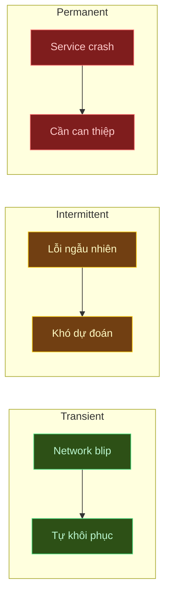
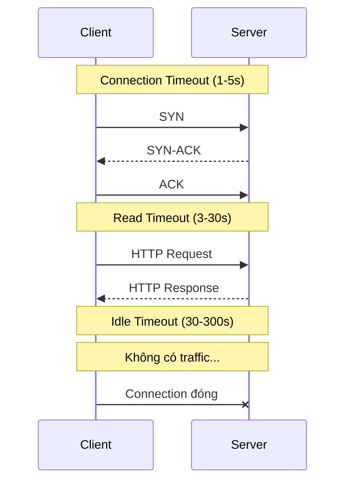
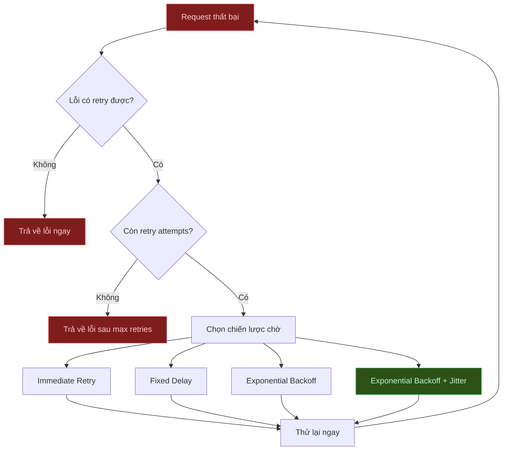
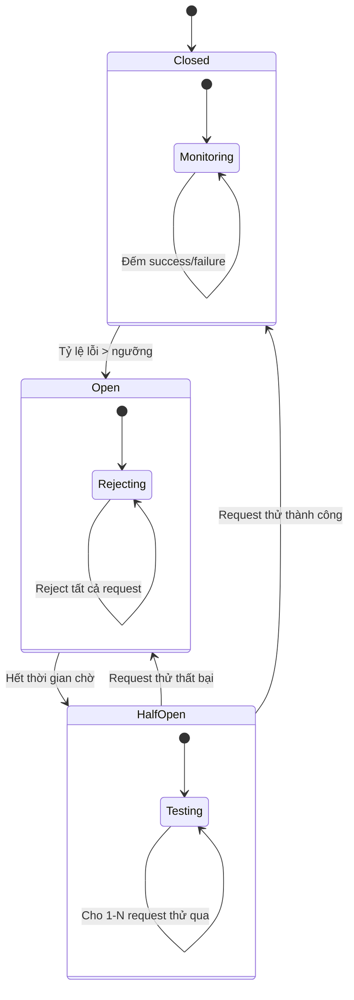
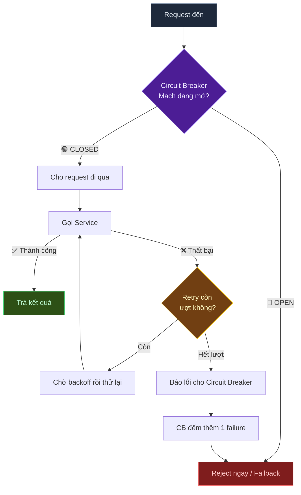

# Resilience Patterns — Các mẫu thiết kế chịu lỗi trong Microservice

## 📋 Mục lục

- [1. Giới thiệu](#1-giới-thiệu)
  - [1.1. Tại sao Resilience quan trọng?](#11-tại-sao-resilience-quan-trọng)
  - [1.2. Các loại lỗi trong hệ thống phân tán](#12-các-loại-lỗi-trong-hệ-thống-phân-tán)
  - [1.3. Tổng quan các Resilience Patterns](#13-tổng-quan-các-resilience-patterns)
- [2. Timeout](#2-timeout)
  - [2.1. Tại sao cần Timeout?](#21-tại-sao-cần-timeout)
  - [2.2. Các loại Timeout](#22-các-loại-timeout)
  - [2.3. Cách chọn giá trị Timeout](#23-cách-chọn-giá-trị-timeout)
  - [2.4. Ví dụ thực tế](#24-ví-dụ-thực-tế)
- [3. Retry Pattern](#3-retry-pattern)
  - [3.1. Khi nào nên Retry?](#31-khi-nào-nên-retry)
  - [3.2. Các chiến lược Retry](#32-các-chiến-lược-retry)
  - [3.3. Exponential Backoff với Jitter](#33-exponential-backoff-với-jitter)
  - [3.4. Idempotency — Điều kiện tiên quyết](#34-idempotency--điều-kiện-tiên-quyết)
  - [3.5. Retry Storm — Khi Retry trở thành vấn đề](#35-retry-storm--khi-retry-trở-thành-vấn-đề)
- [4. Circuit Breaker](#4-circuit-breaker)
  - [4.1. Bài toán thực tế](#41-bài-toán-thực-tế)
  - [4.2. Circuit Breaker là gì?](#42-circuit-breaker-là-gì)
  - [4.3. Ba trạng thái của Circuit Breaker](#43-ba-trạng-thái-của-circuit-breaker)
  - [4.4. Cấu hình Circuit Breaker](#44-cấu-hình-circuit-breaker)
  - [4.5. Ví dụ thực tế — Payment Service gọi Bank API](#45-ví-dụ-thực-tế--payment-service-gọi-bank-api)
  - [4.6. Circuit Breaker + Retry — Kết hợp](#46-circuit-breaker--retry--kết-hợp)
  - [4.7. Các thư viện phổ biến](#47-các-thư-viện-phổ-biến)
- [5. Bulkhead Pattern](#5-bulkhead-pattern)
  - [5.1. Ý tưởng từ đóng tàu](#51-ý-tưởng-từ-đóng-tàu)
  - [5.2. Bulkhead trong Microservice](#52-bulkhead-trong-microservice)
  - [5.3. Các loại Bulkhead](#53-các-loại-bulkhead)
  - [5.4. Ví dụ thực tế — E-Commerce Service](#54-ví-dụ-thực-tế--e-commerce-service)
  - [5.5. Bulkhead + Circuit Breaker](#55-bulkhead--circuit-breaker)
- [6. Rate Limiter](#6-rate-limiter)
  - [6.1. Tại sao cần Rate Limiting?](#61-tại-sao-cần-rate-limiting)
  - [6.2. Các thuật toán Rate Limiting](#62-các-thuật-toán-rate-limiting)
  - [6.3. Rate Limiting ở đâu?](#63-rate-limiting-ở-đâu)
  - [6.4. Ví dụ thực tế — Public API](#64-ví-dụ-thực-tế--public-api)
- [7. Fallback Pattern](#7-fallback-pattern)
  - [7.1. Fallback là gì?](#71-fallback-là-gì)
  - [7.2. Các chiến lược Fallback](#72-các-chiến-lược-fallback)
  - [7.3. Ví dụ thực tế — Recommendation Service](#73-ví-dụ-thực-tế--recommendation-service)
  - [7.4. Graceful Degradation vs Fail Fast](#74-graceful-degradation-vs-fail-fast)
- [8. Các Pattern bổ trợ](#8-các-pattern-bổ-trợ)
  - [8.1. Health Check](#81-health-check)
  - [8.2. Deadlines / Distributed Timeout](#82-deadlines--distributed-timeout)
  - [8.3. Load Shedding](#83-load-shedding)
  - [8.4. Chaos Engineering](#84-chaos-engineering)
- [9. Kết hợp các Pattern — Defense in Depth](#9-kết-hợp-các-pattern--defense-in-depth)
  - [9.1. Thứ tự áp dụng](#91-thứ-tự-áp-dụng)
  - [9.2. Ví dụ tổng hợp — Order Service](#92-ví-dụ-tổng-hợp--order-service)
- [10. Anti-patterns](#10-anti-patterns)
- [11. Tổng kết](#11-tổng-kết)
- [12. Liên kết liên quan](#12-liên-kết-liên-quan)

---

## 1. Giới thiệu

Trong các doc trước, chúng ta đã tìm hiểu cách **giao tiếp giữa các service** ([doc 06](06-inter-service-communication.md)), thiết kế **API Gateway** ([doc 07](07-api-gateway.md)), và **quản lý data** ([doc 09](09-data-management.md)). Nhưng trong hệ thống phân tán, **lỗi là điều chắc chắn sẽ xảy ra** — không phải "nếu" mà là "khi nào".

> **"Everything fails, all the time."** — Werner Vogels, CTO Amazon

Resilience (khả năng chịu lỗi) là khả năng hệ thống **tiếp tục hoạt động** (có thể ở mức giảm chất lượng) khi một phần của hệ thống gặp sự cố.

### 1.1. Tại sao Resilience quan trọng?

Trong monolith, khi ứng dụng lỗi → toàn bộ hệ thống dừng. Trong microservice, vấn đề **phức tạp hơn nhiều**:

```
┌─────────────────────────────────────────────────────────┐
│              VẤN ĐỀ CASCADING FAILURE                   │
│                                                         │
│   User ──▶ API Gateway ──▶ Order Service ──▶ Payment    │
│                              │                 ❌ DOWN  │
│                              │                          │
│                              ▼                          │
│                         Order bị treo                   │
│                              │                          │
│                              ▼                          │
│                    Thread pool cạn kiệt                 │
│                              │                          │
│                              ▼                          │
│                    Order Service ❌ DOWN                │
│                              │                          │
│                              ▼                          │
│                    API Gateway ❌ DOWN                  │
│                              │                          │
│                              ▼                          │
│                    ❌ TOÀN BỘ HỆ THỐNG SẬP              │
└─────────────────────────────────────────────────────────┘
```

Một **Payment Service** lỗi có thể kéo theo **toàn bộ hệ thống** sập — đây gọi là **Cascading Failure** (lỗi lan truyền dây chuyền).

| Đặc điểm | Monolith | Microservice |
|-----------|----------|--------------|
| Điểm lỗi | Ít, nhưng mỗi lỗi ảnh hưởng toàn bộ | Nhiều, nhưng có thể cô lập |
| Giao tiếp | In-process (nhanh, tin cậy) | Network (chậm, không tin cậy) |
| Cascading Failure | Ít xảy ra | Rất dễ xảy ra |
| Partial Failure | Không hỗ trợ | Có thể thiết kế |

### 1.2. Các loại lỗi trong hệ thống phân tán

| Loại lỗi | Mô tả | Ví dụ |
|-----------|--------|-------|
| **Transient** (tạm thời) | Lỗi xảy ra trong thời gian ngắn, tự khôi phục | Network timeout, DNS lookup fail, connection reset |
| **Intermittent** (gián đoạn) | Lỗi xuất hiện rồi biến mất không theo quy luật | Flaky connection, memory pressure |
| **Permanent** (vĩnh viễn) | Lỗi không tự khôi phục, cần can thiệp | Service crash, disk full, bug trong code |



**Quan trọng**: Resilience Pattern phù hợp phụ thuộc vào **loại lỗi**:
- **Transient** → Retry có hiệu quả
- **Intermittent** → Circuit Breaker phát hiện tốt
- **Permanent** → Fallback + alerting

### 1.3. Tổng quan các Resilience Patterns

```
┌──────────────────────────────────────────────────────────────────┐
│                    RESILIENCE PATTERNS                           │
│                                                                  │
│   ┌─────────────┐  ┌─────────────┐  ┌─────────────┐              │
│   │   Timeout   │  │    Retry    │  │  Circuit    │              │
│   │             │  │             │  │  Breaker    │              │
│   │ Giới hạn    │  │ Thử lại khi │  │             │              │
│   │ thời gian   │  │ lỗi tạm     │  │ Ngắt mạch   │              │
│   │ chờ         │  │ thời        │  │ khi lỗi     │              │
│   └─────────────┘  └─────────────┘  │ liên tục    │              │
│                                     └─────────────┘              │
│   ┌─────────────┐  ┌─────────────┐  ┌─────────────┐              │
│   │  Bulkhead   │  │    Rate     │  │  Fallback   │              │
│   │             │  │   Limiter   │  │             │              │
│   │ Cô lập tài  │  │             │  │ Phương án   │              │
│   │ nguyên      │  │ Giới hạn    │  │ dự phòng    │              │
│   │             │  │ tần suất    │  │             │              │
│   └─────────────┘  └─────────────┘  └─────────────┘              │
└──────────────────────────────────────────────────────────────────┘
```

---

## 2. Timeout

Timeout là pattern đơn giản nhất nhưng **quan trọng nhất** — nó là nền tảng cho tất cả các pattern khác.

### 2.1. Tại sao cần Timeout?

Không có Timeout, một request có thể **chờ vô hạn** khi service đích không phản hồi:

```
Không có Timeout:
──────────────────────────────────────────────────────
Client ──▶ Service A ──▶ Service B (bị treo)
                │
                │  Chờ... chờ... chờ...
                │  Thread bị giữ
                │  Connection bị chiếm
                │  5 phút... 10 phút...
                │
                ▼
         Thread pool cạn kiệt
         Service A cũng "chết"

Có Timeout (3 giây):
──────────────────────────────────────────────────────
Client ──▶ Service A ──▶ Service B (bị treo)
                │
                │  Chờ 3 giây...
                │  ⏰ TIMEOUT!
                │
                ▼
         Trả về lỗi hoặc fallback
         Thread được giải phóng
         Service A vẫn hoạt động ✅
```

### 2.2. Các loại Timeout

| Loại | Mô tả | Giá trị thường dùng |
|------|--------|---------------------|
| **Connection Timeout** | Thời gian tối đa để thiết lập kết nối TCP | 1-5 giây |
| **Read/Response Timeout** | Thời gian tối đa chờ phản hồi sau khi kết nối | 3-30 giây |
| **Idle Timeout** | Thời gian tối đa kết nối không hoạt động trước khi bị đóng | 30-300 giây |
| **Overall/Request Timeout** | Tổng thời gian tối đa cho toàn bộ request (bao gồm retry) | Tùy nghiệp vụ |



### 2.3. Cách chọn giá trị Timeout

#### Percentile (Phân vị) là gì?

Khi service xử lý nhiều request, mỗi request mất thời gian khác nhau. **Percentile** giúp hiểu phân bố thời gian phản hồi:

- **P50** (median): 50% requests nhanh hơn giá trị này
- **P95**: 95% requests nhanh hơn, chỉ 5% chậm hơn
- **P99**: 99% requests nhanh hơn, chỉ 1% chậm hơn

```
Ví dụ: Payment Service xử lý 100 requests, sắp xếp theo thời gian:

  Nhanh nhất                                      Chậm nhất
  ├──────────────────────────────────────────────────────┤
  │■■■■■■■■■■■■■■■■■■■■■■■■■│■■■■■■■■■■■■■■■■■■■│■■■│■│
  │         50 req           │      45 req       │4  │1│
  │      < 200ms             │   200ms - 500ms   │~1.5s│3s│
  │                          │                   │   │ │
  └──────────── P50=200ms ───┘                   │   │ │
  └──────────────────────── P95=500ms ───────────┘   │ │
  └──────────────────────────────── P99=1.5s ────────┘ │
  └──────────────────────────────────── P100=3s ───────┘

  → 99 trong 100 requests xong trong ≤ 1.5s
  → Chỉ 1 request "xui" mất tới 3s (outlier)
```

#### Công thức chọn Timeout

**Nguyên tắc**: Dùng **P99 latency** làm cơ sở, nhân hệ số buffer để chừa chỗ cho dao động, cộng thêm thời gian mạng.

```
Timeout = P99_latency × 1.5 + network_overhead
           │            │        │
           │            │        └─ Thời gian truyền qua mạng
           │            │           (thường 50-100ms nội bộ,
           │            │            nhiều hơn nếu cross-region)
           │            │
           │            └─ Hệ số buffer: chừa thêm 50% cho
           │               trường hợp chậm hơn bình thường
           │               (GC pause, CPU spike, v.v.)
           │
           └─ Giá trị P99: 99% requests nhanh hơn mốc này
```

**Tính cụ thể cho Payment Service** (P99 = 1.5s, network_overhead ≈ 100ms):

```
Timeout = 1.5s × 1.5 + 0.1s
        = 2.25s + 0.1s
        = 2.35s
        → Làm tròn: 3s

Ý nghĩa:
- 99% requests xong trong 1.5s → chắc chắn dưới 3s ✅
- Nếu chờ quá 3s → gần như chắc chắn service đang có vấn đề
  → Timeout, giải phóng tài nguyên, không chờ vô ích
```

**Tại sao dùng P99 mà không dùng P50 hay max?**

| Dùng | Timeout | Vấn đề |
|------|---------|--------|
| P50 (200ms) | ~400ms | Quá thấp! ~50% requests bị timeout oan |
| P95 (500ms) | ~850ms | Vẫn hơi thấp, ~5% requests bị timeout |
| **P99 (1.5s)** | **~3s** | **Tốt! Chỉ ~1% outlier bị timeout** |
| P100/max (3s) | ~5s | Quá cao, chờ lâu cho trường hợp bất thường |

| Service | P50 | P95 | P99 | Tính timeout | Timeout gợi ý |
|---------|-----|-----|-----|--------------|----------------|
| User Service | 20ms | 80ms | 150ms | 150×1.5+100 = 325ms | 300-500ms |
| Payment Service | 200ms | 500ms | 1.5s | 1500×1.5+100 = 2350ms | 3s |
| Report Service | 1s | 5s | 10s | 10000×1.5+100 = 15100ms | 15s |
| External Bank API | 500ms | 2s | 5s | 5000×1.5+200 = 7700ms | 8-10s |

**Lưu ý quan trọng — Timeout Propagation**:

```
Client (timeout=10s)
  └──▶ API Gateway (timeout=8s)
         └──▶ Order Service (timeout=5s)
                └──▶ Payment Service (timeout=3s)
                       └──▶ Bank API (timeout=2s)
```

Timeout phải **giảm dần** theo chuỗi gọi. Nếu Client timeout 10s nhưng Bank API timeout 15s → vô nghĩa vì Client đã timeout trước.

### 2.4. Ví dụ thực tế

**Adaptive Timeout** — Tự điều chỉnh timeout dựa trên latency thực tế:

```
┌───────────────────────────────────────────────────────┐
│               ADAPTIVE TIMEOUT                        │
│                                                       │
│   Latency gần đây:                                    │
│   [120ms, 135ms, 110ms, 500ms, 125ms, 140ms]          │
│                                                       │
│   P99 hiện tại: ~500ms                                │
│   Timeout động: 500ms × 1.5 = 750ms                   │
│                                                       │
│   ┌──────────────────────────────────────────┐        │
│   │ Latency ▲                                │        │
│   │    500ms │          ●                    │        │
│   │    400ms │                               │        │
│   │    300ms │                               │        │
│   │    200ms │                               │        │
│   │    100ms │ ● ●  ●      ● ●               │        │
│   │         ─┼─────────────────────▶ Time    │        │
│   └──────────────────────────────────────────┘        │
│                                                       │
│   → Phát hiện outlier, không tăng timeout quá cao     │
└───────────────────────────────────────────────────────┘
```

---

## 3. Retry Pattern

Retry Pattern tự động **thử lại** request khi gặp lỗi tạm thời (transient failure). Đây là pattern phổ biến nhất để xử lý network hiccups.

### 3.1. Khi nào nên Retry?

| Nên Retry ✅ | KHÔNG nên Retry ❌ |
|-------------|-------------------|
| HTTP 500 (Internal Server Error) | HTTP 400 (Bad Request) |
| HTTP 502, 503, 504 (Server Error) | HTTP 401, 403 (Auth Error) |
| Connection timeout | HTTP 404 (Not Found) |
| Connection reset | HTTP 409 (Conflict) — tùy trường hợp |
| DNS resolution failure tạm thời | Business logic error |
| Network unreachable tạm thời | Validation error |

**Quy tắc vàng**: Chỉ retry khi **có khả năng thành công** nếu thử lại. Lỗi do input sai → retry 100 lần cũng sai.

### 3.2. Các chiến lược Retry



| Chiến lược | Delay giữa các lần | Ưu điểm | Nhược điểm |
|------------|-------------------|----------|------------|
| **Immediate** | 0 | Nhanh | Có thể làm quá tải service đích |
| **Fixed Delay** | Cố định (vd: 1s) | Đơn giản | Nhiều client retry cùng lúc |
| **Exponential Backoff** | 1s, 2s, 4s, 8s... | Giảm tải dần | Vẫn có thể đồng bộ |
| **Exp. Backoff + Jitter** | Random trong khoảng | Phân tán đều | Phức tạp hơn một chút |

### 3.3. Exponential Backoff với Jitter

Đây là chiến lược **được khuyến nghị** trong hệ thống phân tán.

```
Không có Jitter — Thundering Herd:
──────────────────────────────────────────────────────
  t=0s    100 clients gửi request → Service lỗi
  t=1s    100 clients retry lần 1 → Service vẫn lỗi
  t=2s    100 clients retry lần 2 → Service quá tải!
  t=4s    100 clients retry lần 3 → Service sập!

Có Jitter — Phân tán đều:
──────────────────────────────────────────────────────
  t=0s    100 clients gửi request → Service lỗi
  t=0.5-1.5s  ~33 clients retry → Service xử lý được
  t=1.5-3.5s  ~33 clients retry → Service xử lý được
  t=3.5-7.5s  ~34 clients retry → Service xử lý được ✅
```

**Công thức**:

```
# Full Jitter (khuyến nghị)
delay = random(0, base_delay × 2^attempt)

# Equal Jitter
temp = base_delay × 2^attempt
delay = temp/2 + random(0, temp/2)

# Decorrelated Jitter
delay = random(base_delay, previous_delay × 3)
```

**Ví dụ cụ thể** (base_delay = 1s, max_delay = 30s):

| Lần retry | Exponential | Full Jitter (random) |
|-----------|-------------|---------------------|
| 1 | 1s | random(0, 1s) = 0.7s |
| 2 | 2s | random(0, 2s) = 1.3s |
| 3 | 4s | random(0, 4s) = 2.8s |
| 4 | 8s | random(0, 8s) = 5.1s |
| 5 | 16s | random(0, 16s) = 11.2s |
| 6 | 30s (capped) | random(0, 30s) = 22.7s |

### 3.4. Idempotency — Điều kiện tiên quyết

**Retry chỉ an toàn khi operation là idempotent** (thực hiện nhiều lần cho cùng kết quả).

```
Idempotent ✅ — An toàn để retry:
──────────────────────────────────────────
GET  /users/123           → Đọc user (bao nhiêu lần cũng như nhau)
PUT  /users/123 {name: "Alice"}  → Set name (kết quả giống nhau)
DELETE /users/123         → Xóa user (xóa lần 2 → 404, không ảnh hưởng)

KHÔNG Idempotent ❌ — Nguy hiểm khi retry:
──────────────────────────────────────────
POST /orders              → Tạo đơn hàng mới (retry → tạo 2 đơn!)
POST /payments            → Thanh toán (retry → trừ tiền 2 lần!)
PATCH /accounts/balance   → Cộng tiền (retry → cộng 2 lần!)
```

**Giải pháp**: Sử dụng **Idempotency Key**:

```
┌──────────────────────────────────────────────────────┐
│              IDEMPOTENCY KEY PATTERN                 │
│                                                      │
│   Client tạo unique key: "pay_abc123"                │
│                                                      │
│   Request 1: POST /payments                          │
│              Idempotency-Key: pay_abc123             │
│              → Server xử lý, lưu key + result        │
│              → Timeout! Client không nhận response   │
│                                                      │
│   Retry:    POST /payments                           │
│              Idempotency-Key: pay_abc123             │
│              → Server thấy key đã tồn tại            │
│              → Trả về kết quả cũ, KHÔNG xử lý lại    │
└──────────────────────────────────────────────────────┘
```

### 3.5. Retry Storm — Khi Retry trở thành vấn đề

```
                    RETRY STORM
┌──────────────────────────────────────────────────┐
│                                                  │
│   Service A ──retry──▶ Service B ──retry──▶ DB   │
│     3 lần               3 lần                    │
│                                                  │
│   1 request từ user = 3 × 3 = 9 requests tới DB! │
│                                                  │
│   Nếu 4 tầng, mỗi tầng retry 3 lần:              │
│   3 × 3 × 3 × 3 = 81 requests!                   │
│                                                  │
│   1000 users cùng lúc = 81,000 requests tới DB!  │
└──────────────────────────────────────────────────┘
```

**Giải pháp**:

| Giải pháp | Mô tả |
|-----------|--------|
| **Retry budget** | Giới hạn % requests được retry (vd: chỉ 20% traffic được retry) |
| **Chỉ retry ở tầng ngoài cùng** | Tầng gần client nhất retry, các tầng trong trả lỗi ngay |
| **Circuit Breaker** | Ngắt mạch khi lỗi quá nhiều (xem section 4) |
| **Max retries nhỏ** | Thường 2-3 lần là đủ |

---

## 4. Circuit Breaker

Circuit Breaker là pattern **quan trọng nhất** để ngăn Cascading Failure. Tên gọi lấy cảm hứng từ **cầu dao điện** — khi quá tải, tự động ngắt mạch để bảo vệ hệ thống.

### 4.1. Bài toán thực tế

```
Tình huống: Order Service gọi Payment Service

Không có Circuit Breaker:
──────────────────────────────────────────────────────
Payment Service bị chậm (latency 30s thay vì 200ms)
→ Order Service chờ 30s cho mỗi request
→ Thread pool (200 threads) đầy sau 200 requests
→ Order Service không xử lý được request mới
→ Inventory Service gọi Order Service cũng bị chờ
→ Cascading Failure → Toàn bộ hệ thống sập

Có Circuit Breaker:
──────────────────────────────────────────────────────
Payment Service bị chậm
→ Circuit Breaker phát hiện: 50% requests thất bại
→ Circuit OPEN: Ngắt mạch, không gọi Payment nữa
→ Trả về fallback ngay lập tức (< 1ms)
→ Order Service vẫn hoạt động bình thường ✅
→ Sau 30s, thử gọi lại Payment (Half-Open)
→ Payment đã khôi phục → Circuit CLOSED ✅
```

### 4.2. Circuit Breaker là gì?

Circuit Breaker hoạt động như **proxy** giữa caller và callee, theo dõi tỷ lệ lỗi và tự động ngắt mạch khi vượt ngưỡng.

```
┌──────────────────────────────────────────────────────────┐
│                  CIRCUIT BREAKER                         │
│                                                          │
│   Caller ──▶ ┌──────────────────┐ ──▶ Callee             │
│              │  Circuit Breaker │     (Service đích)     │
│              │                  │                        │
│              │  • Đếm lỗi       │                        │
│              │  • Theo dõi tỷ lệ│                        │
│              │  • Quyết định    │                        │
│              │    cho qua / chặn│                        │
│              └──────────────────┘                        │
│                                                          │
│   Trạng thái:                                            │
│   🟢 CLOSED  — Hoạt động bình thường, cho request qua    │
│   🔴 OPEN    — Ngắt mạch, reject ngay lập tức            │
│   🟡 HALF-OPEN — Thử nghiệm, cho 1 vài request qua       │
└──────────────────────────────────────────────────────────┘
```

### 4.3. Ba trạng thái của Circuit Breaker



**Chi tiết từng trạng thái**:

| Trạng thái | Hành vi | Chuyển sang |
|------------|---------|-------------|
| **🟢 CLOSED** | Cho tất cả request qua, đếm lỗi trong cửa sổ thời gian | → OPEN khi tỷ lệ lỗi > threshold (vd: 50%) |
| **🔴 OPEN** | Reject tất cả request ngay lập tức (fail fast), trả về lỗi hoặc fallback | → HALF-OPEN sau thời gian chờ (vd: 30s) |
| **🟡 HALF-OPEN** | Cho một số request thử qua (vd: 5 requests) | → CLOSED nếu thành công, → OPEN nếu thất bại |

### 4.4. Cấu hình Circuit Breaker

| Tham số | Mô tả | Giá trị gợi ý |
|---------|--------|---------------|
| **Failure Rate Threshold** | % lỗi để mở circuit | 50% |
| **Minimum Calls** | Số call tối thiểu trước khi đánh giá | 10-20 |
| **Sliding Window Size** | Kích thước cửa sổ theo dõi (count hoặc time) | 10 calls hoặc 10s |
| **Wait Duration in Open** | Thời gian chờ ở trạng thái OPEN | 30-60s |
| **Permitted Calls in Half-Open** | Số request thử ở HALF-OPEN | 3-5 |
| **Slow Call Duration** | Ngưỡng để coi là slow call | 2-5s |
| **Slow Call Rate Threshold** | % slow call để mở circuit | 80% |

**Hai loại Sliding Window**:

```
Count-based Window (size=10):
────────────────────────────────────────
Theo dõi 10 requests gần nhất:
[✅, ✅, ❌, ✅, ❌, ❌, ❌, ❌, ✅, ❌]
Failure rate = 6/10 = 60% > 50% → OPEN!

Time-based Window (size=10s):
────────────────────────────────────────
Theo dõi tất cả requests trong 10 giây gần nhất:
Tổng: 25 requests, 15 thất bại
Failure rate = 15/25 = 60% > 50% → OPEN!
```

### 4.5. Ví dụ thực tế — Payment Service gọi Bank API

```
┌──────────────────────────────────────────────────────────────┐
│         PAYMENT SERVICE → BANK API (Circuit Breaker)         │
│                                                              │
│  Timeline:                                                   │
│  ─────────────────────────────────────────────────────────   │
│                                                              │
│  t=0s   🟢 CLOSED — Bank API bình thường                     │
│         Request 1: ✅ 200ms                                  │
│         Request 2: ✅ 180ms                                  │
│         Request 3: ✅ 220ms                                  │
│                                                              │
│  t=10s  Bank API bắt đầu lỗi                                 │
│         Request 4: ❌ timeout 5s                             │
│         Request 5: ❌ timeout 5s                             │
│         Request 6: ❌ 500 error                              │
│         Request 7: ❌ timeout 5s                             │
│         Request 8: ✅ 300ms                                  │
│         → Failure rate: 4/5 = 80% > 50%                      │
│                                                              │
│  t=30s  🔴 OPEN — Ngắt mạch!                                 │
│         Request 9-100: Reject ngay (< 1ms)                   │
│         → Trả về: "Payment pending, try later"               │
│         → Hoặc: Queue payment để xử lý sau                   │
│                                                              │
│  t=60s  🟡 HALF-OPEN — Thử lại                               │
│         Request 101: ✅ 200ms → Bank đã OK!                  │
│         Request 102: ✅ 190ms                                │
│         Request 103: ✅ 210ms                                │
│                                                              │
│  t=61s  🟢 CLOSED — Hoạt động bình thường                    │
└──────────────────────────────────────────────────────────────┘
```

### 4.6. Circuit Breaker + Retry — Kết hợp

**Thứ tự quan trọng**: Retry nằm **bên trong** Circuit Breaker.

Nghĩa là: Circuit Breaker **bọc ngoài**, kiểm tra trạng thái trước. Nếu mạch đóng → mới cho Retry thực hiện bên trong.



**Ví dụ cụ thể — 1 request đi qua cả 2 lớp**:

```
Request: "Thanh toán đơn hàng #456"

═══════════════════════════════════════════════════════════
  LỚP NGOÀI: Circuit Breaker kiểm tra
═══════════════════════════════════════════════════════════
  │
  │  Hỏi: "Mạch đang mở không?"
  │  → Mạch đang 🟢 CLOSED (failure rate = 30% < 50%)
  │  → OK, cho request đi qua ✅
  │
  │  ┌─────────────────────────────────────────────────┐
  │  │  LỚP TRONG: Retry xử lý                        │
  │  │                                                  │
  │  │  Lần 1: Gọi Payment Service → ❌ timeout 3s     │
  │  │  Chờ 500ms (backoff)                            │
  │  │  Lần 2: Gọi Payment Service → ❌ 500 error      │
  │  │  Chờ 1000ms (backoff)                           │
  │  │  Lần 3: Gọi Payment Service → ✅ 200ms OK!      │
  │  │                                                  │
  │  │  → Trả kết quả thành công                       │
  │  └─────────────────────────────────────────────────┘
  │
  │  Circuit Breaker ghi nhận: 1 success
  │  (2 lần fail của retry KHÔNG được đếm riêng)
  │
═══════════════════════════════════════════════════════════

  Nếu retry hết 3 lần vẫn fail:
═══════════════════════════════════════════════════════════
  │
  │  Retry báo: "Thất bại sau 3 lần thử"
  │  Circuit Breaker ghi nhận: 1 failure
  │  → Tổng failure rate tăng lên
  │  → Nếu vượt 50% → Circuit chuyển sang 🔴 OPEN
  │
═══════════════════════════════════════════════════════════
```

**Tại sao KHÔNG đặt Retry bên ngoài Circuit Breaker?**

```
❌ SAI: Retry bọc ngoài Circuit Breaker
────────────────────────────────────────────────────────

  Retry lần 1 → Circuit Breaker → Gọi Service → ❌ Fail
                 CB đếm: 1 failure
  Retry lần 2 → Circuit Breaker → Gọi Service → ❌ Fail
                 CB đếm: 2 failures
  Retry lần 3 → Circuit Breaker → Gọi Service → ❌ Fail
                 CB đếm: 3 failures

  Vấn đề: 1 request thật → CB đếm 3 failures!
  → Circuit mở quá sớm (vì failure count bị thổi phồng)
  → Các request khác bị reject oan

✅ ĐÚNG: Circuit Breaker bọc ngoài Retry
────────────────────────────────────────────────────────

  Circuit Breaker → Retry 3 lần → ❌ Tất cả fail
                    CB đếm: 1 failure (đúng thực tế)

  → Circuit chỉ mở khi THẬT SỰ có nhiều request thất bại
  → Không bị thổi phồng bởi retry
```

### 4.7. Các thư viện phổ biến

| Ngôn ngữ | Thư viện | Đặc điểm |
|-----------|----------|-----------|
| **Java** | Resilience4j | Lightweight, modular, hỗ trợ nhiều pattern |
| **Java** | Hystrix (Netflix) | Deprecated, nhưng ý tưởng vẫn quan trọng |
| **.NET** | Polly | Fluent API, hỗ trợ tất cả patterns |
| **Go** | sony/gobreaker | Đơn giản, hiệu quả |
| **Go** | afex/hystrix-go | Port của Hystrix |
| **Node.js** | opossum | Đơn giản, hỗ trợ Prometheus metrics |
| **Python** | pybreaker | Nhẹ, dễ dùng |
| **Service Mesh** | Istio / Linkerd | Circuit breaker ở tầng infrastructure |

---

## 5. Bulkhead Pattern

### 5.1. Ý tưởng từ đóng tàu

Bulkhead (vách ngăn) trong đóng tàu chia thân tàu thành **các khoang riêng biệt**. Nếu một khoang bị thủng và ngập nước, các khoang khác **không bị ảnh hưởng** — tàu vẫn nổi.

```
Tàu KHÔNG có Bulkhead:
┌──────────────────────────────────────────┐
│ ~~~~~~~~~~~~~~~~~~~~~~~~~~~~~~~~~~~~     │ ← Nước tràn khắp
│ ~~~~ Toàn bộ tàu ngập ~~~~~~~~~~~~~~~~   │
└──────────────────────────────────────────┘
→ TÀU CHÌM ❌

Tàu CÓ Bulkhead:
┌─────────┬─────────┬─────────┬────────────┐
│ ~~~~~~~~│         │         │            │
│ ~ Ngập ~│  Khô ✅ │  Khô ✅ │   Khô ✅   │
│ ~~~~~~~~│         │         │            │
└─────────┴─────────┴─────────┴────────────┘
→ TÀU VẪN NỔI ✅ (chỉ 1 khoang bị)
```

### 5.2. Bulkhead trong Microservice

Áp dụng cùng ý tưởng: **cô lập tài nguyên** để lỗi ở một phần không ảnh hưởng phần khác.

**Bulkhead không chỉ là chia thread pool** — bất kỳ tài nguyên nào cũng có thể áp dụng Bulkhead:

| Tài nguyên cô lập | Cách làm | Ví dụ |
|-------------------|----------|-------|
| **Thread Pool** | Mỗi dependency có pool riêng | Payment pool 50 threads, Inventory pool 50 threads |
| **Connection Pool** | Mỗi DB/service có connection pool riêng | Order DB max 20 conn, Product DB max 10 conn |
| **Semaphore** | Giới hạn số concurrent calls bằng counter | Max 50 concurrent requests tới Payment |
| **Process / Container** | Tách process hoặc pod riêng | Pod Payment có CPU/RAM limit riêng |
| **Infrastructure** | Tách cluster, AZ, region | Critical services chạy cluster riêng |

Dù cô lập loại tài nguyên nào, **ý tưởng đều giống nhau**:

```
Không có Bulkhead — Dùng chung tài nguyên:
──────────────────────────────────────────────────────
Order Service: Thread Pool = 200 threads (dùng chung)

  ├── Gọi Payment Service (bình thường: 10 threads)
  ├── Gọi Inventory Service (bình thường: 10 threads)
  └── Gọi Notification Service (bình thường: 5 threads)

Payment Service bị chậm (30s/request):
  → Payment chiếm 200 threads (tất cả đang chờ)
  → Inventory, Notification: KHÔNG CÒN THREAD
  → Order Service hoàn toàn tê liệt ❌

Có Bulkhead — Cô lập tài nguyên:
──────────────────────────────────────────────────────
Order Service: Phân bổ thread riêng cho từng dependency

  ├── Payment Pool:      50 threads (max)
  ├── Inventory Pool:    50 threads (max)
  ├── Notification Pool: 20 threads (max)
  └── Other Pool:        80 threads (max)

Payment Service bị chậm:
  → Payment chiếm hết 50 threads → DỪNG (chỉ ảnh hưởng pool này)
  → Inventory vẫn còn 50 threads → HOẠT ĐỘNG ✅
  → Notification vẫn còn 20 threads → HOẠT ĐỘNG ✅
```

**Ví dụ Connection Pool Bulkhead** — không liên quan tới thread:

```
Order Service kết nối 3 databases (dùng chung 30 connections):
──────────────────────────────────────────────────────

Không Bulkhead:
  Connection Pool = 30 connections (chung)
  → Product DB chậm → 30 connections đều chờ Product DB
  → Order DB, User DB không còn connection ❌

Có Bulkhead:
  ├── Order DB Pool:   max 15 connections
  ├── Product DB Pool: max 10 connections  ← DB này chậm
  └── User DB Pool:    max 5 connections

  → Product DB chậm → chỉ chiếm 10 connections
  → Order DB (15 conn) và User DB (5 conn) vẫn OK ✅
```

**Ví dụ Kubernetes Resource Bulkhead** — cô lập ở tầng infrastructure:

```
Không Bulkhead:
  Payment + Order chạy chung node (8 CPU, 16GB RAM)
  → Payment bị memory leak → node hết RAM → cả 2 chết ❌

Có Bulkhead (resource limits):
  Pod Payment:  requests: CPU 250m, RAM 256Mi
                limits:   CPU 500m, RAM 512Mi
  Pod Order:    requests: CPU 250m, RAM 256Mi
                limits:   CPU 500m, RAM 512Mi

  → Payment memory leak → chỉ OOMKill pod Payment
  → Pod Order không bị ảnh hưởng ✅
```

### 5.3. Các loại Bulkhead

#### Thread Pool Isolation

Mỗi dependency có **thread pool riêng**:

```
┌──────────────────────────────────────────────────────┐
│              ORDER SERVICE                           │
│                                                      │
│   ┌─────────────┐  ┌──────────────┐  ┌────────────┐  │
│   │ Payment Pool│  │Inventory Pool│  │Notif Pool  │  │
│   │ max=50      │  │ max=50       │  │ max=20     │  │
│   │ ████████░░  │  │ ██░░░░░░░░   │  │ ██░░░░░░   │  │
│   │ 40/50 used  │  │ 10/50 used   │  │ 8/20 used  │  │
│   └──────┬──────┘  └──────┬───────┘  └─────┬──────┘  │
│          │                │                │         │
│          ▼                ▼                ▼         │
│   Payment Service  Inventory Svc  Notification Svc   │
└──────────────────────────────────────────────────────┘
```

**Ưu điểm**: Cô lập hoàn toàn, thread bị block không ảnh hưởng pool khác
**Nhược điểm**: Tốn tài nguyên (nhiều thread), overhead context switching

#### Semaphore Isolation

Dùng **semaphore (counter)** giới hạn số lượng concurrent calls:

```
┌──────────────────────────────────────────────────────┐
│              ORDER SERVICE                           │
│                                                      │
│   ┌─────────────┐  ┌─────────────┐  ┌────────────┐   │
│   │ Payment     │  │ Inventory   │  │ Notif      │   │
│   │ Semaphore   │  │ Semaphore   │  │ Semaphore  │   │
│   │ max=50      │  │ max=50      │  │ max=20     │   │
│   │ current=40  │  │ current=10  │  │ current=8  │   │
│   └─────────────┘  └─────────────┘  └────────────┘   │
│                                                      │
│   → Dùng chung thread pool của caller                │
│   → Chỉ giới hạn concurrent requests                 │
└──────────────────────────────────────────────────────┘
```

**Ưu điểm**: Nhẹ, ít overhead
**Nhược điểm**: Không cô lập hoàn toàn, nếu thread bị block → ảnh hưởng shared pool

| Tiêu chí | Thread Pool | Semaphore |
|----------|-------------|-----------|
| Isolation | Hoàn toàn | Một phần |
| Overhead | Cao (thread) | Thấp |
| Phù hợp | Network calls (blocking I/O) | In-memory, non-blocking |
| Timeout | Có thể cancel | Không tự cancel |

### 5.4. Ví dụ thực tế — E-Commerce Service

```
┌──────────────────────────────────────────────────────────────┐
│                    E-COMMERCE ORDER SERVICE                  │
│                                                              │
│   Incoming Requests (1000 req/s)                             │
│          │                                                   │
│          ▼                                                   │
│   ┌───────────────┐                                          │
│   │  Request      │                                          │
│   │  Handler      │                                          │
│   │  Thread Pool  │                                          │
│   │  (200 threads)│                                          │
│   └──────┬────────┘                                          │
│          │                                                   │
│    ┌─────┼─────────────────┬────────────────┐                │
│    ▼     ▼                 ▼                ▼                │
│ ┌──────┐ ┌──────┐    ┌──────────┐    ┌──────────┐            │
│ │Pay   │ │Inv   │    │Shipping  │    │Recommend │            │
│ │Pool  │ │Pool  │    │Pool      │    │Pool      │            │
│ │50 thd│ │50 thd│    │30 thd    │    │20 thd    │            │
│ │      │ │      │    │          │    │          │            │
│ │CRIT  │ │CRIT  │    │MEDIUM    │    │LOW       │            │
│ └──┬───┘ └──┬───┘    └────┬─────┘    └────┬─────┘            │
│    │        │             │               │                  │
│    ▼        ▼             ▼               ▼                  │
│ Payment  Inventory    Shipping       Recommendation          │
│ Service  Service      Service        Service                 │
│                                                              │
│ Priority: CRITICAL > MEDIUM > LOW                            │
│ Khi quá tải: Giảm/tắt LOW trước, giữ CRITICAL                │
└──────────────────────────────────────────────────────────────┘
```

### 5.5. Bulkhead + Circuit Breaker

Bulkhead và Circuit Breaker **bổ sung cho nhau**:

| Pattern | Vai trò |
|---------|---------|
| **Bulkhead** | Giới hạn **số lượng** concurrent calls → cô lập tài nguyên |
| **Circuit Breaker** | Giới hạn **tỷ lệ lỗi** → ngắt mạch khi quá nhiều lỗi |

```
Request ──▶ Bulkhead (còn slot?) ──▶ Circuit Breaker (mạch đóng?)
               │                         │
               │ Hết slot                │ OPEN
               ▼                         ▼
            Reject                    Fallback
            (BulkheadFull)            (CircuitOpen)
```

---

## 6. Rate Limiter

### 6.1. Tại sao cần Rate Limiting?

Rate Limiting giới hạn **số lượng request** mà client có thể gửi trong một khoảng thời gian. Khác với Bulkhead (giới hạn concurrent), Rate Limiter giới hạn **throughput**.

| Mục đích | Ví dụ |
|----------|-------|
| **Bảo vệ service** | Service chỉ xử lý được 1000 req/s, cần giới hạn |
| **Công bằng** | Không cho 1 client chiếm hết bandwidth |
| **Chống abuse** | DDoS, brute-force, scraping |
| **Cost control** | Giới hạn gọi tới API trả phí (vd: OpenAI, Twilio) |
| **Compliance** | SLA quy định tối đa X requests/phút |

### 6.2. Các thuật toán Rate Limiting

#### Token Bucket

```
┌──────────────────────────────────────────────────────┐
│                TOKEN BUCKET                          │
│                                                      │
│   Bucket capacity: 10 tokens                         │
│   Refill rate: 2 tokens/giây                         │
│                                                      │
│   ┌────────────────────────┐                         │
│   │ 🪙🪙🪙🪙🪙🪙🪙🪙        │ ← 8 tokens hiện tại   │
│   │                        │                         │
│   │  capacity = 10         │ ← thêm 2 tokens/s       │
│   └────────────────────────┘                         │
│                                                      │
│   Request đến:                                       │
│   ├── Có token → Lấy 1 token, xử lý request ✅       │
│   └── Hết token → Reject (429 Too Many Requests) ❌  │
│                                                      │
│   Đặc điểm: Cho phép burst (dùng hết token nhanh)    │
└──────────────────────────────────────────────────────┘
```

#### Leaky Bucket

```
┌──────────────────────────────────────────────────────┐
│                LEAKY BUCKET                          │
│                                                      │
│   Request đổ vào bucket (queue)                      │
│   Bucket xử lý ở tốc độ cố định                      │
│                                                      │
│   ┌────────────────────────┐                         │
│   │ ▼▼▼▼ (requests vào)    │ ← Nếu đầy → reject      │
│   │ ████████████████       │                         │
│   │ ████████████████       │                         │
│   │ ████████████████       │                         │
│   └────────┬───────────────┘                         │
│            │ (xử lý cố định 5 req/s)                 │
│            ▼                                         │
│        Processed                                     │
│                                                      │
│   Đặc điểm: Output rate ổn định, smooth traffic      │
└──────────────────────────────────────────────────────┘
```

#### Fixed Window Counter

```
┌──────────────────────────────────────────────────────┐
│            FIXED WINDOW COUNTER                      │
│                                                      │
│   Window: 1 phút, Limit: 100 requests                │
│                                                      │
│   12:00:00 ─────────── 12:01:00 ─────────── 12:02:00 │
│   │  count: 0→95      │  count: 0→...      │         │
│   │  ✅ cho qua       │  ✅ reset counter  │         │
│   │                   │                    │         │
│   │  count: 96→100    │                    │         │
│   │  ❌ reject (101+) │                    │         │
│                                                      │
│   ⚠️ Vấn đề: Boundary burst                          │
│   12:00:50 — 50 requests (trong window 1)            │
│   12:01:05 — 50 requests (trong window 2)            │
│   → 100 requests trong 15 giây! Vượt rate thực tế    │
└──────────────────────────────────────────────────────┘
```

#### Sliding Window Log

```
┌──────────────────────────────────────────────────────┐
│            SLIDING WINDOW LOG                        │
│                                                      │
│   Lưu timestamp mỗi request                          │
│   Window: 1 phút, Limit: 100                         │
│                                                      │
│   Timestamps: [12:00:05, 12:00:10, ..., 12:00:58]    │
│                                                      │
│   Request mới lúc 12:01:02:                          │
│   → Xóa timestamps < 12:00:02 (quá 1 phút)           │
│   → Đếm timestamps còn lại                           │
│   → Nếu < 100 → cho qua ✅                           │
│   → Nếu >= 100 → reject ❌                           │
│                                                      │
│   ✅ Chính xác, không có boundary burst              │
│   ❌ Tốn bộ nhớ (lưu mọi timestamp)                  │
└──────────────────────────────────────────────────────┘
```

#### Sliding Window Counter

Kết hợp Fixed Window + trọng số:

```
┌──────────────────────────────────────────────────────┐
│         SLIDING WINDOW COUNTER                       │
│                                                      │
│   Window trước (12:00-12:01): 80 requests            │
│   Window hiện tại (12:01-12:02): 30 requests         │
│   Thời điểm: 12:01:15 (25% vào window hiện tại)      │
│                                                      │
│   Estimated count = 80 × (1 - 0.25) + 30             │
│                   = 80 × 0.75 + 30                   │
│                   = 60 + 30 = 90                     │
│                                                      │
│   Limit = 100 → 90 < 100 → Cho qua ✅                │
│                                                      │
│   ✅ Gần chính xác, ít tốn bộ nhớ                    │
└──────────────────────────────────────────────────────┘
```

**So sánh các thuật toán**:

| Thuật toán | Bộ nhớ | Chính xác | Cho phép burst | Phức tạp |
|------------|--------|-----------|----------------|----------|
| Token Bucket | O(1) | Cao | Có | Thấp |
| Leaky Bucket | O(N) | Cao | Không | Trung bình |
| Fixed Window | O(1) | Thấp | Có (boundary) | Thấp |
| Sliding Window Log | O(N) | Rất cao | Không | Cao |
| Sliding Window Counter | O(1) | Cao | Một phần | Trung bình |

### 6.3. Rate Limiting ở đâu?

```
┌──────────────────────────────────────────────────────────────┐
│                 RATE LIMITING LAYERS                         │
│                                                              │
│   Client ──▶ CDN/LB ──▶ API Gateway ──▶ Service ──▶ DB       │
│               │            │               │                 │
│               ▼            ▼               ▼                 │
│           IP-based    API Key-based   Per-dependency         │
│           DDoS        Per-user        Connection pool        │
│           protection  Per-tier        Query limit            │
│                                                              │
│   Tầng 1: Network (CDN, LB)                                  │
│   → Chặn DDoS, IP-based limiting                             │
│                                                              │
│   Tầng 2: API Gateway                                        │
│   → Per-user/API-key limiting, tiering                       │
│                                                              │
│   Tầng 3: Service                                            │
│   → Per-dependency limiting, self-protection                 │
└──────────────────────────────────────────────────────────────┘
```

### 6.4. Ví dụ thực tế — Public API

```
┌──────────────────────────────────────────────────────────────┐
│              API RATE LIMITING TIERS                         │
│                                                              │
│   ┌────────────────────────────────────────────────┐         │
│   │  Tier        │ Rate Limit   │ Burst │ Price    │         │
│   │──────────────│──────────────│───────│──────────│         │
│   │  Free        │ 100 req/hr   │ 10    │ $0       │         │
│   │  Basic       │ 1000 req/hr  │ 50    │ $29/mo   │         │
│   │  Pro         │ 10000 req/hr │ 200   │ $99/mo   │         │
│   │  Enterprise  │ Custom       │ Custom│ Custom   │         │
│   └────────────────────────────────────────────────┘         │
│                                                              │
│   Response Headers:                                          │
│   ┌──────────────────────────────────────────┐               │
│   │  X-RateLimit-Limit: 1000                 │               │
│   │  X-RateLimit-Remaining: 742              │               │
│   │  X-RateLimit-Reset: 1640995200           │               │
│   │  Retry-After: 30           (khi bị 429)  │               │
│   └──────────────────────────────────────────┘               │
│                                                              │
│   Khi vượt limit → HTTP 429 Too Many Requests                │
│   {                                                          │
│     "error": "rate_limit_exceeded",                          │
│     "message": "Too many requests. Retry after 30 seconds.", │
│     "retry_after": 30                                        │
│   }                                                          │
└──────────────────────────────────────────────────────────────┘
```

**Rate Limiting trong distributed system** — Cần shared storage:

```
┌──────────────────────────────────────────────────────┐
│          DISTRIBUTED RATE LIMITER                    │
│                                                      │
│   ┌──────────┐  ┌──────────┐  ┌──────────┐           │
│   │Instance 1│  │Instance 2│  │Instance 3│           │
│   └────┬─────┘  └────┬─────┘  └────┬─────┘           │ 
│        │             │             │                 │
│        └─────────────┼─────────────┘                 │
│                      │                               │
│                      ▼                               │
│              ┌──────────────┐                        │
│              │    Redis     │                        │
│              │              │                        │
│              │ key: user:123│                        │
│              │ count: 85    │                        │
│              │ TTL: 55s     │                        │
│              └──────────────┘                        │
│                                                      │
│   Dùng Redis INCR + EXPIRE (atomic)                  │
│   hoặc Lua script cho chính xác                      │
└──────────────────────────────────────────────────────┘
```

---

## 7. Fallback Pattern

### 7.1. Fallback là gì?

Fallback cung cấp **phương án dự phòng** khi service chính không hoạt động. Thay vì trả lỗi cho user, hệ thống trả về **kết quả thay thế** (có thể không hoàn hảo nhưng vẫn hữu ích).

```
┌──────────────────────────────────────────────────────┐
│              FALLBACK PATTERN                        │
│                                                      │
│   Request ──▶ Primary Service                        │
│                    │                                 │
│                    ├── Success → Return result ✅    │
│                    │                                 │
│                    └── Failure → Fallback            │
│                         │                            │
│                         ├── Cache data               │
│                         ├── Default value            │
│                         ├── Alternative service      │
│                         ├── Simplified response      │
│                         └── Queued for later         │
└──────────────────────────────────────────────────────┘
```

### 7.2. Các chiến lược Fallback

| Chiến lược | Mô tả | Ví dụ |
|------------|--------|-------|
| **Cache** | Trả về data từ cache (có thể cũ) | Hiển thị giá sản phẩm cached |
| **Default Value** | Trả về giá trị mặc định | Shipping = "3-5 ngày" khi không tính được chính xác |
| **Alternative Service** | Gọi service backup | Gọi Bank B khi Bank A lỗi |
| **Graceful Degradation** | Giảm chất lượng/tính năng | Tắt recommendation, giữ search & checkout |
| **Queue for Later** | Lưu request để xử lý sau | Queue email notification để gửi sau |
| **Static Content** | Trả về nội dung tĩnh | Hiển thị "popular products" thay vì personalized |

### 7.3. Ví dụ thực tế — Recommendation Service

```
┌───────────────────────────────────────────────────────────────┐
│       PRODUCT PAGE — FALLBACK CHAIN                           │
│                                                               │
│   User xem sản phẩm "iPhone 15"                               │
│                                                               │
│   ┌────────────────────────────────────────┐                  │
│   │  Bước 1: Gọi Recommendation Service    │                  │
│   │  "Sản phẩm gợi ý cho user này"         │                  │
│   │                                        │                  │
│   │  ✅ Success → Hiển thị personalized    │                  │
│   │  ❌ Failure ↓                          │                  │
│   └────────────────────────────────────────┘                  │
│                                                               │
│   ┌────────────────────────────────────────┐                  │
│   │  Bước 2: Fallback — Cache              │                  │
│   │  "Gợi ý từ cache (2 giờ trước)"        │                  │
│   │                                        │                  │
│   │  ✅ Cache hit → Hiển thị cached data   │                  │
│   │  ❌ Cache miss ↓                       │                  │
│   └────────────────────────────────────────┘                  │
│                                                               │
│   ┌────────────────────────────────────────┐                  │
│   │  Bước 3: Fallback — Popular Items      │                  │
│   │  "Top 10 sản phẩm bán chạy cùng danh   │                  │
│   │   mục"                                 │                  │
│   │                                        │                  │
│   │  ✅ Có data → Hiển thị popular items   │                  │
│   │  ❌ Không có ↓                         │                  │
│   └────────────────────────────────────────┘                  │
│                                                               │
│   ┌────────────────────────────────────────┐                  │
│   │  Bước 4: Fallback — Static Default     │                  │
│   │  "Hiển thị: Phụ kiện iPhone"           │                  │
│   │                                        │                  │
│   │  ✅ Luôn có dữ liệu tĩnh               │                  │
│   └────────────────────────────────────────┘                  │
│                                                               │
│   → User LUÔN thấy gợi ý, không bao giờ thấy lỗi              │
└───────────────────────────────────────────────────────────────┘
```

### 7.4. Graceful Degradation vs Fail Fast

| | Graceful Degradation | Fail Fast |
|---|---------------------|-----------|
| **Ý tưởng** | Giảm chất lượng nhưng vẫn hoạt động | Trả lỗi ngay để client xử lý |
| **Khi nào** | Feature không critical | Feature critical, không có thay thế |
| **Ví dụ** | Tắt recommendation, giữ checkout | Payment fail → báo lỗi ngay |
| **UX** | User ít nhận thấy | User thấy lỗi |

```
E-Commerce khi Payment Service lỗi:

  ┌─────────────────────────────────────────────────┐
  │  Graceful Degradation:                          │
  │  ✅ Xem sản phẩm           — vẫn hoạt động      │
  │  ✅ Thêm vào giỏ hàng      — vẫn hoạt động      │
  │  ✅ Tìm kiếm               — vẫn hoạt động      │
  │  🟡 Gợi ý sản phẩm         — hiển thị popular   │
  │  ❌ Thanh toán              — "Tạm thời lỗi,    │
  │                              thử lại sau"       │
  │                                                 │
  │  → 80% tính năng vẫn hoạt động                  │
  └─────────────────────────────────────────────────┘
```

---

## 8. Các Pattern bổ trợ

### 8.1. Health Check

Health Check cho phép hệ thống **tự kiểm tra** trạng thái của mình và các dependency.

```
┌──────────────────────────────────────────────────────┐
│              HEALTH CHECK PATTERN                    │
│                                                      │
│   GET /health/liveness                               │
│   → Service có đang chạy?                            │
│   → Response: { "status": "UP" }                     │
│   → Dùng bởi: Kubernetes liveness probe              │
│                                                      │
│   GET /health/readiness                              │
│   → Service có sẵn sàng nhận traffic?                │
│   → Kiểm tra: DB connection, cache, dependencies     │
│   → Response:                                        │
│   {                                                  │
│     "status": "UP",                                  │
│     "checks": {                                      │
│       "database": "UP",                              │
│       "redis": "UP",                                 │
│       "payment-service": "DOWN"  ← dependency lỗi    │
│     }                                                │
│   }                                                  │
│   → Dùng bởi: Kubernetes readiness probe,            │
│               Load Balancer, Service Discovery       │
└──────────────────────────────────────────────────────┘
```

### 8.2. Deadlines / Distributed Timeout

Trong chuỗi gọi dài, truyền **deadline** (thời điểm hết hạn) thay vì timeout:

```
Client gửi request lúc t=0, deadline = t+5s

Client (deadline: t+5s)
  └──▶ Service A (nhận lúc t+0.2s, còn 4.8s)
         └──▶ Service B (nhận lúc t+1s, còn 4s)
                └──▶ Service C (nhận lúc t+2s, còn 3s)
                       └──▶ DB (nhận lúc t+3s, còn 2s)

Ưu điểm so với timeout từng tầng:
- Tránh work vô ích (nếu hết deadline → dừng ngay)
- Chính xác hơn (biết chính xác còn bao lâu)
- gRPC hỗ trợ sẵn qua metadata
```

### 8.3. Load Shedding

Khi quá tải, **chủ động từ chối** một phần request để bảo vệ hệ thống:

```
┌──────────────────────────────────────────────────────┐
│              LOAD SHEDDING                           │
│                                                      │
│   Capacity: 1000 req/s                               │
│   Current load: 1500 req/s                           │
│                                                      │
│   Chiến lược:                                        │
│   ├── Random: Reject random 33% requests             │
│   ├── Priority: Reject low-priority trước            │
│   │   ├── Priority 1 (checkout): Luôn xử lý          │
│   │   ├── Priority 2 (search): Reject 20%            │
│   │   └── Priority 3 (recommendation): Reject 100%   │
│   └── LIFO: Reject requests cũ nhất (likely timeout) │
│                                                      │
│   → Xử lý 1000 req/s thành công                      │
│   → Tốt hơn xử lý 1500 req/s với 80% timeout         │
└──────────────────────────────────────────────────────┘
```

### 8.4. Chaos Engineering

**Chủ động inject lỗi** vào production để kiểm tra resilience:

```
┌──────────────────────────────────────────────────────┐
│              CHAOS ENGINEERING                       │
│                                                      │
│   "Thay vì đợi lỗi xảy ra, chủ động tạo lỗi          │
│    để kiểm tra hệ thống có chịu được không"          │
│                                                      │
│   Các thí nghiệm:                                    │
│   ├── Kill random service instance                   │
│   ├── Inject network latency (3s delay)              │
│   ├── Inject network packet loss (10%)               │
│   ├── Fill disk space                                │
│   ├── Spike CPU usage                                │
│   └── Block network giữa 2 service                   │
│                                                      │
│   Công cụ:                                           │
│   ├── Chaos Monkey (Netflix)                         │
│   ├── Litmus (Kubernetes)                            │
│   ├── Gremlin (SaaS)                                 │
│   └── Chaos Mesh (CNCF)                              │
│                                                      │
│   Quy trình:                                         │
│   1. Định nghĩa "steady state" (hệ thống OK)         │
│   2. Giả thuyết: "Hệ thống chịu được X"              │
│   3. Inject lỗi X                                    │
│   4. Quan sát: Steady state có bị phá không?         │
│   5. Fix nếu cần, lặp lại                            │
└──────────────────────────────────────────────────────┘
```

---

## 9. Kết hợp các Pattern — Defense in Depth

### 9.1. Thứ tự áp dụng

Các pattern nên được áp dụng **theo thứ tự từ ngoài vào trong**:


```
Request
  │
  ├── 1. Rate Limiter: Quá nhiều request? → 429 Reject
  │
  ├── 2. Bulkhead: Hết slot cho dependency này? → Reject
  │
  ├── 3. Circuit Breaker: Mạch đang mở? → Fallback
  │
  ├── 4. Retry: Lỗi tạm thời? → Thử lại (với backoff)
  │
  ├── 5. Timeout: Chờ quá lâu? → Abort
  │
  ├── 6. Service Call → Success → Response
  │
  └── 7. Fallback: Tất cả thất bại → Phương án dự phòng
```

### 9.2. Ví dụ tổng hợp — Order Service

```
┌──────────────────────────────────────────────────────────────┐
│              ORDER SERVICE — DEFENSE IN DEPTH                │
│                                                              │
│   User đặt hàng iPhone 15                                    │
│   │                                                          │
│   ▼                                                          │
│   [Rate Limiter] 100 orders/phút/user                        │
│   │                                                          │
│   ▼                                                          │
│   ┌─────────────────────────────────────────────────┐        │
│   │ Order Service                                   │        │
│   │                                                 │        │
│   │  1. Validate order                              │        │
│   │                                                 │        │
│   │  2. Check Inventory ────────────────────────────│        │
│   │     [Bulkhead: 50 threads]                      │        │
│   │     [Circuit Breaker: threshold=50%]            │        │
│   │     [Retry: 2 lần, backoff 500ms]               │        │
│   │     [Timeout: 3s]                               │        │
│   │     [Fallback: Cache last known stock]          │        │
│   │                                                 │        │
│   │  3. Reserve Payment ─────────────────────────── │        │
│   │     [Bulkhead: 50 threads]                      │        │
│   │     [Circuit Breaker: threshold=40%]            │        │
│   │     [Retry: 1 lần (idempotency key)]            │        │
│   │     [Timeout: 5s]                               │        │
│   │     [Fallback: Queue payment for retry]         │        │
│   │                                                 │        │
│   │  4. Send Notification ────────────────────────  │        │
│   │     [Bulkhead: 20 threads]                      │        │
│   │     [Circuit Breaker: threshold=60%]            │        │
│   │     [NO Retry — fire & forget]                  │        │
│   │     [Timeout: 2s]                               │        │
│   │     [Fallback: Queue for later]                 │        │
│   │                                                 │        │
│   │  5. Return order confirmation                   │        │
│   └─────────────────────────────────────────────────┘        │
│                                                              │
│   Kết quả: Ngay cả khi Payment + Notification lỗi,           │
│   user vẫn nhận được order confirmation.                     │
│   Payment sẽ được retry từ queue.                            │
│   Notification sẽ được gửi sau.                              │
└──────────────────────────────────────────────────────────────┘
```

---

## 10. Anti-patterns

| Anti-pattern | Mô tả | Giải pháp |
|-------------|--------|-----------|
| **Retry without backoff** | Retry liên tục không delay → làm quá tải service | Dùng exponential backoff + jitter |
| **Retry non-idempotent** | Retry POST tạo đơn hàng → tạo trùng | Dùng idempotency key |
| **No timeout** | Không set timeout → thread bị treo vĩnh viễn | Luôn set timeout cho mọi external call |
| **Timeout quá lớn** | Timeout = 60s → chờ quá lâu, lãng phí tài nguyên | Dựa trên P99 latency |
| **Circuit Breaker cho mọi thứ** | Áp dụng CB cho in-memory calls | CB chỉ dùng cho remote calls |
| **Không có fallback** | Circuit open → trả lỗi trực tiếp cho user | Luôn có fallback cho non-critical features |
| **Retry storm** | Retry ở mọi tầng → số request nhân lên exponential | Chỉ retry ở tầng ngoài cùng, dùng retry budget |
| **Ignoring partial failure** | Coi 1 dependency lỗi = toàn bộ request lỗi | Graceful degradation |
| **No monitoring** | Có CB nhưng không monitor trạng thái | Dashboard cho CB state, failure rate, latency |
| **Hardcoded config** | Timeout, threshold cố định trong code | External config, có thể thay đổi runtime |

---

## 11. Tổng kết

```
┌──────────────────────────────────────────────────────────────┐
│                RESILIENCE PATTERNS SUMMARY                   │
│                                                              │
│   Pattern          │ Bảo vệ khỏi            │ Cơ chế         │
│   ─────────────────│────────────────────────│────────────────│
│   Timeout          │ Chờ vô hạn             │ Giới hạn thời  │
│                    │                        │ gian chờ       │
│   ─────────────────│────────────────────────│────────────────│
│   Retry            │ Lỗi tạm thời           │ Thử lại với    │
│                    │                        │ backoff        │
│   ─────────────────│────────────────────────│────────────────│
│   Circuit Breaker  │ Cascading failure      │ Ngắt mạch khi  │
│                    │                        │ lỗi liên tục   │
│   ─────────────────│────────────────────────│────────────────│
│   Bulkhead         │ Resource exhaustion    │ Cô lập tài     │
│                    │                        │ nguyên         │
│   ─────────────────│────────────────────────│────────────────│
│   Rate Limiter     │ Overload, abuse        │ Giới hạn       │
│                    │                        │ throughput     │
│   ─────────────────│────────────────────────│────────────────│
│   Fallback         │ Service failure        │ Phương án      │
│                    │                        │ dự phòng       │
│   ─────────────────│────────────────────────│────────────────│
│   Health Check     │ Routing to bad nodes   │ Tự kiểm tra    │
│   ─────────────────│────────────────────────│────────────────│
│   Load Shedding    │ Quá tải                │ Chủ động reject│
│   ─────────────────│────────────────────────│────────────────│
│   Chaos Eng.       │ Unknown failures       │ Inject lỗi     │
│                    │                        │ để kiểm tra    │
└──────────────────────────────────────────────────────────────┘
```

**Nguyên tắc quan trọng**:

1. **Design for failure** — Giả sử mọi thứ đều có thể lỗi
2. **Fail fast** — Khi lỗi, thất bại nhanh thay vì chờ đợi
3. **Graceful degradation** — Giảm chất lượng tốt hơn sập hoàn toàn
4. **Defense in depth** — Kết hợp nhiều pattern, không dựa vào 1 pattern duy nhất
5. **Monitor everything** — Không thể fix những gì không nhìn thấy

---

## 12. Liên kết liên quan

- [06 - Inter-Service Communication](06-inter-service-communication.md) — Giao tiếp giữa các service (context cho resilience)
- [07 - API Gateway](07-api-gateway.md) — Gateway thường tích hợp Rate Limiting, Circuit Breaker
- [09 - Data Management](09-data-management.md) — Saga pattern cũng cần resilience
- [11 - Observability & Evolvability](11-observability-evolvability.md) — Monitoring cho resilience patterns
- [16 - Design Patterns](16-design-patterns.md) — Các pattern bổ sung
