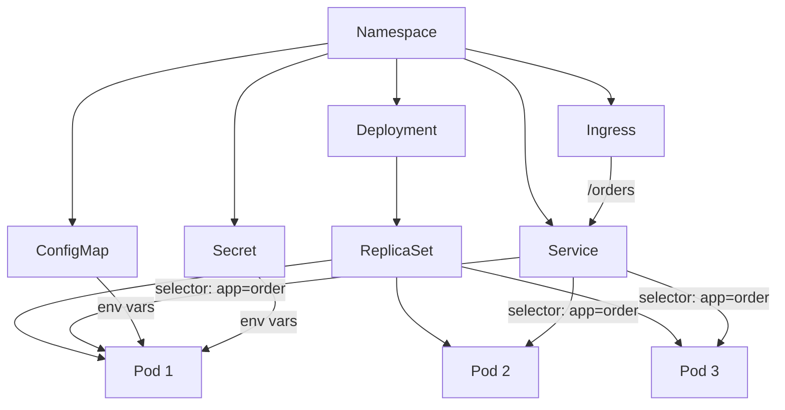
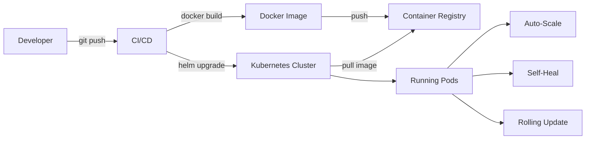

# Orchestration — Điều phối Container với Kubernetes

## 📋 Mục lục

- [1. Giới thiệu](#1-giới-thiệu)
- [2. Tại sao cần Orchestration?](#2-tại-sao-cần-orchestration)
  - [2.1. Vấn đề khi chạy container thủ công](#21-vấn-đề-khi-chạy-container-thủ-công)
  - [2.2. Container Orchestration giải quyết gì?](#22-container-orchestration-giải-quyết-gì)
  - [2.3. Các giải pháp Orchestration](#23-các-giải-pháp-orchestration)
- [3. Kubernetes — Kiến trúc tổng quan](#3-kubernetes--kiến-trúc-tổng-quan)
  - [3.1. Kubernetes Architecture](#31-kubernetes-architecture)
  - [3.2. Control Plane](#32-control-plane)
  - [3.3. Worker Node](#33-worker-node)
  - [3.4. Luồng hoạt động khi deploy](#34-luồng-hoạt-động-khi-deploy)
- [4. Kubernetes Objects — Các thành phần cốt lõi](#4-kubernetes-objects--các-thành-phần-cốt-lõi)
  - [4.1. Pod](#41-pod)
  - [4.2. ReplicaSet](#42-replicaset)
  - [4.3. Deployment](#43-deployment)
  - [4.4. Service](#44-service)
  - [4.5. Ingress](#45-ingress)
  - [4.6. ConfigMap & Secret](#46-configmap--secret)
  - [4.7. Namespace](#47-namespace)
  - [4.8. Tổng hợp quan hệ giữa các Objects](#48-tổng-hợp-quan-hệ-giữa-các-objects)
- [5. Scaling & Auto-scaling](#5-scaling--auto-scaling)
  - [5.1. Manual Scaling](#51-manual-scaling)
  - [5.2. Horizontal Pod Autoscaler (HPA)](#52-horizontal-pod-autoscaler-hpa)
  - [5.3. Vertical Pod Autoscaler (VPA)](#53-vertical-pod-autoscaler-vpa)
  - [5.4. Cluster Autoscaler](#54-cluster-autoscaler)
  - [5.5. KEDA — Event-Driven Autoscaling](#55-keda--event-driven-autoscaling)
- [6. Health Check & Self-Healing](#6-health-check--self-healing)
  - [6.1. Liveness Probe](#61-liveness-probe)
  - [6.2. Readiness Probe](#62-readiness-probe)
  - [6.3. Startup Probe](#63-startup-probe)
  - [6.4. So sánh 3 loại Probe](#64-so-sánh-3-loại-probe)
- [7. Resource Management](#7-resource-management)
  - [7.1. Requests & Limits](#71-requests--limits)
  - [7.2. QoS Classes](#72-qos-classes)
  - [7.3. LimitRange & ResourceQuota](#73-limitrange--resourcequota)
- [8. Helm — Package Manager cho Kubernetes](#8-helm--package-manager-cho-kubernetes)
  - [8.1. Helm là gì?](#81-helm-là-gì)
  - [8.2. Helm Chart Structure](#82-helm-chart-structure)
  - [8.3. Helm Commands](#83-helm-commands)
  - [8.4. Ví dụ — Helm Chart cho Microservice](#84-ví-dụ--helm-chart-cho-microservice)
- [9. Service Mesh](#9-service-mesh)
  - [9.1. Tại sao cần Service Mesh?](#91-tại-sao-cần-service-mesh)
  - [9.2. Service Mesh Architecture](#92-service-mesh-architecture)
  - [9.3. Istio](#93-istio)
  - [9.4. Linkerd](#94-linkerd)
  - [9.5. So sánh Istio vs Linkerd](#95-so-sánh-istio-vs-linkerd)
  - [9.6. Khi nào cần / không cần Service Mesh?](#96-khi-nào-cần--không-cần-service-mesh)
- [10. Kubernetes trên Cloud](#10-kubernetes-trên-cloud)
  - [10.1. Managed Kubernetes Services](#101-managed-kubernetes-services)
  - [10.2. Self-managed vs Managed](#102-self-managed-vs-managed)
- [11. Ví dụ thực tế — E-Commerce trên Kubernetes](#11-ví-dụ-thực-tế--e-commerce-trên-kubernetes)
- [12. Anti-patterns](#12-anti-patterns)
- [13. Checklist triển khai](#13-checklist-triển-khai)
- [14. Tổng kết](#14-tổng-kết)
- [15. Liên kết liên quan](#15-liên-kết-liên-quan)

---

## 1. Giới thiệu

Trong [doc 12](12-containerization.md), chúng ta đã đóng gói mỗi microservice thành Docker container. Docker Compose giúp chạy multi-container trên **1 máy** cho development. Nhưng production cần chạy trên **nhiều máy**, tự động scale, tự phục hồi khi crash — cần một hệ thống **điều phối (orchestration)**.

**Kubernetes** (K8s) là giải pháp orchestration phổ biến nhất — quản lý hàng trăm/ngàn containers trên cluster nhiều máy chủ.

---

## 2. Tại sao cần Orchestration?

### 2.1. Vấn đề khi chạy container thủ công

```
❌ CHẠY CONTAINER THỦ CÔNG TRÊN PRODUCTION:
────────────────────────────────────────────

  5 servers, 10 services, mỗi service 3 instances = 30 containers

  Server 1: user-svc (×2), order-svc (×1)
  Server 2: order-svc (×2), product-svc (×1)
  Server 3: product-svc (×2), payment-svc (×1)
  Server 4: payment-svc (×2), notification (×1)
  Server 5: notification (×1), api-gateway (×2)

  Vấn đề:
  ────────
  1. Container crash lúc 3AM
     → Ai restart? Phải SSH vào server → docker start
     → Không ai biết cho đến khi user complain 😱

  2. Server 3 hết RAM
     → Move container sang server khác? Thủ công?
     → Config lại network, volumes? 😰

  3. Deploy version mới user-service
     → SSH vào Server 1, stop container cũ, pull image mới, start
     → Lặp lại cho Server 2... Server 3...
     → Downtime trong lúc deploy? 😫

  4. Black Friday — cần scale order-service 3 → 20 instances
     → Thêm servers? Chạy container ở đâu? Cân bằng tải thế nào?
     → Sau Black Friday → scale xuống? Tắt servers? 🤯

  5. Health check
     → Container chạy nhưng app bên trong đã crash
     → Docker không biết → traffic vẫn gửi đến → error 502
```

### 2.2. Container Orchestration giải quyết gì?

```
✅ CÓ ORCHESTRATION (Kubernetes):
──────────────────────────────────

  Bạn nói: "Tôi muốn 3 instances của order-service, luôn chạy"

  Kubernetes LO TẤT CẢ:
  ┌────────────────────────────────────────────────────────────┐
  │                                                            │
  │  1. SCHEDULING — Chạy container ở đâu?                     │
  │     K8s tự chọn node có đủ CPU/RAM → đặt container         │
  │                                                            │
  │  2. SELF-HEALING — Container crash?                        │
  │     K8s phát hiện → tự restart hoặc tạo container mới      │
  │     → 3AM cũng không cần ai thức dậy                       │
  │                                                            │
  │  3. SCALING — Cần thêm instances?                          │
  │     kubectl scale deployment order-svc --replicas=20       │
  │     → K8s tạo 17 containers mới, phân bổ lên các nodes     │
  │     Hoặc auto-scale dựa trên CPU/memory/custom metrics     │
  │                                                            │
  │  4. ROLLING UPDATE — Deploy version mới?                   │
  │     K8s tự: tạo container mới → check healthy              │
  │     → route traffic → stop container cũ → ZERO DOWNTIME    │
  │                                                            │
  │  5. SERVICE DISCOVERY — Tìm service?                       │
  │     K8s DNS: http://order-service:8082                     │
  │     → Tự resolve, tự load balance (xem doc 08)             │
  │                                                            │
  │  6. CONFIG MANAGEMENT — Cấu hình?                          │
  │     ConfigMap, Secret → inject vào container               │
  │     → Đổi config không cần rebuild image                   │
  │                                                            │
  └────────────────────────────────────────────────────────────┘
```

### 2.3. Các giải pháp Orchestration

| Giải pháp | Mô tả | Status |
|-----------|--------|--------|
| **Kubernetes (K8s)** | De facto standard, CNCF, Google | ✅ Dominant (>80% market) |
| **Docker Swarm** | Docker native, đơn giản | ⚠️ Ít dùng, Docker khuyến khích dùng K8s |
| **AWS ECS** | AWS managed, dùng Task Definitions | ✅ Phổ biến trên AWS (không muốn K8s) |
| **HashiCorp Nomad** | Lightweight, hỗ trợ cả non-container | ⚠️ Niche, dùng trong HashiCorp ecosystem |
| **Apache Mesos** | Distributed systems kernel | ❌ Deprecated (Twitter/X đã bỏ) |

> **Thực tế**: Kubernetes chiếm >80% thị trường orchestration. Nếu không có lý do đặc biệt → chọn Kubernetes.

---

## 3. Kubernetes — Kiến trúc tổng quan

### 3.1. Kubernetes Architecture

```
KUBERNETES CLUSTER ARCHITECTURE:
────────────────────────────────

  ┌─────────────────────────────────────────────────────────────────┐
  │  KUBERNETES CLUSTER                                             │
  │                                                                 │
  │  ┌───────────────────────────────────────┐                      │
  │  │  CONTROL PLANE (Master)               │                      │
  │  │                                       │                      │
  │  │  ┌───────────┐  ┌──────────────────┐  │                      │
  │  │  │ API Server│  │    Scheduler     │  │                      │
  │  │  │ (kube-    │  │ (chọn node cho   │  │                      │
  │  │  │ apiserver)│  │  pod mới)        │  │                      │
  │  │  └─────┬─────┘  └──────────────────┘  │                      │
  │  │        │                              │                      │
  │  │  ┌─────▼─────┐  ┌──────────────────┐  │                      │
  │  │  │   etcd    │  │ Controller       │  │                      │
  │  │  │ (cluster  │  │ Manager          │  │                      │
  │  │  │  state)   │  │ (desired state   │  │                      │
  │  │  │           │  │  → actual state) │  │                      │
  │  │  └───────────┘  └──────────────────┘  │                      │
  │  │                                       │                      │
  │  │  ┌──────────────────┐                 │                      │
  │  │  │ Cloud Controller │ ← (optional)    │                      │
  │  │  │ Manager          │   tích hợp      │                      │
  │  │  │                  │   cloud provider│                      │
  │  │  └──────────────────┘                 │                      │
  │  └───────────────────────────────────────┘                      │
  │                      │                                          │
  │         kubectl ────▶│◀──── K8s Dashboard                       │
  │                      │                                          │
  │  ┌───────────────────┼───────────────────────────────────────┐  │
  │  │                   │    WORKER NODES                       │  │
  │  │                   │                                       │  │
  │  │  ┌────────────────▼───────────┐  ┌──────────────────────┐ │  │
  │  │  │  Node 1                    │  │  Node 2              │ │  │
  │  │  │                            │  │                      │ │  │
  │  │  │  ┌────────┐ ┌────────┐     │  │  ┌────────┐          │ │  │
  │  │  │  │ Pod A  │ │ Pod B  │     │  │  │ Pod C  │          │ │  │
  │  │  │  └────────┘ └────────┘     │  │  └────────┘          │ │  │
  │  │  │                            │  │                      │ │  │
  │  │  │  ┌──────────────────────┐  │  │  ┌────────────────┐  │ │  │
  │  │  │  │ kubelet              │  │  │  │ kubelet        │  │ │  │
  │  │  │  │ (agent quản lý pods) │  │  │  │                │  │ │  │
  │  │  │  └──────────────────────┘  │  │  └────────────────┘  │ │  │
  │  │  │  ┌──────────────────────┐  │  │  ┌────────────────┐  │ │  │
  │  │  │  │ kube-proxy           │  │  │  │ kube-proxy     │  │ │  │
  │  │  │  │ (network routing)    │  │  │  │                │  │ │  │
  │  │  │  └──────────────────────┘  │  │  └────────────────┘  │ │  │
  │  │  │  ┌──────────────────────┐  │  │  ┌────────────────┐  │ │  │
  │  │  │  │ Container Runtime    │  │  │  │ Container      │  │ │  │
  │  │  │  │ (containerd)         │  │  │  │ Runtime        │  │ │  │
  │  │  │  └──────────────────────┘  │  │  └────────────────┘  │ │  │
  │  │  └────────────────────────────┘  └──────────────────────┘ │  │
  │  └───────────────────────────────────────────────────────────┘  │
  └─────────────────────────────────────────────────────────────────┘
```

### 3.2. Control Plane

Control Plane là **"bộ não"** của cluster — quyết định mọi thứ.

| Component | Vai trò | Ví dụ |
|-----------|---------|-------|
| **API Server** | Cổng vào duy nhất của cluster. Mọi request (kubectl, dashboard, controllers) đều qua API Server | `kubectl get pods` → API Server → trả về danh sách pods |
| **etcd** | Distributed key-value store — lưu **toàn bộ cluster state** | Pods nào đang chạy, trên node nào, config gì |
| **Scheduler** | Chọn node phù hợp cho pod mới dựa trên resources, affinity, taints | Pod cần 2GB RAM → Scheduler chọn Node 2 (còn 4GB free) |
| **Controller Manager** | Chạy các controllers đảm bảo **desired state = actual state** | ReplicaSet controller: "cần 3 pods, hiện có 2 → tạo thêm 1" |
| **Cloud Controller Manager** | Tích hợp cloud provider (AWS, GCP, Azure) | Tạo LoadBalancer → Cloud Controller tạo ALB trên AWS |

### 3.3. Worker Node

Worker Node là **máy chạy containers** thực sự.

| Component | Vai trò |
|-----------|---------|
| **kubelet** | Agent trên mỗi node. Nhận lệnh từ API Server → quản lý pods (start/stop/health check) |
| **kube-proxy** | Quản lý network rules. Route traffic đến đúng pod (iptables/IPVS) |
| **Container Runtime** | Chạy containers (containerd, CRI-O). Xem [doc 12](12-containerization.md) |

### 3.4. Luồng hoạt động khi deploy

```
DEPLOY FLOW — kubectl apply -f deployment.yaml:
────────────────────────────────────────────────

  Developer
      │
      │  kubectl apply -f order-deployment.yaml
      │  "Tôi muốn 3 pods order-service:2.0"
      ▼
  ┌──────────┐
  │API Server│  1. Validate YAML → lưu vào etcd
  └────┬─────┘
       │
       ▼
  ┌──────────┐
  │Controller│  2. Deployment Controller thấy: desired=3, actual=0
  │ Manager  │     → Tạo ReplicaSet → ReplicaSet tạo 3 Pod objects
  └────┬─────┘
       │
       ▼
  ┌──────────┐
  │Scheduler │  3. Cho mỗi Pod (chưa có node):
  │          │     → Tìm node phù hợp (CPU/RAM/affinity)
  │          │     → Assign: Pod 1→Node 1, Pod 2→Node 2, Pod 3→Node 1
  └────┬─────┘
       │
       ├────────────────────┐
       ▼                    ▼
  ┌──────────┐         ┌──────────┐
  │ kubelet  │         │ kubelet  │
  │ (Node 1) │         │ (Node 2) │
  │          │         │          │
  │ 4. Pull  │         │ 4. Pull  │
  │  image   │         │  image   │
  │ 5. Start │         │ 5. Start │
  │ container│         │ container│
  │ 6. Health│         │ 6. Health│
  │  check ✓ │         │  check ✓ │
  └──────────┘         └──────────┘

  7. kube-proxy cập nhật routing rules
     → traffic đến order-service → load balance giữa 3 pods
  8. Pods sẵn sàng nhận traffic ✅
```

---

## 4. Kubernetes Objects — Các thành phần cốt lõi

### 4.1. Pod

Pod là **đơn vị nhỏ nhất** trong Kubernetes — chứa 1 hoặc nhiều containers chia sẻ network và storage.

```
POD:
────

  Thông thường: 1 Pod = 1 Container (main application)

  ┌──────────────────────────────────┐
  │  Pod: order-service-7d4f8b-x2k   │
  │                                  │
  │  ┌────────────────────────────┐  │
  │  │  Container: order-service  │  │
  │  │  Image: order-service:2.0  │  │
  │  │  Port: 8082                │  │
  │  └────────────────────────────┘  │
  │                                  │
  │  IP: 10.244.1.15                 │
  │  (mỗi Pod có 1 IP riêng)         │
  └──────────────────────────────────┘


  Multi-container Pod (Sidecar pattern):

  ┌──────────────────────────────────────────┐
  │  Pod: order-service-7d4f8b-x2k           │
  │                                          │
  │  ┌──────────────────┐ ┌───────────────┐  │
  │  │  Container:      │ │  Sidecar:     │  │
  │  │  order-service   │ │  log-shipper  │  │
  │  │  (main app)      │ │  (Fluent Bit) │  │
  │  │  Port: 8082      │ │               │  │
  │  └──────────────────┘ └───────────────┘  │
  │           │                   │          │
  │           └───── shared ──────┘          │
  │            network (localhost)           │
  │            volumes (/var/log)            │
  │                                          │
  │  IP: 10.244.1.15                         │
  └──────────────────────────────────────────┘

  Containers trong cùng Pod:
  • Chia sẻ network → gọi nhau qua localhost
  • Chia sẻ volumes → đọc/ghi cùng files
  • Cùng lifecycle → start/stop cùng nhau
```

```yaml
# pod.yaml — Ít khi tạo Pod trực tiếp, thường dùng Deployment
apiVersion: v1
kind: Pod
metadata:
  name: order-service
  labels:
    app: order-service
    version: "2.0"
spec:
  containers:
    - name: order-service
      image: order-service:2.0
      ports:
        - containerPort: 8082
      env:
        - name: DB_HOST
          value: "postgres"
      resources:
        requests:
          cpu: "250m"
          memory: "256Mi"
        limits:
          cpu: "500m"
          memory: "512Mi"
```

### 4.2. ReplicaSet

ReplicaSet đảm bảo **luôn có đúng N pods** đang chạy.

```
REPLICASET:
───────────

  ReplicaSet: order-service-rs  (replicas: 3)
  ┌──────────────────────────────────────────────────────┐
  │                                                      │
  │  Desired: 3 pods      Actual: 3 pods     ✅ OK       │
  │                                                      │
  │  ┌──────────┐  ┌──────────┐  ┌──────────┐            │
  │  │  Pod 1   │  │  Pod 2   │  │  Pod 3   │            │
  │  │  order   │  │  order   │  │  order   │            │
  │  │  :2.0    │  │  :2.0    │  │  :2.0    │            │
  │  └──────────┘  └──────────┘  └──────────┘            │
  │                                                      │
  └──────────────────────────────────────────────────────┘

  Pod 2 crash:
  ┌──────────────────────────────────────────────────────┐
  │                                                      │
  │  Desired: 3 pods      Actual: 2 pods     ❌ Mismatch │
  │                                                      │
  │  ┌──────────┐  ┌──────────┐                          │
  │  │  Pod 1   │  │  Pod 3   │  Pod 2 crashed!          │
  │  │  order   │  │  order   │                          │
  │  │  :2.0    │  │  :2.0    │                          │
  │  └──────────┘  └──────────┘                          │
  │                                                      │
  │  → ReplicaSet tạo Pod 4 ngay lập tức:                │
  │                                                      │
  │  ┌──────────┐  ┌──────────┐  ┌──────────┐            │
  │  │  Pod 1   │  │  Pod 3   │  │  Pod 4   │  ← MỚI     │
  │  │  order   │  │  order   │  │  order   │            │
  │  │  :2.0    │  │  :2.0    │  │  :2.0    │            │
  │  └──────────┘  └──────────┘  └──────────┘            │
  │                                                      │
  │  Desired: 3       Actual: 3             ✅ OK        │
  └──────────────────────────────────────────────────────┘

  ⚠️ Thực tế: KHÔNG tạo ReplicaSet trực tiếp.
     Dùng Deployment → Deployment tạo ReplicaSet cho bạn.
```

### 4.3. Deployment

Deployment quản lý **ReplicaSets** và hỗ trợ **rolling updates**, **rollback**.

```yaml
# deployment.yaml — Object dùng NHIỀU NHẤT trong K8s
apiVersion: apps/v1
kind: Deployment
metadata:
  name: order-service
  namespace: production
  labels:
    app: order-service
spec:
  replicas: 3                          # Số pods mong muốn
  selector:
    matchLabels:
      app: order-service               # Pods nào thuộc Deployment này
  strategy:
    type: RollingUpdate                # Chiến lược update
    rollingUpdate:
      maxSurge: 1                      # Tối đa thêm 1 pod khi update
      maxUnavailable: 0                # Không cho phép pod nào down
  template:                            # Pod template
    metadata:
      labels:
        app: order-service
        version: "2.0"
    spec:
      containers:
        - name: order-service
          image: order-service:2.0.0
          ports:
            - containerPort: 8082
          env:
            - name: DB_HOST
              valueFrom:
                configMapKeyRef:
                  name: order-config
                  key: db-host
            - name: DB_PASSWORD
              valueFrom:
                secretKeyRef:
                  name: order-secrets
                  key: db-password
          resources:
            requests:
              cpu: "250m"
              memory: "256Mi"
            limits:
              cpu: "500m"
              memory: "512Mi"
          livenessProbe:
            httpGet:
              path: /actuator/health/liveness
              port: 8082
            initialDelaySeconds: 30
            periodSeconds: 10
          readinessProbe:
            httpGet:
              path: /actuator/health/readiness
              port: 8082
            initialDelaySeconds: 10
            periodSeconds: 5
```

```
ROLLING UPDATE — Zero Downtime Deploy:
───────────────────────────────────────

  Hiện tại: order-service:1.0 (3 pods)
  Mục tiêu: order-service:2.0

  kubectl set image deployment/order-service order-service=order-service:2.0

  Step 1: Tạo pod mới v2.0
  ┌──────┐  ┌──────┐  ┌──────┐  ┌──────┐
  │ v1.0 │  │ v1.0 │  │ v1.0 │  │ v2.0 │ ← mới, chờ healthy
  │  ✅  │  │  ✅  │  │  ✅  │  │  ⏳  │
  └──────┘  └──────┘  └──────┘  └──────┘

  Step 2: v2.0 healthy → xóa 1 v1.0
  ┌──────┐  ┌──────┐  ┌──────┐
  │ v1.0 │  │ v1.0 │  │ v2.0 │
  │  ✅  │  │  ✅  │  │  ✅  │
  └──────┘  └──────┘  └──────┘

  Step 3: Tạo thêm v2.0, xóa v1.0
  ┌──────┐  ┌──────┐  ┌──────┐
  │ v1.0 │  │ v2.0 │  │ v2.0 │
  │  ✅  │  │  ✅  │  │  ✅  │
  └──────┘  └──────┘  └──────┘

  Step 4: Hoàn thành
  ┌──────┐  ┌──────┐  ┌──────┐
  │ v2.0 │  │ v2.0 │  │ v2.0 │
  │  ✅  │  │  ✅  │  │  ✅  │
  └──────┘  └──────┘  └──────┘

  → Luôn có pods serving → ZERO DOWNTIME ✅

  Rollback nếu v2.0 có bug:
  kubectl rollout undo deployment/order-service
  → K8s tự revert về v1.0
```

### 4.4. Service

Service cung cấp **stable endpoint** để truy cập pods. Pods có thể bị tạo/xóa liên tục (IP thay đổi), nhưng Service IP và DNS name **không đổi**.

```
KUBERNETES SERVICE:
───────────────────

  Pods thay đổi liên tục:
    Pod order-abc (IP 10.244.1.5)  → bị xóa
    Pod order-def (IP 10.244.2.8)  → được tạo mới
    → IP thay đổi liên tục → client không thể hardcode IP

  Service giải quyết:
  ┌──────────────────────────────────────────────────────┐
  │  Service: order-service                              │
  │  ClusterIP: 10.96.32.100  (KHÔNG ĐỔI)                │
  │  DNS: order-service.production.svc.cluster.local     │
  │                                                      │
  │  selector: app=order-service                         │
  │                                                      │
  │  ┌────────────┐  ┌────────────┐  ┌────────────┐      │
  │  │  Pod 1     │  │  Pod 2     │  │  Pod 3     │      │
  │  │ 10.244.1.15│  │ 10.244.2.20│  │ 10.244.1.30│      │
  │  │            │  │            │  │            │      │
  │  │ app:       │  │ app:       │  │ app:       │      │
  │  │ order-svc  │  │ order-svc  │  │ order-svc  │      │
  │  └────────────┘  └────────────┘  └────────────┘      │
  │                                                      │
  │  Client gọi: http://order-service:8082               │
  │  → ClusterIP 10.96.32.100                            │
  │  → kube-proxy route → 1 trong 3 pods                 │
  └──────────────────────────────────────────────────────┘
```

```yaml
# service.yaml
apiVersion: v1
kind: Service
metadata:
  name: order-service
  namespace: production
spec:
  type: ClusterIP               # Internal only (default)
  selector:
    app: order-service           # Route đến pods có label này
  ports:
    - port: 8082                 # Service port
      targetPort: 8082           # Container port
      protocol: TCP
```

```
SERVICE TYPES:
──────────────

  1. ClusterIP (default) — Internal only:
     → Chỉ pods trong cluster gọi được
     → Dùng cho: service-to-service communication

  2. NodePort — Expose qua port trên node:
     → Mở port 30000-32767 trên MỌI node
     → External: http://<node-ip>:30080
     → Dùng cho: dev/test, bare-metal

  3. LoadBalancer — Cloud Load Balancer:
     → K8s yêu cầu cloud provider tạo LB (ALB/NLB)
     → External: http://<lb-dns>
     → Dùng cho: expose service ra internet (mỗi service = 1 LB → đắt)

  4. ExternalName — DNS alias:
     → Map service name → external DNS
     → Dùng cho: trỏ đến service ngoài cluster (RDS, external API)
```

### 4.5. Ingress

Ingress quản lý **HTTP/HTTPS routing** từ bên ngoài vào cluster — thay vì tạo LoadBalancer cho mỗi service.

```
INGRESS:
────────

  Không có Ingress — 1 LoadBalancer per service ($$$$):
  ┌──────────────────────────────────────────────────────┐
  │                                                      │
  │  ALB ($18/mo) → user-service (ClusterIP)             │
  │  ALB ($18/mo) → order-service (ClusterIP)            │
  │  ALB ($18/mo) → product-service (ClusterIP)          │
  │                                                      │
  │  3 services = 3 ALBs = $54/month + data transfer     │
  │  10 services = $180/month 😱                         │
  └──────────────────────────────────────────────────────┘

  Có Ingress — 1 LoadBalancer, routing theo path:
  ┌──────────────────────────────────────────────────────┐
  │                                                      │
  │  ALB ($18/mo) → Ingress Controller (NGINX/Kong)      │
  │                       │                              │
  │                  /users   → user-service             │
  │                  /orders  → order-service            │
  │                  /products→ product-service          │
  │                                                      │
  │  10 services = 1 ALB = $18/month ✅                  │
  └──────────────────────────────────────────────────────┘
```

```yaml
# ingress.yaml
apiVersion: networking.k8s.io/v1
kind: Ingress
metadata:
  name: api-ingress
  namespace: production
  annotations:
    nginx.ingress.kubernetes.io/rewrite-target: /
    cert-manager.io/cluster-issuer: letsencrypt-prod
spec:
  ingressClassName: nginx
  tls:
    - hosts:
        - api.myapp.com
      secretName: api-tls
  rules:
    - host: api.myapp.com
      http:
        paths:
          - path: /users
            pathType: Prefix
            backend:
              service:
                name: user-service
                port:
                  number: 8081
          - path: /orders
            pathType: Prefix
            backend:
              service:
                name: order-service
                port:
                  number: 8082
          - path: /products
            pathType: Prefix
            backend:
              service:
                name: product-service
                port:
                  number: 8083
```

### 4.6. ConfigMap & Secret

```
CONFIGMAP — Lưu config không nhạy cảm:
───────────────────────────────────────

  Tại sao?
  Config trong image → đổi config = rebuild image → chậm, lãng phí
  ConfigMap → đổi config không cần rebuild image
```

```yaml
# configmap.yaml
apiVersion: v1
kind: ConfigMap
metadata:
  name: order-config
  namespace: production
data:
  db-host: "postgres.production.svc"
  db-port: "5432"
  kafka-brokers: "kafka-0:9092,kafka-1:9092,kafka-2:9092"
  log-level: "INFO"
  cache-ttl: "300"
```

```
SECRET — Lưu data nhạy cảm (passwords, tokens, keys):
──────────────────────────────────────────────────────

  ⚠️ K8s Secret mặc định chỉ encode base64 (KHÔNG encrypt!)
  → Cần kết hợp: Sealed Secrets, External Secrets, Vault
```

```yaml
# secret.yaml
apiVersion: v1
kind: Secret
metadata:
  name: order-secrets
  namespace: production
type: Opaque
data:
  db-password: cGFzc3dvcmQxMjM=    # base64 encoded "password123"
  api-key: YWJjZGVmZzEyMzQ1        # base64 encoded
```

```yaml
# Sử dụng ConfigMap & Secret trong Deployment:
spec:
  containers:
    - name: order-service
      env:
        # Từ ConfigMap
        - name: DB_HOST
          valueFrom:
            configMapKeyRef:
              name: order-config
              key: db-host
        # Từ Secret
        - name: DB_PASSWORD
          valueFrom:
            secretKeyRef:
              name: order-secrets
              key: db-password
      # Hoặc mount cả ConfigMap thành file:
      volumeMounts:
        - name: config-volume
          mountPath: /app/config
  volumes:
    - name: config-volume
      configMap:
        name: order-config
```

### 4.7. Namespace

Namespace phân **chia tài nguyên** trong cluster — giống như "thư mục" cho resources.

```
NAMESPACE:
──────────

  ┌──────────────────────────────────────────────────────┐
  │  Kubernetes Cluster                                  │
  │                                                      │
  │  ┌──────────────────────┐  ┌──────────────────────┐  │
  │  │  Namespace: production│ │  Namespace: staging  │  │
  │  │                      │  │                      │  │
  │  │  order-service (×3)  │  │  order-service (×1)  │  │
  │  │  user-service  (×3)  │  │  user-service  (×1)  │  │
  │  │  payment-svc   (×3)  │  │  payment-svc   (×1)  │  │
  │  │                      │  │                      │  │
  │  │  ResourceQuota:      │  │  ResourceQuota:      │  │
  │  │  CPU: 20 cores       │  │  CPU: 4 cores        │  │
  │  │  RAM: 40 Gi          │  │  RAM: 8 Gi           │  │
  │  └──────────────────────┘  └──────────────────────┘  │
  │                                                      │
  │  ┌──────────────────────┐  ┌──────────────────────┐  │
  │  │  Namespace: infra    │  │  Namespace: monitoring│ │
  │  │                      │  │                      │  │
  │  │  postgres            │  │  prometheus          │  │
  │  │  redis               │  │  grafana             │  │
  │  │  kafka               │  │  jaeger              │  │
  │  └──────────────────────┘  └──────────────────────┘  │
  └──────────────────────────────────────────────────────┘

  Cross-namespace communication:
  order-service (production) → postgres (infra):
  http://postgres.infra.svc.cluster.local:5432
```

### 4.8. Tổng hợp quan hệ giữa các Objects



---

## 5. Scaling & Auto-scaling

### 5.1. Manual Scaling

```bash
# Scale thủ công
kubectl scale deployment order-service --replicas=5

# Hoặc edit deployment
kubectl edit deployment order-service
# → Sửa spec.replicas: 5
```

### 5.2. Horizontal Pod Autoscaler (HPA)

HPA tự động **tăng/giảm số pods** dựa trên metrics (CPU, memory, custom).

```yaml
# hpa.yaml
apiVersion: autoscaling/v2
kind: HorizontalPodAutoscaler
metadata:
  name: order-service-hpa
  namespace: production
spec:
  scaleTargetRef:
    apiVersion: apps/v1
    kind: Deployment
    name: order-service
  minReplicas: 3                    # Tối thiểu 3 pods
  maxReplicas: 20                   # Tối đa 20 pods
  metrics:
    - type: Resource
      resource:
        name: cpu
        target:
          type: Utilization
          averageUtilization: 70    # Scale khi CPU > 70%
    - type: Resource
      resource:
        name: memory
        target:
          type: Utilization
          averageUtilization: 80    # Scale khi Memory > 80%
  behavior:
    scaleUp:
      stabilizationWindowSeconds: 60    # Chờ 60s trước khi scale up
      policies:
        - type: Pods
          value: 4                      # Thêm tối đa 4 pods mỗi lần
          periodSeconds: 60
    scaleDown:
      stabilizationWindowSeconds: 300   # Chờ 5 phút trước khi scale down
      policies:
        - type: Pods
          value: 1                      # Giảm tối đa 1 pod mỗi lần
          periodSeconds: 60
```

```
HPA HOẠT ĐỘNG:
───────────────

  CPU Target: 70%

  10:00  CPU: 30%  → 3 pods (min)
  10:05  CPU: 65%  → 3 pods (chưa đến 70%)
  10:10  CPU: 85%  → Scale up! → 5 pods
  10:15  CPU: 90%  → Scale up! → 8 pods
  10:20  CPU: 60%  → Giữ 8 pods (stabilization window)
  10:30  CPU: 40%  → Scale down → 7 pods
  10:35  CPU: 35%  → Scale down → 6 pods
  ...
  11:00  CPU: 25%  → Scale down → 3 pods (min)
```

### 5.3. Vertical Pod Autoscaler (VPA)

VPA tự động điều chỉnh **CPU/memory requests và limits** cho pods.

```
VPA:
────
  Thay vì thêm pods (HPA) → VPA tăng resources cho pod hiện tại.

  Ban đầu:  Pod order-service: CPU 250m, Memory 256Mi
  VPA phân tích → thực tế cần CPU 500m, Memory 512Mi
  → VPA restart pod với resources mới

  ⚠️ VPA và HPA KHÔNG NÊN dùng cùng metric (ví dụ cả hai theo CPU)
  → Giải pháp: HPA theo CPU, VPA theo memory (hoặc chỉ dùng 1)
```

### 5.4. Cluster Autoscaler

Cluster Autoscaler tự động **thêm/bớt nodes** (máy chủ) trong cluster.

```
CLUSTER AUTOSCALER:
───────────────────

  1. HPA muốn scale order-service 3 → 20 pods
  2. Cluster hiện tại chỉ có 3 nodes, không đủ resources
  3. Scheduler: "Pods pending — không có node phù hợp"
  4. Cluster Autoscaler phát hiện → thêm nodes:

  Trước:                          Sau:
  ┌──────┐ ┌──────┐ ┌──────┐     ┌──────┐ ┌──────┐ ┌──────┐ ┌──────┐ ┌──────┐
  │Node 1│ │Node 2│ │Node 3│     │Node 1│ │Node 2│ │Node 3│ │Node 4│ │Node 5│
  │ FULL │ │ FULL │ │ FULL │     │ FULL │ │ FULL │ │ FULL │ │ pods │ │ pods │
  └──────┘ └──────┘ └──────┘     └──────┘ └──────┘ └──────┘ └──────┘ └──────┘
                                                              ↑ NEW    ↑ NEW

  Khi traffic giảm → HPA scale down pods → nodes trống
  → Cluster Autoscaler xóa nodes trống → tiết kiệm tiền 💰
```

### 5.5. KEDA — Event-Driven Autoscaling

KEDA (Kubernetes Event-Driven Autoscaling) scale dựa trên **event sources** (Kafka lag, SQS queue length, Prometheus metrics...).

```
KEDA:
─────

  HPA chỉ scale theo CPU/memory → không đủ cho event-driven systems

  KEDA mở rộng: scale theo BẤT KỲ metric nào:
  • Kafka: consumer lag > 1000 messages → scale up consumers
  • SQS:   queue depth > 100 → scale up workers
  • Cron:  9AM-6PM → scale up, nights → scale to 0
  • Prometheus: custom metric (request rate, error rate)

  Đặc biệt: KEDA có thể scale TO ZERO (0 pods)
  → HPA chỉ scale tối thiểu 1 pod
  → KEDA: không có events → 0 pods → tiết kiệm resources
```

---

## 6. Health Check & Self-Healing

### 6.1. Liveness Probe

**"Container còn sống không?"** — Nếu fail → K8s **restart** container.

```yaml
livenessProbe:
  httpGet:
    path: /actuator/health/liveness
    port: 8082
  initialDelaySeconds: 30      # Chờ 30s sau khi start
  periodSeconds: 10            # Check mỗi 10s
  timeoutSeconds: 3            # Timeout mỗi lần check
  failureThreshold: 3          # Fail 3 lần → restart
```

```
Khi nào liveness probe cần?
  → App bị deadlock (thread stuck, không phản hồi)
  → Memory leak → OOM nhưng process chưa crash
  → App vào trạng thái lỗi không thể recover
  → Container chạy nhưng app bên trong đã "chết"
```

### 6.2. Readiness Probe

**"Container sẵn sàng nhận traffic chưa?"** — Nếu fail → K8s **ngưng gửi traffic** (nhưng KHÔNG restart).

```yaml
readinessProbe:
  httpGet:
    path: /actuator/health/readiness
    port: 8082
  initialDelaySeconds: 10      # Chờ 10s
  periodSeconds: 5             # Check mỗi 5s
  failureThreshold: 3          # Fail 3 lần → loại khỏi Service endpoints
```

```
Khi nào readiness probe fail?
  → App đang khởi động (loading cache, warming up)
  → DB connection chưa sẵn sàng
  → Downstream dependency đang down
  → App đang overloaded (muốn tạm ngưng nhận traffic)

  Traffic flow:
  Service → Pod 1 ✅ (ready)
          → Pod 2 ❌ (not ready → KHÔNG gửi traffic)
          → Pod 3 ✅ (ready)
```

### 6.3. Startup Probe

**"App đã khởi động xong chưa?"** — Dùng cho app **khởi động chậm** (Java, large cache).

```yaml
startupProbe:
  httpGet:
    path: /actuator/health
    port: 8082
  initialDelaySeconds: 0
  periodSeconds: 10
  failureThreshold: 30         # 30 × 10s = 5 phút để start
```

```
Tại sao cần Startup Probe?
  Không có startup probe:
    → liveness probe check ngay → app chưa start xong → fail
    → K8s restart → app lại chưa start xong → fail → restart loop 💀

  Có startup probe:
    → K8s chờ startup probe pass (tối đa 5 phút)
    → Sau khi pass → liveness + readiness probe mới bắt đầu
```

### 6.4. So sánh 3 loại Probe

| Probe | Câu hỏi | Khi fail | Khi nào dùng |
|-------|---------|----------|--------------|
| **Startup** | "App đã start xong chưa?" | Chờ tiếp (đến failureThreshold) | App khởi động chậm (Java, cache) |
| **Liveness** | "App còn sống không?" | **Restart** container | Phát hiện deadlock, unrecoverable state |
| **Readiness** | "App sẵn sàng nhận traffic?" | **Loại khỏi** Service endpoints | DB chưa sẵn sàng, đang overloaded |

```
Probe Timeline:
────────────────

  Container start
      │
      ▼
  ┌──────────────────┐
  │  Startup Probe   │  "Đã start xong chưa?"
  │  Check mỗi 10s   │
  │  Tối đa 5 phút   │
  └────────┬─────────┘
           │ PASS ✅
           ▼
  ┌──────────────────┐  ┌──────────────────┐
  │  Liveness Probe  │  │  Readiness Probe │
  │  Check mỗi 10s   │  │  Check mỗi 5s    │
  │  "Còn sống?"     │  │  "Sẵn sàng?"     │
  │                  │  │                  │
  │  Fail → RESTART  │  │ Fail → NO TRAFFIC│
  └──────────────────┘  └──────────────────┘
```

---

## 7. Resource Management

### 7.1. Requests & Limits

```
REQUESTS VÀ LIMITS:
────────────────────

  requests: Lượng resources TỐI THIỂU K8s đảm bảo cho pod
            → Scheduler dùng để chọn node
  limits:   Lượng resources TỐI ĐA pod được phép dùng
            → Vượt CPU limit → throttle
            → Vượt Memory limit → OOMKilled (bị kill)

  Ví dụ:
  resources:
    requests:
      cpu: "250m"        # 0.25 CPU core — tối thiểu
      memory: "256Mi"    # 256 MB RAM — tối thiểu
    limits:
      cpu: "500m"        # 0.5 CPU core — tối đa
      memory: "512Mi"    # 512 MB RAM — tối đa (vượt → OOMKilled)

  Đơn vị:
  ────────
  CPU:    "1"    = 1 core
          "500m" = 0.5 core (milli-core)
          "250m" = 0.25 core

  Memory: "128Mi" = 128 MiB (mebibyte)
          "1Gi"   = 1 GiB (gibibyte)

  ⚠️ Luôn set cả requests VÀ limits:
  • Không set requests → Scheduler không biết pod cần gì → đặt sai node
  • Không set limits → 1 pod ăn hết RAM → ảnh hưởng pods khác trên cùng node
```

### 7.2. QoS Classes

```
QoS (Quality of Service) CLASSES:
──────────────────────────────────

  K8s phân loại pods thành 3 QoS class dựa trên requests/limits:

  1. Guaranteed — requests = limits (cho cả CPU và Memory)
     resources:
       requests: { cpu: "500m", memory: "512Mi" }
       limits:   { cpu: "500m", memory: "512Mi" }
     → Ưu tiên cao nhất. Bị kill CUỐI CÙNG khi node hết resources.
     → Dùng cho: critical services (payment, database)

  2. Burstable — requests < limits (hoặc chỉ set 1 trong 2)
     resources:
       requests: { cpu: "250m", memory: "256Mi" }
       limits:   { cpu: "500m", memory: "512Mi" }
     → Ưu tiên trung bình. Bị kill sau BestEffort.
     → Dùng cho: hầu hết services

  3. BestEffort — KHÔNG set requests hoặc limits
     resources: {}
     → Ưu tiên thấp nhất. Bị kill ĐẦU TIÊN khi node hết resources.
     → Dùng cho: batch jobs, dev/test

  Khi node hết resources → K8s evict (kill) theo thứ tự:
  BestEffort → Burstable → Guaranteed
```

### 7.3. LimitRange & ResourceQuota

```yaml
# LimitRange — Set default và giới hạn cho MỖI pod/container trong namespace
apiVersion: v1
kind: LimitRange
metadata:
  name: default-limits
  namespace: production
spec:
  limits:
    - type: Container
      default:                  # Default limits (nếu pod không set)
        cpu: "500m"
        memory: "512Mi"
      defaultRequest:           # Default requests
        cpu: "250m"
        memory: "256Mi"
      max:                      # Max cho 1 container
        cpu: "2"
        memory: "2Gi"
      min:                      # Min cho 1 container
        cpu: "100m"
        memory: "128Mi"
```

```yaml
# ResourceQuota — Giới hạn TỔNG resources cho namespace
apiVersion: v1
kind: ResourceQuota
metadata:
  name: production-quota
  namespace: production
spec:
  hard:
    requests.cpu: "20"          # Tổng CPU requests: 20 cores
    requests.memory: "40Gi"     # Tổng RAM requests: 40 GiB
    limits.cpu: "40"            # Tổng CPU limits: 40 cores
    limits.memory: "80Gi"       # Tổng RAM limits: 80 GiB
    pods: "100"                 # Tối đa 100 pods
    services: "20"              # Tối đa 20 services
```

---

## 8. Helm — Package Manager cho Kubernetes

### 8.1. Helm là gì?

Helm là **package manager cho Kubernetes** — giống apt cho Ubuntu, brew cho macOS. Thay vì quản lý hàng chục YAML files → Helm đóng gói thành 1 **Chart**.

```
VẤN ĐỀ KHÔNG CÓ HELM:
───────────────────────

  Deploy order-service cần:
  • deployment.yaml
  • service.yaml
  • configmap.yaml
  • secret.yaml
  • hpa.yaml
  • ingress.yaml
  • serviceaccount.yaml

  × 10 services = 70 YAML files 😱
  
  Staging vs Production: hầu hết giống nhau, chỉ khác
  replicas, image tag, resources, config → duplicate 70 files?

  Helm giải quyết:
  → 1 Chart template + values.yaml (per environment)
  → helm install order-service ./chart -f values-prod.yaml
```

### 8.2. Helm Chart Structure

```
HELM CHART STRUCTURE:
─────────────────────

  order-service-chart/
  ├── Chart.yaml              # Metadata (name, version, description)
  ├── values.yaml             # Default values
  ├── values-staging.yaml     # Override cho staging
  ├── values-production.yaml  # Override cho production
  ├── templates/
  │   ├── deployment.yaml     # Deployment template
  │   ├── service.yaml        # Service template
  │   ├── configmap.yaml      # ConfigMap template
  │   ├── hpa.yaml            # HPA template
  │   ├── ingress.yaml        # Ingress template
  │   ├── _helpers.tpl        # Template helpers
  │   └── NOTES.txt           # Post-install notes
  └── charts/                 # Sub-charts (dependencies)
```

### 8.3. Helm Commands

```bash
# Install chart
helm install order-service ./order-service-chart \
  -f values-production.yaml \
  -n production

# Upgrade (deploy version mới)
helm upgrade order-service ./order-service-chart \
  -f values-production.yaml \
  --set image.tag=2.1.0 \
  -n production

# Rollback
helm rollback order-service 1 -n production    # Rollback về revision 1

# Uninstall
helm uninstall order-service -n production

# List releases
helm list -n production

# Xem rendered YAML (debug)
helm template order-service ./order-service-chart -f values-production.yaml
```

### 8.4. Ví dụ — Helm Chart cho Microservice

```yaml
# Chart.yaml
apiVersion: v2
name: order-service
description: Order Service for E-Commerce platform
version: 1.0.0          # Chart version
appVersion: "2.1.0"      # Application version
```

```yaml
# values.yaml — Default values
replicaCount: 2

image:
  repository: 123456789.dkr.ecr.ap-southeast-1.amazonaws.com/order-service
  tag: "latest"
  pullPolicy: IfNotPresent

service:
  type: ClusterIP
  port: 8082

ingress:
  enabled: false
  host: ""
  path: /orders

resources:
  requests:
    cpu: 250m
    memory: 256Mi
  limits:
    cpu: 500m
    memory: 512Mi

autoscaling:
  enabled: false
  minReplicas: 2
  maxReplicas: 10
  targetCPUUtilization: 70

config:
  dbHost: postgres
  dbPort: "5432"
  kafkaBrokers: kafka:9092
  logLevel: INFO

env: {}
```

```yaml
# values-production.yaml — Override cho production
replicaCount: 3

image:
  tag: "2.1.0"

ingress:
  enabled: true
  host: api.myapp.com
  path: /orders

resources:
  requests:
    cpu: 500m
    memory: 512Mi
  limits:
    cpu: "1"
    memory: 1Gi

autoscaling:
  enabled: true
  minReplicas: 3
  maxReplicas: 20
  targetCPUUtilization: 70

config:
  dbHost: postgres.production.svc
  logLevel: WARN
```

```yaml
# templates/deployment.yaml
apiVersion: apps/v1
kind: Deployment
metadata:
  name: {{ include "order-service.fullname" . }}
  labels:
    {{- include "order-service.labels" . | nindent 4 }}
spec:
  {{- if not .Values.autoscaling.enabled }}
  replicas: {{ .Values.replicaCount }}
  {{- end }}
  selector:
    matchLabels:
      {{- include "order-service.selectorLabels" . | nindent 6 }}
  template:
    metadata:
      labels:
        {{- include "order-service.selectorLabels" . | nindent 8 }}
    spec:
      containers:
        - name: {{ .Chart.Name }}
          image: "{{ .Values.image.repository }}:{{ .Values.image.tag }}"
          imagePullPolicy: {{ .Values.image.pullPolicy }}
          ports:
            - containerPort: {{ .Values.service.port }}
          env:
            - name: DB_HOST
              valueFrom:
                configMapKeyRef:
                  name: {{ include "order-service.fullname" . }}-config
                  key: db-host
            - name: DB_PASSWORD
              valueFrom:
                secretKeyRef:
                  name: {{ include "order-service.fullname" . }}-secrets
                  key: db-password
          resources:
            {{- toYaml .Values.resources | nindent 12 }}
          livenessProbe:
            httpGet:
              path: /actuator/health/liveness
              port: {{ .Values.service.port }}
            initialDelaySeconds: 30
            periodSeconds: 10
          readinessProbe:
            httpGet:
              path: /actuator/health/readiness
              port: {{ .Values.service.port }}
            initialDelaySeconds: 10
            periodSeconds: 5
```

---

## 9. Service Mesh

### 9.1. Tại sao cần Service Mesh?

```
VẤN ĐỀ: CROSS-CUTTING CONCERNS TRONG SERVICE-TO-SERVICE:
──────────────────────────────────────────────────────────

  Mỗi service cần xử lý:
  • mTLS (mutual TLS) — mã hóa traffic giữa services
  • Retry + Circuit Breaker — resilience (xem doc 10)
  • Load Balancing — client-side LB giữa pods
  • Observability — metrics, tracing, logging
  • Traffic Management — canary deploy, A/B testing
  • Access Control — service A được gọi service B không?

  Không có Service Mesh:
  ┌──────────────────────────────────────────────────────┐
  │  Mỗi service phải tự implement:                      │
  │                                                      │
  │  Order Service (Java):                               │
  │    + Spring Cloud Circuit Breaker (Resilience4j)     │
  │    + Spring Cloud LoadBalancer                       │
  │    + Micrometer metrics                              │
  │    + OpenTelemetry tracing                           │
  │    + TLS certificates management                     │
  │                                                      │
  │  Product Service (Node.js):                          │
  │    + opossum (circuit breaker)                       │
  │    + client-side LB (custom)                         │
  │    + prom-client (metrics)                           │
  │    + @opentelemetry/sdk (tracing)                    │
  │    + TLS (manual cert management)                    │
  │                                                      │
  │  Payment Service (Go):                               │
  │    + sony/gobreaker (circuit breaker)                │
  │    + grpc-go LB                                      │
  │    + prometheus/client_golang                        │
  │    + go.opentelemetry.io/otel                        │
  │    + TLS                                             │
  │                                                      │
  │  → Mỗi ngôn ngữ = libraries khác nhau                │
  │  → Mỗi team implement khác nhau                      │
  │  → Không consistent, khó maintain                    │
  └──────────────────────────────────────────────────────┘
```

### 9.2. Service Mesh Architecture

```
SERVICE MESH — SIDECAR PROXY PATTERN:
──────────────────────────────────────

  Service Mesh giải quyết bằng cách inject SIDECAR PROXY
  vào mỗi pod. Proxy xử lý TẤT CẢ networking concerns.
  Service code KHÔNG CẦN thay đổi.

  ┌──────────────────────────────────────────────────────────┐
  │  Kubernetes Cluster                                      │
  │                                                          │
  │  ┌────────────────────────┐  ┌────────────────────────┐  │
  │  │  Pod: Order Service    │  │  Pod: Payment Service  │  │
  │  │                        │  │                        │  │
  │  │  ┌──────────────────┐  │  │  ┌──────────────────┐  │  │
  │  │  │  Order Service   │  │  │  │ Payment Service  │  │  │
  │  │  │  (business code) │  │  │  │ (business code)  │  │  │
  │  │  │  localhost:8082  │  │  │  │ localhost:8084   │  │  │
  │  │  └────────┬─────────┘  │  │  └────────┬─────────┘  │  │
  │  │           │            │  │           │            │  │
  │  │  ┌────────▼─────────┐  │  │  ┌────────▼─────────┐  │  │
  │  │  │  Sidecar Proxy   │  │  │  │  Sidecar Proxy   │  │  │
  │  │  │  (Envoy/Linkerd) │◄─┼──┼─▶│  (Envoy/Linkerd) │  │  │
  │  │  │                  │  │  │  │                  │  │  │
  │  │  │  • mTLS          │  │  │  │  • mTLS          │  │  │
  │  │  │  • Retry         │  │  │  │  • Retry         │  │  │
  │  │  │  • Circuit Break │  │  │  │  • Circuit Break │  │  │
  │  │  │  • Metrics       │  │  │  │  • Metrics       │  │  │
  │  │  │  • Tracing       │  │  │  │  • Tracing       │  │  │
  │  │  └──────────────────┘  │  │  └──────────────────┘  │  │
  │  └────────────────────────┘  └────────────────────────┘  │
  │                                                          │
  │  ┌────────────────────────────────────────────────────┐  │
  │  │  Control Plane (Istiod / Linkerd control plane)    │  │
  │  │                                                    │  │
  │  │  • Push config đến proxies                         │  │
  │  │  • Manage certificates (mTLS auto-rotation)        │  │
  │  │  • Collect metrics/traces                          │  │
  │  │  • Traffic policies                                │  │
  │  └────────────────────────────────────────────────────┘  │
  └──────────────────────────────────────────────────────────┘

  App code GIỮ NGUYÊN — chỉ cần gọi http://payment-service:8084
  Sidecar proxy tự động: encrypt (mTLS), retry, circuit break,
  collect metrics, add tracing headers
```

### 9.3. Istio

```
ISTIO:
──────

  Phổ biến nhất, đầy đủ tính năng nhất.
  Data Plane: Envoy proxy (sidecar)
  Control Plane: Istiod

  Tính năng chính:
  ┌────────────────────────────────────────────────────────┐
  │                                                        │
  │  Traffic Management:                                   │
  │  • VirtualService — routing rules (canary, A/B)        │
  │  • DestinationRule — LB policy, circuit breaker        │
  │  • Gateway — ingress/egress traffic                    │
  │                                                        │
  │  Security:                                             │
  │  • mTLS — automatic, zero-config                       │
  │  • AuthorizationPolicy — service-to-service ACL        │
  │  • RequestAuthentication — JWT validation              │
  │                                                        │
  │  Observability:                                        │
  │  • Metrics → Prometheus (auto-generated)               │
  │  • Tracing → Jaeger/Zipkin (auto-propagated)           │
  │  • Kiali — Service Mesh dashboard                      │
  │                                                        │
  └────────────────────────────────────────────────────────┘
```

```yaml
# Istio VirtualService — Canary deployment 90/10
apiVersion: networking.istio.io/v1beta1
kind: VirtualService
metadata:
  name: order-service
spec:
  hosts:
    - order-service
  http:
    - route:
        - destination:
            host: order-service
            subset: stable
          weight: 90              # 90% traffic → v1.0
        - destination:
            host: order-service
            subset: canary
          weight: 10              # 10% traffic → v2.0

---
apiVersion: networking.istio.io/v1beta1
kind: DestinationRule
metadata:
  name: order-service
spec:
  host: order-service
  subsets:
    - name: stable
      labels:
        version: "1.0"
    - name: canary
      labels:
        version: "2.0"
  trafficPolicy:
    connectionPool:
      http:
        maxConnections: 100
    outlierDetection:               # Circuit Breaker
      consecutive5xxErrors: 5
      interval: 30s
      baseEjectionTime: 30s
```

### 9.4. Linkerd

```
LINKERD:
────────

  Lightweight, dễ cài đặt, focus vào simplicity.
  Data Plane: linkerd2-proxy (Rust — nhẹ hơn Envoy)
  Control Plane: Linkerd control plane

  So với Istio:
  • Cài đặt: linkerd install | kubectl apply (2 phút)
  • Resource: ~50% ít hơn Istio
  • Tính năng: ít hơn Istio nhưng đủ cho đa số use cases
  • mTLS: automatic (giống Istio)
  • Traffic split: có (nhưng ít flexible hơn Istio)
  • Multi-cluster: có
```

### 9.5. So sánh Istio vs Linkerd

| Tiêu chí | Istio | Linkerd |
|----------|-------|---------|
| **Proxy** | Envoy (C++) | linkerd2-proxy (Rust) |
| **Resource usage** | Cao (~128MB/sidecar) | Thấp (~20MB/sidecar) |
| **Complexity** | Cao (nhiều CRDs, config) | Thấp (simple, opinionated) |
| **Features** | Rất đầy đủ (traffic mgmt, security, observability) | Đủ dùng (mTLS, metrics, traffic split) |
| **Traffic Management** | Rất flexible (VirtualService, DestinationRule) | Basic (TrafficSplit, ServiceProfile) |
| **mTLS** | Auto, có thể customize | Auto, zero-config |
| **Multi-cluster** | Có (phức tạp) | Có (đơn giản hơn) |
| **Learning curve** | Dốc | Thoai |
| **Community** | Lớn (Google, IBM) | Trung bình (Buoyant, CNCF graduated) |
| **Phù hợp** | Enterprise, cần fine-grained control | Startup/mid-size, cần simple mesh |

### 9.6. Khi nào cần / không cần Service Mesh?

| Cần Service Mesh | Không cần Service Mesh |
|------------------|----------------------|
| > 10 services, polyglot (nhiều ngôn ngữ) | < 5 services, cùng ngôn ngữ |
| Cần mTLS giữa tất cả services | Internal network trusted |
| Cần canary/A/B testing ở network level | Simple rolling update đủ dùng |
| Cần fine-grained traffic control | Basic routing đủ |
| Compliance yêu cầu encryption in-transit | Không có compliance requirement |
| Team có kinh nghiệm K8s | Team mới dùng K8s (thêm mesh = quá phức tạp) |

> **Thực tế**: Đa số startup KHÔNG cần Service Mesh giai đoạn đầu. Bắt đầu với K8s thuần → khi hệ thống phức tạp (>10 services, security requirements) → thêm Linkerd (đơn giản) hoặc Istio (đầy đủ).

---

## 10. Kubernetes trên Cloud

### 10.1. Managed Kubernetes Services

| Service | Provider | Đặc điểm |
|---------|----------|-----------|
| **Amazon EKS** | AWS | Tích hợp ALB, ECR, IAM, CloudWatch. Fargate (serverless pods) |
| **Google GKE** | GCP | K8s gốc (Google tạo K8s). Autopilot mode (fully managed nodes) |
| **Azure AKS** | Azure | Tích hợp Azure AD, ACR, Azure Monitor. Free control plane |
| **DigitalOcean DOKS** | DigitalOcean | Đơn giản, giá rẻ, phù hợp startup |

### 10.2. Self-managed vs Managed

```
SELF-MANAGED vs MANAGED KUBERNETES:
────────────────────────────────────

  Self-managed (kubeadm, kops, Rancher):
  ┌─────────────────────────────────────────┐
  │  Bạn quản lý:                           │
  │  ✗ Control Plane (API Server, etcd...)  │
  │  ✗ Worker Nodes                         │
  │  ✗ Networking (CNI)                     │
  │  ✗ Upgrades (K8s version)               │
  │  ✗ etcd backup                          │
  │  ✗ HA cho control plane                 │
  │                                         │
  │  → Cần DevOps team giỏi                 │
  │  → Full control nhưng tốn effort        │
  └─────────────────────────────────────────┘

  Managed (EKS, GKE, AKS):
  ┌─────────────────────────────────────────┐
  │  Cloud quản lý:                         │
  │  ✅ Control Plane (HA, auto-upgrade)    │
  │  ✅ etcd (managed, backed up)           │
  │  ✅ K8s upgrades                        │
  │  ✅ Security patches                    │
  │                                         │
  │  Bạn quản lý:                           │
  │  ✗ Worker Nodes (hoặc dùng Fargate)     │
  │  ✗ Workloads (Deployments, Services)    │
  │  ✗ Monitoring, Logging                  │
  │                                         │
  │  → Nhanh, ít ops, tập trung vào app     │
  └─────────────────────────────────────────┘

  → 90%+ companies chọn Managed Kubernetes
```

---

## 11. Ví dụ thực tế — E-Commerce trên Kubernetes

```
E-COMMERCE ON KUBERNETES:
─────────────────────────

  Scenario: 6 microservices trên AWS EKS

  ┌────────────────────────────────────────────────────────────┐
  │  AWS EKS Cluster (Managed Kubernetes)                      │
  │                                                            │
  │  ┌──────────────────────────────────────────────────────┐  │
  │  │  Control Plane (AWS managed)                         │  │
  │  │  API Server, etcd, Scheduler, Controller Manager     │  │
  │  └──────────────────────────────────────────────────────┘  │
  │                                                            │
  │  ┌──────────────────────────────────────────────────────┐  │
  │  │  Namespace: ingress                                  │  │
  │  │                                                      │  │
  │  │  ALB (AWS) → NGINX Ingress Controller (3 pods)       │  │
  │  │              /users   → user-service                 │  │
  │  │              /orders  → order-service                │  │
  │  │              /products→ product-service              │  │
  │  └──────────────────────────────────────────────────────┘  │
  │                                                            │
  │  ┌──────────────────────────────────────────────────────┐  │
  │  │  Namespace: production                               │  │
  │  │                                                      │  │
  │  │  ┌────────────┐ ┌────────────┐ ┌────────────┐        │  │
  │  │  │user-service│ │order-service││product-svc │        │  │
  │  │  │ Deployment │ │ Deployment │ │ Deployment │        │  │
  │  │  │ 3 pods     │ │ 5 pods     │ │ 3 pods     │        │  │
  │  │  │ HPA: 3-10  │ │ HPA: 5-20  │ │ HPA: 3-10  │        │  │
  │  │  │ Java 21    │ │ Java 21    │ │ Node.js 20 │        │  │
  │  │  └────────────┘ └────────────┘ └────────────┘        │  │
  │  │                                                      │  │
  │  │  ┌────────────┐ ┌────────────┐ ┌────────────┐        │  │
  │  │  │payment-svc │ │notification│ │inventory   │        │  │
  │  │  │ Deployment │ │ Deployment │ │ Deployment │        │  │
  │  │  │ 3 pods     │ │ 2 pods     │ │ 3 pods     │        │  │
  │  │  │ HPA: 3-10  │ │ KEDA:0-5   │ │ HPA: 3-10  │        │  │
  │  │  │ Go 1.22    │ │ Python 3.12│ │ Java 21    │        │  │
  │  │  └────────────┘ └────────────┘ └────────────┘        │  │
  │  └──────────────────────────────────────────────────────┘  │
  │                                                            │
  │  ┌──────────────────────────────────────────────────────┐  │
  │  │  Namespace: data                                     │  │
  │  │                                                      │  │
  │  │  ┌────────────┐ ┌────────────┐ ┌────────────┐        │  │
  │  │  │ PostgreSQL │ │   Redis    │ │   Kafka    │        │  │
  │  │  │ StatefulSet│ │ StatefulSet│ │ StatefulSet│        │  │
  │  │  │ 3 replicas │ │ 3 replicas │ │ 3 brokers  │        │  │
  │  │  │ PVC: 100Gi │ │ PVC: 10Gi  │ │ PVC: 50Gi  │        │  │
  │  │  └────────────┘ └────────────┘ └────────────┘        │  │
  │  └──────────────────────────────────────────────────────┘  │
  │                                                            │
  │  ┌──────────────────────────────────────────────────────┐  │
  │  │  Namespace: monitoring                               │  │
  │  │                                                      │  │
  │  │  Prometheus + Grafana + Jaeger + Fluent Bit          │  │
  │  └──────────────────────────────────────────────────────┘  │
  │                                                            │
  │  Worker Nodes: 5 × m5.xlarge (4 vCPU, 16 GB RAM)           │
  │  Cluster Autoscaler: 3 → 10 nodes                          │
  └────────────────────────────────────────────────────────────┘

  Deploy Flow:
  ─────────────
  Developer → git push → GitHub Actions:
    1. docker build (multi-stage)
    2. docker push → ECR
    3. helm upgrade order-service \
         --set image.tag=${GIT_SHA} \
         -f values-production.yaml
    4. K8s rolling update → zero downtime
```

---

## 12. Anti-patterns

| Anti-pattern | Mô tả | Triệu chứng | Cách fix |
|-------------|--------|-------------|----------|
| **No resource limits** | Không set requests/limits | 1 pod ăn hết RAM node → các pods khác bị OOMKilled | Luôn set requests và limits |
| **Latest tag** | `image: service:latest` | Không biết version nào đang chạy, cache image cũ | Pin version: `service:2.1.0` hoặc git SHA |
| **Single replica** | replicas: 1 trong production | Pod restart → downtime, không HA | Tối thiểu 2-3 replicas cho critical services |
| **No health probes** | Không có liveness/readiness probe | Pod chạy nhưng app crash → vẫn nhận traffic | Implement health endpoints + probes |
| **Kubectl apply trực tiếp** | Edit YAML thủ công, `kubectl apply` | Không track version, khó rollback, không reproducible | Dùng Helm/Kustomize + GitOps (ArgoCD) |
| **Secrets in ConfigMap** | Đưa password vào ConfigMap (plain text) | Bất kỳ ai có access namespace đều thấy | Dùng Secret + encryption at rest + External Secrets |
| **Pod trực tiếp** | Tạo Pod mà không dùng Deployment | Pod crash → không ai tạo lại, không rolling update | Luôn dùng Deployment (hoặc StatefulSet cho stateful) |
| **No namespace** | Tất cả resources trong `default` namespace | Không phân quyền được, resource quota không áp dụng | Tạo namespaces: production, staging, monitoring |
| **Premature Service Mesh** | Cài Istio khi mới có 3 services | Complexity tăng, resource overhead, team không hiểu | Bắt đầu K8s thuần → thêm mesh khi thực sự cần |

---

## 13. Checklist triển khai

```
KUBERNETES CHECKLIST:
─────────────────────

  Workloads:
  ☐ Deployment cho stateless services
  ☐ StatefulSet cho stateful (DB, Kafka)
  ☐ Resource requests & limits cho mọi container
  ☐ Liveness + Readiness probes
  ☐ Startup probe cho app khởi động chậm
  ☐ Rolling update strategy (maxSurge, maxUnavailable)
  ☐ Pod Disruption Budget (PDB)

  Networking:
  ☐ Service (ClusterIP) cho internal communication
  ☐ Ingress cho external traffic
  ☐ Network Policies (restrict pod-to-pod traffic)
  ☐ TLS termination tại Ingress

  Config & Secrets:
  ☐ ConfigMap cho non-sensitive config
  ☐ Secret cho sensitive data
  ☐ External Secrets Operator (nếu dùng Vault/AWS Secrets Manager)

  Scaling:
  ☐ HPA cho auto-scaling pods
  ☐ Cluster Autoscaler cho auto-scaling nodes
  ☐ KEDA cho event-driven workloads

  Observability:
  ☐ Prometheus + Grafana (metrics)
  ☐ Centralized logging (Fluent Bit → CloudWatch/ELK)
  ☐ Distributed tracing (Jaeger/Tempo)

  Operations:
  ☐ Helm charts cho mỗi service
  ☐ GitOps (ArgoCD/Flux) cho deployment
  ☐ Namespaces: production, staging, monitoring, data
  ☐ RBAC (Role-Based Access Control)
  ☐ ResourceQuota per namespace
  ☐ Backup etcd (managed K8s: tự động)
```

---

## 14. Tổng kết

```
ORCHESTRATION — TỔNG KẾT:
──────────────────────────

  Kubernetes = Standard cho container orchestration
  ┌──────────────────────────────────────────────────────┐
  │                                                      │
  │  Scheduling:    K8s chọn node → đặt pod              │
  │  Self-healing:  Pod crash → tự restart/tạo mới       │
  │  Scaling:       HPA (pods) + Cluster Autoscaler      │
  │                 (nodes) → auto-scale                 │
  │  Rolling Update: Zero downtime deployment            │
  │  Service Discovery: DNS + ClusterIP (built-in)       │
  │  Config:        ConfigMap + Secret                   │
  │                                                      │
  │  Deployment Flow:                                    │
  │  Code → Docker Image → Helm Chart → K8s Cluster      │
  │                                                      │
  │  Service Mesh (optional):                            │
  │  Istio/Linkerd → mTLS, traffic management,           │
  │  observability ở infrastructure level                │
  │                                                      │
  └──────────────────────────────────────────────────────┘

  Chọn nhanh:
  ────────────
  Managed K8s (EKS/GKE/AKS)?     → 90%+ chọn managed
  Package Manager?                 → Helm
  GitOps?                          → ArgoCD hoặc Flux
  Service Mesh?                    → Chưa cần → K8s thuần
                                   → Cần simple → Linkerd
                                   → Cần full → Istio
```



---

## 15. Liên kết liên quan

| Doc | Liên quan |
|-----|-----------|
| [06 - Inter-Service Communication](06-inter-service-communication.md) | K8s Service cho service-to-service |
| [07 - API Gateway](07-api-gateway.md) | Ingress Controller = API Gateway trên K8s |
| [08 - Service Discovery](08-service-discovery.md) | K8s DNS, CoreDNS, ClusterIP |
| [09 - Data Management](09-data-management.md) | StatefulSet, PersistentVolume cho databases |
| [10 - Resilience Patterns](10-resilience-patterns.md) | Health probes, Service Mesh circuit breaker |
| [11 - Observability](11-observability-evolvability.md) | Prometheus, Grafana, Jaeger trên K8s |
| [12 - Containerization](12-containerization.md) | Docker image → K8s chạy containers |
| [14 - CI/CD & Deployment](14-cicd-deployment.md) | Helm, ArgoCD, deployment strategies |
| [15 - Security](15-security.md) | mTLS (Service Mesh), RBAC, Network Policies |
| [17 - Configuration Management](17-configuration-secrets-management.md) | ConfigMap, Secret, External Secrets |
