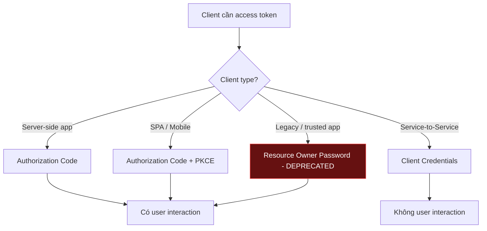
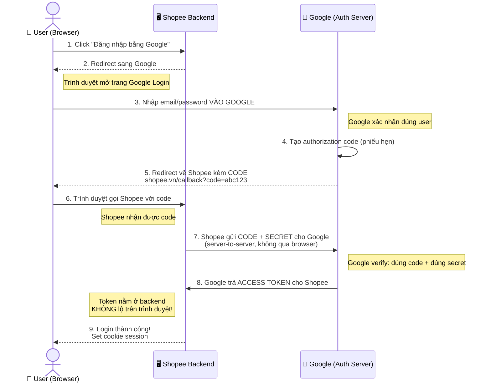
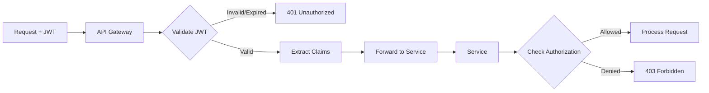
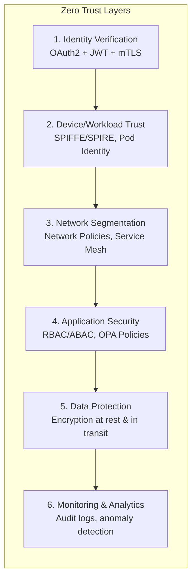

# Security trong Microservice

## 📋 Mục lục

- [1. Giới thiệu](#1-giới-thiệu)
- [2. Thách thức bảo mật trong Microservice](#2-thách-thức-bảo-mật-trong-microservice)
  - [2.1. So sánh Monolith vs Microservice Security](#21-so-sánh-monolith-vs-microservice-security)
  - [2.2. Attack Surface mở rộng](#22-attack-surface-mở-rộng)
- [3. Authentication — Xác thực](#3-authentication--xác-thực)
  - [3.1. Authentication là gì?](#31-authentication-là-gì)
  - [3.2. Centralized Authentication](#32-centralized-authentication)
  - [3.3. OAuth 2.0](#33-oauth-20)
  - [3.4. OpenID Connect (OIDC)](#34-openid-connect-oidc)
  - [3.5. Các OAuth 2.0 Grant Types](#35-các-oauth-20-grant-types)
- [4. JWT — JSON Web Token](#4-jwt--json-web-token)
  - [4.1. JWT là gì?](#41-jwt-là-gì)
  - [4.2. Cấu trúc JWT](#42-cấu-trúc-jwt)
  - [4.3. JWT Signing — Symmetric vs Asymmetric](#43-jwt-signing--symmetric-vs-asymmetric)
  - [4.4. JWT Validation trong Microservice](#44-jwt-validation-trong-microservice)
  - [4.5. Token Refresh & Revocation](#45-token-refresh--revocation)
  - [4.6. JWT Best Practices](#46-jwt-best-practices)
- [5. Authorization — Phân quyền](#5-authorization--phân-quyền)
  - [5.1. Authentication vs Authorization](#51-authentication-vs-authorization)
  - [5.2. RBAC — Role-Based Access Control](#52-rbac--role-based-access-control)
  - [5.3. ABAC — Attribute-Based Access Control](#53-abac--attribute-based-access-control)
  - [5.4. Policy Engine — OPA (Open Policy Agent)](#54-policy-engine--opa-open-policy-agent)
  - [5.5. So sánh RBAC vs ABAC](#55-so-sánh-rbac-vs-abac)
- [6. Service-to-Service Security](#6-service-to-service-security)
  - [6.1. Tại sao cần bảo mật giữa các service?](#61-tại-sao-cần-bảo-mật-giữa-các-service)
  - [6.2. mTLS — Mutual TLS](#62-mtls--mutual-tls)
  - [6.3. Service Mesh và mTLS tự động](#63-service-mesh-và-mtls-tự-động)
  - [6.4. Service Identity & SPIFFE](#64-service-identity--spiffe)
  - [6.5. API Key & Service Token](#65-api-key--service-token)
- [7. API Security](#7-api-security)
  - [7.1. OWASP API Security Top 10](#71-owasp-api-security-top-10)
  - [7.2. Rate Limiting & Throttling](#72-rate-limiting--throttling)
  - [7.3. Input Validation](#73-input-validation)
  - [7.4. CORS — Cross-Origin Resource Sharing](#74-cors--cross-origin-resource-sharing)
  - [7.5. API Versioning Security](#75-api-versioning-security)
- [8. Zero Trust Architecture](#8-zero-trust-architecture)
  - [8.1. Zero Trust là gì?](#81-zero-trust-là-gì)
  - [8.2. Nguyên tắc Zero Trust](#82-nguyên-tắc-zero-trust)
  - [8.3. Zero Trust trong Microservice](#83-zero-trust-trong-microservice)
  - [8.4. Triển khai Zero Trust — Từng bước](#84-triển-khai-zero-trust--từng-bước)
- [9. Secrets Management](#9-secrets-management)
  - [9.1. Vấn đề với secrets](#91-vấn-đề-với-secrets)
  - [9.2. HashiCorp Vault](#92-hashicorp-vault)
  - [9.3. Kubernetes Secrets](#93-kubernetes-secrets)
  - [9.4. Best Practices quản lý Secrets](#94-best-practices-quản-lý-secrets)
- [10. Network Security](#10-network-security)
  - [10.1. Network Policies](#101-network-policies)
  - [10.2. Network Segmentation](#102-network-segmentation)
  - [10.3. WAF — Web Application Firewall](#103-waf--web-application-firewall)
- [11. Container Security](#11-container-security)
  - [11.1. Image Security](#111-image-security)
  - [11.2. Runtime Security](#112-runtime-security)
  - [11.3. Pod Security trong Kubernetes](#113-pod-security-trong-kubernetes)
- [12. Ví dụ thực tế — E-Commerce Security Architecture](#12-ví-dụ-thực-tế--e-commerce-security-architecture)
- [13. Security Anti-patterns](#13-security-anti-patterns)
- [14. Security Checklist cho Microservice](#14-security-checklist-cho-microservice)
- [15. Tổng kết](#15-tổng-kết)
- [16. Liên kết liên quan](#16-liên-kết-liên-quan)

---

## 1. Giới thiệu

Trong kiến trúc Monolith, bảo mật tập trung tại một điểm — một ứng dụng, một database, một firewall. Nhưng khi chuyển sang Microservice, **bề mặt tấn công (attack surface) tăng lên gấp nhiều lần**: hàng chục service giao tiếp với nhau qua network, mỗi service có database riêng, mỗi API endpoint là một điểm có thể bị khai thác.

```
BẢO MẬT TRONG MICROSERVICE — TẠI SAO KHÓ HƠN?
─────────────────────────────────────────────────

  MONOLITH:                          MICROSERVICE:
  ┌─────────────────────┐            ┌─────┐  ┌─────┐  ┌─────┐
  │   🔒 1 entry point  │            │ Svc │──│ Svc │──│ Svc │
  │   1 auth module     │            │  A  │  │  B  │  │  C  │
  │   1 DB              │            └──┬──┘  └──┬──┘  └──┬──┘
  │   1 firewall        │               │        │        │
  └─────────────────────┘            ┌──┴──┐  ┌──┴──┐  ┌──┴──┐
                                     │ DB  │  │ DB  │  │ DB  │
  Bảo mật: Đơn giản                  └─────┘  └─────┘  └─────┘
  Quản lý: 1 chỗ
                                     🔒 N entry points
                                     🔒 N×(N-1) connections
                                     🔒 N databases
                                     🔒 N deployment units

                                     Bảo mật: PHỨC TẠP
```

Tài liệu này bao gồm toàn bộ các khía cạnh bảo mật trong kiến trúc Microservice — từ Authentication, Authorization, mTLS cho đến Zero Trust và Container Security.

> 📖 Tham khảo thêm: [doc 07 — API Gateway](07-api-gateway.md) cho Rate Limiting, [doc 13 — Orchestration](13-orchestration.md) cho Kubernetes security basics.

---

## 2. Thách thức bảo mật trong Microservice

### 2.1. So sánh Monolith vs Microservice Security

| Khía cạnh | Monolith | Microservice |
|-----------|----------|-------------|
| **Authentication** | 1 auth module, session-based | Centralized Identity Provider, token-based |
| **Authorization** | In-process, cùng codebase | Distributed, mỗi service tự quyết |
| **Network** | In-process calls (không qua network) | Mọi call đều qua network → cần mã hóa |
| **Secrets** | 1 config file | N services × M secrets = phức tạp |
| **Attack surface** | 1 app, 1 port | N apps, N ports, N APIs |
| **Audit** | 1 log file | Distributed logs, cần correlation |
| **Trust boundary** | Trong 1 process | Mỗi service là 1 trust boundary |

### 2.2. Attack Surface mở rộng

```
ATTACK SURFACE TRONG MICROSERVICE
──────────────────────────────────

                    ┌─ External Attacks ─┐
                    │  • DDoS            │
                    │  • SQL Injection   │
                    │  • XSS             │
                    │  • CSRF            │
                    └────────┬───────────┘
                             │
                    ┌────────▼────────┐
                    │   API Gateway   │ ◄── Rate Limiting, WAF
                    └────────┬────────┘
                             │
              ┌──────────────┼────────────┐
              │              │            │
         ┌────▼────┐   ┌─────▼───┐   ┌────▼────┐
         │ User    │   │ Order   │   │ Payment │
         │ Service │   │ Service │   │ Service │
         └────┬────┘   └────┬────┘   └────┬────┘
              │             │             │
              └──── Internal Attacks ─────┘
                  • Rogue Service
                  • Man-in-the-Middle
                  • Privilege Escalation
                  • Data Exfiltration
```

**Các vector tấn công phổ biến:**

1. **External → API Gateway**: DDoS, brute force, injection attacks
2. **Client → Service**: Token theft, session hijacking, CSRF
3. **Service → Service**: Man-in-the-middle, unauthorized access, spoofing
4. **Service → Database**: SQL injection, unauthorized data access
5. **Container → Host**: Container escape, privilege escalation
6. **Supply chain**: Compromised dependencies, malicious images

---

## 3. Authentication — Xác thực

### 3.1. Authentication là gì?

**Authentication** (AuthN) là quá trình xác minh danh tính — trả lời câu hỏi **"Bạn là ai?"**

```
AUTHENTICATION FLOW CƠ BẢN
───────────────────────────

  User              Identity Provider         Service
   │                      │                      │
   │──── Credentials ────▶│                      │
   │     (user/pass)      │                      │
   │                      │── Verify ──▶         │
   │◄──── Token ──────────│                      │
   │     (JWT/OAuth)      │                      │
   │                      │                      │
   │──────────── Request + Token ───────────────▶│
   │                      │                      │── Validate Token
   │◄────────────── Response ─────────────────── │
```

### 3.2. Centralized Authentication

Trong Microservice, **KHÔNG nên** để mỗi service tự xử lý authentication. Thay vào đó, sử dụng **Identity Provider (IdP)** tập trung.

```
❌ ANTI-PATTERN: Mỗi service tự authenticate
─────────────────────────────────────────────

  ┌──────────┐  user/pass   ┌──────────┐
  │  Client  │─────────────▶│ Service A│──▶ Users Table A
  │          │─────────────▶│ Service B│──▶ Users Table B
  │          │─────────────▶│ Service C│──▶ Users Table C
  └──────────┘              └──────────┘

  → Duplicate user data
  → Inconsistent auth logic
  → Khó maintain, dễ có lỗ hổng


✅ BEST PRACTICE: Centralized Identity Provider
────────────────────────────────────────────────

  ┌──────────┐  credentials  ┌──────────────┐
  │  Client  │──────────────▶│   Identity   │
  │          │◄──── token ───│   Provider   │
  └────┬─────┘               │ (Keycloak,   │
       │                     │  Auth0, etc) │
       │ token               └──────────────┘
       │
  ┌────▼─────────────────────────────────┐
  │            API Gateway               │
  │  → Validate token                    │
  │  → Forward request + user context    │
  └────┬────────────┬───────────┬────────┘
       │            │           │
  ┌────▼───┐   ┌────▼───┐   ┌───▼────┐
  │ Svc A  │   │ Svc B  │   │ Svc C  │
  │ (trust │   │ (trust │   │ (trust │
  │  token)│   │  token)│   │  token)│
  └────────┘   └────────┘   └────────┘
```

**Identity Provider phổ biến:**

| IdP | Loại | Đặc điểm |
|-----|------|----------|
| **Keycloak** | Self-hosted, Open source | Full-featured, RBAC, LDAP integration |
| **Auth0** | SaaS | Dễ tích hợp, nhiều social login |
| **AWS Cognito** | Cloud | Tích hợp tốt với AWS ecosystem |
| **Okta** | SaaS/Enterprise | Enterprise-grade, SSO |
| **Firebase Auth** | SaaS | Đơn giản, tích hợp Google ecosystem |

### 3.3. OAuth 2.0

**OAuth 2.0** là authorization framework cho phép ứng dụng bên thứ ba truy cập tài nguyên của user mà không cần biết password.

```
CÁC THÀNH PHẦN OAUTH 2.0
──────────────────────────

  ┌──────────────┐     ┌──────────────────────┐
  │ Resource     │     │ Authorization Server │
  │ Owner (User) │     │ (Keycloak/Auth0)     │
  └──────┬───────┘     └───────────┬──────────┘
         │                         │
         │  "Cho phép App A        │
         │   đọc profile?"         │
         │                         │
  ┌──────▼───────┐     ┌───────────▼─────────┐
  │ Client       │     │ Resource Server     │
  │ (App/SPA)    │     │ (API/Microservice)  │
  └──────────────┘     └─────────────────────┘
```

**4 roles trong OAuth 2.0:**

1. **Resource Owner**: User — người sở hữu dữ liệu
2. **Client**: Ứng dụng muốn truy cập dữ liệu
3. **Authorization Server**: Phát hành access token
4. **Resource Server**: API/Service chứa dữ liệu, validate token

### 3.4. OpenID Connect (OIDC)

**OpenID Connect** là một lớp identity phía trên OAuth 2.0. Trong khi OAuth 2.0 chỉ xử lý **authorization** (ủy quyền truy cập), OIDC thêm **authentication** (xác thực danh tính).

**Hiểu đúng OAuth 2.0 — "Không biết user là ai" nghĩa là gì?**

OAuth 2.0 gốc được thiết kế cho bài toán **ủy quyền bên thứ ba (delegated authorization)** — "App A muốn truy cập dữ liệu user trên Server B". Ví dụ thực tế:

```
VÍ DỤ: Canva muốn đọc ảnh Google Photos của bạn
─────────────────────────────────────────────────

  You           Canva (Client App)       Google (Auth + Resource Server)
   │                  │                           │
   │ "Đăng nhập       │                           │
   │  bằng Google"    │                           │
   │─────────────────▶│                           │
   │                  │── redirect ──────────────▶│
   │                  │                           │
   │◄──────────── Login page (Google) ────────────│
   │  Nhập email/password (vào Google,            │
   │  KHÔNG phải vào Canva!)                      │
   │                                              │
   │  "Cho phép Canva đọc Google Photos?" ───────▶│
   │  [Đồng ý]                                    │
   │                  │                           │
   │                  │◄── access_token ──────────│
   │                  │                           │
   │                  │  Canva có token, biết rằng│
   │                  │  "token này cho phép      │
   │                  │   đọc photos"             │
   │                  │                           │
   │                  │  NHƯNG Canva KHÔNG biết:  │
   │                  │  • User tên gì?           │
   │                  │  • Email là gì?           │
   │                  │  • User ID là gì?         │
   │                  │                           │
   │                  │  Token chỉ là 1 chuỗi     │
   │                  │  opaque: "ya29.a0ARr..."  │
   │                  │  → Không decode được!     │
```

Tóm lại:
- **Authorization Server (Google)** biết user là ai — vì user đăng nhập vào Google
- **Client App (Canva)** KHÔNG biết user là ai — chỉ nhận được 1 access token opaque, biết token có quyền đọc photos, nhưng không biết user nào đã cấp quyền

> 💡 Access token trong OAuth 2.0 gốc là **opaque string** (chuỗi không thể decode) — client không thể mở ra để lấy thông tin user. Token chỉ có ý nghĩa khi gửi đến Resource Server (Google Photos API), chỗ đó mới biết token này thuộc về ai.

**OIDC giải quyết vấn đề này — cho client biết user là ai:**

```
OAUTH 2.0 vs OIDC — TỪ GÓC NHÌN CLIENT APP
─────────────────────────────────────────────

  OAuth 2.0 thuần:
  ┌───────────────────────────────────────────────┐
  │  Client (Canva) nhận được:                    │
  │                                               │
  │  access_token: "ya29.a0ARrdaM..."  (opaque)   │
  │                                               │
  │  → Dùng token gọi Google Photos API ✅        │
  │  → Biết user tên gì? ❌ KHÔNG                 │
  │  → Biết user email? ❌ KHÔNG                  │
  │                                               │
  │  Giống như: bạn có CHỈ KHÓA vào kho,          │
  │  nhưng không biết ai đã đưa chìa khóa cho bạn │
  └───────────────────────────────────────────────┘

  OIDC = OAuth 2.0 + Identity Layer:
  ┌───────────────────────────────────────────────┐
  │  Client (Canva) nhận được:                    │
  │                                               │
  │  access_token: "ya29.a0ARrdaM..."  (opaque)   │
  │  id_token: "eyJhbGci..."           (JWT!) ✨  │
  │                                               │
  │  Decode id_token ra được:                     │
  │  {                                            │
  │    "sub": "user-123",                         │
  │    "name": "Nguyen Van A",                    │
  │    "email": "a@gmail.com",                    │
  │    "picture": "https://..."                   │
  │  }                                            │
  │                                               │
  │  → Dùng access_token gọi API ✅               │
  │  → Biết user là "Nguyen Van A" ✅             │
  │  → Hiển thị "Xin chào, Nguyen Van A!" ✅      │
  └───────────────────────────────────────────────┘
```

**OIDC cung cấp thêm:**

- **ID Token**: JWT chứa thông tin user (sub, name, email) — client **decode được**
- **UserInfo Endpoint**: API để lấy thêm thông tin user chi tiết
- **Standard Scopes**: `openid`, `profile`, `email`
- **Discovery**: `.well-known/openid-configuration`

> 📌 **Lưu ý thực tế**: Trong Microservice hiện đại, access token thường cũng là JWT (chứa user info + permissions) — đây là **mở rộng** so với OAuth 2.0 gốc. Nhưng theo **spec chuẩn**, access token là opaque và chỉ OIDC mới đảm bảo client nhận được user identity qua ID Token.

### 3.5. Các OAuth 2.0 Grant Types

**Grant Type là gì?**

Để lấy được access token từ Authorization Server, client phải "chứng minh" mình có quyền — nhưng **tùy loại client khác nhau** mà cách chứng minh sẽ khác nhau. **Grant Type** chính là "cách thức" (quy trình) mà client dùng để xin access token.

```
TẠI SAO CẦN NHIỀU GRANT TYPE?
───────────────────────────────

  Vấn đề: Mỗi loại client có đặc điểm bảo mật khác nhau:

  ┌────────────────────────────────────────────────────────────────┐
  │                                                                │
  │  🖥️ Server-side Web App (Java, Node.js backend)                │
  │  → Có backend an toàn, giữ được secret                         │
  │  → Dùng: Authorization Code                                    │
  │                                                                │
  │  📱 SPA / Mobile App (React, iOS, Android)                     │
  │  → Code chạy trên thiết bị user, KHÔNG giữ được secret         │
  │  → Ai cũng có thể decompile app → lộ secret                    │
  │  → Dùng: Authorization Code + PKCE (thêm lớp bảo vệ)           │
  │                                                                │
  │  ⚙️ Service-to-Service (Microservice gọi microservice)         │
  │  → Không có user, không có trình duyệt, chỉ máy gọi máy        │
  │  → Dùng: Client Credentials                                    │
  │                                                                │
  │  📺 Smart TV / IoT (không có bàn phím)                         │
  │  → Không thể nhập password trên TV                             │
  │  → Dùng: Device Code (nhập code trên điện thoại)               │
  │                                                                │
  └────────────────────────────────────────────────────────────────┘

  Tóm lại: Grant Type = "Cách xin token" phù hợp với từng hoàn cảnh
```

**Ví dụ đời thực để dễ hiểu:**

```
GRANT TYPE GIỐNG NHƯ "CÁCH XIN VÀO TÒA NHÀ"
──────────────────────────────────────────────

  🏢 Tòa nhà = Authorization Server (giữ token)
  🎫 Thẻ ra vào = Access Token
  Bạn cần thẻ ra vào, nhưng tùy bạn là ai mà cách xin khác nhau:

  1. Authorization Code (nhân viên công ty):
     → Đến quầy lễ tân, xuất trình CMND
     → Lễ tân gọi phòng HR xác nhận
     → Nhận thẻ ra vào
     (Quy trình chặt chẽ, có người xác nhận)

  2. Authorization Code + PKCE (khách đến họp):
     → Giống trên, nhưng thêm bước: lễ tân đưa 1 mã OTP
     → Phải nhập đúng OTP mới nhận thẻ
     (Thêm 1 lớp verify vì khách không tin tưởng bằng nhân viên)

  3. Client Credentials (xe giao hàng):
     → Xe có biển số + giấy phép đã đăng ký sẵn
     → Bảo vệ quét biển số → mở cổng
     → KHÔNG cần người nào đứng ra xác nhận
     (Máy gọi máy, không có user)

  4. Device Code (giao hàng bằng drone):
     → Drone không nhập được password
     → Hiện mã trên màn hình → người điều khiển
       mở app trên điện thoại, nhập mã xác nhận
     (Thiết bị không có khả năng input)
```



| Grant Type | Use Case | User Interaction | Security |
|-----------|----------|:----------------:|:--------:|
| **Authorization Code** | Server-side web app | ✅ | ⭐⭐⭐⭐⭐ |
| **Authorization Code + PKCE** | SPA, Mobile app | ✅ | ⭐⭐⭐⭐⭐ |
| **Client Credentials** | Service-to-service | ❌ | ⭐⭐⭐⭐ |
| **Device Code** | Smart TV, IoT | ✅ (trên thiết bị khác) | ⭐⭐⭐⭐ |
| ~~Resource Owner Password~~ | ~~Legacy~~ | ✅ | ❌ Deprecated |
| ~~Implicit~~ | ~~SPA cũ~~ | ✅ | ❌ Deprecated |

**Authorization Code Flow — chi tiết:**

Trước hết, cần hiểu rõ **code** và **token** là gì:

```
GIẢI THÍCH: CODE vs TOKEN — KHÁC NHAU THẾ NÀO?
─────────────────────────────────────────────────

  📌 TOKEN (Access Token) — "THẺ RA VÀO"
  ────────────────────────────────────────
  → Là thứ CÓ GIÁ TRỊ THỰC SỰ
  → Ai có token = có quyền gọi API
  → Giống: thẻ ra vào tòa nhà — cứ quẹt là vào được
  → Vì vậy: PHẢI BẢO VỆ, không được để lộ!

  📌 CODE (Authorization Code) — "PHIẾU HẸN"
  ─────────────────────────────────────────────
  → Là 1 chuỗi TẠM THỜI, dùng 1 lần, hết hạn sau 30 giây
  → KHÔNG thể dùng trực tiếp để gọi API
  → Chỉ dùng để ĐỔI lấy token (cần thêm client_secret)
  → Giống: phiếu hẹn lấy thẻ — phải mang phiếu + CMND
    mới đổi được thẻ ra vào thực sự
  → Lộ phiếu hẹn? Không sao — vì cần thêm CMND (client_secret)

  ┌─────────────────────────────────────────────────────────────┐
  │                                                             │
  │  Ví dụ đời thực:                                            │
  │                                                             │
  │  Bạn đặt hàng online (= user đăng nhập)                     │
  │  → Shop gửi cho bạn MÃ ĐƠN HÀNG (= authorization code)      │
  │  → Bạn ra bưu điện, đưa MÃ ĐƠN + CMND (= code + secret)     │
  │  → Bưu điện xác nhận, đưa HÀNG (= access token)             │
  │                                                             │
  │  Ai nhặt được mã đơn hàng?                                  │
  │  → Không lấy được hàng vì không có CMND!                    │
  │                                                             │
  │  Ai nhặt được hàng (token)?                                 │
  │  → Dùng được luôn! → Nên phải giấu kỹ!                      │
  │                                                             │
  └─────────────────────────────────────────────────────────────┘
```

**Tại sao cần 2 bước (code → token) mà không trả token thẳng?**

Vì **không muốn token lộ trên trình duyệt** (URL, browser history):

```
TẠI SAO KHÔNG TRẢ TOKEN THẲNG?
─────────────────────────────────

  ❌ NẾU trả token trực tiếp qua URL trình duyệt:
     https://myapp.com/callback?access_token=xyz123
     → Token nằm trong URL → LỘ qua:
       • Browser history (ai mở lịch sử duyệt web = thấy)
       • Server access logs (admin server đọc được)
       • Referer header (website khác nhận được)
     → Có token = gọi API thoải mái → NGUY HIỂM!

  ✅ THAY VÀO ĐÓ, trả CODE qua URL trình duyệt:
     https://myapp.com/callback?code=abc
     → Code lộ qua URL? KHÔNG SAO, vì:
       • Code hết hạn sau 30 giây
       • Code chỉ dùng được 1 lần
       • Cần thêm client_secret mới đổi được → kẻ lạ không có

  → Sau đó Backend server gọi TRỰC TIẾP tới Auth Server
    (server-to-server, KHÔNG qua trình duyệt)
    → Gửi: code + client_secret
    → Nhận: access_token
    → Token nằm ở backend, KHÔNG BAO GIỜ xuất hiện trên trình duyệt!
```

**Flow từng bước — ví dụ "Đăng nhập Shopee bằng Google":**



```
GIẢI THÍCH TỪNG BƯỚC — NGÔN NGỮ DỄ HIỂU
──────────────────────────────────────────

  Bước 1-2: User click "Đăng nhập bằng Google"
  ──────────────────────────────────────────────
  → Shopee nói: "Tao không xử lý password, để Google lo"
  → Shopee chuyển hướng trình duyệt sang Google

  Bước 3: User nhập email/password VÀO GOOGLE
  ─────────────────────────────────────────────
  → Shopee KHÔNG BAO GIỜ thấy password của bạn!
  → Chỉ Google biết password
  → Google hỏi: "Cho phép Shopee xem profile của bạn?"
  → User bấm "Đồng ý"

  Bước 4-5: Google tạo CODE, redirect về Shopee
  ───────────────────────────────────────────────
  → Google tạo 1 chuỗi tạm = "abc123" (authorization code)
  → Redirect trình duyệt: shopee.vn/callback?code=abc123
  → Code này KHÔNG phải token, KHÔNG gọi được API

  Bước 6: Trình duyệt gọi Shopee backend kèm code
  ──────────────────────────────────────────────────
  → Shopee backend nhận được code "abc123"

  Bước 7-8: Shopee đổi CODE → TOKEN (bí mật, backend-to-backend)
  ────────────────────────────────────────────────────────────────
  → Shopee backend gọi TRỰC TIẾP tới Google:
    "Đây là code=abc123, đây là secret của tao, đổi token cho tao"
  → Google kiểm tra: đúng code + đúng secret → OK
  → Google trả access_token cho Shopee
  → BẠN (trình duyệt) KHÔNG THẤY token này!

  Bước 9: Login thành công!
  ─────────────────────────
  → Shopee lưu token ở backend
  → Trả cookie session cho trình duyệt
  → Từ giờ dùng cookie để nhận diện user
```

**Authorization Code + PKCE — cho SPA/Mobile (không có client_secret):**

SPA/Mobile app không giữ được `client_secret` (vì code chạy trên thiết bị user, ai cũng đọc được). **PKCE** (Proof Key for Code Exchange) thay thế secret bằng một "bài toán" mà chỉ client gốc mới giải được.

```
PKCE HOẠT ĐỘNG NHƯ THẾ NÀO?
──────────────────────────────

  Ý tưởng: Client tạo 1 "bài toán" trước khi xin code,
  khi đổi code → token thì phải "giải bài toán" đó.
  Attacker dù có trộm được code cũng không giải được!

  Browser/Mobile                                         Auth Server
       │                                                     │
       │ 1. Tạo ngẫu nhiên:                                  │
       │    code_verifier = "dBjf..."  (chuỗi random dài)    │
       │    code_challenge = SHA256("dBjf...") = "E9Me..."   │
       │                                                     │
       │ 2. Xin code + gửi kèm                               │
       │    "BÀI TOÁN":                                      │
       │    /authorize?                                      │
       │    code_challenge=E9Me...                           │
       │    &method=S256                                     │
       │  ───────────────────────────────────────────────▶   │  Auth Server lưu:
       │                                                     │  "code ABC đi kèm
       │                                                     │   challenge E9Me..."
       │                                                     │
       │ ◀── 3. code=ABC ────────────────────────────────────│
       │                                                     │
       │ 4. Đổi code → token                                 │
       │    Gửi "LỜI GIẢI":                                  │
       │    POST /token                                      │
       │    code=ABC                                         │
       │   code_verifier=dBjf.. ─▶                           │
       │   ───────────────────────────────────────────────▶  │
       │                                                     │  Auth Server verify:
       │                                                     │  SHA256("dBjf...") == "E9Me..."?
       │                                                     │  ✅ Khớp! → Đúng client gốc
       │                                                     │
       │ ◀── 5. access_token ─────────────────────────────── │
       │                                                     │

  🕵️ Attacker trộm được code=ABC nhưng:
     → Không biết code_verifier (chỉ client gốc biết)
     → Không thể đổi code → token
     → VÔ DỤNG! ✅
```

**Client Credentials Flow — Service-to-Service (không có user):**

Khi 2 microservice gọi nhau, không có user nào đăng nhập cả — chỉ là máy gọi máy. Service dùng `client_id` + `client_secret` (đã đăng ký trước) để xin token.

```
CLIENT CREDENTIALS FLOW
────────────────────────

  Service A                  Auth Server              Service B
      │                          │                        │
      │  "Tôi là Service A,      │                        │
      │   đây là giấy tờ của tôi"│                        │
      │                          │                        │
      │  POST /token             │                        │
      │  grant_type=             │                        │
      │   client_credentials     │                        │
      │  client_id=svc-a         │                        │
      │  client_secret=xxx     ─▶│                        │
      │                          │                        │
      │  "OK, đây là token       │                        │
      │   cho Service A"         │                        │
      │ ◀── access_token ────────│                        │
      │                          │                        │
      │  GET /api/orders ────────────────────────────────▶│
      │  Authorization: Bearer <token>                    │
      │                          │                   Validate
      │ ◀──────────────────────────────────── Response ── │

  → Không có user login
  → Không có redirect
  → Chỉ cần client_id + client_secret
  → Dùng cho: cronjob, background worker, service-to-service
```

---

## 4. JWT — JSON Web Token

### 4.1. JWT là gì?

**JWT (JSON Web Token)** là một chuẩn mở (RFC 7519) để truyền thông tin an toàn giữa các bên dưới dạng JSON object, được ký (signed) để đảm bảo tính toàn vẹn.

**Tại sao JWT phù hợp với Microservice?**

```
SESSION-BASED vs TOKEN-BASED AUTHENTICATION
─────────────────────────────────────────────

  SESSION-BASED (Monolith):
  ┌──────┐    session_id    ┌──────────┐    lookup    ┌──────────┐
  │Client│─────────────────▶│  Server  │─────────────▶│  Session │
  │      │                  │          │              │  Store   │
  └──────┘                  └──────────┘              │ (Redis)  │
                                                      └──────────┘
  → Cần shared session store
  → Single point of failure
  → Khó scale horizontally


  TOKEN-BASED (Microservice):
  ┌──────┐    JWT token     ┌──────────┐
  │Client│─────────────────▶│ Service  │──▶ Verify signature locally
  │      │                  │ (any)    │    (không cần call external)
  └──────┘                  └──────────┘

  → Stateless — mỗi service tự verify
  → Không cần shared store
  → Scale dễ dàng
```

### 4.2. Cấu trúc JWT

JWT gồm 3 phần, ngăn cách bởi dấu `.`:

```
HEADER.PAYLOAD.SIGNATURE

eyJhbGciOiJSUzI1NiIsInR5cCI6IkpXVCJ9.
eyJzdWIiOiJ1c2VyLTEyMyIsIm5hbWUiOiJOZ3V5ZW4gVmFuIEEiLCJyb2xlcyI6WyJ1c2VyIiwiYWRtaW4iXSwiZXhwIjoxNjk5MDAwMDAwfQ.
abc123signature...
```

**Chi tiết từng phần:**

```json
// 1. HEADER — Thuật toán ký
{
  "alg": "RS256",        // Thuật toán: RS256, HS256, ES256
  "typ": "JWT",          // Loại token
  "kid": "key-2024-01"   // Key ID (dùng khi rotate key)
}

// 2. PAYLOAD — Dữ liệu (Claims)
{
  // Registered Claims (chuẩn)
  "iss": "https://auth.example.com",  // Issuer — ai phát hành
  "sub": "user-123",                   // Subject — user ID
  "aud": "order-service",              // Audience — dành cho ai
  "exp": 1699000000,                    // Expiration — hết hạn lúc nào
  "iat": 1698996400,                    // Issued At — phát hành lúc nào
  "jti": "unique-token-id",            // JWT ID — ID duy nhất

  // Custom Claims
  "name": "Nguyen Van A",
  "email": "a@example.com",
  "roles": ["user", "admin"],
  "tenant_id": "tenant-456"
}

// 3. SIGNATURE
// RS256: RSASHA256(base64(header) + "." + base64(payload), privateKey)
// HS256: HMACSHA256(base64(header) + "." + base64(payload), secret)
```

### 4.3. JWT Signing — Symmetric vs Asymmetric

| Đặc điểm | Symmetric (HS256) | Asymmetric (RS256/ES256) |
|----------|-------------------|--------------------------|
| **Key** | 1 shared secret | Private key (sign) + Public key (verify) |
| **Sign** | HMAC-SHA256 | RSA-SHA256 hoặc ECDSA |
| **Verify** | Cần biết secret | Chỉ cần public key |
| **Phù hợp** | Internal, 1 service | Microservice (nhiều service verify) |
| **Rủi ro** | Lộ secret = toàn bộ bị compromised | Lộ public key = không sao |

```
SYMMETRIC vs ASYMMETRIC TRONG MICROSERVICE
────────────────────────────────────────────

  ❌ Symmetric (HS256):
  ┌────────────┐     shared_secret     ┌──────────┐
  │ Auth Server│◄─────────────────────▶│ Service A│ ← biết secret
  │ (sign)     │     shared_secret     ├──────────┤
  │            │◄─────────────────────▶│ Service B│ ← biết secret
  └────────────┘     shared_secret     ├──────────┤
                ◄─────────────────────▶│ Service C│ ← biết secret
                                       └──────────┘
  → Mọi service đều biết secret
  → 1 service bị hack = tất cả bị compromised
  → Bất kỳ service nào cũng có thể FORGE token


  ✅ Asymmetric (RS256):
  ┌────────────┐                       ┌──────────┐
  │ Auth Server│     public_key  ────▶ │ Service A│ ← chỉ verify
  │ (sign with │     public_key  ────▶ ├──────────┤
  │  PRIVATE   │     public_key  ────▶ │ Service B│ ← chỉ verify
  │  key)      │                       ├──────────┤
  └────────────┘                       │ Service C│ ← chỉ verify
                                       └──────────┘
  → Chỉ Auth Server biết private key
  → Services chỉ có public key → chỉ verify, KHÔNG forge được
  → 1 service bị hack = không ảnh hưởng
```

**→ Trong Microservice, luôn dùng Asymmetric (RS256 hoặc ES256).**

### 4.4. JWT Validation trong Microservice



**JWT Validation checklist:**

1. **Verify signature** — dùng public key của Auth Server
2. **Check expiration** (`exp`) — token có hết hạn chưa?
3. **Check issuer** (`iss`) — đúng Auth Server phát hành?
4. **Check audience** (`aud`) — token có dành cho service này?
5. **Check not-before** (`nbf`) — token đã có hiệu lực chưa?

**Nên validate ở đâu?**

| Vị trí | Validate gì | Lý do |
|--------|------------|-------|
| **API Gateway** | Signature, exp, iss | Chặn sớm invalid token |
| **Service** | aud, custom claims, authorization | Service-specific logic |

### 4.5. Token Refresh & Revocation

```
TOKEN LIFECYCLE
────────────────

  ┌──────────┐    login     ┌────────────┐
  │  Client  │─────────────▶│ Auth Server│
  │          │◄─────────────│            │
  │          │  access_token│            │
  │          │  (15 min)    │            │
  │          │ refresh_token│            │
  │          │  (7 days)    │            │
  │          │              │            │
  │          │ ... 15 min...│            │
  │          │              │            │
  │          │  POST /token │            │
  │          │ refresh_token│            │
  │          │─────────────▶│            │
  │          │◄─────────────│            │
  │          │ NEW access   │            │
  │          │ NEW refresh  │            │
  └──────────┘ (rotate!)    └────────────┘
```

**Token Revocation strategies:**

| Strategy | Cách hoạt động | Trade-off |
|----------|---------------|-----------|
| **Short-lived tokens** | Access token expire sau 5-15 phút | Đơn giản, nhưng user phải refresh thường xuyên |
| **Token Blacklist** | Lưu revoked token vào Redis/DB | Real-time revoke, nhưng cần shared store |
| **Token Versioning** | Mỗi user có `token_version`, tăng khi revoke | Cần lookup user, nhưng đơn giản |
| **Refresh Token Rotation** | Mỗi lần refresh → cấp cặp token mới, invalidate cũ | Phát hiện token theft |

### 4.6. JWT Best Practices

```
JWT BEST PRACTICES
───────────────────

  ✅ DO:
  ┌─────────────────────────────────────────────────────────┐
  │  • Dùng asymmetric signing (RS256/ES256)                │
  │  • Set expiration ngắn (5-15 phút cho access token)     │
  │  • Validate tất cả standard claims (iss, aud, exp)      │
  │  • Dùng HTTPS everywhere                                │
  │  • Rotate signing keys định kỳ                          │
  │  • Giữ payload nhỏ (< 1KB)                              │
  │  • Dùng kid (Key ID) để hỗ trợ key rotation             │
  └─────────────────────────────────────────────────────────┘

  ❌ DON'T:
  ┌─────────────────────────────────────────────────────────┐
  │  • KHÔNG lưu sensitive data trong payload               │
  │    (password, credit card, PII không cần thiết)         │
  │  • KHÔNG dùng JWT làm session (quá lớn, khó revoke)     │
  │  • KHÔNG dùng symmetric key (HS256) cho microservice    │
  │  • KHÔNG set expiration quá dài (> 1 giờ)               │
  │  • KHÔNG tin tưởng JWT mà không verify signature        │
  │  • KHÔNG truyền JWT qua URL query params                │
  └─────────────────────────────────────────────────────────┘
```

---

## 5. Authorization — Phân quyền

### 5.1. Authentication vs Authorization

```
AUTHENTICATION vs AUTHORIZATION
─────────────────────────────────

  Authentication (AuthN):          Authorization (AuthZ):
  ┌───────────────────────┐        ┌───────────────────────┐
  │  "BẠN LÀ AI?"         │        │  "BẠN ĐƯỢC LÀM GÌ?"   │
  │                       │        │                       │
  │  Input: credentials   │        │  Input: identity +    │
  │  Output: identity     │        │         resource      │
  │                       │        │  Output: allow/deny   │
  │  Ví dụ:               │        │                       │
  │  → Login bằng email   │        │  Ví dụ:               │
  │  → Verify JWT         │        │  → Admin mới delete   │
  │  → Fingerprint        │        │  → Owner mới edit     │
  └───────────────────────┘        └───────────────────────┘

  Luồng: AuthN trước → AuthZ sau
  ────────────────────────────────
  Request → Ai gửi? (AuthN) → Được phép không? (AuthZ) → Process
```

### 5.2. RBAC — Role-Based Access Control

**RBAC** phân quyền dựa trên **vai trò (role)** của user.

```
RBAC MODEL
───────────

  Users ──── assigned to ──── Roles ──── granted ──── Permissions

  ┌────────────────────────────────────────────────────┐
  │  User: "nguyen.van.a"                              │
  │  Roles: [admin, order-manager]                     │
  │                                                    │
  │  Role "admin":                                     │
  │    → user:read, user:write, user:delete            │
  │    → order:read, order:write                       │
  │    → product:read, product:write                   │
  │                                                    │
  │  Role "order-manager":                             │
  │    → order:read, order:write, order:refund         │
  │                                                    │
  │  Effective Permissions:                            │
  │    → user:*, order:*, product:read, product:write  │
  └────────────────────────────────────────────────────┘
```

**JWT chứa roles:**

```json
{
  "sub": "user-123",
  "roles": ["admin", "order-manager"],
  "permissions": ["user:read", "user:write", "order:*"]
}
```

**Triển khai trong service:**

```python
# Middleware kiểm tra quyền
def require_permission(permission):
    def decorator(func):
        def wrapper(request):
            user_permissions = request.jwt_claims["permissions"]
            if permission not in user_permissions:
                raise ForbiddenError("Insufficient permissions")
            return func(request)
        return wrapper
    return decorator

@require_permission("order:write")
def create_order(request):
    # Chỉ user có quyền "order:write" mới vào được
    pass
```

### 5.3. ABAC — Attribute-Based Access Control

**ABAC** phân quyền dựa trên **thuộc tính (attributes)** — linh hoạt hơn RBAC.

```
ABAC MODEL — PHÂN QUYỀN DỰA TRÊN ATTRIBUTES
──────────────────────────────────────────────

  Decision = f(Subject, Resource, Action, Environment)

  Subject Attributes:          Resource Attributes:
  ┌────────────────────┐      ┌────────────────────┐
  │ role: "doctor"     │      │ type: "medical"    │
  │ department: "ICU"  │      │ sensitivity: "high"│
  │ clearance: "L3"    │      │ owner: "user-456"  │
  └────────────────────┘      └────────────────────┘

  Action Attributes:           Environment Attributes:
  ┌────────────────────┐      ┌────────────────────┐
  │ action: "read"     │      │ time: "09:00-17:00"│
  │                    │      │ ip: "10.0.0.0/8"   │
  │                    │      │ location: "VN"     │
  └────────────────────┘      └────────────────────┘

  Policy: "Doctors in ICU can read high-sensitivity
           medical records during work hours from
           internal network only"
```

### 5.4. Policy Engine — OPA (Open Policy Agent)

**OPA (Open Policy Agent)** là policy engine phổ biến nhất cho Microservice, sử dụng ngôn ngữ **Rego** để viết policy.

```
OPA TRONG MICROSERVICE
───────────────────────

  ┌──────────┐  "Can user X do action Y    ┌──────────┐
  │ Service  │  on resource Z?"            │   OPA    │
  │          │ ────────────────────────▶   │  Server  │
  │          │                             │          │
  │          │ ◀──── allow: true/false ────│  Rego    │
  │          │                             │  Policies│
  └──────────┘                             └──────────┘
```

**Ví dụ Rego policy:**

```rego
# policy.rego — Order Service Authorization
package order.authz

default allow := false

# Admin được phép tất cả
allow if {
    input.user.roles[_] == "admin"
}

# User chỉ xem order của chính mình
allow if {
    input.action == "read"
    input.resource.owner == input.user.sub
}

# Order Manager được refund nếu amount < 1000
allow if {
    input.action == "refund"
    input.user.roles[_] == "order-manager"
    input.resource.amount < 1000
}
```

### 5.5. So sánh RBAC vs ABAC

| Tiêu chí | RBAC | ABAC |
|----------|------|------|
| **Độ phức tạp** | Đơn giản | Phức tạp |
| **Linh hoạt** | Cứng nhắc (chỉ theo role) | Rất linh hoạt (theo bất kỳ attribute nào) |
| **Quản lý** | Dễ quản lý khi ít role | Khó quản lý khi nhiều policy |
| **Performance** | Nhanh (lookup role) | Chậm hơn (evaluate policy) |
| **Phù hợp** | CRUD đơn giản, ít role | Healthcare, finance, multi-tenant |
| **Ví dụ** | "Admin được xóa user" | "Doctor ở ICU được xem medical record sensitivity=high trong giờ hành chính" |

**Thực tế**: Hầu hết hệ thống bắt đầu với **RBAC**, sau đó mở rộng sang **ABAC** khi cần logic phức tạp hơn. Có thể kết hợp cả hai (**RBAC + ABAC**).

---

## 6. Service-to-Service Security

### 6.1. Tại sao cần bảo mật giữa các service?

Trong Microservice, các service giao tiếp qua network — **mặc định là KHÔNG an toàn**.

```
TẤN CÔNG GIỮA CÁC SERVICE
────────────────────────────

  ❌ Không có bảo mật service-to-service:

  Service A ──── HTTP (plaintext) ────▶ Service B
                     │
                     │ 🕵️ Attacker
                     │ Man-in-the-Middle
                     │ • Đọc được request/response
                     │ • Sửa đổi dữ liệu
                     │ • Giả mạo Service A


  ✅ Có mTLS:

  Service A ════ mTLS (encrypted) ═════▶ Service B
                     │
                     │ 🕵️ Attacker
                     │ ❌ Không đọc được (encrypted)
                     │ ❌ Không sửa được (integrity)
                     │ ❌ Không giả mạo được (mutual auth)
```

### 6.2. mTLS — Mutual TLS

**mTLS (Mutual TLS)** là phiên bản nâng cao của TLS, trong đó **cả client VÀ server đều phải chứng minh danh tính** bằng certificate.

```
TLS vs mTLS
─────────────

  TLS (one-way):
  ┌────────┐                    ┌────────┐
  │ Client │ ── "Server ơi,     │ Server │
  │        │    chứng minh      │        │
  │        │    mày là ai!" ──▶ │        │
  │        │                    │        │
  │        │ ◀── Server cert ── │        │
  │        │    "Đây, cert      │        │
  │        │     của tao"       │        │
  │        │                    │        │
  │  ✅    │ verify cert OK     │        │
  └────────┘                    └────────┘
  → Chỉ client verify server
  → Server KHÔNG biết client là ai


  mTLS (mutual):
  ┌────────┐                    ┌────────┐
  │ Client │ ── "Server ơi,     │ Server │
  │        │    chứng minh      │        │
  │        │    mày là ai!" ──▶ │        │
  │        │                    │        │
  │        │ ◀── Server cert ── │        │
  │        │                    │        │
  │        │ ── "OK, giờ tới  ▶ │        │
  │        │    lượt tao"       │        │
  │        │ ── Client cert ──▶ │        │
  │        │                    │        │
  │  ✅    │                    │  ✅    │
  │ verify │                    │ verify │
  └────────┘                    └────────┘
  → CẢ HAI bên verify lẫn nhau
  → Server BIẾT client là ai
```

### 6.3. Service Mesh và mTLS tự động

Triển khai mTLS thủ công cho 20+ services rất phức tạp. **Service Mesh** (Istio, Linkerd) tự động hóa mTLS cho tất cả communication.

```
SERVICE MESH + mTLS TỰ ĐỘNG
─────────────────────────────

  ┌─ Pod A ──────────────────┐    mTLS     ┌─ Pod B ──────────────────┐
  │ ┌──────────┐ ┌─────────┐ │◄═══════════▶│┌─────────┐ ┌──────────┐  │
  │ │ Service A│ │ Envoy   │ │  encrypted  ││ Envoy   │ │ Service B│  │
  │ │          │─│ Sidecar │ │  + mutual   ││ Sidecar │─│          │  │
  │ │ (không   │ │         │ │  auth       ││         │ │ (không   │  │
  │ │  biết    │ │ • TLS   │ │             ││ • TLS   │ │  biết    │  │
  │ │  mTLS)   │ │ • Cert  │ │             ││ • Cert  │ │  mTLS)   │  │
  │ └──────────┘ │ • Rotate│ │             ││ • Rotate│ └──────────┘  │
  │              └─────────┘ │             │└─────────┘               │
  └──────────────────────────┘             └──────────────────────────┘

  → Service code KHÔNG cần thay đổi
  → Sidecar proxy tự động:
    • Inject certificate
    • Encrypt/decrypt traffic
    • Rotate certificate
    • Enforce authorization policies
```

**Istio mTLS config:**

```yaml
# PeerAuthentication — Bắt buộc mTLS cho namespace
apiVersion: security.istio.io/v1beta1
kind: PeerAuthentication
metadata:
  name: default
  namespace: production
spec:
  mtls:
    mode: STRICT  # STRICT = bắt buộc mTLS, PERMISSIVE = cho phép cả plaintext

---
# AuthorizationPolicy — Chỉ cho phép service cụ thể gọi
apiVersion: security.istio.io/v1beta1
kind: AuthorizationPolicy
metadata:
  name: order-service-policy
  namespace: production
spec:
  selector:
    matchLabels:
      app: order-service
  rules:
  - from:
    - source:
        principals: ["cluster.local/ns/production/sa/api-gateway"]
    - source:
        principals: ["cluster.local/ns/production/sa/payment-service"]
    to:
    - operation:
        methods: ["GET", "POST"]
        paths: ["/api/orders/*"]
```

### 6.4. Service Identity & SPIFFE

**SPIFFE (Secure Production Identity Framework for Everyone)** là chuẩn mở để xác định danh tính cho service trong Microservice.

```
SPIFFE IDENTITY
────────────────

  Format: spiffe://<trust-domain>/<workload-identifier>

  Ví dụ:
  • spiffe://example.com/ns/production/sa/order-service
  • spiffe://example.com/ns/staging/sa/payment-service

  ┌──────────────────────────────────────────────┐
  │  SPIFFE ID được embed trong X.509 cert       │
  │  (SVID — SPIFFE Verifiable Identity Document)│
  │                                              │
  │  Certificate:                                │
  │    Subject Alternative Name (SAN):           │
  │    URI: spiffe://example.com/order-service   │
  │                                              │
  │  → Mỗi service có identity riêng             │
  │  → Tự động issue và rotate cert              │
  │  → Cross-cluster trust possible              │
  └──────────────────────────────────────────────┘
```

### 6.5. API Key & Service Token

Ngoài mTLS, có thể dùng **API Key** hoặc **Service Token** cho service-to-service auth:

| Phương pháp | Ưu điểm | Nhược điểm | Use case |
|------------|---------|------------|----------|
| **mTLS** | Mạnh nhất, encrypt + auth | Phức tạp, cần PKI | Internal microservice |
| **JWT (Client Credentials)** | Standard, chứa claims | Cần Auth Server | Cross-domain services |
| **API Key** | Đơn giản | Không expire tự động, dễ lộ | Third-party integration |
| **Service Account Token** | K8s native | Chỉ trong K8s cluster | K8s internal |

---

## 7. API Security

### 7.1. OWASP API Security Top 10

**OWASP API Security Top 10 (2023)** liệt kê 10 rủi ro bảo mật phổ biến nhất cho API:

| # | Rủi ro | Mô tả | Phòng chống |
|---|--------|--------|-------------|
| 1 | **Broken Object Level Authorization** | User A truy cập dữ liệu User B | Kiểm tra ownership mỗi request |
| 2 | **Broken Authentication** | Auth yếu, thiếu rate limit | MFA, rate limiting, strong password |
| 3 | **Broken Object Property Level Authorization** | Expose sensitive fields | Response filtering, DTO |
| 4 | **Unrestricted Resource Consumption** | API không limit → DoS | Rate limit, pagination, file size limit |
| 5 | **Broken Function Level Authorization** | User thường gọi được admin API | Check permission mỗi endpoint |
| 6 | **Unrestricted Access to Sensitive Business Flows** | Automated abuse (scalping, spam) | CAPTCHA, bot detection |
| 7 | **Server Side Request Forgery (SSRF)** | API bị trick gọi internal URL | Whitelist URLs, validate input |
| 8 | **Security Misconfiguration** | Default config, verbose error | Hardening, disable debug |
| 9 | **Improper Inventory Management** | Shadow APIs, old versions | API catalog, deprecation policy |
| 10 | **Unsafe Consumption of APIs** | Tin tưởng third-party API response | Validate all external input |

### 7.2. Rate Limiting & Throttling

```
RATE LIMITING STRATEGIES
─────────────────────────

  1. Fixed Window:
     ┌──────────────────┐ ┌──────────────────┐
     │  Window: 1 min   │ │  Window: 1 min   │
     │  Limit: 100 req  │ │  Limit: 100 req  │
     │  Count: ████ 78  │ │  Count: █ 12     │
     └──────────────────┘ └──────────────────┘

  2. Sliding Window:
     ────────────────[===== 1 min window =====]────────
     Tính trung bình giữa 2 fixed windows

  3. Token Bucket:
     ┌─────────────────────────────┐
     │  Bucket: 🪣                 │
     │  Capacity: 100 tokens       │
     │  Refill: 10 tokens/sec      │
     │  Current: ████████ 80       │
     │                             │
     │  Mỗi request tiêu 1 token   │
     │  Hết token → 429 Too Many   │
     └─────────────────────────────┘

  4. Leaky Bucket:
     Requests vào → Queue (fixed size) → Process ở tốc độ cố định
```

**Rate Limiting ở API Gateway (Kong):**

```yaml
# Kong Rate Limiting Plugin
plugins:
  - name: rate-limiting
    config:
      minute: 100          # 100 requests/phút
      hour: 1000           # 1000 requests/giờ
      policy: redis        # Dùng Redis để đếm (distributed)
      redis_host: redis
      redis_port: 6379
      limit_by: consumer   # Limit theo consumer (user/app)
      # hoặc: ip, header, credential
```

### 7.3. Input Validation

```
INPUT VALIDATION LAYERS
────────────────────────

  Client ──▶ API Gateway ──▶ Service ──▶ Database

  Layer 1: API Gateway
  ┌──────────────────────────────────┐
  │  • Request size limit (10MB)     │
  │  • Content-Type validation       │
  │  • Rate limiting                 │
  │  • WAF rules                     │
  └──────────────────────────────────┘

  Layer 2: Service
  ┌──────────────────────────────────┐
  │  • Schema validation (JSON)      │
  │  • Business rule validation      │
  │  • SQL injection prevention      │
  │  • XSS sanitization              │
  │  • Type checking                 │
  └──────────────────────────────────┘

  Layer 3: Database
  ┌──────────────────────────────────┐
  │  • Parameterized queries         │
  │  • Column constraints            │
  │  • Foreign key validation        │
  └──────────────────────────────────┘
```

**Ví dụ — Input validation trong service:**

```python
from pydantic import BaseModel, validator, constr
from typing import Optional
import re

class CreateOrderRequest(BaseModel):
    product_id: constr(min_length=1, max_length=50)
    quantity: int
    shipping_address: constr(min_length=10, max_length=500)
    email: str
    notes: Optional[constr(max_length=1000)] = None

    @validator("quantity")
    def quantity_must_be_positive(cls, v):
        if v <= 0 or v > 10000:
            raise ValueError("Quantity must be between 1 and 10000")
        return v

    @validator("email")
    def email_must_be_valid(cls, v):
        pattern = r'^[a-zA-Z0-9._%+-]+@[a-zA-Z0-9.-]+\.[a-zA-Z]{2,}$'
        if not re.match(pattern, v):
            raise ValueError("Invalid email format")
        return v

    @validator("product_id")
    def no_sql_injection(cls, v):
        # Không cho phép ký tự đặc biệt nguy hiểm
        if re.search(r"[;'\"\-\-\/\*]", v):
            raise ValueError("Invalid characters in product_id")
        return v
```

### 7.4. CORS — Cross-Origin Resource Sharing

```
CORS — KHI NÀO CẦN?
──────────────────────

  Same Origin (KHÔNG cần CORS):
  https://app.example.com  →  https://app.example.com/api
  ✅ Cùng protocol, domain, port

  Cross Origin (CẦN CORS):
  https://app.example.com  →  https://api.example.com
  ❌ Khác subdomain → trình duyệt CHẶN

  CORS Flow (Preflight):
  Browser                           API Server
     │                                   │
     │  OPTIONS /api/orders              │
     │  Origin: https://app.example.com  │
     │──────────────────────────────────▶│
     │                                   │
     │  Access-Control-Allow-Origin:     │
     │    https://app.example.com        │
     │  Access-Control-Allow-Methods:    │
     │    GET, POST                      │
     │  Access-Control-Allow-Headers:    │
     │    Authorization, Content-Type    │
     │◀──────────────────────────────────│
     │                                   │
     │  POST /api/orders (actual)        │
     │──────────────────────────────────▶│
```

**CORS best practices:**

```
✅ DO:
  • Whitelist cụ thể: Access-Control-Allow-Origin: https://app.example.com
  • Chỉ allow methods cần thiết
  • Set Access-Control-Max-Age để cache preflight

❌ DON'T:
  • KHÔNG dùng: Access-Control-Allow-Origin: *  (với credentials)
  • KHÔNG reflect Origin header không kiểm tra
```

### 7.5. API Versioning Security

```
API VERSIONING — SECURITY CONCERNS
────────────────────────────────────

  ❌ Vấn đề: API version cũ vẫn chạy, có lỗ hổng đã fix

  v1: /api/v1/users  ← có SQL injection bug
  v2: /api/v2/users  ← đã fix

  → Attacker vẫn dùng v1 để khai thác!

  ✅ Giải pháp:
  • Deprecation policy rõ ràng (sunset date)
  • Security patch backport cho version đang support
  • Force upgrade sau sunset date
  • Monitor usage của old versions
  • API catalog quản lý tất cả versions
```

---

## 8. Zero Trust Architecture

### 8.1. Zero Trust là gì?

**Zero Trust** là mô hình bảo mật dựa trên nguyên tắc: **"Never trust, always verify"** — không bao giờ tin tưởng mặc định, luôn xác minh mọi request.

```
TRADITIONAL vs ZERO TRUST
──────────────────────────

  Traditional (Castle-and-Moat):
  ┌─────────────────────────────────────────┐
  │  🏰 Corporate Network (TRUSTED)         │
  │                                         │
  │  Service A ──── Service B ──── DB       │
  │     │              │            │       │
  │     └──────────────┴────────────┘       │
  │  "Đã vào network = TRUSTED"             │
  │  "Không cần auth giữa các service"      │
  │                                         │
  │  ❌ Attacker vào được network           │
  │     = truy cập TOÀN BỘ                  │
  └─────────────────────────────────────────┘

  Zero Trust:
  ┌─────────────────────────────────────────┐
  │  🔒 Network (UNTRUSTED)                 │
  │                                         │
  │  Service A ═mTLS═ Service B ═mTLS═ DB   │
  │     │    auth+authz    │   auth+authz   │
  │     │    encrypted     │   encrypted    │
  │     │    logged        │   logged       │
  │                                         │
  │  "KHÔNG AI được trust mặc định"         │
  │  "Mọi request phải verify"              │
  │                                         │
  │  ✅ Attacker vào network                │
  │     → vẫn KHÔNG truy cập được           │
  │     → mỗi service đều verify            │
  └─────────────────────────────────────────┘
```

### 8.2. Nguyên tắc Zero Trust

```
NGUYÊN TẮC ZERO TRUST
───────────────────────

  1️⃣  VERIFY EXPLICITLY
      → Luôn authenticate và authorize dựa trên tất cả data points
      → Identity, location, device, service, workload, data

  2️⃣  LEAST PRIVILEGE ACCESS
      → Cấp quyền tối thiểu cần thiết
      → Just-in-time (JIT) access
      → Just-enough-access (JEA)

  3️⃣  ASSUME BREACH
      → Giả định đã bị breach
      → Minimize blast radius (segment access)
      → End-to-end encryption
      → Analytics để detect & respond
```

### 8.3. Zero Trust trong Microservice



**Áp dụng Zero Trust cho Microservice:**

| Layer | Giải pháp | Tool |
|-------|----------|------|
| **Identity** | Mỗi service có identity riêng | SPIFFE/SPIRE, K8s Service Account |
| **AuthN** | Verify mọi request | JWT, mTLS |
| **AuthZ** | Fine-grained policies | OPA, Istio AuthorizationPolicy |
| **Network** | Micro-segmentation | K8s NetworkPolicy, Calico |
| **Encryption** | Encrypt mọi traffic | mTLS (Istio/Linkerd) |
| **Secrets** | Dynamic, short-lived secrets | Vault, AWS Secrets Manager |
| **Monitoring** | Log mọi access attempt | ELK, audit logs |

### 8.4. Triển khai Zero Trust — Từng bước

```
ROADMAP TRIỂN KHAI ZERO TRUST
───────────────────────────────

  Phase 1: Foundation (1-2 tháng)
  ┌────────────────────────────────────────────┐
  │  ✅ Centralized Identity Provider(Keycloak)│
  │  ✅ JWT cho user authentication            │
  │  ✅ HTTPS everywhere                       │
  │  ✅ Secrets management (Vault)             │
  └────────────────────────────────────────────┘

  Phase 2: Service Security (2-3 tháng)
  ┌────────────────────────────────────────────┐
  │  ✅ Service Mesh (Istio) + mTLS            │
  │  ✅ SPIFFE identities cho services         │
  │  ✅ AuthorizationPolicy cho service-to-svc │
  │  ✅ Network Policies (Kubernetes)          │
  └────────────────────────────────────────────┘

  Phase 3: Advanced (3-6 tháng)
  ┌─────────────────────────────────────────────┐
  │  ✅ OPA policy engine cho fine-grained authz│
  │  ✅ Anomaly detection (ML-based)            │
  │  ✅ JIT access cho sensitive operations     │
  │  ✅ Audit logging + SIEM integration        │
  │  ✅ Automated incident response             │
  └─────────────────────────────────────────────┘
```

---

## 9. Secrets Management

### 9.1. Vấn đề với secrets

**Secrets** bao gồm: database passwords, API keys, certificates, encryption keys, tokens...

```
❌ ANTI-PATTERNS VỚI SECRETS
──────────────────────────────

  1. Hardcode trong code:
     db_password = "super_secret_123"  ← 💀 Commit lên Git

  2. Environment variables không mã hóa:
     DB_PASSWORD=super_secret_123      ← 💀 Ai cũng đọc được

  3. Config file trong repo:
     config.yml:
       database:
         password: super_secret_123    ← 💀 Lộ qua Git history

  4. Shared credentials:
     Tất cả services dùng cùng 1 DB password ← 💀 Blast radius lớn

  5. Không rotate:
     Dùng cùng 1 password 3 năm      ← 💀 Attacker có thừa thời gian
```

### 9.2. HashiCorp Vault

**Vault** là giải pháp secrets management phổ biến nhất, cung cấp:

- **Secret storage**: Lưu trữ secrets mã hóa
- **Dynamic secrets**: Tạo credentials tạm thời (auto-expire)
- **Encryption as a service**: Encrypt/decrypt không cần quản lý key
- **Leasing & Renewal**: Secrets có thời hạn

```
VAULT TRONG MICROSERVICE
──────────────────────────

  ┌──────────┐                         ┌──────────────┐
  │ Service  │ 1. Auth (K8s SA Token)  │              │
  │          │────────────────────────▶│              │
  │          │                         │    Vault     │
  │          │◀── 2. Vault Token ──────│              │
  │          │                         │              │
  │          │ 3. GET /secret/db-pass  │  ┌────────┐  │
  │          │────────────────────────▶│  │Secrets │  │
  │          │                         │  │ Store  │  │
  │          │◀── 4. password ─────────│  └────────┘  │
  │          │    (lease: 1h)          │              │
  └──────────┘                         └──────────────┘

  Dynamic Secret Flow:
  ┌──────────┐                ┌────────┐       ┌──────┐
  │ Service  │── "need DB     │ Vault  │──────▶│  DB  │
  │          │   creds" ────▶ │        │create │      │
  │          │                │        │temp   │      │
  │          │◀── user:xyz    │        │user   │      │
  │          │   pass:abc     │        │       │      │
  │          │   lease:1h     │        │       │      │
  │          │                │        │       │      │
  │          │── (1h later)   │        │──────▶│      │
  │          │                │        │revoke │      │
  │          │                │        │temp   │      │
  └──────────┘                └────────┘user   └──────┘
```

**Vault với Kubernetes:**

```yaml
# Vault Agent Injector — Tự động inject secrets vào Pod
apiVersion: apps/v1
kind: Deployment
metadata:
  name: order-service
spec:
  template:
    metadata:
      annotations:
        # Vault Agent Injector annotations
        vault.hashicorp.com/agent-inject: "true"
        vault.hashicorp.com/role: "order-service"
        vault.hashicorp.com/agent-inject-secret-db: "secret/data/order-service/db"
        vault.hashicorp.com/agent-inject-template-db: |
          {{- with secret "secret/data/order-service/db" -}}
          DB_HOST={{ .Data.data.host }}
          DB_USER={{ .Data.data.username }}
          DB_PASS={{ .Data.data.password }}
          {{- end }}
    spec:
      serviceAccountName: order-service
      containers:
      - name: order-service
        image: order-service:v1
        # Secret được mount tại /vault/secrets/db
```

### 9.3. Kubernetes Secrets

```yaml
# K8s Secret — Base64 encoded (KHÔNG phải encrypted!)
apiVersion: v1
kind: Secret
metadata:
  name: db-credentials
type: Opaque
data:
  username: YWRtaW4=          # base64("admin")
  password: cGFzc3dvcmQxMjM=  # base64("password123")

---
# Sử dụng trong Pod
apiVersion: v1
kind: Pod
spec:
  containers:
  - name: app
    env:
    - name: DB_USER
      valueFrom:
        secretKeyRef:
          name: db-credentials
          key: username
    - name: DB_PASS
      valueFrom:
        secretKeyRef:
          name: db-credentials
          key: password
```

> ⚠️ **K8s Secrets chỉ base64-encoded, KHÔNG encrypted by default!** Cần bật **Encryption at Rest** hoặc dùng **Sealed Secrets** / **External Secrets Operator** để bảo mật hơn.

### 9.4. Best Practices quản lý Secrets

```
SECRETS MANAGEMENT BEST PRACTICES
────────────────────────────────────

  1. KHÔNG BAO GIỜ commit secret vào Git
     → Dùng .gitignore, pre-commit hooks (gitleaks)
     → Dùng Vault hoặc Cloud Secret Manager

  2. ROTATE secrets định kỳ
     → Database passwords: mỗi 30-90 ngày
     → API keys: mỗi 90 ngày
     → Certificates: trước khi expire

  3. Dùng DYNAMIC secrets khi có thể
     → Vault dynamic database credentials
     → AWS IAM temporary credentials (STS)

  4. LEAST PRIVILEGE cho secrets
     → Mỗi service chỉ access secrets của riêng nó
     → Không share credentials giữa services

  5. AUDIT access to secrets
     → Log ai đọc secret nào, khi nào
     → Alert khi có access bất thường

  6. ENCRYPT at rest
     → K8s: Enable encryption at rest
     → Vault: Seal/unseal mechanism
```

---

## 10. Network Security

### 10.1. Network Policies

**Kubernetes Network Policies** kiểm soát traffic giữa các Pod — mặc định K8s cho phép tất cả Pod giao tiếp với nhau (flat network).

```yaml
# Default deny all — QUAN TRỌNG: Bắt đầu với deny all
apiVersion: networking.k8s.io/v1
kind: NetworkPolicy
metadata:
  name: default-deny-all
  namespace: production
spec:
  podSelector: {}  # Áp dụng cho TẤT CẢ pods
  policyTypes:
  - Ingress
  - Egress

---
# Cho phép order-service nhận traffic từ api-gateway
apiVersion: networking.k8s.io/v1
kind: NetworkPolicy
metadata:
  name: allow-api-gateway-to-order
  namespace: production
spec:
  podSelector:
    matchLabels:
      app: order-service
  ingress:
  - from:
    - podSelector:
        matchLabels:
          app: api-gateway
    ports:
    - protocol: TCP
      port: 8080

---
# Cho phép order-service gọi payment-service và database
apiVersion: networking.k8s.io/v1
kind: NetworkPolicy
metadata:
  name: order-service-egress
  namespace: production
spec:
  podSelector:
    matchLabels:
      app: order-service
  egress:
  - to:
    - podSelector:
        matchLabels:
          app: payment-service
    ports:
    - protocol: TCP
      port: 8080
  - to:
    - podSelector:
        matchLabels:
          app: order-db
    ports:
    - protocol: TCP
      port: 5432
```

### 10.2. Network Segmentation

```
NETWORK SEGMENTATION TRONG MICROSERVICE
─────────────────────────────────────────

  ┌─────────────────────────────────────────────────────┐
  │  DMZ (Public)                                       │
  │  ┌─────────────┐  ┌─────────────┐                   │
  │  │ API Gateway │  │    CDN      │                   │
  │  └──────┬──────┘  └─────────────┘                   │
  └─────────┼───────────────────────────────────────────┘
            │ (firewall)
  ┌─────────▼───────────────────────────────────────────┐
  │  Application Zone (Private)                         │
  │  ┌──────────┐  ┌──────────┐  ┌───────────┐          │
  │  │ User Svc │  │Order Svc │  │Product Svc│          │
  │  └──────────┘  └──────────┘  └───────────┘          │
  └─────────┼───────────────────────────────────────────┘
            │ (firewall)
  ┌─────────▼───────────────────────────────────────────┐
  │  Data Zone (Restricted)                             │
  │  ┌──────────┐  ┌──────────┐  ┌──────────┐           │
  │  │ User DB  │  │ Order DB │  │Product DB│           │
  │  └──────────┘  └──────────┘  └──────────┘           │
  └─────────────────────────────────────────────────────┘

  Rules:
  • DMZ → Application: chỉ qua API Gateway
  • Application → Data: chỉ service tương ứng → DB tương ứng
  • Data → External: KHÔNG BAO GIỜ
  • Application ↔ Application: qua mTLS, có NetworkPolicy
```

### 10.3. WAF — Web Application Firewall

**WAF** bảo vệ API khỏi các tấn công web phổ biến (OWASP Top 10).

```
WAF PLACEMENT
──────────────

  Internet ──▶ WAF ──▶ Load Balancer ──▶ API Gateway ──▶ Services

  WAF chặn:
  ┌────────────────────────────────────────────┐
  │  • SQL Injection:                          │
  │    SELECT * FROM users WHERE 1=1 → BLOCK   │
  │                                            │
  │  • XSS:                                    │
  │    <script>alert('xss')</script> → BLOCK   │
  │                                            │
  │  • Path Traversal:                         │
  │    GET /../../etc/passwd → BLOCK           │
  │                                            │
  │  • Request size > 10MB → BLOCK             │
  │                                            │
  │  • Rate: >100 req/s from same IP → BLOCK   │
  │                                            │
  │  • Known bad IPs → BLOCK                   │
  │  • GeoIP blocking → BLOCK                  │
  └────────────────────────────────────────────┘
```

---

## 11. Container Security

### 11.1. Image Security

```
CONTAINER IMAGE SECURITY
──────────────────────────

  ✅ Best Practices:

  1. Base image nhỏ gọn:
     ❌ FROM ubuntu:latest          (77MB, nhiều package thừa)
     ✅ FROM alpine:3.19             (7MB)
     ✅ FROM gcr.io/distroless/java  (chỉ JRE, không shell)

  2. Multi-stage build:
     # Stage 1: Build
     FROM golang:1.21 AS builder
     COPY . .
     RUN go build -o app

     # Stage 2: Runtime (minimal)
     FROM gcr.io/distroless/static
     COPY --from=builder /app /app
     ENTRYPOINT ["/app"]

  3. Scan image cho vulnerabilities:
     $ trivy image order-service:v1
     ┌──────────────────────────────────┐
     │  CRITICAL: 0                     │
     │  HIGH:     2 (CVE-2024-xxxx)     │
     │  MEDIUM:   5                     │
     │  LOW:      12                    │
     └──────────────────────────────────┘

  4. Sign images (Cosign/Notary):
     $ cosign sign --key cosign.key order-service:v1
     → Verify image chưa bị tamper
```

### 11.2. Runtime Security

```
CONTAINER RUNTIME SECURITY
────────────────────────────

  1. Không chạy root:
     ❌ USER root
     ✅ USER 1001:1001  (non-root)

  2. Read-only filesystem:
     ✅ readOnlyRootFilesystem: true

  3. Drop capabilities:
     ✅ Drop ALL, chỉ add cần thiết
     securityContext:
       capabilities:
         drop: ["ALL"]
         add: ["NET_BIND_SERVICE"]  # chỉ khi cần bind port < 1024

  4. No privilege escalation:
     ✅ allowPrivilegeEscalation: false

  5. Seccomp profile:
     ✅ seccompProfile:
          type: RuntimeDefault
```

### 11.3. Pod Security trong Kubernetes

```yaml
# Pod Security — Restricted Profile
apiVersion: v1
kind: Pod
metadata:
  name: order-service
spec:
  securityContext:
    runAsNonRoot: true
    runAsUser: 1001
    runAsGroup: 1001
    fsGroup: 1001
    seccompProfile:
      type: RuntimeDefault
  containers:
  - name: order-service
    image: order-service:v1
    securityContext:
      allowPrivilegeEscalation: false
      readOnlyRootFilesystem: true
      capabilities:
        drop: ["ALL"]
    resources:
      limits:
        cpu: "500m"
        memory: "256Mi"
      requests:
        cpu: "100m"
        memory: "128Mi"
    # Chỉ mount volume cần thiết
    volumeMounts:
    - name: tmp
      mountPath: /tmp
  volumes:
  - name: tmp
    emptyDir: {}
```

**Pod Security Standards (PSS):**

| Level | Mô tả | Restrictions |
|-------|--------|-------------|
| **Privileged** | Không hạn chế | Dùng cho system pods (CNI, storage) |
| **Baseline** | Chặn privilege escalation rõ ràng | Không privileged, không hostNetwork |
| **Restricted** | Hardened nhất | Non-root, read-only FS, drop all caps |

---

## 12. Ví dụ thực tế — E-Commerce Security Architecture

```
E-COMMERCE MICROSERVICE — SECURITY ARCHITECTURE
──────────────────────────────────────────────────

                        ┌──────────┐
                        │   WAF    │
                        │(AWS WAF) │
                        └────┬─────┘
                             │
                        ┌────▼──────┐
                        │   CDN     │
                        │(CloudFront)
                        └────┬──────┘
                             │
  ┌──────────┐          ┌────▼─────────┐         ┌──────────────┐
  │  SPA /   │──HTTPS──▶│ API Gateway  │◄──OIDC──│  Keycloak    │
  │  Mobile  │          │ (Kong/APIGW) │         │  (Identity   │
  │          │          │              │         │   Provider)  │
  └──────────┘          │ • JWT verify │         └──────────────┘
                        │ • Rate limit │
                        │ • CORS       │
                        └──┬───┬───┬───┘
                    mTLS   │   │   │   mTLS
              ┌────────────┘   │   └────────────┐
              │                │                │
         ┌────▼────┐     ┌────▼────┐      ┌────▼─────┐
         │  User   │     │  Order  │      │ Payment  │
         │ Service │     │ Service │      │ Service  │
         │         │     │         │      │          │
         │ RBAC    │     │ RBAC +  │      │ PCI DSS  │
         │ OPA     │     │ OPA     │      │ Encrypt  │
         └────┬────┘     └────┬────┘      └────┬─────┘
              │mTLS           │mTLS            │mTLS
         ┌────▼────┐     ┌────▼────┐      ┌────▼─────┐
         │ User DB │     │Order DB │      │Payment DB│
         │ (encrypt│     │(encrypt │      │(encrypt  │
         │  at rest)│    │ at rest)│      │ at rest) │
         └─────────┘     └─────────┘      └──────────┘

  Vault ──── Dynamic Secrets ──── All Services
  Istio ──── mTLS + AuthzPolicy ── Service Mesh
  K8s   ──── NetworkPolicy ─────── Network Segmentation
  ELK   ──── Audit Logs ──────────  Monitoring
```

**Security flow khi user tạo order:**

```
1. User login → Keycloak → nhận JWT (access + refresh token)
2. SPA gửi POST /orders + JWT → qua CloudFront + WAF
3. API Gateway:
   → Verify JWT signature (RS256, public key từ Keycloak)
   → Check rate limit (100 req/min/user)
   → Forward request + user claims
4. Order Service:
   → Extract user roles từ JWT
   → OPA check: user có quyền tạo order?
   → Validate input (Pydantic/Joi)
   → Gọi Payment Service (mTLS, Client Credentials)
5. Payment Service:
   → Verify mTLS cert (Istio)
   → Verify service identity (SPIFFE)
   → Process payment (PCI DSS compliant)
   → Encrypt sensitive data trước khi lưu
6. Tất cả requests được log → ELK → audit trail
```

---

## 13. Security Anti-patterns

```
SECURITY ANTI-PATTERNS TRONG MICROSERVICE
────────────────────────────────────────────

  ❌ 1. "Internal network = safe"
     → Không mã hóa traffic giữa services
     → Attacker vào được network = game over
     ✅ Fix: mTLS everywhere (Zero Trust)

  ❌ 2. "One token to rule them all"
     → Dùng 1 JWT cho tất cả services
     → Token quá nhiều quyền (overprivileged)
     ✅ Fix: Audience-specific tokens, least privilege

  ❌ 3. "Log everything including secrets"
     → Log request body chứa password/credit card
     → Log JWT token
     ✅ Fix: Sanitize logs, mask sensitive data

  ❌ 4. Shared database credentials
     → Tất cả services dùng cùng 1 DB user
     → 1 service bị hack = tất cả DB bị compromised
     ✅ Fix: Mỗi service có DB credentials riêng (Vault dynamic secrets)

  ❌ 5. "Security = API Gateway's job"
     → Chỉ validate ở Gateway, service bên trong không check
     → Bypass Gateway = bypass tất cả security
     ✅ Fix: Defense in depth — validate ở mọi layer

  ❌ 6. No security testing in CI/CD
     → Chỉ test functional, không test security
     → Vulnerabilities lọt vào production
     ✅ Fix: SAST, DAST, dependency scanning trong pipeline

  ❌ 7. Hardcoded secrets
     → API key, password trong source code
     → Lộ qua Git history
     ✅ Fix: Vault, pre-commit hooks (gitleaks/truffleHog)

  ❌ 8. No rate limiting
     → API không giới hạn requests
     → DDoS, brute force dễ dàng
     ✅ Fix: Rate limiting ở API Gateway + per-service

  ❌ 9. Verbose error messages
     → Trả về stack trace, DB schema trong error
     → Attacker thu thập thông tin hệ thống
     ✅ Fix: Generic error messages, detailed logs internal only

  ❌ 10. Ignoring dependency vulnerabilities
      → Không scan, không update dependencies
      → Log4Shell, Spring4Shell...
      ✅ Fix: Dependabot, Snyk, Trivy trong CI pipeline
```

---

## 14. Security Checklist cho Microservice

```
SECURITY CHECKLIST
───────────────────

  🔐 AUTHENTICATION
  ☐ Centralized Identity Provider (Keycloak/Auth0)
  ☐ OAuth 2.0 + OIDC
  ☐ JWT với asymmetric signing (RS256)
  ☐ Short-lived access tokens (5-15 min)
  ☐ Refresh token rotation
  ☐ MFA cho admin accounts

  🛡️ AUTHORIZATION
  ☐ RBAC hoặc ABAC
  ☐ Policy engine (OPA) cho complex rules
  ☐ Least privilege principle
  ☐ Verify permissions ở mỗi service (defense in depth)

  🔗 SERVICE-TO-SERVICE
  ☐ mTLS cho tất cả internal communication
  ☐ Service Mesh (Istio/Linkerd)
  ☐ Service identity (SPIFFE)
  ☐ Authorization policies cho service-to-service

  🌐 API SECURITY
  ☐ Rate limiting & throttling
  ☐ Input validation ở mọi layer
  ☐ CORS configuration chặt chẽ
  ☐ WAF cho public-facing APIs
  ☐ API versioning + deprecation policy

  🔒 SECRETS
  ☐ Secrets management tool (Vault)
  ☐ Dynamic secrets khi có thể
  ☐ Rotate secrets định kỳ
  ☐ Pre-commit hooks chặn secrets trong code

  🐳 CONTAINER
  ☐ Minimal base images (distroless/alpine)
  ☐ Non-root user
  ☐ Read-only filesystem
  ☐ Image scanning (Trivy)
  ☐ Image signing (Cosign)

  🌐 NETWORK
  ☐ Network Policies (default deny)
  ☐ Network segmentation (DMZ/App/Data zones)
  ☐ No direct Internet access from services

  📊 MONITORING
  ☐ Audit logs cho mọi access
  ☐ Security alerting
  ☐ Anomaly detection
  ☐ Incident response plan

  🔄 CI/CD
  ☐ SAST (Static Analysis)
  ☐ DAST (Dynamic Analysis)
  ☐ Dependency scanning
  ☐ Container image scanning
  ☐ Security gates trong pipeline
```

---

## 15. Tổng kết

```
SECURITY TRONG MICROSERVICE — TÓM TẮT
────────────────────────────────────────

  ┌─────────────────────────────────────────────────────────┐
  │                    DEFENSE IN DEPTH                     │
  │                                                         │
  │  Layer 1: PERIMETER                                     │
  │  WAF → CDN → API Gateway → Rate Limiting                │
  │                                                         │
  │  Layer 2: AUTHENTICATION                                │
  │  OAuth2 + OIDC → JWT (RS256) → Centralized IdP          │
  │                                                         │
  │  Layer 3: AUTHORIZATION                                 │
  │  RBAC/ABAC → OPA → Per-service validation               │
  │                                                         │
  │  Layer 4: SERVICE COMMUNICATION                         │
  │  mTLS → Service Mesh → SPIFFE → NetworkPolicy           │
  │                                                         │
  │  Layer 5: DATA                                          │
  │  Encryption at rest → Encryption in transit → Masking   │
  │                                                         │
  │  Layer 6: INFRASTRUCTURE                                │
  │  Container hardening → Image scanning → Least privilege │
  │                                                         │
  │  Layer 7: MONITORING                                    │
  │  Audit logs → Alerting → Anomaly detection → IR plan    │
  └─────────────────────────────────────────────────────────┘

  Nguyên tắc cốt lõi:
  ─────────────────────
  🔐 Zero Trust: "Never trust, always verify"
  🔒 Least Privilege: Cấp quyền tối thiểu
  🛡️ Defense in Depth: Bảo mật nhiều lớp
  📊 Assume Breach: Giả định đã bị tấn công, chuẩn bị response
```

---

## 16. Liên kết liên quan

- [01 — Microservice Overview](01-microservice-overview.md) — Tổng quan kiến trúc
- [06 — Inter-Service Communication](06-inter-service-communication.md) — Giao tiếp giữa services
- [07 — API Gateway](07-api-gateway.md) — API Gateway, Rate Limiting
- [09 — Data Management](09-data-management.md) — Database per Service
- [10 — Resilience Patterns](10-resilience-patterns.md) — Circuit Breaker, Retry
- [11 — Observability & Evolvability](11-observability-evolvability.md) — Logging, Monitoring
- [13 — Orchestration](13-orchestration.md) — Kubernetes, Service Mesh
- [14 — CI/CD & Deployment](14-cicd-deployment.md) — Pipeline Security
- [16 — Configuration & Secrets Management](16-configuration-secrets-management.md) — Vault, Secrets *(chi tiết hơn)*
